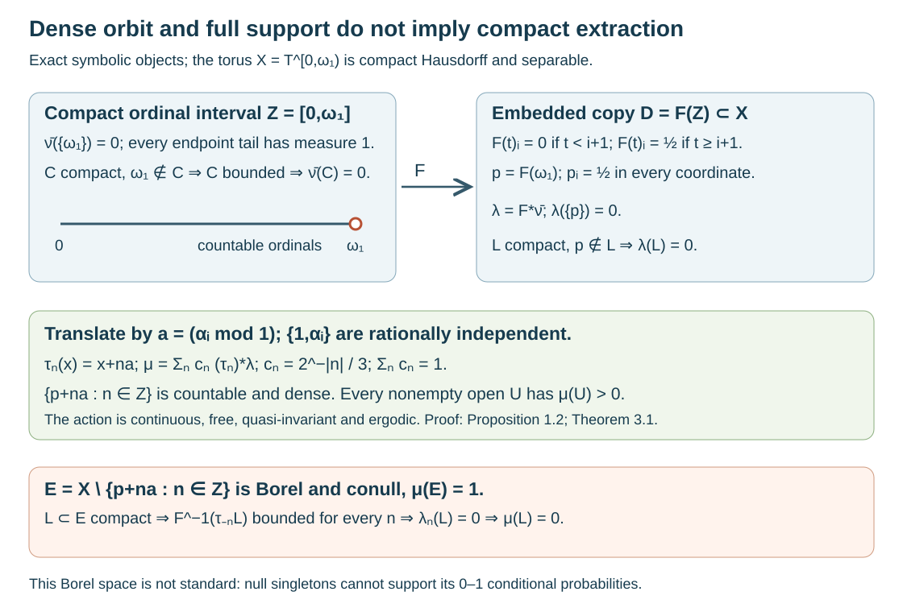

# Separable compact actions with nonregular measures

*Written by GPT-6.1 Sol (OpenAI), Ultra, October 2026. Author self-check in progress; not independently reviewed. New original text and diagram are public domain (CC0).*

## Introduction

A countable dense orbit is a strong topological countability property. It still does not make every finite Borel measure regular. This lesson constructs a compact Hausdorff space with a free continuous action of the countable group \(\mathbb Z\), a countable dense orbit, and an ergodic quasi-invariant probability of full support. A conull Borel subset contains no compact subset of positive measure. Even the measure algebra is separable. The underlying Borel space, however, is not countably separated and cannot be standard Borel.

This gives a complete obstruction to reading “countability, such as separability” as sufficient for compact extraction in Takesaki III, Exercise XIII.1.5(a). It does not settle the distinct reading that the exercise retains the chapter's standard measure-space hypothesis. The [regularity and wandering-neighborhood lesson](borel-carriers-and-uniform-wandering-neighborhoods.md) proves the regular case and the full measurable conclusion without regularity. Those proofs remain intact.

We use ordinary set theory with choice, the product topology, scalar integration, and compactness of the circle. The product compactness argument is given below. The club probability and compactness of the ordinal interval are proved in the preceding lesson, Example 4.2 and Solution 5.8; we state their exact scope below. The finite-torus density argument is supplied in full. No measurable selection or groupoid strictification theorem is used.

## 1. A separable compact torus with a free dense cyclic action

Write \(I=[0,\omega_1)\), where \(\omega_1\) is the first uncountable ordinal, and let \(\mathbb T=\mathbb R/\mathbb Z\). Choose real numbers \(\alpha_i\), \(i\in I\), such that

\[
 \{1\}\cup\{\alpha_i:i\in I\}
 \quad\text{is linearly independent over }\mathbb Q.
 \tag{1.1}
\]

Here is the existence argument. At stage \(i<\omega_1\), the preceding index set is countable. Its rational span together with \(1\) is countable: every member is a finite rational linear combination of a countable set. It cannot exhaust \(\mathbb R\). Transfinite recursion chooses \(\alpha_i\) outside this span. Every finite linear dependence would have a last chosen index, contradicting its choice.

Put

\[
 X=\mathbb T^I,\qquad
 a=(\alpha_i+\mathbb Z)_{i\in I},\qquad
 \tau_n(x)=x+na\quad(n\in\mathbb Z).
 \tag{1.2}
\]

Here is compactness of \(X\) at the choice input. A family of closed sets with the finite-intersection property generates a proper filter of subsets of \(X\). The maximal principle extends it to a maximal proper filter: unions of chains remain proper filters. Such a filter is an ultrafilter, since if a set cannot be adjoined, some existing filter member is disjoint from it, placing its complement in the filter. Push this ultrafilter through each coordinate projection. Compactness of the circle gives a limit \(x_i\) of the coordinate ultrafilter: the closures of its members have the finite-intersection property, hence have a common point; any neighborhood of that point belongs to the ultrafilter, since otherwise its closed complement would exclude the common point. Choose these limits for all coordinates. Each basic neighborhood of \(x=(x_i)\) restricts finitely many coordinates and belongs to the original ultrafilter by finite intersections. The ultrafilter therefore converges to \(x\). Each original closed filter member contains \(x\); otherwise its open complement is also in the convergent ultrafilter. Thus every closed family with the finite-intersection property intersects, which is compactness. Distinct product points differ in a coordinate, where circle neighborhoods separate them, proving Hausdorffness.

The group operations are continuous because every coordinate operation is continuous. Giving \(\mathbb Z\) its discrete topology makes \((n,x)\mapsto\tau_n(x)\) jointly continuous: its restriction to each open slice \(\{n\}\times X\) is a homeomorphism.

**Lemma 1.1 (finite-torus density).** If \(\beta_1,\ldots,\beta_m\) and \(1\) are rationally independent, then \(\{n\beta+\mathbb Z^m:n\ge0\}\) is dense in \(\mathbb T^m\).

*Proof.* For a nonzero \(k\in\mathbb Z^m\), \(k\cdot\beta\notin\mathbb Z\). The geometric-sum formula therefore gives

\[
 \frac1N\sum_{n=0}^{N-1}e^{2\pi i n k\cdot\beta}\longrightarrow0.
 \tag{1.3}
\]

For \(k=0\) the average is one. Thus the orbit average of any trigonometric polynomial tends to its integral for the product of ordinary length probabilities on \(\mathbb T\).

We supply the approximation step. On \(\mathbb T\), set

\[
 K_M(t)=\frac1M\left|\sum_{j=0}^{M-1}e^{2\pi ijt}\right|^2
 =\sum_{|k|<M}\left(1-\frac{|k|}{M}\right)e^{2\pi ikt}.
 \tag{1.4}
\]

It is nonnegative and has integral one; expanding the square and integrating the characters proves both statements and the finite expansion. If the circle distance from \(t\) to zero is at least \(\delta>0\), then
\(K_M(t)\le1/(M\sin^2(\pi\delta))\), for \(0<\delta\le1/2\), by the geometric sum. On \(\mathbb T^m\) use the product of these kernels. The integral of this product outside the coordinate box of radius \(\delta\) is at most \(m/(M\sin^2(\pi\delta))\), by a union bound and the unit integrals of the other factors. Uniform continuity now shows that convolution of any continuous \(f\) with the product kernel converges uniformly to \(f\): bound the change of \(f\) inside the box by its modulus of continuity, and the outside change by \(2\|f\|_\infty\) times that vanishing integral. Each convolution is a trigonometric polynomial by (1.4).

Uniform approximation and (1.3) imply that the orbit average of every continuous \(f\) tends to its integral. Given a nonempty basic open box, choose nonnegative continuous circle tent functions supported in its coordinate arcs and positive on smaller arcs. Their product has positive integral and is zero off the box. Its orbit average is eventually positive, so at least one orbit point belongs to the box. Every nonempty open set contains such a box. This proves density. \(\square\)

**Proposition 1.2.** The action (1.2) is free, and every orbit is countable and dense. In particular \(X\) is separable.

*Proof.* A nonempty basic open subset of \(X\) restricts finitely many coordinates. Lemma 1.1 and (1.1) show that some \(na\) belongs to it. Hence the cyclic subgroup is dense. Translating it by any \(x\) preserves density. If \(\tau_n(x)=x\), then \(n\alpha_0\in\mathbb Z\). Independence with \(1\) forces \(n=0\). Thus every stabilizer is trivial. Any one orbit is a countable dense subset, which is exactly topological separability. \(\square\)

## 2. A null endpoint with all its neighborhoods of measure one

Let \(Z=[0,\omega_1]\) with its order topology, and \(Y=[0,\omega_1)\). The exact ordinal result from the preceding lesson is:

**Imported ordinal probability 2.1.** The interval \(Z\) is compact Hausdorff. Every Borel subset \(B\subset Y\) either contains a closed unbounded subset of \(Y\), called a club, or has a complement containing a club. These alternatives are exclusive. Assigning values one and zero accordingly defines a countably additive Borel probability \(\nu\) on \(Y\). Every bounded Borel subset is null. Its extension

\[
 \bar\nu(B)=\nu(B\cap Y),\qquad B\subset Z\text{ Borel},
 \tag{2.1}
\]

gives \(\bar\nu(\{\omega_1\})=0\), while every neighborhood of \(\omega_1\) has measure one. Every compact subset of \(Z\) avoiding \(\omega_1\) is bounded and null.

The full proof is in [Example 4.2 and Solution 5.8](borel-carriers-and-uniform-wandering-neighborhoods.md#4-exact-examples-and-the-regularity-boundary). Its countable-club intersection argument proves the Borel dichotomy and countable additivity; the finite-subcover argument bounds compact subsets of \(Y\). In particular (2.1) is defined on all Borel subsets of the compact interval, not merely its Baire sets.

Define \(F:Z\to X\) coordinatewise by

\[
 F(t)_i=
 \begin{cases}
 0+\mathbb Z,&t<i+1,\\
 \tfrac12+\mathbb Z,&t\ge i+1,
 \end{cases}
 \qquad p=F(\omega_1).
 \tag{2.2}
\]

**Lemma 2.2.** The map \(F\) is a continuous embedding with compact image \(D=F(Z)\).

*Proof.* Each coordinate is continuous: \([0,i]\) and \([i+1,\omega_1]\) are complementary clopen subsets of \(Z\). Continuity of all coordinates is continuity into the product. If \(t<u\), then \(t<\omega_1\); coordinate \(i=t\) is zero at \(t\) and one half at \(u\). Thus \(F\) is injective. A continuous injection from a compact space into a Hausdorff space is an embedding: it takes closed subsets to compact, hence closed, subsets of its image. Its image is compact and closed in \(X\). \(\square\)

Let \(\lambda=F_*\bar\nu\). This is a Borel probability, since \(F\) is continuous. It takes only values zero and one, is carried by \(D\), and gives every singleton measure zero. In particular \(\lambda(\{p\})=0\), but every neighborhood of \(p\) has measure one. If \(L\subset X\) is compact and \(p\notin L\), then \(F^{-1}(L)\) is a compact subset of \(Z\) avoiding \(\omega_1\), so

\[
 \lambda(L)=0.
 \tag{2.3}
\]

The measure is not supported in the usual measure-theoretic sense on the singleton \(\{p\}\). That singleton is null. Its **topological** support is \(\{p\}\): outside \(D\), use the open complement of \(D\); at \(F(t)\), \(t<\omega_1\), choose a neighborhood whose intersection with \(D\) pulls back to a bounded neighborhood of \(t\). The relative neighborhood can be extended to an open set of \(X\), and has measure zero. This distinction is the mechanism behind the example.

*Figure 1.* Exact symbolic diagram, not a finite-dimensional picture of \(X\). The coordinate formula is (2.2); \(p_i=1/2\) for every \(i\). The countable endpoint orbit is dense by Proposition 1.2. In Theorem 3.1, its removal leaves a conull Borel \(E\), while the pullback of each compact \(L\subset E\) is bounded in every translated ordinal copy. The weights are exactly \(c_n=2^{-|n|}/3\). Proof locators: Lemma 2.2, equation (2.3), Theorem 3.1. The ordinal measure is the full construction in the preceding lesson, Example 4.2. Original artwork.

## 3. Full support, quasi-invariance and ergodicity without compact extraction

Set

\[
 \lambda_n=(\tau_n)_*\lambda,\qquad
 c_n=\frac{2^{-|n|}}3,\qquad
 \mu(B)=\sum_{n\in\mathbb Z}c_n\lambda_n(B).
 \tag{3.1}
\]

**Theorem 3.1.** The probability \(\mu\) is a finite Borel measure on the separable compact Hausdorff space \(X\). The action of \(\mathbb Z\) is continuous, free, quasi-invariant and ergodic, and \(\mu\) has full topological support. Nevertheless the Borel set

\[
 E=X\setminus\{\tau_n(p):n\in\mathbb Z\}
 \tag{3.2}
\]

satisfies

\[
 \mu(E)=1,\qquad
 \mu(L)=0\quad\text{for every compact }L\subset E.
 \tag{3.3}
\]

*Proof.* Every \(\lambda_n\) is a Borel probability. Nonnegative double sums may be exchanged, so their positive weighted sum is countably additive. The weights sum to
\(\frac13(1+2\sum_{n\ge1}2^{-n})=1\), proving that \(\mu\) is a probability. Proposition 1.2 already supplies separability, continuity and freeness.

Because all weights are strictly positive, a Borel \(B\) is \(\mu\)-null exactly when every \(\lambda_n(B)=0\). The identity

\[
 \lambda_n(\tau_k B)=\lambda_{n-k}(B)
 \tag{3.4}
\]

shows that translations preserve this null ideal in both directions. This is quasi-invariance.

If \(B\) is exactly invariant under every \(\tau_n\), then \(\lambda_n(B)=\lambda(B)\) for every \(n\). Hence \(\mu(B)=\lambda(B)\in\{0,1\}\). The same assertion holds for invariance modulo \(\mu\)-null sets: such differences are also \(\lambda\)-null, so the same equalities follow. Thus the action is ergodic under either convention.

For full support, let \(U\) be nonempty and open. Density of the endpoint orbit supplies \(n\) with \(\tau_n(p)\in U\). Then \(\tau_{-n}U\) is a neighborhood of \(p\), and its inverse image under \(F\) is a neighborhood of \(\omega_1\). Imported ordinal probability 2.1 gives \(\lambda_n(U)=1\). Therefore \(\mu(U)\ge c_n>0\).

Every singleton is null for every \(\lambda_n\), hence for \(\mu\). The removed orbit is countable and Borel, so (3.2) is Borel and conull. If \(L\subset E\) is compact, then \(\tau_{-n}L\) is compact and omits \(p\) for each \(n\). Equation (2.3) gives \(\lambda_n(L)=0\). Summing proves (3.3). \(\square\)

Thus even before requiring \(\tau_1L\cap L=\varnothing\), there is no positive compact \(L\subset E\). All the explicit topological, freeness, finite-Borel, quasi-invariant, ergodic and full-support assumptions hold, together with separability of both \(X\) and \(G\). They do not imply compact extraction. The full measurable wandering result from the preceding lesson remains valid for this example.

## 4. A separable measure algebra on a nonstandard Borel space

Write \(D_n=\tau_nD\). These are compact Borel subsets of \(X\).

**Proposition 4.1.** The sets \(D_n\) are pairwise disjoint and are atoms of the measure algebra, with \(\mu(D_n)=c_n\). Their union is conull. Consequently

\[
 L^\infty(X,\mu)\cong\ell^\infty(\mathbb Z),\qquad
 L^2(X,\mu)\cong\ell^2(\mathbb Z,c),
 \tag{4.1}
\]

and the induced algebra action is the bilateral shift. In particular the measure algebra and \(L^2\) are separable, although every point of \(X\) is null.

*Proof.* If \(D_n\) and \(D_m\) meet, their zeroth coordinates imply
\((n-m)\alpha_0\in\mathbb Z+\{0,1/2,-1/2\}\). For \(n\ne m\), multiplying by two contradicts (1.1). Hence they are disjoint. The probability \(\lambda_j\) is carried by \(D_j\), so \(\lambda_j(D_n)=1\) for \(j=n\) and zero otherwise. This proves \(\mu(D_n)=c_n\), and their union is conull.

For a Borel \(B\subset D_n\), \(\mu(B)=c_n\lambda_n(B)\) is either zero or \(c_n\), so \(D_n\) is an atom. A completed-measurable subset has a Borel representative modulo null sets and has the same dichotomy. Every measurable set is, modulo a null set, the union of exactly those \(D_n\) on which it has full measure. Indeed the discrepancy is null on every \(D_n\), and these countably many sets carry \(\mu\).

A measurable scalar function is constant almost everywhere on each atom. One can verify this without assuming that an atom is a point: partition the real line into half-open dyadic intervals of length \(2^{-j}\). For a finite real-valued measurable function, exactly one interval has full conditional probability at each level, and these intervals are nested. Their closures have a unique common point. The function equals that value almost everywhere after a countable null removal. Apply this to real and imaginary parts. Thus a function corresponds to its constants \(b_n\), with essential norm \(\sup_n|b_n|\) and squared \(L^2\) norm \(\sum_n c_n|b_n|^2\). This proves (4.1), including onto maps supplied by functions constant on each \(D_n\). Outside their union assign zero.

Translation sends \(D_n\) to \(D_{n+k}\). Under \(\alpha_kf=f\circ\tau_{-k}\), the constants become \((\alpha_kb)_n=b_{n-k}\). Finitely supported rational complex sequences are dense in \(\ell^2(\mathbb Z,c)\). Finite unions of the atoms are dense for the measure-algebra metric \(d(A,B)=\mu(A\mathbin\triangle B)\), since the weight tails tend to zero. This proves both separability assertions. \(\square\)

**Proposition 4.2.** The Borel space \((X,\mathcal B(X))\) is not countably separated; in particular it is not standard Borel. No conull measurable subspace is countably separated either.

*Proof.* Suppose Borel sets \(B_j\) separated all points. Since \(\lambda\) takes only values zero and one, choose for each \(j\) either \(B_j\) or its complement, denoted \(C_j\), with \(\lambda(C_j)=1\). Their intersection has measure one by countable additivity. All its points have the same membership pattern in the separating family, so it has at most one point. Every singleton is \(\lambda\)-null, a contradiction.

For the stronger assertion, let \(H\) be conull and suppose its relative measurable structure has a countable separating family. Because \(c_0>0\), \(\mu(X\setminus H)=0\) implies \(\lambda(X\setminus H)=0\). The probability \(\lambda\) extends to the \(\mu\)-completion: a \(\mu\)-null set is \(\lambda\)-null, so evaluating a Borel representative is well defined. Its restriction to \(H\) still takes only values zero and one and has null singletons. Apply the same countable-intersection argument to the relative separating sets. The intersection again has probability one and at most one point. This is impossible. A standard Borel space has a countable separating family obtained from a countable base of its Polish realization, so neither \(X\) nor such an \(H\) can be standard Borel. \(\square\)

This distinguishes a separable measure algebra from a standard measured space realized on points. The algebra (4.1) has an atomic standard model on \(\mathbb Z\). That algebra isomorphism cannot be implemented by a bijection of conull measurable point spaces here: a conull singleton atom in the countable model would have to correspond to a singleton of positive measure, while all our singletons are null. It is not permissible to replace the topology by that countable model when asking for compact subsets of the original \(E\).

## 5. Exercises with complete solutions

Level 1 asks for an exact calculation; Level 2 for one mechanism's proof; Level 3 combines the measure and topology.

**Exercise 5.1.** *Level 2.* Show that \(X\) is not first countable at \(p\), despite its countable dense orbit.

*Solution.* The embedded subspace \(D\) is homeomorphic to \([0,\omega_1]\). At \(\omega_1\), every neighborhood contains a tail \((\beta,\omega_1]\). If a countable neighborhood base existed, choose one such bound \(\beta_j\) for each member. Their supremum is countable. Choose \(\gamma<\omega_1\) beyond every \(\beta_j+1\). The neighborhood \((\gamma,\omega_1]\) contains no base member: each such member contains a point strictly between its bound and \(\gamma\). This contradicts the base property. First countability passes to subspaces, so \(X\) cannot be first countable at \(p\). Separability concerns density and does not supply a countable neighborhood base.

**Exercise 5.2.** *Level 1.* Compute \(\mu(D_{-2})\), \(\mu(D_0)\), and \(\mu(D_2)\). Find the derivative \(d((\tau_k)_*\mu)/d\mu\) on each atom, and its exact bounds for \(k=1\).

*Solution.* The masses are \(1/12,1/3,1/12\). On \(D_n\), the pushforward by \(\tau_k\) has mass \(c_{n-k}\), so its derivative is \(c_{n-k}/c_n=2^{|n|-|n-k|}\). This is a positive measurable function on the conull union of the atoms and may be set to one elsewhere. For \(k=1\), it is \(2\) when \(n\ge1\) and \(1/2\) when \(n\le0\). Its integral is \(\sum_n c_{n-1}=1\). In general the triangle inequality bounds it between \(2^{-|k|}\) and \(2^{|k|}\). The calculation also proves quasi-invariance directly.

**Exercise 5.3.** *Level 3.* Prove that no compact subset of the conull set \(E\) can have positive measure, and explain why compactness of \(X\) itself is no contradiction.

*Solution.* For compact \(L\subset E\), each \(\tau_{-n}L\) is compact and misses \(p\). Its inverse image under \(F\) is compact in \([0,\omega_1]\) and misses the endpoint. It is therefore bounded, giving \(\lambda_n(L)=0\). The positive weighted sum is zero. The whole \(X\) has measure one and is compact, but it contains every removed endpoint \(\tau_n(p)\). Inner regularity asks for compact subsets inside the specified Borel \(E\); an outer ambient compact set cannot supply them.

**Exercise 5.4.** *Level 2.* Give a Borel set of positive measure that is disjoint from every nonzero translate. Use it to verify the compact projection condition for the action on \(L^\infty(X,\mu)\).

*Solution.* The set \(D_0\) is compact, has measure \(1/3\), and \(\tau_kD_0=D_k\) is disjoint from it for every nonzero \(k\). For an arbitrary nonzero projection, Proposition 4.1 represents it by a nonempty set of atoms. Choose one atom \(D_n\) contained in it modulo null sets; its indicator is a nonzero subprojection. It is orthogonal to all its nonzero translates, and therefore to the translates indexed by every compact subset of \(\mathbb Z\setminus\{0\}\). Such compact subsets are finite because the group is discrete. The action on the algebra is free. For the actual conull \(E\), a measurable positive wandering subset is \(D_0\cap E\); it cannot be compact by (3.3). Thus algebraic freeness does not repair compact extraction inside every given Borel set.

**Exercise 5.5.** *Level 3.* Prove that separability of \(L^2(X,\mu)\) does not give a countable family of measurable sets separating points on a conull subspace in this example.

*Solution.* Proposition 4.1 identifies \(L^2\) with the weighted sequence Hilbert space, whose finitely supported rational complex vectors form a countable dense set. Nevertheless a conull \(H\) has conditional \(\lambda\)-probability one. If a countable relative measurable family separated its points, choose the probability-one side of each separator. Their intersection has conditional probability one, while the membership patterns force at most one point. Such a singleton has probability zero. The two separability notions are therefore different even after all null subsets allowed by completion have been removed.

**Exercise 5.6.** *Level 2.* Let \(h:X\to S\) be Borel, where \(S\) is a nonempty standard Borel space. Prove that \(h\) is constant \(\lambda\)-almost everywhere. Explain why this rules out an injective Borel map of \(X\) into a standard Borel space.

*Solution.* Choose a countable Borel family separating points of \(S\). For each inverse image choose its \(\lambda\)-probability-one side. The intersection \(H\) of those sides has probability one, hence is nonempty. All values \(h(x)\), \(x\in H\), have the same membership pattern and so are the same point of \(S\). This proves almost-everywhere constancy. If \(h\) were injective, \(H\) would contain at most one point, contradicting its probability one and the nullity of every singleton. This uses point separation in the target and countable additivity, with no topology imposed on its Borel realization.

## 6. Exact source scope and remaining obligations

The source's exercise block says “countability condition, such as separability” before Exercise XIII.1.5. Exercise 5 explicitly specifies a locally compact transformation group, a free point action, a finite ergodic quasi-invariant Borel measure and full support; it requests a positive compact subset of every positive Borel \(E\). Theorem 3.1 meets all those written topological and measure properties, including separability of both group and space, and disproves compact extraction at that interpretation. Proposition 4.1 additionally shows that merely adding separability of the measure algebra or its \(L^2\) does not suffice.

The chapter's earlier standard measure-space convention is a separate issue. Proposition 4.2 proves that this example fails it even modulo conull subspaces. Accordingly this lesson does not claim to refute the standard Borel reading of Exercise 5, nor to close its remaining source parent or the exercise-block aggregate. The positive compact-extraction theorem under Radon regularity or the earlier countable compact-approximation hypothesis remains complete. The measurable conclusion of part (c) remains proved at the finite ergodic full-support scope without regularity. The distinction is now supported by a full free, ergodic, separable, full-support example rather than the ordinal probability alone.

- [Takesaki III] Masamichi Takesaki, *Theory of Operator Algebras III*, Encyclopaedia of Mathematical Sciences 127, Springer, 2003. Exercise XIII.1.5(a)–(c), printed 11–12/PDF 31–32, and the exercise-block countability convention. The selected exercise statements and countability convention were compared with these pages. That comparison does not complete a review of this lesson's wording and arrangement against all its sources. [Publisher record](https://doi.org/10.1007/978-3-662-10453-8).
- [OA-ERGODIC ordinal prerequisite] *Borel carriers and uniform wandering neighborhoods*, Example 4.2 and Solution 5.8: full club probability, compact ordinal interval and bounded compact-subset proofs. The exact existing owned text was compared. Its regularity Theorem 1.2 and measurable wandering Theorem 3.2 retain their stated hypotheses.

The torus construction, density proof, weighted action and six solutions are original course exposition, with no novelty claim. The standing standard Borel application is proved in [Orbit averaging and the modular weight bridge](orbit-averaging-and-the-modular-weight-bridge.md), Theorem 1.1 and Corollary 5.2, [Spectral necessity and modular transfer](spectral-necessity-and-modular-transfer.md), Theorems 3.1 and 5.3, and [Almost-homomorphisms on measured groupoids](almost-homomorphisms-on-measured-groupoids.md), Theorem 1.1. These supported proofs retain their explicit normal-module, spatial-weight, scalar density and modular commutation inputs. The atomless standard-measure compact-extraction question, the broader existential two-copy parent and final full-course audit remain open.
