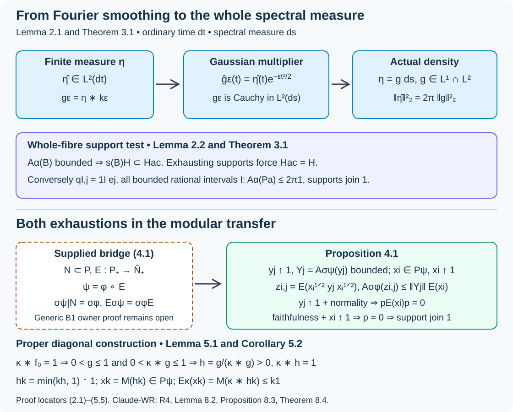

# Spectral necessity and modular transfer

*Written by GPT-6.1 Sol (OpenAI), Ultra, October 2026. Self-checked by the writing AI. New original expression is public domain (CC0).*

An inner action on a type I algebra is integrable exactly when its entire spectral measure is absolutely continuous. For random-operator algebras, passing to that type I algebra uses a modular operator-valued-weight bridge. We prove the subsequent Fourier, transfer and diagonal-cutoff arguments in full, and identify precisely what that bridge must supply. In particular, the diagonal converse uses cutoffs increasing to the identity; a merely increasing finite-domain family is insufficient.

[Orbit averaging and the modular weight bridge](orbit-averaging-and-the-modular-weight-bridge.md), Theorem 1.1, now supplies the scalar composition and modular compatibility required here for the standing standard Borel groupoid application. Its Corollary 5.2 identifies the subsequent application; general OA-MOD existence retains its separate owner scope.

## 1. Standing inputs and the integrability criterion

Use ordinary Lebesgue time \(dt\). For a point-ultraweakly continuous action \(\alpha:\mathbb R\to\operatorname{Aut}(P)\), write
\[
\mathcal A_\alpha(B)=\int_{\mathbb R}\alpha_t(B)dt\quad(B\in P_+).
\tag{1.1}
\]
The integral is an extended positive form, evaluated on normal positive functionals. Its bounded domain is a hereditary cone. Integrability means that the linear span of this cone is sigma-weakly dense. Throughout, algebras have separable predual. [Integrable centralizers and spectral intertwiners](integrable-centralizers-and-spectral-intertwiners.md), Lemma 2.1 and its converse, proves the equivalent support criterion and constructs positive contractions \(y_n\uparrow1\) with bounded averages. We use that complete proof, including the zero-algebra case.

Our scalar prerequisites are sigma-finite kernel and product integration, finite complex measures and their uniqueness, scalar Lebesgue decomposition, and real Plancherel theory with
\[
\widehat f(t)=\int e^{its}f(s)ds,
\qquad \int|\widehat f(t)|^2dt=2\pi\int|f(s)|^2ds.
\tag{1.2}
\]
The exact complete Plancherel import is OA-MOD-PF-18–22 and PF-25, compared in the spectral-coordinate lesson. Lemma 2.1 below supplies the additional finite-measure Fourier assertion; it is not imported from a citation to harmonic analysis. Measurable separable Hilbert fields and their direct integrals retain the exact background of the joint spectral chart lesson. For normal weights, we retain the extended-positive integration rule: a normal positive weight is evaluated by its positive-functional decomposition, and nonnegative kernel integrals commute with this evaluation by Tonelli. This scalar-weight and extended-cone foundation is an input, not a new generic modular construction.

Let \(Y\) be standard Borel, \(\mu\) sigma-finite, \(H_y\) a measurable separable Hilbert field, and \(A_y\) a measurable self-adjoint field. On

\[
P=\int_Y^\oplus B(H_y)d\mu(y),\qquad
\alpha_t(B)_y=e^{itA_y}B_ye^{-itA_y},
\tag{1.3}
\]
the action is normal and point-ultraweakly continuous: the direct-integral unitaries are strongly continuous by fibre continuity and dominated convergence. The whole spectral measure of \(A_y\) is absolutely continuous when every Lebesgue-null Borel set has zero spectral projection. This is stronger than finding one absolutely continuous vector.

## 2. A finite-measure Fourier test

**Lemma 2.1.** A finite complex Borel measure \(\eta\) on \(\mathbb R\) has \(\widehat\eta\in L^2(dt)\) if and only if \(\eta=g(s)ds\) with \(g\in L^2(ds)\). In this case \(g\in L^1(ds)\) and (1.2) gives the exact norm equality.

*Proof.* Put \(k_\varepsilon(s)=(2\pi\varepsilon)^{-1/2}e^{-s^2/(2\varepsilon)}\). The Gaussian integral, squared and computed in polar coordinates, gives \(\int e^{-s^2/(2\varepsilon)}ds=\sqrt{2\pi\varepsilon}\). Differentiation of its transform and integration by parts give \(\widehat k_\varepsilon'(t)=-\varepsilon t\widehat k_\varepsilon(t)\), while \(\widehat k_\varepsilon(0)=1\); hence
\[
\widehat k_\varepsilon(t)=e^{-\varepsilon t^2/2}.
\tag{2.1}
\]
Let \(g_\varepsilon=\eta*k_\varepsilon\). Fubini gives \(\|g_\varepsilon\|_1\le|\eta|(\mathbb R)\). Cauchy–Schwarz against \(|\eta|\), followed by Tonelli, gives \(\|g_\varepsilon\|_2\le|\eta|(\mathbb R)\|k_\varepsilon\|_2\). Thus \(g_\varepsilon\in L^1\cap L^2\), and another Fubini calculation gives \(\widehat g_\varepsilon=\widehat\eta\,e^{-\varepsilon t^2/2}\).

If \(\widehat\eta\in L^2\), dominated convergence and Plancherel show that \(g_\varepsilon\) is Cauchy in \(L^2\) as \(\varepsilon\downarrow0\). Let its limit be \(g\in L^2\). For \(f\in C_c(\mathbb R)\), symmetry of the Gaussian gives
\[
\int f(s)g_\varepsilon(s)ds
=\int(f*k_\varepsilon)(u)d\eta(u)\longrightarrow\int f(u)d\eta(u).
\tag{2.2}
\]
Here \(f*k_\varepsilon\to f\) uniformly: split the convolution into \(|s|<r\), controlled by uniform continuity, and its complement, whose Gaussian mass tends to zero. On the left, \(L^2\) convergence and \(f\in L^2\) give the limit \(\int fg\,ds\). Uniqueness of locally finite complex measures tested by \(C_c\) therefore gives \(\eta=gds\) on every bounded interval, hence on \(\mathbb R\). Its finite total variation implies \(\int|g|ds=|\eta|(\mathbb R)<\infty\). Conversely, this \(L^1\cap L^2\) density has \(L^2\) transform by Plancherel; its transform is exactly that of \(\eta\). The same theorem gives the norm equality. \(\square\)

**Lemma 2.2 (one fibre).** For a self-adjoint \(A\) on a separable \(H\), let \(H_{\rm ac}\) be its absolutely continuous spectral subspace. If \(B\ge0\) has bounded orbit average under \(\operatorname{Ad}e^{itA}\), then \(s(B)H\subset H_{\rm ac}\). If a vector \(a\) has spectral density \(w_a\le N\), then
\[
\mathcal A_\alpha(P_a)\le2\pi N1,\qquad P_a=|a\rangle\langle a|.
\tag{2.3}
\]

*Proof.* First make \(H_{\rm ac}\) precise. A countable total vector family \(v_j\) gives the finite control measure \(\eta_0=\sum_j2^{-j}(1+\|v_j\|^2)^{-1}\langle E_A(\cdot)v_j,v_j\rangle\). A Borel set has zero \(\eta_0\)-measure exactly when its spectral projection is zero. In the Lebesgue decomposition of \(\eta_0\), choose a Lebesgue-null set \(D\) supporting its singular part. Then \(H_{\rm ac}=(1-E_A(D))H\): all spectral measures on this subspace are absolutely continuous, whereas every nonzero vector in \(E_A(D)H\) has a nonzero singular spectral measure. This also proves that the subspace is independent of the choices.

If \(a_s=E_A(D)a\ne0\), choose the test vector \(a_s\). The coefficient \(\langle e^{itA}a,a_s\rangle\) is the Fourier transform, up to the harmless inner-product sign convention, of the nonzero positive singular spectral measure of \(a_s\). Lemma 2.1 makes its squared time integral infinite. Thus bounded \(\mathcal A_\alpha(P_a)\) forces \(a\in H_{\rm ac}\). For a positive \(B\) and an orthonormal basis \(e_j\), set \(a_j=B^{1/2}e_j\). Each \(P_{a_j}\le B\), and \(B=\sum_jP_{a_j}\) strongly. Bounded averaging forces every \(a_j\in H_{\rm ac}\). Their closed span is \(s(B)H\), proving the first assertion.

For (2.3), project an arbitrary test vector \(\zeta\) onto \(H_{\rm ac}\); this does not change its cross spectral measure with \(a\). The \(2\times2\) matrix of spectral measures of \(a,\zeta_{\rm ac}\) is positive. Take its scalar densities and test positivity on countably many rational complex vectors. Its density matrix is positive almost everywhere, so the cross density \(g\) satisfies \(|g|^2\le w_aw_{\zeta_{\rm ac}}\). Hence \(\int|g|^2ds\le N\|\zeta\|^2\). Lemma 2.1 and (1.2) now give

\[
\langle\mathcal A_\alpha(P_a)\zeta,\zeta\rangle
=\int|\langle e^{itA}a,\zeta\rangle|^2dt
\le2\pi N\|\zeta\|^2.
\tag{2.4}
\]
This proves the operator bound for every test vector. \(\square\)

## 3. The full measurable type I criterion

**Theorem 3.1.** The action (1.3) is integrable if and only if the whole spectral measure of \(A_y\) is absolutely continuous for \(\mu\)-almost every \(y\).

*Proof of necessity.* Take exhausting positive contractions \(y_n\uparrow1\) with bounded averages, using the complete criterion in Section 1. For each \(n\), Tonelli and the field formula give the integral of the fibre orbit quadratic forms. Countably many rational combinations of a Borel orthonormal basis, localized on finite-measure base sets, show that the fibre average of \(y_{n,y}\) has the same finite uniform bound almost everywhere. Indeed a violation on a positive-measure set, restricted to a finite-measure base piece, gives a Hilbert-integral test vector contradicting the global bound. Fatou extends the rational tests to all vectors.

Intersect these conull sets over \(n\), and also the conull set on which \(y_{n,y}\uparrow1\) strongly. The latter follows from pointwise order, existence of the fibre limit, and equality of its direct integral to the global strong limit \(1\). Lemma 2.2 puts every support \(s(y_{n,y})\) below the absolutely continuous spectral projection. Their join is \(1\); hence that spectral projection is \(1\). No jointly measurable choice of singular spectral sets is required.

*Proof of sufficiency.* Restrict to a Borel conull base where the whole spectral measures are absolutely continuous. The complete joint spectral chart theorem gives Borel \(K_{(y,s)}\) and measurable fibre unitaries

\[
J_y:H_y\longrightarrow\int_{\mathbb R}^\oplus K_{(y,s)}ds,
\qquad J_yA_yJ_y^*=M_s.
\tag{3.1}
\]
Choose its Borel orthonormal coordinate sections \(e_j(y,s)\), zero above the fibre dimension. For every bounded interval \(I\) with rational endpoints and every \(j\), put \(q^{I,j}(y,s)=\mathbf1_I(s)e_j(y,s)\), and \(a^{I,j}_y=J_y^*q^{I,j}_y\), zero on the discarded base. These are Borel sections with \(\|a^{I,j}_y\|^2\le|I|\); their rank-one fields therefore belong to the bounded algebra \(P\).

The coefficient calculation on (3.1), with ordinary-time Plancherel, gives

\[
\mathcal A_\alpha(P_{a^{I,j}})_y
=2\pi J_y^*M_{q^{I,j}(y,s)q^{I,j}(y,s)^*}J_y
\le2\pi1.
\tag{3.2}
\]
For completeness, for \(\zeta\in L^2(K_y)\), the scalar function \(\langle q^{I,j}(y,s),\zeta(s)\rangle\) lies in both \(L^1\) and \(L^2\): it is supported on \(I\), and its modulus is at most \(\|\zeta(s)\|\). Its transform is the orbit coefficient. Equation (1.2) proves (3.2) as an exact quadratic-form identity; Tonelli gives the global identity.

This countable vector family is total in every good \(H_y\). If a spectral vector is orthogonal to all \(q^{I,j}_y\), its locally integrable \(j\)th coordinate has integral zero on every bounded rational interval. On each bounded interval, uniqueness of finite complex measures makes that coordinate zero almost everywhere. Countability over \(j\) gives the zero vector. Therefore the supports of these bounded-average rank-one fields have join \(1\) in \(P\). The support criterion proves integrability. Zero-dimensional fibres cause no exception. \(\square\)

The rational intervals in this proof matter. Only the intervals \([-n,n]\) and constant coordinate vectors need not be total: for a scalar fibre, every odd compactly supported function is orthogonal to that smaller family.

## 4. Transfer across a supplied modular bridge

Let \(N\subset P\) be unital, \(E:P_+\to\widehat N_+\) a faithful normal semifinite operator-valued weight, \(\varphi\) a faithful normal semifinite weight on \(N\), and \(\psi=\varphi\circ E\). Supply the exact two identities

\[
\sigma_t^\psi|_N=\sigma_t^\varphi,
\qquad E\circ\sigma_t^\psi=\sigma_t^\varphi\circ E.
\tag{4.1}
\]
For an unrestricted operator-valued weight, establishing these identities is the B1 owner obligation. The proof below uses them as inputs.

**Proposition 4.1 (both directions of transfer).** Integrability of \(\sigma^\varphi\) implies integrability of \(\sigma^\psi\). The converse holds if there are positive \(x_i\in P_\psi\), increasing strongly to \(1\), with \(E(x_i)\) bounded for every \(i\).

*Proof.* In the forward direction take bounded-average positive contractions \(y_n\uparrow1\) in \(N\). The first identity in (4.1) identifies their orbit integrals in \(N\) and \(P\). The same uniform bounds and strong exhaustion hold in the inclusion, so the support criterion makes \(\sigma^\psi\) integrable.

For the converse choose bounded-average positive contractions \(y_j\uparrow1\) in \(P\), and write \(Y_j=\mathcal A_{\sigma^\psi}(y_j)\). Put

\[
z_{i,j}=E(x_i^{1/2}y_jx_i^{1/2})\le\|y_j\|E(x_i)\in N_+.
\tag{4.2}
\]
Since \(x_i\) is in the centralizer, (4.1) and bimodularity give

\[
\mathcal A_{\sigma^\varphi}(z_{i,j})
=E(x_i^{1/2}Y_jx_i^{1/2})
\le\|Y_j\|E(x_i).
\tag{4.3}
\]
The equality is in the extended cone. Evaluate it on an arbitrary \(\omega\in N_*^+\), decompose the normal positive weight \(\omega\circ E\) into positive functionals as in Section 1, and apply Tonelli to the nonnegative time integrands. This justifies moving the time integral through \(E\), including an unbounded \(E\); its value here is bounded by the right side. Thus every \(z_{i,j}\) has bounded orbit average.

Let \(p\in N\) be a projection orthogonal to all their supports. For each fixed \(i\), normality and \(y_j\uparrow1\) give \(pE(x_i)p=\sup_jpz_{i,j}p=0\). Bimodularity yields \(E(px_ip)=0\). Faithfulness gives \(px_ip=0\). Taking \(i\uparrow\) and \(x_i\uparrow1\) yields \(p=0\). Consequently the supports of all \(z_{i,j}\) have join \(1\); the support criterion proves integrability of \(\sigma^\varphi\). This support argument uses both exhaustions, not just the bound (4.3). \(\square\)

The conclusion fails without exhaustion. The spectral-coordinate lesson gives a faithful normal semifinite \(E\) and an integrable \(\sigma^\psi\), while \(\sigma^\varphi\) is not integrable; the identically zero \(x_i\) satisfy every remaining listed cutoff condition. That complete counterexample is retained.

## 5. Proper diagonal cutoffs and the groupoid application

Let \(G\rightrightarrows X\) be standard Borel, with a faithful proper transverse kernel \(\kappa\). Let \(F\) be a Borel \(G\)-space, with projection \(\pi:F\to X\), and suppose a nonnegative Borel \(f_0\) satisfies

\[
(\kappa*f_0)(z):=\int f_0(\gamma^{-1}z)d\kappa^{\pi(z)}(\gamma)=1
\quad(z\in F).
\tag{5.1}
\]
This is the supplied properness certificate in Claude-WR, R4. The measurable-space and measure-functor theory behind that certificate remains declared background. The next argument derives strict positivity from the certificate and the proper arrow kernel.

**Lemma 5.1 (a strictly positive normalizer).** There is a finite-valued Borel \(h>0\) on all \(F\) with \(\kappa*h=1\).

*Proof.* Choose symmetric Borel \(C_a\uparrow G\) with \(\sup_x\kappa^x(C_a)\le M_a<\infty\), by intersecting a proper exhaustion with its inverse. Set \(v=\min(f_0,1)\) and

\[
g_a(z)=\int\mathbf1_{C_a}(\gamma)v(\gamma^{-1}z)d\kappa^{\pi(z)}(\gamma),
\qquad g=\sum_{a\ge1}\frac{2^{-a}}{1+M_a}g_a.
\tag{5.2}
\]
Kernel integration makes these Borel, \(0\le g_a\le M_a\), and \(0\le g\le1\). At every \(z\), (5.1) gives a positive-kernel-measure set on which \(f_0(\gamma^{-1}z)>0\), hence \(v(\gamma^{-1}z)>0\). The exhaustion therefore makes some \(g_a(z)>0\), so \(g(z)>0\).

We also need a finite orbit average. In the double integral for \(\kappa*g_a\), write \(\beta=\gamma\eta\), using left invariance to replace \(\eta\in G^{s\gamma}\) by \(\beta\in G^{\pi(z)}\). Tonelli gives

\[
\begin{aligned}
(\kappa*g_a)(z)
&=\int v(\beta^{-1}z)
\left(\int\mathbf1_{C_a}(\gamma^{-1}\beta)d\kappa^{\pi(z)}(\gamma)\right)
d\kappa^{\pi(z)}(\beta)\\
&\le M_a(\kappa*v)(z)\le M_a.
\end{aligned}
\tag{5.3}
\]
Indeed \(\gamma\mapsto\beta^{-1}\gamma\) is a left transport to \(G^{s\beta}\); symmetry of \(C_a\) makes the inner integral \(\kappa^{s\beta}(C_a)\le M_a\). Thus \(\kappa*g\le1\). It is also strictly positive everywhere, since \(g>0\) and every kernel fibre is nonzero. Left invariance makes \(\kappa*g\) invariant under the \(G\)-action. Therefore \(h=g/(\kappa*g)\) is Borel, finite and strictly positive, and the invariant denominator can be pulled out of its orbit integral. It gives \(\kappa*h=1\) at every point. No invariant probability kernel or finite arrow fibres were assumed. \(\square\)

**Corollary 5.2 (the actual exhaustion).** Suppose \(H_x=L^2(F_x,\alpha^x)\), \(T_x=M_{\rho_x}\) with \(\rho>0\), and a supplied operator-valued weight \(E_\kappa\) satisfies \(E_\kappa(M(f))=M(\kappa*f)\) for bounded \(f\ge0\). If \(\sigma^\psi_t=\operatorname{Ad}T^{it}\) on the type I field algebra, the functions

\[
h_k=\min(kh,1),\qquad x_k=M(h_k)
\tag{5.4}
\]
give positive centralizer contractions \(x_k\uparrow1\) with \(E_\kappa(x_k)\le k1\).

*Proof.* Strict positivity gives \(h_k\uparrow1\) at every point; dominated convergence gives the strong operator limit in every \(L^2(F_x)\) and the Hilbert integral. The multiplications \(M(h_k)\) commute with the multiplications \(T^{it}\). Finally \(h_k\le kh\) and \(\kappa*h=1\) give \(\kappa*h_k\le k\); the supplied multiplication formula gives the claimed bounded operator-valued averages. \(\square\)

**Theorem 5.3 (necessity and the diagonal converse at the bridge input).** Use the groupoid, random Hilbert space and transverse-measure setting of the strict stable-representation lesson, with \(\mu=\Lambda_\kappa\). Let \(M=\operatorname{End}_\Lambda(H)\subset P=\int_X^\oplus B(H_x)d\mu(x)\), and \(T\) a nonsingular positive field with \(T_yU_\gamma=\delta(\gamma)^{-1}U_\gamma T_x\). Supply a faithful normal semifinite \(E_\kappa:P\to M\), faithful \(\varphi_T\), and \(\psi=\varphi_T\circ E_\kappa\), satisfying (4.1) and \(\sigma^\psi_t=\operatorname{Ad}T^{it}\).

If \(\sigma^{\varphi_T}\) is integrable, the whole spectral measure of \(T_x\) is absolutely continuous outside a saturated \(\Lambda\)-negligible Borel set. For the proper diagonal model of Corollary 5.2, with certificate (5.1) and the supplied multiplication formula for \(E_\kappa\), this spectral condition also implies integrability.

*Proof.* Forward transfer gives integrability of the type I action. Theorem 3.1 applied to \(A_x=\log T_x\) gives whole-spectral absolute continuity for \(\mu\)-almost every \(x\). The logarithm and exponential carry Lebesgue-null sets to Lebesgue-null sets on their domains: each map is Lipschitz on a countable exhaustion by compact intervals. Spectral calculus therefore identifies absolute continuity for \(T_x\) and \(\log T_x\).

Here is the exact transverse-measure qualification. Let \(S\) be the set of units where absolute continuity fails. Covariance makes \(\log T_y\) unitarily equivalent to \(\log T_x-\log\delta(\gamma)\), so \(S\) is orbit invariant. The almost-everywhere result gives a Borel \(\mu\)-null cover \(Z\supset S\); no assertion that \(S\) itself is Borel is needed. At every \(y\in S\), every range arrow has source in \(S\subset Z\), and \(\kappa^y\ne0\). Hence

\[
S\subset[Z]_\kappa:=\{y:\kappa^y(s^{-1}Z)>0\}.
\tag{5.5}
\]
The right side is Borel and saturated. Inverse-equivalence of the arrow measure makes it \(\mu\)-null, and the faithful-kernel criterion R3 makes it \(\Lambda\)-negligible. This proves the asserted saturated exclusion without taking the ordinary orbit saturation of an arbitrary null set.

In the diagonal model, absolute continuity makes \(\sigma^\psi\) integrable by Theorem 3.1. Lemma 5.1 and Corollary 5.2 produce precisely the exhausting bounded-domain centralizer family required by Proposition 4.1. Its converse proves integrability of \(\sigma^{\varphi_T}\). \(\square\)

**Corollary 5.4 (joining the complete centralizer application).** Under the supplied bridge of Theorem 5.3, an integrable \(\sigma^{\varphi_T}\) has the square-integrable stable-kernel representation and normal centralizer isomorphism proved in the preceding centralizer lesson.

*Proof.* Theorem 5.3 supplies the whole-spectral absolute continuity previously stated as an input. Restriction in (4.1) supplies the exact original modular field formula from the given type I formula. The full local joint chart, groupoid homomorphism repair and strict stable-representation proofs then apply. The preceding centralizer theorem proves square integrability, genuine representatives in both directions and the normal isomorphism. Every other transverse-measure and module background remains exactly as stated there. \(\square\)

**Example 5.5 (a singular summand cannot be ignored).** Let \(H=L^2(\mathbb R,ds;\mathbb C^2)\oplus\mathbb C\), \(A=M_s\oplus0\). Lemma 2.2 puts the support of every bounded-average positive operator in the first summand. Bounded compactly supported vectors in that summand are total there and give bounded averages, but their supports join only the first-summand projection. Thus the action on \(B(H)\) is not integrable. An absolutely continuous sector and many bounded-average vectors do not replace whole-spectral absolute continuity.

*Figure 5.1.* Equations (2.1)–(2.2) show how the Gaussian Fourier multiplier gives an \(L^2\) density for a finite measure. Theorem 3.1 tests the entire spectral subspace. Proposition 4.1 uses both \(y_j\uparrow1\) and \(x_i\uparrow1\), while Lemma 5.1 and Corollary 5.2 construct the latter in the proper diagonal case. The modular identities (4.1) and existence of \(E_\kappa\) are explicit inputs, shown in the outlined box. Sources: Claude-WR, R4, Lemma 8.2, Proposition 8.3 and Theorem 8.4; exact proof locators above.

## 6. Exercises with complete solutions

**Exercise 6.1.** *Level 2.* For \(\eta=\delta_0\), compute its Gaussian smoothings and their \(L^2\) norms. Explain the obstruction in Lemma 2.1.

*Solution.* Here \(g_\varepsilon=k_\varepsilon\) and \(\widehat\eta=1\). Direct integration gives \(\|k_\varepsilon\|_2^2=(2\pi\varepsilon)^{-1}\sqrt{\pi\varepsilon}=1/(2\sqrt{\pi\varepsilon})\). These norms diverge as \(\varepsilon\downarrow0\), so the smoothings cannot be Cauchy in \(L^2\). Equivalently, the constant transform is not in \(L^2(dt)\). The singular point mass never becomes an \(L^2\) density in the limit, although every fixed smoothing has such a density.

**Exercise 6.2.** *Level 2.* In the scalar Lebesgue spectral fibre, explain why \(\mathbf1_{[-n,n]}\), \(n\ge1\), is not total, and why all bounded rational intervals repair it.

*Solution.* The nonzero vector \(v(s)=s\mathbf1_{[-1,1]}(s)\) has integral zero over every \([-n,n]\), so it is orthogonal to that family. If instead \(\int_Iv=0\) for every bounded rational interval, restrict to a bounded interval and view \(v(s)ds\) as a finite complex measure there; local integrability follows by Cauchy–Schwarz. Uniqueness on the rational-interval generating algebra makes this measure zero. Exhaustion over bounded intervals gives \(v=0\) almost everywhere. Thus the full countable interval family is total.

**Exercise 6.3.** *Level 2.* In Proposition 4.1, identify where each of the two exhausting families and faithfulness is used. What fails for \(x_i=0\)?

*Solution.* The \(y_j\uparrow1\) family first has bounded orbit averages \(Y_j\), which bound every \(z_{i,j}\). For fixed \(i\), it then makes \(x_i^{1/2}y_jx_i^{1/2}\uparrow x_i\), so normality gives \(pE(x_i)p=0\) when \(p\) annihilates all \(z_{i,j}\). Bimodularity gives \(E(px_ip)=0\), and faithfulness turns it into \(px_ip=0\). Finally \(x_i\uparrow1\) makes \(p=0\), yielding the support criterion in \(N\). If \(x_i=0\), every \(z_{i,j}=0\), and the last limit is \(0\), not \(1\). No support exhaustion or integrability follows.

**Exercise 6.4.** *Level 2.* Explain why \(g>0\) in Lemma 5.1 does not alone permit division by \(\kappa*g\). Verify both bounds needed for that division.

*Solution.* An orbit integral of a finite positive function can still be infinite, so positivity alone does not give a finite positive denominator. Equation (5.3) and the coefficients in (5.2) give \(\kappa*g\le\sum_a2^{-a}M_a/(1+M_a)\le1\). Since \(g\) is strictly positive at every source point and \(\kappa^{\pi(z)}\) is nonzero, its integral is strictly positive: some set \(\{g(\gamma^{-1}z)\ge1/n\}\) has positive kernel measure. The denominator is thus in \((0,1]\), Borel and invariant. Its division yields a finite positive \(h\), and invariance gives \(\kappa*h=1\).

**Exercise 6.5.** *Level 2.* For the group of integers acting freely and transitively on itself by translation with counting kernel, start with \(f_0=\mathbf1_{\{0\}}\). Construct a strictly positive normalizer and the cutoffs (5.4) explicitly.

*Solution.* Counting over all translations gives \(\kappa*f_0=1\), although \(f_0\) vanishes at every nonzero integer. Take \(h(n)=2^{-|n|}/3\). Its sum is \((1+2\sum_{n\ge1}2^{-n})/3=1\), and translation preserves this orbit sum. Thus \(h>0\) and \(\kappa*h=1\). The functions \(h_k(n)=\min(k2^{-|n|}/3,1)\) increase pointwise to \(1\). Their orbit sums are at most \(k\sum_nh(n)=k\), and also finite. Multiplication by \(h_k\) on \(\ell^2(\mathbb Z)\) tends strongly to the identity and commutes with every multiplication density. Counting measure has infinite total mass; the cutoff averages are nevertheless bounded for each \(k\).

**Exercise 6.6.** *Level 2.* Suppose the spectral-failure set \(S\) in Theorem 5.3 is invariant and lies in a Borel null set \(Z\). Prove (5.5) and explain why the same inclusion need not hold for an arbitrary null set.

*Solution.* For \(y\in S\), every \(\gamma\in G^y\) has source in the orbit of \(y\), hence in \(S\subset Z\). Thus \(\kappa^y(s^{-1}Z)=\kappa^y(G^y)>0\), using faithfulness, so \(y\in[Z]_\kappa\). For an arbitrary null set there need not be a positive-kernel-measure set of arrows returning to it. In the Lebesgue pair groupoid, a singleton unit set is nonempty but its source pullback has kernel mass zero at every range unit; its positive-access set is empty. Invariance of \(S\), rather than mere nullity, supplies the inclusion needed here.

## 7. Source comparison and the remaining modular obligation

Claude-WR, Lemma 8.2, Proposition 8.3 and Theorem 8.4, are compared with their complete proofs and standing scope. Section 2 proves the finite-measure Fourier fact used by that proposition. Section 3 proves both directions for the whole measurable type I field, with a common countable null-set test in the necessary direction and an actual countable total interval family in the sufficient direction. Section 4 writes the entire transfer proof, including both support exhaustions and normal extended-cone evaluation. Section 5 derives a strictly positive normalizer from the properness certificate, produces the centralizer cutoffs and proves the exact saturated-negligibility conclusion. Corollary 5.4 joins these results to the already complete spectral, strictification and centralizer application.

[Orbit averaging and the modular weight bridge](orbit-averaging-and-the-modular-weight-bridge.md), Theorem 1.1, now constructs \(E_\kappa\) and proves the composition identity and modular restriction/equivariance (4.1) for the standing standard Borel groupoid application. Its direct extended average and commuting-density corner argument replace Claude-WR Theorem 6.3's generic B1 invocation. Corollary 5.2 makes the resulting application explicit. General OA-MOD-OR-03 remains conditional on its own contracts; that generic owner theorem is not inferred. The supported standard Borel source review is complete in that lesson, Corollary 5.2 and Lemma 5.3; final full-course prerequisite/source validation remains separate. The standard wandering-set interpretation and weak-measurable factor question also retain their separate open records. No independent review or full-course completion is claimed.

Bibliography:

- [Claude-WR] Claude (Anthropic), *Weights on random operators and formal dimension*, existing programme *Noncommutative integration*, September 2026, R2–R4, Lemmas 8.1–8.2, Proposition 8.3, Theorem 8.4, and Theorem 6.3/Proposition 6.5 at the explicit B1 boundary. Complete selected statements and proofs were compared; sources remain read only.
- [OA-MOD-PF] *Regular representations, Fourier algebra and Fourier–Stieltjes coefficients*, existing OA-MOD programme, PF-18–22 and PF-25, complete compared Plancherel proof at its declared background; the real Gaussian fixes the dual measure \(dt/(2\pi)\).
- [OA-MOD-OR] *Operator-valued-weight rigidity*, OR-03–04, exact current conditional assembly and its three outstanding contracts. Generic modular foundations remain with their owner.
- [Connes] Alain Connes, *Sur la théorie non commutative de l'intégration*, Lecture Notes in Mathematics 725, 1979, pp. 19–143; [author-hosted typeset version](https://alainconnes.org/wp-content/uploads/ThNonComm.pdf), PDF 50–53, integrable centralizer application and Lemma 13. The later typeset version and the original Springer edition are distinguished in the source records.
