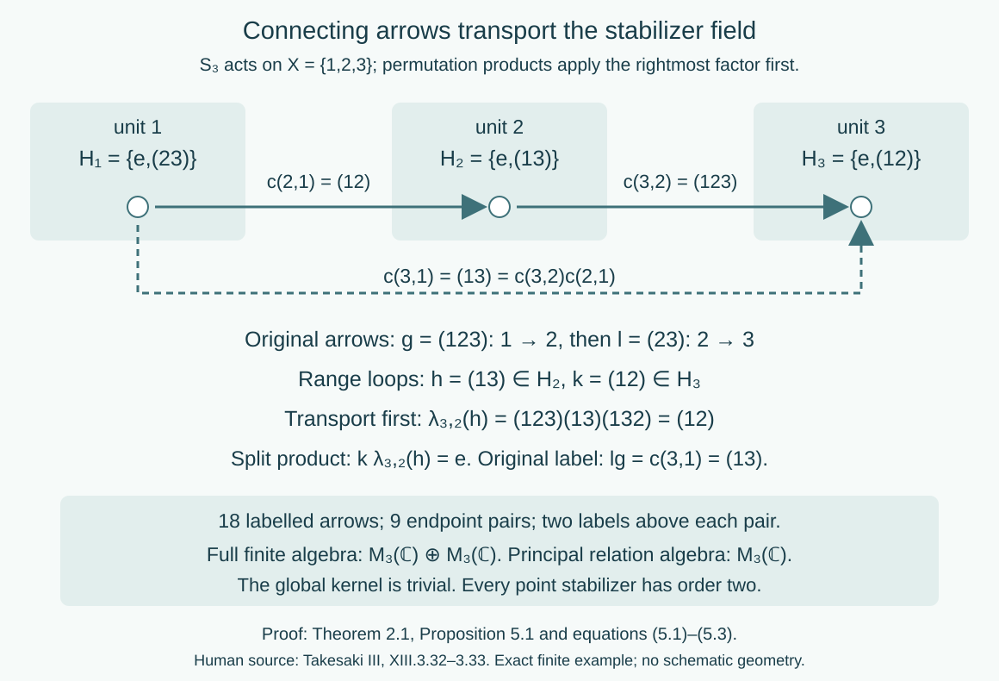

# Stabilizer fields and ancillary splittings

*Written by GPT-6.1 Sol (OpenAI), Ultra, October 2026. Self-checked by the writing AI. New original text is public domain (CC0).*

## Introduction

An orbit relation remembers which points can be connected. A transformation groupoid also remembers every group label that connects them, including loops. For a general countable action, the loop group is the stabilizer at that point. These stabilizers need not equal the kernel of the action and need not be the same subgroups at different points.

A hyperfinite orbit relation allows a coherent choice of one connecting arrow for each endpoint pair. This splits the full transformation groupoid as a semidirect product of the stabilizer field and the relation. The coordinates put the loop at the range, and transport the next loop before multiplying it. We prove the construction, its Borel and measured properties, and its dependence on the chosen section. A permutation action then makes every coordinate explicit.

Read [Orbits, stabilizers, and relation algebras](orbits-stabilizers-and-relation-algebras.md) for the full countable Borel presentation, and [Compatible lifts and cohomology reduction](compatible-lifts-and-cohomology-reduction.md#1-lifting-a-choice-of-arrows) for Theorems 1.1 and 1.3. The latter contains the complete finite-stage lift and the general measured lift into an arbitrary standard Borel groupoid. Its exactly compared Claude prerequisite supplies completed-measurable sections even when the derived target relation is analytic rather than Borel. No global Borel section for such a target is assumed.

The special countable abelian case is proved in [Kernels and measurable groupoid splitting](kernels-and-measurable-groupoid-splitting.md). Here we retain all stabilizers and allow a nonabelian group and a nonergodic nonsingular action. General measurable fields of operator algebras and their disintegration remain separate prerequisites and targets; the splitting itself uses the centre action and groupoid arrows.

## 1. The loop field and the global kernel

Let a countable discrete group \(G\) act by strict Borel nonsingular bijections \(T_g\) on a standard sigma-finite measured space \((X,\mu)\). Its orbit relation is
\[
R=\{(T_gx,x):g\in G,\ x\in X\}.
\tag{1.1}
\]
It is a countable Borel principal groupoid with \((z,y)(y,x)=(z,x)\). The labelled transformation groupoid is
\[
\mathcal G=G\ltimes X,\quad s(g,x)=x,\quad r(g,x)=T_gx,
\quad (l,T_gx)(g,x)=(lg,x).
\tag{1.2}
\]
The endpoint map \(\pi(g,x)=(T_gx,x)\) is onto \(R\). Its kernel is the Borel group field
\[
\mathcal H=\{(h,x):T_hx=x\},\qquad H_x=\{h\in G:T_hx=x\}.
\tag{1.3}
\]
Borelness follows from countably many diagonal equality tests. A transporter \(g\) with \(T_gx=y\) conjugates \(H_x\) onto \(H_y\): both inclusions follow from \(T_{ghg^{-1}}y=y\) and the inverse transporter.

**Lemma 1.1 (kernel and stabilizers).** The algebraic kernel
\[
H=\{h:\alpha_h=\operatorname{id}\text{ on }L^\infty(X,\mu)\},
\qquad \alpha_hf=f\circ T_{h^{-1}},
\tag{1.4}
\]
is a normal subgroup of \(G\). There is an invariant conull Borel set on which \(H\subseteq H_x\) at every point. Equality need not hold, even for an ergodic action.

*Proof.* It is the kernel of a group homomorphism, hence normal. A bounded one-to-one Borel code of \(X\) shows that \(\alpha_h=\operatorname{id}\) exactly when \(T_hx=x\) almost everywhere: equality of that code and its translate forces equality of points, while almost-everywhere point equality fixes every function class. Intersect \(\operatorname{Fix}(h)\) over the countable subgroup \(H\). This is conull and Borel. It is invariant because conjugation by every \(g\) preserves \(H\). Thus every \(H_x\) contains \(H\) there.

For strict inclusion, let \(S_3\) permute the three points with equal positive masses. The action is transitive, hence ergodic, and faithful, so \(H=\{e\}\). Each point nevertheless has a stabilizer of order two. \(\square\)

The quotient \(G/H\) acts on this reduction. It is free exactly when all \(H_x=H\). The abelian ergodic theorem proves that equality using invariant fixed-point sets. In the general case those sets can be moved to the fixed-point sets of conjugate elements; ergodicity alone does not make each one null or conull.

## 2. A coherent section and a semidirect product

Assume \(R\) is hyperfinite as a measured principal relation. On an invariant conull Borel reduction it has an exact increasing finite Borel exhaustion \(R=\bigcup_nR_n\). The measured repair is justified by source-counting null sets: enumerate the missing edges by the countably many presenting maps, remove their null source projections and their countable nonsingular saturations. We work on that reduction from now on.

**Theorem 2.1 (all countable ancillary arrows).** There is a Borel map \(c:R\to G\) with
\[
T_{c(y,x)}x=y,\qquad c(x,x)=e,\qquad
c(z,y)c(y,x)=c(z,x).
\tag{2.1}
\]
Define
\[
\lambda_{y,x}(h)=c(y,x)h c(y,x)^{-1}\quad(h\in H_x).
\tag{2.2}
\]
These are Borel group isomorphisms \(H_x\to H_y\), with
\(\lambda_{z,y}\lambda_{y,x}=\lambda_{z,x}\). The space
\[
\mathcal H\rtimes R
=\{(h,y,x):(y,x)\in R,\ h\in H_y\}
\tag{2.3}
\]
has units \((e,x,x)\), inverses
\[
(h,y,x)^{-1}=(\lambda_{x,y}(h^{-1}),x,y),
\tag{2.4}
\]
and multiplication
\[
(k,z,y)(h,y,x)=(k\lambda_{z,y}(h),z,x).
\tag{2.5}
\]
There is a unit-preserving Borel groupoid isomorphism
\[
\begin{aligned}
F:G\ltimes X&\longrightarrow\mathcal H\rtimes R,\\
F(g,x)&=(g c(T_gx,x)^{-1},T_gx,x),\\
F^{-1}(h,y,x)&=(h c(y,x),x).
\end{aligned}
\tag{2.6}
\]
It preserves exactly the source- and range-counting measures built from the same base measure.

*Proof.* Enumerate \(G\). The first \(g\) with \(T_gx=y\) gives a Borel individual arrow choice \(a(y,x)=(g,x)\). This choice need not compose. Compatible-lift Theorem 1.1 corrects it on the exact finite exhaustion, giving a Borel homomorphic section \(\sigma:R\to G\ltimes X\). Write \(\sigma(y,x)=(c(y,x),x)\). Its endpoints, units and product law give all three identities in (2.1). Every old finite-stage arrow value is preserved exactly by that theorem; hence the limit is a genuine homomorphism on the whole relation.

Conjugation by the chosen transporter gives (2.2) and maps \(H_x\) onto \(H_y\). The equation in (2.1) gives the composition identity for \(\lambda\). The countable group and Borel relation make (2.3) standard Borel; (2.2) is jointly Borel on its natural domain. The units and inverse in (2.4) have the correct fibres. Associativity of (2.5) follows from
\[
k\lambda_{z,y}(h)\lambda_{z,x}(l)
=k\lambda_{z,y}\bigl(h\lambda_{y,x}(l)\bigr).
\tag{2.7}
\]
Thus this is a Borel groupoid.

If \(y=T_gx\), the element \(g c(y,x)^{-1}\) fixes \(y\), so the first coordinate of \(F\) is in \(H_y\). Conversely \(h c(y,x)\) takes \(x\) to \(y\) when \(h\in H_y\). This proves that the formulas in (2.6) are mutually inverse Borel maps with correct endpoints and units.

For composable original arrows \((l,y)(g,x)\), put \(z=T_ly\), \(h=g c(y,x)^{-1}\), and \(k=l c(z,y)^{-1}\). Then
\[
\begin{aligned}
lg c(z,x)^{-1}
&=k c(z,y)h c(y,x)
\bigl(c(z,y)c(y,x)\bigr)^{-1}\\
&=k\lambda_{z,y}(h).
\end{aligned}
\tag{2.8}
\]
This is precisely (2.5), proving the homomorphism assertion. Inverses then follow as well, or directly from (2.4).

For a nonnegative Borel function \(b\) on the new arrow space and a fixed unit \(x\), \(F\) bijects the old source fibre onto the new one. Therefore its counting sums agree. Integrating against \(\mu(x)\) gives equality of source-counting measures. The same argument on range fibres gives equality of range-counting measures. In particular their equivalence, and hence the measured null classes, is retained. This is stronger than merely preserving the principal endpoint relation. \(\square\)

For a centrally ergodic action of a countable group on a von Neumann algebra with separable predual, the centre-model Theorem 4.1 supplies this strict nonsingular Borel action. Apply Theorem 2.1 to it. The full ancillary groupoid is \(G\ltimes X\); the hypothesis in source XIII.3.32 is exactly that its derived principal relation is AF. Source AF includes ergodicity, while the proof above needs only the finite exhaustion and nonsingularity. No freeness, abelianness, invariant finite measure or uniform bound on all finite class sizes is imposed.

**Corollary 2.2 (amenable centre actions).** Every nonsingular action of a countable amenable group has this splitting after an invariant conull reduction.

*Proof.* The complete measured relation theorem in [Invariant means on measured relations, Corollary 6.2](invariant-means-on-measured-relations.md#6-increasing-finite-relations) supplies the finite exhaustion. Apply Theorem 2.1. \(\square\)

## 3. General targets and the source lifting theorem

The individual first-label choice used above relies on the countability of \(G\). It is unnecessary for the more general source lifting theorem, where the target groupoid can have uncountable arrow fibres and isotropy.

**Theorem 3.1 (exact general measured lift).** Let \(R\) be an orbitally countable standard measured principal hyperfinite groupoid, and let \(\mathcal K\) be an arbitrary standard Borel groupoid. If \(p:R\to\mathcal K'\) is a Borel homomorphism into its derived principal relation, then on an invariant conull Borel reduction there is a Borel homomorphism \(\widetilde p:R\to\mathcal K\) satisfying
\[
(r\widetilde p(\gamma),s\widetilde p(\gamma))=p(\gamma).
\tag{3.1}
\]

*Proof.* If the source measure is zero, the empty invariant reduction is conull and its empty lift suffices. Otherwise the full countable Borel presentation theorem in the orbit lesson identifies the source with a countable nonsingular orbit relation. The homomorphism \(p\) has a Borel unit map \(u\); principality of the target derived relation forces \(p(y,x)=(u(y),u(x))\). Thus every required endpoint pair is in the image of the Borel map \(Q:\mathcal K\to\mathcal K^{(0)}\times\mathcal K^{(0)}\), \(Q(\gamma)=(r\gamma,s\gamma)\).

Compatible-lift Theorem 1.3 proves exactly this lift. Its proof uses an equivalent probability on the sigma-finite source-counting measure and its pushforward by \(p\). The image of \(Q\) is analytic; the exact completed-measurable section prerequisite applies to that pushforward without asserting that the image is Borel. A completed-measurable individual lift is replaced by a Borel version. Its bad-arrow set has zero source-counting measure, so its countable Borel source projection and nonsingular saturation are null. On the remaining invariant conull set every chosen arrow has its required endpoints. The compatible finite-stage products of Theorem 1.1 then make the choice coherent, yielding (3.1).

All these stages, including the Borel-version lemma and the exact null-source repair, are fully proved in the cited lesson. The exactly bound Claude completed-analytic-section and one-to-one Borel-image proofs are the only target selection prerequisites used there. The argument does not assume countable target fibres or a global Borel section of \(Q\). \(\square\)

This gives the entire statement of source Corollary XIII.3.25 under its Definition XIII.3.7 standard Borel convention. The local result also permits a nonergodic source. A finite algebraic or Borel lift on every source point and a measured lift on an invariant conull reduction are distinct statements; the latter is the source's measurable assertion.

## 4. Changing the connecting section

The split coordinates are not canonical. Suppose \(c'\) is a second Borel map satisfying (2.1), and put
\[
q(y,x)=c'(y,x)c(y,x)^{-1}\in H_y.
\tag{4.1}
\]
It records a loop at the range. Write \(\lambda'\) for its transported stabilizer action.

**Proposition 4.1 (coordinate change).** The loop field \(q\) satisfies
\[
q(z,x)=q(z,y)\lambda_{z,y}(q(y,x)),\qquad q(x,x)=e,
\tag{4.2}
\]
and
\[
\lambda'_{y,x}=\operatorname{Ad}(q(y,x))\lambda_{y,x}.
\tag{4.3}
\]
The two semidirect products are isomorphic by
\[
J_q(h,y,x)=(h q(y,x)^{-1},y,x).
\tag{4.4}
\]
This map fixes every isotropy arrow \((h,x,x)\).

*Proof.* Substitute \(c'=qc\) into \(c'(z,y)c'(y,x)=c'(z,x)\) and cancel the coherent \(c\)'s on the right. This gives (4.2). Substitution in the conjugation formula gives (4.3). Since an original arrow has labels \(h c(y,x)=h'c'(y,x)\), its new loop coordinate is \(h'=h q(y,x)^{-1}\), proving (4.4) and Borel invertibility.

For an explicit product check, the new product of the two images in (4.4) has first coordinate
\[
\begin{aligned}
k q(z,y)^{-1}\lambda'_{z,y}(h q(y,x)^{-1})
&=k\lambda_{z,y}(h)\lambda_{z,y}(q(y,x))^{-1}q(z,y)^{-1}\\
&=k\lambda_{z,y}(h)q(z,x)^{-1},
\end{aligned}
\tag{4.5}
\]
the image of the old product. The unit condition on \(q\) proves the assertion about isotropy. \(\square\)

More generally, any two transporters with the same endpoints induce stabilizer isomorphisms differing by an inner automorphism at the range. The transport of stabilizer groups modulo that inner change is therefore independent of the chosen arrow. This is an algebraic assertion about actual maps between the fibre groups. It does not assert a standard Borel quotient space of all such isomorphisms.

When \(G\) is abelian and the action is ergodic, the earlier kernel theorem gives \(H_x=H\) on one invariant conull set, and every \(\lambda_{y,x}\) is identity. Equations (2.3)–(2.5) then become the direct product \(H\times R\). In general the semidirect multiplication and the full stabilizer field must be retained in these coordinates.

## 5. A complete three-point calculation

Let \(G=S_3\) act on \(X=\{1,2,3\}\), with uniform measure. Products of permutations apply the rightmost factor first. The global kernel is trivial, while
\[
H_1=\{e,(23)\},\quad H_2=\{e,(13)\},\quad H_3=\{e,(12)\}.
\tag{5.1}
\]
Choose \(g_1=e\), \(g_2=(12)\), \(g_3=(13)\), so \(g_i(1)=i\), and put
\[
c(i,j)=g_i g_j^{-1}.
\tag{5.2}
\]
Its products telescope. In particular \(c(2,1)=(12)\), \(c(3,1)=(13)\) and \(c(3,2)=(123)\).

Take the arrow of label \((123)\) from \(1\) to \(2\). Its range-loop coordinate is \((123)(12)=(13)\in H_2\). Take the arrow of label \((23)\) from \(2\) to \(3\). Its range-loop coordinate is \((23)(132)=(12)\in H_3\). Since
\[
\lambda_{3,2}((13))=(123)(13)(132)=(12),
\tag{5.3}
\]
the product in split coordinates has loop \((12)(12)=e\). The original product has label \((23)(123)=(13)=c(3,1)\), in agreement. Multiplying the two untransported loop labels would give the wrong result.

*Figure 1. Theorem 2.1 and equations (5.1)–(5.3). The three literal stabilizer subgroups sit at their units. The coherent connecting labels transport loops by conjugation. For the two selected original arrows, the source loop is transported into \(H_3\) before multiplying, and the two transpositions cancel. Every endpoint pair has two labelled arrows: the full groupoid has 18 arrows, while its principal relation has 9. Human source: Takesaki III, XIII.3.32–3.33; the displayed finite example and coordinates are the calculations above.*

**Proposition 5.1 (the retained finite algebra).** The finite transformation-groupoid convolution algebra is
\[
M_3(\mathbb C)\otimes\mathbb C[C_2]
\cong M_3(\mathbb C)\oplus M_3(\mathbb C).
\tag{5.4}
\]
The principal relation algebra is \(M_3(\mathbb C)\).

*Proof.* Move the range loop back to the reference stabilizer: for \((h,i,j)\), put \(a=g_i^{-1}h g_i\in H_1\cong C_2\). Equation (5.2) gives
\[
g_k^{-1}\bigl(l\lambda_{k,i}(h)\bigr)g_k
=(g_k^{-1}l g_k)(g_i^{-1}h g_i).
\tag{5.5}
\]
Thus these coordinates turn the groupoid into \(C_2\times(X\times X)\). Its arrow basis element with loop \(a\) and endpoints \((i,j)\) corresponds to \(E_{ij}\otimes a\). Composable products and inverses are exactly matrix multiplication times the group product and its star operation. This proves the first algebraic isomorphism. For \(C_2=\{1,u\}\), \(u^2=1=u^*u\), the orthogonal central projections \((1+u)/2\), \((1-u)/2\) split its group algebra into \(\mathbb C\oplus\mathbb C\). The finite regular representation is faithful: applying left convolution to each unit vector recovers every arrow coefficient. Hence completion adds no new vector space and gives (5.4). The principal pair groupoid has basis \(E_{ij}\) and no loop coordinate, giving \(M_3(\mathbb C)\). \(\square\)

This finite example proves no general disintegration theorem. It shows concretely why forgetting the full loop field can change the algebra even for a faithful action.

## 6. Exercises with complete solutions

Level 1 asks for a computation or direct application. Level 2 asks for a proof using the lesson. Level 3 combines results or checks a measurable hypothesis.

**Exercise 6.1 (faithful with loops).** *Level 1.* Compute the global kernel and every stabilizer of the three-point \(S_3\) action. Count the labelled arrows above each endpoint pair and in the full groupoid.

*Solution.* A permutation fixing all three points is identity, so the kernel is trivial. A permutation fixing \(i\) can either fix or interchange the other two points, giving (5.1). The labels taking \(j\) to \(i\) form \(H_i c(i,j)\), with two elements. There are nine endpoint pairs, so there are 18 arrows. Faithfulness of the action does not remove its point stabilizers.

**Exercise 6.2 (an incoherent arrow choice).** *Level 2.* Set \(a(i,i)=e\) and \(a(i,j)=(ij)\) for \(i\ne j\). Show that this Borel endpoint choice is not a homomorphic section. Repair it using the root \(1\).

*Solution.* It sends \(j\) to \(i\), but \(a(3,2)a(2,1)=(23)(12)=(132)\ne(13)=a(3,1)\). Using root \(1\) gives \(g_i=a(i,1)\) and \(c(i,j)=g_i g_j^{-1}\), with \(g_1=e\). Now \(c(3,2)=(123)\), and \(c(3,2)c(2,1)=(123)(12)=(13)=c(3,1)\). The general product telescopes. The root construction corrects composition while preserving all endpoints.

**Exercise 6.3 (transport before multiplication).** *Level 2.* Compute the split product of the arrows \(((123),1)\) and \(((23),2)\), in that chronological order. Explain the failure of the untransported loop product.

*Solution.* Their split coordinates are \(((13),2,1)\) and \(((12),3,2)\). The first loop must be transported by \(c(3,2)=(123)\), giving \((12)\). The product is \((e,3,1)\). Its original label is \(e c(3,1)=(13)\), also \((23)(123)\). The untransported product \((12)(13)=(132)\) does not even belong to \(H_3\), so it cannot be the range loop.

**Exercise 6.4 (a different section).** *Level 2.* Replace \(g_2=(12)\) by \(g'_2=(123)\), keeping \(g'_1=e\), \(g'_3=(13)\). Compute \(q(2,1)\), \(q(3,2)\), \(q(3,1)\) and the new loop coordinates of the arrows in Exercise 6.3.

*Solution.* The new transporters are \(c'(2,1)=(123)\), \(c'(3,2)=(13)(132)=(23)\), and \(c'(3,1)=(13)\). Hence \(q(2,1)=(13)\), \(q(3,2)=(12)\), and \(q(3,1)=e\). Formula (4.2) is \(e=(12)\lambda_{3,2}((13))=(12)(12)\). Formula (4.4) changes each original loop into identity, so the two selected arrows are now precisely the new connecting arrows. The full labelled groupoid has not changed.

**Exercise 6.5 (two finite blocks).** *Level 2.* Exhibit the two central projections in the finite algebra (5.4), and contrast its centre with the centre of the principal relation algebra.

*Solution.* They are \(1_3\otimes(1+u)/2\) and \(1_3\otimes(1-u)/2\). Their sum is identity and their product zero. Each corresponding corner is \(M_3(\mathbb C)\), so the centre has dimension two. The relation algebra is \(M_3(\mathbb C)\) with one-dimensional centre. The distinction comes from the retained \(C_2\) loops, although the original \(S_3\) centre action is transitive and faithful.

**Exercise 6.6 (an uncountable target).** *Level 3.* In Theorem 3.1, explain why the null bad-arrow set has a Borel null source projection even though the target fibres may be uncountable. Identify where a completed-measurable section is used.

*Solution.* The completed section is used first for the target endpoint map \(Q\), relative to the pushforward of an equivalent source-counting probability. Its pullback gives a completed-measurable individual arrow lift, and the Borel-version lemma replaces that lift. The endpoint-failure set \(B\subset R\) is now Borel and source-counting null. If \(t_n\) enumerate the source presenting transformations, its source projection is \(\bigcup_n\{x:(t_nx,x)\in B\}\), a countable Borel union. Its measure is zero because the counting integral is zero. Nonsingularity and countability make its source-orbit saturation null. Target countability is never used for this projection. Removing that saturation supplies correct endpoints on every remaining arrow before coherent finite lifting.

**Exercise 6.7 (a nonsplit group extension).** *Level 1.* Let \(\mathbb Z\) rotate five points. Prove that \(5\mathbb Z\to\mathbb Z\to C_5\) has no homomorphic section, while its transformation groupoid has one over its principal relation.

*Solution.* A group section would send the generator of \(C_5\) to a nonzero integer of order five, impossible in \(\mathbb Z\). Number the units by \(0,1,2,3,4\), and choose the connecting label \(c(i,j)=i-j\in\mathbb Z\). It has the right endpoints modulo \(5\), units \(0\) and \(c(k,i)+c(i,j)=c(k,j)\). Thus it is a groupoid section. Its dependence on both endpoints permits this coherence without a group section. This is the phenomenon in source Remark XIII.3.33.

**Exercise 6.8 (one measured reduction for all labels).** *Level 3.* Suppose the hyperfinite exhaustion initially covers \(R\) only modulo source-counting measure. Prove that the splitting of Theorem 2.1 represents all arrows of the original transformation groupoid over one invariant conull set, rather than only almost every arrow separately.

*Solution.* Let \(B=R\setminus\bigcup_nR_n\). For each \(g\in G\), the set \(A_g=\{x:(T_gx,x)\in B\}\) is Borel and null, since its graph is contained in the source-counting null set. Remove \(\bigcup_{k,g\in G}T_k A_g\), a countable Borel null union. On its invariant complement, every orbit pair is in the exhaustion. Add units to the finite stages if necessary; this retains finiteness and nesting. Coherent finite lifts give a single strict \(c\) there. Formula (2.6) then applies to every label \(g\) and every retained unit, including all stabilizer loops. The unit-preserving fibre bijections prove the counting-measure assertion without discarding additional arrow-dependent exceptional sets.

## Bibliography and source comparison

Masamichi Takesaki, *Theory of Operator Algebras III*, Definition XIII.3.7, PDF page 54; Corollary XIII.3.25 and its complete proof PDF pages 67–68; Proposition XIII.3.32 PDF pages 73–74; and Remark XIII.3.33 PDF page 74. These exact passages distinguish the standard Borel target, measurable lifting, principal AF hypothesis, variable isotropy field and global group kernel.

The local compatible-lift and orbit-presentation proofs supply the full Corollary XIII.3.25 assertion, with exactly bound descriptive-set prerequisites and explicit invariant-null repair. Theorem 2.1 proves the entire Proposition XIII.3.32 ancillary-groupoid split and its semidirect multiplication; Corollary 2.2 and the five-cycle example give the amenability and nonsplit-group phenomena of Remark XIII.3.33. The source's generator-product proof implicitly needs a well-defined unique orbit coordinate, or compatible finite lifts when finite orbits occur. The latter are used here, covering finite classes and properly ergodic relations in one argument.

A centrally ergodic countable algebra action supplies the centre system used in Proposition XIII.3.32, but no variable von Neumann algebra field is required to prove this groupoid split. The general variable-factor-field localization and cocycle-conjugacy comparison in Definition XIII.3.30 and Proposition XIII.3.31, the two-ceiling exercise and supported Connes standardness/isotropy/disintegration are not treated in this lesson. General modular and flow theory belong to the modular and flow courses and are not proved here.
