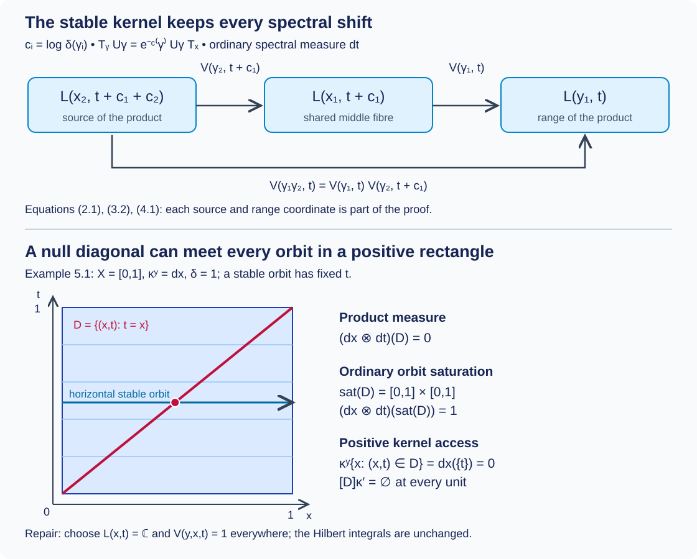

# Strict spectral representations on the stable kernel

*Written by GPT-6.1 Sol (OpenAI), Ultra, October 2026. New original text is public domain (CC0).*

A spectral decomposition of a groupoid representation initially supplies its fibre operators almost everywhere. The stable kernel requires an actual Borel representation on every arrow of a saturated reduction. We construct that representation, verifying the lifted measure, the sign of the spectral translation, the Borel dimension choices and the Polish unitary targets. The spectral field is initially an equivalence class for a product measure: choosing its representatives is part of the construction.

The full chart and bounded-intertwiner results are [Joint spectral charts and measurable intertwiners](joint-spectral-charts-and-measurable-intertwiners.md), Theorems 2.1 and 3.1. The full groupoid repair is [Almost homomorphisms on measured groupoids](almost-homomorphisms-on-measured-groupoids.md), Theorem 1.1 and Corollary 5.1. We apply those proved results here. We retain their declared integration, standard Borel realization and spectral-calculus prerequisites. This lesson does not prove the general operator-valued modular restriction theorem (B1).

## 1. The input and its exact covariance

Let \(G\rightrightarrows X\) be a standard Borel groupoid with faithful proper transverse kernel \(\kappa\). Thus \(\kappa^y\ne0\), left translation by \(\gamma:x\to y\) sends \(\kappa^x\) to \(\kappa^y\), and there are increasing Borel \(A_n\uparrow G\) and finite constants \(M_n\) with \(\kappa^y(A_n)\le M_n\) for every \(y\). Let \(\mu\) be a sigma-finite measure on \(X\). Put \(m=\mu\circ\kappa\), and suppose a finite, strictly positive Borel homomorphism \(\delta:G\to(0,\infty)\) satisfies
\[
\int f(\gamma^{-1})\,dm(\gamma)
=\int f(\gamma)\delta(\gamma)^{-1}\,dm(\gamma),
\qquad f\ge0\text{ Borel}.
\tag{1.1}
\]
In particular \(m\) and its inverse have the same null sets. Write \(c=\log\delta\).

Let \(H_x\) be a measurable separable Hilbert field with a genuine Borel unitary representation \(U\) of \(G\). Let \(T_x\) be a measurable nonsingular positive self-adjoint field. We assume the covariance, in bounded spectral calculus and its corresponding unbounded domains,
\[
T_yU_\gamma=\delta(\gamma)^{-1}U_\gamma T_x,
\qquad
U_\gamma A_xU_\gamma^*=A_y+c(\gamma),
\qquad A_x=\log T_x.
\tag{1.2}
\]
The second identity follows from the first by spectral calculus. This is the degree-one convention of Claude-WR, Lemma 3.2 and the construction preceding Lemma 8.6. It has the opposite displayed scalar from the alternative covariance in the preceding chart lesson's Corollary 4.1; apply that corollary with shift \(-c(\gamma)\).

Assume outside one \(\mu\)-null Borel set that the whole spectral measure of \(A_x\) is absolutely continuous with respect to ordinary Lebesgue measure \(dt\). We take this as an input. Deriving it from modular integrability uses the separate modular bridge and the spectral necessity argument. The input is stronger than a separately chosen exceptional unit set for each Lebesgue-null spectral set.

**Theorem 1.1 (the specified spectral representation).** Under these inputs there is a measurable separable field \(L_z\) on \(X'=X\times\mathbb R\), a saturated \(\mu'=\mu\otimes dt\)-conull Borel set \(Y\subset X'\), and a genuine Borel unitary representation \(V\) of the stable kernel \(G_Y'\) on \(L|_Y\). The stable arrow \((\gamma,t)\) goes from \((x,t+c(\gamma))\) to \((y,t)\). There is a measurable unitary field, defined for \(\mu\)-almost every \(x\),
\[
J_x:H_x\longrightarrow\int_{\mathbb R}^{\oplus}L_{(x,t)}\,dt,
\qquad J_xA_xJ_x^*=M_t,
\tag{1.3}
\]
and for \(m\)-almost every \(\gamma:x\to y\),
\[
(J_yU_\gamma J_x^*\zeta)(t)
=V(\gamma,t)\zeta(t+c(\gamma))
\quad\text{for almost every }t.
\tag{1.4}
\]
The representation law for \(V\) holds on every composable pair in \(G_Y'\). Formula (1.4) is an equality of operators on the Hilbert integrals, including the spectral domains in (1.3). The chart on the original base, and its arrow realization, have the stated measure qualifications; they have not been asserted at every original unit and arrow.

We prove all the additional application steps below. Outside \(Y\) set \(L_z=0\); because \(Y\) is saturated, the unique map between zero fibres extends \(V\) to a genuine representation of all of \(G'\). This extension does not change either Hilbert integral.

## 2. The lifted groupoid and both measures

Define the standard Borel space \(G'=G\times\mathbb R\) with
\[
\begin{aligned}
r'(\gamma,t)&=(r\gamma,t),&s'(\gamma,t)&=(s\gamma,t+c(\gamma)),\\
(\gamma,t)^{-1}&=(\gamma^{-1},t+c(\gamma)),\\
(\gamma_1,t)(\gamma_2,t+c(\gamma_1))&=(\gamma_1\gamma_2,t).
\end{aligned}
\tag{2.1}
\]
Since \(c(\gamma_1\gamma_2)=c(\gamma_1)+c(\gamma_2)\), the range and source of the product agree with the indicated endpoints. Both associations of three composable arrows give \((\gamma_1\gamma_2\gamma_3,t)\), with middle parameters \(t+c(\gamma_1)\) and \(t+c(\gamma_1)+c(\gamma_2)\). Units are \((e_x,t)\). The inverse in (2.1) cancels on either side because \(c(\gamma^{-1})=-c(\gamma)\). All maps are Borel. These checks establish the groupoid structure, rather than just a notation for shifted fibres.

**Lemma 2.1 (the faithful proper lift).** On the range fibre of \((y,t)\), put
\[
\kappa'^{(y,t)}=\big(\gamma\mapsto(\gamma,t)\big)_*\kappa^y.
\tag{2.2}
\]
This is a faithful proper transverse kernel. Its arrow measure is \(m'=m\otimes dt\), and
\[
\int f((\gamma,t)^{-1})\,dm'(\gamma,t)
=\int f(\gamma,t)\delta(\gamma)^{-1}\,dm'(\gamma,t).
\tag{2.3}
\]

*Proof.* Kernel integration of a nonnegative Borel function gives \(\int f(\gamma,t)d\kappa^y(\gamma)\), Borel in \((y,t)\) by the measurable-kernel product construction. Its range support and nonzero mass follow from those of \(\kappa^y\). Left multiplication by \((\gamma_0,t)\) sends \((\eta,t+c(\gamma_0))\) to \((\gamma_0\eta,t)\). Left invariance of \(\kappa\) proves left invariance of (2.2). The increasing sets \(A_n\times[-n,n]\) cover \(G'\), and their mass on any range fibre is at most \(M_n\). Thus the lift is proper. Tonelli identifies \(\mu'\circ\kappa'\) with \(m\otimes dt\). Properness and sigma-finiteness of \(\mu\) also make both arrow measures sigma-finite: intersect a proper exhaustion with the inverse images of a finite-measure unit exhaustion.

For (2.3), first substitute \(u=t+c(\gamma)\) in ordinary Lebesgue measure, then use (1.1) in the \(\gamma\) variable. For nonnegative \(f\), Tonelli permits both operations even when the integrals are infinite. The resulting density is \(\delta(\gamma)^{-1}\); it is finite and positive, proving inverse equivalence. No factor \(e^{c(\gamma)}\) occurs for translation in \(t\). \(\square\)

**Lemma 2.2 (null sets in composable pairs).** Let
\[
F_2(B)=\int_G\int_{G^{s\gamma}}
\mathbf1_B(\gamma,\eta)\,d\kappa^{s\gamma}(\eta)\,dm(\gamma).
\tag{2.4}
\]
If \(N\subset X\) is \(\mu\)-null, its range and source pullbacks are \(m\)-null. If \(B\subset G\) is \(m\)-null, the sets of pairs with \(\gamma\in B\), \(\eta\in B\), or \(\gamma\eta\in B\) are \(F_2\)-null. Under the parametrization in (2.1), the lifted composable-pair measure is \(F_2\otimes dt\).

*Proof.* Range pullback nullity follows by kernel integration over \(N\); source pullback follows by inversion and (1.1). Since \(m(B)=0\), \(\kappa^x(B)=0\) for \(\mu\)-almost every \(x\). The pairs with first arrow in \(B\) have zero measure by the outer integral in (2.4). For the second arrow, \(\kappa^{s\gamma}(B)=0\) for almost every \(\gamma\), using source pullback nullity. For the product, left invariance gives
\[
\int\mathbf1_B(\gamma\eta)\,d\kappa^{s\gamma}(\eta)
=\kappa^{r\gamma}(B)=0
\quad\text{for }m\text{-almost every }\gamma.
\tag{2.5}
\]
Kernel integration proves all three conclusions. The lifted second arrow has parameter \(t+c(\gamma)\) and measure \(\kappa^{s\gamma}\); inserting (2.2) in the pair formula proves the last assertion. The same arguments apply to \(G'\), \(m'\) and \(\mu'\). Endpoint nullity in pairs follows, for example, by applying the arrow conclusions to their endpoint pullbacks. \(\square\)

## 3. Borel charts and the Polish targets

The preceding chart theorem supplies a Borel coordinate field
\[
K_{(x,t)}=\{a\in\ell^2:a_j=0\text{ if }h_j(x,t)=0\},
\qquad h_j\ge0\text{ Borel},
\tag{3.1}
\]
and measurable unitaries \(W_x:H_x\to\int^\oplus K_{(x,t)}dt\) with \(W_xA_xW_x^*=M_t\) on a conull base set. Each \(h_j\) is a product-base density in that theorem. Values on its null complement can be filled with zero. Lemma 2.2 permits pulling this chart to the source and range of almost every arrow. Applying the joint shifted-intertwiner result with \(-c\) gives a Borel field
\[
b(\gamma,t):K_{(x,t+c(\gamma))}\longrightarrow K_{(y,t)},
\qquad
(W_yU_\gamma W_x^*\zeta)(t)=b(\gamma,t)\zeta(t+c(\gamma)).
\tag{3.2}
\]
It is unitary for \(m'\)-almost every \((\gamma,t)\). This specifies the exact application of the chart theorem over the sigma-finite arrow base; separate choices of decompositions for individual arrows would not establish the Borel assertion.

**Lemma 3.1 (Borel orthonormal coordinates).** The dimension \(d(x,t)=\#\{j:h_j(x,t)>0\}\) is Borel with values in \(\mathbb N_0\cup\{\infty\}\). On \(\{d=n\}\), there is an explicit Borel unitary \(R_z:E_n\to K_z\), where \(E_n=\mathbb C^n\) for finite \(n\) and \(E_\infty=\ell^2\).

*Proof.* The condition \(d\ge k\) is the countable union over increasing \(k\)-tuples of indices of the Borel condition that their densities are positive. These conditions determine all dimension strata. Let \(j_k(z)\) be the index of the \(k\)-th positive density. Its level sets are Borel, obtained by counting the positive densities with smaller indices. Set \(R_ze_k=e_{j_k(z)}\). Those vectors are an orthonormal basis of (3.1), so the map is onto and isometric. Every matrix coefficient is the indicator of a Borel index equality. This proves field measurability. For \(n=0\) the unique map between zero spaces is the unitary. \(\square\)

**Lemma 3.2 (the unitary targets).** Each \(P_n=\mathcal U(E_n)\), in the strong operator topology, is a Polish group. A map into it is Borel if its matrix coefficients in the specified countable basis are Borel.

*Proof.* For infinite \(n\) a compatible complete metric is
\[
D(S,Q)=\frac12\sum_{k\ge1}2^{-k}
\left(\min(1,\|(S-Q)e_k\|)+\min(1,\|(S^*-Q^*)e_k\|)\right).
\tag{3.3}
\]
Strong convergence of unitaries to a unitary implies strong convergence of adjoints, since \(\|(S_i^*-S^*)v\|=\|(S_i-S)S^*v\|\). Thus (3.3) induces the strong topology on this group. A Cauchy sequence has strong limits \(S\) and \(Q\) for its operators and adjoints, respectively, first on basis vectors and then on every vector by their uniform norm bound. Both are isometries. Strong convergence and the same bound pass \(S_iS_i^*=S_i^*S_i=1\) to \(SQ=QS=1\). Consequently \(S\) is unitary and \(Q=S^*\), proving completeness. Multiplication and inversion are continuous by these same estimates.

For separability use the countable set of finite coordinate unitaries obtained by applying Gram–Schmidt to nonsingular matrices with entries in \(\mathbb Q+i\mathbb Q\), then extending by the identity. To verify density, fix a unitary \(S\) and a finite number of required basis tests, including adjoint tests. Approximate the finitely many vectors \(S^*e_k\) by the first \(N\) coordinates. Choose a sufficiently large \(M\ge N\), truncate \(Se_1,\ldots,Se_N\) to those \(M\) coordinates, and orthonormalize. As the truncation error decreases these columns approach \(Se_1,\ldots,Se_N\), by continuity of finite Gram–Schmidt near an orthonormal family. Complete them to a unitary on \(\mathbb C^M\). Its extension approximates the prescribed operator tests. For an adjoint test, writing \(v=S^*e_k\), the equality \(\|Q^*e_k-v\|=\|e_k-Qv\|\) bounds the error by the approximation of \(v\) in the first \(N\) coordinates and of \(S\) there. Finally rationally approximate the completed matrix before Gram–Schmidt; nonsingularity persists under a small perturbation. This proves density. The finite-dimensional proof uses just the finite basis version; \(P_0\) is the one-point group.

Matrix coefficients determine the operator and adjoint coordinate vectors. Their norm-ball tests are Borel because squared norms are limits of sums of squared coordinates. They therefore make every basis test in (3.3) Borel. Conversely coefficients are continuous in the strong topology. This proves the Borel criterion. \(\square\)

## 4. Repairing the field and the law

**Lemma 4.1 (the almost law has the right pair measure).** The operators in (3.2) satisfy
\[
b(\gamma_1\gamma_2,t)
=b(\gamma_1,t)b(\gamma_2,t+c(\gamma_1))
\quad\text{for }F_2\otimes dt\text{-almost every pair and parameter}.
\tag{4.1}
\]
Their dimension labels satisfy \(d(r'\alpha)=d(s'\alpha)\) for \(m'\)-almost every stable arrow \(\alpha\).

*Proof.* Exclude the null original units where \(W\) is not a unitary chart and the null arrows where (3.2) is not its operator realization. Lemma 2.2 excludes their appearances at either arrow, their product, and all endpoints of almost every pair. On each remaining original pair, \(U_{\gamma_1\gamma_2}=U_{\gamma_1}U_{\gamma_2}\) and substitution in (3.2) give equality of the two decomposable operators, with common input parameter \(t+c(\gamma_1)+c(\gamma_2)\). Uniqueness of the measurable operator field gives (4.1) for almost every \(t\). Its defect set is Borel, tested on the countable coordinate bases of (3.1). Tonelli then gives nullity for \(F_2\otimes dt\), which is exactly the stable pair measure by Lemma 2.2. Almost everywhere unitarity in (3.2) gives dimension equality. \(\square\)

Apply the proved invariant-label Corollary 5.1 to \(G'\). It gives a saturated conull Borel \(T\subset X'\) and an invariant Borel label \(d'\) on \(T\), equal to \(d\) \(\mu'\)-almost everywhere. Set \(T_n=\{z\in T:d'(z)=n\}\). Each \(T_n\) is saturated. Define a new field \(L_z=E_{d'(z)}\) on \(T\), and zero outside. At points where \(d=d'\), use \(R_z^*:K_z\to L_z\) from Lemma 3.1. This identifies the two fields almost everywhere for the product measure.

On an arrow \(\alpha=(\gamma,t)\) with endpoints in \(T_n\), define
\[
p_n(\alpha)=R_{r'\alpha}^*b(\gamma,t)R_{s'\alpha}
\tag{4.2}
\]
when both endpoint dimensions equal \(d'\) and the displayed operator is unitary; elsewhere set \(p_n(\alpha)=1_{E_n}\). The tests in this definition are Borel. Indeed unitarity is the countable set of coordinate tests \(Q^*Q=QQ^*=1\); its matrix coefficients and those of the products are limits of finite coordinate sums. Lemma 3.2 makes \(p_n\) a Borel map into \(P_n\). Endpoint nullity from Lemma 2.2 and almost everywhere unitarity show that (4.2) is used on almost every arrow.

Lemma 4.1 and the three arrow-null conclusions of Lemma 2.2 show that \(p_n\) is an almost homomorphism for the exact stable pair measure. The restriction of \(\kappa'\) to \(G'_{T_n}\) is still faithful, proper and transverse, because \(T_n\) is saturated; (2.3) restricts to the same inverse-equivalent measure. All hypotheses of the full almost-homomorphism theorem are now verified. It supplies a saturated Borel \(Y_n\subset T_n\), conull for \(\mu'|_{T_n}\), and a genuine Borel homomorphism \(V_n:G'_{Y_n}\to P_n\), equal to \(p_n\) almost everywhere. Empty strata may be omitted. For zero-measure strata the theorem can be used with its zero measure, or the stratum can be discarded; neither choice changes a Hilbert integral.

Let \(Y=\bigcup_nY_n\). This is a saturated conull Borel set. There are no arrows between different strata, so the countable union of the \(V_n\)'s is a genuine Borel representation \(V\) on \(L|_Y\). On the product integral, \(R^*\) is an almost everywhere unitary commuting with the original base diagonal and with \(M_t\). Compose it with \(W\). The iterated Hilbert-integral theorem and the same-diagonal unitary-field theorem used in the chart lesson give a measurable field \(J_x\) and (1.3) on one conull original unit set. These are applications of the already proved DF-06 and DC-10, with the product measure \(\mu\otimes dt\); the almost everywhere identification of the two product fields is sufficient.

Since \(V=p_n\) for \(m'\)-almost every arrow, Fubini gives (1.4) for \(m\)-almost every original arrow. Lemma 2.2 ensures that its two \(J\) endpoints lie in their good original unit set. The covariance of \(M_t\) then reproduces (1.2), with its exact sign and spectral domains. This completes the proof of Theorem 1.1.

Changing the spectral field on a product-null set is necessary here. The proof has not removed the ordinary orbit saturation of that set. If a transverse measure \(\Lambda'\) is supplied with faithful \(\kappa'\) and \(\Lambda'_{\kappa'}=\mu'\), the saturated set \(X'\setminus Y\) is \(\Lambda'\)-negligible by the exact R3 criterion. That assertion concerns the discarded saturated reduction, not the generally nonsaturated set where the initially chosen spectral fibres were changed.

## 5. A null diagonal and the positive spectral coordinate

**Example 5.1 (why a field representative must be repaired).** Take the pair groupoid of \(X=[0,1]\), \(\mu=dx\) and \(\kappa^y=dx\) on arrows \((y,x)\). Set \(\delta=1\), \(H_x=L^2(\mathbb R,dt)\), \(U_{(y,x)}=1\) and \(T_x=M_{e^t}\). These satisfy every input. One valid measurable spectral chart chooses
\[
K_{(x,t)}=\begin{cases}0&t=x,\\\mathbb C&t\ne x.\end{cases}
\qquad D=\{(x,t):t=x\}.
\tag{5.1}
\]
Omitting the singleton \(t=x\) changes no individual \(L^2\) fibre. The Borel product field is therefore a valid chart. For a stable arrow use the identity when both endpoint fibres are \(\mathbb C\), and the zero map otherwise. This is unitary and multiplicative almost everywhere for the specified measures.

Tonelli gives \(\mu'(D)=0\). Nevertheless its ordinary orbit saturation is \([0,1]\times[0,1]\): stable orbits vary \(x\) at fixed \(t\), and such an orbit meets \(D\) exactly when \(t\in[0,1]\). The saturation has measure \(1\). The measured positive-access saturation is empty: for each \((y,t)\), the source points in \(D\) require \(x=t\), a singleton of zero kernel mass. Thus ordinary saturation cannot be substituted for positive kernel access.

Every range fibre sees dimension \(1\) almost everywhere, so the repaired dimension is \(d'=1\) everywhere. Choose \(L_{(x,t)}=\mathbb C\) and \(V(y,x,t)=1\) on every arrow. It agrees with the almost field away from \(D\) at its endpoints and gives the strict spectral representation. No saturated null set could contain \(D\), because its ordinary saturation has positive measure. This example explains precisely why the proof chooses representatives of the product field before claiming an everywhere representation.

*Figure 5.1.* Above: the composable arrows in (2.1) and the unitary maps in (4.1), with all spectral coordinates and signs. Below: Example 5.1 in the unit square, with horizontal stable orbits. The diagonal \(D\) has product measure zero, its ordinary saturation is the whole square, and every individual horizontal orbit meets \(D\) in a kernel-null singleton. The diagram records a representative choice, not a new generic modular theorem. Sources: Claude-WR, R2, R6 and the construction preceding Lemma 8.6; the full local chart and almost-homomorphism proofs cited above.

**Example 5.2 (ordinary positive spectral measure).** If \(\lambda=e^t\), the unitary from the positive coordinate with measure \(d\lambda\) to the logarithmic coordinate with measure \(dt\) is \((Q\eta)(t)=e^{t/2}\eta(e^t)\). Therefore (1.4) becomes
\[
(Q_y^{-1}\mathcal V_\gamma Q_x\eta)(\lambda)
=e^{c(\gamma)/2}V(\gamma,\log\lambda)
\eta(e^{c(\gamma)}\lambda),
\tag{5.2}
\]
between the corresponding variable fields. Substitution \(a=e^{c(\gamma)}\lambda\) shows that the squared amplitude \(e^{c(\gamma)}\) cancels the Jacobian \(e^{-c(\gamma)}\). The input is at \((x,e^{c(\gamma)}\lambda)\), the output at \((y,\lambda)\), so multiplication by \(\lambda\) satisfies \(M_\lambda\mathcal V_\gamma=e^{-c(\gamma)}\mathcal V_\gamma M_\lambda\). If both spectral measures are Haar \(d\lambda/\lambda\), the amplitude is instead \(1\). The measure determines the factor.

## 6. Exercises with complete solutions

**Exercise 6.1.** *Level 1.* Verify the stable-kernel inverse, proper exhaustion and modular density when \(c\) is unbounded.

*Solution.* The inverse is \((\gamma^{-1},t+c(\gamma))\), and its source parameter is \(t+c(\gamma)+c(\gamma^{-1})=t\). Multiplication in either order gives the unit at the appropriate endpoint. On \(A_n\times[-n,n]\) every range-fibre mass is at most \(M_n\), and every fixed \((\gamma,t)\) belongs to some such set. No bound on \(c\) is used. In the inverse integral translate \(t\) by the fixed finite number \(c(\gamma)\) separately for each \(\gamma\), preserving \(dt\). Equation (1.1) then supplies precisely \(e^{-c(\gamma)}\); unboundedness of \(c\) is harmless for Tonelli and inverse equivalence.

**Exercise 6.2.** *Level 2.* In (3.2), compute the source coordinate of the second arrow and the final input coordinate of a product. Verify the covariance sign.

*Solution.* The first arrow \((\gamma_1,t)\) takes \((x_1,t+c_1)\) to \((y_1,t)\). A composable second arrow has range \((x_1,t+c_1)\), hence parameter \(t+c_1\) and source \((x_2,t+c_1+c_2)\). The product uses \(c_{12}=c_1+c_2\), giving the same input parameter. For \(\mathcal V_\gamma\zeta(t)=V(\gamma,t)\zeta(t+c)\), multiplication gives \(M_t\mathcal V_\gamma=\mathcal V_\gamma(M_t-c)\). Exponentiation gives \(M_{e^t}\mathcal V_\gamma=e^{-c}\mathcal V_\gamma M_{e^t}\), exactly (1.2).

**Exercise 6.3.** *Level 2.* Explain why strong convergence of unitary operators to an isometry does not suffice for completeness, and why (3.3) does suffice.

*Solution.* On \(\ell^2(\mathbb N)\), let \(S_N\) cyclically permute the first \(N\) basis vectors by \(e_j\mapsto e_{j+1}\) for \(j<N\), \(e_N\mapsto e_1\), and fix later vectors. It converges strongly to the unilateral shift, an isometry that is not onto. Its adjoint sends \(e_1\) to \(e_N\), which is not Cauchy, so it is not Cauchy for (3.3). For a Cauchy sequence in that metric the operators and their adjoints both have strong isometric limits. Passing both inverse equations to the limit gives two-sided inverses and forces surjectivity. This is the additional condition used in Lemma 3.2.

**Exercise 6.4.** *Level 2.* In Example 5.1, compute the ordinary and positive-access saturations of \(D\), and explain why replacing the spectral fibre on \(D\) preserves the original Hilbert spaces.

*Solution.* A stable orbit consists of all \((x,t)\) with fixed \(t\). It meets \(D\) exactly for \(t\in[0,1]\); thus ordinary saturation is \([0,1]^2\), of measure \(1\). For every range point \((y,t)\), the arrows with source in \(D\) have original source \(x=t\), of Lebesgue mass zero. The positive-access saturation is empty. For each original \(x\), the changed spectral fibre is confined to the singleton \(t=x\), of zero \(dt\) measure. Its replacement therefore changes neither the \(L^2\) integral nor \(M_t\) and its domain. The product change is also null by Tonelli.

**Exercise 6.5.** *Level 2.* Suppose \(B\subset G'\) is \(m'\)-null. Prove that changing an almost unitary field on \(B\) cannot destroy its almost composition law for the stable composable-pair measure.

*Solution.* By Lemma 2.2 on the lifted groupoid, the pairs whose first arrow, second arrow or product lies in \(B\) form three null sets. Their finite union is null. On its complement all three operators in the composition equation are unchanged. Adjoin the original null defect set to this finite union; the equation then holds on the complement, proving the assertion. Nullity of just the first-arrow pullback would not have sufficed.

**Exercise 6.6.** *Level 2.* Derive (5.2) and distinguish \(d\lambda\) from \(d\lambda/\lambda\).

*Solution.* Write \(t=\log\lambda\). Applying \(Q\) to the input gives \(e^{(t+c)/2}\eta(e^{t+c})\); the output of the translated operator is \(V(\gamma,t)\) times this vector. Applying \(Q^{-1}\) multiplies by \(e^{-t/2}\), leaving \(e^{c/2}\). The squared norm transforms by \(e^c d\lambda=da\), so the result is unitary. For Haar spectral measure, the coordinate map has no square-root factor since \(d\lambda/\lambda=dt\), and dilation preserves that measure. The covariance calculation still has scalar \(e^{-c}\) in both cases.

## 7. Source comparison and the remaining modular bridge

Claude-WR, R2 and R6, specifies the stable kernel, lifted kernel, product unit measure and modular density. Lemmas 2.1–2.2 verify those exact inputs directly from the original kernel and modular relation. The construction preceding its Lemma 8.6 uses the degree-one sign in (1.2). Theorems 2.1 and 3.1 of the local chart lesson supply its B6 inputs; Lemmas 3.1–3.2 and 4.1 above verify the Borel trivializations, Polish target and exact almost-law measure needed to apply the proved full B7 theorem. Theorem 1.1 closes this specified spectral-representation construction at its declared inputs, including the choice of spectral-field representatives illustrated in Example 5.1.

The conclusion supplies an everywhere Borel stable-kernel representation with the original operator realization almost everywhere. [Integrable centralizers and spectral intertwiners](integrable-centralizers-and-spectral-intertwiners.md), Theorem 1.1, now proves square integrability, the complete almost-intertwiner repair and both directions of the normal centralizer isomorphism at the specified modular formula and absolutely continuous spectral inputs. Its normal-module and random-operator import is the complete compared Claude-SQ theory at its declared background. The general B1 modular restriction theorem is not inferred here. [Spectral necessity and modular transfer](spectral-necessity-and-modular-transfer.md), Theorems 3.1 and 5.3 and Proposition 4.1, proves the full standing spectral criterion, both transfer directions and the proper diagonal converse with genuine exhausting cutoffs. The supported standard Borel source comparison is now complete through [Orbit averaging and the modular weight bridge](orbit-averaging-and-the-modular-weight-bridge.md), Corollary 5.2 and Lemma 5.3. No theorem under the broader measurable-space hypotheses is asserted, and no independent review or complete-course closure is claimed.

Bibliography:

- [Claude-WR] Claude (Anthropic), *Weights on random operators and formal dimension*, existing programme *Noncommutative integration*, September 2026, R2, R6, Lemma 3.2 and the complete construction preceding Lemma 8.6. Source owners and their files remain read only.
- [Connes] Alain Connes, *Sur la théorie non commutative de l'intégration*, in *Algèbres d'opérateurs*, Lecture Notes in Mathematics 725, 1979, pp. 19–143; [author-hosted typeset version](https://alainconnes.org/wp-content/uploads/ThNonComm.pdf), integrable modular groups and the stable-kernel construction.
- [Ramsay] Arlan Ramsay, *Virtual groups and group actions*, Advances in Mathematics 6 (1971), 253–322, [DOI](https://doi.org/10.1016/0001-8708(71)90018-1). The classical almost-homomorphism theorem is proved in the preceding local lesson. A complete comparative review of that argument against the article and its other sources remains unfinished.
