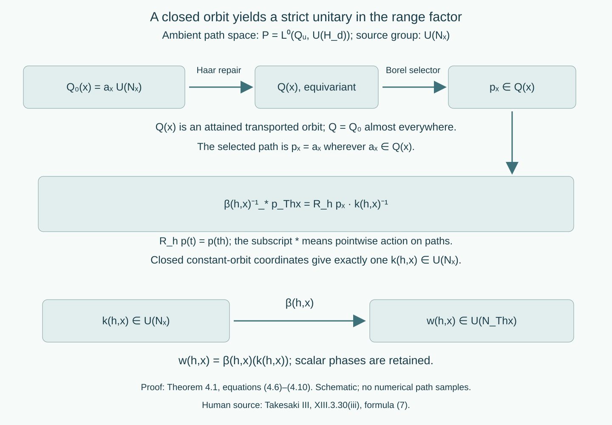

# Strict variable fields and ancillary conjugacy

*Written by GPT-6.1 Sol (OpenAI), Ultra, October 2026. New original text is public domain (CC0).*

## Introduction

A central factor decomposition can have different factors at different points. Choosing fibre maps separately for each group element gives measured identities, but it does not give a groupoid action on every arrow. This lesson supplies the common invariant source set. It then proves the cocycle-conjugacy comparison for variable factors, including the actual unitary correction and its scalar phase.

The classical central-reduction and standard-form prerequisites are those stated in [Variable factor fields and measurable conjugacy](variable-factor-fields-and-measurable-conjugacy.md), Introduction. We use its complete Theorem 1.1, Propositions 2.1–2.2, Theorem 3.1 and Lemma 3.2 for measured reconstruction. Measurability of normal fibre-isomorphism fields is understood in standard-form coordinates: their canonical implementers are Borel. The identification of this convention with the usual measurable-isomorphism-field convention is part of the classical measurable standard-form prerequisite. It is retained explicitly, including in Section 6's comparison of given models. General standard forms and modular theory retain their modular-course ownership. The exact diagonal-intertwiner prerequisite is [DG], Theorem 5.1 and Proposition 6.1, at arbitrary sigma-finite base and varying separable Hilbert fibres; it does not prove that standard-form prerequisite.

The constructive measure prerequisites are proved in [Localizing factor actions and uniform cocycles](localizing-factor-actions-and-uniform-cocycles.md): Haar essential-value repair (Theorem 1.2), Polish paths and closed constant orbits (Lemmas 2.1–2.2), strict versions (Theorem 3.1), effective second-countable quotients and automatic continuity (Lemmas 4.1–4.2), and jointly Borel representatives (Lemma 5.1). We will use their actual conclusions, rather than take an uncountable union of parameter-dependent null sets. The compact centre model is supplied by [Measurable actions and compact models](measurable-actions-and-compact-models.md), Theorem 4.1.

Throughout, \(G\) is a separable locally compact Hausdorff group; it need not be second countable. All algebras have separable preduals. Bases are standard sigma-finite measured spaces, replaced by equivalent probabilities when convenient. An arrow \((g,x)\) goes from \(x\) to \(T_gx\), and

\[
(g,T_hx)(h,x)=(gh,x).
\tag{0.1}
\]

An invariant conull Borel reduction retains every group label at each of its units, including all isotropy labels. No freeness, ergodicity, homogeneous factor field, amenability, invariant measure or unimodularity is assumed in the proofs. The centrally ergodic source assertion is a special case.

## 1. A common equivariant base isomorphism

We first remove an issue that is independent of the factor fields.

**Lemma 1.1 (repairing both directions).** Let \(T\) and \(S\) be strict jointly Borel nonsingular \(G\)-actions on standard measured \(X,Y\). A measure-class Borel isomorphism \(F_0\), defined modulo null sets, satisfying

\[
F_0(T_gx)=S_gF_0(x)
\quad\text{almost everywhere for each fixed }g
\tag{1.1}
\]

has a representative \(F:E_X\to E_Y\) which is a measure-class Borel isomorphism of invariant conull Borel sets and satisfies (1.1) at every \(g,x\in E_X\).

*Proof.* Give \(F_0\) and its inverse \(R_0\) arbitrary Borel values on their null complements. The inverse satisfies the corresponding fixed-parameter identity: for a fixed \(g\), remove the null sets where inverse identities or (1.1) fail and their nonsingular images. On what remains, apply \(R_0\) to (1.1).

Apply Haar essential-value repair to \(F_0:X\to Y\), with the strict target bijections \(S_g\), and to \(R_0:Y\to X\), with target bijections \(T_g\). It gives exactly equivariant Borel maps \(F':X'\to Y\), \(R':Y'\to X\) on invariant conull Borel domains, with the original measured classes. Thus these maps preserve the measure classes. Restrict first to

\[
D_X=X'\cap(F')^{-1}(Y'),\qquad
D_Y=Y'\cap(R')^{-1}(X').
\tag{1.2}
\]

They are invariant and conull. Set

\[
\begin{aligned}
E_X&=\{x\in D_X:R'F'x=x\},\\
E_Y&=\{y\in D_Y:F'R'y=y\}.
\end{aligned}
\tag{1.3}
\]

These equality sets are Borel and conull because the maps have the original inverse classes. They are invariant because both maps are exactly equivariant. If \(x\in E_X\), then \(F'x\in D_Y\) and \(F'R'F'x=F'x\), so \(F'x\in E_Y\). Conversely \(y\in E_Y\) has \(R'y\in E_X\) and \(F'R'y=y\). The restrictions are Borel inverses. This proves all claims for the original \(G\); no effective-quotient assumption on these given point actions is needed. \(\square\)

The inverse repairs are needed: an equivariant map agreeing with a measure-class isomorphism almost everywhere does not, without an additional argument, give a pointwise bijection on its entire repaired domain.

## 2. Coding the fibre data

Fix a finite-dimensional or countably infinite-dimensional Hilbert space \(H_d\). Give \(\mathcal U(H_d)\) the strong topology. It is Polish: use the metric formed from a countable orthonormal basis, testing both a unitary and its adjoint. A Cauchy sequence has strong limits \(u,v\) of those two fields; the unitary bounds and multiplication give \(uv=vu=1\) and \(v=u^*\).

Let \(\mathcal B_d\) be the operator unit ball with the strong/adjoint topology. It too is Polish. Cauchy operators and adjoints have strong limits which are adjoints of one another and remain contractions. Finite matrix compressions followed by rational approximations give separability. Let \(\mathcal F(Z)\) denote the nonempty closed subsets of a Polish space \(Z\), with the sigma-field generated by open-set hits. The complete selector construction in the cited Lemma 2.2 proves that \(\mathcal F(Z)\) is standard Borel, that membership is Borel, and that it admits countably many Borel selectors dense in every closed set.

**Lemma 2.1 (standard-form data as a Borel target).** Measurable factor standard forms on \(H_d\) give Borel maps into the standard Borel space

\[
\mathcal Y_d=
\mathcal F(\mathcal B_d)\times
\operatorname{AntiU}(H_d)\times\mathcal F(H_d),
\qquad
\sigma_x=((M_x)_1,J_x,P_x).
\tag{2.1}
\]

Unitary transport defines a jointly Borel action on this entire target:

\[
u\cdot(C,J,P)=(uCu^*,uJu^*,uP).
\tag{2.2}
\]

Each transported valid datum is again a factor standard form.

*Proof.* Identify antiunitaries with unitaries by composition with a fixed conjugation. The measurable conjugation field is then a Borel unitary field, by countably many vector coefficients. Countable fundamental sections in the operator unit balls and cones determine open hits, so both closed-set fields are Borel. Conjugation by a strongly convergent unitary is continuous on the operator unit ball in the strong/adjoint topology; it is continuous on vectors as well. The closure of the transformed dense selector sequence is the transformed closed set. An open hit is exactly a hit by some transformed selector. This proves joint Borelness on \(\mathcal F\); it does not require the set of all factor standard forms to be a separately classified Borel subset of \(\mathcal Y_d\). The standard-form axioms, factoriality and the represented algebra are preserved by unitary transport. \(\square\)

**Lemma 2.2 (dense unitary sections).** A measurable von Neumann algebra field on \(H_d\) has a Borel sequence \(z_j(x)\) dense in \(\mathcal U(M_x)\), which is a closed subgroup of \(\mathcal U(H_d)\).

*Proof.* Let \(b_j(x)\) be strong/adjoint dense in \((M_x)_1\). The selfadjoint contractions \((b_j+b_j^*)/2\) are dense in its selfadjoint part: approximate a selfadjoint contraction by the original sequence. Put

\[
z_j(x)=\exp\bigl(i\pi(b_j(x)+b_j(x)^*)/2\bigr),
\tag{2.3}
\]

and include the constant section 1. Every unitary is \(\exp(i\pi a)\) for a selfadjoint contraction \(a\), by bounded Borel spectral calculus on the circle. Exponentiation on these uniformly bounded selfadjoint operators is strongly continuous: polynomial approximation of the exponential on \([-\pi,\pi]\) and continuity of bounded operator products prove it. The sections in (2.3) are therefore Borel and dense. A strong limit which is a unitary remains in the strongly closed algebra, so its unitary group is closed in the ambient unitary group. \(\square\)

## 3. Strict ancillary actions for varying factors

**Theorem 3.1 (strict central localization).** Let \(\alpha\) be a continuous action on a nonzero separable von Neumann algebra \(M\). There is a standard measured central model with a strict nonsingular \(G\)-action \(T\), a measurable factor standard-form field, and Borel canonical unitaries

\[
B(g,x):H_x\longrightarrow H_{T_gx}
\tag{3.1}
\]

on an invariant conull Borel base such that

\[
\begin{aligned}
B(gh,x)&=B(g,T_hx)B(h,x),& B(e,x)&=1,\\
A(g,x)&=\operatorname{Ad}B(g,x)|_{M_x}:M_x\longrightarrow M_{T_gx},\\
(\alpha_g a)(T_gx)&=A(g,x)(a(x)).
\end{aligned}
\tag{3.2}
\]

The first two lines hold everywhere. The last line is a measured-field identity for every fixed \(g,a\). The construction factors through \(G/\ker\alpha\) and is pulled back with the original group labels.

*Proof.* Use the compact metrizable centre model with full-support equivalent probability. Its action is continuous and nonsingular. Put \(Q=G/\ker\alpha\). The automorphism group of a separable algebra is Polish by canonical standard-form implementation, so the effective-quotient lemma makes \(Q\) second countable and locally compact. Each kernel element fixes this point model everywhere: equality of continuous scalar pullbacks almost everywhere becomes equality everywhere by full support. The quotient actions on the algebra and centre are continuous.

Start with the classical measurable central factor standard forms. They may be specified at all points of their standard Borel base, using a fixed valid reference on any null complement of the classical decomposition domain. Let \(d_0(x)=\dim H_x\). Apply the measured reconstruction Theorem 1.1 of the preceding lesson to \(\alpha_g\), for one fixed \(g\in Q\). Its centre map is \(T_g\) almost everywhere by the uniqueness of spatial centre realization; its decomposed canonical implementer is a unitary \(H_x\to H_{T_gx}\) almost everywhere. Thus \(d_0(T_gx)=d_0(x)\) almost everywhere for each fixed \(g\), before any coordinate-identity transport is chosen. Haar repair with the trivial action on the countable dimension target gives an exactly invariant \(d(x)=d_0(x)\) almost everywhere on an invariant conull set. Every value of \(d\) occurs among the original dimensions: its essential-value construction attains a value of \(d_0(T_tx)\).

On a stratum \(X_d\), use measurable orthonormal bases to identify the fibres with one \(H_d\) wherever \(d_0=d\). On its remaining Borel null set choose a fixed factor standard form on \(H_d\) whose dimension occurs in the original field. Such a reference exists by the preceding attained-value fact; there are only countably many dimension choices. This produces valid standard-form data at every point and changes no integrated algebra. The reference must have the correct standard Hilbert dimension. A scalar algebra acting on a higher-dimensional Hilbert space is not a scalar standard form.

All strata are invariant. Discard the countably many zero-measure strata and give each remaining stratum its equivalent normalized probability. On \(L^2(X_d;H_d)\) the coordinate-identity base transport is

\[
(W_g\xi)(y)=r(g,y)^{1/2}\xi(T_g^{-1}y),
\qquad r_g=d(T_g)_*\mu/d\mu.
\tag{3.3}
\]

The jointly Borel positive derivative version is supplied by the compact-model Lemma 1.1. Its fixed-pair identity makes \(W\) a unitary representation as operator classes. Coefficient integration is Borel; the compact-model Lemma 2.1 makes \(W\) strongly continuous. No everywhere identity for the chosen derivative is asserted.

Let \(U_g\) be the canonical global implementer of \(\alpha_g\). Then \(U_gW_g^*\) commutes with the diagonal algebra. The exact two-space diagonal-intertwiner theorem decomposes it. Strong convergence of these decomposable unitaries is exactly convergence in measure of the fibre unitaries: test countably many constant vectors for the forward direction, and use bounded convergence on simple vector sections for the reverse direction. The summable-simple-approximation construction of the cited Lemma 5.1 therefore supplies a jointly Borel range field \(D(g,y)\in\mathcal U(H_d)\). Set \(B_0(g,x)=D(g,T_gx)\). Countably many vector, operator and cone tests show that, for each fixed \(g\), it represents the canonical fibre map of \(\alpha_g\). Decomposing \(U_gU_h=U_{gh}\), and cancelling the scalar density factors from (3.3), gives

\[
B_0(gh,x)=B_0(g,T_hx)B_0(h,x)
\quad\text{almost everywhere for each fixed }g,h.
\tag{3.4}
\]

Apply the Polish strict-version theorem with value group \(\mathcal U(H_d)\) and parameter group \(Q\). It gives a strict \(B\) with the same field class for each fixed group element, on an invariant conull subset of \(X_d\). These are ambient Hilbert unitaries; they do not yet necessarily carry the originally chosen algebra and cone at every point.

Repair those data rather than discard more parameter-dependent sets. The field \(\sigma_x\) from (2.1) satisfies

\[
\sigma_{T_gx}=B(g,x)\cdot\sigma_x
\quad\text{almost everywhere for each fixed }g.
\tag{3.5}
\]

The bijections of \(\mathcal Y_d\) induced by \(B\) satisfy the action law everywhere. Haar repair gives an exactly equivariant field \(\sigma'_x\), equal to \(\sigma_x\) almost everywhere. Crucially, every \(\sigma'_x\) is valid: it is the essential value of

\[
B(t,x)^{-1}\cdot\sigma_{T_tx},
\tag{3.6}
\]

and that value is attained for Haar-almost every \(t\). Each candidate is a valid factor standard form, since all original data were valid and unitary transport preserves validity. The repaired operator unit balls and cones have Borel dense selectors by Lemma 2.1. Thus they again form a measurable field. Their almost-everywhere equality preserves the original integrated standard form and algebra.

Now \(B(g,x)\) carries the repaired algebra, conjugation and cone to those at \(T_gx\) for every arrow. Standard-form uniqueness says it is their canonical implementer. This proves (3.2) and retains each fixed \(g\)'s original algebra automorphism. Unite the countably many strata and their invariant conull reductions, then pull back from \(Q\) to \(G\). This completes the proof. \(\square\)

This construction allows the factor isomorphism type to vary. Only the standard Hilbert dimension was temporarily used for ambient coordinates; the repaired closed-set data retain the actual factors.

The ancillary groupoid has arrow space \(G\times X\), products (0.1), and the measure class of Haar measure times \(\mu\). Its unit measure is \(\mu\). Inversion preserves the arrow null class: Haar inversion preserves Haar null sets, each \(T_g\) preserves base null sets, and Fubini applies to the jointly Borel maps. A conull invariant base reduction preserves this measured object. Pulling back from \(Q\) does not identify kernel arrows or remove isotropy. This is the ancillary action in Takesaki III, XIII.3.30(i)–(ii), with a strict choice of representatives.

## 4. Strict unitary corrections in a variable field

Fix a localization \(\beta(g,x)=\operatorname{Ad}B(g,x)\) furnished by Theorem 3.1 for an algebra \(N\). Let \(u_g\in\mathcal U(N)\) be a Borel group cocycle, so automatic continuity applies:

\[
u_{gh}=u_g\beta_g(u_h),\qquad u_e=1.
\tag{4.1}
\]

**Theorem 4.1 (retaining the entire unitary).** There is an invariant conull Borel reduction and a jointly Borel field

\[
w(g,x)\in\mathcal U(N_{T_gx})
\tag{4.2}
\]

representing \(u_g(T_gx)\) for each fixed \(g\), such that

\[
w(gh,x)=w(g,T_hx)\,
\beta(g,T_hx)(w(h,x)),\qquad w(e,x)=1
\tag{4.3}
\]

for all \(g,h,x\) of the reduction.

*Proof.* The continuous semidirect-group homomorphism \(g\mapsto(u_g,\beta_g)\) has effective second-countable locally compact quotient \(Q_u\). Its kernel is contained in \(\ker\beta\), so the already chosen base and localization factor through \(Q_u\). Work there for the path construction and pull back at the end.

On an invariant Hilbert-dimension stratum, the Borel unitary group of \(N\) is the subspace of measurable ambient \(\mathcal U(H_d)\)-fields belonging to \(N_x\) almost everywhere. Its strong topology is the convergence-in-measure topology, by the constant-vector argument in Theorem 3.1. The parameterized representative construction gives jointly Borel \(v(g,y)\) representing \(u_g\). Membership in \((N_y)_1\) is a Borel test by Lemma 2.1. Replace \(v\) by 1 on the Borel set where it fails this test. Each fixed parameter changes only on a null set. Consequently \(v(g,y)\in\mathcal U(N_y)\) at every point.

Initially put \(w_0(g,x)=v(g,T_gx)\) and bring it back to the source:

\[
a_x(t)=\beta(t,x)^{-1}(w_0(t,x))\in\mathcal U(N_x).
\tag{4.4}
\]

For each fixed pair, (4.1) gives the version of (4.3) with \(w_0\), almost everywhere. For each fixed \(h\), Fubini over \(t\) then gives the path identity

\[
\beta(h,x)^{-1}_*a_{T_hx}
=R_ha_x\,a_x(h)^{-1}
\quad\text{almost everywhere in }x,
\tag{4.5}
\]

where \(R_hp(t)=p(th)\), and the star indicates pointwise application to a path, rather than an operator adjoint. Indeed, applying \(\beta(th,x)^{-1}\) to the cocycle product gives
\(a_x(th)=\beta(h,x)^{-1}(a_{T_hx}(t))a_x(h)\). This verifies the order in (4.5).

Use the ambient Polish path space \(P=L^0(Q_u,\mathcal U(H_d))\). The map \(x\mapsto a_x\) is Borel, since its distances to a countable dense family of simple paths are parameter integrals. Define the closed right orbit

\[
Q_0(x)=a_x\mathcal U(N_x)\subset P.
\tag{4.6}
\]

It is closed by the closed-coordinate Lemma 2.2 and closedness of \(\mathcal U(N_x)\). It is a Borel closed-set field: Lemma 2.2 of this lesson gives dense unitary sections \(z_j(x)\), and an open set meets (4.6) exactly when it contains some \(a_xz_j(x)\).

On all nonempty closed subsets of the ambient \(P\), put

\[
\mathcal V(h,x)C=\beta(h,x)_*R_hC.
\tag{4.7}
\]

Here \(\beta(h,x)_*\) is ambient conjugation by \(B(h,x)\), so it is defined on every path, even one outside the fibre algebra. This is a strict Borel action: conjugation commutes with right translation, \(R_gR_h=R_{gh}\), and the \(B\)'s compose exactly. Joint Borelness follows from the continuous path maps and dense closed-set selectors. Equation (4.5) says \(Q_0(T_hx)=\mathcal V(h,x)Q_0(x)\) almost everywhere for each fixed \(h\).

Haar repair gives an exactly equivariant closed-set field \(Q\), equal to \(Q_0\) almost everywhere. Every \(Q(x)\) is still one right \(\mathcal U(N_x)\)-orbit. To see this, each candidate \(\mathcal V(t,x)^{-1}Q_0(T_tx)\) is such an orbit: reverse translation commutes with right constants, and \(\beta(t,x)^{-1}\) carries \(\mathcal U(N_{T_tx})\) onto \(\mathcal U(N_x)\). The repaired essential value is an attained candidate.

Choose a Borel \(p_x\in Q(x)\) using the closed-set selector, taking \(p_x=a_x\) wherever \(a_x\in Q(x)\). This last test is Borel and conull. Exact equivariance gives a unique \(k(h,x)\in\mathcal U(N_x)\) with

\[
\beta(h,x)^{-1}_*p_{T_hx}
=R_hp_x\,k(h,x)^{-1}.
\tag{4.8}
\]

The inverse of the closed homeomorphism \((p,k)\mapsto(p,pk)\) in the ambient unitary path space makes \(k\) jointly Borel. Membership in the source unitary group follows from the actual orbit (4.6), not from selecting a representative of an inner automorphism. Applying (4.8) twice and using uniqueness gives

\[
k(gh,x)=\beta(h,x)^{-1}(k(g,T_hx))\,k(h,x).
\tag{4.9}
\]

In detail, bring \(p_{T_{gh}x}\) back by \(\beta(gh,x)^{-1}\); the successive right constants are
\(k(h,x)^{-1}\beta(h,x)^{-1}(k(g,T_hx)^{-1})\). Inverting their product proves (4.9). Set

\[
w(g,x)=\beta(g,x)(k(g,x)).
\tag{4.10}
\]

Applying \(\beta(gh,x)=\beta(g,T_hx)\beta(h,x)\) to (4.9) gives precisely (4.3). Equation (4.8) at the identity gives \(k(e,x)=1\), hence unit normalization.

For fixed \(h\), remove the null exceptions of (4.5), \(p_x=a_x\), and \(p_{T_hx}=a_{T_hx}\). Nonsingularity makes these exceptions null. Equations (4.5) and (4.8) then have the same unique right constant, so \(k(h,x)=a_x(h)\), and (4.10) equals \(w_0(h,x)\). Thus every fixed \(h\) retains its original group unitary. Unite the countably many dimension strata and pull back to the original \(G\). \(\square\)

Scalar unitaries were part of each closed group \(\mathcal U(N_x)\) throughout. Passing only to inner automorphisms would lose them and would not prove this theorem.

*Figure 1. Theorem 4.1, equations (4.6)–(4.10). The closed right orbit is repaired as a closed-set field before a path is selected. Equation (4.8) has one constant coordinate in the source unitary group; transport by the ancillary arrow puts it in the range algebra. The labels show actual domains and codomains. The drawing is a schematic of the constructions, not a sampling of the paths. Scalar phases remain in both unitary groups. Human source: Takesaki III, XIII.3.30(iii), formula (7); the variable path construction is proved here.*

## 5. A canonical conjugacy on every arrow

Let \(\alpha\) act on \(M\), \(\beta\) on \(N\), and suppose a normal isomorphism and a unitary group cocycle satisfy

\[
\Phi\alpha_g\Phi^{-1}=\operatorname{Ad}(u_g)\beta_g.
\tag{5.1}
\]

Use Theorem 3.1 for the two ancillary actions, denoted \(A(g,x)\) and \(\beta(g,y)\), with canonical Hilbert transports \(B_\alpha,B_\beta\). Their bases are \(T\) on \(X\) and \(S\) on \(Y\).

**Theorem 5.1 (uniform canonical cochain).** There are invariant conull Borel base sets, a measure-class Borel isomorphism \(F\) satisfying \(F(T_gx)=S_gF(x)\) everywhere, Borel normal fibre isomorphisms \(\theta_x:M_x\to N_{F(x)}\), and a strict unitary cocycle \(w(g,x)\in\mathcal U(N_{F(T_gx)})\) such that

\[
\theta_{T_gx} A(g,x)\theta_x^{-1}
=\operatorname{Ad}(w(g,x))\beta(g,F(x))
\tag{5.2}
\]

for every \(g,x\) on that base. They represent \(\Phi\) and \(u_g\) for each fixed \(g\), with

\[
w(gh,x)=w(g,T_hx)\,
\beta(g,F(T_hx))(w(h,x)).
\tag{5.3}
\]

*Proof.* The measured reconstruction theorem gives \(F_0\) and a canonical unitary field \(V_x:H_x\to K_{F_0(x)}\) representing \(\Phi\). Since inner perturbations fix the centre, the fixed-parameter centre comparison gives (1.1). Apply Lemma 1.1 to replace \(F_0\) by an exactly equivariant base isomorphism on invariant conull sets. Each ancillary action preserves Hilbert dimension everywhere. The equality \(\dim H_x=\dim K_{F(x)}\) holds almost everywhere by the measured canonical implementers, so its equality set is now invariant, Borel and conull. Restrict to it and trivialize each of its countably many dimension strata with one \(H_d\) on both sides. Choose ambient unitary values for \(V_x\) at any remaining null exceptions. No arbitrary fibre-algebra isomorphism is selected there.

Theorem 4.1 supplies the strict range unitary over \(Y\); pull it back to the source via \(F\), calling it \(w(g,x)\). It obeys (5.3). Write \(L_y\) for the target conjugation. The canonical implementer of an inner automorphism by \(v\in N_y\) is \(vL_yvL_y\). Thus

\[
\begin{aligned}
C(g,x)&=
w(g,x)L_{F(T_gx)}w(g,x)L_{F(T_gx)}B_\beta(g,F(x)),\\
C(g,x)&:K_{F(x)}\longrightarrow K_{F(T_gx)}.
\end{aligned}
\tag{5.4}
\]

These are strict canonical transports for \(\operatorname{Ad}(w)\beta\). To check multiplication, the maps \(v\mapsto vL_yvL_y\) multiply in the same order as \(v\); the left and right algebra representations commute. Canonical transports conjugate this inner implementer to the one for \(\beta(g,y)(v)\). Equation (5.3) therefore gives \(C(gh,x)=C(g,T_hx)C(h,x)\). They also carry the conjugations and natural cones exactly. Scalar phases disappear in their inner implementers, but remain in the separately retained \(w\).

The measured equality (5.1), together with uniqueness of global and fibre canonical implementers, gives

\[
V_{T_gx}B_\alpha(g,x)=C(g,x)V_x.
\tag{5.5}
\]

This holds almost everywhere for each fixed \(g\). On the ambient Polish unitary group of \(H_d\) use the strict Borel bijections

\[
\mathcal W(g,x)V=C(g,x)V B_\alpha(g,x)^*.
\tag{5.6}
\]

Their strict law follows by cancelling the successive \(B_\alpha\)'s in the correct adjoint order. Haar repair for the original \(G\) gives \(V'_x=V_x\) almost everywhere and \(V'_{T_gx}=\mathcal W(g,x)V'_x\) at every \(g,x\) on an invariant conull set.

We must still prove that \(V'_x\) is a canonical algebra isomorphism at every point. Let \(D\) be the set where

\[
V_xM_xV_x^*=N_{F(x)},\qquad
V_xJ_x=L_{F(x)}V_x,\qquad V_xP_x=Q_{F(x)}.
\tag{5.7}
\]

It is Borel: both inclusions of operator unit balls and both inclusions of cones can be tested on the countably many dense sections; closed-set membership is Borel. The conjugation equality is tested on a countable vector basis. It is conull by measured reconstruction. With a positive Haar probability \(q(t)dt\), set

\[
E_D=\left\{x:\int_G\mathbf1_D(T_tx)q(t)\,dt=1\right\}.
\tag{5.8}
\]

Parameter integration makes this Borel. Nonsingularity for each fixed \(t\) and Fubini make it conull. It is invariant under every \(h\): the condition is that \(T_tx\in D\) for Haar-almost every \(t\); replacing \(x\) by \(T_hx\) replaces \(t\) by \(th\), which preserves Haar null sets.

For \(x\in E_D\), almost every candidate

\[
\mathcal W(t,x)^{-1}V_{T_tx}
=C(t,x)^*V_{T_tx}B_\alpha(t,x)
\tag{5.9}
\]

is a canonical isomorphism from the standard form of \(M_x\) to that of \(N_{F(x)}\). The reason is that \(V_{T_tx}\) is canonical by (5.7), while both outside factors are strict canonical transports at every arrow. The essential value \(V'_x\) is attained on a conull parameter set; intersect that set with these valid candidates. Hence \(V'_x\) is canonical at every \(x\in E_D\), not just almost everywhere.

Intersect the invariant conull repair set with \(E_D\), on all dimension strata, and define \(\theta_x=\operatorname{Ad}V'_x|_{M_x}\). The exact equation for \(V'\) becomes (5.2). Its measured class is the original field, so reconstruction gives the original \(\Phi\). Equations (5.3) and fixed-parameter preservation give the original \(u\). This proves the theorem. \(\square\)

**Theorem 5.2 (the cocycle-conjugacy equivalence).** Two continuous actions of the original \(G\) on separable von Neumann algebras are cocycle conjugate if and only if their ancillary actions are cocycle conjugate under a \(G\)-equivariant measure-class identification of their bases, using a Borel fibre cochain and a strict range unitary cocycle. The statement holds in particular for Takesaki III, XIII.3.31.

*Proof.* The forward direction is Theorem 5.1. Conversely suppose \(F,\theta,w\) satisfy (5.2)–(5.3) on invariant conull bases. The measurable canonical implementers of \(\theta\) reconstruct a normal isomorphism \(\Phi\) by the measured Theorem 1.1. Define the group unitary field by its inverse range coordinate:

\[
u_g(y)=w\bigl(g,T_g^{-1}F^{-1}(y)\bigr).
\tag{5.10}
\]

It is a bounded measurable unitary field in \(N_y\). To verify its cocycle law, set \(y=F(T_{gh}x)\). The first factor of \(u_g\beta_g(u_h)\) there is \(w(g,T_hx)\). The second is \(\beta(g,F(T_hx))(w(h,x))\). Equation (5.3) identifies their product with \(w(gh,x)=u_{gh}(y)\). Nonsingularity and the conull base identification therefore give equality in \(N\) for each fixed pair. Equation (5.2), applied to arbitrary bounded sections at the same endpoints, gives \(\Phi\alpha_g\Phi^{-1}=\operatorname{Ad}(u_g)\beta_g\) in the algebra for each fixed \(g\).

Joint Borelness of (5.10) and countably many integrated vector coefficients make \(g\mapsto u_g\) Borel in the strong unitary topology, as proved in the measured Lemma 3.2. Thus \(g\mapsto(u_g,\beta_g)\) is a Borel homomorphism into the Polish semidirect group. The Haar automatic-continuity lemma proves its continuity for the original separable locally compact \(G\). This supplies a continuous group cocycle and completes the reverse direction. \(\square\)

The base identification is part of this fixed-\(G\) assertion. It sends the arrow \((g,x)\) to \((g,F(x))\). Once the target field is pulled back by \(F\) and identified by \(\theta\), formula (5.2) is exactly Definition 3.30(iii)'s formula with fibre automorphisms. An arbitrary orbit equivalence, or a groupoid isomorphism which forgets or changes the \(g\)-labels, does not supply this identification. This makes explicit the identification implicit when the source compares the two ancillary actions. It adds no freeness or homogeneous-field assumption.

## 6. Independence of strict ancillary choices

Theorem 4.1 used a localization which factors through its effective quotient. A different strict model need not have that pointwise property. We finish the comparison without imposing it on given strict choices.

**Proposition 6.1 (comparison of models).** Two strict ancillary models representing the same continuous algebra action are isomorphic on invariant conull bases by a \(G\)-equivariant measure-class Borel base map and a Borel canonical fibre isomorphism. The comparison represents the identity of the integrated algebra and intertwines the two ancillary actions everywhere.

*Proof.* Use the measured reconstruction theorem for the global identity between the two central decompositions. The resulting base map is equivariant almost everywhere for each fixed \(g\); Lemma 1.1 repairs it for the original \(G\). Restrict to equality of the two Hilbert dimensions, an invariant conull Borel set because both given ancillary actions are strict. Their canonical transports are strict Borel Hilbert unitaries by uniqueness of standard-form implementation. The measured identity gives the analogue of (5.5), with \(C\) equal to the second model's transport and with no unitary correction.

Now apply exactly (5.6)–(5.9): the ambient unitary target is Polish on each dimension stratum, the strict transports give its bijective action, and Haar repair supplies the common equivariant unitary field. The set of valid canonical fibre isomorphisms is conull and Borel; its Haar-visit set is invariant, so the attained-candidate argument makes every repaired value valid. Conjugating by it proves the claimed exact intertwining. Its almost-everywhere class was the identity reconstruction field. This argument uses the original \(G\), not a quotient of either given point model. \(\square\)

**Corollary 6.2 (all strict choices).** Theorem 5.2 holds for any strict ancillary choices representing the two algebra actions.

*Proof.* Compare the constructed source and target models to the given ones by Proposition 6.1. Denote their base maps by \(F_A:X\to X^*\), \(F_B:Y\to Y^*\), and fibre isomorphisms by \(\eta^A_x,\eta^B_y\). Transport the data of Theorem 5.1 by

\[
\begin{aligned}
F^*&=F_B F F_A^{-1},\\
\theta^*_{F_Ax}&=\eta^B_{F(x)}\theta_x(\eta^A_x)^{-1},\\
w^*(g,F_Ax)&=\eta^B_{F(T_gx)}(w(g,x)).
\end{aligned}
\tag{6.1}
\]

The exact intertwining of the \(\eta\)'s transports (5.2). Applying \(\eta^B_{F(T_{gh}x)}\) to (5.3) and using its exact target-action intertwining transports the full unitary product law. These are Borel fields on common invariant conull bases. Scalars are carried as scalars by the unital complex-linear fibre isomorphisms, so phases are retained. The measured global data are unchanged because both comparisons represent identities. The reverse implication follows by reconstruction as before. \(\square\)

## 7. Examples and exercises with complete solutions

**Example 7.1 (variable sizes and invisible phases).** Put \(X=\mathbb R\times\{2,3\}\) with positive Gaussian measure on both components. Let \(T_t(x,n)=(x+t,n)\) and \(N_{(x,n)}=M_n(\mathbb C)\) in its Hilbert–Schmidt standard form. The Hilbert dimensions are 4 and 9. Let \(\beta\) translate sections with the identity map on each matrix fibre. For real constants \(\lambda_n\), put

\[
w(t,(x,n))=e^{i\lambda_nt}
\operatorname{diag}(1,e^{it},\ldots,e^{i(n-1)t}).
\tag{7.1}
\]

It belongs to the range algebra and obeys (4.3) everywhere. The perturbed action on each matrix unit is multiplication by \(e^{i(j-k)t}\), independent of \(\lambda_n\). Different \(\lambda_n\)'s are nevertheless different unitary cocycles. Translation with Gaussian measure is nonsingular; it need not preserve that probability. This example has two invariant centre components and is not centrally ergodic.

**Exercise 7.1 (unitary versus inner data).** *Level 1.* Over one point, take \(N=\mathbb C\), the trivial real action, and \(u_t=e^{iat}\). What are its inner automorphisms and its canonical implementers? Does either recover \(u\)?

*Solution.* Every inner automorphism is the identity. With standard conjugation \(Jz=\overline z\), the canonical implementer is \(u_tJu_tJ=e^{iat}e^{-iat}=1\). Both data are independent of \(a\); for \(a\ne0\) the unitary cocycle itself is not the constant cocycle. This is why (4.6) uses the full unitary group.

**Exercise 7.2 (a dimension defect on a null set).** *Level 2.* On real translations with Gaussian measure, let the represented factor be scalar almost everywhere, but give the point 0 the standard form of \(M_2\). Compute the Haar dimension repair. Can these preselected point fibres support an everywhere ancillary action on an invariant conull base?

*Solution.* The dimension function is 1 away from 0 and 4 at 0. For every fixed \(x\), \(x+t=0\) at just one Haar-null parameter. The essential dimension is therefore 1 at every \(x\). A nonempty invariant subset of the real translation space is the whole space, since any point can be translated to any other. The preselected scalar and matrix fibres cannot be isomorphic, so they cannot support an everywhere ancillary action on an invariant conull base. Replacing the null fibre by the scalar standard form, as in Theorem 3.1, preserves the integrated algebra and repairs this defect.

**Exercise 7.3 (the reference standard form).** *Level 2.* Why can Theorem 3.1 use the Hilbert–Schmidt standard form of \(M_2\) on a dimension-4 stratum, but not a scalar algebra acting on \(\mathbb C^4\)?

*Solution.* The standard Hilbert space of \(M_2\) is its four-dimensional Hilbert–Schmidt space, with \(J(a)=a^*\) and cone the positive matrices. It is a valid factor standard form. A scalar standard form is one-dimensional by standard-form uniqueness. More directly, on \(\mathbb C^4\) the scalar algebra has scalar conjugate \(JMJ\), whereas its commutant is all of \(B(\mathbb C^4)\); the standard-form axiom \(JMJ=M'\) fails. Matching the dimension of the ambient coordinate space alone does not make arbitrary reference data valid.

**Exercise 7.4 (the ordered source coordinate).** *Level 3.* On one point, let \(R,C\in M_3\) be permutation unitaries for \((123),(12)\), respectively, with the rightmost permutation acting first. Let \(\beta_k=\operatorname{Ad}(R^k)\), \(u_k=(CR)^kR^{-k}\), and \(k_k=\beta_k^{-1}(u_k)\). Prove (4.9) and show that reversing its two factors gives a wrong result at \(g=h=1\).

*Solution.* Cancellation gives \(u_{g+h}=u_g\beta_g(u_h)\). The source coordinate is \(k_k=R^{-k}(CR)^k\). Thus
\(\beta_h^{-1}(k_g)k_h=R^{-h}R^{-g}(CR)^gR^hR^{-h}(CR)^h=R^{-(g+h)}(CR)^{g+h}=k_{g+h}\), for all integers, including negative ones. Here \(k_1=(13)\), \(\beta_1^{-1}(k_1)=(23)\), and \(k_2=(23)(13)=(123)=R\). The reverse product is \((13)(23)=(132)=R^{-1}\ne R\). Equation (4.9) requires its stated order even when both group parameters are the same.

**Exercise 7.5 (valid candidates at every source).** *Level 2.* Prove that the Haar-visit set (5.8) is invariant and explain why it certifies the validity of \(V'_x\) at every point of the final reduction.

*Solution.* The condition is \(\mathbf1_D(T_tx)=1\) for Haar-almost every \(t\), since \(q>0\) everywhere. At \(T_hx\) its argument is \(T_{th}x\); right Haar translation preserves null sets in both directions. This proves invariance for every \(h\). On that set the candidates (5.9) are canonical almost everywhere in the parameter because the middle map is canonical at visited good points and the outside maps are canonical everywhere. The essential value is attained on another conull parameter set. Their intersection is nonempty, so the essential value is one of those valid canonical candidates at this particular \(x\). No closure theorem for the class of standard forms is being assumed.

**Exercise 7.6 (why the inverse map matters).** *Level 3.* In Lemma 1.1 show directly that the equality sets (1.3) are invariant and that \(F'(E_X)=E_Y\). Which measure fact makes both sets conull?

*Solution.* Exact equivariance gives \(R'F'(T_gx)=T_gR'F'(x)\), on the invariant domains (1.2); hence an equality with \(x\) is preserved and reflected by the bijection \(T_g\). The same argument works for \(F'R'\) on \(Y\). If \(x\in E_X\), put \(y=F'x\). Then \(R'y=x\in X'\), so \(y\in D_Y\), and \(F'R'y=y\). Conversely \(y\in E_Y\) gives \(x=R'y\in D_X\), with \(R'F'x=x\) and \(F'x=y\). Both repaired maps agree almost everywhere with the original nonsingular inverses. Their inverse images of the other's null exceptional sets are null; on the remaining conull sets the original inverse identities prove conullness of (1.3).

**Exercise 7.7 (a different strict target model).** *Level 3.* Suppose \(\eta_y:N_y\to N^*_{F_By}\) intertwines two strict localizations everywhere. Prove that the last formula of (6.1) transports the unitary cocycle law. Does this procedure require the second localization to factor through \(G/\ker\beta\) pointwise?

*Solution.* Apply \(\eta_{S_{gh}y}\) to
\(w(gh,y)=w(g,S_hy)\beta(g,S_hy)(w(h,y))\). Multiplicativity of \(\eta\) gives the product of the transported first factor and the image of the second. Exact intertwining changes the latter to
\(\beta^*(g,F_BS_hy)(\eta_{S_hy}(w(h,y)))\). Equivariance of \(F_B\) gives the required endpoints in the second model. This is precisely its cocycle law. Proposition 6.1 obtains \(\eta\) by Haar repair for the original group, so the second model needs no pointwise quotient property.

**Exercise 7.8 (keep the group labels).** *Level 2.* On one point take the real action on \(M_2\) given by \(\operatorname{Ad}(\operatorname{diag}(e^{it},e^{-it}))\). What happens if the ancillary groupoid is replaced by its principal endpoint relation? Explain why the map \((g,x)\mapsto(g,Fx)\) in Theorem 5.2 avoids the loss.

*Solution.* Every real parameter is a distinct isotropy arrow, acting on \(e_{12}\) by \(e^{2it}\). The principal endpoint relation has only the unit arrow, so it cannot carry these labelled fibre automorphisms. The equivariant base map retains every \(g\), including all loops and their products. Its pullback comparison changes only the unit coordinates and fibre identifications, which is the required fixed-group cocycle-conjugacy comparison.

## Bibliography and source comparison

- [Takesaki III] Masamichi Takesaki, *Theory of Operator Algebras III*, Springer, 2003, XIII.3.30–31 supplied PDF72–73. Theorem 3.1 supplies strict representatives for the ancillary action. Equations (5.2)–(5.3) have exactly Definition 3.30(iii)'s source, range and multiplication order. Theorems 5.1–5.2 and Corollary 6.2 prove the equivalence left to the reader in Proposition 3.31, under the implicit identification of the two labelled ancillary bases made explicit above. [Publisher record](https://doi.org/10.1007/978-3-662-10453-8).
- [Takesaki II] Masamichi Takesaki, *Theory of Operator Algebras II*, Springer, 2003, X.3.7–12, supplied PDF299–308; the complete equivariant-disintegration proof was compared. Its field equalities are for each fixed parameter or pair almost everywhere. This lesson supplies the simultaneous strict-source step. Classical central reduction and standard-form foundations remain explicit prerequisites. [Publisher record](https://doi.org/10.1007/978-3-662-10451-4).
- [DG] Claude Opus 5.5 (Anthropic), “Decomposable operators and the diagonal algebra,” September 2026, Theorem 5.1 and Proposition 6.1. The exact current complete selection is bound privately and reused by reference for varying separable Hilbert fibres over an arbitrary sigma-finite base. Its Hilbert-field, measure-theory and sesquilinear-form prerequisites are retained; no transitive foundations or independent course review are inferred.

The source's central ergodicity is covered by the stronger theorem proved here. The second-countable groups used in the path spaces are effective quotients arising inside the proof. The original group, all its arrow labels, arbitrary variable factor types and the full unitary correction remain in the conclusion.

