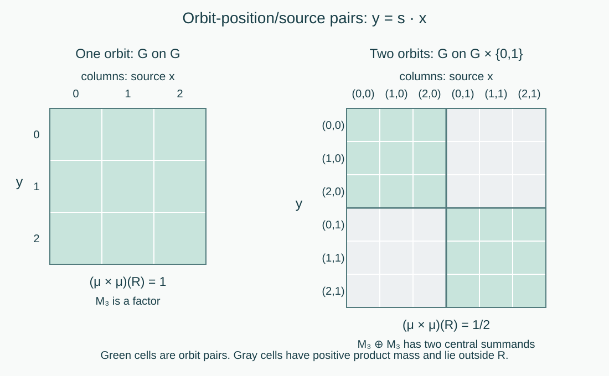
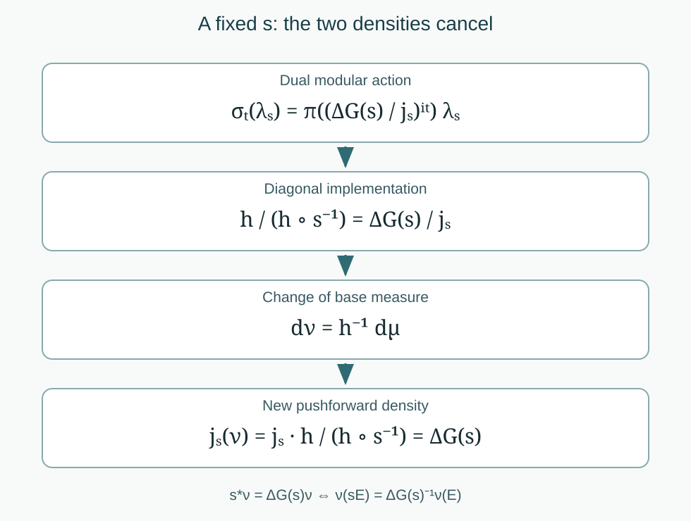

# Type criteria for locally compact free actions

*Written by GPT-6.1 Sol (OpenAI), Ultra, September 2026. New original text is public domain (CC0).*

## Introduction

A conull free orbit gives a type I factor: after changing coordinates, the crossed product acts on one copy of the group and leaves a second copy as multiplicity. The converse uses both the factor and its commutant. Their tensor factorization forces the product measure on two copies of the base space to be concentrated on pairs belonging to the same orbit.

Semifiniteness has a different test. The modular action of the dual weight records two changes of density: the Haar modular function and the base-measure derivative. A trace exists precisely when an equivalent base measure makes these two changes cancel. For a nondiscrete group this can happen even when the base measure is a finite invariant probability; the factor is nevertheless infinite.

We use the regular representation, the full maximal-diagonal criterion, the separable-group scope argument, and the finite criterion in [Free actions and the crossed-product diagonal](free-actions-and-the-crossed-product-diagonal.md), Theorems 3.3, 5.3 and Corollary 5.4. The base is a nonzero standard Borel space with a sigma-finite measure, completed when necessary. The group is separable locally compact Hausdorff, as in the source, and its action is jointly Borel and nonsingular. Freeness means trivial stabilizers outside a measurable null set. At this scope freeness forces second countability by the cited Theorem 3.3, so Haar measure and the regular Hilbert space are sigma-finite and separable. We assume ergodicity throughout the type classification.

The general prerequisites are the injective Borel image theorem, type I factor structure and the exhaustive factor types, and existence of a faithful normal semifinite trace on a semifinite algebra. For the semifinite test we also use the general affiliated-density and modular-perturbation theorems, and the dual-weight construction and modular generator formula. We state their precise uses below; their general proofs remain in the modular-theory and crossed-product courses.

## Reading from a measurable action to its factor type

The action lessons follow one system through several representations. Start with a jointly Borel nonsingular action of a separable locally compact Hausdorff group on a nonzero standard sigma-finite measured space. Each result identifies the additional hypothesis it needs. The type classification assumes ergodicity and almost-everywhere trivial stabilizers; the compact wandering arguments specify their pointwise or projection formulation.

| Step | Read and prove | What the next step uses |
| --- | --- | --- |
| 1. Realize the action | Measurable actions and compact models: Theorem 0.1, Lemma 1.1, Theorem 2.2, Proposition 2.4 and Theorems 4.1 and 4.4. | Positive finite densities for each fixed group label, joint Borel versions, strong continuity, a norm-continuous separable function algebra, and a strict conull point model when the group is second countable. |
| 2. Identify the diagonal | [Free actions and the crossed-product diagonal](free-actions-and-the-crossed-product-diagonal.md): Theorems 3.2–3.3, Theorem 4.6 and Proposition 4.7. | The full equivalence of trivial stabilizers almost everywhere, compact wandering freeness and the maximal diagonal. Faithfulness forces second countability at the standing group scope. Ergodicity then gives a factor. |
| 3. Determine the type | Sections 1–5 of this lesson, together with Theorem 5.3 and Corollary 5.4 of the free-action lesson. | A conull orbit detects type I. A finite equivalent invariant measure gives finiteness only with a discrete group. The full twisted measure equation detects semifiniteness, including nondiscrete and nonunimodular groups. |
| 4. Keep the point model and measure scope exact | [Compact fixed sets and free Polish models](compact-fixed-sets-and-free-polish-models.md): Theorem 3.3, Corollary 3.4 and Lemma 4.2. | A common invariant free Polish restriction, including the given nonunital function algebra. Closure and Haar averaging handle an arbitrary subgroup in the invariant-density obstruction; the competing measure is sigma-finite. |
| 5. Check the two diagonal proofs | [Orbit representatives and null fibre exceptions](orbit-representatives-and-null-fibre-exceptions.md), Theorems 5.1–5.2; [Fourier cutoffs and the free diagonal](fourier-cutoffs-and-the-free-diagonal.md), Sections 1–5. | The orbit proof needs irreducibility almost everywhere and the stated full regular conjugation theorem. The Fourier proof supplies its own fixed-coaction calculation, using an enlarged compact wandering set and a neighborhood plateau. |
| 6. Test the examples | [Weyl lattices and coupling dimension](weyl-lattices-and-coupling-dimension.md), Theorems 2.1, 3.2 and 4.2; [Ratio sets and intrinsic modular spectra](ratio-sets-and-intrinsic-modular-spectra.md), Theorem 3.1 and Examples 4.2–4.3. | The Weyl factor parameter is the product \(ab/(2\pi)\), with coupling dimension \(|ab|/(2\pi)\) in the original representation. Essential affine ratios identify the type III subtypes under the exact modular-spectrum prerequisites. |

Three distinctions organize the proofs. First, a null fixed-point set for every separate nonidentity element does not imply the full compact wandering condition: the reflection example in the compact-model lesson exhibits a compact family whose fixed sets cover the space. Second, an orbitwise C*-representation need not extend to a normal point evaluation of the entire measured algebra. The free null-orbit example explains why a statement at every original point is stronger than the conull statement needed by the direct integral. Third, an equivalent finite invariant base measure does not by itself make a nondiscrete crossed product finite. The twisted-density test and the finite-algebra test answer different questions.

For the source exercises, begin with the Weyl lesson's eight complete solutions, then work through the compact-model lesson's nine solutions and the eight in each of the orbit and Fourier lessons. The first exercise has a completed correction of its printed parameter and recovery claim; the seventh has a completed correction of its Haar powers and every-point irreducibility claim. The intended commutant, dimension and maximal-diagonal conclusions have their complete proofs at the stated hypotheses.

The [Borel-carrier lesson](borel-carriers-and-uniform-wandering-neighborhoods.md#3-the-full-measurable-compact-wandering-conclusion) proves the fifth exercise's measurable compact wandering conclusion without Radon regularity. Its carrier is a countable union of compact sets; the extracted positive wandering subset is Borel and need not be compact. The source's positive compact extraction is proved for Radon measures and for the full atomic standard-measure branch. Its remaining atomless standard-measure case, in the original locally compact topology with the full free, ergodic, quasi-invariant and full-support hypotheses, remains open. The regularity dichotomy identifies precisely what still needs a proof or a counterexample.

The general type, finite and semifinite trace, standard conjugation, affiliated-density and dual-weight results remain explicit prerequisites where used. The independent Fourier route requires neither the full regular conjugation identity nor an amenability assumption.

## 1. Haar conventions and a transitive measure class

Write \(m\) for left Haar measure and fix the convention
\[
m(Eh)=\Delta_G(h)m(E),\qquad
\int_G F(sh)\,dm(s)=\Delta_G(h)^{-1}\int_G F(s)\,dm(s).
\tag{1.1}
\]
Thus, for the positive affine group \((a,b)(c,d)=(ac,ad+b)\), left Haar measure is \(a^{-2}\,da\,db\) and \(\Delta_G(a,b)=a^{-1}\). For an action write \(s_*\nu(E)=\nu(s^{-1}E)\). These definitions distinguish pushforward from set-image measure.

**Lemma 1.1 (a transitive nonsingular measure class).** A nonzero sigma-finite Borel measure \(\nu\) on a second countable locally compact group, equivalent to each of its left translates, is equivalent to left Haar measure.

*Proof.* Replace \(\nu\) by an equivalent probability. This retains quasi-invariance. Choose compact sets \(C_n\) covering \(G\). The function
\[
k_0(s)=\sum_{n\geq1}\frac{2^{-n}}{1+m(C_n)}\mathbf1_{C_n}(s)
\]
is Borel, everywhere positive, and has finite positive integral. Normalize it to \(k\) with \(\int k\,dm=1\). Define a probability
\[
\rho(E)=\int_G k(s)\nu(s^{-1}E)\,dm(s).
\tag{1.2}
\]
If \(\nu(E)=0\), every integrand vanishes. If \(\nu(E)>0\), quasi-invariance makes \(\nu(s^{-1}E)>0\) for every \(s\), and the integral is positive. Thus \(\rho\sim\nu\).

For nonnegative Borel \(F\), Tonelli and the right-translation formula give
\[
\begin{aligned}
\int_G F\,d\rho
&=\int_G\int_G k(s)F(sx)\,dm(s)\,d\nu(x)\\
&=\int_G F(w)\left[\int_G\Delta_G(x)^{-1}k(wx^{-1})\,d\nu(x)\right]dm(w).
\end{aligned}
\tag{1.3}
\]
The bracket is positive at every \(w\), and finite for Haar-almost every \(w\), since \(\rho\) is a probability. Hence \(\rho\sim m\), proving \(\nu\sim m\). No invariance or unimodularity was assumed. \(\square\)

**Theorem 1.2 (the algebra of a conull free orbit).** If one orbit is conull, then
\[
\mathcal M\cong B(L^2(G,m)).
\tag{1.4}
\]
It is type \(I_{|G|}\) when \(G\) is finite and type \(I_\infty\) otherwise.

*Proof.* Choose a free point \(x_0\) in the conull orbit. Every point in its orbit is free, because its stabilizer is a conjugate of the stabilizer of \(x_0\). The Borel map \(s\mapsto sx_0\) is injective. The injective Borel image theorem makes its image \(O\) Borel and its inverse Borel. Transport \(\mu|_O\) to a measure \(\nu\) on \(G\); the transported measure is sigma-finite. Nonsingularity gives left quasi-invariance, so Lemma 1.1 gives \(\nu\sim m\).

Changing the source-coordinate measure from \(\nu\) to \(m\) is unitary: multiply by \((d\nu/dm)(x)^{1/2}\). This intertwines every regular generator because the group translation changes only \(s\). We are therefore on \(L^2(G\times G,dm(s)dm(x))\), with \(\pi(f)\xi(s,x)=f(sx)\xi(s,x)\). Put \(w=sx\) and define
\[
(Q\xi)(w,x)=\Delta_G(x)^{-1/2}\xi(wx^{-1},x).
\tag{1.5}
\]
For fixed \(x\), (1.1) gives \(dm(s)=\Delta_G(x)^{-1}dm(w)\); thus \(Q\) is an onto isometry. In these coordinates
\[
Q\pi(f)Q^*=M_f\otimes1,\qquad
Q\lambda_gQ^*=L_g\otimes1,
\tag{1.6}
\]
where \((L_g\eta)(w)=\eta(g^{-1}w)\).

The multiplication algebra on \(L^2(G,m)\) is maximal abelian. For completeness, choose an everywhere positive \(q\in L^2(G,m)\). If \(T\) commutes with multiplication, then on vectors \(fq\), with \(f\) bounded, it has the form \(Tfq=fTq\). Writing \(a=Tq/q\), the norm bound on indicator multiples of \(q\) proves \(|a|\leq\|T\|\) almost everywhere. Those vectors are dense, so \(T=M_a\).

A multiplier commuting with every \(L_g\) satisfies \(a(gw)=a(w)\) almost everywhere for each fixed \(g\). Choose a Borel representative. Fubini makes this equality hold for almost every pair \((g,w)\). For almost every fixed \(w\), the nonsingular bijection \(g\mapsto gw\) then shows that \(a\) equals the constant \(a(w)\) Haar-almost everywhere. Thus the commutant of \(\{M_f,L_g\}\) is scalar. The bicommutant theorem proves that these operators generate \(B(L^2(G))\). Equation (1.6) now proves (1.4), including the multiplicity in the regular representation.

For finite \(G\), \(L^2(G)\) has dimension \(|G|\). For infinite \(G\), arbitrarily many distinct points have disjoint relatively compact open neighborhoods of positive Haar measure. Their normalized indicators give arbitrarily large orthonormal families. Separability then gives countably infinite dimension. \(\square\)

## 2. Why a type I factor forces one orbit

**Lemma 2.1 (factor and commutant in a type I representation).** If a type I factor \(\mathcal M\) acts faithfully and normally on a separable Hilbert space \(H\), there are separable Hilbert spaces \(K,L\) and a unitary \(T:K\otimes L\to H\) with
\[
T^*\mathcal MT=B(K)\otimes1,\qquad
T^*\mathcal M'T=1\otimes B(L).
\tag{2.1}
\]
Consequently multiplication \(a\otimes b\mapsto ab\) extends to a faithful normal isomorphism \(\mathcal M\bar\otimes\mathcal M'\to B(H)\).

*Proof.* The type I structure theorem supplies matrix units \(e_{ij}\in\mathcal M\), with \(\sum_i e_{ii}=1\) strongly; the index set is finite or countable. Fix an index \(0\), put \(L=e_{00}H\), and define \(T(\delta_i\otimes\zeta)=e_{i0}\zeta\). Matrix-unit multiplication proves isometry on finite sums. The ranges are the mutually orthogonal \(e_{ii}H\) and sum to \(H\), proving surjectivity. It intertwines the matrix units with \(|\delta_i\rangle\langle\delta_j|\otimes1\), hence the whole normal algebra. An operator commuting with these units has identical diagonal blocks and zero off-diagonal blocks, so is \(1\otimes b\). This proves the commutant formula. The two tensor factors generate \(B(K\otimes L)\) normally, and conjugating by \(T\) gives the asserted multiplication isomorphism. \(\square\)

**Theorem 2.2 (the converse).** If the free ergodic crossed product \(\mathcal M\) is type I, the measure is concentrated on a single orbit.

*Proof.* Replace \(\mu\) by an equivalent probability; multiplication by its source density intertwines the regular representations as in Theorem 1.2. On
\(H=L^2(G\times X,dm\,d\mu)\), set \(A=\pi(L^\infty(X))\) and let \(N\) be source multiplication:
\[
(N_f\xi)(s,x)=f(x)\xi(s,x).
\]
Both copies of \(L^\infty(X)\) are faithful and normal, and \(N\subset\mathcal M'\). Restricting Lemma 2.1 to \(A\bar\otimes N\) therefore gives a faithful normal representation
\[
\Pi:L^\infty(X\times X,\mu\otimes\mu)\longrightarrow B(H),
\quad \Pi(f(y)g(x))=\pi(f)N_g.
\tag{2.2}
\]
Here the spatial product of the two multiplication algebras is the product-measure multiplication algebra: rectangles generate the product sigma-algebra, and their simple functions are dense in its \(L^2\) representation. Their bounded multiplication closure gives the stated von Neumann algebra.

Choose a Borel conull \(X_0\) consisting entirely of free points, by removing a Borel null envelope of the exceptional points. It need not be invariant. The map
\[
\Phi:G\times X_0\longrightarrow X\times X,\qquad
\Phi(s,x)=(sx,x)
\tag{2.3}
\]
is Borel and injective. The injective Borel image theorem makes \(R_0=\Phi(G\times X_0)\) Borel. Its section over each \(x\in X_0\) is exactly \(Gx\).

For \(\xi\in H\), normality of \(\Pi\) makes
\(E\mapsto\langle\Pi(\mathbf1_E)\xi,\xi\rangle\) a finite measure absolutely continuous with respect to \(\mu\otimes\mu\). On rectangles (2.2) identifies this measure with
\[
E\longmapsto\int_{G\times X}\mathbf1_E(sx,x)|\xi(s,x)|^2\,dm(s)\,d\mu(x).
\tag{2.4}
\]
The two finite measures agree on all Borel sets by uniqueness from rectangles. The second is concentrated on \(R_0\). Hence \(\Pi(\mathbf1_{R_0^c})=0\): all its positive quadratic forms vanish. Faithfulness implies \((\mu\otimes\mu)(R_0^c)=0\). Fubini now gives \(\mu(Gx)=1\) for almost every \(x\in X_0\), in particular for one such \(x\). This proves the claim. We have not saturated an exceptional set over an uncountable group or assumed that evaluation at a point defines a normal functional on \(L^\infty\). \(\square\)

Together, Theorems 1.2 and 2.2 prove the complete type I criterion. The tensor multiplication map in Lemma 2.1 is the essential type I input. Section 6, Exercise 6.2 shows its failure for an irrational countable rotation.

*Figure 1. Theorem 2.2 and Exercise 6.7. Rows are target points and columns source points. The left panel is the free translation action of the three-element cyclic group on itself; every pair is an orbit pair. The right panel is its action on two disjoint copies, each of mass one half. Only the two diagonal blocks are orbit pairs, with product-measure mass one half. The right algebra is type I but has a two-dimensional centre, so the factor hypothesis in Lemma 2.1 is essential. The diagram is an exact finite example of the support mechanism in Takesaki III, Chapter XIII, Theorem 1.7(i), not a drawing of the general nondiscrete orbit relation.*

## 3. The dual weight and the twisted measure equation

Put \(\alpha_s f=f\circ s^{-1}\) and let \(\varphi_\mu(f)=\int_X f\,d\mu\) on the positive cone of \(L^\infty(X)\). This is a faithful normal semifinite trace. Write
\[
j_s=\frac{d(s_*\mu)}{d\mu},\qquad
r_s=\frac{d((s^{-1})_*\mu)}{d\mu}.
\tag{3.1}
\]
For each fixed \(s\), these derivatives are finite and positive almost everywhere, and the Radon–Nikodym chain rule gives
\[
r_s(s^{-1}x)=j_s(x)^{-1}.
\tag{3.2}
\]
Indeed \(s_*((s^{-1})_*\mu)=\mu\), whose density is \(j_s(x)r_s(s^{-1}x)\).

We reuse the following exact general results. An abelian trace has trivial modular group. Perturbing it by a positive injective affiliated multiplier \(r\) gives the normalized cocycle \([D\varphi_r:D\varphi]_t=r^{it}\). These are the trace and faithful-density cases of *Recognizing a weight by its fixed density*, Sections 4–5 and 8, with the unbounded perturbation formula in *Fixed elements and changes of density*, Section 11. The dual construction supplies a faithful normal semifinite weight \(\omega_\mu\) on the crossed product. Its modular formula, from *How the dual weight moves crossed-product generators*, is
\[
\begin{aligned}
\sigma_t^{\omega_\mu}(\pi(f))&=\pi(f),\\
\sigma_t^{\omega_\mu}(\lambda_s)
&=\Delta_G(s)^{it}\lambda_s\pi([D(\varphi_\mu\circ\alpha_s):D\varphi_\mu]_t).
\end{aligned}
\tag{3.3}
\]
The construction and formula allow arbitrary locally compact groups and faithful normal semifinite base weights. Thus they apply to the present action without a bounded density or an invariant base measure.

The measure of \(\varphi_\mu\circ\alpha_s\) is \((s^{-1})_*\mu\), with density \(r_s\). The abelian perturbation formula and covariance turn (3.3) into
\[
\sigma_t^{\omega_\mu}(\lambda_s)
=\Delta_G(s)^{it}\pi(j_s^{-it})\lambda_s.
\tag{3.4}
\]
Moving the right coefficient to the left applies \(\alpha_s\), which is why (3.2) enters. This calculation fixes the inverse and the side on which the derivative occurs.

For a sigma-finite measure \(\nu\sim\mu\), the **twisted measure equation** is
\[
s_*\nu=\Delta_G(s)\nu\quad(s\in G).
\tag{3.5}
\]
Equivalently,
\[
\nu(sE)=\Delta_G(s)^{-1}\nu(E),\qquad
\Delta_G(s)\frac{d(\nu\circ T_s)}{d\nu}=1,
\tag{3.6}
\]
where \((\nu\circ T_s)(E)=\nu(sE)\). The last expression is Takesaki III, Chapter XIII, equation (8). Each derivative equality is almost everywhere for the fixed \(s\); the measure equality holds for all measurable \(E\). No joint pointwise derivative identity over an uncountable group is required. For a unimodular group, (3.5) is ordinary invariance.

## 4. Semifiniteness is exactly cancellation of the densities

We will use two modular-theory prerequisites in their full weight form. For a faithful normal semifinite trace \(\tau\) and a faithful normal semifinite weight \(\omega\), there is a positive injective self-adjoint operator \(h\), affiliated with the algebra, such that
\[
\omega=\tau_h,\qquad
\sigma_t^\omega=\operatorname{Ad}(h^{it}).
\tag{4.1}
\]
This follows from the faithful invariant-weight theorem because \(\sigma^\tau=\mathrm{id}\), and from the unbounded-density perturbation theorem. It does not require \(h\) to be bounded, integrable, or measurable in the finite-trace sense. We also use the centralizer theorem: a fixed element is a two-sided multiplier of the finite linear weight domain and cyclically commutes with the weight there.

Here is the trace test needed for the application, including its infinite values.

**Lemma 4.1 (trace test in the regular algebra).** On the present crossed product \(\mathcal M\), a faithful normal semifinite weight \(\theta\) with trivial modular group is a trace.

*Proof.* Every element is in its centralizer, so the centralizer theorem makes the finite linear domain a two-sided ideal with cyclic weight. There are increasing projections \(p_n\uparrow1\) with \(\theta(p_n)<\infty\). To see this directly, the span of the finite positive elements is ultraweakly dense by semifiniteness. In any nonzero projection \(q\), there is therefore a finite positive \(b\) with \(qbq\ne0\): otherwise compression by \(q\) would vanish on that dense span and hence on the identity. The ideal property makes \(qbq\) a finite positive element supported in \(q\). A nonzero spectral projection \(p=1_{[\varepsilon,\infty)}(qbq)\leq q\) has finite weight by \(p\leq\varepsilon^{-1}qbq\). A maximal orthogonal family of such projections sums to one. Sigma-finiteness makes it countable: a faithful normal state is positive on each member, and only countably many positive numbers can have bounded finite partial sums. Finite partial sums give \(p_n\).

For \(b\in\mathcal M\), cyclicity on the ideal gives
\[
\theta(bp_nb^*)=\theta(p_nb^*b)=\theta(p_nb^*bp_n).
\tag{4.2}
\]
The last equality also follows from the centralizer projection decomposition: the off-diagonal terms have zero weight. That decomposition gives \(\theta(p_nxp_n)\leq\theta(x)\) for \(x\geq0\). Normal weights are lower semicontinuous on the positive cone for bounded strong convergence; since \(p_nxp_n\to x\) strongly, these inequalities show \(\theta(p_nxp_n)\to\theta(x)\), allowing infinity. Meanwhile \(bp_nb^*\uparrow bb^*\), so normality and (4.2) imply \(\theta(b^*b)=\theta(bb^*)\). This is the trace identity on all bounded \(b\). \(\square\)

**Theorem 4.2 (the general semifinite criterion).** For a free ergodic nonsingular action at the stated separable locally compact group scope, the crossed-product factor is semifinite if and only if an equivalent sigma-finite measure satisfies (3.5).

*Proof, measure to trace.* Construct the dual weight using \(\varphi_\nu\). Changing an equivalent base measure gives the same abstract regular crossed product: source-density multiplication intertwines its generating representation. Formula (3.4), now with \(j_s^\nu=\Delta_G(s)\), makes the modular group fix every \(\lambda_s\) and \(\pi(f)\). These generate the algebra; normality makes the group the identity everywhere. Lemma 4.1 makes this faithful normal semifinite dual weight a trace. The factor is semifinite.

*Proof, trace to measure.* Semifiniteness supplies a faithful normal semifinite trace \(\tau\). Apply (4.1) to \(\omega_\mu\). Since its modular group fixes \(A=\pi(L^\infty(X))\), every \(h^{it}\) commutes with \(A\). It also belongs to \(\mathcal M\). The free-action maximal-diagonal criterion therefore gives \(h^{it}\in A\) for every real \(t\).

It follows that \(h\) is affiliated with \(A\). For example, the resolvents of the self-adjoint generator \(\log h\) are strong integrals of its unitary group on the positive or negative time half-line, so belong to \(A\). Their spectral calculus gives the spectral projections of \(\log h\), and then of \(h\), in \(A\). Affiliated self-adjoint operators in this multiplication algebra are measurable functions. Write that function also as \(h(x)\). Dense definition and injectivity mean \(0<h(x)<\infty\) almost everywhere.

Equating the two formulas for \(\sigma_t^{\omega_\mu}(\lambda_s)\) gives
\[
\pi\left(\left[\frac{h}{h\circ s^{-1}}\right]^{it}\right)\lambda_s
=\Delta_G(s)^{it}\pi(j_s^{-it})\lambda_s.
\tag{4.3}
\]
For each fixed \(s\), use faithfulness of \(\pi\), and take the union of the null exceptions only over rational \(t\). Equality of the scalar characters on this dense set of times gives
\[
\frac{h(x)}{h(s^{-1}x)}=\frac{\Delta_G(s)}{j_s(x)}
\quad\text{almost everywhere}.
\tag{4.4}
\]
Indeed, continuity extends the characters to all times, and \(e^{itc}=1\) for all real \(t\) forces the real logarithmic difference \(c\) to be zero.

Define \(d\nu=h^{-1}d\mu\). It is equivalent and sigma-finite: intersect a countable finite-\(\mu\) cover with \(\{h^{-1}\leq n\}\). Its pushforward derivative is
\[
j_s^\nu(x)
=j_s(x)\frac{h(x)}{h(s^{-1}x)}
=\Delta_G(s),
\tag{4.5}
\]
which is precisely (3.5). This completes the converse. We used the reciprocal of a possibly unbounded density, without restricting the trace to the diagonal or assuming that such a restriction is semifinite. \(\square\)

**Lemma 4.3 (uniqueness of the twisted measure up to scale).** Two equivalent sigma-finite solutions \(\nu_1,\nu_2\) of (3.5) differ by a finite positive scalar.

*Proof.* The density \(q=d\nu_2/d\nu_1\) is finite and positive almost everywhere. Pushing it forward and canceling the common factor \(\Delta_G(s)\) shows \(q\circ s^{-1}=q\) as a measurable class for every fixed \(s\). Each rational sublevel indicator is therefore invariant as a class. Proposition 4.7 of the free-action lesson supplies an exactly invariant Borel representative; ergodicity makes every such sublevel null or conull. This forces \(q\) to be constant almost everywhere. Its finiteness and positivity give the asserted scalar. \(\square\)

*Figure 2. Equations (3.4) and (4.4)–(4.5). The dual modular multiplier is the Haar factor divided by the pushforward density. An affiliated diagonal density implements that multiplier. Changing the base measure by its reciprocal makes the new pushforward density exactly the Haar factor. Every equality is at a fixed group element; the diagram asserts no common exceptional null set. This is the mechanism of Takesaki III, Chapter XIII, Theorem 1.7(iii), using the general modular and dual-weight prerequisites stated above.*

## 5. All four factor types and their examples

**Theorem 5.1 (complete free-action type criteria).** Under the stated hypotheses:

| Factor type | Necessary and sufficient condition |
| --- | --- |
| \(I\) | A single orbit is conull. Its algebra is \(B(L^2(G))\). |
| \(II_1\) | \(G\) is discrete and infinite, and an equivalent finite invariant measure exists. |
| \(II_\infty\) | No single orbit is conull, and an equivalent sigma-finite measure \(\nu\) satisfies (3.5); when \(G\) is discrete, \(\nu(X)=\infty\). |
| \(III\) | No equivalent sigma-finite measure satisfies (3.5). |

*Proof.* Freeness makes \(A\) maximal abelian. An element of the centre therefore lies in \(A\); commuting with the group generators makes its function class invariant. Ergodicity and the invariant-representative argument make it scalar, so \(\mathcal M\) is a factor. The type I row is Theorems 1.2 and 2.2. The finite criterion and its type \(II_1\) refinement are Theorem 5.3 and Corollary 5.4 of the free-action lesson. The source's nonzero absolutely continuous finite invariant measure formulation is equivalent under ergodicity, as proved there.

For the \(II_\infty\) row, Theorem 4.2 gives semifiniteness and nontransitivity excludes type I. A nondiscrete free crossed product is never finite, by the finite criterion, so it is \(II_\infty\). If \(G\) is discrete, its modular function is one. When \(\nu\) is infinite, a finite equivalent invariant measure is impossible by Lemma 4.3; the finite criterion again excludes finiteness. Conversely, a \(II_\infty\) factor is semifinite and is not type I, giving \(\nu\) and nontransitivity. If \(G\) is discrete this \(\nu\) cannot be finite, since the finite criterion would make the factor finite. Finally the exhaustive factor alternatives say that a factor is type III exactly when it is not semifinite. Theorem 4.2 gives the last row. \(\square\)

The sigma-finite qualification on equivalent measures is explicit throughout. It is the measure class used by the source proof and the weight construction. An infinite value on every positive set is not a substitute for a semifinite measure. No subtype \(III_\lambda\) is inferred from the type III row.

**Example 5.2 (a nonunimodular type I factor).** Let the positive affine group act on itself by left translation, with left Haar measure. The action is free and transitive. Its crossed product is type \(I_\infty\) by Theorem 1.2. The twisted measure is right Haar measure,
\[
d\nu(a,b)=a^{-1}\,da\,db=\Delta_G(a,b)^{-1}dm(a,b).
\tag{5.1}
\]
For left multiplication by \((c,d)\), the Jacobian on \((a,b)\) is \(c^2\), and the new first coordinate is \(ca\). Thus \(\nu((c,d)E)=c\nu(E)=\Delta_G(c,d)^{-1}\nu(E)\), verifying (3.6). Ordinary left Haar invariance would leave the modular multiplier \(\Delta_G(s)^{it}\) uncanceled; it does not make that particular dual weight tracial. The factor itself nevertheless has a semifinite trace.

**Example 5.3 (finite invariant probability and type \(II_\infty\)).** Fix irrational \(\theta\), and let \(\mathbb R\) act on \(\mathbb T^2\) by
\[
t(z_1,z_2)=(e^{2\pi it}z_1,e^{2\pi i\theta t}z_2).
\tag{5.2}
\]
Use Haar probability. A stabilizing \(t\) is an integer with \(\theta t\) integral, so \(t=0\). Fourier characters \(z_1^mz_2^n\) have frequency \(m+\theta n\); only the constant character has frequency zero. Completeness of the Fourier characters in \(L^2(\mathbb T^2)\) proves ergodicity. Each orbit is a Borel injective image of \(\mathbb R\). For a fixed first coordinate its second-coordinate section is countable, because the possible times differ by integers. Fubini therefore makes every orbit Haar-null. The group is unimodular, so the invariant probability satisfies (3.5); nontransitivity and nondiscreteness give type \(II_\infty\). The dual trace has infinite value on the identity, since a finite faithful trace would contradict the finite criterion. The base integral of one is not the dual weight of the crossed-product identity in this nondiscrete construction.

**Example 5.4 (a discrete type III affine action).** Let \(\Gamma=\mathbb Q\rtimes\mathbb Q_{>0}\) act on \(\mathbb R\) by rational translations and positive rational dilations, with Lebesgue measure \(\ell\). The nonidentity translations fix no points; every other nonidentity affine map fixes one rational point. Removing \(\mathbb Q\) gives an invariant conull free Borel set.

The rational-translation subgroup is ergodic for \(\ell\). Indeed, translations act continuously on locally integrable bounded functions: on each compact interval this follows by approximating in \(L^1\) by continuous compactly supported functions. Invariance under the dense subgroup \(\mathbb Q\) extends to every real translation. Fubini, followed by the change of variable \(y=x+t\), then makes the function constant almost everywhere. Applying this to indicators proves ergodicity.

If an equivalent sigma-finite \(\Gamma\)-invariant measure \(\eta\) existed, its finite positive density relative to \(\ell\) would be invariant under rational translations, and their ergodicity would force \(\eta=c\ell\). Dilation by two gives \(\eta(2E)=2\eta(E)\), contradicting invariance on a set of finite positive Lebesgue measure. Since the group is discrete, (3.5) is invariance, and Theorem 5.1 gives type III. Determining its modular subtype requires the separate corner-spectrum theorem.

## 6. Exercises with solutions

Level 1 asks for a computation or a direct application. Level 2 asks for a proof using the lesson’s framework. Level 3 combines results or examines a hypothesis whose failure changes the conclusion.

**Exercise 6.1 (the nonunimodular coordinate multiplier).** *Level 1.* Let \(s=(c,d)\), \(x=(a,b)\) in the positive affine group. Write \(w=sx=(u,v)\). Verify the Haar Jacobian in (1.5) and give the coordinate formula for \(Q\).

*Solution.* We have \(u=ca\), \(v=cb+d\); the Jacobian from \((c,d)\) to \((u,v)\) is \(a\). Hence \(c^{-2}dc\,dd=a u^{-2}du\,dv\), agreeing with \(\Delta_G(x)^{-1}=a\). The inverse is \(c=u/a\), \(d=v-ub/a\). Therefore
\[
(Q\xi)((u,v),(a,b))=\sqrt a\,\xi((u/a,v-ub/a),(a,b)).
\]
The squared multiplier is \(a\), exactly the density change of the source integral; this proves its norm preservation. The source-coordinate Haar measure stays unchanged.

**Exercise 6.2 (failure of a normal product representation).** *Level 3.* Let \(\mathbb Z\) act on \(\mathbb T\) by an irrational rotation with Haar probability. In the regular representation use commuting orbit-position and source multiplications. Prove that their product action on rectangles cannot extend to a faithful normal representation of \(L^\infty(\mathbb T^2)\) with the product measure.

*Solution.* The orbit relation \(R\) is a countable union of Borel graphs, and each vertical section is countable, so product Haar measure gives \(R\) measure zero. Every scalar vector measure of the regular product operators agrees on rectangles with the pushforward of \(|\xi(n,x)|^2\) under \((n,x)\mapsto(T^nx,x)\). This finite measure is concentrated on \(R\) and has total mass \(\|\xi\|^2\). A normal product-measure representation would give an absolutely continuous scalar measure, which vanishes on \(R\). For nonzero \(\xi\) the two measures cannot agree, contradicting uniqueness from rectangles. In fact no normal extension with these generator values exists. Thus Lemma 2.1's normal multiplication conclusion cannot hold for this type \(II_1\) factor.

**Exercise 6.3 (changing a base measure).** *Level 1.* Let \(d\nu=q\,d\mu\), with \(q\) finite and positive almost everywhere. Compute \(j_s^\nu\) from \(j_s^\mu\), and apply it to \(q=h^{-1}\) in Theorem 4.2.

*Solution.* For every nonnegative test function \(F\),
\[
\int F\,d(s_*\nu)=\int F(sx)q(x)\,d\mu(x)
=\int F(y)q(s^{-1}y)j_s^\mu(y)\,d\mu(y).
\]
Dividing by the density \(q(y)\) of \(\nu\) gives
\(j_s^\nu=j_s^\mu(q\circ s^{-1})/q\). Substitution of \(q=h^{-1}\) yields \(j_s^\nu=j_s^\mu h/(h\circ s^{-1})=\Delta_G(s)\). Both measures are sigma-finite by bounded-density pieces of finite-\(\mu\) sets. No bound on \(q^{-1}\) is needed.

**Exercise 6.4 (which density implements the modular action?).** *Level 2.* In Example 5.2 take \(\mu=m\). Find \(h\) for which (4.4) holds, and check that \(h^{-1}\mu\) is (5.1).

*Solution.* Left Haar measure has \(j_s=1\). Set \(h(x)=\Delta_G(x)\). Since \(\Delta_G(s^{-1}x)=\Delta_G(s)^{-1}\Delta_G(x)\), the ratio \(h(x)/h(s^{-1}x)=\Delta_G(s)\) is exactly (4.4). Thus \(h^{-1}m\) is right Haar measure. In affine coordinates \(h(a,b)=a^{-1}\), which is unbounded and has unbounded reciprocal. These features are allowed in the affiliated-density theorem.

**Exercise 6.5 (an invariant null envelope is unnecessary).** *Level 2.* In Theorem 2.2 suppose \(X_0\) is Borel, conull, and consists of free points but is not invariant. Prove that \(\Phi\) is still injective and that every vector pushforward in (2.4) is supported on \(R_0\).

*Solution.* Equality of \((sx,x)\) and \((ty,y)\) gives \(x=y\), and then \(t^{-1}s\) stabilizes this free point; thus \(s=t\). Injectivity uses freeness of the source alone. The set \(G\times(X\setminus X_0)\) is null for the sigma-finite product measure, by Tonelli on a finite-Haar cover. Consequently its \(|\xi|^2\) integral is zero. All remaining source pairs map into \(R_0\), proving support there. The orbit position \(sx\) may lie outside \(X_0\); it remains a point of \(X\), the codomain in (2.3).

**Exercise 6.6 (finite and infinite twisted solutions).** *Level 2.* For an ergodic action assume an equivalent sigma-finite twisted measure exists. Show that finiteness of its total mass is independent of the choice of twisted solution. Explain why finite mass gives type \(II_1\) only with the discrete infinite-group condition.

*Solution.* Lemma 4.3 makes all such measures finite positive scalar multiples, so their total masses are all finite or all infinite. For a discrete infinite group, the twist is invariance, and finite total mass gives the type \(II_1\) criterion. For a nondiscrete group, the crossed product is infinite even if a finite twisted solution exists. Example 5.3 gives a nontransitive instance, which is \(II_\infty\). Transitivity instead gives type I by Theorem 1.2. The finite mass alone therefore does not determine the factor type.

**Exercise 6.7 (the factor hypothesis in tensor multiplication).** *Level 2.* Let \(G=\mathbb Z/3\mathbb Z\) act on \(X=G\times\{0,1\}\) by \(s(q,i)=(q+s,i)\), with uniform probability on its six points. Compute the crossed product, the product-measure mass of the orbit relation, and a nonzero tensor killed by multiplication \(\mathcal M\bar\otimes\mathcal M'\to B(H)\).

*Solution.* The two invariant orbits each have mass \(1/2\). Their indicator projections \(p_0,p_1\) are central and split the regular representation into two orbit representations. On each orbit Theorem 1.2 gives \(M_3(\mathbb C)\) with a three-dimensional multiplicity. Hence \(\mathcal M=M_3(\mathbb C)\oplus M_3(\mathbb C)\), with two-dimensional centre. The orbit relation is \((O_0\times O_0)\cup(O_1\times O_1)\), whose product probability is \((1/2)^2+(1/2)^2=1/2\). Both \(p_0\) and \(p_1\) are nonzero, so \(p_0\otimes p_1\) is nonzero in the spatial tensor product. Since central projections belong to the commutant as well, it is in the stated domain, but its multiplication image is \(p_0p_1=0\). The multiplication map exists normally here and fails faithfulness. This differs from Exercise 6.2, where the product-measure representation fails normality. Ergodicity excludes this two-orbit example from Theorem 2.2.

## References

[Takesaki] Masamichi Takesaki, *Theory of Operator Algebras III*, Encyclopaedia of Mathematical Sciences 127, Springer, 2003, Chapter XIII, Theorem 1.7 and equation (8). [Publisher record](https://doi.org/10.1007/978-3-662-10453-8).

The general type and trace prerequisites are [Projections and types of von Neumann algebras](https://kokunoyumeto.github.io/open-math-courses-public/courses/foundations-of-von-neumann-algebras/projections-and-types-of-von-neumann-algebras.html), Theorems 7.2, 10.3 and Corollary 10.4, and [Traces on von Neumann algebras](https://kokunoyumeto.github.io/open-math-courses-public/courses/OA-FOUND-REMAINDER/reader/supplements/traces-on-von-neumann-algebras-part-a-def-v-2-1-to-def-v-2-17.html), Theorem 6.7. The descriptive-set input is the injective Borel image and inverse theorem, as stated in the prerequisite discussion of [Orbits, stabilizers, and relation algebras](orbits-stabilizers-and-relation-algebras.md).

The modular prerequisites are the faithful invariant-weight density theorem in *Recognizing a weight by its fixed density*, Sections 1–5, its trace modular-group calculation in Section 8, and the centralizer and unbounded-density formulas in *Fixed elements and changes of density*, Sections 5 and 11. The dual prerequisites are *Extending the dual weight beyond the common involution domain*, the construction and quadratic-domain theorem, and *How the dual weight moves crossed-product generators*, its modular generator theorem. These general results belong to the modular-theory and crossed-product lessons named above. They correspond to the weight and crossed-product machinery used in Takesaki, *Theory of Operator Algebras II*, Chapter X, Theorem 1.17. Only their present free-action applications are proved here.
