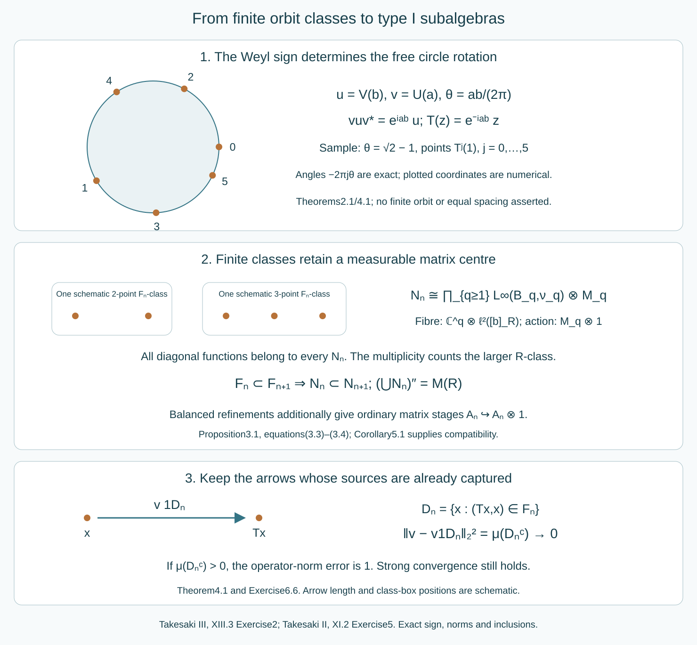

# Type I stages in irrational rotation factors

*Written by GPT-6.1 Sol (OpenAI), Ultra, October 2026. Self-checked by the writing AI. New original text is public domain (CC0).*

## Introduction

A finite subrelation gives a type I algebra, with a measurable matrix block at each finite class. Its centre can remain diffuse. Increasing these subrelations recovers the full relation algebra by strong limits of restricted orbit operators. This is the operator-algebra step needed in Takesaki III, XIII section 3, Exercise 2.

We first identify the exercise's irrational Weyl factor with a free circle-rotation crossed product. We then prove the finite-stage construction in that same regular representation and transfer it back to the original factor. Finally, the already proved balanced-array theorem supplies the stronger approximation by ordinary finite-dimensional matrix algebras.

The printed exercise ends with a single commutant. Its page image confirms that notation. The intended generation statement requires a double commutant; Section 4 proves that the literal single-commutant assertion is impossible for subalgebras of a type \(II_1\) factor.

The exercise starts with the type \(II_1\) factor identified in XIII.1, Exercise 1(a). We retain that premise. The general theorem that a finite factor has a faithful normal tracial state, and its faithful normal tracial GNS representation, are explicit prerequisites. The concrete commutant and coupling-constant assertions of XIII.1, Exercise 1, are separate tasks. We use the exact owned [finite-class selectors and matrix model](finite-orbit-classes-and-matrix-blocks.md#1-sorting-a-finite-class-measurably), [tower and finite-exhaustion proofs](towers-and-odometer-orbits.md#3-positioning-a-finite-cycle), [free countable crossed-product identification](free-actions-and-the-crossed-product-diagonal.md#5-a-continuous-orbit-with-a-transverse-parameter), and [balanced-array matrix theorem](balanced-arrays-and-the-hyperfinite-finite-factor.md#5-increasing-ordinary-matrix-algebras). Their general statements are retained; the applications and the representation comparison below are proved here.

*Figure 1. The circle rotation is \(T(z)=e^{-2\pi i\theta}z\), with \(\theta\) irrational. The drawn orbit segment and class boxes are schematic. The operator \(v1_{D_n}\) keeps exactly those source arrows already in the finite subrelation; its squared tracial L² norm error is \(\mu(D_n^c)\). Type I stages retain every diagonal function and have measurable matrix entries, whereas balanced stages are ordinary matrix algebras with exactly refining diagonal partitions. The equations, inclusions and error are exact; no orbit spacing or class-size bound is inferred from the picture. Reproducible source: make_rotation_stage_figure.py.*

## 1. The Weyl relation fixes the circle action

The source conventions on \(L^2(\mathbb R)\) are
\[
(U(a)\xi)(r)=\xi(r+a),\qquad
(V(b)\xi)(r)=e^{ibr}\xi(r).
\tag{1.1}
\]
Put
\[
u=V(b),\quad v=U(a),\quad
\theta=\frac{ab}{2\pi},\quad \lambda=e^{2\pi i\theta}.
\]
Direct substitution gives
\[
vuv^*=\lambda u.
\tag{1.2}
\]
Assume \(\theta\) is irrational. In particular \(a,b\) are nonzero. Let
\(\mathcal R=\{u,v\}''\), with the type \(II_1\) premise of the source exercise, and let \(\tau\) be its faithful normal tracial state.

**Lemma 1.1 (the trace moments).** The Laurent monomials \(u^m v^n\), \(m,n\in\mathbb Z\), have trace zero except when \(m=n=0\). They form an orthonormal basis of \(L^2(\mathcal R,\tau)\). The spectral distribution of \(u\) for \(\tau\) is normalized Haar measure on the circle.

*Proof.* Conjugation by \(v\) multiplies \(u^m v^n\) by \(\lambda^m\). If \(m\ne0\), irrationality makes this scalar different from 1, and trace invariance forces the trace to vanish. If \(m=0\) and \(n\ne0\), conjugation by \(u\) multiplies \(v^n\) by \(\lambda^{-n}\), with the same conclusion. The remaining monomial is 1.

Reordering with (1.2) shows that the inner product of two distinct monomials is zero. Every monomial is unitary and has squared norm 1. Their span is the unital star-algebra generated by \(u,v\). Its norm closure is a C*-algebra whose bicommutant is \(\mathcal R\). Kaplansky density supplies bounded strong approximations to any element of \(\mathcal R\); normality of the vector state \(\tau\) gives the corresponding \(L^2\) approximation. Hence the span is dense.

The moments \(\tau(u^m)\) agree with those of Haar measure. Trigonometric polynomials are uniformly dense in continuous functions on the circle, so their integrals determine the spectral probability measure. It is Haar measure. Faithfulness of \(\tau\) makes spectral projections with Haar-null support exactly zero. Thus Borel functional calculus identifies \(\{u\}''\) normally and faithfully with \(L^\infty(\mathbb T,m)\), by \(f\mapsto f(u)\). \(\square\)

Define
\[
T(z)=\lambda^{-1}z,\qquad
\alpha_n(f)=f\circ T^{-n}.
\tag{1.3}
\]
The coordinate function \(z\) then satisfies \(\alpha_1(z)=\lambda z\), agreeing with (1.2). The sign is determined by the covariance convention.

**Lemma 1.2 (free ergodic rotation).** \(T\) preserves Haar probability, is free at every point, and is ergodic.

*Proof.* A nonzero power fixing a point would give \(\lambda^n=1\), impossible. Rotation preserves Haar measure. If \(f\in L^2(\mathbb T,m)\) is invariant, its Fourier coefficient at \(k\) is multiplied by \(\lambda^k\) under composition with \(T^{-1}\). Thus every coefficient except \(k=0\) vanishes. Trigonometric polynomials are dense in \(L^2\), so \(f\) is constant. Apply this to an invariant indicator to obtain ergodicity. \(\square\)

## 2. An exact normal crossed-product isomorphism

Let \(N=L^\infty(\mathbb T,m)\rtimes_\alpha\mathbb Z\) be the regular crossed product. Denote its coordinate multiplier by \(u_0\) and its implementing unitary by \(v_0\). The owned free-action and invariant-measure proofs give the faithful normal trace
\[
\tau_N(fv_0^n)=
\begin{cases}\displaystyle\int f\,dm,&n=0,\\0,&n\ne0.\end{cases}
\tag{2.1}
\]
In particular \(v_0u_0v_0^*=\lambda u_0\), and \(u_0^m v_0^n\) have the same orthonormal trace moments as in Lemma 1.1.

The exact weight-GNS prerequisite supplies normality of the representation of a normal state. Its faithfulness here is immediate without importing a further weight theorem: if left multiplication by \(x\) vanishes, apply it to the vector 1 to get \(\tau(x^*x)=0\), hence \(x=0\). The faithful normal representation identifies the von Neumann algebra with its image. The same argument applies to \(\tau_N\).

**Theorem 2.1 (the rotation model).** There is a trace-preserving normal isomorphism
\[
\Phi:N\longrightarrow\mathcal R,\qquad
\Phi(u_0)=u,\quad\Phi(v_0)=v,
\quad\Phi(f)=f(u).
\tag{2.2}
\]

*Proof.* The monomials in \(N\) span a dense subspace of its tracial GNS space. Indeed, the coordinate multiplier generates its diagonal by Borel functional calculus, and the implementing unitary together with that diagonal generates \(N\). The same Kaplansky argument as in Lemma 1.1 applies.

Sending \(u_0^m v_0^n\) to \(u^m v^n\) is therefore an isometry on orthonormal bases and extends to a unitary \(W:L^2(N,\tau_N)\to L^2(\mathcal R,\tau)\), with \(W1=1\). Left multiplication by the generators has exactly the same coefficients:
\[
u(u^m v^n)=u^{m+1}v^n,\qquad
v(u^m v^n)=\lambda^m u^m v^{n+1}.
\tag{2.3}
\]
The identical formulas hold for \(u_0,v_0\). Thus \(W\) intertwines their bounded left-multiplication operators, hence their generated von Neumann algebras. Both faithful normal GNS representations identify those algebras with the original algebras. Conjugation by \(W\) gives (2.2), preserving the trace because \(W1=1\). Normality carries continuous functional calculus to bounded Borel functional calculus, giving \(\Phi(f)=f(u)\) on the entire diagonal. This proves a normal isomorphism, rather than only a correspondence between polynomial relations. \(\square\)

By the owned free countable-action theorem, \(N\) is the regular algebra \(\mathcal M(R_T,m)\) of the principal orbit relation. The explicit unitary sends \((n,x)\) to \((T^n x,x)\). Freeness makes it bijective, and counting distinct orbit points preserves its source measure. This representation comparison leaves all diagonal functions intact.

## 3. Finite classes inside the full relation representation

We prove the operator step for any probability-preserving countable relation \(R\) on a standard probability space. It need not be ergodic or free in a presenting group. Let \(F\subset R\) be a Borel equivalence relation with finite classes and the same unit space \(X\). Define
\[
N_F=\{\ M_f,\ V_\eta:
 f\in L^\infty(X,\mu),\ \operatorname{graph}\eta\subset F\ \}''
\ \subset\mathcal M(R,\mu).
\tag{3.1}
\]
Here \(V_\eta\) is the partial orbit operator of a nonsingular Borel partial bijection.

**Proposition 3.1 (type I stages in the ambient space).** If \(B_q\) is the Borel selector space of the \(q\)-point \(F\)-classes, and \(\nu_q=q\mu|_{B_q}\), then
\[
N_F\cong\prod_{q\ge1}
 L^\infty(B_q,\nu_q)\,\bar\otimes\,M_q(\mathbb C).
\tag{3.2}
\]
The identification is faithful and normal in the ambient representation. In particular \(N_F\) is type I, even when its centre is diffuse.

*Proof.* The owned finite-selector proof orders each class as
\(x_0(b)=b,x_1(b),\ldots,x_{q-1}(b)\). Its partial sheet maps preserve \(\mu\), because their graphs lie in \(R\). Hence all sheets have the same measure as their selector base, and the quotient measure is \(\nu_q\).

Use the range-counting description of the ambient Hilbert space, which equals its source-counting description by invariance:
\[
\|\xi\|^2=\int_X\sum_{y\sim_R x}|\xi(x,y)|^2\,d\mu(x)
=\sum_q\int_{B_q}\frac1q
 \sum_{i<q}\sum_{y\sim_R b}
 |\xi(x_i(b),y)|^2\,d\nu_q(b).
\tag{3.3}
\]
Thus on the \(q\)-point part the unitary has coordinates
\[
(W_F\xi)(b)_{i,y}=q^{-1/2}\xi(x_i(b),y)
\quad\text{in }\mathbb C^q\otimes\ell^2([b]_R).
\tag{3.4}
\]
This is a measurable Hilbert field: enumerate the presenting transformations and retain each first occurrence of an orbit point. Its Borel matrix coordinates give the displayed measurable direct integral.

The sheet map from \(x_j(b)\) to \(x_i(b)\) acts as \(e_{ij}\otimes1\); it changes the row and leaves \(b,y\) fixed. A diagonal function acts as \(\operatorname{diag}(f(x_i(b)))\otimes1\). Every scalar function of \(b\) is supplied by the diagonal function \(f(x)=g(s_F(x))\). These scalar functions and the sheet matrix units generate all bounded measurable matrix fields in (3.2). Conversely, every \(F\)-partial map and every diagonal multiplier acts as such a field. For fixed \(q\), these fields form a von Neumann algebra: each of the finitely many matrix entries belongs to the weakly closed multiplier algebra \(L^\infty(B_q)\). The central projections for different class sizes give the bounded product by strong sums.

Each multiplicity space \(\ell^2([b]_R)\) is nonzero, since it contains \(b\). Hence the essential field norm and the ambient operator norm agree. This proves faithfulness; the direct-integral action is normal, or equivalently its matrix-entry maps preserve bounded increasing limits. The field is a finite matrix algebra over its abelian centre on every \(q\)-piece, which is precisely type I. \(\square\)

The formula concerns \(F\)-class sizes, not the possibly infinite \(R\)-classes. Those larger classes contribute only the second-coordinate multiplicity in (3.4). Retaining that multiplicity is what places the finite stage inside the original algebra.

## 4. Increasing finite subrelations generate the factor

**Theorem 4.1 (strong generation).** Suppose \(F_n\subset R\) increase, have finite classes and the whole unit space, and exhaust \(R\) in source-counting measure. Then \(N_{F_n}\) increase and
\[
\mathcal M(R,\mu)=\left(\bigcup_n N_{F_n}\right)''.
\tag{4.1}
\]
For any presenting transformation \(g\), put
\[
D_{g,n}=\{x:(gx,x)\in F_n\}.
\]
Then \(V_g1_{D_{g,n}}\in N_{F_n}\), it converges strongly to \(V_g\), and, for the diagonal-integral trace,
\[
\|V_g-V_g1_{D_{g,n}}\|_2^2=\mu(D_{g,n}^c).
\tag{4.2}
\]

*Proof.* Inclusion of subrelations gives inclusion of their generating families. Exhaustion makes \(D_{g,n}\) increase to a conull set: the missing part of the \(g\)-graph has source-counting measure equal to the measure of its domain. The restricted map has graph in \(F_n\), so its operator belongs to that stage. The diagonal projections \(1_{D_{g,n}}\) converge strongly to 1. In the ambient relation space this follows by dominated convergence; the saturation of their null exceptional limit remains null by the countable nonsingular presentation. Multiplication by the fixed unitary \(V_g\) preserves strong convergence.

Every diagonal operator is already in every stage. The generated algebra in (4.1) therefore contains the diagonal and each \(V_g\), hence the full relation algebra. The reverse inclusion follows from (3.1). Finally,
\[
(V_g-V_g1_D)^*(V_g-V_g1_D)=1_{D^c},
\]
whose trace is \(\mu(D^c)\). This proves (4.2). \(\square\)

**Corollary 4.2 (the corrected source Exercise 2).** The irrational Weyl factor \(\mathcal R\) contains an increasing sequence of unital type I von Neumann algebras \(M_n\) with
\[
\mathcal R=\left(\bigcup_nM_n\right)''.
\tag{4.3}
\]

*Proof.* The rotation is free, ergodic and probability preserving on a standard nonatomic circle. The full tower/finite-exhaustion proof, or equivalently the valid nonatomic \(II_1\) clause of source Theorem 3.17, supplies increasing finite Borel subrelations \(F_n\) exhausting \(R_T\) on an invariant conull reduction. Such a reduction changes none of the represented algebras. Apply Propositions 3.1 and Theorem 4.1 in the regular rotation representation. Set \(M_n=\Phi(N_{F_n})\), using Theorem 2.1. Normal isomorphisms preserve inclusion, units, type I structure and the generated von Neumann algebra. Thus (4.3) holds in the concrete factor of the exercise. \(\square\)

**The printed single commutant is impossible.** Suppose instead, literally as printed, that \(\mathcal R=(\bigcup_n M_n)'\), with \(M_n\subset\mathcal R\). Then every element of \(\mathcal R\) commutes with every \(M_n\), so
\[
M_n\subset\mathcal R\cap\mathcal R'=Z(\mathcal R)=\mathbb C1.
\tag{4.4}
\]
Consequently the commutant of their union is all of \(B(\mathcal H)\). The asserted equality would make \(\mathcal R=B(\mathcal H)\), a type I factor, contradicting its type \(II_1\) premise. Replacing the printed single prime by the double prime in (4.3) repairs the assertion, and the preceding proof supplies that complete intended result.

The type I stages need not be factors or finite dimensional. Each contains the diffuse rotation diagonal. This is compatible with their being subalgebras of a type \(II_1\) factor; their own centres need not lie in its centre.

## 5. A stronger matrix chain uses balanced refinements

The corrected type I conclusion already follows from Corollary 4.2. There is also a stronger conclusion.

**Corollary 5.1 (ordinary matrix stages).** There are increasing unital matrix subalgebras \(A_n\subset\mathcal R\), with
\[
A_n\cong M_{2^{k_n}}(\mathbb C),\qquad
\mathcal R=(\bigcup_nA_n)'',
\tag{5.1}
\]
and inclusions given by tensor multiplicity.

*Proof.* The rotation relation has all the hypotheses of the full owned balanced-array theorem: standard nonatomic probability base, ergodicity, invariant measure and hyperfinite exhaustion. Its exactly refining arrays supply matrix units whose cell partitions generate every diagonal measurable function. That theorem proves strong generation of all orbit operators by a finite sum of matrix units times diagonal projections, then a strong limit. Its proof does not require those extra projections to lie in a particular finite-dimensional stage. Transfer its matrix chain through \(\Phi\). Exact refinement gives \(a\mapsto a\otimes1\), and normality gives (5.1). \(\square\)

One cannot obtain (5.1) merely by choosing unrelated finite partitions in the diffuse centres of the stages (3.2). The embeddings of different stages must also be respected. The balanced refinement and generating-partition proof supplies exactly that compatibility.

## 6. Exercises with complete solutions

Level 1 is a calculation, level 2 a proof using the construction, and level 3 a combined argument or a hypothesis check.

**Exercise 6.1 (the covariance sign).** *Level 1.* With the source's \(U,V\) from (1.1), compute \(U(a)V(b)U(a)^*\). Determine the circle transformation when \(u=V(b)\), \(v=U(a)\) and \(\alpha(f)=f\circ T^{-1}\).

*Solution.* On \(\xi(r)\), the conjugated operator multiplies by \(e^{ib(r+a)}=e^{iab}e^{ibr}\). Thus \(vuv^*=e^{iab}u\). The coordinate function must obey \(\alpha(z)=e^{iab}z\), so \(T(z)=e^{-iab}z\), as in (1.3).

**Exercise 6.2 (all trace moments).** *Level 2.* Prove \(\tau(u^m v^n)=0\) for every nonzero integer pair \((m,n)\), including negative indices. Why do rational rotation parameters change this argument?

*Solution.* Conjugation by \(v\) multiplies the monomial by \(\lambda^m\) at every integer \(m\); if \(m\ne0\), this differs from 1. If \(m=0,n\ne0\), conjugation by \(u\) multiplies it by \(\lambda^{-n}\ne1\). Trace invariance forces zero. For rational \(\theta=p/q\), the scalars at \(m=q\) and \(n=q\) equal 1, so those conjugation tests do not force zero. Also \(T^q=\mathrm{id}\), violating freeness of the \(\mathbb Z\)-presentation.

**Exercise 6.3 (why a polynomial map is insufficient).** *Level 3.* Explain the two steps that extend the generator correspondence in Theorem 2.1 to a normal isomorphism of von Neumann algebras.

*Solution.* First the exact trace moments make the monomial correspondence an isometry between dense GNS subspaces, so it extends to an onto Hilbert-space unitary. Second the explicit left-multiplication coefficients (2.3) show that this unitary conjugates the generating bounded operators and hence their bicommutants. Faithful normal GNS representations identify those bicommutants with the original algebras. Polynomial covariance alone gives neither that onto unitary nor normality.

**Exercise 6.4 (the ambient multiplicity).** *Level 2.* A finite subrelation has four-point classes, but every full \(R\)-class is countably infinite. Identify its type I stage and the fibre multiplicity in (3.4).

*Solution.* The algebra is \(L^\infty(B_4,\nu_4)\bar\otimes M_4\). Its fibre representation is \(M_4\otimes1\) on \(\mathbb C^4\otimes\ell^2([b]_R)\), with infinite-dimensional second factor. That factor counts source points of the larger relation; it does not enlarge the four-by-four matrix algebra acting on the first factor. If the base is diffuse, the stage is infinite dimensional with diffuse centre.

**Exercise 6.5 (varying finite sizes).** *Level 1.* Suppose almost every class of the subrelation has size two or five, and each size occurs on a set of positive measure. Write its algebra and its normalized trace.

*Solution.* It is the bounded product of \(L^\infty(B_2,\nu_2)\bar\otimes M_2\) and \(L^\infty(B_5,\nu_5)\bar\otimes M_5\). The trace is
\[
\int_{B_2}\frac12\operatorname{Tr}_2(a(b))\,d\nu_2(b)
+\int_{B_5}\frac15\operatorname{Tr}_5(a(b))\,d\nu_5(b).
\]
The total \(\nu_2+\nu_5\) mass is 1 because these parts partition the probability space.

**Exercise 6.6 (strong convergence with norm error one).** *Level 2.* Suppose every \(D_{g,n}^c\) has positive measure but \(\mu(D_{g,n}^c)\to0\). Compute the tracial L² norm and operator-norm errors in approximating \(V_g\) by \(V_g1_{D_{g,n}}\).

*Solution.* Equation (4.2) gives tracial L² norm error \(\mu(D_{g,n}^c)^{1/2}\to0\). The operator-norm error is \(\|V_g1_{D_{g,n}^c}\|=1\), because \(V_g\) is unitary and that nonzero projection has norm 1. Strong convergence follows from the increasing projections, as in Theorem 4.1. It does not assert operator-norm convergence.

**Exercise 6.7 (a stage centre is not an ambient centre).** *Level 2.* Let \(C\) be a nontrivial union of finite \(F_n\)-classes in an ergodic infinite relation. Explain why \(1_C\) can be central in \(N_{F_n}\) but not in \(\mathcal M(R)\).

*Solution.* All \(F_n\)-partial maps preserve \(C\), so its projection commutes with those operators and all diagonal multipliers. It is central in that stage. If it were central in the full algebra, it would commute with every presenting \(V_g\), making \(C\) invariant modulo null sets under the whole relation. Ergodicity then forces its measure to be 0 or 1, contradicting its nontriviality.

**Exercise 6.8 (compatibility of ordinary matrix stages).** *Level 3.* Why is a separate finite-dimensional approximation to each centre in (3.2) insufficient to prove Corollary 5.1? Explain how balanced arrays resolve both compatibility and diagonal generation.

*Solution.* A partition of one selector base need not refine, or even correspond to, a chosen partition at the next stage. Thus its finite matrix fields need not lie in the next chosen finite-dimensional algebra. Balanced arrays instead refine every old matrix unit by the exact sum of its equal-quotient-index new units. Their diagonal partitions approximate a countable generating family with summable errors, so generate all diagonal functions modulo null sets. The owned theorem then recovers the orbit operators by restricted finite sums and strong limits. These are the required inclusion and density steps.

## 7. Bibliography and source comparison

Masamichi Takesaki, *Theory of Operator Algebras III*, XIII.3 Exercise 2, current PDF page 77 asks for the increasing type I chain in the factor of XIII.1 Exercise 1(a), current PDF page 31. The latter prints \(a/(2\pi b)\) as its irrational parameter. The corrected Weyl parameter used here is \(ab/(2\pi)\); [Weyl lattices and coupling dimension](weyl-lattices-and-coupling-dimension.md#5-the-printed-parameter-and-its-complete-corrective-disposition) proves the product criterion and gives a counterexample to the printed quotient condition. Takesaki II, XI.2 Exercise 5, current PDF page 371 supplies exactly the translation and modulation conventions (1.1). These current passages were read and compared.

Source Theorem XIII.3.17, current PDF page 59 is used at its valid properly ergodic probability-preserving scope. Its preceding reduction on PDF page 58 and its dyadic refinement on pages 62–64 retain the nonatomic \(II_1\) setting used here. The owned tower/finite-relation and balanced-array proofs supply every required application, without claiming a new proof of the source's atomic exceptions or of the concrete Weyl commutant/coupling calculation.

The faithful normal finite-factor trace and GNS representation remain explicit general prerequisites. The normal rotation isomorphism, ambient multiplicity, full type I stages, strong generation and the transfer to the specified source factor are proved above. The literal single-commutant assertion is refuted by (4.4), and the corrected intended Exercise 2 is proved under its stated \(II_1\) premise. No independent review or external integration is claimed.
