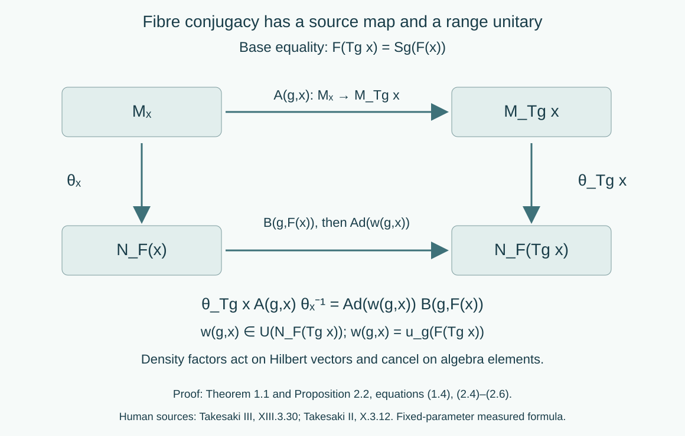

# Variable factor fields and measurable conjugacy

*Written by GPT-6.1 Sol (OpenAI), Ultra, October 2026. New original text is public domain (CC0).*

## Introduction

A central decomposition need not be a tensor product with one fixed factor. An isomorphism can move the centre and identify different represented fibres. Its unitary cocycle is evaluated at the range of an arrow. These three features belong in the reconstruction formula.

We prove the reconstruction and the cocycle-conjugacy calculation for general separable factor fields. The calculation concerns measured field classes: each group parameter has its own almost-everywhere identity. We also prove that an everywhere groupoid conjugacy, when supplied, reconstructs a continuous algebra cocycle. The converse calculation alone does not supply a simultaneous point representative on every arrow. [Strict variable fields and ancillary conjugacy](strict-variable-fields-and-ancillary-conjugacy.md) supplies that additional proof on one invariant conull source set. Together the lessons cover Takesaki III, XIII.3.30–31.

Read [Ancillary actions and unitary corrections](ancillary-actions-and-unitary-corrections.md) for constant fields and [Localizing factor actions and uniform cocycles](localizing-factor-actions-and-uniform-cocycles.md) for the difference between fixed-parameter and uniform-source statements. General standard-form theory remains a prerequisite from the modular course. We use two further classical prerequisites in their stated scope:

- Central decomposition of a separable von Neumann algebra over a standard sigma-finite centre gives a measurable field of separable factor standard forms. The algebra consists of essentially bounded measurable operator sections in those fibres. There are countable strong/adjoint dense families of sections in the fibre unit balls and countable dense families of vector sections in the fibre cones. The integrated conjugation and cone give a standard form. This is central reduction theory, not a consequence of the scalar commutant theorem alone.
- A bounded operator intertwining the diagonal algebras of two Hilbert direct integrals over the same sigma-finite base is a measurable field of operators between the fibres. The complete coefficient-density proof and its two-space block argument are in [DG], Theorem 5.1 and Proposition 6.1. This prerequisite allows varying separable Hilbert fibres and an arbitrary sigma-finite base; it does not assert central decomposition of an algebra.

The canonical standard-form implementer of a normal isomorphism is unique and preserves the natural cones and conjugations. The topology of these implementers is the topology of pointwise norm convergence on preduals. Lessons of this course prove the required Borel versions and automatic continuity. We do not reprove the general central-reduction or standard-form theorems here.

## 1. Reconstructing an isomorphism of variable fields

Let the nonzero measured algebras have separable preduals and central decompositions

\[
\begin{aligned}
M&=\int_X^\oplus M_x\,d\mu(x),& Z(M)&=L^\infty(X,\mu),\\
N&=\int_Y^\oplus N_y\,d\nu(y),& Z(N)&=L^\infty(Y,\nu).
\end{aligned}
\tag{1.1}
\]

Both bases are standard sigma-finite; both fields are factor fields in measurable standard forms \((M_x,H_x,J_x,P_x)\) and \((N_y,K_y,L_y,Q_y)\). We may replace the measures by equivalent probabilities. All base isomorphisms below are between conull Borel subsets. A measurable field is identified with its almost-everywhere class.

**Theorem 1.1 (isomorphism reconstruction).** A normal isomorphism \(\Phi:M\to N\) has a measure-class Borel isomorphism \(F:X\to Y\) and measurable normal fibre isomorphisms \(\theta_x:M_x\to N_{F(x)}\), with

\[
(\Phi a)(F(x))=\theta_x(a(x)).
\tag{1.2}
\]

Conversely such a field of isomorphisms, measurable through its canonical standard-form implementers, reconstructs a normal isomorphism by (1.2). There is no constancy assumption on either field. The base map and the fibre isomorphisms are unique almost everywhere.

*Proof.* Restrict \(\Phi\) to the centres. The normal spatial realization of an \(L^\infty\) isomorphism, proved in [Normalizers, phases, and orbit cocycles](normalizers-phases-and-orbit-cocycles.md), Lemma 0.1, gives \(F\) with
\((\Phi f)(F(x))=f(x)\). Write

\[
\rho(y)=\frac{dF_*\mu}{d\nu}(y).
\tag{1.3}
\]

It is positive finite almost everywhere. The unitary from the pulled-back target integral to the target integral is

\[
\begin{aligned}
V_F:\int_X^\oplus K_{F(x)}\,d\mu(x)&\longrightarrow
\int_Y^\oplus K_y\,d\nu(y),\\
(V_F\eta)(y)&=\rho(y)^{1/2}\eta(F^{-1}y).
\end{aligned}
\tag{1.4}
\]

Indeed its squared norm is \(\int_Y\rho(y)\|\eta(F^{-1}y)\|^2d\nu(y)=\int_X\|\eta(x)\|^2d\mu(x)\); the inverse uses \(\rho(F(x))^{-1/2}\). It intertwines the diagonal operators according to \(F\), commutes with the corresponding conjugations, and preserves the integrated cones: its scalar multiplier is positive.

Let \(U_\Phi\) be the canonical implementer. Then \(V_F^*U_\Phi\) intertwines the diagonal algebras over \(X\). The two-space decomposition theorem gives

\[
V_F^*U_\Phi=\int_X^\oplus W_x\,d\mu(x),
\qquad W_x:H_x\longrightarrow K_{F(x)}.
\tag{1.5}
\]

Decompose its adjoint as well. Uniqueness of operator fields applied to both inverse identities gives \(W_x^*W_x=1\) and \(W_xW_x^*=1\) on one conull set. The implementer identity for \(U_\Phi\), tested on countably many fundamental operator sections, gives \(W_xM_xW_x^*\subseteq N_{F(x)}\). The inverse isomorphism gives the reverse inclusion. Strong closure and the fibre density of those sections extend the inclusions to the entire algebras on one common conull set. Similarly, countably many cone sections and their images under the inverse prove \(W_xP_x=Q_{F(x)}\); the conjugation identity gives \(W_xJ_x=L_{F(x)}W_x\). Consequently \(W_x\) is the canonical implementer of
\(\theta_x(a)=W_xaW_x^*\).

Conjugation by \(U_\Phi=V_F\int^\oplus W_x\) proves (1.2) for every bounded section. The density factors in (1.4) cancel in this conjugation. They are needed on vectors, rather than on algebra elements.

Conversely integrate the measurable canonical unitaries \(W_x\) and compose with \(V_F\). The resulting unitary conjugates \(M\) onto \(N\): its conjugation is (1.2), and the inverse field carries every bounded target section back to a bounded measurable source section. Unitary conjugation is normal. This proves normality without a pointwise assertion about suprema of arbitrary nets. The base map is unique by a countable separating family of scalar functions. Once the base is fixed, testing the fundamental operator sections makes the fibre map unique almost everywhere. \(\square\)

## 2. The two endpoint formulas

Let \(G\) be a separable locally compact Hausdorff group. Let \(\alpha\) and \(\beta\) be continuous actions on \(M\) and \(N\). Choose nonsingular point models \(T\) and \(S\) for their centre actions. Equivariant central disintegration, [Takesaki II], X.3.11–12, supplies fibre maps

\[
A(g,x):M_x\longrightarrow M_{T_gx},\qquad
B(g,y):N_y\longrightarrow N_{S_gy},
\tag{2.1}
\]

with

\[
(\alpha_g a)(T_gx)=A(g,x)(a(x)),\qquad
(\beta_g b)(S_gy)=B(g,y)(b(y)).
\tag{2.2}
\]

The identities in (2.2) hold as measured field identities for every fixed \(g\). The composition identities of the classical disintegration theorem hold almost everywhere for every fixed pair \(g,h\). The exceptional set is not thereby uniform in \(g,h\).

We use measurable versions on their valid conull domains. Here is a parameter construction at this measured scope. Choose measurable orthonormal bases of the Hilbert fibres. Their dimension function is invariant almost everywhere for each fixed group element, since the canonical fibre maps in (2.1) are unitaries. The basis identification \(I(g,x):H_x\to H_{T_gx}\) is therefore unitary almost everywhere for each fixed \(g\); on the Borel dimension-mismatch set use the zero operator solely as an auxiliary point version. Combine \(I\) with the jointly measurable square-root Radon–Nikodym derivative from the compact-model lesson to form the nonsingular Hilbert transport \(W_g\). As operators on the integral, these are unitaries, are a representation, and implement the centre action. Coefficient integration makes the representation Borel, so the localization lesson makes it continuous. This argument concerns operator classes; the auxiliary zeros are not fibre isomorphisms.

If \(U_g\) is the canonical implementer of \(\alpha_g\), then \(U_gW_g^*\) commutes with the diagonal algebra. The diagonal commutant theorem decomposes it. Strong convergence of bounded decomposable fields is convergence in measure tested on the countable fundamental vector sections: integrals of their squared errors prove one implication, and bounded convergence in measure, followed by approximation of vector sections, proves the other. Embed each fibre's operators in a fixed separable Hilbert space using the chosen bases. The summable approximation construction of the localization lesson, Lemma 5.1, now gives joint Borel versions of this parameterized decomposable field. Composing its range value with \(I(g,x)\) supplies joint matrix coefficients for the fibre implementer of \(A(g,x)\). The same argument applies to \(\beta\). The classical central decomposition and countable strong closure tests give their algebra domains and ranges on a conull set for each fixed parameter. This supplies measured parameter fields, not an everywhere groupoid action.

**Proposition 2.1 (the centre must be conjugate).** If

\[
\Phi\alpha_g\Phi^{-1}=\operatorname{Ad}(u_g)\beta_g,
\qquad u_g\in\mathcal U(N),
\tag{2.3}
\]

then the base map of Theorem 1.1 satisfies \(F(T_gx)=S_gF(x)\) almost everywhere for each fixed \(g\).

*Proof.* Inner automorphisms fix the centre pointwise. Restrict (2.3) to \(Z(M)\) and evaluate a countable separating family of scalar functions. Their pullbacks imply equality of the two base maps outside one null set for that fixed parameter. This conclusion does not require freeness, ergodicity or an invariant measure. \(\square\)

On points where that equality holds, put

\[
w(g,x)=u_g(F(T_gx))\in\mathcal U(N_{F(T_gx)}).
\tag{2.4}
\]

**Proposition 2.2 (fibre conjugacy and the cocycle).** Equation (2.3) is equivalent, for each fixed \(g\), to

\[
\theta_{T_gx}A(g,x)\theta_x^{-1}
=\operatorname{Ad}(w(g,x))B(g,F(x))
\quad\text{almost everywhere in }x.
\tag{2.5}
\]

Furthermore \(u_{gh}=u_g\beta_g(u_h)\) is equivalent, for each fixed pair \(g,h\), to

\[
w(gh,x)=w(g,T_hx)\,
B(g,F(T_hx))(w(h,x))
\quad\text{almost everywhere in }x.
\tag{2.6}
\]

*Proof.* Evaluate \(\Phi\alpha_g(a)\) at \(F(T_gx)\). Its value is \(\theta_{T_gx}A(g,x)(a(x))\). By (2.2), the value of \(\operatorname{Ad}(u_g)\beta_g\Phi(a)\) there is \(w(g,x)B(g,F(x))(\theta_x(a(x)))w(g,x)^*\). Equality for the countable fundamental operator sections, followed by strong closure, is exactly (2.5); conversely that formula gives the equality for every section.

For the cocycle, evaluate its algebra identity at \(y=F(T_{gh}x)\). The first factor is \(u_g(y)=w(g,T_hx)\). The second is
\(B(g,S_g^{-1}y)(u_h(S_g^{-1}y))\). Centre conjugacy identifies \(S_g^{-1}y=F(T_hx)\) almost everywhere, for the fixed pair. This is the second factor of (2.6). Nonsingularity carries null sets between these coordinates and also proves the reverse implication. \(\square\)

*Figure 1. The two paths in (2.5) have domain \(M_x\) and codomain \(N_{F(T_gx)}\). The target path includes inner conjugation at that range. The inverse in (2.5) belongs at the source fibre. Proposition 2.2 proves the square; Theorem 1.1 proves its measured reconstruction. Human sources: Takesaki III, XIII.3.30(iii), and Takesaki II, X.3.12. The diagram assumes the displayed base equality at the point in question; Proposition 2.1 initially supplies it almost everywhere for each fixed parameter.*

## 3. From a supplied groupoid conjugacy to continuity

**Theorem 3.1 (continuous reconstruction).** Suppose \(F\) and \(\theta\) satisfy Theorem 1.1. Suppose a measurable range-unitary field \(w(g,x)\) satisfies (2.5) almost everywhere for each fixed \(g\), and (2.6) almost everywhere for each fixed pair. Assume the reconstructed map \(g\mapsto u_g\in\mathcal U(N)\) is Borel in the strong unitary topology. Then \(\Phi\) and \(u\) give cocycle conjugacy of the continuous algebra actions, and \(u\) is strongly continuous. In particular an everywhere Borel groupoid conjugacy supplies this result whenever its unitary fields represent such a Borel map.

*Proof.* Define

\[
u_g(y)=w(g,T_g^{-1}F^{-1}y)
\tag{3.1}
\]

as a field class. It is unitary in \(N\), and the formula is the inverse of (2.4). Theorem 1.1 reconstructs \(\Phi\). Proposition 2.2 gives (2.3) for every \(g\) and the algebra cocycle identity for every \(g,h\). The unit equation forces \(u_e=1\).

The unitary group of \(N\) is Polish in its strong topology, using a separable standard representation. The automorphism group is Polish through canonical implementation, and its action on unitaries is continuous. Thus
\(g\mapsto(u_g,\beta_g)\) is a Borel homomorphism into the Polish semidirect group with multiplication
\((v,\sigma)(z,\tau)=(v\sigma(z),\sigma\tau)\).
The Borel-homomorphism continuity theorem proved in the localization lesson, Lemma 4.2, applies to the original separable locally compact group, including groups not assumed second countable. The homomorphism is continuous, so \(u\) is strongly continuous. \(\square\)

**Lemma 3.2 (testing the Borel hypothesis).** On a standard probability base, a jointly Borel field of fibre unitaries in (3.1) gives the Borel map required in Theorem 3.1.

*Proof.* For measurable square-integrable vector sections \(\xi,\eta\), the coefficient
\(g\mapsto\int_Y\langle u_g(y)\xi(y),\eta(y)\rangle d\nu(y)\)
is Borel by parameter integration, first for bounded simple tests and then by dominated approximation. Choose a countable dense family in the separable direct-integral Hilbert space. On its unitary group the Borel sigma-field of the strong topology is generated by these coefficients: the functions \(\|(U-V)\xi_j\|^2=2\|\xi_j\|^2-2\operatorname{Re}\langle U\xi_j,V\xi_j\rangle\), with fixed \(V\), give a countable base of strong open balls. The coefficient tests therefore make the map Borel. On equivalent sigma-finite measures, first use the positive integrable change of density. If a separable locally compact group has only a jointly Borel point action, composition with that action and with \(F^{-1}\) is still product measurable: the Borel sigma-field of a product with a second-countable factor is its product sigma-field. These are the factors used in (3.1). \(\square\)

Conversely a continuous algebra cocycle has measurable fibre representatives, and Propositions 2.1–2.2 give the fixed-parameter formulas. They establish the full varying-field calculation at the algebra level. Obtaining simultaneous strict representatives, and comparing arbitrary strict ancillary choices up to a uniform-source cochain, requires an additional theorem. The constant-factor path-space construction in the localization lesson does not prove that theorem for varying algebra fields.

## 4. Examples and exercises with complete solutions

The levels have their usual meaning: Level 1 is a calculation, Level 2 is a proof using the lesson, and Level 3 tests a hypothesis or combines constructions.

**Example 4.1 (two sizes that stay separate).** Let \(X=\mathbb Z\times\{2,3\}\), give each point positive mass with finite total mass, and let \(M_{(j,n)}=M_n(\mathbb C)\). The translation \(T_k(j,n)=(j+k,n)\) preserves measure class. The direct-integral algebra is the bounded product of its matrix fibres. There is no one fixed matrix factor for both components. Put \(D_n=\operatorname{diag}(0,1,\ldots,n-1)\), \(v_k(j,n)=e^{ikD_n}\), and let \(\beta\) translate sections. Then \(v_{k+l}=v_k\beta_k(v_l)\), and \(\alpha_k=\operatorname{Ad}(v_k)\beta_k\) is an action. Its arrow cocycle is \(w(k,(j,n))=e^{ikD_n}\) in the range matrix algebra. This is a variable-field example. Its centre action has two invariant components and is not centrally ergodic.

**Exercise 4.1 (the density on vectors).** *Level 1.* Take \(X=Y=\mathbb R\), \(\mu=\nu=e^{-x^2/2}dx/\sqrt{2\pi}\), \(F(x)=x+a\), and constant scalar fibres. Compute (1.3) and the vector formula (1.4). What happens to the density when conjugating a multiplication operator?

*Solution.* The translated measure has density \(e^{-(y-a)^2/2}/\sqrt{2\pi}\), so \(\rho(y)=e^{ay-a^2/2}\). Hence \((V_F\eta)(y)=e^{ay/2-a^2/4}\eta(y-a)\). Multiplication by a scalar field \(f\), followed by conjugation, becomes multiplication by \(f(y-a)\); the positive factors from the unitary and its inverse cancel. A density factor in (1.2) would fail multiplicativity and would even send the algebra unit to a nonconstant function when \(a\ne0\).

**Exercise 4.2 (a forbidden interchange).** *Level 2.* Let \(M=M_2(\mathbb C)\oplus M_3(\mathbb C)\). Can an automorphism of \(M\) swap its two minimal central projections?

*Solution.* Theorem 1.1 would give an isomorphism \(M_2\to M_3\). A complex-linear algebra isomorphism preserves the vector-space dimension, whereas these dimensions are 4 and 9. No such isomorphism exists. Thus an arbitrary permutation of the centre need not lift to the algebra when the fibres vary. The constant-field simple lifting used in the ancillary lesson has a substantive hypothesis.

**Exercise 4.3 (the inverse endpoint).** *Level 1.* For translations on \(\mathbb R\), let \(F(x)=-x\), \(T_t x=x+t\), and \(S_t y=y-t\). Express \(u_t(y)\) in terms of \(w\) using (3.1), and check the centre conjugacy.

*Solution.* We have \(F(T_tx)=-x-t=S_t(F(x))\). Moreover \(T_t^{-1}F^{-1}y=-y-t\), so \(u_t(y)=w(t,-y-t)\). Substitution into (2.4) returns \(u_t(-x-t)=w(t,x)\). Using \(w(t,-y)\) would evaluate the cocycle at a different source.

**Exercise 4.4 (a noncommuting finite cocycle).** *Level 2.* In the matrix factor \(M_2\), let \(\beta_k=\operatorname{Ad}(R^k)\), \(R=\begin{pmatrix}0&1\\1&0\end{pmatrix}\), and \(C=\operatorname{diag}(1,i)\). Set \(u_k=(CR)^kR^{-k}\) for all integers \(k\). Prove its cocycle law, compute \(u_1,u_2\), and identify \(\operatorname{Ad}(u_k)\beta_k\).

*Solution.* Since \(\beta_k(u_l)=R^k(CR)^lR^{-l}R^{-k}\), the product is \((CR)^k(CR)^lR^{-(k+l)}=u_{k+l}\). Negative powers obey the same cancellation. We have \(u_1=C\), \(RCR=\operatorname{diag}(i,1)\), and \(u_2=C(RCR)=i1\). In particular \(u_1^2=\operatorname{diag}(1,-1)\ne u_2\); forgetting the transported factor breaks the law. The perturbed action is \(\operatorname{Ad}((CR)^k)\).

**Exercise 4.5 (continuity after reconstruction).** *Level 2.* In Theorem 3.1, explain why a Borel \(u\) with the exact algebra cocycle law is continuous even when \(G\) was not assumed second countable. Is \(u:G\to\mathcal U(N)\) itself a homomorphism?

*Solution.* The pair \((u_g,\beta_g)\) is the homomorphism into the Polish semidirect group. Separability and local compactness give sigma-finite Haar measure; the positive-measure inverse-image and Steinhaus argument in Lemma 4.2 proves its continuity without a countable base on \(G\). Projection onto the unitary coordinate is continuous. The unitary coordinate alone is generally not multiplicative: Exercise 4.4 has \(u_2\ne u_1^2\).

**Exercise 4.6 (a measurable defect at every source).** *Level 3.* On real translations with Gaussian probability, take scalar fibres and \(c_t=1\) in the measured algebra for every \(t\). Choose point representatives \(\widetilde c(t,x)=-1\) when \(x+t=0\) and 1 otherwise. Show that each fixed parameter still represents \(c_t\). Does its cocycle law hold at every composable pair on an invariant conull base?

*Solution.* For fixed \(t\) the difference is the singleton \(\{-t\}\), which is null. For every \(x\ne0\), choose \(h=-x\) and any \(g\ne0\). Then \(\widetilde c(g+h,x)=1\), \(\widetilde c(g,T_hx)=\widetilde c(g,0)=1\), and \(\widetilde c(h,x)=-1\); the two sides differ. At \(x=0\) the unit value \(\widetilde c(0,0)=-1\) already fails normalization. Consequently failures have every source, and no nonempty invariant conull base repairs these particular representatives by restriction. Replacing the representatives by the constant field 1 does repair them. A fixed-parameter calculation proves identities of algebra classes, not validity of a preselected everywhere point version.

**Exercise 4.7 (why a principal relation loses data).** *Level 2.* Take one point, fibre \(M_2\), and the real action \(\alpha_t=\operatorname{Ad}(\operatorname{diag}(e^{it},e^{-it}))\). Compute its action on \(e_{12}\). Which arrows must the ancillary action retain?

*Solution.* The value is \(e^{2it}e_{12}\). The transformation groupoid has one loop for every \(t\in\mathbb R\), and those loops encode the nontrivial automorphisms. Its principal endpoint relation has only a unit; it cannot encode this field action. The centre is ergodic over the point. Thus central ergodicity does not justify discarding isotropy.

**Exercise 4.8 (different measures, the same algebra).** *Level 3.* In Example 4.1 replace all positive atomic masses by another summable sequence of strictly positive masses, allowing unbounded mass ratios. Show that the bounded product algebra and its action are unchanged, and describe the Hilbert unitary implementing the measure change.

*Solution.* Null subsets are empty for either measure. The essential bound of a matrix field is therefore its supremum over the countable base for both measures; the bounded product and its translation automorphisms coincide. The Hilbert unitary multiplies the vector in fibre \(x\) by \(\sqrt{\mu(\{x\})/\nu(\{x\})}\). Although this scalar can be unbounded as a function, its squared target norm is exactly the source squared norm, so it is a unitary between the two Hilbert integrals. Conjugation on matrix multiplication fields cancels the ratios. Boundedness of the density is unnecessary.

## Bibliography and source comparison

- [Takesaki III] Masamichi Takesaki, *Theory of Operator Algebras III*, Springer, 2003, XIII.3.30–31, PDF72–73. Definition 3.30(iii) uses a fibre automorphism at each unit and a unitary in the range algebra. Proposition 2.2 checks its endpoint and multiplication orders for variable fields. Proposition 3.31 leaves its proof to the reader. Theorem 3.1 supplies the reconstruction direction and the measured fixed-parameter calculation supplies its algebra counterpart. The simultaneous strict-representative and cochain comparison is proved in the next lesson, Theorems 3.1, 4.1, 5.1–5.2 and Corollary 6.2. The base identification there retains every original group label. [Publisher record](https://doi.org/10.1007/978-3-662-10453-8).
- [Takesaki II] Masamichi Takesaki, *Theory of Operator Algebras II*, Springer, 2003, X.3.11–12, PDF305–308, with X.3.7–8 and formula (15) on PDF302–304. The full equivariant-disintegration proofs on PDF299–308 were read for this comparison. Their central-reduction and faithful-state disintegration prerequisites remain explicit. The identities in X.3.11–12 quantify over each fixed parameter or pair, almost everywhere in the base. [Publisher record](https://doi.org/10.1007/978-3-662-10451-4).
- [DG] Claude Opus 5.5 (Anthropic), “Decomposable operators and the diagonal algebra,” September 2026, Theorem 5.1 and Proposition 6.1. Reused by reference for varying separable Hilbert fibres over a sigma-finite base. Its more general base hypothesis specializes to the standard bases here. Its Hilbert-field, Radon–Nikodym and bounded sesquilinear-form prerequisites remain explicit.

Central ergodicity is unnecessary for the local reconstruction theorem. Applying it to centrally ergodic systems does not require identical factors, freeness, amenability, invariant measures or unimodularity. The next lesson proves simultaneous representatives by Haar repair and closed variable-unitary path orbits. The finite and atomic examples illustrate the formulas; they do not prove the general theorem.
