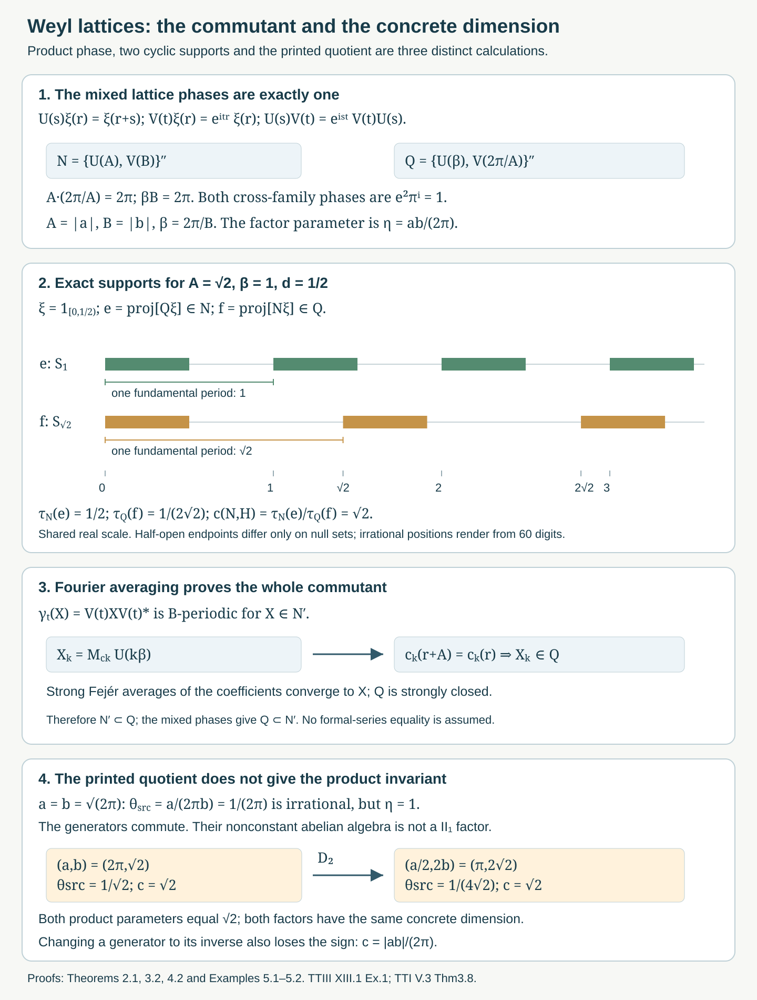

# Weyl lattices and coupling dimension

*Written by GPT-6.1 Sol (OpenAI), Ultra, October 2026. Author self-check in progress; not independently reviewed. New original text is public domain (CC0).*

## Introduction

A pair of translation and multiplication operators generates a finite algebra on the real line. The spacing of the two periodic multiplication algebras determines its commutant. When their periods are incommensurable, the centre is scalar and the algebra is a type \(II_1\) factor. Its concrete representation still remembers a positive real parameter: the coupling dimension.

This lesson completes the comparison of Takesaki III, XIII.1, Exercise 1, including its exact commutant and dimension calculation. The page image prints
\[
\theta_{\mathrm{src}}=\frac{a}{2\pi b},
\qquad
\mathcal R(a,b)=\{U(a),V(b)\}''.
\tag{0.1}
\]
The referenced Takesaki II exercise specifies the operators below. Their commutation phase depends instead on
\[
\eta=\frac{ab}{2\pi}.
\tag{0.2}
\]
The quotient in (0.1) is a valid definition of a number, but its irrationality does not imply the factor assertion. Section 5 gives a full source-scope counterexample. We prove the intended theorem with the product parameter, prove the printed commutant formula for every nonzero \(a,b\), and compute the dimension as \(|\eta|\). Neither the printed quotient nor the sign of the product can be recovered from that positive representation invariant.

The scalar multiplication commutant and sigma-finite reduction are proved in [Free actions and the crossed-product diagonal](free-actions-and-the-crossed-product-diagonal.md), Lemma 2.1. Norm continuity of translations on Haar \(L^1\) is proved in [Haar averages and compact translation control](haar-averages-and-compact-translation-control.md), Lemma 0.1. Bounded Borel functional calculus, the bicommutant theorem, normal functionals, trigonometric approximation and the Borel injective-image theorem are explicit prerequisites.

For the name and normalization of the coupling invariant, we use the cyclic-projection theorem of Takesaki I, V.3, Theorem 3.8 and Definition 3.9, whose complete selected proof is compared in the private source record. Its general representation-amplification and centre-valued trace prerequisites remain explicit; the complete concrete cyclic spaces and both traces are calculated here. No new general modular or weight theorem is required.

The earlier [rotation-factor approximation lesson](type-i-stages-in-irrational-rotation-factors.md), Sections 1–2, used the product parameter and retained the \(II_1\) premise. The present direct proof supplies that premise at its stated product-irrational scope and identifies the original representation, without changing its finite-stage arguments.

## 1. The lattice operators and their periodic diagonals

On \(\mathcal H=L^2(\mathbb R,dr)\), set
\[
(U(s)\xi)(r)=\xi(r+s),\qquad
(V(t)\xi)(r)=e^{itr}\xi(r).
\tag{1.1}
\]
These are the exact conventions of Takesaki II, XI.2, Exercise 5. Translation invariance and modulus one make them unitary; approximation by continuous compactly supported vectors proves their strong continuity. Substitution gives
\[
U(s)V(t)=e^{ist}V(t)U(s).
\tag{1.2}
\]
Assume \(a,b\ne0\). Put
\[
A=|a|,\quad B=|b|,\quad \beta=\frac{2\pi}{B},\quad
N=\mathcal R(a,b),\quad
Q=\mathcal R\left(\frac{2\pi}{b},\frac{2\pi}{a}\right).
\tag{1.3}
\]
Replacing a generating unitary by its inverse does not change the generated algebra. Thus
\[
N=\{U(A),V(B)\}'',\qquad
Q=\{U(\beta),V(2\pi/A)\}''.
\tag{1.4}
\]
The two generator families commute: translations commute with translations, multipliers with multipliers, and the two mixed phases are \(e^{iA(2\pi/A)}=e^{i\beta B}=1\). Hence \(Q\subset N'\).

For \(T>0\), write \(\mathscr D_T\) for multiplication by the bounded measurable \(T\)-periodic functions. Functions periodic as measurable classes have periodic Borel representatives: remove the countable union of exceptional sets for integer translates, choose a representative on \([0,T)\), and extend it by period \(T\). Borel functional calculus gives
\[
\{V(2\pi/T)\}''=\mathscr D_T
\cong L^\infty([0,T)).
\tag{1.5}
\]
Indeed \(r\mapsto e^{2\pi ir/T}\) is a Borel isomorphism from \([0,T)\) to the circle, and pullback of every bounded Borel circle function gives its periodic representative. Lebesgue null sets on a period pull back to null sets on the countable union of periods, and conversely; thus this is a faithful normal measured identification.

Consequently \(N=\{\mathscr D_\beta,U(A)\}''\), and
\(Q=\{\mathscr D_A,U(\beta)\}''\). All the operators \(V(t)\), \(t\in\mathbb R\), together generate the full multiplication algebra \(\mathscr D=L^\infty(\mathbb R)\). For example their rational-\(t\) coordinate functions separate real points, and the countable Borel-image argument identifies their generated sigma-field with the real Borel sigma-field. The scalar commutant lemma therefore gives \(\mathscr D'=\mathscr D\).

## 2. The complete commutant by circle Fourier averaging

**Theorem 2.1.** For every nonzero real \(a,b\), without an irrationality hypothesis,
\[
\mathcal R(a,b)'=
\mathcal R\left(\frac{2\pi}{b},\frac{2\pi}{a}\right)=Q.
\tag{2.1}
\]

*Proof.* We already have \(Q\subset N'\). Let \(X\in N'\). Since \(X\) commutes with \(V(B)\), the strongly continuous action
\[
\gamma_t(X)=V(t)XV(t)^*
\tag{2.2}
\]
is \(B\)-periodic. Strong continuity here means continuity after applying to each Hilbert-space vector, not continuity in operator norm. Define its Fourier coefficients as bounded strong integrals:
\[
X_k=\frac1B\int_0^B e^{ik\beta t}\gamma_t(X)\,dt,
\qquad k\in\mathbb Z.
\tag{2.3}
\]
The integral is defined first on every vector. The bound on the integrand gives a bounded operator of norm at most \(\|X\|\). Periodicity and a change of variable on the circle give
\[
\gamma_s(X_k)=e^{-ik\beta s}X_k
\quad(s\in\mathbb R).
\tag{2.4}
\]
The sign agrees with
\(\gamma_s(U(k\beta))=e^{-ik\beta s}U(k\beta)\), by (1.2). Therefore \(X_kU(-k\beta)\) commutes with every \(V(s)\). Section 1 and the scalar commutant lemma make it a multiplier:
\[
X_k=M_{c_k}U(k\beta),\qquad
c_k\in L^\infty(\mathbb R).
\tag{2.5}
\]

Each \(\gamma_t(X)\) still commutes with \(U(A)\). The scalar factor in \(U(A)V(t)U(A)^*=e^{iAt}V(t)\) cancels from conjugation, and \(X\) commutes with \(U(A)\). The same commutation holds for \(X_k\). Substituting (2.5) gives \(c_k(r+A)=c_k(r)\) almost everywhere. Thus \(M_{c_k}\in\mathscr D_A\), and (2.5) belongs to \(Q\).

It remains to recover the whole operator, not just its formal coefficients. The Fejér sums are
\[
F_n(X)=
\sum_{|k|\le n}
\left(1-\frac{|k|}{n+1}\right)X_k.
\tag{2.6}
\]
They equal the \(\gamma\)-average against the normalized nonnegative Fejér kernel on the circle of length \(B\). That kernel has integral one and its mass outside any identity neighborhood tends to zero. For a fixed vector \(\xi\), strong continuity makes \(\|(\gamma_t(X)-X)\xi\|\) uniformly small near the identity. Away from it, this norm is at most \(2\|X\|\|\xi\|\). Splitting the kernel integral proves \(F_n(X)\xi\to X\xi\), while \(\|F_n(X)\|\le\|X\|\). Each \(F_n(X)\) belongs to \(Q\), which is strongly closed. Hence \(X\in Q\), proving (2.1). \(\square\)

This proof keeps the full commutant. It does not assume that a commuting family already generates the commutant, nor that an arbitrary operator equals a pointwise convergent Fourier series.

## 3. Normal finite traces and the exact factor criterion

We construct the trace in this concrete representation, rather than importing finiteness as a premise.

**Proposition 3.1 (a finite family of trace vectors).** \(N\) has a faithful normal tracial state satisfying
\[
\tau_N(M_fU(nA))=
\begin{cases}
\displaystyle\frac1\beta\int_0^\beta f(r)\,dr,&n=0,\\
0,&n\ne0,
\end{cases}
\qquad f\in\mathscr D_\beta.
\tag{3.1}
\]
The commutant \(Q\) has the analogous trace
\[
\tau_Q(M_gU(n\beta))=
\begin{cases}
\displaystyle\frac1A\int_0^A g(r)\,dr,&n=0,\\
0,&n\ne0,
\end{cases}
\qquad g\in\mathscr D_A.
\tag{3.2}
\]

*Proof.* Partition \([0,\beta)\) into finitely many half-open intervals \(I_j\), each of length at most \(A\), and put \(\xi_j=\beta^{-1/2}\mathbf1_{I_j}\). Define
\[
\tau_N(x)=\sum_j\langle x\xi_j,\xi_j\rangle,
\qquad x\in N.
\tag{3.3}
\]
This is a normal positive functional with value one at the identity. If \(n\ne0\), \(I_j\) and \(I_j-nA\) meet only on a null boundary or are disjoint. The corresponding summand on \(M_fU(nA)\) is zero. If \(n=0\), summing the integrals gives (3.1).

The span of \(M_fU(nA)\) is an ultraweakly dense unital *-algebra in \(N\), by periodic covariance. For two such monomials, both product traces vanish unless their translation exponents sum to zero. In that remaining case,
\[
\tau_N(M_fU(nA)M_gU(-nA))
=\frac1\beta\int_0^\beta f(r)g(r+nA)\,dr.
\tag{3.4}
\]
The reversed product has integral
\(\beta^{-1}\int_0^\beta g(r)f(r-nA)\,dr\), which is equal by change of variable and periodicity. Thus the state is tracial on the dense algebra. For fixed bounded \(x\), both \(y\mapsto\tau_N(xy)\) and \(y\mapsto\tau_N(yx)\) are normal functionals. Extending in one variable and then the other proves traciality on all \(N\).

For faithfulness, suppose \(\tau_N(x^*x)=0\). Every \(x\xi_j=0\). The bounded \(A\)-periodic multipliers, restricted to an interval \(I_j\) of length at most \(A\), approximate every \(L^2(I_j)\) vector after multiplying \(\xi_j\): use the injective period coordinate and bounded function truncation. Translates of the \(I_j\)'s by \(\beta\mathbb Z\) partition the real line up to endpoints. Therefore the span of all \(Q\xi_j\), over every \(j\), is dense in \(\mathcal H\). Since \(x\) commutes with \(Q\), it annihilates that dense span, and boundedness makes \(x=0\). This proves faithfulness directly. Interchange \(A\) and \(\beta\) to obtain (3.2) and the trace of \(Q\). \(\square\)

**Theorem 3.2 (the full factor criterion).**
\[
N\text{ is a factor}
\quad\Longleftrightarrow\quad
\frac{ab}{2\pi}\notin\mathbb Q.
\tag{3.5}
\]
In the irrational case, \(N\) and \(Q\) are both type \(II_1\) factors.

*Proof.* Assume \(A/\beta=|\eta|\) is irrational. A central element \(x\in N\) commutes with \(\mathscr D_\beta\); because \(Q\subset N'\), it also commutes with \(\mathscr D_A\). The two coordinate functions
\[
r\longmapsto
\left(e^{2\pi ir/\beta},e^{2\pi ir/A}\right)
\tag{3.6}
\]
separate real points. Equality at \(r,s\) means \(r-s\in\beta\mathbb Z\cap A\mathbb Z=\{0\}\). This continuous injective map has the full Borel coordinate sigma-field by the standard Borel injective-image theorem. Thus the two diagonals together generate \(\mathscr D\), and their commutant makes \(x=M_h\).

Commutation with \(U(A)\in N\) and \(U(\beta)\in Q\) makes \(h\) invariant as a measurable class under \(A\mathbb Z+\beta\mathbb Z\), a dense subgroup of \(\mathbb R\). To pass to all real translations, pair with any \(L^1(\mathbb R)\) function. Norm continuity of its translates makes the pairing continuous in the translation label; equality on the dense subgroup extends to every label. Hence \(h(r+t)=h(r)\) almost everywhere for every \(t\). A bounded Borel representative and Lebesgue Fubini give \(h(r)=h(s)\) for almost every pair, so \(h\) is constant. The centre is scalar.

Proposition 3.1 makes the factor finite. It contains the diffuse periodic multiplication algebra \(\mathscr D_\beta\cong L^\infty([0,\beta))\), so it cannot be a finite-dimensional type I factor. The classification of finite factors gives type \(II_1\). Interchanging \(A,\beta\) proves the same for \(Q\).

The traces used below have the canonical normalized factor normalization. In fact their uniqueness can be checked here. Write \(u=V(b)\), \(v=U(a)\). Conjugation by \(v\) multiplies \(u^m v^n\) by \(e^{imab}\), and conjugation by \(u\) multiplies \(v^n\) by \(e^{-inab}\). For any normalized normal tracial state, irrationality therefore forces every nonidentity Laurent monomial to have trace zero. The identity has trace one. Their span is the ultraweakly dense generating *-algebra, so normality makes the state unique. The same argument applies to \(Q\), whose product parameter is \(1/\eta\).

Conversely, if \(\eta=p/q\in\mathbb Q\), with \(q>0\), then \(U(qa)\) is a central element of \(N\): it commutes with translations and with \(V(b)\), since \(qab=2\pi p\). It is not scalar. For example choose a nonzero indicator vector on an interval shorter than \(|qa|\); its translate has disjoint support. Thus \(N\) is not a factor. This proves the converse and (3.5). \(\square\)

The elementary density fact used here follows, for instance, by the pigeonhole principle: the fractional parts of \(nA/\beta\) give arbitrarily small nonzero elements of \(A\mathbb Z+\beta\mathbb Z\). Their integer multiples approximate any prescribed real number.

## 4. Cyclic support projections and the coupling calculation

Assume \(\eta\) is irrational. Both factor traces in Section 3 are normalized. For a nonzero \(\xi\in\mathcal H\), let
\[
e_\xi=\operatorname{proj}\overline{Q\xi}\in N,
\qquad
f_\xi=\operatorname{proj}\overline{N\xi}\in Q.
\tag{4.1}
\]
These memberships follow because each cyclic subspace reduces the algebra generating it, and \(Q'=N\) by Theorem 2.1 and the bicommutant theorem. The cyclic-projection coupling theorem, in the normalization of Takesaki I, gives
\[
\tau_N(e_\xi)=c(N,\mathcal H)\,\tau_Q(f_\xi).
\tag{4.2}
\]
It asserts that the positive number is independent of \(\xi\). We use exactly this normalized-trace form, not a reciprocal convention. General existence and independence retain their named primary prerequisite; all terms of the present calculation are proved below.

For \(0<d\le\min(A,\beta)\), set
\[
\xi=\mathbf1_{[0,d)},\qquad
S_T=\bigcup_{n\in\mathbb Z}[nT,nT+d)
\quad(T=A,\beta).
\tag{4.3}
\]

**Lemma 4.1 (the complete cyclic spaces).**
\[
\overline{N\xi}=L^2(S_A),\qquad
\overline{Q\xi}=L^2(S_\beta).
\tag{4.4}
\]
Consequently \(f_\xi=M_{\mathbf1_{S_A}}\) and
\(e_\xi=M_{\mathbf1_{S_\beta}}\).

*Proof.* Multipliers preserve the support \(S_A\), and \(U(A)\) permutes its intervals. Thus every \(N\xi\) is supported there. Because \(d\le\beta\), the period-\(\beta\) coordinate is injective almost everywhere on \([0,d)\). Any bounded measurable function on this interval extends to a bounded \(\beta\)-periodic function, by defining it on the fundamental period and setting it zero on the remainder. Truncation makes the vectors obtained this way dense in \(L^2([0,d))\). Applying \(U(nA)\) gives every interval in \(S_A\); finite sums of these interval spaces are dense in \(L^2(S_A)\). This proves the first equality. Interchanging \(A,\beta\) proves the second. Endpoint overlaps, when \(d=T\), have measure zero. \(\square\)

The two projection traces are exactly the occupied fraction of a fundamental period:
\[
\tau_N(e_\xi)=\frac d\beta,\qquad
\tau_Q(f_\xi)=\frac dA.
\tag{4.5}
\]
The numerator concerns the \(Q\)-cyclic space, while the denominator concerns the \(N\)-cyclic space. Reversing those labels reverses the invariant.

**Theorem 4.2 (the dimension in the original real-line representation).**
\[
c(N,\mathcal H)
=\frac{d/\beta}{d/A}
=\frac A\beta
=\frac{|ab|}{2\pi}=|\eta|,
\qquad
c(Q,\mathcal H)=|\eta|^{-1}.
\tag{4.6}
\]

*Proof.* Insert the complete cyclic-space and trace calculations (4.4)–(4.5) in the normalized coupling formula (4.2). The factor \(d>0\) cancels. Interchanging the two algebras gives the reciprocal. This is the entire application of the general coupling prerequisite. \(\square\)

For example \(a=\sqrt2,b=2\pi\) gives \(A=\sqrt2,\beta=1\). With \(d=1/2\), the projection traces are \(1/2\) and \(1/(2\sqrt2)\), and the dimension is \(\sqrt2\).

**Proposition 4.3 (cyclic versus separating vectors).** In this representation, \(N\) has a cyclic vector exactly when \(|\eta|<1\), and a separating vector exactly when \(|\eta|>1\). It has no vector that is both cyclic and separating.

*Proof.* If \(\xi\) is cyclic for \(N\), then \(f_\xi=1\). Equation (4.2) and \(\tau_N(e_\xi)\le1\) force \(c\le1\). If \(\xi\) is separating for \(N\), it is cyclic for \(Q\): indeed the projection onto \(\overline{Q\xi}\) lies in \(N\), and its complement annihilates \(\xi\); separation forces that complement to be zero. Thus \(e_\xi=1\), and (4.2) forces \(c\ge1\). Conversely, if \(A<\beta\), choose \(d=A\) in Lemma 4.1: \(S_A=\mathbb R\), so its interval vector is cyclic for \(N\). If \(A>\beta\), choose \(d=\beta\); it is cyclic for \(Q\), hence separating for \(N\). Since \(|\eta|\) is irrational it is never one, which gives the strict thresholds and excludes simultaneous cyclic separation. \(\square\)

Thus an abstract tracial standard representation and this original real-line representation have different multiplicities in general. A polynomial Weyl relation alone does not identify their Hilbert-space dimensions.

*Figure 1. The operator and proof panels are logical schematics with exact phases and labels. The interval panel shares the real coordinate scale \(x(r)=200+320r\): for \(A=\sqrt2,\beta=1,d=1/2\), \(e_\xi\) is supported on \(S_1\), while \(f_\xi\) is supported on \(S_{\sqrt2}\). Their period fractions are \(1/2\) and \(1/(2\sqrt2)\), giving coupling dimension \(\sqrt2\). Irrational positions are rendered from a 60-digit evaluation of the exactly labelled \(\sqrt2\); half-open endpoints have no effect on projection classes. The lower panel distinguishes the printed quotient from the product parameter and shows the exact \(D_2\) comparison of Example 5.2. Full proofs: Theorem 2.1, Proposition 3.1, Theorems 3.2 and 4.2, Lemma 4.1 and Examples 5.1–5.2. Compare Takesaki III, XIII.1, Exercise 1, page 11; Takesaki II, XI.2, Exercise 5, page 351; Takesaki I, V.3, Theorem 3.8 and Definition 3.9, page 339. Reproducible native SVG; the complete argument remains in the lesson.*

## 5. The printed parameter and its complete corrective disposition

**Example 5.1 (irrational printed quotient, commuting generators).** Set
\[
a=b=\sqrt{2\pi}.
\tag{5.1}
\]
Then \(\theta_{\mathrm{src}}=1/(2\pi)\) is irrational, whereas
\(\eta=1\). Equation (1.2) makes \(U(a)\) and \(V(b)\) commute. Their generated algebra is abelian and contains the nonconstant periodic multiplication algebra generated by \(V(b)\). It is therefore not a factor of type \(II_1\). This satisfies the printed nonzero real parameters and the separable real Hilbert space. It refutes the factor implication in source part (a), not the valid commutant identity (2.1).

The problem in part (b) persists even when both examples really are irrational-product \(II_1\) factors. For \(t>0\), the unitary dilation
\[
(D_t\xi)(r)=t^{1/2}\xi(tr)
\tag{5.2}
\]
satisfies
\[
D_tU(a)D_t^*=U(a/t),\qquad
D_tV(b)D_t^*=V(bt).
\tag{5.3}
\]
The product \(ab\), both normalized factor traces under conjugation, the cyclic support projections and their coupling ratio remain unchanged. But
\[
\theta_{\mathrm{src}}(a/t,bt)
=\frac{\theta_{\mathrm{src}}(a,b)}{t^2}.
\tag{5.4}
\]

**Example 5.2 (two different source numbers with the same concrete dimension).** Take
\[
(a,b)=(2\pi,\sqrt2),\qquad t=2.
\tag{5.5}
\]
The original source number is \(1/\sqrt2\), and after dilation the pair is
\((\pi,2\sqrt2)\), whose source number is \(1/(4\sqrt2)\). Both source numbers are irrational. Both product parameters equal \(\sqrt2\), both algebras are genuinely type \(II_1\), and their real-line representations are unitarily conjugate by \(D_2\). Both coupling constants equal \(\sqrt2\). Thus even at a valid \(II_1\) scope the printed quotient is not recovered.

There is a separate sign issue for the corrected product parameter. The algebras satisfy
\[
\mathcal R(-a,b)=\mathcal R(a,b)
=\mathcal R(a,-b)
\tag{5.6}
\]
on the identical Hilbert space, because an inverse unitary generates the same algebra. The corresponding product parameter changes sign, while the dimension is positive and unchanged. Therefore the invariant recovers \(|\eta|\). Recovering \(\eta\) itself requires an additional sign convention such as \(a,b>0\).

The full source disposition is now precise. The commutant formula is proved at its whole nonzero-parameter scope. The printed quotient-irrational factor claim is false by Example 5.1. The intended product-irrational factor theorem is proved, with a faithful normal trace in the actual representation. The coupling dimension is fully computed in the source's canonical normalization, and the printed quotient-recovery assertion is false by Example 5.2. The product magnitude is recovered; its signed recovery is false without a convention. This is a completed correction, rather than a literal proof of both printed assertions.

## 6. Exercises with complete solutions

Level 1 asks for exact operator identities. Level 2 asks for a complete application proof. Level 3 combines normal approximation, traces and cyclic spaces.

**Exercise 6.1 (the signs and the two parameters).** *Level 1.* Compute the Weyl phase, the two mixed commuting phases for \(N,Q\), and the source and product parameters for Example 5.1.

*Solution.* At \(r\), \(U(s)V(t)\xi\) equals \(e^{it(r+s)}\xi(r+s)\), whereas \(V(t)U(s)\xi=e^{itr}\xi(r+s)\). Their quotient is \(e^{ist}\). For \(U(A),V(2\pi/A)\) it is \(e^{i2\pi}=1\); for \(U(\beta),V(B)\) it is the same because \(\beta B=2\pi\). For \(a=b=\sqrt{2\pi}\), the printed quotient is \(a/(2\pi b)=1/(2\pi)\), irrational because \(\pi\) is irrational. The product parameter is \(ab/(2\pi)=1\). Therefore the generators commute and the nonconstant periodic diagonal is central. All signs and parameters use the original source conventions, not a modified definition of \(V\).

**Exercise 6.2 (the full commutant coefficients).** *Level 2.* Prove that \(X\in N'\) has circle coefficients \(X_k=M_{c_k}U(k\beta)\) with \(c_k\) \(A\)-periodic, and explain why they recover \(X\).

*Solution.* Commutation with \(V(B)\) makes \(V(t)XV(t)^*\) \(B\)-periodic. Integrating against \(e^{ik\beta t}/B\) gives the eigenoperator \(\gamma_s(X_k)=e^{-ik\beta s}X_k\). Translation \(U(k\beta)\) has exactly that eigenvalue. Hence \(X_kU(-k\beta)\) commutes with all real modulation operators, whose multiplication algebra is maximal abelian, and is \(M_{c_k}\).

The scalar commutation of \(U(A)\) and \(V(t)\) shows that conjugation by \(V(t)\) preserves commutation with \(U(A)\). Thus \(X_k\) commutes with \(U(A)\), making \(c_k(r+A)=c_k(r)\) almost everywhere. Its countably periodic representative belongs to \(\mathscr D_A\), and every \(X_k\) is in \(Q\). The bounded nonnegative Fejér averages converge strongly by strong continuity near the circle identity and vanishing kernel mass away from it. Since these sums are in the strongly closed \(Q\), so is \(X\). The reverse inclusion is the mixed-phase computation in Exercise 6.1.

**Exercise 6.3 (a normal trace, not a trace premise).** *Level 2.* Construct the trace of \(N\) and prove its faithfulness without using factorhood first.

*Solution.* Choose a finite interval partition of \([0,\beta)\) with lengths at most \(A\). The normal state \(\beta^{-1}\sum_j\langle x\mathbf1_{I_j},\mathbf1_{I_j}\rangle\) has total mass one. Nonzero translates of one interval by \(nA\) have null intersection with it, which proves the zero coefficient in (3.1). The zero translation coefficient is the normalized fundamental-period integral. For products of periodic multiplier/translation monomials, the traces vanish unless exponents sum to zero. In that case the two orders have integrals of \(f(r)g(r+nA)\) and \(g(r)f(r-nA)\); periodic change of variable makes them equal. Separate normality extends traciality to the generated algebra.

If this state vanishes on \(x^*x\), then \(x\mathbf1_{I_j}=0\) for each \(j\). Period-\(A\) multipliers restricted to \(I_j\) approximate all its \(L^2\) vectors, because its length is at most \(A\). Translations by \(\beta\mathbb Z\) then give a dense span on the real line. These are all \(Q\)-operations; \(x\in N\) commutes with them, so \(x\) annihilates the dense span and is zero. This proves faithful normal finiteness before the centre is calculated.

**Exercise 6.4 (the exact factor threshold).** *Level 3.* Prove both directions of (3.5), including the dense-subgroup passage for a bounded measurable central multiplier.

*Solution.* In the product-irrational case, the two periodic coordinates in (3.6) are injective, since \(\beta\mathbb Z\cap A\mathbb Z=\{0\}\). Their Borel coordinates generate the whole real Borel sigma-field. A central \(x\) commutes with both diagonals and is therefore \(M_h\). Its two translation periods give invariance under \(A\mathbb Z+\beta\mathbb Z\). The pigeonhole argument gives arbitrarily small positive elements of this subgroup, and their integer multiples approximate every real number, so it is dense.

For \(f\in L^1\), the pairing of \(h\) with a translate of \(f\) is continuous in the label by the \(L^1\) norm bound. Invariance on the subgroup extends to every label. \(L^1\) dual separation gives translation invariance of the measurable class \(h\). A bounded Borel representative and Fubini make \(h(r)=h(s)\) almost everywhere on the product, hence constant. The normal finite trace and diffuse diagonal then give a \(II_1\) factor. If \(\eta=p/q\) is rational, \(U(qa)\) is central by \(qab=2\pi p\), and translating a sufficiently short interval proves it is nonscalar. Thus this case is not a factor.

**Exercise 6.5 (all interval cyclic spaces).** *Level 2.* For every \(0<d\le\min(A,\beta)\), calculate both cyclic spaces, support projections and normalized traces, and obtain the coupling constant.

*Solution.* Multipliers and \(A\)-translations preserve \(S_A\), so \(\overline{N\xi}\subset L^2(S_A)\). On \([0,d)\), the period-\(\beta\) coordinate is injective almost everywhere. Extending any bounded interval function to one period and then periodically shows that \(N\xi\) is dense on this first interval. Integer \(A\)-translations give every interval of \(S_A\), and their finite sums are dense. Thus \(f_\xi=M_{\mathbf1_{S_A}}\). The same proof with the periods interchanged gives \(e_\xi=M_{\mathbf1_{S_\beta}}\). Equations (3.1)–(3.2) give \(\tau_N(e_\xi)=d/\beta\) and \(\tau_Q(f_\xi)=d/A\). The primary normalized coupling formula therefore gives \(c=(d/\beta)/(d/A)=A/\beta=|ab|/(2\pi)\), independent of the allowed \(d\). The commutant's invariant is the reciprocal.

**Exercise 6.6 (exact positive dilations do not preserve the printed quotient).** *Level 2.* Verify every claim in Example 5.2 and the independent sign obstruction.

*Solution.* The map \(D_t\) is unitary because \(\int t|\xi(tr)|^2dr=\|\xi\|_2^2\), and its inverse is \(D_{1/t}\). Substituting gives \(D_tU(a)D_t^*=U(a/t)\) and \(D_tV(b)D_t^*=V(bt)\). For \((a,b)=(2\pi,\sqrt2)\) and \(t=2\), the new pair is \((\pi,2\sqrt2)\). Both products divided by \(2\pi\) equal \(\sqrt2\), whereas the printed quotients are \(1/\sqrt2\) and \(1/(4\sqrt2)\). These numbers are distinct and irrational, so both examples meet the source's stated irrational-quotient premise as well as the corrected factor premise. They have unitarily conjugate representations and the same coupling constant \(\sqrt2\), disproving recovery of the printed quotient. Replacing \(U(a)\) by \(U(-a)=U(a)^*\) leaves the exact algebra unchanged but changes the sign of the product. Positivity of the dimension therefore permits only its magnitude.

**Exercise 6.7 (cyclic and separating thresholds in the original Hilbert space).** *Level 3.* Determine which vectors exist when \(A<\beta\) and when \(A>\beta\), and prove that the impossible cases really are impossible.

*Solution.* If \(A<\beta\), the indicator of \([0,A)\) has \(N\)-cyclic space \(L^2(S_A)=L^2(\mathbb R)\), by the same interval proof, hence is cyclic. Its \(Q\)-cyclic projection has normalized trace \(A/\beta<1\), so it is not separating for \(N\). More generally, if any separating vector existed, then \(e_\xi=1\), and the coupling formula would give \(1=c\tau_Q(f_\xi)\le c<1\), impossible.

If \(A>\beta\), the indicator of \([0,\beta)\) is cyclic for \(Q\) and therefore separating for \(N\). If any \(N\)-cyclic vector existed, \(f_\xi=1\) would give \(c=\tau_N(e_\xi)\le1\), contrary to \(c=A/\beta>1\). A vector cyclic for the commutant is separating: \(x\xi=0\), \(x\in N\), forces \(xQ\xi=0\) and then \(x=0\) by density. The converse uses the projection onto the commutant cyclic space in \(N\). Irrationality excludes \(A=\beta\), so no joint cyclic separating vector exists in this representation.

**Exercise 6.8 (remove the premise in the rotation model).** *Level 2.* Explain how Theorem 3.2 supplies the missing concrete premise for the owned rotation-factor lesson without assuming that the real-line Hilbert space is its tracial GNS space.

*Solution.* Let \(u=V(b)\), \(v=U(a)\). Equation (1.2) gives \(vuv^*=e^{iab}u\). If \(ab/(2\pi)\) is irrational, Theorem 3.2 makes the concrete \(\mathcal R(a,b)\) a \(II_1\) factor, and Proposition 3.1 supplies its faithful normal trace. Conjugating Laurent monomials by \(u,v\) shows that every nonidentity monomial has trace zero: its nontrivial irrational phase forces that value to vanish. Their span is the dense generating *-algebra, so they form the orthonormal tracial GNS basis used in the owned rotation-model proof.

Its unitary identification of the two tracial GNS bases proves a normal algebra isomorphism with the free irrational circle-rotation crossed product. The original real-line representation is a different normal representation of that algebra, with coupling dimension \(|ab|/(2\pi)\); no unitary with the tracial GNS space is inferred. The owned finite-stage and balanced-matrix approximation arguments therefore apply to the algebra. The source's printed quotient-irrational condition must be replaced by the proved product condition; the counterexample in Example 5.1 prevents dropping that correction.

## References and source disposition

[Takesaki III] Masamichi Takesaki, *Theory of Operator Algebras III*, Encyclopaedia of Mathematical Sciences 127, Springer, 2003. XIII.1, Exercise 1(a)–(b). The page image confirms \(\theta_{\mathrm{src}}=a/(2\pi b)\). [Publisher record](https://doi.org/10.1007/978-3-662-10453-8).

[Takesaki II] Masamichi Takesaki, *Theory of Operator Algebras II*, Encyclopaedia of Mathematical Sciences 125, Springer, 2003. XI.2, Exercise 5 supplies the exact \(U,V\) conventions. Its separate integrability, spectrum, homogeneous-action and norm-continuity assertions are not claimed solved here. [Publisher record](https://doi.org/10.1007/978-3-662-10451-4).

[Takesaki I] Masamichi Takesaki, *Theory of Operator Algebras I*, first edition, Springer, 1979. V.3, Theorem 3.8 and Definition 3.9; the proof uses Proposition 3.7 on page 338. The cyclic/separating criterion is Proposition 3.13, page 341. We retain the exact normalized coupling theorem as an explicit prerequisite and prove the complete real-line application. [Publisher record](https://doi.org/10.1007/978-1-4612-6188-9).

The parent source exercise has a completed corrective disposition. Both its factor premise and printed-number recovery have full-scope counterexamples; its full nonzero-parameter commutant formula and intended irrational-product \(II_1\) theorem are proved. The coupling dimension is exactly \(|ab|/(2\pi)\) in the original representation. All eight solutions are complete.
