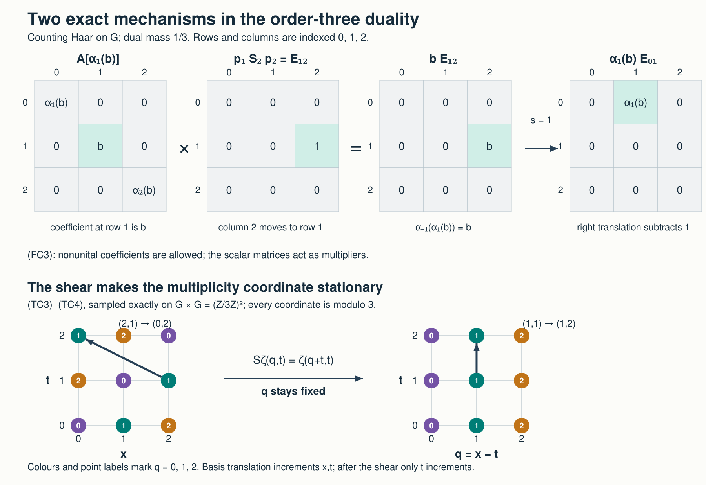

# Duality for C\* crossed products

*The new exposition, proofs, examples and illustration source are dedicated under CC0.*

Let \(A\) be an arbitrary C\* algebra, \(G\) an arbitrary locally compact Hausdorff group, and \(\alpha:G\to\operatorname{Aut}(A)\) a point-norm continuous action. The duality statements below assume that \(G\) is abelian. They require no unit in \(A\), separability of \(A\) or a Hilbert space, second countability, or sigma compactness. Inner products are linear in the first variable. Full crossed products and their nondegenerate covariant representations use L25's convention \(\pi(F(s))U_s\) in the integrated form.

The earlier operator inputs are the complete [CF](OA-FLOW-CF.md#oa-flow.cf.1), [SC](OA-FLOW-SC.md#sc-00), [GNS](OA-FLOW-GNS.md#gns-theorem-7-3), [L24](OA-FLOW-L24.md#oa-flow.grp.completions), [L25](OA-FLOW-L25.md#oa-flow.ccov.completions) proofs. The companion [Fourier completions, compact tests and the returned measure](OA-FLOW-TOPOLOGY.md#l138-h0) supplies [H0](OA-FLOW-TOPOLOGY.md#l138-h0)–[H4](OA-FLOW-HARMONIC-LATE.md#l138-h4): compact cutoffs and finite partitions, \(C^*(G)=C_0(\widehat G)\), equality with the reduced group norm, topological biduality, and exact Haar return. Its Haar/Radon inputs now use the complete earlier HR proof cone. The scalar Plancherel premise is now the complete earlier [onto Fourier unitary proof](OA-FLOW-PLANCHEREL.md#scalar-plancherel-p3), with [its dual Haar normalization](OA-FLOW-PLANCHEREL.md#scalar-plancherel-p2) and [its exact inverse-integral domain](OA-FLOW-PLANCHEREL.md#scalar-plancherel-p4). The proof below is complete at those specified inputs and does not treat an external source citation as their proof.

The historical harmonic prerequisites now have their actual earlier reader: [H0–H5](OA-FLOW-HARMONIC-LATE.md#oa-flow.xgaps.cstar.harmonic).

## 1. Characters, convolution and the universal norm

For any group, left translation on \(L^2(G)\) is \((\lambda_t\xi)(s)=\xi(t^{-1}s)\). For a continuous unitary character \(\chi:G\to\mathbb T\), define the unitary multiplier \(Q_\chi\) by
\[
 (Q_\chi\xi)(s)=\overline{\chi(s)}\,\xi(s),
 \qquad(\lambda_t\xi)(s)=\xi(t^{-1}s).
 \tag{47}
\]
Direct substitution on an \(L^2\) representative gives
\[
 Q_\chi\lambda_tQ_\chi^*=\overline{\chi(t)}\,\lambda_t.
 \tag{48}
\]
The formula holds on all of \(L^2\): scalar multiplication is measurable, both sides are bounded, and translation preserves Haar null classes. For arbitrary \(G\) these operators have the same definitions and identity.

[L25 Theorem 7.2](OA-FLOW-L25.md#oa-flow.ccov.comparison) proves the following precise comparison for every \(A,\alpha\):
\[
 C^*(G)\longrightarrow C_r^*(G)\text{ faithful}
 \quad\Longrightarrow\quad
 A\rtimes_\alpha G\longrightarrow A\rtimes_{\alpha,r}G
 \text{ faithful}.
 \tag{49}
\]
It produces compact-uniform almost invariant regular vectors from the factored trivial character, then compresses the tensor covariant pair on actual vectors. Thus (49) is an earlier proved norm comparison; a Fourier coordinate change alone does not prove it.

Now assume \(G\) abelian and write additively. Its modular function is one: right and left translations coincide, so their Haar Jacobians coincide. Companion [H1](OA-FLOW-HARMONIC.md#l138-h1) proves, from the [commutative CF theorem](OA-FLOW-CF.md#oa-flow.cf.6) and L24's integration/recovery on a one-dimensional essential space,
\[
 C^*(G)\cong C_0(\widehat G),\qquad
 f\longmapsto\widehat f,\qquad
 \widehat f(\chi)=\int_G f(s)\overline{\chi(s)}\,dm(s).
 \tag{50}
\]
Its proof identifies the spectrum with the compact-open character topology by finite nets on compact \(L^1\) translation orbits. In particular the transforms of \(C_c(G)\) are uniformly dense in \(C_0(\widehat G)\). Companion [H2](OA-FLOW-HARMONIC-LATE.md#l138-h2)'s scalar Plancherel calculation gives
\[
 \|\lambda(f)\|=\|\widehat f\|_\infty=\|f\|_u
 \qquad(f\in L^1(G)).
 \tag{51}
\]
Haar full support proves the multiplier's lower norm bound. Consequently the group quotient is faithful, and (49) applies to every coefficient algebra.

## 2. The action on the first crossing

On \(C_c(G,A)\) put
\[
 (\widehat\alpha_\chi F)(s)=\overline{\chi(s)}\,F(s).
 \tag{52}
\]
The coefficient [product and involution of L25](OA-FLOW-L25.md#oa-flow.ccov.algebra) show that this is a star automorphism: the scalar product in a convolution is \(\overline{\chi(r)}\overline{\chi(s-r)}=\overline{\chi(s)}\), and inversion changes the character to its conjugate in the adjoint. For any nondegenerate covariant pair,
\[
 (\pi\rtimes U)(\widehat\alpha_\chi F)
 =\bigl(\pi\rtimes(\overline\chi\,U)\bigr)(F).
 \tag{53}
\]
The twisted unitaries remain strongly continuous and covariant. Twisting by \(\chi^{-1}\) is the inverse operation, so taking the suprema over all pairs proves that (52) is isometric for the full norm. It extends uniquely to an automorphism of \(B=A\rtimes_\alpha G\). The character product gives the action law.

In [L25's precise multiplier-pair meaning](OA-FLOW-L25.md#oa-flow.ccov.multipliers), its effect on the canonical actions is
\[
 \widehat\alpha_\chi(i_A(a))=i_A(a),\qquad
 \widehat\alpha_\chi(i_G(s))=\overline{\chi(s)}\,i_G(s).
 \tag{54}
\]
These equations mean the corresponding left and right actions on every dense coefficient function. They also follow by the recovered coefficient and group operators in every nondegenerate representation.

Point-norm continuity of the dual action follows from the compact-open topology: for \(F\in C_c(G,A)\),
\[
 \|\widehat\alpha_\chi F-\widehat\alpha_{\chi_0}F\|_u
 \le\|\widehat\alpha_\chi F-\widehat\alpha_{\chi_0}F\|_1\le\|F\|_1
 \sup_{s\in\operatorname{supp}F}|\chi(s)-\chi_0(s)|
 \longrightarrow0.
 \tag{54a}
\]
Density and the automorphism isometries extend the convergence to every \(b\in B\). This estimate is valid for a net of characters.

## 3. A faithful double regular representation

We prove
\[
 (A\rtimes_\alpha G)\rtimes_{\widehat\alpha}\widehat G
 \cong A\otimes_{\min}\mathcal K(L^2(G)).
 \tag{55}
\]
If \(A=0\), both sides are zero by their definitions. Otherwise choose a faithful nondegenerate \(\pi:A\to B(H)\), using [GNS Theorem 7.3](OA-FLOW-GNS.md#gns-theorem-7-3). The Hilbert space \(H\) is arbitrary.

Let \(\Gamma=\widehat G\). Companion [H3](OA-FLOW-HARMONIC-LATE.md#l138-h3) identifies \(\widehat\Gamma\) with \(G\) by \(t\mapsto[\chi\mapsto\chi(t)]\), and [H4](OA-FLOW-HARMONIC-LATE.md#l138-h4) returns the Haar measure exactly. The Fourier transform used in the \(\Gamma\) coordinate is therefore
\[
 (\mathcal F_\Gamma v)(t)
 =\int_\Gamma v(\chi)\overline{\chi(t)}\,d\widehat m(\chi).
 \tag{TC1}
\]
It is the negative-character transform, not the positive-character inverse integral.

The regular representation of \(B\) from \(\pi\), followed by the regular representation for its dual action, acts on
\(L^2(\Gamma_\chi)\otimes L^2(G_x)\otimes H\).
On compact continuous scalar tensors with fixed vectors its recovered generators are
\[
 \begin{aligned}
 (J_A(a)\eta)(\chi,x)&=\pi(\alpha_{-x}(a))\eta(\chi,x),\\
 (J_G(s)\eta)(\chi,x)&=\chi(s)\eta(\chi,x-s),\\
 (J_\Gamma(\gamma)\eta)(\chi,x)&=\eta(\gamma^{-1}\chi,x).
 \end{aligned}
 \tag{TC2}
\]
The positive character in the second line comes from evaluating \(\widehat\alpha\) at the inverse regular coordinate \(\chi^{-1}\), as prescribed in [L25 Section 4](OA-FLOW-L25.md#oa-flow.ccov.regular). The first regular representation is faithful on the **full** \(B\), by (49) and (51) for \(G\). Its coefficient representation for the second crossing is faithful and nondegenerate by [L25 Proposition 4.1](OA-FLOW-L25.md#oa-flow.ccov.regular). Applying (49) and (51) separately to the LCA group \(\Gamma\) makes the second regular representation faithful on the full double crossing. These are two distinct norm comparisons.

Tensoring \(\mathcal F_\Gamma\) with identities is unitary: its rule on finite tensor sums preserves their inner products and has an inverse rule; [CF's Hilbert completion](OA-FLOW-CF.md#oa-flow.cf.10) extends both. Applying (TC1) to (TC2) gives, first on these compact tensors,
\[
 \begin{aligned}
 J_A(a)\zeta(x,t)&=\pi(\alpha_{-x}(a))\zeta(x,t),\\
 J_G(s)\zeta(x,t)&=\zeta(x-s,t-s),\\
 J_\Gamma(\gamma)\zeta(x,t)&=\overline{\gamma(t)}\,\zeta(x,t).
 \end{aligned}
 \tag{TC3}
\]
For the second identity, \(\overline{\chi(t)}\chi(s)=\overline{\chi(t-s)}\). For the third, substitute \(\chi=\gamma\eta\) and use Haar invariance.

Set
\[
 (S\zeta)(q,t)=\zeta(q+t,t),\qquad
 (S^{-1}\xi)(x,t)=\xi(x-t,t).
 \tag{TC4}
\]
The shear preserves compact supports and the squared integral norm: integrate in \(q\) first and translate by \(t\). [L24's qualified Radon-product Fubini](OA-FLOW-L24.md#oa-flow.grp.vectorintegration) applies to these compact carriers. [H0](OA-FLOW-TOPOLOGY.md#l138-h0)'s product approximation identifies their compact continuous vector functions with the Hilbert tensor completion. Thus \(S\) and its displayed inverse extend to inverse unitaries. For general vectors the calculation is obtained by density, not by an unrestricted product-Borel assertion or a dominated-convergence claim for arbitrary nets.

On the multiplicity space \(K=L^2(G_q,H)\), define
\[
 [\sigma(a)v](q)=\pi(\alpha_{-q}(a))v(q).
 \tag{55a}
\]
This is a contractive star representation. Its continuous vector fields on sigma compact carriers are strongly measurable by [L24 Section 4](OA-FLOW-L24.md#oa-flow.grp.vectorintegration), and approximation extends its action to every vector. It is faithful: if \(\pi(a)v_0\ne0\), continuity makes this field nonzero with a uniform lower bound near zero; multiply \(v_0\) by a nonzero compact bump there and use Haar full support.

It is also nondegenerate, with a genuine net proof. Let \((e_i)\) be the positive contractive approximate identity of \(A\) from [GNS Lemma 3.1](OA-FLOW-GNS.md#gns-lemma-3-1) or [L24 Lemma 10.2](OA-FLOW-L24.md#oa-flow.grp.cstarquotients). On a compact \(C\subset G\),
\[
 \sup_{q\in C}
 \|\pi(\alpha_{-q}(e_i))\pi(b)v-\pi(b)v\|
 \le\|v\|
 \sup_{q\in C}\|e_i\alpha_q(b)-\alpha_q(b)\|
 \longrightarrow0.
 \tag{TC7}
\]
The compact orbit image has a finite norm net; approximate-identity convergence at its finitely many members and the uniform contraction bound prove the last convergence. Finite sums of compact scalar functions times vectors in \(\pi(A)H\) are dense in \(K\). Equation (TC7) gives strong convergence of \(\sigma(e_i)\) to the identity on them, and the contraction bound extends it to all of \(K\).

After the shear, the three generators on \(L^2(G_t,K)\) are precisely
\[
 \begin{aligned}
 [A_a\xi](t)&=\sigma(\alpha_{-t}(a))\xi(t),\\
 [\Lambda_s\xi](t)&=\xi(t-s),\\
 [Q_\gamma\xi](t)&=\overline{\gamma(t)}\,\xi(t).
 \end{aligned}
 \tag{56}
\]
The coefficient retains \(\sigma\) and its whole multiplicity space. No tensor factor is discarded.

## 4. The dense image and its scalar kernels

Write \(D\) for the closed image of the faithful double regular representation after the two unitaries. [L25's integrated representation correspondence](OA-FLOW-L25.md#oa-flow.ccov.integration), Bochner density and the finite partitions of [H0](OA-FLOW-TOPOLOGY.md#l138-h0) give
\[
 D=\overline{\operatorname{span}}\{
 A_a(1_K\otimes\lambda(f)M_h):
 a\in A,\ f\in C_c(G),\
 h(t)=\int_\Gamma g(\gamma)\overline{\gamma(t)}
          \,d\widehat m(\gamma),\ g\in C_c(\Gamma)\}.
 \tag{56a}
\]
Here is the density argument in both variables. A compactly supported continuous \(A\)-valued function of the first crossing is \(L^1\)-approximated by a finite sum of fixed coefficients times compact scalar functions, by [H0](OA-FLOW-TOPOLOGY.md#l138-h0) and L24. The integrated norm is at most that \(L^1\) norm. A compactly supported continuous \(B\)-valued function for the second crossing is similarly approximated by finite scalar functions times fixed \(b\in B\). Approximate each of those finitely many \(b\)'s by the first sums. The error in the second integration is at most the scalar \(L^1\) norm times the coefficient norm error. These are dense elements of the two full completions. In the represented generators their products have the order \(A_a\Lambda(f)Q(g)\), giving (56a).

[H1](OA-FLOW-HARMONIC.md#l138-h1) applied to \(\Gamma\), and [H3](OA-FLOW-HARMONIC-LATE.md#l138-h3)'s bidual identification, show that these \(h\)'s are uniformly dense in \(C_0(G)\). The integrated bounds allow all \(h\in C_0(G)\) in the closed span. Approximating such \(h\) uniformly by \(C_c(G)\), we may examine \(f,h\in C_c(G)\). The scalar kernel of \(\lambda(f)M_h\) is
\[
 k(t,r)=f(t-r)h(r).
\]
It is continuous and compactly supported. If a kernel is bounded in modulus by \(\delta\) and supported in a compact rectangle \(C_1\times C_2\), Cauchy–Schwarz gives its scalar or \(K\)-valued operator norm at most
\[
 \delta\,\sqrt{m(C_1)m(C_2)}.
\]
All integrals here are on finite-measure compact carriers. [H0](OA-FLOW-TOPOLOGY.md#l138-h0) approximates a compact kernel, uniformly with common compact support, by finite products \(u(t)v(r)\); their integral operators are rank one. Thus every \(\lambda(f)M_h\) is compact.

Conversely, for any \(k\in C_c(G\times G)\), the function \(k(z+r,r)\) in the variables \((z,r)\) is compactly supported and continuous. [H0](OA-FLOW-TOPOLOGY.md#l138-h0) approximates it by finite \(f(z)h(r)\) with common compact support. Transporting back gives kernels \(f(t-r)h(r)\) and convergence in operator norm by the displayed estimate. In particular every rank-one kernel \(\xi(t)\overline{\eta(r)}\), \(\xi,\eta\in C_c(G)\), is in their closed span. Such vectors are \(L^2\)-dense by [L24](OA-FLOW-L24.md#oa-flow.grp.translations); the estimate
\(\|\theta_{\xi,\eta}\|=\|\xi\|_2\|\eta\|_2\), with the zero cases included, follows from Cauchy–Schwarz and testing \(\eta/\|\eta\|_2\). Hence
\[
 \overline{\operatorname{span}}\{\lambda(f)M_h\}
 =\mathcal K(L^2(G)),\qquad
 D=\overline{\operatorname{span}}\{
 A_a(1_K\otimes\theta_{\xi,\eta}):
 a\in A,\ \xi,\eta\in C_c(G)\}.
 \tag{57}
\]
Here \(\mathcal K\) is the norm closure of finite-rank operators. It agrees with the usual compact operators: a norm limit of finite-rank operators has totally bounded unit-ball image by finite-dimensional bounded-set compactness; for a compact operator, a finite epsilon net of that image spans a finite-dimensional \(E\), and the orthogonal projection satisfies \(\|T-P_ET\|\le\varepsilon\). The finite-dimensional basis construction successively subtracts orthogonal projections and normalizes, so these approximants are finite sums of rank-one operators.

## 5. The coefficient orbit and both inclusions

We retain \(K\) and represent \(A\) faithfully by \(\sigma\). The kernel of a generator in (57), applied to a compact vector field \(v\), is
\[
 [A_a(1_K\otimes\theta_{\xi,\eta})v](t)
 =\int_G\sigma(\alpha_{-t}(a))\,
       \xi(t)\overline{\eta(r)}v(r)\,dm(r).
 \tag{58}
\]
This formula has a bounded extension by its norm estimate, so it also determines the operator on every vector.

On \(\operatorname{supp}\xi\), the orbit \(t\mapsto\alpha_{-t}(a)\) is norm continuous. [H0](OA-FLOW-TOPOLOGY.md#l138-h0) gives a nonnegative finite partition \((h_j)\), equal in sum to one there, and coefficients \(a_j\) such that
\(\|\alpha_{-t}(a)-\sum_ja_jh_j(t)\|<\varepsilon\) there. The corresponding kernel operator is
\(\sum_j\sigma(a_j)\otimes\theta_{h_j\xi,\eta}\).
For its error \(E\), pointwise vector Cauchy–Schwarz gives
\[
 \|Ev(t)\|\le\varepsilon|\xi(t)|\,\|\eta\|_2\|v\|_2,
 \qquad \|E\|\le\varepsilon\|\xi\|_2\|\eta\|_2.
\]
The latter follows by integrating the first square. Taking limits in (57) proves
\[
 D\subset A\otimes_{\min}\mathcal K(L^2(G)).
 \tag{59}
\]
The precise tensor norm will be proved in the next section.

For the reverse inclusion fix \(a\in A\) and \(\xi,\eta\in C_c(G)\). At every \(t_j\) in the compact support of \(\xi\), choose a neighbourhood \(U_j\) such that
\(\|\alpha_{t_j-t}(a)-a\|<\varepsilon\) for \(t\in U_j\). Finitely many suffice. [H0](OA-FLOW-TOPOLOGY.md#l138-h0) supplies nonnegative \(\chi_j\), subordinate to these sets, with sum one on that support. Each operator below belongs to \(D\) by (57), and
\[
 \sum_j A_{\alpha_{t_j}(a)}
       (1_K\otimes\theta_{\chi_j\xi,\eta})
 \longrightarrow \sigma(a)\otimes\theta_{\xi,\eta}
 \quad\text{in norm}.
 \tag{60}
\]
Indeed its kernel error at \((t,r)\) is
\(\sum_j[\sigma(\alpha_{t_j-t}(a))-\sigma(a)]
 \chi_j(t)\xi(t)\overline{\eta(r)}\).
Nonnegativity and the sum-one property bound its norm by
\(\varepsilon|\xi(t)||\eta(r)|\).
The same Cauchy–Schwarz calculation bounds the operator error by
\(\varepsilon\|\xi\|_2\|\eta\|_2\). This bound is independent of the number of partition pieces. It proves (60) without any unit in \(A\). Rank-one density now gives the reverse of (59).

## 6. The minimal norm, proved by finite corners

For completeness we verify the spatial completion used in (59). A faithful representation \(\rho:A\to B(H_0)\) gives \(M_n(A)\) its operator norm on \(H_0^n\). This is a complete C\* algebra: entry norms are at most the matrix norm and that norm is at most the sum of the entry norms; entrywise Cauchy limits therefore give matrix limits. Between two faithful such realizations the entrywise identity is an injective star homomorphism between C\* algebras. [L24 Lemma 10.1](OA-FLOW-L24.md#oa-flow.grp.cstarquotients) proves that it is isometric. Thus the finite matrix norm is independent of \(\rho\), including nonunital \(A\).

Given finitely many finite-rank operators \(T_l\) on \(L=L^2(G)\), take a finite-dimensional \(E\subset L\) containing the ranges of each \(T_l\) and \(T_l^*\). Then \(T_l=P_ET_lP_E\). An orthonormal basis of \(E\) identifies
\(\sum_l\rho(a_l)\otimes T_l\), on \(H_0\otimes E\), with a matrix in \(M_n(A)\); it is zero on \(H_0\otimes E^\perp\). The preceding matrix norm is therefore its operator norm, independently of the faithful coefficient representation.

This also agrees with a spatial norm formed using **any** faithful representation \(\nu:\mathcal K(L)\to B(J)\). For the matrix units \(e_{ij}\) of \(E\), the corner \(\nu(P_E)J\) is unitarily \(\mathbb C^n\otimes J_0\), where \(J_0=\nu(e_{11})J\). The unitary sends the \(i\)-th coordinate vector tensored with \(w\) to \(\nu(e_{i1})w\): the matrix-unit products prove its inner-product identity, and \(\sum_i\nu(e_{ii})=\nu(P_E)\) proves surjectivity. Faithfulness makes \(J_0\ne0\). On this corner, \(\nu(e_{ij})\) is the usual matrix unit tensored with the identity. Amplifying an operator by a nonzero Hilbert identity preserves its norm: finite tensor vectors, expressed in an orthonormal basis of the finitely many second-factor vectors, give the upper bound; a single unit second-factor vector gives the lower bound. Density extends the bound to the completed tensor.

Finally finite-rank operators approximate every \(T_l\in\mathcal K(L)\) in norm. The elementary spatial estimate
\(\|\rho(a)\otimes T\|\le\|a\|\|T\|\)
follows by applying the same finite-vector orthonormal expansion successively to the two factors and extending by completion. Thus the approximation error for a finite sum is bounded by
\(\sum_l\|a_l\|\|T_l-T_l^{(n)}\|\).
This proves independence for all algebraic tensors and their completion. That common spatial norm is precisely \(A\otimes_{\min}\mathcal K(L)\). In particular the faithful \(\sigma\) used in (58) gives this norm. No maximal/minimal tensor equality or nuclearity theorem was imported. Equations (59)–(60), and the already established faithful double representation, now prove (55) for the full crossed products.

## 7. The surviving group action

The bidual action is indexed by \(s\in G\) through [H3](OA-FLOW-HARMONIC-LATE.md#l138-h3)'s evaluation character; its dual convention is again negative. It fixes the first-crossing coefficients and multiplies the second group multiplier \(Q_\chi\) by \(\overline{\chi(s)}\).

Define \((\rho_s\xi)(t)=\xi(t+s)\) on \(L^2(G)\). Since \(G\) is abelian its Haar modular factor is one, so these are strongly continuous unitaries. On the dense tensor algebra define
\[
 \widehat{\widehat\alpha}_s
 \longleftrightarrow
 \alpha_s\otimes\operatorname{Ad}\rho_s,\qquad
 (\rho_s\xi)(t)=\xi(t+s).
 \tag{61}
\]
The finite-corner norm proof shows this map is isometric: applying \(\alpha_s\) gives the same matrix C\* norm, and conjugation by the unitary \(\rho_s\) preserves the spatial norm. Its inverse is the map for \(-s\). Point-norm continuity holds on elementary tensors, by continuity of \(\alpha\) and the rank-one formula for the strongly continuous \(\rho\), and hence on their completion.

The map fixes \(A_a\), since its coefficient at \(t\) becomes
\(\sigma(\alpha_s(\alpha_{-(t+s)}(a)))=\sigma(\alpha_{-t}(a))\).
It fixes \(\Lambda_r\), since right and left translations commute. It sends \(Q_\chi\) to \(\overline{\chi(s)}Q_\chi\), because \(\overline{\chi(t+s)}=\overline{\chi(s)}\overline{\chi(t)}\). These identities are interpreted on the compact coefficient kernels and integrated products of (56a); both actions are bounded automorphisms, so density proves the asserted equivariance everywhere. The sign agrees with the chosen negative dual action.

One can verify this without any abstract extension of an automorphism to multipliers. For \(f,h\in C_c(G)\), the kernel \(\sigma(\alpha_{-t}(a))f(t-r)h(r)\) is sent to
\(\sigma(\alpha_s\alpha_{-(t+s)}(a))f(t-r)h(r+s)\).
Uniform compact coefficient approximation from Section 5 justifies applying the tensor action to this kernel. Its coefficient simplifies to \(\sigma(\alpha_{-t}(a))\). The original bidual action multiplies \(g(\chi)\) by \(\overline{\chi(s)}\), whose negative transform is precisely \(h(r+s)\). This checks equality on the dense integrated products.

The duality proof is now complete: Section 3 proves faithfulness of the double representation and the Fourier/shear transform, Sections 4–5 prove both compact-kernel inclusions, Section 6 proves the spatial norm, and Section 7 proves the surviving action. Together they prove (55) and (61) for every stated coefficient algebra and LCA group, with the zero and nonunital cases retained.

## 8. A finite cyclic group, including a nonunital coefficient

For \(G=\mathbb Z/n\mathbb Z\), take counting Haar measure. Its characters are \(\chi_k(r)=e^{2\pi i kr/n}\), with paired dual mass \(1/n\) at each \(k\). On the orthonormal counting basis \((\delta_r)\),
\[
 S_s\delta_r=\delta_{r+s},\qquad
 Q_k\delta_r=e^{-2\pi i kr/n}\delta_r,\qquad
 p_r=\frac1n\sum_{k=0}^{n-1}e^{2\pi i kr/n}Q_k.
 \tag{FC1}
\]
The finite geometric sum is \(n\) when its index difference is zero modulo \(n\), and zero otherwise: for \(z^n=1\), \(z\ne1\), multiplication of \(\sum_{k=0}^{n-1}z^k\) by \(1-z\) gives zero. Thus \(p_r\delta_u\) is \(\delta_r\) if \(u=r\), and zero otherwise. It follows directly that
\[
 E_{ru}=p_rS_{r-u}p_u,\qquad
 E_{ru}E_{vw}=\delta_{uv}E_{rw},\qquad
 E_{ru}^*=E_{ur}.
 \tag{FC2}
\]
Using any faithful coefficient representation,
\[
 A_a=\operatorname{diag}\bigl(\alpha_{-r}(a)\bigr)_r,\qquad
 A_{\alpha_r(b)}p_rS_{r-u}p_u=b\otimes E_{ru}.
 \tag{FC3}
\]
The second equation reads off row \(r\): its coefficient is
\(\alpha_{-r}(\alpha_r(b))=b\).
When \(A\) is nonunital, the scalar \(p_r,S_s,Q_k\) act as multipliers; their products with \(A_a\) in (FC3) are actual algebra elements. Their span is exactly \(M_n(A)\), and the finite-corner norm proof gives its C\* norm. This explicitly realizes (55).

For \(n=3\), \(r=1,u=2\), the diagonal coefficient is
\(\operatorname{diag}(\alpha_1(b),b,\alpha_2(b))\);
\(p_1S_2p_2=E_{12}\), so the product is \(bE_{12}\).
At \(s=1\), (61) sends it to \(\alpha_1(b)E_{01}\).
The illustration shows the selected column, translated row and the coefficient cancellation exactly.

The upper row gives the exact order-three matrices from (FC1)–(FC3). The lower row is the exact shear on \((\mathbb Z/3\mathbb Z)^2\): simultaneous basis translation increments \(x,t\) by one and fixes \(q=x-t\). The complete proof retains arbitrary LCA groups. Reproduction source: render_figures.py; [editable SVG](../assets/l138-reconstruction/figures/finite-clock-and-shear.svg).

For \(n=2\), let \(A=\mathbb C^2\) and let \(\alpha_1\) interchange its two coordinates. The first crossing is \(M_2(\mathbb C)\): represent \((a,b)\) by \(\operatorname{diag}(a,b)\) and the group generator by the flip matrix. The four elements \(p_0,p_1,p_0S_1,p_1S_1\) give the four matrix units. They span the four-dimensional coefficient algebra and are linearly independent in this representation. Its operator norm bounds each matrix entry, while the universal norm is bounded by the sum of the coefficient norms, so the finite-dimensional completion adds no elements. The represented algebra is therefore exactly \(M_2(\mathbb C)\). Its second crossing is \(M_2(\mathbb C^2)\cong M_2(\mathbb C)\oplus M_2(\mathbb C)\), by (55) and the coordinatewise matrix identification.

## 9. Checks with complete solutions

**A.** Compute the surviving action on a finite matrix \(bE_{ru}\).  
**Solution.** Right translation satisfies \(\rho_s\delta_r=\delta_{r-s}\). Hence
\(\rho_sE_{ru}\rho_s^*=E_{r-s,u-s}\), and (61) gives
\(\alpha_s(b)E_{r-s,u-s}\), with every index modulo \(n\).

**B.** Which scalar matrices in (FC3) must belong to the algebra when \(A\) has no unit?  
**Solution.** None is required to be an algebra element by itself. The recovered group actions and scalar projections are bounded multiplier actions. The products \(A_{\alpha_r(b)}p_rS_{r-u}p_u=bE_{ru}\) do belong to \(M_n(A)\), because their finitely many entries are in \(A\). Thus the proof constructs the nonunital algebra without adjoining an unwanted identity.

**C.** Check the finite dual Haar mass, and the effect of dropping \(1/n\) in (FC1).  
**Solution.** For \(f:\mathbb Z/n\mathbb Z\to\mathbb C\), character orthogonality gives
\[
 \frac1n\sum_k\left|\sum_r f(r)e^{-2\pi i kr/n}\right|^2
 =\sum_r|f(r)|^2.
\]
Thus dual mass \(1/n\) makes the Fourier transform unitary for counting Haar measure. Omitting the factor in \(p_r\) gives \(np_r\), whose square is \(n^2p_r\); it is not a projection when \(n>1\). Applying the dual negative transform again gives \(f(-r)\), with the original counting Haar measure returned.

## 10. Free primary reading

[Dana P. Williams, *Crossed Products of C\* Algebras*, author draft v3.1](https://math.dartmouth.edu/~dana/cpcsa/draft3.1.pdf), Theorem 7.1 and Lemmas 7.2–7.6, printed pages 190–197 (PDF pages 202–209), explain the negative-character duality convention and the coefficient gauge. The proof above gives its own faithful regular transform and both kernel norm inclusions rather than invoking that theorem. Williams Theorem 7.13, printed pages 199–201 (PDF pages 211–213), is a comparison source for the full/reduced issue, whose programme proof is [L25 Section 7](OA-FLOW-L25.md#oa-flow.ccov.comparison).

[Siegfried Echterhoff, *Crossed products and the Mackey–Rieffel–Green machine*, arXiv:1006.4975v4](https://arxiv.org/pdf/1006.4975v4), Theorem 6.10, page 31, uses the positive-character dual action. Replacing its character index by the inverse gives (52). Its Proposition 4.5 and Corollary 4.6, pages 11–12, motivate the two full/reduced comparisons; the vector and norm arguments used here are written in L25. Neither free theorem statement is used to prove itself.
