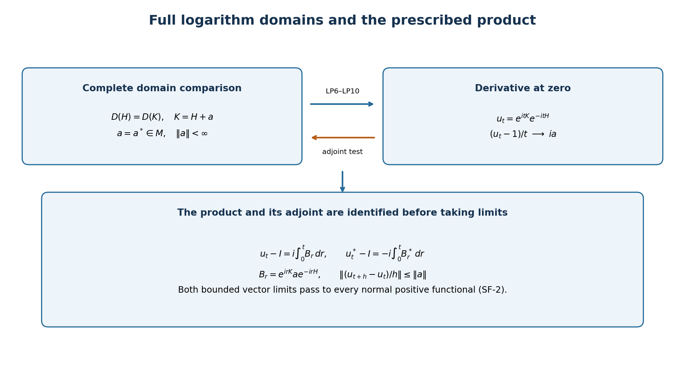

# Logarithmic products and bounded perturbations

*Original exposition and illustration sources are dedicated under CC0-1.0 to the extent of any rights held. Independently reviewed at the stated earlier inputs.*

For self-adjoint operators, a bounded derivative of the product of their spectral groups determines their entire common domain. Conversely, a bounded difference on that domain determines the actual product by a vector integral. The statement concerns arbitrary Hilbert spaces and every normal positive functional.

The required spectral, scalar and concrete-topology boundary, with local proofs of its consequences, is stated in [the accompanying operator foundations](OA-FLOW-SF.md), SF-0–SF-4. Those foundations and this candidate form one proof package. The shared foundation proves the required spectral theorem in SB-1–SB-6. Its earlier scalar-measure and set-theoretic inputs remain under programme review.

## 1. Exact theorem

Let \(M\) be a concrete von Neumann algebra on a complex Hilbert space, and let \(H\) and \(K\) be self-adjoint operators affiliated with \(M\). No separability, trace or \(\sigma\text{-finiteness}\) is assumed. Define

\[
u_t=e^{itK}e^{-itH}\quad(t\in\mathbb R).
\tag{LP1}
\]

The following conditions are equivalent:

1. The quotient \((u_t-1)/t\) converges to an element of \(M\) in the intrinsic \(\sigma\text{-strong}\) topology as \(t\) tends to zero through nonzero real numbers.
2. \(D(H)=D(K)\) and there is a bounded \(a=a^*\in M\) such that \(Kv=Hv+av\) on this complete domain.
3. The map \(t\mapsto u_t\) is differentiable in the intrinsic \(\sigma\text{-strong-*}\) topology at every real time, with a derivative continuous in that topology.

The derivative at zero is \(ia\), and under these conditions

\[
u'_t=i e^{itK}a e^{-itH},\qquad
(u_t^*)'=-i e^{itH}a e^{-itK},\qquad
\|u_t-u_s\|\leq\|a\|\,|t-s|.
\tag{LP2}
\]

The intrinsic seminorms are \(\omega(x^*x)^{1/2}\) and, for the star topology, \(\omega(xx^*)^{1/2}\), as \(\omega\) ranges over all normal positive functionals. Both operators in condition 2 are already self-adjoint. The theorem is not invoking a construction of self-adjoint sums from arbitrary perturbation data.

## 2. A derivative detects the complete domain

We first prove a useful spectral-group test by the adjoint definition. For self-adjoint \(A\), suppose

\[
\frac{e^{itA}-1}{t}v\longrightarrow w
\quad\hbox{in Hilbert norm}.
\]

For \(\eta\) in \(D(A)\), SF-1 gives the derivative of \(e^{-itA}\) \(\eta\). With the inner product linear in its first variable,

\[
\langle w,\eta\rangle
=\lim_{t\to0}\left\langle v,\frac{e^{-itA}-1}{t}\eta\right\rangle
=i\langle v,A\eta\rangle.
\]

Thus the adjoint test puts \(v\) in \(D(A^*)=D(A)\), and \(Av=-iw\). This proves the reverse-domain assertion without an assumed common core. An alternative scalar check is Fatou along \(t=1/n\): bounded quotient norms imply \(\int x^2\,d\mu_v^A(x)<\infty\); the exact spectral domain and dominated convergence then identify the same derivative.

Now assume condition 1 and write \(Q_t=(u_t-1)/t\), with limit \(b\) in \(M\). Intrinsic convergence includes convergence on every concrete vector. The algebraic identity

\[
Q_t^*=-u_t^*Q_t
\tag{LP3}
\]

and strong continuity of the two unitary groups imply \(Q_t^*v\) tends to \(-bv\). Indeed \(Q_tv\) is a norm-convergent vector and the moving left factor is norm one. Strong convergence of \(Q_t\) also makes its adjoints converge weakly to \(b^*\). Comparing the two limits yields \(b^*=-b\). Therefore \(a=-ib\) is bounded and self-adjoint.

For \(v\) in \(D(H)\), the actual group identity \(e^{itK}=u_te^{itH}\) gives

\[
\frac{e^{itK}-1}{t}v
=Q_tv+u_t\frac{e^{itH}-1}{t}v
\longrightarrow i(Hv+av).
\tag{LP4}
\]

The test just proved gives \(v\) in \(D(K)\) and \(Kv=Hv+av\). Reversing the groups, for \(v\) in \(D(K)\) one has

\[
\frac{e^{itH}-1}{t}v
=Q_t^*v+u_t^*\frac{e^{itK}-1}{t}v
\longrightarrow i(Kv-av).
\tag{LP5}
\]

This gives the reverse domain inclusion. No norm boundedness theorem for general convergent nets is used: all moving factors here are unitaries, and their right-hand vectors converge in norm. This proves condition 2 with the full domains.

## 3. Comparison of the two groups

Assume condition 2 and put \(D=D(H)=D(K)\). Fix a real \(t\) and \(v\) in \(D\). Consider, as a function of real \(s\) between 0 and \(t\),

\[
F_t(s)v=e^{i(t-s)K}e^{isH}v.
\]

The right factor preserves \(D(H)=D(K)\). Splitting the actual increment quotient into its two factors and using the spectral derivative on that fixed domain gives

\[
\frac{d}{ds}F_t(s)v
=-i e^{i(t-s)K}(K-H)e^{isH}v
=-i e^{i(t-s)K}a e^{isH}v.
\tag{LP6}
\]

For the split quotient, a factor multiplying a convergent vector is uniformly bounded by one; the estimate \(\|U_hx_h-Ux\|\leq\|x_h-x\|+\|(U_h-U)x\|\) justifies its limit. In particular no assertion that \(a\) preserves \(D\) is needed. The final derivative is norm-continuous because \(a\) is bounded.

The vector fundamental theorem in SF-3 yields

\[
(e^{itK}-e^{itH})v
=i\int_0^t e^{i(t-s)K}a e^{isH}v\,ds.
\tag{LP7}
\]

The integrand has norm at most \(\|a\|\) \(\|v\|\). Density of \(D\) and that uniform bound extend (LP7) to every vector. Apply it to \(e^{-itH}v\) and substitute \(r=t-s\) in the oriented integral. The result identifies the prescribed product itself:

\[
u_t-1=i\int_0^t B_r\,dr,
\qquad B_r=e^{irK}a e^{-irH},\quad\|B_r\|=\|a\|.
\tag{LP8}
\]

This is a strong vector integral. The bounded operators defined by its vector integrals lie in \(M\): their uniformly bounded Riemann sums lie in \(M\) and converge strongly. It is not an assertion of operator-norm continuity or operator-norm integrability of \(r\mapsto B_r\).

Both \(B_r\) and \(B_r^*\) are strongly continuous. Pairing their vector integrals against two vectors shows that the adjoint of the integral of \(B_r\) is the integral of \(B_r^*\). Hence

\[
u_t^*-1=-i\int_0^t B_r^*\,dr,
\qquad B_r^*=e^{irH}a e^{-irK}.
\tag{LP9}
\]

These identities establish the adjoint formula for the actual product, with all real signs fixed by the oriented integrals.

## 4. Differentiability in every normal seminorm

Subtract (LP8) at \(t+h\) and \(t\). SF-3 gives the vector limit

\[
\frac{u_{t+h}-u_t}{h}=\frac{i}{h}\int_t^{t+h}B_r\,dr
\longrightarrow iB_t.
\tag{LP10}
\]

The quotient norm is at most \(\|a\|\), for all real \(t\) and nonzero \(h\). Subtracting \(iB_t\) bounds the error norm by \(2\|a\|\). The adjoint identity gives the adjoint limit \(-iB_t^*\) with the same bounds. The bounded concrete-to-intrinsic lemma SF-2 therefore proves both defining seminorm limits for every normal positive functional. It applies to the Riemann sums as well, so both integrals are also intrinsic \(\sigma\text{-strong-*}\) limits.

\(B_t\) and \(B_t^*\) are strongly continuous and uniformly bounded. Apply SF-2 to their differences to see that the derivative is intrinsically \(\sigma\text{-strong-*}\) continuous. The integral norm estimate gives the Lipschitz bound in (LP2). This proves condition 3; condition 3 includes condition 1, closing the equivalence. It proves norm continuity of \(u\), not necessarily norm continuity of its derivative.

Since each vector test in a normal representation is a normal positive functional on \(M\), the asserted limits transport to any such representation. Degenerate representations use the support convention of SF-2. The derivative is zero off that support. These conclusions require no faithful normal state or standard form.

## 5. Logarithms and cocycle orientation

For \(\alpha_t^H(x)=e^{itH}xe^{-itH}\), multiplication of bounded unitary factors gives

\[
u_{t+s}=u_t\alpha_t^H(u_s),\qquad
B_t=u_t\alpha_t^H(a),\qquad
B_t^*=\alpha_t^H(a)u_t^*.
\tag{LP11}
\]

The perturbation is consequently on the right in \(u'_t=iu_t\alpha_t^H(a)\). This identity follows after the prescribed product has been identified, without solving an unconnected differential equation.

If \(h\) and \(k\) are positive injective affiliated operators, the full spectral calculus defines \(H=\log h,\quad K=\log k\), regardless of whether their inverses are bounded. The theorem applies to \(k^{it}h^{-it}\). In a semifinite algebra with a fixed n.s.f. trace \(\tau\), interpreting this as \([D\tau_k:D\tau_h]_t\) additionally requires the trace-density cocycle theorem, and identifying \(\alpha^H\) with the density modular flow requires its modular theorem. Those are separate weight inputs, not consequences of the operator proof. No order or product of unbounded densities is evaluated inside a weight here.

*Logical proof map for §§2–4. It displays full domains, the prescribed order, both adjoint signs and the actual quotient bound. It is a schematic, not finite-dimensional evidence for the theorem. Reproduction source: `render_figures.py`.*

## 6. Noncommuting example and complete exercises

On \(\mathbb C^2\) take

\[
H=\begin{pmatrix}1&0\\0&-1\end{pmatrix},\quad
a=\begin{pmatrix}0&1\\1&0\end{pmatrix},\quad
K=H+a,\quad h=e^H,\quad k=e^K.
\tag{LP12}
\]

The densities are positive and invertible, \(K^2=2I\), and the entire matrix power series give

\[
k=\cosh(\sqrt{2})I+\frac{\sinh(\sqrt{2})}{\sqrt{2}}K,
\quad
u_t=\left(\cos(\sqrt{2}t)I+\frac{i\sin(\sqrt{2}t)}{\sqrt{2}}K\right)
\begin{pmatrix}e^{-it}&0\\0&e^{it}\end{pmatrix}.
\tag{LP13}
\]

If \(Y\) has entries \(\begin{pmatrix}0&-i\\i&0\end{pmatrix}\), then \(aH=-iY\). Expanding the last formula gives

\[
u_t=I+ita-\tfrac12t^2I-it^2Y+O(t^3),\qquad
e^{ita}=I+ita-\tfrac12t^2I+O(t^3).
\tag{LP14}
\]

Thus equal derivatives at zero do not make the product the group \(e^{ita}\). The cocycle uses \(\alpha_t^H(a)=\begin{pmatrix}0&e^{2it}\\e^{-2it}&0\end{pmatrix}\).

**Exercise 1: scalar order.** For \(h=1,\ k=c>0\), compute the derivative and its adjoint. **Solution.** The logarithms are 0 and \(\log c\). Thus \(u_t=c^{it},\ u'_0=i\log c,\quad(u_t^*)'_0=-i\log c\). This verifies the orientation \(k^{it}h^{-it}\).

**Exercise 2: an unbounded inverse.** On \(\ell^2(\mathbb N)\), let \(he_n=e^{-n}e_n,\quad k=e^ch,\ c\in\mathbb R\). **Solution.** The logarithms are diagonal with entries \(-n\) and \(-n+c\). Both full domains are \(\{v:\sum_n n^2|v_n|^2<\infty\}\); the inequalities \(|n-c|^2\leq2n^2+2c^2,\quad n^2\leq2|n-c|^2+2c^2\) prove the equality. Their difference is \(cI\), so \(u_t=e^{itc}I,\quad u'_t=ic\,e^{itc}I\). Both density inverses are unbounded.

**Exercise 3: compute the noncommuting term.** In (LP12), expand the product to order two. **Solution.** The quadratic coefficient is \(KH-(K^2+H^2)/2\). Since \(KH=I+aH\), \(K^2=2I\), \(H^2=I\) and \(aH=-iY\), it is \(-I/2-iY\). This recovers (LP14) and exhibits the term lost by replacing the prescribed product with an ordinary exponential.

The original theorem's domains, generality, topology, signs, examples and solutions have all been retained. The new proof of the reverse-domain clause uses the adjoint definition, and the forward argument compares the two groups before forming their product. Source access and remaining exact programme obligations are recorded separately in the repair report.
