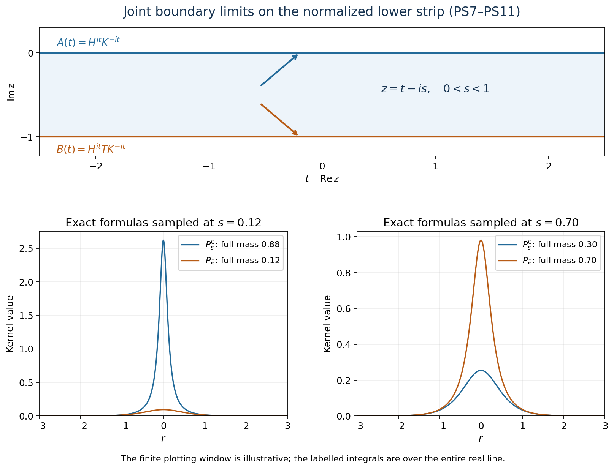

# Power forms and contractive strips

*Original exposition and illustration sources are dedicated under CC0-1.0 to the extent of any rights held. Independently reviewed at the stated earlier inputs.*

The lower strip of depth \(a\) detects the closed form of the power \(2a\). The product order in this lesson is \(h^{it}k^{-it}\). The result holds on arbitrary Hilbert spaces, even when both positive operators and their inverses are unbounded. Its extension has genuine joint continuity at both edges for all normal positive functional seminorms, including adjoints.

The exact elementary Hilbert, spectral, scalar and concrete-topology foundations are listed in [the accompanying proof](OA-FLOW-SF.md), SF-0–SF-4. Those lemmas and this candidate are a single proof package.

## 1. The theorem and its normalization

Let \(M\) be a concrete von Neumann algebra on a complex Hilbert space, and let \(h\), \(k\) be positive injective self-adjoint operators affiliated with \(M\). No separability, semifiniteness or bounded inverse is assumed. For \(a>0\) let

\[
S_a=\{z\in\mathbb C:-a\leq\operatorname{Im}z\leq0\},
\qquad u_t=h^{it}k^{-it}.
\tag{PS1}
\]

The following conditions are equivalent:

1. \(u\) extends to a contractive \(M\)-valued function \(U\) on \(S_a\), holomorphic in the interior and jointly intrinsically \(\sigma\text{-strong}\) continuous on the closed strip.
2. \(D(k^a)\) is contained in \(D(h^a)\), and \(\|h^av\|\leq\|k^av\|\) for every \(v\) in \(D(k^a)\).

Condition 2 is precisely \(h^{2a}\leq k^{2a}\) as closed positive forms. The extension is unique, norm-holomorphic in the interior and jointly intrinsically \(\sigma\text{-strong-*}\) continuous on the closed strip. If \(T\) denotes the unique bounded contraction extending \(h^ak^{-a}\) on its full natural domain \(D(k^{-a})\), then

\[
U(t-ia)=h^{it}T k^{-it}.
\tag{PS2}
\]

Put \(H=h^a,\quad K=k^a\). The width-one product \(H^{it}K^{-it}=u_{at}\) has extension \(V(w)=U(aw)\), and \(U(z)=V(z/a)\). It therefore suffices to prove the result for the full domain inequality \(D(K)\subseteq D(H),\quad\|Hv\|\leq\|Kv\|\), and \(S_1\). All inner products below are linear in the first variable.

## 2. The endpoint is a bounded closure

On \(\operatorname{Ran}K\) define \(T_0(Kv)=Hv\) for \(v\in D(K)\). Injectivity makes this well defined, and the full domain inequality makes it a contraction. \(\operatorname{Ran}K\) is dense because its orthogonal complement is \(\ker K\). Consequently \(T_0\) has a unique bounded extension \(T\). The complete inverse domain is \(D(K^{-1})=\operatorname{Ran}K\); \(K^{-1}\) maps it onto \(D(K)\), which is contained in \(D(H)\). Thus the actual product \(HK^{-1}\), on all of its natural inverse domain, is \(T_0\) and its closure is \(T\).

For each unitary \(w\) in \(M'\), the affiliation domains are invariant under \(w\) and the operators commute there. Hence \(TwKv=Hwv=wHv=wTKv\). Density proves \(Tw=wT\); the [commutant-unitary test](OA-FLOW-SF.md#oa-flow.sf0.commutant-unitaries) therefore puts \(T\) in \(M\). The two boundary curves

\[
A(t)=H^{it}K^{-it},\qquad B(t)=H^{it}T K^{-it}
\tag{PS3}
\]

are contractions in \(M\) and are strongly-star continuous. This follows from the spectral groups, their adjoints and fixed bounded \(T\); moving vector products use the norm-one estimates.

## 3. Scalar interpolation constructs the actual operator

Write \(e_n^K=1_{[1/n,n]}(K)\), \(e_m^H=1_{[1/m,m]}(H)\). SF-1 proves that their increasing unions are dense graph cores. For \(\xi\) in a \(K\)-band and \(\eta\) in an \(H\)-band define

\[
f_{\xi,\eta}(z)=\langle K^{-iz}\xi,H^{-i\overline z}\eta\rangle.
\tag{PS4}
\]

The spectral logarithms are bounded on each of these separate bands. Their vector power series and the inner-product convention make \(f\) entire. For \(z=t-is\), \(0\leq s\leq1\), its factors are \(K^{-s-it}\text{ and }H^{s-it}\); their norms are uniformly bounded over the strip by constants depending on the two bands. On the top edge it is the coefficient of \(A(t)\). On the bottom, \(K^{-1-it}\xi\) lies in \(D(K)\), hence \(D(H)\), and

\[
f_{\xi,\eta}(t-i)
=\langle HK^{-1-it}\xi,H^{-it}\eta\rangle
=\langle B(t)\xi,\eta\rangle.
\]

Thus both edge moduli are at most \(\|\xi\|\,\|\eta\|\). To pass that bound into the strip, normalize the vectors and multiply \(f\) by \(e^{-\varepsilon z^2}\). On the horizontal sides its modulus is at most \(e^\varepsilon\), and on vertical sides at real part \(\pm R\) it is at most \(\|f\|_\infty e^{-\varepsilon R^2+\varepsilon}\). The rectangle maximum principle SF-4 applies for sufficiently large \(R\). For each fixed \(z\) it gives \(|f(z)|\leq e^{\varepsilon(1+(\operatorname{Re}z)^2-(\operatorname{Im}z)^2)}\); let \(\varepsilon\) decrease to zero. Therefore

\[
|f_{\xi,\eta}(z)|\leq\|\xi\|\,\|\eta\|\quad(z\in S_1).
\tag{PS5}
\]

For each \(z\) this form extends to all pairs of vectors and represents a contraction \(V(z)\). For clarity, the representation uses only Hilbert orthogonal projection: a nonzero bounded conjugate-linear functional has a closed kernel with one-dimensional orthogonal complement; its value on a unit vector spanning that complement determines its representing vector. Uniqueness makes that vector depend linearly on \(\xi\). At the two edges \(V\) is \(A\) and \(B\).

Uniform contraction bounds allow each vector to be approximated by its own spectral bands, uniformly in \(z\). Hence all coefficients of \(V\) are continuous on the closed strip and holomorphic inside. Simultaneous application of a commutant unitary to \(\xi\), \(\eta\) leaves (PS4) unchanged. The [commutant-unitary test](OA-FLOW-SF.md#oa-flow.sf0.commutant-unitaries) therefore makes \(V(z)\) commute with all of \(M'\), and puts it in \(M\). In bounded form, the construction says

\[
e_m^H V(z)e_n^K
=(H^{iz}e_m^H)(K^{-iz}e_n^K).
\tag{PS6}
\]

Each factor here is bounded. This is the precise meaning of the formal power product before any unbounded product domain is established.

For a circle of radius \(r\) contained in the interior, define operator coefficients by applying the scalar Cauchy coefficient integral to every pair of vectors. Their norms are at most \(r^{-j}\); commutant invariance puts them in \(M\). Scalar Cauchy's formula and the geometric norm bound give an operator-norm power series for \(V\) on that circle's interior. Thus \(V\) is norm-holomorphic. The same argument shows that a locally bounded extension initially holomorphic only in all normal scalar coefficients has this stronger holomorphy. Normal vector coefficients are among those tests, and SF-2 gives the remaining normal coefficients by locally uniform summable series.

## 4. A proof of both boundary limits

Weak convergence at the lower edge would not suffice. We prove norm convergence on every vector and on every adjoint vector by explicit scalar kernels. For \(0<s<1\) define

\[
P_s^0(r)=\frac{\sin(\pi s)}{2(\cosh(\pi r)-\cos(\pi s))},\qquad
P_s^1(r)=\frac{\sin(\pi s)}{2(\cosh(\pi r)+\cos(\pi s))}=P_{1-s}^0(r).
\tag{PS7}
\]

They are positive. With \(\theta=\pi s,\quad v=e^{\pi r}\), direct one-variable integration gives

\[
\int_{\mathbb R}P_s^0(r)\,dr
=\frac{\sin\theta}{\pi}\int_0^\infty
\frac{dv}{(v-\cos\theta)^2+\sin^2\theta}
=1-s,
\qquad\int_{\mathbb R}P_s^1(r)\,dr=s.
\tag{PS8}
\]

For any \(\delta>0\) the tail of \(P_s^0\) outside \((-\delta,\delta)\) is at most

\[
\frac{\sin(\pi s)}2\int_{|r|\geq\delta}
\frac{dr}{\cosh(\pi r)-1},
\tag{PS9}
\]

which tends to zero as \(s\) decreases to zero. The fixed comparison integral is finite, away from its singular point and with exponential decay. At the lower edge exchange \(s\) with \(1-s\) and the two labels.

For bounded continuous scalar \(b_0,b_1\), convolution with these two kernels is a bounded harmonic function of \((t,s)\). To verify harmonicity directly, the kernels are respectively \(-1/2\) times the imaginary part of \(\coth(\pi(r+is)/2)\) and \(1/2\) times the imaginary part of \(\tanh(\pi(r+is)/2)\). They have no poles in the open strip. On compact interior substrips, their derivatives through order two have integrable bounds with exponential tails. Differentiating the kernels in the convolution variable \(t-x\) under the scalar integral is therefore legitimate. The masses and (PS9) prove joint convergence to \(b_0(t_0)\) as \((t,s)\to(t_0,0)\): split the first convolution into small \(|r|\), controlled by continuity, and its tail, controlled by (PS9); the second convolution has mass \(s\). The same argument works at the bottom.

The bounded harmonic function with these edge data is unique. For a bounded harmonic difference \(q\) with zero edge values, compare its real part and its negative with

\[
\epsilon\cosh(ct)\cos(c(s-1/2)),\qquad 0<c<\pi.
\]

This is positive harmonic on the closed strip. On the distant vertical sides of a sufficiently wide rectangle it exceeds \(|\operatorname{Re}q|\); on the horizontal edges it exceeds zero. The rectangle harmonic maximum principle gives the comparison in the rectangle. Let \(\varepsilon\) decrease to zero at each fixed point and repeat for \(\operatorname{Im}q\). Thus every bounded scalar holomorphic function continuous on the closed strip equals the stated convolution of its edges.

Apply this scalar identity to the coefficients of \(V\). SF-3 constructs the required improper vector integrals directly, since the boundary orbits are bounded continuous and the kernels are continuous integrable. Equality of all scalar inner products proves

\[
\begin{aligned}
V(t-is)\xi
&=\int P_s^0(r)A(t-r)\xi\,dr+\int P_s^1(r)B(t-r)\xi\,dr,\\
V(t-is)^*\xi
&=\int P_s^0(r)A(t-r)^*\xi\,dr+\int P_s^1(r)B(t-r)^*\xi\,dr.
\end{aligned}
\tag{PS10}
\]

For the second line pair the first with two vectors and use the real-valued kernels; both adjoint orbits are norm-continuous on each vector. The approximate-identity proof uses only the integral norm bound, so it now proves both vector limits jointly. More explicitly, for \(|t-t_0|<\delta\) and

\[
\rho_\xi(\delta)=\sup_{|q-t_0|\leq2\delta}
\|(A(q)-A(t_0))\xi\|,
\]

one has

\[
\|(V(t-is)-A(t_0))\xi\|
\leq\rho_\xi(\delta)
+2\|\xi\|\int_{|r|\geq\delta}P_s^0(r)\,dr
+2s\|\xi\|.
\tag{PS11}
\]

First choose \(\delta\), then \(s\). The same inequality with \(A^*\) controls the adjoint; exchanging the labels controls the lower edge. Interior norm-holomorphy gives the remaining continuity. The family consists of contractions, so differences have norm at most two. SF-2 upgrades this concrete joint strong-star continuity to joint intrinsic \(\sigma\text{-strong-*}\) continuity for every normal positive functional. This argument avoids both an unproved vector integration theorem and a weak-to-strong inference at a nonunitary endpoint.

*The strip is normalized to depth one. The plots are samples of the exact kernels (PS7); labels give the proved full-line masses (PS8), not the area of the displayed finite window. The endpoint limits follow from (PS9)–(PS11). Reproduction source: `render_figures.py`.*

## 5. Necessity from bounded spectral corners

Suppose instead that \(V\) is an extension as in condition 1, with only the required \(\sigma\text{-strong}\) closed-strip continuity. In particular all vector coefficients are continuous. For \(\xi\) in a \(K\)-band and \(\eta\) in an \(H\)-band, its coefficient and (PS4) agree on the top real edge. Their difference extends by zero across a small real interval and is holomorphic there by SF-4. It is zero on an open half-disk, hence throughout the connected strip. Continuity gives equality also at the lower edge. This proves (PS6) for the given extension, without any prior form-domain assumption.

Let \(T=V(-i)\). Fix \(\xi\) in a \(K\)-band, put \(v=K^{-1}\xi\), and use (PS6) at \(z=-i\):

\[
H e_m^H v=e_m^H T\xi.
\tag{PS12}
\]

The right side has norm at most \(\|\xi\|\). By the spectral domain formula and monotone convergence, the uniform bound on the left gives \(\int x^2\,d\mu_v^H(x)\leq\|\xi\|^2\). Thus \(v\) belongs to the **full** \(D(H)\). Let \(m\) tend to infinity to conclude \(Hv=T\xi\). This bounded-cutoff test supplies the missing product domain instead of assuming it.

For \(w\) in a \(K\)-band, \(\xi=Kw\) remains in that band. The result gives \(w\) in \(D(H)\) and \(Hw=TKw\). For arbitrary \(w\) in \(D(K)\), the band approximants \(w_n=e_n^Kw\) converge in the graph norm of \(K\). Hence \(w_n\) tends to \(w\) and \(Hw_n=TKw_n\) tends to \(TKw\). Closedness of \(H\) gives \(w\) in \(D(H)\), \(Hw=TKw\) and \(\|Hw\|\leq\|Kw\|\). This is condition 2 on its entire domain. Section 2 then shows that \(T\) is the bounded closure of the full product \(HK^{-1}\).

The same scalar boundary-interval uniqueness applies to two proposed extensions. Their coefficients agree on the top edge, hence everywhere. Consequently every initially \(\sigma\text{-strong}\) extension is the one constructed in §§2–4 and has its stronger continuity. No bounded inverse is used in either implication.

## 6. Normal representations and the original depth

For a normal unital representation \(\pi\), SF-1 transports \(H\) and \(K\) by their spectral projections. Applying \(\pi\) to (PS6) gives the bounded corner identity for \(\pi(V(z))\) and the transported operators \(H_\pi,K_\pi\). At -i, the monotone-cutoff argument (PS12) and then the \(K_\pi\) graph-core approximation prove \(D(K_\pi)\subseteq D(H_\pi)\) and \(H_\pi=\pi(T)K_\pi\) on that domain. Thus the closed-form comparison is intrinsic as well. The bounded corner coefficients and uniqueness identify \(\pi(V)\) with the construction in that representation; normal vector tests, or the repeated vector-kernel proof, give its two boundary limits. For a degenerate representation apply this on \(\pi(1)H\); extend spectral unitary factors by the identity on its orthogonal complement.

This transfer applies in particular to the GNS representation of any normal positive \(\omega\). Its elementary construction is the completion of \(M\) modulo \(\{b:\omega(b^*b)=0\}\), with inner product \(\omega(c^*b)\). Here is the needed Cauchy–Schwarz proof, including null vectors. Set \(q(b)=\omega(b^*b)\) and \(B(b,c)=\omega(c^*b)\). Expanding the real nonnegative quantities \(q(b+c)\) and \(q(b+ic)\) gives \(B(c,b)=\overline{B(b,c)}\). Consequently, for every \(z\in\mathbb C\),

\[
 0\leq q(b+zc)=q(b)+2\operatorname{Re}(\overline zB(b,c))+|z|^2q(c).
\]

If \(q(c)>0\), choose \(z=-B(b,c)/q(c)\), yielding \(|B(b,c)|^2\leq q(b)q(c)\). If \(q(c)=0\), choose \(z=-tB(b,c)\) for arbitrarily large positive real \(t\); then \(q(b)-2t|B(b,c)|^2\geq0\), which forces \(B(b,c)=0\). Thus the same inequality holds also when either diagonal value is zero, and the quotient inner product is well defined. Moreover, \(b^*x^*xb\leq\|x\|^2b^*b\) makes left multiplication a bounded star representation. For increasing projections \(p_i\) tending to \(p\), the squared norm on \([b]\) of \((\pi(p)-\pi(p_i))[b]\) is \(\omega(b^*(p-p_i)b)\), which tends to zero by SF-2 applied to the normal positive functional \(\omega_b(x)=\omega(b^*xb)\). This functional is normal because multiplication \(x\mapsto b^*xb\) replaces the vectors \(\xi_j,\eta_j\) in each defining ultraweak test by \(b\xi_j,b\eta_j\), preserving their square-summability; composition with the continuous \(\omega\) is therefore continuous. The projection differences \(p-p_i\) are uniformly bounded by one and tend strongly to zero, so SF-2 applies; their squares equal themselves. Density and the contraction bound give precisely the strong projection continuity needed to transport the spectral measures and repeat the bounded-corner proof; no additional representation theorem is needed for that use. The cyclic vector \(\Omega=[1]\) satisfies \(\|\pi(x)\Omega\|^2=\omega(x^*x)\), and therefore tests exactly the intrinsic seminorms proved in §4. The zero functional has zero Hilbert space. No countability assumption on \(M\) or its predual enters.

Finally take \(H=h^a,\ K=k^a\) and \(U(z)=V(z/a)\). The lower boundary becomes \(h^{it}Tk^{-it}\) at \(t-ia\), exactly (PS2). Rescaling is a homeomorphism of the closed strips and a biholomorphism of their interiors; it preserves every continuity and holomorphy assertion. This completes the theorem.

In a semifinite algebra with an n.s.f. trace \(\tau\), interpreting \(u_t\) as \([D\tau_h:D\tau_k]_t\) separately requires the faithful density weights and their normalized cocycle identity. The operator theorem proves neither that weight theorem nor a general weight-order-reflection theorem, and uses neither as a premise.

## 7. Every positive power and spectral order

The following are equivalent:

1. \(h^{it}k^{-it}\) admits the contractive extension at every positive depth.
2. \(h^p\leq k^p\) as complete closed forms for every \(p>0\).
3. \(E_k([0,s])\leq E_h([0,s])\) for every \(s\geq0\).

The theorem gives 1 iff 2 with \(p=2a\). Suppose 2. If \(\xi\) belongs to \(E_k([0,s])H\) for \(s>0\), the \(p=2n\) case yields \(\|h^n\xi\|\leq\|k^n\xi\|\leq s^n\|\xi\|\). For \(v>s\),

\[
v^{2n}\|E_h((v,\infty))\xi\|^2\leq s^{2n}\|\xi\|^2.
\tag{PS13}
\]

Let \(n\) tend to infinity and then \(v\) decrease to \(s\). Strong spectral continuity gives \(E_h((s,\infty))\xi=0\), proving 3. At \(s=0\) injectivity makes \(E_k(\{0\})=0\); without injectivity the same conclusion follows by testing \(p=2\) on \(\ker k\).

Conversely 3 reverses to \(E_h((s,\infty))\leq E_k((s,\infty))\), so the squared spectral tails are ordered on every vector. Here is a finite-sum proof of the full power forms, avoiding a new interchange theorem. For \(x\geq0\) set

\[
g_n(x)=2^{-n}\sum_{j=1}^{n2^n}1_{\{x>j2^{-n}\}}.
\tag{PS14}
\]

These functions increase to \(x\) and satisfy \(0\leq g_n(x)\leq x\). To check monotonicity, split each old interval at its midpoint: the old contribution is replaced by two half-size contributions with no larger threshold, while the extended cutoff adds only nonnegative terms. At an exact old grid point the strict inequality still gives at least the old sum. The approximation error before the cutoff is at most \(2^{-n}\); the cutoff tends to infinity.

Apply the finite spectral sums \(g_n(h^p),g_n(k^p)\). Each threshold in (PS14) is a tail at \((j2^{-n})^{1/p}\); projection order gives

\[
\langle g_n(h^p)\xi,\xi\rangle
\leq\langle g_n(k^p)\xi,\xi\rangle.
\]

Monotone convergence in the two finite scalar spectral measures now yields \(\int x^p\,d\mu_\xi^h(x)\leq\int x^p\,d\mu_\xi^k(x)\), allowing infinity. By the full domain formula, finiteness on the right is exactly \(\xi\in D(k^{p/2})\); it implies \(\xi\in D(h^{p/2})\) and the required norm inequality. This proves 2 on its entire domain.

The usual integral-of-tails identity can also be retained without assuming an interchange theorem. For a finite positive spectral measure \(\mu\), use thresholds \(j\delta,\ \delta=2^{-n}\), up to \(n\), with weights \((j\delta)^p-((j-1)\delta)^p\). The resulting finite step functions of \(\lambda\) increase to \(\lambda^p\). Their \(\mu\)-integrals equal the integrals against \(ps^{p-1}\,ds\) of the tail function sampled at the right endpoint of each interval and truncated at \(n\). Both approximations increase: refinement lowers the sampled threshold and splits the positive weights, while the cutoff expands. The sampled tails tend to \(\mu((s,\infty))\) by continuity from below. Monotone convergence on both sides, using the elementary integral of \(ps^{p-1}\) on each finite interval, therefore proves

\[
\int\lambda^p\,d\mu_\xi^h(\lambda)
=\int_0^\infty p s^{p-1}\|E_h((s,\infty))\xi\|^2\,ds
\leq\int_0^\infty p s^{p-1}\|E_k((s,\infty))\xi\|^2\,ds
=\int\lambda^p\,d\mu_\xi^k(\lambda).
\tag{PS15}
\]

Infinity is permitted in this identity and inequality; finiteness on the \(k\) side has exactly the domain consequence already proved.

The extensions agree on overlaps by uniqueness. They therefore define a single contraction-valued function on the closed lower half-plane, norm-holomorphic inside and jointly intrinsically \(\sigma\text{-strong-*}\) continuous at every finite point: choose a strip of larger depth around that point. No boundary condition at infinity is asserted.

## 8. Worked exercises preserving the full scope

**1. Depth one-half need not give depth one.** Let

\[
h=\begin{pmatrix}1&0\\0&2\end{pmatrix},\qquad
k=\begin{pmatrix}2&1\\1&3\end{pmatrix}.
\]

Both are positive invertible. The difference \(k-h=\begin{pmatrix}1&1\\1&1\end{pmatrix}\) is positive, so the depth one-half criterion holds. But \(k^2-h^2=\begin{pmatrix}4&5\\5&6\end{pmatrix}\), and its quadratic form on \(\xi=(5,-4)^T\) equals -4. Depth one therefore fails. Explicitly

\[
hk^{-1}=\frac{1}{5}\begin{pmatrix}3&-1\\-2&4\end{pmatrix},\quad
\eta=k\xi=(6,-7)^T,\quad hk^{-1}\eta=h\xi=(5,-8)^T.
\]

The squared norms are 85 and 89, so the forced bottom operator is not contractive. The example makes no claim about the largest admissible intermediate depth.

**2. Both operators and both inverses may be unbounded.** On \(\ell^2(\mathbb N)\) let \(Ke_{2n-1}=ne_{2n-1},\quad Ke_{2n}=n^{-1}e_{2n}\), and \(H=cK\text{ with }0<c<1\). The complete domains are

\[
D(K)=D(H)=\{\xi:\sum_n n^2|\xi_{2n-1}|^2<\infty\},\qquad
D(K^{-1})=\{\xi:\sum_n n^2|\xi_{2n}|^2<\infty\}.
\]

The other coordinates are already square summable. On the full inverse domain \(HK^{-1}=cI\) and its closure is \(T=cI\). The real product is \(c^{it}I\), and \(V(z)=c^{iz}I\) is its entire extension. At \(z=t-is\) its norm is \(c^s\leq1\); at \(t-i\) it is \(c^{1+it}I\). Both boundaries are norm-continuous, although no inverse becomes bounded.

**3. Reverse that ratio.** If the previous example has \(c>1\), can any positive depth work? No. Boundary uniqueness forces the scalar function \(c^{iz}I\), whose norm at depth \(a\) is \(c^a>1\). Equivalently the form inequality would demand \(c^{2a}K^{2a}\leq K^{2a}\), which fails on any nonzero compact spectral band.

**4. All depths do not force commutation.** Take \(h=\operatorname{diag}(1,2),\quad k=\begin{pmatrix}4&1\\1&4\end{pmatrix}\). The latter has eigenvalues 3,5. Hence for every \(p>0\), \(h^p\leq2^pI\leq3^pI\leq k^p\). All depths follow. In this finite-dimensional model \(U(z)=h^{iz}k^{-iz}\), and at \(z=t-is\) its norm is at most \((2/3)^s\) for \(s\geq0\). Nevertheless \(hk-kh=\begin{pmatrix}0&-1\\1&0\end{pmatrix}\) is nonzero. The low-projection order proved in §7 does not assert simultaneous diagonalization.

The complete operator scope, scalar factor \(2a\), both boundary topologies, normal-functional tests, all-powers conclusion and four examples have been preserved. The new necessity proof uses monotone bounded corners, and the new spectral-order converse uses only finite positive sums. The independent development record, exact source hashes and remaining foundational obligations accompany this candidate.
