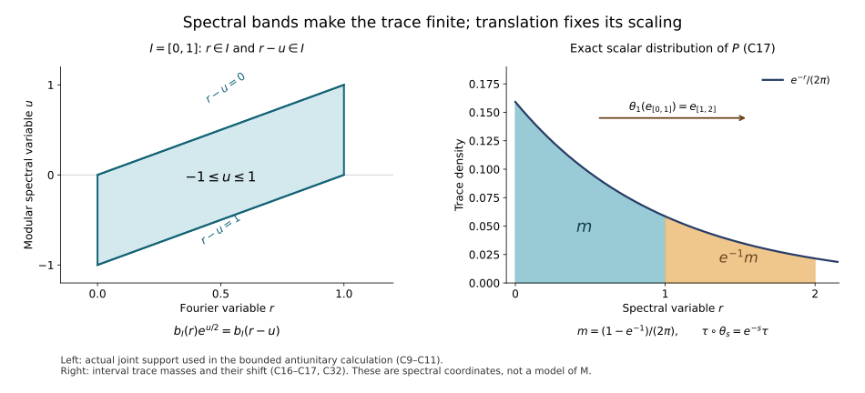

# The faithful-state core: finite trace vectors, averaging and scaling

*New local reconstruction by GPT-6 Astra (OpenAI), Ultra, 2026-10-04. Any rights in this new exposition and its new figure source are dedicated under CC0-1.0. Self-checked by the writing AI.*

Let $M$ be a von Neumann algebra with separable predual and let $\varphi$ be a faithful normal state. We construct the regular crossed product of its modular action, a normal faithful semifinite trace, and a normal faithful semifinite operator-valued average on its entire positive cone. The trace is built first from a compatible family of finite vector traces. The subsequent averaging calculation identifies its density and gives the coefficient-square and bounded-resolvent formulas. No factor, type III or injectivity assumption is made.

The local supporting manuscript [Fourier and closed-form foundations for the state core, FF-1–5](OA-FLOW-FF.md), proves every Fourier, vector integration, closed-form and extended-cone assertion used below, at its exact earlier scalar and spectral inputs. The modular theorem is the existing [MF-06 proof, §§1–6](OA-FLOW-MF06.md), with the full-completion input proved by [WH-04, §§2–4](OA-FLOW-WH04.md). The faithful-state GNS normality proof is [ST-3](OA-FLOW-ST.md#oa-flow.st.3); its faithful image and normal inverse are proved in [ST-2](OA-FLOW-ST12.md#oa-flow.st.2). These are exact programme proof inputs, not references to a theorem statement in a free paper. The actual earlier CI/BD/HA-R, scalar bridge and SF proofs supply those general Hilbert-algebra inputs. The arbitrary-weight case is not treated here.

For accessible human context, see [Hiai's author notes, §2.1 and §8.1](https://arxiv.org/pdf/2004.02383v1) and [Jerison's MIT Fourier handout](https://math.mit.edu/~jerison/103/handouts/fourierint1.13.pdf). The calculations below and FF-1–5 supply the proofs actually used; their bibliographic presence is not a certificate of an older draft's development.

## 1. State coordinates and the exact modular data

The GNS space is the completion of $M$ for $\langle x,y\rangle=\varphi(y^*x)$; faithfulness makes this an inner product. Left multiplication satisfies $\|xy\|_\varphi\leq\|x\|\|y\|_\varphi$, since $x^*x\leq\|x\|^2I$. It therefore gives a bounded \*-representation. The vector $\xi=1$ is cyclic, has norm one, and is separating: $x\xi=0$ implies $\varphi(x^*x)=0$, so $x=0$. For $a_\alpha\uparrow a$, normality of $\varphi$ gives
$\varphi(x^*(a-a_\alpha)x)\downarrow0$ on the dense GNS vectors. The inequality $D_\alpha^2\leq\|a\|D_\alpha$ for the represented positive differences and their common bound give strong convergence first there and then on all vectors. This proves order normality on the displayed net. The full ultraweak continuity follows from the independently proved [ST-3](OA-FLOW-ST.md#oa-flow.st.3) vector-coefficient and norm-closed-predual argument; faithfulness follows already by testing $\xi$. The earlier [ST-2](OA-FLOW-ST12.md#oa-flow.st.2) compact-ball linear criterion identifies the represented image as a von Neumann algebra and proves ultraweak continuity of its inverse. We henceforth denote it by $M$.

The space $H$ is separable without needing a compactness argument. On the unit ball of $M$, choose a countable norm-dense family of predual functionals. Its evaluations embed that ball into a countable product of scalar disks and determine its ultraweak topology: approximation in predual norm is uniform on the ball. This topology is second countable, so choose a countable dense set in it. The images of that set under $x\mapsto x\xi$ have dense linear span in $H$: a vector orthogonal to them defines a normal functional vanishing on the entire unit ball, and hence is orthogonal to $M\xi$. The norm closure is therefore all of $H$.

The commutant orbit $M'\xi$ is dense. Indeed its closed-span projection commutes with $M'$, belongs to $M$, and fixes $\xi$; separatingness forces that projection to be $I$. This also proves closability of $x\xi\mapsto x^*\xi$: if $x_n\xi\to0$ and $x_n^*\xi\to v$, pairing the second sequence with $y'\xi$, $y'\in M'$, moves $x_n$ to the first sequence and gives zero. The dense commutant orbit implies $v=0$.

The algebra $M\xi$ is a left Hilbert algebra: multiplication is bounded on the left, the adjoint identity follows from $\varphi(z^*xy)=\langle y\xi,x^*z\xi\rangle$, its products span it because it has a unit, and its involution is closable by the preceding paragraph. Thus WH-04 and MF-06 apply to its full completion without changing the closed involution or the generated algebra. They give

$$
S=J\Delta^{1/2},\quad J^2=I,\quad JMJ=M',
\quad \Delta^{it}M\Delta^{-it}=M,\quad J\Delta J=\Delta^{-1}.
\tag{C1}
$$
Here $J$ is antiunitary and $\Delta$ is positive injective self-adjoint. The adjoint pairing with the unit shows $S\xi=S^*\xi=\xi$; hence $\Delta\xi=\xi$ and $J\xi=\xi$. For $x\in M$, the Tomita relation applied to $x^*\xi$ gives

$$
Jx\xi=\Delta^{1/2}x^*\xi.
\tag{C2}
$$
This is a statement on the actual half-power domain. Antiunitary spectral transport also gives $J\Delta^{it}J=\Delta^{it}$, and for $L=\log\Delta$,
$JE_L(B)J=E_L(-B)$. Put $\sigma_t(x)=\Delta^{it}x\Delta^{-it}$. This is strongly star continuous, and $\varphi\circ\sigma_t=\varphi$ because $\Delta^{it}\xi=\xi$.

## 2. The regular model and the commutant tests

Set $\mathcal H=L^2(\mathbb R,H;ds)$. Throughout use the unitary positive-sign transform
$$
(\mathcal Ff)(r)=(2\pi)^{-1/2}\int e^{irs}f(s)\,ds.
$$
FF-2–3 prove its unitary extension and the vector formulas with this normalization. Define

$$
(\pi(x)f)(s)=\sigma_{-s}(x)f(s),\qquad
(\lambda(t)f)(s)=f(s-t),\qquad
C=\{\pi(M),\lambda(\mathbb R)\}''.
\tag{C3}
$$
The map $\pi$ is a faithful normal unital representation. For normality, a vector functional is the integral of the functionals
$x\mapsto\langle x\Delta^{is}f(s),\Delta^{is}g(s)\rangle$.
Their predual norms are bounded by $\|f(s)\|\|g(s)\|$, an integrable function. For simple $f,g$, the paths on each finite-measure support can be approximated in integral norm by compact continuous predual paths and truncations; strong continuity of $\Delta^{is}$ makes those paths norm continuous as vector functionals. General $L^2$ vectors follow by simple approximation and Cauchy–Schwarz, uniformly on the unit ball of $M$. FF-3 therefore puts the integral in the predual. Faithfulness follows from $\|\sigma_{-s}(x)\|=\|x\|$, or directly by countably many constant vector tests on finite intervals. [ST-2](OA-FLOW-ST12.md#oa-flow.st.2) supplies the normal inverse on $\pi(M)$.

Translation substitution gives $\lambda(t)\pi(x)\lambda(t)^*=\pi(\sigma_t(x))$. Thus the span $\mathcal A$ of $\pi(x)\lambda(t)$ is a unital \*-algebra. Here is the complete closure argument needed below. For a finite or square-summable family $u=(u_j)$, let $Q$ project onto the closure of $\{(a u_j)_j:a\in\mathcal A\}$ in the Hilbert direct sum. This subspace reduces every diagonal $a$, so every matrix entry $Q_{ij}$ belongs to $\mathcal A'$. If $T\in\mathcal A''=C$, its diagonal amplification commutes with $Q$. Since $1\in\mathcal A$, the vector $u$ belongs to the range of $Q$; hence $(Tu_j)_j$ is a norm limit of such algebra orbit vectors. Finite families prove strong density.

For ultraweak density, the [SF-2 vector-series description](OA-FLOW-SF.md#oa-flow.sf2.normal-functional-series) writes a test functional as $\psi(T)=\sum_j\langle Tu_j,v_j\rangle$ with square-summable families $u,v$; rescaling each pair equally and inversely gives this from the summable-product convention. If $\psi$ vanishes on $\mathcal A$, the direct-sum approximation just proved and Cauchy–Schwarz show $\psi(T)=0$ for every $T\in C$. This annihilator assertion implies ultraweak density without a further separation theorem: otherwise finitely many defining functionals would map $T$ outside the closure of their image of $\mathcal A$ in $\mathbb C^m$. That image is a linear subspace of a finite-dimensional space, hence closed; a linear functional annihilating it but not the image of $T$ gives a contradictory ultraweak annihilator. Thus $\mathcal A$ is ultraweakly dense in $C$.

Let $P=\mathcal F^{-1}M_r\mathcal F$, so $\lambda(t)=e^{itP}$. Its spectral projections belong to $C$, by the spectral commutation criterion. With
$$
(D_qf)(s)=e^{-iqs}f(s),\qquad \theta_q=\operatorname{Ad}D_q|_C,
$$
one obtains

$$
\theta_q(\pi(x))=\pi(x),\qquad
\theta_q(\lambda(t))=e^{-iqt}\lambda(t),\qquad
\theta_q(P)=P-q.
\tag{C4}
$$
In particular $e_I=1_I(P)$ satisfies $\theta_q(e_I)=e_{I+q}$. Constant operators from $M'$, and the unitaries

$$
(V_tf)(s)=\Delta^{it}f(s+t),
\tag{C5}
$$
commute with $C$. This follows by substitution on both generators; on $\pi(x)$ use $\Delta^{it}\sigma_{-(s+t)}(x)=\sigma_{-s}(x)\Delta^{it}$.

We will also need the exact fixed algebra

$$
C^\theta=\pi(M).
\tag{C6}
$$
Here is a direct proof. If $a\in C^\theta$, it commutes with every $D_q$. Integrating $e^{-t}D_{\pm t}$ for $t\geq0$ gives the resolvents of scalar position multiplication, by the elementary Laplace integral; the vector integral is justified by its integrable norm bound. Thus $a$ commutes with those resolvents and hence all scalar Borel multipliers by the proved spectral calculus.

Choose a countable orthonormal basis of $H$. Each matrix entry of $a$ is an operator on scalar $L^2(\mathbb R)$ commuting with all scalar multipliers. Such an operator is multiplication by a bounded scalar function: on a finite interval $E$, apply it to $1_E$, use commutation with $1_B$ for $B\subseteq E$, and extend from simple functions. The norm estimate on all $B$ forces the resulting function to have essential bound at most the operator norm. Overlapping intervals give consistent functions and an exhaustion gives the global multiplier.

Apply this to all matrix entries. Tests on the countable family of finite rational linear combinations of basis vectors, and scalar indicators of finite intervals, give outside one null set a bounded operator field $a(s)$ with $\|a(s)\|\leq\|a\|$. Its weakly measurable matrix entries define a strongly measurable action on each vector, by finite-coordinate approximation and the uniform bound. The original operator acts by this field. Commutation with constant $M'$ places $a(s)$ in $M$ almost everywhere: the unit ball of $M'$, in the strong topology on the separable space, is second countable as a subspace of a countable product of copies of $H$; choose countably many dense tests and then use strong approximation.

Commutation with (C5) gives $a(s+t)=\sigma_{-t}(a(s))$ for almost every $s$, separately for each $t$. Hence $z(s)=\sigma_s(a(s))$ is translation invariant as a bounded measurable field, with equality in the corresponding scalar $L^\infty$ classes. A bounded scalar function invariant under all translations is constant almost everywhere. To prove this without a differentiation theorem, convolve it with $\gamma_\varepsilon$: the result is continuous, by translation continuity of the $L^1$ kernel, and translation invariant, hence constant. These convolutions converge in $L^1$ on every compact interval. Indeed truncate the original bounded function on a larger interval, use FF-1 for its $L^1$ convergence, and control the omitted part by the Gaussian tail. A convergent subsequence of the bounded constants then proves the assertion.

Apply this scalar argument to every matrix entry of $z(s)$. Outside one common null set all entries are constant. The resulting bounded operator $x$ equals $z(s)$ there, hence belongs to $M$. Therefore $a(s)=\sigma_{-s}(x)$ and $a=\pi(x)$. The opposite inclusion follows from (C4). This proves (C6) without a general crossed-product fixed-point theorem.

## 3. A finite trace vector for each spectral interval

For a bounded interval $I$, define

$$
b_I(r)=e^{-r/2}1_I(r),\qquad
\eta_I=\mathcal F^{-1}\bigl((2\pi)^{-1/2}b_I\,\xi\bigr),\qquad
T_I(a)=\langle a\eta_I,\eta_I\rangle\quad(a\in e_ICe_I).
\tag{C7}
$$
Intervals of zero length give the zero corner. In all other cases $T_I$ is a finite normal positive functional of mass

$$
T_I(e_I)=\frac1{2\pi}\int_Ie^{-r}\,dr.
\tag{C8}
$$
We prove it is a faithful trace directly, before using any averaged weight.

Define the antiunitary
$$
(\mathcal Jf)(s)=\Delta^{-is}Jf(-s).
$$
Its square is the identity, using the anti-linear identity $J\Delta^{it}J=\Delta^{it}$. For $a=e_I\pi(x)\lambda(t)e_I$, scalar Fourier substitution on each spectral component of $L$ gives

$$
(\mathcal Fa\eta_I)(r)
=\frac{1_I(r)}{\sqrt{2\pi}}
 \int e^{it(r-u)}b_I(r-u)\,dE_L(u)x\xi.
\tag{C9}
$$
Indeed $\pi(x)\lambda(t)\eta_I(s)=f_I(s-t)\Delta^{-is}x\xi$, where $\mathcal Ff_I=b_I/\sqrt{2\pi}$; on spectral value $u$, multiplication by $e^{-isu}$ shifts the Fourier variable by $u$.

We calculate the antiunitary action with all signs retained. On a vector with $L$-spectral value $u$, $\mathcal J$ changes a scalar Fourier coefficient $F(r)$ to $\overline{F(r+u)}$, and $J$ changes that spectral value to $-u$. This follows by transforming $e^{isu}\overline{f(-s)}$. Apply this to (C9), rename $-u$ as $u$, and use (C2):

$$
(\mathcal F\mathcal Ja\eta_I)(r)
=\frac{b_I(r)e^{-itr}}{\sqrt{2\pi}}
 \int 1_I(r-u)e^{u/2}\,dE_L(u)x^*\xi.
\tag{C10}
$$
The scalar identity
$$
b_I(r)1_I(r-u)e^{u/2}=1_I(r)b_I(r-u)
$$
turns (C10) into the Fourier formula for $a^*\eta_I$. In checking the phase, $a^*=e_I\pi(\sigma_{-t}(x^*))\lambda(-t)e_I$, and $\sigma_{-t}(x^*)\xi=\Delta^{-it}x^*\xi$, giving the additional factor $e^{-itu}$. Therefore
$$
\mathcal Ja\eta_I=a^*\eta_I.
\tag{C11}
$$

These spectral formulas define square-integrable vectors, not pointwise products of unbounded operators. Their simultaneous supports require $r,r-u\in I$, so $u$ lies in the bounded difference interval $I-I$; $e^{u/2}$ is bounded there. To justify the manipulations, first restrict the vector spectral measure to this bounded set, approximate its scalar arguments by finite spectral step functions, and use the squared spectral norm formula. At an interval endpoint the possible failure set in the pair $(r,u)$ has zero iterated measure: for each fixed $u$ it contains only finitely many $r$. Scalar interchange and DCT for Lebesgue measure times the finite vector spectral measure justify the limits. Uniform bounds on the displayed compact supports supply their common integrable majorants. This also justifies the initial Fourier substitution and avoids any unrestricted product with $\Delta^{1/2}$.

The linear span $\mathcal V_I$ of the compressed generators is \*-closed and ultraweakly dense in $e_ICe_I$, by the density in Section 2 and normality of compression. Equation (C11) extends to that span by anti-linearity. Its norm identity gives $T_I(a^*a)=T_I(aa^*)$ there. Polarizing this quadratic identity gives $T_I(c^*d)=T_I(dc^*)$ for $c,d\in\mathcal V_I$. Since the span is \*-closed, this is cyclicity on $\mathcal V_I\times\mathcal V_I$. For a fixed first argument, normality and separate ultraweak continuity of multiplication extend cyclicity to the full corner in the second argument, and then in the first. Thus $T_I$ is a trace; no assertion that $\mathcal V_I$ is an algebra was required.

It is faithful. If $a\in(e_ICe_I)_+$ and $T_I(a)=0$, then $a^{1/2}\eta_I=0$. The operators in (C5) and constant $M'$ commute with $a^{1/2}$. For $y'\in M'$, use $y'_t=\Delta^{-it}y'\Delta^{it}\in M'$; the Fourier transform of $V_ty'_t\eta_I$ is
$$
(2\pi)^{-1/2}e^{-itr}b_I(r)y'\xi.
$$
The span of $e^{-itr}b_I(r)$, $t\in\mathbb R$, is dense in $L^2(I)$. An orthogonal vector would give, by Cauchy–Schwarz, an $L^1$ function supported on $I$ with zero Fourier transform; FF-2 and $b_I>0$ almost everywhere on $I$ force it to vanish. Since $M'\xi$ is dense, the commutant orbit just displayed spans $e_I\mathcal H$. Thus $a^{1/2}$ vanishes on that entire corner space and $a=0$.

## 4. The global trace and its scaling

For any $a\in C_+$, put $t_I(a)=\langle a\eta_I,\eta_I\rangle$, now as a functional on all of $C$. If $I\subseteq J$, then $\eta_I=e_I\eta_J$, and the restrictions $T_J|_{e_ICe_I}=T_I$. Moreover

$$
t_I(a)=T_J(e_I(e_Jae_J)e_I)\leq T_J(e_Jae_J)=t_J(a).
\tag{C12}
$$
The inequality is finite traciality applied to the positive element $e_Jae_J$: move its square root across the trace and use $0\leq e_I\leq e_J$. This orders scalar functionals on the whole positive cone; it does not assert that the compressed operators are ordered.

Take $e_n=1_{[-n,n]}(P)$ and define

$$
\tau(a)=\sup_n t_{[-n,n]}(a)\qquad(a\in C_+).
\tag{C13}
$$
The finite normal functionals increase. A common upper index proves additivity of their supremum, even when a value is infinite. Homogeneity is immediate; commuting the two directed suprema proves normality for arbitrary bounded increasing nets. The restriction to any bounded spectral corner is $T_I$, and
$$
\tau(e_na e_n)=t_{[-n,n]}(a)\uparrow\tau(a).
\tag{C14}
$$
Faithfulness follows from the faithful corner traces and $e_n\uparrow I$. Also $Ce_n$ is in the finite left ideal: $\tau(e_nx^*xe_n)\leq\|x\|^2\tau(e_n)<\infty$; its strong density proves semifiniteness.

The trace identity holds globally. For $x\in C$, finite-corner traciality applied to $e_kxe_j$ gives
$$
\tau(e_jx^*e_kxe_j)=\tau(e_kxe_jx^*e_k).
$$
For fixed $j$, let $k\to\infty$. The left operators increase, so normality applies; the right scalar values converge by (C14) applied to $xe_jx^*$. Thus $\tau(e_jx^*xe_j)=\tau(xe_jx^*)$. Let $j\to\infty$, using (C14) on the left and normality for the increasing operators $xe_jx^*$ on the right. We obtain

$$
\tau(x^*x)=\tau(xx^*)\qquad(x\in C).
\tag{C15}
$$
Hence $\tau$ is a normal faithful semifinite trace.

The scaling is already visible at the vector level. Fourier modulation gives

$$
D_s^*\eta_I=e^{-s/2}\eta_{I-s},
\qquad t_I(\theta_s(a))=e^{-s}t_{I-s}(a).
$$
The shifted bounded intervals and the centered ones are cofinal under inclusion, and (C12) orders the functionals. Taking suprema gives

$$
\tau\circ\theta_s=e^{-s}\tau.
\tag{C16}
$$
For a nonnegative Borel $f$, the finite vector masses and scalar spectral multiplication give

$$
\widehat\tau(f(P))=\frac1{2\pi}\int_{\mathbb R}e^{-r}f(r)\,dr.
\tag{C17}
$$
For precision, first take bounded $f$ supported in a bounded interval and use (C7); then apply the increasing truncations $\min(f,m)1_{[-n,n]}$ and MCT. This defines the indicated spectral extension with infinite values allowed.

## 5. The average on the entire positive cone

For $a\in C_+$, form

$$
q_a(v)=\int_{\mathbb R}\langle aD_q^*v,D_q^*v\rangle\,\frac{dq}{2\pi}.
\tag{C18}
$$
Its finite domain may be nondense. FF-3–4 prove its graph completeness and represent it uniquely by a positive self-adjoint operator on the closure of that domain plus an infinite part on its orthogonal complement. A unitary in $C'$ preserves this form, because it commutes with the integrands $\theta_q(a)$; each $D_s$ preserves it by translation of $q$. Their actions intertwine the graph inclusion, so commute with its $jj^*$, its finite-part projection, and its spectral resolution. Thus the entire extended-positive spectral element belongs to
$$
C\cap\{D_s:s\in\mathbb R\}'=C^\theta=\pi(M).
$$
Call it $\mathcal P(a)$. The precise cone operations and their normal covariance were proved in FF-5.

For a bounded interval $I$, scalar integration of the translates of $1_I(r)$ gives

$$
\int_{\mathbb R}\theta_q(e_I)\,\frac{dq}{2\pi}
=\frac{|I|}{2\pi}I.
\tag{C19}
$$
This identity means equality after every vector test, justified by nonnegative scalar interchange and the spectral measure of $P$. Hence for $0\leq a\leq\|a\|e_I$, the average is bounded by $\|a\||I|/(2\pi)$. It agrees with the increasing limit of the compact-interval ultraweak integrals, giving a bounded map $\mathcal P_I:e_ICe_I\to\pi(M)$. Additivity on positives extends it linearly; the same integral inequality at every matrix level proves complete positivity.

The whole-cone map is additive and homogeneous by (C18). For $x\in\pi(M)$, the equality $D_qx=xD_q$ gives
$$
\mathcal P(x^*ax)=x^*\mathcal P(a)x.
\tag{C20}
$$
This is equality of the closed forms, including infinite values. It is normal. On every compact $q$-interval, the vector functionals of $D_q^*v$ form a norm-continuous predual path, so their integral is normal by FF-3. For $a_\alpha\uparrow a$, interchange its supremum with the supremum of the compact integrals; every vector form then increases to $q_a$, which is the cone supremum by FF-5. Faithfulness follows directly: if $\mathcal P(a)=0$, each continuous nonnegative integrand in (C18) is zero, so at $q=0$ we get $\langle av,v\rangle=0$ for all $v$. Finally (C19) and
$\mathcal P(e_nx^*xe_n)\leq\|x\|^2\mathcal P(e_n)$
put $Ce_n$ in the bounded-output left ideal and prove semifiniteness. We have proved a normal faithful semifinite operator-valued weight on all of $C_+$, not merely a coefficient-algebra formula.

## 6. Scalar composition and the density of the trace

Choose $g(s)=\pi^{-1/4}e^{-s^2/2}$, so $g>0$, $g\in L^1\cap L^2$, and $\|g\|_2=1$, by FF-1. Let $\zeta_g(s)=g(s)\xi$ and define

$$
\Phi(a)=\int_{\mathbb R}\langle aD_q^*\zeta_g,D_q^*\zeta_g\rangle\,\frac{dq}{2\pi}.
\tag{C21}
$$
It is a normal weight by the same compact-integral argument. Translation in $q$ gives $\Phi\circ\theta_s=\Phi$; the same substitution in (C18) gives $\mathcal P\circ\theta_s=\mathcal P$. On $\pi(M)$, the vector functional of $\zeta_g$ is $\varphi\circ\pi^{-1}$, because $\varphi$ is invariant. Spectral evaluation of the very same form (C18), with its infinite part, gives the whole-cone identity

$$
\Phi=\widehat\varphi\circ\pi^{-1}\circ\mathcal P.
\tag{C22}
$$
Here $\pi^{-1}$ transports the entire spectral resolution, as justified by [ST-2](OA-FLOW-ST12.md#oa-flow.st.2) and FF-5.

The weight is faithful. If its value at $a\geq0$ is zero, continuity makes $a^{1/2}D_q^*\zeta_g=0$ for every $q$. The functions $e^{iqs}g(s)$ span a dense subspace of scalar $L^2(\mathbb R)$: an orthogonal vector times $g$ is in $L^1$, and FF-2 gives its vanishing. Commutation with constant $M'$, whose orbit on $\xi$ is dense, then shows $a^{1/2}=0$. Formula (C19) gives $\Phi(e_I)=|I|/(2\pi)$, so $Ce_n$ is a strongly dense finite left ideal and $\Phi$ is semifinite.

We need one exact Fourier identity. For $b\in L^2(\mathbb R)\cap L^\infty(\mathbb R)$, set
$$
\eta_b=\mathcal F^{-1}\bigl((2\pi)^{-1/2}b\,\xi\bigr).
$$
The convolution theorem FF-2 gives

$$
b(P)D_q^*\zeta_g
=\int_{\mathbb R}e^{iqt}g(t)\lambda(t)\eta_b\,dt.
\tag{C23}
$$
The integral has integrable vector norm, and FF-3 defines it. For general $b$, approximate its inverse transform in $L^2$ by integrable functions; convolution by $g(t)e^{iqt}$ is bounded on $L^2$, and its Fourier multiplier is bounded, so FF-2 extends the identity. Apply $a^{1/2}$, then vector Plancherel in $q$ with measure $dq/(2\pi)$. Since $\lambda(t)\eta_b=V_{-t}\eta_b$ and $V_{-t}$ commutes with $a$, one obtains
$$
\Phi(b(P)^*a b(P))
=\int |g(t)|^2\|a^{1/2}\lambda(t)\eta_b\|^2\,dt
=\langle a\eta_b,\eta_b\rangle.
\tag{C24}
$$
In particular the scalar sandwich is a finite normal functional on all of $C$. For $b=b_I$ it is exactly the trace-vector functional $t_I$ constructed earlier.

We now justify all cutoff order statements. The finite normal functional
$\nu_q(a)=\langle aD_q^*\zeta_g,D_q^*\zeta_g\rangle$
satisfies $\nu_q(ca)=\nu_q(ac)$ for $c\in\{\lambda(t)\}''$. To see this first for $q=0$, note $\lambda(-t)\zeta_g=V_t\zeta_g$; because $V_t\in C'$, the vector functional is invariant under conjugation by $\lambda(t)$. Apply that invariance to $a\lambda(t)$ to get the commuting identity. Ultraweak density and normality extend it from the linear span of the $\lambda(t)$ to their von Neumann algebra. Composition with $\theta_q$ preserves it, since $\theta_q(\lambda(t))$ is a scalar multiple of $\lambda(t)$.

If $b,c\geq0$ are bounded functions of $P$ with $b^2\leq c^2$, put $d=(c^2-b^2)^{1/2}$. Inside each finite functional,
$\nu_q(cac)-\nu_q(bab)=\nu_q(dad)\geq0$.
Integrate before making any comparison of infinite weight values. This proves

$$
\Phi(bab)\leq\Phi(cac),\qquad
\Phi(e_na e_n)\uparrow\Phi(a).
\tag{C25}
$$
For the second assertion the values under each $\nu_q$ increase by the first calculation and converge to $\nu_q(a)$ by bounded strong convergence; scalar MCT in $q$ finishes the proof.

On a bounded interval, $h_I=e^{P/2}e_I$ has a bounded inverse in the corner, and (C24) with $b_I$ gives
$$
\Phi(a)=\tau(h_Ia h_I)\quad(a\in(e_ICe_I)_+).
$$
Consequently on the entire positive cone the exact density statement is

$$
\Phi(a)=\sup_n\tau(e^{P/2}e_na e_ne^{P/2}).
\tag{C26}
$$
Every multiplier inside this supremum is bounded. The notation $\Phi=\tau(e^P\,\cdot\,)$ means (C26), rather than an unexamined unbounded operator product. The construction also shows that choosing another strictly positive normalized Gaussian gives the same weight, since the bounded-corner values and (C25) determine it.

## 7. The operator-valued coefficient-square formula

Suppose $x:\mathbb R\to M$ is bounded, strongly star continuous and compactly supported. Its bounded integrated operator and coefficient square are
$$
X=\int\lambda(t)\pi(x(t))\,dt,\qquad A=\int x(t)^*x(t)\,dt.
\tag{C27}
$$
The first acts by vector integration and the second may be read ultraweakly; compact support and a uniform norm bound justify both. Substituting $u=s-t$ in the regular action gives
$$
(XD_q^*\zeta_g)(s)=\int e^{iqu}g(u)\Delta^{-iu}x(s-u)\xi\,du.
$$
For each $s$, this is the Fourier integral of an integrable square-integrable $H$-valued function. FF-2–3 and nonnegative scalar interchange, with the compact coefficient support and Gaussian bound, give

$$
\Phi(X^*X)
=\int |g(u)|^2\int\|\Delta^{-iu}x(s-u)\xi\|^2\,ds\,du
=\int\varphi(x(t)^*x(t))\,dt.
\tag{C28}
$$
The measure $dq/(2\pi)$ accounts for the absence of a normalization factor in the displayed $u$-integral.

Let $h=\pi^{-1}(\mathcal P(X^*X))$. Apply (C28) to $x(t)b$, for each $b\in M$, and use the full sandwich identity (C20). The result is
$$
\widehat\varphi(b^*hb)=\varphi(b^*Ab).
\tag{C29}
$$
In the faithful state GNS representation, let $H_h$ be the finite-part positive operator of $h$. Its half-power form on $b\xi$ is bounded by $\|A\|\|b\xi\|^2$. This dense set first removes the infinite-part subspace. For a sequence $b_n\xi\to v$, the same bound applied to differences makes $H_h^{1/2}b_n\xi$ Cauchy. Closedness gives $v\in D(H_h^{1/2})$ and the bounded extension on every vector. Polarization of (C29) then gives $H_h=A$. Therefore

$$
\mathcal P(X^*X)=\pi\!\left(\int x(t)^*x(t)\,dt\right).
\tag{C30}
$$
Agreement on a dense set was used together with the closed-domain bound, not as an unsupported uniqueness assertion for unbounded operators.

## 8. Bounded resolvents recover the trace uniquely

Let $h=e^P$, positive injective and affiliated with $C$. For all $a\in C_+$,

$$
\tau(a)=\lim_{\varepsilon\downarrow0}
\Phi\bigl((h+\varepsilon)^{-1/2}a(h+\varepsilon)^{-1/2}\bigr).
\tag{C31}
$$
To prove it, put $k_\varepsilon(r)=(e^r+\varepsilon)^{-1/2}$. Its square increases as $\varepsilon$ decreases, so (C25) orders the right side; call its supremum $L$. Spectral cutoffs and (C25) give
$$
\Phi(k_\varepsilon(P)a k_\varepsilon(P))
=\sup_n\Phi(e_nk_\varepsilon(P)a k_\varepsilon(P)e_n)
\leq\tau(a),
$$
because $1_{[-n,n]}k_\varepsilon^2\leq b_{[-n,n]}^2$ and (C24). Conversely on $[-n,n]$,
$$
e^{-r}\leq(1+\varepsilon e^n)(e^r+\varepsilon)^{-1}.
$$
Two applications of (C25), first inside the band and then removing it, give
$$
t_{[-n,n]}(a)
\leq(1+\varepsilon e^n)\Phi(k_\varepsilon(P)a k_\varepsilon(P)).
$$
If $L=\infty$, the upper bound already forces $\tau(a)=\infty$. If $L<\infty$, fix $n$, let $\varepsilon\downarrow0$, and then take the supremum in $n$. This proves (C31) in every case, with bounded multipliers throughout.

The bounded-corner density condition determines the trace. If another normal trace $\tau'$ satisfies $\Phi(c)=\tau'(h_I c h_I)$ on every bounded corner, insert $c=b_{[-n,n]}(P)a b_{[-n,n]}(P)$. Then
$$
t_{[-n,n]}(a)=\tau'(e_na e_n)
=\tau'(a^{1/2}e_na^{1/2}).
$$
The last operators increase to $a$. Normality and (C13) give $\tau'=\tau$. Scaling alone is not asserted to determine the trace.

The exact numerical interval example is
$$
\tau(e_{[0,1]})=\frac{1-e^{-1}}{2\pi},\qquad
\tau(e_{[1,2]})=e^{-1}\tau(e_{[0,1]}).
\tag{C32}
$$
It illustrates the scalar spectral density, not a geometry of the original algebra.

The left panel shows the exact set $r,r-u\in[0,1]$ in (C9)–(C11), where the factor $e^{u/2}$ remains bounded and the two trace-vector factors agree. The right panel plots the proved density $e^{-r}/(2\pi)$; its shaded areas are exactly the two values in (C32). The shift is $\theta_1(e_{[0,1]})=e_{[1,2]}$, consistent with $\theta_1(P)=P-1$. [Reproducible figure source](../assets/core-reconstruction/render_core_mechanism.py).

## 9. Scope of the result

We have proved the regular fixed algebra, the normal faithful semifinite whole-cone average, its state composition, both coefficient-square identities, compatible faithful finite corner traces, their global trace, its density, scaling and spectral distribution, and bounded-resolvent recovery with density-conditioned uniqueness. All of these hold for the originally stated faithful normal state on an arbitrary von Neumann algebra with separable predual.

This construction does not prove arbitrary-weight Hilbert-algebra reconstruction, relative modular or cocycle results, change of weight, arbitrary-LCA fixed points, nonfaithful support transport, regular absorption, or the converse recognition of an arbitrary scaling system as a core. The general Hilbert-algebra modular input uses the earlier CI/BD/HA-R/SF and scalar proofs.
