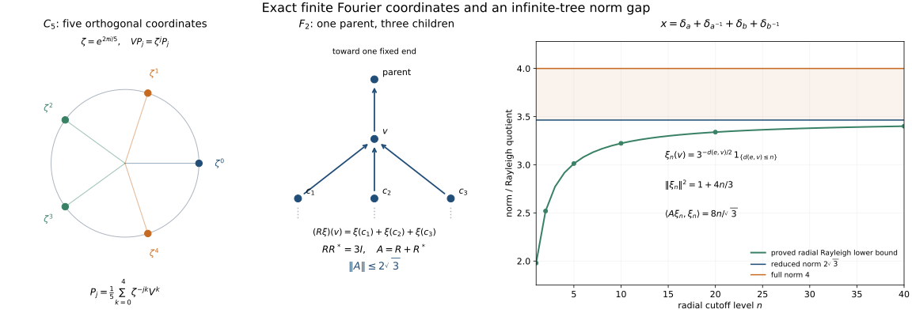

# Unitary representations and the two group C\* completions

*Original exposition, proofs and illustration source are dedicated under CC0.*

A unitary action of a group can be averaged against integrable functions. The resulting operators remember the action, including its intertwiners. Completing the integrable functions in the largest representation norm gives the full group C\* algebra; completing in the left regular norm gives its reduced counterpart. They can have different norms.

Throughout, \(G\) is a locally compact Hausdorff group. Neither \(G\) nor any Hilbert space is assumed separable. The group need not be second countable, sigma compact or unimodular. Inner products are linear in the first variable. A representation of an algebra means an algebraic complex linear star homomorphism into bounded operators; boundedness and nondegeneracy will be proved or explicitly required.

## 1. The precise earlier inputs

The earlier [HR-06 Haar existence](OA-FLOW-HR.md#hr-06), [HR-07 Haar uniqueness](OA-FLOW-HR.md#hr-07), [HR-03 finite-set regularity and compact-continuous density](OA-FLOW-HR.md#hr-03), [HR-05 qualified Radon-product Fubini and scalar tensor unitary](OA-FLOW-HR.md#hr-05), [HR-08 sigma compact cosets](OA-FLOW-HR.md#hr-08) and [HR-09 both Haar conventions and finite-exponent isometry](OA-FLOW-HR.md#hr-09) are the actual measure proofs. Compact cutoffs, finite partitions and the abstract tensor construction are the whole earlier [H0: compact topology and Hilbert tensor](OA-FLOW-TOPOLOGY.md#l138-h0). Scalar convergence and norms are [SC-03](OA-FLOW-SC.md#sc-03), [SC-04](OA-FLOW-SC.md#sc-04), [SC-05](OA-FLOW-SC.md#sc-05), [SC-06](OA-FLOW-SC.md#sc-06), [SC-07](OA-FLOW-SC.md#sc-07). Hilbert completeness, adjoints and bounded forms are [CF-10](OA-FLOW-CF.md#oa-flow.cf.10); continuous calculus, positivity, order and forced unitization are [CF-6](OA-FLOW-CF.md#oa-flow.cf.6), [CF-7](OA-FLOW-CF.md#oa-flow.cf.7), [CF-8](OA-FLOW-CF.md#oa-flow.cf.8), [CF-9](OA-FLOW-CF.md#oa-flow.cf.9). The quotient facts are proved locally in Section 10. Vector integration, convolution, automatic boundedness and representation correspondence are proved here.

These are written earlier programme proof bodies at arbitrary LCH and arbitrary-Hilbert-space generality. [HR-05](OA-FLOW-HR.md#hr-05) uses the Radon product on the full product Borel sigma algebra, and its general Borel Tonelli/Fubini assertion retains the exact sigma-finite carrier qualification. [HR-09](OA-FLOW-HR.md#hr-09) identifies finite-exponent equivalence classes while retaining distinct raw measurable/null conventions. [CF-1](OA-FLOW-CF.md#oa-flow.cf.1) supplies the explicitly declared choice and scalar primitives. The actual earlier theorem bodies, rather than an external bibliography, provide these inputs.

## 2. Which Haar measurable functions are being used?

Fix an outer regular Radon left Haar measure \(\mu_o\), completed on its global null sets. It is finite on compact sets and inner regular on open sets and on measurable sets of finite measure. For a non sigma compact group, it need not be inner regular on every Borel set.

**Lemma 2.1 (a decomposition into sigma compact pieces).** There is an open and closed sigma compact subgroup \(H\) of \(G\). Its left cosets are open and closed, and every compact subset of \(G\) meets only finitely many of them.

**Proof.** Choose a compact symmetric neighbourhood \(C=C^{-1}\) of the identity, and set \(H=\bigcup_{n\geq1}C^n\). Products of compact sets are compact; this union is a subgroup. Since \(C\) contains an open identity neighbourhood \(V\), every \(h\in H\) has \(hV\subset H\), so \(H\) is open. Its complement is a union of open cosets, so it is closed. The cosets form an open cover of any compact set; a finite subcover proves the last assertion. \(\square\)

On each coset \(D\), the completed restriction of \(\mu_o\) is a sigma-finite measure \(\mu_D\). Let \(\Sigma_\ell\) consist of sets \(A\subset G\) whose sections \(A\cap D\) are measurable for all these measures, and put
\[
 \mu_\ell(A)=\sum_D\mu_D(A\cap D).
 \tag{2.1}
\]
An uncountable sum of nonnegative numbers means the supremum of its finite subsums. This defines a complete measure: countable additivity follows by interchanging the supremum of finite subsums with the sum of nonnegative terms, and completeness follows separately on every coset. This is the locally determined Haar convention used for pointwise representatives in this lesson.

**Lemma 2.2 (finite-exponent comparison).** For \(1\leq p<\infty\), restriction to cosets gives a canonical isometric identification
\[
 L^p(G,\mu_o)\ \cong\ L^p(G,\mu_\ell).
 \tag{2.2}
\]
Every class on the right has a representative which is zero outside a sigma compact Borel set. A set is \(\mu_\ell\)-null exactly when its intersection with every compact set is \(\mu_o\)-null.

**Proof.** If \(\sum_D b_D<\infty\), then for each \(n\) only finitely many \(b_D\) are at least \(1/n\); hence only countably many are nonzero. Applied to \(b_D=\int_D|f|^p\,d\mu_D\), this shows that an integrable \(f\) has only countably many nonzero section classes. Set it equal to zero on the other cosets. On each remaining coset choose a Borel representative, possible by completion. Their union is a sigma compact open set, and the representative extended by zero is globally Borel.

Conversely, a globally \(\mu_o\)-integrable \(f\) has sigma compact support modulo a global null set. Indeed, every set \(\{|f|>1/n\}\) has finite measure. By finite-set inner regularity choose countably many compact subsets whose union exhausts that set modulo a null set. Taking their union over \(n\) proves the claim. A compact support meets finitely many cosets, so countable additivity on this sigma compact carrier gives equality of the two integrals. The same argument applied to a difference of representatives proves injectivity. Surjectivity was proved in the first paragraph.

If a set is null in every coset, each compact intersection is null by the finite-coset assertion. Conversely, an exhaustion of a coset by countably many compact sets shows that compact-local nullity implies nullity in that coset. This also shows that (2.1) is independent of the chosen \(H\): for \(A\in\Sigma_\ell\),
\[
 \mu_\ell(A)=\sup_{K\subset G\ {\rm compact}}\mu_o(A\cap K).
 \tag{2.3}
\]
On a coset, inner regularity on finite sets and exhaustion give the equality, and finite unions of its compact approximants give the equality for the direct sum. The criterion of measurability is likewise intrinsic: on each sigma compact coset it is enough to check its intersections with compact sets. \(\square\)

The raw measures are different in general. On \(G=\mathbb R\times\mathbb R_d\), with the second copy discrete, the set \(S=\{0\}\times\mathbb R_d\) meets every compact set in a null set. Thus \(\mu_\ell(S)=0\). Every open neighbourhood of \(S\), however, has a positive interval section in each of uncountably many components, so its outer regular product Haar measure is infinite and \(\mu_o(S)=\infty\). Equation (2.2) concerns integrable equivalence classes; it does not equate these raw null sets.

We write \(L^p(G)\) for (2.2). Scalar representatives can always be chosen Borel with sigma compact carriers. In a multiple integral we use the **Radon product**, not an unrestricted non sigma-finite ordinary product. The earlier Radon-product Fubini theorem applies to Borel integrands with sigma-finite support. In particular, it applies on products of the carriers just constructed. No equality between the full Borel sigma algebra of a product and the product of the Borel sigma algebras is asserted.

## 3. Translations, the modular function and inversion

Write \(L_s f(t)=f(s^{-1}t)\). There is a unique scalar \(\Delta(s)>0\) such that \(\mu_o(Es)=\Delta(s)\mu_o(E)\). Indeed, right translation transports \(\mu_o\) to another left Haar measure, so Haar uniqueness applies. It follows successively that
\[
 \Delta(sr)=\Delta(s)\Delta(r),\qquad
 \int f(ts)\,dt=\Delta(s)^{-1}\int f(t)\,dt.
 \tag{3.1}
\]
The second formula is first checked for indicators and then extended by simple approximation and scalar convergence. These identities pass to the locally determined convention by Lemma 2.2 and compact-local nullity.

For \(f\in C_c(G)\), left and right translates tend uniformly to \(f\) as \(s\to e\). One proof uses the continuous map \((s,t)\mapsto f(s^{-1}t)-f(t)\): on a fixed compact neighbourhood of \(\operatorname{supp}f\), finitely many product neighbourhoods bound it by any given \(\varepsilon\); outside that compact set both terms are zero for \(s\) in a sufficiently small relatively compact neighbourhood. The map \((s,t)\mapsto f(ts)-f(t)\) gives the right-hand assertion by the same finite-cover argument.

For a nonzero positive \(f\in C_c(G)\), the translated supports lie in one compact set locally in \(s\). Therefore \(s\mapsto\int f(ts)\,dt\) is continuous. Equation (3.1) shows that \(\Delta^{-1}\), and hence \(\Delta\), is continuous. Positivity of \(\int f\) follows from Haar positivity: if a nonempty open set had measure zero, its translates would cover every compact set by finitely many null sets, contradicting nonzero Haar measure and open-set inner regularity.

The exact inversion identity is
\[
 \int f(s^{-1})\Delta(s^{-1})\,ds=\int f(s)\,ds.
 \tag{3.2}
\]
Here is a normalization proof without Radon-Nikodym. Let \(Tf(s)=f(s^{-1})\Delta(s^{-1})\). The positive functional \(J(f)=\int Tf\) on \(C_c(G)\) is left invariant: substituting \(s=tr^{-1}\) in \(J(L_r f)\), the factor \(\Delta(r)^{-1}\) from right translation cancels the factor \(\Delta(r)\) in \(\Delta(s^{-1})\). Thus \(J=cI\) by Haar uniqueness. But \(T^2=1\), and for \(0\ne g\in C_c(G)_+\) the function \(h=g+Tg\) is positive and \(Th=h\). Hence \(J(h)=I(h)>0\) forces \(c=1\). Simple approximation and convergence extend the identity to nonnegative Borel and integrable functions. Inversion preserves compact-local null sets because its weighted transported measure has the same null sets on each compact set.

**Lemma 3.1 (density and norm continuity).** \(C_c(G)\) is dense in \(L^p(G)\) for finite \(p\), \(L_s\) is an isometry on each such space, and
\[
 R_s f(t)=\Delta(s)^{-1}f(ts^{-1})
 \tag{3.3}
\]
is an isometry on \(L^1(G)\). Both \(s\mapsto L_s f\) and \(s\mapsto R_s f\) are norm continuous on \(L^1(G)\); \(s\mapsto L_s f\) is norm continuous on \(L^2(G)\).

**Proof.** Simple functions of finite-measure sets are dense by truncation and scalar convergence. Use Lemma 2.2 to choose a globally \(\mu_o\)-finite Borel representative of each such indicator class. For this representative \(E\), choose a compact \(K\subset E\) and an open \(U\supset E\) with \(\mu_o(U\setminus K)\) small, and a compact cutoff \(0\leq h\leq1\) which is one on \(K\) and supported in \(U\). Then \(|1_E-h|^p\leq1_{U\setminus K}\). This proves density. Left invariance and (3.1) prove the norm identities. For \(C_c\) functions, uniform continuity, locally common compact supports and continuity of \(\Delta\) prove the asserted norm continuity. For a general \(f\), approximate by \(h\in C_c\) and bound the error of either isometric translate by \(2\|f-h\|_p\). Continuity at every \(s\) follows from the group law. \(\square\)

## 4. Vector integrals and the Hilbert tensor identification

Let \(E\) be any Banach space. A **strongly measurable** function on a sigma-finite carrier is an almost everywhere limit of finite-valued measurable simple functions. Its range is contained, outside a null set, in the closure of a countable set. Conversely, a measurable function with such a separable essential range has simple approximants: use a countable \(1/n\)-net in the range, partition according to the first net point within \(1/n\), and then truncate the partition, the norm and a finite-measure exhaustion of the carrier. Only countably many approximants and exceptional sets occur. This definition does not assume that \(E\) itself is separable.

For arbitrary \(G\), define \(L^1(G,E)\) using these strongly measurable representatives on a sigma compact carrier, extended by zero, and \(\int\|F\|<\infty\), with compact-local almost everywhere equality. This agrees with the locally strongly measurable, integrable convention: section norm integrability leaves only countably many nonzero cosets; on each such coset strong measurability and completion give a global representative. Countably many separable essential ranges have a separable closed linear span.

**Proposition 4.1 (Bochner integral).** The space \(L^1(G,E)\) is a Banach space. It has a unique bounded linear integral agreeing with
\[
 \int \sum_{j=1}^m1_{A_j}(s)x_j\,ds
       =\sum_{j=1}^m\mu_\ell(A_j)x_j
 \tag{4.1}
\]
for disjoint finite-measure sets. It satisfies
\[
 \left\|\int F\right\|\leq\int\|F\|,\qquad
 B\!\left(\int F\right)=\int BF
 \tag{4.2}
\]
for every bounded linear map \(B:E\to E'\). Continuous compactly supported \(E\)-valued functions are integrable and dense in this space.

**Proof.** The norm inequality in (4.2) for simple functions is the triangle inequality. Simple approximation as described above gives \(L^1\) approximation: first discard the norm tail and the complement of a finite-measure member of an exhaustion; approximate the bounded range there to accuracy \(\varepsilon/\mu(A)\), then discard the remaining finitely truncated partition tail. Thus the simple integral extends uniquely to the completion, with (4.2).

For completeness, choose from a Cauchy sequence a subsequence \(F_n\) with \(\sum_n\|F_{n+1}-F_n\|_1<\infty\). Scalar monotone convergence gives \(\sum_n\|F_{n+1}(s)-F_n(s)\|<\infty\) almost everywhere on the union of their carriers. Completeness of \(E\) produces a pointwise limit \(F\). Its range is in one separable closed linear span; its simple approximants, or diagonal approximants to \(F_n\), show strong measurability. Fatou's inequality, which follows by applying monotone convergence to the infima of scalar tails, gives
\(\|F-F_n\|_1\leq\sum_{k\geq n}\|F_{k+1}-F_k\|_1\to0\).
Thus the completion is the stated function space. The full Cauchy sequence has this limit. Bounded-map compatibility follows first on simple functions and then from the norm bound.

A compact image in a metric Banach space is separable: choose finite \(1/n\)-nets for all \(n\). A continuous compactly supported function therefore is strongly measurable, with bounded norm and finite-measure support. To prove density, approximate each indicator in a simple function by the compact cutoffs from Lemma 3.1 and multiply by its fixed vector. Their finite sums lie in \(C_c(G,E)\). \(\square\)

The same summable-difference argument proves completeness of \(L^2(G,K)\) for any Hilbert space \(K\), with norm squared \(\int\|F(s)\|^2\,ds\). More explicitly, for a subsequence with \(\sum_n\|F_{n+1}-F_n\|_2<\infty\), the scalar \(L^2\) triangle inequality bounds the \(L^2\) norm of every partial sum of \(\sum_n\|F_{n+1}(s)-F_n(s)\|\) by that finite total. Monotone convergence applied to the squared partial sums gives a finite squared integral for the full sum, so it is finite almost everywhere. Pointwise convergence and the \(L^2\) norm bound on each tail now give a strongly measurable \(L^2\) limit. Simple functions of finite-measure sets are dense by truncation, finite-measure exhaustion and range approximation as above.

**Proposition 4.2 (tensor identification).** For every Hilbert space \(K\), the rule
\[
 J(h\otimes\xi)(s)=h(s)\xi
 \tag{4.3}
\]
extends to a unitary \(J:L^2(G)\otimes K\longrightarrow L^2(G,K)\).

**Proof.** For finite sums, scalar integration gives
\[
 \left\langle\sum_i h_i\xi_i,\sum_j k_j\eta_j\right\rangle
 =\sum_{i,j}\langle h_i,k_j\rangle_{L^2}\langle\xi_i,\eta_j\rangle_K.
 \tag{4.4}
\]
The right side is the Hilbert tensor inner product. Its positivity can also be seen by expressing the finitely many vectors in an orthonormal basis of their finite-dimensional span. Thus \(J\) is an isometry on the algebraic tensor product and extends to the Hilbert completion. Every finite-valued, finite-measure simple function is in its image. Those functions are dense in \(L^2(G,K)\), and the image of an isometry from a complete space is closed; hence \(J\) is onto. \(\square\)

**Proposition 4.3 (vector Fubini on the required supports).** Let \(F:X\times Y\to E\) be strongly measurable, with a sigma compact carrier for the Radon product and \(\int\|F\|<\infty\). Its iterated Bochner integrals exist almost everywhere and equal its product integral.

**Proof.** Approximate \(F\) by finite simple \(E\)-valued functions in \(L^1\). For an indicator of a Borel set of finite measure the scalar Radon-product theorem gives the two section integrals; completion handles sets differing by a null set because their sections differ by null sets almost everywhere. Hence the assertion holds for finite simple functions. Choose simple approximants \(S_n\) with \(\sum_n\|S_{n+1}-S_n\|_{L^1}<\infty\) and \(S_n\to F\) in \(L^1\) and almost everywhere. Scalar Fubini applied to the nonnegative sum of their pointwise norm differences shows that for almost every \(x\) the sequence \(S_n(x,\cdot)\) converges in \(L^1(Y,E)\) to \(F(x,\cdot)\). The integral estimate (4.2) gives convergence of its section integrals in \(L^1(X,E)\). Passing through the bounded integrals proves the assertion. Reversing \(X,Y\) proves the other order. \(\square\)

A continuous map from a sigma compact space into a metric space has separable image, because each compact image has finite \(1/n\)-nets. This observation justifies strong measurability of the continuous vector orbit maps used below. The word “continuous” here never asserts operator norm continuity of a unitary representation.

## 5. The Banach star algebra and its approximate identity

For \(f,g\in C_c(G)\) define
\[
 (f*g)(t)=\int f(s)g(s^{-1}t)\,ds,\qquad
 f^*(t)=\Delta(t^{-1})\overline{f(t^{-1})}.
 \tag{5.1}
\]
The convolution is continuous with support in \((\operatorname{supp}f)(\operatorname{supp}g)\). To check continuity near \(t_0\), the integrand has \(s\) in \(\operatorname{supp}f\); continuity of \(g(s^{-1}t)\) is uniform on this compact set locally in \(t\), by a finite-cover argument. This gives continuity under the integral.

**Theorem 5.1.** Formulas (5.1) extend to a complete Banach star algebra \(L^1(G)\), and
\[
 \|f*g\|_1\leq\|f\|_1\|g\|_1,\qquad
 \|f^*\|_1=\|f\|_1.
 \tag{5.2}
\]
The convolution formula holds almost everywhere for Borel sigma compact representatives of \(f,g\).

**Proof.** For compactly supported functions, scalar Radon-product Fubini and left invariance give
\[
 \iint |f(s)|\,|g(s^{-1}t)|\,dt\,ds
       =\|f\|_1\|g\|_1.
 \tag{5.3}
\]
The change \((s,r)\mapsto(s,sr)\) preserves the Radon product measure: on compactly supported continuous integrands, integrate first in \(r\) and use left invariance; uniqueness of the Radon measure representing these integrals gives the assertion on Borel sets and integrable functions. The carrier is the image of a product of sigma compact sets, so the qualified Fubini theorem applies. Consequently (5.3) holds for integrable representatives as well, including the statement that almost all convolution sections are integrable.

The estimate defines the bilinear extension from the dense \(C_c(G)\). To identify it with the almost everywhere integral for general \(f,g\), approximate both in \(L^1\) by \(f_n,g_n\in C_c\); (5.3) bounds the product-integrand error by
\(\|f_n-f\|_1\|g_n\|_1+\|f\|_1\|g_n-g\|_1\).
Section integration is bounded into \(L^1\), so the integrals converge to the algebraic extension. This argument also establishes independence of representatives and measurability of the resulting class.

For three compactly supported functions, both \((f*g)*h\) and \(f*(g*h)\) equal
\[
 \iint f(s)g(r)h(r^{-1}s^{-1}t)\,dr\,ds:
 \tag{5.4}
\]
in the first expression substitute \(u=sr\); the triple absolute integral is at most \(\|f\|_1\|g\|_1\|h\|_1\). Density and (5.2) give associativity on \(L^1\). Formula (3.2) gives the involution norm identity and \((f^*)^*=f\). For its product reversal, conjugate the convolution at \(t^{-1}\), multiply by \(\Delta(t^{-1})\), and put \(r=ts\) in the formula for \(g^**f^*(t)\):
\[
 \begin{aligned}
 (g^**f^*)(t)
 &=\int \Delta(r^{-1})\overline{g(r^{-1})}
       \Delta(t^{-1}r)\overline{f(t^{-1}r)}\,dr\\
 &=\Delta(t^{-1})\int
       \overline{g(s^{-1}t^{-1})}\,\overline{f(s)}\,ds
 =(f*g)^*(t).
 \end{aligned}
 \tag{5.5}
\]
The substitution is left translation and has no modular Jacobian. Extend by norm continuity. Completeness is scalar \(L^1\) completeness. \(\square\)

**Theorem 5.2 (a two-sided contractive approximate identity).** For each sufficiently small identity neighbourhood \(V\) choose \(a_V\in C_c(G)_+\) supported in \(V\), with \(\int a_V=1\). Ordered by shrinking neighbourhoods, these functions satisfy
\[
 \|a_V\|_1=1,\qquad a_V*f\longrightarrow f,\qquad f*a_V\longrightarrow f
 \quad\hbox{in }L^1(G).
 \tag{5.6}
\]

**Proof.** Compact cutoff functions and positivity of Haar measure supply the normalized bumps. By Proposition 4.1 and Lemma 3.1,
\[
 a_V*f=\int a_V(s)L_s f\,ds,\qquad
 f*a_V=\int a_V(s)R_s f\,ds
 \tag{5.7}
\]
as Bochner integrals in \(L^1(G)\). For the second identity, the pointwise substitution \(s=t r^{-1}\) in \(f*a_V(t)\) gives
\(\int a_V(r)\Delta(r)^{-1}f(tr^{-1})\,dr\), by (3.2) and left invariance. Equivalently, verify (5.7) first on \(C_c\) by Fubini and then extend by the norm estimate. The orbit maps are continuous and bounded and the integrators have compact support. Thus
\[
 \|a_V*f-f\|_1\leq\sup_{s\in V}\|L_s f-f\|_1,\quad
 \|f*a_V-f\|_1\leq\sup_{s\in V}\|R_s f-f\|_1,
 \tag{5.8}
\]
which tend to zero. The net need not be a sequence. \(\square\)

## 6. Algebraic representations are automatically contractive

**Proposition.** Let $A$ be a complete normed complex star algebra with
$\|ab\|\leq\|a\|\|b\|$ and $\|a^*\|=\|a\|$. Every algebraic star homomorphism
$\pi:A\to B(H)$ satisfies $\|\pi(a)\|\leq\|a\|$. Continuity and
nondegeneracy of $\pi$ are not hypotheses.

**Proof.** The unitization is the Banach algebra $A^+=A\oplus\mathbb C$ with
$(a,z)(b,w)=(ab+zb+wa,zw)$, identity $(0,1)$, and norm
$\|(a,z)\|=\|a\|+|z|$. Submultiplicativity follows by expanding this product;
completeness follows from completeness of its two coordinates. The formula
$\pi^+(a,z)=\pi(a)+zI$ is a unital algebra homomorphism, regardless of whether
$A$ already has an identity or $\pi$ is nondegenerate.

Fix $a\in A$ and write $B=\pi(a)$, $T=B^*B$, and $c=\|B\|^2$.
For every bounded operator $B$, Cauchy–Schwarz and the adjoint identity give
$\|B^*\|=\|B\|$. Indeed,

$$
\|B^*y\|=\sup_{\|x\|=1}|\langle B^*y,x\rangle|
=\sup_{\|x\|=1}|\langle y,Bx\rangle|
\leq\|B\|\|y\|,
$$

and applying the same inequality to $B^*$ gives the reverse norm inequality.
It follows that $\|T\|\leq c$. Conversely, for every unit vector $x$,
$\|Bx\|^2=\langle Tx,x\rangle\leq\|T\|$; taking the supremum gives
$c\leq\|T\|$. Thus $\|T\|=c$.

If $c>0$, choose unit vectors $x_n$ with $\|Bx_n\|^2\to c$. Since $T$ is
self-adjoint and $\langle Tx_n,x_n\rangle=\|Bx_n\|^2$ is real,

$$
\|(cI-T)x_n\|^2
=c^2-2c\langle Tx_n,x_n\rangle+\|Tx_n\|^2
\leq2c\bigl(c-\langle Tx_n,x_n\rangle\bigr)\longrightarrow0.
$$

Consequently $cI-T$ has no bounded inverse: an inverse $R$ would give
$1=\|x_n\|\leq\|R\|\|(cI-T)x_n\|\to0$.

Suppose now that $c>\|a\|^2$. In $A^+$ put $b=(a^*a,0)$. Then
$\|b\|\leq\|a\|^2<c$, so the series

$$
v=c^{-1}\sum_{k=0}^{\infty}(b/c)^k
$$

converges in norm. Multiplying its finite partial sums by $c1-b$ on either
side leaves $1-(b/c)^{N+1}$, which converges to $1$. Continuity of
multiplication therefore gives $(c1-b)v=v(c1-b)=1$.
Applying the algebra homomorphism $\pi^+$ to these two identities makes
$\pi^+(v)$ a bounded two-sided inverse of $cI-T$, a contradiction. This step
uses only the two algebraic identities; it does not pass $\pi^+$ through an
infinite series. Hence $\|\pi(a)\|^2=c\leq\|a\|^2$. The case $c=0$ is immediate.
The zero Hilbert space has the same immediate conclusion. $\square$

This proposition applies to the algebra constructed in Section 5. In particular, every algebraic star representation of \(L^1(G)\), including a degenerate one, is bounded by the \(L^1\) norm.

## 7. Integrating a continuous unitary action

Let \(U:G\to\mathcal U(K)\) be a group homomorphism such that \(s\mapsto U_s\xi\) is norm continuous for every \(\xi\in K\). Define, on each vector,
\[
 \pi_U(f)\xi=\int f(s)U_s\xi\,ds.
 \tag{7.1}
\]
This is a Bochner integral: \(f\) has a sigma compact carrier, the orbit has separable range on that carrier, and its norm is bounded by \(|f(s)|\|\xi\|\). It defines a bounded operator, with
\[
 \|\pi_U(f)\|\leq\|f\|_1.
 \tag{7.2}
\]

**Theorem 7.1.** The map \(\pi_U\) is a nondegenerate star representation of \(L^1(G)\).

**Proof.** Linearity is integral linearity. On a vector \(\xi\), the product \(\pi_U(f)\pi_U(g)\xi\) is
\[
 \iint f(s)g(r)U_{sr}\xi\,dr\,ds.
 \tag{7.3}
\]
Its norm integrand is bounded by \(|f(s)||g(r)|\|\xi\|\), on the product of two sigma compact carriers. Proposition 4.3 permits the iterated integration. Substituting \(t=sr\) in the inner integral identifies (7.3) with \(\pi_U(f*g)\xi\). For the adjoint, scalar inner products, \(U_s^*=U_{s^{-1}}\), and (3.2) give
\[
 \begin{aligned}
 \langle\pi_U(f)\xi,\eta\rangle
 &=\int f(s)\langle\xi,U_{s^{-1}}\eta\rangle\,ds\\
 &=\int \Delta(t^{-1})f(t^{-1})\langle\xi,U_t\eta\rangle\,dt
 =\langle\xi,\pi_U(f^*)\eta\rangle .
 \end{aligned}
 \tag{7.4}
\]
Thus \(\pi_U(f)^*=\pi_U(f^*)\). Finally,
\[
 \|\pi_U(a_V)\xi-\xi\|
 \leq\sup_{s\in V}\|U_s\xi-\xi\|\longrightarrow0.
 \tag{7.5}
\]
Every \(\xi\) is therefore in the closure of \(\pi_U(L^1(G))K\), which is nondegeneracy. The proof remains valid for the zero Hilbert space. \(\square\)

## 8. Recovering the action on the essential space

Let \(\pi:L^1(G)\to B(K)\) be an arbitrary algebraic star representation, and put
\[
 K_e=\overline{\operatorname{span}\{\pi(f)\xi:f\in L^1(G),\ \xi\in K\}}.
 \tag{8.1}
\]
It is a reducing subspace. Indeed, each \(\pi(g)\) and \(\pi(g)^*=\pi(g^*)\) sends its generating vectors back into it. Moreover \(\pi(g)\) vanishes on \(K_e^\perp\): for \(\xi\in K_e^\perp\) and any \(\eta\),
\(\langle\pi(g)\xi,\eta\rangle=\langle\xi,\pi(g^*)\eta\rangle=0\).

**Theorem 8.1 (recovery).** There is a unique strongly continuous unitary representation \(U^\pi\) on \(K_e\) such that the integrated representation is \(\pi|_{K_e}\). On its actual dense vector domain it is given by
\[
 U^\pi_s\!\left(\sum_{j=1}^m\pi(f_j)\xi_j\right)
       =\sum_{j=1}^m\pi(L_s f_j)\xi_j.
 \tag{8.2}
\]

**Proof.** The algebra identity
\[
 (L_s g)^**(L_s f)=g^**f
 \tag{8.3}
\]
holds first on compactly supported functions and then by density. To verify it directly, the left side at \(t\) is
\(\int\Delta(r^{-1})\overline{g(s^{-1}r^{-1})}f(s^{-1}r^{-1}t)\,dr\).
Put \(q=rs\). Right translation contributes \(\Delta(s)^{-1}\) to the integral, while \(\Delta(r^{-1})=\Delta(s)\Delta(q^{-1})\); the two factors cancel.

For two finite generating sums, their inner product after (8.2) is unchanged, because
\[
 \langle\pi(L_s f_i)\xi_i,\pi(L_s g_j)\eta_j\rangle
 =\langle\pi((L_s g_j)^**(L_s f_i))\xi_i,\eta_j\rangle
 =\langle\pi(g_j^**f_i)\xi_i,\eta_j\rangle.
 \tag{8.4}
\]
Thus a sum representing zero maps to zero, so (8.2) is well defined and isometric. Its inverse on this domain is the formula for \(s^{-1}\). It extends to a unitary on \(K_e\), and \(L_sL_r=L_{sr}\) proves the group law on the dense domain and then everywhere.

For a generating vector, contractivity from Section 6 gives
\(\|(U^\pi_s-U^\pi_r)\pi(f)\xi\|\leq\|L_s f-L_r f\|_1\|\xi\|\).
This tends to zero by Lemma 3.1. Finite sums are continuous, and approximation by these sums, together with \(\|U^\pi_s\|=1\), proves strong continuity on all of \(K_e\).

It remains to identify the integral, rather than only produce an action. For \(g\in L^1(G)\), the Bochner \(L^1(G)\)-valued integral
\[
 \int f(s)L_sg\,ds=f*g
 \tag{8.5}
\]
follows first for compactly supported functions by Fubini, and then by its bilinear norm bound. On a generating vector, bounded-map compatibility of the integral now gives
\[
 \pi_{U^\pi}(f)\pi(g)\xi
 =\int f(s)\pi(L_sg)\xi\,ds
 =\pi(f*g)\xi=\pi(f)\pi(g)\xi.
 \tag{8.6}
\]
Both sides are bounded operators on \(K_e\); equality on the dense generating domain proves equality everywhere.

For uniqueness, any integrated action \(W\) satisfies
\(\pi_W(L_sg)=W_s\pi_W(g)\), by left substitution in its vector integral. Thus an action integrating to \(\pi|_{K_e}\) must obey (8.2), which determines it on a dense domain. \(\square\)

In particular, integrating and recovering are inverse constructions for nondegenerate representations. The original \(\pi\) is their integrated representation on \(K_e\) and zero on \(K_e^\perp\). No unitary action on the latter summand is specified by \(\pi\).

## 9. Intertwiners and faithfulness of the regular representation

**Proposition 9.1.** For continuous unitary representations \(U\) on \(K\) and \(W\) on \(K'\), a bounded operator \(T:K\to K'\) satisfies
\[
 TU_s=W_sT\quad(s\in G)
 \quad\Longleftrightarrow\quad
 T\pi_U(f)=\pi_W(f)T\quad(f\in L^1(G)).
 \tag{9.1}
\]

**Proof.** The forward implication follows by moving the bounded map through the vector integral. Conversely,
\[
 \pi_U(L_sa_V)=U_s\pi_U(a_V)\longrightarrow U_s
 \quad\hbox{strongly},
 \tag{9.2}
\]
by (7.5), and the same is true for \(W\). Apply the assumed intertwining identity to \(L_sa_V\), evaluate it on a vector, and pass to the limit. \(\square\)

In particular, the two commutants agree. A closed subspace is invariant under all \(U_s\) precisely when it reduces them, because their inverses also belong to the representation. For an algebra star representation, invariance under all \(\pi(f)\) likewise implies reduction because the adjoints are \(\pi(f^*)\). Applying (9.1) to its orthogonal projection proves that irreducibility is preserved by integration and recovery on the essential space.

### The faithful regular representation

The **left regular representation** is \((\lambda_s h)(t)=h(s^{-1}t)\) on \(L^2(G)\). It is unitary by left invariance and strongly continuous by Lemma 3.1. Its integrated operator \(\lambda(f)=\pi_\lambda(f)\) has norm at most \(\|f\|_1\).

**Theorem 9.2.** The integrated map \(\lambda:L^1(G)\to B(L^2(G))\) is injective.

**Proof.** For \(f\in L^1(G)\) and \(h\in C_c(G)\subset L^1(G)\cap L^2(G)\), the vector integral \(\lambda(f)h\) is the convolution \(f*h\) as an \(L^2\) class. Indeed,
\(\int |f(s)|\|\lambda_s h\|_2\,ds=\|f\|_1\|h\|_2\);
Bochner integration and scalar testing give the formula first for compact \(f\), then by \(L^1\) approximation. The same convolution is in \(L^1(G)\), by (5.2). One pointwise convolution representative represents both classes: approximate \(f\) in \(L^1\), pass to a common subsequence converging almost everywhere in the \(L^1\) and \(L^2\) convolution limits, and use the integral identification from Theorem 5.1.

If \(\lambda(f)=0\), this common representative is zero almost everywhere when \(h=a_V\). Therefore \(f*a_V=0\) in \(L^1\) for every \(V\). Equation (5.6) gives \(f=0\). This argument tests an actual \(L^1\cap L^2\) vector domain; it does not assume convolution is pointwise defined on every \(L^2\) vector. \(\square\)

## 10. The C\* quotient facts, with their inputs exposed

We use here the earlier continuous functional calculus for self-adjoint elements of a C\* algebra and its forced C\* unitization. In particular it proves: \(x^*x\geq0\), its spectral maximum is \(\|x\|^2\), continuous scalar functions on a compact real interval can be approximated in the calculus by polynomials, a function vanishing at zero of an element in an ideal belongs to that ideal, and positive conjugation and the norm respect order. The following arguments prove the additional quotient and closed-range facts.

**Lemma 10.1.** Every algebraic star homomorphism \(\phi:A\to B\) between C\* algebras is contractive. If it is injective, it is isometric and has closed range.

**Proof.** Extend the homomorphism algebraically to the forced unitizations. If \(c=\|\phi(a)\|^2>\|a\|^2\), the Neumann series in the Banach algebra \(A^+\) makes \(c1-a^*a\) invertible. Its image \(c1-\phi(a)^*\phi(a)\) would be invertible in \(B^+\). But the positive calculus in \(B^+\) puts \(c\) in the spectrum of \(\phi(a)^*\phi(a)\), a contradiction. Thus \(\|\phi(a)\|\leq\|a\|\). This uses only the image of the two inverse identities, not any continuity before it is proved.

Suppose \(\phi\) is injective but \(\|\phi(a)\|<\|a\|\), and put \(h=a^*a\), \(b=\|\phi(h)\|<\|h\|\). Choose a continuous real function \(g\) on \([0,\|h\|]\) which vanishes on \([0,b]\) and is one at \(\|h\|\). It vanishes at zero, so \(g(h)\in A\), and \(g(h)\ne0\) by the isometric functional calculus. Polynomial approximation and the contractivity just proved show
\(\phi(g(h))=g(\phi(h))=0\), contrary to injectivity. Thus \(\phi\) is isometric. Its complete image is closed. \(\square\)

**Lemma 10.2.** Let \(I\) be a closed two-sided star ideal in a C\* algebra \(A\). It has a two-sided approximate identity \((e_i)\) of positive contractions, \(A/I\) is a C\* algebra in its quotient norm, and
\[
 \|x+I\|=\lim_i\|x(1-e_i)\|.
 \tag{10.1}
\]

**Proof.** For a finite \(F\subset I\) and \(\varepsilon>0\), set
\[
 b_F=\sum_{x\in F}(x^*x+xx^*),\qquad
 e_{F,\varepsilon}=b_F(b_F+\varepsilon1)^{-1}.
 \tag{10.2}
\]
The positive calculus gives \(e_{F,\varepsilon}\in I\), \(0\leq e_{F,\varepsilon}\leq1\). Since \(x^*x\leq b_F\) and \(xx^*\leq b_F\),
\[
 \|x(1-e_{F,\varepsilon})\|^2,\
 \|(1-e_{F,\varepsilon})x\|^2
 \leq\|(1-e_{F,\varepsilon})b_F(1-e_{F,\varepsilon})\|
 \leq\varepsilon/4
 \quad(x\in F).
 \tag{10.3}
\]
The last bound is the scalar maximum of \(t\varepsilon^2/(t+\varepsilon)^2\), attained at \(t=\varepsilon\). Direct the pairs by inclusion of \(F\) and decreasing \(\varepsilon\); this proves the approximate identity.

For each \(z\in I\), \(\|z(1-e_i)\|\to0\), and \(\|1-e_i\|\leq1\) in the unitization. Thus
\[
 \|x+I\|\leq\|x(1-e_i)\|
 \leq\|x+z\|+\|z(1-e_i)\|.
 \tag{10.4}
\]
Taking limsup and then the infimum over \(z\) proves (10.1).

The quotient is complete: from a quotient-norm Cauchy sequence select a subsequence whose successive quotient distances are summable; choose representatives for the successive differences within a summable error of those distances. Their norm-convergent series gives a representative of the quotient limit, and the full sequence converges to it. Products and the involution pass to the quotient because \(I\) is a star ideal; its involution is isometric and its norm is submultiplicative. For \(z\in I\), \((1-e_i)z(1-e_i)\to0\). Hence
\[
 \begin{aligned}
 \|x+I\|^2
 &=\lim_i\|x(1-e_i)\|^2\\
 &=\lim_i\|(1-e_i)x^*x(1-e_i)\|\\
 &\leq\|x^*x+z\|.
 \end{aligned}
 \tag{10.5}
\]
Taking the infimum over \(z\) proves
\(\|x+I\|^2\leq\|(x+I)^*(x+I)\|\).
The reverse inequality is submultiplicativity and isometric involution, so the C\* identity holds. \(\square\)

**Corollary 10.3.** A star homomorphism between C\* algebras has closed range and identifies its range isometrically with the quotient by its kernel.

**Proof.** Its kernel is a closed star ideal by Lemma 10.1. Lemma 10.2 makes the quotient a C\* algebra. The induced injective homomorphism is isometric by Lemma 10.1, so its range is closed. \(\square\)

## 11. The full and reduced completions

Define
\[
 \|f\|_u=\sup_\pi\|\pi(f)\|,\qquad
 \|f\|_r=\|\lambda(f)\|.
 \tag{11.1}
\]
The first supremum ranges over algebraic star representations on Hilbert spaces. It is bounded by \(\|f\|_1\) by Section 6. Degenerate representations give the same supremum as nondegenerate ones because their zero summand contributes no norm. Equivalently, it is a supremum over integrated strongly continuous unitary representations, by Sections 7-8.

There is no set-size obstruction in this definition. For a representation and vector \(\xi\), the essential cyclic subspace \(\overline{\pi(L^1(G))\xi}\) is reducing, contains the relevant cyclic action, and has Hilbert dimension bounded by the cardinality of a dense subset of \(L^1(G)\), times a countable cardinal. Operator norms are detected on such subspaces (and the zero summand). Choose Hilbert representatives of dimensions at most this fixed cardinal. The resulting homomorphisms form a set, and give the same supremum.

For completeness, \(\pi(a_V)\) converges strongly to the projection \(P_e\) onto \(K_e\): on a vector \(\pi(g)\eta\) this is the left approximate-identity property; the uniform bound \(\|\pi(a_V)\|\leq1\) extends convergence to \(K_e\), and these operators vanish on \(K_e^\perp\). Thus \(P_e\xi\) belongs to the cyclic subspace above and \(\pi(f)\xi=\pi(f)P_e\xi\). This proves the assertion that the cyclic restrictions detect every operator norm, even for a degenerate representation.

**Theorem 11.1.** Both norms in (11.1) are C\* norms, with
\[
 \|f\|_r\leq\|f\|_u\leq\|f\|_1.
 \tag{11.2}
\]
Their completions \(C^*(G)\) and \(C_r^*(G)\) are C\* algebras. The identity on \(L^1(G)\) extends to a surjective star homomorphism
\[
 q:C^*(G)\longrightarrow C_r^*(G).
 \tag{11.3}
\]

**Proof.** Regular faithfulness makes both norms definite. The triangle inequality and submultiplicativity hold in every representation and therefore in the supremum; the involution is isometric for the same reason. The C\* identity is
\[
 \|f^**f\|_u
 =\sup_\pi\|\pi(f)^*\pi(f)\|
 =\sup_\pi\|\pi(f)\|^2=\|f\|_u^2,
 \tag{11.4}
\]
and likewise for the reduced norm. Products and involution extend to the completions, and the norm identity passes to limits. Concretely, \(C_r^*(G)\) is the operator norm closure of \(\lambda(L^1(G))\).

The inequality (11.2) gives the continuous extension \(q\). It is a star homomorphism because it is one on the dense initial algebra, and its image is dense by the definition of the reduced completion. Corollary 10.3 makes its image closed; hence it is surjective. Also
\(C^*(G)/\ker q\cong C_r^*(G)\) isometrically.
Density alone would not have established surjectivity. \(\square\)

Every algebraic star representation of \(L^1(G)\) extends uniquely to \(C^*(G)\), because its norm is bounded by \(\|\cdot\|_u\). Conversely, restricting a C\* representation gives one of \(L^1(G)\). Nondegeneracy agrees: \(L^1(G)\) is dense in the completion, so its generated vector span is dense exactly when the completion's is. Together with recovery this is a bijection between nondegenerate C\* representations and continuous unitary representations, preserving bounded intertwiners.

## 12. A group with five elements: complete Fourier coordinates

Give \(C_5=\{e,a,a^2,a^3,a^4\}\), \(a^5=e\), counting Haar measure. Set \(\zeta=e^{2\pi i/5}\) and
\[
 \widehat f(j)=\sum_{k=0}^4 f(a^k)\zeta^{jk}\quad(0\leq j<5).
 \tag{12.1}
\]
These are five coordinates, not a transform of a function on a continuum.

**Proposition 12.1.** For \(f\in\mathbb C[C_5]\),
\[
 \|f\|_u=\|f\|_r=\max_{0\leq j<5}|\widehat f(j)|,
 \qquad C^*(C_5)=C_r^*(C_5)\cong\mathbb C^5 .
 \tag{12.2}
\]

**Proof.** A unitary representation is determined by a unitary \(V=U_a\) with \(V^5=1\). Define
\[
 P_j=\frac15\sum_{k=0}^4\zeta^{-jk}V^k.
 \tag{12.3}
\]
The geometric-series identity \(\sum_{k=0}^4\zeta^{mk}=0\) unless \(5\) divides \(m\), in which case it is \(5\), proves directly that \(P_j^*=P_j\), \(P_iP_j=\delta_{ij}P_j\), \(\sum_jP_j=1\) and \(VP_j=\zeta^jP_j\). Therefore \(\pi_U(f)=\sum_j\widehat f(j)P_j\) and its norm is at most the maximum in (12.2). A one-dimensional action \(V=\zeta^j\) attains each coordinate, so this is the full norm.

In the regular representation, \(v_j(a^k)=5^{-1/2}\zeta^{-jk}\) are five orthonormal eigenvectors of \(\lambda_a\), with eigenvalue \(\zeta^j\). They form a basis by dimension, so the reduced norm has the same value. Finite geometric sums give
\[
 f(a^k)=\frac15\sum_{j=0}^4\widehat f(j)\zeta^{-jk}.
 \tag{12.4}
\]
Thus the coordinate map is onto \(\mathbb C^5\). Directly summing convolution and involution, or using the five one-dimensional actions, gives pointwise products and complex conjugates of the coordinates. It is the claimed isometric star isomorphism. \(\square\)

For instance \(f=\delta_a+\delta_{a^{-1}}\) has the five real coordinates \(2\cos(2\pi j/5)\), so its full and reduced norms are both \(2\).

## 13. A strict gap: the free group on two generators

Let \(F_2\) be the discrete group of reduced words in \(a,a^{-1},b,b^{-1}\), and give it counting measure. Put
\[
 x=\delta_a+\delta_{a^{-1}}+\delta_b+\delta_{b^{-1}},\qquad
 A=\lambda(x)\quad\hbox{on }\ell^2(F_2).
 \tag{13.1}
\]
Its Cayley graph is a four-regular tree. Indeed, adjacent vertices differ by left multiplication by one of the four letters; reduction makes the path to the identity unique. A cycle without immediate backtracking would give a nonempty reduced word equal to the identity, impossible in the reduced-word definition of \(F_2\).

**Proposition 13.1.** The exact norms are
\[
 \|x\|_u=4,\qquad \|x\|_r=2\sqrt3.
 \tag{13.2}
\]
In particular \(q:C^*(F_2)\to C_r^*(F_2)\) has a nonzero kernel.

**Proof of the reduced upper bound.** Choose one end of the tree, for example the end determined by the ray \(e,a,a^2,\ldots\). For each vertex \(v\), its unique neighbour toward that end is its parent. The other three neighbours are its children. This is true even at \(e\): this orientation points toward an end, not away from a root. Define
\[
 (R\xi)(v)=\sum_{w:\ {\rm parent}(w)=v}\xi(w).
 \tag{13.3}
\]
Every vertex has exactly three children, and the child sets for distinct vertices are disjoint. Cauchy-Schwarz gives \(\|R\xi\|^2\leq3\|\xi\|^2\). Its adjoint satisfies \((R^*\eta)(w)=\eta({\rm parent}(w))\), so \(RR^*=3I\) and \(\|R\|=\sqrt3\). The four adjacency neighbours at \(v\) are its parent and three children, hence \(A=R+R^*\). It follows that \(\|A\|\leq2\sqrt3\).

**Proof of the reverse bound.** For an integer \(n\geq1\), let \(\xi_n(v)=3^{-k/2}\) if the graph distance \(k=d(e,v)\) is at most \(n\), and zero otherwise. Level \(0\) has one vertex and level \(k\geq1\) has \(4\cdot3^{k-1}\). Consequently
\[
 \|\xi_n\|^2=1+\frac43n,\qquad
 \langle A\xi_n,\xi_n\rangle
 =2\sum_{k=0}^{n-1}(4\cdot3^k)3^{-k/2}3^{-(k+1)/2}
 =\frac{8n}{\sqrt3}.
 \tag{13.4}
\]
The factor \(2\) counts each undirected edge in both directions. Therefore
\[
 \|A\|\geq
 \frac{\langle A\xi_n,\xi_n\rangle}{\|\xi_n\|^2}
 =\frac{2\sqrt3}{1+3/(4n)}
 \longrightarrow2\sqrt3.
 \tag{13.5}
\]
These finitely supported vectors prove the lower bound for the infinite-tree operator; no norm formula for a finite truncated tree is being assumed.

The trivial one-dimensional representation sends \(x\) to \(4\). The \(L^1\) bound gives \(\|x\|_u\leq4\), proving the full norm. If \(q\) were injective, Lemma 10.1 would make it isometric, contradicting (13.2). Hence its kernel is nonzero. \(\square\)

*Figure 1. Original CC0 illustration of Propositions 12.1 and 13.1. The five points are the eigenvalues \(\zeta^j\) of \(V\), with projections \(P_j\). The oriented tree has one parent and three children at each vertex. The green curve is the exact radial Rayleigh bound (13.5); the horizontal lines are the proved reduced norm \(2\sqrt3\) and full norm \(4\). The displayed tree fragment is a schematic of the infinite tree, and the radial samples are not finite-tree spectral approximations. Free primary background for the integrated full/reduced constructions: Echterhoff, Section 3.2, Remark 3.4(6); the exact bounds are proved here. Reproducible figure source accompanies the lesson.*

## 14. Exercises and complete solutions

**Exercise 14.1 (the modular factor).** Show that if a left Haar group is unimodular, (5.1) reduces to \(f^*(s)=\overline{f(s^{-1})}\). Show on the group \((u,v)(u',v')=(uu',v+uv')\), \(u,u'>0\), that the left Haar density is \(u^{-2}\,du\,dv\), \(\Delta(u,v)=u^{-1}\), and omitting the factor in \(f^*\) is not an isometric operation on \(L^1\).

**Solution.** The first assertion is substitution of \(\Delta=1\). Left translation by \((c,d)\) has Jacobian \(c^2\) and sends the first coordinate to \(cu\); the factor \((cu)^{-2}\) cancels this Jacobian. Right translation by \((c,d)\) sends \((u,v)\) to \((uc,v+ud)\), with Jacobian \(c\); thus the image-set measure is \(c^{-1}\) times the original measure, proving \(\Delta(c,d)=c^{-1}\). Inversion sends \((u,v)\) to \((u^{-1},-v/u)\), with absolute Jacobian \(u^{-3}\). Thus the norm of the unweighted inverse-conjugate of \(f\) is \(\int |f(u,v)|u\,u^{-2}\,du\,dv\), whereas \(\|f\|_1=\int |f(u,v)|u^{-2}\,du\,dv\). Taking a nonzero nonnegative compact function supported in \(u>2\) makes these norms different. The correct involution includes \(\Delta((u,v)^{-1})=u\), with inversion evaluated in its argument as in (5.1), and (3.2) proves its isometry. The Jacobian calculations are ordinary two-variable substitutions on compact supports; exhaustion extends them to the stated measures.

**Exercise 14.2 (degenerate representations).** Let \(U\) be a continuous unitary action on \(K_0\), and define \(\pi(f)=\pi_U(f)\oplus0\) on \(K_0\oplus K_1\). Determine its essential space. Explain why integration does not recover a prescribed action on \(K_1\).

**Solution.** Equation (7.5) puts every vector of \(K_0\) in the essential space, while every range vector has zero \(K_1\) component. Thus \(K_e=K_0\oplus0\). The formula (8.2) determines the action only there. Any continuous unitary action on a nonzero \(K_1\) integrates nondegenerately by Theorem 7.1, so it cannot integrate to the zero algebra action on that summand.

**Exercise 14.3 (five projections).** For \(C_5\), put \(p_j=\frac15\sum_{k=0}^4\zeta^{-jk}\delta_{a^k}\). Find its five Fourier coordinates, and prove \(\sum_jp_j=\delta_e\) and \(p_ip_j=\delta_{ij}p_j\).

**Solution.** At coordinate \(\ell\), the transform is \(\frac15\sum_k\zeta^{(\ell-j)k}=\delta_{\ell j}\). Coordinate sums and products therefore give the stated identities. The inverse formula (12.4) makes the coordinate transform injective, so those identities hold in the group algebra. Its involution fixes \(p_j\), since its coordinates are real. These are the five minimal coordinate projections of \(\mathbb C^5\).

**Exercise 14.4 (the gap is quantitative).** For \(y=x/4\) in (13.1), compute its two norms and an explicit finite-support Rayleigh lower bound. For a target \(0<\varepsilon<1\), how large must \(n\) be to make that lower bound at least \((1-\varepsilon)\|y\|_r\)?

**Solution.** \(\|y\|_u=1\), \(\|y\|_r=\sqrt3/2\). The vector \(\xi_n\) gives
\(\langle\lambda(y)\xi_n,\xi_n\rangle/\|\xi_n\|^2
=(\sqrt3/2)/(1+3/(4n))\).
The desired inequality is equivalent to \(n\geq3(1-\varepsilon)/(4\varepsilon)\), so any positive integer at least that real number works.

**Exercise 14.5 (intertwiners on the correct domain).** Suppose \(\pi,\rho\) are nondegenerate representations of \(L^1(G)\), and \(T\pi(f)=\rho(f)T\). Use (8.2) directly to show that \(T\) intertwines the recovered actions.

**Solution.** On a generating vector \(\pi(g)\xi\),
\[
 TU^\pi_s\pi(g)\xi=T\pi(L_sg)\xi
 =\rho(L_sg)T\xi=U^\rho_s\rho(g)T\xi
 =U^\rho_sT\pi(g)\xi.
\]
Their spans are dense in the actual spaces by nondegeneracy. Both operators in this identity are bounded, so it extends to every vector. This argument does not apply a formula for the recovered action to a vector outside its established dense domain.

## 15. Free primary reading

The normalizations and the distinction between global and local null sets can be compared with Dana P. Williams, *Crossed Products of C\* Algebras*, freely accessible author manuscript, version 3.1, Section 1.3, Section 1.5 and Appendix B: [complete author draft](https://math.dartmouth.edu/~dana/cpcsa/draft3.1.pdf). Its Haar existence theorem is stated without proof; the earlier programme Haar proof is therefore required.

For the passage from group actions to integrated algebra actions and its later extension to coefficients, see Siegfried Echterhoff, *Crossed products and the Mackey-Rieffel-Green machine*, freely accessible version 4, Section 3: [arXiv:1006.4975v4](https://arxiv.org/abs/1006.4975v4). These are comparison sources. The proof of every new claim of this lesson is given above, and its earlier foundational proof boundary is specified in Section 1.

