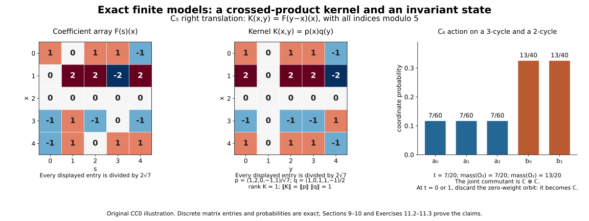

# Covariance and crossed products with nonunital coefficients

*Original exposition, proofs and illustration source are dedicated under CC0.*

Let \(A\) be any C* algebra, let \(G\) be a locally compact Hausdorff group, and let \(\alpha:G\to\operatorname{Aut}(A)\) be an action such that \(s\mapsto\alpha_s(a)\) is norm continuous for each \(a\in A\). No identity, separability, countability or unimodularity is assumed. We use left Haar measure and the convention
\(\int f(ts)\,dt=\Delta(s)^{-1}\int f(t)\,dt\).
Inner products are linear in the first variable.

## Earlier programme inputs

The scalar convergence and norm inputs are the earlier [SC-03–07 proofs](OA-FLOW-SC.md#sc-03). The previous lesson supplies the locally determined Haar convention, its identification with finite-exponent completed Radon spaces, Bochner integrals, the vector tensor unitary, qualified Radon-product Fubini, scalar translations and convolution, and the elementary automatic contractivity theorem. It also proves the C* quotient and closed-range facts from the earlier continuous calculus and order. We additionally use [Theorem 5.1](OA-FLOW-GNS.md#gns-theorem-5-1), [Theorem 5.2](OA-FLOW-GNS.md#gns-theorem-5-2) and [Theorem 7.3](OA-FLOW-GNS.md#gns-theorem-7-3) of the earlier lesson Positive functionals and nonunital representations: the cyclic nonunital GNS representation of a state and the faithful nondegenerate representation of any C* algebra. The Hilbert projection and bounded-form theorems, and continuous calculus, including the positive-cone theorem, are the same earlier inputs declared in the previous lesson. All other results used in this lesson are proved below. These earlier proof inputs are part of the dependency boundary, not discharged by the references at the end.

## 1. The integrable coefficient algebra

Let \(\mathcal B=L^1(G,A)\), with strong measurability and sigma compact representatives as in the previous lesson. Define
\[
 (F*H)(t)=\int F(s)\alpha_s(H(s^{-1}t))\,ds,\qquad
 F^*(t)=\Delta(t^{-1})\alpha_t(F(t^{-1})^*).
 \tag{1.1}
\]
Automorphisms of \(A\) are isometric: apply the C* contractivity lemma to an automorphism and its inverse. The integrands in (1.1) are strongly measurable on their sigma compact carriers. For continuous compactly supported \(F,H\) this follows from joint continuity of the action on each compact coefficient range; approximating in \(L^1\) proves the general case.

**Proposition 1.1.** \(\mathcal B\) is a Banach star algebra, \(C_c(G,A)\) is dense in it, and
\[
 \|F*H\|_1\leq\|F\|_1\|H\|_1,\qquad \|F^*\|_1=\|F\|_1.
 \tag{1.2}
\]

**Proof.** Bochner completeness and density were proved in the previous lesson. The product integrand is bounded in norm by \(\|F(s)\|\|H(s^{-1}t)\|\), whose double integral is \(\|F\|_1\|H\|_1\) by the Haar shear and qualified Fubini. Its carrier is contained in the image of two sigma compact carriers under \((s,r)\mapsto(s,sr)\). Thus the pointwise formula gives an \(L^1\) class and the stated norm estimate. Alternatively construct the product first on \(C_c(G,A)\), then extend by the estimate; the integrand-error estimate identifies the two definitions.

Associativity follows because both bracketings have the integrand
\[
 F(s)\alpha_s(H(r))\alpha_{sr}(K(r^{-1}s^{-1}t)),
 \tag{1.3}
\]
after substituting the inner variable \(u=sr\). Its triple norm integral is bounded by the product of the three \(L^1\) norms. The inversion formula and isometry of \(\alpha_t\) prove the involution norm identity and its square being the identity. For product reversal,
\[
 \begin{aligned}
 (H^**F^*)(t)
 &=\Delta(t^{-1})\int
       \alpha_r(H(r^{-1})^*)\alpha_t(F(t^{-1}r)^*)\,dr\\
 &=\Delta(t^{-1})\alpha_t\!\left(
       \int\alpha_s(H(s^{-1}t^{-1})^*)F(s)^*\,ds\right)
 =(F*H)^*(t),
 \end{aligned}
 \tag{1.4}
\]
where \(r=ts\) is left translation. First verify these formulas on compact supports, then extend by the norm estimates. \(\square\)

Put
\[
 M_aF(t)=aF(t),\quad N_aF(t)=F(t)\alpha_t(a),\quad
 T_sF(t)=\alpha_s(F(s^{-1}t)).
 \tag{1.5}
\]
The coefficient maps have norm at most \(\|a\|\), while \(T_s\) is an \(L^1\) isometry and \(T_sT_r=T_{sr}\). The action \(s\mapsto T_sF\) is norm continuous. For compact \(F\), split its difference at the identity into the uniform translate difference and \(\alpha_s(F(t))-F(t)\); the latter tends uniformly to zero on the compact range of \(F\), by finite epsilon nets and isometry of \(\alpha_s\). The supports locally lie in one compact set. Integrate, then use density and the isometry to extend to every \(F\).

**Proposition 1.2 (a product approximate identity).** Let \((e_i)\) be the positive contractive approximate identity of \(A\) constructed in the previous lesson, and let \((a_V)\) be its normalized scalar compact bumps. On the product directed set,
\[
 w_{i,V}(t)=a_V(t)e_i
 \tag{1.6}
\]
has \(L^1\) norm at most one and is a two-sided approximate identity of \(\mathcal B\).

**Proof.** For compact \(F\), \(M_{e_i}F\to F\) in \(L^1\): a bounded approximate identity approximates uniformly on a compact subset of \(A\), by a finite-net argument. The same argument on the compact range of \(t\mapsto\alpha_{t^{-1}}(F(t))\) gives \(N_{e_i}F\to F\). Density and the uniform contraction bounds extend both limits to all \(F\). These are net limits; no dominated-convergence theorem for arbitrary nets is being used.

Now
\[
 w_{i,V}*F=M_{e_i}\!\left(\int a_V(s)T_sF\,ds\right),\qquad
 F*w_{i,V}=(N_{e_i}F)*_{\rm scalar}a_V.
 \tag{1.7}
\]
The second product is ordinary scalar convolution of an \(A\)-valued function. Its approximate-identity property follows from the vector version of the scalar right translations proved in the previous lesson: the same compact-uniform proof and Bochner bound apply to \(A\)-valued functions. The first identity follows by the definition. The two errors are bounded respectively by
\[
 \sup_{s\in V}\|T_sF-F\|_1+\|M_{e_i}F-F\|_1,\qquad
 \|N_{e_i}F-F\|_1+\|F*_{\rm scalar}a_V-F\|_1.
 \tag{1.8}
\]
Both tend to zero on the product net. \(\square\)

## 2. Integrating a nondegenerate covariant representation

A **covariant representation** on \(K\) is a nondegenerate star representation \(\pi:A\to B(K)\) and a strongly continuous unitary action \(U:G\to\mathcal U(K)\) such that
\[
 U_s\pi(a)U_s^*=\pi(\alpha_s(a)).
 \tag{2.1}
\]
Nondegenerate means \(\overline{\pi(A)K}=K\); it does not mean that \(A\) has an identity.

**Theorem 2.1.** Its integrated form
\[
 \Phi_{\pi,U}(F)\xi=\int\pi(F(s))U_s\xi\,ds
 \tag{2.2}
\]
is a nondegenerate star representation of \(\mathcal B\), with
\(\|\Phi_{\pi,U}(F)\|\leq\|F\|_1\).

**Proof.** For compact \(F\), the vector integrand is continuous. On arbitrary strongly measurable \(F\) with a sigma compact carrier it is strongly measurable by simple approximation and continuous vector orbits, with norm bounded by \(\|F(s)\|\|\xi\|\). Thus (2.2) is a Bochner integral defining a bounded operator. Covariance gives
\[
 \pi(F(s))U_s\pi(H(r))U_r
 =\pi(F(s)\alpha_s(H(r)))U_{sr}.
 \tag{2.3}
\]
Vector Fubini, with domination \(\|F(s)\|\|H(r)\|\|\xi\|\), and substitution \(t=sr\) prove multiplicativity. The adjoint integrand is \(U_{s^{-1}}\pi(F(s)^*)=\pi(\alpha_{s^{-1}}(F(s)^*))U_{s^{-1}}\); inversion with its modular factor gives \(\Phi(F)^*=\Phi(F^*)\).

Finally \(\pi(e_i)\to I\) strongly: on \(\pi(a)\eta\) it follows from \(e_i a\to a\), and the contractions extend this to the dense generated space. Therefore
\[
 \|\Phi(w_{i,V})\xi-\xi\|
 \leq\sup_{s\in V}\|U_s\xi-\xi\|+\|\pi(e_i)\xi-\xi\|\to0.
 \tag{2.4}
\]
This proves nondegeneracy. \(\square\)

## 3. Recovering the two actions on an actual vector domain

Let \(\Phi:\mathcal B\to B(K)\) be any algebraic star representation. The previous lesson's elementary Banach star algebra proof gives \(\|\Phi(F)\|\leq\|F\|_1\). Restrict to its essential space \(K_e=\overline{\Phi(\mathcal B)K}\); the perpendicular space is a zero summand by the adjoint argument of that lesson.

**Theorem 3.1.** On \(K_e\) there is a unique nondegenerate covariant pair integrating to \(\Phi|_{K_e}\). Its initial formulas on finite generating sums are
\[
 \begin{aligned}
 \pi(a)\sum_j\Phi(F_j)\xi_j&=\sum_j\Phi(M_aF_j)\xi_j,\\
 U_s\sum_j\Phi(F_j)\xi_j&=\sum_j\Phi(T_sF_j)\xi_j .
 \end{aligned}
 \tag{3.1}
\]
These formulas are well defined and bounded before being extended to \(K_e\).

**Proof of the coefficient bound.** Multiplication on coefficient functions satisfies
\[
 (M_aH)^**F=H^**(M_{a^*}F).
 \tag{3.2}
\]
To see this, the star of \(aH(r^{-1})\) places \(a^*\) on its right, and applying \(\alpha_r\) places \(\alpha_r(a^*)\) immediately before \(\alpha_r(F(r^{-1}t))\). This is exactly the right side. The identity holds also for coefficients in the C* unitization, acting on \(A\) by scalar-plus-coefficient multiplication.

For \(c>\|a\|\), put \(d=(c^21-a^*a)^{1/2}\) in that unitization. Given a specific finite sum \(z=\sum_j\Phi(F_j)\xi_j\), let \(z_a=\sum_j\Phi(M_aF_j)\xi_j\) and define \(z_d\) in the same way. Pairwise use of (3.2), and \(d^*d=c^21-a^*a\), gives
\[
 c^2\|z\|^2-\|z_a\|^2=\|z_d\|^2\geq0.
 \tag{3.3}
\]
This computation is valid on the particular finite sum without presupposing that any of these operators has been defined on its equivalence class. If \(z=0\), it forces \(z_a=0\). Thus \(\pi(a)\) is well defined, and letting \(c\downarrow\|a\|\) gives \(\|\pi(a)\|\leq\|a\|\). The multiplier composition \(M_aM_b=M_{ab}\) and (3.2) prove multiplicativity and the adjoint rule on the generating domain and then on its closure. Moreover
\(\pi(e_i)\Phi(F)\xi=\Phi(M_{e_i}F)\xi\to\Phi(F)\xi\)
by Proposition 1.2. Uniform contractivity extends this limit to \(K_e\), so \(\pi\) is nondegenerate.

### Recovering the group action

**Proof of the group action.** The identity
\[
 (T_sH)^**(T_sF)=H^**F
 \tag{3.4}
\]
follows by writing the convolution integral and putting \(q=rs\): the factor \(\Delta(s)^{-1}\) from right translation cancels the factor \(\Delta(s)\) in \(\Delta(r^{-1})\), and the coefficient automorphism becomes \(\alpha_{rs}=\alpha_q\). Thus (3.1) preserves the inner product of any two finite generating sums. It is well defined and isometric, with inverse \(U_{s^{-1}}\). Its extension is unitary and satisfies the group law. The estimate
\(\|(U_s-U_r)\Phi(F)\xi\|\leq\|T_sF-T_rF\|_1\|\xi\|\)
and the norm continuity of \(T_sF\) prove strong continuity on generators and hence everywhere. Since \(T_sM_a=M_{\alpha_s(a)}T_s\), (2.1) holds on that domain and then on \(K_e\).

**Proof of integration and uniqueness.** For \(F,H\in\mathcal B\), the \(L^1(G,A)\)-valued integral
\[
 \int M_{F(s)}T_sH\,ds=F*H
 \tag{3.5}
\]
is Bochner integrable, with norm domination \(\|F(s)\|\|H\|_1\). Its strong measurability follows from simple approximation of \(F\), continuity of \(T_sH\), and bounded bilinearity of coefficient multiplication. Vector Fubini identifies it with (1.1), first on compact functions and then by the bilinear estimate. Thus
\[
 \Phi_{\pi,U}(F)\Phi(H)\xi
 =\int\Phi(M_{F(s)}T_sH)\xi\,ds
 =\Phi(F*H)\xi=\Phi(F)\Phi(H)\xi.
 \tag{3.6}
\]
Boundedness and density prove integration on \(K_e\).

Conversely, any pair integrating to \(\Phi\) obeys
\[
 \Phi(M_aF)=\pi(a)\Phi(F),\qquad \Phi(T_sF)=U_s\Phi(F)
 \tag{3.7}
\]
by coefficient multiplication, covariance and left substitution in its integral. These identities force (3.1) on the dense domain, proving uniqueness. \(\square\)

Consequently a bounded operator intertwines two nondegenerate integrated representations if and only if it intertwines both their coefficient and group actions. For the reverse implication use the Bochner integral. For the forward implication, apply the intertwining identity to \(M_aF\) and \(T_sF\), then use (3.1) on generating vectors and extend by density. Commutants and irreducibility therefore agree with those of the joint covariant pair.

## 4. The regular pair and its two faithfulness assertions

Take a faithful nondegenerate representation \(\rho:A\to B(K)\), supplied by the earlier C* representation construction. On \(L^2(G,K)\) put
\[
 (P_\rho(a)\xi)(t)=\rho(\alpha_{t^{-1}}(a))\xi(t),\qquad
 (\Lambda_s\xi)(t)=\xi(s^{-1}t).
 \tag{4.1}
\]
The previous lesson's unitary \(L^2(G)\otimes K\cong L^2(G,K)\) justifies this vector space without any separability of \(K\). The coefficient field acts on simple functions by continuous vector fields on their carriers; approximation shows strong measurability on every \(L^2\) vector. It is bounded by \(\|a\|\), and is a star homomorphism by pointwise multiplication and adjoints. The translations are strongly continuous unitaries. Direct evaluation gives
\(\Lambda_sP_\rho(a)\Lambda_s^*=P_\rho(\alpha_s(a))\).

**Proposition 4.1.** \(P_\rho\) is faithful and nondegenerate.

**Proof.** If \(\rho(a)\eta\ne0\), continuity of \(t\mapsto\rho(\alpha_{t^{-1}}(a))\eta\) gives a neighbourhood of the identity where its norm is bounded below by a positive number. Multiplying by a nonzero compact bump in that neighbourhood gives an \(L^2\) vector on which \(P_\rho(a)\) is nonzero. Thus faithfulness of \(\rho\) implies faithfulness of \(P_\rho\).

For nondegeneracy, the vectors \(h(t)\rho(b)\eta\), with \(h\in C_c(G)\), span a dense space, by nondegeneracy of \(\rho\) and the tensor identification. On the compact support of \(h\),
\[
 \|\,\rho(\alpha_{t^{-1}}(e_i))\rho(b)\eta-\rho(b)\eta\,\|
 \leq\|e_i\alpha_t(b)-\alpha_t(b)\|\,\|\eta\|\to0
 \tag{4.2}
\]
uniformly: \(\{\alpha_t(b)\}\) there is compact. Multiplication by \(h\) proves \(P_\rho(e_i)\to I\) on that dense vector space, and the uniform contraction bound extends it to all \(L^2\) vectors. This again proves a net limit without applying sequential dominated convergence to it. \(\square\)

Denote its integrated representation by \(\operatorname{Ind}\rho\). On a vector \(\xi\) its defining formula is the Bochner integral of operators applied to that vector. On a compact simple tensor it has the pointwise form
\
 [\operatorname{Ind}\rho(F)(h\eta)
 =\int\rho(\alpha_{t^{-1}}(F(s)))h(s^{-1}t)\eta\,ds.
 \tag{4.3}
\]

**Theorem 4.2.** \(\operatorname{Ind}\rho:\mathcal B\to B(L^2(G,K))\) is injective.

**Proof.** For scalar \(h\in C_c(G)\), define the untwisted \(A\)-valued convolution
\[
 H_h(t)=\int F(s)h(s^{-1}t)\,ds.
 \tag{4.4}
\]
It is continuous: compact \(F\) gives continuity by the finite-cover argument, and \(L^1\) approximation of \(F\) gives uniform convergence because the difference is bounded by \(\|F-F_n\|_1\|h\|_\infty\). It has a sigma compact carrier. Equation (4.3) is the continuous field \(t\mapsto\rho(\alpha_{t^{-1}}(H_h(t)))\eta\). It represents an \(L^2\) vector by the integrated norm bound; its pointwise identification follows first on compact \(F\) by vector Fubini and then by the \(L^1\) and uniform approximation just given.

If \(\operatorname{Ind}\rho(F)=0\), this continuous field represents the zero \(L^2\) class. A nonzero value would persist with positive norm on a nonempty open set, which has positive Haar measure. Thus it is zero **everywhere**, for each fixed \(\eta\). For each \(t\) this is now an operator identity tested on every \(\eta\), so faithfulness of \(\rho\) gives \(H_h(t)=0\). There is no union of uncountably many exceptional null sets in this reasoning. Set \(h=a_V\) and use the scalar vector-valued right approximate identity \(F*_{\rm scalar}a_V\to F\). Hence \(F=0\). \(\square\)

## 5. Why the reduced norm does not depend on the faithful coefficient representation

First consider any two faithful representations of a C* algebra \(D\). Either representation gives \(M_n(D)\) the operator norm in \(B(K^n)\). This is a complete C* norm: each entry has norm at most the matrix norm, and that norm is at most the sum of the entry norms. Thus a matrix Cauchy sequence has convergent entries, whose matrix converges by the latter bound. The operator adjoint and C* identity hold. The algebraic identity between two such matrix realizations is an injective star homomorphism of C* algebras, and is therefore isometric by the previous lesson. Its positive cone agrees as well, because positivity is \(z^*z\) and either direction preserves this form.

We also need to recognize this cone by operator quadratic forms. For a bounded self-adjoint operator \(h\) with nonnegative quadratic forms, and \(\lambda<0\), Cauchy-Schwarz gives
\(\|(h-\lambda)\xi\|\geq|\lambda|\|\xi\|\).
Its range is closed, and its perpendicular complement is the kernel of its adjoint \(h-\lambda\), hence is zero. Thus it is invertible, so its real spectrum is nonnegative and the positive-cone theorem makes it positive in \(B(K)\). An injective C* homomorphism reflects positivity: otherwise a self-adjoint \(h\) would have a negative spectral point, and a nonzero continuous function \(g\) supported in the negative half-line would give \(g(h)\ne0\), while calculus naturality gives \(g(\rho(h))=\rho(g(h))=0\). In the nonunital case take \(g(0)=0\), so \(g(h)\) is in the original algebra. Naturality here follows by uniform polynomial approximation, using the isometric image and unitization if necessary. This contradicts injectivity. Consequently the operator matrix cone is exactly the algebraic positive cone just compared. This proves finite matrix norm and cone independence without importing a spatial tensor norm theorem.

Let \(A^\dagger=A\) if \(A\) is unital, and use its C* unitization otherwise. A faithful nondegenerate \(\rho\) extends faithfully to \(A^\dagger\): if \(\rho(a)+zI=0\) with \(z\ne0\), faithfulness gives \(ab=-zb\) and \(ba=-zb\) for all \(b\), making \(-a/z\) an identity of \(A\). That is impossible in the nonunital case. In the unital case nondegeneracy gives \(\rho(1)=I\). The zero algebra has only its zero nondegenerate Hilbert space and all norms below are zero; treat it separately.

### Independence and the nonfaithful comparison bound

**Theorem 5.1.** For nonzero \(A\), all faithful nondegenerate \(\rho\) give the same norm \(\|\operatorname{Ind}\rho(F)\|\). For any nondegenerate coefficient representation \(\pi\), faithful or not,
\[
 \|\operatorname{Ind}\pi(F)\|\leq\|\operatorname{Ind}\rho(F)\|.
 \tag{5.1}
\]

**Proof.** First take \(F\in C_c(G,A)\). For arbitrary \(h_1,\ldots,h_n\in C_c(G)\), put
\[
 g_j(t)=\int\alpha_{t^{-1}}(F(s))h_j(s^{-1}t)\,ds,\quad
 B_{ij}=\int g_i(t)^*g_j(t)\,dt,\quad
 G_{ij}=\int\overline{h_i(t)}h_j(t)\,dt .
 \tag{5.2}
\]
Each \(g_j\) is continuous with compact support, by the same vector integral argument as (4.4) and continuity of the action. Thus the \(B_{ij}\) are elements of \(A\). For \(\xi=\sum_jh_j\eta_j\), equation (4.3) and inner products give
\[
 \|\operatorname{Ind}\rho(F)\xi\|^2
 =\sum_{i,j}\langle\rho(B_{ij})\eta_j,\eta_i\rangle,\qquad
 \|\xi\|^2=\sum_{i,j}G_{ij}\langle\eta_j,\eta_i\rangle.
 \tag{5.3}
\]
Consequently \(\|\operatorname{Ind}\rho(F)\|\leq C\) exactly when, for every such finite family, the self-adjoint matrix
\[
 D=C^2[G_{ij}1]-[B_{ij}]\quad\hbox{in }M_n(A^\dagger)
 \tag{5.4}
\]
is positive. Indeed, all \(\eta_j\) may vary independently, and the finite tensor sums are dense. The matrix cones just proved independent show that this condition is the same for any other faithful coefficient representation. A possibly nonfaithful \(\pi^\dagger\) preserves positivity, since it sends \(z^*z\) to \(\pi^\dagger(z)^*\pi^\dagger(z)\). Thus the same matrix condition implies the operator bound for \(\operatorname{Ind}\pi\). This proves both assertions on \(C_c(G,A)\). Approximate \(F\in\mathcal B\) in \(L^1\) and use the common integrated \(L^1\) bound to extend them. \(\square\)

## 6. Full and reduced crossed products and their canonical actions

Define
\[
 \|F\|_u=\sup_{(\pi,U)}\|\Phi_{\pi,U}(F)\|,\qquad
 \|F\|_r=\|\operatorname{Ind}\rho(F)\|.
 \tag{6.1}
\]
The pairs in the supremum are nondegenerate covariant Hilbert-space representations. Both norms are at most \(\|F\|_1\). The regular pair belongs to this class, and Theorem 4.2 gives definiteness. The supremum can be taken over a set: every representation's essential cyclic restriction has density bounded by that of \(\mathcal B\), and Theorem 3.1 makes it a covariant restriction; choose Hilbert representatives up to this cardinal. The product approximate identity ensures that the cyclic generating vector lies in the essential cyclic closure, exactly as in the preceding lesson.

**Theorem 6.1.** The completions
\[
 A\rtimes_\alpha G=\overline{\mathcal B}^{\,\|\cdot\|_u},\qquad
 A\rtimes_{\alpha,r}G=\overline{\operatorname{Ind}\rho(\mathcal B)}
 \tag{6.2}
\]
are C* algebras. The second is independent, up to its canonical isometry, of \(\rho\). The identity on \(\mathcal B\) gives a surjective star homomorphism
\[
 q:A\rtimes_\alpha G\longrightarrow A\rtimes_{\alpha,r}G.
 \tag{6.3}
\]
Nondegenerate representations of the full algebra correspond exactly to nondegenerate covariant pairs, preserving intertwiners.

**Proof.** Each integrated representation is a star homomorphism, so the supremum and regular norms are submultiplicative and isometric on the involution. Their C* identities follow from
\(\|\Phi(F^**F)\|=\|\Phi(F)\|^2\)
and taking suprema. Completion preserves these identities. Norm independence is Theorem 5.1. The inequality \(\|\cdot\|_r\leq\|\cdot\|_u\) extends the identity to \(q\) with dense image; the earlier proved C* closed-range theorem makes that image closed, hence onto. Thus the reduced algebra is isometrically the quotient by \(\ker q\).

All nondegenerate integrated representations extend by the full norm definition. Conversely a nondegenerate full representation restricts to a nondegenerate representation of the dense \(\mathcal B\), so Theorem 3.1 recovers its unique pair. Intertwiners were established immediately after that theorem. \(\square\)

### The coefficient and group multiplier pairs

The canonical coefficient and group actions are genuinely multiplier actions when \(A\) is nonunital. On the dense algebra their left/right pairs are
\[
 \begin{array}{ll}
 i_A(a)F=M_aF,&Fi_A(a)=N_aF,\\
 i_G(s)F=T_sF,&Fi_G(s)=R_sF,\quad R_sF(t)=\Delta(s)^{-1}F(ts^{-1}).
 \end{array}
 \tag{6.4}
\]
Their norm bounds follow in each covariant representation from
\(\Phi(M_aF)=\pi(a)\Phi(F)\),
\(\Phi(N_aF)=\Phi(F)\pi(a)\),
\(\Phi(T_sF)=U_s\Phi(F)\), and
\(\Phi(R_sF)=\Phi(F)U_s\).
The latter identity is right substitution in (2.2). The same identities hold in the regular pair. Thus these maps extend boundedly to both completions; the group maps are isometric with the inverse for \(s^{-1}\).

A **multiplier pair** on a C* algebra \(D\) consists of bounded linear maps \(L,R:D\to D\) satisfying
\[
 L(FH)=L(F)H,\qquad R(FH)=FR(H),\qquad R(F)H=FL(H).
 \tag{6.5}
\]
Its product with \((L',R')\) is \((LL',R'R)\), its identity is \((1,1)\), and its adjoint has maps \(F\mapsto R(F^*)^*\), \(F\mapsto L(F^*)^*\). For the actions (6.4), equations (6.5) can be checked in the faithful integrated regular representation: the displayed operator identities (6.4) reduce them respectively to associativity of operator multiplication. Injectivity from Theorem 4.2 then gives the identities on the coefficient algebra, and boundedness gives them on either completion. The same operator calculation gives \(i_A(a)^*=i_A(a^*)\), \(i_G(s)^*=i_G(s^{-1})\), their coefficient and group product rules, and covariance. Their inverse group pairs multiply to \((1,1)\), so they are unitary multiplier actions in this precise sense.

Norm continuity of \(T_sF,R_sF\) proves the continuity of these group multipliers when tested on either side of any algebra element. Every nondegenerate representation realizes the pairs on its dense generating vector space by the bounded actions already proved in Theorem 3.1. No multiplier-extension theorem was needed to define them.

The coefficient action is nondegenerate on either completion: \(M_{e_i}F\to F\) was proved in Proposition 1.2, and the uniform contraction bound extends this approximation from the dense coefficient algebra to its completion.

These coefficient actions are faithful: if \(M_aF=0\) for all \(F\), use \(F(s)=h(s)b\), where \(h\ne0\) is a scalar compact bump, to obtain \(ab=0\) for every \(b\in A\), and then \(ae_i\to a\) gives \(a=0\). Definiteness of the universal and regular norms permits this argument in either completion. For a discrete group, \(a\mapsto\delta_e a\) is an actual algebra inclusion; if \(A\) is also unital, \(\delta_s1\) are actual group unitaries. Without those hypotheses, (6.4) specifies the appropriate multiplier actions.

## 7. A proved full/reduced comparison

Use the following precise condition on \(G\): the trivial representation \(f\mapsto\int f\) of \(C^*(G)\) factors through \(C_r^*(G)\). Equivalently its kernel contains the kernel of the full-to-reduced group map. This is the C* formulation of amenability used in the free primary notes of Echterhoff, Definition 4.3. We prove the needed consequences here; no invariant-mean characterization is used or silently assumed.

**Lemma 7.1 (almost invariant regular vectors).** Under this condition there is a net of unit vectors \(v_i\in L^2(G)\) such that
\[
 \sup_{s\in C}\|\lambda_s v_i-v_i\|_2\longrightarrow0
 \quad\hbox{for every compact }C\subset G.
 \tag{7.1}
\]

**Proof.** Let \(\epsilon_r:C_r^*(G)\to\mathbb C\) be the factored character. On the minimal unitization \(D=C_r^*(G)^\dagger\), extend it to a unital character \(\epsilon\). It is positive and contractive by the previous lesson's C* homomorphism lemma. The faithful nondegenerate regular inclusion of \(D\) in \(B(L^2(G))\) is unital and faithful, by the minimal-unitization argument in Section 5.

For any finite list \(d_1,\ldots,d_n\) of self-adjoint elements, the vector of values \((\epsilon(d_j))\) lies in the closed convex hull of
\(\{(\langle d_j\xi,\xi\rangle):\|\xi\|=1\}\)
in \(\mathbb R^n\). Otherwise the nearest-point projection onto this closed convex set gives a separating real linear functional. Its separating element is a self-adjoint \(h=\sum_jc_jd_j\) for which
\(\epsilon(h)>\sup_{\|\xi\|=1}\langle h\xi,\xi\rangle=c\).
But \(cI-h\geq0\) as an operator, since all its quadratic values are nonnegative. The faithful C* inclusion reflects positivity by its isometric calculus, so \(c1-h\geq0\) in \(D\). Positivity of \(\epsilon\) contradicts the displayed strict inequality. The nearest-point separator follows directly by expanding squared distances to points on the segment from the nearest point toward any other point of the convex set, as in the earlier Hilbert projection theorem.

Apply this also to the real and imaginary parts of arbitrary finite lists. It gives a net of finite convex combinations of vector states
\[
 \psi_i(d)=\sum_{j=1}^{m_i}p_{ij}\langle d\xi_{ij},\xi_{ij}\rangle,
 \quad p_{ij}\geq0,\quad \sum_jp_{ij}=1,\quad\|\xi_{ij}\|=1,
 \tag{7.2}
\]
converging pointwise to \(\epsilon\). Index it by finite test lists and decreasing positive error bounds.

Fix \(g\in C_c(G)_+\) with \(\int g=1\), and form
\(\eta_i=(\sqrt{p_{ij}}\lambda(g)\xi_{ij})_{j=1}^{m_i}\)
in the finite direct sum of regular Hilbert spaces. Then
\[
 \|\eta_i\|^2=\psi_i(\lambda(g)^*\lambda(g))\to1,\qquad
 \langle(\lambda_s\otimes1)\eta_i,\eta_i\rangle
   =\psi_i(\lambda(g)^*\lambda_s\lambda(g))\to1.
 \tag{7.3}
\]
Here \(\lambda_s\lambda(g)=\lambda(L_sg)\), so the tested element is inside \(C_r^*(G)\) and its character value is \(1\). The map \(s\mapsto\lambda(g)^*\lambda(L_sg)\) is norm continuous. Its image on a compact set is norm compact; finite epsilon nets and \(\|\psi_i\|=\|\epsilon\|=1\) make convergence in (7.3) uniform on that compact set.

Normalize \(\eta_i\) once its norm is nonzero. The identity for unit vectors
\(\|(\lambda_s\otimes1)w_i-w_i\|^2=2-2\operatorname{Re}\langle(\lambda_s\otimes1)w_i,w_i\rangle\)
now gives uniform almost invariance. Regard \(w_i\) as a finite-dimensional vector-valued \(L^2\) function and put \(v_i(t)=\|w_i(t)\|\). It has scalar \(L^2\) norm one, and the reverse triangle inequality gives
\[
 \|\lambda_s v_i-v_i\|_2
 \leq\|(\lambda_s\otimes1)w_i-w_i\|_2.
 \tag{7.4}
\]
This proves (7.1), with no fixed dimension or separability assumption. \(\square\)

**Theorem 7.2.** Under the condition above, the map \(q\) in (6.3) is an isomorphism for every \(A,\alpha\). In particular, faithfulness of the full-to-reduced **group** representation implies equality of the full and reduced norms for every coefficient system.

**Proof.** For a covariant pair \((\pi,U)\), multiplication by \(U_t\) is a unitary \(W\) on \(L^2(G,K)\):
\[
 (W\xi)(t)=U_t\xi(t).
 \tag{7.5}
\]
Its strong measurability follows on simple functions from continuous vector orbits on sigma compact carriers, then on general functions by approximation; its inverse uses \(U_t^*\), and its pointwise norm is unchanged. Direct evaluation gives
\[
 WP_\pi(a)W^*=\pi(a)\otimes1,\qquad
 W\Lambda_sW^*=U_s\otimes\lambda_s,
 \tag{7.6}
\]
Here the tensor order is \(K\otimes L^2(G)\): the map \(\xi\otimes h\mapsto[t\mapsto h(t)\xi]\) is unitary, because its inner products on finite sums equal the defining tensor inner products and its range contains the dense compact simple tensors. Thus the integrated tensor pair is unitarily equivalent to \(\operatorname{Ind}\pi\), whose norm is at most the faithful reduced norm by Theorem 5.1.

Use Lemma 7.1 and the isometries \(V_i:K\to K\otimes L^2(G)\), \(V_i\xi=\xi\otimes v_i\). For \(F\in C_c(G,A)\),
\[
 V_i^*\Phi_{\pi\otimes1,U\otimes\lambda}(F)V_i
 =\int\langle\lambda_s v_i,v_i\rangle\,\pi(F(s))U_s\,ds .
 \tag{7.7}
\]
The equality is proved by testing pairs of vectors in the Bochner integral. Its operator norm distance to \(\Phi_{\pi,U}(F)\) is at most
\[
 \|F\|_1\sup_{s\in\operatorname{supp}F}
       |\langle\lambda_s v_i,v_i\rangle-1|\longrightarrow0.
 \tag{7.8}
\]
Every compression has norm at most \(\|F\|_r\). Therefore
\(\|\Phi_{\pi,U}(F)\|\leq\|F\|_r\).
Taking the supremum gives \(\|F\|_u\leq\|F\|_r\); the reverse inequality was already proved. Density extends equality to \(\mathcal B\) and the completions. If the group map is faithful, its inverse is an isometric C* isomorphism by the preceding lesson, and the trivial character factors through it, so the stated hypothesis holds. \(\square\)

For \(A=\mathbb C\) the theorem also proves that this factored-character condition implies \(C^*(G)=C_r^*(G)\). The converse follows by composing the trivial character with the inverse group isomorphism. This proves exactly the equivalence needed here. It does not assert the equivalence with every other definition of amenability.

## 8. Invariant states: continuity and extremality

Let \(\omega\) be a state on \(A\) with \(\omega\circ\alpha_s=\omega\). Take its cyclic nondegenerate GNS representation \((\pi_\omega,K_\omega,\xi_\omega)\), with \(\|\xi_\omega\|=1\) and \(\omega(a)=\langle\pi_\omega(a)\xi_\omega,\xi_\omega\rangle\).

**Proposition 8.1.** On its dense generating vectors, the formula
\[
 U_s\pi_\omega(a)\xi_\omega=\pi_\omega(\alpha_s(a))\xi_\omega
 \tag{8.1}
\]
gives a strongly continuous unitary covariant representation, and \(U_s\xi_\omega=\xi_\omega\).

**Proof.** Invariance gives equality of inner products before and after this formula, so it is well defined and isometric; the formula for \(s^{-1}\) gives its inverse. The group and covariance identities follow on generators and then everywhere. Also
\[
 \|(U_s-U_r)\pi_\omega(a)\xi_\omega\|
 \leq\|\alpha_s(a)-\alpha_r(a)\|\to0.
 \tag{8.2}
\]
Unitarity extends continuity to all vectors. For a positive contractive approximate identity \((e_i)\), \(\pi_\omega(e_i)\xi_\omega\to\xi_\omega\); for fixed \(s\), \((\alpha_s(e_i))\) is also such an approximate identity, so its GNS vectors have the same limit. Applying (8.1) proves \(U_s\xi_\omega=\xi_\omega\). This proves continuity for arbitrary nonunital \(A\), rather than assuming it from invariance alone. \(\square\)

### Dominated functionals and invariant-state extremality

We next prove the dominated-functional argument needed for the extreme-state criterion.

**Lemma 8.2.** If \(\psi\) is a bounded positive functional with \(0\leq\psi\leq C\omega\), there is a unique bounded positive \(T\in\pi_\omega(A)'\), with \(0\leq T\leq CI\), such that
\[
 \psi(a)=\langle T\pi_\omega(a)\xi_\omega,\xi_\omega\rangle.
 \tag{8.3}
\]
It commutes with every \(U_s\) if and only if \(\psi\) is invariant.

**Proof.** On GNS generating vectors define
\[
 B(\pi_\omega(a)\xi_\omega,\pi_\omega(b)\xi_\omega)=\psi(b^*a).
 \tag{8.4}
\]
Positivity gives Cauchy-Schwarz for \(\psi\): expand \(\psi((a+zb)^*(a+zb))\geq0\) and minimize the scalar quadratic (including the case \(\psi(b^*b)=0\)). Thus the form is well defined when a GNS vector is zero, since
\(\psi(a^*a)\leq C\omega(a^*a)\).
Its bound is \(|B(v,w)|\leq C\|v\|\|w\|\), and \(0\leq B(v,v)\leq C\|v\|^2\). The earlier Hilbert bounded-form theorem therefore gives a unique \(T\), positive with \(0\leq T\leq CI\), such that \(B(v,w)=\langle Tv,w\rangle\).

For \(c\in A\), the two forms \(B(\pi_\omega(c)v,w)\) and \(B(v,\pi_\omega(c^*)w)\) agree on generators because both are \(\psi(b^*ca)\). Hence \(T\) commutes with \(\pi_\omega(c)\). Take \(a\) in the first argument of (8.4) and \(e_i\) in the second. The right side is \(\psi(e_i a)\to\psi(a)\) by norm approximation and boundedness of \(\psi\); the second vector converges to \(\xi_\omega\). This proves (8.3) even without an identity. Conversely, (8.3) and commutation determine (8.4) on every pair of generators, so uniqueness holds.

If \(\psi\) is invariant, \(B(U_sv,U_sw)=B(v,w)\) on generators, giving \(U_s^*TU_s=T\). Conversely if \(T\) commutes with \(U_s\), covariance, its fixed vector and (8.3) give \(\psi(\alpha_s(a))=\psi(a)\). \(\square\)

**Theorem 8.3.** The invariant state \(\omega\) is extreme in the convex set of invariant states exactly when
\[
 \pi_\omega(A)'\cap U(G)'=\mathbb CI.
 \tag{8.5}
\]
Equivalently the joint covariant representation, or its integrated full crossed-product representation, is irreducible.

**Proof.** Suppose the joint commutant is scalar, and write \(\omega=t\omega_1+(1-t)\omega_2\) for invariant states and \(0<t<1\). Lemma 8.2 applies to \(\psi=t\omega_1\leq\omega\) and gives a joint-commutant positive contraction \(T=cI\). Its functional is \(c\omega\), so \(\psi=c\omega\). Taking norms of these positive functionals gives \(c=t\); hence \(\omega_1=\omega\), and likewise \(\omega_2=\omega\).

Conversely, if the joint commutant is not scalar, one of the self-adjoint real or imaginary parts of a nonscalar element is nonscalar. An affine rescaling gives a nonscalar self-adjoint \(T\) in that commutant with \(\varepsilon I\leq T\leq(1-\varepsilon)I\), \(0<\varepsilon<1/2\). Set \(t=\langle T\xi_\omega,\xi_\omega\rangle\), which lies in \((0,1)\), and define
\[
 \omega_1(a)=t^{-1}\langle T\pi_\omega(a)\xi_\omega,\xi_\omega\rangle,\quad
 \omega_2(a)=(1-t)^{-1}\langle(1-T)\pi_\omega(a)\xi_\omega,\xi_\omega\rangle .
 \tag{8.6}
\]
These are positive bounded invariant functionals. Their norms are one: evaluating the coefficient approximate identity gives the limits \(t/t=1\) and \((1-t)/(1-t)=1\); the upper bounds follow from the vector-state expressions with \(T^{1/2}\xi_\omega\) and \((1-T)^{1/2}\xi_\omega\). Thus they are states and \(\omega=t\omega_1+(1-t)\omega_2\). If \(\omega_1=\omega\), uniqueness in Lemma 8.2 forces \(T=tI\), a contradiction. Hence the decomposition is nontrivial.

A closed invariant subspace for the joint star/unitary family is reducing, and its orthogonal projection belongs to the joint commutant. Conversely the continuous-calculus construction in the next paragraph gives a nontrivial reducing subspace from a nonscalar self-adjoint element in that commutant. Thus (8.5) is equivalent to irreducibility, using only the already declared calculus and Hilbert projection theorem. Intertwiner equivalence after Theorem 3.1 proves the last claim for the integrated representation. \(\square\)

For that construction, a nonscalar self-adjoint \(h\) has at least two spectral points, since the isometric calculus would otherwise make \(h\) scalar. Choose continuous nonnegative \(f,g\) on its spectrum, supported in disjoint neighbourhoods of these two points and nonzero there. The calculus makes \(f(h)\) and \(g(h)\) nonzero with product zero. The closed range \(\overline{f(h)K_\omega}\) is invariant under the joint family and its adjoints, and is nonzero and proper because it is perpendicular to the nonzero range of \(g(h)\). Its orthogonal projection is the required nontrivial joint-commutant projection.

## 9. Two finite orbits

Let \(G=C_6\) act on the five-point set \(X=O_3\sqcup O_2\), with its generator rotating a three-cycle and a two-cycle. On \(A=C(X)\), \(\alpha\) permutes the coordinates. An invariant probability has one constant weight on each orbit, hence every invariant state is
\[
 \omega_t(f)=\frac{t}{3}\sum_{x\in O_3}f(x)
       +\frac{1-t}{2}\sum_{x\in O_2}f(x),\qquad 0\leq t\leq1.
 \tag{9.1}
\]
Its extreme states are exactly the two endpoints. For \(0<t<1\), the GNS space has all five coordinates, multiplication is diagonal and group unitaries are the coordinate permutations. A diagonal operator commutes with those permutations exactly when it is constant on each orbit. Thus the joint commutant is \(\mathbb C\oplus\mathbb C\). At either endpoint the null GNS coordinates are discarded, leaving one transitive orbit and a scalar commutant. This is an explicit check of Theorem 8.3, including the change of GNS support at the endpoints.

## 10. Right translation and rank-one kernels

Take \(A=C_0(G)\), with right-translation action
\[
 \alpha_s(a)(x)=a(xs).
 \tag{10.1}
\]
It is a left group homomorphism: \(\alpha_s\alpha_r=\alpha_{sr}\). It is norm continuous on \(C_c(G)\) by uniform translation continuity and hence on \(C_0(G)\). Here \(C_c(G)\) is dense in \(C_0(G)\): for \(a\) and \(\varepsilon>0\), the set \(\{|a|\geq\varepsilon\}\) is compact, and multiplying by a compact cutoff equal to one there changes the sup norm by at most \(\varepsilon\).

Multiplication \(M_a\) on \(L^2(G)\) is faithful by full Haar support and nondegenerate by compact cutoffs on the dense \(C_c(G)\) vectors. The right unitaries
\[
 (V_s\xi)(x)=\Delta(s)^{1/2}\xi(xs)
 \tag{10.2}
\]
are isometric by the modular formula, satisfy \(V_sV_r=V_{sr}\), and have inverse \(V_{s^{-1}}\). Uniform continuity on compact supports followed by density proves their strong continuity. Direct evaluation gives \(V_sM_aV_s^*=M_{\alpha_s(a)}\).

The integrated operator of \(F\in C_c(G,C_0(G))\), on compactly supported vectors, has the kernel
\
 [\Phi(F)\xi=\int K_F(x,y)\xi(y)\,dy,\qquad
 K_F(x,y)=F(x^{-1}y)(x)\Delta(x^{-1}y)^{1/2}.
 \tag{10.3}
\]
This is the substitution \(y=xs\), which is left translation in \(s\). Conversely a rank-one kernel \(p(x)\overline{q(y)}\), \(p,q\in C_c(G)\), is obtained from
\[
 F_{p,q}(s)(x)=p(x)\overline{q(xs)}\Delta(s)^{-1/2}.
 \tag{10.4}
\]
It is a continuous compactly supported \(C_0(G)\)-valued function: its joint support is compact, with \(x\in\operatorname{supp}p\), \(xs\in\operatorname{supp}q\), hence \(s\in(\operatorname{supp}p)^{-1}\operatorname{supp}q\). The integrated operator is \(\theta_{p,q}\xi=p\langle\xi,q\rangle\).

**Theorem 10.1.** For every locally compact Hausdorff \(G\), both crossed products for (10.1) are canonically isomorphic to \(\mathcal K(L^2(G))\), the norm closure of finite-rank operators.

**Proof.** First the span of the \(F_{p,q}\) is \(L^1(G,C_0(G))\)-dense. Here are the compact-support approximation details. A continuous compactly supported map \(F:G\to C_0(G)\) can be approximated uniformly, on one common compact support in \(s\), by finite sums \(h_j(s)a_j(x)\), \(h_j\in C_c(G)\), \(a_j\in C_c(G)\). To construct them, cover its compact support by finitely many neighbourhoods where the coefficient norm oscillation is small; compact cutoffs in these neighbourhoods, normalized by the maximum of their sum and \(1\), give continuous weights whose sum is \(1\) on the support and at most \(1\) everywhere. Use the corresponding sample coefficients and approximate each of the finitely many \(C_0\) coefficients by a compact cutoff. This gives the uniform approximation; its common compact \(s\)-support converts it to \(L^1\) approximation.

For such a joint compactly supported \(F\), (10.3) gives \(K_F\in C_c(G\times G)\). A compact kernel \(K\) can in turn be approximated uniformly on one common compact rectangle \(C\times D\) by finite sums \(p_j(x)\overline{q_j(y)}\) with \(p_j,q_j\in C_c(G)\). Use the same finite-cover and cutoff-weight argument in \(x\) for the continuous map \(x\mapsto K(x,\cdot)\), with the latter functions supported on the common compact projection \(D\). A finite-cover argument in \(y\) proves that this map is sup-norm continuous. On a common compact rectangle, the inverse relation
\[
 F(s)(x)=K(x,xs)\Delta(s)^{-1/2}
 \tag{10.5}
\]
turns a kernel error at most \(\varepsilon\) into an \(L^1\) coefficient error at most
\(\varepsilon\,\mu(C^{-1}D)\sup_{s\in C^{-1}D}\Delta(s)^{-1/2}\).
This proves density, because continuous coefficient functions are already dense in \(\mathcal B\).

On these rank-one functions, convolution and star are precisely
\[
 F_{p,q}*F_{r,z}=\langle r,q\rangle F_{p,z},\qquad
 F_{p,q}^*=F_{q,p}.
 \tag{10.6}
\]
For example the product integral is
\[
 p(x)\overline{z(xt)}\Delta(t)^{-1/2}
       \int\overline{q(xs)}r(xs)\,ds
 =\langle r,q\rangle F_{p,z}(t)(x),
 \tag{10.7}
\]
since \(s\mapsto xs\) preserves left Haar measure. In the star formula,
\(\Delta(t^{-1})F_{p,q}(t^{-1})(xt)^*
=q(x)\overline{p(xt)}\Delta(t)^{-1/2}\).
Thus the algebraic kernel map is a star isomorphism of this span with the finite-rank operators having all range and initial vectors in \(C_c(G)\). It is injective: a zero compact kernel operator has all scalar pairings with compact test functions zero; its continuous kernel must then be zero. More directly in a finite rank presentation, express all vectors in an orthonormal basis of their finite-dimensional span and use linear independence of the resulting matrix units.

Each finite list of these vectors lies in a finite-dimensional subspace \(E\subset C_c(G)\); its full corner is the matrix C* algebra \(\mathcal K(E)\). Every covariant integrated representation restricts to a star homomorphism of this matrix algebra and is contractive by the preceding lesson. The concrete pair (10.2) attains its ordinary operator norm, so the universal norm of every element of this corner is exactly that norm. The regular representation of Section 4 is injective on \(\mathcal B\), hence on the corner, and is therefore isometric there by the same C* injection lemma. Thus the reduced norm has the same value. The corners exhaust the rank-one span, which is dense in the coefficient \(L^1\) algebra and therefore in either C* norm. Finally, approximating arbitrary Hilbert vectors by \(C_c(G)\) shows that the operator closure of this span is all \(\mathcal K(L^2(G))\). This proves the theorem without importing an imprimitivity theorem. \(\square\)

For \(G=C_5\), counting measure makes \(\Delta=1\), and every coefficient function is a five-by-five finite array. Writing \(x,y,s\) as integers modulo \(5\),
\[
 K_F(x,y)=F(y-x)(x),\qquad F(s)(x)=K_F(x,x+s).
 \tag{10.8}
\]
The full and reduced crossed products \(C(C_5)\rtimes C_5\) are therefore \(M_5(\mathbb C)\). This differs from the scalar-coefficient group algebra \(C^*(C_5)\cong\mathbb C^5\) of the previous lesson: the coefficient algebra and action have changed.

*Original CC0 illustration.* The first two panels display exact numerator arrays with common denominator \(2\sqrt7\), for the real unit vectors \(p=(1,2,0,-1,1)/\sqrt7\) and \(q=(1,0,1,1,-1)/2\). Equation (10.8) reindexes the coefficient array into the rank-one kernel \(K(x,y)=p(x)q(y)\); Theorem 10.1 proves its crossed-product interpretation. The final panel displays the state of Section 9 at \(t=7/20\), with probabilities \(7/60\) and \(13/40\). Exercises 11.2–11.3 verify the matrix units and the joint-commutant projection. The covariance conventions agree with Echterhoff, freely accessible version 4, Section 3.2; the finite numerical models and their proofs here are original. The reproducible figure source is make_l25_figure.py.

## 11. Exercises and complete solutions

**Exercise 11.1 (a sign in covariance).** In the regular pair (4.1), calculate \(\Lambda_sP_\rho(a)\Lambda_s^*\) at \(t\), and identify the recovered coefficient.

**Solution.** \(\Lambda_s^*\xi(u)=\xi(su)\), so the result at \(t\) is
\(\rho(\alpha_{(s^{-1}t)^{-1}}(a))\xi(t)
=\rho(\alpha_{t^{-1}s}(a))\xi(t)
=P_\rho(\alpha_s(a))\xi(t)\).
Thus the \(t^{-1}\) in the coefficient field and \(s^{-1}t\) in the translation are both required.

**Exercise 11.2 (finite matrix units).** In (10.8), find the coefficient function whose kernel is the matrix unit \(E_{ij}\), and compute its product and adjoint.

**Solution.** Let \(p=\delta_i\), \(q=\delta_j\). Then \(F_{ij}(s)(x)\) is \(1\) exactly when \(x=i\) and \(s=j-i\), and is zero otherwise. Formula (10.6) gives \(F_{ij}*F_{k\ell}=\delta_{jk}F_{i\ell}\) and \(F_{ij}^*=F_{ji}\). The integrated operators are \(E_{ij}\), giving all \(25\) matrix units.

**Exercise 11.3 (an invariant mixture).** For the two-orbit action of Section 9 and \(t=7/20\), give the five coordinate probabilities, a fixed cyclic GNS vector and the projection witnessing nonextremality.

**Solution.** The probabilities are \(7/60\) on each of the three-cycle coordinates and \(13/40\) on each of the two-cycle coordinates. On the ordinary five-dimensional coordinate Hilbert space one can take
\(\xi=(\sqrt{7/60},\sqrt{7/60},\sqrt{7/60},\sqrt{13/40},\sqrt{13/40})\).
The permutations fix it. The projection \(P\) onto the three-cycle coordinates commutes with the diagonal coefficients and the group permutations, and \(\langle P\xi,\xi\rangle=7/20\). Its two normalized functionals in (8.6) are the uniform states on the separate orbits.

**Exercise 11.4 (nonunital recovery).** Why is it insufficient to write \(\pi(a)=\Phi(\delta_e a)\) for an arbitrary locally compact group? Give the formula that works on a genuine dense vector domain.

**Solution.** When the identity has no positive Haar atom, a point mass \(\delta_e\) is not an \(L^1\) function. The dense-domain formula is
\(\pi(a)\sum_j\Phi(F_j)\xi_j=\sum_j\Phi(aF_j)\xi_j\).
Equation (3.3) proves its well-definedness and bound, and coefficient approximate identities prove nondegeneracy. This does not require either a Dirac function in \(\mathcal B\) or an identity in \(A\).

**Exercise 11.5 (the two modular powers).** For the right action on \(C_0(G)\), explain why the vector action has \(\Delta(s)^{1/2}\) whereas \(F_{p,q}\) has \(\Delta(s)^{-1/2}\).

**Solution.** Right translation changes the squared vector integral by \(\Delta(s)^{-1}\), so its unitary normalization is \(\Delta(s)^{1/2}\). The integrated kernel contains this factor. To obtain exactly \(p(x)\overline{q(y)}\), (10.4) must cancel it with its reciprocal. No modular factor comes from \(y=xs\), because that is a left translation in the integration variable \(s\).

**Exercise 11.6 (the comparison hypothesis is explicit).** Suppose the group full-to-reduced map is injective. Deduce equality of the two crossed products for every \(A,\alpha\), and list the mechanism without invoking an invariant-mean equivalence.

**Solution.** The group map is surjective by the preceding lesson, so injectivity makes it a C* isomorphism. The trivial character therefore factors through its reduced algebra. Lemma 7.1 uses finite convex vector-state approximations and a compactly continuous smoothing operator to construct almost invariant regular vectors. The tensor unitary (7.5) and the compressions (7.7) then bound every covariant integrated norm by the faithful reduced norm. Theorem 7.2 gives equality and injectivity of (6.3).

## 12. Free primary reading

Siegfried Echterhoff, *Crossed products and the Mackey-Rieffel-Green machine*, freely accessible version 4, Section 3.2, equations (3.1)-(3.3), Remark 3.2, Definition 3.3 and Remark 3.4, fixes the conventions used here. Section 4, Definition 4.3 and its tensor-pair calculation, supplies a comparison for the precise scalar condition in Section 7: [arXiv:1006.4975v4](https://arxiv.org/abs/1006.4975v4). The finite-matrix, vector-domain and compression arguments needed here are fully proved above.

Dana P. Williams, *Crossed Products of C* Algebras*, freely accessible author manuscript, version 3.1, Sections 2.3-2.4 and Appendix B, is further reading on the convolution algebra and the correspondence of representations: [complete author draft](https://math.dartmouth.edu/~dana/cpcsa/draft3.1.pdf). Its references to other works are not additional proof inputs of this lesson.
