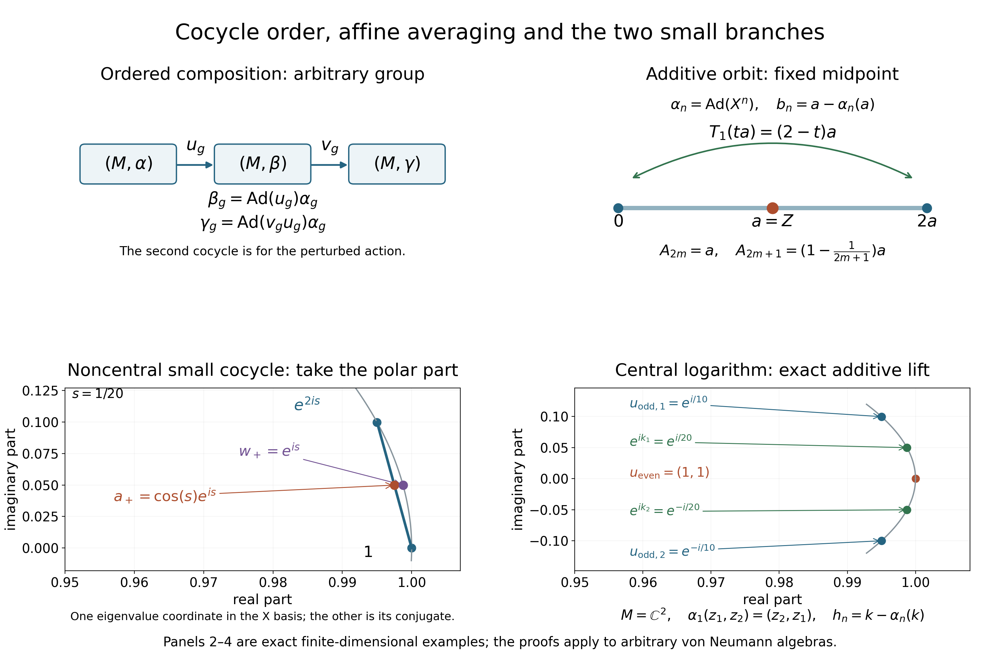

# Bounded additive cocycles and the small unitary branches

*Original proof exposition: GPT-6.1 Sol (OpenAI), Ultra, 2026-10-04. CC0-1.0 to the extent of rights held.*

We use the concrete predual [CP1–6](OA-FLOW-CP.md#oa-flow.cp.1), the compact-ball proof ST1, its first paragraph, and CF1, CF3, CF6–8. The bounded multiplication and cocycle conventions are proved in the earlier [UC0–1](OA-FLOW-UC.md#oa-flow.uc.0). No modular weight, faithful state, countability or invariant mean is assumed.

## AC0. Compact convex sets in the needed topology

Let $E$ be a complex normed space and give $E^*$ the topology of pointwise convergence on $E$. This is Hausdorff: evaluations separate two different functionals. Addition, scalar multiplication, and each evaluation are continuous by their coordinate formulas. Real convex combinations refer to coefficients in $[0,1]$. Every closed ball of $E^*$ is compact: the proof embeds it in the product of the compact discs of the appropriate radii and imposes the closed linearity conditions. The arbitrary product compactness and its choice input are proved in CF4 and CF1, respectively; ST1 carries out exactly this argument. For $M=(M_*)^*$ from CP6, this topology is the ultraweak topology. No other choice of an abstract predual is being identified here.

We shall use the following elementary consequence of compactness. A collection of closed subsets of a compact set whose every finite intersection is nonempty has a common point. Otherwise their open complements would cover the compact set and a finite subcover would contradict the finite-intersection property. A closed subset of a compact Hausdorff space is compact. In particular the closure of a subset of a fixed compact set remains inside that set. These facts require no sequential compactness.

## AC1. The commuting affine fixed-point theorem, proved locally

**Theorem.** Let $K$ be a nonempty compact convex subset of $E^*$ with its pointwise topology. Every pairwise commuting family of continuous real-affine self-maps of $K$ has a common fixed point.

First take a single such map $T$ and $x\in K$. The averages

\[
 a_n=\frac1n\sum_{j=0}^{n-1}T^j(x)\in K,
 \qquad T(a_n)-a_n=\frac{T^n(x)-x}{n}
 \tag{AC1}
\]
are valid because $T$ preserves finite convex combinations. For each $f\in E$, the continuous evaluation $y\mapsto y(f)$ is bounded on $K$: its compact image in $\mathbb C$ is bounded by finite-dimensional compactness. Thus $(T(a_n)-a_n)(f)\to0$.

The nonempty closed sets $C_N=\overline{\{a_n:n\ge N\}}^{\,K}$ are decreasing, so AC0 gives $a\in\bigcap_N C_N$. For any $f$ and $\varepsilon>0$, the tail averages eventually belong to the closed set
\[
 \{y\in K: |(T(y)-y)(f)|\le\varepsilon\}.
\]
Continuity of $T$ and evaluation makes this set closed, so it contains some $C_N$ and hence $a$. Let $\varepsilon\downarrow0$. Evaluations separate points, giving $T(a)=a$. The fixed-point set of $T$ is consequently nonempty, closed, compact and convex; convexity again follows from affinity.

For a finite commuting family $T_1,\ldots,T_m$, proceed by induction. The already obtained common fixed-point set for $T_1,\ldots,T_{m-1}$ is nonempty compact convex. Commutation makes it invariant under $T_m$: if $T_j y=y$, then $T_j T_m y=T_m T_j y=T_m y$. The single-map argument applied there supplies a common fixed point for all $m$. Finally the closed sets $\operatorname{Fix}(T)$ have the finite-intersection property, and AC0 gives a point fixed by the entire family. No group, inverses, separability, sequence of maps or surjectivity is required by this theorem. Commutation is required.

## AC2. Every bounded additive cocycle for an abelian action is a coboundary

Let $G$ be an arbitrary locally compact abelian group, written multiplicatively. Let $\alpha$ act normally on an arbitrary von Neumann algebra $M$, with the pointwise continuity convention of UC0. Suppose a map $b:G\to M$ satisfies

\[
 b_{gh}=b_g+\alpha_g(b_h),\qquad
 R=\sup_{g\in G}\|b_g\|<\infty.
 \tag{AC2}
\]
No continuity of $b$ is needed for the existence assertion. Define $T_g(x)=\alpha_g(x)+b_g$. These are ultraweakly continuous affine bijections, and (AC2) gives

\[
 T_gT_h=T_{gh},\qquad T_g(b_h)=b_{gh}.
 \tag{AC3}
\]
In particular they commute, since $G$ is abelian. Also $b_e=0$ and $T_e=\mathrm{id}$, while $T_{g^{-1}}$ is the inverse of $T_g$.

Let $K$ be the ultraweak closure of the real convex hull of $\{b_g:g\in G\}$. It is nonempty, convex and contained in the radius-$R$ ball, whose ultraweak compactness is AC0. To check convexity after closure, fix $t\in[0,1]$; continuity of $(x,y)\mapsto tx+(1-t)y$ carries limits of convex combinations back into the closed set. Each $T_g$ sends the orbit onto itself by (AC3), preserves its convex hull by affinity, and sends its closure onto itself by continuity of $T_g$ and its inverse. AC1 therefore gives $a\in K$ with

\[
 b_g=a-\alpha_g(a)\quad(g\in G),\qquad \|a\|\le R.
 \tag{AC4}
\]
The norm bound follows because the dual ball is ultraweakly closed. If $R=0$, then $b=0$ and $a=0$ is a choice; the proof includes this case and the zero algebra.

If the orbit lies in an ultraweakly closed real-linear $\alpha$-invariant subspace $X$, then $K\subseteq X$ and $a$ can be chosen in $X$. In particular self-adjoint cocycles admit self-adjoint $a$, and central self-adjoint cocycles admit $a\in Z(M)_{\mathrm{sa}}$. The self-adjoint subspace is ultraweakly closed by the involution test in UC0. The centre is ultraweakly closed because for each fixed $y$, the equation $xy=yx$ is closed by UC0, and arbitrary intersections of closed sets are closed.

If $a'$ is another solution, (AC4) gives $a-a'\in M^\alpha$; conversely adding any fixed element to a solution gives another. If $\alpha$ is pointwise strong* continuous, (AC4) proves that $b$ is strong* continuous automatically. The existence proof actually works for an abstract abelian group of normal automorphisms, because it uses no topology of $G$. No conclusion for general nonabelian affine actions is inferred.

## AC3. A uniformly small given unitary cocycle

Let $G$ still be abelian, and let $u$ be a given unitary $\alpha$-cocycle. If

\[
 \delta=\sup_{g\in G}\|u_g-1\|<1,
 \tag{AC5}
\]
then it is a unitary coboundary: there is $w\in\mathcal U(M)$ such that

\[
 u_g=w\alpha_g(w^*)\quad(g\in G),\qquad
 \|w-1\|\le2\delta.
 \tag{AC6}
\]
This conclusion does not assume that $u_g$ is central.

For the proof put $L_g(x)=u_g\alpha_g(x)$. UC0 proves ultraweak continuity. The cocycle law gives $L_gL_h=L_{gh}$, so these linear maps commute. The ultraweak closed convex hull $K$ of $\{u_h:h\in G\}$ is compact and invariant, by the same orbit-hull argument as AC2. It lies in the closed ball $\|x-1\|\le\delta$, which is a translate of an ultraweakly compact dual ball. AC1 gives $a\in K$ with $u_g\alpha_g(a)=a$ and $\|a-1\|\le\delta$. The geometric series in $1-a$ proves that $a$ is invertible.

Set $q=(a^*a)^{1/2}$ and $w=aq^{-1}$. CF6–8 give the positive root, its inverse and $w^*w=1$. Invertibility of $a$ and $q$ makes $w$ invertible too, so $ww^*=1$. From $\alpha_g(a)=u_g^*a$ we get $\alpha_g(a^*a)=a^*a$, and uniqueness of the positive square root gives $\alpha_g(q)=q$. Hence $u_g\alpha_g(w)=w$, proving (AC6).

For the stated bound, $\|a-1\|\le\delta$ gives
\[
 (1-\delta)\|\xi\|\le\|a\xi\|\le(1+\delta)\|\xi\|.
\]
The concrete positivity criterion in CF8 puts the spectrum of $a^*a$ in $[(1-\delta)^2,(1+\delta)^2]$. The scalar square root in CF6 therefore puts the spectrum of $q$ in $[1-\delta,1+\delta]$, giving $\|q-1\|\le\delta$. Since $a=wq$, it follows that $\|a-w\|=\|q-1\|\le\delta$, and the triangle inequality gives $\|w-1\|\le2\delta$. This uses comparison with scalar multiples of the identity, not an unproved general operator-monotonicity theorem. If all $u_g$ are central, the hull, $a$, $q$ and $w$ are central. A logarithmic additive lift is a further assertion, proved with an explicit bound next.

## AC4. The central logarithm branch, with its exact hypotheses

Assume that the given cocycle takes values in $\mathcal U(Z(M))$ and that

\[
 \delta=\sup_g\|u_g-1\|<\frac14,
 \qquad r=\frac{\delta}{1-\delta}<\frac13.
 \tag{AC7}
\]
Define by a uniformly norm-convergent series

\[
 h_g=-i\sum_{n=1}^{\infty}\frac{(-1)^{n+1}}{n}(u_g-1)^n.
 \tag{AC8}
\]
Then $h_g\in Z(M)_{\mathrm{sa}}$, $\|h_g\|\le r$, $u_g=e^{ih_g}$, and

\[
 h_{gh}=h_g+\alpha_g(h_h).
 \tag{AC9}
\]
Thus AC2 supplies $k\in Z(M)_{\mathrm{sa}}$, $\|k\|\le r$, with

\[
 h_g=k-\alpha_g(k),\qquad
 u_g=e^{ik}\alpha_g(e^{-ik}),\qquad
 \|e^{ik}-1\|\le r.
 \tag{AC10}
\]
No logarithm for an arbitrary central cocycle is assumed.

Here are the scalar and algebra checks. For $|z|\le\delta$ put $\ell(z)=\sum_{n\ge1}(-1)^{n+1}z^n/n$. For $0\le t\le1$, uniform convergence of the derivative series gives $\frac{d}{dt}\ell(tz)=z/(1+tz)$. Differentiating $e^{\ell(tz)}/(1+tz)$ gives zero, so CF1's fundamental theorem, or its proved scalar mean value consequence, gives $e^{\ell(z)}=1+z$. The series bound is $|\ell(z)|\le\sum_{n\ge1}|z|^n\le r$. If $|1+z|=1$, then $e^{\operatorname{Re}\ell(z)}=1$, whence $\operatorname{Re}\ell(z)=0$ by strict monotonicity of the real exponential. That monotonicity follows from its positive derivative and CF1's scalar mean value theorem; positivity follows from $e^t=(e^{t/2})^2\ne0$ and the exponential product identity in CF1.

Apply this continuous scalar identity through CF6 to the normal unitary $u_g$. It proves self-adjointness of $h_g$, $e^{ih_g}=u_g$ and the bound. Its centrality follows either from the series or the commutation conclusion of CF6. Automorphisms preserve the series and the exponential.

Because the values of $h$ are central, $h_g$, $\alpha_g(h_h)$ and $h_{gh}$ commute. CF1's product identity for commuting exponentials gives $e^{id}=1$, where
\[
 d=h_{gh}-h_g-\alpha_g(h_h),\qquad \|d\|\le3r<1.
\]
There is no integer-branch ambiguity in this norm range. Indeed, for any algebra element with $\|d\|\le1$,

\[
 \|e^{id}-1-id\|
 \le\sum_{n\ge2}\frac{\|d\|^n}{n!}
 \le(e-2)\|d\|<\|d\|\quad\hbox{if }d\ne0.
 \tag{AC11}
\]
The last strict inequality uses $e=\sum_{n\ge0}1/n!<3$: for $n\ge2$, $n!\ge2^{n-1}$ and the inequality is strict from $n=3$ onward. If $e^{id}=1$, (AC11) contradicts $\|id\|=\|d\|$ unless $d=0$. This proves (AC9). The same argument proves uniqueness of a self-adjoint logarithm of norm at most $r$: any competing $j$ commutes with $u_g=e^{ij}$, hence with the series defining $h_g$; the difference has norm at most $2r<1$ and exponential one.

The series in (AC8) also proves strong* continuity of $h$ whenever $u$ is strong* continuous. Finite polynomials are continuous by UC0; the uniform norm tails are uniformly small in each strong* seminorm. Finally $t\mapsto e^{itk}$ has derivative $ik e^{itk}$ by CF3, and its unitaries have norm one. CF1's norm integral yields $\|e^{ik}-1\|\le\|k\|$, completing (AC10). For a normal abelian action, any central cocycle already supplied with a bounded self-adjoint additive lift has the same conclusion by AC2 even without (AC7); the existence of such a lift is then an explicit hypothesis.

## AC5. Three exact examples

**An additive orbit hull.** On $M_2(\mathbb C)$ let $\alpha_n=\operatorname{Ad}(X^n)$ for the matrix $X$ in (UC9), and put $a=Z$. Then $\alpha_n(a)=(-1)^n a$, and $b_n=a-\alpha_n(a)$ is zero for even $n$ and $2a$ for odd $n$. The hull is the segment $\{ta:0\le t\le2\}$. Its odd affine action sends $ta$ to $(2-t)a$, fixing the midpoint $a$. The orbit norm bound is $R=2$, and the constructed solution has norm one. Even averages of the orbit equal $a$ exactly; odd averages differ from it by $a/n$ in norm.

**A noncentral small unitary cocycle.** Let $\alpha_n=\operatorname{Ad}(Z^n)$ and $w=e^{isX}$, with $0<s<1/10$. Since $X^2=I$, separating the even and odd terms in the exponential gives $w=\cos(s)I+i\sin(s)X$. Put $u_n=w\alpha_n(w^*)$. Even values are $I$; odd values are $w^2=e^{2isX}$. Its uniform distance from $I$ is $\delta=2\sin(s)<1$, by the eigenvalues $e^{\pm2is}$ and CF6. The fixed hull point is $a=(I+w^2)/2=\cos(s)w$. Its positive polar modulus is $\cos(s)I$, so the polar unitary is exactly $w$. Thus AC3 genuinely treats a noncentral cocycle. The example does not turn the noncentral logarithm into an additive cocycle.

**A central additive logarithm.** On $M=\mathbb C^2$, let the generator of $\mathbb Z$ interchange the two coordinates. With $k=(1/20,-1/20)$, put $h_n=k-\alpha_n(k)$ and $u_n=e^{ih_n}$. The even values are $(0,0)$ and $(1,1)$, respectively; the odd values are $(1/10,-1/10)$ and $(e^{i/10},e^{-i/10})$. Hence $\delta=2\sin(1/20)<1/10<1/4$. The logarithm (AC8) is precisely $h$, by its uniqueness proof. AC10 uses $e^{ik}$; here $\|k\|=1/20$. All trigonometric identities in these examples follow by regrouping the absolutely convergent scalar exponential series, as in CF1. For $0<t<1/10$, the terms in the sine and cosine series decrease in magnitude; grouping successive positive and negative terms, and comparing the even and odd partial sums, gives $0<\sin(t)<t$ and $1-t^2/2<\cos(t)<1$. These inequalities prove every positivity and strict smallness assertion used in the examples. No spectral or modular theorem is being invoked.

## AC6. Exercises with solutions and the scope boundary

**Exercise 1.** If $\alpha$ is the trivial abelian action, show that a bounded additive cocycle is zero. **Solution.** For fixed $g$, induction gives $b_{g^n}=n b_g$. Uniform boundedness forces $b_g=0$. Alternatively (AC4) gives $b_g=a-a=0$. This holds also when $g$ has finite order.

**Exercise 2.** A central given unitary cocycle for the trivial action need not be a coboundary. Give an example and explain its compatibility with AC3–4. **Solution.** On $M=\mathbb C$ with $G=\mathbb Z$, take $u_n=(-1)^n$. It satisfies (UC4). Every coboundary for the trivial action is identically one, so this cocycle is not a coboundary. Its uniform distance from one is two, and it fails both smallness hypotheses. A pointwise choice of arguments need not satisfy the additive law.

**Exercise 3.** If $b$ is self-adjoint and $a$ is any solution of (AC4), produce a self-adjoint solution without changing the identity. **Solution.** Taking adjoints gives $b_g=a^*-\alpha_g(a^*)$. Average the two identities: $(a+a^*)/2$ is a self-adjoint solution. The hull proof additionally provides its norm bound and any specified ultraweakly closed invariant subspace constraint.

**Exercise 4.** Why does AC1 not prove the bounded additive theorem for every nonabelian group? **Solution.** Formula (AC3) gives $T_gT_h=T_{gh}$; it gives $T_hT_g=T_{hg}$. Commutation of the affine maps is not supplied when $gh\ne hg$. The finite common-fixed-set induction therefore has no such hypothesis in general. The nonabelian algebra of UC1–4 stays valid independently of this fixed-point argument.

The commuting affine fixed-point theorem has free primary ancestry in [Kakutani, *Two Fixed-point Theorems Concerning Bicompact Convex Sets*, Theorem 1, printed 242](https://www.jstage.jst.go.jp/article/pjab1912/14/7/14_7_242/_pdf/-char/en#page=1). AC1 supplies the complete proof needed here, including every compactness passage. The conclusions above concern given cocycles and bounded additive cocycles for abelian actions. They assert no arbitrary modular cocycle realization, nonabelian fixed-point theorem, suspension/disintegration theorem or full cohomology-programme closure.

## The order and the two fixed-point mechanisms

The upper left diagram states the algebra proved in [UC1–2](OA-FLOW-UC.md#oa-flow.uc.1). Starting with a given $\alpha$-cocycle $u$, the first arrow gives $\beta_g=\operatorname{Ad}(u_g)\alpha_g$. The second arrow uses a cocycle $v$ for that $\beta$, and the composite is $v_g u_g$. The diagram keeps the order of these operator factors; it applies to an arbitrary group and is not a drawing of a fixed-point argument for a nonabelian group. Continuity and normality of each displayed action are proved in UC0–2.

The upper right panel is the first exact example in [AC5](OA-FLOW-AC.md#oa-flow.ac.5). Here $M=M_2(\mathbb C)$, $X=\begin{pmatrix}0&1\\1&0\end{pmatrix}$, $Z=\operatorname{diag}(1,-1)$, $a=Z$ and $\alpha_n=\operatorname{Ad}(X^n)$. The cocycle $b_n=a-\alpha_n(a)$ has orbit $\{0,2a\}$. Its ultraweak closed convex hull is the segment $\{ta:0\le t\le2\}$, and the odd affine map is $T_1(ta)=(2-t)a$. The fixed midpoint is $a$. For averages starting at the orbit value $b_0=0$, $A_{2m}=a$ when $m\ge1$, and $A_{2m+1}=(1-1/(2m+1))a$ when $m\ge0$. This panel illustrates both the telescoping average in [AC1](OA-FLOW-AC.md#oa-flow.ac.1) and the actual orbit-hull construction in [AC2](OA-FLOW-AC.md#oa-flow.ac.2). It does not replace the compactness proof for arbitrary $M$.

The lower left panel is the noncentral small-cocycle example in AC5 at the exact parameter $s=1/20$. Now $\alpha_n=\operatorname{Ad}(Z^n)$ and $w=e^{isX}$. Even cocycle values are $I$ and odd values are $w^2=e^{2isX}$. In the basis diagonalizing $X$, the displayed positive eigenvalue coordinate of these two matrices is $1$ and $e^{2is}$; the other coordinate is its complex conjugate. The segment between those displayed coordinates is the corresponding coordinate of the matrix convex hull. Its midpoint is
\[
 a_+=\frac{1+e^{2is}}2=\cos(s)e^{is}.
\]
For the full matrix, $a=(I+w^2)/2=\cos(s)w$, the modulus is $|a|=\cos(s)I$, and the polar unitary is $w$. The purple point $e^{is}$ is therefore the polar coordinate, rather than the midpoint itself. The exact uniform cocycle bound is $\delta=2\sin(s)<1$, so [AC3](OA-FLOW-AC.md#oa-flow.ac.3) applies. The panel preserves the distinction between a noncentral polar coboundary proof and a central additive logarithm proof.

The lower right panel is the central example in AC5. Here $M=\mathbb C^2$, the generator interchanges the coordinates, and $k=(1/20,-1/20)$. The two green points are the coordinates of $e^{ik}$; the two blue points are the coordinates of $u_{\mathrm{odd}}=(e^{i/10},e^{-i/10})$. The red point represents both equal coordinates of $u_{\mathrm{even}}=(1,1)$. The exact lift is $h_n=k-\alpha_n(k)$, so its odd value is $(1/10,-1/10)$ and its even value is zero. Its uniform unitary distance is $2\sin(1/20)<1/10<1/4$, exactly within [AC4](OA-FLOW-AC.md#oa-flow.ac.4). AC4 proves the canonical logarithm and the additive identity locally; the picture does not assume that arbitrary choices of unitary arguments satisfy a cocycle law.

Panels 2–4 are finite-dimensional explanatory examples. The proofs retain arbitrary Hilbert spaces and arbitrary von Neumann algebras, and the fixed-point conclusions retain the abelian group hypothesis. The plotted arcs use numerical coordinate samples; their rational parameters, matrices, maps and stated norm formulas are exact.

Native dimensions: $3200\times2100$ pixels. Original illustration, [editable SVG](../assets/general-action-cocycles/figures/cocycle-mechanisms.svg), [exact data](../assets/general-action-cocycles/figures/cocycle-mechanisms-data.json) and [reproduction source](../assets/general-action-cocycles/render_cocycle_mechanisms.py): CC0-1.0 to the extent of rights held. Human-source ancestry is the [free Connes Definition 2.2.3, printed 175](https://numdam.org/article/ASENS_1973_4_6_2_133_0.pdf#page=44), and the [free Kakutani Theorem 1, printed 242](https://www.jstage.jst.go.jp/article/pjab1912/14/7/14_7_242/_pdf/-char/en#page=1). The full local proofs accompany the illustration.
