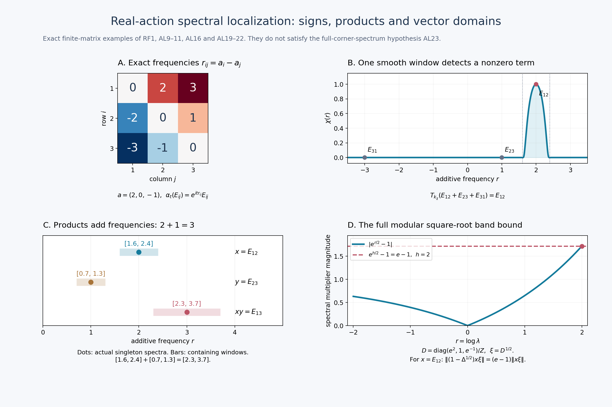

# Weak-star Arveson localization for real automorphism actions

*Fresh local proof, GPT-6 Astra (OpenAI), Ultra, 2026-10-04. CC0-1.0 to the extent of rights held.*

Let \(M\) be an arbitrary von Neumann algebra and \(\alpha:\mathbb R\to\operatorname{Aut}(M)\) a group of normal \(*\)-automorphisms such that \(t\mapsto\omega(\alpha_t(x))\) is continuous for every \(x\in M\), \(\omega\in M_*\). No norm continuity of \(\alpha\), separability of \(M_*\), faithful state, or countable Hilbert dimension is assumed unless stated in the separate GNS application.

The exact harmonic inputs are proved in [RF-1–5](OA-FLOW-RF.md#oa-flow.rf.1). Other actual local inputs are [CP-1–6](OA-FLOW-CP.md#oa-flow.cp.1) for the complete concrete predual and its dual, CF Section 1 for norm separation and vector integration, [SF-0/2](OA-FLOW-SF.md#oa-flow.sf.sf0) for Hilbert projections and bounded strong-to-ultraweak passage, and the actual GNS construction [GW-3/5](OA-FLOW-GW.md#oa-flow.gw.3) and [NF-5](OA-FLOW-NF.md#oa-flow.nf.5). The last section uses the already proved natural cone [NC/CR](OA-FLOW-CR.md#oa-flow.cr.1), MW, and the full [SF](OA-FLOW-SF.md#oa-flow.sf.sf1) spectral domains. The free primary route is [Connes (1973), printed pp.170–174](https://numdam.org/article/ASENS_1973_4_6_2_133_0.pdf#page=39); no theorem cited but omitted there is silently imported here.

Throughout \(\widehat f(r)=\int f(t)e^{itr}dt\), and \(k_\chi(t)=(2\pi)^{-1}\int\chi(r)e^{-itr}dr\). Thus characters are \(e^{itr}\), with positive additive spectral parameter \(r\).

Exact individual earlier proof locators: [OA-FLOW.CP.1](OA-FLOW-CP.md#oa-flow.cp.1), [OA-FLOW.CP.2](OA-FLOW-CP.md#oa-flow.cp.2), [OA-FLOW.CP.3](OA-FLOW-CP.md#oa-flow.cp.3), [OA-FLOW.CP.4](OA-FLOW-CP.md#oa-flow.cp.4), [OA-FLOW.CP.5](OA-FLOW-CP.md#oa-flow.cp.5), [OA-FLOW.CP.6](OA-FLOW-CP.md#oa-flow.cp.6), [OA-FLOW.GW.3](OA-FLOW-GW.md#oa-flow.gw.3), [OA-FLOW.GW.5](OA-FLOW-GW.md#oa-flow.gw.5), [OA-FLOW.NF.5](OA-FLOW-NF.md#oa-flow.nf.5), OA-FLOW.CF.1, [OA-FLOW.SF.SF0](OA-FLOW-SF.md#oa-flow.sf.sf0), [OA-FLOW.SF.SF2](OA-FLOW-SF.md#oa-flow.sf.sf2), [OA-FLOW.CR.3](OA-FLOW-CR.md#oa-flow.cr.3), [OA-FLOW.CR.4](OA-FLOW-CR.md#oa-flow.cr.4), [OA-FLOW.CR.8](OA-FLOW-CR.md#oa-flow.cr.8), [OA-FLOW.MC.1](OA-FLOW-MC.md#oa-flow.mc.1), OA-FLOW.MW.4.

## AL-1. Predual continuity and the actual normal filters

First the predual group \(S_t\omega=\omega\circ\alpha_t\) is norm continuous. Here is a proof rather than an extra continuity hypothesis. Its orbit is weakly continuous in the Banach space \(M_*\), since its dual is exactly \(M\). The norm-closed linear span of the orbit at rational times is separable and contains the whole orbit: otherwise norm separation gives a member of the dual vanishing on that span but not on one orbit value, contradicting continuity and density of the rationals. Denote this separable Banach subspace by \(E_\omega\).

The orbit is strongly measurable. Choose a countable dense set \((v_j)\) of \(E_\omega\). The functions \(t\mapsto\|S_t\omega-v_j\|\) are Borel measurable: each is the supremum of the continuous scalar functions \(|(S_t\omega-v_j)(x)|\), \(\|x\|\leq1\), hence is lower semicontinuous. Choose the first \(v_j\) within distance \(1/n\) at each point. The resulting measurable countably valued maps approximate the orbit in norm. On a finite-measure parameter set they can be truncated to finite-valued maps with arbitrarily small integral error; boundedness of the orbit and then scalar DCT justify this truncation. Multiplying by an \(L^1\) scalar and truncating its support and magnitude gives simple approximants in integral norm. Completeness of CP's Banach predual and the simple-integral norm inequality therefore construct

\[
 \omega_g=\int g(t)S_t\omega\,dt\in M_*,
 \qquad \|\omega_g\|\leq\|g\|_1\|\omega\| \quad(g\in L^1).
 \tag{AL1}
\]
This is the same elementary Banach integral construction as RF/FF, now with its measurability supplied explicitly.

Substitution gives \(S_s\omega_g=\omega_{g_s}\), where \(g_s(t)=g(t-s)\). Thus [RF-1](OA-FLOW-RF.md#oa-flow.rf.1)'s translation continuity proves that every \(\omega_g\) has a norm-continuous orbit. The subspace of all such vectors is norm closed, because every \(S_s\) is an isometry. For \(g_n=(n/2)1_{[-1/n,1/n]}\), \(\omega_{g_n}\to\omega\) weakly by the assumed scalar continuity. A norm-closed linear subspace is weakly closed by CF separation. Hence \(\omega\) lies in that subspace. This proves the claimed predual norm continuity on all of \(M_*\).

Define \(T_g:M\to M\) as the adjoint of \(\omega\mapsto\omega_g\). Then it is normal, has norm at most \(\|g\|_1\), and satisfies

\[
 \omega(T_gx)=\int g(t)\omega(\alpha_t(x))dt,\quad
 T_fT_g=T_{f*g},\quad
 \alpha_sT_gx=T_{g_s}x=T_g\alpha_sx.
 \tag{AL2}
\]
Normality permits passing the first integral through another filter; scalar interchange, bounded by \(\|\omega\|\|x\|\|f\|_1\|g\|_1\), proves the convolution identity.

In any faithful normal concrete realization, \(t\mapsto\alpha_t(x)\) is also strongly-star continuous. For each vector \(\xi\), expand

\[
 \|(\alpha_t(x)-x)\xi\|^2
 =\langle\alpha_t(x^*x)\xi,\xi\rangle+\|x\xi\|^2
   -2\operatorname{Re}\langle\alpha_t(x)\xi,x\xi\rangle.
 \tag{AL3}
\]
All coefficients are normal and continuous, so the expression tends to zero; apply the same argument to \(x^*\). Translating the parameter gives continuity at every point. Bounded strong-star products are strongly-star continuous by expanding a difference; their normal coefficients are continuous by SF-2's finite-head/series-tail proof.

The positive compact-frequency filters \(k_\varepsilon\) of [RF-3](OA-FLOW-RF.md#oa-flow.rf.3) satisfy

\[
 \|T_{k_\varepsilon}x\|\leq\|x\|,
 \qquad T_{k_\varepsilon}x\longrightarrow x
 \quad\hbox{strongly-star}.
 \tag{AL4}
\]
To see the strong assertion, evaluate on \(\xi\), use its continuous orbit, and split the probability integral into a small time interval and its tail. The tail bound is \(2\|x\|\|\xi\|\); its mass tends to zero. For adjoints the same probability kernel is real. These integrals on Hilbert vectors agree with the weak-star filter by equality of every vector coefficient. This establishes every topology used later.

## AL-2. The annihilator hull equals the smooth-filter support

Define the closed convolution ideals
\[
 I_x=\{g\in L^1:T_gx=0\},\qquad I_\alpha=\{g\in L^1:T_g=0\},
\]
and their hulls

\[
 \operatorname{Sp}_\alpha(x)=\bigcap_{g\in I_x}\{r:\widehat g(r)=0\},
 \qquad \operatorname{Sp}(\alpha)=\bigcap_{g\in I_\alpha}\{r:\widehat g(r)=0\}.
 \tag{AL5}
\]
The ideal property follows from ([AL2](OA-FLOW-AL.md#equation-al2)); closedness follows from its norm bound. This is exactly the annihilator-hull convention, not a substituted distribution definition.

Let \(E_x\) be the complement of the union of the open sets \(O\) such that \(T_{k_\chi}x=0\) for every \(\chi\in C_c^\infty(O)\). If \(r\notin\operatorname{Sp}_\alpha(x)\), choose \(g\in I_x\) with \(\widehat g(r)\ne0\). [RF-2](OA-FLOW-RF.md#oa-flow.rf.2) gives an interval \(V\ni r\) and \(k_\chi=g*h\) for every smooth \(\chi\) supported in \(V\). Then ([AL2](OA-FLOW-AL.md#equation-al2)) kills each such filter of \(x\), so \(r\notin E_x\). Conversely, if \(r\notin E_x\), choose one of its vanishing neighborhoods and a bump \(\chi\) therein with \(\chi(r)\ne0\). Then \(k_\chi\in I_x\) has nonzero transform at \(r\), so \(r\notin\operatorname{Sp}_\alpha(x)\). Thus

\[
 E_x=\operatorname{Sp}_\alpha(x).
 \tag{AL6}
\]
Moreover, if a compactly supported smooth \(\chi\) is supported outside \(E_x\), [RF-1](OA-FLOW-RF.md#oa-flow.rf.1)'s finite subordinate partition writes it as a finite sum of bumps lying in such vanishing neighborhoods. Hence its filter is zero. Consequently, for every closed \(E\subseteq\mathbb R\),

\[
 M(\alpha,E):=\{x:\operatorname{Sp}_\alpha(x)\subseteq E\}
 =\bigcap_{\chi\in C_c^\infty(\mathbb R\setminus E)}\ker T_{k_\chi}.
 \tag{AL7}
\]
For the reverse direction, the displayed kernels kill every bump in any interval disjoint from \(E\), and then ([AL6](OA-FLOW-AL.md#equation-al6)) applies. Since each filter is normal, \(M(\alpha,E)\) is an ultraweakly closed linear subspace.

If \(\operatorname{Sp}_\alpha(x)\) is empty, every smooth compact filter kills \(x\). Apply the filters \(k_n\) of [RF5](OA-FLOW-RF.md#equation-rf5): for each normal coefficient the bounded continuous scalar orbit converges to its value at zero after this filtering. Hence \(T_{k_n}x\to x\) ultraweakly, so \(x=0\). The converse is immediate. In particular every nonzero element has nonempty spectral support.

For completeness, the smooth-filter description also coincides with the usual distribution-support description if that terminology is used. For \(\omega\in M_*\), define
\(D_{x,\omega}(\chi)=\omega(T_{k_\chi}x)\).
On a fixed compact support \(K\), [RF2](OA-FLOW-RF.md#equation-rf2), splitting \(|t|\leq1\) and its complement, bounds this by a constant times \(\|\chi\|_\infty+\|\chi''\|_\infty\). Thus it is a distribution of order at most two on each compact set, with support defined by vanishing on all test functions in an open set. Normal functionals separate \(M\); ([AL6](OA-FLOW-AL.md#equation-al6)) says

\[
 \operatorname{Sp}_\alpha(x)
 =\overline{\bigcup_{\omega\in M_*}\operatorname{supp}D_{x,\omega}}.
 \tag{AL8}
\]
No distribution multiplication or spectral-synthesis theorem is needed in what follows.

## AL-3. Localization, translation, adjoints and restrictions

The exact filter inclusion is

\[
 \operatorname{Sp}_\alpha(T_fx)
 \subseteq\operatorname{Sp}_\alpha(x)\cap\operatorname{supp}\widehat f.
 \tag{AL9}
\]
The first inclusion follows from \(I_x\subseteq I_{T_fx}\). For the second, choose a bump \(\chi\) near any point outside \(\operatorname{supp}\widehat f\), with nonzero value at that point. The transform of \(f*k_\chi\) is zero, hence that convolution is zero by [RF-1](OA-FLOW-RF.md#oa-flow.rf.1); its filter kills \(x\). Thus \(k_\chi\in I_{T_fx}\), proving the assertion.

Time translation leaves the support unchanged:
\(\operatorname{Sp}_\alpha(\alpha_sx)=\operatorname{Sp}_\alpha(x)\), since all filters commute with the invertible \(\alpha_s\). Adjoint gives

\[
 \operatorname{Sp}_\alpha(x^*)=-\operatorname{Sp}_\alpha(x),
 \tag{AL10}
\]
because \(T_f(x^*)=(T_{\overline f}x)^*\) and [RF-1](OA-FLOW-RF.md#oa-flow.rf.1) computes the reflected conjugate transform. For the bounded representation \(\beta_t=e^{ict}\alpha_t\) on the underlying dual Banach space (not asserted to be an automorphism action), its same annihilator-hull construction gives

\[
 \operatorname{Sp}_\beta(x)=c+\operatorname{Sp}_\alpha(x).
 \tag{AL11}
\]
Indeed \(T_f^\beta=T_{e^{ict}f}^\alpha\), and \(\widehat{e^{ict}f}(r)=\widehat f(r+c)\). This states the frequency translation sign explicitly.

We will use the following **neighborhood**, rather than pointwise, multiplier rule. If \(x\in M(\alpha,E)\) and \(c+\widehat f\) vanishes on an open neighborhood \(O\supseteq E\), then

\[
 (cI+T_f)x=0.
 \tag{AL12}
\]
For any \(\chi\in C_c^\infty\), partition its support under the open cover \(O\cup(\mathbb R\setminus E)\). On pieces supported in \(O\), the \(L^1\) function \(c k_\chi+f*k_\chi\) has zero Fourier transform and hence vanishes. On pieces outside \(E\), ([AL7](OA-FLOW-AL.md#equation-al7)) kills the filter of \(x\). Commutation of filters therefore shows that every compact smooth filter kills \((cI+T_f)x\), which is zero by [AL-2](OA-FLOW-AL.md#oa-flow.al.2). In particular if \(\widehat f=1\) near \(E\), then \(T_fx=x\). No assertion that mere vanishing on an arbitrary closed \(E\) suffices is made or used.

If \(a,b\in M\) are fixed by \(\alpha\), normal multiplication and the defining integral give

\[
 T_f(axb)=a(T_fx)b,
 \qquad \operatorname{Sp}_\alpha(axb)\subseteq\operatorname{Sp}_\alpha(x).
 \tag{AL13}
\]
For invariant projections \(e,f\), this gives the exact invariant bimodule \(fMe\). Its inherited action, weak-star topology and filters have the same elementwise annihilator ideals as the ambient action, since the elements and the integrals are identical. In particular the restricted action on \(pMp\), for any invariant projection \(p\), has

\[
 (pMp)(\alpha|_{pMp},E)=M(\alpha,E)\cap pMp.
 \tag{AL14}
\]
There is no requirement that \(e=f\), that they be central, or that the restricted action have full spectrum.

The action spectrum has the exact local detection property

\[
 \operatorname{Sp}(\alpha)
 =\overline{\bigcup_{x\in M}\operatorname{Sp}_\alpha(x)}.
 \tag{AL15}
\]
One inclusion follows from \(I_\alpha\subseteq I_x\). For the other, if an open interval misses all elementwise spectra, every smooth compact bump there kills every \(x\), by ([AL7](OA-FLOW-AL.md#equation-al7)). A bump nonzero at its chosen point belongs to \(I_\alpha\), excluding that point from its hull. Thus every \(r\in\operatorname{Sp}(\alpha)\) and every neighborhood \(O\ni r\) admit a nonzero element in \(M(\alpha,\operatorname{supp}\chi)\), for some \(\chi\in C_c^\infty(O)\): take \(\chi(r)\ne0\), so \(T_{k_\chi}\ne0\), and apply it to an element on which it is nonzero. Likewise for a fixed nonzero \(x\) and \(r\in\operatorname{Sp}_\alpha(x)\), the same bump has \(T_{k_\chi}x\ne0\).

An explicit smooth-partition detection statement is also available. For any open cover of \(\mathbb R\), partition each \(\chi(r/n)\) from [RF5](OA-FLOW-RF.md#equation-rf5) under a finite subcover of its compact support. The finitely many resulting smooth filters lie in the specified open sets, and their sum is exactly \(T_{k_n}x\to x\) ultraweakly. Therefore these local filters detect every nonzero \(x\), including an element of an invariant bimodule. This justifies the partition formulation without a hidden infinite Fourier synthesis argument.

## AL-4. The complete algebra product-support rule

For closed \(E,F\subseteq\mathbb R\),

\[
 M(\alpha,E)M(\alpha,F)
 \subseteq M(\alpha,\overline{E+F}).
 \tag{AL16}
\]
First let \(E,F\) be compact and \(x,y\) belong to the two spectral subspaces. If either set is empty the corresponding element is zero, so suppose both are nonempty. To test ([AL7](OA-FLOW-AL.md#equation-al7)), take \(\rho\in C_c^\infty\) supported outside \(E+F\), and put \(h=k_\rho\). The compact disjoint sets have positive distance. Choose smooth \(\phi,\psi\), equal to one near \(E,F\), with compact supports in sufficiently small neighborhoods that
\(\operatorname{supp}\rho\cap(\operatorname{supp}\phi+\operatorname{supp}\psi)=\varnothing\).
Put \(f=k_\phi\), \(g=k_\psi\). By ([AL12](OA-FLOW-AL.md#equation-al12)), \(x=T_fx\), \(y=T_gy\).

For every normal \(\omega\), the two reproducing integrals and then the \(h\) filter yield

\[
 \omega(T_h(xy))
 =\iiint h(t)f(s)g(u)
   \omega\bigl(\alpha_{t+s}(x)\alpha_{t+u}(y)\bigr)\,dt\,ds\,du.
 \tag{AL17}
\]
Multiplication by a fixed bounded element is normal, so each successive weak-star integral is legitimate. Its full absolute scalar bound is
\(\|\omega\|\|x\|\|y\|\|h\|_1\|f\|_1\|g\|_1\).
The integrand is jointly measurable, indeed its operator coefficient is continuous by ([AL3](OA-FLOW-AL.md#equation-al3)) and bounded strong-star multiplication. Thus the proved scalar interchange applies.

Set \(v=t+s\), \(w=u-s\). This change can be performed as successive one-dimensional translations under the absolute integrals; no higher-dimensional change-of-variables theorem is imported. Equation ([AL17](OA-FLOW-AL.md#equation-al17)) becomes

\[
 \iint K(v,w)\omega\bigl(\alpha_v(x)\alpha_{v+w}(y)\bigr)\,dv\,dw,
 \quad
 K(v,w)=\int h(t)f(v-t)g(v+w-t)dt.
 \tag{AL18}
\]
[RF-4](OA-FLOW-RF.md#oa-flow.rf.4) proves that this \(K\) vanishes almost everywhere: for each \(w\), the Fourier transform of \(f(v)g(v+w)\) is supported in \(\operatorname{supp}\phi+\operatorname{supp}\psi\), disjoint from \(\operatorname{supp}\widehat h\), and the complete integrability/uniqueness passage is proved there. Hence \(T_h(xy)=0\). Since every such \(\rho\) was allowed, ([AL7](OA-FLOW-AL.md#equation-al7)) proves the compact case.

For arbitrary closed \(E,F\), put \(x_\varepsilon=T_{k_\varepsilon}x\), \(y_\varepsilon=T_{k_\varepsilon}y\) using the positive filters of [RF6](OA-FLOW-RF.md#equation-rf6). Their supports lie in the compact sets
\(E\cap\operatorname{supp}\widehat{k_\varepsilon}\) and \(F\cap\operatorname{supp}\widehat{k_\varepsilon}\), by ([AL9](OA-FLOW-AL.md#equation-al9)). The compact case puts each product in \(M(\alpha,\overline{E+F})\). Equation ([AL4](OA-FLOW-AL.md#equation-al4)) gives uniform norm bounds and strong-star convergence; expanding the product difference gives \(x_\varepsilon y_\varepsilon\to xy\) strongly-star. Bounded concrete strong convergence implies ultraweak convergence by SF-2. The spectral subspace is ultraweakly closed by ([AL7](OA-FLOW-AL.md#equation-al7)), proving ([AL16](OA-FLOW-AL.md#equation-al16)) in full.

The closure in ([AL16](OA-FLOW-AL.md#equation-al16)) is retained for arbitrary unbounded closed sets. This argument uses neighborhood reproduction and compact cutoff approximation, not synthesis on \(E\) or \(F\).

## AL-5. Exact vector support for a faithful finite invariant GNS implementation

Assume now that \(\varphi\) is a faithful finite normal positive functional on \(M\), invariant under \(\alpha\). On its GNS space put \(\Omega=\Lambda(1)\) and
\(U_t\Lambda(x)=\Lambda(\alpha_t(x))\).
Invariance proves these are isometries with inverse \(U_{-t}\); hence they extend to unitaries. On the dense set \(M\Omega\), the expansion
\[
 \|U_t\Lambda(x)-\Lambda(x)\|^2
 =2\varphi(x^*x)-2\operatorname{Re}\varphi(x^*\alpha_t(x))
\]
proves continuity. Uniform unitarity extends it to every vector. Also \(U_t\Omega=\Omega\) and \(U_t\pi(a)U_t^*=\pi(\alpha_t(a))\) on a dense core and hence everywhere. [RF-5](OA-FLOW-RF.md#oa-flow.rf.5) supplies the complete self-adjoint generator \(A\), with \(U_t=e^{itA}\), without a Stone theorem import.

Let \(\mu_{x\Omega}^A\) be the scalar spectral measure of \(A\) at \(x\Omega\). All GNS coefficients are normal by [NF-5](OA-FLOW-NF.md#oa-flow.nf.5), so comparison of every Hilbert matrix coefficient of the integrals gives

\[
 (T_fx)\Omega=\widehat f(A)x\Omega\qquad(f\in L^1).
 \tag{AL19}
\]
For every closed \(E\subseteq\mathbb R\),

\[
 x\in M(\alpha,E)
 \quad\Longleftrightarrow\quad
 \mu_{x\Omega}^A(\mathbb R\setminus E)=0.
 \tag{AL20}
\]
In the forward direction every smooth compact \(\chi\) outside \(E\) gives \(\chi(A)x\Omega=0\). Exhaust the open complement by compact sets
\(K_n=\{r:|r|\leq n,\ d(r,E)\geq1/n\}\); for empty \(E\) use \([-n,n]\). Choose a smooth cutoff equal to one near \(K_n\) and supported outside \(E\). Its zero squared spectral norm gives \(\mu(K_n)=0\); monotone convergence proves the claim. Conversely spectral support in \(E\) makes every such \(\chi(A)x\Omega\) zero. By ([AL19](OA-FLOW-AL.md#equation-al19)), \((T_{k_\chi}x)\Omega=0\). Faithfulness of \(\varphi\) says \(\|a\Omega\|^2=\varphi(a^*a)=0\) implies \(a=0\). Thus all required filters kill \(x\), and ([AL7](OA-FLOW-AL.md#equation-al7)) applies. In particular the closed support of this vector spectral measure is exactly \(\operatorname{Sp}_\alpha(x)\).

If \(\alpha=\sigma^\varphi\), the existing full modular realization gives \(U_t=\Delta^{it}\), so [RF-5](OA-FLOW-RF.md#oa-flow.rf.5)'s uniqueness identifies \(A=\log\Delta\) with its SF domain. In any canonically transported standard form, [CR-4](OA-FLOW-CR.md#oa-flow.cr.4) and [MC-1](OA-FLOW-MC.md#oa-flow.mc.1) give the same identities at the cone representative \(\xi_\varphi\). Consequently

\[
 \operatorname{Sp}_\alpha(x)\subseteq[-h,h]
 \quad\Longrightarrow\quad
 x\xi_\varphi\in1_{[e^{-h},e^h]}(\Delta)H,
 \qquad
 \|(1-\Delta^{1/2})x\xi_\varphi\|
 \leq(e^{h/2}-1)\|x\xi_\varphi\|.
 \tag{AL21}
\]
All real-power domains are automatic on this compact positive spectral band. For a faithful finite functional, the full Tomita core is \(M\xi_\varphi\). Since \(J\xi_\varphi=\xi_\varphi\), its full polar identity gives
\(Jx^*J\xi_\varphi=\Delta^{1/2}x\xi_\varphi\).
Thus, with the consumer's definitions
\[
 I_\varphi(x)=\tfrac12\|x\xi_\varphi-Jx^*J\xi_\varphi\|^2,
 \qquad q_\varphi(x)^2=\varphi(x^*x+xx^*),
\]
we have the exact bound

\[
 I_\varphi(x)\leq\tfrac12(e^{h/2}-1)^2\|x\xi_\varphi\|^2
 \leq\tfrac12(e^{h/2}-1)^2q_\varphi(x)^2.
 \tag{AL22}
\]
This establishes the whole domain and sign passage used by the modular consumer; it is not only a formal spectral-filter notation.

## AL-6. The conditional spectral-corner bridge

Assume \(M\) is a factor and that every nonzero \(\alpha\)-invariant projection \(p\) satisfies

\[
 \operatorname{Sp}(\alpha|_{pMp})=\mathbb R.
 \tag{AL23}
\]
This is an explicit hypothesis. We do not derive it from a type designation, from \(S(M)\), or from an unproved identity involving the Connes spectrum.

Let \(e,f\) be nonzero invariant projections and \(h>0\). There is \(y_0\ne0\) in \(fMe\). Indeed the projection onto \(\overline{MeH}\) is central: its range reduces the unitaries of both \(M\) and \(M'\). Since it is nonzero, the factor assumption makes it \(1\). If \(fMe=0\), \(f\) annihilates that whole dense space, a contradiction.

[AL-2](OA-FLOW-AL.md#oa-flow.al.2)/3 gives a real \(r\) and \(0\ne y\in fMe\) with
\(\operatorname{Sp}_\alpha(y)\subseteq[r-h/4,r+h/4]\).
Take a compact smooth filter in the open interval with those endpoints, nonzero at a point of the nonempty support of \(y_0\); its invariant bimodule membership follows from ([AL13](OA-FLOW-AL.md#equation-al13)). Put

\[
 p=\bigvee_{t\in\mathbb R}s(\alpha_t(y)^*\alpha_t(y)).
 \tag{AL24}
\]
All these support projections lie below \(e\), their join is nonzero, and \(\alpha_s\) permutes the family and preserves its join. Thus \(p\) is nonzero and invariant. Hypothesis ([AL23](OA-FLOW-AL.md#equation-al23)), local action-spectrum detection and ([AL14](OA-FLOW-AL.md#equation-al14)) give
\(0\ne z\in pMp\) with \(\operatorname{Sp}_\alpha(z)\subseteq[-r-h/4,-r+h/4]\).
Some \(t\) has \(\alpha_t(y)z\ne0\). Otherwise \(zH\) is in the kernel of every \(\alpha_t(y)\), hence in the complementary range of their initial-support join; this gives \(pz=0\), contradicting \(pz=z\ne0\).

Set \(x=\alpha_t(y)z\). Then \(x\in fMe\setminus\{0\}\), and time translation plus ([AL16](OA-FLOW-AL.md#equation-al16)) gives

\[
 \operatorname{Sp}_\alpha(x)
 \subseteq[r-h/4,r+h/4]+[-r-h/4,-r+h/4]
 =[-h/2,h/2]\subseteq[-h,h].
 \tag{AL25}
\]
When \(\alpha=\sigma^\varphi\) for a faithful finite normal \(\varphi\), equations ([AL21](OA-FLOW-AL.md#equation-al21))–([AL22](OA-FLOW-AL.md#equation-al22)) apply, and \(\|x\xi_\varphi\|>0\) by faithfulness. No element or polar partial isometry constructed here is asserted to lie in the centralizer. The corner membership is \(fMe\), exactly as required.

This proves the real-action localization, product, support and conditional corner statements used in the specified homogeneity passage. It proves neither the general locally compact abelian version nor \(S(M)\cap(0,\infty)=\exp\Gamma(\sigma^\varphi)\), and does not by itself prove a type-classification or homogeneity theorem.

### Exact finite-matrix illustration of real-action localization

The native [PNG](../assets/arveson-real/assets/arveson-real.png), companion [SVG](../assets/arveson-real/assets/arveson-real.svg) and [renderer](../assets/arveson-real/render_arveson_real.py) illustrate [RF-1–4](OA-FLOW-RF.md#oa-flow.rf.1) and [AL-2–5](OA-FLOW-AL.md#oa-flow.al.2). The free primary human context is [Connes (1973), printed pp.170–174](https://numdam.org/article/ASENS_1973_4_6_2_133_0.pdf#page=39). Every displayed formula is proved below.

#### A. All matrix frequencies, with the exact sign

Let \(B=\operatorname{diag}(2,0,-1)\), and let \(\alpha_t(X)=e^{itB}Xe^{-itB}\) on \(M_3(\mathbb C)\). This is a norm-continuous, hence ultraweakly continuous, normal automorphism action. For the matrix unit \(E_{ij}\),
\[
 \alpha_t(E_{ij})=e^{it(a_i-a_j)}E_{ij},
 \qquad (a_1,a_2,a_3)=(2,0,-1).
\]
Therefore \(T_f(E_{ij})=\widehat f(a_i-a_j)E_{ij}\) with the proof's positive-sign transform. The annihilator hull of \(E_{ij}\) is exactly the singleton \(\{a_i-a_j\}\): every annihilator transform vanishes there, while a smooth bump supported away from that point supplies an annihilator nonzero at any other chosen point, by [RF-1](OA-FLOW-RF.md#oa-flow.rf.1). This proves all nine entries of the frequency heatmap. In particular adjoints reverse the sign: \(E_{12}^*=E_{21}\) has frequency \(-2\).

#### B. A fully specified smooth detecting window

Put \(s=(r-2)/(2/5)\), and define
\[
 \chi(r)=
 \begin{cases}
 \exp\!\left(1-\dfrac1{1-s^2}\right),&|s|<1,\\
 0,&|s|\geq1.
 \end{cases}
\]
[RF-1](OA-FLOW-RF.md#oa-flow.rf.1) proves smoothness and the integrable inverse filter \(k_\chi\). Its exact support is \([8/5,12/5]\), and \(\chi(2)=1\), \(\chi(1)=\chi(-3)=0\). Thus, for \(X_0=E_{12}+E_{23}+E_{31}\), direct application of panel A's formula gives
\[
 T_{k_\chi}(X_0)=E_{12}\ne0.
\]
The three marked heights are exact. The plotted curve is a numerical sample of this explicit smooth function; it is not a computed approximation to the general spectral-support theorem.

#### C. Exact support versus a containing window

Take \(x=E_{12}\), \(y=E_{23}\). Matrix multiplication gives \(xy=E_{13}\), with respective singleton supports \(\{2\},\{1\},\{3\}\). These are the three dots. The bars are the larger containing windows
\[
 E=[8/5,12/5],\qquad F=[7/10,13/10],\qquad
 E+F=[23/10,37/10].
\]
They display the [AL16](OA-FLOW-AL.md#equation-al16) inclusion and the addition of its interval endpoints. They are not eigenvalue continua, dimensions of eigenspaces, or exact supports of these matrix units.

#### D. The modular band bound is attained

Let \(Z=e^2+1+e^{-1}\), \(D=Z^{-1}\operatorname{diag}(e^2,1,e^{-1})\), and \(\varphi(X)=\operatorname{Tr}(DX)\). Positivity and invertibility of \(D\) make this a faithful normal state; cyclicity of the finite matrix trace gives invariance under \(\alpha\). The GNS Hilbert space is Hilbert–Schmidt matrices, with \(\Lambda(X)=XD^{1/2}\) and left multiplication. Indeed its squared norm is \(\operatorname{Tr}(DX^*X)\), and \(D^{1/2}\) is invertible, so the map is onto.

On this whole finite-dimensional space the Tomita operator is \(S(\eta)=D^{-1/2}\eta^*D^{1/2}\). Direct multiplication gives its polar data
\[
 J\eta=\eta^*,\qquad \Delta\eta=D\eta D^{-1},
 \qquad \Delta^{it}\eta=D^{it}\eta D^{-it}.
\]
Here \(J\Delta^{1/2}\eta=D^{-1/2}\eta^*D^{1/2}=S\eta\). The positive operator \(\Delta\) is diagonal on the orthonormal matrix-unit basis with eigenvalues \(d_i/d_j>0\), proving this is its polar decomposition and that all powers have the whole space as domain. Since \(D^{it}=Z^{-it}e^{itB}\), the implemented action is exactly the one in panel A. Its natural cone is the positive Hilbert–Schmidt matrices: [NC](OA-FLOW-NC.md#oa-flow.nc.3)'s generators are \(\Delta^{1/4}XD^{1/2}=D^{1/4}XD^{1/4}\), and invertibility of \(D^{1/4}\) carries the positive matrices onto themselves. Thus \(\xi=D^{1/2}\) is the canonical cone vector.

For \(x=E_{12}\), \(x\xi=Z^{-1/2}E_{12}\) has additive vector frequency \(2\) and \(\Delta\)-eigenvalue \(e^2\). Therefore
\[
 \|(1-\Delta^{1/2})x\xi\|=(e-1)\|x\xi\|,
 \qquad I_\varphi(x)=\frac{(e-1)^2}{2Z}.
\]
Panel D plots \(r\mapsto|e^{r/2}-1|\) on \([-2,2]\) and its exact maximum \(e-1\). For negative \(r\), \(1-e^{r/2}\leq1-e^{-1}<e-1\); for nonnegative \(r\), monotonicity gives the bound with equality at \(r=2\). This proves the drawn bound and its marked equality case, as in [AL21](OA-FLOW-AL.md#equation-al21)–22.

The action has finite spectrum \(\{0,\pm1,\pm2,\pm3\}\), and its invariant rank-one corner \(E_{11}M_3E_{11}\) has only frequency zero. Hence this example does **not** satisfy [AL23](OA-FLOW-AL.md#equation-al23)'s full-spectrum condition on every nonzero invariant corner. That conditional bridge remains proved in [AL-6](OA-FLOW-AL.md#oa-flow.al.6) under its explicit hypothesis; the figure does not suggest that finite matrices supply it.

The native \(2400\times1600\) PNG accompanies the [editable SVG](../assets/arveson-real/assets/arveson-real.svg) and [reproduction source](../assets/arveson-real/render_arveson_real.py). Local text and original figure: CC0-1.0 to the extent of rights held.

[Exact numerical checks](../assets/arveson-real/FIGURE_NUMERICAL_CHECKS.json) accompany the original native assets and reproduction source.
