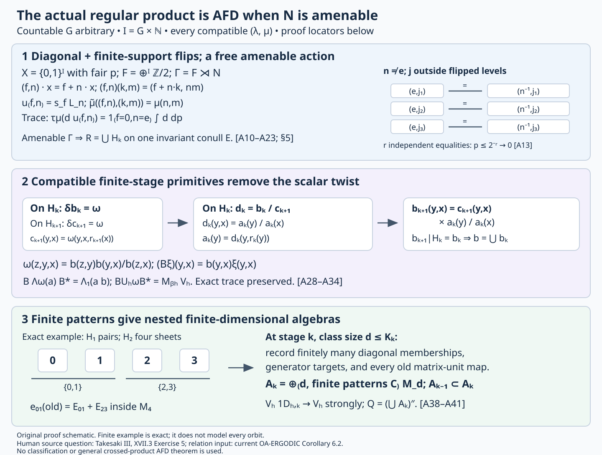

# Amenable regular products and prescribed inner kernels

*Original exposition, proofs and diagram: CC0-1.0 to the extent of rights held. Cited publications and existing components retain their own terms. Figure and reproducible source: component terms.*

The regular product constructed in [Twisted regular products and prescribed inner kernels](OA-FLOW-TRP.md) is approximately finite-dimensional whenever its prescribed normal subgroup is amenable. The ambient countable group can be nonamenable, and every normalized compatible scalar pair is allowed. We identify the actual tensor base with its diagonal and finite-support flips, verify the twisted regular representation, remove the relation cocycle by compatible finite-stage primitives, and construct increasing finite-dimensional algebras in the same product. Each comparison retains the original trace and the full ambient-group action, including its characteristic phases.

The finite-subgroup, trace, Fourier, factor, inner-kernel and characteristic-pair arguments of that lesson remain the inputs to this construction. The site set here is \(G\times\mathbb N_{>0}\). The separate [Bernoulli construction](OA-FLOW-NB.md) uses the site set \(G\) and every \(0<\lambda\leq1\). The arbitrary nonamenable-normal-subgroup realization problem remains a separate question. The present argument is tracial and asserts no type-III branch.

## 1. The exact regular product and the theorem

Let \(G\) be countable discrete, let \(N\triangleleft G\) be infinite and amenable, and let \((\lambda,\mu)\) be a normalized compatible pair. In the convention of [compatible lifts](OA-FLOW-CPP.md#cp-compatible), the functions \(\mu:N^2\to\mathbb T\) and \(\lambda:N\times G\to\mathbb T\) satisfy all five identities

\[
\begin{aligned}
\mu(a,b)\mu(ab,c)&=\mu(a,bc)\mu(b,c),\\
\lambda(a,gh)&=\lambda(a,g)\lambda(g^{-1}ag,h),\\
\frac{\lambda(a,g)\lambda(b,g)}{\lambda(ab,g)}
 &=\frac{\mu(g^{-1}ag,g^{-1}bg)}{\mu(a,b)},\\
\lambda(m,n)&=\frac{\mu(n,n^{-1}mn)}{\mu(m,n)},\\
\mu(e,a)=\mu(a,e)&=\lambda(e,g)=\lambda(a,e)=1.
\end{aligned}\tag{ARP0}
\]

Write \(I=G\times\mathbb N_{>0}\). At each site use \(M_2(\mathbb C)\) with its normalized trace. Let \((P,\tau)\) and \(\beta\) be the represented tensor factor and the left site action constructed in TRP Section 8: an observable at \((h,j)\) moves to \((gh,j)\).

Let \(M_\mu\) be the concrete regular product of TRP Sections 2–4, with original implementing unitaries \(L_n\), and let \(\alpha\) be the \(G\)-action of Sections 5–6. Thus

\[
L_nL_m=\mu(n,m)L_{nm},\qquad
L_n\pi(a)L_n^*=\pi(\beta_n(a)),
\tag{A1}
\]

\[
\alpha_g(\pi(a))=\pi(\beta_g(a)),\qquad
\alpha_g(L_n)=\lambda(gng^{-1},g)L_{gng^{-1}}.
\tag{A2}
\]

**Theorem.** There are increasing unital finite-dimensional star algebras \(A_k\subset M_\mu\) such that

\[
M_\mu=\left(\bigcup_k A_k\right)''.
\tag{A3}
\]

Consequently this actual regular construction realizes \([\lambda,\mu]\) on an AFD \(\mathrm{II}_1\) factor, with inner kernel exactly \(N\). No amenability hypothesis is imposed on \(G\). The proof also works for finite \(N\); TRP Section 9 gives its direct finite-subgroup proof. The proof of the theorem is completed in Section 7 below.

TRP Section 3 supplies the faithful normal tracial state \(\tau_\mu\), Section 6 proves factoriality and the entire inner kernel from the outer action, and Section 8 proves that \(P\) is infinite-dimensional and every \(\beta_g\), \(g\ne e\), is outer. The new conclusion needed here is (A3).

Our measured input is [Invariant means on measured relations](../../OA-ERGODIC/reader/invariant-means-on-measured-relations.html), Proposition 2.1, Theorem 6.1 and Corollary 6.2: the principal orbit relation of a countable amenable Borel nonsingular action has, on one invariant conull Borel unit space, an increasing exhaustion by Borel equivalence relations with a uniform finite class-size bound at each stage. Every orbit endpoint pair on that common space is captured. The retained foundations are standard Borel injection and one-to-one Borel images, Radon–Nikodym theory and change of variables, \(L^\infty/L^1\) duality, Hahn–Banach, weak-star compactness, Tonelli and finite-measure continuity. We also retain elementary countable product probability, cylinder conditional expectations, monotone-class density and dominated convergence. Section 8 gives the exact proof locators and their roles.

The direct finite-pattern argument of Section 7 requires neither dyadic balancing and coding nor a general crossed-product AFD theorem or factor-classification theorem. A uniform bound on finite relation-class sizes alone does not make its diagonal algebra finite-dimensional.

## 2. The tensor diagonal and finite-support flips

Put \(X=\{0,1\}^I\) with fair product probability \(p\). After enumerating \(I\), this is compact metrizable with its product Borel structure, hence standard Borel. Each point has measure zero: specifying its first \(q\) bits has probability \(2^{-q}\). Let

\[
F=\bigoplus_{i\in I}\mathbb Z/2\mathbb Z.
\tag{A4}
\]

An element \(f\in F\) is a finitely supported bit function, with coordinatewise addition modulo two. It acts on \(X\) by \(x\mapsto f+x\). Its tensor flip \(s_f\) uses \(\begin{pmatrix}0&1\\1&0\end{pmatrix}\) at a site where \(f_i=1\), and the identity at every other site. Different-site flips commute, \(s_fs_k=s_{f+k}\), and \(s_f^*=s_f\).

At a finite site set \(E\), the diagonal matrices are functions of \(x|_E\). Every matrix in its local algebra has a unique expression

\[
a=\sum_{f\in F_E}d_f s_f,\qquad
F_E=\{f:\operatorname{supp}f\subset E\},
\tag{A5}
\]

with each \(d_f\) a diagonal function of \(x|_E\). For existence, index the standard matrix basis by binary words \(u,v\) on \(E\). The matrix unit is \(e_{u,v}=\mathbf1_{\{x|_E=u\}}s_{u+v}\), since the flip takes column \(v\) to row \(u\). These matrix units span the local algebra. Uniqueness follows from their distinct flip diagonals, or from the trace computation

\[
\tau((d_f s_f)^*d'_k s_k)
=\mathbf1_{\{f=k\}}\int_X\overline{d_f(x)}d'_f(x)\,dp(x).
\tag{A6}
\]

A nonzero flip has no diagonal matrix entry, so \(\tau(d s_f)=0\) when \(f\ne0\); for \(f=0\) the trace is the uniform bit average. When \(f=k\), move \(s_f\) through the trace and use \(s_f^2=1\). This proves (A6).

The weak closure \(D\) of the local diagonals in \(P\) is the represented copy of \(L^\infty(X,p)\), with trace integral. Here are the completion details. Cylinder functions have dense span in \(L^2(X,p)\): the sets whose indicators belong to that closure form a monotone class containing the cylinder algebra. Bounded measurable functions therefore have uniformly bounded cylinder conditional-expectation approximants converging in \(L^2\), and strongly in their multiplication representation. Applying (A6) to every finite flip yields the unitary

\[
L^2(P,\tau)\cong\bigoplus_{f\in F}L^2(X,p),
\qquad d s_f\longmapsto d\text{ in component }f.
\tag{A7}
\]

Its range is dense because it contains a cylinder function in each component. A local diagonal \(d\) acts there by multiplication by \(d\) on every component. The identical-copy multiplication representation of \(L^\infty(X,p)\) is faithful and normal. Its norm is the essential supremum, tested on the component \(f=0\); its vector coefficient functions belong to \(L^1(X,p)\), by Cauchy–Schwarz and summation over components. Its represented bounded balls are weakly compact by \(L^\infty/L^1\) weak-star compactness, and hence weakly closed. The bounded approximation lemma in TRP Section 1 makes its full image a von Neumann algebra.

The uniformly bounded cylinder expectations converge strongly to every bounded multiplication operator. Indeed \(L^2\) convergence implies convergence in measure, and integration against the \(L^1\) density of any squared vector gives strong convergence. Sum over components, using the square-summable tail and the uniform bound. Thus every bounded measurable function belongs to \(D\), while the weakly closed full multiplication image contains \(D\). This proves the exact diagonal identification.

Both generators lie in the actual \(P\), and (A5) gives

\[
P=(D\cup\{s_f:f\in F\})'',\qquad
s_fd s_f^*(x)=d(f+x).
\tag{A8}
\]

For \(n\in N\), set \((n.x)_i=x_{n^{-1}i}\), where \(n.(h,j)=(nh,j)\), and \((n.f)_i=f_{n^{-1}i}\). The constructed \(\beta_n\) satisfies

\[
\beta_n(d)(x)=d(n^{-1}.x),\qquad
\beta_n(s_f)=s_{n.f}.
\tag{A9}
\]

These formulas hold at every tensor site and pass to \(D\) and \(P\) by normality. All site permutations and flips preserve \(p\), because they preserve every finite-cylinder probability.

## 3. A free amenable action on the actual sites

Use the semidirect product

\[
\Gamma=F\rtimes N,\qquad
(f,n)(k,m)=(f+n.k,nm),\qquad
(f,n).x=f+n.x.
\tag{A10}
\]

The inverse of \((f,n)\) is \((n^{-1}.f,n^{-1})\), since addition in \(F\) is modulo two. The product law proves the action identity directly. The group is countable, the action is Borel and probability preserving, and \(q:\Gamma\to N\), \(q(f,n)=n\), is a homomorphism.

**Amenability.** Enumerate \(I\) and average uniformly on the finite subgroup of flips supported at its first \(j\) sites. Choose an ultrafilter containing every tail of \(\mathbb N_{>0}\), and take the pointwise scalar limit of those averages. Interval bisection gives the limit of every bounded real sequence; real and imaginary parts give the complex limit. Finite sums, positivity and the unit pass to that limit. Every fixed flip belongs to every sufficiently late finite subgroup, where its translation permutes the averaging set. The resulting mean \(m_F\) on \(\ell^\infty(F)\) is left invariant.

Let \(m_N\) be a left-invariant mean expressing the amenability of \(N\). For bounded \(\Phi\) on \(\Gamma\), set

\[
A\Phi(n)=m_F\bigl(f\mapsto\Phi((0,n)(f,e))\bigr),
\qquad m_\Gamma(\Phi)=m_N(A\Phi).
\tag{A11}
\]

This is a positive normalized linear functional. For \(t=(k,m)\),

\[
t(0,n)(f,e)=(0,mn)((mn)^{-1}.k+f,e).
\tag{A12}
\]

The inner mean removes the fixed \(F\)-translation, giving \(A(\Phi\circ L_t)(n)=A\Phi(mn)\), where \(L_t\) denotes left multiplication by \(t\). The outer mean removes that \(N\)-translation. Thus \(m_\Gamma\) is left invariant. This proof of amenability requires no invariance of \(m_F\) under the \(N\)-automorphisms.

**Freeness.** If \((f,e)\) fixes \(x\), then \(f+x=x\), so \(f=0\). If \(n\ne e\), choose infinitely many levels \(j\) outside the second-coordinate projection of the finite set \(\operatorname{supp}f\subset G\times\mathbb N_{>0}\). A fixed point of \((f,n)\) must satisfy

\[
x_{(e,j)}=x_{(n^{-1},j)}.
\tag{A13}
\]

The two sites are distinct. Different \(j\)'s give disjoint pairs, so any \(r\) such equalities have probability \(2^{-r}\). The fixed-point set therefore has measure zero. This covers finite-order and infinite-order \(n\). Remove the fixed-point sets of all nonidentity elements of the countable group \(\Gamma\). Their union is Borel and null; its complement \(X_0\) is \(\Gamma\)-invariant. It is also \(G\)-invariant, since the \(G\) site action conjugates \((f,n)\) to \((g.f,gng^{-1})\), which belongs to \(\Gamma\) because \(N\) is normal.

The action is also ergodic, although the finite-relation exhaustion does not require this. A \(\Gamma\)-invariant function in \(L^2\) is \(F\)-invariant. Its conditional expectation onto a finite bit set commutes with every flip of those bits, and is therefore constant on that finite binary cube. Cylinder density makes these expectations converge to the original function, which must be constant. Invariant indicators consequently have measure zero or one.

## 4. The same regular algebra, trace and full group action

Suppress \(\pi\) on the tensor-base generators and set

\[
u_{(f,n)}=s_fL_n,\qquad
\widetilde\mu((f,n),(k,m))=\mu(n,m).
\tag{A14}
\]

Equations (A1) and (A9) give

\[
u_hu_k=\widetilde\mu(h,k)u_{hk},\qquad
u_hd u_h^*(x)=d(h^{-1}.x).
\tag{A15}
\]

The normalized cocycle \(\widetilde\mu\) is the pullback of \(\mu\) along \(q\). The actual trace satisfies

\[
\tau_\mu(d u_{(f,n)})
=\mathbf1_{\{n=e\}}\mathbf1_{\{f=0\}}\int_Xd\,dp.
\tag{A16}
\]

For \(n\ne e\), use the original identity Fourier coefficient; for \(n=e\), use the local flip trace (A6), extended normally to \(D\). Distinct \(h\)-monomials are therefore orthogonal, with squared norm \(\|d\|_2^2\).

Apply (A7) at every \(N\)-coordinate of the coefficient Hilbert space in TRP Section 2. This gives an onto unitary from the same trace GNS space onto

\[
\mathcal K=\ell^2(\Gamma,L^2(X,p)),\qquad
\sum_{f,n}d_{f,n}s_f[n]\longmapsto(d_{f,n})_{(f,n)}.
\tag{A17}
\]

In these coefficient coordinates the left generators are

\[
(M_d\xi)(k,x)=d(x)\xi(k,x),\qquad
(U_h\xi)(k,x)=\widetilde\mu(h,h^{-1}k)
\xi(h^{-1}k,h^{-1}.x).
\tag{A18}
\]

They are bounded, \(U_h\) is unitary, and (A15) verifies their product and adjoint laws on dense finite monomials. Thus (A17) intertwines their actual bounded extensions. The generated algebra is exactly the original \(M_\mu\): it contains \(D,s_f,L_n\), which generate \(P\) and the original group implementers by (A8), and every displayed generator already lies in \(M_\mu\). The vacuum is the constant function one in component \(e\); (A16) identifies the original faithful normal trace.

Put \(R=\{(y,x)\in X_0^2:y=h.x\text{ for some }h\in\Gamma\}\). Freeness gives a unique label \(h_{(y,x)}\). It is Borel: each label level set is the Borel graph of that label, and these graphs are countable and disjoint. Give \(R\) source counting measure

\[
\nu(A)=\int_{X_0}\sum_{y\sim x}\mathbf1_A(y,x)\,dp(x).
\tag{A19}
\]

Because every group element preserves \(p\), source and range counting measures agree. The endpoint-coordinate unitary is

\[
(T\xi)(y,x)=\xi(h_{(y,x)},y),\qquad
\mathcal K\cong L^2(R,\nu).
\tag{A20}
\]

Its squared norm is \(\sum_h\int_X|\xi(h,h.x)|^2\,dp(x)=\sum_h\int_X|\xi(h,y)|^2\,dp(y)\). Its inverse is \(\xi(h,y)=\zeta(y,h^{-1}.y)\), proving surjectivity.

For composable relation points put

\[
\omega(z,y,x)=\widetilde\mu(h_{(z,y)},h_{(y,x)}).
\tag{A21}
\]

Endpoint uniqueness gives \(h_{(z,y)}h_{(y,x)}=h_{(z,x)}\); the multiplier identity therefore gives

\[
\omega(w,z,y)\omega(w,y,x)
=\omega(w,z,x)\omega(z,y,x).
\tag{A22}
\]

It is normalized whenever adjacent points coincide. Transporting (A18), diagonal functions multiply the range coordinate and

\[
(U_h^\omega\zeta)(z,x)
=\omega(z,h^{-1}.z,x)\zeta(h^{-1}.z,x).
\tag{A23}
\]

For a kernel \(a\) supported on a finite union of partial-bijection graphs, its left action is

\[
(\Lambda_\omega(a)\zeta)(z,x)
=\sum_{y\sim x}a(z,y)\omega(z,y,x)\zeta(y,x).
\tag{A24}
\]

Equation (A23) is the one-graph case. The vacuum becomes the indicator of the diagonal of \(R\). These formulas identify the precise trace and twisted regular representation.

The full \(G\)-equivariance retains the \(\lambda\)-phase. Define \(\theta_g(f,n)=(g.f,gng^{-1})\). By (A2),

\[
\alpha_g(d)=d\circ g^{-1},\qquad
\alpha_g(u_h)=\lambda(gq(h)g^{-1},g)u_{\theta_g(h)}.
\tag{A25}
\]

The coefficient-space unitary is

\[
(C_g\xi)(h,y)=\lambda(q(h),g)
\xi(\theta_g^{-1}(h),g^{-1}.y).
\tag{A26}
\]

On the dense algebra vacuum orbit it agrees with the original trace-preserving action unitary. Equation (A16), or invariance of \(p\), proves unitarity. In relation coordinates it is

\[
(C_g^R\zeta)(y,x)=\lambda(q(h_{(y,x)}),g)
\zeta(g^{-1}.y,g^{-1}.x).
\tag{A27}
\]

Thus both the characteristic convention and the complete group action are retained.

## 5. Finite relations and a compatible primitive

Apply the measured-relation theorem from Section 1 to this \(\Gamma\)-action. All its hypotheses have been supplied: \(\Gamma\) is countable amenable, \(X\) is standard probability, and the maps are Borel probability-preserving bijections. It gives a \(\Gamma\)-invariant conull Borel set \(E\subset X_0\) and increasing finite Borel relations \(H_k\) on \(E\), with class-size bound \(K_k\), whose union is \(R|_E\).

Replace \(E\) by \(\bigcap_{g\in G}g.E\). This is Borel and conull, and is both \(G\)-invariant and \(\Gamma\)-invariant because \(G\) normalizes \(\Gamma\). Restrict every \(H_k\) to that set. The restrictions retain the bounds \(K_k\), nesting and every \(R\)-pair. Hereafter \(R\) denotes this restriction. Discarding the invariant null set changes neither the represented operators nor their traces: its source-counting and range-counting subsets are null. Adjoin \(H_0\) equal to the diagonal if needed.

Choose a Borel injection \(t:E\to[0,1]\). Let \(r_k(x)\) be the \(t\)-least point of the finite \(H_k\)-class of \(x\). This choice is Borel using the stated Borel foundations: enumerate the countable \(\Gamma\)-labels, test which label points belong to the class, and take the least \(t\)-value among that finite set. The first label attaining it is specified by countably many Borel comparisons. The chosen point is constant on its \(H_k\)-class.

On \(H_k\) define

\[
c_k(y,x)=\omega(y,x,r_k(x)).
\tag{A28}
\]

For \(z\mathrel{H_k}y\mathrel{H_k}x\), the three representatives agree. Applying (A22) to \((z,y,x,r_k(x))\) proves

\[
\frac{c_k(z,y)c_k(y,x)}{c_k(z,x)}=\omega(z,y,x).
\tag{A29}
\]

Each \(c_k\) is normalized on the diagonal. The independently chosen \(c_k\)'s need not agree on preceding stages; we now construct compatible primitives.

Suppose \(b_k\) is a normalized primitive on \(H_k\), starting with \(b_0=1\) on the diagonal. On \(H_k\) let \(d_k=b_k/c_{k+1}\). The two primitive equations imply

\[
d_k(z,y)d_k(y,x)=d_k(z,x).
\tag{A30}
\]

Set \(a_k(y)=d_k(y,r_k(y))\) for \(y\in E\). Equation (A30) gives \(d_k(y,x)=a_k(y)/a_k(x)\) on \(H_k\). On all of \(H_{k+1}\) put

\[
b_{k+1}(y,x)=c_{k+1}(y,x)\frac{a_k(y)}{a_k(x)}.
\tag{A31}
\]

This is Borel and normalized. It remains a primitive because the extra ratio has trivial coboundary, and it agrees exactly with \(b_k\) on \(H_k\). Their union is a single Borel function \(b:R\to\mathbb T\), with \(b(x,x)=1\), satisfying

\[
\omega(z,y,x)=\frac{b(z,y)b(y,x)}{b(z,x)}.
\tag{A32}
\]

Every composable triple belongs to some \(H_k\): its two adjacent pairs belong to a common sufficiently late stage, and that stage is transitive. Thus (A32) holds for every triple on the chosen common domain. This proves the global primitive, including compatibility and all conull quantifiers.

## 6. The regular intertwiner and its sign

Define the unitary \((B\zeta)(y,x)=b(y,x)\zeta(y,x)\) on \(L^2(R,\nu)\). It fixes the trace vacuum because \(b(x,x)=1\). Substitution in (A24) gives

\[
\begin{aligned}
(B\Lambda_\omega(a)B^*\zeta)(z,x)
&=\sum_y a(z,y)\frac{b(z,x)}{b(y,x)}
\omega(z,y,x)\zeta(y,x)\\
&=\sum_y a(z,y)b(z,y)\zeta(y,x).
\end{aligned}
\tag{A33}
\]

Thus \(B\) sends a twisted kernel \(a\) to the ordinary kernel \(ab\). Multiplication by \(b\), rather than its inverse, is the Hilbert-space intertwiner for (A32) and (A24).

Let \((V_h\zeta)(y,x)=\zeta(h^{-1}.y,x)\) be the ordinary group graph operator. Then

\[
BU_h^\omega B^*=M_{b_h}V_h,\qquad
b_h(y)=b(y,h^{-1}.y).
\tag{A34}
\]

The diagonal is fixed by \(B\), and each \(b_h\) is a bounded measurable unit-modulus diagonal function. The conjugated algebra is exactly

\[
Q=(L^\infty(E,p)\cup\{V_h:h\in\Gamma\})''.
\tag{A35}
\]

For the reverse inclusion, \(V_h=M_{\overline{b_h}}(M_{b_h}V_h)\), so all graph generators remain available. Unitary conjugation gives a normal faithful trace-preserving isomorphism from the original \(M_\mu\) onto \(Q\).

The primitive need not be \(G\)-invariant. The transported \(G\)-action is implemented exactly by

\[
(Z_g\zeta)(y,x)=b(y,x)\lambda(q(h_{(y,x)}),g)
\overline{b(g^{-1}.y,g^{-1}.x)}
\zeta(g^{-1}.y,g^{-1}.x).
\tag{A36}
\]

This is \(BC_g^RB^*\). It fixes the vacuum and preserves \(Q\) because it transports the original action. An equivariant primitive is unnecessary. The original implementers for \(N\) are still the transported \(u_{(0,n)}\), and (A25) retains their characteristic phases exactly.

## 7. Increasing finite-dimensional algebras from finite patterns

We prove (A3) inside \(Q\). A bounded finite relation \(H_k\) does not by itself yield a finite-dimensional von Neumann algebra, since its transversal can carry a diffuse function algebra. Finite patterns on that transversal give the required finite-dimensional subalgebras.

Every Borel partial orbit bijection \(\psi:D\to E'\) has an ordinary partial graph operator \(V_\psi\in Q\). Its action moves the first relation coordinate from \(\psi^{-1}.y\) to \(y\) on \(E'\), and is zero off \(E'\). Partition \(D\) by the unique \(\Gamma\)-label of \(\psi\). The pieces \(D_h\) have disjoint images \(h.D_h\), and

\[
V_\psi=\sum_{h\in\Gamma}V_h M_{\mathbf1_{D_h}}.
\tag{A37}
\]

Every finite partial sum has norm at most one, since its domains and ranges are both disjoint and it is a partial isometry. The squared norm of its omitted action on a vector is the sum of that vector's squared masses on the omitted domain pieces, which tends to zero. The sum converges strongly, proving \(V_\psi\in Q\). These maps are nonsingular because each is a countable disjoint union of restrictions of \(p\)-preserving group maps. No density factor enters the first-coordinate counting action.

Sort each \(H_k\)-class by \(t\). For \(d\leq K_k\), let \(T_{k,d}\) be its least points with class size \(d\), and let \(\theta_a:T_{k,d}\to E\), \(0\leq a<d\), select its \(a\)-th point, with \(\theta_0\) the identity. Class size and rank are Borel by the same finite enumeration argument used for \(r_k\). Each \(\theta_a\) is a Borel injection whose inverse on its image is \(r_k\); the images partition the class-size-\(d\) part. For Borel \(C\subset T_{k,d}\), the transports \(\theta_a\theta_b^{-1}\) on \(\theta_b(C)\) have graphs in \(H_k\) and lie in \(Q\) by (A37). Denote their operators by \(e_{ab}^C\). First-coordinate counting gives

\[
e_{ab}^C e_{cl}^C=\mathbf1_{\{b=c\}}e_{al}^C,
\qquad (e_{ab}^C)^*=e_{ba}^C,
\qquad\sum_a e_{aa}^C=M_{\mathbf1_{[C]_{H_k}}}.
\tag{A38}
\]

Disjoint transversal pieces have orthogonal operator supports. If \(C\) has positive measure, all these matrix units are nonzero: the sheets are nonsingular, and a nonzero sheet projection acts nontrivially on the diagonal vacuum. Their scalar span is a copy of \(M_d(\mathbb C)\). Null pieces give zero operators, since their countable orbit saturations are null.

**Finite-pattern lemma.** Fix \(H_k\), finitely many Borel sets \(B_1,\ldots,B_r\), and partial orbit bijections \(\psi_1,\ldots,\psi_s\) whose graphs lie in \(H_k\). For \(z\in T_{k,d}\), record:

1. for every \(a,i\), whether \(\theta_a(z)\in B_i\);
2. for every \(a,j\), whether \(\psi_j\) is defined at \(\theta_a(z)\) and, if so, its unique target rank \(c\), where \(\psi_j(\theta_a(z))=\theta_c(z)\).

There are finitely many records: \(d\) is bounded, membership is binary, and each map target is one of \(d\) ranks or is undefined. Each record is Borel. Partition each \(T_{k,d}\) into its finitely many pattern sets \(C\) and take the scalar spans of all \(e_{ab}^C\). This yields a unital finite-dimensional algebra

\[
\mathcal A(H_k;\text{patterns})\cong
\bigoplus_{d,C\text{ nonnull}}M_d(\mathbb C).
\tag{A39}
\]

It is a star algebra by (A38), and is weakly closed: finitely many vector coefficient functionals separating a basis reconstruct its coordinates and preserve each weak limit. Every specified diagonal projection is a sum of diagonal \(e_{aa}^C\). Each specified \(V_{\psi_j}\) is the sum of the \(e_{ca}^C\) prescribed by its record. This is a finite sum because patterns and ranks are finite. The lemma therefore gives exact containment of every specified projection and partial graph operator.

Enumerate \(\Gamma\) as \(h_1,h_2,\ldots\), and enumerate a countable cylinder algebra generating the Borel sets of \(X\) as \(B_1,B_2,\ldots\). Restrict the sets to \(E\). For each \(k\), let

\[
D_{j,k}=\{x\in E:(h_j.x,x)\in H_k\},\qquad
\psi_{j,k}=h_j|_{D_{j,k}}.
\tag{A40}
\]

They are Borel partial bijections with graphs in \(H_k\). For fixed \(j\), the sets \(D_{j,k}\) increase to \(E\), since every orbit pair on \(E\) belongs to some \(H_k\).

Start with \(A_0=\mathbb C1\). At stage \(k\), apply the finite-pattern lemma to \(H_k\), the sets \(B_1,\ldots,B_k\), the maps \(\psi_{1,k},\ldots,\psi_{k,k}\), and every partial map underlying a matrix unit in the chosen finite matrix-unit basis of \(A_{k-1}\). Those old maps have graphs in \(H_{k-1}\subset H_k\), and there are finitely many. Let \(A_k\) be the full pattern algebra (A39). Then

\[
A_{k-1}\subset A_k,\qquad
M_{\mathbf1_{B_j}}\in A_k\ (j\leq k),\qquad
V_{h_j}M_{\mathbf1_{D_{j,k}}}\in A_k\ (j\leq k).
\tag{A41}
\]

Every old matrix unit belongs exactly, since its underlying map was included in the pattern record. Thus the inclusion uses no approximation or change of phase, even when old classes have different sizes or merge. Every \(A_k\) is unital and finite-dimensional.

Put \(Q_0=(\bigcup_k A_k)''\). It contains the full diagonal. Indeed it contains every generating cylinder projection, and the measurable sets whose projections lie in \(Q_0\) form a sigma algebra by complements, finite unions and strong limits of increasing unions. Bounded simple approximation then gives all of \(L^\infty(E,p)\), modulo null sets. For fixed \(j\), dominated convergence in (A19) gives \(M_{\mathbf1_{D_{j,k}}}\to1\) strongly. Equation (A41) therefore places \(V_{h_j}\) in \(Q_0\) by a strong limit. All generators in (A35) belong to \(Q_0\), so \(Q_0=Q\).

Finally pull these algebras back through the explicit unitaries (A17), (A20) and \(B\). Their inverse images are increasing unital finite-dimensional algebras in the same original \(M_\mu\), and generate it. This proves (A3). The earlier factor, trace, infinite-dimensionality, exact-kernel and characteristic-pair arguments now prove the theorem of Section 1 at the stated measure and operator foundations. \(\square\)

## 8. Illustration, prerequisites and sources

*Figure. Proof schematic for (A10), (A13), (A28)–(A34) and (A38)–(A41). The site pairs are the actual independent coordinates \((e,j),(n^{-1},j)\), with \(n\ne e\) and \(j\) outside the flipped levels, namely the second-coordinate projection of \(\operatorname{supp}f\). Each equality has probability \(1/2\). This is not a geometric ordering of \(G\). The cocycle panel gives the exact primitive and multiplication-by-\(b\) convention. The matrix panel gives an exact four-sheet example and the general block formula; it does not assert that every \(H_k\)-class has four points. Each arrow is labelled by its map or inclusion. The diagram and its reproducible source are original.*

| Prerequisite | Exact proof locator and use |
|---|---|
| Compatible scalar pairs | [CPP Section 1](OA-FLOW-CPP.md#cp-compatible), (CP1), and [TRP Section 1](OA-FLOW-TRP.md#trp-setting), (TR1): all five identities, including inner compatibility, in the convention (ARP0). |
| Bounded completion and ultrafilter limits | [TRP Section 1](OA-FLOW-TRP.md#trp-setting): bounded approximation, weak compactness, trace GNS realization and interval-bisection ultrafilter proof. These support Sections 2–4 here. Its Hilbert, continuous-calculus, normality, support and polar-decomposition inputs are listed in [TRP Section 12](OA-FLOW-TRP.md#trp-input-boundary). |
| Concrete regular product and trace | [TRP Sections 2–4](OA-FLOW-TRP.md#trp-two-actions): both bounded multiplication actions, faithful normal trace, normal expectation and Fourier uniqueness. They identify the same represented \(M_\mu\), rather than an abstract substitute. |
| Full ambient action and inner kernel | [TRP Sections 5–6](OA-FLOW-TRP.md#trp-symmetry): the exact \(\lambda\)-phase, factor proof, entire inner kernel and characteristic pair. |
| Actual tensor base and outerness | [TRP Section 8](OA-FLOW-TRP.md#trp-bernoulli): the represented fair tracial tensor on \(G\times\mathbb N_{>0}\), its infinite-dimensional factor property and the outer left \(G\)-action. |
| Countable product probability | Fair product measure, finite cylinder expectations, monotone-class density, dominated convergence and completion modulo null sets are retained elementary measure foundations. Sections 2–3 give the diagonal and freeness deductions using them. |
| Standard Borel injection and images | [Borel models, measurable inversion and Polish group quotients](../../NCG-FOLIATIONS/companions/polish-spaces-and-standard-borel-spaces.html#a-encode-an-image-and-recover-its-parameter), Sections 3–5, especially the one-to-one image theorem and standard Borel models. Finite selectors and ranks here are explicitly computed from the given countable action. |
| Amenable action to finite relations | [Invariant means on measured relations](../../OA-ERGODIC/reader/invariant-means-on-measured-relations.html#2-means-from-amenable-groups-and-finite-classes), Proposition 2.1; [Theorem 6.1 and Corollary 6.2](../../OA-ERGODIC/reader/invariant-means-on-measured-relations.html#6-increasing-finite-relations), with the density, weighted-patch, residual-covering, tail-intersection and null-saturation proofs in Sections 1–6. The output is one invariant conull domain and every endpoint pair, with bounded finite stages. |
| Mean approximation and scalar layers | [Means, Følner sets, and regular representations](../../OA-ERGODIC/reader/means-folner-sets-and-regular-representations.html), Sections 1–3: the Reiter and layer arguments used by the measured-relation proof. |
| Retained measured foundations | Standard Borel one-to-one images; sigma-finite Radon–Nikodym theory, change of variables and chain rule; \(L^\infty/L^1\) duality and Hahn–Banach separation; Banach–Alaoglu and product weak-star compactness; Tonelli, finite-measure continuity and countable nonsingular null saturation. These are the entry foundations of the measured proof. |

Masamichi Takesaki, *Theory of Operator Algebras III*, XVII.3 Exercise 5, printed pp.293–294, motivates the prescribed-kernel regular-product question. The amenable-to-finite-relation theorem is due to Alain Connes, Jacob Feldman and Benjamin Weiss. The diagonal/flip identification, compatible-primitive construction and finite-pattern exhaustion used here have been proved above. No crossed-product AFD theorem, factor classification or dyadic conversion is used.

For this actual regular recipe the amenable branch is now proved for infinite as well as finite \(N\). TRP Section 10's \(F_2\) obstruction remains valid for the nonamenable regular recipe, and does not rule out every possible different AFD realization. An arbitrary nonamenable-\(N\) realization theorem, factor uniqueness, action classification and a type-III branch remain outside the result.

[Takesaki] Masamichi Takesaki, *Theory of Operator Algebras III*, Encyclopaedia of Mathematical Sciences 127, Springer, 2003. [Publisher record](https://doi.org/10.1007/978-3-662-10453-8).

[Connes–Feldman–Weiss] Alain Connes, Jacob Feldman and Benjamin Weiss, “An amenable equivalence relation is generated by a single transformation,” *Ergodic Theory and Dynamical Systems* 1 (1981), 431–450. [Freely readable full paper](https://www.cambridge.org/core/services/aop-cambridge-core/content/view/B3AB853E37B8B8C77565C2AABC7E47F1/S014338570000136Xa.pdf/an-amenable-equivalence-relation-is-generated-by-a-single-transformation.pdf); [publisher record](https://doi.org/10.1017/S014338570000136X).
