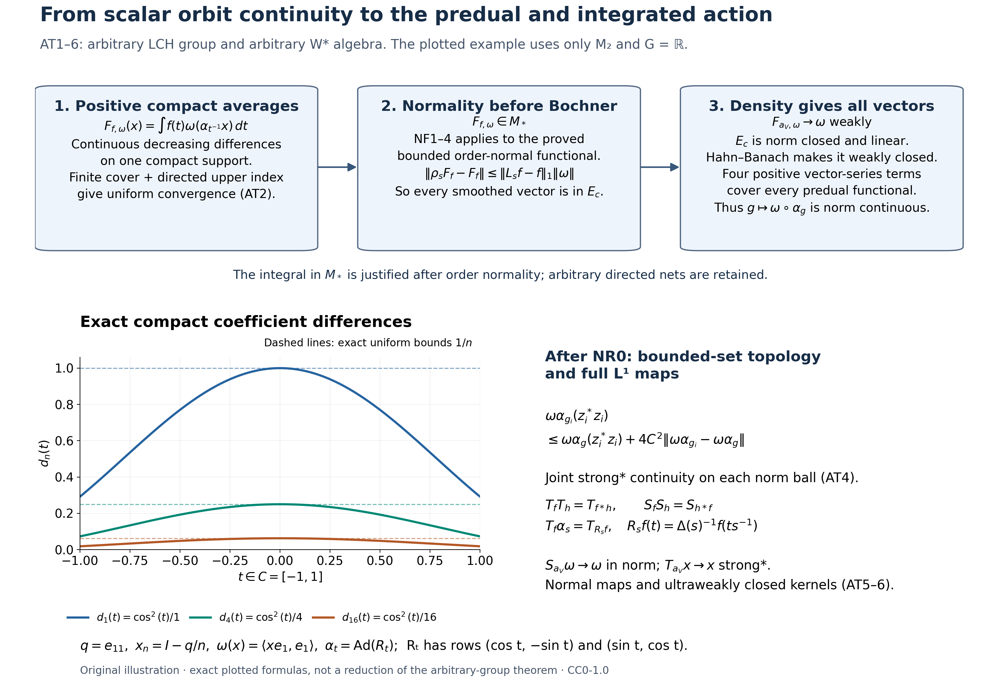

# General normal actions: predual continuity and the integrated maps

*Original proof exposition: GPT-6.1 Sol (OpenAI), Ultra, 2026-10-04. CC0-1.0 to the extent of rights held.*

Let $G$ be an arbitrary locally compact Hausdorff group, $M\subseteq B(H)$ an arbitrary von Neumann algebra, and $\alpha:G\to\operatorname{Aut}(M)$ a homomorphism into normal unital $*$-automorphisms. Normal means ultraweakly continuous. We initially assume only point-ultraweak continuity:

\[
 g\longmapsto\omega(\alpha_g(x))\text{ is continuous}
 \quad(x\in M,\ \omega\in M_*).
 \tag{AT0}
\]
There is no abelian, second-countable, separable-predual, faithful-state, sigma-finite-algebra or unimodular hypothesis. The proof includes the zero algebra.

The actual earlier inputs are CF1, CF6–8, [CP1–6](OA-FLOW-CP.md#oa-flow.cp.1), ST1–2, the complete finite-functional bridge [NF1](OA-FLOW-NF.md#oa-flow.nf.1), [NF2](OA-FLOW-NF.md#oa-flow.nf.2), [NF3](OA-FLOW-NF.md#oa-flow.nf.3) and [NF4](OA-FLOW-NF.md#oa-flow.nf.4), and [HR3](OA-FLOW-HR.md#hr-03), [HR5](OA-FLOW-HR.md#hr-05), [HR8](OA-FLOW-HR.md#hr-08) and [HR9](OA-FLOW-HR.md#hr-09) with L24 [Section2](OA-FLOW-L24.md#oa-flow.grp.haarconventions), [Section3](OA-FLOW-L24.md#oa-flow.grp.translations), [Section4](OA-FLOW-L24.md#oa-flow.grp.vectorintegration) and [Section5](OA-FLOW-L24.md#oa-flow.grp.algebra) for the Haar conventions, norm-continuous translations, Bochner integrals and approximate identities. NF1–4 proves exactly that a bounded positive functional preserving bounded increasing positive suprema belongs to $M_*$, and that positive members of $M_*$ preserve those suprema. No statement about unrestricted extended-valued weights is used.

## AT1. Point-ultraweak and point-strong* continuity

Every $\alpha_g$ is isometric, by CF6's contractivity applied also to its inverse. For a vector $\xi\in H$ and $x\in M$, expansion gives

\[
 \begin{aligned}
 \|(\alpha_g(x)-x)\xi\|^2
 &=\langle\alpha_g(x^*x)\xi,\xi\rangle+\|x\xi\|^2
   -2\operatorname{Re}\langle\alpha_g(x)\xi,x\xi\rangle.
 \end{aligned}
 \tag{AT1}
\]
The single-vector coefficients are in the CP predual, so (AT0) makes this tend to zero as $g\to e$. Repeat for $x^*$ to obtain strong* convergence. For an arbitrary positive normal functional $\omega$, the same expansion is

\[
 \omega((\alpha_g(x)-x)^*(\alpha_g(x)-x))
 =\omega(\alpha_g(x^*x))+\omega(x^*x)
  -2\operatorname{Re}\omega(x^*\alpha_g(x)).
 \tag{AT2}
\]
Multiplication by fixed $x^*$ is ultraweakly continuous: CP4's vector series is transformed by multiplying one of its square-summable vector sequences by that bounded operator. Thus (AT2) proves intrinsic $\sigma$-strong* continuity directly. Translating the group parameter proves continuity at every $g_0$. Normal automorphisms preserve these seminorms by pulling back positive normal functionals. ST2 identifies the bounded intrinsic and concrete topologies in every faithful normal representation.

Conversely point-strong* continuity implies (AT0). For fixed $x$ the orbit is uniformly norm bounded, and each CP vector-series functional is a convergent finite initial sum plus a uniformly small Cauchy–Schwarz tail. Thus strong convergence of that orbit gives ultraweak convergence. This converse uses bounded orbits, not a false global identification of the strong and ultraweak topologies.

## AT2. A compact-support average is genuinely in the predual

Define the isometric predual representation

\[
 \rho_g\omega=\omega\circ\alpha_{g^{-1}},\qquad
 \rho_g\rho_h=\rho_{gh}.
 \tag{AT3}
\]
Its orbit is weakly continuous in the Banach space $M_*$: CP6 identifies its dual with all of $M$, and evaluating the orbit at $x\in M$ is continuous by (AT0) and inversion in $G$. At this stage a Bochner integral of that orbit has not been asserted.

Fix $\omega\in M_*^+$ and $f\in C_c(G)_+$. With left Haar measure, define by ordinary scalar integration

\[
 F_{f,\omega}(x)=\int_G f(t)\omega(\alpha_{t^{-1}}(x))\,dt.
 \tag{AT4}
\]
The continuous coefficient is bounded by $\|\omega\|\|x\|$. Hence $F_{f,\omega}$ is a bounded positive complex-linear functional, with

\[
 \|F_{f,\omega}\|=F_{f,\omega}(1)
 =\|f\|_1\|\omega\|.
 \tag{AT5}
\]
The positive-functional norm identity is part of NF1; the inequality also follows directly from (AT4). Equality remains valid when either factor is zero.

We prove arbitrary-net order normality before claiming that (AT4) is a predual integral. Suppose $0\le x_i\uparrow x$ in $M$, with a bounded increasing net. For $t$ in the compact set $C=\operatorname{supp}f$, put

\[
 d_i(t)=\omega(\alpha_{t^{-1}}(x-x_i))\ge0.
 \tag{AT6}
\]
Each $d_i$ is continuous by (AT0). They decrease, and their pointwise infimum is zero: an order isomorphism carries the supremum $x$ to the supremum of $\alpha_{t^{-1}}(x_i)$, and $\omega$ is order normal by NF1–4. For any $\varepsilon>0$, the sets $\{t\in C:d_i(t)<\varepsilon\}$ are open and cover $C$. Compactness gives finitely many indices covering $C$; directedness supplies an index above all of them. For this index and all later ones, $\sup_C d_i\le\varepsilon$. Therefore

\[
 0\le F_{f,\omega}(x)-F_{f,\omega}(x_i)
 \le\|f\|_1\sup_C d_i\longrightarrow0.
 \tag{AT7}
\]
This proves the required order normality for arbitrary nets by a local finite-cover argument, rather than an exchange theorem for arbitrary monotone nets of measurable functions. NF1–4 now puts $F_{f,\omega}$ in $M_*$. Only this bounded finite-functional bridge has been applied.

For a general $f\in C_c(G)$, split its real and imaginary parts into their positive and negative continuous parts, and use (AT4) linearly. The resulting $F_{f,\omega}\in M_*$ still has the scalar formula and the exact estimate

\[
 \|F_{f,\omega}-F_{h,\omega}\|
 \le\|f-h\|_1\|\omega\|\qquad(f,h\in C_c(G)).
 \tag{AT8}
\]
Indeed evaluate at $\|x\|\le1$, use isometry of $\alpha_t$, and take the supremum; CP6 identifies this functional norm with its predual norm. No separable range or vector integral has yet been needed.

## AT3. The local weak-to-norm argument

Let $E_c\subseteq M_*$ consist of the vectors whose $\rho$-orbit is norm continuous at $e$. It is a linear subspace and norm closed. For the latter, if $\omega_n\to\omega$ in norm with $\omega_n\in E_c$, then

\[
 \|\rho_s\omega-\omega\|
 \le2\|\omega-\omega_n\|+\|\rho_s\omega_n-\omega_n\|,
 \tag{AT9}
\]
and choose $n$ before a neighbourhood of $e$. Norm continuity at every group element follows from isometry and the group law.

For positive $\omega$ and any $f\in C_c(G)$, left Haar substitution in the scalar formula gives

\[
 \rho_s F_{f,\omega}=F_{L_s f,\omega},\qquad
 L_s f(t)=f(s^{-1}t).
 \tag{AT10}
\]
In fact the integrand on the left evaluates $\omega\circ\alpha_{t^{-1}s^{-1}}=\rho_{st}\omega$. L24 Section3 proves $\|L_s f-f\|_1\to0$ for arbitrary LCH groups, without unimodularity. Equation (AT8) proves that $F_{f,\omega}\in E_c$.

Choose the nonnegative compactly supported normalized bumps $a_V$ from L24 Section5, supported in shrinking identity neighbourhoods $V$. The net need not be a sequence. For each fixed $x$,

\[
 |F_{a_V,\omega}(x)-\omega(x)|
 \le\sup_{t\in V}|\omega(\alpha_{t^{-1}}(x))-\omega(x)|
 \longrightarrow0.
 \tag{AT11}
\]
Thus these vectors converge to $\omega$ weakly in $M_*$. A norm-closed linear subspace is weakly closed: if a point is outside it, CF1's Hahn–Banach proof applied to its quotient distance supplies a bounded linear functional vanishing on that subspace and nonzero at the point. CP6 makes this functional an element of $M=(M_*)^*$, so it is exactly a weak test. Since every $F_{a_V,\omega}$ belongs to $E_c$, the positive $\omega$ belongs to $E_c$.

To cover every predual vector, use its actual CP4 series $\varphi(x)=\sum_j\langle x\xi_j,\eta_j\rangle$, with both vector sequences square summable. Put

\[
 \omega_k(x)=\sum_j\langle x(\xi_j+i^k\eta_j),\xi_j+i^k\eta_j\rangle
 \quad(0\le k\le3).
 \tag{AT12}
\]
Each is a positive predual functional; its summed squared vector norms are at most $2\sum_j(\|\xi_j\|^2+\|\eta_j\|^2)$. Expansion with the linear-first convention gives $\varphi=\frac14\sum_{k=0}^3 i^k\omega_k$. Thus $\varphi\in E_c$. We have proved

\[
 g\longmapsto\omega\circ\alpha_g\text{ is norm continuous in }M_*
 \qquad(\omega\in M_*).
 \tag{AT13}
\]
Here inversion changes $\rho_g$ to the displayed map, so no abelian-group reordering is used. Conversely (AT13) implies (AT0) by the functional norm estimate at each fixed $x$. This discharges precisely the NR0 equivalence for arbitrary LCH groups. Positivity, compact support, the predual norm estimate and the Hahn–Banach passage occurred before any general Bochner integration.

## AT4. Joint continuity on bounded sets

Suppose $g_i\to g$, $x_i\to x$ in the intrinsic $\sigma$-strong* topology, and $\|x_i\|,\|x\|\le C$. Write $z_i=x_i-x$. For $\omega\in M_*^+$,

\[
 \begin{aligned}
 \omega(\alpha_{g_i}(z_i)^*\alpha_{g_i}(z_i))
 &=(\omega\circ\alpha_g)(z_i^*z_i)
   +((\omega\circ\alpha_{g_i})-(\omega\circ\alpha_g))(z_i^*z_i)\\
 &\le (\omega\circ\alpha_g)(z_i^*z_i)
      +4C^2\|\omega\circ\alpha_{g_i}-\omega\circ\alpha_g\|
 \longrightarrow0.
 \end{aligned}
 \tag{AT14}
\]
The first test is positive normal and the second tends to zero by AT3. Repeat with $z_i^*$, and combine with AT1 for the fixed $x$, to get $\alpha_{g_i}(x_i)\to\alpha_g(x)$ strongly*. Thus the action is jointly $\sigma$-strong* continuous on every fixed norm ball. ST2 gives the same assertion in any faithful normal concrete realization. No joint continuity on unbounded nets is claimed.

It is also jointly ultraweakly continuous on each norm ball. If instead $x_i\to x$ ultraweakly, then for any $\omega\in M_*$,

\[
 |\omega(\alpha_{g_i}(z_i))|
 \le |(\omega\circ\alpha_g)(z_i)|
       +2C\|\omega\circ\alpha_{g_i}-\omega\circ\alpha_g\|\longrightarrow0,
 \tag{AT15}
\]
and the fixed-$x$ term is (AT0). These are arbitrary-net statements; local compactness entered the AT2–3 integration argument, not a hidden first-countability step.

## AT5. The full $L^1$ integrated action

Use the locally determined completed Haar convention and its finite-exponent identification with outer regular Radon classes, proved in HR8–9 and L24 Section2. Every $L^1$ scalar class has a Borel representative on a sigma compact carrier, extended by zero, with compact-local null equality. After AT3, the map $t\mapsto\omega\circ\alpha_t$ is norm continuous. Its image on each such carrier has separable norm range: each compact image in a metric Banach space has finite $1/n$-nets, and the countable union of the compact pieces has separable image. L24 Section4 therefore supplies the genuine Bochner integral

\[
 S_f\omega=\int_G f(t)(\omega\circ\alpha_t)\,dt\in M_*;
 \qquad\|S_f\omega\|\le\|f\|_1\|\omega\|.
 \tag{AT16}
\]
There is no separability assumption on the whole predual. Bounded-map compatibility of that integral makes $S_f$ a bounded linear operator on $M_*$. Define its adjoint $T_f=S_f^*:M\to M$. It is ultraweakly continuous on all of $M$, with

\[
 \omega(T_f x)=\int_G f(t)\omega(\alpha_t(x))\,dt,
 \qquad\|T_f\|\le\|f\|_1.
 \tag{AT17}
\]
It depends only on the $L^1$ class and is linear in $f$. For $f\ge0$, $T_f$ is positive because all positive normal vector tests of $T_f x$ are nonnegative for $x\ge0$, and the CF8 concrete positivity criterion detects positivity. Also $T_f(1)=(\int f)1$ and

\[
 (T_f x)^*=T_{\overline f}(x^*).
 \tag{AT18}
\]
The latter follows from the scalar formula by conjugating vector coefficients; it is not a Hilbert-operator adjoint formula involving the $L^1$ involution.

For convolution in L24's convention,

\[
 T_fT_h=T_{f*h},\qquad
 \alpha_s T_f=T_{L_s f},\qquad
 T_f\alpha_s=T_{R_s f},\qquad
 R_s f(t)=\Delta(s)^{-1}f(ts^{-1}).
 \tag{AT19}
\]
Indeed normality of the first map allows the other scalar integral to be evaluated using its predual functional. The resulting double integral is $\iint f(s)h(t)\omega(\alpha_{st}(x))\,dt\,ds$. Its absolute bound is $\|f\|_1\|h\|_1\|\omega\|\|x\|$; HR5 and L24 Sections4–5 justify Fubini on the sigma compact Radon carriers. Substitution $r=st$ gives convolution. Left Haar invariance gives the second formula. For the third substitute $r=ts$ and use L24 Section3's exact convention $\mu(Es)=\Delta(s)\mu(E)$; this gives the displayed $\Delta(s)^{-1}$ factor. Thus no unimodular factor has been discarded. On the predual, $S_s\omega=\omega\circ\alpha_s$ is an antirepresentation: $S_sS_t=S_{ts}$, and consequently $S_fS_h=S_{h*f}$, consistently with (AT19).

## AT6. Kernel topologies and approximate identities

For each $f\in L^1(G)$, the kernel of $T_f$ is an ultraweakly closed linear subspace on all of $M$, with the exact annihilator description

\[
 \ker T_f=(S_f(M_*))^\perp.
 \tag{AT20}
\]
This is the scalar duality in (AT17); norm closure of the range does not change its annihilator. The map $f\mapsto T_f$ is norm continuous into the bounded operators on $M$ by $\|T_f-T_h\|\le\|f-h\|_1$. Hence $I_\alpha=\{f:T_f=0\}$ is a norm-closed two-sided convolution ideal by (AT19), and is invariant under both normalized translations. No spectral-synthesis or involutive-ideal conclusion is assumed. For a fixed $x$, $I_x=\{f:T_f x=0\}$ is norm closed and a left convolution ideal; it is also invariant under $L_s$. These statements do not silently promote it to a two-sided ideal for nonabelian $G$.

Each $T_f$ is strong* continuous on each norm ball. To see this, first note that for any fixed $x$ and $\xi$, $t\mapsto\alpha_t(x)\xi$ is norm continuous by AT1. Its Bochner integral against $f$ has vector coefficients equal to (AT17), so it is exactly $(T_f x)\xi$. If a uniformly bounded net $x_i$ tends to zero strongly*, AT4 and compactness make $\sup_{t\in C}\|\alpha_t(x_i)\xi\|\to0$ on every compact $C$. Explicitly, joint continuity at each $(t,0)$ gives a neighbourhood of $t$ and a strong* neighbourhood of zero controlling the norm; a finite cover of $C$ and the intersection of those finitely many neighbourhoods control the whole compact set. Choose $C$ carrying all but an arbitrarily small amount of $|f|$ by HR3/9. Outside $C$ use $\|\alpha_t(x_i)\xi\|\le C_0\|\xi\|$. The vector integral estimate then gives $(T_f x_i)\xi\to0$. Apply the same argument to $x_i^*$ and $\overline f$ using (AT18). Translation handles a nonzero limit. Thus its kernel intersected with any fixed norm ball is strong* closed. Ultraweak closedness on all of $M$ is distinct from such a bounded-set topology assertion.

For the nonnegative bumps $a_V$ of L24 Section5,

\[
 S_{a_V}\omega\longrightarrow\omega\text{ in predual norm},\qquad
 T_{a_V}x\longrightarrow x\text{ in }\sigma\text{-strong*},\qquad
 \|T_{a_V}x\|\le\|x\|.
 \tag{AT21}
\]
The first estimate is $\|S_{a_V}\omega-\omega\|\le\sup_{t\in V}\|\omega\circ\alpha_t-\omega\|$, which tends to zero by AT3. For each vector, the second is bounded by $\sup_{t\in V}\|(\alpha_t(x)-x)\xi\|$, and the same estimate for $x^*$ gives strong* convergence; boundedness and ST2 give the intrinsic version. It follows that $\bigcap_{f\in L^1}\ker T_f=\{0\}$. Operator norm convergence in (AT21) is asserted only for $x$ with a norm-continuous orbit, when the analogous supremum norm estimate applies.

Finally every smoothed element has a norm-continuous orbit, since

\[
 \|\alpha_s(T_f x)-T_f x\|
 \le\|L_s f-f\|_1\|x\|\longrightarrow0.
 \tag{AT22}
\]
This is the exact smoothing estimate needed by subsequent coefficient constructions. It does not prove a crossed-product commutant, spectral synthesis, induction or disintegration theorem. Those subsequent chapters use AT13 as their NR0 input; their regular and standard-form constructions are separate proofs.

## AT7. Exercises with solutions

**Exercise 1.** Locate the point at which local compactness is used to prove predual norm continuity. **Solution.** It supplies left Haar measure, nonnegative compactly supported normalized bumps and norm continuity of their left translates. AT2's Dini step uses compact support; AT3's density step uses these bumps. Merely weak convergence of arbitrary orbit vectors does not imply norm convergence.

**Exercise 2.** Why cannot (AT7) be replaced by an unqualified interchange of an arbitrary decreasing net and a scalar integral? **Solution.** Arbitrary directed nets do not have the sequence monotone-convergence theorem. Here the differences are continuous on one compact support and decrease pointwise to zero, so the finite-cover and directed-upper-index argument proves uniform convergence and the integral estimate directly.

**Exercise 3.** Explain the nonabelian order in (AT19). **Solution.** The action has $\alpha_s\alpha_t=\alpha_{st}$, so the operator integrals use $f*h$. Composition on functionals is reversed: $(\omega\circ\alpha_t)\circ\alpha_s=\omega\circ\alpha_{ts}$, which gives $S_fS_h=S_{h*f}$. The right covariance additionally uses the normalized right translate and its modular scalar; it is not a left-translation formula.

**Exercise 4.** May (AT21) be promoted to operator norm convergence for every $x\in M$? **Solution.** The proof supplies vector seminorms for arbitrary $x$. Its norm estimate tends to zero only when the orbit of $x$ is norm continuous. The earlier weak-to-predual-norm theorem concerns vectors of $M_*$, and is not point-norm continuity of the action on all of $M$.

## The normality step that makes smoothing a predual argument

The diagram shows the actual order of [AT2](OA-FLOW-AT.md#oa-flow.at.2), [AT3](OA-FLOW-AT.md#oa-flow.at.3) and [AT4–6](OA-FLOW-AT.md#oa-flow.at.4). For $\omega\in M_*^+$ and $f\in C_c(G)_+$, the scalar formula for $F_{f,\omega}$ is first shown to be a bounded positive order-normal functional. On $C=\operatorname{supp}f$, the continuous differences $d_i(t)=\omega(\alpha_{t^{-1}}(x-x_i))$ decrease pointwise to zero for any bounded increasing net $x_i\uparrow x$. A finite open cover and one directed upper index give uniform convergence on $C$. Thus the integral difference is at most $\|f\|_1\sup_C d_i$, and the exact earlier [NF1–4](OA-FLOW-NF.md#oa-flow.nf.1) proofs put this functional in $M_*$. No predual Bochner integral or general interchange for arbitrary nets has been assumed.

Next $\rho_sF_{f,\omega}=F_{L_sf,\omega}$ and $\|\rho_sF_{f,\omega}-F_{f,\omega}\|\leq\|L_sf-f\|_1\|\omega\|$ put all smoothed positive vectors in the norm-closed linear space $E_c$ of vectors with continuous norm orbit. The normalized compact-support bumps make those vectors weakly approach $\omega$. The complete CF1 Hahn–Banach proof shows that $E_c$ is weakly closed. Four positive vector-series functionals then span every element of $M_*$. This yields (AT13), the full arbitrary-group NR0 conclusion.

The plotted example is exact in $M=M_2(\mathbb C)$, with $G=\mathbb R$, and uses

\[
 q=\begin{pmatrix}1&0\\0&0\end{pmatrix},\qquad
 R_t=\begin{pmatrix}\cos t&-\sin t\\\sin t&\cos t\end{pmatrix},\qquad
 \alpha_t(x)=R_txR_t^*,\qquad
 \omega(x)=\langle xe_1,e_1\rangle.
 \tag{AT-F1}
\]
The norm-series identities in CF1 and the unitary exponential argument in CF3 also give $R_t=e^{tK}$ for $K=\begin{pmatrix}0&-1\\1&0\end{pmatrix}$: separate the even and odd terms using $K^2=-I$. The scalar series define $\cos$ and $\sin$, and the commuting exponential product proves $R_{t+s}=R_tR_s$ and $R_tR_t^*=I$. Thus this really is a continuous normal action. With $x_n=I-q/n$, the sequence is increasing in $M_+$ with supremum $I$. Direct multiplication yields

\[
 d_n(t)=\omega(\alpha_{-t}(I-x_n))=\frac{\cos^2 t}{n},
 \qquad \sup_{[-1,1]}d_n=\frac1n.
 \tag{AT-F2}
\]
The three curves use $n=1,4,16$, and the dashed lines are their exact uniform bounds. With the nonnegative continuous compact-support function

\[
 f(t)=\begin{cases}\frac34(1-t^2),&|t|\leq1,\\0,&|t|>1,\end{cases}
 \qquad\int_{\mathbb R}f(t)\,dt=1,
 \tag{AT-F3}
\]
the integral is evaluated by the polynomial primitive from CF1, or directly by its Riemann sums. Consequently

\[
 0\leq F_{f,\omega}(I)-F_{f,\omega}(x_n)
 =\frac1n\int_{-1}^1f(t)\cos^2t\,dt\leq\frac1n.
 \tag{AT-F4}
\]
This example illustrates the uniform compact estimate. It does not replace the arbitrary-directed-net finite-cover proof or reduce the group or algebra generality of AT1–6.

The last panel retains the norm-ball factor $4C^2$ in (AT14), both different multiplication orders $T_fT_h=T_{f*h}$ and $S_fS_h=S_{h*f}$, and the nonunimodular factor $\Delta(s)^{-1}$ in the right translate. Here $\mu(Es)=\Delta(s)\mu(E)$ is precisely [L24 Section3](OA-FLOW-L24.md#oa-flow.grp.translations)'s convention. The two approximate-identity limits occur in different spaces and topologies: predual norm for $S_{a_V}\omega$ and bounded strong* convergence for $T_{a_V}x$. They are the full conclusions of AT5–6, not operator norm convergence on every orbit.

The arbitrary-group action setting is treated in Haagerup, [*On the dual weights for crossed products of von Neumann algebras I: Removing separability conditions*](https://journals.msp.org/mscand/article/view/1879), Math. Scand. 43 (1978), §§1.1–1.2. The local AT arguments supply their own proofs from the earlier programme sections; the paper's standard-implementation imports are not premises of this diagram.

The native figure is $3200\times2200$ pixels. [Editable SVG](../assets/general-action-topology/figures/action-topology.svg), [exact sample data](../assets/general-action-topology/figures/action-topology-data.json) and [reproduction source](../assets/general-action-topology/render_action_topology.py) accompany the original PNG. All new illustration and caption expression is CC0-1.0 to the extent of rights held.
