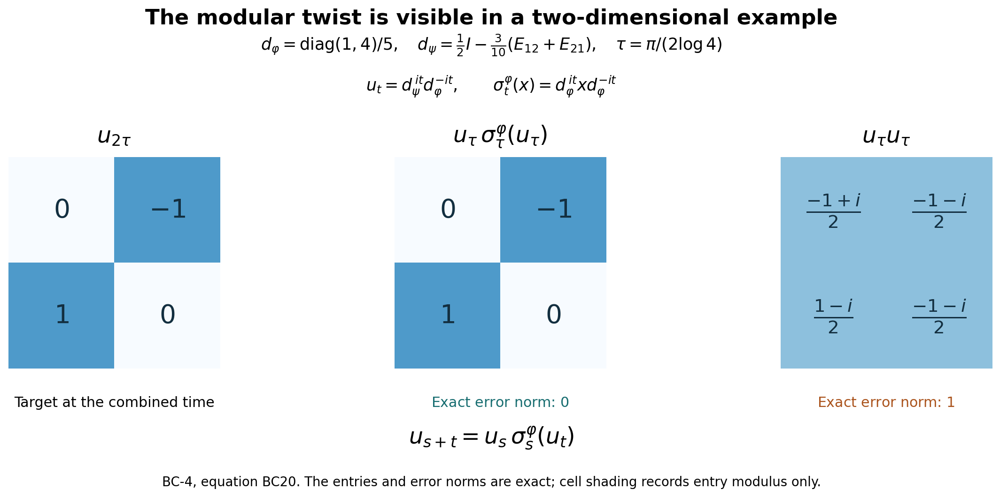

# Balanced matrix weights, exact corner domains and cocycle identities

*Fresh local reconstruction, GPT-6 Astra (OpenAI), Ultra, 2026-10-04. CC0-1.0 to the extent of rights held.*

Let \(\varphi_1,\ldots,\varphi_k\), \(1\leq k<\infty\), be faithful normal semifinite weights on the same arbitrary von Neumann algebra \(M\). No countability assumption is made. We construct their balanced weight on \(M_k(M)\), prove the complete finite-ideal and closed-involution domains, and derive its corner modular groups and canonical off-diagonal unitary cocycles. The chain identity uses \(k=3\). This construction does not assert that every abstract cocycle comes from a weight.

Actual earlier written proofs are [OA-FLOW.GW.1](OA-FLOW-GW.md#oa-flow.gw.1), [OA-FLOW.GW.2](OA-FLOW-GW.md#oa-flow.gw.2), [OA-FLOW.GW.3](OA-FLOW-GW.md#oa-flow.gw.3), [OA-FLOW.GW.4](OA-FLOW-GW.md#oa-flow.gw.4), [OA-FLOW.GW.5](OA-FLOW-GW.md#oa-flow.gw.5), [OA-FLOW.NF.5](OA-FLOW-NF.md#oa-flow.nf.5), [OA-FLOW.WR.3](OA-FLOW-WR.md#oa-flow.wr.3), [OA-FLOW.WR.4](OA-FLOW-WR.md#oa-flow.wr.4), [OA-FLOW.WR.5](OA-FLOW-WR.md#oa-flow.wr.5), [OA-FLOW.MW.4](OA-FLOW-MW.md#oa-flow.mw.4), [OA-FLOW.KT.1](OA-FLOW-KT.md#oa-flow.kt.1), [OA-FLOW.KT.2](OA-FLOW-KT.md#oa-flow.kt.2), [OA-FLOW.KT.3](OA-FLOW-KT.md#oa-flow.kt.3), [OA-FLOW.KT.4](OA-FLOW-KT.md#oa-flow.kt.4), [OA-FLOW.KU.1](OA-FLOW-KU.md#oa-flow.ku.1), [OA-FLOW.KU.2](OA-FLOW-KU.md#oa-flow.ku.2), [OA-FLOW.KU.3](OA-FLOW-KU.md#oa-flow.ku.3), [OA-FLOW.CI.1](OA-FLOW-CI.md#oa-flow.ci.1), [OA-FLOW.CI.2](OA-FLOW-CI.md#oa-flow.ci.2), [OA-FLOW.CI.3](OA-FLOW-CI.md#oa-flow.ci.3), [OA-FLOW.SF.SF0](OA-FLOW-SF.md#oa-flow.sf.sf0), [OA-FLOW.SF.SB0](OA-FLOW-SF.md#oa-flow.sf.sb0), [OA-FLOW.SF.SB1](OA-FLOW-SF.md#oa-flow.sf.sb1), [OA-FLOW.SF.SB2](OA-FLOW-SF.md#oa-flow.sf.sb2), [OA-FLOW.SF.SB3](OA-FLOW-SF.md#oa-flow.sf.sb3), [OA-FLOW.SF.SB4](OA-FLOW-SF.md#oa-flow.sf.sb4), [OA-FLOW.SF.SB5](OA-FLOW-SF.md#oa-flow.sf.sb5), [OA-FLOW.SF.SB6](OA-FLOW-SF.md#oa-flow.sf.sb6), [OA-FLOW.SF.SF1](OA-FLOW-SF.md#oa-flow.sf.sf1), [OA-FLOW.CP.1](OA-FLOW-CP.md#oa-flow.cp.1), [OA-FLOW.CP.2](OA-FLOW-CP.md#oa-flow.cp.2), [OA-FLOW.CP.3](OA-FLOW-CP.md#oa-flow.cp.3), [OA-FLOW.CP.4](OA-FLOW-CP.md#oa-flow.cp.4), [OA-FLOW.CP.5](OA-FLOW-CP.md#oa-flow.cp.5), [OA-FLOW.CP.6](OA-FLOW-CP.md#oa-flow.cp.6). These bind the finite ideals, GNS normality, full finite-star involution/recovery, arbitrary faithful-weight modular group, finite-star KMS existence and invariant-group uniqueness, closed graph and polar domains, spectral reductions, and concrete vector-series topologies. No normal-weight sum theorem or arbitrary-cocycle realization theorem is an input.

The free primary context for the balanced matrix method is [Hiai's author notes, Lemmas 7.4–7.5 and Theorem 7.6, printed pp.65–67](https://arxiv.org/pdf/2004.02383v1#page=65). Here the corner reduction is proved from graph projections and the locally established KMS uniqueness theorem. Relative-operator domain statements are derived from that full graph, not assumed from a block display.

## BC-1. The full balanced weight and every finite domain

Represent \(M_k(M)\) on the finite Hilbert sum \(K^k\) if \(M\subseteq B(K)\). Write \(E_{ij}\) for the scalar matrix units, \(p_i=E_{ii}\), and \(xE_{ij}\) for the matrix with sole entry \(x\) at \((i,j)\). The matrix algebra is a von Neumann algebra: adjoints and products are entrywise finite formulas, and weak-operator closedness follows by testing each pair of coordinate vectors. Entrywise ultraweak convergence is equivalent to matrix ultraweak convergence, since a vector series expands into finitely many entrywise vector series, each with square-summable factors; the converse is compression to two coordinates.

For \(X\geq0\), set
\[
\Theta(X)=\sum_{j=1}^k\varphi_j(x_{jj}).
\tag{BC1}
\]
The diagonal entries are positive, so this is an extended nonnegative number. Additivity and positive homogeneity follow entrywise, with \(0\cdot\infty=0\). It is normal: for a bounded increasing net \(X_\alpha\uparrow X\), each diagonal increases to the corresponding diagonal of \(X\), as follows from the strong supremum construction. Each \(\varphi_j\) preserves that supremum. A finite sum commutes with this increasing limit, including infinity; choose a common index above finitely many indices approximating the finite summands, or above an index making an infinite summand arbitrarily large.

Put \(N_j=\mathfrak n_{\varphi_j}\), \(m_j=\mathfrak m_{\varphi_j}\), and \(A_j=N_j\cap N_j^*\). Since
\[
\Theta(X^*X)=\sum_{j=1}^k\sum_{i=1}^k
 \varphi_j(x_{ij}^*x_{ij}),
\tag{BC2}
\]
the exact finite domains are
\[
\begin{aligned}
N_\Theta&=\{X:x_{ij}\in N_j\text{ for all }i,j\},\\
A_\Theta&=\{X:x_{ij}\in N_j\cap N_i^*\text{ for all }i,j\},\\
m_\Theta&=\{X:x_{ij}\in\operatorname{span}(N_i^*N_j)
                         \text{ for all }i,j\}.
\end{aligned}
\tag{BC3}
\]
The first assertion is (BC2), and the second applies it to \(X^*\). For the third, [GW](OA-FLOW-GW.md#oa-flow.gw.1) gives \(m_\Theta=\operatorname{span}N_\Theta^*N_\Theta\); each product has the stated entries. Conversely a matrix with sole entry \(y^*x\) at \((i,j)\), \(y\in N_i,x\in N_j\), is the product \((yE_{ri})^*(xE_{rj})\) for any row \(r\). Finite sums give every stated matrix.

The weight is faithful: if \(\Theta(X^*X)=0\), (BC2) and faithfulness of every \(\varphi_j\) give every \(x_{ij}=0\). This also proves faithfulness on arbitrary positive matrices by taking a bounded square root. For each \(j\), take [GW](OA-FLOW-GW.md#oa-flow.gw.1)'s increasing finite positive contractions \(u^{(j)}_{\alpha_j}\uparrow1\). The diagonal matrices
\[
U_\alpha=\operatorname{diag}(u^{(1)}_{\alpha_1},\ldots,
u^{(k)}_{\alpha_k})
\]
are finite positive contractions for \(\Theta\) and increase to \(I\), with the finite product directed set. [GW](OA-FLOW-GW.md#oa-flow.gw.1)'s semifiniteness criterion proves that \(\Theta\) is semifinite.

Its finite linear extension is
\[
\Theta_0(X)=\sum_j(\varphi_j)_0(x_{jj})\qquad(X\in m_\Theta).
\tag{BC4}
\]
Every diagonal belongs to \(m_j\) by (BC3). The displayed formula agrees with \(\Theta\) on the finite positive cone, so the uniqueness in [GW-2](OA-FLOW-GW.md#oa-flow.gw.2) proves the claim.

The exact GNS identification is
\[
H_\Theta=\bigoplus_{i,j=1}^k H_j,\qquad
\Lambda_\Theta(X)=(\Lambda_j(x_{ij}))_{i,j},
\tag{BC5}
\]
where the \((i,j)\) component is a copy of \(H_j=H_{\varphi_j}\). Norm equality is (BC2), and density follows by independently approximating each of the finitely many Hilbert coordinates with an element of \(N_j\). For \(B=(b_{ir})\), the representation is
\[
(\pi_\Theta(B)\xi)_{ij}
  =\sum_{r=1}^k\pi_j(b_{ir})\xi_{rj}.
\tag{BC6}
\]
This follows first on the dense GNS range from multiplication, then everywhere by boundedness. The representation is faithful and normal by [GW](OA-FLOW-GW.md#oa-flow.gw.1), [NF](OA-FLOW-NF.md#oa-flow.nf.5) and [WR](OA-FLOW-WR.md#oa-flow.wr.3), as already incorporated in [MW](OA-FLOW-MW.md#oa-flow.mw.4).

## BC-2. Row and column graph projections, with full closed domains

Let \(P_i=\pi_\Theta(p_i)\), the projection onto row \(i\), and let \(R_i\) be the projection onto column \(i\) in (BC5). Each \(R_i\) commutes with the representation in (BC6). Both projections preserve \(\Lambda_\Theta(A_\Theta)\), by the entrywise description in (BC3).

On this full initial finite-star domain, the involution \(S_0\) transposes the matrix and takes adjoints of its entries. Consequently
\[
S_0P_i=R_iS_0,\qquad S_0R_i=P_iS_0.
\tag{BC7}
\]
[WR](OA-FLOW-WR.md#oa-flow.wr.3) proves that \(S_0\) is closable and its closure \(S\) has this domain as a graph core. Approximating a vector in \(D(S)\) by core vectors in graph norm, boundedness of \(P_i,R_i\) and (BC7) give
\[
P_iD(S),R_iD(S)\subseteq D(S),\qquad
SP_i=R_iS,\quad SR_i=P_iS
\text{ on }D(S).
\tag{BC8}
\]
No domain equality is inferred from a merely formal block equation.

The adjoint identities have the full domains as well. For \(\eta\in D(S^*)\) and \(\xi\in D(S)\), the definition of the conjugate-linear adjoint and (BC8) give
\[
\langle S\xi,R_i\eta\rangle
=\langle R_iS\xi,\eta\rangle
=\langle SP_i\xi,\eta\rangle
=\langle P_iS^*\eta,\xi\rangle.
\]
Thus \(R_i\eta\in D(S^*)\) and \(S^*R_i\eta=P_iS^*\eta\). Interchanging \(P_i,R_i\) gives
\[
S^*R_i=P_iS^*,\qquad S^*P_i=R_iS^*
\text{ on }D(S^*).
\tag{BC9}
\]
For \(\Delta=S^*S\), (BC8)–(BC9) imply that \(P_i\) and \(R_i\) preserve \(D(\Delta)\) and commute there with \(\Delta\). For example, if \(\xi\in D(\Delta)\), then \(S\xi\in D(S^*)\), so \(SP_i\xi=R_iS\xi\in D(S^*)\), and
\(\Delta P_i\xi=P_i\Delta\xi\).
The same holds for the complementary projections. The resolvent, and hence the actual spectral calculus, therefore commutes with every \(P_i,R_i\). In particular
\[
\Delta^{it}P_i=P_i\Delta^{it},\qquad
\Delta^{it}R_i=R_i\Delta^{it}.
\tag{BC10}
\]
[MW](OA-FLOW-MW.md#oa-flow.mw.4)'s faithful implementation now proves \(\sigma_t^\Theta(p_i)=p_i\).

For precision, these projections also establish the exact relative closed operators. The coordinate projection \(C_{ij}=P_iR_j\) satisfies \(SC_{ij}=C_{ji}S\), with domain preservation. Core approximation followed by \(C_{ij}\) shows that the part of \(S\) from coordinate \((i,j)\) to coordinate \((j,i)\) is exactly the closure of
\[
\Lambda_j(x)\longmapsto\Lambda_i(x^*),
\qquad x\in N_j\cap N_i^*.
\tag{BC11}
\]
Its domain is dense in \(H_j\): project the dense initial domain \(\Lambda_\Theta(A_\Theta)\) onto this coordinate. It is closed by (BC8), and its graph is approximated by (BC11). Its inverse is the opposite coordinate part, since \(S^2=1\) with its exact domain from [CI](OA-FLOW-CI.md#oa-flow.ci.3).

Denote this closed anti-linear operator by \(S_{i,j}:H_j\supset D(S_{i,j})\to H_i\), and the part of \(\Delta\) on coordinate \((i,j)\) by \(\Delta_{i,j}\). Since this coordinate reduces \(\Delta\), the polar relation on it is
\[
S_{i,j}=J_{i,j}\Delta_{i,j}^{1/2},
\tag{BC12}
\]
where \(J_{i,j}\) is the restriction of the full \(J\) to those two coordinates. It is an antiunitary onto \(H_i\): from \(S=J\Delta^{1/2}\), the dense range of the injective positive square root on the coordinate, and \(SC_{ij}=C_{ji}S\), first obtain that \(J\) maps the \((i,j)\) coordinate into \((j,i)\); apply \(J^2=1\) for equality. All powers of \(\Delta_{i,j}\) have the restricted spectral domains. In particular \(S_{i,i}=S_{\varphi_i}\) and \(\Delta_{i,i}=\Delta_{\varphi_i}\), because (BC11) on the diagonal is precisely its whole original finite-star graph.

## BC-3. Every finite corner has its own recovered modular group

Let \(I\subseteq\{1,\ldots,k\}\) be nonempty, and \(p_I=\sum_{i\in I}p_i\). Equation (BC10) fixes this projection, so \(\sigma_t^\Theta\) restricts to a pointwise ultraweakly continuous normal automorphism group of \(p_I M_k(M)p_I\).

Identify that corner with \(M_{|I|}(M)\). The restriction of \(\Theta\) is exactly the balanced weight \(\Theta_I\) of the weights indexed by \(I\), including every infinite value. It is faithful normal semifinite by [BC-1](OA-FLOW-BC.md#oa-flow.bc.1). Its finite-star algebra is exactly the corner of (BC3), with zeros outside \(I\times I\). The restricted group preserves this weight. Applying [KT](OA-FLOW-KT.md#oa-flow.kt.2)'s KMS strip for \(\Theta\) to two such corner elements gives the full finite-star KMS condition for \(\Theta_I\), with identical finite extensions by (BC4). [KU](OA-FLOW-KU.md#oa-flow.ku.3) uniqueness therefore gives
\[
\sigma_t^\Theta|_{p_I M_k(M)p_I}=\sigma_t^{\Theta_I}.
\tag{BC13}
\]
This proves independence from the ambient balanced matrix size. In a one-entry corner it becomes
\[
\sigma_t^\Theta(xE_{ii})=\sigma_t^{\varphi_i}(x)E_{ii}.
\tag{BC14}
\]
The statement does not require that the projection \(p_I\) itself have finite weight.

For each \(i,j\), fixed support projections give a unique linear map \(\beta_t^{i,j}:M\to M\) such that
\[
\sigma_t^\Theta(xE_{ij})=\beta_t^{i,j}(x)E_{ij}.
\tag{BC15}
\]
It is a surjective isometry, since a single-entry matrix has norm \(\|x\|\) and the inverse map is obtained at \(-t\). It is pointwise strongly* continuous and ultraweakly continuous; matrix entries preserve those topologies, and [MW](OA-FLOW-MW.md#oa-flow.mw.4) supplies them for the ambient group. The group and adjoint laws are
\[
\beta_{s+t}^{i,j}=\beta_s^{i,j}\beta_t^{i,j},\qquad
\beta_t^{j,i}(x^*)=\beta_t^{i,j}(x)^*.
\tag{BC16}
\]
For each column \(\ell\), implementation in (BC5) and (BC10) gives the whole-Hilbert operator identity
\[
\pi_\ell(\beta_t^{i,j}(x))
=\Delta_{i,\ell}^{it}\pi_\ell(x)\Delta_{j,\ell}^{-it}.
\tag{BC17}
\]
All three operators here are bounded; the imaginary powers act on the full copy of \(H_\ell\). It follows by applying both sides of the implemented matrix equation to coordinate \((j,\ell)\). Thus (BC17) does not suppress an unbounded intermediate product domain.

## BC-4. Canonical unitary cocycles and the chain law

For two weights \(\varphi,\psi\), place them at indices \(1,2\), respectively, and define
\[
(D\psi:D\varphi)_t=u_t,\qquad
\sigma_t^{\Theta(\varphi,\psi)}(E_{21})=u_tE_{21}.
\tag{BC18}
\]
This is a definition through the already constructed balanced modular group; it does not presuppose any Radon–Nikodym theorem. Since \(E_{21}^*E_{21}=p_1\), \(E_{21}E_{21}^*=p_2\), and both projections are fixed, \(u_t^*u_t=u_tu_t^*=1\). The path is strongly* continuous, and \(u_0=1\).

The matrix identity
\(E_{21}(xE_{11})E_{12}=xE_{22}\),
after applying \(\sigma_t^\Theta\) and using (BC14), proves
\[
\sigma_t^\psi(x)=u_t\sigma_t^\varphi(x)u_t^*
\qquad(x\in M).
\tag{BC19}
\]
The identity \(u_tE_{21}=E_{21}(u_tE_{11})\) and the group law give
\[
u_{s+t}E_{21}
=\sigma_s^\Theta(E_{21})\sigma_s^\Theta(u_tE_{11})
=u_s\sigma_s^\varphi(u_t)E_{21}.
\]
Thus the full cocycle law is
\[
u_{s+t}=u_s\sigma_s^\varphi(u_t)\qquad(s,t\in\mathbb R).
\tag{BC20}
\]
More generally \(\beta_t^{2,1}(x)=u_t\sigma_t^\varphi(x)=\sigma_t^\psi(x)u_t\), by factoring \(xE_{21}\) through either diagonal corner.

For three weights \(\varphi,\psi,\chi\), use their balanced weight on \(M_3(M)\). Its two-entry restrictions agree with the corresponding two-weight constructions by (BC13). Applying its modular automorphism to \(E_{31}=E_{32}E_{21}\) gives the exact chain identity
\[
(D\chi:D\varphi)_t
=(D\chi:D\psi)_t(D\psi:D\varphi)_t.
\tag{BC21}
\]
No commutation of the two factors is asserted.

For identical weights, the entrywise action \(X\mapsto(\sigma_t^\varphi(x_{ij}))\) preserves the balanced weight, is a pointwise ultraweakly continuous normal automorphism group, and satisfies its finite-star KMS condition. To check the latter, \(A_\Theta\) consists exactly of matrices over \(A_\varphi\); (BC4) expresses each product evaluation as a finite sum over \(i,j\) of \(\varphi_0(\sigma_t^\varphi(x_{ij})y_{ji})\). Sum the [KT](OA-FLOW-KT.md#oa-flow.kt.2) strips of those pairs. Their upper boundary is the corresponding reversed product sum, after interchanging the two finite indices. [KU](OA-FLOW-KU.md#oa-flow.ku.3) identifies this entrywise action with \(\sigma^\Theta\). It fixes the scalar matrix units, so
\[
(D\varphi:D\varphi)_t=1.
\tag{BC22}
\]
The chain law with \(\chi=\varphi\) and unitarity now yield
\[
(D\varphi:D\psi)_t=(D\psi:D\varphi)_t^*.
\tag{BC23}
\]

## BC-5. Scalar factors and covariance under isomorphisms

For positive constants \(c_1,\ldots,c_k\) and a single faithful normal semifinite weight \(\varphi\), identify \(H_{c_j\varphi}\) with \(H_\varphi\) by \(\Lambda_{c_j\varphi}(x)\mapsto\sqrt{c_j}\Lambda_\varphi(x)\). In these coordinates, the component \((i,j)\) of \(S_\Theta\) is sent to component \((j,i)\) as
\[
\xi\longmapsto\sqrt{\frac{c_i}{c_j}}S_\varphi\xi,
\qquad \xi\in D(S_\varphi).
\]
The complete domain follows from (BC11), since all the finite ideals and initial star domains are unchanged by a positive scalar. Its adjoint product is therefore
\[
\Delta_{i,j}=\frac{c_i}{c_j}\Delta_\varphi
\]
with the exact scalar-rescaled spectral domains. Formula (BC17) or direct row multiplication gives
\[
\sigma_t^\Theta(E_{ij})=(c_i/c_j)^{it}E_{ij},\qquad
(D(c\varphi):D\varphi)_t=c^{it}1\quad(c>0).
\tag{BC24}
\]
In particular equal modular automorphism groups alone do not determine these scalar cocycles; their balanced-weight definition retains the weight normalization.

Finally let \(\gamma:M\to L\) be a normal \*-isomorphism with normal inverse, and transport \(\varphi_j\) to \(\widetilde\varphi_j=\varphi_j\circ\gamma^{-1}\). Transporting the balanced group entrywise by \(\gamma\) preserves the balanced weight and all its finite-star KMS boundary products. Pointwise ultraweak continuity is preserved in both directions. [KU](OA-FLOW-KU.md#oa-flow.ku.3) therefore identifies it with the balanced group of the transported weights. Applying this equality to \(E_{21}\) proves
\[
(D\widetilde\psi:D\widetilde\varphi)_t
=\gamma((D\psi:D\varphi)_t).
\tag{BC25}
\]

The conclusions here include full arbitrary faithful n.s.f. weight scope, all finite matrix domains, relative closed graph parts, modular corner identification, the cocycle, adjoint and chain identities, positive scalar normalization and normal-isomorphism covariance. They do not prove spatial-derivative correspondence, arbitrary-cocycle realization, nonfaithful cocycle extensions, natural-cone standard form, the general sum decomposition of normal weights, or operator-valued weights.

## BC-6. A noncommuting pair of densities shows the cocycle twist exactly

The figure illustrates [BC-4, equations BC18–BC20](OA-FLOW-BC.md#oa-flow.bc.4). Its [plotting source](../assets/balanced-cocycle/render_balanced_cocycle.py) retains the matrices and timing constants, and its [numerical check](../assets/balanced-cocycle/balanced-cocycle-numerics.json) distinguishes floating-point residuals from the exact algebra below. Each cell contains the actual complex entry; shading records only its modulus.

Let \(M=M_2(\mathbb C)\), with faithful states
\[
\varphi(x)=\operatorname{Tr}(d_\varphi x),\qquad
\psi(x)=\operatorname{Tr}(d_\psi x),\qquad
d_\varphi=\frac15\begin{pmatrix}1&0\\0&4\end{pmatrix},
\]
\[
R=\frac1{\sqrt2}\begin{pmatrix}1&-1\\1&1\end{pmatrix},
\qquad
d_\psi=Rd_\varphi R^*
=\frac1{10}\begin{pmatrix}5&-3\\-3&5\end{pmatrix}.
\]
Both densities are positive definite with trace one; they do not commute.

For any positive definite matrix \(d\), the weighted-trace GNS model
\(\Lambda(x)=xd^{1/2}\) in the Hilbert–Schmidt matrix space has
\[
S(X)=d^{-1/2}X^*d^{1/2},\quad
J(X)=X^*,\quad
\Delta^{1/2}(X)=d^{1/2}Xd^{-1/2}.
\]
Conjugating by a unitary diagonalizing \(d\) verifies that the last map is positive in the Hilbert–Schmidt inner product, with eigenvalues \(\sqrt{d_i/d_j}\); direct multiplication gives \(J\Delta^{1/2}=S\). Thus \(\sigma_t(x)=d^{it}xd^{-it}\).

Apply this to the balanced weight on \(M_2(M_2)\), whose density is the positive definite block matrix \(\operatorname{diag}(d_\varphi,d_\psi)\). Its lower-left scalar matrix unit is sent to a block with sole entry \(d_\psi^{it}d_\varphi^{-it}\). Hence BC18 in this example is exactly
\[
u_t=d_\psi^{it}d_\varphi^{-it}.
\]
Direct multiplication already checks the full twisted law:
\[
u_s\sigma_s^\varphi(u_t)
=d_\psi^{is}d_\varphi^{-is}
 d_\varphi^{is}d_\psi^{it}d_\varphi^{-it}d_\varphi^{-is}
=d_\psi^{i(s+t)}d_\varphi^{-i(s+t)}=u_{s+t}.
\]
Only powers of the same density are combined; the two densities are not commuted past each other.

Put \(q=\log4\), \(\tau=\pi/(2q)\). Common scalar phases cancel in \(u_t\), and
\[
u_t=R\begin{pmatrix}1&0\\0&e^{itq}\end{pmatrix}
R^*\begin{pmatrix}1&0\\0&e^{-itq}\end{pmatrix}.
\]
At \(t=\tau\) and \(2\tau\), this gives
\[
u_\tau=\frac12
\begin{pmatrix}1+i&-1-i\\1-i&1-i\end{pmatrix},
\qquad
u_{2\tau}=\begin{pmatrix}0&-1\\1&0\end{pmatrix}.
\]
Ordinary multiplication instead gives
\[
u_\tau^2=\frac12
\begin{pmatrix}-1+i&-1-i\\1-i&-1-i\end{pmatrix},
\]
so the exact difference is
\[
u_{2\tau}-u_\tau^2
=\frac12\begin{pmatrix}1-i&-1+i\\1+i&1+i\end{pmatrix}.
\]
The two columns in this last matrix are orthonormal: each squared norm is one and their inner product is zero. Thus the difference is unitary and its operator norm is exactly one. The twisted product has exactly zero error by the preceding identity. These are the three matrices and the two error norms displayed.

The example demonstrates why the automorphism in BC20 is necessary; it is not a proof of the arbitrary-weight theorem or a statement that every cocycle has this finite-matrix form. The complete general proof is [BC-1](OA-FLOW-BC.md#oa-flow.bc.1)–5. For free author context see [Hiai, §7.2, printed pp.65–67](https://arxiv.org/pdf/2004.02383v1#page=65). This independent matrix calculation, figure and source are CC0-1.0 to the extent of rights held.

[Editable original SVG](../assets/balanced-cocycle/assets/balanced-cocycle.svg).
