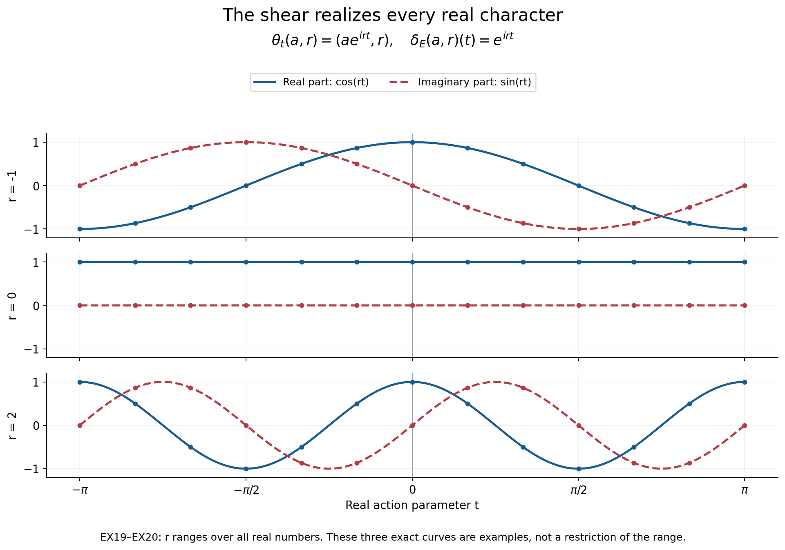

# Coordinates for equivariant central extensions

A representative of a quotient element usually fails to respect multiplication. A symmetry can move that representative away from the representative chosen at its image. Two central factors record these failures. We derive their identities from the operations they describe, reconstruct the extension, and identify exactly what an additional real action contributes.

*Original exposition, examples and reproducible figures in this lesson are dedicated to CC0-1.0. Source publications and fonts retain their own terms.*

## 1. The data and the direction of the coordinates

Let \(L\) be a Polish group acting continuously by automorphisms on a Polish abelian group \(A\) and a Polish group \(N\). Write \(ga\) and \(gn\) for these two actions; \(N\) need not be abelian. An equivariant Polish central extension means an exact sequence
\[
 1\longrightarrow A\xrightarrow{i}E\xrightarrow{q}N\longrightarrow1,
 \tag{EX1}
\]
where \(E\) is Polish, \(i\) is a homeomorphism onto a closed central subgroup, \(q\) is continuous and open, and the continuous \(L\)-action on \(E\) intertwines the specified actions. We identify \(A\) with \(i(A)\) only inside such an extension.

**Measurable-homomorphism lemma.** Every Borel homomorphism \(f:G\to K\) between Polish groups is continuous. If it is bijective and its inverse is Borel, it is a topological isomorphism.

**Proof.** Given an identity neighbourhood \(U\subset K\), choose an open identity neighbourhood \(V\) with \(V^{-1}V\subset U\). A countable dense set gives a cover \(K=\bigcup_j k_jV\). Thus the Borel sets \(B_j=f^{-1}(k_jV)\) cover the Baire space \(G\), and some \(B_j\) is nonmeagre. Borel sets have the Baire property: sets differing from open sets by meagre sets form a sigma-algebra containing all opens. For complements, replace the complement of an open set by its interior; the difference is contained in its nowhere dense boundary. Countable unions preserve the property directly. The [proved Pettis theorem, PB8.2](../../NCG-FOLIATIONS/companions/polish-spaces-and-standard-borel-spaces.html#oa-fnd-pb-14) says that \(B_j^{-1}B_j\) contains an identity neighbourhood, and
\[
 f(B_j^{-1}B_j)\subset V^{-1}V\subset U.
\]
Thus \(f^{-1}(U)\) contains an identity neighbourhood. This proves continuity at the identity, and the homomorphism law proves it everywhere. Apply the same argument to the inverse for the last assertion. \(\square\)

The [closed-coset section theorem](../../NCG-FOLIATIONS/companions/polish-spaces-and-standard-borel-spaces.html#oa-fnd-pb-10), proved there by nested representatives, supplies a Borel section \(s:N\to E\) with \(s(1)=1\). Closedness of \(A\) is used. The [Polish quotient theorem](../../NCG-FOLIATIONS/companions/polish-spaces-and-standard-borel-spaces.html#oa-fnd-pb-13) uses the quotient topology, which must not be replaced by the topology inherited from an unrelated representation of \(N\).

Define the **input-coordinate factors**
\[
 \begin{aligned}
 m(n,p)&=s(n)s(p)s(np)^{-1},\\
 \ell_g(n)&=g(s(n))s(gn)^{-1}.
 \end{aligned}
 \tag{EX2}
\]
The quotient of each expression is \(1\), so both have values in \(A\). They are Borel in all their displayed variables, because the section is Borel, the actions and operations are continuous, and \(i^{-1}:i(A)\to A\) is continuous. The argument of \(\ell_g\) is the element before applying \(g\).

**Factor identities.** For all \(n,p,r\in N\) and \(g,h\in L\),
\[
 \begin{aligned}
 m(n,p)m(np,r)&=m(n,pr)m(p,r),\\
 \ell_{gh}(n)&=g(\ell_h(n))\ell_g(hn),\\
 \ell_g(n)\ell_g(p)m(gn,gp)&=g(m(n,p))\ell_g(np).
 \end{aligned}
 \tag{EX3}
\]
Their complete normalizations are
\[
 m(1,n)=m(n,1)=1,\qquad
 \ell_1(n)=1,\qquad\ell_g(1)=1.
 \tag{EX4}
\]

**Proof.** The two associations of \(s(n)s(p)s(r)\), after moving central factors to the left, are \(m(n,p)m(np,r)s(npr)\) and \(m(p,r)m(n,pr)s(npr)\). Cancel the last representative. Next apply \(g\) to \(h(s(n))=\ell_h(n)s(hn)\), and compare the result with the definition of \(\ell_{gh}\). Finally apply \(g\) to \(s(n)s(p)=m(n,p)s(np)\). Multiplying the individual images gives the left side of the third identity, followed by \(s(g(np))\); applying \(g\) to the product formula gives its right side, followed by the same representative. Cancellation proves the identity. Each assertion in (EX4) follows separately from \(s(1)=1\). \(\square\)

The first equation measures associativity, the second the action law, and the third compatibility between action and multiplication. Omitting the third equation would permit a family of bijections that does not preserve the reconstructed multiplication.

## 2. Reconstruction before choosing a topology

Suppose now that Borel maps \(m:N^2\to A\) and \(\ell:L\times N\to A\) are given and satisfy (EX3)–(EX4). Give the standard Borel space \(A\times N\) the operations
\[
 \begin{aligned}
 (a,n)(b,p)&=(abm(n,p),np),\\
 (a,n)^{-1}&=(a^{-1}m(n,n^{-1})^{-1},n^{-1}),\\
 g(a,n)&=(g(a)\ell_g(n),gn).
 \end{aligned}
 \tag{EX5}
\]
Call the resulting object \(E_m\).

**Reconstruction theorem.** These formulas make \(E_m\) a standard Borel group and give a jointly Borel action of \(L\) by group automorphisms. Its central kernel is \(a\mapsto(a,1)\), and its quotient homomorphism is \(q(a,n)=n\). For factors obtained from an extension (EX1),
\[
 F_s:E_m\longrightarrow E,\qquad F_s(a,n)=a s(n)
 \tag{EX6}
\]
is a Borel equivariant group isomorphism whose inverse is
\[
 x\longmapsto\bigl(x s(qx)^{-1},qx\bigr).
 \tag{EX7}
\]

**Proof.** The first coordinates of the two triple products are \(abc\,m(n,p)m(np,r)\) and \(abc\,m(p,r)m(n,pr)\); (EX3) equates them. Normalization gives the identity \((1,1)\). Substituting \((n,n^{-1},n)\) in the first identity gives \(m(n,n^{-1})=m(n^{-1},n)\), which verifies both inverse products in (EX5). The formulas are Borel, including inversion. Normalization also shows that \((a,1)\) is central and that it is the entire kernel of \(q\).

The first coordinates of \(g((a,n)(b,p))\) and \(g(a,n)g(b,p)\) agree by the third factor identity. The second identity gives \(g(h(a,n))=(gh)(a,n)\). Equation (EX4) makes the identity of \(L\) act identically, so the map for \(g^{-1}\) is the inverse of the map for \(g\). This proves the asserted action.

Every \(x\in E\) has the unique form \(a s(n)\) with \(n=qx\) and \(a=x s(qx)^{-1}\in A\). Both coordinate maps are Borel. Substitution of (EX2) proves that (EX6) preserves multiplication and the action. \(\square\)

This theorem does not put the product topology on \(E_m\). If \(m\) is discontinuous, that topology need not make multiplication continuous. The [full realization theorem R9](OA-FLOW-BRL.md#real-unrestricted) constructs the unique compatible Polish topology for every such pair and proves joint continuity of its action. The [closed-factorization theorem R3](OA-FLOW-BRL.md#real-closed-factorization) identifies that topology in concrete ambient models. For data extracted from (EX1), transport through (EX6) already supplies it.

## 3. Changing representatives and classifying existing extensions

Let \(b:N\to A\) be Borel with \(b(1)=1\). Changing the section to \(s'(n)=b(n)s(n)\) gives
\[
 \begin{aligned}
 m^b(n,p)&=b(n)b(p)b(np)^{-1}m(n,p),\\
 \ell^b_g(n)&=g(b(n))b(gn)^{-1}\ell_g(n).
 \end{aligned}
 \tag{EX8}
\]
Both equations follow by direct substitution into (EX2); centrality allows the \(b\)-factors to be grouped. They preserve (EX3)–(EX4), either by substitution or by applying Section 1 to the section \(n\mapsto(b(n),n)\) in \(E_m\).

The exact direction of the coordinate change is
\[
 T_b:E_{m^b}\longrightarrow E_m,
 \qquad T_b(a,n)=(ab(n),n).
 \tag{EX9}
\]
For inputs \((a,n),(c,p)\), the first coordinate after applying \(T_b\) to their product is
\[
 ac\,m^b(n,p)b(np)
 =ac\,b(n)b(p)m(n,p).
\]
This is the first coordinate of \(T_b(a,n)T_b(c,p)\). For equivariance the needed equality is \(\ell^b_g(n)b(gn)=g(b(n))\ell_g(n)\). The inverse multiplies by \(b(n)^{-1}\). Thus (EX9) is a Borel equivariant isomorphism over the identities on \(A,N\).

Let \(\mathscr Z_L(N,A)\) be the abelian group of all Borel pairs satisfying (EX3)–(EX4), under pointwise multiplication. Let \(\partial b\) denote the pair multiplying \((m,\ell)\) in (EX8). The equality \(\partial(bc)=(\partial b)(\partial c)\) makes their image a subgroup. Put
\[
 \mathscr H_L(N,A)=\mathscr Z_L(N,A)/\partial\operatorname{Map}_1^{\rm Borel}(N,A).
 \tag{EX10}
\]
Here the three acting groups and their actions are fixed. The class associated with an actual extension is independent of the section.

**Classification of existing extensions.** Two equivariant Polish central extensions with the specified \(A,N,L\) determine the same class in (EX10) if and only if there is an equivariant topological group isomorphism between them inducing the identity on \(A\) and \(N\).

**Proof.** Equality of classes supplies a Borel \(b\) and hence (EX9). Compose it with the two isomorphisms (EX6). The resulting map and inverse are Borel homomorphisms between Polish groups, so [the measurable-homomorphism lemma](#automatic-continuity) makes the map a homeomorphism. Conversely, transport a section through a specified isomorphism. It and the section in the target have the same quotient value, so their ratio is a unique Borel function \(b:N\to A\), normalized at \(1\). Formula (EX8) then compares the factors. \(\square\)

This proves injectivity of the assignment from topological extensions into (EX10). The [full realization theorem R9](OA-FLOW-BRL.md#real-unrestricted) proves surjectivity for arbitrary Polish \(A,N,L\): every Borel pair has the required unique compatible Polish realization. Thus (EX10) is a classification of the specified equivariant Polish central extensions. The [closed-factorization theorem](OA-FLOW-BRL.md#real-closed-factorization) identifies the concrete realization of the operator-algebra class.

## 4. A real action and the full realization condition

Assume \(L=\Gamma\times\mathbb R\), and that the real factor acts trivially on \(N\). Denote its action on \(A\) by \(\theta_t\). Let
\[
 \begin{aligned}
 Z&=\{c\in C(\mathbb R,A):c_{t+u}=c_t\theta_t(c_u)\},\\
 \delta_A(a)(t)&=a^{-1}\theta_t(a),\qquad
 B=\delta_A(A),\qquad H=Z/B.
 \end{aligned}
 \tag{EX11}
\]
These are abelian groups. A cocycle satisfies \(c_0=1\), and pointwise multiplication and inverse preserve its identity because \(A\) is abelian.

For each \(n\in N\), (EX3) says that \(t\mapsto\ell_t(n)\) is a Borel cocycle. It is automatically continuous: \(t\mapsto(\ell_t(n),t)\) is a Borel homomorphism into the Polish semidirect product \(A\rtimes_\theta\mathbb R\), so the measurable-homomorphism lemma applies. The semidirect product has the product Polish topology; its group operations are continuous by the given continuous action. Write \(\ell_{\mathbb R}(n)\in Z\) for this cocycle. No continuity of the section in \(n\) is being assumed.

In \(E_m\), the displacement of a real action is central and has the exact sign
\[
 \delta_E(a,n)(t)=(a,n)^{-1}\theta_t(a,n)
                 =a^{-1}\theta_t(a)\ell_t(n).
 \tag{EX12}
\]
For example one can verify (EX12) by multiplying the central element on its right by \((a,n)\); the result is \((\theta_t(a)\ell_t(n),n)\). This avoids an unnecessary interchange of noncentral coordinates.

**Surjectivity criterion.** Every continuous \(A\)-valued real cocycle is \(\delta_E(x)\) for some \(x\in E_m\) if and only if
\[
 \boxed{\quad Z=\bigcup_{n\in N} B\,\ell_{\mathbb R}(n).\quad}
 \tag{EX13}
\]
The condition uses entire cosets, not just the range of \(\ell_{\mathbb R}\).

**Proof.** Formula (EX12) computes the image exactly as the union in (EX13). Each inclusion follows by taking the displayed \(a,n\), or by writing an element of the image in those coordinates. \(\square\)

Applying the third identity in (EX3) to the real factor gives
\[
 \ell_t(n)\ell_t(p)\ell_t(np)^{-1}
      =m(n,p)^{-1}\theta_t(m(n,p))
      =\delta_A(m(n,p))(t).
 \tag{EX14}
\]
Consequently
\[
 \nu:N\longrightarrow H,\qquad
 \nu(n)=[\ell_{\mathbb R}(n)]
 \tag{EX15}
\]
is a homomorphism. Its range is all of \(H\) precisely when (EX13) holds. In general \(n\mapsto\ell_{\mathbb R}(n)\) itself is not a homomorphism into \(Z\); the explicit defect is (EX14).

Under (EX8), \(\ell^b_t(n)=\delta_A(b(n))(t)\ell_t(n)\), because \(tn=n\). Thus \(\nu\) and (EX13) are unchanged by gauge. The classes satisfying (EX13) form a distinguished subset of (EX10); no assertion that this subset is a subgroup is needed.

## 5. Recovering every term of the square

Suppose (EX13) holds. The following exactness statement is algebraic: it uses no closedness hypothesis on an abstract central kernel and no topology on the reconstructed group. Set
\[
 A_0=A^{\mathbb R},\qquad E_0=E_m^{\mathbb R},\qquad D=E_0/A_0.
 \tag{EX16}
\]
The rows and columns of the following array are exact, with identity groups understood at both ends of each row and column:
\[
 \begin{array}{ccccc}
 A_0&\longrightarrow&A&\xrightarrow{\delta_A}&B\\
 \big\downarrow&&\big\downarrow&&\big\downarrow\\
 E_0&\longrightarrow&E_m&\xrightarrow{\delta_E}&Z\\
 \big\downarrow&&\big\downarrow&&\big\downarrow\\
 D&\longrightarrow&N&\xrightarrow{\nu}&H.
 \end{array}
 \tag{EX17}
\]

**Proof.** For \(x,y\in E_m\), centrality of \(x^{-1}\theta_t(x)\) gives
\[
 (xy)^{-1}\theta_t(xy)
 =y^{-1}\delta_E(x)(t)\theta_t(y)
 =\delta_E(x)(t)\delta_E(y)(t).
\]
Thus \(\delta_E\) is a homomorphism, and its kernel is exactly \(E_0\). It is onto by (EX13). The corresponding assertions for \(\delta_A\) follow from its definition. The left column is the definition of \(D\); the middle column is (EX5); the right column is the definition of \(H\). The induced \(D\to N\) is injective because \(E_0\cap A=A_0\).

If \(n=q(x)\) for \(x\in E_0\), then \(\nu(n)=[\delta_E(x)]=1\). Conversely if \(\nu(n)=1\), take any \(x\in q^{-1}(n)\). Its displacement lies in \(B\), so choose \(a\in A\) with \(\delta_A(a)=\delta_E(x)\). The element \(a^{-1}x\) is fixed and still has quotient \(n\). This proves exactness of the bottom row at \(N\). Its surjectivity follows from (EX13). Every square commutes by restriction or passage to quotients. \(\square\)

Define the action on cocycles by
\[
 (gc)(t)=g(c(t))\qquad(g\in L).
 \tag{EX18}
\]
The real subgroup is central in \(L\), so this preserves the cocycle identity and sends \(\delta_A(a)\) to \(\delta_A(ga)\). The same commutation gives \(\delta_E(gx)=g(\delta_E(x))\). Hence every arrow in (EX17) is equivariant. In particular \(\nu(gn)=g\nu(n)\), which can also be checked directly from the mixed factor identities.

The [next lesson's topology theorem](OA-FLOW-BRL.md#real-cocycle-topology) equips every term of this algebraic square with its precise subgroup or quotient topology. That argument proves the path-space and displacement assertions before using the Polish open-mapping theorem, and treats the possible non-Hausdorff quotient \(H\) explicitly.

## 6. A real shear with every character present

Take \(A=\mathbb T\), \(N=(\mathbb R,+)\), \(E=\mathbb T\times\mathbb R\), and let the real action be
\[
 \theta_t(a,r)=(a e^{irt},r).
 \tag{EX19}
\]
It is a continuous action by group automorphisms. Its restriction to \(A=\mathbb T\times\{0\}\) is trivial. With \(s(r)=(1,r)\), its factors and displacements are
\[
 m(r,u)=1,\quad \ell_t(r)=e^{irt},\quad
 \delta_E(a,r)(t)=e^{irt}.
 \tag{EX20}
\]
Every continuous character of the real line is \(t\mapsto e^{irt}\) for a unique \(r\in\mathbb R\). Here is a direct proof. A continuous character \(c\) has a continuous argument \(f\) near \(0\), chosen with \(f(0)=0\) and values in a small interval about \(0\). For sufficiently small \(s,t,s+t\), the cocycle identity says \(f(s+t)-f(s)-f(t)\in2\pi\mathbb Z\). Continuity and the value at \((0,0)\) force this difference to be zero. Fix a small positive \(a\); subdivision and rational multiples give \(f(qa)=qf(a)\) whenever \(q\in\mathbb Q\) and the arguments stay in the interval. Continuity gives \(f(t)=rt\) throughout a smaller interval, with \(r=f(a)/a\). For arbitrary \(t\), divide \(t\) into sufficiently many equal small increments. The character identity then gives \(c(t)=e^{irt}\). If two parameters gave the same character, \(e^{i(r-r')t}=1\) for every \(t\), forcing \(r=r'\).

Thus \(B=1\), \(Z=H\cong\mathbb R\), \(A_0=E_0=\mathbb T\times\{0\}\), \(D=1\), and \(\nu(r)=r\). Condition (EX13) holds exactly. The character parameter has its usual topology: \(r_j\to r\) gives uniform convergence on compact time intervals. Conversely, if \(e^{i(r_j-r)t}\to1\) uniformly for \(|t|\le1\), then for any \(\varepsilon>0\), every frequency with \(|r_j-r|\ge\varepsilon\) has a time \(|t|\le1\) at which its phase is separated from \(1\) by a positive constant depending only on \(\varepsilon\). Indeed use \(t=\min(1,\pi/|r_j-r|)\), with its sign chosen to match the frequency, and the minimum of \(|e^{iu}-1|\) for \(u\in[\min(\varepsilon,\pi),\pi]\). This proves the inverse continuity.

*Figure 1.* The real and imaginary parts of three characters in (EX20), at the exact parameters \(r=-1,0,2\). Every row starts at \(1\) when \(t=0\). The whole parameter line, rather than these three samples, is the proved range of \(\delta_E\) and \(\nu\). The dotted samples are illustrative evaluations; the formulas establish (EX13) without numerical approximation.

A nonlinear change of section is already visible in this model. Set \(b(r)=e^{ir^2}\). Formula (EX8) gives
\[
 m^b(r,u)=e^{-2iru},\qquad \ell^b_t(r)=e^{irt}.
 \tag{EX21}
\]
The multiplication is now twisted, but (EX9) identifies the extension with the original product by \((a,r)\mapsto(ae^{ir^2},r)\). The real quotient invariant has not changed.

## 7. Solved checks

**1. Can a surjective character parameter be replaced by a dense one?** No. Let \(N=\mathbb Q\) with its discrete Polish topology and use (EX19) on \(\mathbb T\times\mathbb Q\). The action is continuous, its factors satisfy every equation (EX3)–(EX4), and its realized frequencies are exactly \(\mathbb Q\). The character \(t\mapsto e^{i\sqrt2t}\) is not realized. Since \(B=1\), (EX13) fails, although the realized frequencies are dense in the compact-open character topology. Exactness requires surjectivity, not density.

**2. Does a fixed quotient element have a fixed chosen representative?** Not necessarily. Its obstruction is \(\nu(n)\). If this obstruction vanishes, the proof after (EX17) gives a fixed representative \(a^{-1}s(n)\), where \(\delta_A(a)=\ell_{\mathbb R}(n)\). The initially chosen representative need not be fixed. Conversely a fixed representative makes the obstruction vanish. This proves both directions without a continuous choice of \(a\).

**3. Which way does a gauge map go?** With (EX8), it goes from \(E_{m^b}\) to \(E_m\) by multiplication by \(b(n)\), as in (EX9). Multiplication by \(b(n)^{-1}\) gives the inverse map with the opposite direction. Testing the kernel and a product of two section values detects a reversed convention immediately.

**4. How does one compare output-coordinate notation?** If a factor is instead evaluated at the output element, set
\[
 \lambda(n,g)=\ell_g(g^{-1}n),\qquad\mu(n,p)=m(n,p).
 \tag{EX22}
\]
Then the mixed identity becomes
\[
 \lambda(n,g)\lambda(p,g)\lambda(np,g)^{-1}
 =g\bigl(\mu(g^{-1}n,g^{-1}p)\bigr)\mu(n,p)^{-1}.
 \tag{EX23}
\]
To verify it, substitute \(g^{-1}n,g^{-1}p\) into the third line of (EX3) and rearrange only the central factors. The two factors on the left have different arguments \(n,p\). Substitution of \(p=1\) is a useful check: both sides become \(1\).

**5. Does the class classify factors?** The theorem in Section 3 classifies existing equivariant central extensions over specified acting data. It makes no assertion that two von Neumann algebras with equivalent such data are normally isomorphic. The [normal-isomorphism argument](OA-FLOW-BRL.md#real-intrinsic) proves only that an isomorphism transports the invariant.

## Reading

The characteristic-square construction and the output-coordinate notation occur in M. Takesaki, *Theory of Operator Algebras II*, Chapter XII, §6, pp. 453–454, especially Proposition 6.17. Equations (EX2)–(EX9) organize the proof by the inputs to multiplication and symmetry. Equations (EX13)–(EX17) separate exact realization of real cocycles from reconstruction of the underlying extension. Equation (EX23) spells out the two distinct variables in the mixed identity. The topological issues require the additional arguments in the next lesson.
