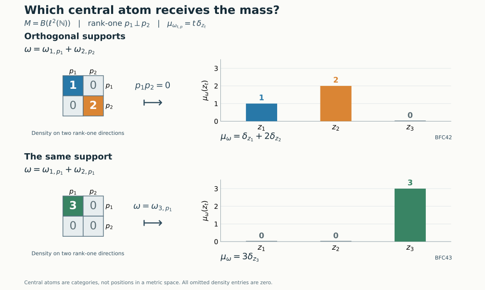

# Finite carrier projections and their normal center measures

Bounded normal functionals have finite carrier projections, while weights of infinite multiplicity have central carrier projections. The connection is countable amplification. We construct the finite carrier and its trace first, recover comparison from normal functionals on its center, and then identify that center with the precise summand of the global carrier reached by amplified bounded functionals.

*Original exposition, examples, figures, data and reproducible drawing code in this lesson are dedicated to CC0-1.0. Source publications and font components retain their own terms.*

## Hypotheses and comparison

The finite-carrier construction and center-measure comparison below hold for every von Neumann algebra \(M\), without countability or factoriality. The amplification and its center embedding require that \(M\ne0\) have properly infinite identity. When \(M\) also has separable predual, the universal balanced center is the global carrier of infinite-multiplicity weights, with its full comparison interpretation. No type III hypothesis or faithful-functional hypothesis is imposed.

All weights are normal and semifinite; their modular groups and centralizers are taken on the faithful support corners supplied by [NWR1](OA-FLOW-NWR.md#nwr-1) and [NWR4](OA-FLOW-NWR.md#nwr-4). For weights \(\alpha,\beta\), write \(\alpha\sim\beta\) when
\[
 a^*a=s(\alpha),\qquad aa^*=s(\beta),\qquad
 \alpha(x)=\beta(axa^*)\quad(x\in M_+)
 \tag{BFC1}
\]
for a partial isometry \(a\in M\). Write \(\alpha\precsim\beta\) when \(\alpha\sim\beta_f\) for a projection \(f\in M_\beta\), where \(\beta_f(x)=\beta(fxf)\). This is comparison by a centralizer cut, rather than pointwise order of functionals. Every infinite value is retained in weight identities.

## 1. The balanced algebra of bounded normal functionals

Let \(J=M_*^+\setminus\{0\}\), \(p_\omega=s(\omega)\), and
\[
 A_J=M\bar\otimes B(\ell^2J),\qquad
 \Omega(X)=\sum_{\omega\in J}\omega(X_{\omega\omega}),\qquad
 S=\sum_{\omega\in J}p_\omega\otimes e_{\omega\omega}.
 \tag{BFC2}
\]
Every nonnegative sum is the supremum of its finite subsums. The arbitrary bounded-array description in [TW1](OA-FLOW-TW.md#tw-1) specifies the actual tensor algebra and all its matrix entries.

Finite unions of index sets prove additivity of \(\Omega\), including at infinity. Diagonal compression preserves bounded increasing positive suprema. Interchanging the finite-subset supremum with the increasing-net supremum therefore proves normality. A normal positive functional satisfies \(\omega(x)=\omega(p_\omega x p_\omega)\): Cauchy–Schwarz annihilates both terms having a factor \(1-p_\omega\). Consequently \(\Omega(X)=\Omega(SXS)\). If this value is zero for \(X\ge0\), then
\(\|X^{1/2}(p_\omega\xi\otimes\delta_\omega)\|^2=0\) for every \(\omega,\xi\); hence \(X^{1/2}S=0\). Thus the support is exactly \(S\), and \(\Omega\) is faithful on \(SA_JS\).

For a finite subset \(E\subset J\), put
\[
 q_\omega=p_\omega\otimes e_{\omega\omega},\qquad
 e_E=\sum_{\omega\in E}q_\omega,\qquad
 \Omega(e_E)=\sum_{\omega\in E}\omega(1)<\infty.
 \tag{BFC3}
\]
These projections increase strongly to \(S\). The contractions \(e_E+(1-S)\) have finite weight and increase to one; the complete [finite-contraction criterion](OA-FLOW-GW.md#oa-flow.gw.4) proves semifiniteness on \(A_J\). On the support corner the same argument uses \(e_E\) alone.

Each \(q_\omega\) belongs to the reduced centralizer: the unitary \(S-2q_\omega\) preserves every diagonal value in (BFC2), so the [whole-cone centralizer criterion](OA-FLOW-CZ.md#cz-0) puts it, and then \(q_\omega\), in that centralizer. Define
\[
 \mathcal F=(SA_JS)_\Omega,\qquad
 \mathcal C=Z(\mathcal F),\qquad q_M(\omega)=q_\omega .
 \tag{BFC4}
\]
The identity of \(\mathcal F\) and \(\mathcal C\) is \(S\). The [centralizer-corner theorem](OA-FLOW-CZ.md#cz-5) identifies, with their normal structures and exact weights,
\[
 q_\omega\mathcal Fq_\omega\cong M_\omega .
 \tag{BFC5}
\]
More generally, compression to any finite sum of the \(q_\omega\)'s gives the corresponding finite balanced weight and its actual modular group.

## 2. The balanced restriction is a semifinite trace

The restriction
\[
 \tau=\Omega|_{\mathcal F_+}
 \tag{BFC6}
\]
is faithful and normal. It is semifinite because the finite-trace projections \(e_E\) increase to its identity. Here is a proof of its trace law on the entire positive cone, without assuming that a centralizer restriction is automatically semifinite.

If \(x\in\mathcal F\), put \(b=(x^*x)^{1/2}\in\mathcal F\). The [finite-domain cyclicity and ideal stability](OA-FLOW-CZ.md#cz-0) apply to the finite positive element \(e_E\) and the centralizer elements \(x,b\). They give
\[
 \Omega(xe_Ex^*)=\Omega_0(e_Ex^*x)
                =\Omega(be_Eb)<\infty.
 \tag{BFC7}
\]
For example \(xe_Ex^*\) and \(be_Eb\) lie in the finite algebra because multiplication by a centralizer element preserves that algebra. Both positive nets increase as \(E\) increases; their suprema are \(xx^*\) and \(x^*x\), respectively. Normality yields
\[
 \tau(xx^*)=\tau(x^*x)\quad(x\in\mathcal F),
 \qquad \tau(q_\omega)=\omega(1).
 \tag{BFC8}
\]
This proves the trace identity even when both sides are infinite.

Every \(q_\omega\) is a finite projection. Indeed if \(v^*v=q_\omega\) and \(vv^*\le q_\omega\) in \(\mathcal F\), the trace law and its finite value give
\(\tau(q_\omega-vv^*)=0\); faithfulness forces \(vv^*=q_\omega\). These projections also prove semifiniteness in projection language. A nonzero projection \(r\in\mathcal F\) has \(rq_\omega\ne0\) for some \(\omega\), since their sum is \(S\). The polar part of \(rq_\omega\) supplies a nonzero subprojection of \(r\) equivalent to a subprojection of \(q_\omega\), hence finite by [PC1](OA-FLOW-PC.md#pc-1) and [PC5](OA-FLOW-PC.md#pc-5).

For nonzero \(M\), \(\mathcal F\) has nonseparable predual. Fix \(0\ne\omega_0\in M_*^+\). The projections \(q_{t\omega_0}\), \(t>0\), are distinct orthogonal nonzero projections. The normal states
\[
 f_t(x)=\frac{\tau(q_{t\omega_0}xq_{t\omega_0})}{t\omega_0(1)}
 \quad(x\in\mathcal F)
 \tag{BFC9}
\]
have distance two for distinct parameters: the contraction
\(q_{t\omega_0}-q_{s\omega_0}\) takes the values \(1,-1\). A separable metric space cannot contain an uncountable family whose mutual distances are two, since a countable dense set and balls of radius less than one would assign distinct dense-set points to its members. This proves nonseparability of this finite-functional carrier, separately from any assertion about the global abelian carrier.

The map \(q_M\) takes its values in finite projections. It is not asserted to enumerate all finite projections, or even all projections of finite \(\tau\)-value. Murray–von Neumann finiteness and finite scalar trace are different conditions on a general semifinite algebra.

## 3. Comparison is recorded by the finite carrier

We first record the transport argument inside a balanced centralizer. For a family of normal semifinite weights \((\varphi_i)\), its balanced sum on the supported matrix algebra is normal and semifinite. Normality and support follow just as in Section 1. For semifiniteness use, in each support corner, the increasing finite positive contractions supplied by [GW4](OA-FLOW-GW.md#oa-flow.gw.4); finite diagonal sums of these contractions form a directed increasing net tending to the whole support. Each diagonal support is fixed by its sign unitary, as above. The restriction to a finite sum of diagonal supports has the balanced modular group by [CZ5](OA-FLOW-CZ.md#cz-5). Thus the following argument applies inside an arbitrary indexed balanced sum.

Suppose \(a^*a=s(\alpha)\), \(aa^*=f\in M_\beta\), and
\(\alpha(x)=\beta(axa^*)\) for \(x\ge0\). In the balanced pair, place
\(v=a\otimes e_{21}\); its initial projection is the full \(\alpha\)-diagonal \(d\), and its final projection is the \(\beta\)-cut \(g=f\otimes e_{22}\). The projection \(d+g\) is fixed. On that corner the selfadjoint unitary \(v+v^*\) interchanges the two diagonal corners and preserves their balanced weight: its two diagonal values are transported into each other by the given equality and its inverse. The whole-cone criterion in CZ0 puts \(v+v^*\) in this corner centralizer. Multiplication by the fixed diagonal projections gives
\[
 v=g(v+v^*)d\quad\text{in the balanced centralizer}.
 \tag{BFC10}
\]
CZ5 identifies this with fixedness in the full balanced algebra.

Conversely, suppose such a partial isometry \(v\) is fixed. Its two support projections are fixed. For \(X\ge0\) in its initial corner with finite balanced weight, finite-domain cyclicity gives
\(\Omega(vXv^*)=\Omega_0(Xv^*v)=\Omega(X)\).
If the transported value is finite, apply the same argument to \(v^*\) to obtain finiteness and equality in the reverse direction. Consequently the equality holds at infinity as well. Extracting the single matrix entry proves the supported weight equality. This is also the precise comparison statement in the earlier [balanced-centralizer proof](../../OA-MOD/OA-MOD-WC.html#the-balanced-centralizer-records-every-comparison).

Apply the argument to \(\omega_1,\omega_2\) inside \(\mathcal F\). Every partial isometry between their diagonal corners has the form \(a\otimes e_{\omega_2,\omega_1}\). Its final projection belongs to the appropriate corner centralizer by (BFC5). We obtain
\[
 \boxed{\quad
 \omega_1\precsim\omega_2
 \iff q_M(\omega_1)\precsim q_M(\omega_2)\text{ in }\mathcal F,
 \qquad
 \omega_1\sim\omega_2
 \iff q_M(\omega_1)\sim q_M(\omega_2).
 \quad}
 \tag{BFC11}
\]
If the two labels are identical, both assertions are immediate. Otherwise the two-coordinate proof applies directly. Comparison in \(A_J\) alone would lose the required weight identity; the implementer must lie in \(\mathcal F\).

## 4. Center measures recover the complete comparison order

For a projection \(p\in\mathcal F\) with \(\tau(p)<\infty\), define
\[
 \mu_p(c)=\tau(cp)\quad(c\in\mathcal C_+),\qquad
 \mu_\omega=\mu_{q_\omega},\qquad \mu_0=0.
 \tag{BFC12}
\]
This is a bounded normal positive functional. Indeed \(cp=pcp\), and the restriction of \(\tau\) to \(p\mathcal Fp\) is a bounded normal functional of norm \(\tau(p)\); compose it with the normal compression of \(\mathcal C\). Its full ultraweak normality can also be seen from (BFC2): the diagonal positive functionals on \(p\mathcal Fp\) have norms \(\omega(p_{\omega\omega})\) summing to \(\tau(p)<\infty\). Only countably many have nonzero norm; their norm sum lies in the norm-closed predual, as in [FCT0](OA-FLOW-FCT.md#fct-0), and equals the restricted trace. Thus
\[
 \|\mu_\omega\|=\mu_\omega(S)=\omega(1),\qquad
 s_{\mathcal C}(\mu_\omega)=z_{\mathcal F}(q_\omega).
 \tag{BFC13}
\]
For the support identity, a central projection \(z\) has \(\mu_p(z)=0\) exactly when \(\tau(zp)=0\), hence exactly when \(zp=0\). The largest such central projection is \(S-z_{\mathcal F}(p)\).

We prove the following trace comparison statement for arbitrary \(\tau\)-finite projections in \(\mathcal F\):
\[
 \mu_p\le\mu_q\iff p\precsim q,\qquad
 \mu_p=\mu_q\iff p\sim q .
 \tag{BFC14}
\]
If \(v^*v=p\), \(vv^*\le q\), centrality and the trace law give, for \(c\in\mathcal C_+\),
\[
 \tau(cp)=\tau((vc^{1/2})^*(vc^{1/2}))
         =\tau(cvv^*)\le\tau(cq).
 \tag{BFC15}
\]
For the converse, [PC2's central comparison](OA-FLOW-PC.md#pc-2) provides a central projection \(z\) such that \(zp\precsim zq\) and \((S-z)q\precsim(S-z)p\). Let \(v\) implement the latter subequivalence and put
\(r=(S-z)p-vv^*\ge0\). Evaluating the functional inequality at \(S-z\) gives
\[
 0\le\tau(r)
   =\tau((S-z)p)-\tau((S-z)q)\le0.
 \tag{BFC16}
\]
Both subtracted numbers are finite; this is the point at which \(\tau(p),\tau(q)<\infty\) matter. Faithfulness gives \(r=0\). Reverse \(v\) on that central piece and add it to the implementation of \(zp\precsim zq\), using the orthogonal-sum theorem in [PC1](OA-FLOW-PC.md#pc-1). This proves \(p\precsim q\). Equality gives mutual comparison and then [PC3's Cantor–Bernstein theorem](OA-FLOW-PC.md#pc-3).

Combining (BFC11) and (BFC14) proves the finite-functional carrier theorem:
\[
 \boxed{\quad
 \omega_1\precsim\omega_2
 \iff \mu_{\omega_1}\le\mu_{\omega_2},\qquad
 \omega_1\sim\omega_2
 \iff \mu_{\omega_1}=\mu_{\omega_2}.
 \quad}
 \tag{BFC17}
\]
The order on the right is ordinary order of normal positive functionals on the fixed abelian algebra \(\mathcal C\). No surjectivity onto all of \(\mathcal C_*^+\) is asserted.

There is also an exact finite-corner formulation using the current center-valued trace theorem. For \(\tau\)-finite \(p,q\), let \(e=p\vee q\). The [join identity in PC3](OA-FLOW-PC.md#pc-3) gives
\((p\vee q)-p\sim q-(p\wedge q)\), so
\[
 \tau(e)\le\tau(p)+\tau(q)<\infty.
 \tag{BFC18}
\]
Hence \(e\) is finite. On \(K=e\mathcal Fe\), let
\(T_e:K\to Z(K)\) be the normalized faithful normal center-valued trace constructed in [FCT1–7](OA-FLOW-FCT.md#fct-1). Let \(\rho_e=\tau|_{Z(K)}\), a faithful finite normal functional. Then
\[
 \tau|_K=\rho_e\circ T_e .
 \tag{BFC19}
\]
To prove this identity, use the central tiles actually constructed in [FCT3](OA-FLOW-FCT.md#fct-3). If \(r=r_1\sim\cdots\sim r_k\) and \(\sum_i r_i=w\in Z(K)\), then \(\tau(r)=\tau(w)/k\), while \(T_e(r)=w/k\). Thus both sides of (BFC19) agree on each tile. Every projection is an orthogonal sum of such tiles; normality proves equality on projections, and uniform spectral step approximation proves equality on all of \(K_+\).

By [PC4](OA-FLOW-PC.md#pc-4), \(c\mapsto ce\) identifies
\(\mathcal C z_{\mathcal F}(e)\) normally with \(Z(K)\). Therefore
\[
 \mu_p(c)=\rho_e\bigl((ce)T_e(p)\bigr),\qquad
 \mu_q(c)=\rho_e\bigl((ce)T_e(q)\bigr).
 \tag{BFC20}
\]
Faithfulness of \(\rho_e\) and testing the negative spectral projection of \(T_e(q)-T_e(p)\) show that the order of these two functionals is exactly \(T_e(p)\le T_e(q)\). The [finite projection comparison theorem FCT7](OA-FLOW-FCT.md#fct-7) then gives the same criterion (BFC14). This uses a normalized center-valued trace only on the proved finite corner. The construction of \(\mu_\omega\) and its order requires no unproved extension of that normalized map to the possibly nonfinite algebra \(\mathcal F\), and no choice of a factorization of its entire semifinite trace through its center.

## 5. Orthogonal supports give additive center measures

Let \(\omega_1,\omega_2\in M_*^+\) have orthogonal supports \(p_1p_2=0\), and put \(\omega=\omega_1+\omega_2\). Zero terms are harmless. Assume both are nonzero. The support of \(\omega\) is \(p_1+p_2\), and
\[
 \omega(p_i x)=\omega(xp_i)=\omega_i(x)\quad(x\in M,\ i=1,2).
 \tag{BFC21}
\]
The equalities follow from support compression and orthogonality. In the faithful support corner the finite ideal is the whole algebra, so CZ0's cyclicity criterion puts each \(p_i\) in \(M_\omega\). Its cut is exactly \(\omega_i\).

In the \(\omega\)-coordinate of \(\mathcal F\), put
\[
 r_i=p_i\otimes e_{\omega\omega},\qquad
 r_1r_2=0,\qquad r_1+r_2=q_\omega.
 \tag{BFC22}
\]
Each \(r_i\) is fixed, and (BFC10) makes it equivalent in \(\mathcal F\) to \(q_{\omega_i}\); the transporter has coefficient \(p_i\) between the respective coordinates. The trace and centrality show that equivalent projections have the same \(\mu\). Thus for every \(c\in\mathcal C_+\),
\[
 \boxed{\quad
 \mu_{\omega_1+\omega_2}(c)
   =\tau(cr_1)+\tau(cr_2)
   =\mu_{\omega_1}(c)+\mu_{\omega_2}(c).
 \quad}
 \tag{BFC23}
\]
More generally this holds for any orthogonal-support family \((\omega_i)\) whose total norm is finite. Its nonzero terms are countable, because only finitely many norms can exceed any fixed positive threshold. Their sum converges in the predual norm to a normal positive functional \(\omega\). The same support decomposition in the \(\omega\)-coordinate and normality give
\(\mu_\omega=\sum_i\mu_{\omega_i}\); the right side also converges in predual norm since \(\|\mu_{\omega_i}\|=\|\omega_i\|\). The empty family gives zero. No assertion of additivity for overlapping supports has been used.

## 6. Amplify a bounded functional to infinite multiplicity

Now assume that \(M\ne0\) has properly infinite identity. Choose a filling family \((v_n)_{n\ge1}\) from [PC5](OA-FLOW-PC.md#pc-5):
\[
 v_n^*v_m=\delta_{nm}1,\qquad
 \sum_{n\ge1}v_nv_n^*=1\quad\text{strongly}.
 \tag{BFC24}
\]
On a faithful representation \(M\subseteq B(H)\), the map
\((\xi_n)\mapsto\sum_n v_n\xi_n\) is a unitary \(H\otimes\ell^2\to H\): orthogonality proves its isometry, and the filling identity proves surjectivity. Conjugation by this unitary defines the normal isomorphism with normal inverse
\[
 A_v:M\bar\otimes B(\ell^2)\longrightarrow M,\qquad
 A_v(x\otimes e_{mn})=v_mxv_n^*,\qquad
 (A_v^{-1}(x))_{mn}=v_m^*xv_n.
 \tag{BFC25}
\]
The bounded-array criterion proves that these formulas apply to the whole tensor algebra, not merely finite matrices.

For \(\omega\in M_*^+\), define
\[
 \dot\omega_v(x)=\sum_{n\ge1}\omega(v_n^*xv_n),\qquad
 P_{\omega,v}=s(\dot\omega_v)=A_v(p_\omega\otimes1).
 \tag{BFC26}
\]
The formula is \(A_v\)-transport of the tensor weight \(\omega\bar\otimes\operatorname{Tr}\), with rank-one trace normalized to one. On its support it is the faithful tensor weight of \(\omega|_{p_\omega Mp_\omega}\), constructed in [TW2–3](OA-FLOW-TW.md#tw-2); it is extended by zero via its support compression. The same finite diagonal-contraction argument as in Section 1 proves normal semifiniteness on the entire algebra. The [full tensor modular formula](OA-FLOW-TW.md#tw-5), followed by [normal isomorphism covariance](OA-FLOW-BC.md#bc-5), gives
\[
 M_{\dot\omega_v}
   \cong M_\omega\bar\otimes B(\ell^2).
 \tag{BFC27}
\]
Indeed the tensor fixed algebra is exactly the displayed tensor algebra: fixedness implies that every matrix entry is in \(M_\omega\), and bounded finite-coordinate compressions prove the converse. For nonzero \(\omega\) this algebra is properly infinite, since it contains the filling matrix isometries of its \(B(\ell^2)\) factor. Thus \(\dot\omega_v\) has infinite multiplicity.

The assignment \(\omega\mapsto\dot\omega_v\) is injective as a map of actual weights, since
\[
 \dot\omega_v(v_1xv_1^*)=\omega(x)\quad(x\in M_+).
 \tag{BFC28}
\]
This matters when its values are used as distinct labels in a universal balanced sum.

For another filling family \(v_n'\), [PC1](OA-FLOW-PC.md#pc-1) gives a unitary
\[
 w=\sum_{n\ge1}v_n'v_n^*\quad\text{strongly-*},\qquad
 A_{v'}=\operatorname{Ad}(w)\circ A_v,\qquad
 \dot\omega_{v'}(x)=\dot\omega_v(w^*xw).
 \tag{BFC29}
\]
Both initial and final projection sums are one, which verifies unitarity. The last identity follows term by term from \(w^*v_n'=v_n\) on all positive elements, including infinite values. Hence \(P_{\omega,v'}=wP_{\omega,v}w^*\), and the partial isometry \(wP_{\omega,v}\) implements
\(\dot\omega_v\sim\dot\omega_{v'}\) in the orientation (BFC1). The equivalence class is independent of the chosen filling family.

## 7. Identify the associated global center summand

Let \(I=W_\infty(M)\setminus\{0\}\), form its balanced weight \(\Lambda=\bigoplus_{\varphi\in I}\varphi\), and let \(Q\) be its centralizer on its support. The arbitrary-family construction of Section 3 gives this faithful reduced normal semifinite weight and identifies every finite balanced corner. Put
\[
 d_\varphi=s(\varphi)\otimes e_{\varphi\varphi}\in Q,\qquad
 \mathcal A=Z(Q),\qquad p_M(\varphi)=z_Q(d_\varphi),\qquad p_M(0)=0.
 \tag{BFC30}
\]
For separable-predual properly infinite \(M\), these are [the universal carrier and its weight map](OA-FLOW-CGF.md#cgf-3). The following center identification uses the concrete balanced realization directly, so does not require any factor assumption or any continuity assertion about the global scaling action.

Using the injectivity in (BFC28), the amplified functionals constitute an actual indexed subfamily of \(I\). Define
\[
 e_v=\sum_{\omega\in J}d_{\dot\omega_v}\in Q,\qquad
 a_v=z_Q(e_v)=\bigvee_{\omega\in J}p_M(\dot\omega_v).
 \tag{BFC31}
\]
The reduced weight of this subfamily is \(\dot\Omega_v=\bigoplus_{\omega\in J}\dot\omega_v\), and its centralizer is \(e_vQe_v\).

There is a normal isomorphism
\[
 \beta_v:\mathcal F\bar\otimes B(\ell^2)\overset{\cong}{\longrightarrow}e_vQe_v,
 \qquad
 \beta_v(q_\omega\otimes1)=d_{\dot\omega_v}.
 \tag{BFC32}
\]
To construct it, first permute the \(J\) and \(\mathbb N\) Hilbert coordinates, then apply \(A_v\) to \(M\bar\otimes B(\ell^2)\) in every \(J\)-matrix entry, and finally relabel \(\omega\) as the distinct weight \(\dot\omega_v\). The coordinate permutation is unitary; normal amplification and its inverse are supplied explicitly by [TW1](OA-FLOW-TW.md#tw-1). On every positive operator \(X\), the two weights coincide under this map, because
\[
 \sum_{\omega\in J}\sum_{n\ge1}
       \omega(X_{(\omega,n),(\omega,n)})
 =\sum_{n\ge1}\sum_{\omega\in J}
       \omega(X_{(\omega,n),(\omega,n)}).
 \tag{BFC33}
\]
Both sides are the supremum over all finite sets of pairs; no integrability or finite total mass is needed. Thus the map transports \(\Omega\bar\otimes\operatorname{Tr}\) to \(\dot\Omega_v\) on their full support corners. Its source centralizer is \(\mathcal F\bar\otimes B(\ell^2)\), by the full tensor modular formula and the same matrix-entry fixedness argument as (BFC27). This proves (BFC32).

The center of \(\mathcal F\bar\otimes B(\ell^2)\) is \(\mathcal C\otimes1\): commuting with all matrix units forces a constant diagonal array, and commuting with \(\mathcal F\otimes1\) puts its entry in \(\mathcal C\). The complete [corner-center isomorphism PC4](OA-FLOW-PC.md#pc-4) identifies \(Z(e_vQe_v)\) normally with \(\mathcal A a_v\) by compression and its normal inverse. Consequently there is a normal isomorphism onto a direct summand,
\[
 \iota_v:\mathcal C\overset{\cong}{\longrightarrow}\mathcal A a_v,
 \qquad
 \iota_v(c)e_v=\beta_v(c\otimes1).
 \tag{BFC34}
\]
In particular it preserves the exact carrier labels:
\[
 \boxed{\quad
 \iota_v\bigl(z_{\mathcal F}(q_M(\omega))\bigr)
       =p_M(\dot\omega_v)\quad(\omega\in J).
 \quad}
 \tag{BFC35}
\]
Indeed the central support of \(q_\omega\otimes1\) in the source of \(\beta_v\) is \(z_{\mathcal F}(q_\omega)\otimes1\). Its image is the central support of \(d_{\dot\omega_v}\) in \(e_vQe_v\). Under PC4, that support is the compression of \(z_Q(d_{\dot\omega_v})\), so (BFC35) follows.

Independence of the center embedding requires a coherent transport of whole corners, not just equality of a list of carrier projections. The unitary \(w\) from (BFC29) supplies it. In the universal balanced algebra, put
\[
 T=\sum_{\omega\in J}
      wP_{\omega,v}\otimes
           e_{\dot\omega_{v'},\,\dot\omega_v}.
 \tag{BFC36}
\]
Its initial supports \(d_{\dot\omega_v}\) are pairwise orthogonal, and its final supports \(d_{\dot\omega_{v'}}\) are pairwise orthogonal, by injectivity of each labeling. [PC1's arbitrary orthogonal sum](OA-FLOW-PC.md#pc-1) therefore gives a bounded strong-star sum with
\[
 T^*T=e_v,\qquad TT^*=e_{v'}.
 \tag{BFC37}
\]
Each summand is in \(Q\) by the balanced transport proof (BFC10) and the whole-cone equality (BFC29). If the two labels happen to coincide, that summand is a weight-preserving unitary on the common support corner, so CZ0 proves the same fixedness. Normality of the modular maps passes fixedness to the bounded strong-star limit. Hence \(T\in Q\), and \(a_v=a_{v'}\).

Multiplying in finite matrix coordinates, then taking bounded strong-star limits, gives
\[
 T\beta_v(Y)T^*=\beta_{v'}(Y)
 \quad\bigl(Y\in\mathcal F\bar\otimes B(\ell^2)\bigr).
 \tag{BFC38}
\]
In detail, an entry \(Y_{\omega\eta}\) in
\((p_\omega\otimes1)(M\bar\otimes B(\ell^2))(p_\eta\otimes1)\)
is sent to \(A_v(Y_{\omega\eta})\); conjugation by the corresponding two summands of \(T\) changes it to
\(wA_v(Y_{\omega\eta})w^*=A_{v'}(Y_{\omega\eta})\), with the relabeled indices. These entries determine the bounded operator.

For \(c\in\mathcal C\), centrality of \(\iota_v(c)\) in \(Q a_v\) now gives
\[
 \iota_v(c)e_{v'}
  =T\,\iota_v(c)e_v\,T^*
  =\beta_{v'}(c\otimes1)
  =\iota_{v'}(c)e_{v'}.
 \tag{BFC39}
\]
Compression of \(\mathcal A a_v\) to \(e_{v'}\) is injective by PC4. Thus \(\iota_v=\iota_{v'}\) on all of \(\mathcal C\). We may write \(\iota\) and \(a\) without a choice of filling family. Equations (BFC13) and (BFC35) also identify the support of the transported center measure:
\[
 \iota\bigl(s_{\mathcal C}(\mu_\omega)\bigr)=p_M(\dot\omega).
 \tag{BFC40}
\]
The image is the direct summand \(\mathcal A a\), with
\(a=\bigvee_{\omega\ne0}p_M(\dot\omega)\); there is no assertion that it is all of \(\mathcal A\).

## 8. Exact models and the limits of additivity

Take \(M=B(\ell^2(\mathbb N))\). For a rank-one projection \(p\), set
\(\omega_{t,p}(x)=t\operatorname{Tr}(pxp)\), \(t>0\). Its support centralizer is the one-dimensional algebra \(\mathbb Cp\). Hence \(q_{t,p}=q_M(\omega_{t,p})\) is minimal in \(\mathcal F\), by (BFC5), and [PC4](OA-FLOW-PC.md#pc-4) shows that its central support \(z_t\) is an atom of \(\mathcal C\).

This atom is independent of the rank-one projection \(p\): a Hilbert-space partial isometry between two such projections preserves their rank-one trace with coefficient \(t\), so (BFC11) makes their carrier projections equivalent. Distinct coefficients have distinct, orthogonal atoms. Indeed nonorthogonal central supports would supply a nonzero polar bridge by PC2; minimality of both carrier projections would make them equivalent. Their finite traces would then give \(s=t\). On these atoms the center measures are exactly
\[
 \mu_{\omega_{t,p}}(c)=t\,c(z_t),\qquad
 \mu_{\omega_{t,p}}=t\delta_{z_t}.
 \tag{BFC41}
\]
Here \(c(z_t)\) is the scalar by which \(c\) acts on the atomic summand \(\mathcal Cz_t=\mathbb Cz_t\); \(\delta_{z_t}\) is its normal evaluation state.

For a fixed \(p\), \(\omega_{1,p}\le\omega_{2,p}\) in ordinary pointwise functional order. Nevertheless neither is a nonzero centralizer-cut subweight of the other, since a one-dimensional supported centralizer has only the cuts zero and its identity, and the two total masses differ. Correspondingly \(\delta_{z_1}\) and \(2\delta_{z_2}\) are incomparable as center measures. This distinguishes the two uses of the symbol \(\le\).

For orthogonal rank-one projections \(p_1,p_2\), (BFC23) gives
\[
 \mu_{\omega_{1,p_1}+\omega_{2,p_2}}
   =\delta_{z_1}+2\delta_{z_2}.
 \tag{BFC42}
\]
For overlapping, indeed equal, supports it instead gives the explicit failure of an unrestricted additivity claim:
\[
 \mu_{\omega_{1,p}+\omega_{2,p}}
   =\mu_{\omega_{3,p}}=3\delta_{z_3}
   \ne\delta_{z_1}+2\delta_{z_2}.
 \tag{BFC43}
\]
Testing at \(z_1\) gives zero on the left and one on the right. This is a properly infinite separable-predual example, within the full carrier theorem's scope.

**Figure.** In the two-dimensional subspace shown, the first density is diagonal with eigenvalues \(1,2\); the second has eigenvalues \(3,0\). The density is zero on the orthogonal complement. The bar heights are the exact evaluations \(\mu_\omega(z_t)\), derived in (BFC41)–(BFC43). Orthogonal supports retain the two spectral coefficients as masses on their respective carrier atoms. Equal supports add the coefficients before the carrier measure is taken. The horizontal positions of the atoms are categorical; no metric on the spectrum of \(\mathcal C\) is asserted. The human mathematical antecedent is Takesaki, *Theory of Operator Algebras II*, Theorem XII.4.4(ii)–(iii), pp. 405–407; the two displayed examples and all exact bar heights are proved here.

The zero functional has \(q_M(0)=0\), \(\mu_0=0\), and \(\dot0=0\). These conventions extend every comparison and orthogonal-additivity statement. If \(M=0\), the balanced algebra, center, and all maps are zero; no nonzero proper-infiniteness or nonseparability assertion is made.

## Further reading

M. Takesaki, *Theory of Operator Algebras II*, Theorem XII.4.4(ii)–(iii), pp. 405–407, treats the finite-functional carrier, its relation to the infinite-multiplicity carrier, and normal functionals on its center. Sections 1–5 above prove the finite carrier and its order for arbitrary von Neumann algebras. Sections 6–7 prove the amplification and canonical center embedding for every properly infinite algebra, retaining the full comparison interpretation of [the global carrier](OA-FLOW-CGF.md#cgf-3) at its stated scope.

The center-measure order has both a direct finite scalar-trace proof and a proof through [the normalized center-valued trace on finite corners](OA-FLOW-FCT.md#fct-7). The normal supported-weight, projection and matrix-array constructions are supplied by [NWR](OA-FLOW-NWR.md#nwr-1), [PC](OA-FLOW-PC.md#pc-2), and [TW](OA-FLOW-TW.md#tw-1).
