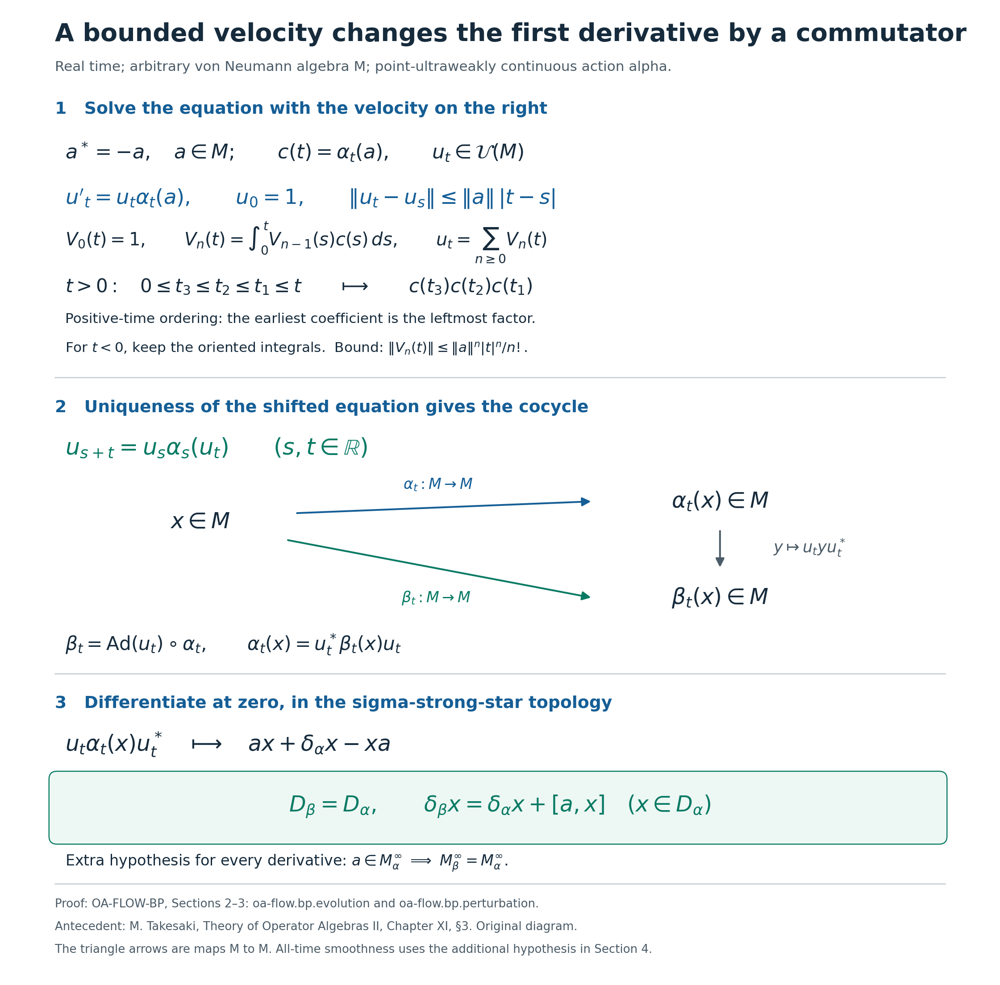
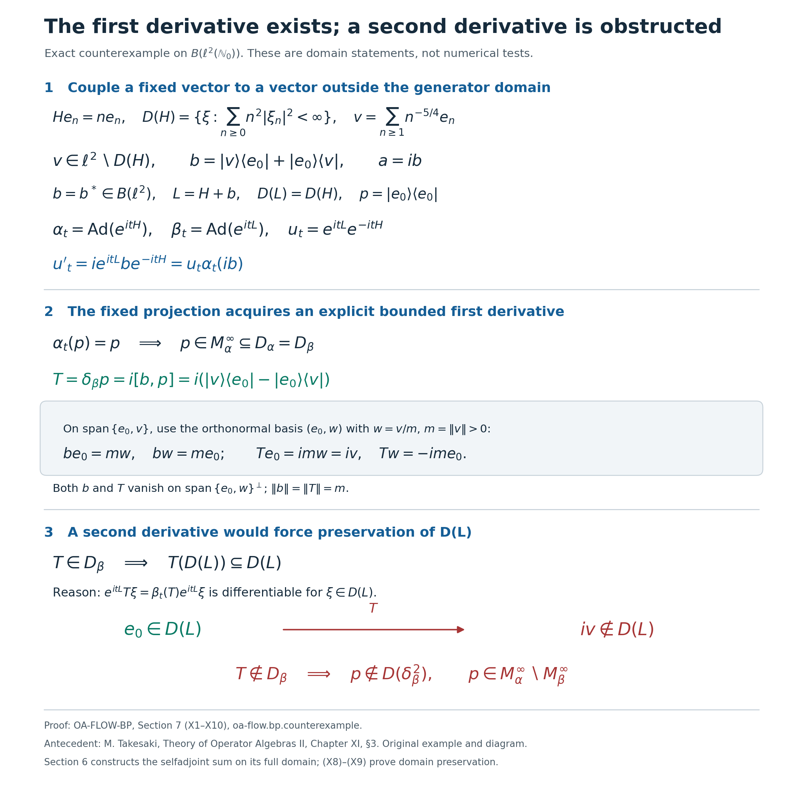
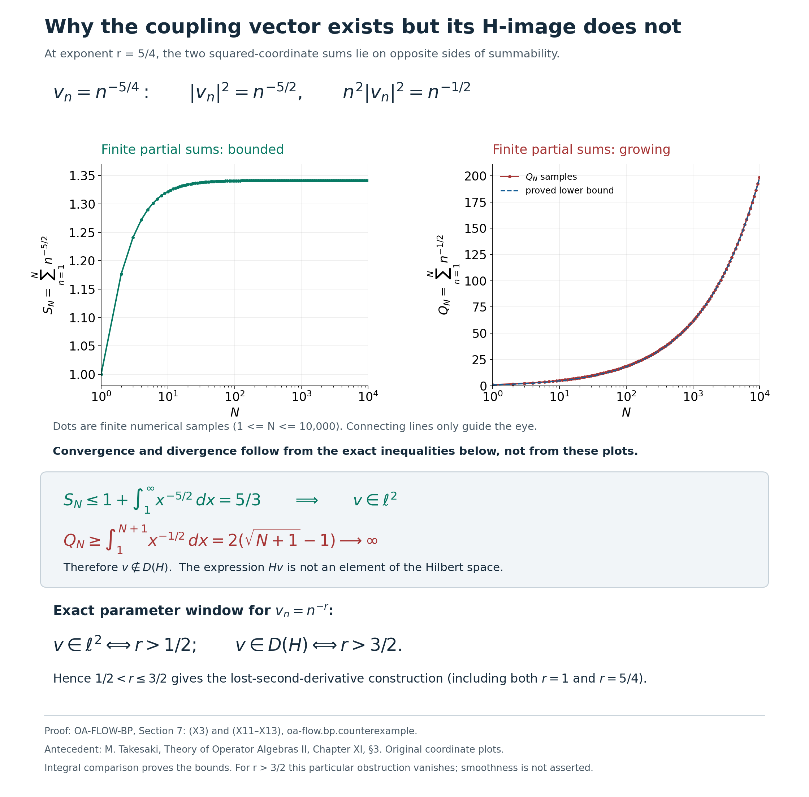

# Bounded perturbations and differentiability domains of real actions

*Self-checked by the writing AI. New exposition: CC0 1.0. The retained illustrations and their data have separate GFDL-1.2-or-later terms; reproduction code and fonts retain their accompanying terms.*

A bounded change of velocity preserves exactly the first derivative domain of a real action. Higher derivatives need an additional hypothesis. We construct the evolution directly in the strong topology, prove the domain comparison, and identify the obstruction through an explicit rank-two perturbation.

## Setting and proof inputs

Let $M$ be an arbitrary von Neumann algebra, concretely and faithfully represented on a Hilbert space, and let $\alpha:\mathbb R\to\operatorname{Aut}(M)$ be a point-ultraweakly continuous group of normal star automorphisms. We use $[a,x]=ax-xa$ and $\operatorname{Ad}(u)x=uxu^*$. Inner products are linear in the first variable. The zero algebra satisfies the assertions with its zero identity; the zero Hilbert space is included when operators are used. No factor, separability, trace or faithful-state hypothesis is imposed.

The intrinsic sigma-strong-star topology is generated by $x\mapsto\omega(x^*x)^{1/2}$ and $x\mapsto\omega(xx^*)^{1/2}$ for positive normal $\omega$. Its bounded-set comparison with concrete strong-star convergence is proved in [ST2](OA-FLOW-ST12.md#oa-flow.st.2); [AT1](OA-FLOW-AT.md#oa-flow.at.1) proves strong-star continuity of these action orbits. We use the complete [Banach integral and series arguments in CF1](OA-FLOW-CF.md#oa-flow.cf.1), [Baire argument in L34](OA-FLOW-L34.md#oa-flow.l34.3), [normal filter and translation formulas in AT5](OA-FLOW-AT.md#oa-flow.at.5), and [smooth scalar bumps in RF1](OA-FLOW-RF.md#oa-flow.rf.1). The operator example uses [RF5's full unitary generator construction](OA-FLOW-RF.md#oa-flow.rf.5) and [L157's complete generator-domain test](OA-FLOW-L157.md#oa-flow.l157.domain-test). All later references to a derivative use the topology and domain stated below.

## 1. Intrinsic derivatives and compact strong integrals

Let \(M\) be a von Neumann algebra, and let \(\alpha:\mathbb R\to\operatorname{Aut}(M)\) be an action by normal automorphisms for which \(t\mapsto\alpha_t(x)\) is ultraweakly continuous for every \(x\in M\). There is no separability or faithful-state assumption. The zero algebra satisfies all the statements below, with its identity interpreted as zero.

For a positive normal functional \(\omega\), put
\[
 p_\omega(x)=
 \bigl(\omega(x^*x)+\omega(xx^*)\bigr)^{1/2}.
 \tag{D1}
\]
These seminorms define the intrinsic \(\sigma\)-strong* topology. The [automorphism continuity theorem](OA-FLOW-AT.md#oa-flow.at.1) makes every orbit continuous in this topology. We shall also use its concrete description: in a faithful normal representation \(M\subseteq B(H)\), strong* convergence and intrinsic \(\sigma\)-strong* convergence agree on each norm-bounded set. The full statement, including arbitrary \(H\), is proved in [the normal-representation and topology theorem](OA-FLOW-ST12.md#oa-flow.st.2).

Define the first derivative domain and its derivative by
\[
 \begin{split}
 \mathcal D_\alpha
 &=\left\{x\in M:
   \lim_{t\to0,\ t\ne0}\frac{\alpha_t(x)-x}{t}
   \text{ exists in the intrinsic }\sigma\text{-strong* topology}
   \right\},\\
 \delta_\alpha(x)
 &=\lim_{t\to0,\ t\ne0}\frac{\alpha_t(x)-x}{t}.
 \end{split}
 \tag{D2}
\]
The limit is unique because normal functionals separate \(M\). Before manipulating it, we establish the boundedness and integration facts that make those manipulations legitimate.

**A boundedness lemma.** Suppose that \(\mathcal F\subset B(H)\) and that
\(\sup_{T\in\mathcal F}\|T\xi\|<\infty\) for each \(\xi\in H\). Then
\(\sup_{T\in\mathcal F}\|T\|<\infty\).

Indeed, the closed sets
\[
 E_n=\{\xi\in H:\sup_{T\in\mathcal F}\|T\xi\|\le n\},
 \qquad n\ge1,
 \tag{D3}
\]
cover \(H\). The complete-metric Baire argument in [L34, Lemma 3.2](OA-FLOW-L34.md#oa-flow.l34.3) gives a ball \(B(\xi_0,r)\subset E_n\) for some \(n\) and \(r>0\). If \(\|\eta\|<r\), both \(\xi_0+\eta\) and \(\xi_0\) belong to \(E_n\), so \(\|T\eta\|\le2n\) for every \(T\in\mathcal F\). Scaling \(\eta\), and then taking a limit at the radius \(r\), gives \(\|T\|\le2n/r\). If \(H=\{0\}\), the conclusion is immediate.

**Compact strong integrals.** Let \(F:[a,b]\to M\subseteq B(H)\), with \(a<b\), be strongly continuous. For every \(\xi\), the function \(s\mapsto F(s)\xi\) is continuous on a compact interval and hence bounded. The lemma gives
\[
 K=\sup_{a\le s\le b}\|F(s)\|<\infty.
 \tag{D4}
\]
Integrate each of these \(H\)-valued continuous functions by norm Riemann integration, as constructed in [CF1](OA-FLOW-CF.md#oa-flow.cf.1), and define
\[
 I\xi=\int_a^b F(s)\xi\,ds.
 \tag{D5}
\]
Linearity of the vector integral and
\[
 \|I\xi\|
 \le\int_a^b\|F(s)\xi\|\,ds
 \le (b-a)K\|\xi\|
 \tag{D6}
\]
show that \(I\in B(H)\). Every tagged operator Riemann sum belongs to \(M\), has norm at most \((b-a)K\), and tends strongly to \(I\): after applying the sum to a fixed vector, this is precisely the convergence of its vector Riemann sums. Since \(M\) is strongly closed, \(I\in M\).

We write \(I=\int_a^b F(s)\,ds\). This construction requires strong continuity, not norm continuity of \(F\) as an \(M\)-valued function. It also gives
\[
 \left\|\int_a^b F(s)\,ds\right\|
 \le\int_a^b\|F(s)\|\,ds.
 \tag{D7}
\]
Here the scalar integral is legitimate: \(\|F(s)\|\) is the supremum, over unit vectors \(\xi\), of the continuous functions \(\|F(s)\xi\|\), so it is lower semicontinuous, Borel measurable, and bounded by \(K\). The vector-integral estimate followed by this pointwise majorant proves (D7).

If \(F\) is strongly* continuous, its adjoint function has the same properties. Taking scalar inner products in the vector integrals proves
\[
 \left(\int_a^bF(s)\,ds\right)^*
   =\int_a^bF(s)^*\,ds.
 \tag{D8}
\]
Consequently the operator Riemann sums converge strongly*, and, being uniformly norm bounded, converge intrinsically \(\sigma\)-strong*. The same bounded-set comparison shows that \(F\) itself is intrinsically continuous on \([a,b]\). The triangle inequality for \(p_\omega\), applied first to Riemann sums and then to their limits, yields
\[
 p_\omega\!\left(\int_a^bF(s)\,ds\right)
 \le\int_a^b p_\omega(F(s))\,ds.
 \tag{D9}
\]
Normal scalar functionals pass through the integral. One way to check this without changing topologies outside bounded sets is to use the square-summable vector-series description in [CP4](OA-FLOW-CP.md#oa-flow.cp.4) and the predual identification in [CP6](OA-FLOW-CP.md#oa-flow.cp.6): finite vector coefficients pass through (D5), and Cauchy–Schwarz bounds every omitted tail by the common operator norm bound times
\((\sum_{j>N}\|\xi_j\|^2)^{1/2}(\sum_{j>N}\|\eta_j\|^2)^{1/2}\).
This tends to zero uniformly on the Riemann sums and their limit. Thus
\[
 \varphi\!\left(\int_a^bF(s)\,ds\right)
   =\int_a^b\varphi(F(s))\,ds
 \qquad(\varphi\in M_*).
 \tag{D10}
\]
The scalar integrand is continuous. This formula also proves that the integral is independent of the faithful normal representation used to construct it.

Fixed left and right multiplication commute with these integrals: apply the vector definition for left multiplication, and apply it to \(c\xi\) for right multiplication by \(c\). A fixed normal automorphism \(\theta\) also passes through a strongly* continuous integral. Indeed,
\(p_\omega(\theta(x))=p_{\omega\circ\theta}(x)\), so \(\theta\) preserves intrinsic convergence of the Riemann sums. Equivalently, (D10) with \(\varphi\circ\theta\) determines the same integral.

Use the oriented convention
\[
 \int_b^a F(s)\,ds=-\int_a^b F(s)\,ds,
 \qquad
 \int_a^aF(s)\,ds=0.
 \tag{D11}
\]
Splitting intervals proves additivity, for any order of the endpoints. If \(F\) is locally strongly* continuous, then
\[
 \frac{1}{h}\int_t^{t+h}F(s)\,ds\longrightarrow F(t)
 \quad\text{intrinsically }\sigma\text{-strong* as }h\to0.
 \tag{D12}
\]
For each vector, the difference from \(F(t)\) is bounded by the supremum of
\(\|(F(s)-F(t))\xi\|\) over the short interval between \(t\) and \(t+h\); the same estimate applies to adjoints. The averages have a common norm bound on a fixed compact neighborhood of \(t\), so the bounded-set comparison supplies the intrinsic conclusion. This proof treats positive and negative \(h\) with exactly the convention (D11).

Conversely, suppose that an \(M\)-valued function \(G\) has a strongly* derivative \(G'(t)=F(t)\), where \(F\) is locally strongly* continuous. Applying the Banach-valued fundamental theorem of calculus in [CF1](OA-FLOW-CF.md#oa-flow.cf.1) to \(G(t)\xi\) gives
\[
 G(t)-G(s)=\int_s^t F(r)\,dr.
 \tag{D13}
\]
Equality on every vector is equality of operators. The same conclusion holds for an intrinsically \(\sigma\)-strong* derivative, since this topology controls every vector and adjoint-vector seminorm in the faithful normal representation.

We will also use the product rule for such operator curves. Suppose that \(A\) and \(B\) are locally strongly* continuous and have strongly* derivatives at \(t\). On a fixed compact neighborhood their norms are bounded by the lemma. For each vector, the difference quotients of \(A\) at \(t\) are bounded sufficiently close to zero by convergence; on the remaining annulus \(\varepsilon_\xi\le |h|\le r\) their norms on that vector are at most \(2K\|\xi\|/\varepsilon_\xi\). The boundedness lemma therefore supplies a common operator norm bound for these quotients, and likewise for those of \(B\). In the exact expansion
\[
 \frac{A(t+h)B(t+h)-A(t)B(t)}{h}
 =\frac{A(t+h)-A(t)}{h}B(t+h)
   +A(t)\frac{B(t+h)-B(t)}{h},
\]
bounded strong* multiplication, as proved in [UC0](OA-FLOW-UC.md#oa-flow.uc.0), gives the limit \(A'(t)B(t)+A(t)B'(t)\). The adjoint derivative is \(A'(t)^*\), directly from its quotients with real \(h\). The quotient bound and the bounded-set comparison make these conclusions intrinsic whenever the derivatives are initially given strongly*. This proves the curve product rule used for unitary evolution below.

**The common difference-quotient bound.** Fix \(x\in\mathcal D_\alpha\) and \(T>0\), and put
\[
 q_x(t)=\frac{\alpha_t(x)-x}{t}\quad(0<|t|\le T).
 \tag{D14}
\]
For a fixed \(\xi\), \(q_x(t)\xi\) converges to \(\delta_\alpha(x)\xi\) as \(t\to0\). It is therefore bounded for \(0<|t|<\varepsilon_\xi\), where the radius may depend on \(\xi\). On the remaining compact annulus
\(\varepsilon_\xi\le |t|\le T\), after decreasing \(\varepsilon_\xi\) below \(T\) if necessary, the function \(t\mapsto q_x(t)\xi\) is continuous by orbit continuity and is bounded. Thus the *one fixed family*
\(\{q_x(t):0<|t|\le T\}\) is bounded on every vector. The boundedness lemma gives
\[
 \sup_{0<|t|\le T}\|q_x(t)\|<\infty.
 \tag{D15}
\]
This argument uses the real parameter and compact annuli. It does not appeal to a claim that every convergent net has a bounded range.

**Algebra and invariance.** The domain \(\mathcal D_\alpha\) is a complex unital *-subalgebra, and \(\delta_\alpha\) is a complex-linear *-derivation there:
\[
 \begin{aligned}
 \delta_\alpha(1)&=0,&
 \delta_\alpha(x^*)&=\delta_\alpha(x)^*,\\
 \delta_\alpha(xy)&=\delta_\alpha(x)y+x\delta_\alpha(y).
 \end{aligned}
 \tag{D16}
\]
Linearity, the identity, and the adjoint assertion follow directly from (D2), with real \(t\) for the adjoint. For the product, the exact identity is
\[
 q_{xy}(t)=q_x(t)\alpha_t(y)+xq_y(t).
 \tag{D17}
\]
Both quotient families have the bounds (D15), while
\(\|\alpha_t(y)\|=\|y\|\). Multiplication preserves strong* convergence when both factors have common norm bounds, by the estimates proved in [UC0](OA-FLOW-UC.md#oa-flow.uc.0). Apply those estimates in the faithful normal representation and then use the bounded-set intrinsic comparison. The right side of (D17) converges to the expression in (D16).

For every \(s\in\mathbb R\), normality of \(\alpha_s\) gives
\(p_\omega(\alpha_s z)=p_{\omega\circ\alpha_s}(z)\). Applying \(\alpha_s\) to the quotients in (D2) therefore proves
\[
 \alpha_s(\mathcal D_\alpha)=\mathcal D_\alpha,
 \qquad
 \delta_\alpha(\alpha_s x)=\alpha_s(\delta_\alpha x).
 \tag{D18}
\]
Equality of domains, rather than just inclusion, follows by applying the inclusion also to \(-s\).

In particular, an element of \(\mathcal D_\alpha\) has an intrinsically continuously differentiable orbit, with
\[
 \frac{d}{dt}\alpha_t(x)=\alpha_t(\delta_\alpha x).
 \tag{D19}
\]
For the derivative at \(t\), apply the fixed map \(\alpha_t\) to \(q_x(h)\); the derivative is continuous by the automorphism continuity theorem applied to \(\delta_\alpha x\). Formula (D13) now gives
\[
 \alpha_t(x)-x=\int_0^t\alpha_s(\delta_\alpha x)\,ds,
 \qquad
 \|\alpha_t(x)-x\|\le |t|\,\|\delta_\alpha x\|.
 \tag{D20}
\]
Thus every element of this strong derivative domain has a norm-continuous orbit, even though its derivative need not arise from a norm limit of the original difference quotients.

**A norm-closed graph.** If \(x_n\in\mathcal D_\alpha\), \(x_n\to x\) in norm, and
\(\delta_\alpha x_n\to y\) in norm, then
\[
 x\in\mathcal D_\alpha,\qquad\delta_\alpha x=y.
 \tag{D21}
\]
For fixed \(t\), pass to the limit in (D20). The left side converges in norm because \(\alpha_t\) is isometric. For the right side, the compact strong integral estimate gives
\[
 \left\|\int_0^t
    \alpha_s(\delta_\alpha x_n-y)\,ds\right\|
 \le |t|\,\|\delta_\alpha x_n-y\|.
 \tag{D22}
\]
Hence \(\alpha_t(x)-x=\int_0^t\alpha_s(y)\,ds\). Divide by \(t\ne0\) and use (D12) and orbit continuity to obtain (D21). Norm topology on \(M\oplus M\) is metrizable, so this sequential argument proves that the entire graph is norm closed. No assertion that the derivative is bounded or defined on all of \(M\) is involved.

## 2. A strong coefficient produces a unitary evolution

Let \(M\) be the arbitrary von Neumann algebra of [Section 1](OA-FLOW-BP.md#oa-flow.bp.domains). Suppose that
\[
 c:\mathbb R\longrightarrow M,\qquad c(t)^*=-c(t),
 \tag{E1}
\]
is continuous in the intrinsic \(\sigma\)-strong topology. Skew adjointness makes it \(\sigma\)-strong-star continuous as well. In a faithful normal concrete representation on \(\mathcal H\), each vector orbit is continuous and hence bounded on a compact time interval. Uniform boundedness therefore gives
\[
 K_T:=\sup_{|t|\le T}\|c(t)\|<\infty\qquad(T>0).
 \tag{E2}
\]
No operator-norm continuity of \(c\) is assumed.

**Theorem 2.1.** There is a unique \(\sigma\)-strong-star differentiable function \(U:\mathbb R\to M\) satisfying
\[
 U'(t)=U(t)c(t),\qquad U(0)=1.
 \tag{E3}
\]
Its derivative is \(\sigma\)-strong-star continuous. Every \(U(t)\) is unitary, and
\[
 \|U(t)-U(s)\|\le K_T|t-s|
 \qquad(s,t\in[-T,T]).
 \tag{E4}
\]
For any prescribed \(v_0\in M\), the unique solution of \(V'=Vc\), \(V(0)=v_0\), is \(V(t)=v_0U(t)\).

**Construction.** Use the bounded strong integrals constructed in Section 1, with \(\int_0^t=-\int_t^0\) when \(t<0\). Set
\[
 V_0(t)=1,\qquad
 V_n(t)=\int_0^t V_{n-1}(s)c(s)\,ds\quad(n\ge1).
 \tag{E5}
\]
Inductively these integrands are strongly-star continuous on compact intervals. Their operator norms are bounded there; bounded strong-star multiplication is the explicit estimate in [UC0](OA-FLOW-UC.md#oa-flow.uc.0). Thus every integral exists in \(M\), its adjoint is the integral of the adjoints, and the vector fundamental theorem gives its strongly-star derivative.

For \(|t|\le T\), induction in (E5) gives
\[
 \|V_n(t)\|\le \frac{K_T^n|t|^n}{n!}.
 \tag{E6}
\]
For \(t\ge0\), integrate \(K_T^n s^{n-1}/(n-1)!\) from \(0\) to \(t\). For \(t<0\), reverse the integral and integrate the same bound with \(|s|^{n-1}\) from \(t\) to \(0\). This proves (E6) with both signs of time.

Expanding the recursion, while retaining the orientation of every integral, gives
\[
 V_n(t)=
 \int_0^t\int_0^{t_1}\cdots\int_0^{t_{n-1}}
 c(t_n)c(t_{n-1})\cdots c(t_1)\,
 dt_n\cdots dt_2\,dt_1.
 \tag{E7}
\]
For \(t>0\), the time variables satisfy \(0\le t_n\le\cdots\le t_1\le t\): the earliest coefficient is at the left. This order comes from multiplication on the right in (E3). For \(t<0\), (E7) is still the formula, with its nested oriented integrals. For example, substituting \(t_j=-r_j\) contributes \((-1)^n\) and replaces the coefficient product by \(c(-r_n)\cdots c(-r_1)\); discarding those signs would change the equation.

The factorial estimate proves that
\[
 U(t)=\sum_{n=0}^{\infty}V_n(t)
 \tag{E8}
\]
converges in operator norm, uniformly on every compact time interval. In particular, \(\|U(t)\|\le e^{K_T|t|}\) for \(|t|\le T\). Each \(V_n\) is norm continuous: on \([-T,T]\), the integral over two endpoints bounds its increment by the interval length times the bound for \(V_{n-1}c\). Hence \(U\) is norm continuous.

We obtain differentiability from the integral equation, rather than differentiating a series in operator norm. If \(S_N=\sum_{n=0}^N V_n\), (E5) says \(S_N=1+\int_0^t S_{N-1}(s)c(s)\,ds\). For \(|t|\le T\), the difference between its integral and the integral with \(U\) is at most
\[
 T K_T\sup_{|s|\le T}\|S_{N-1}(s)-U(s)\|.
\]
This tends to zero. Thus
\[
 U(t)=1+\int_0^t U(s)c(s)\,ds.
 \tag{E9}
\]
The integrand and its adjoint are strongly continuous and uniformly bounded on each compact interval. Section 1's fundamental theorem gives \(U'=Uc\) and the adjoint derivative. The local bound on the integral's difference quotients makes these limits intrinsic \(\sigma\)-strong-star limits, by the bounded topology comparison used there. Bounded multiplication also makes \(Uc\) continuously \(\sigma\)-strong-star dependent on \(t\). Before unitarity has been established, (E9) already gives
\[
 \|U(t)-U(s)\|\le K_T e^{K_TT}|t-s|
 \qquad(s,t\in[-T,T]).
 \tag{E10}
\]

**Uniqueness.** Let \(V,\widetilde V\) be two solutions with the same initial value, and put \(W=V-\widetilde V\). Strong-star differentiability implies continuity. Uniform boundedness of the concrete vector orbits on \([-T,T]\) therefore gives \(M_T=\sup_{|t|\le T}\|W(t)\|<\infty\). The derivative \(Wc\) is strongly-star continuous, so the vector fundamental theorem gives
\[
 W(t)=\int_0^t W(s)c(s)\,ds.
 \tag{E11}
\]
Iterating this identity \(n\) times, using the oriented integrals also for \(t<0\), gives
\[
 \|W(t)\|\le M_T\,\frac{K_T^n|t|^n}{n!}
 \qquad(|t|\le T).
 \tag{E12}
\]
The right side tends to zero. Since \(T\) is arbitrary, \(W=0\) on all of \(\mathbb R\). This proof did not require the common initial value to be \(1\). Fixed left multiplication shows that \(v_0U\) solves the equation with initial value \(v_0\), proving the last assertion of the theorem.

**Both unitary identities.** Taking adjoints of (E3) gives \((U^*)'=-cU^*\). The strong-star product rule of Section 1 yields
\[
 (UU^*)'=UcU^*-UcU^*=0.
 \tag{E13}
\]
The vector fundamental theorem and \(U(0)=1\) give \(UU^*=1\). For the other product, put \(Q=U^*U\). Its equation is
\[
 Q'=-cQ+Qc,\qquad Q(0)=1.
 \tag{E14}
\]
The constant function \(1\) solves this equation. The difference \(R=Q-1\) satisfies the integral equation with integrand \(-cR+Rc\). On \([-T,T]\) its norm is bounded by \(2K_T\|R\|\). The iterated argument of (E12), with \(2K_T\) in place of \(K_T\), forces \(R=0\). Thus \(U^*U=1\) as well.

Now the integrand in (E9) has norm \(\|c(s)\|\), since \(U(s)\) is unitary. Subtracting (E9) at two endpoints proves (E4). Its factor \(1\) cannot be reduced uniformly: for the constant scalar coefficient \(c(t)=iK1\), the quotient \(\|e^{iKt}1-1\|/|t|\) tends to \(K\) at zero in any nonzero \(M\). This completes the theorem. In the zero algebra all equations are read with \(1=0\) and their unique solution is zero. \(\square\)

**The logarithmic velocity needs only a strong derivative.** Suppose \(W(t)\) is unitary and has a strong derivative \(W'(t)\in M\) at the time under consideration. This includes a derivative in the intrinsic \(\sigma\)-strong topology; an adjoint derivative is not needed for the following argument. For every vector \(\xi\), differentiation of the constant squared norm gives
\[
 0=\frac d{dt}\|W(t)\xi\|^2
   =2\operatorname{Re}\langle W'(t)\xi,W(t)\xi\rangle.
 \tag{E15}
\]
Set \(B(t)=W(t)^*W'(t)\). The selfadjoint operator \(B(t)+B(t)^*\) has zero quadratic form on every vector, so polarization makes it zero. Consequently
\[
 c_W(t)=W(t)^*W'(t)\quad\hbox{is skew adjoint},\qquad
 k_W(t)=\frac1i\,W(t)^*W'(t)=k_W(t)^*,\qquad
 W'(t)=W(t)c_W(t).
 \tag{E16}
\]
The factor \(1/i\), with this sign, converts the right logarithmic derivative into a selfadjoint velocity. The adjoint derivative can now be recovered from the exact identity
\[
 \frac{W(t+h)^*-W(t)^*}{h}
 =-W(t+h)^*\frac{W(t+h)-W(t)}{h}W(t)^*.
 \tag{E17}
\]
Strong convergence of the unitary factors and of the quotient on each fixed vector gives the limit \(-W(t)^*W'(t)W(t)^*=W'(t)^*\), the last equality following from skew adjointness of \(B(t)\). The quotients are norm bounded near zero: for each vector they are bounded sufficiently close to zero by convergence, and on the remaining annulus the unitary bound \(2/|h|\) applies; uniform boundedness then gives a common operator bound. Thus the derivative is in fact intrinsic \(\sigma\)-strong-star by the bounded topology comparison. Strong differentiability by itself does not assert continuity of \(c_W\). When that velocity is continuous as in (E1), Theorem 2.1 applies to \(W'=Wc_W\) with initial value \(W(0)\).

## 3. The resulting cocycle and its exact first domain

Return to a point-ultraweakly continuous real action \(\alpha\) by normal star automorphisms of \(M\). By [AT1](OA-FLOW-AT.md#oa-flow.at.1), its fixed-element orbits are intrinsically \(\sigma\)-strong-star continuous. Fix \(a\in M\) with \(a^*=-a\). The coefficient \(c(t)=\alpha_t(a)\) therefore meets Theorem 2.1, and \(\|c(t)\|=\|a\|\). Denote its solution by \(u_t\). Then
\[
 u'_t=u_t\alpha_t(a),\qquad u_0=1,\qquad
 \|u_t-u_s\|\le\|a\|\,|t-s|
 \quad(s,t\in\mathbb R).
 \tag{C1}
\]
These are strong-star derivatives, even when the coefficient orbit is not norm continuous.

**Theorem 3.1.** The solution satisfies the cocycle identity at every pair of real times,
\[
 u_{s+t}=u_s\alpha_s(u_t),
 \tag{C2}
\]
and
\[
 \beta_t(x)=u_t\alpha_t(x)u_t^*
 \quad(x\in M)
 \tag{C3}
\]
defines a point-ultraweakly continuous real action by normal star automorphisms.

**Proof.** Fix \(s\in\mathbb R\). Normality of \(\alpha_s\) makes it preserve intrinsic strong-star limits: a positive normal functional composed with \(\alpha_s\) is again positive normal, and it tests exactly the corresponding square. Therefore the two functions
\[
 F(t)=u_{s+t},\qquad G(t)=u_s\alpha_s(u_t)
\]
are strongly-star differentiable. Their initial values are both \(u_s\), and their derivatives are
\[
 F'(t)=F(t)\alpha_{s+t}(a),\qquad
 G'(t)=u_s\alpha_s(u_t\alpha_t(a))
      =G(t)\alpha_{s+t}(a).
 \tag{C4}
\]
Theorem 2.1's uniqueness with arbitrary initial value applies to this same shifted coefficient. It gives \(F(t)=G(t)\) for every real \(t\). Since \(s\) was arbitrary, (C2) holds for all \(s,t\), including negative times.

Each map in (C3) is a normal star automorphism. Multiplication by the fixed unitary and its adjoint is ultraweakly continuous by [UC0's vector-series argument](OA-FLOW-UC.md#oa-flow.uc.0). The group identity follows with the indicated noncommutative order:
\[
 \begin{aligned}
 \beta_s(\beta_t(x))
 &=u_s\alpha_s(u_t)\alpha_{s+t}(x)
                         \alpha_s(u_t)^*u_s^*\\
 &=u_{s+t}\alpha_{s+t}(x)u_{s+t}^*
 =\beta_{s+t}(x).
 \end{aligned}
 \tag{C5}
\]
Also \(\beta_0=\mathrm{id}\), so its inverse at \(t\) is \(\beta_{-t}\). For fixed \(x\), the three factors in (C3) are strongly-star continuous and uniformly bounded. UC0's product estimate proves strong-star continuity of the orbit. Its bounded strong-to-ultraweak argument then gives point-ultraweak continuity. This is the [given-cocycle perturbation construction of UC1](OA-FLOW-UC.md#oa-flow.uc.1), with the cocycle now constructed by (E5)–(E9). \(\square\)

Let \(\mathcal D_\alpha,\mathcal D_\beta\) and \(\delta_\alpha,\delta_\beta\) denote the intrinsic \(\sigma\)-strong-star first derivative domains and generators defined in [Section 1](OA-FLOW-BP.md#oa-flow.bp.domains). No first derivative of \(a\) under \(\alpha\) is assumed.

**Theorem 3.2.** The first domains coincide exactly:
\[
 \mathcal D_\beta=\mathcal D_\alpha,\qquad
 \delta_\beta(x)=\delta_\alpha(x)+[a,x]
 \quad(x\in \mathcal D_\alpha).
 \tag{P1}
\]

**Proof of the forward inclusion.** At zero, (C1) and the adjoint equation give
\[
 \frac{u_t-1}{t}\longrightarrow a,\qquad
 \frac{u_t^*-1}{t}\longrightarrow-a
 \quad\hbox{in }\sigma\text{-strong-star}.
 \tag{P2}
\]
Both quotient norms are at most \(\|a\|\) by (C1). If \(x\in \mathcal D_\alpha\), its difference quotients are norm bounded near zero by Section 1's real-parameter uniform-boundedness argument. Expand the actual difference quotient as
\[
 \frac{\beta_t(x)-x}{t}
 =\frac{u_t-1}{t}\,\alpha_t(x)u_t^*
  +\frac{\alpha_t(x)-x}{t}\,u_t^*
  +x\,\frac{u_t^*-1}{t}.
 \tag{P3}
\]
Every factor has its indicated strong-star limit and a common norm bound near zero. Bounded multiplication therefore makes the right side tend to
\[
 ax+\delta_\alpha(x)-xa.
\]
The same calculation applies to adjoints, as included in that topology. Thus \(x\in \mathcal D_\beta\), with the asserted value of \(\delta_\beta(x)\).

**Proof of the reverse inclusion.** If \(x\in \mathcal D_\beta\), use the exact inverse formula at each time,
\[
 \alpha_t(x)=u_t^*\beta_t(x)u_t.
 \tag{P4}
\]
The difference quotients of \(\beta_t(x)\) are norm bounded near zero by the same domain argument, now applied to the proved continuous action \(\beta\). Expanding (P4) gives
\[
 \frac{\alpha_t(x)-x}{t}
 =\frac{u_t^*-1}{t}\,\beta_t(x)u_t
  +\frac{\beta_t(x)-x}{t}\,u_t
  +x\,\frac{u_t-1}{t}
 \longrightarrow -ax+\delta_\beta(x)+xa.
 \tag{P5}
\]
Bounded strong-star multiplication justifies this limit exactly as before. Hence \(x\in \mathcal D_\alpha\) and \(\delta_\alpha(x)=\delta_\beta(x)-[a,x]\). This proves both the set equality and the generator identity. \(\square\)

The two inclusions use only the bounded coefficient \(a\), continuity of its orbit, and the first derivative of the resulting unitary curve. They impose no differentiability condition on \(t\mapsto\alpha_t(a)\). Conclusions about higher derivative domains require the additional analysis below.

## 4. Smooth time filters

Write \(\delta=\delta_\alpha\), and define its iterated domains recursively:
\[
 \mathcal D(\delta^0)=M,\qquad
 \mathcal D(\delta^{n+1})
 =\{x\in\mathcal D(\delta^n):\delta^n x\in\mathcal D_\alpha\},
 \qquad
 M_\alpha^\infty=\bigcap_{n\ge0}\mathcal D(\delta^n).
 \tag{S1}
\]
The orbit of \(x\in\mathcal D(\delta^n)\) has \(n\) intrinsic \(\sigma\)-strong* derivatives, and
\[
 \frac{d^j}{dt^j}\alpha_t(x)=\alpha_t(\delta^j x),
 \qquad 0\le j\le n.
 \tag{S2}
\]
To see this, use (D18)–(D19) successively on \(x,\delta x,\ldots,\delta^{n-1}x\). Each displayed derivative is continuous by orbit continuity. Conversely, if the orbit is \(n\) times intrinsically differentiable, its first derivative at zero gives \(x\in\mathcal D_\alpha\); (D19) identifies the first derivative orbit as \(\alpha_t(\delta x)\), and induction puts \(\delta x\) in \(\mathcal D(\delta^{n-1})\). Thus (S1) is exactly the algebra of elements with smooth intrinsic orbits.

The product and adjoint rules in Section 1 imply, by induction,
\[
 \begin{split}
 \delta^n(xy)&=\sum_{j=0}^n {n\choose j}
          \delta^j(x)\delta^{n-j}(y),\\
 \delta^n(x^*)&=(\delta^n x)^*.
 \end{split}
 \tag{S3}
\]
For completeness, when \(x,y\in\mathcal D(\delta^{n+1})\), the \(j\)-th product in the order-\(n\) formula has both factors in \(\mathcal D_\alpha\). Its derivative is the sum obtained by increasing the left index or the right index by one; Pascal's identity combines equal products into the order-\(n+1\) formula. This also proves membership in the next domain. Hence \(M_\alpha^\infty\) is a unital *-algebra, stable under \(\delta\) and every \(\alpha_t\).

**The filter derivative.** For \(f\in L^1(\mathbb R)\), let
\[
 T_f(x)=\int_{\mathbb R} f(s)\alpha_s(x)\,ds,
 \qquad
 \varphi(T_f(x))
 =\int_{\mathbb R}f(s)\varphi(\alpha_s x)\,ds
 \quad(\varphi\in M_*).
 \tag{S4}
\]
This is the normal weak integral constructed as the adjoint of the predual integral in [AT5](OA-FLOW-AT.md#oa-flow.at.5); in particular,
\[
 \|T_f(x)\|\le\|f\|_1\|x\|,
 \qquad
 \alpha_t(T_f(x))=T_{f(\,\cdot-t)}(x).
 \tag{S5}
\]
When \(f\) is continuous with compact support, the compact strong integral from Section 1 gives the same element, by testing against \(M_*\).

Let \(f\in C_c^\infty(\mathbb R)\). The essential differentiability statement is in \(L^1\), not merely pointwise. The scalar fundamental theorem of calculus gives, for \(h\ne0\),
\[
 \frac{f(r-h)-f(r)}{h}
       =-\int_0^1 f'(r-\theta h)\,d\theta.
 \tag{S6}
\]
The functions under consideration have a common compact support for \(|h|\le1\). Their uniform continuity therefore implies
\(\|f'(\,\cdot-s)-f'\|_1\to0\) as \(s\to0\): their supremum difference tends to zero and the common supporting interval has finite length. Integrating the absolute value of (S6) after adding \(f'(r)\), or first using uniform Riemann sums on that compact rectangle, yields
\[
 \left\|
    \frac{f(\,\cdot-h)-f}{h}+f'
 \right\|_1
 \le\sup_{|s|\le |h|}\|f'(\,\cdot-s)-f'\|_1
 \longrightarrow0.
 \tag{S7}
\]
The same proof applies to every \(f^{(j)}\). Translation preserves \(L^1\) norm, so the derivative at any \(t\) is
\(-f'(\,\cdot-t)\), and all its successive derivatives exist and are \(L^1\)-continuous.

The bounded linear map \(f\mapsto T_f(x)\) carries these derivatives into norm derivatives in \(M\). Consequently
\[
 T_f(x)\in M_\alpha^\infty,\qquad
 \delta_\alpha^n(T_f(x))=(-1)^nT_{f^{(n)}}(x),\qquad
 \|\delta_\alpha^n(T_f(x))\|
 \le\|f^{(n)}\|_1\|x\|.
 \tag{S8}
\]
For the first assertion about domains, a norm limit is an intrinsic \(\sigma\)-strong* limit; the formula can then be applied inductively with \(f'\), \(f''\), and so on. This verifies that these norm derivatives coincide with the intrinsic derivatives defined in Section 1.

**Density with a fixed norm bound.** Choose a nonnegative function \(b\in C_c^\infty(\mathbb R)\), supported in \([-1,1]\), with integral one. Normalize the explicit smooth bump in [RF1](OA-FLOW-RF.md#oa-flow.rf.1), where smoothness at the two endpoints is proved. Put
\[
 b_\varepsilon(s)=\varepsilon^{-1}b(s/\varepsilon),
 \qquad x_\varepsilon=T_{b_\varepsilon}(x).
 \tag{S9}
\]
Then \(x_\varepsilon\in M_\alpha^\infty\) and \(\|x_\varepsilon\|\le\|x\|\). Since \(b_\varepsilon\ge0\) and has integral one, the compact integral inequality (D9) gives
\[
 p_\omega(x_\varepsilon-x)
 \le\int b_\varepsilon(s)p_\omega(\alpha_s x-x)\,ds
 \le\sup_{|s|\le\varepsilon}p_\omega(\alpha_s x-x)
 \longrightarrow0.
 \tag{S10}
\]
Thus the smooth algebra is intrinsically \(\sigma\)-strong* dense, with approximants in the same norm ball. This conclusion concerns the intrinsic topology; it does not assert norm density in all of \(M\). If \(x\) has a norm-continuous orbit, the identical estimate with norm in place of \(p_\omega\) gives norm convergence.

**Smooth perturbations.** Suppose now that \(a^*=-a\), \(a\in M_\alpha^\infty\), and let \(u_t\) be the unitary cocycle constructed in [Section 2](OA-FLOW-BP.md#oa-flow.bp.evolution) from
\[
 u'_t=u_t\alpha_t(a),\qquad u_0=1.
 \tag{S11}
\]
Set \(\beta_t=\operatorname{Ad}(u_t)\circ\alpha_t\). The first-domain theorem in [Section 3](OA-FLOW-BP.md#oa-flow.bp.perturbation) gives
\[
 \mathcal D_\beta=\mathcal D_\alpha,\qquad
 \delta_\beta x=\delta_\alpha x+[a,x]
 \quad(x\in\mathcal D_\alpha).
 \tag{S12}
\]
Under the stated smoothness of \(a\), the complete smooth domains agree:
\[
 M_\beta^\infty=M_\alpha^\infty.
 \tag{S13}
\]

Here is the proof, with the order of the operations retained. Put \(E=M_\alpha^\infty\), and write \(B(x)=[a,x]\). Both \(\delta_\alpha\) and \(B\) map \(E\) to \(E\), the latter because \(a\in E\) and \(E\) is an algebra. By (S12), \(E\subset\mathcal D_\beta\), and
\(\delta_\beta(E)\subset E\). Repeated application proves
\(E\subset\mathcal D(\delta_\beta^n)\) for every \(n\), hence
\(E\subset M_\beta^\infty\).

In particular \(a\in M_\beta^\infty\). The smooth-algebra proof (S1)–(S3) applies to \(\beta\), so both \(\delta_\beta\) and \(B\) preserve \(M_\beta^\infty\). Rewriting (S12) as
\(\delta_\alpha=\delta_\beta-B\) on the common first domain and repeating the preceding induction proves the reverse inclusion. Equivalently, each finite iteration expands into ordered words in the two operators, and all such words stay in the relevant smooth algebra. No commutation of \(\delta_\alpha\) and \(B\), and no binomial formula for their sum, is used. The hypothesis \(a\in M_\alpha^\infty\) is the reason the first-domain equality extends to all smooth orders.

## 5. Smooth functional calculus and logarithmic velocities

The exponential of a smooth selfadjoint element is smooth. The point to verify is convergence of every derivative series in the intrinsic generator's domain; norm convergence of the exponential series alone would not establish that.

Let \(h=h^*\in M_\alpha^\infty\). For \(q\ge0\), set
\[
 C_q=\max\{1,\|h\|,\|\delta h\|,\ldots,\|\delta^q h\|\}.
 \tag{Q1}
\]
For \(n\ge1\), applying \(\delta\) successively \(q\) times to the product \((ih)^n\) produces \(n^q\) terms counted with multiplicity. At each application one chooses one of the \(n\) factors to differentiate; the order of the factors is never changed. Every resulting factor has the form \(i\delta^j h\), with \(0\le j\le q\), and there are \(n\) factors in each term. Thus
\[
 \|\delta^q((ih)^n)\|\le n^q C_q^n
 \quad(n\ge1),\qquad
 \sum_{n=1}^\infty\frac{n^q C_q^n}{n!}<\infty.
 \tag{Q2}
\]
For the series assertion, the ratio of consecutive positive summands is
\(C_q(1+1/n)^q/(n+1)\), which tends to zero. At \(n=0\), the term is \(1\) for \(q=0\), and its derivatives of positive order are zero.

Put
\[
 P_N=\sum_{n=0}^N\frac{(ih)^n}{n!},
 \qquad
 y_q=\sum_{n=0}^\infty\frac{\delta^q((ih)^n)}{n!}.
 \tag{Q3}
\]
Each series defining \(y_q\) converges in norm by (Q2), and \(y_0=e^{ih}\). Each \(P_N\) is smooth. Apply the norm-closed graph (D21) first to
\(P_N\to y_0\), \(\delta P_N\to y_1\); this gives
\(y_0\in\mathcal D_\alpha\) and \(\delta y_0=y_1\).
Next apply it to \(\delta P_N\to y_1\) and
\(\delta^2P_N\to y_2\), obtaining \(\delta y_1=y_2\).
Continuing through any prescribed finite order proves
\[
 w=e^{ih}\in M_\alpha^\infty,\qquad
 \delta^q w=y_q\quad(q\ge0).
 \tag{Q4}
\]
These are successive applications of the closed graph of \(\delta\); no closedness assertion for its powers is being presumed.

The norm-convergent exponential calculus in [CF3](OA-FLOW-CF.md#oa-flow.cf.3) gives \(w^*=e^{-ih}\) and \(w^*w=ww^*=1\). Its first derivative has the ordered formula
\[
 \delta(e^{ih})=
 \sum_{n=1}^\infty\frac1{n!}
   \sum_{j=0}^{n-1}
     (ih)^j\,i\delta(h)\,(ih)^{n-1-j}.
 \tag{Q5}
\]
Every series here converges in norm by (Q2). In particular, replacing the inner sum by \(n(ih)^{n-1}i\delta(h)\) would require an additional commutation hypothesis; none is needed for (Q5).

**Any smooth unitary.** More generally, let \(w\) be any unitary in \(M_\alpha^\infty\), whether or not a smooth selfadjoint logarithm has been chosen. Define its right logarithmic velocity by
\[
 k=\frac1i\,w^*\delta_\alpha(w)=-i\,w^*\delta_\alpha(w).
 \tag{Q6}
\]
Since the smooth domain is a *-algebra, \(k\) is smooth. The identity
\[
 0=\delta_\alpha(w^*w)
   =\delta_\alpha(w)^*w+w^*\delta_\alpha(w)
 \tag{Q7}
\]
shows that \(w^*\delta_\alpha(w)\) is skew-adjoint. Hence \(k=k^*\), and
\(\delta_\alpha(w)=iwk\).

The coboundary
\[
 F_t=w^*\alpha_t(w)
 \tag{Q8}
\]
is unitary, has \(F_0=1\), and satisfies both
\[
 F_{s+t}=F_s\alpha_s(F_t),\qquad
 F'_t=F_t\,i\alpha_t(k).
 \tag{Q9}
\]
For the first equation, the middle factors cancel:
\[
 F_s\alpha_s(F_t)
 =w^*\alpha_s(w)\alpha_s(w^*)\alpha_{s+t}(w)
 =w^*\alpha_{s+t}(w).
 \tag{Q10}
\]
For the second, differentiate the orbit of \(w\) by (D19), use fixed left multiplication, and substitute \(\delta_\alpha(w)=iwk\):
\[
 F'_t=w^*\alpha_t(\delta_\alpha w)
      =w^*\alpha_t(w)\,i\alpha_t(k).
 \tag{Q11}
\]
This is the same right evolution equation as in Section 2, with skew-adjoint coefficient \(ik\). In particular its integral equation is
\[
 F_t=1+\int_0^t F_s\,i\alpha_s(k)\,ds,
 \tag{Q12}
\]
with oriented integrals for negative \(t\). The uniqueness proved in [Section 2](OA-FLOW-BP.md#oa-flow.bp.evolution) identifies (Q8) with the corresponding time-ordered series, including its zeroth term \(1\). The reversed coefficient order \(i\alpha_t(k)F_t\) would in general describe a different equation.

**A projection and its own implementer.** Suppose first only that \(e=e^*=e^2\) belongs to \(\mathcal D_\alpha\), and put \(d=\delta_\alpha(e)\). Differentiating \(e^2=e\), using the * rule, and compressing by \(e\) gives
\[
 d=d^*,\qquad d=de+ed,\qquad ede=0.
 \tag{Q13}
\]
Define
\[
 b=[d,e]=de-ed.
 \tag{Q14}
\]
Then \(b^*=ed-de=-b\), and direct multiplication gives
\[
 [b,e]=de-2ede+ed=d=\delta_\alpha(e).
 \tag{Q15}
\]
If \(e\in M_\alpha^\infty\), then \(d\) and \(b\) also belong to \(M_\alpha^\infty\). This constructs a bounded skew-adjoint implementer for the derivative of this particular projection.

The sign has a useful dynamical interpretation. In the smooth case, use the velocity \(a=-b\) in Sections 2–3. Its perturbed generator satisfies
\[
 \delta_\beta(e)=\delta_\alpha(e)+[-b,e]=0.
 \tag{Q16}
\]
By the orbit integral identity for \(\beta\), \(\beta_t(e)=e\) for all real \(t\). The smooth-domain equality in Section 4 also applies. The construction depends on \(e\); it asserts neither that a single bounded element implements \(\delta_\alpha\) on its whole domain nor that the generator is everywhere defined.

## 6. Constructing a bounded selfadjoint perturbation

**Theorem 6.1.** Let \(H\) be a selfadjoint operator on an arbitrary complex Hilbert space \(\mathcal H\), and let \(b=b^*\in B(\mathcal H)\). The operator
\[
 D(L)=D(H),\qquad L\xi=H\xi+b\xi\quad(\xi\in D(H))
 \tag{B1}
\]
is selfadjoint. Its spectral group satisfies
\[
 e^{itL}=u_t e^{itH},\qquad
 u'_t=u_t\operatorname{Ad}(e^{itH})(ib),\qquad u_0=1,
 \tag{B2}
\]
where the derivatives are intrinsic \(\sigma\)-strong-star derivatives. Moreover \(\|u_t-u_s\|\le\|b\||t-s|\).

**Construction and full-domain proof.** The [spectral calculus and domain derivative](OA-FLOW-SF.md#oa-flow.sf1.spectral-calculus) give the strongly continuous unitary group \(e^{itH}\). Thus \(\alpha_t=\operatorname{Ad}(e^{itH})\) is a normal automorphism of \(B(\mathcal H)\) at each time, and its fixed-operator orbits are strongly-star continuous: expand the product on each vector, using the uniform bounds of the unitary factors. The [bounded vector-series comparison](OA-FLOW-UC.md#oa-flow.uc.0) gives point-ultraweak continuity as well.

Apply the [evolution theorem](OA-FLOW-BP.md#oa-flow.bp.evolution) and [cocycle construction](OA-FLOW-BP.md#oa-flow.bp.perturbation) to \(a=ib\). They supply a unitary \(u_t\), intrinsically strongly-star differentiable, with \(u'_0=ib\) and the cocycle law. Set \(V_t=u_t e^{itH}\). It is strongly continuous, and
\[
 V_sV_t=u_s\alpha_s(u_t)e^{i(s+t)H}
       =u_{s+t}e^{i(s+t)H}=V_{s+t},\qquad V_0=1.
 \tag{B3}
\]
The [Stone theorem RF5](OA-FLOW-RF.md#oa-flow.rf.5), proved for arbitrary Hilbert spaces, produces a selfadjoint \(L\) with \(V_t=e^{itL}\). Both \(H\) and this \(L\) are now selfadjoint, and
\[
 u_t=e^{itL}e^{-itH},\qquad \frac{u_t-1}{t}\longrightarrow ib.
 \tag{B4}
\]
The [full-domain implication of L157](OA-FLOW-L157.md#oa-flow.l157.derivative-domain) therefore gives exactly (B1).

To make the two domain inclusions explicit, put \(Q_t=(u_t-1)/t\). For \(\xi\in D(H)\),
\[
 \frac{e^{itL}-1}{t}\xi
   =Q_t\xi+u_t\frac{e^{itH}-1}{t}\xi
   \longrightarrow i(b\xi+H\xi).
 \tag{B5}
\]
The [spectral-group domain test](OA-FLOW-L157.md#oa-flow.l157.domain-test) puts \(\xi\) in \(D(L)\) with the asserted value. Conversely, \(Q_t^*=-u_t^*Q_t\) tends strongly to \(-ib\). For \(\xi\in D(L)\), apply the same test to
\[
 \frac{e^{itH}-1}{t}\xi
   =Q_t^*\xi+u_t^*\frac{e^{itL}-1}{t}\xi
   \longrightarrow i(L\xi-b\xi).
 \tag{B6}
\]
This proves \(D(L)\subseteq D(H)\). Hence the selfadjoint operator obtained from \(V\) is the prescribed sum on its entire domain. The Lipschitz bound is the evolution estimate with \(\|\alpha_t(ib)\|=\|b\|\). The zero Hilbert space satisfies the statement with its unique operators. \(\square\)

**A direct comparison of the two spectral groups.** There is a second way to identify the relative unitary once (B1) is known. This also shows precisely why no assumption \(bD(H)\subseteq D(H)\) is needed. Fix \(t\in\mathbb R\), put \(D=D(H)=D(L)\), and for \(\xi\in D\) consider
\[
 F_t(s)\xi=e^{i(t-s)L}e^{isH}\xi.
 \tag{B7}
\]
The right factor preserves \(D\). Split the increment by first changing that right factor and then changing the left factor on the fixed vector \(e^{isH}\xi\in D\). The two spectral derivatives give
\[
 \frac{d}{ds}F_t(s)\xi
 =i e^{i(t-s)L}H e^{isH}\xi
   -i e^{i(t-s)L}L e^{isH}\xi
 =-i e^{i(t-s)L}b e^{isH}\xi.
 \tag{B8}
\]
Each moving operator multiplying a convergent vector is unitary. Thus the split limits are valid in Hilbert norm; no interchange of two unbounded operators is involved. The last expression is continuous and has norm at most \(\|b\|\|\xi\|\). The [vector fundamental theorem](OA-FLOW-SF.md#oa-flow.sf3.vector-ftc), with oriented integration also for \(t<0\), gives
\[
 (e^{itL}-e^{itH})\xi
   =i\int_0^t e^{i(t-s)L}b e^{isH}\xi\,ds.
 \tag{B9}
\]
Both sides have bounded extensions to all \(\xi\in\mathcal H\), and equality extends by density of \(D\). Replace \(\xi\) by \(e^{-itH}\xi\), then substitute \(r=t-s\). Pairing vector integrals with two vectors also gives the adjoint identity:
\[
 \begin{aligned}
 u_t-1&=i\int_0^t e^{irL}b e^{-irH}\,dr,\\
 u_t^*-1&=-i\int_0^t e^{irH}b e^{-irL}\,dr.
 \end{aligned}
 \tag{B10}
\]
These are strong vector integrals. Their difference quotients have norms at most \(\|b\|\). The integrands and their adjoints are strongly continuous, so the vector fundamental theorem and the [bounded intrinsic-topology transfer](OA-FLOW-SF.md#oa-flow.sf2.bounded-strong-transfer) yield
\[
 u'_t=i e^{itL}b e^{-itH}=u_t\alpha_t(ib),\qquad
 (u_t^*)'=-i e^{itH}b e^{-itL}.
 \tag{B11}
\]
Uniqueness in Section 2 identifies this product with the evolution already constructed there. This is the [Duhamel argument of L157](OA-FLOW-L157.md#oa-flow.l157.duhamel), now applied to the selfadjoint sum whose existence was proved above.

*Figure 1. The triangle consists of the maps \(\alpha_t\), \(\beta_t\), and \(y\mapsto u_tyu_t^*\), all between copies of \(M\). For positive time, the iterated integral multiplies the earliest coefficient on the left; negative time uses oriented integrals. [Sections 2–3](OA-FLOW-BP.md#oa-flow.bp.evolution) prove the cocycle and the equality of first domains. Section 4 proves equality of all smooth domains under the additional sufficient hypothesis that \(a\) is smooth. The construction and the triangle apply to arbitrary von Neumann algebras. [Figure and reproduction terms](../assets/bounded-flow-domains/ASSET_TERMS.md) apply to all three figures below.*

## 7. A smooth projection can lose its second derivative

The agreement of first derivative domains does not imply agreement of their iterates. We exhibit a projection fixed by one flow whose second derivative under the bounded perturbation does not exist.

On \(\mathcal H=\ell^2(\mathbb N_0)\), let \((e_n)_{n\ge0}\) be the usual orthonormal basis and set
\[
 He_n=ne_n,\qquad
 D(H)=\left\{\xi:\sum_{n\ge0}n^2|\xi_n|^2<\infty\right\}.
 \tag{X1}
\]
This is selfadjoint with precisely the displayed domain. Indeed, finite sequences lie in the domain and are dense. If \(\eta\in D(H^*)\), the adjoint identity tested against \(e_n\) forces \((H^*\eta)_n=n\eta_n\), so the displayed weighted sum is finite. Conversely, its finiteness makes the adjoint identity hold for every \(\xi\in D(H)\) by Cauchy–Schwarz. Thus \(D(H^*)=D(H)\) and \(H^*=H\).

Define
\[
 v=\sum_{n\ge1}n^{-5/4}e_n,
 \qquad b=|v\rangle\langle e_0|+|e_0\rangle\langle v|,
 \qquad p=|e_0\rangle\langle e_0|.
 \tag{X2}
\]
Here \(|\xi\rangle\langle\eta|\) means the operator \(z\mapsto\langle z,\eta\rangle\xi\), with inner products linear in the first variable. Cauchy–Schwarz and the test vector \(\eta/\|\eta\|\) show that its norm is \(\|\xi\|\|\eta\|\) when both vectors are nonzero; the zero cases have the same formula.

The vector \(v\) exists in \(\mathcal H\), but lies outside \(D(H)\). Here are explicit bounds proving both assertions. For a positive decreasing function \(f\), its value at \(n\) is at most its integral on \([n-1,n]\) for \(n\ge2\), and at least its integral on \([n,n+1]\). Applying these comparisons and the [scalar fundamental theorem](OA-FLOW-SC.md#sc-08) to the indicated powers gives
\[
 \begin{aligned}
 S_N:=\sum_{n=1}^N n^{-5/2}
 &\le1+\int_1^\infty x^{-5/2}\,dx=\frac53,\\
 Q_N:=\sum_{n=1}^N n^{-1/2}
 &\ge\int_1^{N+1}x^{-1/2}\,dx
   =2(\sqrt{N+1}-1)\longrightarrow\infty.
 \end{aligned}
 \tag{X3}
\]
The primitives are \(-\tfrac23x^{-3/2}\) and \(2\sqrt{x}\), respectively; evaluating first on finite intervals justifies the improper integral. The increasing bounded sequence \(S_N\) converges, while the lower bound forces \(Q_N\) to diverge. These are exactly \(\|v\|^2\) and the partial sums of the domain test in (X1).

The operator \(b\) is bounded and selfadjoint. More precisely, write \(m=\|v\|>0\) and \(w=v/m\). Since \(v\perp e_0\), the pair \((e_0,w)\) is an orthonormal basis for the two-dimensional subspace \(E=\operatorname{span}\{e_0,v\}\). We have
\[
 be_0=mw,\qquad bw=me_0,\qquad b|_{E^\perp}=0,
 \qquad \|b\|=m.
 \tag{X4}
\]
Indeed, \(\|b(xe_0+yw)\|^2=m^2(|x|^2+|y|^2)\), and the complement is annihilated. This also proves that \(b\) has rank two. Theorem 6.1 constructs the selfadjoint operator \(L=H+b\) on exactly \(D(H)\). Define
\[
 \alpha_t=\operatorname{Ad}(e^{itH}),\qquad
 \beta_t=\operatorname{Ad}(e^{itL}),\qquad
 u_t=e^{itL}e^{-itH}.
 \tag{X5}
\]
By (B11), this is the cocycle of Section 3 with coefficient \(a=ib\), and \(\beta_t=\operatorname{Ad}(u_t)\alpha_t\). Consequently \(\mathcal D_\alpha=\mathcal D_\beta\).

Because \(He_0=0\), the projection \(p\) is fixed by every \(\alpha_t\), so \(p\in M_\alpha^\infty\) and all its positive-order \(\alpha\)-derivatives are zero. Its first \(\beta\)-derivative exists and is
\[
 T:=\delta_\beta(p)=i[b,p]
   =i\bigl(|v\rangle\langle e_0|-|e_0\rangle\langle v|\bigr).
 \tag{X6}
\]
For completeness, \(bp=|v\rangle\langle e_0|\) and \(pb=|e_0\rangle\langle v|\), because \(\langle v,e_0\rangle=0\). Thus \(T=T^*\), and
\[
 Te_0=imw=iv,\qquad Tw=-im e_0,\qquad
 T|_{E^\perp}=0,\qquad \|T\|=m.
 \tag{X7}
\]
The same two-coordinate norm calculation as in (X4) proves its rank and norm.

**The necessary domain-preservation test.** Let \(L\) be any selfadjoint operator on any Hilbert space, and let \(S\in B(\mathcal H)\). Suppose that \(t\mapsto e^{itL}S e^{-itL}\) has a strong derivative \(Y\in B(\mathcal H)\) at zero. For \(\xi\in D(L)\), the identity \(e^{itL}S\xi=\beta_t(S)e^{itL}\xi\) gives
\[
 \begin{aligned}
 \frac{e^{itL}-1}{t}S\xi
 &=\frac{\beta_t(S)-S}{t}\xi
   +\beta_t(S)\frac{e^{itL}-1}{t}\xi\\
 &\longrightarrow Y\xi+iSL\xi.
 \end{aligned}
 \tag{X8}
\]
The second limit is valid because \(\|\beta_t(S)\|=\|S\|\), the right-hand vector converges, and \(\beta_t(S)\to S\) strongly. The [full generator-domain test](OA-FLOW-L157.md#oa-flow.l157.domain-test) yields
\[
 S D(L)\subseteq D(L),\qquad
 Y\xi=i(LS-SL)\xi\quad(\xi\in D(L)).
 \tag{X9}
\]
Only necessity is asserted. In particular, an intrinsic strong-star derivative implies this condition, since it implies each concrete vector derivative.

Apply (X9) to the operator \(T\) in (X6). The vector \(e_0\) belongs to \(D(L)=D(H)\), whereas \(Te_0=iv\) does not. Hence \(T\notin \mathcal D_\beta\). By the definition of an iterated derivative domain,
\[
 p\in M_\alpha^\infty\cap \mathcal D_\beta,
 \qquad p\notin \mathcal D(\delta_\beta^2),
 \qquad M_\alpha^\infty\ne M_\beta^\infty.
 \tag{X10}
\]

*Figure 2. The two-dimensional corner fixes the normalization and signs: \(be_0=mw\), \(Te_0=iv\), and \(Tw=-im e_0\). It is a subspace of the infinite-dimensional Hilbert space. Equations (X8)–(X10) prove the obstruction to a second derivative. The existence and exact domain of \(H+b\) are established in [Section 6](OA-FLOW-BP.md#oa-flow.bp.selfadjoint). [Component terms](../assets/bounded-flow-domains/ASSET_TERMS.md).* 

**The complete exponent window.** Replace \(v_n=n^{-5/4}\) by \(v_n^{(r)}=n^{-r}\), for real \(r\) and \(n\ge1\), keeping the zeroth coordinate zero. For \(q>0\), the same decreasing-function comparison proves
\[
 \int_1^{N+1}x^{-q}\,dx
 \le\sum_{n=1}^N n^{-q}
 \le1+\int_1^N x^{-q}\,dx.
 \tag{X11}
\]
For \(q\ne1\), the integral from \(1\) to \(R\) is \((R^{1-q}-1)/(1-q)\); for \(q=1\), it is \(\log R\). The first remains bounded as \(R\to\infty\) exactly when \(q>1\). The derivative formulas and the integral identities are the elementary real calculus of [SC-00 and SC-08](OA-FLOW-SC.md#sc-00). For \(q\le0\) the series terms do not tend to zero. Therefore \(\sum n^{-q}\) converges exactly when \(q>1\), and
\[
 v^{(r)}\in\ell^2\ \Longleftrightarrow\ r>\frac12,
 \qquad
 v^{(r)}\in D(H)\ \Longleftrightarrow\ r>\frac32.
 \tag{X12}
\]
In the second equivalence membership includes square summability; the weighted series is \(\sum n^{-(2r-2)}\), and its convergence already implies \(r>3/2\). All steps (X4)–(X10) consequently work for
\[
 \frac12<r\le\frac32.
 \tag{X13}
\]
At \(r=1/2\), the vector does not belong to the Hilbert space. At \(r=3/2\), the weighted series is harmonic and still diverges. Both \(r=1\) and \(r=5/4\) lie inside the window. For \(r>3/2\), this particular witness to failure of the second derivative disappears; (X12) makes no assertion of infinite smoothness.

*Figure 3. Both horizontal axes are logarithmic; the two vertical scales differ. The dots are finite floating-point partial sums for \(1\le N\le10{,}000\); connecting segments guide the eye. The dashed curve is the evaluated exact lower bound \(2(\sqrt{N+1}-1)\). The bounds (X3), and the full proof (X11)–(X13), establish the infinite-series conclusions. [Component terms](../assets/bounded-flow-domains/ASSET_TERMS.md).* 

## 8. Solved diagnostics

**1. Which side carries the velocity?** Define the Pauli matrices and two skew-adjoint coefficients by
\[
 \sigma_x=\begin{pmatrix}0&1\\1&0\end{pmatrix},\qquad
 \sigma_y=\begin{pmatrix}0&-i\\i&0\end{pmatrix},\qquad
 \sigma_z=\begin{pmatrix}1&0\\0&-1\end{pmatrix},
 \qquad A=i\sigma_x,\quad B=i\sigma_z.
 \tag{J1}
\]
Find the norm expansion through degree three of the solution of \(U'=U(A+tB)\), \(U(0)=I\), and compare it with the equation having the coefficient on the left.

**Solution.** Insert \(P(t)=I+tC_1+t^2C_2+t^3C_3\) and match coefficients in \(P'=P(A+tB)\) through degree two. This yields
\[
 C_1=A,\qquad 2C_2=A^2+B,\qquad
 3C_3=C_2A+AB,
 \tag{J2}
\]
and hence
\[
 U(t)=I+tA+\frac{t^2}{2}(A^2+B)
      +t^3\left(\frac{A^3}{6}+\frac{BA}{6}+\frac{AB}{3}\right)
      +O(t^4).
 \tag{J3}
\]
Here the error is in operator norm for real \(t\to0\). To prove that bound, rather than rely on formal matching, observe that
\[
 R(t):=P'(t)-P(t)(A+tB)
       =-t^3(C_3A+C_2B)-t^4C_3B.
 \tag{J4}
\]
On \(|t|\le1\), \(\|R(t)\|\le K|t|^3\), with
\(K=\|C_3A+C_2B\|+\|C_3B\|\). The matrix coefficient is norm continuous, so the integral equation in Section 2 makes \(U\) norm differentiable. Set \(Z=U-P\). Since \((U^*)'=-(A+tB)U^*\),
\[
 (ZU^*)'=-RU^*,\qquad
 \|Z(t)\|\le\left|\int_0^t K|s|^3\,ds\right|
          =\frac K4|t|^4.
 \tag{J5}
\]
The oriented vector integral or its finite matrix entries proves this at either sign of \(t\).

Direct multiplication gives
\[
 AB=\begin{pmatrix}0&1\\-1&0\end{pmatrix}=i\sigma_y,
 \qquad
 BA=\begin{pmatrix}0&-1\\1&0\end{pmatrix}=-i\sigma_y.
 \tag{J6}
\]
Thus the mixed cubic contribution \(BA/6+AB/3\) is \(i\sigma_y/6\). For the left equation \(\widetilde U'=(A+tB)\widetilde U\), existence and unitarity follow by applying Section 2 to \(V'=-V(A+tB)\), \(V(0)=I\), and taking \(\widetilde U=V^*\). Matching coefficients on the left instead gives the cubic coefficient
\[
 \frac{A^3}{6}+\frac{AB}{6}+\frac{BA}{3},
 \tag{J7}
\]
whose mixed contribution is \(-i\sigma_y/6\). The same residual argument, with \(\widetilde U^*Z\) in place of \(ZU^*\), proves its fourth-order remainder. The order of factors therefore changes the solution even though the constant and linear coefficients agree.

**2. Point-norm continuity versus operator-norm continuity of a group.** For the diagonal \(H\) in (X1), restrict \(\alpha_t=\operatorname{Ad}(e^{itH})\) to the compact operators \(\mathcal K(\ell^2(\mathbb N_0))\), the operator-norm closure of the finite-rank operators. Prove that every individual compact-operator orbit is norm continuous, but that the maps \(\alpha_t\) do not tend to the identity in the norm of bounded linear maps on \(\mathcal K\).

**Solution.** Writing \(W_t=e^{itH}\), a rank-one orbit is
\[
 \alpha_t(|\xi\rangle\langle\eta|)
     =|W_t\xi\rangle\langle W_t\eta|.
 \tag{J8}
\]
The rank-one norm formula proved after (X2) gives
\[
 \|\alpha_t(|\xi\rangle\langle\eta|)-|\xi\rangle\langle\eta|\|
 \le\|W_t\xi-\xi\|\,\|\eta\|
       +\|\xi\|\,\|W_t\eta-\eta\|\longrightarrow0.
 \tag{J9}
\]
Every finite-rank operator is a finite sum of rank-one operators: if its range has orthonormal basis \(f_1,\ldots,f_k\), then it equals \(\sum_j|f_j\rangle\langle T^*f_j|\). Thus each finite-rank orbit is norm continuous. For a compact \(T\), choose finite-rank \(F\) with \(\|T-F\|<\varepsilon\). Unitary conjugation is isometric and preserves ranks, so it preserves \(\mathcal K\), and
\[
 \|\alpha_t(T)-T\|\le2\varepsilon+\|\alpha_t(F)-F\|.
 \tag{J10}
\]
First take \(t\to0\), then \(\varepsilon\to0\). The group law gives continuity at every time.

For uniform continuity at zero, test the varying norm-one compact operator \(E_{n0}=|e_n\rangle\langle e_0|\), \(n\ge1\). Since \(W_te_n=e^{int}e_n\),
\[
 \alpha_{\pi/n}(E_{n0})=-E_{n0},\qquad
 \|\alpha_{\pi/n}-\mathrm{id}\|_{B(\mathcal K)}=2.
 \tag{J11}
\]
The lower bound is the test \(E_{n0}\); the upper bound follows because both maps have norm one. Although \(\pi/n\to0\), the norms stay equal to two. This distinguishes convergence on each fixed compact operator from a bound uniform over its entire unit ball.

## 9. Further reading

The real-flow evolution and logarithmic-velocity questions are discussed in M. Takesaki, *Theory of Operator Algebras II*, Chapter XI, Section 3, Exercises 2–5, printed pp.359–361. The full arguments here separate first-domain preservation from the extra smoothness needed for higher derivatives. The rank-two example proves why this distinction is necessary. The earlier [given-cocycle calculus](OA-FLOW-UC.md#oa-flow.uc.1) treats arbitrary locally compact groups, and the independent [relative-unitary integral proof](OA-FLOW-L157.md#oa-flow.l157.duhamel) identifies the perturbation directly once both selfadjoint operators are given. The [real-line predual and filter proof in AL1](OA-FLOW-AL.md#oa-flow.al.1) provides another route to the smoothing inputs.
