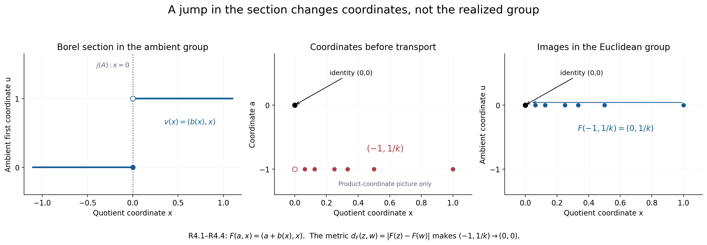
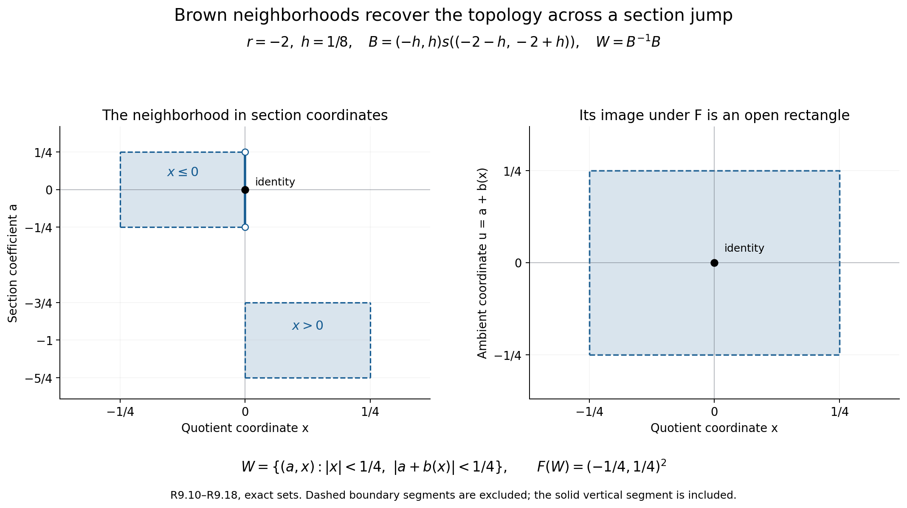

# When measurable coordinates recover a topology

A Borel section records an extension in coordinates, but it does not identify its topology with a product topology. This lesson proves realization for every normalized Borel factor system of Polish groups, including the original kernel and quotient topologies, Borel structure and continuous action. A concrete closed-factorization theorem identifies the intrinsic operator-algebra realization. The real cocycle space, quotient square and naturality are treated along the way.

*Original exposition, examples and reproducible figures in this lesson are dedicated to CC0-1.0. Source publications and fonts retain their own terms.*

Throughout, \(L,A,N,m,\ell\) have the hypotheses and normalization of [the coordinate lesson, Sections 1–2](OA-FLOW-BEX.md#ext-setting). In particular, \(A\) is abelian, the specified actions of \(L\) on \(A,N\) are continuous, and \(m,\ell\) are jointly Borel. No topology on the reconstructed group \(E_m\) is implicit in the notation \(A\times N\).

## 1. The measurable rigidity that gives uniqueness

**Lemma R1.** A Borel homomorphism between Polish groups is continuous. Consequently a Borel group isomorphism between Polish groups is a topological isomorphism.

**Proof.** Let \(f:G\to K\) be a Borel homomorphism and let \(U\) be an identity neighbourhood in \(K\). Choose an open identity neighbourhood \(V\) with \(V^{-1}V\subset U\). Separability gives a countable cover \(K=\bigcup_j k_jV\). The Borel sets \(B_j=f^{-1}(k_jV)\) cover \(G\), so at least one is nonmeagre by the Baire theorem. Borel sets have the Baire property: the sets differing from an open set by a meagre set form a sigma-algebra containing the open sets. For complements, replace the complement of an open set by its interior; their difference is contained in the nowhere dense boundary. Countable unions preserve the property directly.

The [proved Pettis theorem](../../NCG-FOLIATIONS/companions/polish-spaces-and-standard-borel-spaces.html#oa-fnd-pb-14), Theorem 8.2, says that \(B_j^{-1}B_j\) contains an identity neighbourhood. Moreover,
\[
 f(B_j^{-1}B_j)\subset V^{-1}V\subset U.
\]
Thus \(f^{-1}(U)\) contains an identity neighbourhood, which is continuity at the identity. The homomorphism law translates this to every point. For an isomorphism with Borel inverse, apply the result in both directions. The inverse of a Borel bijection between standard Borel spaces is Borel by [PB Theorem 4.3\(5\)](../../NCG-FOLIATIONS/companions/polish-spaces-and-standard-borel-spaces.html#oa-fnd-pb-06). \(\square\)

**Corollary R2.** On a fixed standard Borel group there is at most one Polish group topology inducing its given Borel sigma-algebra. In particular, any two compatible Polish realizations of \(E_m\) have the same topology.

**Proof.** The identity map between the two topological groups is a Borel isomorphism; apply R1. \(\square\)

This is a uniqueness theorem. The existence of a Polish *space* topology on a standard Borel set does not make its group operations continuous. For a concrete distinction, let
\[
 F=\{x\in\mathbb R^{\mathbb N}:x_j=0\text{ for all but finitely many }j\}
\]
with addition and the Borel structure inherited from the countable product. It is a Borel group, since it is the union of its closed subgroups
\(F_n=\{x:x_j=0\ (j>n)\}\).
It has no compatible Polish group topology. If such a topology existed, every coordinate homomorphism \(F\to\mathbb R\) would be continuous by R1, because it is Borel. Hence every \(F_n\), an intersection of coordinate kernels, would be closed. By Baire, some \(F_n\) would have nonempty interior and would therefore be open. But its cosets include the uncountable family \(t e_{n+1}+F_n\), \(t\in\mathbb R\). A separable topological group cannot have uncountably many disjoint nonempty open sets: each meets a countable dense set in a different point. This is a contradiction.

This example refutes the general implication “standard Borel group implies Polish group.” It is **not** presented as a counterexample to the more specific extension converse with both \(A\) and \(N\) Polish.

## 2. A closed factorization that actually builds the realization

Here is a test that can be applied before assigning a topology to \(E_m\). Its input consists of maps and a closedness assertion in an independently supplied Polish group.

**Closed-factorization data.** Supply a Polish group \(P\) with a continuous action of \(L\), an injective continuous homomorphism \(j:A\to P\) which is a homeomorphism onto a closed subgroup, and a Borel map \(v:N\to P\) with \(v(1)=1\). Require:

1. \(v(n)\) commutes with \(j(A)\), and \(g(j(a))=j(ga)\).
2. \(v(n)v(p)=j(m(n,p))v(np)\) and \(g(v(n))=j(\ell_g(n))v(gn)\).
3. \(j(a)v(n)=j(b)v(p)\) implies \(a=b\) and \(n=p\).
4. The explicitly defined subset \(S=j(A)v(N)\subset P\) is closed.

Conditions 1–3 are algebraic identities and a separation test on specified maps. Condition 4 refers to the already known topology of \(P\). No topology or continuity of the operations on \(E_m\) is part of the test. One can also replace the ambient action by a continuous action on the closed subgroup \(S\), provided that it is separately constructed and the same identities are checked there.

**Theorem R3 (closed-factorization realization).** Given these data, there is a unique Polish group topology on \(E_m\) inducing the product Borel structure of \(A\times N\). The kernel copy of \(A\) is closed and has its original topology. The homomorphism \(q:E_m\to N\) is continuous and open and induces the original topology on \(N\). The specified action of \(L\) on \(E_m\) is jointly continuous. The map
\[
 F_v:E_m\longrightarrow S,\qquad F_v(a,n)=j(a)v(n)
 \tag{R3.1}
\]
is an equivariant topological group isomorphism.

**Proof.** The product formula and commutation in conditions 1–2 give
\[
 [j(a)v(n)][j(b)v(p)]
   =j(abm(n,p))v(np).
\]
Thus \(S\) is closed under multiplication. Normalization puts its identity in \(S\), and the explicit inverse from (EX5) maps to the inverse in \(P\), so \(S\) is a subgroup. It is invariant under \(L\) by condition 2. Closedness makes it a Polish group: restrict a complete compatible metric on \(P\) to \(S\); separability follows because every subspace of a second countable space is second countable.

The map \(F_v\) is Borel, bijective by condition 3 and the definition of \(S\), and a homomorphism by the displayed computation. PB Theorem 4.3\(5\) gives a Borel inverse. Transport the subspace topology of \(S\) through \(F_v\). This is a Polish group topology with exactly the prescribed Borel structure. Equivariance follows from
\[
 g(j(a)v(n))=j(ga\,\ell_g(n))v(gn),
\]
and transports the jointly continuous action on \(S\).

Since \(v(1)=1\), the restriction of \(F_v\) to \(A\times\{1\}\) is exactly \(j\). Hence that kernel is closed and its topology is precisely the original topology on \(A\). The coordinate projection \(q(a,n)=n\) is a Borel homomorphism from the just constructed Polish group to the originally given Polish group \(N\). It is continuous by R1 and open by [PB Theorem 8.3](../../NCG-FOLIATIONS/companions/polish-spaces-and-standard-borel-spaces.html#oa-fnd-pb-14). Therefore the quotient topology equals the specified topology on \(N\). Uniqueness is R2. \(\square\)

The statement about the kernel is stronger than an abstract kernel identification. The proof checks the original topology on \(A\); it does not silently give \(A\) an unrelated Polish topology.

**Gauge invariance.** For a normalized Borel \(b:N\to A\), replace \(v(n)\) by \(v^b(n)=j(b(n))v(n)\). Its factors are exactly \((m^b,\ell^b)\) of (EX8). Its image union is still \(S\), and its coordinates are still unique. Thus all four conditions hold for the changed data. The map \(T_b:E_{m^b}\to E_m\), \(T_b(a,n)=(ab(n),n)\), intertwines their factorizations, and is a homeomorphism for the constructed topologies. Conversely replacing \(b\) by \(b^{-1}\) returns the original data. Hence the property of admitting this test is a property of the Borel cohomology class.

Every already realized equivariant Polish extension supplies these data by taking \(P=E\), \(j=i\), and \(v=s\), a normalized Borel section. The point of R3 is its concrete sufficient direction: when \(P,j,v,S\) are independently supplied, the topology follows from four explicit checks. The unrestricted existence proof for arbitrary Borel pairs is given separately in R9.

## 3. Discontinuous coordinates on an ordinary Polish group

Use additive notation, \(A=N=\mathbb R\), and the ordinary group \(P=\mathbb R^2\). Put
\[
 b(x)=\begin{cases}0&x\leq0,\\1&x>0,\end{cases}
 \qquad j(a)=(a,0),\qquad v(x)=(b(x),x).
 \tag{R4.1}
\]
Take a trivial acting group. The section is Borel and normalized. Its factor is
\[
 m(x,y)=b(x)+b(y)-b(x+y).
 \tag{R4.2}
\]
Direct cancellation verifies \(m(x,y)+m(x+y,z)=m(x,y+z)+m(y,z)\). Every \((u,x)\in P\) has the unique factorization \(j(u-b(x))v(x)\), so \(S=P\), a closed subgroup. R3 gives the topology transported by
\[
 F(a,x)=(a+b(x),x),\qquad
 F^{-1}(u,x)=(u-b(x),x).
 \tag{R4.3}
\]
This topology has the usual product Borel sets, although it differs from the product topology on the coordinates \((a,x)\).

For an exact discontinuity test, take \(x=y=1/k\to0\). Then \(m(1/k,1/k)=1\), while \(m(0,0)=0\). The products of \((0,1/k)\) with itself have first coordinate \(1\), so multiplication is not continuous at the identity for the product topology. This does not obstruct realization: the realized metric is
\[
 d_F((a,x),(a',x'))
   =\sqrt{|a+b(x)-a'-b(x')|^2+|x-x'|^2}.
 \tag{R4.4}
\]
It is complete because \(F\) is a bijection onto Euclidean space, and it gives exactly the topology constructed above. In particular \((-1,1/k)\to(0,0)\) in this metric, since its image is \((0,1/k)\to(0,0)\). The different coordinates express the jump of the section.

*Figure 2.* Exact formulas (R4.1)–(R4.4). The left panel shows the discontinuous representative \(v(x)\) in the already topological group \(P\); the kernel \(j(A)\) is the line \(x=0\). The middle panel is only a product-coordinate picture of \((-1,1/k)\), with its product-coordinate limit \((-1,0)\) shown hollow. The right panel shows the images \(F(-1,1/k)=(0,1/k)\) converging to the identity in the Euclidean group. Accordingly, the original sequence converges to \((0,0)\) for the pulled-back metric \(d_F\). The plotted indices are \(k=1,2,3,4,8,16\); convergence for all \(k\to\infty\) is proved in the text.

## 4. The topology of the displacement and of the entire square

Let \(A\) be a Polish abelian group, with a continuous real action \(\theta\). Choose any bounded complete compatible metric \(d_A\). It need not be invariant. On \(C(\mathbb R,A)\), set
\[
 d_C(c,d)=\sum_{k=1}^{\infty}2^{-k}
       \sup_{|t|\leq k}d_A(c(t),d(t)).
 \tag{R5.1}
\]

**Lemma R5.** This is a complete separable metric giving uniform convergence on compact intervals. Pointwise group operations make \(C(\mathbb R,A)\) a Polish group. Its continuous-cocycle subgroup
\[
 Z=\{c:c(t+u)=c(t)\theta_t(c(u))\text{ for all }t,u\}
 \tag{R5.2}
\]
is closed and therefore Polish.

**Proof.** Convergence for (R5.1) is equivalent to convergence of every displayed supremum: one implication bounds a fixed summand, and the other first makes the finite initial sum small and then bounds the remaining geometric tail. A Cauchy sequence is uniformly Cauchy on each compact interval. Completeness of \(A\) gives a pointwise limit and uniform convergence on each such interval. The limit is continuous, by the epsilon/three argument for uniform limits. The interval limits agree on their overlaps. This proves completeness.

For separability, fix a countable base of metric balls in \(A\), together with its finite unions, and all compact rational intervals in \(\mathbb R\). The conditions \(c([p,q])\subset U\) give a countable subbase for uniform convergence on compact intervals. To check that it suffices, cover a compact interval by finitely many rational intervals on each of which the given path has image of arbitrarily small diameter, and choose a small base neighbourhood containing that image. The corresponding finitely many conditions force uniform closeness to the given path. Conversely these conditions are open: a compact image contained in an open set has positive distance from its closed complement, unless the complement is empty. Their finite intersections therefore give a countable base. Choose a point from each nonempty member of this base to obtain a countable dense set.

For multiplication, if \(c_i\to c\) and \(d_i\to d\) uniformly on a compact interval \(K\), continuity of multiplication is uniform on a neighbourhood of the compact set \(\{(c(t),d(t)):t\in K\}\) in the following precise sense: for any output tolerance, choose input neighbourhoods at every point with the required bound, and a finite subcover of this compact set. Uniform convergence puts all sufficiently late input pairs in these neighbourhoods. The products then converge uniformly. Inversion is identical using the compact image of \(c\). Sequential continuity is continuity here because the spaces are metrizable.

Finally, evaluation at each time is continuous. For each fixed pair \(t,u\), the equality in (R5.2) defines a closed subset; intersect over all \(t,u\). Closedness does not require this intersection to be countable. \(\square\)

Suppose now that a Polish realization \(E\) has a continuous \(L=\Gamma\times\mathbb R\) action and trivial real action on (E/A), with \(A\) closed and central. Its displacement
\[
 \delta_E(x)(t)=x^{-1}\theta_t(x)
 \tag{R6.1}
\]
lies in \(Z\). The cocycle identity follows by expanding \(x^{-1}\theta_{t+u}(x)\); the intermediate \(\theta_t(x)\) cancels. The resulting factors lie in \(A\). The map \(\delta_E:E\to Z\) is a homomorphism by the central calculation in (EX17).

**Proposition R6.** The map \(\delta_E\) is continuous into the topology (R5.1). If its range is all of \(Z\), the induced identification \(E/E^{\mathbb R}\cong Z\) is a topological group isomorphism. With the topologies specified below, every arrow of (EX17) is continuous and the square is equivariant under a jointly continuous \(L\)-action.

**Proof.** The map \((x,t)\mapsto x^{-1}\theta_t(x)\) is jointly continuous into \(A\), because the range lies in the subgroup \(A\) with its subspace topology. Fix \(x\), a compact interval \(K\), and an output tolerance in \(d_A\). Joint continuity and a finite subcover in the time variable give a neighbourhood of \(x\) on which the displacement is uniformly close on \(K\). This is continuity into (R5.1). The kernel is the fixed subgroup \(E_0=E^{\mathbb R}\), which is closed. If the map is onto, PB's Polish open mapping theorem gives the stated quotient identification.

The other topologies are exactly
\[
 A_0=A^{\mathbb R}\text{ as a closed subgroup of }A,\quad
 B=A/A_0,\quad D=E_0/A_0,\quad
 N=E/A,\quad H=Z/B.
 \tag{R6.2}
\]
The symbol \(B\subset Z\) denotes the algebraic displacement image, carrying the quotient topology from \(A\). This topology makes its injection into \(Z\) continuous by the quotient property applied to the continuous map \(\delta_A\). No assertion that this injection is a topological embedding is used. The groups \(A_0,E_0,B,D,N,Z\) are Polish by closedness, R5, and PB's Polish quotient theorem.

The map \(D\to N\) is continuous because its composite with \(E_0\to D\) is the continuous restriction of \(E\to N\). The map \(N\to H\) is continuous because its composite with \(E\to N\) is \(E\xrightarrow{\delta_E}Z\to H\). These are uses of the quotient topology, not cancellation of merely injective maps. The remaining arrows are inclusions, restrictions or quotient maps.

The \(L\)-action on \(Z\) is \((gc)(t)=g(c(t))\). It preserves (R5.2) because the real subgroup commutes with \(L\). Joint continuity follows from the compact-image and finite-subcover argument used in R5, now with \(g\) as an additional variable. It commutes with displacement. All relevant subgroups are invariant. A continuous group action descends continuously through an open equivariant quotient: the map \(\operatorname{id}_L\times q\) is an open quotient map, and the action factors through it. Group quotient maps are open, since the inverse image of the saturation of an open set is a union of its translates. This proves continuity on \(B,D,N,H\), whether or not \(H\) is Hausdorff. The formulas prove equivariance. \(\square\)

The quotient \(H\) is Hausdorff precisely when the image \(B\subset Z\) is closed. If \(H\) is Hausdorff, \(B\) is the inverse image of its closed identity point. If \(B\) is closed, PB's coset separation proof makes (Z/B) Hausdorff, and its quotient theorem makes it Polish. Also, the continuous injection \(B=A/A_0\to Z\) then is a topological embedding: its image is Polish with the subspace topology, and the Polish open mapping theorem applies to that bijective homomorphism.

For Borel factor data before realization, the map \(n\mapsto\ell_{\mathbb R}(n)\in Z\) is still Borel. Each path is continuous by the semidirect-product homomorphism argument in EXTENSIONS, Section 4. Evaluation at rational times is Borel in \(n\). For continuous paths the suprema in (R5.1) equal the suprema over rational times, so the inverse image of every metric ball is Borel. This proves the assertion without incorrectly assuming continuous dependence on the section variable.

## 5. The closed model furnished by a von Neumann algebra

Let \(M\) be a von Neumann algebra with separable predual. Write
\[
 C=C(M),\quad M=C^\theta,\quad
 A=\mathcal U(Z(C)),\quad
 E=\{u\in\mathcal U(C):uMu^*=M\}.
 \tag{R7.1}
\]
We identify the coefficient copy of \(M\) in \(C\). All unitary groups carry their strong topology; on unitaries this is also the strong-star topology. The zero algebra can be treated as the trivial group case, so assume \(M\ne0\).

The exact earlier analytic inputs are the following proved statements, with their scope retained:

- [RCC, Sections 1–5](OA-FLOW-RCC.md#rcc-1) proves \(M'\cap C=Z(C)\) for arbitrary \(M\), including nonfactors.
- [CST, Sections 1–5](OA-FLOW-CST.md#cst-1) proves that every continuous unitary cocycle for a trace-scaling action on a semifinite algebra is \(u^*\theta_t(u)\). Applied to the canonical core, it includes all continuous \(A\)-valued cocycles.
- [CIM, Sections 1–5](OA-FLOW-CIM.md#cim-1) proves the canonical lift \(\alpha\mapsto C(\alpha)\), its group law, its continuous spatial implementation, and its characterization by trace preservation and flow commutation.
- [CORE, Sections 5–8](OA-FLOW-CORE.md#core-5) proves the normal chart transitions and the isomorphism functor \(\Phi\mapsto C(\Phi)\), with exact identity, composition, coefficient, trace and flow identities.

These analytic theorems are used at their actual proved scopes. The topological and factor identities below are proved here.

**Polish topology and closedness.** The canonical standard form is separable here. Indeed, choose a norm-dense countable set of positive normal functionals. Their cone representatives are dense in the natural cone by the estimate \(\|\xi_f-\xi_h\|^2\leq\|f-h\|\); rational complex linear combinations are dense in the standard Hilbert space because the cone has dense complex span. These are the cone and implementation results proved in [CL-01–02](../../OA-MOD/OA-MOD-CL.html#oa-mod-cl-01). The resulting regular core representation acts on a separable Hilbert space \(K=L^2(\mathbb R,H_M)\). If \((\xi_j)\) is dense in the unit ball of \(K\), then
\[
 d_U(u,v)=\sum_{j\geq1}2^{-j}
  \bigl(\|(u-v)\xi_j\|+\|(u^*-v^*)\xi_j\|\bigr)
 \tag{R7.2}
\]
is a complete compatible metric on \(\mathcal U(K)\). A Cauchy sequence has strong limits \(T,S\) for its operators and adjoints, first on the dense set and then on every vector using their common norm-one bound. Products converge strongly on bounded sets, so \(TS=ST=1\), and the limits satisfy \(S=T^*\), by taking scalar products. Hence \(T\) is unitary. Convergence in (R7.2) follows by the finite initial sum and geometric tail estimate. The group embeds in the countable product of two copies of \(K\) by its values and adjoint values on the \(\xi_j\); this makes it second countable and separable. Multiplication and inversion are continuous. On unitaries, strong convergence to a unitary entails adjoint convergence, since
\[
 \|(u_i^*-u^*)\xi\|=\|(u-u_i)u^*\xi\|.
\]

Strong closedness of the represented von Neumann algebra makes \(\mathcal U(C)\) a closed subgroup of \(\mathcal U(K)\). The groups \(A\) and \(\mathcal U(M)\) are closed for the same reason, with commutation conditions for \(A\). To prove \(E\) is closed, let \(u_i\to u\) strongly in \(\mathcal U(C)\), with \(u_iMu_i^*=M\). For each \(x\in M\), both \(u_ixu_i^*\) and \(u_i^*xu_i\) have strong limits in \(M\). Consequently \(uMu^*\subset M\) and \(u^*Mu\subset M\); the second inclusion reverses the first, so equality holds. Every group just listed is Polish. This proof uses both inclusions.

For completeness, \(\operatorname{Aut}(M)\) is Polish in its \(u\)-topology. [CL-01, equations (CL.1)–(CL.6)](../../OA-MOD/OA-MOD-CL.html#oa-mod-cl-01), proves the canonical standard-form implementer theorem and its topology, for arbitrary algebras. It identifies this automorphism group homeomorphically with
\[
 \{U\in\mathcal U(H_M):UMU^*=M,\ UJ=JU,\ U\mathcal P=\mathcal P\}.
\]
The same closedness proof handles normalization, commutation with \(J\), and preservation of the closed natural cone in both directions. This proves the Polish assertion without a factoriality assumption.

**Displacement and the quotient.** If \(u\in E\) and \(x\in M\), applying \(\theta_t\) to \(uxu^*\in M=C^\theta\) gives \(\theta_t(u)x\theta_t(u)^*=uxu^*\). Hence \(u^*\theta_t(u)\in M'\cap C=Z(C)\), so its displacement belongs to \(A\). Conversely, if \(u^*\theta_t(u)\in A\) for every \(t\), then \(uxu^*\) is fixed for every \(x\in M\), since its central displacement cancels. The same argument for \(u^*\) gives the reverse inclusion. Thus this displacement condition characterizes \(E\). In particular the real action on \(N=E/A\) is trivial.

Given \(c\in Z^1_\theta(\mathbb R,A)\), CST supplies \(u\in\mathcal U(C)\) with \(u^*\theta_t(u)=c(t)\). The just proved converse places \(u\) in \(E\). Therefore \(\delta_E(E)=Z\), with actual surjectivity and no choice of continuous implementers assumed.

Let
\[
 \operatorname{Cntr}(M)
 =\{\alpha\in\operatorname{Aut}(M):C(\alpha)\text{ is inner on }C\}.
 \tag{R7.3}
\]
The map \(u\mapsto\operatorname{Ad}(u)|_M\) has kernel \(A\), by RCC. Its image is exactly \(\operatorname{Cntr}(M)\). Indeed, for \(u\in E\), central displacement makes \(\operatorname{Ad}(u)\) commute with \(\theta\), and the trace property makes it preserve the entire canonical trace. CIM4's uniqueness therefore identifies it with the canonical lift of its coefficient restriction. Conversely an implementing unitary for \(C(\alpha)\) normalizes the coefficient algebra, because the lift restricts to \(\alpha\). Give \(\operatorname{Cntr}(M)\) the quotient topology (E/A). It is Polish. The equality of this topology with its subspace topology in \(\operatorname{Aut}(M)\) is not asserted.

**The acting group.** Put \(L=\operatorname{Aut}(M)\times\mathbb R\) and
\[
 (\alpha,t)u=C(\alpha)(\theta_t(u)).
 \tag{R7.4}
\]
CIM gives the group law and flow commutation. Its continuous spatial implementers, together with the strongly continuous implementers of \(\theta\), make (R7.4) jointly continuous on \(\mathcal U(C)\): multiplication of strongly convergent bounded operators is continuous. Both \(A,E\) are invariant. The action on \(N=E/A\) is continuous by the open-quotient argument in R6; on the corresponding automorphisms it is \(\beta\mapsto\alpha\beta\alpha^{-1}\), with trivial real part.

Choose a normalized Borel section \(s:N\to E\) by PB's closed-coset theorem. In R3 take \(P=\mathcal U(C)\), \(j\) the central-unitary inclusion, and \(v=s\). Conditions 1–3 follow from the section equations and uniqueness of the kernel coordinate. Condition 4 is the closedness of \(E\), proved above. Thus the operator-algebra class passes the explicit realization test. The reconstructed topology is the original strong topology of \(E\), the kernel has the original strong topology of \(A\), and the quotient retains its specified quotient topology. The real condition (EX13) holds by the preceding CST application.

## 6. Exact transport of sections and of the invariant

Let \(\Phi:M_1\to M_2\) be a specified normal isomorphism, with normal inverse. Write \(F=C(\Phi)\) for the exact core isomorphism of CORE8. It sends \(A_1\) onto \(A_2\), \(E_1\) onto \(E_2\), and \(\mathcal U(M_1)\) onto \(\mathcal U(M_2)\). A normal isomorphism and its inverse are strong-star continuous on bounded sets: the defining seminorm \(x\mapsto\omega(x^*x)^{1/2}\) is transported to the seminorm for the positive normal functional \(\omega\circ F\), and similarly for \(xx^*\). Thus these restrictions are homeomorphisms. They induce topological isomorphisms
\[
 f_A:A_1\to A_2,\qquad f_N:N_1\to N_2,
 \qquad f_L(\alpha,t)=(\Phi\alpha\Phi^{-1},t).
 \tag{R8.1}
\]
Conjugation \(f_L\) is a homeomorphism in the predual \(u\)-topology, because composition by the fixed normal isomorphisms transports predual norms isometrically. Functoriality and flow commutation give the exact equivariance
\[
 F(gu)=f_L(g)F(u).
 \tag{R8.2}
\]

For any normalized Borel section \(s_1:N_1\to E_1\), put
\[
 s_2(n)=F(s_1(f_N^{-1}n)).
 \tag{R8.3}
\]
It is a normalized Borel section, and direct substitution gives
\[
 \begin{aligned}
 m_2(f_Nn,f_Np)&=f_A(m_1(n,p)),\\
 (\ell_2)_{f_Lg}(f_Nn)&=f_A((\ell_1)_g(n)).
 \end{aligned}
 \tag{R8.4}
\]
For independently chosen target sections, their ratio is a normalized Borel \(A_2\)-valued function. Equation (EX8) changes (R8.4) by exactly its coboundary. Hence
\[
 \chi(M)=[m,\ell]\in
 \mathscr H_{\operatorname{Aut}(M)\times\mathbb R}
      (\operatorname{Cntr}(M),\mathcal U(Z(C(M))))
 \tag{R8.5}
\]
is independent of the normalized Borel section and is transported by every specified normal isomorphism. Identity and composition hold before taking classes, by CORE8 and (R8.3), so they also hold for the classes. This states a natural invariant with varying \(L,N,A\), not an equality between cohomology groups whose underlying data have not been identified.

The faithful-core-chart assertion is the same calculation with the exact transition \(J_{\psi,\varphi}\) of CORE5–7. That transition fixes coefficients, preserves the normalized trace, intertwines the dual flow, and satisfies the exact transition composition law. It therefore transports \(A,E,N\), their topologies, actions and chosen sections as above. CIM's chart covariance identifies the acting canonical lifts without an inner or scalar ambiguity. No selected reference weight remains in (R8.5).

The induced map on real cocycles is \(c\mapsto(t\mapsto f_A(c(t)))\). It is a homeomorphism in the compact-open topology, by the compact-image proof of R5 applied to \(f_A\) and its inverse. It takes coboundaries to coboundaries and gives all the other arrows of the square. For example,
\[
 \delta_{E_2}(F(u))(t)=f_A(\delta_{E_1}(u)(t)),
 \qquad \nu_2(f_Nn)=\overline f_A(\nu_1(n)).
 \tag{R8.6}
\]
Thus the entire exact square, its quotient topologies, and its \(L\)-actions transport. This proves invariance under normal isomorphism; it does not classify von Neumann algebras by this invariant.

## 7. Realization of every Borel factor system

The extra certificate in R3 is useful for identifying a concrete realization, but is not necessary for existence. We now prove the unrestricted converse. The construction uses category and moving coordinates. It does not assign the product topology to the twisted multiplication.

**Theorem R9 (full equivariant realization).** Let \(A,N,L\) be Polish groups, with \(A\) abelian and the specified continuous \(L\)-actions on \(A,N\). Every jointly Borel normalized pair \((m,\ell)\) satisfying (EX3)–(EX4) gives \(E_m=A\times N\) a unique Polish group topology whose Borel structure is the product Borel structure. The inclusion \(A\to E_m\) is a homeomorphism onto a closed central subgroup, the map \(E_m\to N\) is continuous and open onto the original topology of \(N\), and the reconstructed \(L\)-action is jointly continuous.

Normalized Borel gauge maps (EX9) are equivariant homeomorphisms. Consequently (EX10) classifies all the specified equivariant Polish central extensions. When \(L=\Gamma\times\mathbb R\), the real factor acts trivially on \(N\), and (EX13) is imposed, the resulting extension has exactly the required surjective displacement map. Conversely every extension with that property satisfies (EX13).

The underlying existence result is due to L. G. Brown, [*Extensions of topological groups*, Pacific J. Math. **39** (1971), 71–78](https://msp.org/pjm/1971/39-1/pjm-v39-n1-p06-s.pdf), theorem on p.73 and construction on pp.74–77. The proof below is a central-case derivation with the topology, completeness, Borel and action arguments included. Only the everywhere-defined cocycle is used, so no extension of a partially defined cocycle is needed.

### 7.1. A domain on which the section coordinates behave continuously

We first record the category facts used in the construction. A Borel map \(f:X\to Y\) between Polish spaces is continuous on a dense \(G_\delta\) subspace of \(X\). Indeed, for each member \(V\) of a countable base of \(Y\), write \(f^{-1}(V)=O_V\mathbin\triangle M_V\), with \(O_V\) open and \(M_V\) meagre. Borel sets have the Baire property by R1. Contain the countable union of the \(M_V\)'s in a meagre \(F_\sigma\) set and remove it. On the remaining dense \(G_\delta\), all the indicated inverse images are relatively open.

If \(C\) is a dense \(G_\delta\) in \(X\times Y\), there is a dense \(G_\delta\) \(R\subseteq X\) such that every vertical section \(C_x\), \(x\in R\), is a dense \(G_\delta\) in \(Y\). To see this, write \(C=\bigcap_j O_j\), with each \(O_j\) dense open. For each nonempty basic open \(V\subseteq Y\), the projection of \(O_j\cap(X\times V)\) onto \(X\) is open dense. Intersect these countably many projections. Each resulting section meets every \(V\) at every stage \(j\), as required. All countable intersections of dense \(G_\delta\)'s below are nonempty by the Baire theorem.

Apply these facts to \(m:N^2\to A\). Choose \(C\subseteq N^2\) dense \(G_\delta\) with \(m|_C\) continuous, and choose \(R\subseteq N\) dense \(G_\delta\) with \(C_x\) dense \(G_\delta\) for every \(x\in R\). Put
\[
 D_R=\{(x,y):x,y,xy\in R\}.
 \tag{R9.1}
\]
Then \(m|_{D_R}\) is continuous. For a convergent sequence \((x_k,y_k)\to(x,y)\) in \(D_R\), choose \(z\) so that, for all its terms and its limit,
\[
 (y_k,z),\ (x_k,y_kz),\ (x_ky_k,z)\in C.
\]
The allowed \(z\)'s form a countable intersection of dense \(G_\delta\)'s: here \(x_k,y_k,x_ky_k\in R\) is precisely what is needed. The cocycle identity gives
\[
 m(x_k,y_k)=m(y_k,z)m(x_k,y_kz)m(x_ky_k,z)^{-1}.
 \tag{R9.2}
\]
Continuity on \(C\) proves the assertion, including at the specified limit.

Two consequences will be needed even for elements outside \(R\):
\[
 \begin{array}{ll}
 y\longmapsto m(h,y)
 &\text{is continuous on }\{y:y,hy\in R\},\\
 x\longmapsto m(x,h)
 &\text{is continuous on }\{x:x,xh\in R\},
 \end{array}
 \qquad h\in N.
 \tag{R9.3}
\]
For the first assertion and a sequence \(y_k\to y\) in its displayed domain, choose \(w\) with
\[
 w,\ hw^{-1},\ wy_k,\ wy\in R
\]
for every \(k\). Set \(v=hw^{-1}\). All variable pairs on the right of
\[
 m(h,y_k)=m(v,w)^{-1}m(w,y_k)m(v,wy_k)
\]
belong to \(D_R\), so (R9.1) proves continuity. For the second assertion, given \(x_k\to x\), choose \(v\) with \(v,v^{-1}h,x_kv,xv\in R\), set \(w=v^{-1}h\), and use
\[
 m(x_k,h)=m(x_k,v)m(x_kv,w)m(v,w)^{-1}.
\]
Again every varying pair belongs to \(D_R\). These arguments prove (R9.3) without assuming \(h\in R\).

### 7.2. Convergence defined by one regular translate

Work in the algebraic group \(E_m\) already proved in (EX5), and write \(s(x)=(1,x)\). A sequence
\[
 e_k=a_ks(x_k)
\]
will be called **null in the coordinates** if \(x_k\to1\) in \(N\) and
\[
 a_km(u,x_k)\longrightarrow1\quad\text{in }A
 \tag{R9.4}
\]
for one \(u\) with \(u,ux_k\in R\) for every \(k\). Such anchors \(u\) always exist, since the requirements are countably many right translates of \(R\). Equation (R9.4) says exactly that \(s(u)e_k\) has coordinates approaching those of \(s(u)\) in \(A\times R\).

The criterion is independent of the anchor. If \(u=vu'\) and both \(u,u'\) are allowed, the cocycle identity gives
\[
 a_km(u,x_k)
 =a_km(u',x_k)\,
     m(v,u'x_k)m(v,u')^{-1}.
 \tag{R9.5}
\]
The last ratio tends to \(1\) by the first assertion of (R9.3). This proves independence in both directions. Finite changes of a sequence make no difference.

We verify all three operations needed for a group topology.

First, conjugation by any fixed element preserves null sequences. Central elements do nothing, so consider \(s(h)e_ks(h)^{-1}\). Choose \(u\) with
\[
 u,\ uh,\ uhx_k,\ uhx_kh^{-1}\in R
\]
for every \(k\). The coefficient of \(s(uhx_kh^{-1})\) in
\[
 s(u)s(h)e_ks(h)^{-1}
\]
is
\[
 m(u,h)\,[a_km(uh,x_k)]\,m(uhx_kh^{-1},h)^{-1}.
 \tag{R9.6}
\]
The bracket tends to \(1\) by (R9.4), and the other factors cancel in the limit by the second assertion of (R9.3). The quotient coordinate tends to \(1\). This proves the conjugation assertion.

It follows that (R9.4) is equivalent to the right-anchor test
\[
 x_k\to1,\qquad a_km(x_k,w)\to1,
 \quad w,x_kw\in R.
 \tag{R9.7}
\]
Indeed, apply the left-anchor test at \(w\) to \(s(w)^{-1}e_ks(w)\). Its left translate by \(s(w)\) is \(e_ks(w)\), whose coefficient is exactly the one in (R9.7). Conjugation by \(s(w)\) proves the converse.

Second, the product of two null sequences is null. Write the second sequence as \(f_k=b_ks(y_k)\). Choose \(u\) with \(u,ux_k,ux_ky_k\in R\). Then choose \(w\) with
\[
 w,\ uw,\ y_kw,\ ux_ky_kw\in R
\]
for every \(k\). The coefficient of \(s(ux_ky_k)\) in \(s(u)e_kf_k\) is
\[
 [a_km(u,x_k)]\,[b_km(y_k,w)]\,
 m(ux_k,y_kw)m(ux_ky_k,w)^{-1}.
 \tag{R9.8}
\]
The first two factors tend to \(1\), by (R9.4) and (R9.7). Both pairs in the last two factors belong to \(D_R\) and tend to \((u,w)\in D_R\). Their ratio therefore tends to \(1\).

Third, inverses of null sequences are null. Choose \(u\) with \(u,ux_k^{-1}\in R\), and \(w\) with \(w,uw,x_kw\in R\). If
\[
 s(u)e_k^{-1}=c_ks(ux_k^{-1}),
\]
then multiplying this identity by \(e_ks(w)\) gives
\[
 c_k=[a_km(x_k,w)]^{-1}
       m(u,w)m(ux_k^{-1},x_kw)^{-1}.
 \tag{R9.9}
\]
This tends to \(1\) by (R9.7) and continuity on \(D_R\). Thus inversion preserves null sequences. Finally a constant sequence is null only when its value is \(1\): its quotient must be \(1\), and then (R9.4) reduces to convergence of its constant coefficient to \(1\).

### 7.3. A countable neighborhood base

Fix \(r\in R\). Let \(U_j\) be a decreasing countable base of open identity neighborhoods in \(A\), and \(V_j=R\cap O_j\) a decreasing base at \(r\) in \(R\), where \(O_j\) are open in \(N\). Define
\[
 B_j=U_js(V_j),\qquad W_j=B_j^{-1}B_j.
 \tag{R9.10}
\]
These are algebraic sets at this stage. We claim that
\[
 e_k\text{ is null in the coordinates}
 \quad\Longleftrightarrow\quad
 \forall j\ \exists K\ \forall k\geq K,\ e_k\in W_j.
 \tag{R9.11}
\]

Suppose first that the condition on the right holds. By choosing a level \(j(k)\to\infty\), write
\[
 e_k=\beta_k^{-1}\gamma_k,\qquad
 \beta_k=b_ks(y_k),\quad\gamma_k=c_ks(z_k),
\]
with \(b_k,c_k\to1\) and \(y_k,z_k\to r\) in \(R\). The sequences \(s(r)^{-1}\beta_k\) and \(s(r)^{-1}\gamma_k\) are null: take the left anchor \(r\), which leaves coefficients \(b_k,c_k\) and coordinates \(y_k,z_k\). Products and inverses, already proved above, now show that \(e_k\) is null.

Conversely, suppose \(e_k=a_ks(x_k)\) is null. Choose \(y_k,z_k\in R\) with \(y_k,z_k\to r\) and \(y_kx_k=z_k\). To justify the choice, for every fixed small open neighborhood \(O\) of \(r\), the open set \(O\cap Ox_k^{-1}\) is nonempty for large \(k\), and meets the dense \(G_\delta\) \(R\cap Rx_k^{-1}\). Use successively smaller \(O\)'s. Put
\[
 \beta_k=s(y_k),\qquad
 \gamma_k=s(y_k)e_k=d_ks(z_k),\qquad
 d_k=a_km(y_k,x_k).
\]
Choose one \(w\) with \(w,rw,x_kw,z_kw\in R\) for every \(k\). The identity
\[
 d_k=[a_km(x_k,w)]\,
             m(y_k,x_kw)m(z_k,w)^{-1}
 \tag{R9.12}
\]
shows \(d_k\to1\): the bracket tends to \(1\) by (R9.7), and the other pairs tend in \(D_R\) to \((r,w)\). Hence \(\beta_k,\gamma_k\) eventually belong to every \(B_j\), and \(e_k=\beta_k^{-1}\gamma_k\) eventually belongs to every \(W_j\). This proves (R9.11).

Now \(W_j\) are decreasing, symmetric and contain \(1\), with intersection \(\{1\}\). For every \(j\), some \(k\) satisfies \(W_k^2\subseteq W_j\). Otherwise choose two elements of \(W_k\) whose product lies outside \(W_j\), for every \(k\). Both chosen sequences are null by (R9.11), contradicting the product assertion. The identical sequence argument with (R9.6) shows that for every \(e\in E_m\) and \(j\), some \(k\) satisfies
\[
 eW_ke^{-1}\subseteq W_j.
\]
These conditions produce a Hausdorff group topology: declare \(O\subseteq E_m\) open when every \(x\in O\) has some \(xW_j\subseteq O\). The square condition shows that each \(W_j\) contains an open identity neighborhood and is itself a neighborhood; the conjugation condition gives right translations and continuity of multiplication, and symmetry gives continuity of inversion. Thus \(W_j\) are a countable neighborhood base. The invariant chain-metric proof in [PB, Lemma 8.4](../../NCG-FOLIATIONS/companions/polish-spaces-and-standard-borel-spaces.html#oa-fnd-pb-13) makes this topology metrizable. By (R9.11), its convergent-to-identity sequences are exactly those defined in (R9.4).

The topology induced on \(A\) is its original topology: a sequence \(a_k\in A\) is null exactly when \(a_k\to1\) in \(A\). Both topologies are metrizable, so this sequential assertion proves equality. Projection \(q:E_m\to N\) is continuous, since (R9.4) includes \(q(e_k)\to1\). It is open as well. Given \(x_k\to1\) in \(N\), choose \(y_k,z_k\to r\) in \(R\) with \(y_k^{-1}z_k=x_k\) as above. Then
\[
 s(y_k)^{-1}s(z_k)\longrightarrow1,\qquad
 q(s(y_k)^{-1}s(z_k))=x_k.
 \tag{R9.13}
\]
If the image of an identity neighborhood failed to contain a neighborhood of \(1\) in \(N\), a sequence outside that image tending to \(1\) would contradict (R9.13). Thus \(q\) is open and induces the original quotient topology. Its kernel \(A\) is closed.

The group \(E_m\) is separable. Choose lifts of a countable dense subset of \(N\), and multiply them by a countable dense subset of \(A\). This countable set is dense: for an open \(O\subseteq E_m\), choose \(e\) and an open identity neighborhood \(V\) with \(eV^2\subseteq O\). Openness of \(q\) supplies a selected lift \(z\) with \(qz\in q(eV)\), so \(z=eva\) for some \(v\in V,a\in A\). Choose a selected \(a_j\) with \(aa_j\in V\cap A\). Then \(za_j\in eV^2\subseteq O\).

### 7.4. Why the group topology is complete

We include the completeness argument, since a compatible invariant metric need not be complete. The following elementary completion facts apply to any separable metrizable group \(T\).

Choose a bounded compatible left invariant metric \(d\) by the chain construction, and use
\[
 D(x,y)=d(x,y)+d(x^{-1},y^{-1}).
 \tag{R9.14}
\]
A \(D\)-Cauchy sequence is precisely a sequence Cauchy for both left and right group uniformities. The metric completion \(\widehat T\) is a group, with multiplication and inverse computed on representing Cauchy sequences. Here are the needed verifications. Conjugation by the terms of a two-sided Cauchy sequence is eventually uniformly controlled at the identity: write a late term as a fixed term times an element of a small identity neighborhood, and use \(V^3\subseteq W\). Consequently, if \(x_k,y_k\) are two-sided Cauchy, the formulas
\[
 \begin{aligned}
 (x_ky_k)^{-1}(x_ly_l)
 &=y_k^{-1}(x_k^{-1}x_l)y_k\,(y_k^{-1}y_l),\\
 (x_ky_k)(x_ly_l)^{-1}
 &=x_k(y_ky_l^{-1})x_k^{-1}\,(x_kx_l^{-1})
 \end{aligned}
 \tag{R9.15}
\]
show that the products are two-sided Cauchy. The same estimates show that equivalent representing sequences give equivalent products. Inverse is an isometry for \(D\), and the group laws hold term by term. Continuity of the extended product can be checked by a diagonal approximation: for convergent pairs in the completion, select original-group approximants within \(1/k\) of their two entries and with their product within \(1/k\) of the defined product. These approximants form two Cauchy sequences, so (R9.15) identifies the limit of their products with the product of the two limits. Thus \(\widehat T\) is a Polish group containing \(T\) as a dense topological subgroup.

A completely metrizable subgroup \(J\) of a Polish group \(P\) is closed. For detail, put \(K=\overline J\), and fix a complete metric \(\rho\) for the given subspace topology on \(J\). For each \(j\), cover \(J\) by open subsets of \(K\) whose intersections with \(J\) have \(\rho\)-diameter less than \(2^{-j}\), and call their union \(O_j\). Then \(J=\bigcap_j O_j\). Indeed, if \(x\) belongs to every \(O_j\), choose a member of each cover containing \(x\). Density permits a sequence of points of \(J\) in the successive finite intersections, tending to \(x\) in \(K\). That sequence is \(\rho\)-Cauchy, hence converges in \(J\); uniqueness of the ambient limit gives \(x\in J\). Therefore \(J\) is a dense \(G_\delta\) in the complete space \(K\). For every \(z\in K\), the two dense \(G_\delta\)'s \(J,zJ\) intersect. Their intersection implies \(z\in J\), proving closedness.

Apply the completion construction to the topology just built on \(E_m\). Its subgroup \(A\), with its original Polish topology, is closed in \(\widehat E_m\) by the preceding paragraph. Centrality extends from the dense subgroup \(E_m\) to \(\widehat E_m\). The [Polish quotient theorem, PB 8.8](../../NCG-FOLIATIONS/companions/polish-spaces-and-standard-borel-spaces.html#oa-fnd-pb-13) now makes \(\widehat E_m/A\) Polish.

The natural injection \(N=E_m/A\to\widehat E_m/A\) is a topological embedding. Continuity follows from the quotient property of \(q\). To check its topology in the other direction, let \(O\subseteq E_m\) be an open \(A\)-saturated set and choose an ambient open \(\widehat O\subseteq\widehat E_m\) with \(\widehat O\cap E_m=O\). Since \(A\subseteq E_m\),
\[
 (\widehat O A)\cap E_m=O.
\]
The ambient quotient image of \(\widehat O A\) is open and has the required intersection with \(E_m/A\). This proves the embedding assertion. Its image is dense and is a completely metrizable subgroup, hence closed by the preceding argument. Therefore \(E_m/A=\widehat E_m/A\), and, since \(A\subseteq E_m\), necessarily \(E_m=\widehat E_m\). The constructed topology is Polish.

### 7.5. Preservation of the Borel structure

The map \(s|_R:R\to E_m\) is continuous. If \(x_k\to x\) in \(R\), use anchor \(x\) in (R9.4) for \(s(x)^{-1}s(x_k)\); its translated coefficient is identically \(1\).

The multiplication map
\[
 p:R\times R\longrightarrow N,\qquad p(u,v)=uv
 \tag{R9.16}
\]
is a continuous open surjection. Surjectivity follows from \(R\cap nR^{-1}\ne\varnothing\). More precisely, for ambient open \(U,V\subseteq N\),
\[
 (U\cap R)(V\cap R)=UV:
\]
if \(n\in UV\), the nonempty open set \(U\cap nV^{-1}\) meets the dense \(G_\delta\) \(R\cap nR^{-1}\). The other inclusion is immediate. This proves openness on a base.

A continuous open surjection \(p:X\to Y\) between Polish spaces has a Borel right inverse. Here is a direct construction. Choose a complete metric on \(X\) and a countable base of balls. For each \(y\), choose the first ball of diameter below \(1/2\) whose image contains \(y\), then successively the first ball of diameter below \(2^{-j}\), with closure inside the preceding ball, whose image contains \(y\). Such balls exist around points of the fiber; every selection condition is Borel because the images of balls are open. Their centers form a Borel sequence converging to a point of \(p^{-1}(y)\): choose a fiber point in every ball, and use completeness, nesting and continuity of \(p\). The limit map is Borel, since pointwise limits of Borel maps into metric spaces are Borel, as follows by testing distances to a countable dense set.

Apply this construction to (R9.16), whose domain is Polish as a \(G_\delta\) in \(N^2\). Obtain Borel \(u,v:N\to R\) with \(u(n)v(n)=n\). In the already constructed Polish group \(E_m\),
\[
 s(n)=m(u(n),v(n))^{-1}s(u(n))s(v(n)).
 \tag{R9.17}
\]
The right side is Borel, since \(s|_R\) and inclusion of \(A\) are continuous. Thus the identity-coordinate bijection
\[
 A\times N\longrightarrow E_m,\qquad (a,n)\longmapsto as(n)
\]
is Borel from the original product space to the new Polish group. The Borel-bijection theorem R1, with its exact PB proof, gives a Borel inverse. The new Borel structure is therefore exactly the original product Borel structure.

### 7.6. The action, uniqueness and the classification statement

For completeness, a jointly Borel action of a Polish group \(L\) by automorphisms of a Polish group \(T\) is jointly continuous. Each automorphism is continuous by R1. Apply the category facts of Section 7.1 to the map \(L\times T\to T\). Obtain a dense \(G_\delta\) \(C\) on which it is continuous, and a dense \(G_\delta\) \(S\subseteq L\) whose vertical sections \(C_g\) are dense \(G_\delta\).

The action is continuous on \(S\times T\). For \(g_k\to g\) in \(S\) and \(x_k\to x\) in \(T\), choose a single \(b\in T\) such that
\[
 (g_k,b),\ (g_k,b^{-1}x_k),\
 (g,b),\ (g,b^{-1}x)\in C
\]
for every \(k\). This is possible by the Baire theorem. The identity
\[
 g_k(x_k)=g_k(b)\,g_k(b^{-1}x_k)
\]
then proves convergence to \(g(x)\). For an arbitrary convergent \(g_k\to g\) in \(L\), choose \(h\) with \(hg_k,hg\in S\) for every \(k\). Applying continuity on \(S\times T\), followed by the fixed continuous automorphism \(h^{-1}\), proves full joint continuity.

The reconstructed action (EX5) is jointly Borel for the original product Borel structure, hence also for the topology constructed above. Apply this action lemma with \(T=E_m\). Its restrictions and quotient are exactly the specified actions because their formulas were fixed algebraically.

R2 gives uniqueness of the compatible Polish group topology. Each map (EX9), and its inverse, is a Borel homomorphism between the resulting Polish groups, so R1 makes it a homeomorphism; (EX8) proves equivariance. Conversely every isomorphism of extensions gives exactly a normalized Borel gauge as proved in Section 3 of the coordinate lesson. This proves the full bijection asserted in R9.

Finally, all real displacement formulas (EX11)–(EX18) apply to this realization. Equation (EX13) gives surjectivity as an equality of sets, and R5–R6 give its continuity, the quotient topologies, and the actions on the entire square. Thus no additional realizability condition is needed beyond the stated Borel factor identities and the explicitly requested displacement condition. The independent certificate in R3 identifies the same unique topology whenever a concrete ambient realization is available, in particular for the normalizer in Sections 5–6. \(\square\)

### 7.7. The neighborhood in an exact model

The neighborhood construction has an exact picture in the step-section model R4. Use additive notation, take \(R=\mathbb R\setminus\{0\}\), \(r=-2\), and \(h=1/8\). On \(V=(-2-h,-2+h)\) the function \(b\) is zero, so \(F(B)=(-h,h)\times V\), where \(B=(-h,h)s(V)\). Hence
\[
 W=B^{-1}B
  =\{(a,x):|x|<1/4,\ |a+b(x)|<1/4\},\qquad
 F(W)=(-1/4,1/4)^2.
 \tag{R9.18}
\]
This is an equality of sets, not an approximation. At \(x=0\) the upper vertical segment belongs to \(W\), while the corresponding lower segment does not, because \(b(0)=0\).

*The same neighborhood in two coordinate systems.* The left panel plots the exact set (R9.18) with horizontal \(x\) and vertical \(a\). The right panel uses horizontal \(x\) and vertical \(u=a+b(x)\). Dashed boundary segments are excluded and the solid segment is included. This realizes (R9.10) across the jump of R4.1. The group-topology proof is Sections 7.2–7.4; Brown's original general mechanism is on pp.75–77 of the article cited above. The figure and its model source are original.

## Reading

M. Takesaki, *Theory of Operator Algebras II*, Chapter XII, §6, pp.453–454, formulates the abstract square and its characteristic class. The arguments above separate Borel reconstruction, compatible-topology existence and uniqueness, and the actual closed normalizer realizing the operator-algebra class. Brown's 1971 paper supplies the historical category construction developed in Section 7. PB's proved Borel-injection, coset-section, invariant-metrization, open-mapping and quotient theorems are the exact descriptive-set-theoretic prerequisites. The full converse is proved in R9, including completeness and the original Borel structure; it is not inferred merely from the source's omitted proof.
