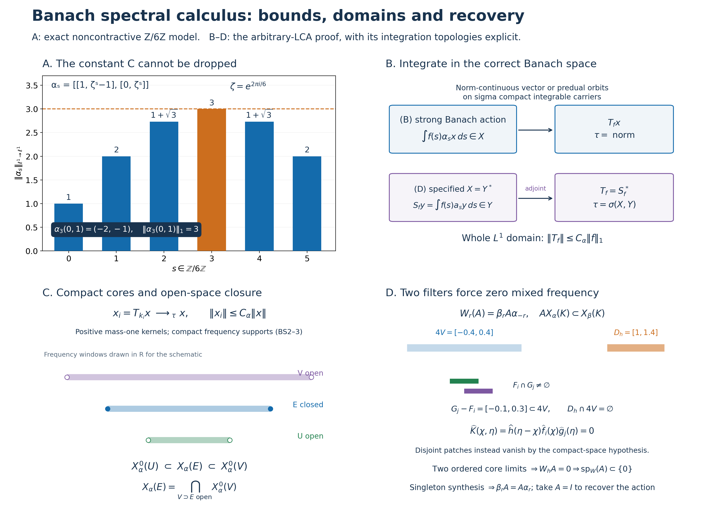

# Spectral calculus for uniformly bounded Banach actions of an arbitrary LCA group

Let \(G\) be a locally compact Hausdorff abelian group, \(\Gamma=\widehat G\), with the Haar conventions of [L24](OA-FLOW-L24.md#oa-flow.grp.haarconventions). Neither group nor any Banach space below is assumed separable or sigma compact. We use the negative transform

\[
 \widehat f(\gamma)=\int_G f(s)\overline{\gamma(s)}\,dm(s).
 \tag{BS1}
\]
The scalar inputs are the complete [LF0–7 local Fourier proofs](OA-FLOW-LF.md#lf-0), [SS1–2 singleton synthesis](OA-FLOW-SS.md#ss-1), [H0 compact topology](OA-FLOW-TOPOLOGY.md#l138-h0), [H1 character topology and Fourier injectivity](OA-FLOW-HARMONIC.md#l138-h1), [HR5/HR7 qualified product integration](OA-FLOW-HR.md#hr-05), and [L24's Banach-valued integration](OA-FLOW-L24.md#oa-flow.grp.vectorintegration). Hahn–Banach and the elementary normed-space tools are proved in [CF1](OA-FLOW-CF.md#oa-flow.cf.1).

Two settings are treated throughout. In **(B)**, \(X\) is a complex Banach space and \(\alpha:G\to\mathcal B(X)\) is a representation by invertible bounded maps with norm-continuous orbits. In **(D)**, \(X=Y^*\) for a specified Banach space \(Y\), every \(\alpha_s\) is \(\sigma(X,Y)\)-continuous, and every preadjoint orbit is norm continuous at zero. In both settings assume

\[
 C_\alpha=\sup_{s\in G}\|\alpha_s\|<\infty,\qquad
 \alpha_0=I,\qquad \alpha_{s+t}=\alpha_s\alpha_t.
 \tag{BS2}
\]
Write \(\tau\) for the norm topology in (B) and for \(\sigma(X,Y)\) in (D). All closures and limits explicitly marked \(\tau\) use this choice. The zero space is allowed; its conclusions are immediate. If \(X\ne0\), then \(C_\alpha\geq1\). No bound below presumes \(C_\alpha=1\).

## BS0. Specified preduals, continuity and operator spaces

For Banach spaces \(Y,Z\) and a bounded linear \(T:Y^*\to Z^*\), the following are equivalent:

\[
 T\text{ is }\sigma(Y^*,Y)\text{-to-}\sigma(Z^*,Z)\text{ continuous}
 \quad\Longleftrightarrow\quad
 T^*(Z)\subset Y,
 \tag{BS3}
\]
where \(Y,Z\) are their canonical images in their biduals. In this case there is a unique bounded \(T_*:Z\to Y\) with

\[
 (Tx)(z)=x(T_*z),\qquad T=T_*^*,\qquad \|T_*\|=\|T\|.
 \tag{BS4}
\]
To prove the forward implication, fix \(z\in Z\). A continuous linear functional \(\ell\) on \((Y^*,\sigma(Y^*,Y))\) is a finite linear combination of evaluations at elements of \(Y\). Indeed continuity bounds \(|\ell(x)|\) on a neighbourhood defined by finitely many evaluations \(x(y_j)\); rescaling shows that \(\ell\) vanishes on their common kernel. It therefore factors through the finite-dimensional image of \(x\mapsto(x(y_1),\ldots,x(y_n))\), and extension of a linear functional from that image gives \(\ell(x)=x(\sum_j c_jy_j)\). Apply this to \(\ell(x)=(Tx)(z)\). Uniqueness follows because Hahn–Banach separates elements of \(Y\). The resulting \(T_*\) is linear, and

\[
 \|T_*z\|=\sup_{\|x\|\leq1}|(Tx)(z)|\leq\|T\|\|z\|.
 \tag{BS5}
\]
Conversely (BS4) implies the stated weak continuity. Taking the supremum over unit \(x,z\), using the defining norm of \(Z^*\) and the Hahn–Banach norm formula for \(Y\), proves equality of norms.

In (D) put \(a_s=(\alpha_s)_*\). Preadjoints reverse composition, so \(a_sa_t=a_{t+s}\); in this abelian group these operators commute. Also \(\|a_s\|=\|\alpha_s\|\). Norm continuity of \(a_sy\) at zero gives continuity everywhere by \(a_{r+s}y=a_r a_sy\). It gives weak continuity of \(\alpha_sx\). More precisely, for a bounded net \(x_i\to x\) in \(\sigma(X,Y)\) and \(s_i\to s\),

\[
 |y(\alpha_{s_i}x_i-\alpha_sx)|
 \leq\|a_{s_i}y-a_sy\|\,\|x_i\|
      +|(a_sy)(x_i-x)|\longrightarrow0.
 \tag{BS6}
\]
In (B), the corresponding joint continuity follows from
\(\|\alpha_{s_i}x_i-\alpha_sx\|\leq C_\alpha\|x_i-x\|+\|(\alpha_{s_i}-\alpha_s)x\|\).

The bounded \(\sigma(X,Y)\)-continuous operators on \(X=Y^*\), with their operator norm, form a Banach space \(\mathcal L_\sigma(X)\): (BS4) identifies it isometrically with \(\mathcal B(Y)\). Completeness of \(\mathcal B(Y)\) follows by taking a norm-Cauchy sequence's pointwise limits in \(Y\); the uniform operator-norm estimate passes to those limits and proves convergence in operator norm. The same argument proves completeness of \(\mathcal B(X)\) in (B). This observation does not identify \(\mathcal L_\sigma(X)\) as a Banach dual or assign it an unstated predual.

## BS1. Integration on the full \(L^1\) domain

In (B) define, using the Bochner integral,

\[
 T_f^\alpha x=\int_G f(s)\alpha_sx\,dm(s)
 \qquad(f\in L^1(G),\ x\in X).
 \tag{BS7}
\]
In (D) define first on the actual predual

\[
 S_f^\alpha y=\int_G f(s)a_sy\,dm(s),\qquad
 T_f^\alpha=(S_f^\alpha)^*.
 \tag{BS8}
\]
These integrals exist at every stated vector. L24 supplies a Borel representative of \(f\) with sigma compact carrier and the complete Banach-valued integral. On each compact piece the relevant norm-continuous orbit has compact metric image, hence separable image: finite \(1/n\)-nets and their countable union prove this. The countable union of those images is separable. Multiplication by the measurable scalar \(f\) is strongly measurable on the carrier; the integrable norm bound is \(C_\alpha |f(s)|\|x\|\), or \(C_\alpha |f(s)|\|y\|\). Null changes in the representative give zero vector integral by the same bound. The locally determined Haar convention gives the same finite-exponent integral on these carriers. Thus (BS7)–(BS8) have no hidden global sigma-finiteness assumption.

Both constructions yield

\[
 \|T_f^\alpha\|\leq C_\alpha\|f\|_1,\qquad
 \langle T_f^\alpha x,y\rangle
   =\int_G f(s)\langle\alpha_sx,y\rangle\,dm(s)
 \quad\text{in (D)}.
 \tag{BS9}
\]
The map \(T_f^\alpha\) is \(\tau\)-continuous; in (D) its preadjoint is \(S_f^\alpha\). No Bochner integral of a potentially nonseparable weak-star orbit in \(X\) is asserted in that setting.

On the entire \(L^1\) domain,

\[
 T_f^\alpha T_g^\alpha=T_{f*g}^\alpha,\qquad
 \alpha_rT_f^\alpha=T_f^\alpha\alpha_r=T_{L_rf}^\alpha,
 \qquad L_rf(s)=f(s-r).
 \tag{BS10}
\]
In (B), L24's vector Fubini applies to \(f(s)g(t)\alpha_{s+t}x\), whose norm integral is at most \(C_\alpha\|f\|_1\|g\|_1\|x\|\). In (D) apply the same proof in \(Y\) and take adjoints, remembering reversed composition; commutativity of convolution removes that reversal. Haar substitution proves covariance. Qualified product integration is on the sigma compact carriers of \(f,g\), as proved in HR5/HR7. Furthermore L24's \(L^1\) translation continuity gives

\[
 \|\alpha_rT_f^\alpha x-T_f^\alpha x\|
 \leq C_\alpha\|L_rf-f\|_1\|x\|\longrightarrow0.
 \tag{BS11}
\]
Thus every smoothed vector has a norm-continuous orbit even in (D).

Transport by LF0's Fourier isometry gives a bounded algebra homomorphism
\(\pi_\alpha:A(\Gamma)\to\mathcal B(X)\), \(\pi_\alpha(\widehat f)=T_f^\alpha\), with norm at most \(C_\alpha\). Our negative transform assigns phase \(\overline{\gamma(s)}\) to frequency \(\gamma\). If a positive-forward transform is used instead, its symbol is \(u(-\gamma)\); every frequency label must be reflected. The integration map itself is unchanged.

## BS2. Essentiality and bounded compact-spectrum cores

Let \(a_V\in C_c(G)_+\) be L24's mass-one bumps supported in shrinking identity neighbourhoods. In (B),
\(\|T_{a_V}^\alpha x-x\|\leq\sup_{s\in V}\|\alpha_sx-x\|\to0\).
In (D), the same estimate on \(Y\) proves \(S_{a_V}^\alpha y\to y\) in norm, hence \(T_{a_V}^\alpha x\to x\) in \(\tau\).

Use the particular LF5 net \(k_i=k_{V,\epsilon}\), not an unspecified \(L^1\) approximate identity. It satisfies

\[
 k_i\geq0,\quad \|k_i\|_1=\int k_i=1,\quad
 K_i=\operatorname{supp}\widehat k_i\text{ compact},\quad
 \|k_{V,\epsilon}-a_V\|_1<2\epsilon.
 \tag{BS12}
\]
Equations (BS9) and the preceding convergence show

\[
 T_{k_i}^\alpha x\longrightarrow x\text{ in }\tau,\qquad
 \|T_{k_i}^\alpha x\|\leq C_\alpha\|x\|;
 \quad S_{k_i}^\alpha y\longrightarrow y\text{ in norm in (D)}.
 \tag{BS13}
\]
In particular \(T_f^\alpha x=0\) for all \(f\) implies \(x=0\). These are nets indexed by neighbourhoods and positive errors, not countable exhaustions of \(G\).

## BS3. Hull spectra and exact filter laws

Define closed convolution ideals and their character hulls by

\[
 I_x^\alpha=\{f:T_f^\alpha x=0\},\qquad
 I^\alpha=\{f:T_f^\alpha=0\}=\bigcap_x I_x^\alpha,\qquad
 \operatorname{sp}_\alpha(x)=h(I_x^\alpha),\quad
 \operatorname{sp}(\alpha)=h(I^\alpha).
 \tag{BS14}
\]
Closedness and the ideal property follow from (BS9)–(BS10). LF6–7 apply to these ideals. Thus \(\operatorname{sp}_\alpha(x)\) and \(\operatorname{sp}(\alpha)\) are closed, \(\operatorname{sp}_\alpha(0)=\varnothing\), and

\[
 \widehat f=0\text{ near }\operatorname{sp}_\alpha(x)
   \Longrightarrow T_f^\alpha x=0,\qquad
 \operatorname{sp}_\alpha(x)=\varnothing\Longrightarrow x=0.
 \tag{BS15}
\]
The second assertion uses BS2's essentiality after LF6's empty-hull conclusion.

For \(f\in L^1(G)\),

\[
 \operatorname{sp}_\alpha(x)\cap\{\widehat f\ne0\}
 \subset\operatorname{sp}_\alpha(T_f^\alpha x)
 \subset\operatorname{sp}_\alpha(x)\cap\operatorname{supp}\widehat f.
 \tag{BS16}
\]
The first part of the right inclusion follows because \(I_x^\alpha\subset I_{T_fx}^\alpha\). If \(\gamma\notin\operatorname{supp}\widehat f\), LF1 supplies \(g\) with \(\widehat g(\gamma)=1\) and compact support where \(\widehat f=0\). Fourier injectivity gives \(g*f=0\), so \(T_gT_fx=0\) and excludes \(\gamma\). For the left inclusion, \(T_gT_fx=0\) implies \(g*f\in I_x^\alpha\); at \(\gamma\in\operatorname{sp}_\alpha(x)\) with \(\widehat f(\gamma)\ne0\), this forces \(\widehat g(\gamma)=0\) for every such \(g\).

If \(\widehat f=1\) on a neighbourhood of \(\operatorname{sp}_\alpha(x)\), then

\[
 T_f^\alpha x=x.
 \tag{BS17}
\]
Indeed for every \(g\), the transform of \(g-g*f\) vanishes on that neighbourhood, so (BS15) gives \(T_g(x-T_fx)=0\); use BS2. Applying (BS16) to (BS13) proves the promised bounded compact-spectrum core:

\[
 x_i=T_{k_i}^\alpha x\in X_\alpha(K_i),\qquad
 \operatorname{sp}_\alpha(x_i)\subset\operatorname{sp}_\alpha(x)\cap K_i,
 \quad x_i\to x\text{ in }\tau,\quad \|x_i\|\leq C_\alpha\|x\|.
 \tag{BS18}
\]
Here, for every subset \(E\subset\Gamma\), define \(X_\alpha(E)=\{x:\operatorname{sp}_\alpha(x)\subset E\}\), without replacing \(E\) by its closure.

Each \(X_\alpha(E)\) is linear. For example, if \(\gamma\) is outside both \(\operatorname{sp}_\alpha(x)\) and \(\operatorname{sp}_\alpha(z)\), choose annihilators \(f,g\) nonzero at \(\gamma\); their convolution annihilates both \(x,z\) and remains nonzero there. This gives the spectrum union bound for sums. Scalar multiplication is immediate. Arbitrary intersections satisfy \(X_\alpha(\bigcap_jE_j)=\bigcap_jX_\alpha(E_j)\), including the empty family. Covariance and invertibility give \(I_{\alpha_sx}^\alpha=I_x^\alpha\), hence invariance. For closed \(E\), LF7 gives

\[
 X_\alpha(E)=\bigcap_{\widehat f=0\text{ near }E}\ker T_f^\alpha,
 \tag{BS19}
\]
so it is \(\tau\)-closed. No closedness is claimed for an arbitrary nonclosed \(E\).

Finally

\[
 \operatorname{sp}(\alpha)=
 \overline{\bigcup_{x\in X}\operatorname{sp}_\alpha(x)}.
 \tag{BS20}
\]
One inclusion follows from \(I^\alpha\subset I_x^\alpha\). If \(\gamma\) is outside the closed union, LF1 supplies \(f\) nonzero at \(\gamma\) with compact Fourier support disjoint from that union. Its transform vanishes near every vector spectrum, so (BS15) gives \(T_fx=0\) for every \(x\), excluding \(\gamma\) from \(h(I^\alpha)\). A nonzero \(X\) therefore has nonempty action spectrum.

## BS4. Open spectral spaces, sandwich and intersection formulas

For open \(U\subset\Gamma\), set

\[
 X_\alpha^0(U)=
 \overline{\operatorname{span}\{T_f^\alpha x:
              x\in X,\ \operatorname{supp}\widehat f\subset U\}}^{\,\tau}.
 \tag{BS21}
\]
Closed support in this definition need not be compact. LF5 approximates such \(f\) by \(f*k_i\) in \(L^1\), preserving support and making it compact. Equation (BS9) gives operator-norm convergence of the corresponding filters. Conversely, if \(x\in X_\alpha(K)\) with compact \(K\subset U\), LF4 gives a compact plateau \(\widehat g=1\) near \(K\), supported in \(U\), and (BS17) gives \(x=T_gx\). Thus

\[
 X_\alpha^0(U)=
 \overline{\operatorname{span}\{X_\alpha(K):K\subset U\text{ compact}\}}^{\,\tau}.
 \tag{BS22}
\]
These spaces are \(\tau\)-closed, linear and invariant; covariance proves invariance on the generating ranges, and each \(\alpha_s\) and its inverse are \(\tau\)-continuous. The closure in (BS21) can introduce boundary frequencies. In particular one cannot assert \(X_\alpha^0(U)\subset X_\alpha(U)\) solely from that definition.

If \(U\subset E\subset V\), with \(U,V\) open and \(E\) closed, then

\[
 X_\alpha^0(U)\subset X_\alpha(E)\subset X_\alpha^0(V).
 \tag{BS23}
\]
For the first inclusion use (BS16) on every generator and (BS19) on its closure. For the second let \(x\in X_\alpha(E)\) and use (BS18). The compact set \(E\cap K_i\) is contained in \(V\); LF4 gives \(q_i=\widehat g_i\), compactly supported in \(V\), equal to one near this set. The function \(\widehat k_i(1-q_i)\) vanishes on a neighbourhood of every point of \(E\): on \(E\cap K_i\) use the plateau, and on \(E\setminus K_i\) use the open complement of the closed \(K_i\). Equation (BS19) gives

\[
 T_{k_i}x=T_{k_i*g_i}x\in X_\alpha^0(V).
 \tag{BS24}
\]
If \(E\cap K_i=\varnothing\), take \(q_i=0\); the same argument gives \(T_{k_i}x=0\). Now take the \(\tau\)-limit in (BS18).

For every closed \(E\),

\[
 X_\alpha(E)=\bigcap_{\substack{V\text{ open}\\E\subset V}}X_\alpha^0(V).
 \tag{BS25}
\]
The forward inclusion is (BS23). If \(x\notin X_\alpha(E)\), choose \(\gamma\in\operatorname{sp}_\alpha(x)\setminus E\). LCH regularity supplies an open \(W\) containing \(\gamma\) with \(\overline W\cap E=\varnothing\). Then \(V=\Gamma\setminus\overline W\) contains \(E\), whereas \(\gamma\notin\overline V\). By the first inclusion of (BS23), \(X_\alpha^0(V)\subset X_\alpha(\overline V)\), so \(x\notin X_\alpha^0(V)\).

There is also a compact-neighbourhood version. Put

\[
 R_\alpha(F)=
 \overline{\operatorname{span}\{T_f^\alpha X:
            \operatorname{supp}\widehat f\subset F\}}^{\,\tau}.
 \qquad
 X_\alpha(E)=\bigcap_N R_\alpha(E+N),
 \tag{BS26}
\]
where \(N\) ranges over compact identity neighbourhoods in \(\Gamma\). The sum of a closed set and a compact set is closed. Indeed, if \(z\notin E+N\), then \(z-n\notin E\) for each \(n\in N\). Continuity of subtraction supplies neighbourhoods \(U_n\) of \(z\) and \(V_n\) of \(n\) with \(U_n-V_n\subset\Gamma\setminus E\). Finitely many \(V_n\) cover \(N\); the intersection of their corresponding \(U_n\) misses \(E+N\). Thus \(R_\alpha(E+N)\subset X_\alpha(E+N)\). To obtain the reverse inclusion needed for (BS26), repeat (BS24), choosing the plateau supported in the open \(E+\operatorname{int}N\) containing \(E\cap K_i\). It gives \(x\in R_\alpha(E+N)\). Finally \(\bigcap_N(E+N)=E\): for a point outside \(E\), shrink a compact symmetric identity neighbourhood so that its translate by that point misses \(E\). Taking spectra proves the equality.

The exact local detection statement is

\[
 \gamma\in\operatorname{sp}(\alpha)
 \quad\Longleftrightarrow\quad
 X_\alpha^0(U)\ne\{0\}\text{ for every open }U\ni\gamma.
 \tag{BS27}
\]
If \(\gamma\notin h(I^\alpha)\), choose \(a\in I^\alpha\) with \(\widehat a(\gamma)\ne0\). LF3 gives an open \(U\) such that every Fourier-algebra function supported there is \(\widehat a\,\widehat h\). Its filter is \(T_aT_h=0\), so \(X_\alpha^0(U)=0\). Conversely, if that open space is zero, an LF1 compact plateau supported there and nonzero at \(\gamma\) has zero filter, excluding \(\gamma\).

## BS5. Singleton spectra in both Banach settings

For every \(x\in X\) and \(\gamma\in\Gamma\), including zero vectors,

\[
 \operatorname{sp}_\alpha(x)\subset\{\gamma\}
 \quad\Longleftrightarrow\quad
 \alpha_sx=\overline{\gamma(s)}x\quad(s\in G).
 \tag{BS28}
\]
Here is the full deduction from the scalar SS1–2 theorem. The Fourier image \(J_x\) of \(I_x^\alpha\) is a closed ideal. If its hull is contained in \(\{\gamma\}\), LF6 and SS1 give \(I(\gamma)=j(\gamma)\subset j(h(J_x))\subset J_x\). Choose an LF1 plateau \(q=\widehat g\) equal to one near \(\gamma\). Equation (BS17) gives \(T_gx=x\). Since \(\widehat f-\widehat f(\gamma)q\in I(\gamma)\) for each \(f\),

\[
 T_fx=\widehat f(\gamma)x,\qquad
 \alpha_sx=T_{L_sg}x=\overline{\gamma(s)}x.
 \tag{BS29}
\]
Conversely the phase identity and the defining integral give \(T_fx=\widehat f(\gamma)x\). For \(x\ne0\), its ideal is exactly the inverse Fourier image of \(I(\gamma)\), whose hull is \(\{\gamma\}\) by SS2. For \(x=0\), the hull is empty. In particular \(X_\alpha(\{0\})\) is exactly the fixed-vector space.

This argument needs only a Banach space, a bounded convolution homomorphism, group covariance and an essential Hausdorff convergence topology for its integrated approximate identity. Its ideal calculation, plateau identity and covariance are independent of a dual-space structure. We will apply this explicitly to an operator space below after constructing all those ingredients.

## BS6. Mixed operator actions without an invented predual

Let \(\alpha,\beta\) be two actions on the same \(X\), both satisfying (B), or both satisfying (D) with the same specified \(Y\). Put \(\mathcal L=\mathcal B(X)\) in (B), and \(\mathcal L=\mathcal L_\sigma(X)\) in (D). By BS0 this is Banach. Define

\[
 W_r(A)=\beta_r A\alpha_{-r},\qquad
 D=C_\alpha C_\beta,\qquad
 \|W_r(A)\|\leq D\|A\|.
 \tag{BS30}
\]
This is a group action on \(\mathcal L\). It need not be operator-norm continuous. Nevertheless its entire \(L^1\) integration is constructed directly as follows.

In (B), for each \(A,x\) the orbit \(r\mapsto\beta_rA\alpha_{-r}x\) is norm continuous by BS0's joint continuity. Define

\[
 (W_hA)x=\int_G h(r)\beta_rA\alpha_{-r}x\,dm(r).
 \tag{BS31}
\]
The Bochner proof of BS1 gives a bounded linear operator and \(\|W_hA\|\leq D\|h\|_1\|A\|\). In (D), write \(a_r=(\alpha_r)_*\), \(b_r=(\beta_r)_*\), and define on \(Y\)

\[
 (W_hA)_*y=\int_G h(r)a_{-r}A_*b_ry\,dm(r).
 \tag{BS32}
\]
That orbit is norm continuous: expand a difference by changing first \(b_ry\), then \(a_{-r}\) on the fixed vector \(A_*b_{r_0}y\), and use the uniform bounds. The Bochner integral exists by BS1's carrier argument. Its adjoint is in \(\mathcal L_\sigma(X)\) and satisfies (BS31) when tested against \(y\); (BS31) is only a scalar weak-star integral in this case. The same norm estimate holds.

Qualified vector or scalar Fubini, with the bound \(D\|A\|\|h\|_1\|k\|_1\), proves

\[
 W_hW_kA=W_{h*k}A,\qquad W_rW_hA=W_{L_rh}A.
 \tag{BS33}
\]
Here the pointwise group products collapse to \(W_{r+s}A\); in (D) this can equally be checked on the preadjoints, so every passage stays in \(Y\). For L24's bumps \(a_V\), norm continuity of the vector or preadjoint orbit at zero gives

\[
 (W_{a_V}A)x\to Ax\text{ in norm in (B)},\qquad
 (W_{a_V}A)_*y\to A_*y\text{ in norm in (D)}.
 \tag{BS34}
\]
In particular the latter convergence gives pointwise \(\sigma(X,Y)\) convergence on \(X\). These are Hausdorff essentiality topologies on \(\mathcal L\). The map \(h\mapsto W_h\) is a bounded algebra homomorphism \(L^1(G)\to\mathcal B(\mathcal L)\), so its vector annihilators are norm-closed ideals. Therefore BS5's ideal argument applies to \(A\) in this Banach space, using (BS33)–(BS34) in place of (BS10)–(BS13). No assertion that \(\mathcal L\) is a full Banach dual, or that its action is norm continuous, is used.

## BS7. Recovery from one-sided compact spectral-space inclusions

We prove the stronger intertwiner statement. Suppose \(A\in\mathcal L\) and

\[
 A X_\alpha(K)\subset X_\beta(K)\qquad
 \text{for every compact }K\subset\Gamma.
 \tag{BS35}
\]
Then \(\beta_rA=A\alpha_r\) for every \(r\). The converse follows by integration: an intertwiner carries each vector annihilator into the target vector annihilator, hence cannot enlarge its spectrum.

For the forward implication, take \(h\in L^1(G)\) with compact Fourier support \(D_h\) missing zero. We will show \(W_hA=0\). If \(h=0\) this is immediate. Choose a compact symmetric identity neighbourhood \(V\) in \(\Gamma\) such that

\[
 (V+V+V+V)\cap D_h=\varnothing.
 \tag{BS36}
\]
Existence follows by continuity of finite addition and LCH shrinking, since the compact closed \(D_h\) misses zero.

Let \(f,g\in L^1(G)\) have compact Fourier supports \(F,G_1\). Cover \(F\cup G_1\) by finitely many sets \(\delta_i+\operatorname{int}V\), and use LF4's subordinate Fourier-algebra partition \(p_i\). Write

\[
 \widehat f_i=\widehat f\,p_i,\quad
 \widehat g_j=\widehat g\,p_j,\quad
 f=\sum_i f_i,\quad g=\sum_j g_j,\quad
 F_i=\operatorname{supp}\widehat f_i,\quad
 G_j=\operatorname{supp}\widehat g_j.
 \tag{BS37}
\]
All pieces are in \(L^1\); their supports are compact, inside the respective translates of \(V\). The sums follow from equality of symbols and Fourier injectivity.

If \(F_i\cap G_j=\varnothing\), then

\[
 T_{g_j}^\beta W_r(A)T_{f_i}^\alpha=0\qquad(r\in G).
 \tag{BS38}
\]
Indeed the inner filtered vector and its \(\alpha_{-r}\) translate have spectrum in \(F_i\). Hypothesis (BS35) puts their images under \(A\) in \(X_\beta(F_i)\), and \(\beta_r\) preserves that space. The transform \(\widehat g_j\) vanishes on the open complement of \(G_j\), a neighbourhood of \(F_i\). Equation (BS15) annihilates this vector. Integration gives \(T_{g_j}^\beta W_h(A)T_{f_i}^\alpha=0\).

If the two supports intersect, fix a point \(z\) in their intersection. Every \(\chi\in F_i,\eta\in G_j\) satisfies \(\chi-z,\eta-z\in V-V\), so

\[
 G_j-F_i\subset V+V+V+V.
 \tag{BS39}
\]
Define a scalar function on the product group by the actual \(L^1\) integral

\[
 K_{h,f_i,g_j}(s,t)
   =\int_G h(r)f_i(s+r)g_j(t-r)\,dm(r).
 \tag{BS40}
\]
Qualified HR5/HR7 Fubini and the Haar shears give a jointly measurable representative and
\(\|K_{h,f_i,g_j}\|_{L^1(G^2)}\leq\|h\|_1\|f_i\|_1\|g_j\|_1\).
For precision, use the Radon product constructed in HR5 as Haar measure on \(G^2\). Translation invariance of its \(C_c(G^2)\) integral follows by translating both coordinates in the iterated integral; HR2 uniqueness transports that invariance to all Borel sets. It is a nonzero Radon measure, so this proves the required Haar assertion with the actual product normalization. The integrable carriers and their shear images are sigma compact. Every continuous character of \(G^2\) is \((s,t)\mapsto\chi(s)\eta(t)\), by restricting to its two coordinate subgroups. Thus direct substitution \(u=s+r,v=t-r\) yields

\[
 \widehat K_{h,f_i,g_j}(\chi,\eta)
     =\widehat h(\eta-\chi)\widehat f_i(\chi)\widehat g_j(\eta)=0.
 \tag{BS41}
\]
The zero follows from (BS36) and (BS39) whenever both other factors can be nonzero. H1's Fourier injectivity, applied to the arbitrary LCA group \(G^2\), gives \(K_{h,f_i,g_j}=0\) in \(L^1(G^2)\).

This scalar zero really annihilates the filtered operator. For \(x\in X\) and \(\ell\in X^*\) in (B), or \(\ell\in Y\) in (D), its tested value is

\[
 \ell\!\left(T_{g_j}^\beta W_h(A)T_{f_i}^\alpha x\right)
   =\int_{G^2}K_{h,f_i,g_j}(s,t)
           \ell(\beta_tA\alpha_sx)\,dm(s)\,dm(t)=0.
 \tag{BS42}
\]
Expand the three integrated maps before substituting \(s=u-r,t=v+r\); this gives exactly (BS40). The coefficient is jointly continuous: in (B) use norm continuity and the uniform bound, and in (D) use (BS6) on bounded weak-star nets together with normality of \(A\). Its absolute value is at most \(C_\beta C_\alpha\|A\|\|x\|\|\ell\|\). The triple product has finite absolute integral; HR5/HR7 license the substitution and L24 licenses commuting bounded maps with vector integrals. Thus no unproved pointwise operator integral or unrestricted product-Borel assertion is hidden in (BS42).

Summing the finite pairs proves \(T_g^\beta W_h(A)T_f^\alpha=0\) for every compact-frequency \(f,g\). Set \(f=k_i\) from LF5. BS2 gives \(T_{k_i}^\alpha x\to x\) in \(\tau\), and \(T_g^\beta W_h(A)\) is \(\tau\)-continuous by BS1 and BS6. Hence \(T_g^\beta W_h(A)x=0\). Next set \(g=k_i\) for \(\beta\) and take the BS2 limit again: \(W_h(A)x=0\) for every \(x\), as required.

For each \(\gamma\ne0\), LF1 provides such an \(h\), with \(\widehat h(\gamma)=1\) and compact support avoiding zero. It belongs to \(A\)'s \(W\)-annihilator, so \(\operatorname{sp}_W(A)\subset\{0\}\). The explicitly justified singleton argument of BS6 now gives \(W_r(A)=A\), which is the desired intertwining identity.

Taking \(A=I\) proves the exact action-recovery theorem:

\[
 \alpha=\beta
 \quad\Longleftrightarrow\quad
 X_\alpha(K)\subset X_\beta(K)
       \text{ for every compact }K\subset\Gamma.
 \tag{BS43}
\]
Only the indicated one-sided inclusions are needed. If the actions coincide their spectral spaces coincide, proving the other implication.

## BS8. A sharp noncontractive finite model

Let \(G=\mathbb Z/6\mathbb Z\), counting Haar, \(\zeta=e^{2\pi i/6}\), and \(X=\mathbb C^2\) with \(\|(x_1,x_2)\|_1=|x_1|+|x_2|\). Put

\[
 S=\begin{pmatrix}1&1\\0&1\end{pmatrix},\qquad
 \alpha_s=S\begin{pmatrix}1&0\\0&\zeta^s\end{pmatrix}S^{-1}
    =\begin{pmatrix}1&\zeta^s-1\\0&\zeta^s\end{pmatrix}.
 \tag{BS44}
\]
Direct multiplication proves the representation identity. The induced \(\ell^1\) operator norm is the largest absolute column sum: the triangle inequality gives the upper bound, and applying to the corresponding coordinate unit vector gives equality. Consequently

\[
 \|\alpha_s\|=1+|\zeta^s-1|,\qquad C_\alpha=3,\qquad
 \|T_{\delta_3}^\alpha\|=\|\alpha_3\|=3
       =C_\alpha\|\delta_3\|_1.
 \tag{BS45}
\]
The upper bound uses \(|\zeta^s-1|\leq2\), and equality holds at \(s=3\). Thus the constant in (BS9) can be sharp; positivity and mass one of a filter do not imply contractivity for a general bounded action.

With \(\gamma_n(s)=\zeta^{ns}\), the two basis vectors \(v_0=(1,0)\), \(v_5=(1,1)\) satisfy

\[
 \alpha_sv_0=v_0,\qquad
 \alpha_sv_5=\zeta^sv_5=\overline{\gamma_5(s)}v_5,\qquad
 X_\alpha(\{0\})=\mathbb Cv_0,\quad X_\alpha(\{5\})=\mathbb Cv_5.
 \tag{BS46}
\]
They are a basis, so (BS28) identifies these spectral spaces exactly. The physical filters \(k_n(s)=\zeta^{ns}/6\) have \(\widehat k_n=1_{\{n\}}\), by the six-term geometric sum, and \(T_{k_0},T_{k_5}\) are the two projections onto this oblique basis. Every dual point has Haar mass \(1/6\). The same example is (D) with the actual predual \(Y=(\mathbb C^2,\|\cdot\|_\infty)\) and the bilinear dual pairing \(x(y)=x_1y_1+x_2y_2\); its preadjoints are the transpose matrices. All finite-group orbits are norm continuous. No Hilbert norm or unitary action is being presumed.

Compare Arveson, [*On groups of automorphisms of operator algebras*](https://www.isibang.ac.in/~soumyashant/misc/collected-works-of-arveson/1970s/1974_On_groups_of_automorphisms_of_operator_algebras.pdf), J. Funct. Anal. 15 (1974), §1 and Proposition 2.2/Theorem 2.3. Arveson's general norming-pair and operator-space framework has additional compactness premises. The direct full-predual and strong-Banach constructions above prove the two stated settings without importing that broader framework. Arbitrary finite-measure integration, arbitrary norming pairs and general closed-set synthesis are not conclusions of this chapter. Its original proof, caption, figure and reproduction code are CC0.

## Banach integration, compact spectral cores and action recovery

**A: an exact sharp bound.** This panel is the concrete BS8 example. The group is \(G=\mathbb Z/6\mathbb Z\), with counting Haar measure, and \(\zeta=e^{2\pi i/6}\). The space is \(\mathbb C^2\) with the \(\ell^1\) norm, not a Hilbert norm. Its action is
\[
 \alpha_s=
 \begin{pmatrix}1&\zeta^s-1\\0&\zeta^s\end{pmatrix}.
\]
The operator norm is the largest absolute column sum, so the six exact bar heights, in order \(s=0,\ldots,5\), are
\[
 1,\quad2,\quad1+\sqrt3,\quad3,\quad1+\sqrt3,\quad2.
\]
The chart numerically renders these exact algebraic values. The orange bar and dashed line mark \(C_\alpha=3\). The norm-one vector \((0,1)\) is sent by \(\alpha_3\) to \((-2,-1)\), of norm three. Consequently the physical point mass \(\delta_3\), which has \(L^1\) norm one and is positive, satisfies \(\|T_{\delta_3}\|=3=C_\alpha\|\delta_3\|_1\). The \(C_\alpha\) in BS1's bound cannot be discarded.

For the negative transform, the two basis vectors \(v_0=(1,0)\), \(v_5=(1,1)\) have exact spectral labels \(0,5\), since \(\alpha_sv_5=\zeta^sv_5=\overline{\gamma_5(s)}v_5\), where \(\gamma_n(s)=\zeta^{ns}\). Each dual point has Haar mass \(1/6\). The filters \(k_n(s)=\zeta^{ns}/6\) have transform \(1_{\{n\}}\), and the two nonzero integrated selectors are
\[
 T_{k_0}=\begin{pmatrix}1&-1\\0&0\end{pmatrix},
 \qquad
 T_{k_5}=\begin{pmatrix}0&1\\0&1\end{pmatrix}.
\]
These are projections onto an oblique basis; orthogonality is not claimed. All other selectors vanish. The six-term geometric sum proves these identities. The same example has specified predual \((\mathbb C^2,\|\cdot\|_\infty)\), with bilinear pairing \(x(y)=x_1y_1+x_2y_2\); the preadjoints are transpose matrices.

**B: the two full-domain integration constructions.** In (B), norm continuity of every orbit lets the actual Bochner integral of \(f(s)\alpha_sx\) take values in \(X\). In (D), \(X=Y^*\) has the specified predual \(Y\), and norm continuity is assumed for \(a_sy=(\alpha_s)_*y\). Integrate \(f(s)a_sy\) in \(Y\), producing \(S_f\), then take its adjoint \(T_f=S_f^*\). The diagram's “adjoint” arrow is this bounded-map operation. BS0 proves equality of preadjoint and adjoint norms.

Every \(f\in L^1(G)\) is allowed. L24's finite-exponent Haar conventions give sigma compact carriers for representatives; the continuous norm orbit has separable image on such a carrier, and its product with \(f\) has integrable norm. BS1 checks each of these measurability and domain requirements. The common estimate is \(\|T_f\|\leq C_\alpha\|f\|_1\). In the right boxes, \(\tau\) records the topology used for the subsequent core limits: norm in (B), \(\sigma(X,Y)\) in (D). A Bochner integral of a general weak-star orbit in \(X\) is not substituted for the predual construction.

**C: bounded cores and the open-space sandwich.** LF5's positive mass-one kernels with compact frequency supports give
\[
 x_i=T_{k_i}x\longrightarrow x\text{ in }\tau,\qquad
 \|x_i\|\leq C_\alpha\|x\|,\qquad
 \operatorname{sp}_\alpha(x_i)
 \subset\operatorname{sp}_\alpha(x)\cap\operatorname{supp}\widehat k_i.
\]
This is a net on the original group. In (D) the corresponding preadjoint convergence is in norm for every vector of \(Y\). BS2–3 prove both the convergence and the exact support assertion.

The three interval windows are a real-line schematic: \(U=(-1/2,1/2)\), \(E=[-1,1]\), \(V=(-3/2,3/2)\). Open endpoints are hollow and closed endpoints filled. Their widths illustrate only \(U\subset E\subset V\); they are not a numerical sample of a particular action. In arbitrary \(\Gamma\), BS4 proves
\[
 X_\alpha^0(U)\subset X_\alpha(E)\subset X_\alpha^0(V),
 \qquad
 X_\alpha(E)=\bigcap_{\substack{V\supset E\\V\text{ open}}}X_\alpha^0(V)
 \quad(E\text{ closed}).
\]
The open space is the \(\tau\)-closed span of filter ranges supported in that open set, equivalently of compact spectral spaces inside it. Its closure may introduce boundary frequencies. The proof supplies the compact plateau near \(E\cap\operatorname{supp}\widehat k_i\) before taking the bounded core limit; it does not assume synthesis for an arbitrary closed \(E\).

**D: why compact spectral spaces determine the action.** Here \(A\) is a bounded intertwiner candidate, weak-star continuous in (D), satisfying \(A X_\alpha(K)\subset X_\beta(K)\) for **every compact** \(K\). BS6 constructs the mixed maps \(W_r(A)=\beta_rA\alpha_{-r}\) and their full \(L^1\) integration directly on the operator Banach space. That space is not silently declared a Banach dual.

The drawn intervals are a schematic of the overlapping-patch case of BS7, using \(\Gamma=\mathbb R\) only for visualization:
\[
 V=[-1/10,1/10],\quad4V=[-2/5,2/5],\quad
 D_h=[1,7/5],\quad F_i=[-1/10,1/10],\quad G_j=[0,1/5].
\]
The green and purple patches overlap. Their difference is \(G_j-F_i=[-1/10,3/10]\subset4V\), disjoint from the orange support \(D_h\) of \(\widehat h\). The figure does not assign numerical filter values to these intervals. For the actual arbitrary-group proof, a finite LF4 partition makes each frequency patch lie inside a translate of the chosen compact symmetric neighbourhood \(V\). If two patches overlap, their difference lies inside \(4V\).

The actual scalar kernel on \(G^2\) is
\[
 K(s,t)=\int_G h(r)f_i(s+r)g_j(t-r)\,dm(r),\qquad
 \widehat K(\chi,\eta)
   =\widehat h(\eta-\chi)\widehat f_i(\chi)\widehat g_j(\eta).
\]
Its \(L^1\) norm is at most \(\|h\|_1\|f_i\|_1\|g_j\|_1\). The difference support makes its transform zero; the proved Fourier injectivity on \(G^2\) makes \(K=0\). Qualified Radon-product integration then identifies this scalar zero with the filtered operator \(T_{g_j}^{\beta}W_h(A)T_{f_i}^{\alpha}\). For disjoint patches, the compact-space hypothesis and local annihilation instead give that same operator zero. Summing finitely many patches and taking the **right core limit first, then the left core limit**, using the appropriate \(\tau\)-continuity, gives \(W_h(A)=0\).

Compact filters supported away from zero now show \(\operatorname{sp}_W(A)\subset\{0\}\). BS5's scalar-singleton deduction, with the operator essentiality explicitly proved in BS6, forces \(W_r(A)=A\), hence \(\beta_rA=A\alpha_r\). Taking \(A=I\) proves \(\alpha=\beta\) from the one-sided compact spectral-space inclusions. Neither operator-norm continuity of \(W\) nor an unstated operator predual is used.

The complete proofs are [BS0–8](OA-FLOW-BS.md). Compare Arveson, [*On groups of automorphisms of operator algebras*](https://www.isibang.ac.in/~soumyashant/misc/collected-works-of-arveson/1970s/1974_On_groups_of_automorphisms_of_operator_algebras.pdf), J. Funct. Anal. 15 (1974), §1 and Proposition 2.2/Theorem 2.3. Every earlier theorem used here has its actual programme proof linked in BS's opening.

The [reproduction source](../assets/general-banach-spectral-calculus/render_banach_calculus.py) writes the PNG, SVG and exact-value data. The original figure, caption and reproduction code are CC0.
