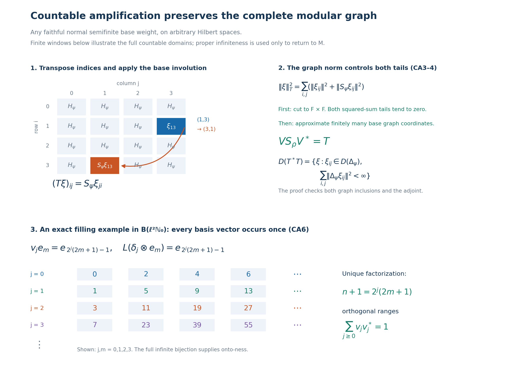

# Countable amplification of an arbitrary faithful normal semifinite weight

*Fresh reconstruction, GPT-6 Astra (OpenAI), Ultra, 2026-10-04. CC0-1.0 to the extent of rights held.*

Let \(M\subseteq B(K)\) be a nonzero von Neumann algebra acting with identity \(I_K\), on an arbitrary Hilbert space. Let \(\psi\) be a faithful normal semifinite weight. We construct its countable diagonal-sum weight on \(M\bar\otimes B(\ell^2(\mathbb N_0))\), prove its exact finite domains, onto double-index GNS model, full closed involution and adjoint, every spectral domain and its modular action. No faithful-state, separability or countable-decomposability hypothesis is imposed.

If the unit of \(M\) is properly infinite, the proved filling-projection construction gives a normal isomorphism of this amplification back onto \(M\). The transported weight has infinite total mass. Every actual given modular period of \(\psi\) is retained. In particular this supplies the finite-to-infinite weight step needed before the conditional generalized-trace construction, without supplying an inner period or a period from a type invariant.

The exact earlier local inputs are [VD2](OA-FLOW-VD.md#vd-full-tensor) for the complete bounded-array algebra, finite-corner norms and positivity; [GW1–4](OA-FLOW-GW.md#oa-flow.gw.1) for finite ideals, GNS and the actual semifiniteness criterion; [NF5](OA-FLOW-NF.md#oa-flow.nf.5) and [ST2](OA-FLOW-ST12.md#oa-flow.st.2) for faithful normal GNS and its inverse; [WR3](OA-FLOW-WR.md#oa-flow.wr.3), [CI1 and CI3](OA-FLOW-CI.md#oa-flow.ci.1), and [MW4](OA-FLOW-MW.md#oa-flow.mw.4) for the full finite-star involution, its antilinear adjoint/polar data and arbitrary-weight modular implementation; [SF, SB4–6](OA-FLOW-SF.md#oa-flow.sf.sb4) for full spectral domains, direct sums and spectral transport; [CP1–6](OA-FLOW-CP.md#oa-flow.cp.1) for the norm-closed concrete predual and vector-series tests; [CF6–8](OA-FLOW-CF.md#oa-flow.cf.6) and [GNS3](OA-FLOW-GNS.md#gns-local-units) for bounded operator and representation norm facts; [GNS7.1](OA-FLOW-GNS.md#gns-lemma-7-1) for complete Hilbert sums; [PC5, equation PC6](OA-FLOW-PC.md#oa-flow.projection.pc5) for a countable filling family on a properly infinite unit, and [PC8](OA-FLOW-PC.md#oa-flow.projection.pc8) for the type III case; [CT1](OA-FLOW-CT.md#oa-flow.ct.1) for all-weight full-graph transport. All these are written proofs. In particular equation [PC6](OA-FLOW-PC.md#oa-flow.projection.pc5) belongs to section [PC5](OA-FLOW-PC.md#oa-flow.projection.pc5); section [PC6](OA-FLOW-PC.md#oa-flow.projection.pc6) on finite joins is not the filling theorem.

The free human context actually read is [Connes, Theorem 4.3.2(a), printed pp.220–221](https://numdam.org/article/ASENS_1973_4_6_2_133_0.pdf#page=89), where amplification by a countable type I factor is used in constructing an infinite weight. No tensor-weight theorem, abstract stability theorem or source's period-existence assertion is used below. The required amplification, graphs and normal representation transport are reconstructed explicitly.

## CA-0. Bounded arrays and amplification of a normal isomorphism

Index the matrix units by \(I=\mathbb N_0\). [VD2](OA-FLOW-VD.md#oa-flow.vd.2)'s integer-indexed model transports to this indexing through the bijection \(b_0=0,\ b_{2j-1}=j,\ b_{2j}=-j\) for \(j\geq1\), and the resulting basis unitary. Thus

\[
 B=M\bar\otimes B(\ell^2 I)
   =\{X\in B(\ell^2(I,K)):X_{ij}\in M\text{ for every }i,j\}.
 \tag{CA1}
\]
For a finite set \(F\subset I\), let \(p_F\) be the projection onto its coordinates. [VD2](OA-FLOW-VD.md#oa-flow.vd.2) proves

\[
 p_FXp_F\longrightarrow X\text{ strongly-*},\quad
 \|X\|=\sup_{F\ \mathrm{finite}}\|p_FXp_F\|,\quad
 X\geq0\ \Longleftrightarrow\
 p_FXp_F\geq0\text{ for every finite }F.
 \tag{CA2}
\]
A consistent array with uniformly bounded finite corner norms defines a unique bounded operator by its bounded form on finite-support vectors and Hilbert completion. Consequently ([CA1](OA-FLOW-CA.md#equation-ca1)) always means bounded arrays, not formal matrices.

We need a general normal representation transport, beyond [VD2](OA-FLOW-VD.md#oa-flow.vd.2)'s specific diagonal representation. Suppose \(q:M\to A\subseteq B(L)\) is a normal unital star isomorphism with normal inverse. For each finite \(F\), entrywise application \(q_F:M_F(M)\to M_F(A)\) is a bijective star homomorphism. Both are concrete C\*-algebras. The elementary contractivity proof for unital star homomorphisms, applied to \(q_F\) and its inverse, makes \(q_F\) isometric; it preserves positivity in both directions by applying it to square roots. The criterion ([CA2](OA-FLOW-CA.md#equation-ca2)) therefore gives an isometric bijection of all bounded arrays

\[
 q^{(\infty)}:M\bar\otimes B(\ell^2 I)
       \longrightarrow A\bar\otimes B(\ell^2 I),\qquad
 (q^{(\infty)}X)_{ij}=q(X_{ij}).
 \tag{CA3}
\]
It preserves adjoints and positivity. For products, each entry of \(XY\) is the bounded strong limit of \(\sum_{k\in F}X_{ik}Y_{kj}\): insert \(p_F\) between \(X,Y\). Its norm is at most \(\|X\|\|Y\|\). CP's bounded tail estimate gives ultraweak convergence. Normality of \(q\) then makes its image the corresponding entry of the target product, proving multiplicativity.

Here is full normality on the entire space. For two vectors in \(\ell^2(I,L)\), truncation to finite coordinates changes the associated functional on the target unit ball by at most

\[
 \|\xi-p_F\xi\|\,\|\eta\|
       +\|\xi\|\,\|\eta-p_F\eta\|.
 \tag{CA4}
\]
Each finite-coordinate pullback is a finite sum of normal tests of \(q(X_{ij})\); compression \(X\mapsto X_{ij}\) is ultraweakly continuous by the coordinate vector-series test. Isometry in ([CA3](OA-FLOW-CA.md#equation-ca3)) gives the same norm bound ([CA4](OA-FLOW-CA.md#equation-ca4)) after pullback. CP's norm-closed predual proves that the limiting pullback is normal. Finally a defining square-summable vector series has a norm-summable series of these pullbacks, bounded by the sum of products of the vector norms. This proves ultraweak continuity on all arrays. Applying the identical argument to \(q^{-1}\) proves normality of the inverse. No assertion that every convergent net is uniformly bounded is required.

## CA-1. The whole diagonal-sum weight and its exact finite ideals

For every \(X\in B_+\), define

\[
 \rho(X)=\sum_{j\in I}\psi(X_{jj})
        :=\sup_{F\subset I\ \mathrm{finite}}\sum_{j\in F}\psi(X_{jj}).
 \tag{CA5}
\]
All terms are nonnegative extended real numbers. Additivity follows because a common finite set contains the two finite sets needed to approximate two finite subsums; if one value is infinite its subsums already force infinity. Homogeneity is immediate, with \(0\cdot\infty=0\). Thus this is a weight on the whole positive cone.

If \(0\leq X_\alpha\uparrow X\), each diagonal increases to \(X_{jj}\): the bounded positive strong-supremum construction, followed by coordinate compression, proves this. Normality of \(\psi\), a common upper index for finitely many coordinates, and then the supremum over finite sets give

\[
 \rho(X)=\sup_\alpha\rho(X_\alpha).
 \tag{CA6}
\]
For an infinite value, each prescribed finite lower bound is obtained from a finite subsum and then a suitable common index, so the argument covers all arbitrary nets and infinite values. If \(\rho(X)=0\), each \(X_{jj}=0\) by faithfulness. Thus \(\|X^{1/2}(\delta_j\otimes\xi)\|^2=\langle X_{jj}\xi,\xi\rangle=0\) for every coordinate vector. Their span is dense, and \(X=0\). The weight is faithful.

For a bounded array \(X\), insertion of \(p_F\) gives

\[
 (X^*X)_{jj}=\sum_i X_{ij}^*X_{ij}
 \quad\text{as an increasing strong sum}.
 \tag{CA7}
\]
All finite partial sums are bounded by \(\|X\|^2\). Normality of \(\psi\) and the definition as finite nonnegative subsums give

\[
 \rho(X^*X)=\sum_{i,j}\psi(X_{ij}^*X_{ij}).
 \tag{CA8}
\]
The iterated and joint suprema agree because every finite set of pairs is contained in a finite rectangle, and every finite rectangle is a finite set of pairs.

Put \(N_\psi=\mathfrak n_\psi\), \(A_\psi=N_\psi\cap N_\psi^*\), and similarly for \(\rho\). Then the complete domains are

\[
 \begin{split}
 N_\rho&=\{X\in B:X_{ij}\in N_\psi\ (\forall i,j),\
                    \sum_{i,j}\|\Lambda_\psi(X_{ij})\|^2<\infty\},\\
 A_\rho&=\{X\in B:X_{ij}\in A_\psi\ (\forall i,j),\
        \sum_{i,j}\big(\|\Lambda_\psi(X_{ij})\|^2+
                      \|\Lambda_\psi(X_{ij}^*)\|^2\big)<\infty\},\\
 \mathfrak m_\rho&=\operatorname{span}N_\rho^*N_\rho .
 \end{split}
 \tag{CA9}
\]
The first statement is ([CA8](OA-FLOW-CA.md#equation-ca8)); applying it to \(X^*\) gives the second, after transposing the indices. The last is [GW1](OA-FLOW-GW.md#oa-flow.gw.1). The boundedness condition \(X\in B\) is part of every formula.

Finite matrices over \(N_\psi\) belong to \(N_\rho\). They are ultraweakly dense in \(B\). Indeed [GW4](OA-FLOW-GW.md#oa-flow.gw.4) implies that \(\mathfrak m_\psi\subseteq N_\psi\) is ultraweakly dense in \(M\). Within any finite corner, approximate its finitely many entries in that topology, using the product directed set. Each coordinate insertion into \(B\) is ultraweakly continuous: the corresponding vector-series test compresses both vector sequences to those coordinates and preserves their square-summability. Thus the finite matrices over \(N_\psi\) are ultraweakly dense in that finite corner. Equation ([CA2](OA-FLOW-CA.md#equation-ca2)) and CP's bounded strong-to-ultraweak passage show that the union of these corners is ultraweakly dense in \(B\). No common bound on the separate entry-approximation nets is needed for this density argument. Therefore \(N_\rho\) is weak-operator dense, and precisely [GW4](OA-FLOW-GW.md#oa-flow.gw.4)'s dense-left-ideal criterion proves semifiniteness.

For completeness, on the finite linear algebra one has the absolutely convergent formula

\[
 \rho_0(Z)=\sum_j\psi_0(Z_{jj})
 \qquad(Z\in\mathfrak m_\rho).
 \tag{CA10}
\]
For a finite positive \(Z\), each positive diagonal has finite \(\psi\)-value and ([CA10](OA-FLOW-CA.md#equation-ca10)) is exactly ([CA5](OA-FLOW-CA.md#equation-ca5)), with finite total sum. [GW1](OA-FLOW-GW.md#oa-flow.gw.1) expresses any \(Z\in\mathfrak m_\rho\) as a finite complex linear combination \(\sum_l c_l Z_l\) of such positive elements. Every \(Z_{jj}\) then belongs to \(\mathfrak m_\psi\), and
\(\sum_j|\psi_0(Z_{jj})|\leq\sum_l|c_l|\rho(Z_l)<\infty\).
Linearity and uniqueness of the finite extension give ([CA10](OA-FLOW-CA.md#equation-ca10)). Absolute summability of diagonals alone is not asserted to characterize \(\mathfrak m_\rho\).

Since \(M\neq0\) and \(\psi\) is faithful, \(\psi(1)>0\), possibly infinite. The constant infinite list of this value in ([CA5](OA-FLOW-CA.md#equation-ca5)) proves

\[
 \rho(1_B)=\infty .
 \tag{CA11}
\]

## CA-2. The onto double-index GNS model and the full left representation

Use the Hilbert direct sum \(\mathcal H=\bigoplus_{(i,j)\in I^2}H_\psi\), and define on the entire GNS range

\[
 V\Lambda_\rho(X)=(\Lambda_\psi(X_{ij}))_{i,j}
 \qquad(X\in N_\rho).
 \tag{CA12}
\]
Equation ([CA8](OA-FLOW-CA.md#equation-ca8)) proves equality of squared norms. Polarization with first-variable-linear inner products gives equality of every inner product; the map is linear, well defined, and extends isometrically to \(H_\rho\). Its range contains every finite-coordinate vector whose entries lie in \(\Lambda_\psi(N_\psi)\), by using the corresponding finite matrix. Such vectors are dense in \(\mathcal H\), by Hilbert direct-sum completion and density of the original GNS range. The extended isometric range is closed, so \(V\) is onto.

[GW4](OA-FLOW-GW.md#oa-flow.gw.4) and [NF5](OA-FLOW-NF.md#oa-flow.nf.5) give the faithful normal \(\pi_\psi\); [ST2](OA-FLOW-ST12.md#oa-flow.st.2) gives its normal inverse onto its von Neumann image. Apply ([CA3](OA-FLOW-CA.md#equation-ca3)) to \(q=\pi_\psi\). For \(Y\in B\), its entrywise image is a bounded operator of norm \(\|Y\|\) on \(\ell^2(I,H_\psi)\). Repeating this operator on each column \(j\) defines a bounded operator \(L_Y\) on \(\mathcal H\), of the same norm, with

\[
 (L_Y\xi)_{ij}=\sum_k\pi_\psi(Y_{ik})\xi_{kj}.
 \tag{CA13}
\]
Here each coordinate sum is the Hilbert norm limit of finite column truncations; it is not a formal convergence assertion. On the dense vectors in ([CA12](OA-FLOW-CA.md#equation-ca12)) arising from finite matrices, matrix multiplication gives

\[
 L_Y V\Lambda_\rho(X)=V\Lambda_\rho(YX).
 \tag{CA14}
\]
For such an \(X\), each entry of \(YX\) is a finite sum, so linearity of \(\Lambda_\psi\) and the left-ideal property justify the coordinate calculation; \(YX\in N_\rho\) follows from [GW1](OA-FLOW-GW.md#oa-flow.gw.1). Both operators are bounded, so

\[
 V\pi_\rho(Y)V^*=L_Y
 \tag{CA15}
\]
on the full space. The representation is faithful normal by [GW4](OA-FLOW-GW.md#oa-flow.gw.4)/[NF5](OA-FLOW-NF.md#oa-flow.nf.5), with normal inverse by [ST2](OA-FLOW-ST12.md#oa-flow.st.2). The full entrywise normality used in ([CA13](OA-FLOW-CA.md#equation-ca13)) was proved in CA0, rather than being inferred from a formal matrix display.

## CA-3. Both inclusions of the full closed involution graph

Let \(S=S_\psi\) be the closed finite-star involution, whose initial domain \(\Lambda_\psi(A_\psi)\) is a graph core by [WR3](OA-FLOW-WR.md#oa-flow.wr.3). On \(\mathcal H\), define the antilinear operator

\[
 \begin{split}
 (T\xi)_{ij}&=S\xi_{ji},\\
 D(T)&=\{\xi\in\mathcal H:\xi_{ij}\in D(S)\ (\forall i,j),\
                         \sum_{i,j}\|S\xi_{ij}\|^2<\infty\}.
 \end{split}
 \tag{CA16}
\]
It is densely defined because finite-coordinate vectors in the dense \(D(S)\) are dense. It is closed: if \(\xi^{(n)}\to\xi\) and \(T\xi^{(n)}\to\eta\) in \(\mathcal H\), every coordinate converges in its Hilbert space. Closedness of \(S\) gives \(S\xi_{ji}=\eta_{ij}\) with all coordinates in the requisite domain, and \(\sum\|S\xi_{ji}\|^2=\|\eta\|^2<\infty\). Thus \(\xi\in D(T)\), \(T\xi=\eta\).

If \(X\in A_\rho\), ([CA9](OA-FLOW-CA.md#equation-ca9)) puts each entry in \(A_\psi\) and both GNS coordinate sums in the finite domain. Hence

\[
 T V\Lambda_\rho(X)=
  (\Lambda_\psi(X_{ji}^*))_{ij}
   =V\Lambda_\rho(X^*).
 \tag{CA17}
\]
The initial \(\rho\) involution, transported by \(V\), is contained in this closed operator.

For the reverse graph inclusion take any \(\xi\in D(T)\). Truncating \(\xi\) to \(F\times F\), with finite \(F\uparrow I\), converges to \(\xi\) in the norm

\[
 \|\xi\|_T^2=\sum_{i,j}\big(\|\xi_{ij}\|^2+\|S\xi_{ij}\|^2\big).
 \tag{CA18}
\]
This is simply convergence of finite subsums of one summable nonnegative family. For each fixed finite \(F\), approximate its finitely many coordinates in the full \(S\)-graph norm by vectors \(\Lambda_\psi(x_{ij})\), \(x_{ij}\in A_\psi\). Choosing each error smaller than a common tolerance divided by \(1+|F|\) makes the total graph error tend to zero. The finite matrix \(X=(x_{ij})\), zero elsewhere, belongs to \(A_\rho\) by ([CA9](OA-FLOW-CA.md#equation-ca9)). Its vector in ([CA12](OA-FLOW-CA.md#equation-ca12)) is exactly this approximant, and ([CA17](OA-FLOW-CA.md#equation-ca17)) gives its graph partner.

Thus \(D(T)\) is the graph closure of vectors from the initial \(\rho\) finite-star domain. Together with the first inclusion, this proves the full equality

\[
 V S_\rho V^*=T .
 \tag{CA19}
\]
This is equality of the closed graphs, not just agreement on finite matrices. It also directly proves closability of the initial amplified involution.

## CA-4. The antilinear adjoint, positive operator and every spectral domain

With first-variable-linear inner products, the antilinear adjoint convention is
\(\langle T\xi,\eta\rangle=\langle T^*\eta,\xi\rangle\).
We claim

\[
 \begin{split}
 (T^*\eta)_{ij}&=S^*\eta_{ji},\\
 D(T^*)&=\{\eta\in\mathcal H:\eta_{ij}\in D(S^*)\ (\forall i,j),\
                           \sum_{i,j}\|S^*\eta_{ij}\|^2<\infty\}.
 \end{split}
 \tag{CA20}
\]
If \(\eta\in D(T^*)\), test its defining equation on a vector supported at a single \((j,i)\), with arbitrary coordinate in \(D(S)\). This is exactly the defining equation for \(S^*\eta_{ij}\), and gives its value as \((T^*\eta)_{ji}\). Square summability follows from \(T^*\eta\in\mathcal H\). Conversely, for a vector in the displayed domain, both sides of the adjoint identity are absolutely convergent sums: use Cauchy–Schwarz with \(\sum\|S\xi_{ji}\|^2\), \(\sum\|\eta_{ij}\|^2\) on the first, and with \(\sum\|S^*\eta_{ij}\|^2\), \(\sum\|\xi_{ji}\|^2\) on the second. The coordinate adjoint equalities and reindexing prove the identity for every \(\xi\in D(T)\), establishing the claim.

Let \(\Delta=\Delta_\psi=S^*S\). The product has the exact domain

\[
 \begin{split}
 D(T^*T)&=\{\xi\in\mathcal H:\xi_{ij}\in D(\Delta)\ (\forall i,j),\
                                  \sum_{i,j}\|\Delta\xi_{ij}\|^2<\infty\},\\
 (T^*T\xi)_{ij}&=\Delta\xi_{ij}.
 \end{split}
 \tag{CA21}
\]
One inclusion follows from the product definition and ([CA16](OA-FLOW-CA.md#equation-ca16)), ([CA20](OA-FLOW-CA.md#equation-ca20)). For the converse, the asserted domain gives

\[
 \sum_{i,j}\|S\xi_{ij}\|^2
 =\sum_{i,j}\langle\Delta\xi_{ij},\xi_{ij}\rangle
 \leq
 \left(\sum_{i,j}\|\Delta\xi_{ij}\|^2\right)^{1/2}\|\xi\|<\infty .
 \tag{CA22}
\]
The equality is the full \(S^*S\) identity on \(D(\Delta)\), supplied by CI. Thus \(\xi\in D(T)\). Each \(S\xi_{ji}\) belongs to \(D(S^*)\), and the second coordinate-square sum needed for \(T\xi\in D(T^*)\) is precisely the sum of \(\|\Delta\xi_{ij}\|^2\). This proves the other domain inclusion.

For clarity the entire spectral calculus is the direct sum of the actual spectral measures of \(\Delta\). Define

\[
 (Q(E)\xi)_{ij}=1_E(\Delta)\xi_{ij}
 \quad(E\subseteq[0,\infty)\text{ Borel}).
 \tag{CA23}
\]
Each \(Q(E)\) is a projection. The multiplicative and complement laws hold coordinatewise; countable additivity in the strong topology follows first on finite coordinate vectors from the base spectral measure and then on arbitrary vectors by the common projection bound and their square-summable tails. The total projection is \(I\). For any vector, its scalar measure is the sum of the coordinate scalar measures; for nonnegative Borel functions, the corresponding integrals agree by monotone convergence for finite sums and then increasing simple approximation, using SF's actual spectral integration rule. Consequently the operator given by this spectral measure and the function \(r\mapsto r\) has exactly the domain and values in ([CA21](OA-FLOW-CA.md#equation-ca21)).

For every Borel function \(f\) finite off a spectral-null set, its full domain and action are

\[
 \begin{split}
 D(f(T^*T))&=\{\xi:\xi_{ij}\in D(f(\Delta))\ (\forall i,j),\
                            \sum_{i,j}\|f(\Delta)\xi_{ij}\|^2<\infty\},\\
 (f(T^*T)\xi)_{ij}&=f(\Delta)\xi_{ij}.
 \end{split}
 \tag{CA24}
\]
This follows directly from the squared-integral domain criterion of SF. Null sets refer to the spectral projection measure; they are not arbitrary Lebesgue-null sets. Since \(\Delta\) has zero kernel, so does its direct sum, and values chosen for \(\log r\) or negative powers at \(r=0\) do not affect the operator. Thus ([CA24](OA-FLOW-CA.md#equation-ca24)) includes all complex powers, logarithmic domains, and the whole bounded imaginary-power unitary group.

Define an antiunitary involution on \(\mathcal H\) by

\[
 (\mathcal J\xi)_{ij}=J_\psi\xi_{ji}.
 \tag{CA25}
\]
Transpose permutes the summable coordinates; the antiunitary identities and \(\mathcal J^2=I\) follow from those of \(J_\psi\). CI gives \(D(S)=D(\Delta^{1/2})\) and \(S=J_\psi\Delta^{1/2}\). Equations ([CA16](OA-FLOW-CA.md#equation-ca16)), ([CA24](OA-FLOW-CA.md#equation-ca24)) therefore give, with equality of domains,

\[
 T=\mathcal J(T^*T)^{1/2}.
 \tag{CA26}
\]
The square root is injective with dense range, so its polar antiunitary is uniquely determined on that dense range by ([CA26](OA-FLOW-CA.md#equation-ca26)). Equations ([CA19](OA-FLOW-CA.md#equation-ca19))–([CA26](OA-FLOW-CA.md#equation-ca26)) yield the exact amplified polar data

\[
 V\Delta_\rho V^*=\bigoplus_{i,j}\Delta_\psi,\qquad
 VJ_\rho V^*=\mathcal J,\qquad
 (V\Delta_\rho^{it}V^*\xi)_{ij}=\Delta_\psi^{it}\xi_{ij}.
 \tag{CA27}
\]
Every equality includes the domains just proved; no formal cancellation of unbounded products has been used.

## CA-5. The full modular action, finite extensions and all given periods

For each real \(t\), CA0 applied to the normal automorphism \(\sigma_t^\psi\) defines a normal automorphism \(\beta_t\) of \(B\), with normal inverse, by

\[
 (\beta_t(Y))_{ij}=\sigma_t^\psi(Y_{ij}).
 \tag{CA28}
\]
In the GNS model, use ([CA13](OA-FLOW-CA.md#equation-ca13)) and ([CA27](OA-FLOW-CA.md#equation-ca27)). On vectors with finite coordinate support, conjugation of \(L_Y\) by the coordinate unitary \(\Delta_\psi^{it}\) gives entries
\(\Delta_\psi^{it}\pi_\psi(Y_{ik})\Delta_\psi^{-it}
=\pi_\psi(\sigma_t^\psi(Y_{ik}))\),
by [MW4](OA-FLOW-MW.md#oa-flow.mw.4). The column sums then give \(L_{\beta_t(Y)}\). Both sides are bounded, so density proves equality on the whole Hilbert space. Faithful modular implementation for \(\rho\) now yields

\[
 \boxed{\ (\sigma_t^\rho(Y))_{ij}
             =\sigma_t^\psi(Y_{ij})
             \quad(Y\in B,\ t\in\mathbb R).\ }
 \tag{CA29}
\]
In particular the entrywise action is the actual modular action of the diagonal-sum weight.

The coordinate unitary group in ([CA27](OA-FLOW-CA.md#equation-ca27)) is strongly continuous: on each finite coordinate vector this is the base strong continuity; arbitrary vectors follow from the common norm-one bound and a square-summable tail. Its implemented action is pointwise strongly-* continuous in the faithful GNS representation, and [ST2](OA-FLOW-ST12.md#oa-flow.st.2) transports the intrinsic bounded topology to the original concrete algebra. Thus the formula includes the required continuity, rather than only an algebraic automorphism identity.

Whole-cone invariance also follows directly from the diagonal sums:

\[
 \rho(\beta_t(X))
 =\sum_j\psi(\sigma_t^\psi(X_{jj}))=\rho(X)\qquad(X\in B_+),
 \tag{CA30}
\]
using [MW4](OA-FLOW-MW.md#oa-flow.mw.4)'s full base-weight invariance even at infinity. Equations ([CA9](OA-FLOW-CA.md#equation-ca9)) and the base finite-domain invariance show that \(N_\rho,A_\rho,\mathfrak m_\rho\) are preserved in both directions. Formula ([CA10](OA-FLOW-CA.md#equation-ca10)) gives \(\rho_0\beta_t=\rho_0\) on the exact finite linear domain, and ([CA12](OA-FLOW-CA.md#equation-ca12)), ([CA27](OA-FLOW-CA.md#equation-ca27)), and the base GNS identity give

\[
 \Lambda_\rho(\beta_t(X))=\Delta_\rho^{it}\Lambda_\rho(X)
 \quad(X\in N_\rho).
 \tag{CA31}
\]
The full domains and these identities concern all bounded arrays, not only the finite matrices used as graph approximants.

Every actual period \(P\) of \(\sigma^\psi\) is a period of \(\sigma^\rho\), by ([CA29](OA-FLOW-CA.md#equation-ca29)). Conversely if \(\sigma_P^\rho=\mathrm{id}\), apply ([CA29](OA-FLOW-CA.md#equation-ca29)) to the bounded array \(xE_{00}\), with arbitrary \(x\in M\). This gives \(\sigma_P^\psi(x)=x\). Therefore the entire period groups agree:

\[
 \{t:\sigma_t^\rho=\mathrm{id}\}
   =\{t:\sigma_t^\psi=\mathrm{id}\}.
 \tag{CA32}
\]
This is a comparison of given actions. It does not assert that either group contains a nonzero period.

## CA-6. A countable normal matrix isomorphism on a properly infinite algebra

Assume now that the unit of \(M\) is properly infinite. [PC5](OA-FLOW-PC.md#oa-flow.projection.pc5), specifically its filling formula ([PC6](OA-FLOW-PC.md#oa-flow.projection.pc5)), constructs orthogonal projections \(q_j\sim1\), \(j\in I\), with \(\sum_jq_j=1\) strongly. This proof works without countability assumptions on \(M\) or on \(K\). Choose their actual partial isometries

\[
 v_j^*v_j=1,\qquad v_jv_j^*=q_j,\qquad v_i^*v_j=0\quad(i\ne j).
 \tag{CA33}
\]
Define

\[
 L:\ell^2(I,K)\longrightarrow K,\qquad
 L(\xi_j)=\sum_jv_j\xi_j .
 \tag{CA34}
\]
The sum converges in Hilbert norm by orthogonality of the ranges and \(\sum\|\xi_j\|^2<\infty\). Its norm equals the direct-sum norm, so \(L\) is isometric. For \(\eta\in K\), the vector \((v_j^*\eta)_j\) has squared norm \(\sum_j\langle q_j\eta,\eta\rangle=\|\eta\|^2\), and its image is \(\sum_jq_j\eta=\eta\). Thus \(L\) is onto unitary with this explicit inverse.

Unitary conjugation defines

\[
 F:B\longrightarrow M,\qquad F(X)=LXL^*,\qquad
 (F^{-1}(x))_{ij}=v_i^*xv_j .
 \tag{CA35}
\]
We verify the stated ranges on the whole bounded algebras. Finite-corner conjugates are

\[
 Lp_FXp_FL^*=\sum_{i,j\in F}v_iX_{ij}v_j^*\in M,
 \qquad\|Lp_FXp_FL^*\|\leq\|X\|.
 \tag{CA36}
\]
They converge strongly-* to \(LXL^*\) by ([CA2](OA-FLOW-CA.md#equation-ca2)); weak-operator closedness gives \(F(X)\in M\). Conversely \(L^*xL\) is a bounded operator with entries \(v_i^*xv_j\in M\), so ([CA1](OA-FLOW-CA.md#equation-ca1)) puts it in \(B\). These are inverse unital star homomorphisms. Both are normal on their entire spaces: conjugation by a unitary transforms every defining vector series by that unitary or its adjoint, preserving square summability. This proves the countable matrix isomorphism directly, without an imported stability theorem.

## CA-7. An infinite weight on the original algebra, with exact graph transport

Set

\[
 \phi=\rho\circ F^{-1}.
 \tag{CA37}
\]
The normal order isomorphism and its inverse carry positive cones, increasing suprema and the entire finite left ideal. Consequently \(\phi\) is faithful normal semifinite and

\[
 \phi(1)=\infty,\quad
 N_\phi=F(N_\rho),\quad A_\phi=F(A_\rho),\quad
 \mathfrak m_\phi=F(\mathfrak m_\rho),\quad
 \phi_0(F(Z))=\rho_0(Z).
 \tag{CA38}
\]
For semifiniteness, \(F\) transports the ultraweakly dense finite left ideal; [GW4](OA-FLOW-GW.md#oa-flow.gw.4) applies. The formulas specify exact equality of domains, not only dense subspaces.

[CT1](OA-FLOW-CT.md#oa-flow.ct.1)'s full graph argument can also be seen here explicitly. The map

\[
 R\Lambda_\phi(x)=\Lambda_\rho(F^{-1}(x))
 \quad(x\in N_\phi)
 \tag{CA39}
\]
preserves all inner products and has dense range, hence extends to an onto unitary. It maps the complete initial finite-star graphs onto one another by ([CA38](OA-FLOW-CA.md#equation-ca38)), and so \(RS_\phi R^*=S_\rho\) including their closed domains. The defining antilinear adjoints and their products give \(R\Delta_\phi R^*=\Delta_\rho\) with full domains. The Hilbert left representations are intertwined as well. Functional calculus and [MW4](OA-FLOW-MW.md#oa-flow.mw.4) therefore prove

\[
 \sigma_t^\phi=F\sigma_t^\rho F^{-1},\qquad
 \{t:\sigma_t^\phi=\mathrm{id}\}
   =\{t:\sigma_t^\psi=\mathrm{id}\}.
 \tag{CA40}
\]
Thus every given periodic faithful normal semifinite weight on a nonzero properly infinite algebra yields an infinite faithful normal semifinite weight with precisely the same modular period group, on the same algebra. The initial weight may be finite or infinite.

In a type III algebra the unit is properly infinite by [PC8](OA-FLOW-PC.md#oa-flow.projection.pc8)'s actual projection argument. Hence, once an actual periodic weight with the specified \(2\pi/(-\log\lambda)\) period is supplied on a separable-predual type III\(_\lambda\) factor, this construction supplies the infinite periodic weight required by PF/GT. It does not prove that the type invariant supplies an inner period, that an arbitrary given weight has a nonzero period, or any general \(S/\Gamma\) or classification theorem.

### Transposed graph coordinates and a genuinely filling countable family

This diagram explains [CA2–4](OA-FLOW-CA.md#ca-2) and [CA6](OA-FLOW-CA.md#ca-6). The general theorem uses an arbitrary nonzero von Neumann algebra \(M\), an arbitrary faithful normal semifinite weight \(\psi\), and arbitrary Hilbert spaces. Proper infiniteness is required only for the isomorphism back to \(M\). The matrix panels display finite coordinate windows of complete countable sums; they are not finite-dimensional substitutes for those sums.

The upper-left panel labels the row index \(i\) and column index \(j\). Each cell is a vector in \(H_\psi\), and the entire space is \(\mathcal H=\bigoplus_{i,j\geq0}H_\psi\). The highlighted input cell is \((i,j)=(1,3)\). Its contribution to the output is the cell \((3,1)\), with vector \(S_\psi\xi_{13}\). This is exactly
\[
 (T\xi)_{ij}=S_\psi\xi_{ji},\qquad
 D(T)=\left\{\xi:\xi_{ij}\in D(S_\psi),\
                      \sum_{i,j}\|S_\psi\xi_{ij}\|^2<\infty\right\}.
\]
The displayed \(4\)-by-\(4\) square is a sample only. Neither the base \(H_\psi\) nor the complete direct sum is assigned a finite dimension. The anti-linearity comes from \(S_\psi\); index transposition alone is linear.

The upper-right panel gives the two parts of the full graph-core approximation. First truncate a vector in \(D(T)\) to \(F\times F\), with finite \(F\subset\mathbb N_0\). Its squared graph error is exactly
\[
 \sum_{(i,j)\notin F\times F}
     \bigl(\|\xi_{ij}\|^2+\|S_\psi\xi_{ij}\|^2\bigr)
       \longrightarrow0.
\]
For fixed \(F\), approximate each coordinate by an element of the actual base graph core \(\Lambda_\psi(A_\psi)\). There are finitely many coordinates, so their squared errors have arbitrarily small sum. The resulting finite matrix has entries in \(A_\psi\), hence belongs to the full \(A_\rho\). This proves the reverse graph inclusion; the forward inclusion comes from the two finite sums defining \(A_\rho\), as proved in [CA3](OA-FLOW-CA.md#oa-flow.ca.3). Agreement only on finite matrices would not prove the displayed closed-graph equality.

The two domains required for the adjoint product are also explicit:
\[
 (T^*\eta)_{ij}=S_\psi^*\eta_{ji},\qquad
 D(T^*T)=
 \left\{\xi:\xi_{ij}\in D(\Delta_\psi),\
                         \sum_{i,j}\|\Delta_\psi\xi_{ij}\|^2<\infty\right\}.
\]
The already required \(\xi\in\mathcal H\) is understood. The nontrivial intermediate-domain check is
\[
 \sum_{i,j}\|S_\psi\xi_{ij}\|^2
 \leq
 \left(\sum_{i,j}\|\Delta_\psi\xi_{ij}\|^2\right)^{1/2}
 \left(\sum_{i,j}\|\xi_{ij}\|^2\right)^{1/2}.
\]
Thus the stated \(\Delta\)-domain automatically supplies the \(T\)-domain, and the remaining product-domain condition is exactly the displayed \(\Delta\)-square sum. [CA4](OA-FLOW-CA.md#oa-flow.ca.4) proves both directions and then the full Borel, power and logarithmic domains using the direct-sum spectral measure.

The bottom panel is a separate exact example of the filling mechanism. Take \(K=\ell^2(\mathbb N_0)\) and \(M=B(K)\), with basis \((e_m)\). For \(j,m\geq0\), define
\[
 b(j,m)=2^j(2m+1)-1,\qquad v_je_m=e_{b(j,m)}.
\]
For fixed \(j\), the indices \(b(j,m)\) are distinct. Therefore \(v_j\) extends by completion to an isometry. Distinct \(j\) give disjoint ranges, since a positive integer has a unique power of two dividing it and an odd quotient. For every \(n\geq0\), repeatedly divide \(n+1\) by two until the quotient is odd; the process stops since the positive quotient decreases at each step. It yields uniquely \(n+1=2^j(2m+1)\). Thus \(b:\mathbb N_0^2\to\mathbb N_0\) is a bijection, and the projections \(q_j=v_jv_j^*\) are orthogonal with full strong sum \(1\).

The exact displayed window is
\[
 \begin{array}{c|rrrr}
 j\backslash m&0&1&2&3\\ \hline
 0&0&2&4&6\\
 1&1&5&9&13\\
 2&3&11&19&27\\
 3&7&23&39&55
 \end{array}.
\]
Each row continues indefinitely, and there are infinitely many rows. The common row colors mean membership in one \(q_jK\), not a trace value or a projection dimension. The four shown rows and columns do not themselves fill \(K\); the proved entire bijection does.

Consequently the concrete map
\[
 L:\ell^2(\mathbb N_0,K)\longrightarrow K,\qquad
 L(\delta_j\otimes e_m)=e_{b(j,m)}
\]
is onto unitary. It gives precisely \(F(X)=LXL^*\) and \((F^{-1}x)_{ij}=v_i^*xv_j\), as in [CA6](OA-FLOW-CA.md#oa-flow.ca.6). This example is a properly infinite type I algebra. The general [CA6](OA-FLOW-CA.md#oa-flow.ca.6) result uses [PC5](OA-FLOW-PC.md#oa-flow.projection.pc5)'s proved filling family in an arbitrary properly infinite algebra, and does not identify the example with a type III factor.

[CA1](OA-FLOW-CA.md#oa-flow.ca.1)–5 retain the complete weight and modular content alongside the picture: \(\rho(X)=\sum_j\psi(X_{jj})\) on every bounded positive array, \(\rho(1)=\infty\), exact finite domains, an onto GNS unitary, and \((\sigma_t^\rho X)_{ij}=\sigma_t^\psi(X_{ij})\). [CA7](OA-FLOW-CA.md#oa-flow.ca.7) transports these complete objects through \(F\). All actual periods are preserved, while no period-existence theorem is asserted.

The free primary context is [Connes, Theorem4.3.2(a), printed pp.220–221](https://numdam.org/article/ASENS_1973_4_6_2_133_0.pdf#page=89). Every tensor-weight and graph assertion used here is proved locally in CA0–7 and its exact earlier providers. The binary example, diagram and captions are original expressions of that mechanism.

[Editable SVG](../assets/countable-amplification/assets/countable-amplification-mechanism.svg), [exact data](../assets/countable-amplification/FIGURE_DATA.json), and [reproduction source](../assets/countable-amplification/render_countable_amplification.py). Original diagram, data, caption and reconstruction: CC0-1.0 to the extent of rights held. A planar index grid and a discrete bijection display the actual objects without adding irrelevant geometry.
