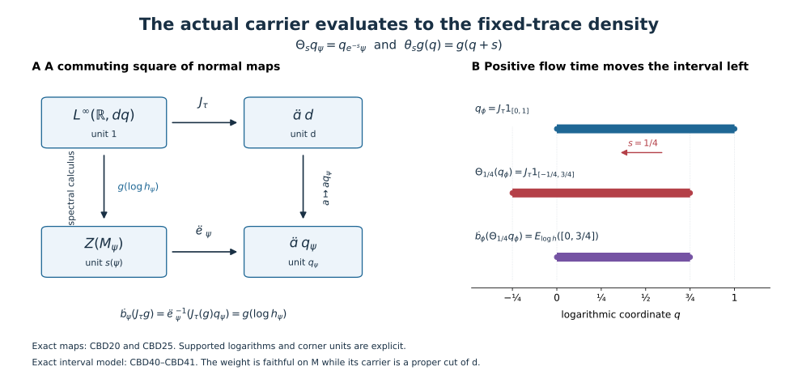

# From the global carrier to the fixed-trace density

The global carrier remembers supported weight equivalence through projections. The density of a weight remembers its positive values relative to a specified trace. We identify the normal map between these two descriptions and prove that the carrier cocycle action is exactly conjugation by the corresponding bounded function of the density.

*Original exposition, examples, figures, data and reproducible drawing code in this lesson are dedicated to CC0-1.0. Source publications and font components retain their own terms.*

## Hypotheses and conclusions

For the carrier constructions in Sections 1 and 4, \(M\ne0\) is any properly infinite von Neumann algebra with separable predual, with arbitrary center. For the fixed-trace identification and the action in Sections 2–3 and 5–7, assume additionally that \(M\) is a semifinite factor and fix a faithful normal semifinite trace \(\tau\). The main type-I application is a faithful normal semifinite \(\phi=\tau_h\) with properly infinite centralizer and integrable modular action, exactly the scope of [the density criterion, TI1](OA-FLOW-TID.md#tid-setting). A supported extension below covers every normal semifinite integrable weight; it does not remove the centralizer hypothesis from that criterion's forward implication.

Write \((\mathcal A,p_M,\Theta)\) for the actual [CGF carrier](OA-FLOW-CGF.md#cgf-3), and \(d\) for its continuous-sector unit. We will construct a canonical fixed-trace chart \(J_\tau\) and canonical carrier evaluation \(\mathcal E_\psi\), and prove
\[
 \boxed{\quad
 J_\tau:L^\infty(\mathbb R,dq)\overset{\cong}{\longrightarrow}\mathcal A d,
 \qquad
 \mathcal E_\psi(J_\tau g)=g(\log h_\psi)
 \quad}
 \tag{CBD1}
\]
for every integrable \(\psi=\tau_{h_\psi}\), with the right side taken in its support corner. If
\[
 C_{s+t}=C_s\Theta_s(C_t),\qquad
 C_s=B\Theta_s(B^*),\qquad
 b=J_\tau^{-1}B,\qquad f(\lambda)=b(\log\lambda),
\]
then the actual carrier-indexed action is
\[
 \boxed{\quad \Sigma_C^\psi=\operatorname{Ad}\mathcal E_\psi(B)
                  =\operatorname{Ad}f(h_\psi).\quad}
 \tag{CBD2}
\]
All cocycles and unitaries in these formulas belong to the corner \(\mathcal A d\), whose identity is \(d\). No translation chart or continuity is claimed for the entire global \(\mathcal A\).

## 1. The carrier center map for an individual weight

Let \(W_\infty(M)\) consist of zero and the normal semifinite weights with properly infinite support centralizer. CGF forms the balanced sum over these weights and its centralizer \(Q\); for its supported diagonal projection \(d_\psi\),
\[
 d_\psi Qd_\psi=M_\psi,\qquad
 \mathcal A=Z(Q),\qquad q_\psi:=p_M(\psi)=z_Q(d_\psi).
 \tag{CBD3}
\]
These are the actual CGF definitions (CI8)–(CI10), not a separate carrier inferred from the density. The isomorphism \(d_\psi Qd_\psi=M_\psi\) uses the indicated diagonal matrix entry.

Apply [PC4's normal center-compression theorem](OA-FLOW-PC.md#pc-4) to \(d_\psi\) in \(Qq_\psi\). Compression has a normal inverse and gives a canonical normal unital isomorphism
\[
 \kappa_\psi:Z(M_\psi)\overset{\cong}{\longrightarrow}\mathcal A q_\psi,
 \qquad
 (\kappa_\psi(z))d_\psi=z
 \quad\text{in the diagonal identification}.
 \tag{CBD4}
\]
Its projection formula is
\[
 \kappa_\psi(z)=p_M(\psi_z),\qquad
 \psi_z(x)=\psi(zxz),\quad z\in\operatorname{Proj}(Z(M_\psi)).
 \tag{CBD5}
\]
Indeed the supported diagonal of \(\psi_z\) is balanced-equivalent to the cut \(zd_\psi\), by the actual supported comparison in [CGF Section 2](OA-FLOW-CGF.md#cgf-2). Their central supports agree. Inside \(Qq_\psi\), central support of \(zd_\psi\) is the unique central projection compressing to \(z\), precisely \(\kappa_\psi(z)\). The nonzero centralizer of \(\psi_z\) is a central summand of the properly infinite \(M_\psi\), so \(\psi_z\in W_\infty(M)\). The zero cut also satisfies the formula. Normality extends projection identities to all bounded central elements.

The formula is natural under supported equivalence. Suppose
\[
 w^*w=s(\psi),\quad ww^*=s(\eta),\quad
 \psi(x)=\eta(wxw^*)\quad(x\ge0).
\]
Then \(q_\psi=q_\eta\), and
\[
 \kappa_\psi(z)=\kappa_\eta(wzw^*)
          \qquad(z\in Z(M_\psi)).
 \tag{CBD6}
\]
For a projection \(z\), \(wz\) implements \(\psi_z\sim\eta_{wzw^*}\): substituting \(x\ge0\) proves the weight identity on the whole cone, and its two supports are \(z,wzw^*\). CGF's equivalence/carrier theorem gives (CBD6); spectral approximation extends it normally.

Likewise CGF's exact scaling law
\(\Theta_s(p_M(\psi))=p_M(e^{-s}\psi)\)
and the fact that scalar multiples have the same centralizer give
\[
 q_{e^{-s}\psi}=\Theta_s(q_\psi),\qquad
 \kappa_{e^{-s}\psi}(z)=\Theta_s(\kappa_\psi(z)).
 \tag{CBD7}
\]
The minus sign is fixed by the actual carrier definition (CI14).

If \(\psi\in W_\infty(M)\) is integrable, [CGF Sections 5 and 8](OA-FLOW-CGF.md#cgf-5) give \(q_\psi\le d\). Equivalently one may use the full supported criterion \(\psi\precsim\Phi\) and (CI10), with \(\Phi\) the chosen dominant reference. Define
\[
 \mathcal E_\psi:\mathcal A d\longrightarrow Z(M_\psi),
 \qquad
 \mathcal E_\psi(a)=\kappa_\psi^{-1}(a q_\psi).
 \tag{CBD8}
\]
Multiplication by the central projection \(q_\psi\) is a normal homomorphism with identity \(d\mapsto q_\psi\); consequently \(\mathcal E_\psi\) is normal and sends \(d\) to \(s(\psi)\). Its kernel is exactly \(\mathcal A(d-q_\psi)\). Equations (CBD6)–(CBD7) imply, on their common support algebras,
\[
 \mathcal E_\psi(a)=w^*\mathcal E_\eta(a)w,\qquad
 \mathcal E_{e^{-s}\psi}(\Theta_s a)=\mathcal E_\psi(a).
 \tag{CBD9}
\]
These assertions use no factor hypothesis.

The original center remains in place. With CGF's embedding
\(\iota:Z(M)\to\mathcal A\), (CI15) and (CBD5) give
\[
 \mathcal E_\psi(\iota(z)d)=zs(\psi),\qquad z\in Z(M).
 \tag{CBD10}
\]
Thus a proper original central support is preserved. There is no replacement of the nonfactor carrier by a single factor sector.

## 2. The exact fixed-trace chart of the continuous sector

Now suppose \(M\) is a semifinite factor in the stated properly infinite, separable-predual scope, and fix \(\tau\). The [trace-preserving reference construction, TI13–TI17](OA-FLOW-TID.md#tid-3), gives a normal identification
\[
 M=P\overline\otimes B(L^2(\mathbb R,dq))\overline\otimes B(\ell^2),
 \quad \tau=\tau_P\otimes\operatorname{Tr}\otimes\operatorname{Tr},
 \quad k=1\otimes e^Q\otimes1,\quad \nu=\tau_k .
 \tag{CBD11}
\]
The trace equality is exact on the whole positive cone: for filling isometries \(v_i\), the map \(x\otimes e_{ij}\mapsto v_i x v_j^*\) is normally implemented by the unitary \((\xi_i)\mapsto\sum_i v_i\xi_i\), and
\(\tau(Y)=\sum_i\tau(v_iv_i^*Yv_iv_i^*)\)
follows from the increasing positive sandwiches
\(Y^{1/2}\sum_{i\in F}v_iv_i^*Y^{1/2}\).
The trace of every scalar rank-one projection is \(1\). No scalar trace correction is hidden.

The full centralizer, its center, and the continuous reference translations are
\[
 \begin{gathered}
 N=M_\nu=P\overline\otimes L^\infty(Q)\overline\otimes B(\ell^2),
 \qquad Z(N)=1\otimes L^\infty(Q)\otimes1,\\
 u_s=1\otimes R_{-s}\otimes1,\quad
 (R_a\xi)(q)=\xi(q-a),\\
 u_s g(Q)u_s^*=g(Q+s),\quad
 \sigma_t^\nu(u_s)=e^{-ist}u_s,\quad
 \nu\operatorname{Ad}u_s=e^{-s}\nu.
 \end{gathered}
 \tag{CBD12}
\]
The last identity follows from the exact cutoff relation
\(u_s^*k_\varepsilon u_s=e^{-s}k_{\varepsilon e^{-s}}\)
and trace cyclicity, so infinite values are included. The unital \(B(\ell^2)\) makes \(N\) properly infinite. Its filling rows preserve \(\nu\otimes\operatorname{Tr}\), as in TI32–TI34. Thus \(\nu\) is faithful dominant, with an actual continuous eigenfield.

The actual [DS faithful dominant comparison](OA-FLOW-DS.md#ds-5) identifies \(\nu\) with the reference \(\Phi\) used in CGF, by a unitary and whole-cone weight equality. Hence \(p_M(\nu)=p_M(\Phi)=d\). The continuous-field theorem [DWC2–3](OA-FLOW-DWC.md#dwc-2) is an alternative here, because both reference weights have supplied continuous eigenfields. Define
\[
 J_\tau(g)=\kappa_\nu(g(Q)):
       L^\infty(\mathbb R,dq)\overset{\cong}{\longrightarrow}\mathcal A d .
 \tag{CBD13}
\]
This is a normal isomorphism of the actual carrier sector. It is precisely CGF's \(J\) after identifying \(Z(N)\) by its full multiplier algebra.

For a Borel set \(D\), \(u_s1_D(Q)\) implements
\(e^{-s}\nu_{1_D(Q)}\sim\nu_{1_D(Q+s)}\),
with initial projection \(1_D(Q)\) and final projection \(1_D(Q+s)\); the equality of weights is (CBD12). Equations (CBD5)–(CBD7) therefore give
\[
 \Theta_s J_\tau=J_\tau\theta_s,\qquad
 (\theta_sg)(q)=g(q+s).
 \tag{CBD14}
\]
In particular an interval \(D\) becomes \(D-s\), not \(D+s\).

This chart is independent of the trace-preserving reference construction. If \(\nu'=\tau_{k'}\) is another such faithful dominant reference, DS supplies a unitary \(w\) with
\(\nu=\nu'\operatorname{Ad}w\).
Trace cyclicity and [TD's whole-cone uniqueness](OA-FLOW-TD.md#td-5) force
\[
 k=w^*k'w.
 \tag{CBD15}
\]
Here trace cyclicity is applied to bounded spectral cutoffs before taking their increasing extended values. Normal spectral transport then gives
\(w g(\log k)w^*=g(\log k')\).
Equation (CBD6) proves
\(\kappa_\nu(g(\log k))=\kappa_{\nu'}(g(\log k'))\).
This is equality of the two carrier charts, not merely conjugacy by an undetermined translation.

The arbitrary semifinite-factor tracial core chart from [CORE9](OA-FLOW-CORE.md#core-9) remains a separate, compatible description. Its momentum \(p\) has flow \(p\mapsto p-s\); reflection \(q=-p\) gives (CBD14), paired measure \(dq/(2\pi)\), core trace \(\tau\otimes(e^q\,dq/(2\pi))\), and canonical core density \(e^{-Q}\). The positive coordinate evaluated by (CBD1) is \(e^Q\). They are different affiliated operators. The reflected core chart exists for finite semifinite factors as well; the CGF construction here assumes properly infinite \(M\). A finite factor does not satisfy the main density theorem's properly infinite-centralizer hypothesis. No finite-factor carrier claim is inferred by dropping that hypothesis.

## 3. The commuting square: carrier evaluation is density calculus

Let \(\psi\in W_\infty(M)\) be integrable, with support \(p\) and fixed-trace density \(h_\psi\). The complete [supported comparison TI20–TI34](OA-FLOW-TID.md#tid-5), or CGF's (CI39) applied to \(\nu\), supplies \(v\in M\) such that
\[
 v^*v=p,\quad vv^*=e\in N,\qquad
 \psi(x)=\nu(vxv^*)\quad(x\in M_+).
 \tag{CBD16}
\]
On the supported Hilbert spaces, cutoff trace cyclicity and TD uniqueness imply
\[
 h_\psi=v^*(ek)v,\qquad
 g(\log h_\psi)=v^* e\,g(Q)v
 \quad(g\text{ bounded Borel}).
 \tag{CBD17}
\]
The corner \(e\) reduces \(k\); transport includes all spectral projections and full closed-operator domains. In particular the logarithmic spectral measure is absolutely continuous. Values at the kernel outside \(p\) are not part of this supported logarithm.

Put \(z=z_N(e)\). The centralizer \(eNe\cong M_\psi\) is properly infinite. [PC7](OA-FLOW-PC.md#oa-flow.pc.7), applied inside the countably decomposable \(N\), gives \(e\sim z\) there. Thus
\[
 q_\psi=p_M(\nu_e)=p_M(\nu_z)=\kappa_\nu(z).
 \tag{CBD18}
\]
For a projection \(a\in Z(N)\), the carrier of \(\nu_{ea}\) is
\[
 p_M(\nu_{ea})=\kappa_\nu(za).
 \tag{CBD19}
\]
To verify this, central support of \(ea\) in \(N\) is \(za\). A nonzero such cut is a central cut of the properly infinite \(eNe\), hence properly infinite; [PC7](OA-FLOW-PC.md#oa-flow.pc.7) gives \(ea\sim za\) inside \(N\). Centralizer partial isometries preserve \(\nu\) on these cuts, by cutoff cyclicity, yielding the supported weight equivalence. The zero cut is immediate.

For a projection \(a\in Z(N)\), (CBD5), (CBD6) and (CBD19) give
\[
 \kappa_\psi(v^*av)=\kappa_\nu(a)q_\psi.
\]
Normal spectral approximation extends the identity to every \(a\in Z(N)\). Inserting \(a=g(Q)\) and applying \(\kappa_\psi^{-1}\) proves the complete commuting-square identity
\[
 \boxed{\qquad
 \mathcal E_\psi(J_\tau g)
   =\kappa_\psi^{-1}\!\left(J_\tau(g)q_\psi\right)
   =v^*g(Q)v=g(\log h_\psi).
 \qquad}
 \tag{CBD20}
\]
Thus the density map previously written \(\rho_\psi(g)=g(\log h_\psi)\) is exactly compression of the actual global carrier followed by its canonical center isomorphism. It was not obtained by merely identifying two abstract copies of \(L^\infty\).

Normality and representative independence are now explicit in both descriptions. The carrier side is a composition of normal homomorphisms. On the density side, every finite scalar spectral measure is absolutely continuous; scalar Radon–Nikodym densities identify its normal functional evaluations with \(L^1(dq)\) pairings. A Lebesgue-null modification of \(g\), or of \(f(\lambda)=g(\log\lambda)\), therefore changes no operator. Exponential and logarithm preserve the null class by restricting to countably many compact intervals where they are Lipschitz.

For a nonzero \(\psi\), choose a faithful normal state \(\omega\) on \(pMp\). Its spectral measure
\(\mu_\psi(D)=\omega(E_{\log h_\psi}(D))\)
has exactly the same null sets as the spectral projections, by faithfulness. Write
\(d\mu_\psi=a(q)dq\) and \(S_\psi=\{a>0\}\), up to null sets. This is a measure-class support, not necessarily the closed topological support. Comparing the kernels in (CBD8) and (CBD20) gives the useful exact carrier formula
\[
 q_\psi=J_\tau(1_{S_\psi}).
 \tag{CBD21}
\]
Indeed \(g(\log h_\psi)=0\) exactly when \(g=0\) almost everywhere on \(S_\psi\), whereas the carrier map's kernel is \(\mathcal A(d-q_\psi)\). Normality and the isomorphism \(J_\tau\) identify the complementary central projections. This argument also proves that \(S_\psi\) is independent of the chosen faithful state.

## 4. Every supported weight, including finite centralizers

For a normal semifinite \(\psi\) whose centralizer is not properly infinite, \(p_M(\psi)\) is not a term in CGF's defining domain. Use the actual countable amplification from [CGF Section 6](OA-FLOW-CGF.md#cgf-6). For filling isometries \(r_j\in M\), write
\[
 A_r(x\otimes e_{ij})=r_i x r_j^*,\quad
 \dot\psi=(\psi\otimes\operatorname{Tr})\circ A_r^{-1},\quad
 q_\psi:=p_M(\dot\psi),\quad
 \zeta_r(z)=A_r(z\otimes1).
 \tag{CBD22}
\]
The support is \(A_r(p\otimes1)\), and
\(M_{\dot\psi}=A_r(M_\psi\overline\otimes B(\ell^2))\).
The center of a matrix amplification is \(Z(M_\psi)\otimes1\), by taking scalar matrix entries. Thus \(\zeta_r\) is a normal isomorphism between the two centralizer centers. Set
\[
 \mathcal K_\psi=\kappa_{\dot\psi}\zeta_r:
       Z(M_\psi)\overset{\cong}{\longrightarrow}\mathcal A q_\psi.
 \tag{CBD23}
\]
This definition and its independence work in the full nonfactor scope of CGF.

For another filling family \(r_j'\), the strong-star sum
\(W=\sum_j r_j'r_j^*\) is unitary, with
\(A_{r'}=\operatorname{Ad}W\circ A_r\) and
\(\dot\psi'=\dot\psi\circ\operatorname{Ad}W^*\).
Equation (CBD6) shows both \(q_\psi'=q_\psi\) and
\(\kappa_{\dot\psi'}(\zeta_{r'}z)=\kappa_{\dot\psi}(\zeta_r z)\).
Thus (CBD23) is canonical. Scaling commutes with amplification, so (CBD7) holds with \(\mathcal K_\psi\) in place of \(\kappa_\psi\). A central \(z\in M\) commutes with every \(r_j\), giving \(\zeta_r(zp)=z\,s(\dot\psi)\); hence the original-center evaluation (CBD10) is also preserved.

When \(\psi\in W_\infty(M)\), (CBD23) equals (CBD4), rather than merely having the same range. Choose filling isometries \(s_j\in M_\psi\) with initial projection \(p\). The bounded strong-star sum
\(T=\sum_j s_j r_j^*\)
has
\[
 T^*T=A_r(p\otimes1),\quad TT^*=p,\quad
 \dot\psi(x)=\psi(TxT^*),\quad
 T\zeta_r(z)T^*=z.
 \tag{CBD24}
\]
The first two identities use orthogonal initial and final supports. The weight identity is the whole-cone centralizer-row identity (CI21), transported by \(A_r\); it includes infinite values. For the last identity,
\(\sum_j s_j z s_j^*=z\sum_j s_js_j^*=z\).
Equation (CBD6) proves \(\mathcal K_\psi=\kappa_\psi\) and \(q_\psi=p_M(\psi)\).

For every integrable \(\psi\), CGF's full supported theorem gives \(q_\psi\le d\). Replace \(\kappa_\psi\) by \(\mathcal K_\psi\) in (CBD8) to define \(\mathcal E_\psi\). In the fixed-trace setting, [the exact matrix trace identity](OA-FLOW-TW.md#tw-2) gives
\[
 h_{\dot\psi}=A_r(h_\psi\otimes1),\qquad
 \zeta_r(g(\log h_\psi))=g(\log h_{\dot\psi}).
 \tag{CBD25}
\]
Apply (CBD20) to \(\dot\psi\), whose centralizer is properly infinite, and then apply \(\zeta_r^{-1}\). This proves (CBD1), absolute continuity of the supported logarithmic spectral measure, and (CBD21) for every integrable supported \(\psi\). At \(\psi=0\), all support algebras and carrier cuts are zero and every displayed map has its unique zero interpretation.

Equality \(q_\psi=q_\eta\) for arbitrary weights only compares their amplifications. For \(\psi,\eta\in W_\infty(M)\), CGF's (CI10) gives the stronger equivalence
\[
 \psi\sim\eta
 \quad\Longleftrightarrow\quad q_\psi=q_\eta
 \quad\Longleftrightarrow\quad S_\psi=S_\eta\text{ modulo null sets}
 \tag{CBD26}
\]
when the two weights are integrable in the fixed-trace factor setting. The first equivalence must not be applied to unamplified finite-centralizer weights.

## 5. The actual carrier-indexed extended action

Let \(C:\mathbb R\to\mathcal U(\mathcal A d)\) be strongly continuous and satisfy the cocycle equation in (CBD2). By (CBD14),
\(c_s=J_\tau^{-1}(C_s)\)
is a strongly continuous translation cocycle on \(L^\infty(\mathbb R)\). Normal isomorphisms preserve bounded strong-star convergence, by [ST2](OA-FLOW-ST12.md#oa-flow.st.2). The trace
\(\int e^q g(q)\,dq\) is faithful normal semifinite and scales by \(e^{-s}\). Applying the actual [CST theorem](OA-FLOW-CST.md#cst-5) and taking its implementer's adjoint gives
\[
 c_s=b\,\theta_s(b^*),\qquad
 C_s=B\,\Theta_s(B^*),\qquad B=J_\tau(b).
 \tag{CBD27}
\]
The [joint-Borel/Fubini-slice construction, TC11–TC26](OA-FLOW-TCC.md#tcc-4), is a second complete route to the same transfer function; its continuity step gives the identity for every \(s\), not just almost every \(s\). Both routes permit discontinuous Borel \(b\).

The transfer function is unique up to one scalar: if \(b,b'\) give the same cocycle, \(b^*b'\) is translation-invariant in \(L^\infty\). Convolution with a compact continuous approximate identity makes it a continuous invariant function, hence a constant; convergence in local \(L^1\) gives a single constant for the original class. Its modulus is one. Therefore \(B\) is unique up to multiplication by \(\lambda d\), \(|\lambda|=1\).

For any integrable supported \(\psi\), define on \(pMp\), \(p=s(\psi)\),
\[
 \Sigma_C^\psi(x)=\mathcal E_\psi(B)\,x\,\mathcal E_\psi(B)^*.
 \tag{CBD28}
\]
This is well-defined: \(\mathcal E_\psi\) is unital into the corner, so its value is a unitary of \(pMp\); the scalar ambiguity vanishes under conjugation. It is a normal automorphism with the displayed adjoint inverse. Centrality of its implementer in \(M_\psi\) makes it fix \(M_\psi\) pointwise, and centralizer unitary transport preserves \(\psi\) on the entire positive cone. Equivalently, use bounded trace-density cutoffs and their increasing extended values. Pointwise cocycle multiplication and (CBD27) show that \(C\mapsto\Sigma_C^\psi\) is a group homomorphism.

Choose a Borel representative \(b:\mathbb R\to\mathbb T\), changing its values on its null exceptional set to \(1\), and put \(f(\lambda)=b(\log\lambda)\). Equation (CBD1) gives
\[
 \mathcal E_\psi(B)=b(\log h_\psi)=f(h_\psi).
 \tag{CBD29}
\]
This proves (CBD2) with the actual global carrier. All functions are interpreted on the support; for a faithful \(\phi\), the resulting automorphism is on all of \(M\).

### Agreement with the reference generator action

This construction has the precise earlier generator convention. In the reference model (CBD11)–(CBD12),
\[
 \kappa_\nu^{-1}(B)=b(Q),\qquad
 \kappa_\nu^{-1}(C_s)=c_s(Q).
\]
Consequently
\[
 \Sigma_C^\nu|_N=\mathrm{id},\qquad
 \Sigma_C^\nu(u_s)=c_s(Q)u_s.
 \tag{CBD30}
\]
The equality follows directly from \(u_sb(Q)^*u_s^*=\theta_s(b^*)(Q)\).

These are the actual [RCC6 coefficient-fixing automorphism formulas](OA-FLOW-RCC.md#rcc-6). To recall the normality mechanism independently, in the regular crossed-product representation the unitary
\
 [D_c\xi=c_{-r}^*\xi(r)
\]
is defined on the full \(L^2\) space by strongly continuous bounded fields. Its inverse uses \(c_{-r}\). Centrality makes it commute with the coefficient fields. The cocycle identity
\(c_{-r}^*c_{s-r}=\theta_{-r}(c_s)\)
gives \(D_cu_sD_c^*=i(c_s)u_s\). Its image contains the coefficients and, after multiplying by \(i(c_s^*)\), every translation. Thus it induces an onto normal automorphism of the full crossed product. The reference identification with that crossed product, including the exact dual trace weight, is the normal coordinate and finite-square normalization proved after TI17; its paired measures are \(ds\) and \(dt/(2\pi)\). Since coefficients and translations generate, (CBD30) agrees with this actual RCC automorphism. No type-III-only construction is used.

For the supported realization (CBD16), (CBD20) says
\(\mathcal E_\psi(B)=v^*b(Q)v\).
Because \(b(Q)\) is central in \(N\), it commutes with \(e=vv^*\). Therefore
\[
 \Sigma_C^\psi(x)
   =v^*\Sigma_C^\nu(vxv^*)v
   =\operatorname{Ad}f(h_\psi)(x).
 \tag{CBD31}
\]
This identity is valid for all supported integrable \(\psi\), including a finite centralizer: in that case the evaluation was defined by (CBD22)–(CBD25), while (CBD17) still holds for its supported realization. The density equality verifies the same corner formula. It agrees exactly with the action constructed in the [density lesson, TI40–TI42](OA-FLOW-TID.md#tid-7).

Thus the required compatibility is proved rather than left as an assumption: actual carrier compression gives the density map, and its unitary values give the reference generator action and its supported transport. The center maps in (CBD8) and (CBD23) therefore give a canonical construction of the extended action and identify it with its reference-model realization.

### Frequency and sign check

If \(x\in pMp\) has modular frequency \(r\),
\(h_\psi^{it}x=e^{irt}xh_\psi^{it}\).
The spectral intertwining theorem gives
\(xg(\log h_\psi)=g(\log h_\psi-r)x\)
for every bounded Borel \(g\). It follows that
\[
 \Sigma_C^\psi(x)
  =b(\log h_\psi)\overline{b(\log h_\psi-r)}x
  =\mathcal E_\psi(C_{-r})x.
 \tag{CBD32}
\]
For example, the spectral intertwining follows by equality of the finite scalar spectral measures' Fourier transforms; Gaussian convolution reduces uniqueness to the scalar \(L^1\) Fourier uniqueness in FF. This is also the complete argument of TI43.

The actual bounded Fourier-eigenoperator proof in [L29 Section 3](OA-FLOW-L29.md#l29-3), together with the finite-positive density argument in TI7 and TI45, shows that all these eigenspaces span an ultraweakly dense subspace for an integrable action. In detail, for a positive element with bounded orbit average, compact Fourier integrals are uniformly bounded by that average and converge ultraweakly through their \(L^1\) normal functional pairings. Their limits have frequency \(r\). A normal functional vanishing on all eigenspaces has zero Fourier transform on every such scalar orbit, hence vanishes at time zero by scalar uniqueness and continuity. The positive finite-average span is ultraweakly dense by the sandwich argument of TI7, so that functional is zero. Normality therefore makes (CBD32) another unique characterization of (CBD28).

For the character and scaling conventions,
\[
 b(q)=e^{itq},\quad C_s=e^{-its}d
 \quad\Longrightarrow\quad
 \Sigma_C^\psi=\operatorname{Ad}h_\psi^{it}=\sigma_t^\psi.
 \tag{CBD33}
\]
The character \(e^{its}d\) gives \(\sigma_{-t}^\psi\). The reference \(u_s\) has frequency \(-s\), so (CBD32) uses \(C_s\) there, in agreement with (CBD30). Meanwhile multiplying the weight by \(e^{-s}\) changes its logarithmic density to \(\log h_\psi-s\), and (CBD21) gives
\[
 q_{e^{-s}\psi}
   =J_\tau(1_{S_\psi-s})
   =\Theta_s(q_\psi).
 \tag{CBD34}
\]
Both interval and character signs are forced by the original carrier law.

## 6. Trace normalization, equivalence and naturality

Changing the fixed trace to \(\tau'=a\tau\), \(a>0\), changes the density to \(h_\psi'=a^{-1}h_\psi\). Keeping the same actual reference weight \(\nu\) in (CBD13) gives
\[
 J_{\tau'}g
  =\kappa_\nu(g(\log k-\log a))
  =J_\tau(\theta_{-\log a}g).
 \tag{CBD35}
\]
Thus for a fixed intrinsic carrier unitary \(B=J_\tau b=J_{\tau'}b'\),
\[
 b'(q')=b(q'+\log a),\qquad
 f'(\lambda)=f(a\lambda),\qquad
 f'(h_\psi')=f(h_\psi).
 \tag{CBD36}
\]
The action is unchanged. This proves the coordinate transformation by equality inside the actual carrier; an unspecified conjugacy of translation actions would leave this normalization unresolved.

More generally let \(F:M\to M'\) be a normal star isomorphism of properly infinite semifinite factors with separable predual, and fix traces \(\tau,\tau'\). There is a unique \(a>0\) with
\(\tau'\circ F=a\tau\).
Indeed [TD](OA-FLOW-TD.md#oa-flow.td.5) supplies its nonsingular affiliated density relative to \(\tau\). Both weights are traces, so [the modular density formula](OA-FLOW-CZ.md#oa-flow.cz.5) makes all its imaginary powers central. Spectral recovery makes the density scalar because \(M\) is a factor. Semifiniteness excludes an infinite scalar, and faithfulness excludes zero. This proves the stated exact scope of trace proportionality.

For \(\eta=F_*\psi=\psi\circ F^{-1}\), cutoff evaluation gives
\[
 h_\eta=a^{-1}F(h_\psi).
 \tag{CBD37}
\]
CGF's actual natural carrier map \(\mathcal A(F)\) satisfies
\[
 \begin{aligned}
 \mathcal A(F)J_\tau(g)&=J_{\tau'}(\theta_{\log a}g),\\
 \mathcal E_\eta(\mathcal A(F)x)&=F(\mathcal E_\psi(x)),\\
 \Sigma_{\mathcal A(F)C}^{\,\eta}
       &=F\Sigma_C^\psi F^{-1}.
 \end{aligned}
 \tag{CBD38}
\]
For the first identity choose the dominant \(\nu=\tau_k\). Its transported weight has density \(a^{-1}F(k)\). Formula (CBD6), or CGF's projection naturality applied to its central cuts, gives
\(\kappa_{F_*\nu}(Fz)=\mathcal A(F)\kappa_\nu(z)\).
Substitute \(z=g(\log k)\) and use (CBD37) to obtain the first line. The same central-cut argument gives the second line for \(W_\infty\) weights. Amplify \(F\) and use (CBD22)–(CBD25) to get it for every supported integrable weight. Applying this identity to \(B\) and its adjoint proves the third line.

For an automorphism \(F\) and the same trace on source and target, the carrier modulus in the \(J_\tau\) chart is therefore \(g(q)\mapsto g(q+\log a)\). This is an algebraic formula; it makes no claim about continuity of the automorphism-group modulus map. For inner \(F=\operatorname{Ad}w\), trace cyclicity gives \(a=1\), so its carrier map is the identity as in CGF (CI42), while (CBD38) still records the correct transport of the individual action.

A supported weight equivalence, without a full ambient automorphism, is also enough. Its partial isometry \(w\) transports the entire density and bounded spectral calculus by cutoff trace uniqueness. Equation (CBD9), extended through amplification if necessary, then gives
\[
 \Sigma_C^\psi
   =\operatorname{Ad}(w^*)\circ\Sigma_C^\eta\circ\operatorname{Ad}w
       \quad\text{on }s(\psi)Ms(\psi).
 \tag{CBD39}
\]
These formulas prove independence of all equivalent dominant realizations and all supported comparison choices.

## 7. Exact models that distinguish the hypotheses

**A faithful weight with a proper carrier cut.** Let \(I=[0,1]\),
\(H=L^2(I,dq)\otimes\ell^2\), \(M=B(H)\), \(\tau=\operatorname{Tr}_H\), and
\(h=M_{e^q}\otimes1\). The weight \(\phi=\tau_h\) is faithful normal semifinite, since \(1\le h\le e\), and its centralizer is
\(L^\infty(I)\overline\otimes B(\ell^2)\), by the multiplier commutant calculation. It is properly infinite. The type-I factor can be \(B=M\); its logarithmic spectral measure is Lebesgue measure on \(I\) with infinite multiplicity. Compressing the regular positive averages of TI8–TI12 to \(I\) proves integrability. Consequently
\[
 s(\phi)=1_M,\qquad
 q_\phi=J_\tau(1_{[0,1]})<d,\qquad
 \Theta_s(q_\phi)=J_\tau(1_{[-s,1-s]}).
 \tag{CBD40}
\]
Thus faithful support in the original factor and full support in the continuous carrier sector are different conditions. The closed endpoints have no spectral effect.

For any Borel \(D\subset\mathbb R\), this example gives the exact projection square
\[
 \mathcal E_\phi(J_\tau1_D)
   =E_{\log h}(D)
   =M_{1_{D\cap[0,1]}}\otimes1.
 \tag{CBD41}
\]
The left side first cuts the global carrier projection by \(q_\phi\); the right side cuts the actual spectral coordinate on \(H\). The figure displays this equality.

**A discontinuous transfer and a possible action kernel.** Put
\(b(q)=\exp(i\pi 1_{[0,1/2]}(q)/3)\).
Then \(c_s(q)=b(q)\overline{b(q+s)}\) is strongly continuous in \(s\), by local \(L^2\) continuity of interval translations and bounded approximation on arbitrary \(L^2\) tests. On the preceding model,
\[
 \Sigma_C^\phi(X)(q,q')
   =\exp\!\left(\frac{\pi i}{3}
       [1_{[0,1/2]}(q)-1_{[0,1/2]}(q')]\right)X(q,q')
 \tag{CBD42}
\]
for every Hilbert–Schmidt operator kernel, including the multiplicity entries; bounded multiplier conjugation extends it normally to all \(M\). A rank-one kernel with \(q<1/2<q'\) acquires \(e^{i\pi/3}\), so the action is nontrivial.

If instead \(b(q)=\exp(i\pi 1_{[2,3]}(q)/3)\), its restriction to \([0,1]\) is \(1\). The cocycle on the full sector is nontrivial, but \(\mathcal E_\phi(B)=1\), so \(\Sigma_C^\phi=\mathrm{id}\). One must not infer injectivity of the action at a weight whose carrier is a proper sector cut.

**Finite multiplicity survives before amplification.** On \(B(L^2(\mathbb R))\) compare \(h_1=e^Q\) with a fixed Hilbert-space transport of \(h_2=e^Q\otimes1_{\mathbb C^2}\). Both weights relative to the usual fixed trace are faithful normal semifinite and integrable by the regular average and finite amplification arguments. Both have maximal logarithmic spectral type \(dq\), hence their amplified carriers are \(d\). They are not equivalent as unamplified weights: the first centralizer is the abelian \(L^\infty(\mathbb R)\), while the second is \(L^\infty(\mathbb R)\overline\otimes M_2\), which is nonabelian. Supported equivalence between faithful weights is unitary and transports centralizers, making such equivalence impossible. This verifies the qualification after (CBD26).

**The normalization test.** For \(b(q)=e^{iq^2}\), rescale \(\tau\) to \(2\tau\). Equations (CBD35)–(CBD36) give \(b'(q')=e^{i(q'+\log2)^2}\) and the same implementer \(b'(\log(h/2))=b(\log h)\). Holding \(b\) fixed instead produces
\[
 b(\log(h/2))\,b(\log h)^*
   =e^{i(\log2)^2}\,h^{-2i\log2},
 \tag{CBD43}
\]
which changes the action by \(\sigma_{-2\log2}^\phi\). The scalar phase alone disappears under conjugation.

## 8. The exact map and its sign

The following diagram is the actual commuting square (CBD20), with all four units shown. Its interval panel uses \(s=1/4\) in (CBD40), so the carrier interval moves from \([0,1]\) to \([-1/4,3/4]\). Intersecting the moved carrier with the original \(q_\phi\) and applying \(\kappa_\phi^{-1}\) gives \(E_{\log h}([0,3/4])\). This is the bounded evaluation map, not an assertion that \(q_\phi\) itself is scaling-fixed.

Actual normal maps, (CBD20) and (CBD25); exact carrier and spectral intervals, (CBD40)–(CBD41). All units, the support compression and the translation sign are shown. The mathematical antecedents are Takesaki, *Theory of Operator Algebras II*, XII.4.1–4.4(i), pp. 403–405, and Exercise XII.4.1(d), p. 420. The displayed square and exact interval model are proved here. Original figure: CC0.

## Further reading

M. Takesaki, *Theory of Operator Algebras II*, XII.4.1–4.4(i), pp. 403–405, develops the carrier and its central cuts; XII.4.18–4.21, pp. 417–419, treats supported comparison and integrability. Exercise XII.4.1(d), p. 420, asks for the fixed-trace functional-calculus formula for the extended action. The normal center maps and their amplification are proved in Sections 1 and 4; Sections 2–3 identify their actual values with spectral calculus; Sections 5–6 prove the action formula and its exact covariance.

The main earlier proofs are [the global carrier and supported integrability](OA-FLOW-CGF.md#cgf-3), [dominant comparison](OA-FLOW-DS.md#ds-5), [type-I density and supported comparison](OA-FLOW-TID.md#tid-5), [translation cocycles](OA-FLOW-TCC.md#tcc-4), and [normal coefficient-fixing automorphisms](OA-FLOW-RCC.md#rcc-6).
