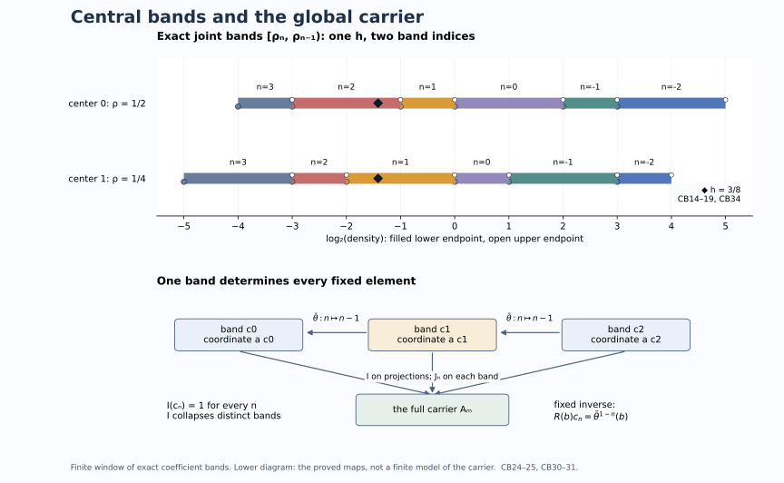

# A fundamental band for the global weight carrier

An integer crossed product gives many coefficient weights representing the same weight class. We construct a fundamental band that contains exactly one coefficient equivalence class for each class on the crossed product. We then recover the whole global carrier as a fixed algebra, with an explicit normal inverse. The carrier itself can have nonseparable predual; all passage from countable pieces to arbitrary joins is proved below.

*Original exposition, examples, figures, data and reproducible drawing code in this lesson are dedicated to CC0-1.0. Source publications retain their own terms.*

## 1. The reference system and the conclusion

Let \(M\) be a separable-predual factor of type \(\mathrm{III}_\lambda\), \(0\leq\lambda<1\). Fix the discrete reference system used in [normalized coefficient comparison](OA-FLOW-NCOEF.md#nc-density-cocycle):
\[
 M=N\rtimes_\theta\mathbb Z,\quad UxU^*=\theta(x),\quad
 \phi=\tau E,\quad \tau\theta=\tau_\rho,
 \qquad 0<\rho\leq\lambda_0 1,\quad 0<\lambda_0<1.
 \tag{CB1}
\]
Here \(E:M\to N\) is the faithful normal coefficient expectation, \(N\) is a separable-predual type \(\mathrm{II}_\infty\) algebra, and \(\tau\) is its faithful normal semifinite trace. The positive affiliated central density \(\rho\) has zero kernel, but its inverse need not be bounded. For \(\lambda>0\), use the specified fundamental-period generalized trace, so \(\rho=\lambda1\). For \(\lambda=0\), \(N\) can have nontrivial center. These are the actual reference weights of [DDP](OA-FLOW-DDP.md#dd-recognition) and [LAC](OA-FLOW-LAC.md#lac-recognition), with their normal recognition maps and whole-cone weight identities.

Write \(W_\infty(P)\) for zero together with the normal semifinite weights on \(P\) whose support-corner centralizer is properly infinite. The [global-carrier theorem](OA-FLOW-CGF.md#cgf-3) supplies an abelian von Neumann algebra \(\mathcal A_P\) and a surjection
\[
 p_P:W_\infty(P)\longrightarrow\operatorname{Proj}_\sigma(\mathcal A_P),
 \qquad p_P(\alpha)\leq p_P(\beta)\iff\alpha\precsim\beta.
 \tag{CB2}
\]
The subscript means sigma-finite projections. The comparison \(\alpha\precsim\beta\) means that \(\alpha\) is equivalent, by an actual supported partial isometry, to a centralizer compression of \(\beta\). It does not mean pointwise domination. Equality of the carrier projections means equivalence of the weights. This theorem applies to the nonfactor algebra \(N\), as well as to \(M\).

Put \(\rho_0=1\) and define the central affiliated densities \(\rho_n\) by \(\tau\theta^n=\tau_{\rho_n}\). We will construct an orthogonal partition
\[
 c_n=[\rho_n,\rho_{n-1}[\quad(n\in\mathbb Z),\qquad
 \bigvee_n c_n=1_{\mathcal A_N},
 \tag{CB3}
\]
and normal isomorphisms
\[
 J_n:\mathcal A_Nc_n\overset{\cong}{\longrightarrow}\mathcal A_M,
 \qquad
 F:(\mathcal A_N)^{\bar\theta}\overset{\cong}{\longrightarrow}\mathcal A_M,
 \tag{CB4}
\]
where \(\bar\theta(p_N(\psi))=p_N(\psi\theta^{-1})\). Each arrow has a normal inverse. The second intertwines the global algebraic scaling actions; no continuity of those actions on the entire carriers is assumed.

Every normal semifinite weight \(\eta\) on \(M\), including zero and weights of finite multiplicity, will have a representative \(\phi_h\) with
\[
 h\in N_+,\qquad \rho s(h)\leq h\leq s(h),\qquad
 \ker_{s(h)}(s(h)-h)=0.
 \tag{CB5}
\]
Its coefficient equivalence class is unique, and its reduced centralizer is \(\{h\}'\cap s(h)Ns(h)\). These conclusions require the full [rigidity and seed proofs](OA-FLOW-NCOEF.md#nc-rigidity), not just an informal choice of Fourier coefficients.

## 2. Constructing a projection from its allowed small pieces

We first prove the order-theoretic fact needed to make (CB3) meaningful. In any abelian von Neumann algebra, every projection is the join of its sigma-finite subprojections. Indeed, a nonzero residual projection is detected by a positive normal functional; the support of its restriction is a nonzero sigma-finite subprojection.

If \(q\) is sigma-finite and \(q\leq\bigvee_{i\in I}e_i\), choose a faithful normal state \(\omega\) on the corner under \(q\). Normality applied to the finite joins gives finite sets \(I_k\subset I\) with
\[
 \omega\!\left(q-\bigvee_{i\in I_k}qe_i\right)<2^{-k}.
 \tag{CB6}
\]
Faithfulness then gives \(q\leq\bigvee_{i\in\cup_k I_k}e_i\). Thus a countable subfamily covers \(q\). A countable join of sigma-finite projections is sigma-finite: sum faithful normal functionals on their corners, with positive summable coefficients after normalizing their norms. The support of that sum is precisely the join.

Consider a class \(\mathscr E\subset W_\infty(N)\) with the following properties. It is invariant under equivalence; it contains every infinite-multiplicity subweight of any of its members; and an orthogonal countable sum of its members remains a member. These properties imply that
\[
 c=\bigvee_{\psi\in\mathscr E}p_N(\psi)
 \tag{CB7}
\]
has exactly the sigma-finite lower projections \(p_N(\mathscr E)\). To prove the nontrivial inclusion, take sigma-finite \(q\leq c\). Equation (CB6) supplies \(\psi_j\in\mathscr E\) whose carriers cover \(q\). Disjointify their intersections with \(q\):
\[
 q_j=q\,p_N(\psi_j)\prod_{i<j}(1-p_N(\psi_i)),\qquad
 q=\bigvee_jq_j.
 \tag{CB8}
\]
Carrier surjectivity gives \(\chi_j\in W_\infty(N)\) with \(p_N(\chi_j)=q_j\). Then \(\chi_j\precsim\psi_j\), so \(\chi_j\in\mathscr E\).

Choose a countable filling family of isometries \(v_j\in N\), available by [PC5](OA-FLOW-PC.md#pc-5). If \(p_j=s(\chi_j)\), transport \(\chi_j\) to the corner \(v_jp_jv_j^*\) by
\(\chi'_j(x)=\chi_j(v_j^*xv_j)\). The partial isometry \(v_jp_j\) and its inverse implement the supported equivalence. The new supports are orthogonal. Their sum \(\chi=\sum_j\chi'_j\) has properly infinite centralizer: sum two orthogonal isometries from each diagonal centralizer strongly. The [balanced-sum proof](OA-FLOW-CGF.md#cgf-2) also gives
\[
 p_N(\chi)=\bigvee_jp_N(\chi'_j)=q.
 \tag{CB9}
\]
Closure of \(\mathscr E\) proves the claim. No commutation between unrelated projections in \(N\) was used; the disjointification took place in the abelian carrier. This also proves uniqueness of \(c\), because all its sigma-finite lower projections determine it.

## 3. Central interval projections

For a positive selfadjoint operator \(h\) affiliated with \(N\), write \(p=s(h)\). The [trace-density theorem](OA-FLOW-TD.md#td-6) gives the normal semifinite weight \(\tau_h\), with exact support \(p\), and gives every such weight uniquely. Its values are the increasing trace-cutoff values on the entire positive cone. The convention includes unbounded densities, infinite values and zero.

Let \(\delta_1,\delta_2\) be positive selfadjoint operators affiliated with \(Z(N)\), with \(\delta_1\leq\delta_2\) and injective difference on \(s(\delta_2)\). We use
\[
 \delta_1p\leq h<\delta_2p
 \tag{CB10}
\]
to mean the two joint-spectral inequalities and that \(\delta_2p-h\) has zero kernel on \(p\). The upper inequality already forces \(p\leq s(\delta_2)\). Since both endpoints are central, they strongly commute with \(h\); the difference in (CB10) is the positive operator defined by joint spectral calculus. It is not an undefined subtraction of arbitrary unbounded operators. Strictness requires no uniform positive lower bound.

Let \(\mathscr E\) be the weights \(\tau_h\in W_\infty(N)\) satisfying (CB10). We check all hypotheses of Section 2. If \(w^*w=s(k)\), \(ww^*=s(h)\) and \(\tau_k(x)=\tau_h(wxw^*)\), trace-density uniqueness gives
\[
 k=w^*hw
 \tag{CB11}
\]
on the transported form and operator domains. Every central endpoint commutes with \(w\) and its spectral projections. Consequently both inequalities and the kernel of the upper difference transport exactly, proving equivalence invariance.

For clarity, the full centralizer identity used here is
\(N_{\tau_h}=\{h\}'\cap pNp\). Indeed, [TD's trace GNS calculation](OA-FLOW-TD.md#equation-td3) gives the trivial modular group for \(\tau\); the [supported density formula CZ40](../../OA-MOD/src/centralizers-and-perturbations.md#recover-modular-time-on-the-support) then gives \(\sigma_t^{\tau_h}=\operatorname{Ad}(h^{it})\) on \(pNp\). Commuting with all these unitaries is equivalent to commuting with the spectral projections of \(\log h\), and hence of \(h\), by the spectral theorem for the generator. If \(e\) is a projection in this centralizer, its compression has density \(eh\) and support \(e\). The inequalities and injectivity of the upper difference restrict to \(e\). Such a cut belongs to \(W_\infty(N)\) precisely when its centralizer corner is properly infinite; arbitrary cuts need not have that property. This proves the required downward closure among the weights that actually belong to \(W_\infty(N)\).

For orthogonal supports \(p_j\), the direct sum \(h=\bigoplus_jh_j\), extended by zero on the complement, is densely defined. Its operator domain is
\[
 D(h)=\left\{\xi:\ p_j\xi\in D(h_j),\quad
                    \sum_j\|h_jp_j\xi\|^2<\infty\right\}.
 \tag{CB12}
\]
Finite sums of dense block domains prove density. Its weight is the orthogonal sum by [TD7](OA-FLOW-TD.md#td-7). Both central bounds restrict blockwise, and the upper difference is a direct sum of injective positive operators, hence is injective on \(\sum_jp_j\). Proper infiniteness follows by the block-isometry argument in Section 2. Thus \(\mathscr E\) has all required closure properties.

We have proved the unique interval projection theorem:
\[
 p_N(\tau_h)\leq[\delta_1,\delta_2[
 \quad\Longleftrightarrow\quad
 \delta_1s(h)\leq h<\delta_2s(h)
 \qquad(\tau_h\in W_\infty(N)).
 \tag{CB13}
\]
Neither the interval projection nor \(\mathcal A_N\) is assumed sigma-finite. In the relocation used to prove principality, the central endpoints commute with each \(v_j\), so their bounds are preserved; different original central summands are never identified.

## 4. Joint spectral bands and their motion

The [ordered density-cocycle calculation](OA-FLOW-NCOEF.md#nc-density-cocycle) gives
\[
 \rho_{n+m}=\rho_n\theta^{-n}(\rho_m),\qquad
 \rho_n\leq\lambda_0\rho_{n-1}\quad(n\in\mathbb Z).
 \tag{CB14}
\]
In particular, for \(n\geq1\), \(\rho_n\leq\lambda_0^n1\) and \(\rho_{-n}\geq\lambda_0^{-n}1\). All \(\rho_n\) are nonsingular, and \(\rho_n<\rho_{n-1}\). Thus the intervals \(c_n\) in (CB3) exist.

For \(\tau_h\in W_\infty(N)\), use joint calculus in the abelian algebra generated by \(Z(N)\) and the spectral projections of \(h\) to set
\[
 e_n=1_{\{\rho_n\leq h<\rho_{n-1}\}},\qquad
 e_ne_m=0\ (n\ne m),\qquad\sum_ne_n=s(h).
 \tag{CB15}
\]
There is no positive finite joint-spectral value missed by these intervals: the lower endpoints tend to zero and the upper endpoints to infinity, uniformly in the indicated central order. A selfadjoint density has no infinite-value spectral projection. The zero spectral projection of \(h\) is outside its support. This proves the last equality, including zero.

Each \(e_n\) belongs to \(Z(N_{\tau_h})\), since both the spectral projections of \(h\) and the original center commute with its entire centralizer. Its nonzero centralizer corner remains properly infinite. Therefore \(\tau_{he_n}\in W_\infty(N)\), and
\[
 p_N(\tau_h)=\bigvee_np_N(\tau_{he_n})\leq\bigvee_nc_n.
 \tag{CB16}
\]
Surjectivity of the carrier and the sigma-finite lower-piece property make the right side equal to one. If \(c_nc_m\ne0\), choose a nonzero sigma-finite carrier below their intersection and represent it by \(\tau_a\). For \(n<m\), (CB13) forces
\(\rho_ns(a)\leq a<\rho_{m-1}s(a)\leq\rho_ns(a)\), an impossibility. Thus (CB3) is an orthogonal partition. In general the cuts (CB15) are joint central cuts, not spectral projections of \(h\) alone.

Automorphic transport of coefficient weights is
\[
 S_kh=\rho_k\theta^{-k}(h),\qquad
 \tau_{S_kh}=\tau_h\theta^k,
 \qquad S_\ell S_k=S_{\ell+k}.
 \tag{CB17}
\]
These are joint-spectral products with the central density, on their full affiliated domains. The whole-cone formula follows first for bounded cutoffs from positive trace sandwiches, and then from the trace-density theorem. It proves that \(S_k\) preserves weight equivalence, comparison and infinite multiplicity. Transporting (CB13) by (CB14) moves the \(n\)-th band to the \((n+k)\)-th. Moreover bimodularity and the equivariance of \(E\) give
\[
 \phi_h(\operatorname{Ad}(U^k)x)=\phi_{S_kh}(x)
 \qquad(x\in M_+).
 \tag{CB18}
\]
All these identities include infinite values. The carrier operation \(\bar\theta\) is \(S_{-1}\), and therefore
\[
 \bar\theta(c_n)=c_{n-1}.
 \tag{CB19}
\]

## 5. A complete join map from expectation

For a sigma-finite projection \(f=p_N(\psi)\), define
\[
 I_\sigma(f)=p_M(\psi E).
 \tag{CB20}
\]
The [expectation theorem WC36–42](../../OA-MOD/src/weight-comparison-centralizer-transport.md#faithful-expectations-preserve-support-comparison-and-orthogonal-sums) proves normal semifiniteness, equality of supports, preservation of supported comparison, and commutation with orthogonal sums. Its modular restriction also puts \(N_\psi\) unitally inside the support centralizer of \(\psi E\). The two isometries witnessing proper infiniteness of the former witness it in the latter. Thus the target carrier exists. The same comparison theorem makes (CB20) independent of the representative, order preserving, and faithful in the sense
\[
 I_\sigma(f)=0\iff f=0.
 \tag{CB21}
\]

For countably many orthogonal sigma-finite \(f_j\), relocate representing weights to orthogonal supports as in Section 2. Orthogonal-sum compatibility on both carriers proves
\[
 I_\sigma\!\left(\bigvee_j f_j\right)=\bigvee_jI_\sigma(f_j).
 \tag{CB22}
\]
For an arbitrary countable family, disjointify its projections, apply this equality to the increments, and use monotonicity in both directions. The countable join is still sigma-finite by (CB6).

There is now a unique extension preserving arbitrary joins:
\[
 I(e)=\bigvee_{\substack{f\leq e\\f\ \mathrm{sigma\!-\!finite}}}I_\sigma(f).
 \tag{CB23}
\]
For a family \(e_i\), a sigma-finite \(f\leq\bigvee_i e_i\) has a countable cover by the intersections \(fe_{i_j}\), by (CB6). Then (CB22) gives \(I_\sigma(f)=\bigvee_jI_\sigma(fe_{i_j})\leq\bigvee_iI(e_i)\). Taking the join over \(f\), and using monotonicity for the reverse inclusion, proves
\[
 I\!\left(\bigvee_i e_i\right)=\bigvee_i I(e_i).
 \tag{CB24}
\]
This includes the empty family. A nonzero source projection has a nonzero sigma-finite subprojection, so \(I\) remains faithful. By (CB18), followed by (CB24),
\[
 I\bar\theta=I.
 \tag{CB25}
\]
Join preservation is the exact assertion here; preservation of intersections on the whole carrier would be false.

## 6. Exhaustion and the normal form for every weight

We use the [strengthened coefficient seed](OA-FLOW-NCOEF.md#nc-seed): for every nonzero \(\psi\in W_\infty(M)\), there is nonzero bounded \(g\in N_+\) such that \(\phi_g\precsim\psi\) and \(\tau_g\in W_\infty(N)\). The second conclusion is essential for forming its coefficient carrier.

Let \(q\) be a nonzero sigma-finite projection of \(\mathcal A_M\), and choose \(\psi\) representing it. The seed gives \(0\ne f=p_N(\tau_g)\) with \(0\ne I_\sigma(f)\leq q\). Some band piece \(fc_n\) is nonzero. Its image is still nonzero and below \(q\); transport by \(S_{1-n}\) puts a sigma-finite piece below \(c_1\) with the same image.

Choose a maximal family \((f_j)\) of nonzero sigma-finite projections below \(c_1\) whose images are mutually orthogonal and lie below \(q\). A faithful normal state under \(q\) shows that the family is countable: for each positive integer \(m\), only finitely many orthogonal members can have state value at least \(1/m\). Their source projections are also orthogonal, since a nonzero intersection would have a nonzero image below two orthogonal target projections. Put \(f=\bigvee_j f_j\). If
\(q-I_\sigma(f)\ne0\), apply the seed and band shift inside that residual projection. It supplies another allowable member, contradicting maximality. Therefore
\[
 \operatorname{Proj}_\sigma(\mathcal A_M)
   =I_\sigma\bigl(\operatorname{Proj}_\sigma(\mathcal A_Nc_1)\bigr).
 \tag{CB26}
\]
No sigma-finiteness of the entire target carrier was used.

Representing \(f\leq c_1\) by \(\tau_h\) and using (CB13), we obtain (CB5) and \(p_M(\phi_h)=q\). Thus every infinite-multiplicity weight has normalized coefficient form. The whole-cone identity \(\tau_hE=\phi_h\) is part of the [coefficient construction](OA-FLOW-NCOEF.md#nc-density-cocycle).

For an arbitrary nonzero normal semifinite \(\eta\), take a countable filling family \(v_j\in M\) and the specific normal amplification isomorphism
\[
 A_v(x\otimes e_{ij})=v_ixv_j^*,\qquad
 \dot\eta(x)=\sum_j\eta(v_j^*xv_j).
 \tag{CB27}
\]
Its inverse is \(x\mapsto(v_i^*xv_j)_{ij}\), implemented by the unitary \((\xi_i)\mapsto\sum_i v_i\xi_i\). The [whole supported tensor-weight calculation](OA-FLOW-CGF.md#cgf-6) makes \(\dot\eta\) normal semifinite with centralizer \(M_\eta\bar\otimes B(\ell^2)\), so it has infinite multiplicity. If \(p=s(\eta)\), the first-coordinate projection \(v_1pv_1^*\) belongs to this centralizer. The partial isometry \(v_1p\) has initial projection \(p\), final projection \(v_1pv_1^*\), and
\[
 \dot\eta(v_1p x p v_1^*)=\eta(x)\qquad(x\in M_+).
 \tag{CB28}
\]
Thus \(\eta\precsim\dot\eta\), with the actual transporter identified.

Choose normalized \(h\) with \(\dot\eta\sim\phi_h\). Transporting the first-coordinate cut gives \(e\in\operatorname{Proj}(M_{\phi_h})\) and \(\eta\sim(\phi_h)_e\). The [exact centralizer and compression theorem](OA-FLOW-NCOEF.md#nc-centralizer) puts \(e\) in \(N\), commuting with \(h\), and gives
\[
 (\phi_h)_e=\phi_{eh},\qquad
 \rho e\leq eh\leq e,\qquad\ker_e(e-eh)=0.
 \tag{CB29}
\]
This proves the normal form without an infinite-multiplicity assumption. Zero corresponds to \(h=0\). Finally, two normalized representatives are equivalent on \(M\) exactly when their coefficient weights are equivalent on \(N\): the forward direction is full transport rigidity, and the reverse direction is expectation transfer. The exact support centralizer is the one asserted after (CB5).

## 7. Every band gives a full normal isomorphism

On sigma-finite projections below \(c_1\), equality of the \(I_\sigma\) images means equivalence of normalized weights \(\phi_h\). Rigidity forces the supported implementer into \(N\), so their coefficient carriers agree. This proves injectivity; (CB26) gives surjectivity.

The resulting bijection reflects order. If \(I_\sigma(f)\leq I_\sigma(g)\), lift the sigma-finite difference \(I_\sigma(g)-I_\sigma(f)\) to a sigma-finite \(d\leq c_1\). Equation (CB22) and injectivity imply \(f\vee d=g\), hence \(f\leq g\). The operations \(S_k\) transport this order isomorphism to every band. The [Boolean reconstruction proof](OA-FLOW-CGF.md#cgf-3) extends it uniquely to complete projection lattices and then by norm limits of spectral step functions to the isomorphisms \(J_n\) in (CB4). Both maps are normal: an order isomorphism and its inverse preserve every bounded increasing supremum by carrying upper bounds in both directions. This provides the full normal onto map, not merely a bijection of selected weight classes.

On the projection lattice, \(J_n(e)=I(e)\) for \(e\leq c_n\), by (CB23). In particular, \(I(c_n)=1\) for every \(n\). Since the distinct \(c_n\) are orthogonal, \(I\) cannot preserve intersections globally: \(I(c_nc_m)=0\), whereas \(I(c_n)I(c_m)=1\). Its algebra extensions are defined on single bands and on the fixed algebra below.

## 8. The fixed algebra and its explicit inverse

Put \(\mathcal B=(\mathcal A_N)^{\bar\theta}\). Compression
\(K:\mathcal B\to\mathcal A_Nc_1\), \(K(a)=ac_1\), has the inverse
\[
 R(b)=\sum_{n\in\mathbb Z}\bar\theta^{\,1-n}(b),
 \qquad b\in\mathcal A_Nc_1.
 \tag{CB30}
\]
The summands lie in mutually orthogonal bands \(c_n\). The sum means the strong limit of finite band sums: for any vector, its squared tail norm is at most \(\|b\|^2\) times the corresponding orthogonal-projection tail. Thus it is bounded with \(\|R(b)\|=\|b\|\). Products and adjoints are calculated bandwise. Reindexing gives \(\bar\theta(R(b))=R(b)\), and \(K(R(b))=b\). Conversely, for \(a\in\mathcal B\),
\(ac_n=\bar\theta^{1-n}(ac_1)\); summing its coordinates gives \(R(K(a))=a\).

The map \(K\) is normal. To verify normality of \(R\) directly, a bounded increasing net \(b_i\uparrow b\) has, in each band, \(\bar\theta^{1-n}(b_i)\uparrow\bar\theta^{1-n}(b)\). If \(a\) is the supremum of \(R(b_i)\), compression to every band therefore agrees with \(R(b)\). The partition of one makes \(a=R(b)\). This proof handles nets, with no countability assumption on either predual.

Consequently the required fixed-algebra isomorphism and its inverse are
\[
 F=J_1K,\qquad F^{-1}=RJ_1^{-1}.
 \tag{CB31}
\]
For a fixed projection \(e\), equations (CB24)–(CB25) give \(I(e)=I(ec_1)\), so \(F\) agrees with the original join map on all fixed projections.

The global scaling automorphisms satisfy \(\Theta_s^P(p_P(\psi))=p_P(e^{-s}\psi)\). Scalar multiplication commutes with automorphic transport and with expectation composition. Hence, first on sigma-finite projections and then by arbitrary joins,
\[
 \bar\theta\Theta_s^N=\Theta_s^N\bar\theta,
 \qquad I\Theta_s^N=\Theta_s^M I.
 \tag{CB32}
\]
The first identity preserves \(\mathcal B\); the second, restricted there and extended from projections, proves
\[
 F\Theta_s^N|_{\mathcal B}F^{-1}=\Theta_s^M.
 \tag{CB33}
\]
The fundamental band itself need not be scaling-invariant. The fixed-algebra argument is what makes this conjugacy valid. It concerns the algebraic global actions; the continuous summand is separately characterized in [CGF](OA-FLOW-CGF.md#cgf-8).

## 9. A two-center model and solved diagnostics

Here is an exact coefficient calculation displaying the signs and joint endpoints. On a two-point center let \(\theta\) interchange the two coordinates and put \(\rho=(1/2,1/4)\). The ordered cocycle gives, for every integer \(m\),
\[
 \rho_{2m}=8^{-m}(1,1),\qquad
 \rho_{2m+1}=8^{-m}(1/2,1/4).
 \tag{CB34}
\]
These formulas also verify all negative indices and (CB14). This central calculation is realizable: take \(D=R_f\bar\otimes B(\ell^2)\) and the trace-halving automorphism \(\gamma\) constructed in [TP Section 6](OA-FLOW-TP.md#tp-6). On \(N=D\oplus D\), with sum trace, set \(\theta(x_0,x_1)=(\gamma^2(x_1),\gamma(x_0))\). Its trace density is exactly \((1/2,1/4)\). We use it as a coefficient model, without identifying its finite-center crossing as a type \(\mathrm{III}_0\) example.

At \(n=1\), the intervals are \([1/2,1)\) and \([1/4,1)\). Thus \(h=(3/8,3/8)\) lies in different joint bands in the two central coordinates. The operation \(S_1\) swaps its coordinates and multiplies by \(\rho\), moving each band index up by one; \(\bar\theta=S_{-1}\) moves the index down by one. The illustration uses base-two logarithmic coordinates, so every endpoint in (CB34) is an exact integer or half-integer location.

The first panel displays actual endpoints from (CB34); open and filled endpoint markers are offset vertically for legibility, without changing their horizontal coordinates. The second depicts the proved carrier operations (CB25), (CB30) and (CB31): different bands map onto the same carrier, while a bounded fixed element is uniquely recovered by repeating its fundamental-band coordinate through the specified automorphism. It is a diagram of those maps, not a claim that the whole carrier consists of finitely many plotted points.

**1. Why are the cuts joint?** In the two-center model, \(h=3/8\) is a scalar operator. Its spectral projections alone cannot distinguish the two center coordinates. Yet \(3/8<1/2\) and \(3/8\geq1/4\), so the two coordinates fall in different bands. The central density must participate in (CB15).

**2. Does strictness give a norm gap?** On \(\ell^2(\{2,3,\ldots\})\), let \(h e_j=(1-1/j)e_j\). Then \(h<1\) in the injective-difference sense, while \(\|h\|=1\). Tensoring with an infinite identity preserves the example and yields a properly infinite centralizer. A finite upper spectral gap was not used in the interval construction.

**3. Can every centralizer compression be used in the carrier?** No. Compress the trace on a type \(\mathrm{II}_\infty\) factor by a nonzero finite projection. The density inequalities can survive, but the compressed centralizer is finite. It no longer represents a member of \(W_\infty\). The cuts in (CB15) are central in the old centralizer and therefore do preserve proper infiniteness.

**4. Is the global expectation map multiplicative?** For two different full bands, the source product is zero, while both images are one. This gives the exact obstruction. On each band, and on the fixed algebra, the constructions in Sections 7–8 give normal algebra isomorphisms.

**5. Why not use any stable isomorphism to remove multiplicity?** An unnamed stable isomorphism does not specify a subweight of the original weight. Equation (CB28) does: the first-coordinate partial isometry has the required support orientation and preserves every positive value, including infinity.

**6. How can a countable argument prove a statement for the whole carrier?** Countability is used only below a chosen sigma-finite projection, by a faithful normal state. Every projection is the join of its sigma-finite lower pieces. Equations (CB23)–(CB24) then prove the arbitrary-join assertion without asserting a faithful state on the entire carrier.

**7. Where is the inverse on nonprojection elements?** It is the bounded orthogonal sum (CB30), followed by \(J_1^{-1}\) as in (CB31). The norm bound, multiplication, onto property and normality were checked for all bounded elements, not only for carrier projections.

## Further reading

M. Takesaki, *Theory of Operator Algebras II*, Section XII.4, especially Theorem 4.10, Lemmas 4.12–4.14 and Corollary 4.15, pp.410–416. The full interval, exhaustion and fixed-algebra proofs above are organized around the normal maps they construct. Earlier programme proofs supply supported comparison, full trace densities, the nonfactor carrier and normalized coefficient rigidity; each is linked at its use.
