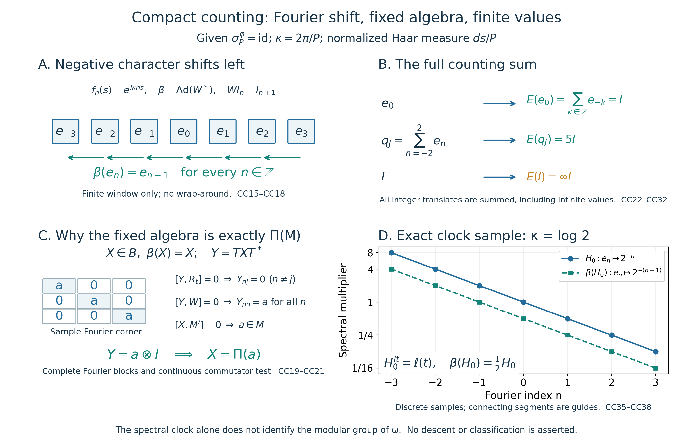

# A periodic modular crossed product and its counting operator-valued weight

Original reconstruction, 2026-10-04. CC0-1.0 to the extent of rights held.

Let \(M\) be an arbitrary von Neumann algebra, \(\varphi\) a faithful normal semifinite weight, and \(P>0\) a given period:

\[
\sigma_P^\varphi=\mathrm{id},\qquad K=\mathbb R/P\mathbb Z,\qquad
\kappa=2\pi/P.
\tag{CC1}
\]
The period need not be minimal. No type, factoriality, separability, countable-decomposability or classification hypothesis is imposed. We construct the concrete regular von Neumann crossed product by this compact group, prove its dual fixed algebra, and construct its faithful normal semifinite counting operator-valued weight on the whole positive cone.

The actual earlier proof inputs are [CF Sections 1 and 6–8](OA-FLOW-CF.md#oa-flow.cf.1) and [its completion proof](OA-FLOW-CF.md#gns-residual-completion); [SC's normalized Lebesgue measure and regularity](OA-FLOW-SC.md#sc-02), [convergence](OA-FLOW-SC.md#sc-04), [complex integration](OA-FLOW-SC.md#sc-05), [\(L^2\) completeness](OA-FLOW-SC.md#sc-07) and [oriented substitution](OA-FLOW-SC.md#sc-08); [L24 Propositions 4.1–4.2](OA-FLOW-L24.md#oa-flow.grp.vectorintegration) (Bochner \(L^2\) integration and the onto Hilbert-tensor identification); [GNS Lemma 7.1](OA-FLOW-GNS.md#gns-lemma-7-1) (Hilbert sums); [CP01–06](OA-FLOW-CP.md#oa-flow.cp.1) (concrete predual/vector-series topology); [SF's full spectral domains](OA-FLOW-SF.md#oa-flow.sf1.full-domains), [normal transport](OA-FLOW-SF.md#oa-flow.sf1.normal-transport) and [bounded convergence](OA-FLOW-SF.md#oa-flow.sf2.bounded-strong-transfer); [GW's finite ideals/GNS](OA-FLOW-GW.md#oa-flow.gw.1) and [semifiniteness criterion](OA-FLOW-GW.md#oa-flow.gw.4); [WR's faithful normal GNS recovery](OA-FLOW-WR.md#oa-flow.wr.5) and [MW4's modular implementation](OA-FLOW-MW.md#oa-flow.mw.4); and [EP1](OA-FLOW-EP.md#oa-flow.ep.1), [EP2–3](OA-FLOW-EP.md#oa-flow.ep.2), [EP4](OA-FLOW-EP.md#oa-flow.ep.4), [EP5](OA-FLOW-EP.md#oa-flow.ep.5) and [EP6](OA-FLOW-EP.md#oa-flow.ep.6) (positive normal-functional extension, the entire extended cone with infinite part, its intrinsic spectral pair, bounded criterion, sums/compression and full scalar composition). EP's closed-form and normal-minorant inputs are the actual earlier [FF lines 169–213](OA-FLOW-FF.md#oa-flow.ff.5) and [EW5](OA-FLOW-EW.md#oa-flow.ew.5). The Fourier step and fixed-algebra argument are proved here. No decomposition theorem for operator fields, Peter–Weyl theorem, compact duality theorem, arbitrary-cocycle realization or descent theorem is imported.

The free development materials actually read are [Echterhoff's author notes, Remark 3.2, printed p.8](https://arxiv.org/pdf/1006.4975v4#page=8) and [the dual-action convention in §6.2, printed p.31](https://arxiv.org/pdf/1006.4975v4#page=31); and [Hiai's author manuscript, §§8.1–8.2, printed pp.68–71](https://arxiv.org/pdf/2004.02383v1#page=68). These inform the regular representation and extended-positive/OVW definitions. Every theorem used below has a local proof here or an exact earlier programme proof; the external notes do not close a dependency.

Additional exact earlier locators: [CF 6](OA-FLOW-CF.md#oa-flow.cf.6), [CF 7](OA-FLOW-CF.md#oa-flow.cf.7), [CF 8](OA-FLOW-CF.md#oa-flow.cf.8), [CF 10](OA-FLOW-CF.md#oa-flow.cf.10), [OA-FLOW.EP.3](OA-FLOW-EP.md#oa-flow.ep.3). These links supply the individual Hilbert/positivity/completion and full spectral-pair proof sections already named above.

## CC-0. Normalized circle measure and the complete Fourier decomposition

Let \(q:[0,P]\to K\) be the quotient map. Push forward Lebesgue measure divided by \(P\); the endpoints have zero measure, so the same measure is obtained from \([0,P)\). Denote its completion by \(m_K\). It has total mass one. Translation invariance follows by splitting an interval integral at the wrap point, substituting in its two translated pieces and using their periodic endpoint identification; indicator/simple approximation extends the identity to all measurable integrable functions.

This is a finite Radon measure on the Borel sets of \(K\). Indeed, for a Borel \(E\subset K\), scalar real-line regularity gives a compact \(C\subset q^{-1}(E)\) with measure arbitrarily close to the measure of that preimage. Its compact image lies in \(E\), and its preimage contains \(C\); this proves inner regularity. Applying inner regularity to the complement, since the total measure is finite and \(K\) compact, gives outer regularity. Every nonempty open subset contains a circle arc of positive length, hence has positive measure. There is no assertion about an unrestricted product Borel sigma-algebra.

Put

\[
z(s)=e^{i\kappa s},\qquad f_n(s)=z(s)^n\quad(n\in\mathbb Z).
\tag{CC2}
\]
Oriented substitution and direct integration of exponentials give

\[
\int_K f_n(s)\overline{f_j(s)}\,dm_K(s)=\delta_{nj}.
\tag{CC3}
\]
We prove completeness. Continuous functions are dense in scalar \(L^2(K)\): first approximate by finite simple functions. For an indicator choose compact \(C\subset E\) and open \(V\supset E\) with \(m_K(V\setminus C)\) small. If both \(C\) and \(K\setminus V\) are nonempty, the metric function
\[
g(s)=\frac{d(s,K\setminus V)}
           {d(s,K\setminus V)+d(s,C)}
\]
is continuous, between zero and one, equals one on \(C\) and zero off \(V\); the denominator is positive because the two compact sets are disjoint. Its squared \(L^2\) error from \(1_E\) is at most \(m_K(V\setminus C)\). If \(C\) is empty use zero; if \(V=K\) use one, with the same measure-error bound. Completion-measurable sets have Borel representatives modulo a null set by SC's completion convention, so these approximations cover the completed space.

For integers \(N\geq1\), the elementary finite geometric sum gives the nonnegative trigonometric polynomial

\[
F_N(s)=\frac1N\left|\sum_{j=0}^{N-1}z(s)^j\right|^2
=\sum_{|j|<N}(1-|j|/N)z(s)^j,\qquad \int_K F_N\,dm_K=1.
\tag{CC4}
\]
Outside any neighborhood \(V\) of zero, compactness and \(z(s)\neq1\) give \(|1-z(s)|\geq c_V>0\), so \(F_N(s)\leq4/(Nc_V^2)\). For continuous \(g\), the convolution \(F_N*g\) is a trigonometric polynomial by the finite displayed expansion and translation invariance. Uniform continuity and the bound off \(V\) give

\[
\|F_N*g-g\|_\infty
\leq\sup_{s,\ t\in V}|g(s-t)-g(s)|
       +\frac{8\|g\|_\infty}{Nc_V^2}.
\tag{CC5}
\]
Choose \(V\) first and then \(N\). Thus trigonometric polynomials are uniformly dense in \(C(K)\), and ([CC3](OA-FLOW-CC.md#equation-cc3)) is a complete orthonormal system in scalar \(L^2(K)\).

For any Hilbert space \(H\), let \(\mathcal H=L^2(K,H)\), using strongly measurable Bochner representatives. The earlier tensor proof and ([CC3](OA-FLOW-CC.md#equation-cc3)) identify

\[
\mathcal H=\bigoplus_{n\in\mathbb Z}H,\quad
I_n\xi(s)=f_n(s)\xi,\quad
\widehat\eta(n)=I_n^*\eta
=\int_K\eta(s)e^{-i\kappa ns}\,dm_K(s).
\tag{CC6}
\]
The integral exists because \(\|\eta\|_1\leq\|\eta\|_2\) on this probability space. For clarity, the onto Fourier map follows without a Hilbert-space separability assumption. Finite tensor sums are dense by [L24](OA-FLOW-L24.md#oa-flow.grp.vectorintegration); approximate each of their finitely many scalar factors by trigonometric polynomials. Hence the finite sums of \(I_n\xi_n\) are dense. Orthogonality gives their squared norm \(\sum_n\|\xi_n\|^2\), and Hilbert completion gives precisely the displayed countable Hilbert sum. In particular

\[
\|\eta\|^2=\sum_n\|\widehat\eta(n)\|^2,\qquad
\sum_n I_nI_n^*=I\text{ strongly}.
\tag{CC7}
\]
Only the scalar circle has been expanded in a countable Fourier system; \(H\) and \(M\) remain arbitrary.

Define \(L_t\eta(s)=\eta(s-t)\) and \(R_t\eta(s)=\eta(s+t)\). They are unitary and strongly continuous. This follows on continuous scalar functions by uniform continuity, then on scalar \(L^2\) by the density just proved, and on \(\mathcal H\) by finite tensors, approximation and the unitary bound. With \(W\eta(s)=z(s)\eta(s)\),

\[
L_t I_n=e^{-i\kappa nt}I_n,\quad
R_t I_n=e^{i\kappa nt}I_n,\quad WI_n=I_{n+1}.
\tag{CC8}
\]
Normalized Haar measure \(ds/P\) therefore pairs with counting measure on \(\mathbb Z\), with no extra factor \(P\).

## CC-1. Periodic GNS implementers and the actual regular algebra

Use the faithful normal GNS representation of \(\varphi\), and identify \(M\) with its image on \(H=H_\varphi\). The earlier MW/GW proofs give the strongly continuous group \(U_t=\Delta_\varphi^{it}\) with

\[
U_t xU_{-t}=\sigma_t^\varphi(x),\qquad
U_t\Lambda_\varphi(a)=\Lambda_\varphi(\sigma_t^\varphi(a))
\quad(a\in\mathfrak n_\varphi).
\tag{CC9}
\]
Thus \(U_P\) fixes every vector in the dense GNS range, by ([CC1](OA-FLOW-CC.md#equation-cc1)), so \(U_P=I\). These implementers, rather than an unspecified spatial implementation with a possible scalar period, descend to \(K\).

On \(\mathcal H=L^2(K,H)\), define the regular coefficient representation and the compact regular group by

\[
(\Pi(x)\eta)(s)=\sigma_{-s}^\varphi(x)\eta(s),\qquad
\ell(t)=L_t.
\tag{CC10}
\]
There is no norm-continuity assumption on \(s\mapsto\sigma_s^\varphi(x)\). For a fixed vector it is strongly continuous by ([CC9](OA-FLOW-CC.md#equation-cc9)). For simple vector functions its products are strongly measurable, and boundedness extends the multiplication operators to all of \(L^2(K,H)\).

The untwisting unitary

\[
(T\eta)(s)=U_s\eta(s)
\tag{CC11}
\]
is legitimate on every vector. On simple functions its terms are continuous vector orbits times measurable scalar functions, hence strongly measurable. It preserves the pointwise norm and the \(L^2\) norm. Simple approximation extends it to an isometry, and the corresponding multiplier \(U_{-s}\) is its inverse. Therefore

\[
T\Pi(x)T^*=x\otimes I,\qquad
T\ell(t)T^*=U_tL_t,\qquad
\ell(t)\Pi(x)\ell(t)^*=\Pi(\sigma_t^\varphi(x)).
\tag{CC12}
\]
The notation \(x\otimes I\) denotes the constant operator \(x\) on the \(H\) factor, or its diagonal action on every Fourier copy of \(H\).

The map \(\Pi\) is faithful, isometric and normal, with normal inverse on its image. Faithfulness and the norm follow from the constant representation in ([CC12](OA-FLOW-CC.md#equation-cc12)), tested on \(I_0\xi\). For normality, expand any two vectors into ([CC6](OA-FLOW-CC.md#equation-cc6)): the coefficient of \(x\otimes I\) is

\[
\sum_n\langle x\xi_n,\eta_n\rangle,
\quad \sum_n\|\xi_n\|^2,\ \sum_n\|\eta_n\|^2<\infty.
\tag{CC13}
\]
It is an actual [CP](OA-FLOW-CP.md#oa-flow.cp.6) predual functional on \(M\). For a summable vector-series test on \(B(\mathcal H)\), the double expansion has summable absolute tails by Cauchy–Schwarz and the two square sums, so its pullback is again in \(M_*\). This proves ultraweak continuity. The constant image is weak-operator closed: compress a weak-operator limit to the \((0,0)\) block to obtain \(x\in M\); every other Fourier block must be \(\delta_{nj}x\), and density of finite Fourier sums gives the constant operator. Compression to that block, followed by ([CC12](OA-FLOW-CC.md#equation-cc12)), is an ultraweakly continuous inverse. Hence \(\Pi(M)\) is a von Neumann subalgebra.

The compact regular von Neumann crossed product considered here is the concrete algebra

\[
B=(\Pi(M)\cup\{\ell(t):t\in K\})''\subseteq B(\mathcal H).
\tag{CC14}
\]
This specifies its representation and topology. No identification with a continuous core, an abstract double crossed product or a compact factor is asserted.

## CC-2. The negative dual generator and its complete spectral projections

Choose the dual generator corresponding to the negative character:

\[
\chi_-(s)=e^{-i\kappa s},\qquad
\beta=\operatorname{Ad}(W^*)|_B.
\tag{CC15}
\]
Direct calculation gives

\[
\beta(\Pi(x))=\Pi(x),\qquad
\beta(\ell(t))=e^{-i\kappa t}\ell(t).
\tag{CC16}
\]
Conjugation and its inverse preserve the generators and their von Neumann closure, so \(\beta\) is a normal automorphism of \(B\). This is the ordinary dual-action convention \(\widehat\alpha_\chi(\ell(t))=\chi(t)\ell(t)\), evaluated at \(\chi_-\).

Let \(e_n=I_nI_n^*\). Each belongs to \(B\), with the exact formula

\[
e_n=\int_K e^{i\kappa nt}\ell(t)\,dm_K(t).
\tag{CC17}
\]
One can construct this integral without a norm-continuous \(B(\mathcal H)\)-valued integrand. Equal-mesh Riemann sums have operator norm at most one. For each vector, its continuous orbit gives convergence in Hilbert norm to the vector integral. This defines a bounded operator, the bounded strong limit of operators in \(B\), and thus an element of \(B\). On \(I_j\xi\), scalar integration and ([CC8](OA-FLOW-CC.md#equation-cc8)) give \(\delta_{nj}I_j\xi\); Fourier density proves ([CC17](OA-FLOW-CC.md#equation-cc17)). Consequently

\[
e_ne_j=\delta_{nj}e_n,\qquad \sum_{n\in\mathbb Z}e_n=I
\text{ strongly},\qquad \beta(e_n)=e_{n-1}.
\tag{CC18}
\]
The direction of this shift is part of the construction.

## CC-3. The fixed algebra, proved by two concrete commutants

Every constant \(a'\in M'\) on the \(H\) factor belongs to \(B'\): it commutes with each \(\sigma_{-s}^\varphi(x)\in M\) and with the translations. Also the twisted right translations

\[
(r_t\eta)(s)=U_t\eta(s+t)
\tag{CC19}
\]
belong to \(B'\). Indeed ([CC9](OA-FLOW-CC.md#equation-cc9)) gives \(U_t\sigma_{-(s+t)}^\varphi(x)=\sigma_{-s}^\varphi(x)U_t\), and left and right translations commute. All these are bounded operator identities checked first on simple functions, then on every vector. Untwisting gives \(Tr_tT^*=R_t\).

Suppose \(X\in B\) and \(\beta(X)=X\). Then \(X\) commutes with \(W\) and \(W^*\). Since \(T\) commutes with these scalar multipliers, \(Y=TXT^*\) commutes with \(W\), and since \(X\) commutes with \(r_t\), \(Y\) commutes with every \(R_t\).

Use the complete arbitrary-\(H\) Fourier matrix, \(Y_{nj}=I_n^*YI_j\in B(H)\). Commutation with \(R_t\) gives
\[
e^{i\kappa nt}Y_{nj}=e^{i\kappa jt}Y_{nj}.
\]
If \(n\neq j\), take \(t=P/(2|n-j|)\); the ratio is \(-1\), so \(Y_{nj}=0\). Commutation with \(W\) gives \(Y_{n+1,n+1}=Y_{nn}\). Thus all diagonal blocks equal one bounded operator \(a\), and Fourier density proves \(Y=a\otimes I\).

We must still prove \(a\in M\), rather than merely \(B(H)\). The original \(X=T^*(a\otimes I)T\) commutes with every constant \(a'\in M'\). For vectors \(\xi,\eta\in H\), its commutator has the continuous scalar coefficient

\[
c(s)=\langle[U_{-s}aU_s,a']\xi,\eta\rangle.
\tag{CC20}
\]
Testing its zero operator on \(1_V\xi,1_V\eta\), for circle arcs \(V\), gives \(\int_Vc(s)\,dm_K(s)=0\). If \(c(0)\neq0\), rotate its scalar phase and use continuity to obtain an arc about zero on which its real part is strictly positive; the positive measure of this arc contradicts that integral. Hence \(c(0)=0\) for every pair of vectors, so \([a,a']=0\). Since \(M=M''\), \(a\in M\). Formula ([CC12](OA-FLOW-CC.md#equation-cc12)) then gives \(X=\Pi(a)\).

Conversely every \(\Pi(a)\) is fixed by ([CC16](OA-FLOW-CC.md#equation-cc16)). We have proved

\[
\boxed{\,B^\beta=\Pi(M)=:F.\,}
\tag{CC21}
\]
This proof uses only constant commutant operators, the actual twisted right translations, and the complete Fourier blocks. It assumes no measurable-operator-field representation and makes no separability reduction.

## CC-4. The entire counting sum lands in the extended cone of the fixed algebra

For \(x\in B_+\), define first an extended-positive element of \(B\) by

\[
S(x)(g)=\sum_{k\in\mathbb Z}g(\beta^k(x))
=\sup_{J\subset\mathbb Z\ {\rm finite}}\sum_{k\in J}g(\beta^k(x))
\quad(g\in B_*^+).
\tag{CC22}
\]
This is the actual finite-partial-sum construction of [EP4](OA-FLOW-EP.md#oa-flow.ep.4): it is additive, homogeneous and lower semicontinuous, including every infinite value and \(0\cdot\infty=0\). Reindexing finite subsets gives \(\beta(S(x))=S(x)\).

Apply [EP2](OA-FLOW-EP.md#oa-flow.ep.2)–3 to its unique full spectral pair: a projection carrying infinity and a positive selfadjoint operator on the complementary finite-domain carrier. Normal-isomorphism covariance and uniqueness imply that the infinite projection and every spectral projection of the finite operator are fixed by \(\beta\). By ([CC21](OA-FLOW-CC.md#equation-cc21)) they all belong to \(F\). That same pair therefore defines an element of \(\widehat F_+\).

Here the inclusion of extended cones is explicit. For \(m\in\widehat F_+\), set

\[
\iota(m)(g)=m(g|_F)\quad(g\in B_*^+).
\tag{CC23}
\]
Its spectral pair on \(\mathcal H\) is unchanged, so it belongs to \(\widehat B_+\). It is injective: equality on all \(g\), in particular vector functionals on \(\mathcal H\), identifies the closed form and its unique full spectral pair. Define the unique \(E(x)\in\widehat F_+\) by

\[
\iota(E(x))=S(x),\qquad
E(x)=\sum_{k\in\mathbb Z}\beta^k(x).
\tag{CC24}
\]
The second expression is understood through ([CC22](OA-FLOW-CC.md#equation-cc22))–([CC23](OA-FLOW-CC.md#equation-cc23)), not as an a priori bounded strong sum. In particular the infinite-value projection is retained. The same reindexing proves \(E\circ\beta=E\).

## CC-5. Normality, faithfulness and bimodularity, including infinity

Additivity and homogeneity of \(E\) follow from ([CC22](OA-FLOW-CC.md#equation-cc22)) and injectivity of \(\iota\). For \(b\in F\), \(\beta(b)=b\), and the extended-cone compression of [EP4](OA-FLOW-EP.md#oa-flow.ep.4) gives
\[
S(b^*xb)=b^*S(x)b.
\]
Restriction of normal functionals in ([CC23](OA-FLOW-CC.md#equation-cc23)) commutes with this compression. Hence

\[
E(b^*xb)=b^*E(x)b\quad(x\in B_+,\ b\in F).
\tag{CC25}
\]
This includes singular \(b\) and the full infinite-domain part; no formal unbounded sandwich is used.

To prove normality in the target cone, let \(x_i\uparrow x\) be a bounded increasing positive net in \(B\). For \(g\in B_*^+\), normality of \(\beta\) and \(g\), and common upper indices for finitely many terms, give

\[
S(x)(g)=\sup_J\sup_i\sum_{k\in J}g(\beta^k(x_i))
=\sup_i S(x_i)(g).
\tag{CC26}
\]
For each \(f\in F_*^+\), [EP1](OA-FLOW-EP.md#oa-flow.ep.1) supplies a positive norm-convergent vector series on the concrete representation of \(F\). The same series on \(B(\mathcal H)\), restricted to \(B\), is a normal positive extension \(g\) with \(g|_F=f\). Thus ([CC23](OA-FLOW-CC.md#equation-cc23))–([CC26](OA-FLOW-CC.md#equation-cc26)) give \(E(x)(f)=\sup_iE(x_i)(f)\). This is normality on the whole cone \(\widehat F_+\), with arbitrary nets and infinite values.

The weight is faithful: the term \(k=0\) gives \(x\leq S(x)\) in \(\widehat B_+\). If \(E(x)=0\), then every normal positive functional vanishes on \(x\), so all its vector quadratic forms vanish and \(x=0\). Applied to \(x=y^*y\), this is the usual faithful-OVW condition.

## CC-6. Exact bounded-value finite domains and semifiniteness

For \(x\in B\), write \(s_J(x)=\sum_{k\in J}\beta^k(x^*x)\). The exact finite ideal is

\[
N_E=\{x\in B:E(x^*x)\in F_+\}
=\left\{x\in B:\sup_{J\ {\rm finite}}\|s_J(x)\|<\infty\right\}.
\tag{CC27}
\]
Indeed a bounded value \(a=E(x^*x)\) bounds each \(s_J(x)\leq a\). Conversely a common norm bound \(C\) gives \(S(x^*x)(g)\leq C\|g\|\) for every \(g\in B_*^+\). [EP3](OA-FLOW-EP.md#oa-flow.ep.3)'s bounded-element criterion gives a bounded positive \(a\in B\). Its invariance puts it in \(F\), and injectivity of \(\iota\) gives the bounded value of \(E\). In this case \(s_J(x)\uparrow a\) strongly and

\[
\|E(x^*x)\|=\sup_J\|s_J(x)\|.
\tag{CC28}
\]
The latter equality follows from the quadratic-form norm criterion for bounded positive operators.

Equivalently, using \(\beta=\operatorname{Ad}W^*\), the finite-domain criterion is

\[
x\in N_E\Longleftrightarrow
\exists C<\infty\ \ \sum_{k\in\mathbb Z}\|xW^k\xi\|^2
\leq C\|\xi\|^2\quad\text{for every }\xi\in\mathcal H.
\tag{CC29}
\]
This is just the quadratic form of every finite \(s_J(x)\). It constructs a bounded map \(\xi\mapsto(xW^k\xi)_k\) into the countable Hilbert sum exactly when this criterion holds, by the earlier Hilbert-sum completion. It asserts no general weight decomposition or existence of a new family of GNS multipliers.

The remaining finite domains and finite extension are

\[
F_E=\{a\in B_+:E(a)\in F_+\}
=\{a:a^{1/2}\in N_E\},\quad
A_E=N_E\cap N_E^*,\quad
m_E=\operatorname{span}N_E^*N_E=\operatorname{span}F_E.
\tag{CC30}
\]
[EP6](OA-FLOW-EP.md#oa-flow.ep.6) proves the full hereditary-cone/left-ideal/polarization argument and the unique linear extension \(E_0:m_E\to F\), including \(m_E\cap B_+=F_E\). Here its domains are specified completely by ([CC27](OA-FLOW-CC.md#equation-cc27)), also applied to \(x^*\) for \(A_E\). The ideal is an \(F\)-bimodule; \(m_E\) is a \*-algebra and an \(F\)-bimodule. Its extension satisfies \(E_0(b_1zb_2)=b_1E_0(z)b_2\), for \(z\in m_E,\ b_1,b_2\in F\), by the locally proved polarization of ([CC25](OA-FLOW-CC.md#equation-cc25)).

Now ([CC18](OA-FLOW-CC.md#equation-cc18)) gives the crucial bounded values

\[
E(e_n)=\sum_{k\in\mathbb Z}e_{n-k}=I,\qquad
E(q_J)=|J|I,\qquad q_J=\sum_{n\in J}e_n .
\tag{CC31}
\]
The sums giving \(I\) are strong sums of all orthogonal Fourier projections, so their extended-positive values agree with \(I\) on every normal functional. The finite projections \(q_J\) increase strongly to \(I\). Each lies in \(F_E\) and \(N_E\). For \(b\in B\), the left-ideal property gives \(bq_J\in N_E\), and

\[
q_Jbq_J=q_J^*(bq_J)\in m_E,\qquad
\|q_Jbq_J\|\leq\|b\|,\qquad q_Jbq_J\to b\text{ strongly}.
\tag{CC32}
\]
Bounded strong convergence is ultraweak convergence by [CP](OA-FLOW-CP.md#oa-flow.cp.6). Thus \(m_E\) is ultraweakly dense and \(N_E\) weak-operator dense in \(B\). This proves semifiniteness of the actual counting OVW. For nonzero \(B\), \(E(I)=\infty I\); bounded-value semifiniteness does not mean that the whole identity has a finite value.

## CC-7. A faithful n.s.f. invariant scalar composition, with the modular boundary retained

Transport \(\varphi\) to \(F\) through \(\Pi\), and denote the result by \(\varphi_F\). Define

\[
\omega(x)=\widehat{\varphi_F}(E(x))\quad(x\in B_+).
\tag{CC33}
\]
[EP5](OA-FLOW-EP.md#oa-flow.ep.5)'s entire normal scalar extension and [EP6](OA-FLOW-EP.md#oa-flow.ep.6)'s composition theorem prove that \(\omega\) is faithful normal semifinite. The semifinite part can be seen directly: take GW's finite positive contractions \(u_i\in F\), increasing to \(I\), with \(\varphi_F(u_i)<\infty\). For \(x\in N_E\), bimodularity gives

\[
\omega((xu_i)^*(xu_i))
=\varphi_F(u_iE(x^*x)u_i)
\leq\|E(x^*x)\|\varphi_F(u_i^2)<\infty.
\tag{CC34}
\]
Since \(xu_i\to x\) strongly and \(N_E\) is weakly dense, GW's finite-ideal criterion proves semifiniteness. The extension's faithfulness on the entire extended cone gives faithfulness of \(\omega\). Reindexing the sum gives \(\omega\circ\beta=\omega\).

This construction and invariance do not by themselves identify \(\sigma^\omega\), prove a crossed-product modular-generator formula, or descend every invariant weight. Those are distinct conclusions.

## CC-8. The spectral clock and exact sign, without a modular-group inference

The orthogonal Fourier projections define the nonsingular positive selfadjoint operator

\[
H_0=\sum_{n\in\mathbb Z}e^{-\kappa n}e_n,\qquad
D(H_0)=\left\{\xi:\sum_n e^{-2\kappa n}\|e_n\xi\|^2<\infty\right\}.
\tag{CC35}
\]
Finite Fourier sums form a graph core; the scalar-multiplier construction in [SF](OA-FLOW-SF.md#oa-flow.sf.sf1) gives selfadjointness, and every spectral projection is a strong sum of some \(e_n\), hence lies in \(B\). Thus \(H_0\) is affiliated with \(B\), and both it and its inverse are unbounded on a nonzero \(H\). Equations ([CC8](OA-FLOW-CC.md#equation-cc8)) and ([CC18](OA-FLOW-CC.md#equation-cc18)), with normal spectral covariance, give

\[
H_0^{it}=\ell(t),\qquad
\beta(H_0)=e^{-\kappa}H_0.
\tag{CC36}
\]
The transported domain is exact: \(W^*D(H_0)=D(\beta(H_0))=D(H_0)\), and the operator equality is equality on this domain, because the spectral multiplier has been multiplied by the positive constant \(e^{-\kappa}\).

If an application writes \(L=-\log\lambda>0\) and \(P=2\pi/L\), then \(\kappa=L\), so ([CC16](OA-FLOW-CC.md#equation-cc16)) and ([CC36](OA-FLOW-CC.md#equation-cc36)) are exactly

\[
\beta(\ell(t))=e^{-iLt}\ell(t),\qquad \beta(H_0)=\lambda H_0.
\tag{CC37}
\]
These are the constructed compact-action signs. We have not proved \(\sigma_t^\omega=\operatorname{Ad}(H_0^{it})\), or centralizer affiliation with respect to \(\omega\); neither follows merely from the algebraic clock or from weight invariance. Therefore no trace-conversion application is asserted yet.

For the simplest exact example, take \(M=\mathbb C\), \(\varphi(a)=a\) for \(a\geq0\), and the trivial action with any \(P>0\). In Fourier coordinates \(B=\ell^\infty(\mathbb Z)\), \(F=\mathbb C I\), and

\[
(\beta b)_n=b_{n+1},\qquad
E(b)=\left(\sum_n b_n\right)I\quad(b\geq0).
\tag{CC38}
\]
To justify \(B=\ell^\infty\), its generators are diagonal by ([CC8](OA-FLOW-CC.md#equation-cc8)), and ([CC17](OA-FLOW-CC.md#equation-cc17)) supplies every coordinate projection. Finite sums of those projections approximate every bounded diagonal sequence strongly, so the diagonal algebra is precisely their von Neumann closure. Formula ([CC38](OA-FLOW-CC.md#equation-cc38)) follows from the same full finite-subsum definition. It shows directly \(E(e_n)=I\), \(E(q_J)=|J|I\) and \(E(I)=\infty I\).

The accompanying original illustration displays the negative dual shift, the bounded values of individual and finite collections of Fourier projections, and the fixed-algebra Fourier-block mechanism. All finite windows are explicitly samples of the complete integer-indexed statements.

This chapter closes the constructed counting-average theorem at its exact earlier inputs. It assumes the given modular period and supplies no type classification, compact factoriality, compact double-duality identification, arbitrary-cocycle realization, invariant-weight descent, natural-cone realization or diameter theorem.

### Fourier projections, counting values and the actual fixed algebra

The original figure, caption, exact sample data and [reproduction source](../assets/compact-counting/render_counting_average.py) are CC0-1.0 to the extent of rights held. The [editable SVG](../assets/compact-counting/assets/compact-counting-average.svg) and [exact rational data](../assets/compact-counting/assets/compact-counting-average-data.json) accompany the PNG. Run the source with `--output-dir` to reproduce all three assets in a chosen local directory. The figure illustrates the complete proof in [CC-0–CC-8](OA-FLOW-CC.md#cc-circle-fourier); it supplies no replacement for that argument.

Throughout, \(M\) is arbitrary, \(\varphi\) is faithful normal semifinite, and \(P>0\) is a given period of its modular action. The scalar circle has normalized Haar measure \(ds/P\). Its complete Fourier system is \(f_n(s)=e^{i\kappa ns}\), with \(\kappa=2\pi/P\), and each Fourier coordinate is a full copy of the arbitrary Hilbert space \(H_\varphi\), not a one-dimensional replacement for it.

**Panel A: the negative dual character.** Multiplication by \(e^{i\kappa s}\) is \(W\), with \(WI_n=I_{n+1}\). The chosen dual generator is \(\beta=\operatorname{Ad}(W^*)\), so \(\beta(e_n)=e_{n-1}\) and \(\beta(\ell(t))=e^{-i\kappa t}\ell(t)\). The arrows point left. The seven projections displayed are only a finite window of the integer-indexed family; there is no wrap-around. Orthogonality and the strong sum \(\sum_{n\in\mathbb Z}e_n=I\) are proved in [CC-0 and CC-2, CC6–CC8 and CC15–CC18](OA-FLOW-CC.md#cc-dual-projections).

**Panel B: finite domains within the entire counting cone.** The complete sum is
\[
E(x)=\sum_{k\in\mathbb Z}\beta^k(x)\in\widehat{\Pi(M)}_+,
\]
defined by all finite partial sums on every normal positive functional. Thus \(E(e_0)=\sum_k e_{-k}=I\), while \(J=\{-2,-1,0,1,2\}\) gives \(E(q_J)=5I\), with \(q_J=\sum_{n\in J}e_n\). For nonzero \(B\), \(E(I)=\infty I\). These are exact infinite-family statements, not deductions from the displayed window. The unique full extended spectral pair, including its infinite-value projection, proves that the sum lands in the fixed algebra's extended cone in [CC-4–CC-5, CC22–CC26](OA-FLOW-CC.md#cc-entire-counting). The bounded-value finite ideal is exactly
\[
N_E=\left\{x\in B:\sup_{J\subset\mathbb Z\ {\rm finite}}
\left\|\sum_{k\in J}\beta^k(x^*x)\right\|<\infty\right\}.
\]
The finite projections \(q_J\uparrow I\) supply its density, and \(q_Jbq_J\) gives bounded strong approximation from the finite linear domain. This proves actual semifiniteness in [CC-6, CC27–CC32](OA-FLOW-CC.md#cc-finite-ideal).

**Panel C: why fixed operators are precisely the coefficient algebra.** If \(X\in B\) is fixed, untwist by \((T\eta)(s)=U_s\eta(s)\) and put \(Y=TXT^*\). The actual twisted right-translation commutant makes \(Y\) commute with every \(R_t\), which forces all off-diagonal Fourier blocks to vanish. Commutation with \(W\) makes every diagonal block the same bounded operator \(a\) on \(H_\varphi\). The displayed matrix is a sample three-by-three corner of that full operator matrix. Commutation of \(X\) with every constant \(a'\in M'\), followed by the continuous arc-integral test at zero, gives \(a\in M''=M\). Hence \(X=\Pi(a)\) and \(B^\beta=\Pi(M)\). Every step, including the arbitrary-Hilbert Fourier density and the continuous commutator test, is proved in [CC-1 and CC-3, CC11–CC13 and CC19–CC21](OA-FLOW-CC.md#cc-fixed-algebra).

**Panel D: an exact discrete clock sample.** Choose \(\kappa=\log2\), so \(P=2\pi/\log2\). The plotted multipliers are exactly \(2^{-n}\) and \(2^{-(n+1)}\) for \(-3\leq n\leq3\), recorded as rational numbers in the data file. Segments only connect discrete samples. On the complete Fourier sum the positive affiliated operator and its domain are
\[
H_0=\sum_{n\in\mathbb Z}2^{-n}e_n,\qquad
D(H_0)=\left\{\xi:\sum_n2^{-2n}\|e_n\xi\|^2<\infty\right\}.
\]
Finite Fourier sums form a graph core. For nonzero \(H_\varphi\), both \(H_0\) and its inverse are unbounded. Spectral transport gives \(H_0^{it}=\ell(t)\) and \(\beta(H_0)=\tfrac12H_0\), with its entire transported domain equal to \(D(H_0)\). These are exact operator statements proved in [CC-8, CC35–CC37](OA-FLOW-CC.md#cc-clock). The example \(M=\mathbb C\) with trivial action permits any such given \(P\), and gives \((\beta b)_n=b_{n+1}\), \(E(b)=(\sum_n b_n)I\), as proved in [CC38](OA-FLOW-CC.md#equation-cc38). It makes no assertion about a minimal modular period or a type classification.

The scalar composition \(\omega=\widehat{\varphi_F}\circ E\) is faithful normal semifinite and invariant under \(\beta\), by [CC-7](OA-FLOW-CC.md#cc-counting-composition). This package does not identify its modular group or prove that \(H_0\) belongs to that weight's centralizer. Those are separate proofs, as are invariant-weight descent, compact double duality and classification.

The free author context used for the regular representation and ordinary dual-action convention is [Echterhoff, Remark 3.2, p.8](https://arxiv.org/pdf/1006.4975v4#page=8) and [§6.2, p.31](https://arxiv.org/pdf/1006.4975v4#page=31). The extended-positive/OVW context is [Hiai, §§8.1–8.2, pp.68–71](https://arxiv.org/pdf/2004.02383v1#page=68); the complete earlier local EP proof is bound separately. The figure itself is independently constructed from CC's proved formulas.
