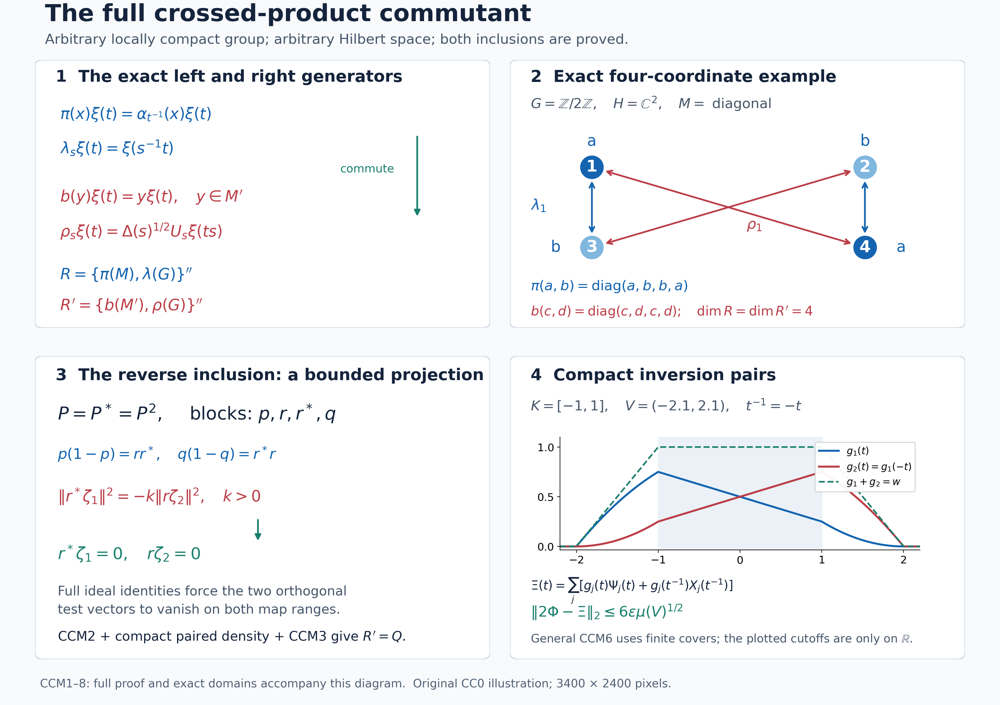

# The normal crossed-product commutant for arbitrary locally compact groups

*Original local reconstruction, GPT-6.1 Sol (OpenAI), Ultra, 2026-10-04. New expression: CC0-1.0 to the extent of rights held.*

Throughout, \(G\) is an arbitrary locally compact Hausdorff group. Its left Haar measure satisfies \(\mu(Es)=\Delta(s)\mu(E)\); consequently \(\int f(ts)\,dt=\Delta(s)^{-1}\int f\) and \(\int f(t^{-1})\,dt=\int f(t)\Delta(t)^{-1}\,dt\). We use scalar products linear in the first variable. No countability, separability, finite weight, or invariant state is assumed.

The actual earlier inputs are [CF1](OA-FLOW-CF.md#oa-flow.cf.1) (norm separation and maximal principle), [CF6](OA-FLOW-CF.md#oa-flow.cf.6) and [CF8/10](OA-FLOW-CF.md#oa-flow.cf.8) (continuous calculus and complete Hilbert constructions), [CP1–6](OA-FLOW-CP.md#oa-flow.cp.1) (concrete von Neumann topology and predual duality), [BD1/4](OA-FLOW-BD.md#oa-flow.bd.1) (bicommutant density and bounded strong* approximation), [H0](OA-FLOW-TOPOLOGY.md#l138-h0) (compact cutoffs and finite partitions), [HR3/5/8/9](OA-FLOW-HR.md#hr-03) (qualified Radon-product integration and both Haar conventions), [L24 Sections 2–4](OA-FLOW-L24.md#oa-flow.grp.vectorintegration) (exact Haar changes, continuous vector integration and Hilbert tensor), [AT1–6](OA-FLOW-AT.md#oa-flow.at.1) (joint strong* continuity on bounded sets and normal integration), and [NR1–4](OA-FLOW-NR.md#oa-flow.nr.1) (standard implementation, normal faithful regular representation, and amplification/compression independence). Every additional commutation or density assertion is proved below. Related treatments are Haagerup, [*On the dual weights for crossed products of von Neumann algebras I*](https://journals.msp.org/mscand/article/view/1879), Math. Scand. 43 (1978), §§1–2 and Theorem 2.1; Van Daele, [*A framework to study commutation problems*](https://www.numdam.org/item/BSMF_1978__106__289_0.pdf), Bull. Soc. Math. France 106 (1978), §§2–4; and Rousseau and Van Daele, [*Crossed products of commutation systems*](https://gdz.sub.uni-goettingen.de/id/PPN235181684_0239?tify=%7B%22pages%22%3A%5B13%5D%7D), Math. Ann. 239 (1979). Citations supply context; the proofs are the local arguments below.

## CCM0. The exact statement and the two concrete models

First suppose \(M\subseteq B(H)\) and a strongly continuous unitary representation \(s\mapsto U_s\) implements \(\alpha_s(x)=U_sxU_s^*\). On \(K=L^2(G,H)\), the completed space of compactly supported continuous vector fields, put

\[
 (\pi(x)\xi)(t)=\alpha_{t^{-1}}(x)\xi(t),\qquad
 (\lambda_s\xi)(t)=\xi(s^{-1}t),\qquad
 R=\{\pi(M),\lambda(G)\}'' .                         \tag{CCM1}
\]
The normal crossed-product commutant theorem is

\[
 R'=\{b(M'),\rho(G)\}'',\qquad
 (b(y)\xi)(t)=y\xi(t),\quad
 (\rho_s\xi)(t)=\Delta(s)^{1/2}U_s\xi(ts).             \tag{CCM2}
\]
Both representations of the coefficient algebras are faithful and normal. In particular, the right generators use \(U_s\), the order \(ts\), and the positive half power of \(\Delta(s)\).

An arbitrary point-ultraweakly continuous normal action on an arbitrary concretely represented \(M\) need not have an implementation on that particular \(H\). Its regular representation still exists by NR3. In this case CCM8 gives its commutant as an explicit compressed amplification of (CCM2) in the standard model. Thus (CCM2) does not conceal an extra spatiality assumption on the original representation. When an implementation on \(H\) is given, it holds directly on that \(H\).

CCM0 is the theorem statement. Its proof is CCM1–8, not an earlier proved premise.

## CCM1. A full bounded system on every concrete von Neumann algebra

For a vector \(\xi\), the projection onto \(\overline{MM'\xi}\) is central: its range reduces both \(M\) and \(M'\), so the projection belongs to \(M'\cap M\). Choose a maximal family \((\xi_i)_{i\in I}\) whose nonzero central projections \(e_i=[MM'\xi_i]\) are orthogonal. Their supremum is \(1\): a vector in a nonzero complementary central corner would add another member. All sums below are Hilbert orthogonal sums over arbitrary index sets.

Define left ideals and their maps by

\[
 N=\{a\in M:\sum_i\|a\xi_i\|^2<\infty\},\quad
 N'=\{b\in M':\sum_i\|b\xi_i\|^2<\infty\},\quad
 \eta(a)=\sum_i a\xi_i,\quad \eta'(b)=\sum_i b\xi_i.       \tag{CCM3}
\]
The sums are orthogonal because \(e_i\) is central. The maps are linear, \(N,N'\) are left ideals, and

\[
 \eta(xa)=x\eta(a),\quad \eta'(yb)=y\eta'(b),\quad
 b\eta(a)=a\eta'(b) \quad(a\in N,b\in N').              \tag{CCM4}
\]
For the last equality take the finite sums first, use commutation, and pass in Hilbert norm; boundedness of \(a,b\) permits both limits. Write \(A=N\cap N^*\), \(B=N'\cap(N')^*\). These are nondegenerate algebras closed under adjoint, because \(N^*N\subseteq A\), and similarly on the right. For every finite \(J\subseteq I\), \(e_J=\sum_{i\in J}e_i\) belongs to both \(A\) and \(B\), and \(e_J\to1\) strongly*. Thus \(A''=M\), \(B''=M'\). Moreover \(B\eta(A)\) is dense in \(H\): it contains \(y x\xi_i\) for every \(x\in M,y\in M'\), by using \(xe_i,ye_i\).

The following exact characterization is useful:

\[
 \begin{split}
 N'&=\{b\in M':\exists\zeta\in H\quad a\zeta=b\eta(a)
                         \text{ for every }a\in A\},\\
 N&=\{a\in M:\exists\zeta\in H\quad b\zeta=a\eta'(b)
                         \text{ for every }b\in B\}.
 \end{split}                                                     \tag{CCM5}
\]
Indeed testing with \(e_i\) gives \(e_i\zeta=b\xi_i\), respectively \(a\xi_i\); orthogonal summation proves membership and identifies the vector. Conversely (CCM4) proves the required equations. Applying (CCM5) to an operator and its adjoint characterizes \(B\), respectively \(A\), by two such vector equations. We call this property fullness. Injectivity of these vector maps is not required and is not asserted. For example, when \(M=B(\mathbb C^2)\), \(M'=\mathbb C1\), and a single nonzero \(\xi\) has \([MM'\xi]=1\), a nonzero projection annihilating \(\xi\) still has \(\eta(a)=a\xi=0\). Fullness in (CCM5) is the exact membership-and-vector characterization used below; it does not identify operators from their vector-map values.

Put \(E=\overline{\eta(A)}\), \(F=\overline{\eta'(B)}\). These also equal the closures of \(\eta(N)\), \(\eta'(N')\), since central truncation \(ae_J\) belongs to \(A\) and \(\eta(ae_J)=e_J\eta(a)\to\eta(a)\). The projections onto \(E,F\) belong to \(M',M\), respectively, by their left-module invariance. Notice that neither range is assumed to be all of \(H\).

## CCM2. The two-system projection lemma, proved locally

We need the preceding full-system properties for two systems \((A,B,\eta,\eta')\) and \((C,D,\gamma,\gamma')\) on the same \(H\), with \(A''=C''=M\), \(B''=D''=M'\). Their left ideals have the characterization (CCM5), their maps respect left multiplication, and each algebra has a bounded strong* approximate identity. The systems constructed in CCM1 and any unitary transport of them have all these properties.

For \(k>0\), work in \(H\oplus\overline H\), where the second scalar product is reversed. The linear spans of the pairs

\[
 (c^*\eta(a),k a^*\gamma(c)),\qquad
 (b^*\gamma'(d),-d^*\eta'(b))                         \tag{CCM6}
\]
are jointly dense in

\[
 \overline{\eta(A)+\gamma'(D)}\ \oplus\
 \overline{\eta'(B)+\gamma(C)}.                       \tag{CCM7}
\]
Here and below the second displayed space is regarded as a conjugate Hilbert space. To prove the assertion, let \((\zeta_1,\zeta_2)\) be orthogonal to (CCM6). Precisely,

\[
 \langle\zeta_1,c^*\eta(a)\rangle
       +k\langle a^*\gamma(c),\zeta_2\rangle=0,
 \qquad
 \langle b\zeta_1,\gamma'(d)\rangle
       =\langle\eta'(b),d\zeta_2\rangle.              \tag{CCM8}
\]
In the ordinary \(H\oplus H\), let \(P\) project onto the closed linear span of \((c\zeta_1,\gamma(c))\). This space reduces the diagonal action of \(C\), so
\(P=\begin{pmatrix}p&r\\r^*&q\end{pmatrix}\) has entries in \(M'\). Membership of its generating vectors and the first equation in (CCM8) give

\[
 \begin{array}{ll}
 c(1-p)\zeta_1=r\gamma(c),&c r^*\zeta_1=(1-q)\gamma(c),\\
 p\eta(a)=-k a r\zeta_2,&r^*\eta(a)=-k a q\zeta_2.
 \end{array}                                                       \tag{CCM9}
\]
The ideal characterization therefore gives

\[
 r,1-q\in D^0,\quad
 \gamma'(r)=(1-p)\zeta_1,\quad
 \gamma'(1-q)=r^*\zeta_1;
 \qquad
 p,r^*\in B^0,\quad
 \eta'(p)=-k r\zeta_2,\quad
 \eta'(r^*)=-k q\zeta_2,                              \tag{CCM10}
\]
where \(B^0,D^0\) denote the corresponding whole left ideals. The second equation of (CCM8) extends to these ideals: for \(b\in B^0\) replace it by \(b_j^*b\in B\), where \(b_j^*\to1\) bounded strongly*, and use \(\eta'(b_j^*b)=b_j^*\eta'(b)\). Do the same for \(d\). This is a Hilbert norm passage, not continuity of an unbounded map in operator topology.

Apply the extended equation with \(b=p,d=r\). It yields
\[
 \langle p\zeta_1,(1-p)\zeta_1\rangle
       =-k\|r\zeta_2\|^2.
\]
Since \(P^2=P\), \(p(1-p)=rr^*\); both sides force
\(r^*\zeta_1=0\), \(r\zeta_2=0\). Thus \(\gamma'(1-q)=0\), \(\eta'(p)=0\). The left-module identities and \(q(1-q)=r^*r\), \(p(1-p)=rr^*\) then give \(r\gamma(c)=0\), \(r^*\eta(a)=0\). Equation (CCM9) implies \(p\zeta_1=\zeta_1\), \(q\zeta_2=0\). It follows that \(\zeta_1\perp\eta(A)\): \(p\eta(a)=a\eta'(p)=0\). Likewise \(\zeta_2\perp\gamma(C)\): \((1-q)\gamma(c)=c\gamma'(1-q)=0\).

Interchange the systems with their right partners: use \((D,C,\gamma',\gamma)\), \((B,A,\eta',\eta)\), replace \(\zeta_2\) by \(-k\zeta_2\), and \(k\) by \(k^{-1}\). Equations (CCM8) take the identical form. The already proved conclusion gives \(\zeta_1\perp\gamma'(D)\), \(\zeta_2\perp\eta'(B)\). This proves (CCM7). The pairs in (CCM6) lie in that space because their four range closures reduce the appropriate coefficient algebras.

In particular, for a unitary \(u\) implementing an automorphism \(\beta\) of \(M\), transport the first system by \(u\), then undo \(u\) in the second coordinate of (CCM6). We obtain the following paired approximation, including the indicated whole target spaces:

\[
 \begin{split}
 &(\beta(c^*)\eta(a),k\beta^{-1}(a^*)\eta(c)),\\
 &(b^*u\eta'(d),-d^*u^*\eta'(b))
 \end{split}
 \quad\text{span densely}\quad
 \overline{E+uF}\oplus\overline{E+u^*F}.              \tag{CCM11}
\]
This follows by taking \(C=\beta(A),D=\operatorname{Ad}(u)(B)\), \(\gamma(\beta(a))=u\eta(a)\), \(\gamma'(\operatorname{Ad}(u)(b))=u\eta'(b)\). The change of coordinates is unitary also on the conjugate second space.

## CCM3. A bounded commutation criterion with both inclusions

Let \(A_1,B_1\) be commuting nondegenerate algebras closed under adjoint on \(K\), with linear maps \(v,w\) satisfying

\[
 b v(a)=a w(b),\quad
 \overline{B_1v(A_1)}=K,
 \quad P_{\overline{v(A_1)}}\in B_1'',
 \quad
 v((A_1)_{\rm sa})+i w((B_1)_{\rm sa})
 \text{ dense in }v(A_1)+w(B_1)\text{ over }\mathbb R. \tag{CCM12}
\]
Then \(A_1'=B_1''\). We prove this rather than importing a commutation theorem. Nondegeneracy first gives \(v(a_1a_2)=a_1v(a_2)\) by multiplying both sides by every \(b\in B_1\); the analogous identity holds for \(w\).

The closed real span of \(v(a^*a)\) contains every \(v(a)\) with \(a=a^*\). Indeed \(a^n v(a)=v(a^{n+1})\) belongs to that span for every \(n\geq1\): even powers are squares, and odd powers at least three are differences of two squares. Real polynomials with zero constant term approximate \(t^2/(t^2+\varepsilon)\) uniformly on the spectrum of \(a\); this follows from the already proved CF continuous calculus. Passing first in operator norm and then strongly as \(\varepsilon\downarrow0\) gives the range projection of \(a\) applied to \(v(a)\). For this strong limit no measurable calculus is needed: \(q_\varepsilon(a)=a^2(a^2+\varepsilon)^{-1}\) is zero on \(\ker a\), has norm at most one, and \(\|(1-q_\varepsilon(a))a\xi\|\leq\sqrt{\varepsilon}\|\xi\|/2\). Its limit is therefore the identity on \(\overline{\operatorname{ran}a}\), by density and the common bound. That projection fixes \(v(a)\), since \(b v(a)=a w(b)\) and \(B_1\) is nondegenerate. This proves the assertion.

Consequently \(V=\overline{v((A_1)_{\rm sa})}^{\mathbb R}\) and \(W=\overline{i w((B_1)_{\rm sa})}^{\mathbb R}\) are real orthogonal: for \(b=b^*\),
\(\langle v(a^*a),w(b)\rangle=\langle v(a),b v(a)\rangle\) is real. The last condition in (CCM12) embeds the closure of \(v(A_1)+w(B_1)\) in the closed real sum \(V\oplus W\).

Take \(x=x^*\in A_1'\), \(y=y^*\in B_1'\), and arbitrary \(a\in A_1,b\in B_1\). The vector \(a^*y v(a)\) belongs to \(\overline{v(A_1)}\), by the projection condition, and is real orthogonal to \(W\): for \(b_0=b_0^*\),
\[
 \langle w(b_0),a^*y v(a)\rangle
       =\langle b_0v(a),y v(a)\rangle\in\mathbb R.
\]
Thus it lies in \(V\). On the other hand \(\langle v(a_0),b^*xw(b)\rangle\) is real for \(a_0=a_0^*\), because it equals \(\langle a_0w(b),xw(b)\rangle\). By real norm closure,

\[
 \langle a^*y v(a),b^*x w(b)\rangle
       =\langle y b v(a),x b v(a)\rangle\in\mathbb R.  \tag{CCM13}
\]
The diagonal form of \(xy-yx\) therefore vanishes on \(b v(a)\). Polarize first in \(a\), then in \(b\), to obtain its vanishing on every pair in the linear span of \(B_1v(A_1)\). Density gives \(xy=yx\). Linear decomposition into self-adjoint parts shows \(A_1'\subseteq B_1''\). The easy commutation inclusion \(B_1''\subseteq A_1'\) proves equality. This argument does not require either map to have dense range on its own.

## CCM4. Compact coefficient integrals and their exact algebra

Let \(\mathcal C\) be the bounded, compactly supported strong* continuous maps \(x:G\to M\). Define the normal weak integral

\[
 L_x=\int_G\lambda_s\pi(x(s))\,ds.                    \tag{CCM14}
\]
On a compactly supported continuous vector field, the operator-valued integrand acts continuously in Hilbert norm and has compact support. Its integral is a genuine Bochner vector integral; its norm is bounded by \(\mu(\operatorname{supp}x)\sup\|x(s)\|\). Duality and vector tests give the same bounded operator as (CCM14). Thus no global measurability or countable basis is used. The change of variable \(s=tu\), justified by left invariance, gives

\[
 (L_x\xi)(t)=\int_G\alpha_u(x(tu))\xi(u^{-1})\,du.
                                                               \tag{CCM15}
\]
Joint strong* continuity on bounded sets proves continuity of this compactly supported vector field. In particular all calculations can first be made on the dense compact tensor core.

Fubini for compact continuous vector integrands, the covariance relation, and the two Haar changes above give

\[
 \begin{split}
 L_xL_y&=L_{x\star y},\qquad
 (x\star y)(t)=\int_G\alpha_u(x(tu))y(u^{-1})\,du,\\
 L_x^*&=L_{x^\#},\qquad
 x^\#(t)=\Delta(t)^{-1}\alpha_{t^{-1}}(x(t^{-1})^*).
 \end{split}                                                    \tag{CCM16}
\]
For the product, directly expand \(\lambda_s\pi(x(s))\lambda_v\pi(y(v))=\lambda_{sv}\pi(\alpha_{v^{-1}}(x(s))y(v))\), then put \(s=tu,v=u^{-1}\). For the adjoint expand \(\pi(x(s)^*)\lambda_{s^{-1}}=\lambda_{s^{-1}}\pi(\alpha_s(x(s)^*))\) and use inversion. These formulas show \(\mathcal C\) is an algebra closed under \(\#\); the product has support in \(\operatorname{supp}x\operatorname{supp}y\). Continuity of it and its adjoint follows by integrating the joint strong* continuous bounded integrand on a fixed compact set in a neighborhood of each \(t\). The required uniform convergence on each tested vector follows from a finite compact cover, so this passage also works for nets.

Let \(P\subseteq\mathcal C\) consist of maps with \(x(t)\in N\) and \(\eta(x(t))\) norm-continuous. It is a left ideal in \(\mathcal C\), with

\[
 \eta((y\star x)(t))
   =\int_G\alpha_u(y(tu))\eta(x(u^{-1}))\,du
   =(L_y\eta(x))(t).                                  \tag{CCM17}
\]
To justify membership rather than assume closedness of \(\eta\), apply every \(b\in B\) to the Hilbert integral. Commutation and (CCM4) give \((y\star x)(t)\eta'(b)\); (CCM5) gives the exact membership and value. The vector integral is continuous with compact support, as above. Construct \(P'\), \(L'_y\), \(\pi'\) for \(M'\) and \(\alpha'_s=\operatorname{Ad}(U_s)|_{M'}\) in the same manner.

For later density we have the explicit two-sided coefficients

\[
 x(t)=f(t)\alpha_{t^{-1}}(a^*)c\quad(a,c\in A,f\in C_c(G)),
 \quad
 \eta(x(t))=f(t)\alpha_{t^{-1}}(a^*)\eta(c),\quad
 L_x=\pi(a^*)L_f\pi(c),                               \tag{CCM18}
\]
where \(L_f=\int f(s)\lambda_s\,ds\). Both \(x\) and \(x^\#\) belong to \(P\), by (CCM16) and the module property; its adjoint swaps \(a,c\) and replaces \(f(t)\) by \(\Delta(t)^{-1}\overline{f(t^{-1})}\).

## CCM5. The commuting systems on the regular Hilbert space

The linear unitary

\[
 (Z\xi)(t)=\Delta(t)^{-1/2}U_t^*\xi(t^{-1})             \tag{CCM19}
\]
is isometric by inversion, and \(Z^2=1\). Direct substitution gives

\[
 Z\pi'(y)Z=b(y),\qquad Z\lambda_sZ=\rho_s.
                                                               \tag{CCM20}
\]
These generators commute with \(\pi(x)\) and \(\lambda_t\). For example \(\rho_s\pi(x)\rho_s^*\xi(t)=U_s\alpha_{(ts)^{-1}}(x)U_s^*\xi(t)=\alpha_{t^{-1}}(x)\xi(t)\), and left and right translations commute. Normality of \(b\) is the constant amplification; normality of \(\pi'\) is NR3 applied to \(M'\). The factors in \(\rho\) are unitary by the right Haar identity, and \(\rho_s\rho_t=\rho_{st}\).

Set

\[
 A_1=\{L_x:x\in P, x^\#\in P\},\qquad
 B_1=Z\{L'_y:y\in P', y^\#\in P'\}Z .               \tag{CCM21}
\]
They are commuting algebras closed under adjoint. Define

\[
 v(L_x)=\eta(x),\qquad w(ZL'_yZ)=Z\eta'(y).            \tag{CCM22}
\]
These definitions are well-defined. In fact for all \(x\in P,y\in P'\), (CCM15), (CCM4), and the substitution \(r=st\) give the identity

\[
 L_xZ\eta'(y)=ZL'_yZ\eta(x).                          \tag{CCM23}
\]
One can check it pointwise: the left side at \(s\) is
\(\int\Delta(t)^{1/2}U_t x(st)\eta'(y(t))\,dt\).
Expanding the right side by (CCM15) and inversion gives the identical integral. All vector integrands are compactly supported and continuous; (CCM4) applies to every pair of their finite-ideal values. If \(L_x=0\), (CCM23) gives \(ZL'_yZ\eta(x)=0\) for every \(y\in P'\). Their operators act nondegenerately: (CCM18) on the right, with coefficient approximate identities and Haar bumps, already generates the right coefficient algebra and its group. Hence \(\eta(x)=0\), establishing well-definedness; the symmetric argument treats \(w\). It also proves the module identity in (CCM12).

For clarity, that nondegeneracy and the exact generated algebras follow without the desired commutant theorem. In (CCM18) take \(a=c=e_J\to1\) bounded strongly*, giving \(L_f\) as a strong limit of operators in \(A_1\). Haar bumps about the identity give \(L_f\to1\); bumps about \(s\) give \(\lambda_s\). Keeping arbitrary \(c\in A\) and taking only \(a=e_J\), then an identity bump, gives \(\pi(c)\); bounded strong* density of \(A\) gives \(\pi(M)\). Normality and the strong* bounded-net continuity of \(\pi\) are NR3 and CP. Therefore

\[
 A_1''=R,\qquad B_1''=Q:=\{b(M'),\rho(G)\}'',\qquad Q\subseteq R'.
                                                               \tag{CCM24}
\]
This argument also supplied the nondegeneracy needed for (CCM23), without circular use of (CCM22).

The map ranges have the exact closures

\[
 \overline{v(A_1)}=L^2(G,E),\qquad
 \overline{w(B_1)}=ZL^2(G,F).                          \tag{CCM25}
\]
The first inclusion follows from \(\eta(N)\subseteq E\). For the reverse, use (CCM18) with \(a=e_J\): its vector is \(f(t)\alpha_{t^{-1}}(e_J)\eta(c)\), tending in \(L^2\) to \(f(t)\eta(c)\). The convergence is uniform on each compact support because \(U_t\eta(c)\) has compact norm range and bounded strong convergence of \(e_J\) is uniform on a compact set of vectors, by a finite net of norm balls. Dense compact tensors then prove equality. The second equality is identical after \(Z\).

The first range projection is \(b(P_E)\in Q\), since \(P_E\in M'\). The second is \(Zb(P_F)Z=\pi(P_F)\in R\). Finally \(B_1v(A_1)\) is dense in \(K\): [BD1/4](OA-FLOW-BD.md#oa-flow.bd.1) approximates each member of \(B_1''\) strongly by members of \(B_1\), so its closure contains \(b(M')L^2(G,E)\) by (CCM24), and \(\overline{M'E}=H\) by CCM1. Thus all of (CCM12) except its real density has been verified.

## CCM6. Real density by simultaneous inversion pairs

It suffices, by (CCM25), to approximate every

\[
 \Phi(t)=f(t)\eta(a)+\Delta(t)^{-1/2}h(t^{-1})U_t^*\eta'(b),
 \qquad a\in A,b\in B,f,h\in C_c(G),                  \tag{CCM26}
\]
in the closed real span of \(v((A_1)_{\rm sa})+i w((B_1)_{\rm sa})\). Fix \(s\in G\). Apply (CCM11) with \(\beta=\alpha_{s^{-1}}\), \(u=U_s^*\), \(k=\Delta(s)\). Its target contains \((\Phi(s),\Phi(s^{-1}))\). Hence, to any prescribed error \(\varepsilon>0\), finite sums of the following continuous pairs approximate those two values:

\[
 \begin{split}
 \Psi_s(t)&=\sum_j\alpha_{t^{-1}}(a_j^*)\eta(c_j)
                  +\sum_l d_l^*U_t^*\eta'(b_l),\\
 X_s(t)&=\sum_j\Delta(t)\alpha_t(c_j^*)\eta(a_j)
                  -\sum_l b_l^*U_t\eta'(d_l).
 \end{split}                                                     \tag{CCM27}
\]
The finite sums in the two lines are paired, with \(a_j,c_j\in A\), \(b_l,d_l\in B\). Complex coefficients in the conjugate-space span are absorbed into one member of each pair; this multiplies its first component by the coefficient and its second by the conjugate coefficient. Thus (CCM27) represents every finite combination required by (CCM11).

For any \(g\in C_c(G)\), the field

\[
 g(t)\Psi_s(t)+\overline{g(t^{-1})}X_s(t^{-1})          \tag{CCM28}
\]
belongs to the required real span. Its first part comes from \(L_x+L_x^*\), with \(x(t)=g(t)\alpha_{t^{-1}}(a_j^*)c_j\), by (CCM18). Its second part comes from \(ZL'_yZ-(ZL'_yZ)^*\), with
\[
 y(r)=\Delta(r)^{-1/2}g(r^{-1})\alpha'_{r^{-1}}(d_l^*)b_l.
\]
Indeed \(Z\eta'(y)(t)=g(t)d_l^*U_t^*\eta'(b_l)\), whereas \(Z\eta'(y^\#)(t)=\overline{g(t^{-1})}b_l^*U_t^*\eta'(d_l)\). Both \(y,y^\#\in P'\) by (CCM18). An operator minus its adjoint is \(i\) times a self-adjoint operator, which proves the assertion with the correct sign.

Here is the full compact passage. Choose a symmetric compact \(K_0\) containing the support of \(\Phi\), and a symmetric relatively compact open \(V\supseteq K_0\). For every \(s\in K_0\), continuity gives an open \(V_s\subseteq V\) such that throughout \(V_s\) the errors in the first approximation at \(t\) and the second at \(t^{-1}\) are less than \(3\varepsilon\). Choose a finite subcover and nonnegative compact continuous functions \(g_j\), supported in its members, with \(\sum g_j=1\) on \(K_0\) and \(0\leq\sum g_j\leq1\) everywhere. The earlier topology/HR proof supplies these finite partitions for arbitrary locally compact Hausdorff spaces.

Sum (CCM28) with these real \(g_j\). The resulting \(\Xi\) is in the real span and satisfies

\[
 \|2\Phi(t)-\Xi(t)\|\leq6\varepsilon\,1_V(t),\qquad
 \|2\Phi-\Xi\|_2\leq6\varepsilon\mu(V)^{1/2}.         \tag{CCM29}
\]
The two partition sums both equal one on the support of \(\Phi\), because \(K_0\) is symmetric. Outside \(V\), both sums vanish because \(V=V^{-1}\). These observations justify the bound even outside \(K_0\); no exhaustions, measurable-net dominated convergence, or countable cover is used. Letting \(\varepsilon\downarrow0\), then dividing by two, proves the last condition in (CCM12).

## CCM7. The commutant, its normality and a useful twist

Apply CCM3 to the systems just constructed. Equations (CCM24)–(CCM29) give

\[
 R'=Q=Z\{\pi'(M'),\lambda(G)\}''Z.                    \tag{CCM30}
\]
This proves the reverse inclusion, not only the commuting generators. The right covariant system has
\(\rho_s b(y)\rho_s^*=b(\alpha'_s(y))\), and (CCM30) identifies its entire generated von Neumann algebra normally and faithfully with the normal regular crossed product of \(M'\) for \(\alpha'\). The identification is unitary conjugation; its normality and that of its inverse hold for every ultraweak net by CP, rather than only for increasing sequences.

The unitary \((W\xi)(t)=U_t\xi(t)\) gives the equivalent formulas

\[
 W\pi(x)W^*=x\otimes1,\quad W\lambda_sW^*=U_s\lambda_s,
 \quad Wb(y)W^*\xi(t)=\alpha'_t(y)\xi(t),\quad
 W\rho_sW^*=r_s,\quad r_s\xi(t)=\Delta(s)^{1/2}\xi(ts).
                                                               \tag{CCM31}
\]
Substitute \(U_{s^{-1}t}=U_s^*U_t\) and \(U_{ts}=U_tU_s\) to verify the two group formulas. Thus the constant-left-coefficient model and the twisted-right-coefficient model are the same theorem with explicit coordinates.

## CCM8. Arbitrary original representations, without a hidden spatial action

For an arbitrary normal action on a concrete \(M\subseteq B(H)\), take NR1's standard representation \(M_0\subseteq B(H_0)\) and canonical strongly continuous implementation \(U^0\). NR4 explicitly realizes the original faithful normal representation as a reducing full-central-support subspace \(EH\!_{\rm amp}\) of \(H\!_{\rm amp}=H_0\otimes\ell^2(I)\), with \(E\in(M_0\otimes1)'\). Denote the intertwining unitary by \(V:H\to EH\!_{\rm amp}\). All index sets may be arbitrary. On the regular spaces, the constant fibre map \(\mathcal V\xi(t)=V\xi(t)\) identifies the original regular crossed product with the compression of \(R_0\otimes1\) to \(\mathcal E=E\otimes1_{L^2(G)}\). The projection \(\mathcal E\) commutes with all left generators because it commutes with every \(\alpha_{t^{-1}}(M_0)\otimes1\) and is constant in \(t\).

For completeness, matrix entries prove the exact amplification commutant

\[
 (R_0\otimes1_{\ell^2(I)})'=Q_0\,\overline\otimes\,B(\ell^2(I)),
 \quad Q_0=\{b(M_0'),\rho^0(G)\}''.                    \tag{CCM32}
\]
An operator commutes with \(R_0\otimes1\) precisely when all its matrix entries belong to \(R_0'=Q_0\), by testing coordinate vectors. Its finite matrix compressions then belong to the right-hand algebra, are uniformly bounded by its norm, and converge strongly, as do their adjoints. Conversely each right-hand generator commutes. This works with the net of all finite subsets of \(I\).

If \(N\) is any represented algebra and \(e\in N'\), every operator on \(eK\) commuting with \(eNe\) extends by zero on \((1-e)K\) to an operator commuting with \(N\). Therefore \((eNe)'_{eK}=eN'e\); both inclusions follow from this extension, with no unjustified compression homomorphism on \(N'\). Hence the arbitrary concrete regular commutant is

\[
 R_H'=\mathcal V^*\,
 \mathcal E\bigl(Q_0\,\overline\otimes\,B(\ell^2(I))\bigr)\mathcal E
 \,\mathcal V.                                        \tag{CCM33}
\]
This is an exact normal represented corner, including all its compressed finite matrix entries and their bounded strong limits. It is not a claim that individual \(\rho_s^0\) preserve \(E\), nor that compressing just individual generators is a homomorphism. NR4 proves that the compressed left representation is faithful and normally identifies the original crossed product; unitary transfer and the zero-extension argument prove the precise right commutant on its actual Hilbert space. If a spatial implementation on the original \(H\) exists, CCM1–7 directly give (CCM2) there without using this corner model. If \(H=0\), both regular spaces and algebras are zero and all assertions have their empty interpretation.

## CCM9. Exact finite examples and exercises

On \(H=\mathbb C^2\), \(M\) is the diagonal algebra. Let \(G=\mathbb Z/2\mathbb Z=\{0,1\}\), counting Haar measure, and \(U_1=\begin{pmatrix}0&1\\1&0\end{pmatrix}\). On \(K=H\oplus H\), ordered by \(t=0,1\),

\[
 \pi(\operatorname{diag}(a,b))=\operatorname{diag}(a,b,b,a),\quad
 \lambda_1=\begin{pmatrix}0&I_2\\I_2&0\end{pmatrix},\quad
 b(\operatorname{diag}(c,d))=\operatorname{diag}(c,d,c,d),\quad
 \rho_1=\begin{pmatrix}0&U_1\\U_1&0\end{pmatrix}.        \tag{CCM34}
\]
The left invariant subspaces spanned by coordinates \((1,3)\), \((2,4)\) carry two equivalent full \(M_2(\mathbb C)\) representations, related by swapping their two coordinates. Thus \(R\) has complex dimension four, and its commutant has dimension four with multiplicity two. The displayed right diagonal and flip generate that whole commutant. This is a finite exact illustration, not a reduction of the arbitrary-group theorem to a finite group.

1. Check (CCM20) directly, including the modular function. **Solution.** In \(Z\pi'(y)Z\), the factors \(\Delta(t)^{-1/2}\Delta(t^{-1})^{-1/2}\) cancel and \(U_t^*\alpha'_t(y)U_t=y\). For \(Z\lambda_sZ\), the second argument is \(s^{-1}t^{-1}=(ts)^{-1}\); its scalar factor is \(\Delta(t)^{-1/2}\Delta(ts)^{1/2}=\Delta(s)^{1/2}\), and \(U_t^*U_{ts}=U_s\). These give exactly (CCM20).

2. Why is a symmetric open \(V\) used in (CCM29)? **Solution.** The second partition term is supported in \(V^{-1}\). Taking \(V=V^{-1}\) bounds both terms on the same finite-measure set. An unsymmetrized \(V\) would require the bound on \(V\cup V^{-1}\), not on \(V\) alone.

3. In (CCM34), solve the commutant equations directly. **Solution.** Commutation with all \(\pi(a,b)\) leaves matrix entries only within equal-label coordinate classes \(\{1,4\}\), \(\{2,3\}\). Commutation with \(\lambda_1\) identifies the corresponding entries under \(1\leftrightarrow3\), \(2\leftrightarrow4\). The four independent resulting matrices are \(b(E_{11}),b(E_{22}),b(E_{11})\rho_1,b(E_{22})\rho_1\). They are precisely the right algebra in (CCM34).

4. Explain why an arbitrary action does not supply a unitary \(U_s\) on an arbitrary chosen faithful representation. **Solution.** Spatiality depends on the representation. NR1 supplies a canonical implementation in standard form; NR4 transports the left crossed product to the original representation by a reducing amplification corner. Formula (CCM33), whose zero-extension proof is local, gives the commutant in that representation without assuming an unavailable \(U_s\).

The proved scope is the arbitrary-LCH normal regular commutant theorem. No dual-weight existence, general group duality, spectral synthesis, induction theorem, or classification statement is asserted here.

## Why the right generators give the whole commutant

The upper left panel states the actual arbitrary-group theorem [CCM0](OA-FLOW-CCM.md#ccm-0), proved in [CCM1–8](OA-FLOW-CCM.md#ccm-1). The coefficient representation is \(\pi(x)\xi(t)=\alpha_{t^{-1}}(x)\xi(t)\), and the left group is \(\lambda_s\xi(t)=\xi(s^{-1}t)\). The right coefficient is constant, \(b(y)\xi(t)=y\xi(t)\) for \(y\in M'\); its group is \(\rho_s\xi(t)=\Delta(s)^{1/2}U_s\xi(ts)\). With the convention \(\mu(Es)=\Delta(s)\mu(E)\), the norm squared of \(\xi(ts)\) is \(\Delta(s)^{-1}\|\xi\|_2^2\), so the displayed positive half power gives an actual unitary. The operator equality is \(R'=\{b(M'),\rho(G)\}''\), not only containment of the individual right generators. For a nonspatial action in the original representation, the exact represented corner is (CCM33), rather than an assumed \(U_s\) on that Hilbert space.

The upper right panel is the exact finite model [CCM9](OA-FLOW-CCM.md#ccm-9): \(G=\mathbb Z/2\mathbb Z\), counting measure, \(H=\mathbb C^2\), diagonal \(M\), and \(U_1\) exchanges the two coordinate vectors. Coordinate labels \(1,2,3,4\) mean \((0,e_1),(0,e_2),(1,e_1),(1,e_2)\), respectively. Blue vertical arrows show \(\lambda_1:1\leftrightarrow3,2\leftrightarrow4\). Red diagonal arrows show \(\rho_1:1\leftrightarrow4,2\leftrightarrow3\). The blue coefficient labels are exactly \(a,b,b,a\); the constant right labels are \(c,d,c,d\). All arrows are permutations, with \(\Delta=1\). Commutation with the blue diagonal restricts entries of a right operator to the equal-label classes \(\{1,4\}\), \(\{2,3\}\); commutation with the vertical permutation identifies the two class matrices. The four independent right operators are
\[
 b(E_{11}),\quad b(E_{22}),\quad b(E_{11})\rho_1,
 \quad b(E_{22})\rho_1.
\]
They generate the full four-dimensional commutant. The left algebra acts as two equivalent full two-dimensional matrix representations on the subspaces with coordinate sets \(\{1,3\}\), \(\{2,4\}\); hence its complex dimension also is four. These are dimensions of represented operator algebras, not a claim that the two-dimensional diagonal coefficient algebra is a factor.

The lower left panel isolates [CCM2](OA-FLOW-CCM.md#ccm-2)'s bounded graph-projection mechanism. The projection onto the closed span of \((c\zeta_1,\gamma(c))\) in the ordinary \(H\oplus H\) is \(P=\begin{pmatrix}p&r\\r^*&q\end{pmatrix}\). Its entries lie in the coefficient commutant. From \(P^2=P\),
\[
 p(1-p)=rr^*,\qquad q(1-q)=r^*r.
\]
The exact whole-ideal vector identities, including their proved Hilbert norm extensions, give
\[
 \|r^*\zeta_1\|^2=-k\|r\zeta_2\|^2,
 \qquad k>0.
\]
Thus both norms vanish. The remaining projection equations force \(\zeta_1\) and \(\zeta_2\) to be orthogonal to each of the two respective map ranges. This proves paired density in \(H\oplus\overline H\) at exactly those range closures. It does not assume a cyclic or separating vector for \(M\).

The lower right panel illustrates [CCM6](OA-FLOW-CCM.md#ccm-6)'s simultaneous inversion partition on the additive real group, where inversion is \(t\mapsto-t\). Its exact numerical choices are
\[
 K=[-1,1],\quad V=(-2.1,2.1),\quad
 w(t)=\max(0,\min(1,2-|t|)),\quad
 g_1(t)=\frac{2-t}{4}w(t),\quad
 g_2(t)=\frac{2+t}{4}w(t).
\]
Both functions are nonnegative, are supported in \([-2,2]\subset V\), and satisfy \(g_1+g_2=w\), \(0\leq w\leq1\), \(w=1\) on \(K\), and \(g_1(-t)=g_2(t)\). The plotted two functions demonstrate the symmetric-support step; the general proof chooses as many finite compact cutoffs as its given open cover requires. It neither assumes two cutoffs suffice for an arbitrary cover nor treats general group inversion as negation.

For the actual general proof, the paired field is
\[
 \Xi(t)=\sum_j\bigl(g_j(t)\Psi_j(t)+g_j(t^{-1})X_j(t^{-1})\bigr),
 \qquad
 \|2\Phi-\Xi\|_2\leq6\varepsilon\mu(V)^{1/2}.
\]
Here the \(g_j\) are real, \(K=K^{-1}\), \(V=V^{-1}\), and \(\Phi\) is supported in \(K\). Each pair comes from a self-adjoint left integral and \(i\) times a self-adjoint right integral, with the signs proved in (CCM28). This supplies the real density needed by [CCM3](OA-FLOW-CCM.md#ccm-3)'s commutation criterion and completes the reverse inclusion.

Related treatments are Van Daele, [*A framework to study commutation problems*](https://www.numdam.org/item/BSMF_1978__106__289_0.pdf) (1978), Rousseau and Van Daele, [*Crossed products of commutation systems*](https://gdz.sub.uni-goettingen.de/id/PPN235181684_0239?tify=%7B%22pages%22%3A%5B13%5D%7D) (1979), and Haagerup, [*On the dual weights for crossed products of von Neumann algebras I*](https://journals.msp.org/mscand/article/view/1879) (1978), Theorem 2.1. The diagram and exact cutoff example are original CC0-1.0 expression to the extent of rights held. Native PNG: 3400×2400; [editable SVG](../assets/general-group-crossed-product-commutant/assets/crossed-product-commutant.svg), [exact data](../assets/general-group-crossed-product-commutant/assets/crossed-product-commutant-data.json), and [reproduction source](../assets/general-group-crossed-product-commutant/render_commutant.py).
