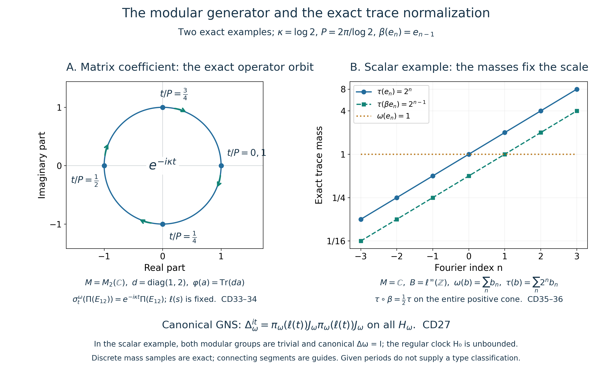

# The modular group of the periodic counting weight and its exact trace conversion

Original independent reconstruction, 2026-10-04. CC0-1.0 to the extent of rights held.

Let \(M\) be an arbitrary von Neumann algebra, let \(\varphi\) be faithful normal semifinite, and assume a **given** \(P>0\) with \(\sigma_P^\varphi=\mathrm{id}\). Put

\[
K=\mathbb R/P\mathbb Z,\qquad \kappa=2\pi/P.
\tag{CD1}
\]
Use the actual construction in [CC](OA-FLOW-CC.md#oa-flow.cc.1), with normalized circle Haar measure \(ds/P\), its arbitrary-Hilbert regular representation and its chosen negative dual generator:

\[
B=(\Pi(M)\cup\{\ell(s):s\in K\})'',\quad
F=\Pi(M)=B^\beta,\quad
\beta(\ell(s))=e^{-i\kappa s}\ell(s).
\tag{CD2}
\]
CC proved the faithful normal semifinite whole-cone counting OVW \(E:B_+\to\widehat F_+\), its exact bounded-value ideals and the faithful normal semifinite scalar weight

\[
\varphi_F=\varphi\circ\Pi^{-1},\qquad
\omega=\widehat{\varphi_F}\circ E,\qquad
\omega\circ\beta=\omega.
\tag{CD3}
\]
Here \(\widehat{\varphi_F}\) is the entire extension in [EP5](OA-FLOW-EP.md#oa-flow.ep.5), including infinite values. No finite-state, separability, countable-decomposability, factor or minimal-period hypothesis is added.

The precise earlier proofs are [GW1–5](OA-FLOW-GW.md#oa-flow.gw.1), [WR3–5](OA-FLOW-WR.md#oa-flow.wr.3), [CI1–3](OA-FLOW-CI.md#oa-flow.ci.1) and [MW4](OA-FLOW-MW.md#oa-flow.mw.4) for full GNS, closed finite-star and modular domains; [EP2–5](OA-FLOW-EP.md#oa-flow.ep.2) for intrinsic extended operations and scalar extension; [OT1–5](OA-FLOW-OT.md#oa-flow.ot.1) for modular restriction of a composed weight; [CZ0](OA-FLOW-CZ.md#oa-flow.cz.0) and [CZ2–7](OA-FLOW-CZ.md#oa-flow.cz.2) for the full finite-domain centralizer test and unbounded perturbation; [SF1](OA-FLOW-SF.md#oa-flow.sf1.full-domains) for exact spectral domains and covariance; and [BD1–5](OA-FLOW-BD.md#oa-flow.bd.1) with [CP](OA-FLOW-CP.md#oa-flow.cp.6) for bounded generator approximation and ultraweak passage. Their source/range bindings are recorded separately. No normal-weight sum theorem or formal Fourier-column model is needed.

The free author passages actually read for comparison are [Hiai, Theorem 8.7, p.71](https://arxiv.org/pdf/2004.02383v1#page=71), [Lemma 9.1, p.81](https://arxiv.org/pdf/2004.02383v1#page=81), and [§10.1, pp.95–98](https://arxiv.org/pdf/2004.02383v1#page=95). This proof uses actual local OT/CZ proofs. It does not assume the external dual-weight modular theorem, its uniqueness assertion, or a standard-form identification of GNS spaces.

Exact individual earlier construction, restriction, perturbation and topology locators: [OA-FLOW.CC.0](OA-FLOW-CC.md#oa-flow.cc.0), [OA-FLOW.CC.1](OA-FLOW-CC.md#oa-flow.cc.1), [OA-FLOW.CC.2](OA-FLOW-CC.md#oa-flow.cc.2), [OA-FLOW.CC.3](OA-FLOW-CC.md#oa-flow.cc.3), [OA-FLOW.CC.4](OA-FLOW-CC.md#oa-flow.cc.4), [OA-FLOW.CC.5](OA-FLOW-CC.md#oa-flow.cc.5), [OA-FLOW.CC.6](OA-FLOW-CC.md#oa-flow.cc.6), [OA-FLOW.CC.7](OA-FLOW-CC.md#oa-flow.cc.7), [OA-FLOW.CC.8](OA-FLOW-CC.md#oa-flow.cc.8), [OA-FLOW.CZ.0](OA-FLOW-CZ.md#oa-flow.cz.0), [OA-FLOW.CZ.1](OA-FLOW-CZ.md#oa-flow.cz.1), [OA-FLOW.CZ.2](OA-FLOW-CZ.md#oa-flow.cz.2), [OA-FLOW.CZ.3](OA-FLOW-CZ.md#oa-flow.cz.3), [OA-FLOW.CZ.4](OA-FLOW-CZ.md#oa-flow.cz.4), [OA-FLOW.CZ.5](OA-FLOW-CZ.md#oa-flow.cz.5), [OA-FLOW.CZ.6](OA-FLOW-CZ.md#oa-flow.cz.6), [OA-FLOW.CZ.7](OA-FLOW-CZ.md#oa-flow.cz.7), [OA-FLOW.OT.1](OA-FLOW-OT.md#oa-flow.ot.1), [OA-FLOW.OT.2](OA-FLOW-OT.md#oa-flow.ot.2), [OA-FLOW.OT.3](OA-FLOW-OT.md#oa-flow.ot.3), [OA-FLOW.OT.4](OA-FLOW-OT.md#oa-flow.ot.4), [OA-FLOW.OT.5](OA-FLOW-OT.md#oa-flow.ot.5), [OA-FLOW.KT.5](OA-FLOW-KT.md#oa-flow.kt.5), [OA-FLOW.BD.1](OA-FLOW-BD.md#oa-flow.bd.1), [OA-FLOW.BD.2](OA-FLOW-BD.md#oa-flow.bd.2), [OA-FLOW.BD.3](OA-FLOW-BD.md#oa-flow.bd.3), [OA-FLOW.BD.4](OA-FLOW-BD.md#oa-flow.bd.4), [OA-FLOW.BD.5](OA-FLOW-BD.md#oa-flow.bd.5), [OA-FLOW.SF.SF1](OA-FLOW-SF.md#oa-flow.sf.sf1), [OA-FLOW.SF.SF2](OA-FLOW-SF.md#oa-flow.sf.sf2), [OA-FLOW.CP.6](OA-FLOW-CP.md#oa-flow.cp.6). The regular clock and the canonical GNS modular operator retain their distinct full domains below.

## CD-0. The actual full GNS and polar domains being used

For the newly constructed \(\omega\), set

\[
N=\{x\in B:\widehat{\varphi_F}(E(x^*x))<\infty\},\qquad
A=N\cap N^*,\qquad m=\operatorname{span}N^*N.
\tag{CD4}
\]
These are its whole finite domains, including elements with an unbounded \(E(x^*x)\). GW supplies the finite extension \(\omega_0\), the Hilbert completion and the faithful normal GNS data \((H_\omega,\pi_\omega,\Lambda_\omega)\). In particular

\[
\langle\Lambda_\omega(x),\Lambda_\omega(y)\rangle
=\omega_0(y^*x)\quad(x,y\in N).
\tag{CD5}
\]
[WR3](OA-FLOW-WR.md#oa-flow.wr.3)–5 applies to this actual faithful n.s.f. weight. On the **entire** dense finite-star range it makes

\[
S_0\Lambda_\omega(x)=\Lambda_\omega(x^*)\quad(x\in A)
\tag{CD6}
\]
closable, proves that this is the full left Hilbert algebra, and proves that \(\Lambda_\omega(m)\) is a graph core for its closure \(S\). This domain is not replaced by a span of proposed Fourier columns.

To state both adjoint domains explicitly, [CI1](OA-FLOW-CI.md#oa-flow.ci.1)–3 gives

\[
\begin{split}
D(S)=\{\xi:\ &\exists x_j\in A,\quad
\Lambda_\omega(x_j)\to\xi,\quad
\Lambda_\omega(x_j^*)\text{ is Cauchy}\},\\
&S\xi=\lim_j\Lambda_\omega(x_j^*),
\end{split}
\tag{CD7}
\]
and, with inner products linear in the first variable,

\[
\begin{split}
D(S^*)=\{\eta:\ &\exists\zeta\in H_\omega,\quad
\langle S\xi,\eta\rangle=\langle\zeta,\xi\rangle
\text{ for every }\xi\in D(S)\},\\
&S^*\eta=\zeta.
\end{split}
\tag{CD8}
\]
The sequences in [CD7](OA-FLOW-CD.md#equation-cd7) express graph closure in a norm metric space; they assert no sequential density of an operator algebra. CI proves the full involution and polar statements

\[
\begin{gathered}
\Delta_\omega=S^*S,\qquad
D(\Delta_\omega)=\{\xi\in D(S):S\xi\in D(S^*)\},\\
S=J_\omega\Delta_\omega^{1/2},\quad
D(S)=D(\Delta_\omega^{1/2}),\qquad
S^*=J_\omega\Delta_\omega^{-1/2},\quad
D(S^*)=D(\Delta_\omega^{-1/2}).
\end{gathered}
\tag{CD9}
\]
All products have the displayed full domains. The positive operator is nonsingular, and [MW4](OA-FLOW-MW.md#oa-flow.mw.4) gives

\[
\pi_\omega(\sigma_t^\omega(x))
=\Delta_\omega^{it}\pi_\omega(x)\Delta_\omega^{-it},\qquad
\Delta_\omega^{it}\Lambda_\omega(x)
=\Lambda_\omega(\sigma_t^\omega(x))\quad(x\in N).
\tag{CD10}
\]
The modular group below is thus the actual group arising from the completed finite domains and their closed polar operators.

We also need normal-isomorphism covariance for \(\varphi_F\). The rule

\[
V\Lambda_\varphi(a)=\Lambda_{\varphi_F}(\Pi(a))
\quad(a\in\mathfrak n_\varphi)
\tag{CD11}
\]
preserves inner products and has dense range, because \(\Pi\) carries the full finite ideal onto that of \(\varphi_F\). Hence it extends to a unitary. It carries the entire finite-star involution onto the corresponding one; graph closure gives \(VS_\varphi V^*=S_{\varphi_F}\). Testing the adjoint pairing gives equality of the adjoints and their domains. It therefore carries \(S^*S\), its full product domain, the unique CI polar conjugation and all [SF](OA-FLOW-SF.md#oa-flow.sf.sf1) spectral powers onto those for \(\varphi_F\). Conjugating the implemented modular group gives

\[
\sigma_t^{\varphi_F}(\Pi(a))=\Pi(\sigma_t^\varphi(a))
\quad(a\in M,\ t\in\mathbb R).
\tag{CD12}
\]
This is a domain-preserving GNS proof, not an inference from two implementations agreeing on a test family.

## CD-1. Conjugation covariance of the entire counting sum

Fix \(s\in K\), and write \(v=\ell(s)\). By [CC12](OA-FLOW-CC.md#equation-cc12) it normalizes \(F\); on \(F\), write

\[
\theta_s=\operatorname{Ad}(v)|_F,\qquad
\theta_s(\Pi(a))=\Pi(\sigma_s^\varphi(a)).
\tag{CD13}
\]
It has a normal inverse. For every integer \(k\), [CD2](OA-FLOW-CD.md#equation-cd2) gives \(\beta^k(v)=e^{-i\kappa ks}v\). The scalar cancels in a sandwich, so for \(x\in B_+\),

\[
\beta^k(v^*xv)=v^*\beta^k(x)v.
\tag{CD14}
\]
On every \(g\in B_*^+\), taking all finite subsums therefore gives

\[
S_B(v^*xv)(g)=S_B(x)(g\circ\operatorname{Ad}(v^*)).
\tag{CD15}
\]
Here \(S_B=\iota E\) is CC's extended sum in \(\widehat B_+\). This is a whole extended-positive identity, including the infinite-domain part. Neither sum is assumed bounded.

The intrinsic extension of \(\theta_{-s}\) to \(\widehat F_+\) is defined by its predual map. With the injective inclusion \(\iota\) proved in [CC23](OA-FLOW-CC.md#equation-cc23), normality of conjugation and its restriction gives

\[
\begin{split}
\iota(\widehat\theta_{-s}(E(x)))(g)
&=E(x)((g|_F)\circ\theta_{-s})\\
&=S_B(x)(g\circ\operatorname{Ad}(v^*))
=S_B(v^*xv)(g).
\end{split}
\tag{CD16}
\]
Thus, by injectivity,

\[
E(v^*xv)=\widehat\theta_{-s}(E(x))\quad(x\in B_+).
\tag{CD17}
\]
Restriction and inclusion have been checked on all normal positive tests, rather than by formally commuting an unbounded operator with \(v\).

[MW4](OA-FLOW-MW.md#oa-flow.mw.4)'s whole-cone invariance of \(\varphi\) and [CD13](OA-FLOW-CD.md#equation-cd13) give \(\varphi_F\circ\theta_s=\varphi_F\). This invariance extends to the entire cone: take [EP2](OA-FLOW-EP.md#oa-flow.ep.2)'s canonical bounded approximants \(a_j\uparrow h\in\widehat F_+\). Then \(\theta_s(a_j)\uparrow\widehat\theta_s(h)\), and [EP5](OA-FLOW-EP.md#oa-flow.ep.5)'s normal extension gives

\[
\widehat{\varphi_F}(\widehat\theta_s(h))
=\sup_j\varphi_F(\theta_s(a_j))
=\sup_j\varphi_F(a_j)=\widehat{\varphi_F}(h).
\tag{CD18}
\]
Both sides may be infinite. Combining [CD3](OA-FLOW-CD.md#equation-cd3), [CD17](OA-FLOW-CD.md#equation-cd17) and [CD18](OA-FLOW-CD.md#equation-cd18) proves

\[
\omega(v^*xv)=\omega(x)\quad(x\in B_+).
\tag{CD19}
\]
The same holds with \(v\) and \(v^*\) interchanged, either by replacing \(s\) by \(-s\) or substituting in this equality.

## CD-2. The full finite-domain unitary test

Here is the passage from [CD19](OA-FLOW-CD.md#equation-cd19) to the centralizer, with every finite domain retained. More generally let \(\nu\) be faithful n.s.f. on any von Neumann algebra and let a unitary \(v\) satisfy \(\nu(v^*xv)=\nu(x)\) on the entire positive cone. Write \(N_\nu,m_\nu\) for its whole finite ideals. For every bounded \(a\),

\[
\nu((av)^*(av))=\nu(a^*a),\qquad
\nu((va)^*(va))=\nu(a^*a).
\tag{CD20}
\]
These identities, also for \(v^*\), give

\[
N_\nu v=vN_\nu=N_\nu,\qquad
N_\nu v^*=v^*N_\nu=N_\nu.
\tag{CD21}
\]
Taking adjoints gives the corresponding left and right invariance of \(N_\nu^*\). Since \(m_\nu=\operatorname{span}N_\nu^*N_\nu\), multiplication on both sides and conjugation preserve \(m_\nu\). For example \(v y^*a=(yv^*)^*a\) and \(y^*av=y^*(av)\) use actual elements of \(N_\nu\).

Conjugation by \(v\) preserves the finite positive cone and its weight. That cone spans \(m_\nu\) by GW, so uniqueness of the finite linear extension gives \(\nu_0(vzv^*)=\nu_0(z)\) for every \(z\in m_\nu\). Since \(zv\) is in this same finite algebra, apply the identity to \(zv\) to obtain

\[
\nu_0(vz)=\nu_0(zv)\quad(z\in m_\nu).
\tag{CD22}
\]
[CD21](OA-FLOW-CD.md#equation-cd21) and [CD22](OA-FLOW-CD.md#equation-cd22) are exactly [CZ0](OA-FLOW-CZ.md#oa-flow.cz.0)'s full finite-domain converse, proved there using MA3, strip gluing and the bounded entire periodic argument. Hence \(v\) belongs to the centralizer of \(\nu\). No membership of \(v\) itself in \(N_\nu\), no finite \(\nu(1)\), and no vector \(\Lambda_\nu(1)\) is required. Applied to [CD19](OA-FLOW-CD.md#equation-cd19), this gives

\[
\ell(s)\in B_\omega,\qquad
\sigma_t^\omega(\ell(s))=\ell(s)
\quad(s\in K,\ t\in\mathbb R).
\tag{CD23}
\]

## CD-3. The modular generator on all of the actual crossed product

Apply OT's complete modular restriction theorem to the actual unital inclusion \(F\subset B\), the faithful normal semifinite \(E\) proved in CC, and the faithful normal semifinite \(\varphi_F\). All its hypotheses hold, including the weakly dense **bounded-value** OVW ideal. OT covers the whole scalar finite ideals by its spectral cutoff argument, rather than only the intersection with that bounded-value ideal. Combining its conclusion with [CD12](OA-FLOW-CD.md#equation-cd12) and CC covariance gives

\[
\sigma_t^\omega(\Pi(a))
=\sigma_t^{\varphi_F}(\Pi(a))
=\Pi(\sigma_t^\varphi(a))
=\ell(t)\Pi(a)\ell(t)^*.
\tag{CD24}
\]
By [CD23](OA-FLOW-CD.md#equation-cd23) and commutativity of the compact group, both \(\sigma_t^\omega\) and \(\operatorname{Ad}(\ell(t))\) also fix every \(\ell(s)\). They agree on the generated unital \*-algebra.

For every \(b\in B\), [BD1](OA-FLOW-BD.md#oa-flow.bd.1)–4 on this actual represented \*-algebra gives a uniformly bounded net of its elements converging strong-star to \(b\). [CP](OA-FLOW-CP.md#oa-flow.cp.6)'s vector-series tail bound, or [BD7](OA-FLOW-BD.md#oa-flow.bd.5), makes it ultraweakly convergent. Both automorphisms are normal and ultraweakly continuous; the inner one is normal directly by bounded multiplication on each vector-series test. Their equality passes to this net. Therefore

\[
\boxed{\ \sigma_t^\omega(b)=\ell(t)b\ell(t)^*
\quad(b\in B,\ t\in\mathbb R).\ }
\tag{CD25}
\]
This is the group attached to [CD4](OA-FLOW-CD.md#equation-cd4)–[CD10](OA-FLOW-CD.md#equation-cd10)'s full closed finite-star/polar domains. It has period \(P\), because \(\ell(P)=I\); this period is not asserted minimal.

There is also an exact canonical GNS identity. [CZ2](OA-FLOW-CZ.md#oa-flow.cz.2) for the centralizer unitary \(v=\ell(t)\), followed by [CD10](OA-FLOW-CD.md#equation-cd10) and [CD25](OA-FLOW-CD.md#equation-cd25), gives, for every \(x\in N\),

\[
\begin{split}
\Delta_\omega^{it}\Lambda_\omega(x)
&=\Lambda_\omega(vxv^*)\\
&=\pi_\omega(v)J_\omega\pi_\omega(v)J_\omega\Lambda_\omega(x).
\end{split}
\tag{CD26}
\]
All indicated products are bounded, and the GNS range is dense, so

\[
\Delta_\omega^{it}
=\pi_\omega(\ell(t))J_\omega\pi_\omega(\ell(t))J_\omega
\quad\text{on all }H_\omega.
\tag{CD27}
\]
The second factor is the actual commutant right multiplier. The spatial clock in the regular crossed-product representation is therefore not being identified with the canonical positive modular operator on \(H_\omega\). [CD9](OA-FLOW-CD.md#equation-cd9)'s adjoint and half-power domains remain those of the actual canonical operator.

## CD-4. Entire clock affiliation and exact trace normalization

[CC8](OA-FLOW-CC.md#equation-cc8) constructed on the complete regular Fourier sum

\[
H_0=\sum_{n\in\mathbb Z}e^{-\kappa n}e_n,\qquad
D(H_0)=\{\xi:\sum_n e^{-2\kappa n}\|e_n\xi\|^2<\infty\},
\quad H_0^{it}=\ell(t),\quad
\beta(H_0)=e^{-\kappa}H_0.
\tag{CD28}
\]
This is positive, nonsingular and selfadjoint, with finite Fourier graph core and all spectral domains, whether or not the algebra is countably decomposable.

Every \(e_n\) is [CC17](OA-FLOW-CC.md#equation-cc17)'s bounded strong integral of characters times \(\ell(s)\). [CD23](OA-FLOW-CD.md#equation-cd23), normality and bounded strong-to-ultraweak passage therefore give \(\sigma_t^\omega(e_n)=e_n\). Each spectral projection of \(H_0\) is a strong sum of a subset of these orthogonal projections; normality gives the same invariance for it. Consequently \(H_0\), and its nonsingular positive inverse, are affiliated with \(B_\omega\). This proves the affiliation premise rather than assuming it from an implementer slogan.

Set \(\lambda=e^{-\kappa}\in(0,1)\) and \(h=H_0^{-1}\). All of [CZ35](OA-FLOW-CZ.md#equation-cz35)'s hypotheses now hold: [CD25](OA-FLOW-CD.md#equation-cd25) and [CD28](OA-FLOW-CD.md#equation-cd28) give \(\sigma_t^\omega=\operatorname{Ad}(H_0^{it})\), [CD3](OA-FLOW-CD.md#equation-cd3) gives \(\omega\beta=\omega\), and [CD28](OA-FLOW-CD.md#equation-cd28) gives \(\beta(H_0)=\lambda H_0\). [CZ2](OA-FLOW-CZ.md#oa-flow.cz.2)–7 therefore constructs the actual whole-cone weight

\[
\begin{split}
\tau(a)&=\omega_{H_0^{-1}}(a)\\
&=\sup_{\varepsilon>0}\omega\big((H_0+\varepsilon)^{-1/2}
a(H_0+\varepsilon)^{-1/2}\big)\quad(a\in B_+).
\end{split}
\tag{CD29}
\]
All multipliers in this definition are bounded. CZ proves normality, faithfulness, semifiniteness and the entire finite-domain construction. Its modular formula and [KT](OA-FLOW-KT.md#oa-flow.kt.5)'s full-cone criterion make \(\tau\) a trace. Its balanced normalization and covariance give

\[
\boxed{\ (D\tau:D\omega)_t=H_0^{-it},\qquad
\tau\circ\beta=e^{-\kappa}\tau.\ }
\tag{CD30}
\]
The scaling comes from the actual construction: \(\beta(h)=e^\kappa h\), so [CZ34](OA-FLOW-CZ.md#equation-cz34) with base factor one and density factor \(e^\kappa\) gives \(e^{-\kappa}\tau\), including every infinite value. Equality of modular groups alone is not used to infer a scalar normalization.

The finite domains also have the exact cutoff description. Put \(p_j=1_{[1/j,j]}(h)\in B_\omega\). Then

\[
\begin{split}
N_\tau=\{x\in B:\ &xh^{1/2}p_j\in N\text{ for all }j,\quad
\sup_j\|\Lambda_\omega(xh^{1/2}p_j)\|^2<\infty\},\\
\tau(x^*x)&=\sup_j\|\Lambda_\omega(xh^{1/2}p_j)\|^2,
\end{split}
\tag{CD31}
\]
with \(A_\tau=N_\tau\cap N_\tau^*\), \(m_\tau=\operatorname{span}N_\tau^*N_\tau\) and its unique finite extension. [CZ3](OA-FLOW-CZ.md#oa-flow.cz.3)'s Cauchy-tail identity proves that

\[
\Lambda_\tau(x)=\lim_j\Lambda_\omega(xh^{1/2}p_j)\quad(x\in N_\tau)
\tag{CD32}
\]
realizes its full GNS on the whole \(H_\omega\): its range is dense using the bounded preimages \(y h^{-1/2}p_j\), \(y\in N\). GW/WR/CI give its full closed finite-star and reciprocal adjoint domains as in [CD7](OA-FLOW-CD.md#equation-cd7)–[CD9](OA-FLOW-CD.md#equation-cd9). For this trace the modular operator is the identity: MW's GNS implementation fixes the dense range for every real \(t\), so all imaginary powers are \(I\); [SF](OA-FLOW-SF.md#oa-flow.sf.sf1)'s spectral criterion, tested at all rational \(t\), leaves spectral mass only at one. No uncut bounded product \(xh^{1/2}\) is postulated.

## CD-5. Two exact examples and what they distinguish

For a nonconstant coefficient orbit, take \(M=M_2(\mathbb C)\), \(d=\operatorname{diag}(1,2)\) and \(\varphi(a)=\operatorname{Tr}(da)\). The ordinary matrix trace is faithful normal finite and tracial: cyclicity follows by interchanging its two finite index sums, positivity and faithfulness from the diagonal quadratic entries, and normality from entrywise convergence of bounded positive increasing nets. [KT](OA-FLOW-KT.md#oa-flow.kt.5)'s trace criterion gives its trivial modular group. CZ's bounded-density formula therefore proves

\[
\sigma_t^\varphi(a)=d^{it}ad^{-it}.
\tag{CD33}
\]
Thus \(P=2\pi/\log2\) is a given period and \(\kappa=\log2\). [CD25](OA-FLOW-CD.md#equation-cd25) gives

\[
\sigma_t^\omega(\Pi(E_{12}))=e^{-i\kappa t}\Pi(E_{12}),
\qquad \sigma_t^\omega(\ell(s))=\ell(s).
\tag{CD34}
\]
The illustrated clockwise circle is the exact scalar multiplier of this **operator orbit**; it is not a claim that \(\Pi(E_{12})\) is in \(N_\omega\).

For a scalar normalization test, take \(M=\mathbb C\), \(\varphi(a)=a\) and trivial action, with the same chosen \(P\). [CC38](OA-FLOW-CC.md#equation-cc38) gives \(B=\ell^\infty(\mathbb Z)\), and the whole-cone formulas are

\[
\omega(b)=\sum_n b_n,\quad
(H_0)_n=2^{-n},\quad
\tau(b)=\sum_n2^n b_n,\quad
(\beta b)_n=b_{n+1}\quad(b\geq0).
\tag{CD35}
\]
In [CD29](OA-FLOW-CD.md#equation-cd29) the bounded density is \(2^n/(1+\varepsilon2^n)\). Its pointwise increase and interchange of nonnegative finite-subsums with that supremum give exactly the displayed \(\tau\). Reindexing all finite subsets gives

\[
\tau(\beta b)=\tfrac12\tau(b),\quad
\omega(e_n)=1,\quad\tau(e_n)=2^n,\quad
\tau(\beta e_n)=2^{n-1}.
\tag{CD36}
\]
All formulas include infinity. Both weights are traces in this commutative example. Their modular groups are trivial although \(H_0\) is genuinely unbounded, the density is nonconstant and the trace masses differ. In its canonical GNS representation the two factors in [CD27](OA-FLOW-CD.md#equation-cd27) cancel, so \(\Delta_\omega=I\). This distinguishes the regular spectral clock from the canonical modular operator, and shows why group equality alone cannot determine scalar normalization.

The original figure and reproducible source accompany these exact examples. Every finite Fourier window is labelled as a sample of the full integer family.

This chapter proves the compact counting weight's modular generator, full clock centralizer affiliation and exact faithful trace conversion for the given periodic action. It proves no invariant-weight descent, compact double duality, compact factoriality, minimal-period/type classification, arbitrary-cocycle realization or diameter theorem. In the scalar example every \(P>0\) is a period, so the derived number \(e^{-2\pi/P}\) cannot by itself be declared a type parameter.

### The actual modular orbit and an exact normalization test

This original figure, caption, [reproduction source](../assets/compact-dual-modular/render_compact_modular.py) and [exact data](../assets/compact-dual-modular/assets/compact-dual-modular-data.json) are CC0-1.0 to the extent of rights held. An [editable SVG](../assets/compact-dual-modular/assets/compact-dual-modular.svg) accompanies it. Reproduce all assets using the source's `--output-dir` argument. The two panels illustrate distinct examples proved in [CD-5](OA-FLOW-CD.md#oa-flow.cd.5); they do not identify the two examples' algebras or GNS spaces with one another.

Both examples choose \(\kappa=\log2\), \(P=2\pi/\log2\) and \(\lambda=e^{-\kappa}=1/2\). Haar measure on the scalar circle is normalized as \(ds/P\). The negative dual generator has \(\beta(e_n)=e_{n-1}\). These are the given-period construction and signs of the exact [CC proof](OA-FLOW-CC.md#oa-flow.cc.2).

**Panel A is an operator orbit in the matrix example.** Let \(M=M_2(\mathbb C)\), \(d=\operatorname{diag}(1,2)\), and \(\varphi(a)=\operatorname{Tr}(da)\). [CD33](OA-FLOW-CD.md#equation-cd33) proves \(\sigma_t^\varphi=\operatorname{Ad}(d^{it})\), using the actual matrix trace and the earlier bounded-density theorem. This action has the given period \(P\). For the actual compact crossed product and counting weight, [CD25](OA-FLOW-CD.md#equation-cd25) and [CD34](OA-FLOW-CD.md#equation-cd34) prove
\[
\sigma_t^\omega(\Pi(E_{12}))=e^{-i\kappa t}\Pi(E_{12}),
\qquad \sigma_t^\omega(\ell(s))=\ell(s).
\]
The circle has coordinates \((\operatorname{Re}e^{-i\kappa t},\operatorname{Im}e^{-i\kappa t})\). It is traversed clockwise as \(t\) increases. At \(t/P=0,1/4,1/2,3/4,1\) its coordinates are exactly \((1,0),(0,-1),(-1,0),(0,1),(1,0)\). The curved arrows display this negative sign. The circle is the scalar multiplier of the bounded **operator** \(\Pi(E_{12})\); it does not assert that this operator has finite \(\omega\)-value or defines a vector \(\Lambda_\omega(\Pi(E_{12}))\).

**Panel B is the scalar normalization test.** For \(M=\mathbb C\) and trivial action, \(B=\ell^\infty(\mathbb Z)\), with
\[
\omega(b)=\sum_n b_n,\quad
(H_0)_n=2^{-n},\quad
\tau(b)=\sum_n2^n b_n,\quad
(\beta b)_n=b_{n+1}\quad(b\geq0).
\]
All sums mean suprema of finite nonnegative subsums. [CD29](OA-FLOW-CD.md#equation-cd29)'s actual bounded density is \(2^n/(1+\varepsilon2^n)\); its increase as \(\varepsilon\downarrow0\), tested on all finite subsets, proves the weighted trace formula. Reindexing those finite subsets proves \(\tau\circ\beta=\tfrac12\tau\), including infinity. In particular the three plotted masses are exactly \(\tau(e_n)=2^n\), \(\tau(\beta e_n)=2^{n-1}\) and \(\omega(e_n)=1\). The displayed indices \(-3\leq n\leq3\) are finite samples of the full integer family. Their rational values are recorded in the data file; connecting segments are only visual guides. There is no wrap-around and no limit inferred from numerical samples.

The spatial clock in the regular Fourier representation is the genuinely unbounded operator \(H_0\), with
\[
D(H_0)=\left\{\xi:\sum_n2^{-2n}\|e_n\xi\|^2<\infty\right\}.
\]
Both weights in this commutative example are traces, so their modular automorphism groups are trivial. The canonical GNS modular operator is \(\Delta_\omega=I\). Thus the regular clock and the canonical modular operator cannot be silently identified. On the complete canonical GNS Hilbert space, the exact identity in [CD27](OA-FLOW-CD.md#oa-flow.cd.3) is
\[
\Delta_\omega^{it}
=\pi_\omega(\ell(t))J_\omega\pi_\omega(\ell(t))J_\omega.
\]
In the scalar example \(J_\omega\) is complex conjugation in the canonical \(\ell^2\) GNS space; its second factor conjugates the diagonal phase of the first, so they cancel. The caption's lower strip records the complete identity, including its commutant factor. Both full adjoint and half-power domains are fixed by the actual earlier closed finite-star construction, explicitly stated in [CD7–CD10](OA-FLOW-CD.md#oa-flow.cd.0).

The proof does identify the actual compact counting weight's modular group on every element of \(B\), proves all spectral projections of \(H_0\) belong to its centralizer, and then obtains the faithful normal semifinite trace \(\omega_{H_0^{-1}}\) with exact beta scaling. It does not prove invariant-weight descent, compact duality, factoriality or a type classification. In the scalar example any \(P>0\) is a period, so the constructed number \(e^{-2\pi/P}\) alone carries no classification assertion.

The verified free author comparison passages are [Hiai, Theorem8.7, p.71](https://arxiv.org/pdf/2004.02383v1#page=71), [Lemma9.1, p.81](https://arxiv.org/pdf/2004.02383v1#page=81), and [§10.1, pp.95–98](https://arxiv.org/pdf/2004.02383v1#page=95). The figure follows this chapter's complete local proofs and the actual earlier OT/CZ providers; no external dual-weight modular theorem is imported.
