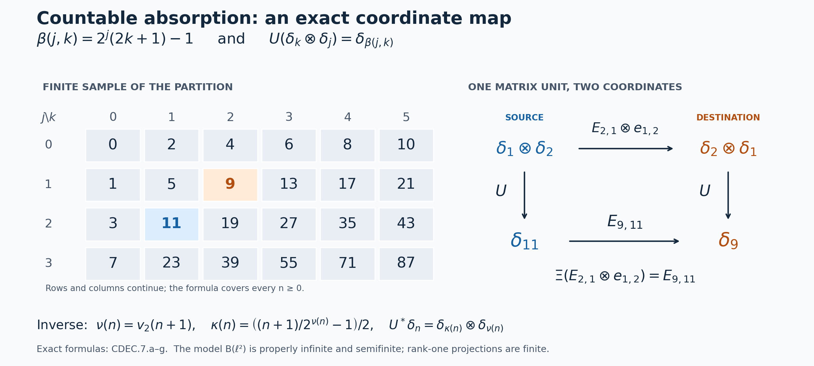

# Continuous decompositions of arbitrary type III algebras

*Self-checked by the writing AI. Original exposition and illustration sources: CC0-1.0; earlier and font components retain their recorded terms.*

Double crossing recovers an algebra with an extra operator tensor factor. To obtain a continuous decomposition of the original algebra, we first construct an isomorphism that absorbs this factor, including its full normal inverse. A rank-one corner then lets us recognize type III before making the same construction in the converse direction. These two steps yield existence and uniqueness of the trace-scaling system, with its specified trace, for arbitrary centers and arbitrary Hilbert-space dimension.

## Algebras, systems and the meaning of uniqueness

All algebras are von Neumann algebras and all isomorphisms are normal star isomorphisms with normal inverses. Let \(K=L^2(\mathbb R,dr)\). An algebra is **type III** when it has no nonzero finite projection. Proper infiniteness and equivalence of projections have the definitions and proofs in [PC5](OA-FLOW-PC.md#oa-flow.projection.pc5) and [PC8](OA-FLOW-PC.md#oa-flow.projection.pc8). We impose no factor, faithful-state, separability or countability hypothesis on an algebra or its faithful representation.

A **specified trace-scaling system** is a triple \((N,\theta,\tau)\), where \(N\ne0\), \(\theta\) is a point-ultraweakly continuous real action, and \(\tau\) is a faithful normal semifinite trace with
\[
 \tau\circ\theta_s=e^{-s}\tau\qquad(s\in\mathbb R).
\]
Its output algebra is \(D=N\rtimes_\theta\mathbb R\). A conjugacy of specified systems is an isomorphism \(F:N_1\to N_2\) such that
\[
 F\theta_s^1=\theta_s^2F,\qquad \tau_2\circ F=\tau_1.
\]
Equalities of weights hold on all positive elements, including infinite values.

The [intrinsic core construction](OA-FLOW-CORE.md#core-7) gives \(C(A)\), its coefficient inclusion \(j_A\), flow \(\vartheta\) and canonical trace \(\tau_A\). A faithful-weight chart uses original measure \(dt\), dual measure \(ds/(2\pi)\), and negative character \(e^{-ist}\). We use that dual measure for the second crossing. [L30, Section 7](OA-FLOW-L30.md#l30-7) proves the normal unitary identification with the convention using \(ds\); the choice does not alter the output algebra or the action.

The theorem will identify a conjugacy class of systems. After fixing an isomorphism of their full fixed algebras, it also identifies a unique trace-preserving conjugacy, by [L30, Section 6](OA-FLOW-L30.md#l30-6). Without that fixed-algebra datum, distinct conjugacies can exist.

## 1. Absorbing the scalar Hilbert-space factor

Let \(A\ne0\) be a von Neumann algebra, represented faithfully and normally on an arbitrary Hilbert space \(H\). Put \(K=L^2(\mathbb R,dr)\). We first prove the normal isomorphism
\[
 A\bar\otimes B(K)\cong A
 \quad\text{when }1_A\text{ is properly infinite}.
 \tag{CDEC.1.a}
\]
The countability in the construction concerns the scalar space \(K\).

**A countably infinite basis of \(K\).** For \(m\in\mathbb N_0\) and \(j\in\mathbb Z\), let
\[
 I_{m,j}=[j2^{-m},(j+1)2^{-m}),\qquad
 d_{m,j}=1_{I_{m,j}}\in K.
 \tag{CDEC.1.b}
\]
This is a countable family. Its complex linear span is dense. Indeed, by the actual [scalar density theorem](OA-FLOW-FF.md#oa-flow.ff.2), it suffices to approximate \(f\in C_c(\mathbb R)\). Choose \(R\ge1\) with \(\operatorname{supp}f\subseteq[-R,R]\), and put
\[
 g_m=\sum_{j\in\mathbb Z} f(j2^{-m})d_{m,j}.
 \tag{CDEC.1.c}
\]
Only finitely many terms are nonzero. Both \(f\) and \(g_m\) vanish off \([-R-1,R+1]\), and on each dyadic interval their difference is bounded by the modulus of continuity of \(f\) at \(2^{-m}\). Consequently
\[
 \|g_m-f\|_2
 \le (2R+2)^{1/2}
       \sup_{|r-s|\le2^{-m}}|f(r)-f(s)|
 \longrightarrow0.
 \tag{CDEC.1.d}
\]
The modulus tends to zero because a compactly supported continuous function is uniformly continuous on \(\mathbb R\). This proves the asserted density.

Enumerate the family \((d_{m,j})\), apply the finite Gram–Schmidt procedure successively, and discard each zero residual. At any finite stage the original vectors processed so far lie in the span of the orthonormal vectors retained so far: subtraction removes exactly their previous orthogonal projection, and a nonzero residual is then normalized. Hence the closed span of the resulting orthonormal sequence is \(K\). There are infinitely many retained vectors, since the original span contains the infinite orthonormal family \(1_{[j,j+1)}\), \(j\in\mathbb N_0\). We therefore obtain a basis \((k_n)_{n\in\mathbb N_0}\) and an onto unitary
\[
 J:\ell^2(\mathbb N_0)\longrightarrow K,\qquad J\varepsilon_n=k_n.
 \tag{CDEC.1.e}
\]
The norm identity on finite sums extends \(J\) to an isometry; its range is closed and contains the dense span of the \(k_n\), proving that it is onto.

**An onto unitary from a filling family.** Suppose now that \(1_A\) is properly infinite. The full halving and filling proof in [PC5](OA-FLOW-PC.md#oa-flow.pc.5), including its final transport of the residual part, gives projections \(f_n\in A\) and implementing partial isometries \(s_n\in A\) with
\[
 s_n^*s_n=1,\qquad s_ns_n^*=f_n,\qquad
 f_nf_m=0\ (n\ne m),\qquad
 \sum_{n=0}^{\infty}f_n=1\quad\text{strongly}.
 \tag{CDEC.1.f}
\]
Thus \(s_i^*s_j=\delta_{ij}1\). Define on finite-coordinate vectors
\[
 S\left(\sum_{n=0}^{m}\xi_n\otimes\varepsilon_n\right)
       =\sum_{n=0}^{m}s_n\xi_n.
 \tag{CDEC.1.g}
\]
Orthogonality gives
\[
 \left\|\sum_{n=0}^{m}s_n\xi_n\right\|^2
       =\sum_{n=0}^{m}\|\xi_n\|^2.
 \tag{CDEC.1.h}
\]
Consequently \(S\) extends to an isometry \(H\otimes\ell^2(\mathbb N_0)\to H\). Its range contains every \(f_nH=s_nH\). Their span is dense by the strong sum in (CDEC.1.f); the range of an isometry is closed, so \(S\) is onto. In particular
\[
 S^*\xi=\sum_{n=0}^{\infty}s_n^*\xi\otimes\varepsilon_n,
 \qquad
 \sum_{n=0}^{\infty}\|s_n^*\xi\|^2=\|\xi\|^2.
 \tag{CDEC.1.i}
\]
These are norm-convergent vector sums for each \(\xi\in H\). No basis of \(H\) has been counted.

**The entire tensor algebra, in both directions.** Write \(E_{ij}=|\varepsilon_i\rangle\langle\varepsilon_j|\), let \(p_m\) project onto \(\operatorname{span}\{\varepsilon_0,\ldots,\varepsilon_m\}\), and put \(P_m=1_H\otimes p_m\). For every bounded operator \(X\) on \(H\otimes\ell^2(\mathbb N_0)\),
\[
 P_mXP_m\longrightarrow X\quad\text{strongly*},
 \qquad \|P_mXP_m\|\le\|X\|.
 \tag{CDEC.1.j}
\]
For example,
\[
 \|(P_mXP_m-X)\zeta\|
 \le\|X\|\,\|(P_m-1)\zeta\|
       +\|(P_m-1)X\zeta\|\longrightarrow0;
\]
the same estimate for \(X^*\) proves the strong-star assertion.

Here is the matrix-entry criterion we need, with its bounded approximation retained. Let \(V_j\xi=\xi\otimes\varepsilon_j\) and \(X_{ij}=V_i^*XV_j\). Then
\[
 X\in A\bar\otimes B(\ell^2(\mathbb N_0))
 \quad\Longleftrightarrow\quad
 X_{ij}\in A\ \text{for every }i,j.
 \tag{CDEC.1.k}
\]
For the forward implication, every elementary tensor commutes with \(a'\otimes1\), \(a'\in A'\). That commutation survives taking the generated von Neumann algebra. Compressing it gives \(a'X_{ij}=X_{ij}a'\), so \(X_{ij}\in A''=A\), by [bicommutant equality](OA-FLOW-BD.md#oa-flow.bd.1). Conversely, if all entries lie in \(A\), then
\[
 P_mXP_m=\sum_{i,j=0}^{m}X_{ij}\otimes E_{ij}
\]
belongs to the tensor algebra. Its bounded strong limit \(X\) also belongs to that von Neumann algebra. This is the concrete [matrix-entry argument](OA-FLOW-NCF.md#ncf-1), specialized only in its second Hilbert factor.

Define \(\Phi(X)=SXS^*\) on the tensor algebra. For a finite matrix,
\[
 \Phi\left(\sum_{i,j=0}^{m}a_{ij}\otimes E_{ij}\right)
       =\sum_{i,j=0}^{m}s_i a_{ij}s_j^*\in A.
 \tag{CDEC.1.l}
\]
For general \(X\) in the tensor algebra, apply this formula to \(P_mXP_m\). Its images have norm at most \(\|X\|\) and converge strongly to \(SXS^*\); strong closedness of \(A\) proves \(\Phi(X)\in A\).

Conversely, for \(a\in A\), the bounded operator \(S^*aS\) has entries
\[
 V_i^*S^*aSV_j=s_i^*a s_j\in A.
 \tag{CDEC.1.m}
\]
Its finite compressions are therefore finite tensor matrices, with norm at most \(\|a\|\), and converge strongly-star to \(S^*aS\). Thus \(\Psi(a)=S^*aS\) belongs to the tensor algebra. Since \(S\) is unitary, \(\Phi\) and \(\Psi\) are inverse unital star homomorphisms and are isometric.

Both maps are normal on their entire domains. For example, a normal functional on \(A\) has the [vector-series form](OA-FLOW-CP.md#oa-flow.cp.6)
\[
 a\longmapsto\sum_j\langle a\xi_j,\eta_j\rangle,
 \qquad \sum_j\|\xi_j\|^2<\infty,\quad
        \sum_j\|\eta_j\|^2<\infty.
\]
Its pullback by \(\Phi\) is the vector-series functional with vectors \(S^*\xi_j,S^*\eta_j\), whose squared-norm sums are unchanged. A normal functional on the tensor algebra pulls back by \(\Psi\) using \(S\) in exactly the same way. This proves ultraweak continuity of each inverse map, without assuming that an arbitrary ultraweakly convergent net is norm bounded.

Finally set
\[
 U=S(1_H\otimes J^*):H\otimes K\longrightarrow H,\qquad
 \Omega_A(X)=UXU^*.
 \tag{CDEC.1.n}
\]
Conjugation by \(1_H\otimes J^*\) sends the elementary tensor generators onto those with second factor \(B(\ell^2(\mathbb N_0))\); its inverse does the reverse. Both conjugations are normal by the same vector-series calculation. Thus \(\Omega_A\) is the promised normal isomorphism, with normal inverse \(a\mapsto U^*aU\), and
\[
 \Omega_A(a\otimes|k_i\rangle\langle k_j|)
       =s_i a s_j^*.
 \tag{CDEC.1.o}
\]
The construction uses the chosen filling family and the scalar basis.

## 2. Finite projections in corners and type III under amplification

A projection \(p\) in a von Neumann algebra \(B\) is finite when every partial isometry \(v\in B\) satisfying \(v^*v=p\) and \(vv^*\le p\) satisfies \(vv^*=p\). We use **type III** to mean that there is no nonzero finite projection.

**Finiteness is intrinsic to the projection corner.** If \(p\le e\) are projections in \(B\), then
\[
 p\text{ is finite in }B
 \quad\Longleftrightarrow\quad
 p\text{ is finite in }eBe.
 \tag{CDEC.2.a}
\]
Indeed a partial isometry witnessing infiniteness in \(eBe\) is also one in \(B\). Conversely, if \(v\in B\), \(v^*v=p\) and \(vv^*\le p\), its initial and final projections give \(v=vp=pv\). Thus \(v=pvp\in eBe\), so every possible witness already belongs to the corner. The criterion is unchanged when the corner acts on \(eH\): extension by zero identifies its projections and partial isometries with the compressed ones in \(B\), as proved in [PC1](OA-FLOW-PC.md#oa-flow.pc.1).

For completeness, if \(p\) is finite and \(q\le p\), an infiniteness witness \(v\) for \(q\) would make \(v+(p-q)\) a partial isometry with initial projection \(p\) and final projection \(vv^*+(p-q)<p\); the initial and final summands are orthogonal. Hence \(q\) is finite. An isomorphism of algebras preserves and reflects finiteness: it and its inverse transport exactly the equations and the strict projection inequality in its definition. These facts also explain the corner and equivalence statements in [PC5](OA-FLOW-PC.md#oa-flow.pc.5).

It follows from (CDEC.2.a) that every nonzero projection corner of a type III algebra is type III. In particular every nonzero central compression of its unit is infinite. [PC8](OA-FLOW-PC.md#oa-flow.pc.8), with the full halving proof in PC5, therefore makes its unit properly infinite. This implication uses no factor or countable-decomposability hypothesis.

**The rank-one corner of the amplification.** For arbitrary \(A\ne0\), use the scalar basis of Section 1 and put
\[
 B=A\bar\otimes B(K),\qquad
 q=|k_0\rangle\langle k_0|,\qquad
 e=1_A\otimes q.
 \tag{CDEC.2.b}
\]
Then the map
\[
 \iota:A\longrightarrow eBe,\qquad \iota(a)=a\otimes q
 \tag{CDEC.2.c}
\]
is a unital star isomorphism, where the target has identity \(e\). To check its full range, use the finite-coordinate compressions of Section 1 after transporting by \(J\). Every \(X\in B\) has entries in \(A\), and
\[
 eXe=X_{00}\otimes q.
 \tag{CDEC.2.d}
\]
This follows on finite matrices by direct multiplication; their uniformly bounded strong-star convergence gives it for every \(X\). Thus every element of the corner has the displayed form. If \(V:H\to H\otimes K\) is \(V\xi=\xi\otimes k_0\), the inverse is \(Y\mapsto V^*YV\). Both maps are normal: vector-series tests pull back along \(V^*\) for \(a\mapsto VaV^*\), and along \(V\) for compression, with squared-norm sums bounded or preserved. This also proves that the isomorphism is independent of any unjustified identification of the whole ambient representation with its corner.

**Amplification preserves and reflects type III.** For every nonzero von Neumann algebra \(A\),
\[
 A\text{ is type III}
 \quad\Longleftrightarrow\quad
 A\bar\otimes B(L^2(\mathbb R,dr))\text{ is type III}.
 \tag{CDEC.2.e}
\]
If the amplification is type III, (CDEC.2.a) makes its nonzero rank-one corner type III. The isomorphism (CDEC.2.c) then makes \(A\) type III. Equivalently, a nonzero finite projection \(p\in A\) would give a nonzero finite projection \(p\otimes q\) in that corner, hence in the whole amplification.

Conversely, if \(A\) is type III, its unit is properly infinite by PC8. Section 1 constructs a normal isomorphism of its amplification onto \(A\). Isomorphisms preserve the nonzero finite projections, so the amplification has none. This proves the equivalence and, in this case, supplies the actual normal isomorphism
\[
 A\bar\otimes B(L^2(\mathbb R,dr))
       \xrightarrow[\ \Omega_A\ ]{\ \cong\ } A.
 \tag{CDEC.2.f}
\]
Every construction remains valid on an arbitrary faithful normal representation of \(A\).

## 3. Construct a decomposition of the given type III algebra

**Theorem.** For every nonzero type III algebra \(A\), there is a specified trace-scaling system \((N,\theta,\tau)\) with \(N\) of type II\(_\infty\) and an isomorphism
\[
 N\rtimes_\theta\mathbb R\cong A.
 \tag{CDEC.3.a}
\]
Here type II\(_\infty\) means the unrestricted algebraic type: projection-semifinite, with no nonzero abelian projection and no nonzero finite central summand. In particular \(N\) need not be a factor.

**Proof.** Choose a faithful normal semifinite weight \(\psi\) on \(A\), using [FR1](OA-FLOW-FR.md#oa-flow.fr.1). Form
\[
 N=C_\psi(A)=A\rtimes_{\sigma^\psi}\mathbb R,
 \qquad \theta=\widehat{\sigma^\psi},\qquad
 \tau=\tau_{\mathrm{can},\psi}.
 \tag{CDEC.3.b}
\]
[CORE1](OA-FLOW-CORE.md#core-1), [CORE2](OA-FLOW-CORE.md#core-2), [CORE3](OA-FLOW-CORE.md#core-3) and [CORE4](OA-FLOW-CORE.md#core-4) prove that this is a faithful normal semifinite trace on the whole positive cone and that \(\tau\theta_s=e^{-s}\tau\). The action has the required continuity. Thus (CDEC.3.b) satisfies every hypothesis of a specified system.

The full normal double-duality construction [ND](OA-FLOW-ND.md#nd-construction), including its [whole inverse](OA-FLOW-ND.md#nd-inverse), supplies
\[
 \mathcal D_\psi:N\rtimes_\theta\mathbb R
       \longrightarrow A\,\overline\otimes\,B(K).
 \tag{CDEC.3.c}
\]
Since \(A\) is type III, Section 2 makes its unit properly infinite. Choose the isometries in Section 1 and let
\(\Omega_A:A\bar\otimes B(K)\to A\)
be their constructed absorption isomorphism. Then
\[
 \beta_\psi=\Omega_A\mathcal D_\psi,
 \qquad \beta_\psi^{-1}=\mathcal D_\psi^{-1}\Omega_A^{-1}
 \tag{CDEC.3.d}
\]
are normal inverse maps on the entire algebras. This proves (CDEC.3.a).

For the coefficient embedding and signs, write \(j_N\) and \(\ell_s\) for the second-crossing generators. In a faithful normal representation of \(A\), put
\[
 [a_\psi(x)\xi](r)=\sigma_{-r}^\psi(x)\xi(r),\quad
 [L_t\xi](r)=\xi(r-t),\quad
 [Q_s\xi](r)=e^{-isr}\xi(r).
\]
The actual [CORE8 generator formulas](OA-FLOW-CORE.md#core-8) give
\[
 \begin{aligned}
 \beta_\psi(j_N(\pi_\psi(x)))&=\Omega_A(a_\psi(x)),\\
 \beta_\psi(j_N(\lambda_\psi(t)))&=\Omega_A(1\otimes L_t),\\
 \beta_\psi(\ell_s)&=\Omega_A(1\otimes Q_s).
 \end{aligned}
 \tag{CDEC.3.e}
\]
The first input to \(\Omega_A\) is the modular orbit field in \(A\bar\otimes B(K)\); its membership and full tensor generation were proved in [ND's orbit-field argument](OA-FLOW-ND.md#nd-orbits). In general this field is not the constant tensor \(x\otimes1\).

Finally apply the complete [type II\(_\infty\) reduction](OA-FLOW-L18.md#l18-8) to this specified system. Its output is type III by (CDEC.3.d), so its type I and finite type II central parts both vanish. That earlier proof constructs the required central weights on those parts and uses a supported normal translation coordinate to exclude each nonzero part. It has no factor or countability restriction. Hence \(N\) is type II\(_\infty\), as asserted. ∎

The [full central-corner criterion](OA-FLOW-L18.md#l18-6) also gives the exact condition on the constructed center: there is no nonzero normal injective equivariant star homomorphism
\[
 L^\infty(\mathbb R)\longrightarrow Z(N)
 \tag{CDEC.3.f}
\]
for translation \(f(r)\mapsto f(r+s)\), even if its unit is allowed to be a proper invariant central projection. This is a consequence of the type III output; the label II\(_\infty\) alone would not establish it.

## 4. Recover the same system from any continuous decomposition

Suppose a specified system \((N,\theta,\tau)\) has output \(D=N\rtimes_\theta\mathbb R\) and that
\(\beta:D\to A\) is an isomorphism onto a nonzero type III algebra. Put
\[
 M=N^\theta.
 \tag{CDEC.4.a}
\]
The [whole-cone converse and chart gluing](OA-FLOW-L30.md#l30-5) give an isomorphism
\[
 \kappa:C(M)\longrightarrow N,
 \qquad \kappa(j_M(x))=x,
 \qquad \kappa\vartheta_s=\theta_s\kappa,
 \qquad \tau\kappa=\tau_M.
 \tag{CDEC.4.b}
\]
This statement retains the prescribed trace, including its normalization on every central part.

Choose a faithful normal semifinite weight on \(M\). [L30's full second crossing](OA-FLOW-L30.md#l30-7) supplies a normal isomorphism
\[
 \mathscr S:D\longrightarrow M\,\overline\otimes\,B(K).
 \tag{CDEC.4.c}
\]
The right-hand side is type III, since it is isomorphic to \(A\). Section 2 applies its rank-one corner argument to give that \(M\) is type III. In particular its absorption isomorphism
\(\Omega_M:M\bar\otimes B(K)\to M\)
exists by Section 1. Define
\[
 f=\beta\mathscr S^{-1}\Omega_M^{-1}:M\longrightarrow A.
 \tag{CDEC.4.d}
\]
Every map in this composition is onto and normal with normal inverse. This explicitly constructs the isomorphism \(M\cong A\); no cancellation theorem for an arbitrary tensor product has been assumed.

Apply the [normal core functor](OA-FLOW-CORE.md#core-8) to \(f\), and set
\[
 \begin{gathered}
 F=C(f)\kappa^{-1}:N\longrightarrow C(A),\\
 F^{-1}=\kappa C(f^{-1}),\qquad
 F\theta_s=\vartheta_sF,\qquad
 \tau_A F=\tau.
 \end{gathered}
 \tag{CDEC.4.e}
\]
Functoriality proves that the displayed inverse is correct. The flow identity follows from equivariance of both factors. For every \(y\in N_+\), the exact trace calculation is
\[
 \tau_A(F(y))
 =\tau_M(\kappa^{-1}(y))=\tau(y).
 \tag{CDEC.4.f}
\]
Both equalities hold also when the value is infinite. No scalar comparison of traces and no ergodicity assumption on the center occur here.

The restriction of \(F\) to \(M\) is \(j_Af\). More explicitly, if \(\psi\) is a faithful normal semifinite weight on \(M\), let
\(\psi^f=\psi\circ f^{-1}\)
and let \(H_\psi\) be the density used by the L30 converse. Its generator formula and CORE8's normal lift give
\[
 F(H_\psi^{it})=\lambda^{\psi^f}(t)
       \quad\text{in }C(A),\qquad
 F(x)=j_A(f(x))\quad(x\in M).
 \tag{CDEC.4.g}
\]
Here \(\lambda^{\psi^f}\) is the labeled unitary group in the glued core. Ordered chart transitions make these formulas compatible for all faithful weights; [CORE5](OA-FLOW-CORE.md#core-5) and [CORE7](OA-FLOW-CORE.md#core-7) prove their full normal realization. Thus \(F\) identifies the specified trace-scaling system with the intrinsic core of the output algebra.

## 5. Classification of the systems and the choices of maps

**Theorem.** Let \((N_i,\theta^i,\tau_i)\), \(i=1,2\), be specified systems whose output algebras \(D_i\) are type III. Their outputs are isomorphic if and only if there is a trace-preserving equivariant isomorphism
\[
 J:N_1\longrightarrow N_2.
 \tag{CDEC.5.a}
\]

**Proof in the forward direction.** Identify the two outputs with a common type III algebra \(A\). Section 4 constructs
\(F_i:N_i\to C(A)\)
with their full normal inverses. Define
\[
 J=F_2^{-1}F_1.
 \tag{CDEC.5.b}
\]
Composition proves normality, bijectivity and equivariance. The trace identities give, for every \(y\in(N_1)_+\),
\[
 \tau_2(J(y))=\tau_A(F_1(y))=\tau_1(y).
 \tag{CDEC.5.c}
\]
This proves the prescribed-trace assertion for arbitrary centers.

**Proof in the reverse direction.** In fact equivariance alone is enough for this direction. Given an equivariant normal isomorphism \(J:N_1\to N_2\), represent \(N_2\) faithfully normally on a Hilbert space \(H\), and represent \(N_1\) on that same space through \(J\). Their regular coefficient fields agree under the relabeling because
\[
 J(\theta^1_{-r}(y))=\theta^2_{-r}(J(y)).
\]
Their real translations agree as well. They therefore generate the same concrete von Neumann algebra on \(L^2(\mathbb R,H)\). This gives normal inverse maps between these regular models; [NR4](OA-FLOW-NR.md#oa-flow.nr.4) transports them to the named output algebras. The resulting map is
\[
 \begin{aligned}
 J\rtimes\mathrm{id}:D_1&\longrightarrow D_2,\\
 j_1(y)&\longmapsto j_2(J(y)),\qquad
 \ell_s^1\longmapsto\ell_s^2.
 \end{aligned}
 \tag{CDEC.5.d}
\]
Its normal inverse is constructed from \(J^{-1}\). This proves the reverse implication on the entire algebras. ∎

There are three distinct choices in the forward construction: a faithful chart for the second crossing, an absorption isomorphism, and an identification of the output algebra. The resulting fixed-algebra isomorphism \(f\) in (CDEC.4.d) records them. Once \(f:M\to A\) is fixed, the [isomorphism correspondence in L30](OA-FLOW-L30.md#l30-6) says that (CDEC.4.e) is the unique trace-preserving equivariant map restricting to \(j_Af\). Altering \(f\) can alter that map. In particular the theorem classifies systems up to conjugacy and does not assert that their conjugating map is unique without further data.

One can see this precisely for an automorphism \(\eta\) of \(M\). The map
\[
 R_\eta=\kappa C(\eta)\kappa^{-1}
 \tag{CDEC.5.e}
\]
is a trace-preserving equivariant automorphism of \(N\), restricting to \(\eta\) on \(M\). Distinct \(\eta\)'s have distinct restrictions, hence yield distinct maps. [CORE8](OA-FLOW-CORE.md#core-8) and normal generation give
\[
 R_{\eta\zeta}=R_\eta R_\zeta,\qquad
 R_{\mathrm{id}}=\mathrm{id},\qquad
 R_{\eta^{-1}}=R_\eta^{-1}.
 \tag{CDEC.5.f}
\]
The normal core construction itself is independent of a faithful weight by the ordered transitions already proved in CORE. Independence of that weight does not remove the genuine automorphisms in (CDEC.5.e).

## 6. The associated system, modulus and center flow

The system determined up to conjugacy in Section 5 is the **associated trace-scaling system** of \(A\). A realization \(A\cong N\rtimes_\theta\mathbb R\) is a **continuous decomposition**. The theorem concerns the action together with its semifinite coefficient algebra; retaining the coefficient algebra alone discards part of this datum.

Its **flow of weights** is the restricted action
\[
 \bigl(Z(N),\mathbb R,\theta|_{Z(N)}\bigr).
 \tag{CDEC.6.a}
\]
A normal isomorphism takes the center onto the center: commutation with every element transports in both directions. Therefore a system conjugacy restricts to a conjugacy of (CDEC.6.a), so its conjugacy class depends only on the isomorphism class of \(A\).

The actual [center formula for a trace-scaling crossed product](OA-FLOW-L18.md#l18-1) reads
\[
 Z(D)=j_N\bigl(Z(N)^\theta\bigr).
 \tag{CDEC.6.b}
\]
Transport through an output isomorphism to \(A\). It follows that
\[
 A\text{ is a factor}
 \quad\Longleftrightarrow\quad
 Z(N)^\theta=\mathbb C1.
 \tag{CDEC.6.c}
\]
The right-hand side is algebraic ergodicity of the center flow. It does not say that the center itself is scalar. In the intrinsic model, [CORE8](OA-FLOW-CORE.md#core-8) gives the more precise fixed-center identity
\(Z(C(A))^{\vartheta}=j_A(Z(A))\).
These statements use the center as a commutative von Neumann algebra; no standard measure-space realization is assumed.

For an automorphism \(\gamma\) of a nonzero semifinite algebra with specified faithful normal semifinite trace \(\tau\), suppose a scalar \(c>0\) satisfies \(\tau\gamma=c\tau\). Define its **modulus relative to this trace** by
\[
 \operatorname{mod}_\tau(\gamma)=c^{-1}.
 \tag{CDEC.6.d}
\]
There is a positive element \(y\) with \(0<\tau(y)<\infty\), by faithfulness and semifiniteness on a nonzero algebra. Evaluation there proves uniqueness of \(c\). For automorphisms with scalar factors \(c_1,c_2\), composition and inversion give factors \(c_1c_2,c_1^{-1}\). Hence modulus is multiplicative on this group. In particular
\[
 \operatorname{mod}_\tau(\theta_s)=e^s.
 \tag{CDEC.6.e}
\]
An arbitrary automorphism on an algebra with center need not scale the chosen trace by one scalar, so definition (CDEC.6.d) is used only when its displayed hypothesis holds. Our conjugacies preserve the entire specified trace, as proved in (CDEC.5.c), even when the center is large.

## 7. An exact absorption model and the freedom in a conjugacy

The absorption proof has a completely explicit coordinate model. Put \(H=\ell^2(\mathbb N_0)\), write \((\delta_k)_{k\ge0}\) for its standard basis, and use the partition in [PC's exact model](OA-FLOW-PC.md#oa-flow.pc.9):
\[
 \begin{gathered}
 \beta(j,k)=2^j(2k+1)-1,\qquad
 S_j=\{\beta(j,k):k\ge0\},\\
 V_j\delta_k=\delta_{\beta(j,k)}.
 \end{gathered}
 \tag{CDEC.7.a}
\]
Every positive integer has a unique factorization into a power of two and an odd integer. Consequently the \(S_j\) partition \(\mathbb N_0\), each \(V_j\) is an isometry, and
\[
 V_i^*V_j=\delta_{ij}1,
 \qquad \sum_{j\ge0}V_jV_j^*=1
 \quad\text{strongly}.
 \tag{CDEC.7.b}
\]
Here is the inverse coordinate map, including its domain at \(n=0\):
\[
 \nu(n)=v_2(n+1),\qquad
 \kappa(n)=\frac{(n+1)/2^{\nu(n)}-1}{2},\qquad
 \beta(\nu(n),\kappa(n))=n.
 \tag{CDEC.7.c}
\]
The function \(v_2(m)\) is the unique nonnegative integer for which \(2^{v_2(m)}\) divides the positive integer \(m\), with odd quotient. In particular \(\nu(0)=\kappa(0)=0\).

Define on the tensor-product basis
\[
 \begin{gathered}
 U:H\otimes\ell^2(\mathbb N_0)\longrightarrow H,\\
 U(\delta_k\otimes\delta_j)=\delta_{\beta(j,k)},\\
 U^*\delta_n=\delta_{\kappa(n)}\otimes\delta_{\nu(n)}.
 \end{gathered}
 \tag{CDEC.7.d}
\]
The bijection preserves inner products on finite basis sums and has every basis vector in its range. Completion therefore makes \(U\) an onto unitary. Conjugation by it gives a normal isomorphism with normal inverse
\[
 \begin{gathered}
 \Xi:B(H)\,\overline\otimes\,B(\ell^2(\mathbb N_0))
      \longrightarrow B(H),\\
 \Xi(X)=UXU^*,\qquad \Xi^{-1}(y)=U^*yU,\\
 \Xi(x\otimes e_{ij})=V_i x V_j^*,\\
 (\Xi^{-1}(y))_{ij}=V_i^*yV_j.
 \end{gathered}
 \tag{CDEC.7.e}
\]
The inverse formula specifies the bounded operator \(U^*yU\), not merely a formal infinite matrix. Its finite square truncations converge strongly, as do their adjoints, because the coordinate projections increase strongly to the identity. The same compression statement identifies \(\Xi(X)\) with the strong-star limit, as \(m\) increases, of \(\sum_{i,j<m}V_iX_{ij}V_j^*\).
For this model the spatial tensor algebra is all of \(B(H\otimes\ell^2)\): the elementary rank-one matrices belong to it, and finite coordinate compressions of any bounded operator converge strongly. Normality of both conjugations also follows directly by transport of bounded increasing positive nets.

To see individual entries, let \(E_{k\ell}\delta_b=\delta_{\ell b}\delta_k\) on the first factor. Then
\[
 \begin{aligned}
 \Xi(E_{k\ell}\otimes e_{ij})
     &=E_{\beta(i,k),\beta(j,\ell)},\\
 \Xi^{-1}(E_{mn})
     &=E_{\kappa(m),\kappa(n)}
             \otimes e_{\nu(m),\nu(n)}.
 \end{aligned}
 \tag{CDEC.7.f}
\]
For example, \(\beta(1,2)=9\) and \(\beta(2,1)=11\), so
\[
 \Xi(E_{2,1}\otimes e_{1,2})=E_{9,11},\qquad
 \Xi^{-1}(E_{9,11})=E_{2,1}\otimes e_{1,2}.
 \tag{CDEC.7.g}
\]
Both operators have rank one. This coordinate model belongs to the properly infinite semifinite algebra \(B(H)\). Its rank-one projections are finite, so it is not type III. Its purpose is to display the exact absorption mechanism used for arbitrary properly infinite algebras in [Sections 1–2](#cdec-1).

*Figure 1.* The left table is the finite sample \(0\le j\le3\), \(0\le k\le5\) of the exact bijection (CDEC.7.a); every row continues. Blue marks the source coordinate \(\beta(2,1)=11\), and orange marks the destination \(\beta(1,2)=9\). The right square states (CDEC.7.g): the upper arrow is \(E_{2,1}\otimes e_{1,2}\), the vertical arrows are the full unitary \(U\), and the lower arrow is \(E_{9,11}\). The displayed basis vectors are a sample; (CDEC.7.c)–(CDEC.7.f) prove the formulas on the whole spaces. Human-source context for projection comparison and halving is Jesse Peterson, *Operator Algebras* (2020), Sections 5.1–5.2, printed pages 83–90, and Brent Nelson, *Math 209: von Neumann Algebras*, Lemma 5.2.9 and Proposition 5.2.13, printed pages 49–51, as recorded in [PC](OA-FLOW-PC.md#oa-flow.projection.pc0). The original [renderer](../assets/continuous-decomposition/render.py), [exact data](../assets/continuous-decomposition/data.json), [editable SVG](../assets/continuous-decomposition/absorption-map.svg), and [terms](../assets/continuous-decomposition/TERMS.md) are retained.

There is a different freedom in the choice of a decomposition conjugacy. Let \((N,\theta,\tau)\) be a specified trace-scaling system and let \(u\) be a unitary in its full fixed algebra \(M=N^\theta\). Then
\[
 \begin{gathered}
 \rho_u=\operatorname{Ad}(u):N\longrightarrow N,\qquad
 \rho_u\theta_s=\theta_s\rho_u,\\
 \tau\circ\rho_u=\tau.
 \end{gathered}
 \tag{CDEC.7.h}
\]
The first identity uses \(\theta_s(u)=u\); the second is traciality on the entire positive cone. Both \(\rho_u\) and its inverse \(\operatorname{Ad}(u^*)\) are normal. If \(u\notin Z(N)\), then \(\rho_u\ne\mathrm{id}\), since equality would say that \(u\) commutes with every element. Thus composing a conjugacy with \(\rho_u\) can change its map while preserving the trace and flow. Its restriction to \(M\) changes by \(\operatorname{Ad}(u)|_M\). When that restriction is required to be the identity, the uniqueness theorem [L30, Section 6](OA-FLOW-L30.md#l30-6) forces \(\rho_u=\mathrm{id}\).

Time translation exhibits the role of the specified trace separately:
\[
 \theta_a|_M=\mathrm{id}_M,\qquad
 \theta_a\theta_s=\theta_s\theta_a,\qquad
 \tau\circ\theta_a=e^{-a}\tau.
 \tag{CDEC.7.i}
\]
For \(a\ne0\), this is not a trace-preserving conjugacy. Faithfulness and semifiniteness supply a positive element of finite nonzero trace, on which the factor \(e^{-a}\) is detected. A system can therefore be unique up to the prescribed kind of conjugacy without there being a unique unrestricted map realizing the conjugacy.

Arbitrary centers can be retained concretely. Suppose a nonempty family \((A_i)_{i\in I}\) of nonzero type III von Neumann algebras is given; no existence assertion about such a family is needed here. The bounded product
\[
 A=\prod_{i\in I}A_i
 \tag{CDEC.7.j}
\]
is a von Neumann algebra on the Hilbert direct sum of faithful representation spaces. It is type III. Indeed a nonzero projection \(p=(p_i)\) has some nonzero coordinate \(p_i\). A partial isometry in \(A_i\) taking \(p_i\) onto a strict subprojection, combined with the identity partial isometries \(p_j\) on every other coordinate, takes \(p\) onto a strict subprojection of itself. Its center contains the coordinate copy of \(\ell^\infty(I)\). If \(I\) is uncountable, no faithful normal state exists: the mutually orthogonal nonzero coordinate units would all have strictly positive values, whereas only countably many positive numbers can have bounded finite subsums. The decomposition and trace-preserving comparison above still apply to this given algebra. The countable absorption coordinate does not impose countability on its center or representation space.

## 8. Five diagnostics with complete solutions

**A. Can a finite algebra absorb the infinite matrix factor?** Let \(A\ne0\) have finite unit. Explain the obstruction to \(A\cong A\,\overline\otimes\,B(\ell^2)\), and make it visible when \(A=M_d(\mathbb C)\).

**Solution.** Let \(S\delta_j=\delta_{j+1}\) be the unilateral shift. In the tensor algebra,
\[
 (1\otimes S)^*(1\otimes S)=1,\qquad
 (1\otimes S)(1\otimes S)^*=1-1\otimes e_{00}<1.
 \tag{CDEC.8.a}
\]
An isomorphism onto \(A\) would take this isometry to an equivalence of its unit with a strict subprojection, contradicting finiteness. In \(M_d(\mathbb C)\), equality of initial and final ranks forces every isometry to be unitary. Two isometries with orthogonal range projections would require two disjoint \(d\)-dimensional ranges in a \(d\)-dimensional space. Thus the filling isometries used by absorption cannot exist in this finite case. This is a projection obstruction, and does not depend on a chosen scalar trace or on a faithful-state hypothesis.

**B. Why does a rank-one corner recover type III in the reverse direction?** For an arbitrary nonzero von Neumann algebra \(A\), prove
\[
 A\,\overline\otimes\,B(\ell^2)\text{ is type III}
 \quad\Longleftrightarrow\quad A\text{ is type III}.
 \tag{CDEC.8.b}
\]

**Solution.** If \(p\in A\) were a nonzero finite projection, then \(q=p\otimes e_{00}\) would be nonzero and
\[
 q\bigl(A\,\overline\otimes\,B(\ell^2)\bigr)q
   =pAp\otimes\mathbb C e_{00}\cong pAp.
 \tag{CDEC.8.c}
\]
This equality holds for the full von Neumann tensor product: compress finite sums of elementary tensors and use normality of compression. To check finiteness in the ambient algebra, any partial isometry \(v\) with \(v^*v=q\) and \(vv^*\le q\) satisfies \(v=qvq\), so belongs to that corner. Finiteness of \(p\) then gives \(vv^*=q\). Thus \(q\) is finite, contradicting type III of the tensor algebra. This proves the reverse implication without any cancellation theorem. For the forward implication, [PC8](OA-FLOW-PC.md#oa-flow.pc.8) makes the unit of a nonzero type III algebra properly infinite. The proved absorption isomorphism in [Sections 1–2](#cdec-1) identifies the tensor algebra with \(A\), which has no nonzero finite projection. Both arguments allow arbitrary centers and Hilbert dimension.

**C. How is the trace normalized when the center is arbitrary?** Let \(M=N^\theta\), let \(f:M\to A\) be a chosen normal isomorphism, and let \(\kappa:C(M)\to N\) be the trace-preserving reconstruction of [L30](OA-FLOW-L30.md#l30-6). Show that \(F=C(f)\kappa^{-1}\) preserves the specified trace without invoking uniqueness of traces up to a scalar.

**Solution.** Write \(\tau_M^{\mathrm{can}}\) and \(\tau_A^{\mathrm{can}}\) for the canonical core traces. The actual normal core functor [CORE8](OA-FLOW-CORE.md#core-8) proves its trace identity by transporting every bounded spectral sandwich of the dual weight and taking the same extended-positive supremum. L30 proves the corresponding full-cone identity for \(\kappa\). Therefore, for every \(y\in N_+\),
\[
 \begin{aligned}
 \tau_A^{\mathrm{can}}(F(y))
 &=\tau_M^{\mathrm{can}}(\kappa^{-1}(y))\\
 &=\tau(y).
 \end{aligned}
 \tag{CDEC.8.d}
\]
This includes infinite values and fixes the normalization on every central part. The same two maps intertwine the flows, and both have normal inverses. A scalar comparison would be insufficient in general: on \(B(\ell^2)\oplus B(\ell^2)\), the traces \(\operatorname{Tr}\oplus\operatorname{Tr}\) and \(\operatorname{Tr}\oplus2\operatorname{Tr}\) are not scalar multiples. Testing on a rank-one projection in the first summand would force that scalar to be \(1\), while testing in the second would force it to be \(2\). Formula (CDEC.8.d) uses neither factorhood nor such a comparison.

**D. Does uniqueness of the decomposition give a unique conjugating map?** Suppose two normal isomorphisms \(F_1,F_2:N\to N'\) intertwine the flows and preserve the specified traces. State exactly when the uniqueness result forces them to agree, and exhibit the remaining ambiguity.

**Solution.** Let \(M=N^\theta\) and \(M'=(N')^{\theta'}\). Each \(F_i\) restricts to a normal isomorphism \(f_i:M\to M'\). The full correspondence in [L30, Section 6](OA-FLOW-L30.md#l30-6) is
\[
 F_i=\kappa' C(f_i)\kappa^{-1}.
 \tag{CDEC.8.e}
\]
Thus \(F_1=F_2\) if and only if \(f_1=f_2\): one implication is restriction, and the other follows from the displayed formula. Without the specified fixed-algebra map, a unitary \(u\in M\) with \(u\notin Z(N)\) gives distinct maps \(F_1\) and \(F_1\operatorname{Ad}(u)\), both preserving trace and flow by (CDEC.7.h). There is no contradiction with uniqueness after fixing \(f_i\). Conversely, dropping trace preservation leaves the maps \(F_1\theta_a\), which have the same restriction to \(M\), intertwine the flows, and satisfy
\[
 \tau'\circ F_1\theta_a=e^{-a}\tau.
 \tag{CDEC.8.f}
\]
For \(a\ne0\), the trace identity distinguishes them from \(F_1\). The two omissions therefore create different freedoms.

**E. Does trace scaling alone force type III output?** Analyze the specified system
\[
 N=L^\infty(\mathbb R,dr),\qquad
 (\theta_sf)(r)=f(r+s),\qquad
 \tau(f)=\int_{\mathbb R}e^rf(r)\,dr.
 \tag{CDEC.8.g}
\]

**Solution.** This is the complete scalar model in [L30, Section 8](OA-FLOW-L30.md#l30-8). The interval projections give a strongly dense finite trace domain, the density is positive, and nonnegative change of variables gives \(\tau\theta_s=e^{-s}\tau\) on the entire positive cone. The action is point-ultraweakly continuous. Its full fixed algebra is \(\mathbb C1\), by the translation-fixed multiplier proof used there. With \(\psi(1)=1\), the normalized action integral and its density are
\[
 E(f)=\frac1{2\pi}\int_{\mathbb R}f(r)\,dr,
 \qquad H_\psi(r)=\frac{e^{-r}}{2\pi}.
 \tag{CDEC.8.h}
\]
The exact normal second-crossing formula [L30, Section 7](OA-FLOW-L30.md#l30-7) consequently gives
\[
 N\rtimes_\theta\mathbb R
   \cong\mathbb C\,\overline\otimes\,B(L^2(\mathbb R))
   =B(L^2(\mathbb R)).
 \tag{CDEC.8.i}
\]
This output is semifinite and properly infinite, with nonzero finite rank-one projections, so it is not type III. In particular this example does not satisfy the type III output hypothesis of the continuous-decomposition assertion. The precise additional restriction is [L18's supported central translation criterion](OA-FLOW-L18.md#l18-6). Here the whole center \(N\) itself is such a translation algebra. It supplies the semifinite output, despite the exact trace-scaling law.

## Reading and the scope of the decomposition theorem

Masamichi Takesaki, *Theory of Operator Algebras II*, Theorem XII.1.1(ii), printed pages 367–368, treats existence and uniqueness of the associated trace-scaling system. Definition XII.1.3 and Corollary XII.1.4 on printed page 368 give the associated system, modulus and factor criterion.

Here the explicit countable absorption and rank-one corner argument come first. The previously proved whole-cone core converse then supplies a conjugacy preserving the specified trace at arbitrary center, and the normal core functor makes its dependence on the fixed-algebra identification explicit. The book is a mathematical source and further reading; every proof used above is written here or linked to its actual earlier programme proof.

The finer modular invariants, the relative commutant of the core, cocycle cohomology, outer-automorphism exact sequences, and continuity of a chosen implementing unitary require additional theorems. They are not consequences of system conjugacy alone. The result proved here is the complete continuous-decomposition existence and system-uniqueness theorem at the stated arbitrary-algebra scope.
