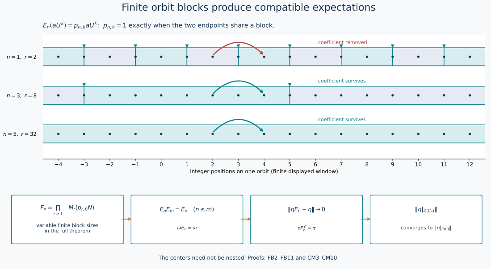

# Finite orbit blocks and type II∞ approximations of a type III₀ factor

The approximation needed for the core-center orbit theorem consists of actual subalgebras and compatible normal expectations, with convergence in predual norm. We construct these from the discrete coefficient presentation already proved in ZDC. No locally finite group presentation is assumed.

Earlier complete proofs: [ZDC.4](OA-FLOW-ZDC.md#zdc-4), [CP.1](OA-FLOW-CP.md#oa-flow.cp.1), [CP.2](OA-FLOW-CP.md#oa-flow.cp.2), [CP.4](OA-FLOW-CP.md#oa-flow.cp.4), [CP.5](OA-FLOW-CP.md#oa-flow.cp.5), [CP.6](OA-FLOW-CP.md#oa-flow.cp.6).

## 1. The exact discrete input

Let \(M\) be a type III₀ factor with separable predual. ZDC, Section 4, supplies a normal crossed-product identification
\[
 M=N\rtimes_\alpha\mathbb Z,\qquad UaU^*=\alpha(a),                 \tag{FB1}
\]
where \(N\) is a semifinite type II∞ algebra with separable predual. Its center has a standard probability realization \(Z(N)=L^\infty(X,\mu)\), and
\(\alpha(f)=f\circ T^{-1}\) for an ergodic nonsingular Borel automorphism \(T\). The base is nonatomic. The trace, contraction and full crossed-product inverse are parts of the actual ZDC input, not deductions from a title.

We may work on a conull invariant Borel subset on which \(T\) is free. Indeed each period set is invariant. If a nonzero period set filled the space by ergodicity, choose the least point in each finite orbit using a Borel embedding of \(X\) into the real interval. This is a Borel transversal. The finite sums of its translated measure have a nonatomic measure class on the transversal, since \(\mu\) is nonatomic. Split the transversal into two sets whose saturations have positive measure. Their invariant disjoint saturations contradict ergodicity. The countable union of period sets is therefore null.

Every Borel wandering set is null. Otherwise split a positive-measure wandering set into two pieces of positive measure by nonatomicity. Their disjoint invariant saturations contradict ergodicity. This is the only recurrence assertion needed below.

## 2. Nested Borel markers

We construct decreasing complete sections \(B_0=X\supset B_1\supset\cdots\). Each orbit meets each \(B_n\) infinitely often in both directions, and consecutive \(B_n\)-markers have distance at least \(2^n\) in the original \(T\)-coordinate.

Suppose \(B_n\) is constructed. The next-return transformation \(S_n\) on \(B_n\) is Borel: the first positive return time is the least integer satisfying a Borel membership condition. It is invertible, using the previous-return time, and is free.

The graph joining a point to \(S_nx\) and \(S_n^{-1}x\) has a countable Borel proper coloring. To construct it, take a countable separating Borel family closed under finite Boolean operations. For each point, choose the least set containing it and excluding its two neighbors. The sets of points with the same choice form a Borel partition, and no color class contains an adjacent pair. Enumerate these classes. Include the first class; at each successive class include precisely the points not adjacent to any previously included point. The countable union \(B_{n+1}\) is a Borel independent set and is maximal: every excluded point has a previously included neighbor. In each \(S_n\)-orbit it is thus unbounded in both directions; successive selected markers are separated by at least two \(S_n\)-steps. This proves all inductive assertions.

The intersection \(\bigcap_nB_n\) meets each \(T\)-orbit at most once, since its distinct points would have distance at least \(2^n\) for every \(n\). It is wandering and hence null. Delete its countable \(T\)-saturation. On the remaining invariant conull Borel space the intersection is empty.

Partition each orbit into the finite intervals starting at a \(B_n\)-marker and ending immediately before the next one. These partitions refine as \(n\) decreases; equivalently the finite equivalence relations \(R_n\) they define increase. They exhaust the orbit relation:
\[
 R_n\subset R_{n+1},\qquad
 \bigcup_nR_n=\{(x,T^k x):x\in X,\ k\in\mathbb Z\}.                \tag{FB2}
\]
For a fixed finite orbit segment, its finitely many points eventually all lie outside \(B_n\), since the markers decrease with empty intersection. In particular there is eventually no marker strictly after its first endpoint and at or before its last. Both endpoints then belong to the same block. This proves (FB2) without an appeal to a hyperfiniteness theorem.

## 3. The matrix algebras of the blocks

Write
\[
 B_{n,r}=\{x\in B_n:\text{the next return to }B_n\text{ is }r\},
 \qquad r\ge1 .
\]
The level sets \(T^jB_{n,r}\), \(0\le j<r\), form a countable Borel partition of \(X\). Let \(p_{r,j}=1_{T^jB_{n,r}}\in Z(N)\), and set
\[
 v_{r,j}=U^jp_{r,0},\quad
 v_{r,j}^*v_{r,j}=p_{r,0},\quad v_{r,j}v_{r,j}^*=p_{r,j}.           \tag{FB3}
\]
For a bounded family \(a^{(r)}=[a_{ij}^{(r)}]\in M_r(p_{r,0}N)\), define
\[
 \iota_n((a^{(r)})_r)
   =\sum_r\sum_{i,j<r}v_{r,i}a_{ij}^{(r)}v_{r,j}^*.               \tag{FB4}
\]
For fixed \(r\), multiplication and adjoints follow from
\(v_{r,i}^*v_{s,j}=0\) unless \(r=s,i=j\), when it equals \(p_{r,0}\).
The finite \(r\)-block has its matrix norm. Different block units
\(\sum_{j<r}p_{r,j}\) are orthogonal, so a uniformly bounded family has a strong-star block sum with norm the supremum of those matrix norms. The inverse is the family \(v_{r,i}^*xv_{r,j}\). Both maps are normal: vector pairings of the block sum are absolutely summable by Cauchy–Schwarz, and compression is normal. The image
\[
 F_n\cong\prod_{r\ge1}M_r(p_{r,0}N)                               \tag{FB5}
\]
is therefore a von Neumann subalgebra of \(M\). It contains \(N\): the diagonal entries for \(a\in N\) are \(p_{r,0}\alpha^{-j}(a)\), and the block sum is \(a\).

Each nonzero central corner \(p_{r,0}N\) is type II∞. Matrix amplification is semifinite with the diagonal sum trace; it has no type I summand because compression to a matrix diagonal corner would give one in \(p_{r,0}N\). It is properly infinite because a filling pair of isometries in that corner amplifies diagonally. The product is again semifinite, with the sum of its component traces, has no type I summand, and has properly infinite unit on every nonzero central part. Thus \(F_n\) is type II∞. Its predual is separable as a von Neumann subalgebra of the separably acting \(M\) (CP's concrete predual quotient).

## 4. An explicit faithful normal expectation

Let \(j_n(x)\) be the position of \(x\) in its block, so that \(j_n=j\) on \(T^jB_{n,r}\). Put
\[
 z_n(t)=\sum_{r,j}e^{itj}p_{r,j},\qquad t\in\mathbb R/(2\pi\mathbb Z).
\]
This is a strongly continuous central unitary group in \(N\). The summands need not have bounded positions: for each vector, the squared norms of its level components are summable, and a finite initial sum followed by its uniform tail proves strong continuity.

Let \(\widehat\alpha_t\) be the dual circle action on (FB1), so
\(\widehat\alpha_t(a)=a\), \(\widehat\alpha_t(U)=e^{it}U\).
Since it fixes \(z_n(t)\), the maps
\[
 \gamma_n(t)=\operatorname{Ad}(z_n(t)^*)\circ\widehat\alpha_t
\]
form a strongly continuous circle action. Its normalized average
\[
 E_n(x)=\frac1{2\pi}\int_0^{2\pi}\gamma_n(t)(x)\,dt                \tag{FB6}
\]
is a positive unital normal map: each vector-series test defines the integral, its predual is the corresponding Bochner integral, and positivity follows by positive tests. It is completely positive by the same argument on each finite matrix level. It is faithful because a continuous nonnegative scalar function with integral zero is identically zero; apply this to every vector functional and then evaluate at \(t=0\). The usual change of variable makes its range the fixed algebra; multiplication by fixed elements commutes with the integral, proving bimodularity and idempotence.

For a Fourier monomial \(aU^k\),
\[
 E_n(aU^k)=p_{n,k}aU^k,\qquad
 p_{n,k}(x)=1_{\{j_n(x)-j_n(T^{-k}x)=k\}}.                        \tag{FB7}
\]
The equality of positions in (FB7) holds exactly when \(x,T^{-k}x\) belong to the same block: the two computed starting markers coincide, and freeness identifies their integer coordinates. Consequently \(p_{n,k}\uparrow1\) for every fixed \(k\), by (FB2).

We verify that the fixed algebra is precisely (FB5). Every matrix term in (FB4) is fixed by the displayed phase computation. Conversely a fixed \(x\) has Fourier coefficients
\(a_k=E_N(xU^{-k})\) satisfying \(a_k=p_{n,k}a_k\), where \(E_N\) is the coefficient expectation. The bounded monomial \(p_{n,k}a_kU^k\) is in \(F_n\): decompose it by its countably many block and level endpoints; these are exactly terms of (FB4), with uniformly bounded block norm inherited from the monomial.

For completeness, Fourier recovery uses the positive Fejér kernel
\[
 K_m(t)=\frac1m\left|\sum_{j=0}^{m-1}e^{ijt}\right|^2.
\]
Its normalized integral is one, and outside any neighborhood of zero its integral tends to zero, from the geometric-sum bound divided by \(m\). The averages
\((2\pi)^{-1}\int K_m(t)\widehat\alpha_t(x)dt\) converge boundedly strongly-star to \(x\): test each vector, use strong continuity near zero and the uniform bound elsewhere, and do the same for \(x^*\). They are finite sums of the Fourier monomials just considered. Strong closedness of \(F_n\) therefore gives \(x\in F_n\). This proves
\[
 E_n:M\longrightarrow F_n
 \quad\text{is a faithful normal conditional expectation}.       \tag{FB8}
\]

## 5. Compatibility, density and predual norm convergence

Refinement of blocks makes \(p_{n,k}\le p_{m,k}\) for \(n\le m\). Formula (FB7) gives both compositions on every Fourier monomial; normality and the Fejér recovery then give
\[
 E_nE_m=E_mE_n=E_n,\qquad F_n\subset F_m\quad(n\le m).               \tag{FB9}
\]
For each \(aU^k\), (FB7) and \(p_{n,k}\uparrow1\) give
\(E_n(aU^k)\to aU^k\) strongly-star. Thus the strong closure of \(\bigcup_nF_n\) contains all generators of \(M\), and equals \(M\).

We need the stronger convergence in predual norm, and prove it explicitly. Choose a faithful normal state \(\rho\) on \(N\) and set \(\omega=\rho E_N\). It is faithful and normal. The circle action \(\gamma_n\) fixes every zeroth Fourier coefficient: on \(N\), its inner factor is central, and the dual factor is trivial. Thus \(E_N\gamma_n=E_N\), first on Fourier polynomials and then by normality, so
\[
 \omega E_n=\omega.                                               \tag{FB10}
\]

In the faithful normal GNS representation of \(\omega\), the vectors \(a\Omega_\omega\), \(a\in\bigcup_nF_n\), are dense. To see this without assuming bounded density, let \(\xi\) be orthogonal to them. The vector coefficient \(x\mapsto\langle x\Omega_\omega,\xi\rangle\) is normal and vanishes on the ultraweakly dense linear subalgebra \(\bigcup_nF_n\); it vanishes on \(M\), hence \(\xi=0\) by GNS cyclicity.

For \(a,b\in F_j\) and \(n\ge j\), bimodularity and (FB10) show
\[
 \omega(a^*E_n(x)b)=\omega(E_n(a^*xb))=\omega(a^*xb).
\]
By CP's concrete vector-series theorem, finite sums of these coefficient functionals are norm dense in \(M_*\): approximate each of finitely many vectors by \(a\Omega_\omega\), use
\(\|\omega_{\xi,\eta}-\omega_{\xi',\eta'}\|
 \le\|\xi-\xi'\|\|\eta\|+\|\xi'\|\|\eta-\eta'\|\),
and then discard the summable vector-series tail. Since every \(E_n\) is contractive, approximation by such a finite sum proves
\[
 \boxed{\ \|\eta E_n-\eta\|\longrightarrow0\quad(\eta\in M_*).\ }   \tag{FB11}
\]
This establishes every approximation premise used by the core martingale lesson.

*The displayed integer orbit uses markers \(B_n=r_n+2^n\mathbb Z\), where \(r_n=\sum_{0\le k<n,\ k\text{ even}}2^k\). These sets decrease and have empty intersection; they illustrate (FB2) on a finite window. The coefficient joining positions \(2\) and \(4\) is removed at level \(1\) and retained at levels \(3\) and \(5\). In the theorem the block sizes may vary over the base, giving the full product in (FB5). The boxes record (FB9), (FB11), and the later core identities (CM6), (CM10); \(F_n^C\) denotes the lifted core expectation in that diagram. The centers themselves need not be nested.*

## Source comparison

Haagerup–Størmer's [1990 paper](https://www.isibang.ac.in/~soumyashant/misc/collected-works-of-haagerup/1990s/1990_Equivalence_of_normal_states_on_von_Neumann_algebras_and_the_flow_of_weights.pdf), §8, pp.233–234, obtains the III₀ approximation from an external locally finite group decomposition. Here the already proved ZDC presentation (FB1), the explicit Borel marker construction, block matrices and circle averages produce the required expectations directly. Equations (FB7), (FB9) and (FB11) exhibit the exact mechanism and retain the full type III₀ case.
