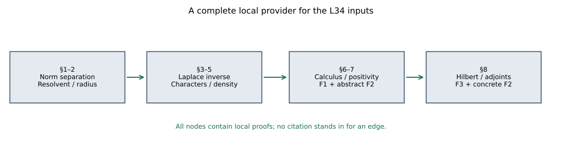

# Continuous calculus, positivity and Hilbert spaces

*Original exposition and illustration sources: CC0-1.0. Spot-checked by GPT-6 Astra in a separate session.*

This lesson proves the continuous functional calculus, positivity and Hilbert tools used by the representation and derivation lessons. It also constructs a unitization without assuming a representation theorem.

The primitive conventions are complex and real numbers, complete normed spaces, inner products, elementary real differentiation, and the axiom of choice in the programme's ordinary set theory (including ordinal comparison and transfinite recursion). We give the analytic and algebraic tools needed beyond those conventions. A C\*-algebra means a complete complex normed \*-algebra with the C\*-identity. The continuous-calculus results below concern nonzero unital algebras; Section 9 constructs the unitization needed for nonunital applications. Inner products are linear in the first variable.

## 1. Choice, norm separation and norm integrals

We first fix the set-theoretic consequence of choice that we use. For any set $S$, order types of well-orders on its subsets form a set, since their relations are subsets of $S\times S$. An ordinal larger than all those order types cannot inject into $S$: an injection would transfer its ordering to a subset of $S$ and contradict the choice of that ordinal. A choice function on the nonempty subsets of $S$ now enumerates $S$ by transfinite recursion: at each stage take its value on the elements not yet taken. This enumeration must exhaust $S$ before the preceding ordinal, since otherwise it would supply an injection. Its enumeration order well-orders $S$.

It follows that if every chain in a partially ordered set has an upper bound, there is a maximal element. Well-order the underlying set as just proved. Starting with an upper bound of the empty chain, at each successor stage choose the first element strictly above the last one, if there is one; at a limit stage choose the first upper bound of the chain already constructed. If this never stops, the construction injects an ordinal that cannot inject into the underlying set into that set, a contradiction. At a limit stage the chosen upper bound is distinct from all earlier elements, since the earlier strictly ascending chain has no last element. A stopping successor stage supplies the required maximal element. Thus no later mathematical maximality theorem is imported.

The finite-dimensional compactness used below has this elementary proof. If an open cover of a closed bounded real box had no finite subcover, bisect each coordinate and choose a subbox still having no finite subcover. Repeat. Real completeness supplies a point in all the nested closed boxes, whose diameters tend to zero; an open member of the cover containing that point contains a sufficiently small whole box, a contradiction. A closed subset of a compact space is compact by adding its open complement to a cover, so closed complex discs and compact spectral sets have the same finite-cover property. Continuous images are compact by pulling back covers. A continuous real function on a compact set is bounded by a finite subcover of the sets $|f|<n$. If its supremum $m$ were not attained, the sets $f<m-1/n$ would cover the set, and a finite subcover would force its supremum below $m$, a contradiction; the infimum is treated with $-f$. On a compact box a continuous Banach-valued function is uniformly continuous: choose at each centre $x$ a radius $2r_x$ on which its change from $f(x)$ is less than $\varepsilon/2$, take a finite subcover by the balls of radius $r_x$, and use the least of those finitely many radii for the distance between two points. Both then lie within $2r_x$ of the same centre. Finitely many local bounds also prove boundedness. The scalar mean value theorem follows from attained extrema and the two one-sided derivative signs at an interior extremum, first for equal endpoint values and then after subtracting their affine interpolant.

**Norm separation.** A bounded complex-linear functional on a subspace of a complex normed space extends with the same norm. To prove this, first let a real functional $f$ on $W$ satisfy $f(w)\le p(w)$ for a sublinear $p$. On adding a vector $v\notin W$, choose

$$\sup_{w\in W}\bigl(f(w)-p(w-v)\bigr)
\le c\le
\inf_{w\in W}\bigl(p(w+v)-f(w)\bigr).$$

The left endpoint is at most the right: sublinearity applied to $(w_2+v)+(w_1-v)$ and linearity of $f$ give this for every pair $w_1,w_2$. Both endpoints are finite on their required sides by using $w=0$. The definition $f(w+tv)=f(w)+tc$ is dominated by $p$, using separately $t>0$, $t<0$, and $t=0$. Chain unions preserve this property, so the preceding maximality argument extends $f$ to the whole real space. For a complex functional $\varphi$, extend $\operatorname{Re}\varphi$ with $p(x)=\|\varphi\|\|x\|$, and set $\Phi(x)=F(x)-iF(ix)$. This is complex linear and extends $\varphi$. Multiplying $x$ by a unit scalar makes $\Phi(x)$ real and nonnegative, so $|\Phi(x)|\le\|\varphi\|\|x\|$. In particular, for any nonzero $x$ there is a norm-one functional with $\Phi(x)=\|x\|$. Consequently

$$\|x\|=\sup_{\|\Phi\|\le1}|\Phi(x)|,$$

and a vector annihilated by all bounded functionals is zero.

For a continuous map $f:[a,b]\to X$ into a Banach space, its Riemann sums are Cauchy in norm: compare two sums on a common refinement and use uniform continuity times $b-a$. Completeness defines the integral. Refinement also proves $\|\int f\|\le\int\|f\|$, and every bounded linear map passes through it. The difference quotient of $t\mapsto\int_a^t f$ differs from $f(t)$ by at most its modulus of continuity, proving that this integral has derivative $f(t)$. If $g$ is continuously differentiable, the function $g(t)-\int_a^t g'(s)\,ds$ has derivative zero. Apply each norm-separating functional, and the scalar mean value theorem just proved to its real and imaginary parts, to show that it is constant. Its value at $a$ is $g(a)$, so $g(b)-g(a)=\int_a^b g'$. These statements apply to complex-valued periodic integrals as well. An integral on $[0,\infty)$ exists whenever the integrals of the norm on tails tend to zero.

We also fix the norm-series operation used below. If $\sum_j\|x_j\|<\infty$, finite subsums form a norm-Cauchy net, since their complementary norm sum can be made arbitrarily small; completeness supplies its limit. Any countable regrouping has the same limit: first keep a finite set with small complementary norm sum, then keep the finitely many groups containing its terms. For two such series in a Banach algebra, the complementary norm sum outside a finite rectangle is bounded by
$(\sum_{j\notin J}\|x_j\|)\sum_k\|y_k\|+\sum_j\|x_j\|(\sum_{k\notin K}\|y_k\|)$.
It tends to zero. Rectangular partial sums converge to the product by continuity of multiplication, so their double sum and regroupings equal that product. For commuting $x,y$, induction on $n$, using Pascal's identity, proves the binomial formula for $(x+y)^n$. Together these observations justify every product and regrouping of exponential series used here.

## 2. Spectrum in a Banach algebra, without imported complex analysis

Let $D$ be a nonzero unital Banach algebra with $\|1\|=1$. If $\|v\|<1$, the convergent geometric series is the two-sided inverse of $1-v$. It follows that the invertibles form an open set and inversion is continuous: write $b=a(1+a^{-1}(b-a))$. Define $\sigma_D(x)$ by failure of invertibility of $\lambda1-x$. It is closed and lies in $|\lambda|\le\|x\|$. On its complement the resolvent $R(\lambda)=(\lambda1-x)^{-1}$ has the locally norm-convergent expansion

$$R(\lambda+h)=\sum_{k=0}^{\infty}(-h)^kR(\lambda)^{k+1}.$$

Thus it is continuously complex differentiable, with derivative $-R(\lambda)^2$. No contour theorem is being assumed here.

We need a simple circle calculation. If $g$ is continuously complex differentiable on an annulus, put $m(\rho)=(2\pi)^{-1}\int_0^{2\pi}g(\rho e^{it})\,dt$. Differentiating under the integral gives

$$m'(\rho)=\frac1{2\pi i\rho}\int_0^{2\pi}
\frac{\partial}{\partial t}g(\rho e^{it})\,dt=0.$$

Differentiation under the integral follows from the continuous derivative on a compact subannulus and uniform convergence of difference quotients. If $g$ is defined on a disc including its centre, continuity also gives $m(\rho)\to g(0)$ as $\rho\downarrow0$.

The spectrum cannot be empty. Otherwise $\Phi(R(\lambda))$ is defined and differentiable on the whole plane for every bounded functional $\Phi$. Its circle mean equals its value at zero. The geometric expansion for $|\lambda|>\|x\|$ gives $\|R(\lambda)\|\le(|\lambda|-\|x\|)^{-1}$, so those means tend to zero as $\rho\to\infty$. All functionals then vanish on $R(0)$, impossible for an inverse in a nonzero algebra. We have proved that $\sigma_D(x)$ is nonempty and compact.

Write $r=\max_{\lambda\in\sigma_D(x)}|\lambda|$. Polynomial factorization shows that $\lambda\in\sigma_D(x)$ implies $\lambda^n\in\sigma_D(x^n)$: the commuting factors of $x^n-\lambda^n1$ include $x-\lambda1$, and a product of commuting elements is invertible only if every factor is invertible (multiply the inverse product by the other factors to obtain both-sided inverses). Hence $r\le\|x^n\|^{1/n}$. Conversely, fix $\rho>r$. Apply the circle calculation on $|\lambda|>r$ to $g(\lambda)=\lambda^{n+1}\Phi(R(\lambda))$. On a sufficiently large circle the geometric expansion has circle mean $\Phi(x^n)$, since all nonconstant integer powers of $e^{it}$ integrate to zero. The mean is independent of radius. Therefore

$$\|x^n\|\le\rho^{n+1}\max_{|\lambda|=\rho}\|R(\lambda)\|.$$

Norm separation justifies the displayed norm bound from the scalar bounds. Taking $n$th roots and then decreasing $\rho$ to $r$ proves

$$\lim_{n\to\infty}\|x^n\|^{1/n}=r.$$

The elementary identity

$$ (\lambda1-yx)^{-1}
=\lambda^{-1}\bigl(1+y(\lambda1-xy)^{-1}x\bigr)
\quad(\lambda\ne0)$$

is verified by multiplication on both sides. Consequently $xy$ and $yx$ have the same nonzero spectral points. Finally, a nonzero complex unital Banach division algebra is $\mathbb C1$: choose a spectral point of $x$; then $x-\lambda1$ must be zero because it is noninvertible.

## 3. C\*-norms and self-adjoint spectra

The involution is isometric: $\|x\|^2=\|x^*x\|\le\|x^*\|\|x\|$ and the same inequality for $x^*$ give equality. The nonzero identity has norm one because its C\*-identity says $\|1\|^2=\|1\|$. For $h=h^*$ the norm-convergent exponential $e^{ith}$ is unitary. Indeed multiplication of absolutely convergent series gives $e^{ith}e^{-ith}=1$, and taking adjoints gives $(e^{ith})^*=e^{-ith}$. Its norm is one by the C\*-identity. The derivative is $ih e^{ith}$: on a bounded real interval the series and its termwise derivative converge uniformly by their factorial bounds; integrate the uniformly convergent derivative series, use Section 1 on each partial sum, and differentiate the resulting integral identity.

For $s>0$ the integral

$$v=\int_0^\infty e^{-st}e^{ith}\,dt$$

converges in norm. Differentiation of the integrand and the fundamental theorem proved in Section 1 give $(s1-ih)v=v(s1-ih)=1$, with $\|v\|\le1/s$. Applying this to the self-adjoint $r1-h$ shows that $r+is-h=i(s1-i(r1-h))$ is invertible. Negative imaginary parts follow by taking adjoints. Thus $\sigma(h)\subset\mathbb R$. This local Laplace-integral argument avoids the holomorphic functional-calculus chain in the earlier CF proof.

If $x$ is normal, then $\|x^2\|^2=\|(x^*x)^2\|=\|x^*x\|^2=\|x\|^4$; the middle equality uses the C\*-identity on the self-adjoint $x^*x$. Induction yields $\|x^{2^k}\|=\|x\|^{2^k}$. Section 2's spectral-radius formula now gives $\|x\|=r(x)$ for every normal $x$.

**Spectral permanence.** Suppose $E\subset D$ is a closed unital C\*-subalgebra with the same identity. For self-adjoint $h\in E$, off-real inverses belong to $E$ by the integral just proved. If a real $\lambda1-h$ is invertible in $D$, its inverses at $\lambda+i/n$ converge in $D$ to that inverse, by continuity of inversion. Closure puts the limit in $E$. Thus $h$ has the same spectrum in both algebras. For arbitrary $x\in E$ invertible in $D$, both $x^*x$ and $xx^*$ are self-adjoint and invertible in $D$, so their inverses belong to $E$. The elements $(x^*x)^{-1}x^*$ and $x^*(xx^*)^{-1}$ are respectively a left and a right inverse of $x$ in $E$; they agree. Apply this to $x-\lambda1$ to obtain equality of its two spectra.

## 4. Characters and their compact space

In a commutative unital Banach algebra, every proper ideal lies in a maximal proper ideal by Section 1: a union of a chain of proper ideals still omits $1$. A maximal ideal $J$ is closed. Its closure is an ideal; if that closure contained $1$, an element of $J$ within distance less than one of $1$ would be invertible by the geometric series, contradicting properness. The quotient by a closed ideal is complete: for a Cauchy sequence of cosets choose a subsequence with successive quotient distances less than $2^{-n}$, choose lifts of those successive differences of norm less than $2^{1-n}$, and sum their absolutely convergent series. Its cosets converge; then the original Cauchy sequence converges. The quotient norm is submultiplicative, and its identity has norm one, since an element of the ideal within distance less than one of $1$ would be invertible. For maximal $J$, commutativity implies the quotient is a division algebra, hence is $\mathbb C$ by Section 2. The quotient gives a character, meaning a unital complex algebra homomorphism $\chi:D\to\mathbb C$.

Characters satisfy $\chi(x)\in\sigma_D(x)$, since an inverse for $x-\chi(x)1$ would remain an inverse after applying $\chi$. Thus $|\chi(x)|\le\|x\|$ and $\|\chi\|=1$. Every spectral point arises this way: the principal ideal generated by a noninvertible $x-\lambda1$ is proper, so enlarge it to a maximal ideal.

For clarity, compactness of the character space needs no unproved Banach–Alaoglu invocation. Embed the characters in

$$P=\prod_{x\in D}\{z\in\mathbb C:|z|\le\|x\|\}$$

by their values. Each factor is compact by finite-dimensional Euclidean compactness. The product is compact by this choice proof. A proper filter extends to an ultrafilter by maximality; maximality forces it to contain one of $S$ and its complement for every subset $S$, since otherwise adjoining $S$ still has the finite-intersection property. In a compact space every ultrafilter converges: the closed sets that are closures of its members have the finite-intersection property and hence a common point; every neighbourhood of that point must belong to the ultrafilter. Conversely, if every ultrafilter converges, a family of closed sets with the finite-intersection property generates a proper filter, extends to an ultrafilter, and its limit belongs to all those sets. These two arguments establish the compactness criterion. An ultrafilter on $P$ has a limit in every coordinate; each neighbourhood restricting finitely many coordinates belongs to it, so it converges to the tuple of those limits. This proves product compactness. The character equations $\chi(1)=1$, $\chi(x+y)=\chi(x)+\chi(y)$, $\chi(tx)=t\chi(x)$, and $\chi(xy)=\chi(x)\chi(y)$ define a closed subset of $P$. The character space $X$ is therefore compact and Hausdorff, with the topology of coordinate evaluation.

## 5. The compact polynomial-density step

We give the exact approximation lemma. On $[0,1]$, the Bernstein polynomial of a continuous $f$ is

$$B_nf(t)=\sum_{k=0}^n f(k/n){n\choose k}t^k(1-t)^{n-k}.$$

The coefficients are nonnegative and sum to one. Their first and second centred moments are $0$ and $t(1-t)/n$, by differentiating $(1-t+ts)^n$ at $s=1$. For any $\eta>0$ the total coefficient mass where $|k/n-t|\ge\eta$ is at most $1/(4n\eta^2)$. Uniform continuity, followed by this bound on the remaining terms, gives

$$|B_nf(t)-f(t)|\le\omega_f(\eta)+\frac{2\|f\|_\infty}{4n\eta^2}.$$

Choose $\eta$ first and then $n$; this proves uniform approximation. Rescaling proves polynomial approximation of $|t|$ on every compact interval.

Let $K$ be compact Hausdorff and let $\mathcal R\subset C(K,\mathbb R)$ be a real algebra containing constants and separating points. Its uniform closure is an algebra. If $g$ is in that closure, polynomial approximation of absolute value on $[-\|g\|,\|g\|]$ shows $|g|$ lies in it. Consequently it is closed under pairwise maximum and minimum. Given $f\in C(K,\mathbb R)$ and $\varepsilon>0$, for each pair $p,q$ choose an affine transform $g_{pq}\in\mathcal R$ of a separating function such that $g_{pq}(p)=f(p)$ and $g_{pq}(q)=f(q)$; when $p=q$, a constant suffices. For fixed $p$, the open sets where $g_{pq}>f-\varepsilon$ cover $K$. Take finitely many, and let $h_p$ be the maximum of their $g_{pq}$. It exceeds $f-\varepsilon$ everywhere and equals $f$ at $p$. The sets where $h_p<f+\varepsilon$ cover $K$. Take finitely many and form their minimum $h$. Then $f-\varepsilon<h<f+\varepsilon$ everywhere. Since $h$ lies in the closure, so does $f$. For a complex algebra closed under conjugation, its real-valued part separates points (take real or imaginary parts of a separator), and this argument proves density in $C(K,\mathbb C)$.

## 6. Continuous calculus, with all identifications proved

For a commutative unital C\*-algebra $D$, set $\widehat x(\chi)=\chi(x)$ on its compact character space. This map is a unital algebra homomorphism into $C(X)$. For self-adjoint $h$, Section 3 shows $\chi(h)\in\mathbb R$. Splitting an arbitrary $x$ into self-adjoint real and imaginary parts gives $\widehat{x^*}=\overline{\widehat x}$. Every element is normal, so Sections 2–4 give

$$\|\widehat x\|_\infty=\max_{\lambda\in\sigma_D(x)}|\lambda|=\|x\|.$$

The image is closed, since it is isometric and $D$ is complete. It contains constants, is closed under conjugation, and separates distinct characters. Section 5 makes it dense, hence equal to $C(X)$.

Here $C(X)$ is complete in its supremum norm: a norm-Cauchy sequence converges pointwise in $\mathbb C$, the convergence is uniform by the Cauchy bound, and the uniform limit is continuous by a three-term $\varepsilon$ estimate at each point. Its algebra operations and involution are pointwise, and its C\*-identity is the scalar identity $|\overline z z|=|z|^2$.

Now let $a$ be normal in a unital C\*-algebra $D$. The closed algebra $E=C^*(1,a)$ is commutative. The map $\chi\mapsto\chi(a)$ from its character space to $\sigma_E(a)=\sigma_D(a)$ is surjective by Section 4 and spectral permanence. It is injective because a character's values on $1,a,a^*$ determine its values on all \*-polynomials and then, by continuity, on their closure $E$. It is continuous by the coordinate topology. A continuous bijection from a compact space to a Hausdorff space is a homeomorphism: images of closed subsets are compact and hence closed (separate a point outside a compact set by finitely many disjoint neighbourhood pairs). Composing this identification with the inverse Gelfand map constructs an isometric unital \*-isomorphism

$$\Phi_a:C(\sigma_D(a))\longrightarrow C^*(1,a),
\qquad\Phi_a(\operatorname{id})=a.$$

We denote $\Phi_a(f)$ by $f(a)$. To justify uniqueness without assuming continuity of an algebraic \*-homomorphism, observe that every unital \*-homomorphism $\pi$ between C\*-algebras is contractive. Algebraic inverse preservation gives $\sigma(\pi(y))\subset\sigma(y)$; applying normal norm-equals-radius to the self-adjoint $y=x^*x$ gives $\|\pi(x)\|^2\le\|x\|^2$. Thus any proposed calculus with the same coordinate is continuous and agrees on \*-polynomials. Those polynomials are dense by Section 5 on the compact subset $\sigma(a)\subset\mathbb C$, so the calculus is unique.

For completeness, spectra of $f(a)$ are exactly $f(\sigma(a))$. In $C(K)$, a continuous function minus $\lambda$ is invertible exactly when it is nowhere zero: in that case its reciprocal is continuous; otherwise evaluation at a zero forbids an inverse. The isomorphism and spectral permanence give the claim in $D$. If $f$ is continuous and $g$ is continuous on $f(\sigma(a))$, the map $g\mapsto(g\circ f)(a)$ is an isometric unital \*-isomorphism into $C^*(1,f(a))$: its image is precisely that algebra by coordinate/conjugate-coordinate polynomial density. Uniqueness proves

$$g(f(a))=(g\circ f)(a).$$

If an operator commutes with $a$ and $a^*$, it commutes with every \*-polynomial and their norm limits, hence with every $f(a)$. These statements include all of F1, in particular for self-adjoint $a$.

## 7. Positivity and order

Define $D_+=\{h=h^*: \sigma(h)\subset[0,\infty)\}$. For a self-adjoint $h$, the calculus shows

$$h\in D_+\quad\Longleftrightarrow\quad
\|t1-h\|\le t\text{ for some }t\ge0.$$

The forward direction uses $t=\|h\|$; the reverse puts every real spectral value in $[0,2t]$. This criterion proves that $D_+$ is closed under nonnegative scaling and addition: add the two norm inequalities and use the triangle inequality. It is norm closed: if $h_n\ge0$ tends to $h$, choose one common $t$ larger than all $\|h_n\|$ and pass to the limit. It is pointed, because $h,-h\ge0$ force $\sigma(h)=\{0\}$ and the self-adjoint norm formula gives $h=0$. The calculus supplies a positive square root of every positive $h$.

We still have to prove, rather than assume, that $x^*x$ is positive. Put $h=x^*x$. Its real spectrum permits continuous positive and negative parts $h_+$ and $h_-$, with $h=h_+-h_-$ and $h_+h_-=0$. Let $v=h_-^{1/2}$ and $w=xv$. Commuting calculus gives

$$w^*w=vhv=-v^4.$$

Write $w=k+i\ell$ with $k,\ell$ self-adjoint. Their squares are positive by spectral mapping, so

$$ww^*=2k^2+2\ell^2-w^*w=2k^2+2\ell^2+v^4\ge0.$$

Section 2's $xy/yx$ identity says that $w^*w$ and $ww^*$ have the same nonzero spectrum. The former has nonpositive spectrum and the latter nonnegative spectrum, so $\sigma(w^*w)\subset\{0\}$. The self-adjoint norm formula implies $v^4=0$, hence $v=0$ by its calculus, and $h_-=0$. Thus $x^*x\ge0$.

Conversely, every positive element is a square $b^*b$ by its positive square root. It follows that $c^*hc\ge0$ for $h\ge0$, because it is $(h^{1/2}c)^*(h^{1/2}c)$. This proves order preservation under congruence. The positive square root is unique: if $b\ge0$ and $b^2=h$, composition of the calculus for $b$ with the scalar identity $\sqrt{t^2}=t$ on $[0,\infty)$ gives $\sqrt h=b$.

For a positive element, $h\le t1$ is equivalent to $\|h\|\le t$ for $t\ge0$, by its real spectrum and the calculus. Consequently if $0\le h\le k$, then $h\le k\le\|k\|1$, so $\|h\|\le\|k\|$. This proves the abstract statements of F2. The concrete criterion is proved after the Hilbert tools, to avoid a hidden adjoint input.

## 8. Hilbert space facts and the concrete positive-operator criterion

Let $H$ be an arbitrary complex Hilbert space. The zero space gives all the statements immediately; otherwise $B(H)$ is nonzero and unital. For $\eta\ne0$, nonnegativity of $\|\xi-t\eta\|^2$ at $t=\langle\xi,\eta\rangle/\|\eta\|^2$ proves

$$|\langle\xi,\eta\rangle|^2\le\|\xi\|^2\|\eta\|^2.$$

The case $\eta=0$ is immediate. For a closed linear subspace $V$ and $\xi\in H$, choose $v_n\in V$ whose squared distances to $\xi$ tend to their infimum $m$. The parallelogram identity gives

$$\|v_n-v_k\|^2
=2\|\xi-v_n\|^2+2\|\xi-v_k\|^2
-4\left\|\xi-\frac{v_n+v_k}{2}\right\|^2\longrightarrow0.$$

Completeness and closedness give a minimizer $v$. Varying $v$ by $tw$, for real $t$ and then purely imaginary $t$, proves $\xi-v\perp V$. The decomposition $\xi=v+(\xi-v)$ is unique. It proves that the orthogonal projection $P_V$ is linear, contractive, idempotent, and self-adjoint.

Every bounded linear functional $f$ has the form $f(\xi)=\langle\xi,\eta\rangle$ for a unique $\eta$. If $f\ne0$, its closed kernel has orthogonal complement; project a vector outside that kernel to obtain a nonzero $v\perp\ker f$. Every $\xi-(f(\xi)/f(v))v$ lies in the kernel, so

$$f(\xi)=\frac{f(v)}{\|v\|^2}\langle\xi,v\rangle
=\left\langle\xi,\frac{\overline{f(v)}}{\|v\|^2}v\right\rangle.$$

Uniqueness follows by taking the difference vector as a test vector, and Cauchy–Schwarz plus that test gives $\|f\|=\|\eta\|$. For $T\in B(H)$ apply this representation to $\xi\mapsto\langle T\xi,\eta\rangle$. The representing vector is $T^*\eta$; uniqueness proves linearity in $\eta$, and its norm is at most $\|T\|\|\eta\|$. This constructs the adjoint, proves $T^{**}=T$ and $\|T^*\|=\|T\|$, and verifies the product-adjoint rule by testing inner products. Moreover

$$\|T\xi\|^2=\langle T^*T\xi,\xi\rangle
\le\|T^*T\|\|\xi\|^2,$$

which, together with submultiplicativity, proves $\|T^*T\|=\|T\|^2$. A norm-Cauchy sequence of operators has pointwise limits, which define a bounded linear operator and are approached uniformly on the unit ball; this proves completeness of $B(H)$. Thus it is a C\*-algebra, and all preceding results apply. These arguments prove F3 without a dimensional or separability restriction.

If $T\in B(H)$ is abstractly positive, write $T=S^*S$ by Section 7; then $\langle T\xi,\xi\rangle=\|S\xi\|^2\ge0$. Conversely, suppose that all these quadratic values are real and nonnegative. Reality forces $T=T^*$: apply the complex polarization identity to the sesquilinear form of $T-T^*$, whose diagonal is zero. The identity itself follows by expanding the four diagonals at $\xi\pm\eta$ and $\xi\pm i\eta$. For a real $\lambda<0$, Cauchy–Schwarz gives

$$\|(T-\lambda1)\xi\|\|\xi\|
\ge\langle(T-\lambda1)\xi,\xi\rangle
\ge|\lambda|\|\xi\|^2.$$

This lower bound makes the range closed: a Cauchy sequence of images has Cauchy preimages. The range is dense, since a vector perpendicular to it is annihilated by the self-adjoint $T-\lambda1$ and the same lower bound forces that vector to vanish. Therefore $T-\lambda1$ is bijective with bounded inverse. All negative real numbers are outside the spectrum; all nonreal numbers already are outside it by Section 3. Thus $T\ge0$ in the abstract sense. This proves the concrete part of F2.

## 9. Unitization

**Theorem R1.** Let \(A\) be any C\* algebra, including \(A=0\). On the vector space \(A\oplus\mathbb C\) define
\[
(a,\lambda)(b,\mu)=(ab+\lambda b+\mu a,\lambda\mu),
\qquad
(a,\lambda)^*=(a^*,\bar\lambda).
\tag{GNS-R1.1}
\]
This is a unital C\* algebra for the norm
\[
\|(a,\lambda)\|_\dagger
=\max\{p(a,\lambda),|\lambda|\},\qquad
p(a,\lambda)=\sup_{\|b\|\leq1}\|ab+\lambda b\|.
\tag{GNS-R1.2}
\]
Its unit is \((0,1)\). The map \(a\mapsto(a,0)\) embeds \(A\) isometrically as a closed ideal, and the bounded unital star homomorphism \(q(a,\lambda)=\lambda\) has precisely that ideal as its kernel.

If \(A\) already has a unit \(1_A\), the map
\[
\Theta(a,\lambda)=(a+\lambda1_A,\lambda)
\tag{GNS-R1.3}
\]
is an isometric star isomorphism onto \(A\oplus\mathbb C\) with coordinatewise multiplication and maximum norm. The new unit is distinct from the embedded old unit. This statement includes the zero algebra, whose old unit is zero.

**Proof.** First the C\* identity makes the involution isometric: for \(a\neq0\),
\(\|a\|^2=\|a^*a\|\leq\|a^*\|\|a\|\) gives \(\|a\|\leq\|a^*\|\), and applying the same inequality to \(a^*\) gives equality. It also gives \(\|aa^*\|=\|a\|^2\).

Regard \(u=(a,\lambda)\) as the linear operator \(L_u:b\mapsto ab+\lambda b\) on \(A\). Direct expansion of (GNS-R1.1) gives \(L_{uv}=L_uL_v\). Expansion of a triple product gives first coordinate
\[
abc+\lambda bc+\mu ac+\nu ab
+\lambda\mu c+\lambda\nu b+\mu\nu a
\]
and scalar coordinate \(\lambda\mu\nu\) in either bracketing. Thus the product is associative. The stated adjoint reverses products by direct expansion, squares to the identity, and is conjugate linear. The element \((0,1)\) is a two-sided unit. Multiplying by \((b,0)\) shows that the embedded \(A\) is an ideal; the scalar coordinate proves the assertions about \(q\) algebraically.

The operator norm \(p\) is a submultiplicative seminorm and satisfies \(p(a,\lambda)\leq\|a\|+|\lambda|\). On an embedded element \(a\), the upper bound \(p(a,0)\leq\|a\|\) is immediate. For \(a\neq0\), test \(L_a\) at \(b=a^*/\|a\|\); its image has norm \(\|aa^*\|/\|a\|=\|a\|\). For \(a=0\) equality is immediate. Hence \(p(a,0)=\|a\|\).

For any \(u\) and \(\|b\|\leq1\), all the products involving \(ub\) belong to \(A\), where the C\* identity applies:
\[
\|ub\|^2
=\|b^*(u^*u)b\|
\leq\|b^*\|\,\|(u^*u)b\|
\leq p(u^*u).
\]
Taking the supremum gives
\[
p(u)^2\leq p(u^*u)\leq p(u^*)p(u).
\tag{GNS-R1.4}
\]
If \(p(u)>0\), this implies \(p(u)\leq p(u^*)\), and the reverse implication comes from applying it to \(u^*\). If either seminorm is zero, the inequality applied to the adjoint shows the other is zero as well. Thus \(p(u^*)=p(u)\) in all cases and \(p(u^*u)=p(u)^2\).

Taking the maximum with \(|q(u)|\) now gives a submultiplicative norm: definiteness follows from \(q(u)=0\) and \(p(a,0)=\|a\|\). Its involution is isometric and
\[
\|u^*u\|_\dagger
=\max\{p(u)^2,|q(u)|^2\}=\|u\|_\dagger^2.
\]
It is complete. Indeed, with \(S(u)=\|a\|+|\lambda|\),
\[
\|u\|_\dagger\leq S(u),\qquad
\|a\|=p(a,0)\leq p(u)+|\lambda|p(0,1)\leq2\|u\|_\dagger,
\]
since \(p(0,1)\leq1\). Also \(|\lambda|\leq\|u\|_\dagger\), so \(S(u)\leq3\|u\|_\dagger\). A sequence Cauchy for \(\|\cdot\|_\dagger\) is therefore Cauchy in the two complete coordinates, and its coordinate limit is approached in \(\|\cdot\|_\dagger\) by the first inequality. This proves completeness without a character theorem. The embedded \(A\) is isometric by the established formula for \(p(a,0)\), and is closed as the kernel of the bounded scalar map \(q\).

For an already unital \(A\), \(L_{(a,\lambda)}=L_{a+\lambda1_A}\), so
\[
p(a,\lambda)=\|a+\lambda1_A\|,
\qquad
\|(a,\lambda)\|_\dagger
=\max\{\|a+\lambda1_A\|,|\lambda|\}.
\]
Expanding products and adjoints verifies that \(\Theta\) respects both, and its inverse is \((c,\lambda)\mapsto(c-\lambda1_A,\lambda)\). The displayed norm is exactly the maximum norm of \(\Theta(a,\lambda)\). That coordinate algebra is complete and satisfies the C\* identity coordinatewise. Its new unit \((1_A,1)\) is different from the image \((1_A,0)\) of the old unit, even when \(1_A=0\), since the scalar coordinates differ. \(\square\)

**Corollary R2.** In Theorem R1, let \(a\in A\) be normal and let \(f\) be continuous on its spectrum in \(A^\dagger\), with \(f(0)=0\). Once the unital continuous calculus has been proved, \(f(a)\) belongs to \(A\). Positivity and order on \(A\) are the restrictions of those in \(A^\dagger\); its positive elements are precisely its squares \(b^*b\), with \(b\in A\). Positive and negative parts of a self-adjoint \(h\in A\) belong to \(A\) and have norms at most \(\|h\|\).

**Proof.** The scalar map \(q\) is bounded and sends \(a,a^*\) to zero. The spectrum contains zero: if \(a\) were invertible in \(A^\dagger\), its image under the unital homomorphism \(q\) would be invertible in \(\mathbb C\), which is impossible. Approximate \(f\) uniformly by polynomials in the coordinate and its conjugate, using the polynomial-density step of the unital calculus provider. For each such polynomial \(P\), \(q(P(a))=P(0)\). The isometric calculus and the boundedness of \(q\) allow passage to the limit, giving \(q(f(a))=f(0)=0\), so \(f(a)\in A\).

If \(h\in A\) is positive in \(A^\dagger\), its continuous positive square root vanishes at zero and lies in \(A\) by the first paragraph. Thus \(h=b^*b\) for \(b\in A\). Conversely every such square is positive in \(A^\dagger\), by the positive-cone theorem there. The restricted cone is closed and closed under sums, and all the order-conjugation and norm-monotonicity rules restrict to it. Apply the first paragraph to \(t\mapsto\max(t,0)\) and \(t\mapsto\max(-t,0)\) at \(h\). Their difference is \(h\), and their norms are at most \(\|h\|\) by the isometric scalar calculus. \(\square\)

## 10. Inner product completions

**Theorem R3.** Every complex inner product space \(E\) has a dense linear isometric embedding into a Hilbert space \(\widehat E\). Each bounded linear map \(T:E\to X\), where \(X\) is a Banach space, extends uniquely to a bounded linear map on \(\widehat E\) with the same norm. No dimension or countability hypothesis is imposed.

**Proof.** For \(y\neq0\), positivity of the squared norm at \(x-\lambda y\), with \(\lambda=\langle x,y\rangle/\|y\|^2\), gives
\[
0\leq\|x-\lambda y\|^2
=\|x\|^2-\frac{|\langle x,y\rangle|^2}{\|y\|^2}.
\]
For \(y=0\), the cross term is zero. This proves scalar Cauchy–Schwarz. Expanding \(\|x+y\|^2\) and bounding its cross term gives \(\|x+y\|\leq\|x\|+\|y\|\), so the inner-product norm satisfies the triangle inequality. Let \(\mathscr C(E)\) be the vector space of norm-Cauchy sequences in \(E\). Its linearity follows from that inequality. Declare \(x=(x_n)\) equivalent to \(y=(y_n)\) when \(\|x_n-y_n\|\to0\). This is an equivalence relation compatible with addition and scalar multiplication, again by the triangle inequality.

Cauchy sequences are bounded. The scalar Cauchy–Schwarz inequality just proved gives
\[
|\langle x_n,y_n\rangle-\langle x_m,y_m\rangle|
\leq\|x_n-x_m\|\|y_n\|+\|x_m\|\|y_n-y_m\|.
\tag{GNS-R3.1}
\]
Thus the products have limits. If representatives are replaced by equivalent sequences, the same estimate with \(m,n\) replaced by the two representatives shows that the limit is unchanged. On the quotient \(\widehat E=\mathscr C(E)/{\sim}\), put
\[
\langle[x],[y]\rangle=\lim_n\langle x_n,y_n\rangle.
\tag{GNS-R3.2}
\]
Sesquilinearity and Hermitian symmetry pass to limits. The scalar norms \(\|x_n\|\) are Cauchy, because their differences are at most \(\|x_n-x_m\|\). The diagonal of (GNS-R3.2) is their squared limit. It vanishes exactly when \(x\) is equivalent to zero. Therefore this is a positive definite inner product, with \(\|[x]\|=\lim_n\|x_n\|\).

Constant sequences embed \(E\) linearly and isometrically. They are dense: for a Cauchy sequence \(x\) and \(\varepsilon>0\), sufficiently large \(n\) satisfy \(\|x_n-x_m\|\leq\varepsilon\) for all sufficiently large \(m\). Taking \(m\to\infty\) gives distance at most \(\varepsilon\) from the constant \(x_n\) to \([x]\).

To prove completeness, let \((z_k)\) be Cauchy in \(\widehat E\). Choose \(v_k\in E\) whose constant sequence is within \(1/k\) of \(z_k\), using density. The inequality
\[
\|v_k-v_l\|\leq1/k+\|z_k-z_l\|+1/l
\]
shows that \((v_k)\) is Cauchy in \(E\), so it defines \(z=[(v_k)]\). The density estimate already proved says that the constants \(v_k\) converge to this \(z\). Hence \(z_k\to z\) by the triangle inequality. This is completeness.

For the extension define
\[
\widehat T([x])=\lim_n T(x_n).
\tag{GNS-R3.3}
\]
The bound \(\|T(x_n)-T(x_m)\|\leq\|T\|\|x_n-x_m\|\) gives existence of this limit in \(X\), and the same bound gives independence of representatives. Linearity passes through limits, and
\(\|\widehat T([x])\|\leq\|T\|\|[x]\|\). The extension restricts to \(T\) on constants, so its norm is also at least \(\|T\|\). Density forces uniqueness. \(\square\)

This construction applies to the quotient by the null space of any positive form, once the null space and quotient inner product have been proved. It applies to the algebraic direct sums in the faithful representation proof as well.

## 11. Freely accessible comparisons

Each node refers to the complete numbered sections above. The Hilbert-space arguments themselves are independent of the preceding spectral arguments; the final concrete positive-operator criterion uses both branches. The diagram records proof order and does not replace an argument. Its source is [make-proof-figures.py](../assets/cf-foundations/make-proof-figures.py).

Mathematical comparisons are [Vahid Shirbisheh, *Lectures on C\*-algebras*, arXiv:1211.3404v2](https://arxiv.org/pdf/1211.3404v2), Theorems 3.1.34 and 3.2.4, printed pages 64 and 70, and Proposition 4.1.8; and [Jesse Peterson, *Notes on operator algebras* (2015)](https://math.vanderbilt.edu/peters10/teaching/spring2015/OperatorAlgebras.pdf), Theorems 1.1.4, 1.2.6 and 1.3.1, pages 9, 16 and 17, and Proposition 3.0.21, pages 38–39. All mathematical inputs used in this provider are proved above.

The circle-mean argument, Laplace resolvent, compactness proof, approximation proof, positivity argument, and Hilbert arguments are expressed and checked here as complete proofs. The lesson has no edge to holomorphic spectral mapping, a Cauchy-cycle theorem, a Banach–Alaoglu citation, an omitted exercise, or a later programme lesson. Its primitive conventions, including the axiom of choice, are assumed and not proved here.
