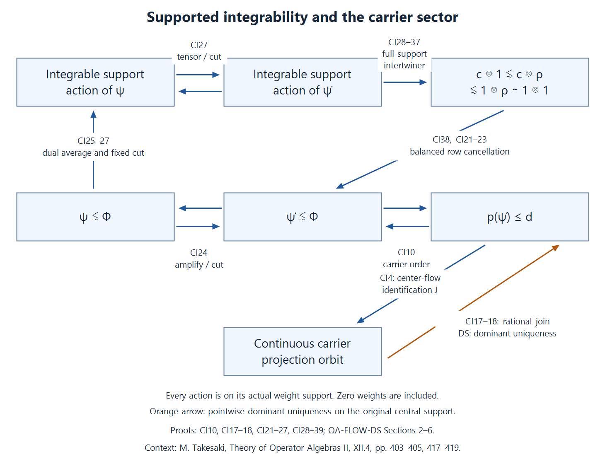

# The global carrier and integrable weights

A weight has both an inner-equivalence class and a modular action. The global carrier records the first as a projection in an abelian von Neumann algebra. We construct that algebra, identify exactly which of its sigma-finite projections have continuous scaling orbits, and relate that continuity to integrability of the weight's support modular action.

*Original exposition, examples, figures, data and reproducible drawing code in this lesson are dedicated to CC0-1.0. Source publications retain their own terms.*

## Scope and the three comparisons

Throughout, \(M\ne0\) has separable predual and properly infinite identity. It need not be a factor. Every weight is normal and semifinite; its modular action and centralizer are taken in its faithful support corner. The zero weight is included, with zero support and zero carrier. Equalities of weights hold on the entire positive cone, including infinite values.

Three comparisons drive the proof: weight comparison becomes projection comparison in a balanced centralizer; an integrable action supplies full-support intertwiners with its regular amplification; and pointwise scalar absorption gives dominant uniqueness on the original central support. The last input is the proved [pointwise dominant-weight theorem](OA-FLOW-DS.md#ds-6). The continuous-field comparison in [DWC](OA-FLOW-DWC.md#dwc-2) also remains available where an actual continuous field is supplied.

The global carrier will have a nonseparable predual even though \(M_*\) is separable. Continuity is therefore asserted only on its identified continuous sector. The finite-projection carrier for bounded normal functionals is a different construction.

## 1. The presentation and the precise conclusion

Choose a stabilized trace-scaling presentation
\[
 M=N\rtimes_\theta\mathbb R,\qquad
 \tau\theta_s=e^{-s}\tau,\qquad
 \Phi=\widehat\tau,\qquad N=M_\Phi,
 \tag{CI1}
\]
where \(N\) is properly infinite and \(\tau\) is faithful normal semifinite. The relations are \(u_sxu_s^*=\theta_s(x)\) and
\(\sigma_t^\Phi(u_s)=e^{-ist}u_s\). Thus
\[
 \Phi\operatorname{Ad}(u_s)=e^{-s}\Phi
 \quad\hbox{on }M_+.
 \tag{CI2}
\]
All Haar normalizations and infinite values are those of the actual dual weight.

This presentation exists at the stated scope. Form \(C=M\rtimes_{\sigma^\omega}\mathbb R\) from a faithful normal state \(\omega\), supplied by the [separable-predual construction](OA-FLOW-DS.md#ds-2). [CORE Sections 1–4](OA-FLOW-CORE.md#core-1) construct its faithful normal semifinite trace and its scaling action. [ND's complete duality map and inverse](OA-FLOW-ND.md#nd-construction) identify the second crossing with \(M\bar\otimes B(L^2\mathbb R)\). Amplify \(C\), its trace and its action by \(B(\ell^2)\), \(\operatorname{Tr}\) and the identity. Its crossing is the corresponding amplification of the second crossing: in the regular model interchange the constant \(\ell^2\) factor and check coefficient fields and translations; the inverse interchange is normal and onto. The new coefficient algebra is properly infinite. A countable filling family in \(M\), supplied by [PC5](OA-FLOW-PC.md#pc-5), gives the normal stable isomorphism
\[
 A_v:M\bar\otimes B(\ell^2)\longrightarrow M,\qquad
 A_v((x_{ij}))=\mathop{\mathrm{s^*\!-\!lim}}_F
                  \sum_{i,j\in F}v_i x_{ij}v_j^*.
 \tag{CI3}
\]
Indeed \((\xi_i)\mapsto\sum_i v_i\xi_i\) is unitary; it proves boundedness, the normal inverse \(x\mapsto(v_i^*xv_j)\), and all multiplication identities. A bijection of countable orthonormal bases absorbs both scalar Hilbert factors. Separable predual is retained. To obtain a separable faithful representation, take a countable norm-dense family of positive normal functionals and sum their norm-normalized values with strictly positive summable coefficients; the resulting normal state is faithful. Its GNS space is separable: choose a countable weak-star dense subset of the unit ball of \(M\); its GNS images are weakly total, since their pairings with \(\Lambda(y)\) are the normal functionals \(x\mapsto\omega(y^*x)\), and a linear subspace has the same weak and norm closure. The GNS representation is faithful and normal. Its real regular representation and countable amplification act on separable spaces; restriction of the trace-class predual makes their generated algebras have separable predual. [DWC Section 4](OA-FLOW-DWC.md#dwc-4) then gives \(N=M_\Phi\) and (CI2), on the whole positive cone.

Write \(W_\infty(M)\) for zero together with all normal semifinite weights whose support-corner centralizer is properly infinite. We construct an abelian carrier \((\mathcal A,p_M,\Theta)\), then prove
\[
 \begin{gathered}
 d=p_M(\Phi),\qquad
 J:Z(N)\overset{\cong}{\longrightarrow}\mathcal A d,\qquad
 J(z)=p_M(\Phi_z)\quad(z\text{ a projection}),\\
 J\theta_s=\Theta_sJ,\qquad \Theta_s(d)=d .
 \end{gathered}
 \tag{CI4}
\]
For every normal semifinite \(\psi\), let \(\dot\psi=A_{v*}(\psi\otimes\operatorname{Tr})\). The supported integrability theorem proved in Section 8 is
\[
 \sigma^{\psi|_{s(\psi)Ms(\psi)}}\text{ integrable}
 \quad\Longleftrightarrow\quad \psi\precsim\Phi.
 \tag{CI5}
\]
This is also equivalent to sigma-strong continuity of
\(s\mapsto\Theta_s(p_M(\dot\psi))\). The automorphism modulus and naturality are proved in Section 9; continuity in automorphism-group topologies and the characteristic square are separate conclusions.

## 2. Supported comparison and arbitrary balanced sums

The actual [OA-MOD supported comparison proof, WC.1–23](../../OA-MOD/OA-MOD-WC.html#the-balanced-centralizer-records-every-comparison) applies to arbitrary normal semifinite weights. Its conventions use a partial isometry \(w\in M\):
\[
 \begin{aligned}
 \alpha\sim\beta
 &\iff \alpha(x)=\beta(wxw^*)\quad(x\ge0),\\
 &\phantom{\iff{}}w^*w=s(\alpha),\quad ww^*=s(\beta);\\
 \alpha\precsim\beta
 &\iff \alpha\sim\beta_e,\quad e\in\operatorname{Proj}(M_\beta).
 \end{aligned}
 \tag{CI6}
\]
Both supports belong to their own faithful reduced algebras. Equivalence transports centralizers; cuts have centralizer \(eM_\beta e\). Reflexivity is immediate; composing the corner isomorphisms and their implementing partial isometries proves transitivity. In a balanced support centralizer, the two supported diagonal projections are equivalent or subequivalent exactly when the weights are. In particular
\[
 \Phi_e\precsim\Phi_f
       \iff e\precsim f\text{ in }N,\qquad e,f\in\operatorname{Proj}(N).
 \tag{CI7}
\]
The weight-to-projection implication uses WC's supported transport criterion to put the actual implementer in \(N\). Comparison in the larger algebra \(M\) would not suffice.

Here is the arbitrary balanced-sum argument needed beyond a finite matrix theorem. Given normal semifinite \(\phi_i\) and arbitrary set \(I\), set
\[
 \Lambda(X)=\sum_{i\in I}\phi_i(X_{ii}),\qquad
 S=\sum_i s(\phi_i)\otimes e_{ii},\qquad X\ge0.
 \tag{CI8}
\]
Every sum is the supremum of finite subsums. Finite unions prove additivity, and interchange of the finite-subset and increasing-net suprema proves normality. The support is \(S\): a zero positive value forces each \(s(\phi_i)X_{ii}s(\phi_i)\) to vanish; positivity gives \(X^{1/2}(s(\phi_i)H\otimes e_i)=0\) for every \(i\). Conversely \(\Lambda(X)=\Lambda(SXS)\), by the scalar support theorem. The reduced weight is faithful.

For each \(i\), choose finite positive contractions for \(\phi_i\) on its support increasing to \(s(\phi_i)\). Their finite diagonal sums form an increasing net of finite contractions tending strongly to \(S\). Adding \(1-S\) gives finite contractions tending to one on the full algebra. The finite-contraction criterion, used with precisely this net in [TW2](OA-FLOW-TW.md#tw-2), proves semifiniteness.

Each diagonal support \(d_i=s(\phi_i)\otimes e_{ii}\) is modular-fixed: conjugation by the selfadjoint unitary \(S-2d_i\) leaves every diagonal value in (CI8) unchanged, so [CZ0's whole-cone criterion](OA-FLOW-CZ.md#oa-flow.cz.0) puts that unitary, and hence \(d_i\), in the reduced centralizer. The same holds for every finite sum of these projections. Its restricted weight is the finite balanced weight, with the exact same positive values; [CZ5's corner theorem](OA-FLOW-CZ.md#oa-flow.cz.5) identifies its modular group with the restricted modular group. Thus the finite supported comparison theorem applies to every pair of diagonal coordinates in the arbitrary sum. No arbitrary-index modular formula or common intersection of unrelated finite ideals is assumed.

The same reasoning applies to a weight \(\sum_i\eta_i(e_i x e_i)\) on any algebra, with orthogonal supports \(e_i\). It proves normal semifiniteness, support \(\sum_i e_i\), fixedness of every \(e_i\), and the correct reduced modular action. In particular such an orthogonal sum has properly infinite centralizer if every nonzero diagonal centralizer is properly infinite: sum two orthogonal isometries from each diagonal corner strongly; their initial projections sum to the whole support and their final projections remain orthogonal.

## 3. The universal carrier, including surjectivity and Boolean reconstruction

Take \(I=W_\infty(M)\), form (CI8), and put
\[
 Q=(S(M\bar\otimes B(\ell^2I))S)_\Lambda,\qquad
 \mathcal A=Z(Q),\qquad p_M(\phi)=z_Q(d_\phi).
 \tag{CI9}
\]
Zero has zero diagonal support. For nonzero \(\phi\), \(d_\phi Qd_\phi=M_\phi\) is properly infinite and countably decomposable. A faithful normal state of \(M\) restricts faithfully to the support and centralizer. The central projection \(z_Q(d_\phi)\) is sigma-finite in \(\mathcal A\): compression is an injective normal map from \(\mathcal A z_Q(d_\phi)\) into \(d_\phi Qd_\phi\), by [PC4](OA-FLOW-PC.md#pc-4); composing with that corner state supplies a faithful normal state. It is not necessary that \(z_Q(d_\phi)\) be countably decomposable in \(Q\).

The pairwise balanced comparison above and [PC7's source-countable comparison](OA-FLOW-PC.md#pc-7) give
\[
 p_M(\phi)\le p_M(\psi)\iff\phi\precsim\psi,
 \qquad p_M(\phi)=p_M(\psi)\iff\phi\sim\psi .
 \tag{CI10}
\]
For the second assertion use projection Cantor–Bernstein in the common balanced centralizer. These assertions include zero.

To prove surjectivity, let \(a\in\operatorname{Proj}_\sigma(\mathcal A)\). Take a maximal orthogonal family of nonzero carrier projections \(p_M(\phi_i)\le a\). It is countable, since a faithful normal state on \(\mathcal A a\) is strictly positive on each family member. Put \(p_i=s(\phi_i)\), \(z_i=z_M(p_i)\). Proper infiniteness of \(M_{\phi_i}\) implies proper infiniteness of \(p_i\) in \(M\). PC7 gives \(p_i\sim z_i\): \(z_i\) is countably decomposable, has the same central support, and \(p_i\) is a properly infinite target.

Choose a countable orthogonal filling family of isometries in \(M\), and relocate \(p_i\) to \(e_i=v_i z_i v_i^*\), using partial isometries with initial \(e_i\) and final \(p_i\). The transported weights \(\psi_i\sim\phi_i\) have orthogonal supports. Their sum \(\psi\) has infinite multiplicity by Section 2. Inside the \(\psi\)-diagonal, the fixed projections corresponding to \(e_i\) sum strongly to \(d_\psi\); each is balanced-equivalent to \(d_{\psi_i}\). Therefore
\[
 p_M(\psi)=\bigvee_i p_M(\phi_i)\le a.
 \tag{CI11}
\]
If the residual \(r=a-p_M(\psi)\) is nonzero, some coordinate satisfies \(b=r p_M(\phi)\ne0\), because \(\bigvee_\phi z_Q(d_\phi)=1\). The projection \(bd_\phi\) corresponds to a nonzero central projection \(h\in Z(M_\phi)\). The weight \(\phi_h\) has centralizer \(hM_\phi h\), still properly infinite. Its diagonal is equivalent to \(bd_\phi\), so its carrier is exactly \(b\). This contradicts maximality. Thus \(p_M\) is onto. For \(a=0\) choose the empty family.

Here is the Boolean reconstruction proof, rather than an unnamed reconstruction input. Let \(f:\operatorname{Proj}_\sigma(A)\to\operatorname{Proj}_\sigma(B)\) be an order isomorphism of sigma-finite projections of two abelian von Neumann algebras. Every projection is the join of its sigma-finite subprojections: a nonzero remainder is detected by a normal positive functional, whose support supplies such a subprojection. Define
\[
 F(e)=\bigvee_{\substack{p\le e\\p\ \mathrm{sigma\!-\!finite}}}f(p).
 \tag{CI12}
\]
A countable join of sigma-finite projections is sigma-finite: sum faithful normal functionals on their corners with positive summable normalized coefficients; the support of the sum is their join. Within a sigma-finite upper bound, every subprojection and every join are sigma-finite. Thus \(f\) preserves meets and all joins having such an upper bound. Distributivity of multiplication over increasing projection joins gives, for every sigma-finite \(q\),
\[
 F(e)\,f(q)=f(eq).
 \tag{CI13}
\]
Indeed the left side is the join of \(f(pq)\), all bounded by \(f(eq)\), and the term \(p=eq\) attains that bound. Also \(F(1)=1\): a nonzero complement would contain a nonzero sigma-finite \(f(q)\), contrary to its definition. Construct \(G\) from \(f^{-1}\) in the same way. Applying (CI13) twice and testing against every sigma-finite \(q\) gives \(GF(e)=e\) and \(FG(b)=b\). Hence \(F\) is an order isomorphism of complete projection lattices; it preserves complements and arbitrary joins.

Extend it to finite linear combinations of orthogonal projections. Preservation of their products, adjoints and nonzero supports makes this extension an isometric star homomorphism. Spectral step approximations are norm dense in the abelian algebra, so it extends uniquely to a star isomorphism. It is normal: the star isomorphism and its inverse preserve positivity, so they form an order isomorphism of the positive cones. Upper bounds pull back to upper bounds; consequently bounded increasing suprema are preserved in both directions. This proves uniqueness of the carrier from (CI10).

Scaling leaves supports and modular groups unchanged and preserves (CI6). Therefore Boolean reconstruction defines normal automorphisms
\[
 \Theta_s(p_M(\phi))=p_M(e^{-s}\phi),\qquad
 \Theta_s\Theta_t=\Theta_{s+t}.
 \tag{CI14}
\]
No continuity of this action on all of \(\mathcal A\) is inferred.

For \(z\in\operatorname{Proj}(Z(M))\), the original center has its exact embedding
\[
 \iota(z)=S(z\otimes1)\in\mathcal A,\qquad
 p_M(\phi_z)=\iota(z)p_M(\phi),\qquad
 p_M(\phi)\le\iota(z)\iff s(\phi)\le z .
 \tag{CI15}
\]
The map \(z\mapsto S(z\otimes1)\) is a normal unital star homomorphism on the whole center. The displayed projection identities follow by cutting \(d_\phi\) by the central projection \(S(z\otimes1)\). Injectivity follows from the faithful \(\Phi\)-coordinate. Extension by zero identifies the carrier of \(zM\) with \(\iota(z)\mathcal A\); (CI15) and surjectivity prove both directions. The embedding intertwines scaling, and every \(\iota(z)\) is scaling-fixed.

## 4. Why the global carrier has a nonseparable predual

### Choose a weight with separable GNS space and finite centralizer cuts

Choose a faithful normal state \(\omega\) on \(M\). The [Polish representation construction](OA-FLOW-DS.md#ds-2) proves that its GNS space \(H_\omega\) is separable. Put
\[
 B=M\bar\otimes B(\ell^2),\qquad
 \Omega=\omega\bar\otimes\operatorname{Tr}.
 \tag{NS1}
\]
The [full tensor weight](OA-FLOW-TW.md#tw-2) is faithful normal semifinite. Its [onto GNS model](OA-FLOW-TW.md#tw-4) is
\[
 H_\Omega=H_\omega\otimes HS(\ell^2),
 \tag{NS2}
\]
which is separable: countable dense subsets in the two factors give a countable dense rational linear span of simple tensors. The matrix units are a countable orthonormal basis of the Hilbert–Schmidt factor.

The [exact modular tensor formula](OA-FLOW-TW.md#tw-5) gives
\(B_\Omega=M_\omega\bar\otimes B(\ell^2)\): a fixed bounded array has each matrix entry in \(M_\omega\), and its finite-coordinate compressions converge strongly-star. This centralizer is properly infinite because it contains \(1\otimes B(\ell^2)\) unitally. With \(p_n\) the first \(n\)-coordinate projection,
\[
 e_n=1\otimes p_n\in B_\Omega,\qquad
 e_n\uparrow1,\qquad \Omega(e_n)=n.
 \tag{NS3}
\]
The exact finite values use \(\omega(1)=1\) and the rank-one normalization of \(\operatorname{Tr}\).

The [normal stable matrix isomorphism](OA-FLOW-DS.md#ds-7) \(F:B\to M\) transports \(\Omega\) to
\(\rho=\Omega\circ F^{-1}\). The formula
\(\Lambda_\rho(F(x))\mapsto\Lambda_\Omega(x)\) is an onto GNS unitary: its norm identity follows from the weight equality and its range contains the dense original GNS range. Modular covariance transports \(B_\Omega\) and the projections \(e_n\) to \(M_\rho\) and \(f_n=F(e_n)\). Thus \(\rho\in W_\infty(M)\), \(H_\rho\) is separable, and
\[
 f_n\in M_\rho,\qquad f_n\uparrow1,\qquad \rho(f_n)=n.
 \tag{NS4}
\]
These finite cuts, rather than a semifiniteness assertion about an arbitrary centralizer, are all we need.

### There are only countably many modular eigenvalues

Define
\[
 E_\rho=\{a>0:\exists\,x\ne0,\ 
             \sigma_t^\rho(x)=a^{it}x\text{ for every }t\in\mathbb R\}.
 \tag{NS5}
\]
For \(a\in E_\rho\), choose such an \(x\). Since \(xf_n\to x\) strongly, some \(xf_n\ne0\). It remains an eigenoperator and
\[
 \rho((xf_n)^*xf_n)\le\|x\|^2\rho(f_n)<\infty.
 \tag{NS6}
\]
Faithfulness makes \(\Lambda_\rho(xf_n)\ne0\). The complete GNS implementation gives
\[
 \Delta_\rho^{it}\Lambda_\rho(xf_n)
       =a^{it}\Lambda_\rho(xf_n).
 \tag{NS7}
\]
This is the transported identity [TW.5.r](OA-FLOW-TW.md#tw-5), valid on the entire finite ideal.

Vectors belonging to distinct \(a,b\) are orthogonal. Unitarity of \(\Delta_\rho^{it}\) makes their inner product equal to \(a^{it}b^{-it}\) times itself; some real \(t\) gives a phase different from one when \(a\ne b\). Normalize one nonzero vector for each \(a\). A separable Hilbert space has only countably many orthonormal vectors: the radius \(1/3\) balls around these vectors are pairwise disjoint, and a fixed countable dense subset must meet every ball. Therefore \(E_\rho\) is countable.

Let \(\Gamma\) be the multiplicative subgroup generated by \(E_\rho\). It is countable, being a union over finite words in a countable alphabet and their inverses. Choose one representative from each coset of \(\Gamma\) in \(\mathbb R_+^*\), and call the set \(R\). It is uncountable: otherwise the countable union \(R\Gamma\) would be countable. Only uncountability is needed.

### Distinct scalar multiples have orthogonal carriers

For \(a,b\in R\), look at the two coordinates \(a\rho,b\rho\) in \(Q\). By the finite balanced-corner identity, an off-diagonal element \(x\) is fixed precisely when
\[
 a^{it}\sigma_t^\rho(x)b^{-it}=x
       \quad(t\in\mathbb R),
\quad\text{equivalently}\quad
 \sigma_t^\rho(x)=(b/a)^{it}x.
 \tag{NS8}
\]
Indeed the scalar derivative is \([D(a\rho):D\rho]_t=a^{it}1\); insert the two scalar derivatives in the full off-diagonal modular formula
[WC.14](../../OA-MOD/OA-MOD-WC.html#the-balanced-centralizer-records-every-comparison).
That formula applies to any bounded off-diagonal coefficient by the displayed diagonal spatial implementation. The universal sum restricts to exactly this finite balanced weight, because its two diagonal projections are modular-fixed.

If \(a\ne b\), then \(b/a\notin\Gamma\), and hence \(b/a\notin E_\rho\). Equation (NS8) forces \(x=0\). Consequently
\[
 d_{a\rho}Qd_{b\rho}=0.
 \tag{NS9}
\]
For any projections \(e,f\) in a von Neumann algebra, \(eQf=0\) is equivalent to \(z_Q(e)z_Q(f)=0\). For the nontrivial direction, \(euf=0\) for every unitary \(u\). Thus \(e\) annihilates the join of \(ufu^*\), which is \(z_Q(f)\) by [the central-support construction](OA-FLOW-PC.md#oa-flow.pc.2). Since \(z_Q(f)\) is central, it then annihilates \(z_Q(e)\). The converse follows by inserting the two central supports around \(eQf\).

We have proved
\[
 p_M(a\rho)p_M(b\rho)=0\quad(a\ne b,\ a,b\in R).
 \tag{NS10}
\]
Each projection is nonzero, since \(\rho\) is faithful and its diagonal projection is nonzero.

Finally choose a normal positive functional \(\nu_a\) on \(\mathcal A\), supported under \(p_M(a\rho)\), and normalized by \(\nu_a(1)=1\). Such a functional is obtained by choosing a nonzero vector in the projection's range in a faithful normal representation. For \(a\ne b\),
\[
 \|\nu_a-\nu_b\|
 \ge |(\nu_a-\nu_b)(p_M(a\rho))|=1.
 \tag{NS11}
\]
A countable dense subset cannot meet all the disjoint radius \(1/3\) balls around these functionals. Hence \(\mathcal A_*\) is nonseparable. This proves nonseparability from the carrier's actual central projections, not from the size of an auxiliary Hilbert space.

## 5. The centralizer center and the continuous projection sector

For \(z\in\operatorname{Proj}(Z(N))\), set \(J(z)=p_M(\Phi_z)\) and \(d=p_M(\Phi)\). Nonzero central summands of properly infinite \(N\) are properly infinite, so these weights belong to \(W_\infty(M)\). Equations (CI7) and (CI10) show that \(J\) preserves and reflects order: for central \(z,w\), \(z\precsim w\) in \(N\) is exactly \(z\le w\).

Given \(a\le d\), carrier surjectivity supplies \(\psi\in W_\infty(M)\) and (CI10) supplies \(e\in N\) with \(\psi\sim\Phi_e\). If \(a\ne0\), \(eNe\) is properly infinite. Put \(z=z_N(e)\). Both \(e,z\) are countably decomposable; PC7 gives \(e\sim z\) in \(N\). Thus \(a=p_M(\Phi_e)=J(z)\). The zero case gives \(z=0\). Boolean reconstruction extends \(J\) uniquely to the normal star isomorphism in (CI4).

For its sign, the partial isometry \(u_s z\) has initial \(z\), final \(\theta_s(z)\), and (CI2) gives, for every \(x\ge0\),
\[
 \Phi_{\theta_s(z)}(u_s z x z u_s^*)
      =e^{-s}\Phi_z(x).
 \tag{CI16}
\]
Thus \(J(\theta_s(z))=\Theta_s(J(z))\). Spectral step approximation and normality extend the identity to all of \(Z(N)\). In particular \(d\) is fixed, and the action on \(\mathcal A d\) is continuous. A normal positive functional on that corner extends to \(\mathcal A\) by multiplication by \(d\), so its sigma-strong continuous orbits are also continuous in the full carrier.

We use the [proved dominant-weight comparison on the original central support](OA-FLOW-DS.md#ds-6):

**Central-support dominant uniqueness.** If \(\eta\ne0\) has properly infinite support centralizer and \(\eta\sim e^{-t}\eta\) for every \(t\in\mathbb R\), then
\[
 \eta\sim\Phi_{z_M(s(\eta))}.
 \tag{CI17}
\]
The faithful theorem on each central summand plus PC7 gives precisely this statement. Indeed put \(p=s(\eta)\), \(z=z_M(p)\). Proper infiniteness of \(M_\eta\) makes \(p\) properly infinite, and PC7 gives a partial isometry \(v\) with \(v^*v=z\), \(vv^*=p\). The weight \(\eta(v\,\cdot\,v^*)\) is faithful on \(zM\); its centralizer and every scalar equivalence transport through that same corner isomorphism. A central projection \(z\in M\) is modular-fixed for \(\Phi\): its central phase unitaries preserve \(\Phi\) trivially, so CZ0 applies. Hence \(z\in N\), and commutation with every \(u_s\) gives \(\theta_s(z)=z\). The presentation restricts to \(zM=zN\rtimes_\theta\mathbb R\), and \(\Phi_z\) has the same required reference properties there. Applying the faithful theorem on \(zM\) and transporting back proves (CI17). The pointwise-to-measurable-field argument is proved in [DS Sections 2–5](OA-FLOW-DS.md#ds-2); no continuous field is assumed here.

Let \(a\) be sigma-finite in \(\mathcal A\) with continuous orbit, and form \(b=\bigvee_{r\in\mathbb Q}\Theta_r(a)\). A sum of normal positive functionals faithful on the countably many translated projections, with strictly positive summable normalized coefficients, has support \(b\); thus \(b\) is sigma-finite. If \(r_n\to t\), bounded sigma-strong convergence gives \(\Theta_t(a)\le b\). Consequently
\[
 \Theta_t(b)=\bigvee_{r\in\mathbb Q}\Theta_{t+r}(a)\le b;
\]
apply \(-t\) to obtain equality. If \(b=0\), then \(a=0\le d\) immediately. Otherwise pick nonzero \(\eta\) with carrier \(b\). Invariance and (CI10) give \(\eta\sim e^{-t}\eta\) for every \(t\). With \(z=z_M(s(\eta))\), (CI17) and (CI15) give \(b=\iota(z)d\le d\). Conversely each \(a\le d\) has continuous orbit by (CI4). Hence
\[
 a\in\operatorname{Proj}_\sigma(\mathcal A):
 \quad s\mapsto\Theta_s(a)\text{ is sigma-strong continuous}
 \iff a\le d .
 \tag{CI18}
\]
The support correction in (CI17) is indispensable: on a nonfactor the rational join can be the proper sector \(\iota(z)d\), not \(d\).

## 6. Countable amplification, its independence and its cancellation

For any normal semifinite \(\psi\), including zero, (CI3) defines
\[
 \dot\psi(x)=\sum_n\psi(v_n^*xv_n),\qquad
 s(\dot\psi)=A_v(s(\psi)\otimes1).
 \tag{CI19}
\]
The [supported tensor-weight proof](../../OA-MOD/OA-MOD-TG.html#all-positive-values-and-nonfaithful-support-corners), TG.19–26, constructs the whole tensor weight, including \(0\cdot\infty=0\), and proves its modular group on its actual support. For the trace factor this group is \(\sigma^\psi\otimes\mathrm{id}\). Its fixed algebra is \(M_\psi\bar\otimes B(\ell^2)\): take matrix entries to prove one inclusion and bounded finite-coordinate compressions to prove the other. Every nonzero \(\dot\psi\) therefore has infinite multiplicity.

For another family \(v_n'\), the bounded strong-star sum \(w=\sum_n v_n'v_n^*\) is unitary and
\[
 \dot\psi'(x)=\dot\psi(w^*xw).
 \tag{CI20}
\]
If \(q=s(\dot\psi)\), the transporter \(qw^*\) has initial \(wqw^*=s(\dot\psi')\) and final \(q\). Thus it implements supported equivalence, including zero, and the carrier is independent of the family.

Here is the exact cancellation mechanism. Let \(\chi\) have properly infinite centralizer with unit \(p=s(\chi)\). Choose a filling family \(r_n\in M_\chi\), with \(r_n^*r_m=\delta_{nm}p\) and \(\sum_nr_nr_n^*=p\). In the supported tensor algebra put
\[
 R_\chi=\mathop{\mathrm{s^*\!-\!lim}}_F
           \sum_{n\in F}r_n\otimes e_{1n},\quad
 R_\chi^*R_\chi=p\otimes1,\quad
 R_\chi R_\chi^*=p\otimes e_{11}.
 \tag{CI21}
\]
Orthogonality bounds each finite row by one; the squared coordinate tails prove both strong limits. The modular tensor formula makes \(R_\chi\) fixed. The full-cone partial-isometry transport identity follows from the faithful reduced weight: finite-domain cyclicity gives equality when either side is finite, applying the inverse for the reverse implication; otherwise both sides are infinite. This is exactly the argument proved for the rows in [DWC Section 3](OA-FLOW-DWC.md#dwc-3), applied on \(pMp\).

In the balanced centralizer for \((\chi_1\otimes\operatorname{Tr})\oplus(\chi_2\otimes\operatorname{Tr})\), put these rows in the two diagonal blocks. A comparison partial isometry \(V\) from the full first support into the second becomes
\[
 R_{\chi_2} V R_{\chi_1}^* .
 \tag{CI22}
\]
Its initial projection is \(s(\chi_1)\otimes e_{11}\), its final projection is at most \(s(\chi_2)\otimes e_{11}\), and it remains in that same balanced centralizer. Its one rank-one matrix coefficient implements \(\chi_1\precsim\chi_2\) by WC.15. Thus
\[
 \chi_1\otimes\operatorname{Tr}\precsim
       \chi_2\otimes\operatorname{Tr}
 \Longrightarrow \chi_1\precsim\chi_2
 \tag{CI23}
\]
when both nonzero support centralizers are properly infinite. This is not cancellation for arbitrary finite corners.

For the distinguished \(\Phi\), choose the family \(v_n\) in \(N\). The row identity (CI21), transported through (CI3), gives \(\dot\Phi=\Phi\) on all of \(M_+\). If \(\psi\precsim\Phi\), tensor its supported transporter and centralizer cut with \(1\); this proves \(\psi\otimes\operatorname{Tr}\precsim\Phi\otimes\operatorname{Tr}\). Transport through this fixed family to get \(\dot\psi\precsim\Phi\), and then use (CI20) for any other family. Conversely the fixed first-coordinate cut of \(\psi\otimes\operatorname{Tr}\) is equivalent to \(\psi\); transitivity gives
\[
 \dot\psi\precsim\Phi\iff\psi\precsim\Phi.
 \tag{CI24}
\]
No infinite-multiplicity assumption on \(\psi\) enters this equivalence.

## 7. Supported integrability and the full-support intertwiner

For a continuous action \(\beta\) on a von Neumann algebra \(B\), define the extended positive orbit average by normal positive functional tests,
\[
 E_\beta(x)(\omega)=\int_{\mathbb R}\omega(\beta_t(x))\,dt.
 \tag{CI25}
\]
Compact positive averages are normal, and their directed supremum defines this value, as in [DA's positive-average construction](OA-FLOW-DA.md#da-positive). Call the action integrable when
\(\mathfrak n_E=\{x:E_\beta(x^*x)\text{ is bounded}\}\)
is ultraweakly dense.

Equivalently there is an increasing net \(0\le a_i\le1\), \(a_i\uparrow1\), whose averages are bounded. For a proof, \(\mathfrak n_E\) is a linear left ideal by \((x+y)^*(x+y)\le2x^*x+2y^*y\) and \(x^*b^*bx\le\|b\|^2x^*x\). If it is dense, the join of the right supports of its elements is one. For finite subsets \(F\subset\mathfrak n_E\), put \(h_F=\sum_{x\in F}x^*x\). The contractions
\[
 a_{F,n}=nh_F(1+nh_F)^{-1}\le nh_F
 \tag{CI26}
\]
have bounded averages. They increase with \(F,n\), since inverse reverses order for strictly positive bounded operators. Their supremum is the join of the supports of all \(h_F\), hence one. Conversely \(a_i^{1/2}\in\mathfrak n_E\), and \(b a_i^{1/2}\to b\) strongly for each \(b\); the left-ideal property proves density.

This criterion proves all permanence statements needed here. An invariant unital subalgebra's finite-average contractions work in the ambient algebra. Tensoring an integrable action with any action preserves those contractions as \(a_i\otimes1\). For a fixed projection \(e\),
\(E_{\beta|eBe}(ea_i e)=eE_\beta(a_i)e\), so fixed corners are integrable. Normal equivariant isomorphisms transport the criterion in both directions. In particular, on the actual support,
\[
 \sigma^\psi\text{ integrable}
       \iff\sigma^{\dot\psi}\text{ integrable}.
 \tag{CI27}
\]
The reverse direction takes the fixed rank-one corner. The zero action on the zero algebra satisfies the criterion with its zero identity.

We now prove the supported regular comparison rather than assuming that its cocycle is unitary. Let \(\alpha\) act on \(B\) and let \(c_t\) be a strongly-star continuous partial cocycle with
\[
 c_tc_t^*=p,\quad c_t^*c_t=\alpha_t(p),\quad
 c_{s+t}=c_s\alpha_s(c_t).
 \tag{CI28}
\]
Put \(\beta_t(x)=c_t\alpha_t(x)c_t^*\) on \(pBp\), \(K=L^2(\mathbb R)\), \((\rho_t f)(r)=f(r+t)\), and \(\widetilde\alpha=\alpha\otimes\mathrm{id}\). For partial cocycles \(a,b\), write
\[
 I(b,a)=\{X:X=e_bXe_a,\quad X a_t=b_t\widetilde\alpha_t(X)\}.
 \tag{CI29}
\]
On the corner with unit \(\operatorname{diag}(e_b,e_a)\), the partial cocycle \(\operatorname{diag}(b_t,a_t)\) defines an automorphism group. Its action on an off-diagonal coefficient is \(X\mapsto b_t\widetilde\alpha_t(X)a_t^*\); being fixed is equivalent to (CI29), using the stated supports. Consequently \(I(b,a)\) is exactly that off-diagonal fixed corner. Its polar decomposition stays in the fixed algebra, and its initial and final projections lie in the two fixed diagonal corners. Define \(a\precsim b\) by the existence of such an intertwining partial isometry \(V\) with \(V^*V=e_a\) and \(VV^*\le e_b\); use equality in the latter condition for equivalence. The off-diagonal description makes this precisely Murray–von Neumann subequivalence or equivalence of the diagonal projections. Products of compatible partial isometries give transitivity.

Suppose \(\beta\) is integrable. Let \(q\) be the join of right supports of
\(I(c\otimes\rho,c\otimes1)\). Right multiplication by a unitary in the fixed initial corner permutes this family. Thus \(q\) is central there. That corner is \(B^\beta\bar\otimes B(K)\), with center \(Z(B^\beta)\otimes1\), by matrix entries. If \(q\ne p\otimes1\), write its complement as \(e\otimes1\) with nonzero \(e\in Z(B^\beta)\).

Compress the contractions from (CI26) by \(e\). Choose a nonzero one, \(y\ge0\), and put \(x=y^{1/2}\). Then \(x=exe\ne0\) and \(E_\beta(x^*x)\) is bounded. Choose nonzero \(f\in C_c(\mathbb R)\). On \(L^2(\mathbb R,H)\), for a faithful normal representation of \(B\), define
\[
 (Y\xi)(r)=\beta_{-r}(x)\int_{\mathbb R}f(t)\xi(t)\,dt.
 \tag{CI30}
\]
The vector integral is bounded by \(\|f\|_2\|\xi\|\), and
\[
 \|Y\xi\|^2
 \le \|E_\beta(x^*x)\|\,\|f\|_2^2\|\xi\|^2.
 \tag{CI31}
\]
Every constant operator in \(B'\) commutes with \(Y\); [ND's actual tensor-commutant theorem](OA-FLOW-ND.md#nd-tensor) puts \(Y\) in \(B\bar\otimes B(K)\). Its initial and final supports are below \(e\otimes1\). It is nonzero: choose \(\eta\) with \(x\eta\ne0\) and \(\xi(t)=\overline{f(t)}\eta\); continuity of \(r\mapsto\beta_{-r}(x)\eta\) gives a positive-norm output near zero.

The intertwining calculation is pointwise on this complete bounded operator:
\[
 \begin{aligned}
 \bigl[(c_s\otimes\rho_s)\widetilde\alpha_s(Y)\xi\bigr](r)
 &=c_s\alpha_s(\beta_{-(r+s)}(x))
                    \int f(t)\xi(t)\,dt\\
 &=\beta_{-r}(x)c_s\int f(t)\xi(t)\,dt\\
 &=\bigl[Y(c_s\otimes1)\xi\bigr](r).
 \end{aligned}
 \tag{CI32}
\]
The middle identity follows from the action law for \(\beta\), multiplying on the right by \(c_s\) and using the support \(\alpha_s(p)\). No cocycle is treated as a unitary outside its support. Normality of tensor transport justifies applying \(\alpha_s\) to the coefficient operator: test both sides on compact scalar vector tensors. Since \(Y=Y(e\otimes1)\ne0\), its right support contradicts the definition of the missing central part. Therefore
\[
 \bigvee_{Y\in I(c\otimes\rho,c\otimes1)}s_r(Y)=p\otimes1.
 \tag{CI33}
\]

In the two-by-two fixed algebra, (CI33) implies that the central support of the initial diagonal is below that of the target diagonal. Indeed a central projection annihilating the target diagonal annihilates every off-diagonal intertwiner, hence every one of its right supports, and therefore the whole initial diagonal by (CI33). If \(B^\beta\) is properly infinite, both diagonal corners contain its unital copy and are properly infinite. When \(B\) has separable predual, the fixed algebra is countably decomposable: a faithful normal state of the stabilized ambient algebra restricts to it. PC7 therefore gives
\[
 c\otimes1\precsim c\otimes\rho .
 \tag{CI34}
\]
This retains the moving initial support \(\alpha_t(p)\).

## 8. The complete supported integrability criterion

The action \(\sigma^\Phi\) is the dual action by (CI1). [DA's compact-square proof](OA-FLOW-DA.md#da-squares) gives a dense finite-average left ideal; (CI26) gives integrability. Fixed centralizer cuts and supported equivalences preserve integrability. Consequently \(\psi\precsim\Phi\) implies integrability of its support action.

Conversely first let \(\xi\ne0\) be integrable and have infinite multiplicity. Put \(p=s(\xi)\), \(\alpha=\sigma^\Phi\), and \(c_t=[D\xi:D\Phi]_t\). The actual supported derivative theorem, WC.5–9, gives exactly (CI28) and \(\beta=\sigma^\xi\). Hence (CI34) applies.

Complete \(\xi\) by any faithful normal semifinite weight on \((1-p)M(1-p)\), forming
\[
 \omega(x)=\xi(pxp)+\chi((1-p)x(1-p)).
 \tag{CI35}
\]
[NWR4](OA-FLOW-NWR.md#nwr-4) proves faithfulness, normal semifiniteness and \(p\in M_\omega\); [SCW1](OA-FLOW-SCW.md#scw-1) proves the exact derivative \(c_t=p[D\omega:D\Phi]_t\). Thus \(c\otimes\rho\) is a fixed-corner reduction of the unitary cocycle \(a_t=[D\omega:D\Phi]_t\) tensored with \(\rho_t\).

For completeness the absorption operator is
\[
 (V\zeta)(r)=a_{-r}\zeta(r),\qquad
 a_s\otimes\rho_s
     =V(1\otimes\rho_s)\widetilde\alpha_s(V^*).
 \tag{CI36}
\]
The multiplier is unitary on the entire \(L^2\) space, and belongs to the tensor algebra by commuting with the constant commutant. At coordinate \(r\) the equality is
\(a_{-r}\alpha_s(a_{-(r+s)}^*)=a_s\), precisely the cocycle identity. This is the same full-tensor absorption mechanism as [DWC1](OA-FLOW-DWC.md#dwc-1). It gives \(c\otimes\rho\precsim1\otimes\rho\).

For this particular reference action no measurable selection is needed to absorb the regular representation. In Fourier coordinates, the continuous multiplier \(W(r)=u_{-r}\) satisfies
\(\widetilde\alpha_t(W)=W(1\otimes M_{e^{itr}})\). The negative-character Fourier transform sends right translation \(\rho_t\) to \(M_{e^{itr}}\). Transporting \(W\) back gives
\[
 \widetilde\alpha_t(W)=W(1\otimes\rho_t),
 \qquad 1\otimes\rho\sim1\otimes1.
 \tag{CI37}
\]
Both are onto unitaries on the full scalar amplification. Thus
\(c\otimes1\precsim1\otimes1\).

The tensor derivative is \(c_t\otimes1\): complete both weights faithfully as in (CI35), use the actual tensor derivative theorem [TW6](OA-FLOW-TW.md#tw-6), then cut by \(p\otimes1\). WC's supported balanced criterion converts the last partial-cocycle comparison to
\[
 \xi\otimes\operatorname{Tr}\precsim\Phi\otimes\operatorname{Tr}.
 \tag{CI38}
\]
The proper infiniteness of the two support centralizers now permits precisely (CI21)–(CI23), giving \(\xi\precsim\Phi\).

For a general nonzero normal semifinite \(\psi\), apply this argument to \(\xi=\dot\psi\). Equations (CI19), (CI27) and (CI24) prove (CI5). If \(\psi=0\), its support action, carrier and comparison are all zero; this case needs no completion or nonzero regular-intertwiner argument. Combining (CI10), (CI18) and (CI24), using (CI17), gives the full three-way assertion
\[
 \sigma^\psi\text{ integrable}
 \iff \bigl[s\mapsto\Theta_s(p_M(\dot\psi))\text{ continuous}\bigr]
 \iff \psi\precsim\Phi.
 \tag{CI39}
\]
By (CI17), “\(\Phi\)” may be replaced by any faithful dominant weight, and the last assertion then holds for some such weight exactly when it holds for all.

## 9. The modulus and its naturality

Let \(f:M\to M'\) be a normal star isomorphism between algebras in the stated scope. Transport \(\psi\) to \(f_*\psi=\psi\circ f^{-1}\). Its support is \(f(s(\psi))\), its support modular group is \(f\sigma^\psi f^{-1}\), and its centralizer is \(f(M_\psi)\). Transport an implementer \(w\) in (CI6) to \(f(w)\); this proves preservation of both comparison relations, with inverse transport through \(f^{-1}\). Boolean reconstruction therefore gives inverse normal carrier isomorphisms
\[
 \mathcal A(f)(p_M(\psi))=p_{M'}(f_*\psi),\qquad
 \mathcal A(f)\Theta_s=\Theta'_s\mathcal A(f).
 \tag{CI40}
\]
They preserve the original-center embeddings:
\(\mathcal A(f)(\iota_M(z))=\iota_{M'}(f(z))\), first on projection cuts by (CI15), then spectrally. Weight transport proves identity and composition exactly:
\((g\circ f)_*=g_*f_*\), so \(\mathcal A(g\circ f)=\mathcal A(g)\mathcal A(f)\).

For chosen trace-scaling presentations and dual weights \(\Phi,\Phi'\), the weight \(f_*\Phi\) has a supplied continuous eigenfield \(f(u_{-r})\) and properly infinite centralizer. DWC compares it with \(\Phi'\) on the whole cone. Thus \(\mathcal A(f)(d)=d'\). Here the supplied continuous field is enough for the comparison. Define
\[
 \operatorname{mod}_{\Phi,\Phi'}(f)
   =(J')^{-1}\mathcal A(f)|_{\mathcal A d}J:
       Z(N)\longrightarrow Z(N').
 \tag{CI41}
\]
This is a normal star isomorphism conjugating \(\theta|_{Z(N)}\) with \(\theta'|_{Z(N')}\). It respects identity, inverses and composition, since (CI40) does and the intermediate \(J'\)'s cancel.

For \(\alpha\in\operatorname{Aut}(M)\), (CI41) gives a group homomorphism into the normal automorphisms of \(Z(N)\) commuting with \(\theta\). If \(\alpha=\operatorname{Ad}(w)\), the weights \(\psi\circ\alpha^{-1}\) and \(\psi\) are supported-equivalent via \(s(\psi)w^*\), whose initial projection is \(w s(\psi)w^*\) and final projection is \(s(\psi)\). Hence \(\mathcal A(\alpha)\) fixes every sigma-finite carrier projection and therefore every projection and every element:
\[
 \operatorname{Inn}(M)\subseteq\ker\operatorname{mod}.
 \tag{CI42}
\]
Changing the chosen presentation gives the canonical conjugacy (CI41) for the identity of \(M\); functoriality proves all choice comparisons. Neither equality of this kernel with inner automorphisms, topological continuity of the modulus, the full characteristic square, nor a factor classification follows from these identities.

## 10. The mechanism and solved diagnostics

*Figure 1.* The right regular representation is \(\rho_t f(r)=f(r+t)\). The upper comparison takes place in a scalar amplification, with both supported diagonal corners retained. Equations (CI21)–(CI23) cancel the matrix factor only when the support centralizers are properly infinite. The orange implication uses the proved pointwise dominant-weight theorem and the original central support; it is valid for nonfactors. The arrows express proved implications, with no metric meaning. [Renderer](../assets/global-carrier-integrability/render.ps1), [editable logical source](../assets/global-carrier-integrability/mechanism.mmd), [data](../assets/global-carrier-integrability/data.json) and [terms](../assets/global-carrier-integrability/TERMS.md) accompany the diagram.

### Diagnostic 1. Infinite multiplicity does not imply a continuous carrier orbit

Let \(M=B(\ell^2)\), let \(e\) be a unit vector, and set \(\varphi(x)=\langle xe,e\rangle\). Determine integrability of its support modular action, and continuity of the carrier orbit of its infinite amplification.

**Solution.** Its support is the rank-one projection \(p_e\), and its support algebra is \(p_eMp_e=\mathbb C p_e\). The restricted weight has value one on \(p_e\); its modular action is trivial. For every nonzero positive scalar \(a\),
\[
 E_{\mathrm{id}}(a p_e)=\int_{\mathbb R}a p_e\,dt=+\infty\,p_e.
 \tag{CGFM1}
\]
In the precise normal-functional sense of (CI25), the finite-average left ideal is zero. The support action is not integrable, and (CI5) gives \(\varphi\not\precsim\Phi\) for every faithful dominant reference weight \(\Phi\).

Choose a stable isomorphism \(A_v\) and form \(\eta=\dot\varphi\). Before transport, its support corner is
\(p_eMp_e\bar\otimes B(\ell^2)\cong B(\ell^2)\), and its weight is exactly the standard trace. Hence its support modular action is trivial and its centralizer is properly infinite. Thus \(\eta\in W_\infty(M)\).

For distinct real \(s,t\), an off-diagonal element in the balanced centralizer of \(e^{-s}\eta\) and \(e^{-t}\eta\) must satisfy
\[
 e^{-isu}x e^{itu}=x\quad(u\in\mathbb R).
 \tag{CGFM2}
\]
This is the balanced scalar formula (NS8), now in the faithful support corner of \(\eta\), where the modular action is the identity. For some \(u\) the scalar factor differs from one; therefore \(x=0\). The central-support argument of Section 4 shows that
\[
 a_s=\Theta_s(p_M(\eta)),\qquad a_sa_t=0\quad(s\ne t).
 \tag{CGFM3}
\]
Every \(a_s\) is nonzero. Choose a normal state \(\nu\) of \(\mathcal A\) supported under \(a_0\), as in the last paragraph of Section 4. For all \(s\ne0\),
\[
 \nu\bigl((a_s-a_0)^*(a_s-a_0)\bigr)=\nu(a_s+a_0)=1.
 \tag{CGFM4}
\]
This excludes sigma-strong continuity at zero. In particular, infinite multiplicity and sigma-finiteness of a carrier projection do not place it in the continuous sector. Equation (CI18) identifies the missing condition as \(a_0\le d\).

### Diagnostic 2. A rational orbit join can remain on one original central summand

Let \(M=M_0\oplus M_0\), where \(M_0\ne0\) satisfies the standing hypotheses, and let \(\Phi=\Phi_0\oplus\Phi_0\) for a faithful dominant \(\Phi_0\). Put \(z=(1,0)\) and \(\eta=\Phi_z=\Phi_0\oplus0\). Compute the rational orbit join of its carrier.

**Solution.** Each scalar multiple of \(\Phi_0\) is equivalent to \(\Phi_0\) in its own algebra. Extending the implementer by zero on the second summand proves the same supported equivalence for \(\eta\). Thus \(\Theta_s(p_M(\eta))=p_M(\eta)\) for every real \(s\). The original-center identity (CI15) gives
\[
 \bigvee_{r\in\mathbb Q}\Theta_r(p_M(\eta))
   =p_M(\eta)=\iota(z)d<d.
 \tag{CGFM5}
\]
The inequality is strict because \(\Phi_{1-z}\ne0\), so its carrier \(\iota(1-z)d\) is nonzero. The modular action of \(\eta\) is integrable by (CI5), and its carrier is continuous by (CI18). The proper central summand is fully consistent with both conclusions.

### Diagnostic 3. The sign of the carrier flow

Take \(N=L^\infty(\mathbb R,dq)\bar\otimes B(\ell^2)\),
\(\theta_s f(q)=f(q+s)\), and
\(\tau(x)=\int e^q\operatorname{Tr}(x(q))\,dq\). Let \(M=N\rtimes_\theta\mathbb R\), \(\Phi=\widehat\tau\), and \(z=1_{[0,1]}\otimes1\). Which interval represents \(\Theta_s(p_M(\Phi_z))\) under \(J\)?

**Solution.** Substitution \(r=q+s\) proves \(\tau\theta_s=e^{-s}\tau\) on every positive element, by monotone convergence when the value is infinite. The coefficient algebra is properly infinite and has separable predual; its regular crossing acts on a separable Hilbert space and contains the same unital infinite matrix algebra. The standing hypotheses therefore hold. Directly,
\[
 \theta_s(z)=1_{[-s,1-s]}\otimes1.
 \tag{CGFM6}
\]
The implementer \(u_sz\) has initial support \(z\) and final support \(\theta_s(z)\). Equation (CI16) gives
\[
 \Theta_s(p_M(\Phi_z))
   =p_M(e^{-s}\Phi_z)
   =p_M(\Phi_{\theta_s(z)})
   =J(1_{[-s,1-s]}\otimes1).
 \tag{CGFM7}
\]
The interval moves to the left when \(s>0\). For completeness this particular orbit is strongly continuous in the multiplication representation: away from its two endpoints, the indicators converge pointwise as \(s\to0\), and dominated convergence applies after multiplication by any \(L^2\) vector. Normality of \(J\) transports the bounded sigma-strong orbit to the carrier, in agreement with (CI18).

Finally, when \(\psi=0\), its amplification, carrier and support algebra are zero. The finite-average contractions increase to the zero identity, and every assertion of (CI39) holds with no nonzero intertwiner or faithful completion required.

## Further reading

M. Takesaki, *Theory of Operator Algebras II*, XII.4.1–4.4(i), printed pp. 403–405, develops supported weight comparison and the global carrier. XII.4.18–4.21, printed pp. 417–419, treats dominant weights and the integrability characterization. The carrier for bounded normal functionals in XII.4.4(ii)–(iii) is a separate result.

The earlier programme proofs used here include [supported weight derivatives and balanced comparison](../../OA-MOD/OA-MOD-WC.html#the-balanced-centralizer-records-every-comparison), [projection comparison](OA-FLOW-PC.md#oa-flow.pc.7), [full tensor weights](OA-FLOW-TW.md#tw-2), [dual-action integrability](OA-FLOW-DA.md#da-squares), [dominant comparison with continuous eigenfields](OA-FLOW-DWC.md#dwc-2), and [dominant comparison from pointwise scalar absorption](OA-FLOW-DS.md#ds-6).
