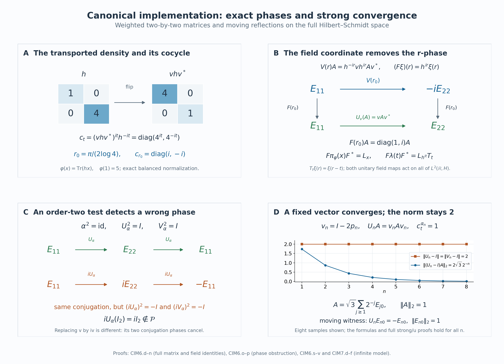

# Canonical core automorphisms and their continuity

*Self-checked by the writing AI. Original exposition and illustration sources: CC0-1.0; earlier and font components retain their recorded terms.*

An automorphism changes a weight and therefore changes the coordinates used to represent a core. Its canonical unitary must compensate for that change. We construct the compensation on the whole Hilbert space, characterize the resulting automorphisms by the action and trace they preserve, and prove continuity for arbitrary nets. Matrix and infinite-dimensional models will distinguish canonical phases, strong continuity and operator-norm continuity.

## The represented core and its normalized lift

Let \((M,H,J,\mathcal P)\) be a standard form of a nonzero von Neumann algebra, and let \(\varphi\) be a faithful normal semifinite weight. Automorphisms are normal unital star automorphisms. No factoriality, separability, countable decomposability or finite-total-weight hypothesis is imposed.

The complete regular representation is
\[
 \begin{aligned}
 N_\varphi&=M\rtimes_{\sigma^\varphi}\mathbb R
             \subseteq B(\mathscr H),&
 \mathscr H&=L^2(\mathbb R,dr;H),\\
 \bigl[\pi_\varphi(x)\xi\bigr](r)&=\sigma_{-r}^\varphi(x)\xi(r),&
 \bigl[\lambda(t)\xi\bigr](r)&=\xi(r-t).
 \end{aligned}
 \tag{CIM0.a}
\]
Its arbitrary-Hilbert construction and normal coefficient inclusion are given in [Normal regular realizations](OA-FLOW-NR.md#oa-flow.nr.4). The dual action and specified faithful normal semifinite canonical trace satisfy
\[
 \begin{aligned}
 \theta_s(\pi_\varphi(x))&=\pi_\varphi(x),&
 \theta_s(\lambda(t))&=e^{-ist}\lambda(t),\\
 \tau_\varphi\circ\theta_s&=e^{-s}\tau_\varphi,&
 N_\varphi^\theta&=\pi_\varphi(M).
 \end{aligned}
 \tag{CIM0.b}
\]
The trace is constructed in [CORE2](OA-FLOW-CORE.md#core-2); the last equality is the [whole fixed-algebra theorem](OA-FLOW-DA.md#da-fixed). The modular Haar measure is \(dt\), and its dual is \(ds/(2\pi)\).

For \(\alpha\in\operatorname{Aut}(M)\), let \(U(\alpha)\) be its unique standard implementing unitary, preserving \(\mathcal P\) and commuting with \(J\), as in [MC1](OA-FLOW-MC.md#oa-flow.mc.1). Put
\[
 \varphi^\alpha=\varphi\circ\alpha^{-1},\qquad
 c_t^\alpha=[D\varphi^\alpha:D\varphi]_t.
 \tag{CIM0.c}
\]
This is the fully normalized faithful cocycle of [BC4](OA-FLOW-BC.md#oa-flow.bc.4), including its scalar normalization. We shall construct
\[
 \bigl[V_\varphi(\alpha)\xi\bigr](r)
       =(c_{-r}^\alpha)^*U(\alpha)\xi(r).
 \tag{CIM0.d}
\]
Section 1 proves that this defines an onto unitary on all of \(\mathscr H\). After Section 2 proves invariance of the entire core, write \(\widetilde\alpha\) for its conjugation there. The parameter \(-r\), the adjoint and the canonical phase choice have separate roles.

For the zero algebra, the standard and regular Hilbert spaces are zero and the asserted groups and maps have their unique trivial interpretations. We work in the nonzero setting below.

## 1. A canonical unitary on the entire regular Hilbert space

Write the standard form of \(M\) as \((M,H,J,\mathcal P)\). For every normal automorphism \(\alpha\), the [standard-form comparison theorem](OA-FLOW-MC.md#oa-flow.mc.1), applied after pulling the target representation back through \(\alpha\), supplies a unique unitary \(U(\alpha)\) such that
\[
 \begin{gathered}
 U(\alpha)xU(\alpha)^*=\alpha(x)\quad(x\in M),\\
 U(\alpha)\mathcal P=\mathcal P,\qquad
 U(\alpha)J=JU(\alpha).
 \end{gathered}
 \tag{CIM1.a}
\]
The comparison theorem constructs this unitary by compatible finite support corners and passes to their full directed union. It applies even when \(M\) has no faithful normal state.

The [cone representative theorem](OA-FLOW-CR.md#oa-flow.cr.8) gives a unique \(\xi_f\in\mathcal P\) for every \(f\in M_*^+\). Evaluating its vector functional gives
\[
 U(\alpha)\xi_f=\xi_{f\circ\alpha^{-1}}.
 \tag{CIM1.b}
\]
Indeed the left side lies in the cone and represents \(x\mapsto f(\alpha^{-1}(x))\). Products of the unitaries in (CIM1.a) preserve the cone and implement products of automorphisms. Uniqueness therefore gives the exact identities
\[
 \begin{gathered}
 U(\alpha\beta)=U(\alpha)U(\beta),\\
 U(\operatorname{id})=I,\qquad
 U(\alpha^{-1})=U(\alpha)^*.
 \end{gathered}
 \tag{CIM1.c}
\]
Here \(\alpha\beta=\alpha\circ\beta\). Thus the standard form specifies an implementing unitary, including its phase.

Fix the faithful normal semifinite weight \(\varphi\). Put
\[
 \varphi^\alpha=\varphi\circ\alpha^{-1},\qquad
 c_t^\alpha=[D\varphi^\alpha:D\varphi]_t.
 \tag{CIM1.d}
\]
Normality, faithfulness and semifiniteness transport through \(\alpha\); in particular \(\mathfrak n_{\varphi^\alpha}=\alpha(\mathfrak n_\varphi)\). The [balanced cocycle construction](OA-FLOW-BC.md#oa-flow.bc.4) makes \(c_t^\alpha\) a strongly-star continuous unitary path in \(M\), with \(c_0^\alpha=1\), and proves
\[
 \begin{gathered}
 c_{t+v}^\alpha=c_t^\alpha\sigma_t^\varphi(c_v^\alpha),\\
 \sigma_t^{\varphi^\alpha}
   =\operatorname{Ad}(c_t^\alpha)\sigma_t^\varphi.
 \end{gathered}
 \tag{CIM1.e}
\]
These are normalized derivatives of the actual weights; scalar multiples of a weight retain their scalar cocycles.

Let
\[
 \mathcal K=L^2(\mathbb R,H).
\]
This is the full space of strongly measurable, square-integrable \(H\)-valued functions modulo almost-everywhere equality. Its [completeness and tensor identification](OA-FLOW-L24.md#oa-flow.grp.vectorintegration) hold for arbitrary \(H\). Strong measurability means almost-everywhere approximation by finite-valued measurable functions, and does not assume that \(H\) is separable.

Define two unitary-valued fields by
\[
 A_\alpha(r)=(c_{-r}^\alpha)^*U(\alpha),\qquad
 B_\alpha(r)=U(\alpha)^*c_{-r}^\alpha.
 \tag{CIM1.f}
\]
Both fields are strongly continuous. For each fixed \(\eta\in H\), their vector images of a compact interval are norm compact, hence separable. The union over the intervals \([-n,n]\) is separable as well. Thus \(A_\alpha(\,\cdot\,)\eta\) and \(B_\alpha(\,\cdot\,)\eta\) are strongly measurable on the whole real line.

If \(\xi\) is any strongly measurable field, choose finite-valued measurable \(\xi_n\) tending to it almost everywhere. The fields \(A_\alpha\xi_n\) are strongly measurable, since they are finite sums of measurable scalar indicators times the fixed-vector fields just considered. The bound
\[
 \|A_\alpha(r)(\xi_n(r)-\xi(r))\|
       =\|\xi_n(r)-\xi(r)\|
 \tag{CIM1.g}
\]
shows that their pointwise limit is \(A_\alpha\xi\); hence that field is strongly measurable. The same argument applies to \(B_\alpha\xi\). It also shows that changing a representative on a null set changes its image only there.

Consequently
\[
 \begin{aligned}
 \bigl[V_\varphi(\alpha)\xi\bigr](r)
       &=(c_{-r}^\alpha)^*U(\alpha)\xi(r),\\
 \bigl[V_\varphi(\alpha)^*\xi\bigr](r)
       &=U(\alpha)^*c_{-r}^\alpha\xi(r)
 \end{aligned}
 \tag{CIM1.h}
\]
define bounded maps on all of \(\mathcal K\). Pointwise unitarity gives
\(\|V_\varphi(\alpha)\xi\|_2=\|\xi\|_2\), and the two field products are the identity for every \(r\). Therefore these maps are inverse unitaries, which also verifies the adjoint notation in (CIM1.h). This is the multiplication-field construction of [NR5](OA-FLOW-NR.md#oa-flow.nr.5), with its action checked on every strongly measurable \(L^2\) class. No measurable choice of a basis of \(H\) occurs.

We write \(V(\alpha)=V_\varphi(\alpha)\) when the reference weight is fixed.

## 2. The exact generator formulas and the group law

The [isomorphism covariance of modular groups and derivatives](OA-FLOW-BC.md#oa-flow.bc.5), with its modular-group consequence in [CORE8](OA-FLOW-CORE.md#core-8), gives
\[
 \alpha\sigma_t^\varphi\alpha^{-1}
   =\sigma_t^{\varphi^\alpha}
   =\operatorname{Ad}(c_t^\alpha)\sigma_t^\varphi.
 \tag{CIM2.a}
\]
Recall the regular convention
\[
 \bigl[\pi_\varphi(x)\xi\bigr](r)=\sigma_{-r}^\varphi(x)\xi(r),
 \qquad
 \bigl[\lambda(t)\xi\bigr](r)=\xi(r-t).
\]
For the coefficient generators, (CIM1.h) and (CIM2.a) give
\[
 \begin{aligned}
 &\bigl[V(\alpha)\pi_\varphi(x)V(\alpha)^*\xi\bigr](r)\\
 &\quad=(c_{-r}^\alpha)^*
       \alpha(\sigma_{-r}^\varphi(x))c_{-r}^\alpha\,\xi(r)\\
 &\quad=\sigma_{-r}^\varphi(\alpha(x))\xi(r).
 \end{aligned}
 \tag{CIM2.b}
\]
For translations, the constant factors \(U(\alpha)\) cancel in the neighboring fibers:
\[
 \begin{aligned}
 \bigl[V(\alpha)\lambda(t)V(\alpha)^*\xi\bigr](r)
  &=(c_{-r}^\alpha)^*c_{t-r}^\alpha\,\xi(r-t)\\
  &=\sigma_{-r}^\varphi(c_t^\alpha)\xi(r-t).
 \end{aligned}
 \tag{CIM2.c}
\]
The second line is the cocycle law at the ordered pair \((-r,t)\). Thus
\[
 \begin{gathered}
 V(\alpha)\pi_\varphi(x)V(\alpha)^*
      =\pi_\varphi(\alpha(x)),\\
 V(\alpha)\lambda(t)V(\alpha)^*
      =\pi_\varphi(c_t^\alpha)\lambda(t).
 \end{gathered}
 \tag{CIM2.d}
\]
Every field calculation is valid on all \(L^2\) classes: the bounded multiplication maps were constructed in Section 1, and each fixed translation preserves Lebesgue null sets.

Let \(N_\varphi=M\rtimes_{\sigma^\varphi}\mathbb R\). Conjugation by \(V(\alpha)\) sends its generators into \(N_\varphi\). The images generate \(N_\varphi\): their coefficient algebra is all of \(\pi_\varphi(M)\), and
\[
 \lambda(t)=\pi_\varphi((c_t^\alpha)^*)\,
              V(\alpha)\lambda(t)V(\alpha)^*.
 \tag{CIM2.e}
\]
Unitary conjugation carries a generated von Neumann algebra onto the algebra generated by the conjugated operators. It follows that
\[
 \widetilde\alpha_\varphi
       =\operatorname{Ad}V(\alpha)|_{N_\varphi}
       \in\operatorname{Aut}(N_\varphi).
 \tag{CIM2.f}
\]
This automorphism and its inverse are normal: unitary conjugation preserves every bounded increasing positive supremum. Formula (CIM2.d) also determines it uniquely among normal maps, by ultraweak density of the generated unital star algebra.

We next prove that the implementing unitaries themselves form a genuine representation. Since
\(\varphi^{\alpha\beta}=(\varphi^\beta)^\alpha\), the [ordered chain and covariance laws](OA-FLOW-BC.md#oa-flow.bc.4) give
\[
 \begin{aligned}
 c_t^{\alpha\beta}
  &=[D(\varphi^\beta)^\alpha:D\varphi^\alpha]_t
      [D\varphi^\alpha:D\varphi]_t\\
  &=\alpha(c_t^\beta)c_t^\alpha,\\
 (c_t^{\alpha\beta})^*
  &=(c_t^\alpha)^*\alpha((c_t^\beta)^*).
 \end{aligned}
 \tag{CIM2.g}
\]
The factors have a prescribed order. In particular,
\[
 \begin{aligned}
 \bigl[V(\alpha)V(\beta)\xi\bigr](r)
   &=(c_{-r}^\alpha)^*
       U(\alpha)(c_{-r}^\beta)^*U(\beta)\xi(r)\\
   &=(c_{-r}^\alpha)^*
       \alpha((c_{-r}^\beta)^*)U(\alpha\beta)\xi(r)\\
   &=(c_{-r}^{\alpha\beta})^*U(\alpha\beta)\xi(r).
 \end{aligned}
 \tag{CIM2.h}
\]
Since the normalized self-derivative is \(1\), we obtain
\[
 \begin{gathered}
 V(\alpha\beta)=V(\alpha)V(\beta),\qquad
 V(\operatorname{id})=I,\\
 V(\alpha^{-1})=V(\alpha)^*,\qquad
 \widetilde{\alpha\beta}_\varphi
       =\widetilde\alpha_\varphi\widetilde\beta_\varphi.
 \end{gathered}
 \tag{CIM2.i}
\]
There is no projective scalar in these equations. The homomorphism
\(\alpha\mapsto\widetilde\alpha_\varphi\) is injective, because
\[
 \widetilde\alpha_\varphi\circ\pi_\varphi
       =\pi_\varphi\circ\alpha
 \tag{CIM2.j}
\]
and the coefficient representation is faithful.

## 3. The intrinsic core, its trace, and a change of weight

For any two faithful normal semifinite weights \(\psi,\eta\), use the normal transition from [CORE5](OA-FLOW-CORE.md#core-5):
\[
 \begin{aligned}
 J_{\psi,\eta}:N_\psi&\longrightarrow N_\eta,\\
 J_{\psi,\eta}(\pi_\psi(x))&=\pi_\eta(x),\\
 J_{\psi,\eta}(\lambda_\psi(t))
    &=\pi_\eta([D\psi:D\eta]_t)\lambda_\eta(t).
 \end{aligned}
 \tag{CIM3.a}
\]
On the common regular Hilbert space it is implemented by multiplication by \([D\psi:D\eta]_{-r}^*\). This is an onto normal isomorphism with normal inverse, and [CORE6](OA-FLOW-CORE.md#core-6) proves
\[
 \tau_\eta(J_{\psi,\eta}(X))=\tau_\psi(X)
       \qquad(X\in(N_\psi)_+).
 \tag{CIM3.b}
\]
The equality includes infinite values and the exact scalar normalization. That proof compares the normalized dual-weight cocycles and applies fixed-reference injectivity; equality of modular groups alone would not give (CIM3.b).

There is a second normal map, [CORE8's transport of the weight](OA-FLOW-CORE.md#core-8):
\[
 \begin{aligned}
 K_{\alpha,\varphi}:N_\varphi&\longrightarrow N_{\varphi^\alpha},\\
 K_{\alpha,\varphi}(\pi_\varphi(x))
       &=\pi_{\varphi^\alpha}(\alpha(x)),\\
 K_{\alpha,\varphi}(\lambda_\varphi(t))
       &=\lambda_{\varphi^\alpha}(t).
 \end{aligned}
 \tag{CIM3.c}
\]
In the current standard representation it is conjugation by the constant field
\(\xi(r)\mapsto U(\alpha)\xi(r)\): (CIM2.a) identifies the coefficient fields, and the constant field commutes with translations. Its inverse uses \(U(\alpha)^*\). Composing this map with (CIM3.a) yields exactly the unitary and generator values already proved:
\[
 \widetilde\alpha_\varphi
       =J_{\varphi^\alpha,\varphi}K_{\alpha,\varphi}.
 \tag{CIM3.d}
\]
Both sides are normal, so the generator verification identifies the maps on the entire algebra.

For clarity, the full trace calculation for the second map can be seen directly. For a weight \(\eta\), let \(T_\eta\) be the dual operator-valued weight with measure \(ds/(2\pi)\), let \(\Phi_\eta=\mathcal D_\eta\eta\) be its dual weight, and let
\[
 h_\eta^{it}=\lambda_\eta(t),\qquad
 \tau_\eta=(\Phi_\eta)_{h_\eta^{-1}}.
\]
These are the whole-cone constructions of [CORE1–3](OA-FLOW-CORE.md#core-2). The map \(K=K_{\alpha,\varphi}\) intertwines the dual flows and the coefficient map induced by \(\alpha\). Commuting \(K\) with each bounded positive interval average and taking its increasing extended-positive supremum gives the full operator-valued-weight transport. Compose with the transported weight to obtain
\[
 \Phi_{\varphi^\alpha}(K(X))=\Phi_\varphi(X)
       \qquad(X\in(N_\varphi)_+).
 \tag{CIM3.e}
\]
This is an equality on every positive element, not only the finite ideal.

Transport of the generating unitary group gives \(K(h_\varphi)=h_{\varphi^\alpha}\), with spectral projections and all functional-calculus domains transported. Set \(b_{\eta,\varepsilon}=(h_\eta+\varepsilon)^{-1}\). The bounded inverse-density formula proved in [CORE3](OA-FLOW-CORE.md#core-3) gives
\[
 \begin{aligned}
 \tau_{\varphi^\alpha}(K(X))
  &=\sup_{\varepsilon>0}
      \Phi_{\varphi^\alpha}\!\left(
        b_{\varphi^\alpha,\varepsilon}^{1/2}
        K(X)b_{\varphi^\alpha,\varepsilon}^{1/2}\right)\\
  &=\sup_{\varepsilon>0}
      \Phi_\varphi\!\left(
        b_{\varphi,\varepsilon}^{1/2}
        Xb_{\varphi,\varepsilon}^{1/2}\right)\\
  &=\tau_\varphi(X).
 \end{aligned}
 \tag{CIM3.f}
\]
Here the supremum is of nonnegative scalar weight values. No monotonicity of the sandwiched operators is asserted, and infinity is retained. Combining (CIM3.b), (CIM3.d) and (CIM3.f) proves
\[
 \tau_\varphi(\widetilde\alpha_\varphi(X))
       =\tau_\varphi(X)\qquad(X\in(N_\varphi)_+).
 \tag{CIM3.g}
\]

The dual action also commutes with \(\widetilde\alpha_\varphi\). Its character unitary on \(\mathcal K\) is
\[
 [Q_s\xi](r)=e^{-isr}\xi(r).
\]
It fixes \(\pi_\varphi(M)\) by conjugation and sends \(\lambda(t)\) to \(e^{-ist}\lambda(t)\). This scalar field commutes with every \(A_\alpha(r)\), so
\[
 V(\alpha)Q_s=Q_sV(\alpha),\qquad
 \widetilde\alpha_\varphi\theta_s
       =\theta_s\widetilde\alpha_\varphi.
 \tag{CIM3.h}
\]
As a whole-cone version of this covariance, let
\(\bar\alpha=\pi_\varphi\alpha\pi_\varphi^{-1}\) on the coefficient algebra. The same bounded-interval argument gives
\[
 T_\varphi(\widetilde\alpha_\varphi(X))
       =\widehat{\bar\alpha}(T_\varphi(X))
       \qquad(X\in(N_\varphi)_+),
 \tag{CIM3.i}
\]
where the hat denotes transport on the extended positive cone. For every normal weight \(\eta\) on \(M\), with no additional faithfulness or semifiniteness requirement, composition and [normal-weight transport](OA-FLOW-CORE.md#core-6) give
\[
 \mathcal D_\varphi(\eta\circ\alpha^{-1})
       (\widetilde\alpha_\varphi(X))
       =\mathcal D_\varphi\eta(X).
 \tag{CIM3.j}
\]
Thus dual weights transform with their input weights, while the canonical trace itself is preserved.

The [glued core](OA-FLOW-CORE.md#core-7) has charts
\(\kappa_\eta:N_\eta\to C(M)\) with
\(\kappa_\psi=\kappa_\eta J_{\psi,\eta}\).
Its isomorphism functor satisfies
\(C(\alpha)\kappa_\varphi=\kappa_{\varphi^\alpha}K_{\alpha,\varphi}\).
Consequently (CIM3.d) says precisely
\[
 C(\alpha)\kappa_\varphi
       =\kappa_\varphi\widetilde\alpha_\varphi.
 \tag{CIM3.k}
\]
The [represented Hilbert-core functor](OA-FLOW-HLB.md#hlb-8) agrees with this map: in the paired \(\varphi,\varphi^\alpha\) regular charts its specified unitary \(U(\alpha)\) acts as the constant field, and returning to the \(\varphi\)-chart supplies the multiplier in (CIM1.h).

Here is an explicit check of independence from the reference weight. Fix another faithful normal semifinite \(\psi\), put
\[
 d_t=[D\psi:D\varphi]_t,\qquad
 c_t^{\alpha,\eta}=[D(\eta\circ\alpha^{-1}):D\eta]_t,
\]
and use the ordered chain and simultaneous covariance:
\[
 \begin{aligned}
 c_t^{\alpha,\psi}
    &=\alpha(d_t)c_t^{\alpha,\varphi}d_t^*,\\
 c_t^{\alpha,\psi}d_t
    &=\alpha(d_t)c_t^{\alpha,\varphi}.
 \end{aligned}
 \tag{CIM3.l}
\]
The coefficient generators are unchanged by \(J_{\psi,\varphi}\). On \(\lambda_\psi(t)\), the two sides of the following equality have coefficients equal by (CIM3.l):
\[
 J_{\psi,\varphi}\widetilde\alpha_\psi
       =\widetilde\alpha_\varphi J_{\psi,\varphi}.
 \tag{CIM3.m}
\]
Normality proves this on all of \(N_\psi\). The actual chart unitary
\[
 [W_{\psi,\varphi}\xi](r)=d_{-r}^*\xi(r)
\]
also intertwines the implementing representations exactly:
\[
 W_{\psi,\varphi}V_\psi(\alpha)
       =V_\varphi(\alpha)W_{\psi,\varphi}.
 \tag{CIM3.n}
\]
Indeed its left multiplier is
\(d_{-r}^*(c_{-r}^{\alpha,\psi})^*U(\alpha)\).
Taking adjoints in (CIM3.l) turns this into
\((c_{-r}^{\alpha,\varphi})^*\alpha(d_{-r}^*)U(\alpha)\), which is the right multiplier. All fields act on the entire \(\mathcal K\), by Section 1. Thus the automorphism of \(C(M)\), its trace preservation, its dual equivariance and its exact implementing group are compatible with every faithful weight chart.

If \(M=0\), its standard Hilbert space and regular Hilbert space are zero, and all algebras, maps and weights above have their unique zero interpretation.

## 4. The trace and action determine the entire image

Define
\[
 \operatorname{Aut}_{\theta,\tau_\varphi}(N_\varphi)
 =\{\beta\in\operatorname{Aut}(N_\varphi):
       \beta\theta_s=\theta_s\beta\ \forall s,\ 
       \tau_\varphi\circ\beta=\tau_\varphi\}.
 \tag{CIM4.a}
\]
The trace equality holds on every positive element, including infinite values. This is a group: composition preserves both equalities, and composition with a bijective inverse gives the inverse equalities.

Section 3 puts every \(\widetilde\alpha\) in this group. We prove that
\[
 \{\widetilde\alpha:\alpha\in\operatorname{Aut}(M)\}
       =\operatorname{Aut}_{\theta,\tau_\varphi}(N_\varphi).
 \tag{CIM4.b}
\]
Let \(\beta\) belong to the right side. Equivariance preserves the full fixed algebra, and the same reasoning for \(\beta^{-1}\) gives onto equality. Consequently
\[
 \alpha=\pi_\varphi^{-1}
          \,\beta|_{\pi_\varphi(M)}\,\pi_\varphi
          \in\operatorname{Aut}(M).
 \tag{CIM4.c}
\]
These restriction maps are normal in both directions. The automorphism
\(\gamma=(\widetilde\alpha)^{-1}\beta\) fixes the coefficient algebra pointwise and still preserves the trace and action.

We spell out the [full-cone uniqueness argument of L30, Section 6](OA-FLOW-L30.md#l30-6) that forces \(\gamma=\mathrm{id}\). Let \(T_\varphi\) be the canonical operator-valued weight onto \(\pi_\varphi(M)\). The [dual-action average](OA-FLOW-DA.md#da-equality) gives
\[
 T_\varphi(X)=\frac1{2\pi}\int_{\mathbb R}\theta_s(X)\,ds,\qquad
 T_\varphi\gamma=T_\varphi
 \quad(X\in(N_\varphi)_+).
 \tag{CIM4.d}
\]
The integral takes values in the extended positive cone. Commute \(\gamma\) with each bounded interval average and take their increasing extended-positive supremum. Its induced map on the coefficient algebra is the identity. Testing with positive normal functionals proves the second equality, including its infinite part; L30 constructs these tests on the entire domain. Composition with the coefficient weight yields
\[
 \widetilde\varphi\circ\gamma=\widetilde\varphi.
 \tag{CIM4.e}
\]
This is equality of full dual weights.

By [CORE2](OA-FLOW-CORE.md#core-2), the injective positive self-adjoint affiliated generator \(h_\varphi\) satisfies
\[
 h_\varphi^{it}=\lambda(t),\qquad
 \widetilde\varphi=(\tau_\varphi)_{h_\varphi}.
 \tag{CIM4.f}
\]
Write \(\gamma_*\omega=\omega\circ\gamma^{-1}\). The [normal spectral transport of density perturbations](OA-FLOW-CORE.md#core-8), including full domains and all positive elements, gives
\[
 \gamma_*\widetilde\varphi
   =(\gamma_*\tau_\varphi)_{\gamma(h_\varphi)}
   =(\tau_\varphi)_{\gamma(h_\varphi)}.
 \tag{CIM4.g}
\]
Here \(\gamma(h_\varphi)\) is obtained by transporting the entire spectral resolution. Equations (CIM4.e)–(CIM4.g) and [uniqueness of tracial densities on the whole positive cone](OA-FLOW-TD.md#oa-flow.td.5) imply
\[
 \gamma(h_\varphi)=h_\varphi,\qquad
 \gamma(\lambda(t))=\lambda(t)\quad(t\in\mathbb R).
 \tag{CIM4.h}
\]
Together with pointwise fixedness of the coefficients, normality and generation now give \(\gamma=\mathrm{id}\). This proves (CIM4.b) and uniqueness of the normalized extension of a specified \(\alpha\).

The trace condition carries information. For \(s\ne0\), the automorphism \(\theta_s\) commutes with the flow and fixes the coefficient algebra, but
\[
 \theta_s(\lambda(t))=e^{-ist}\lambda(t),\qquad
 \tau_\varphi\circ\theta_s=e^{-s}\tau_\varphi\ne\tau_\varphi.
 \tag{CIM4.i}
\]
Some \(t\) distinguishes the displayed generators. A positive element with finite nonzero trace, which exists by faithfulness and semifiniteness on this nonzero algebra, distinguishes the weights. Thus \(\theta_s\) is not a second normalized lift of the identity. Equality of modular groups of traces would not distinguish their positive scalar multiples; (CIM4.g) uses the actual normalized trace.

## 5. Continuity for arbitrary automorphism nets

The u-topology on \(\operatorname{Aut}(A)\), for a von Neumann algebra \(A\), is pointwise norm convergence on its predual:
\[
 \alpha_i\longrightarrow\alpha
 \quad\Longleftrightarrow\quad
 \|f\circ\alpha_i-f\circ\alpha\|\longrightarrow0
       \quad(f\in A_*).
 \tag{CIM5.a}
\]
The index set is any directed set. Inverse convergence follows from this condition. Composition by an automorphism is isometric, so
\[
 \|f\circ\alpha_i^{-1}-f\circ\alpha^{-1}\|
 =\|f-f\circ\alpha^{-1}\circ\alpha_i\|\longrightarrow0;
 \tag{CIM5.b}
\]
apply (CIM5.a) to the fixed functional \(f\circ\alpha^{-1}\).

**The standard implementers.** The proof of [CL1](../../OA-MOD/OA-MOD-CL.html#oa-mod-cl-01) uses the [natural-cone norm estimate](../../OA-MOD/OA-MOD-SF.html#oa-mod-sf-12):
\[
 U(\alpha)\xi_f=\xi_{f\circ\alpha^{-1}},\qquad
 \|\xi_f-\xi_g\|^2\le\|f-g\|
       \quad(f,g\in M_*^+).
 \tag{CIM5.c}
\]
Equation (CIM5.b) therefore gives convergence on every cone vector. Their complex linear span is dense; approximation by one finite linear combination and the common norm-one bound prove \(U(\alpha_i)\to U(\alpha)\) strongly on all of \(H\). If \(U_i,U\) are these unitaries, then
\[
 \|(U_i^*-U^*)\eta\|=\|(U-U_i)U^*\eta\|\longrightarrow0.
 \tag{CIM5.d}
\]
No countable dense family was selected.

**The complete weight-cocycle input.** For every \(0\le R<\infty\) and every \(\eta\in H\), the theorem [Compact-time continuity along automorphism orbits](../../OA-MOD/OA-MOD-OC.html#oa-mod-oc-01) proves
\[
 \begin{aligned}
 \sup_{|t|\le R}\|(c_t^{\alpha_i}-c_t^\alpha)\eta\|&\longrightarrow0,\\
 \sup_{|t|\le R}\|((c_t^{\alpha_i})^*-(c_t^\alpha)^*)\eta\|
       &\longrightarrow0.
 \end{aligned}
 \tag{CIM5.e}
\]
Its hypotheses are exactly a standard form, an arbitrary faithful normal semifinite reference and (CIM5.a). In particular it allows \(\varphi(1)=\infty\).

The delicate support step in that proof has an exact [finite-centralizer square-root identity](../../OA-MOD/OA-MOD-OC.html#the-square-root-identity-on-a-finite-centralizer-vector). Let \(\omega\) be a faithful normal semifinite weight. If \(p\in M_\omega\) is a projection with \(\omega(p)<\infty\), \(\xi=\Lambda_\omega(p)\), \(\nu_0=\omega(p\,\cdot\,p)\), and \(\nu\) is a bounded normal positive functional, it gives
\[
 \xi\in D(A_\nu^{1/2}),\qquad
 \|(A_\nu^{1/2}-1)\xi\|\le\|\nu-\nu_0\|^{1/2},
 \qquad A_\nu=d\nu/d\omega^{\mathrm{opp}}.
 \tag{CIM5.f}
\]
Faithful completion on the support complement and closure of the compressed spatial form include its zero component and exact square-root domain. The proof does not apply an invertible covariance formula to a projection.

The [moving-support argument](../../OA-MOD/OA-MOD-OC.html#automorphism-continuity-at-the-identity-on-one-summand) next recovers the part discarded by compression. If the compressed cocycle vector is within \(e_i\) of a unit reference vector, unitarity and orthogonality bound the omitted component by \(\sqrt{2e_i}\); the full error is at most \(e_i+\sqrt{2e_i}\). The [finite-span and reference-change steps](../../OA-MOD/OA-MOD-OC.html#change-the-reference-change-the-limit-and-take-adjoints) then cover every vector and reference. They assemble an arbitrary orthogonal family of finite normal-state supports; only finitely many supports enter each vector approximation. Thus no faithful normal state on the entire algebra is required. The [spatial-to-balanced identity](../../OA-MOD/OA-MOD-SI.html#oa-mod-si-14) identifies those derivatives with the normalized cocycles in (CIM0.c).

**From compact fields to the full Hilbert space.** Write \(U_i=U(\alpha_i)\), \(U=U(\alpha)\), \(V_i=V_\varphi(\alpha_i)\), \(V=V_\varphi(\alpha)\). For \(f\in L^2(\mathbb R)\) supported in \([-R,R]\), the pointwise difference in (CIM0.d) is \(f(r)\) times
\[
 (c_{-r}^{\alpha_i})^*(U_i-U)\eta
   +\bigl((c_{-r}^{\alpha_i})^*-(c_{-r}^\alpha)^*\bigr)U\eta.
 \tag{CIM5.g}
\]
The \(L^2\) triangle inequality gives
\[
 \|(V_i-V)(f\otimes\eta)\|_2
 \le\|f\|_2\left(
       \|(U_i-U)\eta\|
       +\sup_{|t|\le R}
           \|((c_t^{\alpha_i})^*-(c_t^\alpha)^*)U\eta\|
       \right)\longrightarrow0.
 \tag{CIM5.h}
\]
The vector in the supremum is the fixed vector \(U\eta\), not a whole Hilbert unit ball.

Finite sums of bounded-support tensors are dense in \(\mathscr H\), by [the full Hilbert tensor construction](OA-FLOW-L24.md#oa-flow.grp.vectorintegration) and scalar truncation. Given one such approximant \(\zeta\) to \(\xi\),
\[
 \|(V_i-V)\xi\|_2
 \le 2\|\xi-\zeta\|_2+\|(V_i-V)\zeta\|_2.
 \tag{CIM5.i}
\]
For its finitely many tensors choose a common eventual net index. Let the approximation error tend to zero after using (CIM5.h). This proves strong convergence on all of \(\mathscr H\), without dominated convergence for nets. The unitary limit also gives strong convergence of adjoints by (CIM5.d).

**From spatial conjugation to the complete predual.** For
\(\omega_{\xi,\eta}(X)=\langle X\xi,\eta\rangle\), taking the supremum over \(\|X\|\le1\) gives
\[
 \begin{aligned}
 &\|\omega_{\xi,\eta}\circ\operatorname{Ad}V_i
         -\omega_{\xi,\eta}\circ\operatorname{Ad}V\|\\
 &\quad\le\|V_i^*\xi-V^*\xi\|\,\|\eta\|
          +\|\xi\|\,\|V_i^*\eta-V^*\eta\|.
 \end{aligned}
 \tag{CIM5.j}
\]
The [concrete predual theorem CP4–6](OA-FLOW-CP.md#oa-flow.cp.4) writes each \(f\in(N_\varphi)_*\) as the restriction of a vector series
\[
 f=\left.\sum_{k=1}^\infty\omega_{\xi_k,\eta_k}\right|_{N_\varphi},
 \qquad \sum_k\|\xi_k\|\|\eta_k\|<\infty.
 \tag{CIM5.k}
\]
Use (CIM5.j) for finitely many terms. The remaining difference has norm at most \(2\sum_{k>n}\|\xi_k\|\|\eta_k\|\), independently of the net index. Thus
\[
 \|f\circ\widetilde\alpha_i-f\circ\widetilde\alpha\|
       \longrightarrow0
       \quad(f\in(N_\varphi)_*).
 \tag{CIM5.l}
\]
The series for an individual functional is countable; the Hilbert space and algebra need not be. This proves u-continuity of the lift for arbitrary nets.

**Continuity of the inverse.** Suppose \(\beta_i\to\beta\) in the subspace u-topology of (CIM4.a), and let \(\alpha_i,\alpha\) be their coefficient restrictions. Given \(f\in M_*\), the functional \(f\circ\pi_\varphi^{-1}\) on the represented coefficient algebra is normal. The same concrete-predual theorem in this faithful normal representation extends it by an ambient summable vector series. Restriction of that series to \(N_\varphi\) gives \(F\in(N_\varphi)_*\) with the specified coefficient restriction. Then
\[
 \|f\circ\alpha_i-f\circ\alpha\|
 \le\|F\circ\beta_i-F\circ\beta\|\longrightarrow0.
 \tag{CIM5.m}
\]
No action-invariant extension of the functional is required.

The exact image, group law and both continuity arguments prove the topological group isomorphism
\[
 \operatorname{Aut}(M)
    \ \xrightarrow[\alpha\mapsto\widetilde\alpha]{\ \cong\ }\
 \operatorname{Aut}_{\theta,\tau_\varphi}(N_\varphi).
 \tag{CIM5.n}
\]
The accompanying \(V_\varphi\) is a genuine strongly continuous unitary representation. These conclusions do not assert operator-norm continuity; the infinite-dimensional model below gives an exact obstruction.

## 6. Exact matrix phases and a moving reflection

These models separate three issues: the scalar normalization of the cocycle, the canonical phase of its standard implementer, and the difference between strong and operator-norm convergence. All operators below act on their entire stated Hilbert spaces.

**The Hilbert–Schmidt standard form.** For \(K=\mathbb C^2\) or \(K=\ell^2(\mathbb N_0)\), use
\[
 \begin{aligned}
 H&=\mathcal S_2(K),\qquad
 \langle A,B\rangle=\operatorname{Tr}(B^*A),\\
 L_xA&=xA,\qquad JA=A^*,\\
 \mathcal P&=\{A\in\mathcal S_2(K):A\ge0\}.
 \end{aligned}
 \tag{CIM6.a}
\]
Here \(\mathcal S_2(K)\) is the Hilbert–Schmidt space. In the infinite case its squared norm is the sum of the squared matrix entries. Finite coordinate matrices are dense by taking the tails of this nonnegative summable family. The inequality \(\|A\|\le\|A\|_2\), first proved on finite matrices by Cauchy–Schwarz, identifies its Hilbert completion with bounded operators having this finite squared sum. Thus this description includes every Hilbert vector, not merely the finite-rank matrices.

The faithful normal semifinite trace on \(B(K)\) and its entire trace GNS space are the ones constructed in [MIV6](OA-FLOW-MIV.md#miv-6) and [TD1](OA-FLOW-TD.md#td-1). Its finite left ideal \(N_{\operatorname{Tr}}\) is exactly \(\mathcal S_2(K)\), its GNS map is \(A\mapsto A\), and TD1 proves \(L(B(K))'=\{R_x:x\in B(K)\}\), where \(R_xA=Ax\), and \(JL_xJ=R_{x^*}\).

For clarity, the positive cone in (CIM6.a) is the standard cone. It is closed, and its inner products are nonnegative: approximate a positive Hilbert–Schmidt operator by positive finite coordinate compressions and use the finite positive trace pairing and Hilbert–Schmidt Cauchy–Schwarz. Conversely, if \(\langle A,B\rangle\ge0\) for every positive Hilbert–Schmidt \(B\), test on rank-one projections to obtain \(\langle A\xi,\xi\rangle\ge0\) for every \(\xi\in K\). Polarization makes \(A\) self-adjoint, and these inequalities make it positive. Thus the cone is self-dual. The conjugation \(J\) fixes it pointwise; \(L_xJL_xJ\) sends \(A\) to \(xAx^*\), again in the cone. The center of \(B(K)\) is scalar, so the remaining standard-form identity \(JzJ=z^*\) holds. Together with the commutant equality, these are the standard-form axioms.

For a unitary \(v\in B(K)\), put \(\alpha_v=\operatorname{Ad}v\). Its canonical standard implementer is
\[
 U_vA=vAv^*.
 \tag{CIM6.b}
\]
Indeed this map is an onto Hilbert-space unitary by trace invariance, implements \(\alpha_v\) on all left multipliers, commutes with \(J\), and carries \(\mathcal P\) onto itself. [MC1's uniqueness of standard transport](OA-FLOW-MC.md#mc-1) makes it the canonical implementer. Direct multiplication also gives \(U_vU_w=U_{vw}\). Replacing \(v\) by \(e^{i\gamma}v\) leaves (CIM6.b) exactly unchanged; the two phases cancel.

**A weighted two-by-two model.** Now take \(K=\mathbb C^2\) and
\[
 h=\begin{pmatrix}1&0\\0&4\end{pmatrix},\qquad
 \varphi(x)=\operatorname{Tr}(hx),\qquad
 \alpha=\alpha_v.
 \tag{CIM6.c}
\]
This weight has \(\varphi(1)=5\); no normalization to a state is used. Its full GNS model is
\(\Lambda_\varphi(x)=xh^{1/2}\) in \(H=M_2(\mathbb C)\). Every matrix belongs to its finite left and finite-star ideals. [BC6's direct weighted-trace calculation](OA-FLOW-BC.md#bc-6) gives, on all of \(H\),
\[
 \begin{aligned}
 S_\varphi(A)&=h^{-1/2}A^*h^{1/2},&
 J_\varphi(A)&=A^*,\\
 \Delta_\varphi^{it}(A)&=h^{it}Ah^{-it},&
 \sigma_t^\varphi(x)&=h^{it}xh^{-it}.
 \end{aligned}
 \tag{CIM6.d}
\]
The underlying positive modular operator has eigenvalue \(h_i/h_j\) on \(E_{ij}\); this verifies the positive polar factor and its full domain directly.

Cyclicity of the finite matrix trace gives the exact transported weight
\[
 \varphi^\alpha(x)=\varphi(v^*xv)
       =\operatorname{Tr}(vhv^*x).
 \tag{CIM6.e}
\]
The balanced density is \(\operatorname{diag}(h,vhv^*)\). Its modular action on the lower-left matrix unit, as in BC6, gives the normalized derivative
\[
 c_t^\alpha
   =(vhv^*)^{it}h^{-it}
   =vh^{it}v^*h^{-it}.
 \tag{CIM6.f}
\]
This identifies the actual cocycle, including its scalar phase. Equality of modular automorphisms alone would not determine that phase.

The order under composition is visible without commuting any factors. For two unitary matrices \(v,w\), substituting (CIM6.f) and cancelling the adjacent inverse powers gives
\[
 \alpha_v(c_t^{\alpha_w})c_t^{\alpha_v}
   =vwh^{it}w^*v^*h^{-it}
   =c_t^{\alpha_v\alpha_w}.
\]

Put \(\mathcal H=L^2(\mathbb R,H)\). The formula from [Sections 1–2](#cim-1) now becomes
\[
 \begin{aligned}
 (V_\alpha\xi)(r)
 &=(c_{-r}^\alpha)^*\,v\xi(r)v^*\\
 &=h^{-ir}vh^{ir}\,\xi(r)v^*.
 \end{aligned}
 \tag{CIM6.g}
\]
To check the order, first take the adjoint:
\((c_{-r}^\alpha)^*=h^{-ir}vh^{ir}v^*\).
The neighboring \(v^*v\) then cancels on applying \(U_v\); no interchange of \(h\) and \(v\) is made.

The multiplier in (CIM6.g) is norm continuous in \(r\) and unitary on the matrix Hilbert space. It acts on the whole Bochner \(L^2\) space: a measurable matrix field stays measurable, and its pointwise Hilbert norm is unchanged. Its inverse is
\[
 (V_\alpha^*\eta)(r)
       =h^{-ir}v^*h^{ir}\,\eta(r)v.
 \tag{CIM6.h}
\]
Both products are the identity pointwise, so this is onto unitarity on all of \(\mathcal H\), without an integrability restriction on a modular generator.

The same cancellation checks the genuine group law in this model. If \(V_v,V_w\) denote (CIM6.g) for \(v,w\), then
\[
 V_vV_w\xi(r)
  =h^{-ir}vwh^{ir}\xi(r)w^*v^*
  =V_{vw}\xi(r).
 \tag{CIM6.i}
\]
Multiplying either matrix implementer \(v\) or \(w\) by a scalar phase leaves its \(V\) unchanged, just as it leaves \(U\) unchanged.

Define the unitary field change
\[
 (F\xi)(r)=h^{ir}\xi(r),\qquad
 (F^*\eta)(r)=h^{-ir}\eta(r).
 \tag{CIM6.j}
\]
Its full-domain unitarity follows from the same measurable pointwise norm identity. With \(T_t\eta(r)=\eta(r-t)\), direct substitution gives the complete identities
\[
 \begin{aligned}
 FV_\alpha F^*\eta(r)&=v\eta(r)v^*,\\
 F\pi_\varphi(x)F^*\eta(r)&=x\eta(r),\\
 F\lambda(t)F^*\eta(r)&=h^{it}\eta(r-t).
 \end{aligned}
 \tag{CIM6.k}
\]
For the last line, the neighboring powers are \(h^{ir}h^{-i(r-t)}=h^{it}\). Thus the sign is positive there, although the original regular coefficient is \(\sigma_{-r}^\varphi(x)\).

These generator identities also give an entire tensor-algebra identification if desired. Define \(\operatorname{VN}(\mathbb R)=\{T_t:t\in\mathbb R\}''\) on \(L^2(\mathbb R)\), and identify \(\mathcal H\) with \(H\otimes L^2(\mathbb R)\). Then
\[
 F N_\varphi F^*
    =L(M_2(\mathbb C))\,\overline\otimes\,\operatorname{VN}(\mathbb R).
 \tag{CIM6.l}
\]
One inclusion follows because every transformed generator belongs to the right-hand side. For the reverse inclusion the constant multipliers \(L_x\) are already generators, and multiplying \(L_{h^{it}}T_t\) by \(L_{h^{-it}}\) supplies \(T_t\). This proves equality of the generated von Neumann algebras. The map is normal with normal inverse because it is conjugation by the displayed unitary. In these coordinates the canonical extension acts by \(\alpha\) on the matrix factor and fixes \(\operatorname{VN}(\mathbb R)\).

**The flip makes the phases visible.** Specialize to
\[
 v=\begin{pmatrix}0&1\\1&0\end{pmatrix},\qquad v=v^*=v^{-1},
 \qquad q=\log4,\qquad z=e^{irq}.
 \tag{CIM6.m}
\]
Then \(\alpha^2=\mathrm{id}\), while \(\alpha\ne\mathrm{id}\), and
\[
 c_t^\alpha=\begin{pmatrix}e^{itq}&0\\0&e^{-itq}\end{pmatrix},
 \qquad
 V_\alpha(r)\begin{pmatrix}a&b\\c&d\end{pmatrix}
   =\begin{pmatrix}zd&zc\\z^{-1}b&z^{-1}a\end{pmatrix}.
 \tag{CIM6.n}
\]
In particular \(V_\alpha(r)E_{11}=z^{-1}E_{22}\) and
\(V_\alpha(r)E_{22}=zE_{11}\); their two phases cancel in the second application. The same holds for \(E_{12},E_{21}\). Thus
\[
 U_\alpha^2=I_H,\qquad V_\alpha^2=I_{\mathcal H}.
 \tag{CIM6.o}
\]
If instead one chooses \(U'_\alpha=iU_\alpha\), it implements the same algebra automorphism by conjugation, but does not preserve the standard cone: it sends the positive matrix \(I_2\) to \(iI_2\). The associated formula would give \(V'_\alpha=iV_\alpha\), hence
\[
 (U'_\alpha)^2=-I_H,\qquad
 (V'_\alpha)^2=-I_{\mathcal H}.
 \tag{CIM6.p}
\]
It cannot represent the order-two relation with the identity represented by \(I\). This is a concrete instance of [HLB8's phase-sensitive Hilbert transport](OA-FLOW-HLB.md#hlb-8), and explains why the canonical standard choice is part of the theorem.

**Moving reflections on an infinite Hilbert space.** Let \(K=\ell^2(\mathbb N_0)\), with basis \((e_j)_{j\ge0}\), and use the full trace weight
\[
 \varphi=\operatorname{Tr},\qquad
 p_n=|e_n\rangle\langle e_n|,\qquad
 v_n=I-2p_n,\qquad
 \alpha_n=\operatorname{Ad}v_n\quad(n\ge1).
 \tag{CIM6.q}
\]
The trace is faithful normal semifinite on the whole positive cone by the matrix-sum proof in MIV6, including infinite values. Since \(v_n=v_n^*=v_n^{-1}\), trace invariance gives
\(\varphi^{\alpha_n}(x)=\operatorname{Tr}(v_nxv_n)=\operatorname{Tr}(x)\)
for every positive \(x\), including \(+\infty\). The numerator weight is therefore exactly the denominator weight. [BC4's normalized self-cocycle identity](OA-FLOW-BC.md#bc-4), not merely equality of modular groups, gives
\[
 c_t^{\alpha_n}=1,\qquad
 U_nA=v_nAv_n,\qquad
 (V_n\xi)(r)=U_n\xi(r).
 \tag{CIM6.r}
\]
The trace GNS involution is \(A\mapsto A^*\) on all of \(\mathcal S_2(K)\) and its modular operator is \(I\), by TD1. Consequently \(\pi_\varphi(x)\) is the constant left multiplier and the regular group remains \(T_t\); all these formulas apply to the entire section Hilbert space.

For each fixed \(\zeta\in K\),
\[
 \|(v_n-I)\zeta\|=2|\langle\zeta,e_n\rangle|\longrightarrow0.
 \tag{CIM6.s}
\]
This is strong-star convergence because \(v_n=v_n^*\). To obtain the full \(u\)-topology statement, let
\(\omega_{\zeta,\eta}(x)=\langle x\zeta,\eta\rangle\). Uniformly on the operator unit ball,
\[
 \|\omega_{\zeta,\eta}\circ\alpha_n-\omega_{\zeta,\eta}\|
 \le \|(v_n-I)\zeta\|\,\|\eta\|
       +\|\zeta\|\,\|(v_n-I)\eta\|
 \longrightarrow0.
 \tag{CIM6.t}
\]
Every normal functional is a summable vector series by [CP4–6](OA-FLOW-CP.md#oa-flow.cp.6). For such a series, apply (CIM6.t) to a fixed finite head and bound the remaining difference by twice the sum of the tail norm products. The tail is arbitrarily small, uniformly in \(n\). This proves \(\alpha_n\to\mathrm{id}\) in \(u\). The inverse convergence holds too, since \(\alpha_n^{-1}=\alpha_n\).

On the full Hilbert–Schmidt space write \(A=(a_{ij})\). The only entries changed by \(U_n\) are those with exactly one index equal to \(n\), giving the exact identity
\[
 \|(U_n-I)A\|_2^2
   =4\left(\sum_{j\ne n}|a_{nj}|^2+
                 \sum_{i\ne n}|a_{in}|^2\right)
   \longrightarrow0.
 \tag{CIM6.u}
\]
Both nonnegative sums tend to zero because the sum over all matrix entries is finite. This proves strong convergence \(U_n\to I\) on every Hilbert vector. It also proves strong-star convergence, since \(U_n=U_n^*\).

For a compactly supported scalar \(f\in L^2(\mathbb R)\) and \(A\in H\),
\(\|(V_n-I)(fA)\|_{L^2}=\|f\|_2\|(U_n-I)A\|_2\to0\).
Finite sums of such tensors are dense in the entire section space by [L24, Proposition 4.2](OA-FLOW-L24.md#oa-flow.grp.vectorintegration). The common bound \(\|V_n-I\|\le2\) extends convergence to every section. Here also \(V_n=V_n^*\). Applying the same summable normal-vector-series argument as in (CIM6.t), now on the represented core, proves that \(\operatorname{Ad}V_n\) converges to the identity in its \(u\)-topology.

None of these convergences is an operator-norm convergence. Let \(E_{n0}=|e_n\rangle\langle e_0|\), and let \(f=1_{[0,1]}\), whose scalar \(L^2\) norm is \(1\). Since \(n\ge1\),
\[
 \begin{aligned}
 \alpha_n(E_{n0})&=-E_{n0},&
 \|\alpha_n-\mathrm{id}\|&=2,\\
 U_nE_{n0}&=-E_{n0},&
 \|U_n-I\|&=2,\\
 V_n(fE_{n0})&=-fE_{n0},&
 \|V_n-I\|&=2.
 \end{aligned}
 \tag{CIM6.v}
\]
The first norm is the norm of a bounded linear map on \(B(K)\); the other two are Hilbert-space operator norms. Each lower bound is supplied by the corresponding unit vector or norm-one operator in the left column; the upper bound \(2\) is the triangle inequality. For every fixed finite coordinate matrix, \(U_n\) is eventually the identity on that matrix. The witnesses in (CIM6.v) move with \(n\), which is precisely why they do not contradict strong convergence.

The matrix panels use \(h=\operatorname{diag}(1,4)\), the exact flip \(v\), and \(r_0=\pi/(2\log4)\). At that coordinate \(z=i\), so the phase on \(E_{11}\mapsto E_{22}\) is \(-i\). The phase panel contrasts the exact order-two law with the square \(-I\) of the noncanonical choice \(iV_\alpha\). The infinite-model panel samples \(n=1,\ldots,8\): the constant value \(2\) is the exact operator norm for every \(n\), while the decaying values are the exact errors on the single normalized Hilbert–Schmidt vector in Diagnostic D. The analytic proofs on all vectors are (CIM6.s)–(CIM6.u); the finite plot is not used to infer convergence. For human-source context see [Further reading](#cim-reading). Original diagram, data and renderer: CC0-1.0 to the extent of rights held, with separate font terms. [Editable SVG](../assets/canonical-core-automorphisms/canonical-core-automorphisms.svg), [data](../assets/canonical-core-automorphisms/data.json), [renderer](../assets/canonical-core-automorphisms/render.py), and [font terms](../assets/canonical-core-automorphisms/FONT-LICENSE.txt) are retained.

## 7. Five solved diagnostics

**Diagnostic A: the phase at one exact coordinate.** In the flip model put \(r_0=\pi/(2\log4)\). Calculate \(c_{r_0}^\alpha\), \(V_\alpha(r_0)E_{11}\), and \(FV_\alpha F^*\) on \(E_{11}\) at the same coordinate. Why do the last two answers differ?

**Solution.** Here \(e^{ir_0\log4}=i\), so
\[
 \begin{aligned}
 c_{r_0}^\alpha&=\begin{pmatrix}i&0\\0&-i\end{pmatrix},\\
 V_\alpha(r_0)E_{11}&=-iE_{22},\\
 (FV_\alpha F^*)(r_0)E_{11}&=E_{22}.
 \end{aligned}
 \tag{CIM7.a}
\]
Indeed \(F^*(r_0)E_{11}=E_{11}\), \(V_\alpha(r_0)\) contributes \(-i\), and \(F(r_0)\) multiplies the second row by \(i\); their product is \(1\). These are two coordinate descriptions of the same unitary, not conflicting choices of canonical phase. Formula (CIM6.k) proves the identity at every \(r\) on every section.

**Diagnostic B: an implementer for each element need not be a representation.** For the order-two flip automorphism, keep the identity implemented by \(I\), but implement the nonidentity element by \(iU_\alpha\). Does this choice preserve the algebraic action? Does it preserve the group law on \(H\) or on \(\mathcal H\)?

**Solution.** Scalar phases cancel in conjugation, so \(iU_\alpha\) gives the same action on \(L(M_2)\), and \(iV_\alpha\) gives the same action on the represented core. But
\[
 (iU_\alpha)^2=-I_H\ne I_H,\qquad
 (iV_\alpha)^2=-I_{\mathcal H}\ne I_{\mathcal H}.
 \tag{CIM7.b}
\]
Thus the order-two relation fails on both Hilbert spaces. The canonical implementer avoids this failure by preserving the standard cone and satisfying the exact relation \(U_\alpha^2=I\). The order-two test alone is not a characterization: \(-U_\alpha\) also squares to \(I\), but still fails to preserve the cone. This is different from replacing the matrix \(v\) by \(iv\): in \(A\mapsto(iv)A(iv)^*\) the phases cancel, so that replacement leaves \(U_\alpha\), and also \(V_\alpha\), unchanged.

**Diagnostic C: trivial modular groups do not fix the scalar cocycle.** Let \(\tau\) be any faithful normal semifinite trace on a nonzero von Neumann algebra, and let \(b>0\). Calculate \([D(b\tau):D\tau]_t\). Then explain why the moving reflections have cocycle exactly \(1\), even though \(\tau(1)\) is infinite in that model.

**Solution.** The nonsingular centralizer density \(b1\) perturbs \(\tau\) to \(b\tau\) on the entire positive cone: every bounded cutoff has its scalar coefficient, and taking its increasing limit gives \(b\tau(x)\), including infinity. [CZ6's balanced normalization](OA-FLOW-CZ.md#cz-6) gives
\[
 [D(b\tau):D\tau]_t=b^{it}1.
 \tag{CIM7.c}
\]
Both modular groups are trivial, yet this cocycle is not identically \(1\) when \(b\ne1\). For example \(b=4\) and \(t=\pi/(2\log4)\) give \(i1\). For a moving reflection, unitary invariance gives \(\tau\circ\alpha_n^{-1}=\tau\) at every positive element, not merely on a finite core of the trace. The normalized self-cocycle identity BC22 therefore applies with \(b=1\) and gives \(c_t^{\alpha_n}=1\) for every \(t\). Infinite total mass does not introduce a scalar ambiguity.

**Diagnostic D: a fixed vector versus a moving witness.** In the infinite model define
\[
 A=\sqrt3\sum_{j=1}^\infty2^{-j}E_{j0},\qquad
 f=1_{[0,1]}.
 \tag{CIM7.d}
\]
Prove that \(A\) and the section \(fA\) have norm \(1\), and compute their errors under \(U_n\) and \(V_n\). Compare these with the operator norms in (CIM6.v).

**Solution.** The matrices \(E_{j0}\) are orthonormal in Hilbert–Schmidt norm, and
\(3\sum_{j\ge1}4^{-j}=1\). Hence the series converges to a unit vector \(A\); multiplying by the scalar unit vector \(f\) gives a unit section. The reflection fixes every summand except the one with \(j=n\), which it negates. Therefore
\[
 \begin{aligned}
 (U_n-I)A&=-2\sqrt3\,2^{-n}E_{n0},\\
 \|(U_n-I)A\|_2
   &=\|(V_n-I)(fA)\|_{L^2}
    =2\sqrt3\,2^{-n}\longrightarrow0.
 \end{aligned}
 \tag{CIM7.e}
\]
By contrast, the unit vector \(E_{n0}\), and the unit section \(fE_{n0}\), depend on \(n\) and always have error \(2\). The operator norm takes the supremum over all unit vectors anew for each \(n\); strong convergence keeps its test vector fixed.

**Diagnostic E: \(u\)-convergence need not be pointwise operator-norm convergence.** Let \(S\in B(\ell^2(\mathbb N_0))\) be the unilateral shift \(Se_j=e_{j+1}\). Determine \(\|\alpha_n(S)-S\|\) for \(n\ge1\). Reconcile the answer with \(\alpha_n\to\mathrm{id}\) in \(u\), and state the corresponding continuity conclusion for the core extensions.

**Solution.** Since \(v_ne_{n-1}=e_{n-1}\) and \(v_ne_n=-e_n\),
\[
 (\alpha_n(S)-S)e_{n-1}=-2e_n,\qquad
 \|\alpha_n(S)-S\|=2.
 \tag{CIM7.f}
\]
The first equality gives the lower bound, and \(\|\alpha_n(S)\|+\|S\|=2\) gives the upper bound. Thus even this one fixed operator fails to converge in operator norm. The \(u\)-topology instead tests the norm convergence of each fixed normal functional after composition. Estimate (CIM6.t), followed by the finite-head and summable-tail argument, proves exactly those tests converge, including for inverse automorphisms. On the core, \(V_n\to I\) strongly and strongly for adjoints on the entire section Hilbert space. Applying the same vector-series estimate there gives \(u\)-convergence of the normal canonical extensions. It does not give \(\|V_n-I\|\to0\), and (CIM6.v) supplies the exact obstruction.

## Further reading

M. Takesaki, *Theory of Operator Algebras II*, Chapter XII, Exercise XII.1, printed pp. 379–380, asks for the canonical implementing representation, its continuity and the trace-preserving equivariant image. The proofs above include full-Hilbert measurability, arbitrary-net estimates and the continuous inverse on the image for arbitrary von Neumann algebras.

The [intrinsic core and its changes of weight](OA-FLOW-CORE.md#core-8) describe the underlying weight-independent map. The [Hilbert-fiber functor](OA-FLOW-HLB.md#hlb-8) explains which represented phase choices require care. The complete arbitrary-weight continuity input is proved in [Compact-time continuity along automorphism orbits](../../OA-MOD/OA-MOD-OC.html#oa-mod-oc-01). The matrix and moving-reflection models here test the signs, canonical phase and distinction between strong and norm topologies.
