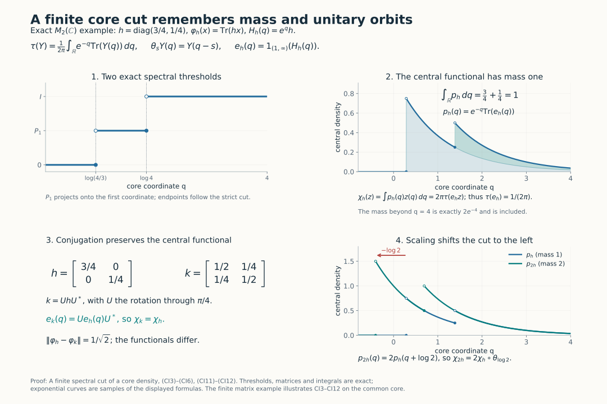

# A finite spectral cut of a core density

Fix a von Neumann algebra \(M\) with separable predual. Write \(C\) for its continuous core, \(\pi:M\to C\) for the coefficient embedding, \(\theta\) for the dual action, and \(\tau\) for the canonical trace. The conventions of CORE and DA are original Haar measure \(dt\), dual Haar measure \(ds/(2\pi)\), and
\[
 T(Y)=\int_{\mathbb R}\theta_s(Y)\,\frac{ds}{2\pi},
 \qquad \tau\circ\theta_s=e^{-s}\tau.                              \tag{CI1}
\]
This is the complete extended-positive average. For every \(\varphi\in M_*^+\), SCW gives the supported density
\[
 \widetilde\varphi=\tau_{h_\varphi},\quad
 \theta_s(h_\varphi)=e^{-s}h_\varphi,\quad s(h_\varphi)=\pi(s\varphi).            \tag{CI2}
\]
All pairings with unbounded densities mean TD's monotone trace-cutoff pairings with complete closed forms. Put \(Z=Z(C)\).

We use the supported-density theorem SCW1–3, the weight-order theorem WORD2, TD2/5–8, the canonical core comparisons CORE4–6/8, DA's whole-cone average, DP's normal-functional decomposition, and SF's spectral-domain theorem.

Earlier complete proofs: [SCW.1](OA-FLOW-SCW.md#scw-1), [SCW.2](OA-FLOW-SCW.md#scw-2), [SCW.3](OA-FLOW-SCW.md#scw-3), [CORE.4](OA-FLOW-CORE.md#core-4), [DA.AVERAGE](OA-FLOW-DA.md#da-compact), [DA.EQUALITY](OA-FLOW-DA.md#da-equality), [TD.2](OA-FLOW-TD.md#oa-flow.td.2), [TD.7](OA-FLOW-TD.md#oa-flow.td.7), [TD.8](OA-FLOW-TD.md#oa-flow.td.8), [DA.DOMAINS](OA-FLOW-DA.md#da-domains), [DA.FIXED](OA-FLOW-DA.md#da-fixed), [DP6: full spectral construction](OA-FLOW-DP.md#oa-flow.dp.6), [TD.5](OA-FLOW-TD.md#oa-flow.td.5), [SF.SB4](OA-FLOW-SF.md#oa-flow.sf.sb4), [SF.SB6](OA-FLOW-SF.md#oa-flow.sf.sb6), [CORE.5](OA-FLOW-CORE.md#core-5), [CORE.6](OA-FLOW-CORE.md#core-6), [CORE.8](OA-FLOW-CORE.md#core-8), [WORD.DUAL-ORDER](OA-FLOW-WORD.md#wo-dual-order), [DP4: normal Jordan decomposition](OA-FLOW-DP.md#oa-flow.dp.4), [PC.1](OA-FLOW-PC.md#oa-flow.projection.pc1), [PC.2](OA-FLOW-PC.md#oa-flow.projection.pc2), [CP.4](OA-FLOW-CP.md#oa-flow.cp.4), [CP.5](OA-FLOW-CP.md#oa-flow.cp.5), [CP.6](OA-FLOW-CP.md#oa-flow.cp.6), [PC.4](OA-FLOW-PC.md#oa-flow.projection.pc4), [PC.5](OA-FLOW-PC.md#oa-flow.projection.pc5), [PC.6](OA-FLOW-PC.md#oa-flow.projection.pc6), [PC.7](OA-FLOW-PC.md#oa-flow.projection.pc7), [GNS.2.1](OA-FLOW-GNS.md#gns-lemma-2-1), [GNS.2.2](OA-FLOW-GNS.md#gns-lemma-2-2), [GNS.4.1](OA-FLOW-GNS.md#gns-theorem-4-1).

## 1. Mass and reconstruction

Set \(e_\varphi=1_{(1,\infty)}(h_\varphi)\). Define \(g(0)=0\) and \(g(r)=r^{-1}1_{(1,\infty)}(r)\) for \(r>0\). For \(r>0\), substituting \(a=e^{-s}r\) gives
\[
 \int_{\mathbb R}g(e^{-s}r)\,ds=\int_1^\infty a^{-2}\,da=1.
\]
For \(r=0\) the integral is zero. Apply the identity to scalar spectral measures, first on compact integration intervals and then by increasing limits. The whole-cone average and TD's cutoff formula give
\[
 T(g(h_\varphi))=\frac{\pi(s\varphi)}{2\pi},\qquad
 \tau(e_\varphi)=\widetilde\varphi(g(h_\varphi))=\frac{\varphi(1)}{2\pi}.         \tag{CI3}
\]
The identity \(h_\varphi g(h_\varphi)=e_\varphi\) is spectral calculus; no unbounded cyclic product is assumed.

There is also the full reconstruction formula
\[
 \varphi(x)=2\pi\tau(e_\varphi\pi(x)e_\varphi),\qquad x\in M_+.               \tag{CI4}
\]
Indeed \(g(h_\varphi)\) has bounded \(T\)-value and lies in its finite linear domain. This domain is a \(\pi(M)\)-bimodule. Since \(\varphi\) is bounded, it lies also in the finite linear domain of \(\widetilde\varphi\). Polarization and TD8 give
\[
 \tau(e_\varphi\pi(x))
 =\widetilde\varphi(g(h_\varphi)\pi(x))
 =\frac1{2\pi}\varphi((s\varphi)x)=\frac1{2\pi}\varphi(x).
\]
Finite tracial cyclicity identifies the left side with \(\tau(e_\varphi\pi(x)e_\varphi)\). The linear extensions are therefore used only in their verified finite domains.

Define
\[
 \chi_\varphi(z)=2\pi\tau(e_\varphi z),\qquad z\in Z.                      \tag{CI5}
\]
The finite-cut pairing is positive and normal by TD8, and
\[
 \|\chi_\varphi\|=\chi_\varphi(1)=\varphi(1),\qquad \chi_0=0.                 \tag{CI6}
\]
No faithfulness hypothesis has been used.

*Exact model for (CI3)–(CI6) and (CI11)–(CI12). For \(h=\operatorname{diag}(3/4,1/4)\), the real-core density is \(e^qh\) and the trace measure is \(e^{-q}dq/(2\pi)\). The two strict-cut thresholds are \(\log(4/3)\) and \(\log4\). The cut has trace \(1/(2\pi)\), while its central functional has mass one. Unitary rotation preserves that functional; multiplying by two shifts its density left by \(\log2\) and doubles its mass. The finite plotting window omits exactly \(2e^{-4}\) of the original mass, which remains included in the formula.*

## 2. A local inverse, including its full domain

Let \(e\in C\) be a projection with
\[
 \tau(e)<\infty,\qquad \theta_s(e)\le e\quad(s\ge0).                 \tag{CI7}
\]
Set \(E(t)=\theta_{\log t}(e)\), \(t>0\). This is decreasing and strongly continuous, and \(\tau(E(t))=\tau(e)/t\). Hence \(E(t)\downarrow0\) at infinity. Its limit \(p=\bigvee_{t>0}E(t)\) at zero is \(\theta\)-fixed, so DA's full fixed-point theorem puts it in \(\pi(M)\).

On \(pH\), apply the actual dyadic bounded-transform construction DP(T1)–(T6) to \(E(t)\). Specifically, use the increasing resolution \(p-E(r/(1-r))\), \(0<r<1\), take its dyadic right-endpoint step operators, and take their norm limit \(A\). The refinement error is at most \(2^{-k}\) at depth \(k\). The same inequalities between each step operator and a resolution threshold show that \(A\) has precisely those spectral thresholds. Neither endpoint is an eigenvalue on \(pH\). Extend \(A\) by zero on \((1-p)H\), and define
\[
 h=\frac{A}{1-A},\qquad
 D(h)=\left\{\xi:\int_{[0,1)}\frac{r^2}{(1-r)^2}
                         \,d\mu_\xi^A(r)<\infty\right\}.           \tag{CI8}
\]
Bounded spectral cutoffs give a dense domain. Their squared-norm identities give closedness, and testing the adjoint on all cutoffs gives precisely this full adjoint domain. All spectral projections belong to \(C\); thus \(h\) is positive self-adjoint and affiliated, with kernel \((1-p)H\). The construction and normal transport give
\[
 1_{(t,\infty)}(h)=E(t),\qquad\theta_s(h)=e^{-s}h.                  \tag{CI9}
\]
The bounded transform also proves uniqueness of the entire operator.

Define the bounded positive normal functional
\(\varphi_e(x)=2\pi\tau(e\pi(x)e)\). For \(Y\in C_+\), normality, trace scaling and nonnegative interchange give
\[
 \begin{aligned}
 \widetilde\varphi_e(Y)
 &=\int_{\mathbb R}\tau(e\theta_s(Y)e)\,ds\\
 &=\int_{\mathbb R}e^{-s}
        \tau(Y^{1/2}\theta_{-s}(e)Y^{1/2})\,ds\\
 &=\int_0^\infty\tau(Y^{1/2}E(t)Y^{1/2})\,dt
 =\tau_h(Y).
 \end{aligned}
 \tag{CI10}
\]
The third line uses \(t=e^{-s}\). The last uses
\(r=\int_0^\infty1_{(t,\infty)}(r)\,dt\) on scalar spectral forms and TD2's monotone passage from complete forms to weights. All expressions may be infinite; none is obtained by subtracting infinities. TD uniqueness and SCW yield \(h=h_{\varphi_e}\), and consequently \(e=e_{\varphi_e}\). Its mass is \(2\pi\tau(e)\). This supplies the inverse without an invariant-weight descent import. Zero \(e\) gives zero throughout.

## 3. Covariance, order and contraction

CORE's canonical chart transitions are normal isomorphisms fixing the coefficient algebra, commuting with \(\theta\), and preserving the normalized trace on the whole cone. They carry \(h_\varphi\) and its complete spectral calculus to their counterparts. Formula (CI5) is therefore intrinsic under these specified center identifications.

Use \(\varphi^u=\varphi\circ\operatorname{Ad}u\), where \(\operatorname{Ad}u(x)=uxu^*\). Bimodularity and TD7 give \(h_{\varphi^u}=\pi(u)^*h_\varphi\pi(u)\) on its transported domain. Centrality and the trace give
\[
 \chi_{\varphi^u}=\chi_\varphi.                                        \tag{CI11}
\]
For \(c>0\), \(h_{c\varphi}=c h_\varphi\), whence
\(e_{c\varphi}=\theta_{-\log c}(e_\varphi)\). Applying the trace scaling to the product with a central element gives
\[
 \boxed{\ \chi_{c\varphi}=c\,\chi_\varphi\circ\theta_{\log c}.\ }          \tag{CI12}
\]
The sign is fixed by \(\theta_s(h)=e^{-s}h\). At \(c=0\) use \(\chi_0=0\); no logarithm of zero is taken.

If \(0\le\varphi\le\psi\), dualization preserves order, and TD5 gives complete form order \(h_\varphi\le h_\psi\). Put \(e=e_\varphi\), \(f=e_\psi\). A vector in \(eH\cap(1-f)H\) has finite \(h_\psi\)-energy at most its squared norm. Form order puts it in the \(h_\varphi\)-form domain, whereas a nonzero vector with spectral support in \((1,\infty)\) has energy strictly greater than its squared norm. Thus \(e\wedge(1-f)=0\). The polar decomposition of \(fe\) has initial projection \(e\) and final projection at most \(f\). Compress by any central projection \(z\), and use the trace to get \(\tau(ez)\le\tau(fz)\). Approximation by positive central simple functions proves
\[
 \varphi\le\psi\quad\Longrightarrow\quad\chi_\varphi\le\chi_\psi.         \tag{CI13}
\]
This compares traces of cuts, without asserting order between the cuts.

DP's actual normal-functional decomposition supplies
\[
 \omega=\varphi+(\varphi-\psi)_-=\psi+(\varphi-\psi)_+,\qquad
 2\omega(1)-\varphi(1)-\psi(1)=\|\varphi-\psi\|.
\]
Apply (CI13) and the triangle inequality to the two positive differences; (CI6) then yields
\[
 \|\chi_\varphi-\chi_\psi\|
 \le 2\chi_\omega(1)-\chi_\varphi(1)-\chi_\psi(1)
 =\|\varphi-\psi\|.                                                  \tag{CI14}
\]
For \(s\ge0\), \(\theta_{-s}(e_\varphi)\ge e_\varphi\), so
\[
 \chi_\varphi\circ\theta_s
 =2\pi e^{-s}\tau(\theta_{-s}(e_\varphi)\,\cdot)
 \ge e^{-s}\chi_\varphi.                                             \tag{CI15}
\]

## 4. The complete orbit metric

Put
\[
 \delta_M(\varphi,\psi)=\inf_{u\in\mathcal U(M)}\|\varphi^u-\psi\|.        \tag{CI16}
\]
Inverse and composed unitaries prove symmetry and the triangle inequality. The action is isometric, and hence
\[
 |\delta_M(\varphi,\psi)-\delta_M(\varphi',\psi')|
 \le\|\varphi-\varphi'\|+\|\psi-\psi'\|.
\]
Zero distance means equality of norm-closed orbits: each point is in the other's closure, then conjugation and closure give both inclusions. From (CI11) and (CI14),
\[
 \|\chi_\varphi-\chi_\psi\|\le\delta_M(\varphi,\psi).                      \tag{CI17}
\]
The reverse inequality is the substantive assertion proved in the accompanying factor and approximation lessons.

The metric space of closed orbits is complete. Given a Cauchy sequence, choose a subsequence whose successive orbit distances are below \(2^{-j-2}\). Starting with any representative, successively conjugate each next representative to make the actual successive norm differences below \(2^{-j-1}\). This is a norm-Cauchy sequence in the closed cone \(M_*^+\); CP gives its positive normal limit. Its orbit is the limit of the subsequence and hence of the original sequence. This explicit alignment is used only after distance equality has been proved. It does not establish that equality or replace range realization.

## 5. From a supported partial isometry to actual unitaries

Let \(M\) now be properly infinite and countably decomposable, and let
\(\varphi\in M_*^+\), \(p=s\varphi\), \(v^*v=p\), \(vv^*=q\). Define
\(\varphi_v(x)=\varphi(v^*xv)\). We prove
\[
 \inf_{u\in\mathcal U(M)}
      \|\varphi(u^*\,\cdot\,u)-\varphi_v\|=0.                            \tag{CI18}
\]
The assertion includes a properly infinite nonfactor. The zero functional is immediate, so write \(m=\varphi(1)>0\).

PC4–5 split the corner \(pMp\), by ambient central projections on \(c(p)\), into a finite part and a properly infinite part. Transport through \(v\) gives the same split for \(q\); central projections commute with \(v\). On the finite part, \(p\) and \(q\) are finite. Each complementary projection in that central part of \(M\) is properly infinite and has full central support: a nonzero central compression on which it were finite would make the ambient unit a finite join of two finite projections, contradicting proper infiniteness, by PC6. The two complements are countably decomposable and have equal central support, so PC7 gives an equivalence. Adding it to the prescribed \(v\) extends \(v\) to a unitary on this part.

On the properly infinite part, take PC5's countable filling family \(p=\sum_{j\ge1}f_j\), \(f_j\sim p\), and put \(p_n=\sum_{j\le n}f_j\). Its tail is properly infinite with central support \(c(p)\). The projections
\[
 c(p)-p_n,\qquad c(p)-vp_nv^*
\]
contain respectively that tail and its image, and are therefore properly infinite with full central support \(c(p)\). PC7 gives an equivalence between them. Add it to \(vp_n\); the initial and final supports are orthogonal and each sums to \(c(p)\), so the sum is unitary on this central part. Use the already exact extension on the finite part and the identity outside \(c(p)\). This constructs a unitary \(u_n\in M\) with \(u_np_n=vp_n\), where \(p_n\) includes the entire finite part and increases strongly to \(p\).

Put \(\varphi_n(x)=\varphi(p_nxp_n)\), and \(r_n=p-p_n\). For a contraction \(x\), expand
\(pxp-p_nxp_n=r_nxp+p_nxr_n\).
Positive-functional Cauchy–Schwarz on each term gives
\[
 \|\varphi-\varphi_n\|\le2\sqrt{m\,\varphi(r_n)}.
\]
Conjugating \(\varphi_n\) by \(u_n\) and by \(v\) gives the same functional because \(u_np_n=vp_n\). Both compression maps have norm at most one, so
\[
 \|\varphi(u_n^*\,\cdot\,u_n)-\varphi_v\|
 \le4\sqrt{m\,\varphi(r_n)}\longrightarrow0.                          \tag{CI19}
\]
Normality gives the final convergence. This is approximation with a quantified loss; it does not assert an exact extension when the original support complements are inequivalent.

## Source and scope

The human source is U. Haagerup and E. Størmer, [*Equivalence of Normal States on von Neumann Algebras and the Flow of Weights*](https://www.isibang.ac.in/~soumyashant/misc/collected-works-of-haagerup/1990s/1990_Equivalence_of_normal_states_on_von_Neumann_algebras_and_the_flow_of_weights.pdf), Advances in Mathematics 83 (1990), §§2–3, pp.185–193. This exposition is organized around the finite-cut inverse, the exact normalization and full domains. The fieldwise, periodic, martingale, III₀ and range components are supplied in separate supporting lessons.
