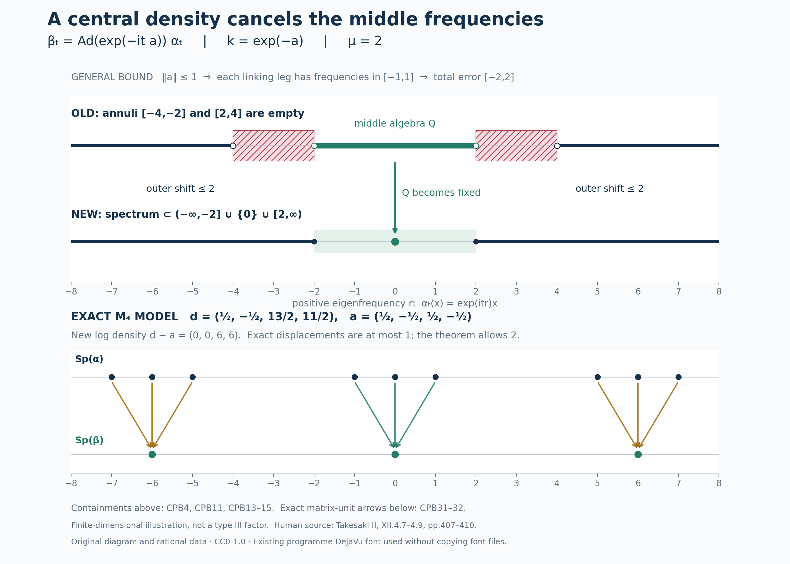

# Central perturbations, spectral gaps, and ambient maximal abelian algebras

A small central change of a weight can remove all modular frequencies near zero except zero itself. Centrality lets the change preserve the old centralizer and lets the local constructions exhaust it by orthogonal corners. We first localize inside an arbitrarily prescribed central corner, then construct ambient maximal abelian algebras and identify weights from their centralizers.

*Original exposition, examples, diagram, data and drawing code are dedicated to CC0-1.0 to the extent of rights held. Cited publications and the externally referenced font retain their own terms.*

## 1. Statements, supports, and exact earlier inputs

Let \(M\) be a factor with separable predual of type \(\mathrm{III}_\lambda\), \(0\leq\lambda<1\). Thus \(S(M)=\{0,1\}\) when \(\lambda=0\), and \(S(M)=\{0\}\cup\lambda^{\mathbb Z}\) otherwise. A normal semifinite weight need not be faithful. For such a weight \(\varphi\), put \(p=s(\varphi)\), and use the reduced convention
\[
 \varphi(x)=\varphi(pxp),\qquad
 M_\varphi=(pMp)_{\varphi^p},\qquad C_\varphi=Z(M_\varphi),
 \quad \varphi^p=\varphi|_{(pMp)_+}.
 \tag{CPB1}
\]
The restriction \(\varphi^p\) is faithful normal semifinite. All modular groups and centralizers of \(\varphi\) below belong to \(pMp\). This is the actual supported-weight convention and proof [WC.1–3](../../OA-MOD/src/weight-comparison-centralizer-transport.md#support-corners-cuts-and-the-comparison-relation), not an extension of a nonfaithful modular group to all of \(M\).

A weight is **strictly semifinite** if it is a sum of bounded normal positive functionals with pairwise orthogonal supports. Equivalently its restriction to its reduced centralizer is semifinite; [WC.24–27](../../OA-MOD/src/weight-comparison-centralizer-transport.md#strict-semifiniteness-is-semifiniteness-on-the-centralizer) proves both directions, including infinite values. A faithful weight \(\rho\) on a nonzero algebra \(B\) is **lacunary** if for some \(\delta>0\)
\[
 B_{\sigma^\rho}([-\delta,\delta])=B_\rho.
 \tag{CPB2}
\]
Use positive eigenfrequencies: \(\alpha_t(x)=e^{itr}x\) has frequency \(r\), and \(T_gx=\int g(t)\alpha_t(x)\,dt\) has multiplier \(\widehat g(r)=\int g(t)e^{itr}\,dt\). These are weak-star normal integrals. [MG1](OA-FLOW-MG.md#oa-flow.mg.1) identifies the complete action spectrum with \(\operatorname{Sp}(\log\Delta_\rho)\) for arbitrary faithful NSF weights. Thus an action gap is a gap around \(1\) in the positive modular-operator spectrum. No vector \(\Lambda_\rho(1)\) is assumed to exist.

We prove three conclusions.

1. **Local central perturbation.** If \(\varphi\neq0\) is normal semifinite and \(0\neq r\in\operatorname{Proj}(C_\varphi)\), there are \(0\neq f\in\operatorname{Proj}(C_\varphi)\), \(f\leq r\), and \(h\in(C_\varphi)_+\), with \(s(h)=f\) and \(mf\leq h\leq Mf\) for some \(0<m\leq M<\infty\), such that \(\varphi_h(x)=\varphi(h^{1/2}xh^{1/2})\) is lacunary on \(fMf\). This includes every nonzero supported NSF weight without strict semifiniteness. If \(0<\lambda<1\), one can take \(f=r\), \(m=\lambda\), \(M=1\), with modular period \(2\pi/(-\log\lambda)\).

2. **Ambient MASA.** If \(\varphi\) is faithful and strictly semifinite, \(M_\varphi\) contains a maximal abelian von Neumann subalgebra of \(M\). Consequently \(M_\varphi'\cap M=C_\varphi\).

3. **Centralizer-density criterion.** For faithful strictly semifinite \(\varphi,\psi\),
\[
 M_\varphi\subseteq M_\psi
 \quad\Longleftrightarrow\quad
 \psi=\varphi_h.
 \tag{CPB3}
\]
Here the right side means that there is a unique nonsingular positive self-adjoint \(h\) affiliated with \(C_\varphi\) giving the equality on the whole positive cone. Neither \(h\) nor \(h^{-1}\) need be bounded. The conditional version in Section 7 needs only faithful NSF \(\varphi,\psi\) and \(M_\varphi'\cap M=C_\varphi\); it does not assume strict semifiniteness of either weight.

The exact spectral inputs are [GL2–6](OA-FLOW-GL.md#gl-3), reflected to the convention above, for closed spaces, local filters, compact approximation, adjoint reflection and the product rule; [SS3](OA-FLOW-SS.md#ss-3) for \(B_\alpha(\{0\})=B^\alpha\); [GCC, C14–15](OA-FLOW-GCC.md#equation-c14) for central-support replacement without changing corner spectra; and [L121, SC2–4 and D23–30](OA-FLOW-L121.md#oa-flow.l121.sc2) for mutually approximating central fixed corners and directed thickened spectra. [MIV2.h](OA-FLOW-MIV.md#miv-2) gives \(\exp\Gamma(\sigma^\rho)=S(B)\cap(0,\infty)\) for every factor and faithful NSF reference. [Z3](OA-FLOW-Z.md#oa-flow.z.3) constructs a bounded fixed implementer from a bounded action spectrum, and [Z4](OA-FLOW-Z.md#oa-flow.z.4) proves spectral displacement through an actual linking algebra. [CZ0–6](OA-FLOW-CZ.md#oa-flow.cz.0) supplies whole-cone density order, full finite domains and the normalized cocycle. These are proved programme inputs; Sections 2–7 supply the additional assembly.

The support corner \(pMp\) and every nonzero later corner have the same type: [CT1–2](OA-FLOW-CT.md#oa-flow.ct.2) gives \(x\mapsto vxv^*\), with normal inverse \(y\mapsto v^*yv\), and transports full modular graphs and their spectral intersection. The type preservation includes zero in \(S\).

## 2. Remove a compact annulus inside the prescribed central corner

We prove an action statement with no separability or finite-weight hypothesis. Let \(B\) be any factor, \(\alpha\) a point-ultraweakly continuous normal real action, \(N=B^\alpha\), \(C=Z(N)\), and suppose \(\Gamma(\alpha)=\{0\}\). For each \(0\neq r\in\operatorname{Proj}(C)\) and \(\mu>0\), some \(0\neq f\in\operatorname{Proj}(C)\), \(f\leq r\), satisfies
\[
 \operatorname{Sp}(\alpha^f)\cap A_\mu=\varnothing,
 \qquad A_\mu=[-2\mu,-\mu]\cup[\mu,2\mu].
 \tag{CPB4}
\]

Write \(S_f=\operatorname{Sp}(\alpha^f)\). Consider only the family under the prescribed \(r\):
\[
 \mathcal F_r=
 \{S_f+[-\varepsilon,\varepsilon]:
    0\neq f\in\operatorname{Proj}(C),\ f\leq r,\ \varepsilon>0\}.
 \tag{CPB5}
\]
Its members are closed: from a convergent net in a closed set plus a compact interval, pass to a subnet whose interval components converge; the closed-set components then converge too. Only the interval, not \(S_f\), is assumed compact.

The central-ergodicity hypothesis in L121 holds because \(B\) is a factor. Its D23 gives, for nonzero \(e_1,e_2\in C\) and \(\eta>0\), nonzero central \(f_j\leq e_j\) with
\[
 S_{f_1}\subseteq S_{f_2}+[-\eta,\eta],
 \qquad S_{f_2}\subseteq S_{f_1}+[-\eta,\eta].
 \tag{CPB6}
\]
That proof localizes a nonzero element of \(e_1Be_2\) to a compact frequency interval, saturates it on both sides by \(N\) and by \(\alpha\), and joins its left and right supports. The joins are central in \(N\); they need not be equal. Two-sided range density detects a nonzero sandwich, and its compact outside spectra give the error interval. This works even when \(e_1e_2=0\).

For directedness **within** \(\mathcal F_r\), start with \(S_{e_j}+[-\varepsilon_j,\varepsilon_j]\), \(e_j\leq r\). Choose \(d>0\) with \(2d<\min(\varepsilon_1,\varepsilon_2)\), and use (CPB6) with error \(d\). The member \(S_{f_1}+[-d,d]\) lies in the first original set by restriction and in the second by (CPB6). Its projection still lies under \(r\). Iterate for finitely many sets. No purported nonzero intersection of the \(e_j\) is used.

The restricted family is cofinal in the family using all nonzero central projections. Given \(0\neq e\in C\) and \(\varepsilon>0\), apply (CPB6) to \(r,e\), with error \(\varepsilon/2\), obtaining \(f\leq r\), \(g\leq e\). Then
\[
 S_f+[-\varepsilon/2,\varepsilon/2]
 \subseteq S_g+[-\varepsilon,\varepsilon]
 \subseteq S_e+[-\varepsilon,\varepsilon].
 \tag{CPB7}
\]
GCC C15 and closedness give
\[
 \bigcap\mathcal F_r
 =\bigcap_{\substack{0\neq e\in\operatorname{Proj}(C)\\\varepsilon>0}}
       (S_e+[-\varepsilon,\varepsilon])
 =\bigcap_{0\neq e\in\operatorname{Proj}(C)}S_e
 =\Gamma(\alpha)=\{0\}.
 \tag{CPB8}
\]
Indeed a point outside a closed \(S_e\) is excluded by a sufficiently small thickening. Cofinality and the subfamily inclusion give the first equality in both directions. The complements of members of \(\mathcal F_r\) cover the compact annulus \(A_\mu\). A finite subcover and downward directedness give one member disjoint from the entire annulus, and its underlying \(S_f\) is disjoint too. This proves (CPB4).

**A retained second route.** Apply [CS3](OA-FLOW-CS.md#oa-flow.cs.3) to \(\alpha^r\) on the factor \(rBr\). Its fixed algebra is \(rNr\), its Connes spectrum is still zero, and its directed family of all fixed-corner thickenings has intersection zero. Compactness gives a nonzero fixed projection \(e\leq r\), initially not central, with the annular gap. Set \(f=c_{rNr}(e)\). GCC C14, inside this exact reduced algebra, gives
\(\operatorname{Sp}((\alpha^r)^f)=\operatorname{Sp}((\alpha^r)^e)\).
Since \(r\in Z(N)\), \(Z(rNr)=rZ(N)\); hence \(0\neq f\leq r\) belongs to \(C\). Ambient and reduced filters agree by GCC C4. This proves (CPB4) by a second route. The fixed projection alone would not be enough; central-support replacement is essential.

## 3. Flatten the middle algebra with a central bounded implementer

Work on \(B_0=fBf\), with identity \(f\), write \(\alpha\) for the restricted action and \(N_0=fNf\). The weak-star closed space
\[
 Q=(B_0)_\alpha([-\mu,\mu])
 \tag{CPB9}
\]
is a von Neumann algebra. It contains \(f\), is star closed by reflection, and is multiplicatively closed: a product has spectrum in \([-2\mu,2\mu]\), but also in the full action spectrum, which misses \(A_\mu\). Thus it is again in the middle space. The restricted action on \(Q\) is normal and point-ultraweakly continuous, has spectrum in \([-\mu,\mu]\), and has fixed algebra exactly \(N_0\).

Apply Z3's complete bounded-spectrum construction to this **restricted algebra** \(Q\). It gives
\[
 a=a^*\in Q^\alpha=N_0,\qquad
 -\frac{\mu}{2}f\leq a\leq\frac{\mu}{2}f,\qquad
 \alpha_t|_Q=\operatorname{Ad}(e^{ita})|_Q.
 \tag{CPB10}
\]
More precisely, in \(Q\) take the left annihilator \(p(s)\) of \(Q_\alpha([s,\infty))\). These are increasing fixed projections, zero for \(s\leq0\) and \(f\) for \(s>\mu\). Tagged sums
\(\sum_j\tau_j(p(s_j)-p(s_{j-1}))\) converge in norm as the mesh tends to zero: refinement changes a sum by at most its mesh, and common refinements compare two sums. They give \(0\leq b\leq\mu f\); Z3's full half-line comparison proves \(\alpha|_Q=\operatorname{Ad}(e^{itb})\). Set \(a=b-\mu f/2\). Its bounded generator is obtained by differentiating the smooth filter equal to one near the bounded spectrum. This is not a use of ambient half-lines, an unproved continuity assertion for \(p(s)\), or an unbounded generator on an unspecified domain.

There is a further centrality conclusion. Every \(x\in N_0\) is fixed, so \(e^{ita}xe^{-ita}=x\) for every \(t\). Differentiating the bounded exponential in norm at zero gives \(i[a,x]=0\). Since \(a\in N_0\),
\[
 a\in Z(N_0)=fC,\qquad k=e^{-a}\in(fC)_+,\qquad
 e^{-\mu/2}f\leq k\leq e^{\mu/2}f.
 \tag{CPB11}
\]
The equality \(Z(fNf)=fC\) uses the already established centrality of \(f\) in \(N\). Exponentials are taken in \(fBf\), and \(k\) is extended by zero outside \(f\).

The normal continuous action
\(\beta_t=\operatorname{Ad}(k^{it})\alpha_t=\operatorname{Ad}(e^{-ita})\alpha_t\)
is the identity on \(Q\), fixes \(N_0\) pointwise and fixes \(a,k\).
To prove its full spectral displacement, on \(M_2(B_0)\) set
\[
 W_t(X)=
 \begin{pmatrix}f&0\\0&e^{-ita}\end{pmatrix}
 (\alpha_t(X_{ij}))
 \begin{pmatrix}f&0\\0&e^{ita}\end{pmatrix},\qquad
 v=f\otimes e_{21}.
 \tag{CPB12}
\]
Here \(M_2(B_0)\) denotes the ordinary two-by-two matrix von Neumann algebra. Since \(a\) is fixed, the diagonal multipliers obey the cocycle law, so \(W\) is an actual normal continuous action. Its diagonal corners are \(\alpha,\beta\). Filtering \(W_t(v)=e^{-ita}\otimes e_{21}\) gives \(\widehat g(-a)\otimes e_{21}\), so its spectrum lies in \([-\mu/2,\mu/2]\); the same bound holds for \(v^*\). The identity \(x\otimes e_{22}=v(x\otimes e_{11})v^*\) and two product rules give, for every closed \(E\),
\[
 \operatorname{Sp}_\alpha(x)\subseteq E
 \ \Longrightarrow\
 \operatorname{Sp}_\beta(x)\subseteq E+[-\mu,\mu].
 \tag{CPB13}
\]
The sum is closed because the error interval is compact. This proves the sign and both contributions to the displacement.

Choose a smooth compact Fourier multiplier \(\chi\), equal to one near \([-\mu,\mu]\), supported in \((-2\mu,2\mu)\), and let \(k_\chi\) be its inverse Fourier kernel, so \(\widehat{k_\chi}=\chi\). The actual filter gives for every \(x\in B_0\)
\[
 x=x_{\rm mid}+x_{\rm out},\quad x_{\rm mid}=T_{k_\chi}^\alpha x\in Q,\quad
 \operatorname{Sp}_\alpha(x_{\rm out})
 \subseteq(-\infty,-2\mu]\cup[2\mu,\infty).
 \tag{CPB14}
\]
Local filters see \(1-\chi=0\) near the middle; outside it the original annulus is already absent. The filter localization and closed-space criterion justify this even for elements without compact spectrum. The first term is \(\beta\)-fixed; (CPB13) moves the second into \((-\infty,-\mu]\cup[\mu,\infty)\). Every smooth \(\beta\)-filter with compact support in the punctured interval \((-\mu,\mu)\setminus\{0\}\) therefore vanishes on every \(x\). Local action-spectrum detection and SS3 prove
\[
 \operatorname{Sp}(\beta)\subseteq(-\infty,-\mu]\cup\{0\}\cup[\mu,\infty),
 \qquad (B_0)_\beta([-\delta,\delta])=(B_0)^\beta
 \quad(0<\delta<\mu).
 \tag{CPB15}
\]
The negative endpoint is \(-\mu\). Replacing it by \(+\mu\) would destroy the gap.

## 4. Apply the construction to arbitrary supported weights

Let \(\varphi\neq0\) be normal semifinite on the stated \(M\). The weight \(\varphi^p\) is faithful NSF on the nonzero support factor. For type \(\mathrm{III}_0\), CT1–2 and MIV2.h give
\(\Gamma(\sigma^{\varphi^p})=\log\{1\}=\{0\}\).
For each prescribed \(0\neq r\in\operatorname{Proj}(C_\varphi)\), Sections 2–3 produce \(0\neq f\leq r\), \(a\in fC_\varphi\), and \(h=e^{-a}\), extended by zero off \(f\).

[MG2](OA-FLOW-MG.md#oa-flow.mg.2) makes \(\varphi^f=\varphi|_{fMf}\) faithful NSF with the restricted modular action even if \(\varphi(f)=\infty\). CZ1 and CZ4 then identify the whole weight, bounds and modular action:
\[
 \begin{gathered}
 \varphi_h(x)=\varphi(h^{1/2}xh^{1/2}),\quad x\in M_+,\qquad
 s(\varphi_h)=s(h)=f,\\
 e^{-\mu/2}\varphi_f(x)\leq\varphi_h(x)\leq e^{\mu/2}\varphi_f(x),
 \qquad \varphi_f(x)=\varphi(fxf),\\
 \sigma_t^{(\varphi_h)^f}
   =\operatorname{Ad}(e^{-ita})\sigma_t^{\varphi^f}.
 \end{gathered}
 \tag{CPB16}
\]
These are order inequalities in the **density parameter**, proved on the whole cone by CZ1. They do not assert \(h^{1/2}xh^{1/2}\leq\|h\|x\). Faithfulness on \(pMp\) shows that \(\varphi_h(x)=0\) exactly when \(x^{1/2}h^{1/2}=0\), equivalently \(x^{1/2}f=0\) because \(h\) is invertible on \(f\). This proves its support.

Write \(F_\rho=\{x\in M_+:\rho(x)<\infty\}\), \(\mathfrak n_\rho=\{x:\rho(x^*x)<\infty\}\), \(\mathfrak A_\rho=\mathfrak n_\rho\cap\mathfrak n_\rho^*\), and \(\mathfrak m_\rho=\operatorname{span}\mathfrak n_\rho^*\mathfrak n_\rho\). Any bounds \(mf\leq h\leq Mf\), \(m>0\), give
\[
 \begin{gathered}
 F_{\varphi_h}=F_{\varphi_f},\quad
 \mathfrak n_{\varphi_h}=\mathfrak n_{\varphi_f},\quad
 \mathfrak A_{\varphi_h}=\mathfrak A_{\varphi_f},\quad
 \mathfrak m_{\varphi_h}=\mathfrak m_{\varphi_f},\\
 \mathfrak n_{\varphi_h}=\{x\in M:xh^{1/2}\in\mathfrak n_\varphi\},\\
 (\varphi^f)_h=(\varphi_h)^f,\qquad
 ((\varphi^f)_h)_{h^{-1}}=\varphi^f\quad\text{on }(fMf)_+.
 \end{gathered}
 \tag{CPB17}
\]
Apply whole-cone comparison to \(x^*x\) and \(xx^*\) for the first line; the second is the defining sandwich. The third uses the bounded inverse on \(f\), not on \(1-f\). The reduced GNS map is
\(\Lambda_{(\varphi^f)_h}(x)=\Lambda_{\varphi^f}(xh^{1/2})\);
CZ3 proves density in the full reduced GNS space using the bounded inverse right multiplier. CZ6 gives normalized reduced cocycle \(h^{it}\). Sections 2–3 prove lacunarity, and MG1 identifies the genuine modular-operator gap. No step requires finite total mass or strict semifiniteness.

There is an exact inclusion
\[
 fM_\varphi f\subseteq M_{\varphi_h}.
 \tag{CPB18}
\]
Every old fixed element in this corner commutes with \(h\). If \(M_\varphi\) is properly infinite, its nonzero **central** summand \(fM_\varphi\) is properly infinite: compress two orthogonal isometries by the central \(f\). The same isometries witness proper infiniteness of the larger \(M_{\varphi_h}\). An arbitrary noncentral finite projection would not preserve that conclusion.

## 5. Positive \(\lambda\): bounded phase and affiliated-cut alternatives

Suppose \(0<\lambda<1\), and set \(L=-\log\lambda>0\), \(T=2\pi/L\). The actual inner-period theorem [IP0–6](OA-FLOW-IP.md#oa-flow.ip.0), applied to \(pMp\), produces a unitary \(b\) with \(\sigma_T^{\varphi^p}=\operatorname{Ad}b\) on the whole support algebra. [PW1](OA-FLOW-PW.md#oa-flow.pw.1) proves \(b\in C_\varphi\): modular time preserves the whole weight, the weight-preserving-unitary criterion puts \(b\) in the centralizer, and that automorphism fixes the centralizer pointwise. [PW2](OA-FLOW-PW.md#oa-flow.pw.2)'s Borel/Cayley construction gives a bounded phase \(\Theta\in C_\varphi\), \(0\leq\Theta\leq2\pi p\), with \(e^{i\Theta}=b\).

For the prescribed \(r\in\operatorname{Proj}(C_\varphi)\), put
\[
 f=r,\qquad h=r e^{-\Theta/T},\qquad
 \lambda r\leq h\leq r,\qquad h^{iT}=rb^*\quad\text{on }r.
 \tag{CPB19}
\]
The fixed corner is legitimate without finite mass. Its perturbed modular group satisfies
\[
 \sigma_T^{(\varphi_h)^r}
 =\operatorname{Ad}(rb^*)\operatorname{Ad}(rb)
 =\mathrm{id}_{rMr}.
 \tag{CPB20}
\]
[PW3](OA-FLOW-PW.md#oa-flow.pw.3) proves all finite-domain comparisons and the normalized cocycle, as in (CPB16–17). A \(T\)-periodic action has spectrum in \(L\mathbb Z\): if \(e^{iTr_0}\neq1\), choose a smooth local Fourier multiplier near \(r_0\), divide it on its compact support by \(e^{iTr}-1\), and apply the resulting \(L^1\) filter to \(\alpha_T-\mathrm{id}=0\). This kills a multiplier nonzero at \(r_0\). Thus any \(0<\delta<L\) gives (CPB2). The inclusion (CPB18) persists. This bounded correction works for every faithful NSF weight, not only functionals.

An affiliated alternative remains useful if an implementer is already written
\(\sigma_T^{\varphi^p}=\operatorname{Ad}(d^{iT})\), with nonsingular positive \(d\) affiliated with \(C_\varphi\), without bounds on \(d\) or its inverse. Its central projections \(q_n=1_{[1/n,n]}(d)\) increase to \(p\). Since \(rq_n\uparrow r\neq0\), some \(f=rq_n\) is nonzero. This intersection is justified by monotone exhaustion, not by a general assertion about central projections. Define
\[
 h=d^{-1}f,\qquad n^{-1}f\leq h\leq nf.
 \tag{CPB21}
\]
All products here are bounded spectral products on the selected corner. In particular \(h^{iT}=d^{-iT}f\), and cancellation gives (CPB20) on \(fMf\), with the complete domains (CPB17). The bounded-phase route avoids a cut; the affiliated route is valid after the explicitly selected nonzero cut.

## 6. From local gaps to an ambient MASA

First consider the finite-weight step. Let \(\omega\) be a faithful bounded normal positive functional on any \(B\), with \(B_{\sigma^\omega}([-\delta,\delta])=B_\omega\). If \(A\) is a MASA of \(B_\omega\), then \(D=A'\cap B\) is invariant under the modular group. Take
\(x\in D\cap B_{\sigma^\omega}([u-\delta/2,u+\delta/2])\).
The product rule gives \(x^*x,xx^*\in A\). Their supports lie in \(A\). Since \(x\) commutes with \(A\), its left and right supports coincide; its polar partial isometry lies in \(D\), is unitary on that support, and commutes with \(|x|\). Hence \(xx^*=x^*x\).

The full bounded GNS calculation [WC.43–47](../../OA-MOD/src/weight-comparison-centralizer-transport.md#a-lacunary-functional-carries-ambient-maximal-abelian-algebras) gives a finite positive measure \(\nu_x\), supported in \([-u-\delta/2,-u+\delta/2]\), such that
\[
 F(t)=\omega(\sigma_t^\omega(x^*)x)=\int e^{its}\,d\nu_x(s),\quad
 F(i)=\int e^{-s}\,d\nu_x(s)=\omega(xx^*),\quad
 F(0)=\omega(x^*x).
 \tag{CPB22}
\]
This is the spectral measure of \(\log\Delta_\omega\) on \(\Lambda_\omega(x)\), reflected to match \(x^*\). Filtering the bounded GNS map proves the support assertion. The full Tomita domain identity
\(\|\Delta_\omega^{1/2}\Lambda_\omega(x)\|^2=\omega(xx^*)\)
gives the imaginary-time moment. Compact support makes the entire integral legitimate.

If \(u>\delta\), then \(F(i)\geq e^{u-\delta/2}F(0)>F(0)\) unless \(x=0\). Normality of \(x\) forces equality, so faithfulness gives \(x=0\); reflection removes \(u<-\delta\). For any smooth compact multiplier supported off \([-\delta,\delta]\), cover its support by finitely many such vanishing intervals and split it with a smooth partition. Every filtered piece of any element of \(D\) vanishes. The closed-space criterion gives \(D\subseteq B_{\sigma^\omega}([-\delta,\delta])=B_\omega\). Maximality in \(B_\omega\) now yields
\[
 A'\cap B=A.
 \tag{CPB23}
\]
This filter argument avoids enlarging the final spectral band by a half-width. The imaginary-time integrand is \(e^{-s}\), not the printed source's exponential with an additional interval-center factor.

Now let \(\omega\) be any faithful bounded functional on the stated type \(\mathrm{III}_\lambda\) factor. In every nonzero centralizer-center corner \(r\), Sections 4–5 give \(0\neq f\leq r\) and a bounded support-invertible central density \(h\) such that \((\omega_h)^f\) is lacunary. This is a bounded faithful functional on \(fMf\), because \(\omega_h(f)\leq\|h\|\omega(f)<\infty\). The operator \(h\) belongs to its new centralizer. Choose a MASA \(A_f\) of that centralizer containing the abelian algebra generated by \(h,f\). Equation (CPB23) makes \(A_f\) a MASA of \(fMf\), and for \(x\in A_f\),
\[
 \sigma_t^{\omega^f}(x)
 =h^{-it}\sigma_t^{(\omega_h)^f}(x)h^{it}=x.
 \tag{CPB24}
\]
Thus \(A_f\subseteq fM_\omega f\).

Choose a maximal pairwise orthogonal family of nonzero \(f_i\in C_\omega\), each admitting an ambient MASA \(A_i\subseteq f_iM_\omega f_i\). A nonzero residual \(r=1-\sum_i f_i\) would be in \(C_\omega\) and would admit a further member by the preceding prescribed-corner construction. Hence the strong sum is \(1\). Set
\[
 A=\left\{\sum_i a_i:\ a_i\in A_i,\ \sup_i\|a_i\|<\infty\right\}
 \subseteq M_\omega .
 \tag{CPB25}
\]
This is a unital abelian von Neumann algebra, with bounded strong block sums. Weak-star closedness follows from the normal coordinates \(x\mapsto f_i x f_j\): the off-diagonal entries vanish and each diagonal entry is in the weak-star closed \(A_i\). If \(x\in A'\cap M\), it commutes with each \(f_i\in A\), so \(f_i x f_j=0\) for \(i\neq j\); also \(f_i x f_i\in A_i'\cap f_iMf_i=A_i\). Bounded strong reconstruction puts \(x\in A\). This proves ambient maximality without requiring \(f_i\) central in \(M\).

Finally let \(\varphi\) be faithful strictly semifinite. WC.24–27 supplies pairwise orthogonal \(e_j\in M_\varphi\), each of finite positive \(\varphi\)-mass, with strong sum \(1\). They need not be central in \(M_\varphi\). The restriction \(\varphi^{e_j}\) is a faithful bounded functional on the type-preserving corner \(e_jMe_j\), with centralizer \(e_jM_\varphi e_j\). Apply the previous construction in each corner. Its ambient MASAs \(B_j\subseteq e_jM_\varphi e_j\) have block sum \(B\subseteq M_\varphi\); the identical mixed-entry argument proves \(B'\cap M=B\). Separability ensures countability of nonzero orthogonal families, but block reconstruction itself works for arbitrary families. An element commuting with \(M_\varphi\) commutes with \(B\), hence lies in \(B\subseteq M_\varphi\). Therefore
\[
 M_\varphi'\cap M=Z(M_\varphi)=C_\varphi.
 \tag{CPB26}
\]
This supplies the type-dependent premise left open in WC.34–35.

## 7. The full density criterion and its domains

We first work on any von Neumann algebra \(B\), with faithful NSF \(\varphi,\psi\) and \(B_\varphi'\cap B=C_\varphi\). If \(h>0\) is nonsingular and affiliated with \(C_\varphi\), CZ2 constructs \(\varphi_h\) on every \(x\in B_+\):
\[
 \varphi_h(x)=
 \sup_n\varphi\!\left((hp_n)^{1/2}x(hp_n)^{1/2}\right),
 \qquad p_n=1_{[1/n,n]}(h)\uparrow1.
 \tag{CPB27}
\]
All displayed products are bounded. CZ1 proves parameter monotonicity even when \(x\) does not commute with the density; CZ2 proves additivity, normality, faithfulness and semifiniteness of this supremum. Its exact finite left ideal and GNS vectors are
\[
 \begin{split}
 x\in\mathfrak n_{\varphi_h}
 &\Longleftrightarrow
 xh^{1/2}p_n\in\mathfrak n_\varphi\text{ for every }n,\
 \sup_n\|\Lambda_\varphi(xh^{1/2}p_n)\|^2<\infty,\\
 \Lambda_{\varphi_h}(x)&=
 \lim_n\Lambda_\varphi(xh^{1/2}p_n).
 \end{split}
 \tag{CPB28}
\]
The difference of successive squared norms is the squared norm of the vector difference, by disjoint spectral density additivity, so the limit exists. The finite-star and finite linear domains are
\(\mathfrak n_{\varphi_h}\cap\mathfrak n_{\varphi_h}^*\) and
\(\operatorname{span}\mathfrak n_{\varphi_h}^*\mathfrak n_{\varphi_h}\).
This states the full domain even if an uncut \(xh^{1/2}\) is unbounded.

CZ5–6 gives
\[
 \sigma_t^{\varphi_h}=\operatorname{Ad}(h^{it})\sigma_t^\varphi,
 \qquad (D\varphi_h:D\varphi)_t=h^{it}.
 \tag{CPB29}
\]
Its proof first works on \(p_nBp_n\), where the density and inverse are bounded, and then passes through normal maps along \(p_nxp_n\to x\). Centrality of the spectral projections of \(h\) makes \(B_\varphi\subseteq B_{\varphi_h}\).

Conversely suppose \(B_\varphi\subseteq B_\psi\). [BC4](OA-FLOW-BC.md#oa-flow.bc.4) constructs the normalized strongly continuous cocycle \(u_t=(D\psi:D\varphi)_t\), with
\(\sigma_t^\psi=\operatorname{Ad}(u_t)\sigma_t^\varphi\).
Both groups fix every \(x\in B_\varphi\), so \(u_t x=xu_t\), and the relative-commutant assumption puts \(u_t\in C_\varphi\). The old action is trivial there, so the cocycle law is \(u_{s+t}=u_su_t\). [RF5](OA-FLOW-RF.md#oa-flow.rf.5) gives \(u_t=e^{itA}\) for a unique self-adjoint \(A\). A commutant unitary of \(C_\varphi\) commutes with the group's Laplace resolvent, hence with \(A\) and its spectral projections by that generator construction. Thus
\[
 h=e^A>0,\quad\ker h=0,\quad
 h\text{ is affiliated with }C_\varphi,\qquad u_t=h^{it}.
 \tag{CPB30}
\]
The functional calculus defines \(e^A\) on its full squared-integral domain; \(e^s\neq0\) gives nonsingularity. No boundedness follows or is needed.

The weight \(\varphi_h\) has the same normalized cocycle by (CPB29). For whole-cone uniqueness, the BC4 chain law gives \((D\psi:D\varphi_h)_t=1\). Therefore the off-diagonal element \(1\) in the balanced modular group has constant entire orbit. [MA4, MA11](OA-FLOW-MA.md#oa-flow.ma.4), applied to this element with half-strip value \(1\), gives both inequalities
\(\psi(x)\leq\varphi_h(x)\) and \(\varphi_h(x)\leq\psi(x)\) for every \(x\geq0\), including infinity. Hence \(\psi=\varphi_h\). RF5's generator uniqueness gives uniqueness of \(h\). Equal modular groups alone would lose a scalar; the normalized cocycle does not.

Combining this conditional theorem with (CPB26) proves (CPB3). In fact no prior strictness assumption on a faithful NSF \(\psi\) is needed when \(\varphi\) has the stated type and is strictly semifinite. If \(\psi=\varphi_h\), it is strictly semifinite automatically: take the finite sums \(e_F\) of finite-\(\varphi\) centralizer pieces and the cuts \(p_n\). Since \(h\) is central in \(M_\varphi\), the projections \(e_Fp_n\) increase jointly to \(1\), lie in \(M_\psi\), and satisfy \(\psi(e_Fp_n)\leq n\varphi(e_F)<\infty\). For positive \(x\in M_\psi\), the elements \(x^{1/2}e_Fp_nx^{1/2}\uparrow x\) have finite weight by centralizer cyclicity. Thus \(\psi|_{M_\psi}\) is semifinite, and WC.24–27 applies.

## 8. Exact finite-dimensional model of the flattening

This matrix action illustrates the mechanism; it is not a type III factor. On \(B=M_4(\mathbb C)\), with ordinary unnormalized trace, set
\[
 d=\operatorname{diag}\left(\tfrac12,-\tfrac12,\tfrac{13}2,\tfrac{11}2\right),
 \quad D=e^d,\quad \varphi(x)=\operatorname{Tr}(Dx),\quad
 \alpha_t(x)=e^{itd}xe^{-itd},\quad \mu=2.
 \tag{CPB31}
\]
The weight is faithful finite normal. All finite domains are the whole algebra and continuity is in norm. Its GNS space identifies with Hilbert–Schmidt matrices by \(x\mapsto xD^{1/2}\), and its full modular operator is \(L_D R_{D^{-1}}\). Direct multiplication gives \(\alpha_t(e_{ij})=e^{it(d_i-d_j)}e_{ij}\). Thus the exact spectrum is \(\{0,\pm1,\pm5,\pm6,\pm7\}\), missing \([-4,-2]\cup[2,4]\).

The middle algebra is \(Q=M_{\{1,2\}}\oplus M_{\{3,4\}}\), because exactly its matrix units have frequencies in \([-2,2]\). The old centralizer and its center are both the diagonal algebra, since the \(d_i\) are distinct. Put
\[
 \begin{gathered}
 a=\operatorname{diag}\left(\tfrac12,-\tfrac12,\tfrac12,-\tfrac12\right),
 \qquad k=e^{-a},\\
 d-a=\operatorname{diag}(0,0,6,6),\\
 \varphi_k(x)=\operatorname{Tr}\!\left(\operatorname{diag}(1,1,e^6,e^6)x\right).
 \end{gathered}
 \tag{CPB32}
\]
Then \(a\) is central in the old centralizer, has norm \(1/2\leq\mu/2\), and implements \(\alpha|_Q\). The new action fixes \(Q\), has exact spectrum \(\{0,-6,6\}\), and has centralizer exactly \(Q\), as follows directly from its density. Its normalized cocycle is \(k^{it}=e^{-ita}\). Every matrix unit has new frequency \((d_i-d_j)-(a_i-a_j)\); its actual displacement is at most \(1\), within the proved general bound \(\mu=2\). Old frequencies \(\pm1\) move to zero, positive outer frequencies \(5,6,7\) to \(6\), and negative ones to \(-6\).

*Figure.* The upper panel displays the containments (CPB4), (CPB11), (CPB13–15), with \(\mu=2\). Shaded annuli exclude old frequencies; the punctured interval after correction is the proved new gap. The lower panel plots every distinct old frequency and its exact matrix-unit target in (CPB31–32). Its segments are not a spectral transport map for a general action. The formula \(\beta_t=\operatorname{Ad}(e^{-ita})\alpha_t\) fixes the sign. Rational data and the original renderer reproduce PNG and SVG using the existing programme font without redistributing it.

## 9. Solved diagnostics

**1. Why must the weight be nonzero?** If \(\varphi=0\), then \(p=0\), its reduced centralizer and center are zero, and no nonzero \(h\in(C_\varphi)_+\) exists. The zero weight is excluded precisely from the nonzero perturbation conclusion.

**2. Why not intersect nonzero central projections?** In the matrix model \(e_{11},e_{22}\) are nonzero central projections of the diagonal centralizer, yet \(e_{11}e_{22}=0\). They have a nonzero ambient bridge \(e_{12}\). Equations (CPB6–8) compare spectra through bridges; their directedness concerns frequency sets, not common subprojections.

**3. What if the negative endpoint were \(+\mu\)?** Then \((-\infty,\mu]\cup[\mu,\infty)=\mathbb R\), leaving no gap. The actual displacement of \((-\infty,-2\mu]\) by \([-\mu,\mu]\) is \((-\infty,-\mu]\), exactly as in (CPB13–15).

**4. What does the wrong perturbation sign do?** In the upper-left \(2\times2\) block, \(d=a=\operatorname{diag}(1/2,-1/2)\). The correct \(k=e^{-a}\) makes the density the identity and sends the \(e_{12}\) frequency \(1\) to \(0\). Using \(e^a\) instead gives log density \(2a\) and frequency \(2\), doubling rather than cancelling the middle generator.

**5. Why is the bounded implementer central?** Mere membership \(a\in N_0\) would not preserve the old centralizer. The proof uses both \(a\in Q^\alpha=N_0\) and the fact that \(\operatorname{Ad}(e^{ita})\) fixes every \(x\in N_0\). Norm differentiation gives \([a,x]=0\), proving the missing centrality.

**6. How are mixed terms removed in a block MASA?** Commutation with every block identity gives \(e_i x e_j=x e_i e_j=0\) for \(i\neq j\). Each diagonal entry lies in the corresponding ambient MASA, and bounded strong summation reconstructs \(x\). The projections need not be central in \(M\), so this applies to the noncentral finite pieces from strict semifiniteness.

**7. Does bounded density order imply sandwich order?** No. With \(h=\operatorname{diag}(4,1)\) and \(x=\begin{pmatrix}1&1\\1&1\end{pmatrix}\geq0\),
\[
 4x-h^{1/2}xh^{1/2}=\begin{pmatrix}0&2\\2&3\end{pmatrix}
\]
has determinant \(-4\) and is not positive. The weight order in CZ1 uses centralizer cyclicity and finite-domain estimates, so (CPB16) is valid without this false operator inequality.

**8. Where is a nonzero intersection justified for an affiliated density?** In \(L^\infty(0,\infty)\), \(d(s)=s\) has neither a bounded inverse nor a bounded upper bound. For \(r=1_E\neq0\), the increasing union \(E\cap[1/n,n]\) equals \(E\) modulo null sets. One cut \(f\) is nonzero, and \(d^{-1}f\) lies between \(1/n\) and \(n\) on \(f\). This is the exact exhaustion argument of (CPB21), compatible with Diagnostic 2.

**9. Why is the density unique, not just unique up to scalar?** If \(\psi=c\varphi\), \(c>0\), the modular groups agree, but \((D\psi:D\varphi)_t=c^{it}1\). Equation (CPB30) recovers exactly \(h=c1\). The whole-cone equality uses this normalized cocycle.

**10. Does the arbitrary NSF local theorem yield a finite state?** The comparisons \(m\varphi_f\leq\varphi_h\leq M\varphi_f\) preserve an infinite value at \(f\). If \(\varphi(f)=\infty\), then \(\varphi_h(f)=\infty\). The spectral proof still works without \(\Lambda_\varphi(f)\). Finite mass enters the MASA proof only after strict semifiniteness supplies finite pieces.

**11. Must a positive-type lacunary weight have a factorial centralizer?** No. Take the earlier [DDP fundamental-period generalized trace](OA-FLOW-DDP.md#dd-existence) \(\rho\), with \(N=M_\rho\), and complementary nonzero projections \(p,q\in N\). Set \(b=p+\lambda^{1/2}q\). On a degree-\(n\) block \(p_iMp_j\), the modular multiplier for \(\rho_b\) is \((b_i/b_j)^{it}\lambda^{int}\). A mixed block would require an integer to equal a half-integer in order to be fixed. [DDP's Fourier reconstruction](OA-FLOW-DDP.md#dd-recognition) therefore gives \(M_{\rho_b}=pNp\oplus qNq\). Its frequencies lie in \(\tfrac12(\log\lambda)\mathbb Z\), so it is lacunary, while \(\sigma_T^{\rho_b}=\operatorname{Ad}(p-q)\neq\mathrm{id}\). If both projections are properly infinite, this centralizer is properly infinite but nonfactorial. This explains why the following normal-form lesson must specify its reference rather than infer factoriality from lacunarity.

## 10. Further reading

Masamichi Takesaki, *Theory of Operator Algebras II*, Chapter XII, §4, Definition 4.6 and Lemmas 4.7–4.9, printed pp.407–410, [DOI](https://doi.org/10.1007/978-3-662-10451-4), gives the strict-semifiniteness, ambient-MASA, local perturbation and central-density statements. The opening convention on p.403 concerns separable algebras and defines modular objects of a possibly nonfaithful weight on its support corner.

For the central-annulus step on p.409, equations (CPB5–8) give the prescribed-corner localization and the exact compactness argument. The bounded implementer must be central in the old centralizer, as proved after (CPB10). The outside negative endpoint is \(-\mu\) in (CPB15); the moment on p.408 is \(\int e^{-s}\,d\nu_x(s)\), as in (CPB22). The local perturbation assertion requires a nonzero input weight.

The discrete-normal-form statements beginning on p.410 require further results about coefficient densities, their exact centralizers, Fourier rigidity and carrier bands. In positive type the fundamental-period reference must be specified: Diagnostic 11 explains why lacunarity and infinite multiplicity alone do not imply a factorial centralizer. Those additional normalization results are separate from the central perturbation and centralizer-density theorems proved here.
