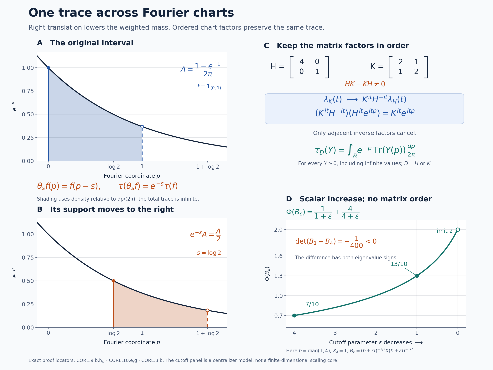

# The core trace and its changes of weight

*Self-checked by the writing AI. Original exposition and illustration sources: CC0-1.0; earlier and font components retain their recorded terms.*

The crossed product by a modular action has a trace even when the original algebra has none. To calculate that trace one must distinguish three objects: the dual weight, the positive generator of the translation unitaries, and the weight obtained by removing that generator. We first construct these objects with their full domains. We then show that changing the original weight preserves the trace, and use the resulting coordinate changes to define the core and its center flow independently of a weight.

## Setting and the trace to be constructed

Let \(M\ne0\) be an arbitrary von Neumann algebra and \(\varphi\) a faithful normal semifinite weight. No faithful state, separability, factor or countability assumption is made. The zero algebra has the unique zero-algebra version of every construction below. Write
\[
 \begin{gathered}
 C_\varphi=M\rtimes_{\sigma^\varphi}\mathbb R
   =\{\pi_\varphi(M),\lambda_\varphi(\mathbb R)\}'',\\
 \theta_s^\varphi(\lambda_\varphi(t))=e^{-ist}\lambda_\varphi(t),
 \qquad \theta_s^\varphi(\pi_\varphi(a))=\pi_\varphi(a).
 \end{gathered}
\]
The original real group has Lebesgue measure \(dt\); its Plancherel-dual measure is \(ds/(2\pi)\). Set
\[
 T_\varphi(X)=\int_{\mathbb R}\theta_s^\varphi(X)\,\frac{ds}{2\pi},
 \qquad \Phi_\varphi=\widehat{\varphi\circ\pi_\varphi^{-1}}\circ T_\varphi.
\]
The integral is an extended positive value, and the outer hat denotes extension of a scalar weight to that cone. These constructions and their normality are proved in [DA's positive average](OA-FLOW-DA.md#da-positive) and [GDA8](OA-FLOW-GDA.md#gda-8). We will construct \(h_\varphi\), with \(h_\varphi^{it}=\lambda_\varphi(t)\), and prove on the entire positive cone that
\[
 \tau_\varphi=(\Phi_\varphi)_{h_\varphi^{-1}},\qquad
 \Phi_\varphi=(\tau_\varphi)_{h_\varphi},\qquad
 \tau_\varphi\circ\theta_s^\varphi=e^{-s}\tau_\varphi.
\]
Here the subscript denotes the bounded-spectral construction of [CZ2](OA-FLOW-CZ.md#oa-flow.cz.2), including infinite values. In particular, an expression involving an unbounded inverse is always interpreted through that construction. Each \(\tau_\varphi\) will be a faithful normal semifinite trace.

## 1. The positive generator and the inner modular group

Temporarily omit the subscript \(\varphi\). The regular crossed-product representation is normal and faithful by [NR3](OA-FLOW-NR.md#oa-flow.nr.3); its translations \(\lambda(t)\) form a strongly continuous unitary group. [RF5](OA-FLOW-RF.md#oa-flow.rf.5) constructs its unique self-adjoint generator \(P\), including its entire domain, from the bounded Laplace resolvent
\[
 R\xi=\int_0^\infty e^{-t}\lambda(t)\xi\,dt,
 \qquad R=(1-iP)^{-1},\qquad D(P)=\operatorname{ran}R.
 \tag{CORE.1.a}
\]
Because \(R\in C\), the spectral construction in RF5 puts every spectral projection of \(P\) in \(C\). Thus \(P\) is affiliated with \(C\). Define \(h=e^P\) by the complete [SF spectral calculus](OA-FLOW-SF.md#oa-flow.sf.sf1). It is positive self-adjoint and nonsingular: the function \(e^p\) is strictly positive at every real \(p\). Its inverse \(e^{-P}\) is densely defined, and
\[
 h^{it}=e^{itP}=\lambda(t).
 \tag{CORE.1.b}
\]
For precision, if \(E\) is the spectral measure of \(P\) and \(\mu_\xi(B)=\|E(B)\xi\|^2\), then every finite complex-valued Borel function \(f\) on \((0,\infty)\) has the full domain
\[
 D(f(h))=
 \left\{\xi:\int_{\mathbb R}|f(e^p)|^2\,d\mu_\xi(p)<\infty\right\}.
 \tag{CORE.1.c}
\]
Bounded truncations define its value there. This includes \(h^{1/2}\), \(h^{-1/2}\), all real powers and \(\log h=P\); it makes no boundedness assertion about these operators.

[GDA8](OA-FLOW-GDA.md#gda-8) identifies \(\Phi\) with the full faithful normal semifinite dual weight, and [GDW7](OA-FLOW-GDW.md#gdw-7) gives its modular group on both generating families. Since \(\varphi\circ\sigma_t^\varphi=\varphi\), its formulas specialize to
\[
 \begin{aligned}
 \sigma_r^\Phi(\pi(a))&=\pi(\sigma_r^\varphi(a)),\\
 \sigma_r^\Phi(\lambda(t))&=\lambda(t).
 \end{aligned}
 \tag{CORE.1.d}
\]
The second equality uses unimodularity of \(\mathbb R\) and the normalized self-cocycle \((D\varphi:D\varphi)_r=1\), proved in [BC4](OA-FLOW-BC.md#oa-flow.bc.4). Conjugation by \(\lambda(r)\) has exactly the same two values: covariance gives the first and commutativity of the real translations gives the second. The two normal automorphisms therefore agree on the generated von Neumann algebra:
\[
 \sigma_r^\Phi=\operatorname{Ad}\lambda(r)
              =\operatorname{Ad}h^{ir}.
 \tag{CORE.1.e}
\]
Every spectral projection of \(h\) is fixed by this group, since it commutes with all \(h^{ir}\). Consequently \(h\) and \(h^{-1}\) are affiliated with the centralizer \(C_\Phi\). All hypotheses for centralizer perturbation are now established.

## 2. Removing the density, with its exact normalization

Define \(\tau=\Phi_{h^{-1}}\). [CZ2](OA-FLOW-CZ.md#oa-flow.cz.2) proves directly that this is a faithful normal semifinite weight. The full modular formula of [CZ5](OA-FLOW-CZ.md#oa-flow.cz.5) and (CORE.1.e) give
\[
 \sigma_t^\tau(X)=h^{-it}\sigma_t^\Phi(X)h^{it}=X.
 \tag{CORE.2.a}
\]
The whole-cone trace criterion of [KT5](OA-FLOW-KT.md#oa-flow.kt.5) therefore makes \(\tau\) a trace: \(\tau(x^*x)=\tau(xx^*)\) for every bounded \(x\in C\), including when the value is infinite. [CZ6](OA-FLOW-CZ.md#oa-flow.cz.6) fixes the actual weight normalization:
\[
 (D\tau:D\Phi)_t=h^{-it},\qquad
 (D\Phi:D\tau)_t=h^{it}.
 \tag{CORE.2.b}
\]
The second identity is the adjoint rule of [BC4](OA-FLOW-BC.md#oa-flow.bc.4).

We need an inverse-perturbation fact on the entire positive cone. Let \(\rho\) be any faithful normal semifinite weight and \(k\) any nonsingular positive operator affiliated with its centralizer. Put \(\nu=\rho_k\). CZ5 shows that the spectral projections of \(k\) are still fixed by \(\sigma^\nu\); hence \(\nu_{k^{-1}}\) is defined and faithful normal semifinite. CZ6 and BC4 give
\[
 (D\nu_{k^{-1}}:D\nu)_t=k^{-it}
       =(D\rho:D\nu)_t.
\]
The fixed-reference injectivity proved in [GDA7](OA-FLOW-GDA.md#gda-7) now yields
\[
 (\rho_k)_{k^{-1}}=\rho\quad\hbox{on the whole positive cone}.
 \tag{CORE.2.c}
\]
This uses equality of normalized cocycles, rather than equality of modular groups. Applying it to \(\rho=\Phi\) and \(k=h^{-1}\) proves \(\Phi=\tau_h\), including every infinite value. It also proves uniqueness with this normalization: if a faithful normal semifinite trace \(\eta\) satisfies \(\Phi=\eta_h\), then \(\eta=\Phi_{h^{-1}}=\tau\).

## 3. Bounded trace evaluations and every finite domain

For \(\varepsilon>0\), the bounded density used in the construction of \(\Phi_{h^{-1}}\) is
\[
 (h^{-1})_\varepsilon
   =h^{-1}(1+\varepsilon h^{-1})^{-1}
   =(h+\varepsilon)^{-1}.
\]
Thus, for every bounded \(X\in C_+\),
\[
 \begin{aligned}
 \tau(X)&=\sup_{\varepsilon>0}
   \Phi\big((h+\varepsilon)^{-1/2}X(h+\varepsilon)^{-1/2}\big)\\
 &=\sup_{n\ge1}\Phi(h^{-1/2}p_nXp_nh^{-1/2}),
 \qquad p_n=1_{[1/n,n]}(h).
 \end{aligned}
 \tag{CORE.3.a}
\]
Both lines are exactly [CZ2](OA-FLOW-CZ.md#oa-flow.cz.2), since the interval \([1/n,n]\) is unchanged under inversion. All products inside \(\Phi\) are bounded. The scalar values in the first line increase as \(\varepsilon\downarrow0\), by the bounded centralizer parameter order proved in [CZ1](OA-FLOW-CZ.md#oa-flow.cz.1). The sandwiched operators themselves need not be ordered.

Here is an exact finite-dimensional check of that distinction. In \(M_2(\mathbb C)\) let
\[
 h=\begin{pmatrix}1&0\\0&4\end{pmatrix},\qquad
 X=\begin{pmatrix}1&1\\1&1\end{pmatrix},\qquad
 \Phi(Y)=\operatorname{Tr}(hY).
\]
Then \(B_\varepsilon=(h+\varepsilon)^{-1/2}X(h+\varepsilon)^{-1/2}
=v_\varepsilon v_\varepsilon^*\), where
\[
 v_\varepsilon=
 \begin{pmatrix}(1+\varepsilon)^{-1/2}\\(4+\varepsilon)^{-1/2}\end{pmatrix}.
\]
For real two-vectors \(v,w\), expansion of the two-by-two determinant gives
\(\det(vv^*-ww^*)=-(v_1w_2-v_2w_1)^2\). At \(\varepsilon=1,4\), the inner determinant is \(1/4-1/5=1/20\). Therefore
\[
 \det(B_1-B_4)=-\frac1{400}<0,
 \qquad
 \Phi(B_\varepsilon)=\frac1{1+\varepsilon}+\frac4{4+\varepsilon}
     \uparrow2=\operatorname{Tr}(X).
 \tag{CORE.3.b}
\]
The Hermitian difference has eigenvalues of opposite signs, so neither operator dominates the other. The increasing scalar values are exactly the trace construction. This is a model of centralizer perturbation; it is not a finite-dimensional trace-scaling core.

Write \(N_\Phi=\{x:\Phi(x^*x)<\infty\}\), and use its full GNS map \(\Lambda_\Phi:N_\Phi\to H_\Phi\). Specializing [CZ3](OA-FLOW-CZ.md#oa-flow.cz.3) gives the exact new finite left ideal:
\[
 \begin{aligned}
 x\in N_\tau\quad\Longleftrightarrow\quad&
 xh^{-1/2}p_n\in N_\Phi\quad\hbox{for every }n,\\
 &\sup_n\|\Lambda_\Phi(xh^{-1/2}p_n)\|^2<\infty.
 \end{aligned}
 \tag{CORE.3.c}
\]
This applies to every bounded \(x\in C\), without assuming \(x\in N_\Phi\). The supremum in (CORE.3.c) is \(\tau(x^*x)\). Set \(\eta_n(x)=\Lambda_\Phi(xh^{-1/2}p_n)\) whenever (CORE.3.c) holds. For \(m\ge n\), the disjoint spectral bands and CZ1's additivity in the bounded density give
\[
 \|\eta_m(x)-\eta_n(x)\|^2
   =\|\eta_m(x)\|^2-\|\eta_n(x)\|^2.
 \tag{CORE.3.d}
\]
The vectors are Cauchy, and their limit defines
\[
 \Lambda_\tau(x)=\lim_n\Lambda_\Phi(xh^{-1/2}p_n),\qquad
 \|\Lambda_\tau(x)\|^2=\tau(x^*x).
 \tag{CORE.3.e}
\]
It intertwines the left action of \(C\). It has dense range in the entire original \(H_\Phi\): for \(y\in N_\Phi\), choose the bounded element \(x_n=yh^{1/2}p_n\). Formula (CORE.3.c) gives \(x_n\in N_\tau\) and
\[
 \Lambda_\tau(x_n)=\Lambda_\Phi(yp_n)
       =J_\Phi\pi_\Phi^{\rm GNS}(p_n)J_\Phi\Lambda_\Phi(y)
       \longrightarrow\Lambda_\Phi(y).
\]
The bounded centralizer right-action identity and its strong convergence are proved in CZ1–3. Here \(\pi_\Phi^{\rm GNS}\) denotes the GNS representation of \(C\), distinct from the coefficient embedding \(\pi_\varphi\).

Consequently all the finite domains are specified by
\[
 \begin{gathered}
 F_\tau=\{X\in C_+:X^{1/2}\in N_\tau\},\qquad
 A_\tau=N_\tau\cap N_\tau^*,\qquad
 \mathfrak m_\tau=\operatorname{span}N_\tau^*N_\tau,\\
 \tau_0(y^*x)=\langle\Lambda_\tau(x),\Lambda_\tau(y)\rangle
       \quad(x,y\in N_\tau).
 \end{gathered}
 \tag{CORE.3.f}
\]
The independence of presentation of the finite extension is [GW2](OA-FLOW-GW.md#oa-flow.gw.2). Apply (CORE.3.c) separately to \(x\) and \(x^*\) to test the finite-star domain. On each spectral band one also has the full extended-value comparison
\[
 \frac1n\Phi(p_nx^*xp_n)
 \le\tau(p_nx^*xp_n)
 \le n\Phi(p_nx^*xp_n).
 \tag{CORE.3.g}
\]
This follows from \(n^{-1}p_n\le h^{-1}p_n\le np_n\) and CZ1's parameter order; in particular \(xp_n\in N_\tau\) exactly when \(xp_n\in N_\Phi\).

There is also an exact unbounded-operator formulation on the intersection of the two ideals. Let \(R_h\) be the positive self-adjoint operator on \(H_\Phi\) whose spectral projections are
\(J_\Phi\pi_\Phi^{\rm GNS}(1_B(h))J_\Phi\). Normal spectral transport in [SF](OA-FLOW-SF.md#oa-flow.sf.sf1) defines it. The bounded right-action formula identifies the spectral cutoffs of \(R_h^{-1/2}\Lambda_\Phi(x)\) with \(\eta_n(x)\). The spectral-domain criterion therefore gives
\[
 \begin{aligned}
 N_\tau\cap N_\Phi
   &=\{x\in N_\Phi:\Lambda_\Phi(x)\in D(R_h^{-1/2})\},\\
 \Lambda_\tau(x)&=R_h^{-1/2}\Lambda_\Phi(x)
       \quad(x\in N_\tau\cap N_\Phi).
 \end{aligned}
 \tag{CORE.3.h}
\]
Thus the finite-domain description uses the actual closed operator and its whole domain. It does not identify the two finite ideals.

## 4. The exact scaling of the trace

The dual action translates its own Haar average. By substitution in the nonnegative scalar integrals defining the extended value, for every \(X\ge0\),
\[
 T(\theta_s(X))=T(X),\qquad \Phi\circ\theta_s=\Phi.
 \tag{CORE.4.a}
\]
This includes infinite values; equivalently it follows from [DA's positive average](OA-FLOW-DA.md#da-positive) and its scalar composition. On the positive generator, normal transport of the spectral calculus gives
\[
 \theta_s(h)^{it}=\theta_s(h^{it})
     =e^{-ist}h^{it}=(e^{-s}h)^{it}.
\]
[RF5](OA-FLOW-RF.md#oa-flow.rf.5)'s uniqueness of a self-adjoint generator, applied to the logarithms, proves
\[
 \theta_s(P)=P-s1,\qquad \theta_s(h)=e^{-s}h.
 \tag{CORE.4.b}
\]
These are equalities of transported affiliated operators with their full spectral domains. In particular \(\theta_s^{-1}(h^{-1})=e^{-s}h^{-1}\). The covariance and scalar rules of [CZ7](OA-FLOW-CZ.md#oa-flow.cz.7) now give on the whole positive cone
\[
 \begin{aligned}
 \tau\circ\theta_s
  &=(\Phi\circ\theta_s)_{\theta_s^{-1}(h^{-1})}\\
  &=\Phi_{e^{-s}h^{-1}}=e^{-s}\tau.
 \end{aligned}
 \tag{CORE.4.c}
\]
The inverse on the transported density is essential to this sign. It is justified term by term in the bounded-resolvent formula (CORE.3.a), so no cyclic rearrangement of an unbounded product is required.

## 5. The normal transition between two faithful charts

Let \(\varphi,\psi\) be faithful normal semifinite weights on \(M\). Write
\[
 c_{\psi,\varphi}(t)=(D\psi:D\varphi)_t.
 \tag{CORE.5.a}
\]
The [balanced cocycle theorem](OA-FLOW-BC.md#oa-flow.bc.4) proves strong-star continuity, the cocycle identity, and
\[
 c_{\psi,\varphi}(t+u)
 =c_{\psi,\varphi}(t)\sigma_t^\varphi(c_{\psi,\varphi}(u)),
 \qquad
 \sigma_t^\psi=\operatorname{Ad}(c_{\psi,\varphi}(t))\sigma_t^\varphi.
 \tag{CORE.5.b}
\]
These are normalized cocycles, so their scalar factors are part of the data.

There is a unique normal \(*\)-isomorphism with normal inverse
\[
 \begin{aligned}
 J_{\psi,\varphi}:C_\psi&\longrightarrow C_\varphi,\\
 J_{\psi,\varphi}(\pi_\psi(x))&=\pi_\varphi(x),\\
 J_{\psi,\varphi}(\lambda_\psi(t))
 &=\pi_\varphi(c_{\psi,\varphi}(t))\lambda_\varphi(t).
 \end{aligned}
 \tag{CORE.5.c}
\]
Here is its actual spatial construction, including the direction of the adjoint. Realize \(M\) faithfully and normally on any Hilbert space \(H\), and use the two regular models on \(L^2(\mathbb R,H)\):
\[
 [\pi_\eta(x)\xi](r)=\sigma_{-r}^\eta(x)\xi(r),
 \qquad [\lambda_\eta(t)\xi](r)=\xi(r-t)
 \quad(\eta=\varphi,\psi).
\]
Define
\[
 [W_{\psi,\varphi}\xi](r)=c_{\psi,\varphi}(-r)^*\xi(r).
 \tag{CORE.5.d}
\]
[NR5](OA-FLOW-NR.md#oa-flow.nr.5) proves that this multiplication field and its adjoint define inverse unitaries on the full Hilbert space. In particular its proof uses strong continuity on compact tensors and Hilbert density, and requires no countable basis of \(H\). Directly, the coefficient calculation is
\[
 c_{\psi,\varphi}(-r)^*\sigma_{-r}^\psi(x)c_{\psi,\varphi}(-r)
 =\sigma_{-r}^\varphi(x).
\]
For translations, (CORE.5.b) gives
\[
 c_{\psi,\varphi}(-r)^*c_{\psi,\varphi}(t-r)
 =\sigma_{-r}^\varphi(c_{\psi,\varphi}(t)).
\]
Thus conjugation by \(W_{\psi,\varphi}\) has exactly the values in (CORE.5.c). Its image contains the coefficient algebra and every
\(\lambda_\varphi(t)=\pi_\varphi(c_{\psi,\varphi}(t)^*)J_{\psi,\varphi}(\lambda_\psi(t))\).
It is therefore onto. Unitary conjugation gives normality in both directions. [NR4](OA-FLOW-NR.md#oa-flow.nr.4) transports the construction to any other faithful normal regular realizations, with the same formulas. Two normal maps with these generator values agree on the ultraweakly dense generated \(*\)-algebra, hence everywhere.

The scalar multiplier \(\xi(r)\mapsto e^{-isr}\xi(r)\), which implements the [dual action](OA-FLOW-DA.md#da-action), commutes with \(W_{\psi,\varphi}\). Consequently
\[
 J_{\psi,\varphi}\theta_s^\psi
 =\theta_s^\varphi J_{\psi,\varphi}.
 \tag{CORE.5.e}
\]
For a third faithful normal semifinite weight \(\omega\), the ordered [chain and inverse laws](OA-FLOW-BC.md#oa-flow.bc.4) give
\[
 \begin{gathered}
 c_{\omega,\varphi}(t)
 =c_{\omega,\psi}(t)c_{\psi,\varphi}(t),\\
 J_{\psi,\varphi}\circ J_{\omega,\psi}=J_{\omega,\varphi},
 \qquad J_{\varphi,\varphi}=\operatorname{id},
 \qquad J_{\psi,\varphi}^{-1}=J_{\varphi,\psi}.
 \end{gathered}
 \tag{CORE.5.f}
\]
For the composition, applying the left side to \(\lambda_\omega(t)\) gives
\(\pi_\varphi(c_{\omega,\psi}(t)c_{\psi,\varphi}(t))\lambda_\varphi(t)\).
The coefficient images agree too, so normality proves the identity on the entire algebra. No two cocycle factors have been interchanged.

## 6. Whole-cone transport and the normalized trace

Write \(\iota_{\psi,\varphi}:\pi_\psi(M)\to\pi_\varphi(M)\) for the coefficient restriction of \(J_{\psi,\varphi}\). Normal isomorphisms act on the complete extended positive cone through their predual maps, as proved in [EP4](OA-FLOW-EP.md#oa-flow.ep.4). Then
\[
 T_\varphi(J_{\psi,\varphi}(X))
 =\widehat\iota_{\psi,\varphi}(T_\psi(X))
 \qquad(X\in(C_\psi)_+).
 \tag{CORE.6.a}
\]
To prove this on all positives, use the [whole-cone averaging formula](OA-FLOW-DA.md#da-equality) with the same measure \(ds/(2\pi)\) in both charts. For \(f\in(C_\varphi)_*^+\), equivariance gives
\[
 \begin{aligned}
 \int_{\mathbb R}f(\theta_s^\varphi(J_{\psi,\varphi}(X)))\,
                 \frac{ds}{2\pi}
 &=\int_{\mathbb R}(f\circ J_{\psi,\varphi})(\theta_s^\psi(X))\,
                 \frac{ds}{2\pi}.
 \end{aligned}
\]
These nonnegative integrals include infinite values. Equivalently, commute the normal map with each bounded interval average and take the increasing extended supremum. Positive normal functionals on a coefficient algebra extend to the ambient algebra by [EP1](OA-FLOW-EP.md#oa-flow.ep.1), so these tests identify the coefficient-valued elements as well. This proves (CORE.6.a).

For any normal weight \(\eta\) on \(M\), define its dual in the \(\varphi\)-chart by
\[
 \mathcal D_\varphi\eta(X)
 =\widehat{\eta\circ\pi_\varphi^{-1}}(T_\varphi(X)),
 \qquad X\in(C_\varphi)_+.
\]
This definition has the full [normal-input scope](OA-FLOW-GDA.md#gda-8); relative modular conclusions below will use faithful normal semifinite inputs. By [EP5](OA-FLOW-EP.md#oa-flow.ep.5), normal-weight extension commutes with transport: apply both sides to an increasing bounded spectral approximation of the extended value. Therefore
\[
 (\mathcal D_\varphi\eta)\circ J_{\psi,\varphi}
 =\mathcal D_\psi\eta
 \quad\text{on }(C_\psi)_+.
 \tag{CORE.6.b}
\]
In particular, with \(\Phi_\eta\) denoting the weight constructed in its own \(\eta\)-chart, put
\[
 \Psi=\Phi_\psi\circ J_{\psi,\varphi}^{-1}
      =\mathcal D_\varphi\psi,\qquad
 \Phi_\varphi=\mathcal D_\varphi\varphi,\qquad
 k=J_{\psi,\varphi}(h_\psi).
 \tag{CORE.6.c}
\]
For the last expression, transport the spectral projections of \(h_\psi\); the [normal spectral transport theorem](OA-FLOW-SF.md#oa-flow.sf1.normal-transport) defines the nonsingular positive affiliated operator \(k\) and all of its domains.

Both \(\Psi\) and \(\Phi_\varphi\) are faithful normal semifinite, and they now use one action and one operator-valued weight. The [normalized two-weight comparison](OA-FLOW-GDA.md#gda-9) and (CORE.5.c) yield
\[
 (D\Psi:D\Phi_\varphi)_t=\pi_\varphi(c_{\psi,\varphi}(t)),
 \qquad
 k^{it}=\pi_\varphi(c_{\psi,\varphi}(t))h_\varphi^{it}.
 \tag{CORE.6.d}
\]
The factors in the second expression need not commute. Their product is a one-parameter group: use (CORE.5.b) and
\(h_\varphi^{it}\pi_\varphi(x)h_\varphi^{-it}
=\pi_\varphi(\sigma_t^\varphi(x))\).
It is also the transported group \(J_{\psi,\varphi}(h_\psi^{it})\), so it specifies \(k\) uniquely.

The trace is preserved with its exact scalar normalization:
\[
 \tau_\varphi(J_{\psi,\varphi}(X))=\tau_\psi(X)
 \qquad(X\in(C_\psi)_+).
 \tag{CORE.6.e}
\]
For a proof, [CZ6](OA-FLOW-CZ.md#oa-flow.cz.6) applied to the identity
\(\Phi_\varphi=(\tau_\varphi)_{h_\varphi}\) from Sections 1–4 gives
\((D\Phi_\varphi:D\tau_\varphi)_t=h_\varphi^{it}\).
Its centralizer hypothesis holds because \(\tau_\varphi\) is a trace.
The [ordered chain law](OA-FLOW-BC.md#oa-flow.bc.4) and (CORE.6.d) imply
\[
 (D\Psi:D\tau_\varphi)_t
 =\pi_\varphi(c_{\psi,\varphi}(t))h_\varphi^{it}
 =k^{it}.
\]
On the other hand let \(\nu=\tau_\psi\circ J_{\psi,\varphi}^{-1}\). It is a faithful normal semifinite trace. [Normal-isomorphism covariance of the normalized derivative](OA-FLOW-BC.md#oa-flow.bc.5) gives
\[
 (D\Psi:D\nu)_t
 =J_{\psi,\varphi}((D\Phi_\psi:D\tau_\psi)_t)
 =k^{it}.
\]
Taking the adjoint derivatives produces
\[
 (D\nu:D\Psi)_t=k^{-it}=(D\tau_\varphi:D\Psi)_t.
 \tag{CORE.6.f}
\]
[GDA7's fixed-reference injectivity](OA-FLOW-GDA.md#gda-7) now proves
\(\nu=\tau_\varphi\) on the entire positive cone. Its hypothesis is equality of the normalized cocycles; equality of modular automorphism groups would not supply this conclusion. Every weight in this comparison is faithful normal semifinite, and no infinite values have been subtracted.

For example, if \(\psi=a\varphi\), \(a>0\), [BC5](OA-FLOW-BC.md#oa-flow.bc.5) gives \(c_{\psi,\varphi}(t)=a^{it}1\). Thus \(J_{\psi,\varphi}(h_\psi)=a h_\varphi\) and \(\Psi=a\Phi_\varphi\), while (CORE.6.e) still identifies the traces exactly. The change in the density records the scalar factor.

## 7. Gluing a set of faithful charts

Let \(\mathcal W(M)\) be the set of faithful normal semifinite weights on \(M\). It is a set because its elements are functions from the set \(M_+\) to \([0,\infty]\), and it is nonempty by [FR1](OA-FLOW-FR.md#oa-flow.fr.1). Fix one faithful normal concrete realization of \(M\) on an arbitrary Hilbert space \(H\), and form the regular \(C_\varphi\subset B(L^2(\mathbb R,H))\) for every \(\varphi\in\mathcal W(M)\). This chooses a set of regular models. Any further faithful normal regular realization is identified with its representative by [NR4](OA-FLOW-NR.md#oa-flow.nr.4); no collection of all Hilbert spaces is needed.

Take the disjoint union of the sets \(\{\varphi\}\times C_\varphi\) and impose
\[
 (\psi,X)\sim(\varphi,Y)
 \quad\Longleftrightarrow\quad Y=J_{\psi,\varphi}(X).
 \tag{CORE.7.a}
\]
The identity, inverse and ordered composition in (CORE.5.f) prove that this is an equivalence relation. Write \(C(M)\) for its quotient and
\(\kappa_\varphi(X)=[\varphi,X]\).
Each \(\kappa_\varphi:C_\varphi\to C(M)\) is bijective: every class has a representative in the \(\varphi\)-chart, and two representatives in that chart coincide. Moreover
\[
 \kappa_\psi=\kappa_\varphi\circ J_{\psi,\varphi}.
 \tag{CORE.7.b}
\]

Transport addition, multiplication, involution, the norm, the positive cone and the ultraweak topology through any \(\kappa_\varphi\). The result is independent of the chart because every transition is a normal isometric \(*\)-isomorphism with normal inverse. Choosing one chart identifies the resulting algebra with a concrete von Neumann algebra, so it is complete and has a faithful normal representation with weakly closed image. All charts become normal isomorphisms. Choosing different initial regular realizations produces the same construction up to the unique normal isomorphism prescribed by their regular generators, because NR4's comparisons commute with (CORE.5.c).

The coefficient embedding, flow, trace and operator-valued weight are
\[
 \begin{aligned}
 j_M(x)&=\kappa_\varphi(\pi_\varphi(x)),\\
 \theta_s(\kappa_\varphi(X))&=\kappa_\varphi(\theta_s^\varphi(X)),\\
 \tau(\kappa_\varphi(X))&=\tau_\varphi(X)\quad(X\ge0),\\
 T(\kappa_\varphi(X))&=\widehat\kappa_\varphi(T_\varphi(X))
          \in\widehat{j_M(M)}_+\quad(X\ge0).
 \end{aligned}
 \tag{CORE.7.c}
\]
In the last line \(\widehat\kappa_\varphi\) denotes the restriction of the extended transport to \(\widehat{\pi_\varphi(M)}_+\). Equations (CORE.5.c), (CORE.5.e), (CORE.6.a) and (CORE.6.e) prove respectively that these definitions are independent of the representative. Their properties transfer through one chart: \(j_M\) is faithful and normal; \(\theta\) is point-ultraweakly continuous; \(T\) is faithful normal semifinite; \(\tau\) is a faithful normal semifinite trace; and
\(\tau\circ\theta_s=e^{-s}\tau\).
For any normal \(\eta\), (CORE.6.b) also glues \(\mathcal D_\varphi\eta\) to the single whole-cone weight
\(\mathcal D\eta=\widehat{\eta\circ j_M^{-1}}\circ T\).

The coordinate unitary groups retain their weight labels:
\[
 \lambda^\varphi(t)=\kappa_\varphi(\lambda_\varphi(t)),\qquad
 \lambda^\psi(t)
 =j_M(c_{\psi,\varphi}(t))\lambda^\varphi(t).
 \tag{CORE.7.d}
\]
Their positive affiliated generators therefore depend on the labeled weight; the trace and flow in (CORE.7.c) have already descended independently of that label. The construction covers arbitrary \(M,H\), with no state or countability restriction. For \(M=0\), use the unique zero algebra, maps and weight.

## 8. Normal isomorphisms and the center flow

Let \(\gamma:M\to N\) be a normal \(*\)-isomorphism with normal inverse. For \(\varphi\in\mathcal W(M)\), set
\(\varphi^\gamma=\varphi\circ\gamma^{-1}\).
Normality, faithfulness and semifiniteness transport directly; the finite positive cone and its linear span are carried onto their counterparts. The [balanced covariance theorem](OA-FLOW-BC.md#oa-flow.bc.5), including its diagonal modular groups, gives
\[
 \sigma_t^{\varphi^\gamma}\gamma=\gamma\sigma_t^\varphi,\qquad
 (D\psi^\gamma:D\varphi^\gamma)_t
 =\gamma(c_{\psi,\varphi}(t)).
 \tag{CORE.8.a}
\]
For the first identity, the same proof transports the finite-star KMS products of \(\varphi\) through \(\gamma\), and modular uniqueness identifies the transported group with that of \(\varphi^\gamma\).

There is an onto normal isomorphism
\[
 \begin{aligned}
 K_{\gamma,\varphi}:C_\varphi(M)&\longrightarrow C_{\varphi^\gamma}(N),\\
 \pi_\varphi(x)&\longmapsto\pi_{\varphi^\gamma}(\gamma(x)),\\
 \lambda_\varphi(t)&\longmapsto\lambda_{\varphi^\gamma}(t).
 \end{aligned}
 \tag{CORE.8.b}
\]
To construct it, represent \(N\) faithfully normally on \(K\), and represent \(M\) on the same space through \(\gamma\). Equation (CORE.8.a) makes the displayed coefficient fields identical in their regular \(L^2(\mathbb R,K)\) realizations, and the translations are identical. [NR4](OA-FLOW-NR.md#oa-flow.nr.4) then compares these realizations with the chosen charts, with normal inverses. This proves existence, normality and surjectivity, and ultraweak generation proves uniqueness.

The map intertwines dual actions. Bounded interval averages and extended suprema, as in Section 6, show that it transports \(T_\varphi\) to \(T_{\varphi^\gamma}\), with the coefficient map induced by \(\gamma\). Hence
\[
 \Phi_{\varphi^\gamma}(K_{\gamma,\varphi}(X))=\Phi_\varphi(X),
 \qquad
 K_{\gamma,\varphi}(h_\varphi)=h_{\varphi^\gamma}.
\]
The second equality follows by transporting every imaginary power and using uniqueness of the affiliated generator. For clarity, trace preservation follows directly from the bounded spectral formula of Sections 1–4. Put \(a_\varepsilon=(h_\varphi+\varepsilon)^{-1}\). Spectral transport gives
\(K_{\gamma,\varphi}(a_\varepsilon)=(h_{\varphi^\gamma}+\varepsilon)^{-1}\).
Transport each bounded sandwich in
\(\tau_\varphi(X)=\sup_{\varepsilon>0}
\Phi_\varphi(a_\varepsilon^{1/2}Xa_\varepsilon^{1/2})\).
Taking the same supremum proves, including infinite values,
\[
 \tau_{\varphi^\gamma}\circ K_{\gamma,\varphi}=\tau_\varphi.
 \tag{CORE.8.c}
\]
This also supplies the isomorphism form of the spectral-cutoff covariance underlying [CZ7](OA-FLOW-CZ.md#oa-flow.cz.7).

The chart squares commute:
\[
 K_{\gamma,\varphi}\circ J^M_{\psi,\varphi}
 =J^N_{\psi^\gamma,\varphi^\gamma}\circ K_{\gamma,\psi}.
 \tag{CORE.8.d}
\]
On coefficients this is immediate. On \(\lambda_\psi(t)\), both sides are
\(\pi_{\varphi^\gamma}(\gamma(c_{\psi,\varphi}(t)))
  \lambda_{\varphi^\gamma}(t)\)
by (CORE.8.a); normality proves equality everywhere. Therefore (CORE.8.b) descends to a normal isomorphism
\[
 \begin{gathered}
 C(\gamma):C(M)\longrightarrow C(N),\qquad
 C(\gamma)\kappa_\varphi
   =\kappa_{\varphi^\gamma}K_{\gamma,\varphi},\\
 C(\gamma)j_M=j_N\gamma,\qquad
 C(\gamma)\theta_s^M=\theta_s^N C(\gamma),\qquad
 \tau_N\circ C(\gamma)=\tau_M.
 \end{gathered}
 \tag{CORE.8.e}
\]
For composable normal isomorphisms \(\gamma,\delta\), one has
\((\varphi^\gamma)^\delta=\varphi^{\delta\gamma}\).
The maps \(K_{\delta,\varphi^\gamma}K_{\gamma,\varphi}\) and
\(K_{\delta\gamma,\varphi}\) have identical coefficient and translation images. This proves
\(C(\delta)C(\gamma)=C(\delta\gamma)\), and the same generator test proves
\(C(\operatorname{id})=\operatorname{id}\).
Thus this construction is a functor on normal isomorphisms.

For the center, the exact equality is
\[
 Z(C(M))^\theta=j_M(Z(M)).
 \tag{CORE.8.f}
\]
Indeed [DA's full fixed-algebra theorem](OA-FLOW-DA.md#da-fixed) gives
\(C(M)^\theta=j_M(M)\).
If a fixed element is central in \(C(M)\), write it as \(j_M(x)\); commutation with all \(j_M(a)\) and faithfulness imply \(x\in Z(M)\). Conversely, [NC4](OA-FLOW-NC.md#oa-flow.nc.4) proves that every modular group fixes \(Z(M)\) pointwise: a central selfadjoint element commutes with the full modular operator, and then with its imaginary powers. Thus, for \(z\in Z(M)\), \(\pi_\varphi(z)\) commutes with both the coefficient algebra and every \(\lambda_\varphi(t)\). It is central and fixed, proving the reverse inclusion.

For nonzero \(M\), define algebraic ergodicity of the center flow to mean
\(Z(C(M))^\theta=\mathbb C1\).
Equation (CORE.8.f) proves
\[
 M\text{ is a factor}
 \quad\Longleftrightarrow\quad
 \theta|_{Z(C(M))}\text{ is algebraically ergodic}.
 \tag{CORE.8.g}
\]
The center \(Z(C(M))\) itself may be nontrivial. Restricting \(C(\gamma)\) to the centers gives exact conjugacy of these flows, with identity and composition inherited from (CORE.8.e). This assertion requires no measure-space realization of the center.

There is also a short double-crossing consequence at the same generality. Fix a faithful chart \(\varphi\), and let \(j_C\) and \(\ell_s\) be the coefficient map and implementing unitaries of \(C(M)\rtimes_\theta\mathbb R\), where the second group has Haar measure \(ds/(2\pi)\). Apply the earlier [normal double-duality theorem and full onto construction](OA-FLOW-ND.md#nd-construction), to \(\alpha=\sigma^\varphi\). It gives a normal isomorphism
\[
 \mathscr S_\varphi:
 C(M)\rtimes_\theta\mathbb R
 \longrightarrow M\,\overline\otimes\,B(L^2(\mathbb R,dr))
 \tag{CORE.8.h}
\]
specified in a faithful normal realization of \(M\) by
\[
 \begin{aligned}
 [\mathscr S_\varphi(j_C(j_M(x)))\xi](r)
   &=\sigma_{-r}^\varphi(x)\xi(r),\\
 \mathscr S_\varphi(j_C(\lambda^\varphi(t)))&=1\otimes L_t,
       & [L_t\xi](r)&=\xi(r-t),\\
 \mathscr S_\varphi(\ell_s)&=1\otimes Q_s,
       & [Q_s\xi](r)&=e^{-isr}\xi(r).
 \end{aligned}
 \tag{CORE.8.i}
\]
The equivariant normal chart map \(\kappa_\varphi\) first identifies the two second crossed products. To justify normality of this identification, represent \(C(M)\) faithfully normally, pull that representation back through \(\kappa_\varphi\), and use the identical regular coefficient fields and translations; NR4 compares these regular realizations with any others. The remaining assertion is exactly ND's Fourier-and-shear isomorphism, whose normality, inverse and onto tensor image have already been proved for arbitrary algebras and Hilbert multiplicities.

The surviving bidual action \(\delta_a\) fixes \(j_C(C(M))\) and sends
\(\ell_s\) to \(e^{-ias}\ell_s\). Its transported action is
\[
 \mathscr S_\varphi\delta_a\mathscr S_\varphi^{-1}
 =\sigma_a^\varphi\otimes\operatorname{Ad}R_a,
 \qquad [R_a\xi](r)=\xi(r+a).
 \tag{CORE.8.j}
\]
For the coefficient field, right translation changes
\(\sigma_{-r}^\varphi(x)\) to \(\sigma_{-(r+a)}^\varphi(x)\), and the coefficient automorphism restores it. Left and right translations commute, while \(R_aQ_sR_a^*=e^{-ias}Q_s\). These three generator checks prove the stated action and its sign. The conclusion identifies the second crossed product; it makes no assertion that the core itself, or \(M\) itself, absorbs the operator tensor factor.

## 9. The semifinite Fourier model on every positive element

Suppose \(M\) has a faithful normal semifinite trace \(\tau_0\). Its modular group is trivial, so the regular crossed product and the positive-sign Fourier transform give a normal identification
\[
 C_{\tau_0}(M)
 =M\,\overline\otimes\,\operatorname{VN}(\mathbb R)
 \cong M\,\overline\otimes\,L^\infty(\mathbb R,\mu),
 \qquad d\mu(p)=\frac{dp}{2\pi}.
 \tag{CORE.9.a}
\]
Here \(\lambda(t)\) becomes \(1\otimes e^{itp}\). To obtain this for an arbitrary faithful representation \(M\subset B(\mathcal H)\), tensor [the scalar positive Fourier unitary](OA-FLOW-FF.md#oa-flow.ff.3) with \(1_{\mathcal H}\). Finite simple tensors are dense in the Hilbert tensor product even when \(\mathcal H\) is nonseparable. [The character-density proof](OA-FLOW-ND.md#nd-weyl-proof) identifies the entire scalar multiplier algebra, so the generated image is the full spatial tensor product. Spatial conjugation makes the identification and its inverse normal.

In these coordinates,
\[
 h=1\otimes e^p,\qquad
 \theta_s=\operatorname{id}_M\otimes
           \bigl(f(p)\mapsto f(p-s)\bigr).
 \tag{CORE.9.b}
\]
The density identity follows from \(h^{it}=\lambda(t)\). The translation sign follows on \(e^{itp}\), since replacing \(p\) by \(p-s\) multiplies it by \(e^{-ist}\).

We now compute both weights on the whole positive cone. No measurable \(M\)-valued field representation is assumed. For \(\omega\in M_*^+\) and \(X\in(M\overline\otimes L^\infty)_+\), denote the normal scalar slice by
\[
 x_\omega=(\omega\otimes\operatorname{id})(X)\in L^\infty(\mathbb R,\mu)_+.
 \tag{CORE.9.c}
\]

**Construction of the normal slices.** By [EP1's positive vector-series theorem](OA-FLOW-EP.md#oa-flow.ep.1), write
\(\omega(a)=\sum_j\langle a\xi_j,\xi_j\rangle\), where
\(\sum_j\|\xi_j\|^2=\|\omega\|\). Let
\(V_\xi:L^2(\mu)\to\mathcal H\otimes L^2(\mu)\) send \(\eta\) to \(\xi\otimes\eta\). The norm-convergent sum
\[
 S_\omega(X)=\sum_jV_{\xi_j}^*XV_{\xi_j},
 \qquad \|S_\omega\|\leq\|\omega\|
 \tag{CORE.9.d}
\]
is a positive normal map. Normality follows either from its convergent predual sum or by a finite initial sum and its uniform norm tail. Every \(X\) commutes with \(1\otimes L^\infty\); hence \(S_\omega(X)\) commutes with all scalar multipliers. [ND's multiplier-commutant proof](OA-FLOW-ND.md#nd-multiplication) puts the result in \(L^\infty\). On \(a\otimes f\) it equals \(\omega(a)f\). Any two such constructions agree there and are bounded normal maps, so ultraweak density proves independence of the vector series.

For \(g\in L^1(\mu)_+\), compression by
\(\xi\mapsto\xi\otimes\sqrt g\) similarly defines the normal slice
\(R_g=\operatorname{id}\otimes g\) into \(M\): its output commutes with \(M'\), as follows from the commutation of \(X\) with \(M'\otimes1\). The product functional is normal and satisfies
\[
 (\omega\otimes g)(X)
   =\omega(R_gX)
   =\int_{\mathbb R}g(p)x_\omega(p)\,d\mu(p).
 \tag{CORE.9.e}
\]
The identities follow on elementary tensors and extend because all three maps are bounded and normal. Linear extension also defines these slices for complex normal functionals and complex \(L^1\) functions. This use of bounded normal maps makes no assertion about uniqueness of unbounded weights from elementary tensors.

Choose \(g\geq0\) with \(\int g\,d\mu=1\). The restriction of \(\omega\otimes g\) to \(M\otimes1\) is \(\omega\). [The whole dual-action average](OA-FLOW-DA.md#da-equality), the just-constructed slices, and [nonnegative scalar interchange](OA-FLOW-FF.md#oa-flow.ff.1) give
\[
 \begin{aligned}
 T(X)(\omega)
 &=\int_{\mathbb R}\int_{\mathbb R}
       g(p)x_\omega(p-s)\,d\mu(p)\,\frac{ds}{2\pi}\\
 &=\int_{\mathbb R}x_\omega(q)\,d\mu(q).
 \end{aligned}
 \tag{CORE.9.f}
\]
The left side denotes evaluation of the extended-positive \(M\)-value. For the scalar interchange choose nonnegative Borel representatives of \(g\) and \(x_\omega\); translation and integration leave the resulting values independent of their null-set choices. The equality includes infinite integrals.

Let \(\mathcal F_{\tau_0}=\{\omega\in M_*^+:\omega\leq\tau_0\}\), where the order means inequality on \(M_+\). [EP5's normal-minorant formula](OA-FLOW-EP.md#oa-flow.ep.5) now proves the full dual-weight formula
\[
 \Phi_{\tau_0}(X)
   =\sup_{\omega\in\mathcal F_{\tau_0}}
       \int_{\mathbb R}x_\omega(p)\,d\mu(p).
 \tag{CORE.9.g}
\]
Directedness of \(\mathcal F_{\tau_0}\) is not required.

The inverse-density cutoff is central in this model. Put
\(b_\varepsilon(p)=(e^p+\varepsilon)^{-1}\). It is bounded for every \(\varepsilon>0\), and the slice of
\((1\otimes b_\varepsilon^{1/2})X(1\otimes b_\varepsilon^{1/2})\)
is \(b_\varepsilon x_\omega\). This follows directly from (CORE.9.d). The bounded trace formula of [Section 3](OA-FLOW-CORE.md#core-3) therefore yields
\[
 \begin{aligned}
 \tau_{\tau_0}(X)
 &=\sup_{\varepsilon>0}\sup_{\omega\in\mathcal F_{\tau_0}}
       \int_{\mathbb R}\frac{x_\omega(p)}{e^p+\varepsilon}\,d\mu(p)\\
 &=\sup_{\omega\in\mathcal F_{\tau_0}}
       \int_{\mathbb R}e^{-p}x_\omega(p)\,d\mu(p).
 \end{aligned}
 \tag{CORE.9.h}
\]
For the second equality, interchange the two suprema, then let
\(\varepsilon\downarrow0\) by scalar monotone convergence for each fixed \(\omega\). This proves equality with the already constructed canonical trace at every \(X\geq0\), including all infinite values.

In particular the elementary-tensor formulas are consequences:
\[
 \begin{aligned}
 \Phi_{\tau_0}(a\otimes f)
   &=\tau_0(a)\int_{\mathbb R}f(p)\,\frac{dp}{2\pi},\\
 \tau_{\tau_0}(a\otimes f)
   &=\tau_0(a)\int_{\mathbb R}f(p)e^{-p}\,\frac{dp}{2\pi}
       \qquad(a\in M_+,\ f\in L^\infty_+).
 \end{aligned}
 \tag{CORE.9.i}
\]
The convention \(0\cdot\infty=0\) is retained. Thus the notation
\(\tau_0\otimes e^{-p}dp/(2\pi)\) may abbreviate the weight in (CORE.9.h); its meaning on the whole positive cone has been proved.

The same full formula checks scaling without any density cancellation:
\(x_\omega^{\,\theta_sX}(p)=x_\omega^X(p-s)\), so substitution \(q=p-s\) gives
\[
 \tau_{\tau_0}(\theta_sX)
 =\sup_{\omega\leq\tau_0}\int e^{-p}x_\omega(p-s)\,d\mu(p)
 =e^{-s}\tau_{\tau_0}(X).
 \tag{CORE.9.j}
\]

**The center in this model.** One has
\[
 Z(C_{\tau_0}(M))
   =Z(M)\,\overline\otimes\,L^\infty(\mathbb R),
 \tag{CORE.9.k}
\]
and the center flow translates the second coordinate. Here is a proof that also avoids a measurable-field assumption. For dyadic intervals
\(I_{n,j}=[j2^{-n},(j+1)2^{-n})\), define
\[
 a_{n,j}=R_{\mu(I_{n,j})^{-1}1_{I_{n,j}}}(X),\qquad
 X_n=\sum_{j\in\mathbb Z}a_{n,j}\otimes1_{I_{n,j}}.
 \tag{CORE.9.l}
\]
For bounded \(X\), the orthogonal block sum is strongly defined and satisfies
\(\|X_n\|\leq\|X\|\). If \(X\) is central, every \(a_{n,j}\) commutes with \(M\), by moving a coefficient through the compression defining \(R_g\). Thus \(X_n\in Z(M)\overline\otimes L^\infty\).

Let \(E_ng\) be the scalar function obtained by averaging \(g\in L^1(\mu)\) on these intervals. Then \(\|E_ng-g\|_1\to0\). Indeed the maps are \(L^1\) contractions; on a continuous compactly supported function the assertion follows from uniform continuity and a common bounded support, and [\(L^1\) density](OA-FLOW-FF.md#oa-flow.ff.2) gives the general assertion. Formula (CORE.9.e) gives
\((\omega\otimes g)(X_n)=(\omega\otimes E_ng)(X)\), so these values converge to \((\omega\otimes g)(X)\). Finite sums of product normal functionals are norm dense in the spatial tensor-product predual: use EP1's vector series on \(\mathcal H\otimes L^2(\mu)\), approximate each of finitely many vectors by finite sums of simple tensors, and expand the resulting vector functionals. The uniform bound on \(X_n\) therefore implies \(X_n\to X\) ultraweakly. The algebra \(Z(M)\overline\otimes L^\infty\) is ultraweakly closed, proving the required inclusion. Its reverse inclusion is immediate from commutation on both tensor factors. This proves (CORE.9.k) for arbitrary \(M\).

Even when \(M\) is a factor, this center is not trivial. The model also applies to \(M=B(\mathcal K)\) at arbitrary Hilbert dimension, without choosing a faithful normal state.

The [double-crossing result in Section 8](OA-FLOW-CORE.md#core-8) retains the full algebra and its bidual action, while the center and its flow retain less information.

## 10. Two noncommuting matrix densities give the same trace

Take \(M=M_2(\mathbb C)\), and let
\[
 H=\begin{pmatrix}4&0\\0&1\end{pmatrix},\qquad
 K=\begin{pmatrix}2&1\\1&2\end{pmatrix},\qquad
 \varphi_D(x)=\operatorname{Tr}(Dx)\quad(D=H,K).
 \tag{CORE.10.a}
\]
The eigenvalues are \(4,1\) for \(H\) and \(3,1\) for \(K\). They are strictly positive and
\(HK-KH=\begin{pmatrix}0&3\\-3&0\end{pmatrix}\ne0\).
[The finite-matrix modular and balanced-weight calculation](OA-FLOW-BC.md#oa-flow.bc.6) gives, without normalizing these weights to states,
\[
 \sigma_t^{\varphi_D}(x)=D^{it}xD^{-it},\qquad
 c_{K,H}(t)=(D\varphi_K:D\varphi_H)_t=K^{it}H^{-it}.
 \tag{CORE.10.b}
\]

The untwisting is a normal spatial isomorphism, not merely a generator substitution. In the regular representation on \(L^2(\mathbb R,\mathbb C^2)\), the coefficient operator is
\(\pi_D(x)\xi(r)=D^{-ir}xD^{ir}\xi(r)\). Conjugate by the multiplication unitary
\((U_D\xi)(r)=D^{ir}\xi(r)\), then apply the positive Fourier unitary. The resulting map \(\mathcal U_D\) satisfies
\[
 \mathcal U_D(\pi_D(x))=x\otimes1,\qquad
 \mathcal U_D(\lambda_D(t))=D^{it}\otimes e^{itp}.
 \tag{CORE.10.c}
\]
Multiplying the second generator by \(D^{-it}\otimes1\) gives every scalar Fourier character, so the image is all
\(M_2\overline\otimes L^\infty(\mathbb R)\). Spatial conjugation proves normality and faithfulness, and this generation argument proves surjectivity. The dual action becomes \(Y(p)\mapsto Y(p-s)\), since the untwisting unitary commutes with its scalar implementation.

Let \(Y\) be any bounded positive measurable matrix field. After untwisting, dual averaging is translation averaging. Thus (CORE.9.f) in [Section 9](OA-FLOW-CORE.md#core-9), applied to the normal positive functional \(x\mapsto\operatorname{Tr}(Dx)\), gives
\[
 \Phi_D(\mathcal U_D^{-1}Y)
   =\int_{\mathbb R}\operatorname{Tr}(D Y(p))\,\frac{dp}{2\pi},
 \qquad
 \mathcal U_D(h_D)(p)=e^pD.
 \tag{CORE.10.d}
\]
The first identity includes an infinite integral. The second follows from the imaginary powers in (CORE.10.c).

Now evaluate the full inverse-density cutoff. Finite-dimensional trace cyclicity, with \(D\) commuting with its own resolvent, gives
\[
 \begin{aligned}
 &\tau_D(\mathcal U_D^{-1}Y)\\
 &=\sup_{\varepsilon>0}\int_{\mathbb R}
   \operatorname{Tr}\!\left(
      D(e^pD+\varepsilon I)^{-1/2}
      Y(p)(e^pD+\varepsilon I)^{-1/2}\right)\frac{dp}{2\pi}\\
 &=\sup_{\varepsilon>0}\int_{\mathbb R}
   \operatorname{Tr}\!\left(D(e^pD+\varepsilon I)^{-1}Y(p)\right)
     \frac{dp}{2\pi}\\
 &=\int_{\mathbb R}e^{-p}\operatorname{Tr}(Y(p))\,\frac{dp}{2\pi}.
 \end{aligned}
 \tag{CORE.10.e}
\]
For the last equality, the positive matrices
\(D(e^pD+\varepsilon I)^{-1}\) increase to \(e^{-p}I\) as
\(\varepsilon\downarrow0\). Their traces against \(Y(p)\geq0\) therefore increase, and scalar monotone convergence applies. No commutation of \(Y(p)\) with \(D\) is required. This computes the canonical trace on the whole positive cone for both \(D=H\) and \(D=K\).

The [normal chart transition](OA-FLOW-CORE.md#core-5) fixes the coefficient algebra and has the ordered formula
\[
 J_{K,H}(\lambda_K(t))
   =\pi_H(K^{it}H^{-it})\lambda_H(t).
 \tag{CORE.10.f}
\]
In the common Fourier model its image is
\[
 (K^{it}H^{-it})(H^{it}e^{itp})
       =K^{it}e^{itp}.
 \tag{CORE.10.g}
\]
Only the adjacent factors \(H^{-it}H^{it}\) have been cancelled. Thus
\(\mathcal U_HJ_{K,H}=\mathcal U_K\) on the generators and hence, by normality, on the entire core. Formula (CORE.10.e) proves trace preservation in these coordinates for every positive field. The cancellation does not turn \(t\mapsto K^{it}H^{-it}\) into an ordinary unitary group; its exact relation is the twisted cocycle identity in Diagnostic 4 below.

The figure combines the exact Fourier coordinates of (CORE.9.b), the whole-cone trace formula (CORE.9.h), and the ordered matrix transition (CORE.10.g). Its translated interval test uses \(M=\mathbb C\), \(f=1_{[0,1)}\), \(s=\log2\): the support of \(\theta_sf(p)=f(p-s)\) is \([\log2,1+\log2)\), and its weighted integral is half the original one. The matrix panel uses the exact \(H,K\) in (CORE.10.a); the factors retain their displayed order. The plot of \(e^{-p}\) is a graph of the exact scalar trace density, and the shaded integrals have their exact values recorded in the data. It does not represent a probability density or a finite total trace. The cutoff panel shows the separate finite-dimensional centralizer example in [Section 3](OA-FLOW-CORE.md#core-3): as \(\varepsilon\) decreases from \(4\) to \(1\), the scalar value rises from \(7/10\) to \(13/10\), although \(\det(B_1-B_4)=-1/400\). Its limit is \(2\). That panel illustrates (CORE.3.b), not a finite-dimensional trace-scaling core. For human-source context, see [Further reading](OA-FLOW-CORE.md#core-reading). Original diagram, data and renderer: CC0-1.0 to the extent of rights held; font terms are retained separately. [Editable SVG](../assets/general-core-trace/general-core-trace.svg), [exact data](../assets/general-core-trace/general-core-trace-data.json), [renderer](../assets/general-core-trace/render_general_core_trace.py), and font terms are included.

## 11. Five diagnostics with complete solutions

### 1. Rescale the input weight

Let \(a>0\) and \(\psi=a\varphi\). Determine the chart map, the transported affiliated density, and the trace.

**Solution.** Positive scalar rescaling preserves the modular group, while its normalized derivative is
\((D\psi:D\varphi)_t=a^{it}1\). The chart formula therefore fixes \(M\) and gives
\[
 J_{\psi,\varphi}(\lambda_\psi(t))
       =a^{it}\lambda_\varphi(t),\qquad
 J_{\psi,\varphi}(h_\psi)=a h_\varphi.
 \tag{CORE.11.a}
\]
The transported dual weight is \(a\Phi_\varphi\), by the whole-cone composition formula. The transported trace is
\((a\Phi_\varphi)_{(a h_\varphi)^{-1}}=\tau_\varphi\).
This last identity follows directly from the resolvent formula: after multiplying the scalar weight by \(a\), its integrand is the \(\Phi_\varphi\)-value at the cutoff with \(\varepsilon/a\). Taking the supremum gives exactly the original trace, including infinite values.

When \(\varphi\) is tracial and both trivial-action cores use their own generator Fourier coordinate, the map is
\[
 f(p)\longmapsto f(p+\log a).
 \tag{CORE.11.b}
\]
Indeed this sends \(e^{itp}\) to \(a^{it}e^{itp}\). The source trace in that coordinate carries the factor \(a\), and
\(\int f(p+\log a)e^{-p}\,dp
 =a\int f(q)e^{-q}\,dq\), as required for trace preservation.

### 2. Why the core trace is infinite at the identity

Let \(N\ne0\) have a faithful finite trace \(\rho\), and let \(\beta\) be a unital automorphism satisfying \(\rho\circ\beta=c\rho\). Show that \(c=1\). What follows for the canonical core trace?

**Solution.** At the identity,
\(\rho(1)=c\rho(1)\). Faithfulness and \(N\ne0\) give
\(0<\rho(1)<\infty\), so \(c=1\). Since the canonical core trace satisfies
\(\tau_\varphi\circ\theta_s^\varphi=e^{-s}\tau_\varphi\) at every real \(s\), it follows that
\[
 \tau_\varphi(1)=\infty\qquad(M\ne0).
 \tag{CORE.11.c}
\]
This does not eliminate finite projections. For instance the scalar tracial model has the nonzero projection \(1_{[0,1)}\), with trace
\((1-e^{-1})/(2\pi)\). Nor does the argument make the core a factor: even the core of \(M_n\) has the nontrivial center computed next.

### 3. Detect a factor without making its core a factor

For \(M=M_n(\mathbb C)\), compute the center flow and its fixed algebra.

**Solution.** Formula (CORE.9.k) gives
\[
 Z(C(M))=1\otimes L^\infty(\mathbb R),\qquad
 \theta_s(f)(p)=f(p-s),\qquad
 Z(C(M))^\theta=\mathbb C1.
 \tag{CORE.11.d}
\]
For the last equality, let \(f\) be fixed as an \(L^\infty\) class by every translation. Convolving with a compactly supported continuous function gives a continuous translation-invariant function, hence a constant. An approximate identity converges to \(f\) weak*, by the \(L^1\) translation-continuity argument; constants form a weak* closed subspace. This is [ND's full fixed-multiplier proof](OA-FLOW-ND.md#nd-weyl-proof), and it does not intersect uncountably many full-measure sets. The flow is algebraically ergodic, while its center is infinite dimensional.

### 4. Verify the cocycle law in the correct order

For arbitrary positive invertible matrices \(H,K\), put \(u_t=K^{it}H^{-it}\). Prove its action-cocycle law relative to \(\sigma_t^{\varphi_H}=\operatorname{Ad}H^{it}\), without assuming \(HK=KH\).

**Solution.** Preserve the order:
\[
 \begin{aligned}
 u_t\sigma_t^{\varphi_H}(u_s)
 &=K^{it}H^{-it}H^{it}
       (K^{is}H^{-is})H^{-it}\\
 &=K^{it}K^{is}H^{-is}H^{-it}
 =K^{i(t+s)}H^{-i(t+s)}
 =u_{t+s}.
 \end{aligned}
 \tag{CORE.11.e}
\]
The first cancellation is adjacent, and the remaining combinations concern only powers of the same positive matrix. The calculation never moves an \(H\)-power through a \(K\)-power. An ordinary product \(u_tu_s\) has no corresponding cancellation in general.

### 5. Restrict the isomorphism functor to the centers

Given normal isomorphisms
\(M\xrightarrow{\rho}N\xrightarrow{\eta}P\), show that the induced conjugacies of center flows compose exactly, including after changing the weight charts.

**Solution.** A normal isomorphism takes the center onto the center: it preserves commutation and its inverse gives the converse. The [isomorphism functor of Section 8](OA-FLOW-CORE.md#core-8) and its compatibility with every normalized chart transition therefore restrict to maps of the centers. Restricting the equality on the full cores gives
\[
 C(\eta\rho)|_{Z(C(M))}
 =\bigl(C(\eta)|_{Z(C(N))}\bigr)
    \bigl(C(\rho)|_{Z(C(M))}\bigr).
 \tag{CORE.11.f}
\]
Flow equivariance survives restriction because each center is flow invariant. The chart compatibility gives the same identity in every weight chart. Thus these are exact conjugacies with exact composition; no unspecified inner automorphism is introduced.

## Reading and the two constructions behind the trace

Masamichi Takesaki, [*Duality for crossed products and the structure of von Neumann algebras of type III*](https://projecteuclid.org/euclid.acta/1485889792), Acta Mathematica 131 (1973), 249–310, §8, Theorem 8.1 and Lemma 8.2, printed pages 287–288, give the weight-independence and trace-scaling mechanism in the paper's type III setting. The calculation uses the positive generator of the modular translations. The full weight construction and the bounded formulas in Sections 1–4 above apply to arbitrary faithful normal semifinite input weights, with their hypotheses and domains supplied by the earlier programme proofs.

Two complementary constructions explain the normalization. [GDA8–9](OA-FLOW-GDA.md#gda-8) construct and compare the whole dual weights by normal averaging; [CZ2–6](OA-FLOW-CZ.md#oa-flow.cz.2) construct the perturbed weights by bounded centralizer densities and calculate their normalized cocycles. Together they give the trace-preserving coordinate changes, including the ordered noncommutative products and infinite positive values. Sections 3 and 9–11 make these formulas concrete through bounded evaluations, a Fourier coordinate and noncommuting matrix densities.
