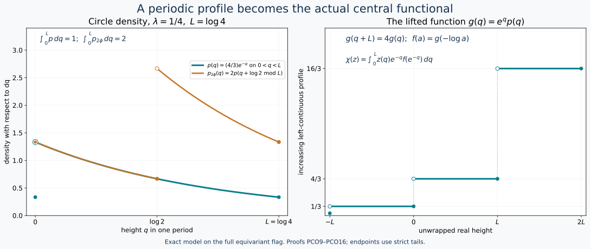

# From a compact spectral profile to the continuous core

The compact-core profile theorem DP is a theorem about states. The continuous-core invariant requires two additional arguments: an exact comparison of the two cores, including the Haar scalar, and a proof for arbitrary positive normal functionals of possibly different masses. We supply both.

Earlier complete proofs: [DD.8](OA-FLOW-DD.md#oa-flow.dd.8), [DP.2](OA-FLOW-DP.md#oa-flow.dp.2), [CC.1](OA-FLOW-CC.md#oa-flow.cc.1), [CC.2](OA-FLOW-CC.md#oa-flow.cc.2), [CD.4](OA-FLOW-CD.md#oa-flow.cd.4), [NR.4](OA-FLOW-NR.md#oa-flow.nr.4), [CC.8](OA-FLOW-CC.md#oa-flow.cc.8), [CORE.2](OA-FLOW-CORE.md#core-2), [CORE.3](OA-FLOW-CORE.md#core-3), [DP.3](OA-FLOW-DP.md#oa-flow.dp.3), [DP.5](OA-FLOW-DP.md#oa-flow.dp.5), [DP6: full spectral construction](OA-FLOW-DP.md#oa-flow.dp.6), [CINV.COVARIANCE](OA-FLOW-CINV.md#cinv-covariance), [CINV.METRIC](OA-FLOW-CINV.md#cinv-metric), [CSAS.RANGE](OA-FLOW-CSAS.md#csas-range), [CINV.MASS](OA-FLOW-CINV.md#cinv-mass), [CINV.INVERSE](OA-FLOW-CINV.md#cinv-inverse), OA-MOD DC-04, OA-MOD MW-02, OA-MOD MW-04, OA-MOD MW-05.

## 1. The compact input and the spatial comparison

Let \(M\) be a type III\(_\lambda\) factor with separable predual, \(0<\lambda<1\). Put
\[
 L=-\log\lambda,\qquad P=2\pi/L.
\]
The actual DD theorem, as applied in DP2, supplies a faithful normal semifinite periodic weight \(\omega\) with \(\sigma_P^\omega=\mathrm{id}\). It need not be finite. The compact regular crossed product
\[
 B=M\rtimes_{\sigma^\omega}(\mathbb R/P\mathbb Z)
\]
is a type II∞ factor, with compact Haar measure \(dt/P\). Write its generators as \(\pi_0(x),\ell_t\). Its negative dual generator, counting average, clock and canonical trace satisfy
\[
 \begin{gathered}
 \beta(\pi_0(x))=\pi_0(x),\qquad\beta(\ell_t)=e^{-iLt}\ell_t,\\
 E_B(b)=\sum_{n\in\mathbb Z}\beta^n(b),\quad
 H_0^{it}=\ell_t,\quad\beta(H_0)=\lambda H_0,\quad
 \tau_0\beta=\lambda\tau_0.                                      \end{gathered}
 \tag{PCO1}
\]
These are the full normal constructions and complete positive-weight identities of CC/CD/DP, not solely their generator relations. For \(\phi\in M_*^+\), DP2 gives
\(\phi E_B=(\tau_0)_{H_\phi}\), including support and full density domains.

Represent \(M\) faithfully on \(H\). On the dense subspace of \(L^2(\mathbb R,dt;H)\) supported in finitely many translates of \([0,P)\), define
\[
 (S\xi)(t,q)=\sqrt{\frac PL}\sum_{n\in\mathbb Z}
                      e^{i(t+nP)q}\xi(t+nP),
 \quad 0\le t<P,\quad0\le q<L.                                 \tag{PCO2}
\]
The target measure is \(dt/P\) times \(dq\). Orthogonality of
\(e^{inPq}\) on \([0,L)\), since \(PL=2\pi\), proves equality of squared norms. Completeness extends \(S\) to an isometry. Finite Fourier sums after multiplication by \(e^{-itq}\) are dense in the target, and the inverse coefficients are
\[
 \xi(t+nP)=\frac1{\sqrt{PL}}
        \int_0^Le^{-i(t+nP)q}(S\xi)(t,q)\,dq.                    \tag{PCO3}
\]
Thus \(S\) is onto and unitary.

Periodicity of the coefficient action and the substitution of integer tiles in a translated vector give
\[
 S\pi(x)S^*=\pi_0(x)\otimes1,\qquad
 S\lambda_sS^*=\ell_s\otimes e^{isq}.                             \tag{PCO4}
\]
These identities initially hold on the dense finite-tile subspace and extend by boundedness. Since \(\ell_P=1\), the image of \(\lambda_P\) is multiplication by \(e^{iPq}\). Its bounded Borel calculus generates all scalar multipliers on the half-open interval \([0,L)\); the coordinate map is one-to-one there modulo its identified endpoint. Dividing the second generator in (PCO4) by its scalar multiplier recovers \(\ell_s\otimes1\). Consequently
\[
 C(M)\cong B\bar\otimes L^\infty([0,L),dq)                         \tag{PCO5}
\]
with normal inverse, by spatial conjugation and the proved onto generation. NR4 identifies these regular realizations with the chosen core charts.

## 2. The wrapped action and the exact trace

For \(q\in[0,L)\), write
\(q-s=q'+nL\), where \(0\le q'<L\) and \(n\in\mathbb Z\).
The dual action in (PCO5) is
\[
 (\theta_sF)(q)=\beta^{-n}(F(q')).                                \tag{PCO6}
\]
Indeed it fixes \(\pi_0(M)\), and on the second generator in (PCO4) the two factors \(e^{inLt}\) and \(e^{-inLt}\) cancel, leaving \(e^{-ist}\). Normal generation proves the action on the entire algebra. Since \(B\) is a factor, its center is the scalar height algebra, and there \(\theta_s\) is \(q\mapsto q-s\pmod L\).

We check the weights on all positive fields. The constant-fibre case of DC/MW identifies the tensor product with bounded measurable \(B\)-fields. For \(Y\ge0\), partition the \(s\)-integral in (CI1) according to the integer \(n\) of (PCO6). Scalar nonnegative interchange, tested by every positive normal functional, gives the constant extended-positive value
\[
 T_C(Y)=\frac1{2\pi}E_B\left(\int_0^L Y(q)\,dq\right).             \tag{PCO7}
\]
The inner integral is a bounded weak-star integral in \(B\); the outer countable sum may be infinite. Equality of the field formula holds almost everywhere by these scalar tests and Fubini, so no point evaluation of an arbitrary equivalence class is assumed.

It follows that
\[
 \widetilde\phi_C(Y)=\frac1{2\pi}
                       \int_0^L\widetilde\phi_B(Y(q))\,dq.       \tag{PCO8}
\]
Here is the needed justification for passing an unbounded weight through that integral. If \(\phi\) is bounded, the finite trace-tail bounds in DP3 give increasing bounded finite-trace densities
\(H_\phi1_{(1/m,m]}(H_\phi)\uparrow H_\phi\).
Their pairings are positive bounded normal functionals, so they commute with the bounded integral. Monotone convergence proves (PCO8). For the periodic reference \(\omega\), use the pure point clock \(H_0\), whose spectral values are \(e^{-Ln}\), as proved in CC2/8. Each eigencorner has a countable filling family of finite-\(\tau_0\) projections, by semifiniteness and separability. Enumerate these orthogonal pieces across the countably many eigencorners. Finite sums give bounded finite-trace densities increasing to \(H_0\). The same argument proves (PCO8) for \(\omega\), although \(\omega(1)\) may be infinite.

The reference clock in (PCO4) is \(H_0\otimes e^q\). Define the faithful normal semifinite product trace
\(\tau'=\tau_0\otimes e^{-q}dq/(2\pi)\), on its complete positive cone using MW's trace integral. Equation (PCO8), the spectral cutoff construction and nonnegative interchange give
\(\widetilde\omega_C=(\tau')_{H_0\otimes e^q}\).
The exact inverse-density normalization of CORE2–3 therefore identifies \(\tau'=\tau\). The same calculation for every bounded \(\phi\), followed by TD uniqueness, gives
\[
 \boxed{\quad
 \tau=\tau_0\otimes e^{-q}\frac{dq}{2\pi},\qquad
 h_\phi=H_\phi\otimes e^q .
 \quad}                                                         \tag{PCO9}
\]
The tensor density has its full spectral domain, with kernel
\((1-s(H_\phi))\otimes1\). This proof fixes the scalar as well as the trace-scaling law.

Let \(f_\phi(a)=\tau_0(1_{(a,\infty)}(H_\phi))\). From (CI5) and (PCO9),
\[
 \begin{aligned}
 \chi_\phi(z)
 &=\int_0^L z(q)e^{-q}f_\phi(e^{-q})\,dq\\
 &=\int_\lambda^1 z(-\log a)f_\phi(a)\,da,\\
 \|\chi_\phi-\chi_\psi\|
 &=\int_\lambda^1|f_\phi(a)-f_\psi(a)|\,da.                        \end{aligned}
 \tag{PCO10}
\]

## 3. Extend the compact profile theorem to every mass

DP3 proves, by finite-domain pairings and nonnegative integration, the identities
\[
 f_\phi(\lambda a)=\lambda^{-1}f_\phi(a),\quad
 \phi(x)=\int_\lambda^1
           \tau_0(\pi_0(x)1_{(a,\infty)}(H_\phi))\,da,\quad
 \int_\lambda^1 f_\phi(a)\,da=\phi(1).                            \tag{PCO11}
\]
Its calculation uses boundedness of \(\phi\) and retains the factor \(\phi(1)\) in every estimate, so these identities have the displayed all-positive-functional scope. DP5's zero-distance theorem and DP6's realization theorem were stated for states; we now extend them explicitly.

DP6 supplies one fixed filling equivariant trace flag \(Q(t)\), \(t\ge0\), with
\[
 \tau_0(Q(t))=t,\quad Q(t)\uparrow1,\quad
 \beta(Q(t))=Q(\lambda t),\quad
 \|Q(t)-Q(r)\|_1=|t-r|.                                         \tag{PCO12}
\]
For every decreasing right-continuous finite-valued profile \(f\) with
\(f(\lambda a)=\lambda^{-1}f(a)\), define
\(m=\int_\lambda^1 f(a)\,da<\infty\).
If \(m=0\), right continuity and scaling force \(f=0\), realized by zero. If \(m>0\), every multiplicative window of ratio \(\lambda\) has the same integral:
\[
 \int_{\lambda c}^{c}f(a)\,da=m\qquad(c>0).                        \tag{PCO13}
\]
Indeed \(r\mapsto e^rf(e^r)\) is \(L\)-periodic, and these integrals are its integrals over intervals of length \(L\).

Set \(g(a)=f(ma)\). Equation (PCO13) gives
\(\int_\lambda^1g(a)\,da=m^{-1}m=1\).
The state realization in DP6 gives a state \(\rho_g\) whose compact density has tails \(Q(g(a))\). Then \(\phi_f=m\rho_g\) has tails
\[
 1_{(a,\infty)}(H_{\phi_f})
 =Q(g(a/m))=Q(f(a)).                                              \tag{PCO14}
\]
The full self-adjoint domain is the spectral domain constructed in DP(T6), scaled by \(m\); no new domain restriction is imposed.

For any original \(\phi\) with mass \(m>0\), \(\phi/m\) and \(\phi_{f_\phi}/m\) are states with the same profile \(f_\phi(ma)\). DP5, including its small-support unitary completion, gives zero orbit distance between them. Multiplying their norm estimates by \(m\) gives
\(\delta_M(\phi,\phi_{f_\phi})=0\).
Zero mass again causes no exception.

Given \(\phi,\psi\) of arbitrary masses, realize both profiles on the same flag \(Q\). For every contraction \(x\in M\), (PCO11), (PCO12) and finite trace pairings yield
\[
 |(\phi_{f_\phi}-\phi_{f_\psi})(x)|
 \le\int_\lambda^1
       \|Q(f_\phi(a))-Q(f_\psi(a))\|_1\,da
 =\int_\lambda^1|f_\phi(a)-f_\psi(a)|\,da.
\]
Replacement by equal closed orbits does not change the orbit distance. Combine this upper bound with (CI17) and (PCO10):
\[
 \boxed{\ \delta_M(\phi,\psi)=\|\chi_\phi-\chi_\psi\|
            \quad(\phi,\psi\in M_*^+).\ }                         \tag{PCO15}
\]
In particular unequal masses have been treated by a common-flag proof, not by applying a state theorem outside its hypotheses.

## 4. The entire circle subinvariant cone

Let \(\chi\in L^\infty([0,L))_*^+\) have density \(p(q)\) and satisfy
\(\chi\theta_s\ge e^{-s}\chi\) for all \(s\ge0\). Extend \(p\) periodically to \(\mathbb R\). The inequality becomes
\(p(q+s)\ge e^{-s}p(q)\) almost everywhere. As proved explicitly in [the semifinite range construction](OA-FLOW-CSAS.md#csas-range), (SA15), the function \(e^qp(q)\) has an increasing left-continuous representative \(g(q)\), finite everywhere. Periodicity and uniqueness of this representative give
\[
 g(q+L)=e^Lg(q)\qquad(q\in\mathbb R).
\]
Thus \(f(a)=g(-\log a)\) is decreasing, right-continuous and finite, satisfies \(f(\lambda a)=\lambda^{-1}f(a)\), and has window mass
\(\int_\lambda^1f(a)\,da=\int_0^Lp(q)\,dq=\chi(1)\).
Section 3 realizes it by a positive normal functional. Equation (PCO10) identifies its \(\chi\) with the prescribed one. With (CI15), this proves
\[
 \boxed{\ \{\chi_\phi:\phi\in M_*^+\}
       =\{\chi\ge0:\chi\theta_s\ge e^{-s}\chi\ (s\ge0)\}.\ }        \tag{PCO16}
\]

*Exact circle model for (PCO9)–(PCO16), with \(\lambda=1/4\), \(L=\log4\), and \(p(q)=(4/3)e^{-q}\) on \(0<q<L\), extended periodically with left-continuous endpoint value \(1/3\). Its mass is one. The orange density \(2p(q+\log2\bmod L)\) has mass two; at \(q=0\) its filled orange point is concentric with the open teal point. On the unwrapped line, \(g(q)=e^qp(q)\) is increasing and satisfies \(g(q+L)=4g(q)\). Strict spectral tails determine the shown endpoint conventions. The curves are samples of these exact formulas; the underlying flag and operator domains are those of (PCO12)–(PCO14).*

The human comparison source is Haagerup–Størmer, [*Equivalence of Normal States on von Neumann Algebras and the Flow of Weights*](https://www.isibang.ac.in/~soumyashant/misc/collected-works-of-haagerup/1990s/1990_Equivalence_of_normal_states_on_von_Neumann_algebras_and_the_flow_of_weights.pdf), §5, especially pp.209–215. The actual compact provider is DP's independently written full proof. The tile transform, its inverse, the all-positive weight calculation and the unequal-mass argument above supply the additional comparison required here.
