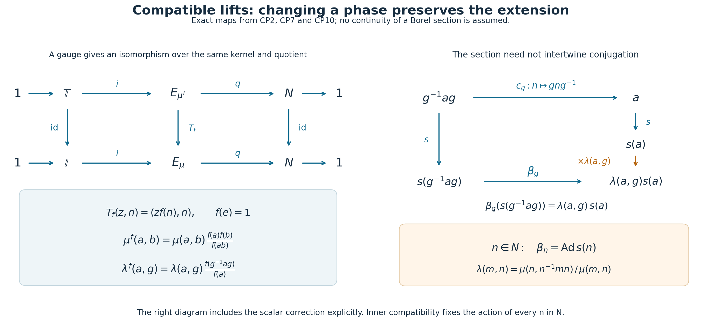
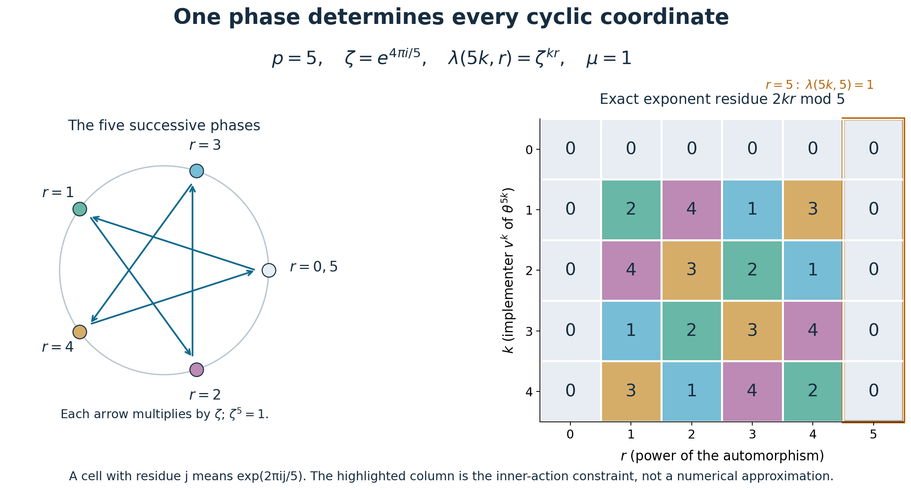

# Compatible lifts and the phase of an outer period

*Original exposition, proofs, examples and reproducible diagrams: CC0-1.0. Cited publications and existing components retain their own terms.*

An inner automorphism has many unitary implementers, differing by a scalar of modulus one. Choosing one implementer for each inner automorphism records two kinds of phase: the phase lost in multiplication and the phase lost under conjugation. Their compatibility has a concrete consequence. For an automorphism whose first inner power is its \(p\)-th power, the entire characteristic class is one \(p\)-th root of unity.

We first build the algebra of compatible lifts. Its quotient by changes of phase is compact for countable discrete groups. A measurable choice of implementers then gives an intrinsic class for every nonzero factor with separable predual, and an explicit perturbation calculation proves cocycle-conjugacy invariance.

## 1. Lifting conjugation as well as multiplication

Write \(\mathbb T=\{z\in\mathbb C:|z|=1\}\). Let \(N\triangleleft G\) be a normal subgroup. A **normalized compatible pair** consists of functions
\[
 \lambda:N\times G\longrightarrow\mathbb T,\qquad
 \mu:N\times N\longrightarrow\mathbb T
\]
satisfying, for \(a,b,c,m,n\in N\) and \(g,h\in G\),
\[
\begin{aligned}
 &\mu(a,b)\mu(ab,c)=\mu(a,bc)\mu(b,c), &&\text{(multiplication)}\\
 &\lambda(a,gh)=\lambda(a,g)\lambda(g^{-1}ag,h), &&\text{(action)}\\
 &\frac{\lambda(a,g)\lambda(b,g)}{\lambda(ab,g)}
       =\frac{\mu(g^{-1}ag,g^{-1}bg)}{\mu(a,b)}, &&\text{(compatibility)}\\
 &\lambda(m,n)=\frac{\mu(n,n^{-1}mn)}{\mu(m,n)}, &&\text{(inner action)}\\
 &\mu(e,a)=\mu(a,e)=1,\qquad
   \lambda(e,g)=\lambda(a,e)=1. &&\text{(normalization)}
\end{aligned}\tag{CP1}
\]
Denote their set by \(Z(G,N,\mathbb T)\). These are equations in scalar groups, so pointwise multiplication and pointwise inversion preserve every equation. The constant pair is their identity. Thus \(Z(G,N,\mathbb T)\) is an abelian group.

For standard Borel groups, with \(N\) a Borel normal subgroup carrying the inherited Borel structure and all group operations Borel, we require both functions to be jointly Borel and write \(Z_{\mathrm B}(G,N,\mathbb T)\). The algebraic arguments below preserve this requirement. For countable discrete groups every function involved is Borel.

Here is the object encoded by all five lines of (CP1).

**Compatible-lift theorem.** A pair in (CP1) defines a central extension
\[
 1\longrightarrow\mathbb T
 \xrightarrow{\ i\ }E_\mu
 \xrightarrow{\ q\ }N\longrightarrow1,\qquad
 E_\mu=\mathbb T\times N,
 \quad i(z)=(z,e),\quad q(z,n)=n,
 \tag{CP2}
\]
together with an action \(\beta:G\to\operatorname{Aut}(E_\mu)\) that fixes the kernel pointwise and covers conjugation on \(N\). Moreover,
\[
 \beta_n=\operatorname{Ad}_{E_\mu}(1,n)\qquad(n\in N).
 \tag{CP3}
\]
Conversely, such an extension and action, supplied with a normalized section, produce exactly the identities (CP1).

**Proof.** Define
\[
 (z,a)(w,b)=(zw\mu(a,b),ab).
 \tag{CP4}
\]
The first line of (CP1) makes the two products of three elements equal. Normalization gives the identity \((1,e)\). Substituting \((a,a^{-1},a)\) in that first line gives
\(\mu(a,a^{-1})=\mu(a^{-1},a)\); hence
\[
 (z,a)^{-1}=(z^{-1}\mu(a^{-1},a)^{-1},a^{-1})
 \tag{CP5}
\]
is both a left and a right inverse. Formula (CP4) makes \(i(\mathbb T)\) central, and proves the exactness of (CP2).

Set
\[
 \beta_g(z,n)=
   \bigl(z\lambda(gng^{-1},g),\,gng^{-1}\bigr).
 \tag{CP6}
\]
The compatibility equation, applied to \(a=gng^{-1}\) and \(b=gmg^{-1}\), says precisely that the scalar coordinates of
\(\beta_g((z,n)(w,m))\) and \(\beta_g(z,n)\beta_g(w,m)\) agree. The action equation gives
\[
 \lambda(ghn(gh)^{-1},gh)
 =\lambda(ghn(gh)^{-1},g)\lambda(hnh^{-1},h),
\]
so \(\beta_g\beta_h=\beta_{gh}\). Normalization gives \(\beta_e=1\), and \(\beta_{g^{-1}}\) is its inverse. It also gives \(\beta_g i(z)=i(z)\).

Put \(s(n)=(1,n)\). If \(a=nmn^{-1}\), then
\[
 s(n)s(m)=\mu(n,m)s(nm),\qquad
 s(a)s(n)=\mu(a,n)s(nm).
\]
Consequently
\[
 s(n)s(m)s(n)^{-1}
   =\frac{\mu(n,m)}{\mu(nmn^{-1},n)}s(nmn^{-1})
   =\beta_n(s(m)),
\]
where the last equality is the inner-action equation. Both maps fix the central circle, so (CP3) holds on every element.

For the converse, let \(s:N\to E\) be a section with \(s(e)=1\). Identify the central kernel with \(\mathbb T\), and define the unique scalars
\[
 s(a)s(b)=\mu(a,b)s(ab),\qquad
 \beta_g(s(g^{-1}ag))=\lambda(a,g)s(a).
 \tag{CP7}
\]
Associating \(s(a)s(b)s(c)\) in the two ways gives the multiplication equation. Applying first \(\beta_h\), then \(\beta_g\), to
\(s(h^{-1}g^{-1}agh)\) gives the action equation with \(g^{-1}ag\). Applying \(\beta_g\) to the product
\(s(g^{-1}ag)s(g^{-1}bg)\) gives
\[
 \mu(g^{-1}ag,g^{-1}bg)\lambda(ab,g)
 =\lambda(a,g)\lambda(b,g)\mu(a,b),
\]
which is the compatibility equation. Finally \(\beta_n=\operatorname{Ad}s(n)\) gives
\[
 \beta_n(s(n^{-1}mn))
 =s(n)s(n^{-1}mn)s(n)^{-1}
 =\frac{\mu(n,n^{-1}mn)}{\mu(m,n)}s(m).
\]
This is the inner-action equation. The normalization identities follow from \(s(e)=1\).

In the Borel setting, formulas (CP4)–(CP6) are Borel operations on the standard Borel set \(\mathbb T\times N\); no product *group topology* is asserted. Conversely, Borel operations, a Borel section and a Borel identification of the kernel make (CP7) jointly Borel. For countable discrete \(G,N\), the displayed formulas are continuous in the ordinary product topology of \(\mathbb T\times N\). \(\square\)

## 2. Changes of phase and restriction to another group

Let \(f:N\to\mathbb T\), \(f(e)=1\). Replacing a section by
\(s^f(a)=f(a)s(a)\) gives
\[
 \begin{aligned}
  \lambda^f(a,g)&=\lambda(a,g)
       \frac{f(g^{-1}ag)}{f(a)},\\
  \mu^f(a,b)&=\mu(a,b)\frac{f(a)f(b)}{f(ab)}.
 \end{aligned}\tag{CP8}
\]
Write the two factors on the right as \(\partial_1f,\partial_2f\), and put
\(\partial f=(\partial_1f,\partial_2f)\).

All their identities can also be checked without using an extension. The two sides of the multiplication equation for \(\partial_2f\) reduce to
\(f(a)f(b)f(c)/f(abc)\). For the action equation,
\[
 \frac{f(h^{-1}g^{-1}agh)}{f(a)}
 =\frac{f(g^{-1}ag)}{f(a)}
   \frac{f(h^{-1}g^{-1}agh)}{f(g^{-1}ag)}.
\]
For compatibility,
\[
 \frac{\partial_1f(a,g)\partial_1f(b,g)}{\partial_1f(ab,g)}
 =\frac{f(g^{-1}ag)f(g^{-1}bg)/f(g^{-1}abg)}
        {f(a)f(b)/f(ab)}.
\]
This is \(\partial_2f(g^{-1}ag,g^{-1}bg)/\partial_2f(a,b)\). For inner action,
\[
 \frac{\partial_2f(n,n^{-1}mn)}{\partial_2f(m,n)}
 =\frac{f(n^{-1}mn)}{f(m)}
 =\partial_1f(m,n).
\]
Normalization is immediate from \(f(e)=1\). Thus \(\partial f\in Z\). Also
\(\partial(f_1f_2)=\partial f_1\,\partial f_2\), by direct cancellation in (CP8).

Let
\[
 B(G,N,\mathbb T)=\{\partial f:f(e)=1\},\qquad
 \Lambda(G,N,\mathbb T)=Z(G,N,\mathbb T)/B(G,N,\mathbb T).
 \tag{CP9}
\]
For Borel pairs use normalized Borel \(f\) and write \(B_{\mathrm B},\Lambda_{\mathrm B}\). These are abelian groups. Their definition does not presuppose that a Borel function space is a Polish space.

The change of phase is an actual isomorphism of compatible extensions:
\[
 T_f:E_{\mu^f}\longrightarrow E_\mu,\qquad
 T_f(z,n)=(zf(n),n).
 \tag{CP10}
\]
For products, the necessary equality is
\(\mu^f(a,b)f(ab)=f(a)f(b)\mu(a,b)\). For the action, with \(a=gng^{-1}\), it is
\(\lambda^f(a,g)f(a)=\lambda(a,g)f(n)\). These are exactly (CP8). The inverse is \(T_{f^{-1}}\), with the corresponding changed pair. Thus it fixes the kernel and quotient and intertwines every \(\beta_g\). It is Borel whenever \(f\) is Borel.

Conversely, an isomorphism of two such extensions that is the identity on the kernel and quotient must have the form (CP10): its value on \((1,n)\) determines a unique \(f(n)\), and centrality determines its value on \((z,n)\). Preserving multiplication and the action forces (CP8). In the Borel category that first coordinate is Borel. Therefore (CP9) classifies these compatible extensions, admitting a section in the stated category, up to isomorphisms fixing the kernel, quotient and \(G\)-action. A section is a choice of coordinates and need not be preserved by the isomorphism. Changing the section changes the pair by exactly a gauge, and leaves its class.

There is a useful functorial rule. If \(\eta:H\to G\) is a homomorphism and \(K\triangleleft H\) satisfies \(\eta(K)\subseteq N\), set
\[
 \lambda_\eta(k,h)=\lambda(\eta(k),\eta(h)),\qquad
 \mu_\eta(k,l)=\mu(\eta(k),\eta(l)).
 \tag{CP11}
\]
Each line of (CP1) pulls back because
\(\eta(h^{-1}kh)=\eta(h)^{-1}\eta(k)\eta(h)\).
Furthermore \(\eta^*(\partial f)=\partial(f\circ\eta|_K)\), so (CP11) descends to \(\Lambda\). Identity and composition hold on the functions themselves. In the Borel setting require the indicated homomorphism and restrictions to be Borel.

*Figure 1.* The two rows are the central extensions (CP2) before and after a gauge. The vertical comparison is the actual isomorphism (CP10), with its kernel and quotient fixed. The right panel displays the two paths in (CP7) and the phase \(\lambda(a,g)\) between them. The inner-action identity is precisely the condition that an \(n\in N\) acts by conjugation with its lift. These are diagrams of proved maps, not additional topological assertions. The intrinsic-phase questions originate in Takesaki, *Theory of Operator Algebras III*, XVII.3, Exercise 1, p.292; the diagrams and proofs here are original. [Reproduction source](../assets/characteristic-pairs/render.py).

## 3. The compact quotient for countable groups

**Compact-quotient theorem.** For a countable discrete group \(G\) and \(N\triangleleft G\), give pairs the pointwise topology. Then \(Z(G,N,\mathbb T)\), \(B(G,N,\mathbb T)\), and \(\Lambda(G,N,\mathbb T)\) are compact metrizable abelian groups. In particular the quotient is Hausdorff.

**Proof.** The coordinate set
\(I=(N\times G)\sqcup(N\times N)\) is countable. On \(\mathbb T^I\) choose an enumeration and the translation-invariant metric
\[
 d(x,y)=\sum_{j\ge1}2^{-j}|x_j-y_j|.
 \tag{CP12}
\]
For a finite coordinate set use the corresponding finite sum. A finite initial sum and a geometric tail prove that this metric gives precisely coordinatewise convergence. Every sequence has a coordinatewise convergent subsequence by repeated subsequence extraction in the compact circle and the diagonal procedure; the same tail estimate gives convergence in (CP12). 

Here is the passage from this sequential assertion to compactness. If there were no finite \(\varepsilon\)-net, successive choices outside the previous \(\varepsilon\)-balls would give a sequence of mutually separated points, with no convergent subsequence. Hence finite nets exist. Every open cover has a positive Lebesgue radius: otherwise choose \(x_k\) whose ball of radius \(1/k\) lies in no single member of the cover. A subsequence converges to \(x\), and some member of the cover contains \(B(x,\delta)\). For large subsequence indices, \(d(x_k,x)<\delta/2\) and \(1/k<\delta/2\), contradicting the choice of \(x_k\). A finite net with mesh smaller than this Lebesgue radius now supplies a finite subcover. Thus the product is compact. Its group operations are continuous coordinatewise.

Every equation in (CP1) compares finite products of coordinates, so its solution set is closed. Their intersection \(Z\) is therefore a compact metrizable abelian group. Likewise
\[
 F_N=\{f\in\mathbb T^N:f(e)=1\}
\]
is compact. Each coordinate of \(\partial f\) uses only finitely many evaluations, so \(\partial:F_N\to Z\) is continuous. Its image \(B\) is compact, hence closed in the Hausdorff group \(Z\). This proves the essential closedness assertion; the image of an arbitrary continuous map need not be closed without this compactness.

An explicit quotient metric is
\[
 D(xB,yB)=\min_{b\in B}d(x,yb).
 \tag{CP13}
\]
Compactness of \(B\) gives the minimum. Translation invariance and inversion invariance of (CP12) show that the value is independent of representatives and symmetric. Its value is zero exactly when \(xB=yB\), since the minimum is attained. If \(b,c\) minimize the two successive distances, then
\[
 d(x,zcb)\le d(x,yb)+d(yb,zcb)
             =d(x,yb)+d(y,zc),
\]
so (CP13) satisfies the triangle inequality. The inverse image of a quotient ball is the union of translates of an ordinary open ball, and
\[
 B_D(xB,\varepsilon)=q(B_d(x,\varepsilon)).
\]
Also \(q\) is open for the quotient topology, since \(q^{-1}q(O)=\bigcup_{b\in B}Ob\). These facts show that (CP13) gives exactly that topology. The continuous image \(Z/B\) of compact \(Z\) is compact and this metric is Hausdorff. Multiplication and inversion descend continuously: \(q\times q\) is an open quotient map, and the group operations commute with the quotient maps. \(\square\)

## 4. A Borel choice of implementer for a separable factor

Let \(M\ne0\) be a factor with separable predual. Write
\[
 G_M=\operatorname{Aut}(M),\qquad N_M=\operatorname{Inn}(M)
       =\{\operatorname{Ad}u:u\in\mathcal U(M)\}.
 \tag{CP14}
\]
Use the \(u\)-topology on \(G_M\):
\(\alpha_i\to\alpha\) means
\(\|\varphi\circ\alpha_i-\varphi\circ\alpha\|\to0\) for all \(\varphi\in M_*\).
Use the strong topology on \(\mathcal U(M)\).

We use two earlier complete results at their precise scopes. The [standard implementation theorem](../../OA-MOD/OA-MOD-CL.html#the-precise-topology-of-a-standard-implementation) identifies the \(u\)-topology with strong convergence of canonical standard unitaries and represents positive normal functionals by cone vectors. The [Polish model proof](OA-FLOW-BRL.md#real-intrinsic), specifically its unitary and automorphism arguments, proves Polishness at separable predual. The [Borel injection theorem](../../NCG-FOLIATIONS/companions/polish-spaces-and-standard-borel-spaces.html#oa-fnd-pb-06), Theorem 4.3(5), says that an injective Borel map from a standard Borel space into a Polish space has Borel image and Borel inverse onto that image. We apply it to an explicit phase slice below.

Here are the topology checks needed for that application. In standard form the Hilbert space is separable: a countable norm-dense family of positive normal functionals has dense cone representatives by
\(\|\xi_\varphi-\xi_\psi\|^2\le\|\varphi-\psi\|\), and the cone has dense complex span. On unitaries of a separable Hilbert space, if \((\xi_j)\) is dense in its unit ball,
\[
 d_U(u,v)=\sum_{j\ge1}2^{-j}
 \bigl(\|(u-v)\xi_j\|+\|(u^*-v^*)\xi_j\|\bigr)
 \tag{CP15}
\]
is complete and compatible. Indeed a Cauchy sequence and its adjoints have strong limits \(T,S\); bounded-product convergence gives \(TS=ST=1\), and scalar products give \(S=T^*\). Strong closedness of \(M\) makes \(\mathcal U(M)\) closed in this group. The countable evaluation embedding makes it second countable and hence separable.

The standard implementers of \(G_M\) form the closed subgroup of unitaries normalizing \(M\), commuting with \(J\), and preserving the closed cone in both directions. Passing to a limit in each condition, for both a unitary and its adjoint, proves closedness. The standard implementation theorem therefore makes \(G_M\) Polish. It also makes evaluation
\[
 (\gamma,u)\longmapsto\gamma(u)
 \tag{CP16}
\]
jointly continuous on \(G_M\times\mathcal U(M)\): it is
\(U(\gamma)uU(\gamma)^*\), a product of strongly convergent bounded operators.

The adjoint map \(\operatorname{Ad}:\mathcal U(M)\to G_M\) is continuous. For a positive normal functional represented by \(\xi\), the functional
\(\varphi\circ\operatorname{Ad}u\) is represented by \(u^*\xi\). The estimate
\(\|\omega_\eta-\omega_\zeta\|\le(\|\eta\|+\|\zeta\|)\|\eta-\zeta\|\)
proves norm convergence, and decomposing a normal functional into a linear combination of positive ones gives the stated topology. Its kernel is precisely \(\mathbb T1\): a unitary implementing the identity commutes with every element of a factor.

**Borel-section theorem.** The subgroup \(N_M\) is Borel in \(G_M\), and there exists a normalized Borel map
\[
 u:N_M\to\mathcal U(M),\qquad
 \operatorname{Ad}u(a)=a,\qquad u(e)=1.
 \tag{CP17}
\]

**Proof.** Choose a countable sequence \((\varphi_j)_{j\ge0}\) in \(M_*\) separating the points of \(M\), with \(\varphi_0\) a normal state. Such a sequence is obtained by adding a normal state to a norm-dense sequence in the unit ball of the separable predual; the predual separates \(M\). A normal state exists by restricting a nonzero vector functional in a faithful normal representation and normalizing it.

Every unitary \(v\) has a least \(j(v)\) with \(\varphi_{j(v)}(v)\ne0\). Normal functionals are continuous on bounded strong-star sets: this follows for positive ones from their cone-vector representation, and for all of them by linear decomposition. Thus the sets specifying this least index are Borel. Define
\[
 r(v)=
 \frac{\overline{\varphi_{j(v)}(v)}}{|\varphi_{j(v)}(v)|}\,v.
 \tag{CP18}
\]
This is Borel. For \(z\in\mathbb T\), \(j(zv)=j(v)\) and \(r(zv)=r(v)\). Its range is the Borel set
\[
 S=\bigcup_{j\ge0}
 \{v\in\mathcal U(M):
   \varphi_i(v)=0\ (i<j),\ \varphi_j(v)\in(0,\infty)\}.
 \tag{CP19}
\]
Every scalar orbit meets \(S\), and meets it once: positivity of the first nonzero functional fixes the phase. The restriction
\(\operatorname{Ad}|_S:S\to G_M\) is Borel and injective, with image \(N_M\).
As a Borel subset of a Polish space, \(S\) is standard Borel; the Borel injection theorem gives that image Borel and its inverse Borel. That inverse is (CP17). The orbit of \(1\) meets \(S\) at \(1\), since \(\varphi_0(1)=1\), so the section is normalized. \(\square\)

The Borel structure on \(N_M\) here is the one inherited from \(G_M\). We do not require \(N_M\) to be closed or assert that this inherited topology is Polish. This distinction is why a continuous-section assumption does not enter the argument.

Apply (CP7) to \(E=\mathcal U(M)\), with quotient \(\operatorname{Ad}\), and with \(G_M\) acting by evaluation (CP16). Inner automorphisms act by conjugation with their implementers, so (CP3) holds. Thus there are unique scalars
\[
 \begin{aligned}
 u(a)u(b)&=\mu_u(a,b)u(ab),\\
 \gamma(u(\gamma^{-1}a\gamma))&=\lambda_u(a,\gamma)u(a).
 \end{aligned}\tag{CP20}
\]
Their uniqueness uses factoriality. They are jointly Borel: each corresponding product
\(u(a)u(b)u(ab)^*\), or
\(\gamma(u(\gamma^{-1}a\gamma))u(a)^*\), is a Borel scalar unitary, and applying the fixed normal state \(\varphi_0\) extracts its scalar. Normality of \(N_M\) follows from
\(\gamma\operatorname{Ad}u\gamma^{-1}=\operatorname{Ad}\gamma(u)\); all restricted group maps are Borel.

The compatible-lift theorem proves every identity in (CP1) for (CP20). Two normalized Borel sections \(u,u'\) satisfy \(u'(a)=f(a)u(a)\), where
\[
 f(a)=\varphi_0(u'(a)u(a)^*)\in\mathbb T
\]
is Borel and \(f(e)=1\). Formula (CP8) therefore proves that
\[
 \mathfrak x_M=[\lambda_u,\mu_u]
       \in\Lambda_{\mathrm B}(G_M,N_M,\mathbb T)
 \tag{CP21}
\]
is independent of the section.

It is also intrinsic under specified normal isomorphisms. For
\(\Phi:M\to P\), put \(F(\gamma)=\Phi\gamma\Phi^{-1}\) and choose
\[
 u_P(F(a))=\Phi(u_M(a)).
 \tag{CP22}
\]
Composition with \(\Phi\) and \(\Phi^{-1}\) transports predual norms isometrically, so \(F\) is a homeomorphism of automorphism groups. A normal isomorphism is strong-star continuous on bounded sets, since its seminorms are the seminorms for pulled-back normal positive functionals. Thus (CP22) is a normalized Borel section. Direct substitution in (CP20) leaves the scalar factors unchanged. Other sections change them by (CP8). This proves natural transport of (CP21), with exact identity and composition, for all factors with separable predual. No hyperfiniteness or type assumption is used.

## 5. Actions and an exact cocycle perturbation

Let \(G\) be countable discrete and \(\alpha:G\to\operatorname{Aut}(M)\) an action on such a factor. Its inner kernel
\[
 N(\alpha)=\{n\in G:\alpha_n\text{ is inner}\}
 \tag{CP23}
\]
is normal: products and inverses of inner automorphisms are inner, and conjugating an inner automorphism remains inner. Choose \(u_n\in\mathcal U(M)\) implementing \(\alpha_n\), \(n\in N(\alpha)\), with \(u_e=1\). Define
\[
 u_nu_m=\mu_\alpha(n,m)u_{nm},\qquad
 \alpha_g(u_{g^{-1}ng})=\lambda_\alpha(n,g)u_n.
 \tag{CP24}
\]
All implementers of a fixed automorphism differ by a scalar, so these equations define phases. The action on \(M\) gives (CP1) exactly as in (CP7). Alternatively choose \(u_n=u(\alpha_n)\) in (CP17); then (CP24) is exactly the pullback (CP11). Hence
\[
 \chi(\alpha)=[\lambda_\alpha,\mu_\alpha]
   =\alpha^*(\mathfrak x_M)
   \in\Lambda(G,N(\alpha),\mathbb T).
 \tag{CP25}
\]
Any other choices change the pair by the normalized function relating the implementers. Countability ensures that all choices are Borel.

**Cocycle-conjugacy theorem.** Suppose \(\Phi:M\to P\) is a normal isomorphism, set
\(\gamma_g=\Phi\alpha_g\Phi^{-1}\), and let unitaries \(w_g\in P\) satisfy
\[
 w_e=1,\qquad w_{gh}=w_g\gamma_g(w_h).
 \tag{CP26}
\]
Then \(\beta_g=\operatorname{Ad}w_g\circ\gamma_g\) is an action,
\(N(\beta)=N(\alpha)\), and \(\chi(\beta)=\chi(\alpha)\) under this common group identification.

**Proof.** Equation (CP26) gives
\(\beta_g\beta_h=\operatorname{Ad}(w_g\gamma_g(w_h))\gamma_{gh}=\beta_{gh}\).
Conjugation by \(\Phi\) and multiplication by an inner automorphism preserve whether an automorphism is inner, giving equality of the kernels.

Replace \(M,\alpha,u_n\) by \(P,\gamma,\Phi(u_n)\); (CP22) preserves the pair. It is therefore enough to treat \(\gamma=\alpha\) on one algebra. The actual implementers for \(\beta_n\) are
\[
 v_n=w_nu_n.
 \tag{CP27}
\]
Since \(u_nxu_n^*=\alpha_n(x)\),
\[
 \begin{aligned}
 v_nv_m
 &=w_n\alpha_n(w_m)u_nu_m\\
 &=w_{nm}\mu_\alpha(n,m)u_{nm}
  =\mu_\alpha(n,m)v_{nm}.
 \end{aligned}\tag{CP28}
\]
Thus the multiplication factor is unchanged, not merely cohomologous.

Put \(h=g^{-1}ng\). The two equal expressions for \(w_{gh}=w_{ng}\) give
\[
 w_g\alpha_g(w_h)
  =w_n\alpha_n(w_g)=w_nu_nw_gu_n^*.
\]
Consequently
\[
 \begin{aligned}
 \beta_g(v_h)
 &=w_g\alpha_g(w_h)\alpha_g(u_h)w_g^*\\
 &=w_nu_nw_gu_n^*
       \lambda_\alpha(n,g)u_nw_g^*
  =\lambda_\alpha(n,g)v_n .
 \end{aligned}\tag{CP29}
\]
Both factors are identical for the transported choice (CP27). Arbitrary normalized implementers differ from this choice by (CP8), proving equality of classes. \(\square\)

## 6. Every cyclic class in one coordinate

Use additive notation for \(\mathbb Z\). For \(p\ge1\) let
\(\mathbb T[p]=\{\zeta\in\mathbb T:\zeta^p=1\}\).

**Cyclic calculation.** Evaluation at one coordinate gives a topological group isomorphism
\[
 \begin{aligned}
 \Lambda(\mathbb Z,p\mathbb Z,\mathbb T)
   &\longrightarrow\mathbb T[p],
 &[\lambda,\mu]&\longmapsto\lambda(p,1)
 &&(p\ge1).
 \end{aligned}\tag{CP30}
\]
Its inverse is the class of
\[
 \mu_\zeta(kp,lp)=1,\qquad
 \lambda_\zeta(kp,r)=\zeta^{kr}
 \quad(k,l,r\in\mathbb Z).
 \tag{CP31}
\]
Under \(j+p\mathbb Z\mapsto e^{2\pi ij/p}\), the target is
\(\mathbb Z/p\mathbb Z\). For \(p=0\), the normal subgroup is \(\{0\}\) and the characteristic group is the one-element group. For \(p=1\), (CP30) is also the one-element group.

**Proof.** First let \(p\ge1\). Every normalized multiplier on \(p\mathbb Z\) can be removed by an explicit gauge. In the group \(E_\mu\) of (CP4), let \(t=(1,p)\) and write, for all integers \(k\),
\[
 t^k=(a_k,kp),\qquad a_0=1.
\]
The inverse (CP5) defines negative powers as well. The group power law gives
\[
 a_{k+l}=a_ka_l\mu(kp,lp).
\]
With \(f(kp)=a_k\), (CP8) therefore gives \(\mu^f=1\). This proves the needed trivialization on the entire infinite cyclic subgroup, including negative integers.

Since \(\mathbb Z\) is abelian, \(\partial_1f=1\) for *every* gauge. Thus this trivialization does not change \(\lambda\). The action equation makes \(\lambda(n,\cdot)\) a character of \(\mathbb Z\). Compatibility with \(\mu^f=1\) makes \(\lambda(\cdot,r)\) a character of \(p\mathbb Z\). Integer powers, including inverses, yield
\[
 \lambda(kp,r)=\lambda(p,1)^{kr}.
\]
The inner-action equation, now with trivial multiplier, gives
\(\lambda(p,p)=1\), so \(\zeta=\lambda(p,1)\) satisfies \(\zeta^p=1\).
Conversely (CP31) satisfies multiplication and normalization, both character equations, and compatibility. Its inner-action equation is
\(\lambda(kp,lp)=\zeta^{klp}=1\), as required. This proves surjectivity and shows that a fixed \(\zeta\) gives a unique class. Different values cannot be gauge equivalent because \(\partial_1f=1\).

Evaluation is a continuous homomorphism on \(Z\), constant on gauge classes, so it descends continuously through the quotient. The compact-quotient theorem makes its domain compact; \(\mathbb T[p]\) is Hausdorff. A continuous bijection from a compact space to a Hausdorff space has continuous inverse: images of closed sets are compact and hence closed. This proves the topological assertion.

For \(p=0\), normalization forces
\(\lambda(0,r)=1\) and \(\mu(0,0)=1\); there is only one pair and one class. There is no coordinate \(\lambda(p,1)\) carrying a free phase in this case. For \(p=1\), \(\mathbb T[1]=\{1\}\). \(\square\)

The inner-action line of (CP1) is essential to this calculation. If it is omitted, (CP31) satisfies every remaining line for **every** \(\zeta\in\mathbb T\). The same trivialization argument then gives a circle of classes for every \(p\ge1\), because gauges still leave \(\lambda\) unchanged. For example
\(\zeta=e^{2\pi i/(p+1)}\) has
\(\lambda(p,p)=\zeta^p\ne1\). This explicitly separates compatible inner conjugation from the weaker action-and-multiplier equations.

*Figure 2.* The exact model is \(p=5\), \(\zeta=e^{4\pi i/5}\). The left panel marks the orbit \(\zeta^r\), \(r=0,\ldots,5\); step 5 returns to 1. The right panel records the integer residues \(2kr\bmod5\), so its cell is exactly \(\lambda(5k,r)=\exp(2\pi i(2kr\bmod5)/5)\). The column \(r=5\) is all zero residues: it displays the inner condition \(\lambda(5k,5)=1\). Color indicates exact residue classes, not an approximate test of the theorem. The cyclic questions are from Takesaki, *Theory of Operator Algebras III*, XVII.3, Exercises 2(c) and 3, p.293; the displayed computation and diagram are original. [Reproduction source and arithmetic checks](../assets/characteristic-pairs/render.py).

## 7. The automorphism obstruction is the characteristic coordinate

Let \(\theta\in\operatorname{Aut}(M)\). Its action of \(\mathbb Z\) is \(r\mapsto\theta^r\). Define the **outer period**
\[
 p_0(\theta)=
 \begin{cases}
 \min\{p\ge1:\theta^p\text{ is inner}\},&
       \text{if this set is nonempty},\\
 0,&\text{otherwise}.
 \end{cases}\tag{CP32}
\]
The subgroup \(N(\theta)=\{r:\theta^r\text{ is inner}\}\) is exactly
\(p_0(\theta)\mathbb Z\). Indeed, if it contains a positive integer, division with remainder by its least positive member shows that every member is a multiple of that member. Otherwise a nonzero member would give a positive one by changing its sign, so the subgroup is \(\{0\}\).

Suppose \(p=p_0(\theta)\ge1\), and choose \(v\in\mathcal U(M)\) with
\(\theta^p=\operatorname{Ad}v\). Commutation of \(\theta\) with its powers gives
\[
 \operatorname{Ad}\theta(v)
  =\theta\operatorname{Ad}v\,\theta^{-1}
  =\operatorname{Ad}v.
\]
Factoriality therefore gives a unique \(\omega\in\mathbb T\) with
\[
 \theta(v)=\omega v,\qquad
 v=\theta^p(v)=\omega^p v.
 \tag{CP33}
\]
Thus \(\omega^p=1\). Replacing \(v\) by \(zv\), \(z\in\mathbb T\), leaves \(\omega\) unchanged. This scalar is the obstruction \(\operatorname{Ob}(\theta)\) for positive outer period.

Choose the implementers \(u_{kp}=v^k\) for every integer \(k\). They implement
\(\theta^{kp}\), and their multiplication factor is 1. Iterating (CP33), for positive and negative powers alike, gives
\[
 \theta^r(v^k)=\omega^{rk}v^k.
\]
Hence their pair is exactly (CP31) with \(\zeta=\omega\), and
\[
 \boxed{\quad
 \chi(\theta)=\theta^*(\mathfrak x_M)
  \ \longleftrightarrow\ 
  \lambda(p,1)=\operatorname{Ob}(\theta)=\omega .
 \quad}\tag{CP34}
\]
In particular the sign is fixed by the actual equation \(\theta(v)=\omega v\).

For \(p=1\), \(\theta=\operatorname{Ad}v\) fixes \(v\), so \(\omega=1\) and the characteristic class is trivial. For \(p=0\), no positive inner power supplies a unitary \(v\); \(N(\theta)=\{0\}\) and \(\chi(\theta)\) is the unique class computed above. If a scalar obstruction is desired for all automorphisms, one may set \(\operatorname{Ob}(\theta)=1\) at \(p=0\) by convention. It then records no additional information. The formula \(\mathbb Z/p\mathbb Z\) in (CP30) is reserved for \(p\ge1\).

The equality also gives an explicit outer-conjugacy check. Let \(\Phi:M\to P\), set \(\alpha=\Phi\theta\Phi^{-1}\), and let
\(\theta'=\operatorname{Ad}w\circ\alpha\). In the semidirect product
\(\mathcal U(P)\rtimes_\alpha\mathbb Z\), write
\[
 (w,1)^r=(w_r,r).
\]
The multiplication \((a,r)(b,s)=(a\alpha^r(b),r+s)\) gives, for all integers,
\[
 w_{r+s}=w_r\alpha^r(w_s),\quad
 w_r=w\alpha(w)\cdots\alpha^{r-1}(w)\ (r>0),\quad
 w_{-r}=\alpha^{-r}(w_r^*).
 \tag{CP35}
\]
Conjugation by these powers proves
\((\theta')^r=\operatorname{Ad}w_r\circ\alpha^r\), including negative \(r\). Thus the inner kernels and outer periods agree. For \(p\ge1\), put \(v_0=\Phi(v)\) and \(v'=w_pv_0\). This implements \((\theta')^p\). The equality
\[
 w\alpha(w_p)=w_{p+1}
             =w_p\alpha^p(w)=w_pv_0wv_0^*
\]
then proves directly
\[
 \theta'(v')
 =w\alpha(w_p)\alpha(v_0)w^*
 =\omega\,w_pv_0=\omega v'.
 \tag{CP36}
\]
This is the implementer formula behind the invariance of the obstruction, and is consistent with the general calculation (CP27)–(CP29).

## 8. A finite check of the conjugation order

The inverse conjugation in (CP1) can be detected in a six-element group. Let \(G=N=S_3\), compose permutations from right to left, and set
\[
 a=(12),\quad g=(123),\quad h=(12),\qquad
 f((23))=i,\quad f(x)=1\ \text{for }x\ne(23).
\]
Take the compatible pair \((\lambda,\mu)=\partial f\). Then
\[
 g^{-1}ag=(13),\qquad gag^{-1}=(23),\qquad
 h^{-1}(13)h=(23).
\]
Consequently
\[
 \lambda(a,gh)=i,\quad
 \lambda(a,g)\lambda(g^{-1}ag,h)=1\cdot i=i,
\]
whereas
\[
 \lambda(a,g)\lambda(gag^{-1},h)=1\cdot(-i)=-i.
\]
Both the multiplication factor \(\mu=\partial_2f\) and inner compatibility are present. Thus reversing the conjugation in the action equation is incompatible even with pairs obtained by changing the phase of a split extension. This check also distinguishes a convention for \(\lambda\) from an interchangeable choice of notation.

## Reading

Masamichi Takesaki, *Theory of Operator Algebras III*, Chapter XVII, §3, Exercises 1–3, printed pp.292–293, poses the intrinsic characteristic-pair, countable-action and cyclic-obstruction questions. Proposition 3.13 and Definition 3.14, printed pp.283–284, identify the positive-period scalar obstruction. The present construction derives its conventions from the compatible central extension and proves the finite-period and zero-period cases separately. The earlier standard implementation, Polish unitary-group and injective-Borel-image proofs cited in Section 4 provide the precise measurable prerequisites.

