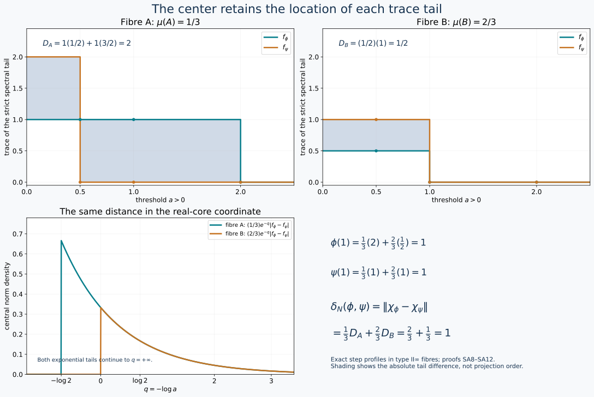

# Assemble trace tails over the center

For a semifinite nonfactor, a single scalar trace tail loses the locations of the central pieces. The correct invariant retains a tail in each central fibre. We prove both the orbit-distance formula and realization of every subinvariant central functional for a type II∞ algebra with separable predual.

Earlier complete proofs: [TD.2](OA-FLOW-TD.md#oa-flow.td.2), [TD.5](OA-FLOW-TD.md#oa-flow.td.5), [SORB.ISOMETRY](OA-FLOW-SORB.md#orbit-isometry), [SORB.RANGE](OA-FLOW-SORB.md#orbit-range), [KT.5](OA-FLOW-KT.md#oa-flow.kt.5), [TD.7](OA-FLOW-TD.md#oa-flow.td.7), [TD.8](OA-FLOW-TD.md#oa-flow.td.8), [CORE.9](OA-FLOW-CORE.md#core-9), [CINV.MASS](OA-FLOW-CINV.md#cinv-mass), [CP.4](OA-FLOW-CP.md#oa-flow.cp.4), [CP.5](OA-FLOW-CP.md#oa-flow.cp.5), [CINV.INVERSE](OA-FLOW-CINV.md#cinv-inverse), [SORB.TYPE-I](OA-FLOW-SORB.md#orbit-type-i), OA-MOD DC-03, OA-MOD DC-04, OA-MOD DC-06, OA-MOD DC-07, OA-MOD DC-08, OA-MOD DC-09, OA-MOD MW-02, OA-MOD MW-04, OA-MOD MW-05, OA-MOD MW-07, OA-MOD GFR-07, OA-MOD SCF-05, OA-MOD DC-05.

## 1. Actual measurable data and their full domains

Let \(N\) be type II∞ with separable predual, with a faithful normal semifinite trace \(\tau_0\). Use a faithful normal separable representation. The actual central-decomposition theorem DC06–09 and weighted decomposition MW04–07 give, over a standard probability space,
\[
 (N,\tau_0)=\int_X^\oplus(N_x,\tau_x)\,d\mu(x),
 \qquad Z(N)=L^\infty(X,\mu).                                    \tag{SA1}
\]
Changing a sigma-finite base to an equivalent probability measure changes the fibre weights by the inverse density, exactly as proved in MW07. This rescaling is retained in (SA1); it is not a choice of unnormalized fibre traces. We use the constructed measurable GNS Hilbert field of MW07, so the represented fibre algebra and its trace live on the same specified field.

The fibres are factors by DC08. They have faithful normal semifinite traces: MW04 decomposes the full modular operator, and the global trace has modular operator one by KT5. Thus the fibre modular operators are one on a common conull set, and KT5's whole-cone trace criterion applies in each fibre. Proper infiniteness localizes the two global isometries with orthogonal ranges, so the fibre units are properly infinite. There is no type I fibre on a set of positive measure. Otherwise choose a nonzero minimal projection in those fibres by the completed-measure selector SCF. The relation is Borel: \(p=p^*=p^2\ne0\), fibre-algebra membership is commutation with DC03's countable commutant generators, and \(pN_xp=\mathbb Cp\) is tested on a countable strong-star dense contraction family. The scalar in each compression can be read on the first nonzero coordinate of \(p\). The selected measurable bounded projection would give a nonzero abelian corner of \(N\), contrary to type II. Consequently \(N_x\) is type II∞ almost everywhere.

Here are the measurability interfaces we use, rather than an unspecified measurable choice principle. DC03 gives measurable countable generators of the fibre commutants. GFR07, equations (GFR.20)–(GFR.22), gives a countable measurable family \(a_j(x)\) strong-star dense in each unit ball. MW02 gives the joint Borel trace test
\[
 \tau_x(b)=\sup_j\langle b\,\beta_j(x),\beta_j(x)\rangle,
 \qquad b\in(N_x)_+,                                             \tag{SA2}
\]
in the specified GNS representation. Bounded products, adjoints and spectral cutoffs are Borel in countable matrix coordinates. SCF, lines 165–207, proves selection for Borel relations with Polish witnesses after measure completion, and gives Borel representatives off a null set.

For \(\phi\in N_*^+\), let \(k_\phi\) be its TD density for \(\tau_0\). Decompose its bounded transform \(A=k_\phi/(1+k_\phi)\). The fibre \(A_x\) is a positive contraction with no eigenvalue at one almost everywhere, because the global spectral projection there is zero. Define \(k_{\phi,x}=A_x/(1-A_x)\) on the full spectral domain. Thus
\[
 D(k_\phi)=\left\{\xi:\xi_x\in D(k_{\phi,x})\text{ a.e.},
               \int_X\|k_{\phi,x}\xi_x\|^2\,d\mu<\infty\right\}.   \tag{SA3}
\]
This follows by decomposing each bounded spectral cutoff and then taking its squared-norm limit; the adjoint test on all cutoffs proves that no larger operator domain is missing. MW's all-positive identity and monotone convergence give
\[
 \tau_0(k_\phi)=\int_X\tau_x(k_{\phi,x})\,d\mu=\phi(1)<\infty.
\]
Put \(\phi_x=(\tau_x)_{k_{\phi,x}}\). For every bounded positive measurable field \(b\), TD cutoffs and MW19 give
\[
 \phi(b)=\int_X\phi_x(b_x)\,d\mu,\qquad
 \|\phi_x\|=\tau_x(k_{\phi,x})\text{ a.e.}                          \tag{SA4}
\]
The same construction applies to zero and nonfaithful densities.

For an integrable measurable field of self-adjoint normal functionals \(\eta_x\),
\[
 \left\|\int_X\eta_x\,d\mu\right\|
       =\int_X\|\eta_x\|\,d\mu.                                  \tag{SA5}
\]
The upper bound follows directly by testing contractions. For the lower bound, take the real and imaginary scalar phases of the countable strong-star dense contraction family, or its self-adjoint real parts for self-adjoint \(\eta_x\). Normality makes its supremum equal \(\|\eta_x\|\). For any \(\varepsilon>0\), choose at each \(x\) the least index with value greater than \(\|\eta_x\|-\varepsilon\); these measurable sets partition the probability base. The resulting measurable contraction field belongs to \(N\), by DC04, and its evaluation gives the lower bound up to \(\varepsilon\). This also proves measurability of the norm. No fibrewise maximizer is required.

## 2. The exact continuous-core formula

CORE9, including its all-positive slice proof, identifies
\[
 C(N)=N\bar\otimes L^\infty(\mathbb R,dq),\quad
 \theta_s(F)(q)=F(q-s),\quad
 \tau=\tau_0\otimes e^{-q}\frac{dq}{2\pi}.                         \tag{SA6}
\]
Changing the scalar reference measure from \(dq/(2\pi)\) to \(dq\) changes its Hilbert realization, not the displayed functional. The center is \(L^\infty(X\times\mathbb R,\mu\otimes dq)\). The full dual density is
\[
 h_\phi=k_\phi\otimes e^q.                                       \tag{SA7}
\]
To verify (SA7) on the whole cone, the dual average in CORE9 is scalar integration in the \(q\) variable with measure \(dq/(2\pi)\). Composing it with (SA4) gives, for every positive field \(Y\),
\(\widetilde\phi(Y)=\int_X\int_{\mathbb R}\phi_x(Y_{x,q})\,dq/(2\pi)\,d\mu\).
TD's bounded spectral cutoffs for \(k_{\phi,x}e^q\), followed by nonnegative interchange, give exactly the same value relative to the trace in (SA6). TD uniqueness proves the density equality with its complete domain, not just on elementary tensors.

Let
\[
 f_{\phi,x}(a)=\tau_x(1_{(a,\infty)}(k_{\phi,x})),\qquad a>0.
\]
The tails are decreasing, right-continuous, finite at positive arguments, and
\(\int_0^\infty f_{\phi,x}(a)\,da=\phi_x(1)\) almost everywhere. The strict tail convention matters at jumps. Equations (CI5), (SA6)–(SA7) give
\[
 \chi_\phi(z)=
 \int_X\int_{\mathbb R}z(x,q)e^{-q}f_{\phi,x}(e^{-q})\,dq\,d\mu(x).
                                                                    \tag{SA8}
\]
Consequently
\[
 \|\chi_\phi-\chi_\psi\|
 =\int_X\int_0^\infty|f_{\phi,x}(a)-f_{\psi,x}(a)|\,da\,d\mu(x).    \tag{SA9}
\]
The change of variables is \(a=e^{-q}\), so \(e^{-q}dq=-da\). All constants from the trace and from (CI5) cancel exactly.

## 3. Measurable near-minimizers give the full distance

The proved semifinite-factor theorem SORB(SO16) states, for arbitrary positive integrable densities including unequal masses,
\[
 d(x):=\delta_{N_x}(\phi_x,\psi_x)
       =\int_0^\infty|f_{\phi,x}(a)-f_{\psi,x}(a)|\,da.             \tag{SA10}
\]
Its finite-band matching proof, support padding and finite-join unitary completion are the actual input; no factor-only assertion is being silently applied to \(N\).

Fix \(\varepsilon>0\). We select \(u_x\in\mathcal U(N_x)\) satisfying
\[
 \|\phi_x\circ\operatorname{Ad}u_x-\psi_x\|<d(x)+\varepsilon.
                                                                    \tag{SA11}
\]
For varying Hilbert fibres, use their measurable realization \(H_x=P_x\ell^2\), and represent a fibre unitary by its zero extension \(u=P_xuP_x\), with \(u^*u=uu^*=P_x\). The unit contraction ball of \(B(\ell^2)\), with its strong-star metric, is Polish: coordinate Cauchy sequences have bounded strong limits for the operators and their adjoints, which are adjoints of each other. Finite-coordinate approximants give separability. Algebra membership is the countable commutant test. For each contraction \(a_j(x)\), the scalar
\(\phi_x(u a_j(x)u^*)-\psi_x(a_j(x))\) is Borel. This follows from bounded multiplication, the trace formula (SA2) on positive sandwiches and polarization; integrable-density pairings are monotone cutoff limits. The norm is the supremum of their absolute values. Thus (SA11) defines a Borel relation with Polish witnesses. Each fibre is nonempty by (SA10), because the error is strictly positive. SCF selects a completed-measurable field; its Borel representative on a common conull set defines a unitary \(u\in N\).

Apply (SA5) and (SA11). Since \(\mu(X)=1\),
\[
 \delta_N(\phi,\psi)\le\|\phi\circ\operatorname{Ad}u-\psi\|
 \le\int_Xd(x)\,d\mu+\varepsilon.
\]
Let \(\varepsilon\downarrow0\), and combine with (CI17) and (SA9):
\[
 \boxed{\ \delta_N(\phi,\psi)=\|\chi_\phi-\chi_\psi\|.\ }           \tag{SA12}
\]
For a sigma-finite base before normalization, use \(\varepsilon b(x)\) in (SA11), where \(b>0\) and \(\int b=1\). A multiplicative error \((1+\varepsilon)d(x)\) would demand an attained minimum when \(d(x)=0\); closed-orbit equality does not imply that. This additive error is essential.

*Exact two-atom central model for (SA8)–(SA12), with type II∞ fibres of base masses \(1/3\) and \(2/3\). The first fibre contributes tail distance \(2\), and the second contributes \(1/2\); their integrated contribution is \(1\). Both global functionals have mass one. The lower plot uses \(a=e^{-q}\); its exponential tails continue beyond the plotting window. The shaded upper areas are absolute differences of scalar trace tails. They make no assertion that the two original spectral projections are ordered.*

## 4. A measurable full trace flag

We next realize a prescribed central subinvariant functional. The construction requires one whole flag per fibre, selected together.

Use witnesses \((P_x(r))_{r\in\mathbb Q_+}\) in a countable product of the above Polish contraction ball, imposing
\[
 \begin{gathered}
 P_x(0)=0,\quad P_x(r)=P_x(r)^*=P_x(r)^2\in N_x,\\
 P_x(r)P_x(s)=P_x(r)\ (r\le s),\quad
 \tau_x(P_x(r))=r,\quad \sup_{n\ge1}P_x(n)=1.                      \end{gathered}
 \tag{SA13}
\]
All conditions are countably Borel. Trace values use (SA2); the final strong supremum is tested on a countable Hilbert frame. Each fibre has a witness by SORB(SO18)–(SO20): split finite-trace projections dyadically and concatenate their flags in a countable filling family. SCF therefore selects the entire rational flag measurably in one application.

For finite real \(t\ge0\), put
\(P_x(t)=\bigvee_{r<t,\ r\in\mathbb Q_+}P_x(r)\).
Normality gives \(\tau_x(P_x(t))=t\). At rational \(t\) this equals the selected projection, since the difference under \(P_x(t)\) has trace zero. Nested differences and faithfulness imply strong continuity from both sides at every finite \(t\). Also \(P_x(t)\uparrow1\) as \(t\to\infty\). For a measurable function \(t(x)\ge0\), its dyadic lower approximations show that \(x\mapsto P_x(t(x))\) is measurable. Thus (SA13) gives variable-parameter projections, not only separate projections of prescribed trace.

## 5. Realize every subinvariant functional

Let \(\chi\in Z(C(N))_*^+\) satisfy
\[
 \chi\theta_s\ge e^{-s}\chi\qquad(s\ge0).                          \tag{SA14}
\]
Scalar Radon–Nikodym on the sigma-finite product gives a nonnegative integrable density \(p(x,q)\) with \(\chi(z)=\int zp\,d\mu\,dq\). This is obtained by DC05 on an equivalent finite measure, retaining the density conversion. The inequality says
\(p(x,q+s)\ge e^{-s}p(x,q)\) almost everywhere for each \(s\ge0\).
Thus \(g(x,q)=e^qp(x,q)\) has an increasing representative in \(q\).

We justify the representative and its joint measurability. Take a common null set for positive rational translations and convolve \(g\) in \(q\) with positive compact smooth kernels. For almost every \(x\), \(g(x,\cdot)\) is locally integrable. The convolved functions are continuous and obey the inequality for rational translations, hence are increasing for all positive translations. They converge locally in \(L^1(\mu\otimes dq)\) to \(g\), by scalar translation continuity and a compact exhaustion. A subsequence converges almost everywhere on all compact strips, by choosing summable \(L^1\) errors. An almost-everywhere limit of these increasing functions has a unique increasing left-continuous representative. It is given, at every \(q\), by the left-interval average limit
\[
 \bar g(x,q)=\lim_{n\to\infty}
                n\int_{q-1/n}^{q}g(x,r)\,dr,                     \tag{SA15}
\]
on the conull set where the monotone representative exists; define zero elsewhere. This formula proves joint measurability. The monotone representative is finite at every finite \(q\): its value is bounded by its average on a later compact interval, which is finite. The formula equals \(g\) almost everywhere because the increasing limit representative and \(g\) have the same integrals on intervals, as follows from local \(L^1\) convergence.

Put
\[
 f(x,a)=\bar g(x,-\log a),\qquad a>0.
\]
It is decreasing and right-continuous, finite at every positive \(a\), and
\[
 \int_X\int_0^\infty f(x,a)\,da\,d\mu=\chi(1)<\infty.              \tag{SA16}
\]
For almost every \(x\), this integral in \(a\) is finite, so \(f(x,a)\to0\) at infinity. Put zero on the exceptional null set.

Using the jointly measurable flag of Section 4, form the decreasing strongly right-continuous projections
\[
 E_x(a)=P_x(f(x,a)).
\]
They tend to zero at infinity, and their limit at zero is an arbitrary support projection. They are measurable for each \(a\). The bounded-transform dyadic construction in [the finite spectral-cut reconstruction](OA-FLOW-CINV.md#cinv-inverse), (CI8), applied to these families gives a measurable positive affiliated operator \(k\in N\), with exactly these fibre spectral tails. More explicitly,
\[
 D(k)=\left\{\xi:
        \int_X\int_{[0,\infty)} t^2\,d\mu_{\xi_x}^{k_x}(t)\,d\mu(x)
                    <\infty\right\}.                            \tag{SA17}
\]
Its kernel is the orthogonal complement of
\(\int^\oplus\bigvee_{a>0}E_x(a)\,d\mu\). Bounded spectral cutoffs prove density, closedness, affiliation and the full adjoint domain just as in (CI8); measurability follows from the countable dyadic construction. Trace layer-cake and (SA16) give \(\tau_0(k)=\chi(1)<\infty\). Hence TD defines a positive normal functional \(\phi=(\tau_0)_k\). Equations (SA8) and (SA15) show \(\chi_\phi=\chi\) on the entire center.

Combining with (CI15), we have the complete range
\[
 \boxed{\ \{\chi_\phi:\phi\in N_*^+\}
  =\{\chi\in Z(C(N))_*^+:\chi\theta_s\ge e^{-s}\chi\ (s\ge0)\}.\ }  \tag{SA18}
\]
The zero function and all possible nonfaithful supports are included. The construction retains the location of every central fibre.

## 6. The type I discrete exception

For \(N=B(H)\) with usual trace and separable infinite-dimensional \(H\), the same Fourier formula holds. The exact factor theorem SORB(SO25)–(SO27) says its range consists precisely of
\[
 \chi(z)=\int_{\mathbb R}z(q)e^{-q}f(e^{-q})\,dq,
\]
where \(f:(0,\infty)\to\mathbb N_0\) is decreasing, right-continuous and integrable. The realizing eigenvalues are
\(\lambda_j=\sup\{a:f(a)\ge j\}\); then
\(f(a)=\#\{j:\lambda_j>a\}\) and \(\sum_j\lambda_j=\int f\).
For a trace \(\alpha\operatorname{Tr}\), the value set becomes
\(\alpha\mathbb N_0\), with the corresponding rescaled density coordinate. Formula (SA12) still holds, but the full continuous cone (SA18) is larger than the image. For example \(f(a)=\tfrac12\,1_{(0,2)}(a)\) satisfies the continuous conditions and has mass one, but violates the integer-value condition for the usual trace.

## Sources and exact inputs

Haagerup–Størmer, [*Equivalence of Normal States on von Neumann Algebras and the Flow of Weights*](https://www.isibang.ac.in/~soumyashant/misc/collected-works-of-haagerup/1990s/1990_Equivalence_of_normal_states_on_von_Neumann_algebras_and_the_flow_of_weights.pdf), §4 and §8, pp.193–200 and 225–233, provide the human source context. The source's multiplicative near-minimizer condition on p.229 is replaced here by the proved additive selection (SA11). The full operator domains and one jointly selected complete flag are part of the construction. The factor input is the complete earlier SORB theorem, including its arbitrary-trace normalization.
