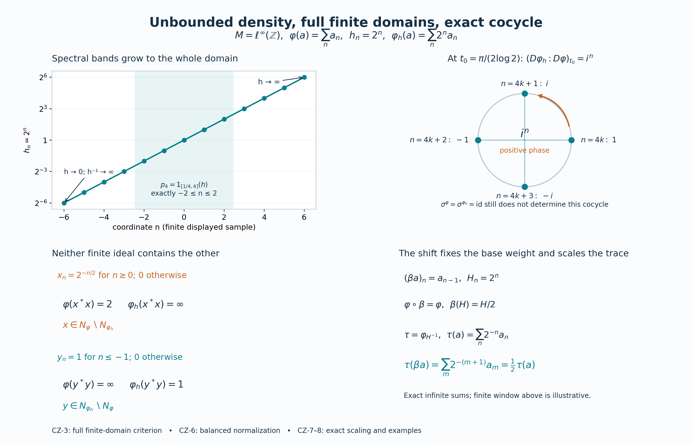

# Unbounded centralizer densities: the weight, its finite domains and its exact cocycle

*Original reconstruction by GPT-6.1 Sol (OpenAI), Ultra, 2026-10-04. CC0-1.0 to the extent of rights held.*

Let \(M\) be an arbitrary von Neumann algebra and let \(\varphi\) be a faithful normal semifinite weight. Its centralizer is

\[
C=M_\varphi=\{a\in M:\sigma_t^\varphi(a)=a\text{ for every }t\in\mathbb R\}.
\tag{CZ1}
\]
Let \(h\) be a nonsingular positive selfadjoint operator affiliated with \(C\): every spectral projection belongs to \(C\), and \(1_{\{0\}}(h)=0\). Neither \(h\) nor \(h^{-1}\) is assumed bounded. There is no separability, countable-decomposability or finite-weight assumption on \(M\).

Write \(N=\mathfrak n_\varphi\), \(m=\mathfrak m_\varphi=\operatorname{span}N^*N\), \(A=N\cap N^*\), and \((H,\pi,\Lambda)\) for the faithful normal GNS representation. Inner products are linear in the first variable. The finite linear extension is \(\varphi_0\). This chapter constructs a weight on every bounded positive element of \(M\); it does not give a meaning to an arbitrary formal product of unbounded operators.

The actual earlier written inputs are [GW1](OA-FLOW-GW.md#oa-flow.gw.1), [GW2](OA-FLOW-GW.md#oa-flow.gw.2), [GW3](OA-FLOW-GW.md#oa-flow.gw.3), [GW4](OA-FLOW-GW.md#oa-flow.gw.4), [GW5](OA-FLOW-GW.md#oa-flow.gw.5) for finite ideals, GNS and semifiniteness; [EW2](OA-FLOW-EW.md#oa-flow.ew.2), [EW3](OA-FLOW-EW.md#oa-flow.ew.3) for ultraweak lower semicontinuity with the corrected order-normality scope; [WR3](OA-FLOW-WR.md#oa-flow.wr.3), [WR4](OA-FLOW-WR.md#oa-flow.wr.4), [WR5](OA-FLOW-WR.md#oa-flow.wr.5), [MW4](OA-FLOW-MW.md#oa-flow.mw.4) for faithful normal GNS and modular objects; [KT1](OA-FLOW-KT.md#oa-flow.kt.1), [KT2](OA-FLOW-KT.md#oa-flow.kt.2), [KT3](OA-FLOW-KT.md#oa-flow.kt.3), [KT4](OA-FLOW-KT.md#oa-flow.kt.4), [KT5](OA-FLOW-KT.md#oa-flow.kt.5), [KU1](OA-FLOW-KU.md#oa-flow.ku.1), [KU2](OA-FLOW-KU.md#oa-flow.ku.2), [KU3](OA-FLOW-KU.md#oa-flow.ku.3) for the full finite-star KMS condition, uniqueness and trace criterion; [BC1](OA-FLOW-BC.md#oa-flow.bc.1), [BC2](OA-FLOW-BC.md#oa-flow.bc.2), [BC3](OA-FLOW-BC.md#oa-flow.bc.3), [BC4](OA-FLOW-BC.md#oa-flow.bc.4), [BC5](OA-FLOW-BC.md#oa-flow.bc.5) for balanced weights and the exact cocycle normalization/covariance; and [MA2](OA-FLOW-MA.md#oa-flow.ma.2), [MA3](OA-FLOW-MA.md#oa-flow.ma.3), [AS2](OA-FLOW-AS.md#oa-flow.as.2), [AS3](OA-FLOW-AS.md#oa-flow.as.3), [AS4](OA-FLOW-AS.md#oa-flow.as.4) for full finite-domain strip criteria, gluing and comparison. Spectral calculus, full domains, normal spectral transport and scalar strip analysis use [SF0](OA-FLOW-SF.md#oa-flow.sf.sf0), [SB0](OA-FLOW-SF.md#oa-flow.sf.sb0), [SB1](OA-FLOW-SF.md#oa-flow.sf.sb1), [SB2](OA-FLOW-SF.md#oa-flow.sf.sb2), [SB3](OA-FLOW-SF.md#oa-flow.sf.sb3), [SB4](OA-FLOW-SF.md#oa-flow.sf.sb4), [SB5](OA-FLOW-SF.md#oa-flow.sf.sb5), [SB6](OA-FLOW-SF.md#oa-flow.sf.sb6), [SF1](OA-FLOW-SF.md#oa-flow.sf.sf1), [SF2](OA-FLOW-SF.md#oa-flow.sf.sf2), [SF4](OA-FLOW-SF.md#oa-flow.sf.sf4). Concrete predual and bounded strong-to-ultraweak convergence use [CP1](OA-FLOW-CP.md#oa-flow.cp.1), [CP2](OA-FLOW-CP.md#oa-flow.cp.2), [CP3](OA-FLOW-CP.md#oa-flow.cp.3), [CP4](OA-FLOW-CP.md#oa-flow.cp.4), [CP5](OA-FLOW-CP.md#oa-flow.cp.5), [CP6](OA-FLOW-CP.md#oa-flow.cp.6). Hilbert completion and bounded sesquilinear representation use [CF1](OA-FLOW-CF.md#oa-flow.cf.1), [CF2](OA-FLOW-CF.md#oa-flow.cf.2), [CF3](OA-FLOW-CF.md#oa-flow.cf.3), [CF4](OA-FLOW-CF.md#oa-flow.cf.4), [CF5](OA-FLOW-CF.md#oa-flow.cf.5), [CF6](OA-FLOW-CF.md#oa-flow.cf.6), [CF7](OA-FLOW-CF.md#oa-flow.cf.7), [CF8](OA-FLOW-CF.md#oa-flow.cf.8), [CF10](OA-FLOW-CF.md#oa-flow.cf.10). Scalar measure and convergence inputs are the earlier [SC0](OA-FLOW-SC.md#sc-00), [SC1](OA-FLOW-SC.md#sc-01), [SC2](OA-FLOW-SC.md#sc-02), [SC3](OA-FLOW-SC.md#sc-03), [SC4](OA-FLOW-SC.md#sc-04), [SC5](OA-FLOW-SC.md#sc-05), [SC6](OA-FLOW-SC.md#sc-06), [SC7](OA-FLOW-SC.md#sc-07) proofs. Every named input has its complete written body in an earlier reader.

The weight of a positive operator affiliated with the centralizer is also constructed in Hiai, [*Concise lectures on selected topics of von Neumann algebras*](https://arxiv.org/pdf/2004.02383v1#page=80), arXiv:2004.02383, §9, and in Pedersen and Takesaki, [*The Radon-Nikodym theorem for von Neumann algebras*](https://projecteuclid.org/euclid.acta/1485889766), Acta Math. 130 (1973), §4. The construction below follows the bounded-density and spectral-band route, with the entire finite domains proved explicitly. Its bounded modular identification uses the locally proved AS/MA comparison rather than an imported analytic-generator theorem.

## CZ-0. A finite-domain test for the centralizer

If \(a\in C\), its modular orbit is the constant entire map. [MA2](OA-FLOW-MA.md#oa-flow.ma.2) therefore gives

\[
Na^*\subset N,\quad Na\subset N,\quad
\Lambda(xa^*)=J\pi(a)J\Lambda(x),\quad
\varphi_0(az)=\varphi_0(za)\quad(x\in N,\ z\in m).
\tag{CZ2}
\]
It also shows that left and right multiplication by \(a\) preserve \(m\): for example \(ay^*x=(ya^*)^*x\) and \(y^*xa=y^*(xa)\), with all factors in \(N\).

Conversely, suppose a bounded \(a\) satisfies the two ideal inclusions and the last identity in ([CZ2](OA-FLOW-CZ.md#equation-cz2)). [MA3](OA-FLOW-MA.md#oa-flow.ma.3), with its second element equal to \(a\), gives a bounded closed lower-strip map with upper and lower boundary both \(t\mapsto\sigma_t^\varphi(a)\). Repeat this map with period \(i\). [AS2](OA-FLOW-AS.md#oa-flow.as.2)'s rectangle gluing proves that each predual coefficient is entire. It is bounded on the plane because the same strip bound applies to every translate. The circle Cauchy derivative estimate in [SF4](OA-FLOW-SF.md#oa-flow.sf.sf4), with arbitrarily large radius, makes each derivative zero. The predual separates points, so the orbit is constant and \(a\in C\).

In particular a unitary \(u\in C\) preserves \(\varphi\) on the whole positive cone. For a finite positive \(z\), [MA2](OA-FLOW-MA.md#oa-flow.ma.2) gives \(\varphi(uzu^*)\leq\varphi(z)\); applying it to \(u^*\) gives the reverse inequality. If \(z\) has infinite value but \(uzu^*\) had finite value, that reverse inequality would contradict infinity. Thus

\[
\varphi(uzu^*)=\varphi(z)\quad(z\in M_+,\ u\in C\text{ unitary}).
\tag{CZ3}
\]
The converse is valid too. If a unitary preserves \(\varphi\) on \(M_+\), then \(Nu=N\) and \(Nu^*=N\). Conjugation preserves \(m\), and uniqueness of its finite linear extension gives \(\varphi_0(uzu^*)=\varphi_0(z)\). Right multiplication by \(u\) preserves \(m\); replacing \(z\) by \(zu\) yields \(\varphi_0(uz)=\varphi_0(zu)\). The preceding test puts \(u\) in \(C\). These statements apply to any faithful normal semifinite weight, including the new weight after it has been constructed.

## CZ-1. Bounded positive densities, with whole-cone parameter additivity

For \(b\in C_+\), define

\[
\varphi_b(a)=\varphi(b^{1/2}ab^{1/2})\quad(a\in M_+).
\tag{CZ4}
\]
This is a normal weight: compression is positive linear and preserves the strong supremum of each bounded increasing positive net, and \(\varphi\) is normal. Since ([CZ2](OA-FLOW-CZ.md#equation-cz2)) gives \(xb^{1/2}\in N\) for \(x\in N\),

\[
N\subset\mathfrak n_{\varphi_b},\qquad
\varphi_b(x^*x)=\|J\pi(b^{1/2})J\Lambda(x)\|^2
\leq\|b\|\varphi(x^*x)\quad(x\in N).
\tag{CZ5}
\]
The finite ideal of \(\varphi_b\) is weak-operator dense because \(N\) is, so [GW](OA-FLOW-GW.md#oa-flow.gw.4)'s criterion proves semifiniteness. Faithfulness is not claimed when \(b\) has a kernel. For \(z\in m\), all indicated products remain in \(m\), and ([CZ2](OA-FLOW-CZ.md#equation-cz2)) yields

\[
(\varphi_b)_0(z)=\varphi_0(zb)=\varphi_0(bz).
\tag{CZ6}
\]

We need parameter additivity even on elements having infinite weight. Let \(b,c\in C_+\), \(d=b+c\), and \(p=s(d)\). On a concrete representation define

\[
v(d^{1/2}\xi)=b^{1/2}\xi,\qquad
w(d^{1/2}\xi)=c^{1/2}\xi.
\tag{CZ7}
\]
The inequalities \(b,c\leq d\) make these well defined contractions on \(\operatorname{Ran}d^{1/2}\). Extend them to \(pK\) by completeness and make them zero on \((1-p)K\). They commute with every commutant unitary, since the defining operators do. Differentiating commutant exponentials gives commutation with every bounded selfadjoint commutant element, and decomposing an arbitrary element into real and imaginary parts gives commutation with the entire commutant. Hence \(v,w\in M\). The equations and zero complements determine them uniquely. Applying \(\sigma_t^\varphi\) to those equations proves \(v,w\in C\). Equality of the defining quadratic norms gives

\[
b^{1/2}=vd^{1/2}=d^{1/2}v^*,\quad
c^{1/2}=wd^{1/2}=d^{1/2}w^*,\quad
v^*v+w^*w=p,\quad b^{1/2}v+c^{1/2}w=d^{1/2}.
\tag{CZ8}
\]
The third equality follows first on the dense range of \(d^{1/2}\) in \(pK\), by polarization, then everywhere; it is zero on the complementary subspace.

Fix \(a\in M_+\), and put \(x=a^{1/2}\). If \(\varphi_b(a)\) and \(\varphi_c(a)\) are finite, then \(xb^{1/2},xc^{1/2}\in N\). Right stability by \(v,w\) and the last equality in ([CZ8](OA-FLOW-CZ.md#equation-cz8)) imply \(xd^{1/2}\in N\). Conversely if \(\varphi_d(a)<\infty\), put \(z=d^{1/2}ad^{1/2}\in m_+\). Then ([CZ2](OA-FLOW-CZ.md#equation-cz2)) gives finite values and
\[
\varphi_b(a)=\varphi_0(vzv^*)=\varphi_0(zv^*v),\qquad
\varphi_c(a)=\varphi_0(zw^*w).
\]
Their sum is \(\varphi_0(zp)=\varphi(z)=\varphi_d(a)\). If \(\varphi_d(a)=\infty\), the earlier implication excludes both summands being finite. We have proved, on the entire positive cone,

\[
\varphi_{b+c}=\varphi_b+\varphi_c,\qquad
\varphi_{rb}=r\varphi_b\ (r\geq0),\qquad
b\leq c\Longrightarrow\varphi_b\leq\varphi_c.
\tag{CZ9}
\]
The scalar identity follows directly from ([CZ4](OA-FLOW-CZ.md#equation-cz4)), with \(0\cdot\infty=0\).

If a bounded increasing net \(b_j\uparrow b\) lies in \(C_+\), spectral approximation gives \(b_j^{1/2}\to b^{1/2}\) strongly. Indeed uniformly approximate the square-root function on the common bounded spectral interval by polynomials and use bounded strong continuity of each polynomial. Thus \(b_j^{1/2}ab_j^{1/2}\to b^{1/2}ab^{1/2}\) strongly and ultraweakly, with a uniform norm bound. [EW](OA-FLOW-EW.md#oa-flow.ew.3)'s lower semicontinuity and ([CZ9](OA-FLOW-CZ.md#equation-cz9)) imply

\[
\varphi_b(a)\leq\liminf_j\varphi_{b_j}(a)
\leq\sup_j\varphi_{b_j}(a)\leq\varphi_b(a).
\tag{CZ10}
\]
This proves equality, including infinity. The conjugated positive elements need not form an increasing net; no such assertion was used.

## CZ-2. The unbounded weight on every positive element

For \(\varepsilon>0\) and integers \(n\geq1\), put

\[
h_\varepsilon=h(1+\varepsilon h)^{-1}\in C_+,\qquad
p_n=1_{[1/n,n]}(h)\in C,\qquad k_n=hp_n\in C_+.
\tag{CZ11}
\]
These are bounded spectral multipliers; \(p_n\uparrow1\) because \(h\) is nonsingular. Define

\[
\varphi_h(a)=\sup_{\varepsilon>0}\varphi_{h_\varepsilon}(a)
             =\sup_{n\geq1}\varphi_{k_n}(a)\quad(a\in M_+).
\tag{CZ12}
\]
Here is the proof of the second equality. For fixed \(n\), the bounded densities \(h_\varepsilon p_n\) increase to \(hp_n\) as \(\varepsilon\downarrow0\), so ([CZ10](OA-FLOW-CZ.md#equation-cz10)) and ([CZ9](OA-FLOW-CZ.md#equation-cz9)) give \(\varphi_{k_n}\leq\sup_\varepsilon\varphi_{h_\varepsilon}\). For fixed \(\varepsilon\), \(h_\varepsilon p_n\uparrow h_\varepsilon\) boundedly; hence \(\varphi_{h_\varepsilon}=\sup_n\varphi_{h_\varepsilon p_n}\leq\sup_n\varphi_{k_n}\).

The weights in the first supremum are increasing as \(\varepsilon\downarrow0\). Their supremum is additive: for two positive elements take a common smaller parameter to approximate both summands, or to make an infinite summand exceed any prescribed finite number. Homogeneity follows in the same way. Normality follows by interchanging the two suprema for a bounded increasing positive net:

\[
\varphi_h\!\left(\sup_j a_j\right)
=\sup_\varepsilon\sup_j\varphi_{h_\varepsilon}(a_j)
=\sup_j\varphi_h(a_j).
\tag{CZ13}
\]
If \(\varphi_h(a)=0\), faithfulness of \(\varphi\) gives \(k_n^{1/2}ak_n^{1/2}=0\). Thus \(a^{1/2}k_n^{1/2}=0\). Multiplying on the right by the bounded multiplier \(h^{-1/2}p_n\) gives \(a^{1/2}p_n=0\); strong convergence of \(p_n\) gives \(a=0\). So \(\varphi_h\) is faithful.

For \(x\in N\), commuting spectral multipliers in ([CZ12](OA-FLOW-CZ.md#equation-cz12)), followed by ([CZ9](OA-FLOW-CZ.md#equation-cz9)), give

\[
\varphi_h(p_nx^*xp_n)=\varphi_{hp_n}(x^*x)
\leq n\varphi_{p_n}(x^*x)\leq n\varphi(x^*x)<\infty.
\tag{CZ14}
\]
Consequently \(xp_n\in\mathfrak n_{\varphi_h}\). For each \(x\in N\), \(xp_n\to x\) strongly. The new finite ideal therefore has weak-operator closure containing \(N\), and hence all of \(M\). [GW](OA-FLOW-GW.md#oa-flow.gw.4)'s criterion proves semifiniteness. This argument uses a spectral sequence of this one operator; it is not a countability reduction of the algebra.

## CZ-3. Every finite domain and a concrete full GNS identification

Set \(N_h=\mathfrak n_{\varphi_h}\). For arbitrary \(x\in M\), the exact criterion is

\[
\begin{split}
x\in N_h\quad\Longleftrightarrow\quad&
xh^{1/2}p_n\in N\text{ for every }n,\quad
\sup_n\|\Lambda(xh^{1/2}p_n)\|^2<\infty,\\
&\varphi_h(x^*x)=\sup_n\|\Lambda(xh^{1/2}p_n)\|^2 .
\end{split}
\tag{CZ15}
\]
Only bounded products \(xh^{1/2}p_n\) occur. This is exactly ([CZ12](OA-FLOW-CZ.md#equation-cz12)) applied to \(x^*x\), so it applies even if \(x\notin N\).

For \(x\in N_h\), denote the vectors in ([CZ15](OA-FLOW-CZ.md#equation-cz15)) by \(\eta_n(x)\). For \(m\geq n\), parameter additivity in ([CZ9](OA-FLOW-CZ.md#equation-cz9)) gives

\[
\|\eta_m(x)-\eta_n(x)\|^2
=\varphi_{h(p_m-p_n)}(x^*x)
=\|\eta_m(x)\|^2-\|\eta_n(x)\|^2 .
\tag{CZ16}
\]
Thus they are Cauchy. Define \(\Lambda_h(x)=\lim_n\eta_n(x)\) in \(H\). It is linear on the finite left ideal and

\[
\|\Lambda_h(x)\|^2=\varphi_h(x^*x),\qquad
\Lambda_h(ax)=\pi(a)\Lambda_h(x)\quad(a\in M,\ x\in N_h).
\tag{CZ17}
\]
Linearity, the left-ideal property and the mixed inner products also follow from [GW](OA-FLOW-GW.md#oa-flow.gw.4) applied to the new weight; the displayed limit agrees with its GNS sesquilinear form by polarization.

The range is dense in the whole original \(H\). Given \(y\in N\), the bounded element \(x=yh^{-1/2}p_n\) satisfies

\[
xh^{1/2}p_m=yp_np_m\in N,\qquad
\Lambda_h(x)=\Lambda(yp_n)=J\pi(p_n)J\Lambda(y).
\tag{CZ18}
\]
Indeed \(yp_np_m\) is eventually \(yp_n\), and all earlier norms are bounded by the norm of that vector. Normality of \(\pi\) makes \(J\pi(p_n)J\uparrow I\) strongly, so these vectors approximate \(\Lambda(y)\). Since \(\Lambda(N)\) is dense, ([CZ17](OA-FLOW-CZ.md#equation-cz17)) identifies the full new GNS representation with the same faithful normal \(\pi\) on \(H\).

In particular all the finite domains and the finite extension are

\[
\begin{gathered}
F_h=\{a\in M_+:a^{1/2}\in N_h\},\quad
A_h=N_h\cap N_h^*,\quad
m_h=\operatorname{span}N_h^*N_h,\\
(\varphi_h)_0(y^*x)=\langle\Lambda_h(x),\Lambda_h(y)\rangle
\quad(x,y\in N_h),
\end{gathered}
\tag{CZ19}
\]
with the extension to finite sums supplied by [GW](OA-FLOW-GW.md#oa-flow.gw.4)'s proved independence of presentation. Equations ([CZ15](OA-FLOW-CZ.md#equation-cz15)) and its application to \(x^*\) specify \(A_h\) without an implicit domain restriction.

There are two useful further exact domain comparisons. For arbitrary \(x\in M\),

\[
xp_n\in N_h\Longleftrightarrow xp_n\in N,\qquad
\frac1n\varphi(p_nx^*xp_n)
\leq\varphi_h(p_nx^*xp_n)
\leq n\varphi(p_nx^*xp_n).
\tag{CZ20}
\]
These follow from \((1/n)p_n\leq hp_n\leq np_n\), ([CZ9](OA-FLOW-CZ.md#equation-cz9)), and ([CZ14](OA-FLOW-CZ.md#equation-cz14))'s first equality; they include infinite values.

Let \(R_h\) be the positive selfadjoint operator with spectral projections \(J\pi(1_E(h))J\). [SF](OA-FLOW-SF.md#oa-flow.sf.sf1)'s normal transport of spectral measures constructs it in \(\pi(M)'\). For \(x\in N\), ([CZ2](OA-FLOW-CZ.md#equation-cz2)) identifies the bounded spectral cutoffs of \(R_h^{1/2}\Lambda(x)\) with \(\eta_n(x)\). The spectral-domain criterion therefore gives

\[
N_h\cap N=\{x\in N:\Lambda(x)\in D(R_h^{1/2})\},\qquad
\Lambda_h(x)=R_h^{1/2}\Lambda(x)\quad(x\in N_h\cap N).
\tag{CZ21}
\]
This is an actual closed-operator domain statement. No assertion that \(N=N_h\), or that an uncut \(xh^{1/2}\) is a bounded element of \(M\), is involved.

## CZ-4. The modular formula for a bounded invertible density

First suppose \(b\in C_+\) and \(0<r1\leq b\leq R1\). Put \(\psi=\varphi_b\). Parameter order gives \(r\varphi\leq\psi\leq R\varphi\) on \(M_+\). Hence \(\psi\) is faithful normal semifinite and \(N_\psi=N\), \(m_\psi=m\), \(A_\psi=A\).

The bounded operator \(\log b\) gives norm-entire multipliers \(b^{iz}\). Define the pointwise ultraweakly continuous normal automorphism group

\[
\gamma_t(a)=b^{it}\sigma_t^\varphi(a)b^{-it}.
\tag{CZ22}
\]
It is a group because \(\sigma_t^\varphi\) fixes the spectral calculus of \(b\). Suppose \(a\) has a norm-entire \(\gamma\)-orbit \(a_\gamma(z)\). Then

\[
a_\sigma(z)=b^{-iz}a_\gamma(z)b^{iz}
\tag{CZ23}
\]
is its norm-entire \(\sigma^\varphi\)-orbit. Put \(d=\gamma_{-i}(a)=b\sigma_{-i}^\varphi(a)b^{-1}\). [MA2](OA-FLOW-MA.md#oa-flow.ma.2) for \(\varphi\), and right stability by bounded centralizer elements, give

\[
N_\psi a^*\subset N_\psi,\quad N_\psi d\subset N_\psi,\quad
\psi_0(az)=\psi_0(zd)\quad(z\in m_\psi).
\tag{CZ24}
\]
For the last equality all products are in \(m\), and the complete calculation is
\[
\psi_0(az)=\varphi_0(azb)
=\varphi_0(zb\,\sigma_{-i}^\varphi(a))
=\varphi_0(zdb)=\psi_0(zd).
\]
The middle equality is [MA2](OA-FLOW-MA.md#oa-flow.ma.2)'s finite-domain identity applied to \(zb\). [MA3](OA-FLOW-MA.md#oa-flow.ma.3) for \(\psi\) now supplies a bounded weak-star continuous closed lower-strip function whose boundaries are \(\sigma_t^\psi(a)\) and \(\sigma_t^\psi(d)\). This is exactly the hypothesis of [AS4](OA-FLOW-AS.md#oa-flow.as.4) with \(\alpha=\sigma^\psi\), \(\gamma\) as in ([CZ22](OA-FLOW-CZ.md#equation-cz22)), \(X=Y=M\). It applies to every entire element and its imaginary translates, by ([CZ23](OA-FLOW-CZ.md#equation-cz23))–([CZ24](OA-FLOW-CZ.md#equation-cz24)). [AS4](OA-FLOW-AS.md#oa-flow.as.4) proves

\[
\sigma_t^{\varphi_b}(a)=b^{it}\sigma_t^\varphi(a)b^{-it}
\quad(a\in M,\ t\in\mathbb R).
\tag{CZ25}
\]
No equality of scalar weight normalizations is inferred from this group identity.

## CZ-5. Centralizer corners and the genuinely unbounded modular formula

We first justify the corner step for any faithful normal semifinite weight \(\rho\). If a projection \(p\in M_\rho\), then \(\rho^p=\rho|_{pMp}\) is faithful and normal. Its finite ideal is \(N_\rho\cap pMp=pN_\rho p\), weak-operator dense because \(N_\rho\) is and right multiplication by \(p\) preserves it. Thus the corner weight is semifinite. Its finite-star algebra is \(pA_\rho p\). Its finite algebra is \(pm_\rho p\): finite positive compressions have finite weight by ([CZ2](OA-FLOW-CZ.md#equation-cz2))'s GNS bound for \(p\), and polarization proves one inclusion; the converse is immediate from the corner finite products.

The restriction of \(\sigma^\rho\) fixes \(p\), preserves the corner weight and has the complete [KT](OA-FLOW-KT.md#oa-flow.kt.4) finite-star KMS condition on \(pA_\rho p\), with the same finite extension. [KU](OA-FLOW-KU.md#oa-flow.ku.3) uniqueness therefore proves

\[
\sigma_t^{\rho^p}=\sigma_t^\rho|_{pMp}.
\tag{CZ26}
\]
This does not require \(\rho(p)<\infty\).

Return to \(\psi=\varphi_h\). For each \(n\) and real \(s\), the centralizer unitary \(u_s=e^{isp_n}\) commutes with every \(h_\varepsilon\). By ([CZ3](OA-FLOW-CZ.md#equation-cz3)) and ([CZ4](OA-FLOW-CZ.md#equation-cz4)), it preserves every \(\varphi_{h_\varepsilon}\), and hence \(\psi\) on all of \(M_+\). [CZ-0](OA-FLOW-CZ.md#oa-flow.cz.0)'s converse for the already proved faithful n.s.f. weight \(\psi\) gives \(u_s\in M_\psi\). Taking \(s=\pi\) gives \(p_n=(1-u_\pi)/2\in M_\psi\).

On \(p_nMp_n\) the weight \(\psi\) is exactly \((\varphi^{p_n})_{hp_n}\): ([CZ10](OA-FLOW-CZ.md#equation-cz10)) applies to \(h_\varepsilon p_n\uparrow hp_n\), bounded in this corner. The density \(hp_n\) is invertible there, between \(1/n\) and \(n\) times its identity. Both corner restrictions are legitimate by ([CZ26](OA-FLOW-CZ.md#equation-cz26)), so ([CZ25](OA-FLOW-CZ.md#equation-cz25)) gives

\[
\sigma_t^\psi(a)=h^{it}\sigma_t^\varphi(a)h^{-it}
\quad(a\in p_nMp_n).
\tag{CZ27}
\]
The imaginary powers of \(h\) are bounded unitaries in \(C\), despite the unbounded real powers. [SF](OA-FLOW-SF.md#oa-flow.sf.sf1)'s spectral calculus and scalar dominated convergence on each vector prove that \(t\mapsto h^{it}\) is strongly continuous, with the group law and \(h^{i0}=1\). Thus conjugation by them is a normal automorphism. For arbitrary \(a\in M\), \(p_nap_n\to a\) boundedly strongly and ultraweakly. Normality of both sides of ([CZ27](OA-FLOW-CZ.md#equation-cz27)) passes to that limit. We obtain the full formula

\[
\boxed{\ \sigma_t^{\varphi_h}(a)=h^{it}\sigma_t^\varphi(a)h^{-it}
\quad(a\in M,\ t\in\mathbb R).\ }
\tag{CZ28}
\]

## CZ-6. Balanced matrices determine the exact cocycle

Let \(\Theta=\Theta(\varphi,\varphi)\) on \(M_2(M)\). [BC1](OA-FLOW-BC.md#oa-flow.bc.1) constructs it on the full positive cone by \(\Theta(X)=\varphi(x_{11})+\varphi(x_{22})\), proves all finite domains, and [BC4](OA-FLOW-BC.md#oa-flow.bc.4) identifies its modular group with entrywise \(\sigma^\varphi\). The nonsingular positive operator

\[
H_0=\operatorname{diag}(1,h)
\tag{CZ29}
\]
is affiliated with \(M_\Theta\), as follows directly from its diagonal spectral projections. Apply the construction and ([CZ28](OA-FLOW-CZ.md#equation-cz28)) in this matrix algebra. Its bounded density is \(\operatorname{diag}((1+\varepsilon)^{-1},h_\varepsilon)\), so for every \(X\geq0\),

\[
\Theta_{H_0}(X)
=\sup_\varepsilon\big((1+\varepsilon)^{-1}\varphi(x_{11})
                   +\varphi_{h_\varepsilon}(x_{22})\big)
=\varphi(x_{11})+\varphi_h(x_{22}).
\tag{CZ30}
\]
The equality includes either or both infinite summands, by increasing limits. Thus this is exactly [BC](OA-FLOW-BC.md#oa-flow.bc.4)'s balanced weight \(\Theta(\varphi,\varphi_h)\), with its actual normalization, not merely another weight with its modular group.

Since \(\sigma^\Theta\) fixes \(E_{21}\), ([CZ28](OA-FLOW-CZ.md#equation-cz28)) gives

\[
\sigma_t^{\Theta(\varphi,\varphi_h)}(E_{21})
=\operatorname{diag}(1,h^{it})E_{21}\operatorname{diag}(1,h^{-it})
=h^{it}E_{21}.
\tag{CZ31}
\]
[BC4](OA-FLOW-BC.md#oa-flow.bc.4) defines the cocycle by this \((2,1)\) entry. Therefore

\[
\boxed{\ (D\varphi_h:D\varphi)_t=h^{it}\quad(t\in\mathbb R).\ }
\tag{CZ32}
\]
In particular replacing \(h\) by \(ch\), \(c>0\), contributes \(c^{it}\); it cannot be recovered by comparing modular groups alone.

## CZ-7. Exact covariance, scalar factors and conditional trace conversion

For \(c>0\), \((ch)_\varepsilon=c\,h_{c\varepsilon}\). Equations ([CZ9](OA-FLOW-CZ.md#equation-cz9)) and ([CZ12](OA-FLOW-CZ.md#equation-cz12)) give \(\varphi_{ch}=c\varphi_h\) on the entire positive cone. If \(\beta:M\to M\) is a normal \*-automorphism with normal inverse, transport of bounded spectral multipliers gives

\[
\varphi_h\circ\beta=(\varphi\circ\beta)_{\beta^{-1}(h)}.
\tag{CZ33}
\]
The transported operator is affiliated with the transported centralizer: normal-isomorphism covariance of the modular group is proved by [KT](OA-FLOW-KT.md#oa-flow.kt.4)/[KU](OA-FLOW-KU.md#oa-flow.ku.3) (or [BC5](OA-FLOW-BC.md#oa-flow.bc.5)). Formula ([CZ33](OA-FLOW-CZ.md#equation-cz33)) itself follows term by term in ([CZ4](OA-FLOW-CZ.md#equation-cz4)), since \(\beta^{-1}(h_\varepsilon)=(\beta^{-1}h)_\varepsilon\), then by ([CZ12](OA-FLOW-CZ.md#equation-cz12)). If \(\varphi\circ\beta=c\varphi\) and \(\beta(h)=r h\), \(c,r>0\), it follows that

\[
\varphi_h\circ\beta=(c/r)\varphi_h.
\tag{CZ34}
\]
Here positive scalar multiplication of the base weight commutes directly with the defining supremum.

For the trace corollary, assume given an algebra \(B\), a faithful n.s.f. weight \(\omega\), a nonsingular positive operator \(H\) affiliated with \(B_\omega\), and a normal automorphism \(\beta\), with the full hypotheses

\[
\sigma_t^\omega=\operatorname{Ad}(H^{it}),\qquad
\omega\circ\beta=\omega,\qquad
\beta(H)=\lambda H,\qquad \lambda>0.
\tag{CZ35}
\]
Then \(H^{-1}\) is affiliated with \(B_\omega\), and the weight

\[
\tau=\omega_{H^{-1}}
\tag{CZ36}
\]
is faithful normal semifinite by [CZ-2](OA-FLOW-CZ.md#oa-flow.cz.2). Formula ([CZ28](OA-FLOW-CZ.md#equation-cz28)) makes \(\sigma^\tau\) the identity. [KT5](OA-FLOW-KT.md#oa-flow.kt.5)'s full-cone trace criterion proves that \(\tau\) is a trace. Formula ([CZ32](OA-FLOW-CZ.md#equation-cz32)) gives \((D\tau:D\omega)_t=H^{-it}\). Moreover \(\beta(H^{-1})=\lambda^{-1}H^{-1}\), so ([CZ34](OA-FLOW-CZ.md#equation-cz34)), with \(c=1,r=\lambda^{-1}\), gives the exact normalization

\[
\boxed{\ \tau\circ\beta=\lambda\tau.\ }
\tag{CZ37}
\]
This corollary remains conditional on every hypothesis in ([CZ35](OA-FLOW-CZ.md#equation-cz35)). It constructs neither \(H\) nor \(\omega\), proves no compact-core classification, and does not identify a type-III parameter. In the diameter application the prescribed \(0<\lambda<1\) and the displayed direction of \(\beta\) must be retained.

## CZ-8. An exact example with both finite-domain changes and a scalar-sensitive cocycle

Let \(M=\ell^\infty(\mathbb Z)\), acting diagonally on \(\ell^2(\mathbb Z)\), and let \(\varphi(a)=\sum_{n\in\mathbb Z}a_n\) for \(a\geq0\), the supremum of finite subsums. It is faithful and normal: the supremum over finite subsets commutes with increasing limits, using a common index for finitely many coordinates. It is semifinite because truncation to finite subsets gives a weakly dense finite ideal. Commutativity makes it a trace, so [KT5](OA-FLOW-KT.md#oa-flow.kt.5) gives \(\sigma^\varphi=\mathrm{id}\).

Take \(h_n=2^n\). This is nonsingular, affiliated with \(M\), and both \(h\) and \(h^{-1}\) are unbounded. Scalar monotone convergence, or the finite-subsums argument applied to ([CZ12](OA-FLOW-CZ.md#equation-cz12)), gives

\[
\varphi_h(a)=\sum_{n\in\mathbb Z}2^n a_n,\qquad
N=\ell^\infty\cap\ell^2,\qquad
N_h=\{x\in\ell^\infty:\sum_n2^n|x_n|^2<\infty\}.
\tag{CZ38}
\]
For \(x_n=2^{-n/2}\) when \(n\geq0\), zero otherwise, the ordinary squared norm is \(2\), whereas the weighted squared norm is \(\sum_{n\geq0}1=\infty\). For \(y_n=1\) when \(n\leq-1\), zero otherwise, the ordinary squared norm is infinite and the weighted squared norm is \(\sum_{n\leq-1}2^n=1\). The finite geometric identity \(\sum_{j=0}^Nq^j=(1-q^{N+1})/(1-q)\), followed by the limit for \(q=1/2\), proves the two finite values. Partial sums increasing without bound prove the infinite values.

Here both modular groups are the identity, but

\[
(D\varphi_h:D\varphi)_t=(e^{itn\log2})_{n\in\mathbb Z}.
\tag{CZ39}
\]
At \(t=\pi/(2\log2)\) the coordinate phases are exactly \(i^n\), preserving the positive transform sign. Finally set \(H_n=2^n\), \(\omega=\varphi\), and \((\beta a)_n=a_{n-1}\). Reindexing finite subsums proves \(\omega\circ\beta=\omega\); \(\beta(H)=H/2\), so \(\tau(a)=\sum_n2^{-n}a_n\) satisfies \(\tau\circ\beta=\tau/2\). This checks the direction and constant in ([CZ37](OA-FLOW-CZ.md#equation-cz37)) directly.

The accompanying figure displays finite coordinate samples of the density and the exact four cocycle phases, together with the proven full-domain values. Its finite window is a sample of the full integer-indexed construction, not a truncation of the theorem. The original figure, data and reproduction source carry the same CC0 dedication.

This chapter proves exactly [CZ-0](OA-FLOW-CZ.md#oa-flow.cz.0)–[CZ-8](OA-FLOW-CZ.md#oa-flow.cz.8) at its stated earlier written inputs. It assumes faithful normal semifinite base weights and nonsingular centralizer densities; singular and nonsemifinite extensions, arbitrary cocycle realization, normal-weight sum decomposition, natural-cone standard form and any diameter or core-classification theorem remain outside its conclusion.

### Exact density, domains, phases and scaling

In [CZ-8](OA-FLOW-CZ.md#cz-exact-example), the algebra is \(\ell^\infty(\mathbb Z)\), the base weight is the counting trace, and \(h_n=2^n\). The upper left displays the coordinates \(-6\leq n\leq6\); the connecting segments only join discrete samples. The shaded spectral band is \(p_4=1_{[1/4,4]}(h)\), which selects exactly \(-2\leq n\leq2\). The full sequence of spectral bands increases to the identity, although \(h\) and its inverse are both unbounded.

The lower left gives exact infinite-domain statements: the bounded sequence \(x_n=2^{-n/2}1_{\{n\geq0\}}\) belongs to \(N_\varphi\) and not to \(N_{\varphi_h}\); \(y_n=1_{\{n\leq-1\}}\) belongs to \(N_{\varphi_h}\) and not to \(N_\varphi\). The finite values \(2\) and \(1\) follow from finite geometric identities and their limits, and the infinite values follow from unbounded partial sums. These values are not estimates from the plotted window. The complete finite-domain criterion is [CZ15–CZ21](OA-FLOW-CZ.md#cz-finite-domains).

The upper right displays the four exact phases \(i^n\) at \(t_0=\pi/(2\log2)\); \(k\) in its labels ranges over all integers. The counterclockwise arrow records the positive sign in \(e^{itn\log2}\), and the points are exactly \((1,0),(0,1),(-1,0),(0,-1)\). Although both modular groups are trivial in this commutative example, [CZ30–CZ32](OA-FLOW-CZ.md#cz-balanced-cocycle) determine this nontrivial balanced cocycle.

The lower right uses the distinct inverse density for the trace-conversion example: \(H_n=2^n\), \((\beta a)_n=a_{n-1}\), and \(\tau=\varphi_{H^{-1}}\). The identities \(\beta(H)=H/2\), \(\varphi\circ\beta=\varphi\), and \(\tau\circ\beta=\tau/2\) follow by reindexing the exact positive sums, as in [CZ35–CZ39](OA-FLOW-CZ.md#cz-scaling).

The general construction is also developed in Hiai, [*Concise lectures on selected topics of von Neumann algebras*](https://arxiv.org/pdf/2004.02383v1#page=80), arXiv:2004.02383, §9, and in Pedersen and Takesaki, [*The Radon-Nikodym theorem for von Neumann algebras*](https://projecteuclid.org/euclid.acta/1485889766), Acta Math. 130 (1973), §4. The integer-indexed example, figure and source are original expressions of the locally proved argument.

The original PNG, SVG, exact rational data and [reproduction source](../assets/centralizer-perturbation/render_centralizer_perturbation.py) are CC0-1.0 to the extent of rights held. A planar plot and exact unit-circle points represent these objects directly.

[Editable SVG](../assets/centralizer-perturbation/assets/centralizer-density-domains.svg), [exact rational figure data](../assets/centralizer-perturbation/figure-data.json), and [reproduction source](../assets/centralizer-perturbation/render_centralizer_perturbation.py).
