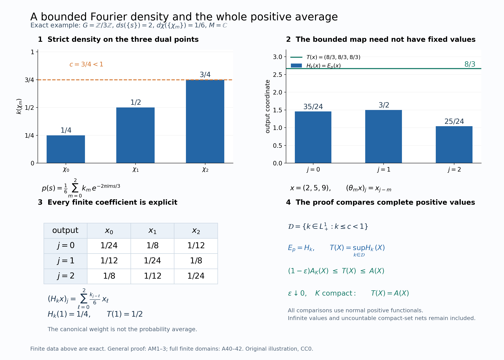

# The whole dual-action average and its finite domains

There are three different questions: which operators are fixed, what the positive orbit integral means when it is infinite, and which scalar weights come from the coefficient algebra. We answer the first two completely and identify the average with the already constructed general-group Schur weight. We then derive its scalar compositions and keep the extra realization premise of faithful invariant-weight recognition explicit.

The compact-square and paired formulas, arbitrary-group models, signs and solved exercises below preserve the sound mathematics of the earlier course lesson. A new Fourier-density comparison identifies the entire extended-positive map before modular comparison is discussed.

*Programme exposition originally written in Codex (OpenAI), September 2026; additive restoration and new bridge by GPT-6 Astra (OpenAI), Ultra, 5 October 2026. New expression is dedicated under CC0 to the extent of rights held; inherited terms remain. Human review is not asserted.*

## The dual action and the two assertions

Let $G$ be a locally compact Hausdorff abelian group, written additively, with nonzero Haar measure $ds$. Give $\widehat G$ the dual Haar measure for which

$$\widehat h(\chi)=\int_G\overline{\chi(s)}h(s)\,ds
\tag{A1}$$

extends to a unitary $L^2(G,ds)\to L^2(\widehat G,d\chi)$. For $G=\mathbb R$, $\chi_p(s)=e^{ips}$ and ordinary $ds$, this is $d\chi=dp/(2\pi)$. There is no metrizability, countability, sigma-compactness or separability hypothesis on either group, and no separability restriction on the Hilbert spaces.

Let $M\ne0$ be a von Neumann algebra, let $\alpha:G\to\operatorname{Aut}(M)$ be point-ultraweakly continuous, and put

$$N=M\rtimes_\alpha G,\qquad P=\pi_\alpha(M),\qquad
F(f)=\int_G\lambda_s\pi_\alpha(f(s))\,ds.
\tag{A2}$$

Here $\mathcal K_\alpha$ is the actual bounded, strongly* continuous compact coefficient algebra of [GDW1](OA-FLOW-GDW.md#gdw-1). The norm bound is automatic for a compact strongly* continuous operator field: each vector orbit has bounded compact image, and the full [uniform-boundedness lemma](OA-FLOW-L94.md#oa-flow.gen.bounds) gives one operator bound. On bounded sets the intrinsic and concrete strong* conventions agree by ST2. Thus this notation preserves the earlier compact sigma-strong* scope. The dual action convention is

$$\theta_\chi(\pi_\alpha(a))=\pi_\alpha(a),\qquad
\theta_\chi(\lambda_s)=\overline{\chi(s)}\lambda_s.
\tag{A3}$$

For the canonical n.s.f. operator-valued weight $T_\alpha$ constructed in the [GDA4–6](OA-FLOW-GDA.md#gda-4), we will prove

$$N^\theta=P,\qquad
\omega(T_\alpha(y))=\int_{\widehat G}\omega(\theta_\chi(y))\,d\chi
\quad(y\in N_+,\ \omega\in N_*^+).
\tag{A4}$$

The left value uses the inclusion $\widehat P_+\subset\widehat N_+$. Both sides may be infinite. Scalar n.s.f. weights need not be finite or invariant under $\alpha$.

## Exact earlier constructions

The actual harmonic inputs are [L24's Haar conventions and vector integration](OA-FLOW-L24.md#oa-flow.grp.haarconventions), [HR5 and HR8–9](OA-FLOW-HR.md#hr-05), [SP3–4](OA-FLOW-PLANCHEREL.md#scalar-plancherel-p3), and [H3–4](OA-FLOW-HARMONIC-LATE.md#l138-h3). These prove onto Plancherel with its L1/L2 integral formula, the exact dual Haar normalization, qualified product integration and finite-exponent carriers. [FF2 scalar Plancherel](OA-FLOW-FF.md#oa-flow.ff.3) fixes the displayed real-line normalization; replacing its Fourier variable by its negative preserves that Haar measure. No unrestricted product-Borel or arbitrary-net scalar convergence assertion is used.

[NR1,3,4](OA-FLOW-NR.md#oa-flow.nr.1) give the arbitrary-Hilbert standard implementation, faithful normal regular representation and complete change of representation. [AT1–3](OA-FLOW-AT.md#oa-flow.at.1) give bounded joint strong* evaluation and predual norm continuity. [CCM4](OA-FLOW-CCM.md#ccm-4) and [GDW1–2](OA-FLOW-GDW.md#gdw-1) prove compact integration, modules, products and density. Their complete scalar weights and modular generator formulas are [GDW6–7](OA-FLOW-GDW.md#gdw-6).

The concrete multiplier, Weyl and arbitrary-tensor arguments in [ND](OA-FLOW-ND.md#nd-weyl) prove

$$\{L_s,Q_\chi:s\in G,\chi\in\widehat G\}''=B(L^2(G)),
\qquad (1_H\otimes B(L^2(G)))'=B(H)\otimes1,
\tag{A5}$$

where $L_s\xi(r)=\xi(r-s)$ and $Q_\chi\xi(r)=\overline{\chi(r)}\xi(r)$. No recognition theorem for an arbitrary Weyl pair is used. The normal fixed-algebra proof below is also compatible with [NCF1–3](OA-FLOW-NCF.md#ncf-1), but retains its direct scalar-test proof.

[EP1–6](OA-FLOW-EP.md#ep-1) and [FF5](OA-FLOW-FF.md#oa-flow.ff.6) provide the whole extended cone, positive normal extensions, spectral transport, finite-output ideals and full scalar composition. [OT1–5](OA-FLOW-OT.md#ot-1) prove modular restriction and preservation of the normalized cocycle for these compositions. [GDA7–9](OA-FLOW-GDA.md#gda-7) give the finite-sandwich uniqueness theorem, full identification with GDW, and comparison of two actual dual weights. Its fixed-reference uniqueness is proved by MA4 and BC; its central-density step is proved by CZ/RF, not by an arbitrary-cocycle converse.

The new [AM1–3 Fourier-minorant bridge](OA-FLOW-AM.md#am-1) proves equality of the entire orbit average and the GDA weight. The only additional general-cocycle statement below is expressly labeled conditional, with its unresolved realization premise stated in full.

## Spectral values and normal inclusions

We use the following general spectral facts for extended-positive values. By the actual [EP2–4 proof](OA-FLOW-EP.md#ep-2) and [FF5 transport](OA-FLOW-FF.md#oa-flow.ff.6), an extended positive value has a closed finite-part subspace with projection $p$ in the algebra, a positive self-adjoint operator affiliated with the corner there, and infinity off that subspace. Conversely those data determine a unique extended positive value. These data and spectral calculus are natural under normal automorphisms. In a faithful normal representation, all vector-form values determine the extended positive element.

For a unital normal faithful inclusion $A\subset B$, the map

$$\iota:\widehat A_+\longrightarrow\widehat B_+,
\qquad \iota(h)(\omega)=h(\omega|_A)
\tag{A6}$$

is injective, preserves addition, positive scalars and sandwiches by $A$, preserves and reflects order, and preserves increasing suprema. These clauses concern unbounded values and infinite components as well as bounded operators. For clarity, positivity/order reflection follows by extending each positive normal functional of $A$ to one of $B$, using EP1. Addition, sandwiches and increasing suprema are then tested pointwise on those restrictions. EP2–4/FF5 transport the finite-part projection and the whole spectral form through the normal inclusion. These are the actual earlier proofs for the full infinite part as well.

In particular, a $\theta$-invariant value in $\widehat N_+$ has its projection onto the closed finite-part subspace and all finite-part spectral projections in $N^\theta$. Once $N^\theta=P$ is proved, the converse spectral clause reconstructs the value in $\widehat P_+$.

## A continuous spatial dual action

In the standard model $\mathcal H=L^2(G,H)$,

$$[\pi_\alpha(a)\xi](r)=\alpha_{-r}(a)\xi(r),\quad
[\lambda_s\xi](r)=\xi(r-s),\quad
[Q_\chi\xi](r)=\overline{\chi(r)}\xi(r).
\tag{A9}$$

The representation $\chi\mapsto Q_\chi$ is strongly continuous: on a compactly supported continuous vector function, compact-open convergence of characters gives uniform convergence on its support and hence $L^2$ convergence. Density and the common unitary bound extend this to every vector and convergent net.

Direct substitution gives (A3) for conjugation by $Q_\chi$. The inverse conjugation gives the same formulas for $\chi^{-1}$, so it restricts to an automorphism of $N$. Strong continuity makes this action point-ultraweakly continuous, and AT3 supplies norm-continuous predual orbits. Normality and the integrated coefficient formula give

$$\theta_\chi(F(f))=F(\overline\chi f),\qquad
(\overline\chi f)(s)=\overline{\chi(s)}f(s).
\tag{A10}$$

The scalar multiplication preserves $\mathcal K_\alpha$.

## The full fixed-point algebra

**Theorem.** $N^\theta=\pi_\alpha(M)$.

**Proof.** Coefficients are fixed by (A3). For the reverse inclusion define on $\mathcal H$

$$[V_s\xi](r)=U_s\xi(r+s),\qquad [W\xi](r)=U_r\xi(r).
\tag{A11}$$

For $W$, both this formula and the formula with $U_r^*$ preserve continuity and compact support of vector functions. Pointwise norm equality gives two inverse isometries on a dense class, hence inverse unitaries on $\mathcal H$. No countable basis is chosen.

Every constant $b'\in M'$ commutes with the regular generators. Also $V_s$ commutes with both families: for coefficients use $U_s\alpha_{-(r+s)}(a)=\alpha_{-r}(a)U_s$; for translations use commutativity of $G$. Thus all elements of $N$ commute with these operators.

Take $x\in N^\theta$. It commutes with every $Q_\chi$. The unitary $W$ commutes with $Q_\chi$ and satisfies

$$WV_sW^*=1_H\otimes R_s,\qquad R_s\xi(r)=\xi(r+s),
\tag{A12}$$

because $U_rU_sU_{r+s}^*=1$. Hence $WxW^*$ commutes with $Q_\chi$ and $R_s=L_{-s}$. Equation (A5) gives $WxW^*=a\otimes1$ for some $a\in B(H)$.

We still have to prove $a\in M$. For fixed $b'\in M'$, commutation of $x$ with $b'\otimes1$ says that $a\otimes1$ commutes with the multiplication operator $W(b'\otimes1)W^*$, whose value is $U_r b'U_r^*$. For fixed $\xi,\eta\in H$, the scalar function

$$k(r)=\langle[a,U_r b'U_r^*]\xi,\eta\rangle
\tag{A13}$$

is continuous and bounded. Testing the zero operator between $h\otimes\xi$ and $g\otimes\eta$ gives $\int h(r)\overline{g(r)}k(r)\,dr=0$ for every $h,g\in C_c(G)$. Every compactly supported continuous test function occurs as $h\overline g$, by choosing a cutoff $g=1$ on the support of $h$. Therefore $k=0$ everywhere: a nonzero value, rotated by a scalar phase, has positive real part in a neighborhood, and a nonnegative nonzero cutoff there would give a positive integral.

In particular $k(0)=0$ for every fixed $b',\xi,\eta$, so $[a,b']=0$ for every $b'\in M'$. Thus $a\in M''=M$ and

$$x=W^*(a\otimes1)W=\pi_\alpha(a).
\tag{A14}$$

The proof tests one continuous scalar function at a time; it does not intersect uncountably many conull sets. Normal regular-model comparison gives the assertion in every permitted model. $\square$

## Normal averages over compact sets

For a compact $K\subset\widehat G$, define $A_K:N\to N$ by

$$\omega(A_K(y))=\int_K\omega(\theta_\chi(y))\,d\chi
\quad(\omega\in N_*,\ y\in N).
\tag{A15}$$

To construct it with normality included, integrate the norm-continuous predual orbit:

$$B_K\omega=\int_K\omega\circ\theta_\chi\,d\chi\in N_*,
\qquad \|B_K\omega\|\le |K|\,\|\omega\|.
\tag{A16}$$

Its range on $K$ is norm compact. Finite covers by inverse images of norm balls and disjoint Borel refinements give simple functions approximating it uniformly. Their integrated differences have norm at most $|K|$ times the uniform error; completeness defines the Banach integral, independent of those approximations. This also gives linearity in $\omega$. Consequently $A_K=B_K^*$ is bounded and normal. Positivity follows from (A15) tested on positive elements and functionals. In particular $A_K(1)=|K|1$.

Only a compact continuous orbit segment was integrated. No global Bochner measurability or separability of the predual was assumed.

## The positive average and its value algebra

For $y\in N_+$ define

$$A(y)=\sup_{K\subset\widehat G\ \mathrm{compact}}A_K(y)
\quad\text{in }\widehat N_+.
\tag{A17}$$

Compact sets are directed by finite unions, and $A_K(y)$ increases with $K$. Equivalently,

$$A(y)(\omega)=\sup_K\int_K\omega(\theta_\chi(y))\,d\chi
=\int_{\widehat G}\omega(\theta_\chi(y))\,d\chi.
\tag{A18}$$

For a continuous nonnegative function the nonnegative Radon integral is the supremum of its compact integrals, possibly infinity. Each compact evaluation is norm continuous on $N_*^+$. The supremum is lower semicontinuous, and directedness makes it additive and positively homogeneous. Thus it defines an extended positive value by the actual EP2–3 closed-form reconstruction. The same interchange of directed suprema gives additivity and positive homogeneity of $A$ in $y$.

Haar translation of the compact sets gives

$$\theta_\rho(A(y))=A(y),\qquad A(\theta_\rho(y))=A(y)
\quad(\rho\in\widehat G).
\tag{A19}$$

Both equations may be tested at each normal positive functional in (A18). The projection onto the closed finite-part subspace and finite-part spectral projections of $A(y)$ are therefore in $N^\theta=P$. The converse spectral clause stated above reconstructs a unique value in $\widehat P_+$ whose inclusion is (A17). From now on $A(y)$ denotes this coefficient-valued element.

## Normality, bimodularity, and faithfulness

If $y_i\uparrow y$ is a bounded increasing positive net, normality of each $A_K$ gives

$$\begin{aligned}
A(y)(\omega)&=\sup_K\omega(A_K(y))
=\sup_K\sup_i\omega(A_K(y_i))\\
&=\sup_i\sup_K\omega(A_K(y_i))
=\sup_i A(y_i)(\omega).
\end{aligned}\tag{A20}$$

The two middle suprema range over the same numbers. This proves normality in $\widehat N_+$ and, by (A6), in $\widehat P_+$. It does not invoke an arbitrary-net monotone convergence theorem for merely measurable scalar functions.

For $p\in P$, fixedness gives $A_K(p^*yp)=p^*A_K(y)p$. Taking suprema, tested against $z\mapsto\omega(p^*zp)$, gives

$$A(p^*yp)=p^*A(y)p.
\tag{A21}$$

Reflection through (A6) proves this identity in $\widehat P_+$. Thus $A$ is a normal operator-valued weight.

If $A(y)=0$, then every continuous nonnegative function $\chi\mapsto\omega(\theta_\chi(y))$ has zero integral. Positivity of Haar measure on open sets makes it identically zero. Its identity value is $\omega(y)$; normal positive functionals separate $N_+$, so $y=0$. This proves faithfulness. Semifiniteness still requires the finite-output domain constructed next.

## Plancherel with an arbitrary Hilbert target

**Lemma.** For any Hilbert space $E$ and continuous compactly supported $v:G\to E$, its vector Fourier integral exists for every character and

$$\int_{\widehat G}\left\|\int_G\overline{\chi(s)}v(s)\,ds\right\|^2d\chi
=\int_G\|v(s)\|^2\,ds.
\tag{A22}$$

**Proof.** Take finite $1/n$-nets in the compact vector range, and let $e_n$ be the orthogonal projections onto their finite-dimensional spans. Then $e_nv\to v$ uniformly, and on the fixed compact support in $L^1$ and $L^2$. The vector integral exists by compact finite approximation. Each $e_nv$ is a finite sum of scalar $L^1\cap L^2$ functions times orthonormal vectors; scalar Plancherel proves (A22) for it.

Tensoring the scalar Fourier unitary with $1_E$ first on the algebraic Hilbert tensor product and completing gives a unitary on the full vector $L^2$ spaces. Thus the finite-dimensional transforms converge in $L^2$ to the Plancherel transform of $v$. Their integral formulas converge uniformly in $\chi$ to the integral formula for $v$, since the error is bounded by $\|e_nv-v\|_1$. These limits agree almost everywhere: choose a subsequence whose squared $L^2$ errors are summable, and integrate their nonnegative sum to obtain almost-everywhere convergence. This countable argument concerns these integrable norm functions in the localizable Haar space and does not require sigma finiteness of the whole space. The unitary norm identity now gives (A22). $\square$

The sequential approximation concerns one compact vector range; it places no countability restriction on $E$ or $G$.

## The average of every compact coefficient square

**Theorem.** For every $f\in\mathcal K_\alpha$,

$$A(F(f)^*F(f))
=\pi_\alpha\left(\int_G f(s)^*f(s)\,ds\right)\in P_+.
\tag{A23}$$

Consequently $A$ is semifinite, with $F(\mathcal K_\alpha)\subset\mathfrak n_A$.

**Proof.** For each $\xi\in\mathcal H$ the function

$$v_{f,\xi}(s)=\lambda_s\pi_\alpha(f(s))\xi
\tag{A24}$$

is norm continuous and compactly supported. Use strong continuity of $\lambda$, boundedness on the compact coefficient support, and sigma-strong continuity of the coefficient in the faithful normal regular representation. By (A10) its vector Fourier integral is $\theta_\chi(F(f))\xi$. Formula (A22) therefore gives

$$\begin{aligned}
A(F(f)^*F(f))(\omega_\xi)
&=\int_{\widehat G}\|\theta_\chi(F(f))\xi\|^2\,d\chi\\
&=\int_G\|\pi_\alpha(f(s))\xi\|^2\,ds\\
&=\left\langle\pi_\alpha\left(\int_G f(s)^*f(s)\,ds\right)\xi,\xi\right\rangle.
\end{aligned}\tag{A25}$$

The second line removes the unitary $\lambda_s$. Normality of $\pi_\alpha$ and the compact ultraweak product integral justify the last line. Its value is bounded and positive. Equality holds for every vector, so extended-form uniqueness identifies the left value with this bounded operator. There is no residual infinite subspace or untested unbounded extension. Injectivity in (A6) proves (A23) in $\widehat P_+$.

The finite-output left ideal contains $F(\mathcal K_\alpha)$, an ultraweakly dense algebra by the actual [GDW2](OA-FLOW-GDW.md#gdw-2)/CCM4 cutoff and compact-bump argument. This is semifiniteness. Together with the preceding results it makes $A$ n.s.f. $\square$

Using Plancherel with the entire regular Hilbert space as target avoids interchanging three integrals over possibly nonsigma-finite spaces. It also avoids an operator-norm Fourier transform of $f$.

## Equality on every positive element

**Theorem.** $A=T_\alpha$ on $N_+$, as maps to $\widehat P_+$. Thus (A4) holds with every infinite value included.

**Proof.** AM1 identifies GDA's strict scalar normal minorants exactly with the Fourier densities $k\in L^1(\widehat G)_+$ satisfying $k\leq c<1$. AM2 identifies their bounded normal Schur maps with the maps $y\mapsto\int k(\chi)\theta_\chi(y)\,d\chi$. Equality on generators is used only at this bounded-normal stage. AM3 compares the two whole suprema: every such density is at most one, and every $(1-\varepsilon)1_K$ belongs to the family. Thus, on each $y\in N_+$ and each normal positive functional, their supremum is exactly (A18). EP1–4 faithfully identify the full coefficient-valued elements. This proves $A=T_\alpha$ without assuming uniqueness from compact-square data or equality of modular groups. $\square$

The old scalar comparison remains valid as a separate route to the scalar composition. Formula (A23) and the GDA6 compact-square theorem give

$$\Phi(F(f)^*F(f))=\widetilde\varphi(F(f)^*F(f)).
\tag{A31}$$

Here $\Phi=\widehat{\varphi_P}\circ A$. For every $f\in\mathfrak b_\varphi=\mathscr B_\varphi$ the values are finite by GDW1/6. The finite-ideal property makes $F(f)^*F(z)F(f)$ an equality test after polarization; the two resulting finite sandwich functionals are bounded and normal. Their equality extends to every middle operator by bounded density. Equations (A28) and (A30), proved below, are the exact two modular-generator hypotheses of GDA7. Its complete central-density/spectral-cut argument then yields $\Phi=\widetilde\varphi$ on all $N_+$, including infinite values. Thus the scalar route is retained at its actual finite-domain theorem; it is not used as an unproved uniqueness theorem for operator-valued weights.

## The paired integral

For $f,g\in\mathcal K_\alpha$, polarization of (A23) in the finite linear domain gives

$$\dot T_\alpha(F(g)^*F(f))
=\pi_\alpha\left(\int_G g(s)^*f(s)\,ds\right).
\tag{A32}$$

Indeed multiply the squares for $f+i^k g$ by $i^k/4$ and sum for $k=0,1,2,3$. Only the cross term with $g^*$ on the left survives. All four squares have bounded weight values, so their linear combination lies in $\mathfrak m_{T_\alpha}$.

For $\omega\in N_*^+$ the scalar paired orbit is absolutely integrable, and

$$\int_{\widehat G}\omega(\theta_\chi(F(g)^*F(f)))\,d\chi
=\omega\left(\pi_\alpha\left(\int_G g(s)^*f(s)\,ds\right)\right).
\tag{A33}$$

Pointwise Cauchy–Schwarz for $\omega$, then integral Cauchy–Schwarz and (A4), bounds the absolute integral by

$$\omega(T_\alpha(F(g)^*F(g)))^{1/2}
\,\omega(T_\alpha(F(f)^*F(f)))^{1/2}<\infty.
\tag{A34}$$

Polarization proves (A33). General normal functionals are complex linear combinations of four positive normal functionals, so the assertion holds for them too. It makes no operator-norm Bochner integrability claim.

## The full finite-output and scalar domains

Put $\mathfrak n_A=\{x\in N:A(x^*x)\in P_+\}$ and $\mathfrak m_A=\operatorname{span}\mathfrak n_A^*\mathfrak n_A$. The exact bounded-value test is

$$x\in\mathfrak n_A
\quad\Longleftrightarrow\quad
\sup_{K\subset\widehat G\ {\rm compact}}\|A_K(x^*x)\|<\infty .
\tag{A40}$$

Indeed a bounded extended value majorizes each compact average. Conversely a common bound $C$ gives $A(x^*x)(\omega)\leq C\|\omega\|$ for every normal positive $\omega$, and EP3's full bounded-element criterion applies. Thus this is a test of the whole ideal, not an assertion that compact coefficients exhaust it. EP6 proves that $\mathfrak n_A$ is a left ideal and a right $P$-module, and that $\mathfrak m_A$ has its unique $P$-valued linear extension $\dot A$.

For arbitrary $x,z\in\mathfrak n_A$ and $\omega\in N_*^+$, pointwise positive-functional Cauchy–Schwarz and scalar integral Cauchy–Schwarz give

$$\int_{\widehat G}|\omega(\theta_\chi(z^*x))|\,d\chi
\leq A(z^*z)(\omega)^{1/2}A(x^*x)(\omega)^{1/2}<\infty .
\tag{A41}$$

Polarize the four finite square identities. Their integrable scalar functions give
$\int\omega(\theta_\chi(z^*x))d\chi=\omega(\dot A(z^*x))$.
CP4/EP1 express any normal functional as a complex linear combination of four positive normal functionals, so this conclusion holds on the full predual. It asserts scalar absolute integrability, not operator-norm Bochner integrability.

For any normal weight $\rho$ on $M$, including zero, nonfaithful and nonsemifinite cases, set $\widehat\rho=\widehat{\rho\circ\pi_\alpha^{-1}}\circ A$, where the outer extension is EP5. AM3 and GDA8 identify this with the same previously defined dual construction. Its exact ideals are

$$\mathfrak n_{\widehat\rho}
=\{x:\widehat{\rho\circ\pi_\alpha^{-1}}(A(x^*x))<\infty\},
\qquad
\mathfrak n^0_{\widehat\rho}
=\{x:\widehat{\rho\circ\pi_\alpha^{-1}}(A(x^*x))=0\}.
\tag{A42}$$

EP5–6 give normality, additivity and positive homogeneity on the whole cone, including infinite values. GDA8 proves preservation of arbitrary-index sums. No faithfulness or semifiniteness is inferred for an arbitrary input. For faithful n.s.f. input, EP6 proves both properties by its finite positive coefficient cutoffs; GDA8 identifies the entire GDW GNS/finite domain.

## The adjoint convention from balanced weights

We will need the exact identity

$$[D(\Psi\circ\operatorname{Ad}v):D\Psi]_t
=v^*\sigma_t^\Psi(v),\qquad \operatorname{Ad}v(y)=vyv^*,
\tag{A7}$$

for an n.s.f. weight $\Psi$ and a unitary $v$. It follows from the actual [BC4–5 balanced-weight/naturality proof](OA-FLOW-BC.md#bc-4), also applied with this same convention in [GDA8](OA-FLOW-GDA.md#gda-8), as follows. Set $\chi=\Psi\oplus\Psi$ on $A\overline\otimes M_2$, $d=\operatorname{diag}(v,1)$ and
$\eta=\chi\circ\operatorname{Ad}d=(\Psi\circ\operatorname{Ad}v)\oplus\Psi$. The balanced off-diagonal formula fixes $1\otimes e_{21}$ for $\sigma^\chi$, because the two corner weights coincide. Naturality gives

$$\begin{aligned}
\sigma_t^\eta(1\otimes e_{21})
&=d^*\sigma_t^\chi(d(1\otimes e_{21})d^*)d\\
&=\sigma_t^\Psi(v^*)v\otimes e_{21}.
\end{aligned}\tag{A8}$$

Indeed $d e_{21}d^*=v^*\otimes e_{21}$, and the diagonal coefficient modular action and multiplicativity give the second line. The off-diagonal identity for $\eta$ identifies that coefficient as $[D\Psi:D(\Psi\circ\operatorname{Ad}v)]_t$. Taking adjoints gives (A7). Thus no new inner-perturbation theorem with an implicit convention is added. BC4–5 are the exact earlier prerequisites, including their whole finite-ideal and relative-operator domains.

## Modular generators of a scalar average

Fix an n.s.f. weight $\varphi$ on $M$ and put $\varphi_P=\varphi\circ\pi_\alpha^{-1}$. Here scalar weights on extended-positive values denote their EP5 extensions. The full EP6 composition theorem makes

$$\Phi=\varphi_P\circ A
\tag{A26}$$

n.s.f. For a unitary $p\in P$, bimodularity gives
$\Phi\circ\operatorname{Ad}p=(\varphi_P\circ\operatorname{Ad}p)\circ A$.
OT5's exact two-composition cocycle theorem and (A7) give

$$\begin{aligned}
p^*\sigma_t^\Phi(p)
&=[D(\Phi\circ\operatorname{Ad}p):D\Phi]_t\\
&=[D(\varphi_P\circ\operatorname{Ad}p):D\varphi_P]_t
=p^*\sigma_t^{\varphi_P}(p).
\end{aligned}\tag{A27}$$

Multiplication by $p$ gives equality on all unitaries of $P$. Their complex linear span is $P$: a self-adjoint contraction $a$ equals $(u+u^*)/2$ for $u=a+i(1-a^2)^{1/2}$, and real and imaginary parts handle general elements. Hence

$$\sigma_t^\Phi(\pi_\alpha(a))=\pi_\alpha(\sigma_t^\varphi(a)).
\tag{A28}$$

The scalar phases in $\theta_\chi(\lambda_s)$ cancel in conjugation, so
$A_K(\lambda_s y\lambda_s^*)=\lambda_s A_K(y)\lambda_s^*$.
Suprema give the same identity for $A$. As $\operatorname{Ad}\lambda_s$ restricts to $\alpha_s$ on the coefficients,

$$\Phi\circ\operatorname{Ad}\lambda_s=(\varphi\circ\alpha_s)_P\circ A.
\tag{A29}$$

These weights are n.s.f. Apply the same two derivative rules, together with normal-isomorphism naturality, to obtain

$$\begin{aligned}
\lambda_s^*\sigma_t^\Phi(\lambda_s)
&=\pi_\alpha([D(\varphi\circ\alpha_s):D\varphi]_t),\\
\sigma_t^\Phi(\lambda_s)
&=\lambda_s\pi_\alpha([D(\varphi\circ\alpha_s):D\varphi]_t).
\end{aligned}\tag{A30}$$

An abelian locally compact group is unimodular, so this is precisely the dual-weight generator formula with $\Delta_G(s)^{it}=1$. The derivative remains to the right of $\lambda_s$; no factor commutation was used.

## Invariance and Haar normalization

Equation (A19) gives $T_\alpha\circ\theta_\chi=T_\alpha$. In particular every constructed faithful n.s.f. dual weight is invariant:

$$\widetilde\varphi\circ\theta_\chi
=\varphi_P\circ T_\alpha\circ\theta_\chi=\widetilde\varphi.
\tag{A35}$$

Since $A\circ\theta_\chi=A$ on the entire cone, the same calculation gives $\widehat\rho\circ\theta_\chi=\widehat\rho$ for every normal input $\rho$, with no faithfulness or finite-value restriction. For faithful n.s.f. inputs, GDA9 and GDA7 also prove injectivity: equality of their dual weights makes the image of their normalized relative cocycle one; faithfulness of $\pi_\alpha$ and fixed-reference whole-cone uniqueness identify the two base weights. This is an injectivity assertion about existing weights, not existence for an arbitrary invariant target weight.

## Haar normalization, including the infinite value

If $G$ is discrete with singleton Haar mass $c$, its dual is compact with total dual Haar mass $c^{-1}$. Plancherel applied to $1_{\{0\}}$ verifies the normalization: its squared norm is $c$, and its transform is constant $c$, so $c=c^2|\widehat G|$. Formula (A4) gives the bounded average $T_\alpha$ and the conditional expectation $E_\alpha=cT_\alpha$, in agreement with GDA6 on all positives.

If $G$ is nondiscrete, H3 biduality makes $\widehat G$ noncompact. Here is the elementary compact/discrete implication being used. If $G$ is discrete, its character group is the closed subgroup of $\mathbb T^G$ determined by the character equations; CF4 product compactness and the equality of compact-open with finite-coordinate convergence make it compact. If a group $C$ is compact, the neighborhood $\sup_{t\in C}|\chi(t)-1|<1$ in its dual contains only the identity: every nontrivial subgroup of the circle has a power at distance at least one from $1$. Indeed, for an angle $0<|u|\leq\pi$, either $|u|\geq\pi/3$, or its least positive multiple reaching $\pi/3$ lies below $2\pi/3$. Thus the dual of $C$ is discrete. Apply this to $C=\widehat G$ and then H3 to get the contrapositive. A noncompact locally compact group has infinite Haar measure: choose a relatively compact nonempty open set $V$ and compact neighborhood $C$ containing its closure. Choose successive $t_j$ outside the finite unions $t_i(C-C)$. The translates $t_j+V$ are pairwise disjoint, each with the same positive measure. Hence (A4) gives $T_\alpha(1)=\infty1$. Dividing by infinite total Haar mass does not define an expectation.

Rescaling $ds$ to $b\,ds$ changes the dual measure to $b^{-1}d\chi$ in (A1). The entire averaging weight on the same named crossed-product algebra therefore changes by $b^{-1}$, consistently with (A23) and the exact paired-measure normalization.

## Three group topologies

**Three blocks and an unnormalized Haar measure.** Take $G=\mathbb Z/3\mathbb Z$ with mass $2$ at every point and the trivial action on $M_2(\mathbb C)$. With $\zeta=e^{2\pi i/3}$, the three characters identify

$$N\cong M_2(\mathbb C)\oplus M_2(\mathbb C)\oplus M_2(\mathbb C),\qquad
\lambda_s\pi(a)\longmapsto(\zeta^{js}a)_{j=0}^2.
\tag{A36}$$

The dual action cyclically permutes the blocks, so its fixed points are diagonal triples. Each dual point has mass $1/6$. Thus for a positive triple the common block of $T_\alpha(x_0,x_1,x_2)$ is

$$\frac16(x_0+x_1+x_2).
\tag{A37}$$

For example the positive matrices

$$x_0=\begin{pmatrix}2&1\\1&2\end{pmatrix},\quad
x_1=\begin{pmatrix}3&i\\-i&1\end{pmatrix},\quad
x_2=\begin{pmatrix}1&0\\0&4\end{pmatrix}
$$

have common output block $\tfrac16\begin{pmatrix}6&1+i\\1-i&7\end{pmatrix}$. The first two inputs have positive leading entry and positive determinant; the third is positive diagonal. The output normalization is half the usual expectation.

For $f(0)=e_{11}$, $f(1)=e_{12}$ and $f(2)=e_{21}$, one has $F(f)_j=2\sum_s\zeta^{js}f(s)$. Orthogonality $\sum_{j=0}^2\zeta^{j(s-t)}=3\,1_{s=t}$ gives the common block

$$T_\alpha(F(f)^*F(f)):
\qquad 2\sum_s f(s)^*f(s)=\begin{pmatrix}4&0\\0&2\end{pmatrix}.
\tag{A38}$$

**A finite square in an infinite real-line average.** For $M=\mathbb C$, $G=\mathbb R$ and the measures in (A1), put $f(s)=(1-|s|)_+$. Then

$$T_\alpha(F(f)^*F(f))
=\int_{-1}^1(1-|s|)^2\,ds=\frac23.
\tag{A39}$$

In the scalar Fourier representation, $F(f)$ is multiplication by
$\widehat f(p)=(\sin(p/2)/(p/2))^2$, with value one at zero. For $p\ne0$, integration by parts gives $2\int_0^1(1-s)\cos(ps)ds=2(1-\cos p)/p^2$, equal to the displayed square; continuity gives the value at zero. The dual action translates the Fourier variable; its positive average integrates $|\widehat f|^2$ against $dp/(2\pi)$, which equals $2/3$ by the proved identity. The identity operator has infinite average. Finite coefficient squares therefore coexist with an unbounded averaging weight.

**A compact nonmetrizable group.** Let $I$ be uncountable and $G=\prod_{i\in I}\mathbb Z/2\mathbb Z$ with probability Haar measure, acting trivially on $\mathbb C$. Its dual is the discrete direct sum $D=\bigoplus_{i\in I}\mathbb Z/2\mathbb Z$. One way to see the finite support is that a character into $\{1,-1\}$ has an open kernel; a basic identity neighborhood in that kernel restricts only finitely many coordinates. Characters on the resulting finite quotient give exactly the elements of $D$. The transform of $1_G$ is $1_{\{0\}}$, so Plancherel forces counting dual Haar measure.

Fourier transformation identifies $N$ with $\ell^\infty(D)$. The dual action translates coordinates, and its fixed elements are constants. For a character $\gamma\in D$, $f=\gamma$ is a compact coefficient and $F(f)$ is the coordinate projection at $\gamma$. Its dual translates are all coordinate projections. Their finite sums increase to $1$, so the average is $1$, agreeing with $\int_G|\gamma|^2=1$. The indexing set is the finite subsets of uncountable $D$; no sequence can enumerate those coordinates. This model realizes both nonmetrizable groups and arbitrary Hilbert dimension in the theorem.

## Problems with complete solutions

### Recover the finite normalization

In the three-block model compute $T_\alpha(1)$ and $E_\alpha(1)$. Explain the effect of using probability measure on the dual.

**Solution.** Formula (A37) gives common block $3/6=1/2$, so $T_\alpha(1)=\tfrac121$ and $E_\alpha=2T_\alpha$ is unital. Probability measure on the three-point dual has masses $1/3$, whereas Plancherel-dual measure for the chosen $ds$ has masses $1/6$. The probability average is the expectation. The canonical weight includes the chosen original Haar normalization.

### Check the character convention

Verify (A3) and (A10). What changes if the multiplier is $\chi(r)$ instead of $\overline{\chi(r)}$?

**Solution.** Scalar multiplication commutes with the coefficient field. The scalar factor in $Q_\chi\lambda_sQ_\chi^*$ is
$\overline{\chi(r)}\chi(r-s)=\overline{\chi(s)}$.
This gives (A3), and passage through the compact normal integral gives (A10). The opposite multiplier implements $\theta_{\chi^{-1}}$. Inversion preserves Haar measure on the abelian dual group, so that relabeling leaves the average unchanged. The generator convention must still remain consistent throughout each calculation.

### Where normality comes from

Why does (A20) require no arbitrary-net form of the scalar monotone convergence theorem? Relate it to the uncountable model.

**Solution.** Each $A_K$ is normal because it is the adjoint of a bounded predual map. It already preserves the given bounded increasing operator net's supremum. The remaining calculation exchanges two suprema of the same scalar numbers. In the uncountable discrete dual model, compact sets are finite and the net of finite sums of coordinate projections has supremum $1$. A sequence visiting only countably many coordinates has a smaller supremum. The compact-set net retains all coordinates.

### A fixed coefficient need not have full support

Assume $G$ is nondiscrete. For $a\in P_+$, compute $T_\alpha(a)$ in terms of its support projection $s(a)$.

**Solution.** Each integrand in (A4) is $\omega(a)$. Infinite dual Haar measure gives infinity if $\omega(a)>0$ and zero if $\omega(a)=0$. The latter is equivalent to $\omega(s(a))=0$: use
$a\ge n^{-1}1_{[1/n,\infty)}(a)$ and normality on the increasing spectral supports; the converse follows from $a\le\|a\|s(a)$. Thus $T_\alpha(a)=\infty s(a)$, with zero value on the complementary support. A nonzero coefficient need not have value $\infty1$. That is the special case $s(a)=1$.

### The modular coefficient stays on the right

Derive (A30) from (A29), rewrite it with coefficient on the left of $\lambda_s$, and identify what is still needed to compare full weights.

**Solution.** The inner rule gives the derivative as $\lambda_s^*\sigma_t^\Phi(\lambda_s)$, and composition gives it as $\pi_\alpha(c_t(s))$, with $c_t(s)=[D(\varphi\circ\alpha_s):D\varphi]_t$. Multiplying on the left by $\lambda_s$ yields $\lambda_s\pi_\alpha(c_t(s))$. Covariance rewrites this as $\pi_\alpha(\alpha_s(c_t(s)))\lambda_s$. Equality of the modular automorphisms would still allow a central density change between scalar weights. GDA7's finite quadratic and normal-sandwich argument removes that ambiguity for the scalar weights. AM1–3 independently identifies the operator-valued maps on their entire positive domains.

## The precise remaining faithful-recognition premise

**Conditional faithful-weight recognition.** In this paragraph assume the following additional realization theorem UR: for every faithful n.s.f. $\varphi$ on $M$, every strongly* continuous unitary family $v_t\in M$ with $v_{t+r}=v_t\sigma_t^\varphi(v_r)$ is $[D\psi:D\varphi]_t$ for a faithful n.s.f. $\psi$. Under UR, an n.s.f. weight $\Omega$ on $N$ is dual-invariant exactly when it is the constructed dual $\widetilde\psi$ of a unique n.s.f. weight $\psi$ on $M$.

The direction from a dual weight is (A35). For the converse fix an n.s.f. $\varphi$ on $M$. If $\Omega$ is dual-invariant, normalized derivative naturality and invariance of $\widetilde\varphi$ give

$$\theta_\chi([D\Omega:D\widetilde\varphi]_t)
 =[D\Omega:D\widetilde\varphi]_t.$$

The full fixed-algebra theorem puts this unitary in $\pi_\alpha(M)$. Pull it back as $v_t$. The faithful normal identification $\pi_\alpha$ and its inverse preserve bounded strong-star convergence, so $v_t$ is strongly continuous. The normalized cocycle law and the actual modular restriction on $\pi_\alpha(M)$ give

$$v_{t+r}=v_t\sigma_t^\varphi(v_r).$$

The explicit additional premise UR constructs an n.s.f. $\psi$ with $[D\psi:D\varphi]_t=v_t$. The actual [GDA9](OA-FLOW-GDA.md#gda-9) normalized comparison of constructed dual weights gives

$$[D\widetilde\psi:D\widetilde\varphi]_t
 =\pi_\alpha([D\psi:D\varphi]_t)
 =[D\Omega:D\widetilde\varphi]_t.$$

The actual fixed-reference normalized-derivative uniqueness proved in GDA7 identifies $\Omega=\widetilde\psi$ on the whole positive cone. Faithfulness of $\pi_\alpha$ and the same uniqueness on $M$ prove uniqueness of $\psi$. This proves the faithful-weight characterization conditional on UR, and proves injectivity of the already constructed dual-weight map without UR. The unconditional reduction for any invariant $\Omega$ is the displayed cocycle $v_t$ in $M$; its realization is the remaining step. Current BC/OT/GDA construct and compare cocycles of actual weights and expressly do not prove UR. Neither a conventions contract nor the approved source's citation supplies its missing programme proof. Nonfaithful recognition and recognition of arbitrary covariant systems remain separate.

## Sources and remaining scope

The antecedents are Haagerup, [*On the dual weights for crossed products of von Neumann algebras I*](https://journals.msp.org/mscand/article/view/1879), Lemma 3.6 and Theorem 3.7, and [*On the dual weights for crossed products of von Neumann algebras II*](https://journals.msp.org/mscand/article/view/1878), Theorem 1.1, both in Math. Scand. 43 (1978). The first paper's invariant-weight converse explicitly imports a cocycle-realization theorem; it is not an omitted elementary consequence of averaging.

The exact approved edition of Takesaki, [*Theory of Operator Algebras II*](https://doi.org/10.1007/978-3-662-10451-4), supplies context in X.2.3(i)–(ii) and the compact-set integral (29) in the proof of X.2.6. Its general cocycle converse is stated as VIII.3.8 in this edition; the reference to VIII.3.7 in the X.2 proof does not change that actual locator. No book citation substitutes for its still separate programme proof. The current GDA/GDW proofs and the new AM bridge retain the useful freely accessible source route and independent local constructions.

This chapter establishes the full dual fixed algebra, the whole-positive-cone normal faithful semifinite average, its bounded-output and scalar finite domains, compact-square and paired formulas, exact Haar normalization, invariance for all normal input weights, and injectivity for faithful n.s.f. input weights. The stated faithful-recognition converse has precisely the extra UR premise. Nonfaithful invariant-weight recognition, second-dual weight comparison, arbitrary dual-system recognition and nonabelian averaging are not inferred. If $M=0$, all algebras and values are zero, giving the vacuous endpoint.

## A Fourier density and the complete positive average

This original illustration accompanies [AM1–3](OA-FLOW-AM.md#am-1), particularly (AM4), (AM8)–(AM13), and the [full finite-domain formulas (A40)–(A42)](OA-FLOW-DA.md#da-domains). It separates a bounded normal Schur map from the supremum which is the operator-valued weight. The finite example illustrates the identities; the fourth panel gives the comparison proved for every locally compact Hausdorff abelian group in AM3.

Take \(G=\mathbb Z/3\mathbb Z\), give each point Haar mass \(2\), and take \(M=\mathbb C\) with trivial action. Let \(\chi_m(s)=e^{2\pi ims/3}\). Paired Plancherel normalization gives each point of \(\widehat G\) mass \(1/6\), since
\[
 \sum_{m=0}^{2}\left|2\sum_{s=0}^{2}\overline{\chi_m(s)}f(s)\right|^2
       =12\sum_{s=0}^{2}|f(s)|^2.
\]
Use the reflected Fourier labels \(j\mapsto-j\), as in (A36): then \(L(G)=\mathbb C^3\) and \(\lambda_s\) has coordinate \(\chi_j(s)\). Reflection preserves the dual Haar measure. Multiplication of this coordinate by \(\overline{\chi_m(s)}\) gives \(\chi_{j-m}(s)\), so the dual action has the exact sign
\[
       (\theta_m x)_j=x_{j-m}\qquad(j,m\pmod3).
\]
The nonnegative density \(k=(1/4,1/2,3/4)\) satisfies \(k\leq c=3/4<1\). Formula (AM4) gives
\[
 p(s)=\frac16\sum_{m=0}^{2}k_m e^{-2\pi ims/3},\qquad
 p(0)=\frac14,\quad
 p(1)=-\frac1{16}+\frac{i\sqrt3}{48},\quad
 p(2)=-\frac1{16}-\frac{i\sqrt3}{48}.
\]
Indeed \(e^{-2\pi i/3}=-1/2-i\sqrt3/2\) and \(e^{-4\pi i/3}=-1/2+i\sqrt3/2\), which give the displayed real and imaginary parts. AM1 proves the corresponding strict normal minorant; AM2 proves equality of bounded normal maps \(E_p=H_k\), not merely agreement of weights on a core.

The exact matrix in the third panel acts on the column \(x=(2,5,9)\):
\[
 (H_kx)_j=\frac16\sum_{m=0}^{2}k_mx_{j-m},\qquad
 H_k=
 \begin{pmatrix}
  1/24&1/8&1/12\\
  1/12&1/24&1/8\\
  1/8&1/12&1/24
 \end{pmatrix},\qquad
 H_kx=(35/24,3/2,25/24).
\]
Those unequal coordinates show why an individual Schur minorant need not take values in the fixed algebra. The complete Haar average does:
\[
 T(x)=\frac16\sum_{m=0}^{2}\theta_m(x)
       =(8/3,8/3,8/3),\qquad
 H_k(1)=\frac14,\quad T(1)=\frac12.
\]
Here the probability conditional expectation is \(2T\). The canonical operator-valued weight uses the paired Haar measure, so it is not automatically unital. This is the normalization checked for matrix coefficients in the restored lesson's first model and first solved problem.

For the arbitrary-group assertion, define \(\mathcal D=\{k\in L^1(\widehat G)_+:k\leq c\text{ for some }c<1\}\). AM1 identifies exactly these densities with GDA's strict normal minorants, and AM2 identifies their maps. For \(X\geq0\), every normal positive functional \(\omega\), every compact \(K\subseteq\widehat G\), and \(0<\varepsilon<1\), AM3 gives
\[
 (1-\varepsilon)A_K(X)(\omega)
 \leq T(X)(\omega)
 =\sup_{k\in\mathcal D}H_k(X)(\omega)
 \leq A(X)(\omega).
\]
First let \(\varepsilon\downarrow0\), then take the directed supremum over all compact \(K\). The result is \(T(X)(\omega)=A(X)(\omega)\), including \(+\infty\). Equality for every \(\omega\) identifies the full extended-positive elements. This is not a sequential exhaustion of a possibly non-sigma-compact group. Its finite-output ideal is exactly the bounded compact-average test (A40), and (A41) proves scalar absolute integrability for every pair from that ideal.

For context see Haagerup, [*On the dual weights for crossed products of von Neumann algebras II*](https://journals.msp.org/mscand/article/view/1878), Math. Scand. 43 (1978), Theorem 1.1, and Takesaki, [*Theory of Operator Algebras II*, X.2.3 and X.2.6](https://doi.org/10.1007/978-3-662-10451-4). Neither citation replaces the local AM proof or its exact earlier programme inputs.

Reproduce the PNG, SVG and exact rational data by running [render_fourier_minorants.py](../assets/dual-action-averaging/render_fourier_minorants.py). The renderer uses rational arithmetic for the matrix, outputs and Haar masses, fixes its SVG identifier salt, omits the SVG date, and writes UTF-8 JSON with LF newlines. The diagram is a two-dimensional exact algebraic illustration; a three-dimensional scene would not add information. Original illustration and caption: GPT-6 Astra (OpenAI), Ultra, 5 October 2026; new expression is dedicated under CC0 to the extent of rights held.
