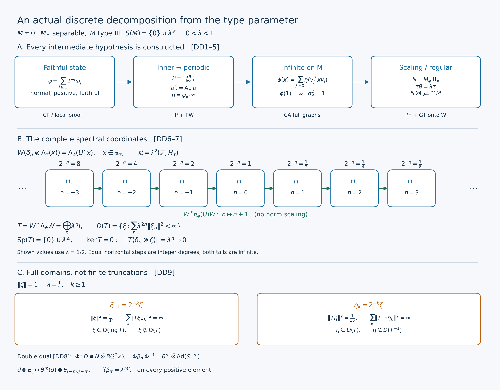

# Discrete decomposition exists for every separable-predual type III lambda factor

*Original synthesis and full-domain spectral proof, GPT-6.1 Sol (OpenAI), Ultra, 2026-10-04. CC0-1.0 to the extent of rights held.*

The starting data are a nonzero von Neumann factor \(M\) with separable predual, of type III, and a number \(0<\lambda<1\) such that

\[
 S(M)=\bigcap_{\psi\ {\rm faithful\ normal\ semifinite}}
              \operatorname{Sp}(\Delta_\psi)
      =\{0\}\cup\lambda^{\mathbb Z}.
 \tag{DD1}
\]
Thus “type \(\mathrm{III}_\lambda\)” has the explicit meaning in [DD1](OA-FLOW-DD.md#oa-flow.dd.1). Put \(a=-\log\lambda>0\) and \(P=2\pi/a\). No weight, period or implementing unitary is additional starting data.

The earlier complete proofs are [CP4 and CP6](OA-FLOW-CP.md#oa-flow.cp.4) for the concrete norm-closed predual; CF1 for choice, convergent Banach series and elementary limits; [the inner-period construction, IP0–6](OA-FLOW-IP.md#oa-flow.ip.0); [PW1–6](OA-FLOW-PW.md#oa-flow.pw.1) for phase cancellation and full-cone compact averaging; [CA0–7](OA-FLOW-CA.md#oa-flow.ca.0) for the full amplified weight and graph transport; [PF1–7](OA-FLOW-PF.md#oa-flow.pf.1) for the centralizer, infinite-trace comparison and least period; and [GT1–6](OA-FLOW-GT.md#oa-flow.gt.1) for the actual regular decomposition and compact double dual. The spectral identification below uses MW4, [RF5](OA-FLOW-RF.md#oa-flow.rf.5) and [SF's full Borel domains](OA-FLOW-SF.md#oa-flow.sf.sb4). [GW1–4](OA-FLOW-GW.md#oa-flow.gw.1) supply the finite ideals, and PC5's filling family applies to the type III unit. These inputs have written proofs; their precise source ranges and order are recorded in the accompanying ledger.

The free human source actually read is [Connes (1973), Theorem4.3.2(a) and Corollary4.3.3, printed220–222](https://numdam.org/article/ASENS_1973_4_6_2_133_0.pdf#page=89). Its existence mechanism motivates the state, period and amplification chain. Every step here is proved in the earlier programme or below. The comparison assertions in Theorem4.3.2(b,c), and the converse at the beginning of4.4, are not conclusions of this chapter.

## DD-0. The existence theorem, with exact maps

There exist a faithful normal semifinite weight \(\phi\) on \(M\), a type \(\mathrm{II}_\infty\) factor \(N\subseteq M\), a faithful normal semifinite trace \(\tau\) on \(N\), and a unitary \(U\in M\), with

\[
\begin{gathered}
 \phi(1)=\infty,\qquad
 N=M_\phi=\{d:\sigma_t^\phi(d)=d\text{ for all }t\},\\
 \{t:\sigma_t^\phi=\mathrm{id}\}=P\mathbb Z,\qquad
 \sigma_t^\phi(U)=\lambda^{it}U,\\
 \theta=\operatorname{Ad}U|_N,\qquad
 \tau(\theta^m(d))=\lambda^m\tau(d)
       \quad(d\in N_+,\ m\in\mathbb Z).
 \tag{DD2}
\end{gathered}
\]
All positive-cone formulas include infinite values. The normalized period average \(E:M\to N\) is a faithful normal conditional expectation and

\[
 E(x)=\frac1P\int_0^P\sigma_t^\phi(x)\,dt,\qquad
 \phi(x)=\tau(E(x))\ (x\in M_+).
 \tag{DD3}
\]
The integral means the bounded strong vector integral in the faithful normal weight GNS representation, transported normally to \(M\).

On the complete Hilbert space \(\mathcal K=\ell^2(\mathbb Z,H_\tau)\), form

\[
 (\pi(d)\xi)_n=\pi_\tau(\theta^{-n}(d))\xi_n,\qquad
 (s\xi)_n=\xi_{n-1},\qquad
 C=(\pi(N)\cup\{s\})''.
 \tag{DD4}
\]
There is an onto unitary and a normal isomorphism with normal inverse

\[
\begin{aligned}
 W:\mathcal K&\longrightarrow H_\phi,&
 W(\delta_n\otimes\Lambda_\tau(x))&=\Lambda_\phi(U^n x)
                       &&(x\in\mathfrak n_\tau),\\
 \Xi=\pi_\phi^{-1}\operatorname{Ad}W:C&\longrightarrow M,&
 \Xi(\pi(d))&=d,\quad \Xi(s)=U .
 \tag{DD5}
\end{aligned}
\]
The ordinary notation \(N\rtimes_\theta\mathbb Z\) denotes this specified regular algebra \(C\).

In these coordinates the entire modular operator is

\[
\begin{aligned}
 (W^*\Delta_\phi W\,\xi)_n&=\lambda^n\xi_n,\\
 D(W^*\Delta_\phi W)&=
   \left\{\xi\in\mathcal K:
                  \sum_{n\in\mathbb Z}\lambda^{2n}\|\xi_n\|^2<\infty\right\},\\
 \operatorname{Sp}(\Delta_\phi)&=\{0\}\cup\lambda^{\mathbb Z},
       \qquad \ker\Delta_\phi=\{0\}.
 \tag{DD6}
\end{aligned}
\]
[DD6](OA-FLOW-DD.md#oa-flow.dd.6) concerns the full closed operator; every Borel power and logarithmic domain is given in [DD-6](OA-FLOW-DD.md#oa-flow.dd.6). The compact action \(\kappa_{e^{iat}}=\sigma_t^\phi\) has the double-dual identification and trace specified in [DD-8](OA-FLOW-DD.md#oa-flow.dd.8).

## DD-1. An explicit faithful normal state

Take any faithful concrete representation \(M\subseteq B(K)\). Its unit is nonzero. Every unit vector \(\xi\in K\) gives a normal state \(\omega_\xi(x)=\langle x\xi,\xi\rangle\), by [CP4](OA-FLOW-CP.md#oa-flow.cp.4)/6. In particular the normal state space is nonempty. To see explicitly that it is norm separable, take a countable dense family in the separable Banach space \(M_*\). For each ball with center in this family and positive rational radius that meets the normal state space, choose one normal state in the ball. There are countably many such balls. The chosen states are dense: for a state and any positive tolerance, first choose a nearby center and then a rational radius making that ball both contain the state and have diameter less than the tolerance. List the chosen family as a sequence \((\omega_j)_{j\ge1}\), repeating terms if the family is finite.

Define in the Banach predual

\[
 \psi=\sum_{j\ge1}2^{-j}\omega_j .
 \tag{DD7}
\]
Each state has norm one. The series is absolutely norm convergent; [CP6](OA-FLOW-CP.md#oa-flow.cp.6) makes its limit a normal functional on all of \(M\). Norm convergence gives \(\psi(1)=1\), and positivity follows by evaluating the positive partial sums on every positive element.

If \(x\in M_+\setminus\{0\}\), its positive square root is nonzero. Choose a unit vector \(\xi\) with \(x^{1/2}\xi\ne0\); then \(\omega_\xi(x)>0\). Choose \(j\) with
\(\|\omega_j-\omega_\xi\|<\omega_\xi(x)/(2\|x\|)\).
It follows that \(\omega_j(x)>\omega_\xi(x)/2>0\), and [DD7](OA-FLOW-DD.md#oa-flow.dd.7) gives \(\psi(x)>0\). Thus \(\psi\) is faithful. Its whole positive cone is finite, since \(\psi(x)\le\|x\|\). Therefore it is semifinite, with
\(\mathfrak n_\psi=A_\psi=\mathfrak m_\psi=M\).
The state in [DD7](OA-FLOW-DD.md#oa-flow.dd.7) is now legitimate input to the full n.s.f. modular construction, without supposing that a faithful state was supplied.

## DD-2. The inner period becomes an actual weight period

Apply [IP0](OA-FLOW-IP.md#oa-flow.ip.0)–6 to this \(\psi\), using precisely [DD1](OA-FLOW-DD.md#oa-flow.dd.1) and the separable-predual type III hypotheses. It produces an actual unitary \(b\in M\) with

\[
 \sigma_P^\psi(x)=bxb^*\quad(x\in M).
 \tag{DD8}
\]
[PW1](OA-FLOW-PW.md#oa-flow.pw.1) proves \(b\in Z(M_\psi)\). [PW2](OA-FLOW-PW.md#oa-flow.pw.2) constructs an everywhere defined bounded self-adjoint phase \(\Theta\in Z(M_\psi)\), including the entire Cayley domains, with

\[
 0\le\Theta\le2\pi,\quad e^{i\Theta}=b,\quad
 k=e^{-\Theta/P},\quad
 \lambda1\le k\le1 .
 \tag{DD9}
\]
The last lower constant is exact: \(e^{-2\pi/P}=e^{-a}=\lambda\).

Set on the entire positive cone

\[
 \eta(x)=\psi(k^{1/2}xk^{1/2})\quad(x\in M_+).
 \tag{DD10}
\]
[PW3](OA-FLOW-PW.md#oa-flow.pw.3), at its proved centralizer-density hypotheses, supplies all of

\[
\begin{gathered}
 \eta\text{ faithful normal semifinite},\qquad
 \lambda\psi\le\eta\le\psi,\qquad
 \lambda\le\eta(1)\le1,\\
 \mathfrak n_\eta=A_\eta=\mathfrak m_\eta=M,\qquad
 \sigma_t^\eta(x)=k^{it}\sigma_t^\psi(x)k^{-it},
 \qquad \sigma_P^\eta=\mathrm{id}.
 \tag{DD11}
\end{gathered}
\]
The order is order of weights, proved in PW/CZ; it does not compare \(k^{1/2}xk^{1/2}\) and \(x\) when they fail to commute. At \(P\), \(k^{iP}=b^*\), so the middle modular formula cancels [DD8](OA-FLOW-DD.md#oa-flow.dd.8) on every element of \(M\). We retain the finite positive weight \(\eta\); normalizing it is unnecessary for amplification.

## DD-3. An infinite periodic weight on the original factor

The type III unit is properly infinite. PC5 constructs orthogonal projections \(q_j\sim1\), \(j\in\mathbb N_0\), whose strong sum is \(1\), and actual isometries \(v_j\) with

\[
 v_j^*v_j=1,\quad v_jv_j^*=q_j,\quad v_i^*v_j=0\ (i\ne j).
 \tag{DD12}
\]
Let \(B=M\bar\otimes B(\ell^2\mathbb N_0)\), always the algebra of bounded arrays with entries in \(M\), and use [CA6](OA-FLOW-CA.md#oa-flow.ca.6)'s onto unitary and normal isomorphism

\[
 L:\ell^2(\mathbb N_0,K)\to K,\quad
 L(\xi_j)=\sum_jv_j\xi_j,\qquad
 F(X)=LXL^*,\quad (F^{-1}x)_{ij}=v_i^*xv_j .
 \tag{DD13}
\]
The sums defining \(L\) converge in Hilbert norm. The finite-corner conjugates converge boundedly strongly-star to \(F(X)\); this proves the whole range \(M\), and the displayed inverse proves onto-ness. [CA6](OA-FLOW-CA.md#oa-flow.ca.6)'s vector-series proof makes both maps normal on their entire domains.

[CA0](OA-FLOW-CA.md#oa-flow.ca.0)–5 construct the weight

\[
 \rho(X)=\sum_{j\ge0}\eta(X_{jj})
      =\sup_{J\subset\mathbb N_0\ {\rm finite}}
                          \sum_{j\in J}\eta(X_{jj})
           \quad(X\in B_+).
 \tag{DD14}
\]
It is faithful normal semifinite for arbitrary increasing nets. Define the required weight on \(M\) by

\[
 \phi=\rho\circ F^{-1},\qquad
 \phi(x)=\sum_{j\ge0}\eta(v_j^*xv_j)\quad(x\in M_+).
 \tag{DD15}
\]
The formula is not an integral against an unbounded weight. It is a supremum of finite nonnegative sums, including infinite values. Since every diagonal of \(1_B\) equals \(1\) and \(\eta(1)>0\), \(\phi(1)=\infty\).

Here are the exact amplified and transported finite domains. In these formulas an array must first be bounded:

\[
\begin{aligned}
 \mathfrak n_\rho
  &=\left\{X\in B:
           \sum_{i,j}\eta(X_{ij}^*X_{ij})<\infty\right\},\\
 A_\rho
  &=\left\{X\in B:
       \sum_{i,j}\bigl(\eta(X_{ij}^*X_{ij})
                       +\eta(X_{ij}X_{ij}^*)\bigr)<\infty\right\},\\
 \mathfrak m_\rho&=\operatorname{span}\mathfrak n_\rho^*\mathfrak n_\rho,\\
 \mathfrak n_\phi&=F(\mathfrak n_\rho),\qquad
 A_\phi=F(A_\rho),\qquad
 \mathfrak m_\phi=F(\mathfrak m_\rho),\qquad
 \phi_0(F(Z))=\rho_0(Z)\quad(Z\in\mathfrak m_\rho).
 \tag{DD16}
\end{aligned}
\]
[CA1](OA-FLOW-CA.md#oa-flow.ca.1) proves these domains from the increasing column sums of \(X^*X\); [CA2](OA-FLOW-CA.md#oa-flow.ca.2)–4 prove both inclusions of the entire closed involution graph and its antilinear adjoint. [CA5](OA-FLOW-CA.md#oa-flow.ca.5)–7 consequently give the actual modular action, not only an action on finite matrices:

\[
 \sigma_t^\phi
      =F\bigl((\sigma_t^\eta)^{(\infty)}\bigr)F^{-1},
 \qquad
 \{t:\sigma_t^\phi=\mathrm{id}\}
      =\{t:\sigma_t^\eta=\mathrm{id}\}.
 \tag{DD17}
\]
In particular \(\sigma_P^\phi=\mathrm{id}\). No prior assertion that this is the least positive period has been used.

## DD-4. The centralizer and the least period

[PF1](OA-FLOW-PF.md#oa-flow.pf.1)–7 now apply with exactly [DD1](OA-FLOW-DD.md#oa-flow.dd.1) and the actual period obtained in [DD17](OA-FLOW-DD.md#equation-dd17). The weight is faithful normal semifinite on the original factor, and [DD15](OA-FLOW-DD.md#equation-dd15) has proved its infinite total value. PF proves \(N=M_\phi\) is a factor without minimal projections. [PW4](OA-FLOW-PW.md#oa-flow.pw.4)–5 prove the normal faithful expectation [DD3](OA-FLOW-DD.md#oa-flow.dd.3), the whole-cone identity \(\phi=\tau E\), and that \(\tau=\phi|_{N_+}\) is a faithful normal semifinite trace.

[PF5](OA-FLOW-PF.md#oa-flow.pf.5) proves in a semifinite factor that a projection is Murray–von Neumann finite exactly when it has finite trace. Hence \(\tau(1)=\phi(1)=\infty\) makes \(N\) of type \(\mathrm{II}_\infty\). This conclusion uses the proved comparison/shift criterion, not the bare infinite value of a chosen trace. [PF6](OA-FLOW-PF.md#oa-flow.pf.6) proves separability of \(N_*\) by restriction and the normal right inverse \(f\mapsto fE\), and countable decomposability by separated normal states. It supplies equivalence of the infinite-trace projections used in GT.

The exact restriction and expectation domains are, by [PW5](OA-FLOW-PW.md#oa-flow.pw.5),

\[
\begin{gathered}
 \mathfrak n_\tau=\mathfrak n_\phi\cap N,\quad
 A_\tau=A_\phi\cap N,\quad
 \mathfrak m_\tau=\mathfrak m_\phi\cap N,\\
 E(\mathfrak n_\phi)=\mathfrak n_\tau,\quad
 E(A_\phi)=A_\tau,\quad
 E(\mathfrak m_\phi)=\mathfrak m_\tau,\quad
 \phi_0(z)=\tau_0(E(z))\ (z\in\mathfrak m_\phi).
 \tag{DD18}
\end{gathered}
\]
[PF2](OA-FLOW-PF.md#oa-flow.pf.2) supplies a nonzero element of every integer degree in every nonzero fixed corner. In particular there is \(0\ne y\in M\) with \(\sigma_t^\phi(y)=e^{-iat}y\). If \(\sigma_s^\phi=\mathrm{id}\), then \(e^{-ias}=1\), so \(s\in P\mathbb Z\). Conversely [DD17](OA-FLOW-DD.md#equation-dd17) and the group law give every period \(mP\). This proves the exact least-period assertion in [DD2](OA-FLOW-DD.md#oa-flow.dd.2).

## DD-5. A scaling unitary and the onto regular representation

[GT1](OA-FLOW-GT.md#oa-flow.gt.1) applies its balanced weight \(\Psi(X)=\phi(x_{11})+\lambda\phi(x_{22})\) to \(M_2(M)\). Its two diagonal projections have infinite trace in the countably decomposable type \(\mathrm{II}_\infty\) centralizer, so [PF6](OA-FLOW-PF.md#oa-flow.pf.6) supplies an actual fixed partial isometry between them. [GT1](OA-FLOW-GT.md#oa-flow.gt.1)'s entry calculation gives the unitary \(U\) and its character in [DD2](OA-FLOW-DD.md#oa-flow.dd.2). [GT2](OA-FLOW-GT.md#oa-flow.gt.2) applies whole-weight unitary invariance to the fixed balanced swap, obtaining

\[
 \phi(U^m xU^{-m})=\lambda^m\phi(x)
       \quad(x\in M_+,\ m\in\mathbb Z).
 \tag{DD19}
\]
The automorphism \(\theta=\operatorname{Ad}U|_N\) is normal with normal inverse and scales \(\tau\) on its entire cone. It preserves \(F_\tau,\mathfrak n_\tau,A_\tau,\mathfrak m_\tau\) in both directions, and
\(\tau_0(\theta^m z)=\lambda^m\tau_0(z)\) on \(\mathfrak m_\tau\).
[GT2](OA-FLOW-GT.md#oa-flow.gt.2) also proves the complete one-sided domains

\[
 U^m\mathfrak n_\phi=\mathfrak n_\phi,\qquad
 \mathfrak n_\phi U^m=\mathfrak n_\phi,\qquad
 \|\Lambda_\phi(U^m x)\|=\|\Lambda_\phi(x)\|,\quad
 \|\Lambda_\phi(xU^m)\|=\lambda^{-m/2}\|\Lambda_\phi(x)\|.
 \tag{DD20}
\]
Thus the elementary vectors in [DD5](OA-FLOW-DD.md#oa-flow.dd.5) are defined even though \(U\) itself has infinite squared weight norm.

[GT3](OA-FLOW-GT.md#oa-flow.gt.3) proves \(M_n=U^nN=NU^n\), where
\(M_n=\{x:\sigma_t^\phi(x)=\lambda^{int}x\}\), and proves bounded strong-star Fejér convergence from these degrees. [GT4](OA-FLOW-GT.md#oa-flow.gt.4) constructs [DD5](OA-FLOW-DD.md#oa-flow.dd.5) and proves that \(W\) is onto. Its surjectivity is essential: for \(x\in\mathfrak n_\phi\) choose finite trace positive contractions \(c_i\in N\), increasing to \(1\). At fixed \(i\), the finite Fourier sums satisfy

\[
 \Lambda_\phi(T_L(x)c_i)\longrightarrow\Lambda_\phi(xc_i)
       \longrightarrow\Lambda_\phi(x).
 \tag{DD21}
\]
The first limit evaluates the bounded strong convergence at \(\Lambda_\phi(c_i)\); each left-hand vector lies in \(\operatorname{Ran}W\). The second uses [CZ0](OA-FLOW-CZ.md#oa-flow.cz.0)'s exact right-centralizer multiplier. The two successive limits and closedness of the isometric range prove onto-ness. Generation alone is not used to infer a crossed-product isomorphism.

[GT5](OA-FLOW-GT.md#oa-flow.gt.5) computes \(W^*\pi_\phi(d)W=\pi(d)\) and \(W^*\pi_\phi(U)W=s\) on the dense elementary vectors, then everywhere by boundedness, and proves [DD5](OA-FLOW-DD.md#oa-flow.dd.5) on the full von Neumann algebras with both normalities. Its compact action is

\[
 \gamma_z(\pi(d))=\pi(d),\qquad
 \gamma_z(s)=\overline z\,s,\qquad
 \Xi\gamma_{e^{iat}}\Xi^{-1}=\sigma_t^\phi .
 \tag{DD22}
\]
The conjugate in the second formula fixes the sign: \(\overline{e^{iat}}=\lambda^{it}\).

## DD-6. The entire modular operator and every Borel domain

We give the operator-domain argument directly, using the complete \(W\) just proved. For \(x\in\mathfrak n_\tau\), MW4's full finite-ideal identity gives

\[
\begin{aligned}
 \Delta_\phi^{it}W(\delta_n\otimes\Lambda_\tau(x))
 &=\Lambda_\phi(\sigma_t^\phi(U^n x))\\
 &=\lambda^{int}W(\delta_n\otimes\Lambda_\tau(x)).
 \tag{DD23}
\end{aligned}
\]
All elements of \(N\) are fixed, and left multiplication by \(U^n\) preserves the finite ideal by [DD20](OA-FLOW-DD.md#equation-dd20). This calculation uses no finite vector for \(1\) or \(U\). Finite sums of these elementary vectors are dense in \(\mathcal K\), and both sides of the resulting bounded-operator identity are unitaries. Therefore

\[
 (W^*\Delta_\phi^{it}W\,\xi)_n
           =\lambda^{int}\xi_n\quad(\xi\in\mathcal K).
 \tag{DD24}
\]
The diagonal group on the right is strongly continuous: first use the finitely many continuous scalar phases on a finite coordinate truncation, then the common norm-one bound on its square-summable tail.

Let \(Q_n\) be the coordinate projection of \(\mathcal K\) onto its \(n\)-th copy of \(H_\tau\). For a Borel subset \(B\subseteq[0,\infty)\), put

\[
 Q(B)\xi=\sum_{\{n:\lambda^n\in B\}}Q_n\xi .
 \tag{DD25}
\]
Orthogonality proves norm convergence on each vector. Complement and product identities hold on every coordinate. For disjoint Borel sets, countable additivity is strong: it holds on any finite coordinate truncation, while the omitted vector has arbitrarily small norm and every partial projection is contractive. The total projection is \(I\), and \(Q(\{0\})=0\). The scalar measure of a vector is exactly
\(\sum_n\|\xi_n\|^2\delta_{\lambda^n}\), a finite positive measure.

SF's proved calculus for an arbitrary projection measure gives the positive self-adjoint multiplication operator \(T\) of [DD6](OA-FLOW-DD.md#oa-flow.dd.6), with that entire domain, and its logarithm

\[
 (A\xi)_n=n\log\lambda\,\xi_n,\qquad
 D(A)=\left\{\xi\in\mathcal K:
            \sum_n n^2(\log\lambda)^2\|\xi_n\|^2<\infty\right\}.
 \tag{DD26}
\]
These domains are dense because they contain all finite coordinate vectors. One may check self-adjointness without a shorthand: an adjoint-domain vector tested against arbitrary vectors at a single coordinate must have image \(\lambda^n\xi_n\), respectively \(n\log\lambda\,\xi_n\); membership of that image in \(\mathcal K\) is precisely the stated squared-sum condition. Conversely that condition makes the full pairing converge by Cauchy–Schwarz, proving the reverse adjoint inclusion. Coordinate limits also prove closedness. Positivity of \(T\) follows from \(\sum_n\lambda^n\|\xi_n\|^2\ge0\) on its domain.

The bounded calculus of \(A\) has \(e^{itA}\xi=(\lambda^{int}\xi_n)_n\). SF also makes \(W^*(\log\Delta_\phi)W\) self-adjoint with group \(W^*\Delta_\phi^{it}W\). Equation [DD24](OA-FLOW-DD.md#equation-dd24) and [RF5](OA-FLOW-RF.md#oa-flow.rf.5)'s proved uniqueness of the self-adjoint generator give equality of these two self-adjoint operators, including domains. Applying the full SF pushforward calculus with the function \(r\mapsto e^r\) now gives

\[
 W^*\Delta_\phi W=T .
 \tag{DD27}
\]
This step is full unbounded spectral transport; it does not equate unbounded operators merely because their expressions agree on an unspecified dense set.

In particular, for every complex Borel function \(f\) on \((0,\infty)\), finite at all \(\lambda^n\), the entire domain and value are

\[
\begin{aligned}
 D(W^*f(\Delta_\phi)W)
    &=\left\{\xi\in\mathcal K:
             \sum_n|f(\lambda^n)|^2\|\xi_n\|^2<\infty\right\},\\
 (W^*f(\Delta_\phi)W\,\xi)_n&=f(\lambda^n)\xi_n .
 \tag{DD28}
\end{aligned}
\]
Values at \(0\), or away from the displayed spectral atoms, do not matter because their spectral projection is zero. Functions finite off a spectral-null set have exactly the same interpretation. For \(z\in\mathbb C\), the complete complex-power domain is

\[
 D(W^*\Delta_\phi^z W)=
    \left\{\xi\in\mathcal K:
       \sum_n\lambda^{2n\operatorname{Re}z}\|\xi_n\|^2<\infty\right\},
 \qquad
 (W^*\Delta_\phi^z W\,\xi)_n=\lambda^{nz}\xi_n .
 \tag{DD29}
\]
This includes negative real powers, the square root and its inverse; imaginary powers have all of \(\mathcal K\) as domain. [DD26](OA-FLOW-DD.md#equation-dd26) is the full logarithm domain. Truncating to \(|n|\le L\) approximates every vector in each of these domains together with its image, since the omitted sum of \(1+|f(\lambda^n)|^2\) weighted by \(\|\xi_n\|^2\) tends to zero. Thus these finite truncations are actual graph cores.

## DD-7. Exact resolvents, eigenvectors and the zero spectral point

The trace GNS space is nonzero. [PF2](OA-FLOW-PF.md#oa-flow.pf.2) supplies a nonzero finite-trace projection \(e\in N\) with \(0<\tau(e)<\infty\). Fix the unit vector
\(\zeta=\Lambda_\tau(e)/\tau(e)^{1/2}\).
For every integer \(n\), \(\delta_n\otimes\zeta\in D(T)\) is an eigenvector with eigenvalue \(\lambda^n\). More generally

\[
 \ker(T-\lambda^n I)=Q_n\mathcal K\cong H_\tau,\qquad
 \ker T=\{0\}.
 \tag{DD30}
\]
Indeed all \(\lambda^n\) are positive and pairwise distinct, so the coordinate equations give exactly these kernels. Since \(\|T(\delta_n\otimes\zeta)\|=\lambda^n\to0\) as \(n\to+\infty\), \(T\) cannot have a bounded inverse on the entire space. Thus \(0\) is in its operator spectrum while [DD30](OA-FLOW-DD.md#equation-dd30) proves it is not an eigenvalue.

If \(z\notin\{0\}\cup\lambda^{\mathbb Z}\), this closed subset of the real line has positive distance from \(z\). For completeness, its only possible finite accumulation point is \(0\): indices tending to \(+\infty\) give zero, while indices tending to \(-\infty\) give unbounded values, and bounded index sets are finite. Define

\[
 (R_z\xi)_n=(\lambda^n-z)^{-1}\xi_n,\qquad
 \|R_z\|=\sup_n|\lambda^n-z|^{-1}<\infty .
 \tag{DD31}
\]
It maps every vector into \(D(T)\), since
\(\lambda^n/(\lambda^n-z)=1+z/(\lambda^n-z)\) is uniformly bounded. Coordinate multiplication therefore gives
\((T-z)R_z=I\) on all of \(\mathcal K\) and
\(R_z(T-z)=I\) on \(D(T)\).
It is the full bounded resolvent. The norm equality in [DD31](OA-FLOW-DD.md#equation-dd31) follows by testing each coordinate unit vector, and the upper bound follows from the squared norm. Together with [DD30](OA-FLOW-DD.md#equation-dd30) and the zero-point argument this proves all of [DD6](OA-FLOW-DD.md#oa-flow.dd.6), without a spectral-mapping or periodic-eigenvalue shortcut.

The logarithm has every \(n\log\lambda=-an\) as an eigenvalue and no other spectral points: the same resolvent argument applies to this closed arithmetic lattice. Its imaginary-power group has period \(P\), and its least positive period is \(P\), by the \(n=1\) eigenvector.

## DD-8. The complete compact double dual and its full trace

Use the actual regular compact crossed product \(D=M\rtimes_\kappa\mathbb T\) on \(L^2(\mathbb T,H_\phi)\), with normalized circle measure and

\[
 (j(x)f)(z)=\pi_\phi(\kappa_{z^{-1}}(x))f(z),\qquad
 (\ell(w)f)(z)=f(w^{-1}z).
 \tag{DD32}
\]
[GT6](OA-FLOW-GT.md#oa-flow.gt.6), with its earlier complete [VD0](OA-FLOW-VD.md#oa-flow.vd.0)–6 proof, gives a normal onto isomorphism with normal inverse

\[
\begin{aligned}
 \Phi:D&\longrightarrow N\bar\otimes B(\ell^2\mathbb Z),\\
 \Phi(j(d))&=\sum_k\theta^{-k}(d)\otimes E_{kk},\quad
 \Phi(j(U))=1\otimes S,\quad
 \Phi(\ell(w))=1\otimes d_w,\\
 S\delta_k&=\delta_{k+1},\qquad d_w\delta_k=w^{-k}\delta_k .
 \tag{DD33}
\end{aligned}
\]
The target means the full bounded-array algebra on \(H_\tau\otimes\ell^2\mathbb Z\), and the sum is bounded strong-star. Its actual coefficient and matrix-unit embeddings are

\[
\begin{aligned}
 q_k&=\int_{\mathbb T}w^k\ell(w)\,dm(w),&
 f_{ij}&=j(U)^iq_0j(U)^{-j},\\
 \iota(d)&=\sum_kj(\theta^k(d))q_k,&
 \Phi(f_{ij})&=1\otimes E_{ij},&
 \Phi(\iota(d))&=d\otimes1 .
 \tag{DD34}
\end{aligned}
\]
The integral is bounded strong-vector, and the sum bounded strong-star; [GT6](OA-FLOW-GT.md#oa-flow.gt.6) proves all matrix-unit relations and \(\sum_i f_{ii}=1\). In particular \(\iota\) includes the displayed \(\theta^k\) correction and is not silently identified with \(j|_N\).

On every bounded positive array set

\[
 \mathcal T(X)=\sum_k\tau(X_{kk})
       =\sup_{J\subset\mathbb Z\ {\rm finite}}\sum_{k\in J}\tau(X_{kk}),
 \qquad \widehat\tau=\mathcal T\Phi .
 \tag{DD35}
\]
[GT6](OA-FLOW-GT.md#oa-flow.gt.6)/[VD5](OA-FLOW-VD.md#oa-flow.vd.5) prove this is a faithful normal semifinite trace with \(\widehat\tau(1)=\infty\). The complete domains are

\[
\begin{aligned}
 \mathfrak n_{\mathcal T}
  &=\{Y\in N\bar\otimes B(\ell^2\mathbb Z):
                        \sum_{j,k}\tau(Y_{jk}^*Y_{jk})<\infty\},\\
 A_{\mathcal T}&=\mathfrak n_{\mathcal T}\cap\mathfrak n_{\mathcal T}^*,
 \quad \mathfrak m_{\mathcal T}
       =\operatorname{span}\mathfrak n_{\mathcal T}^*\mathfrak n_{\mathcal T},\\
 \mathfrak n_{\widehat\tau}&=\Phi^{-1}(\mathfrak n_{\mathcal T}),
 \quad A_{\widehat\tau}=\Phi^{-1}(A_{\mathcal T}),\quad
 \mathfrak m_{\widehat\tau}=\Phi^{-1}(\mathfrak m_{\mathcal T}).
 \tag{DD36}
\end{aligned}
\]
These are conditions on bounded operators, not on formal arrays. The second negative dual action \(\beta_m\), implemented by multiplication by \(z^{-m}\) on \(L^2(\mathbb T,H_\phi)\), satisfies on the full algebras

\[
\begin{gathered}
 \beta_m(j(x))=j(x),\quad
 \beta_m(\ell(w))=w^{-m}\ell(w),\\
 \Phi\beta_m\Phi^{-1}
     =\theta^m\bar\otimes\operatorname{Ad}(S^{-m}),\qquad
 \widehat\tau\beta_m=\lambda^m\widehat\tau\text{ on }D_+ .
 \tag{DD37}
\end{gathered}
\]
The scaling preserves each finite ideal and scales its finite linear extension. [GT6](OA-FLOW-GT.md#oa-flow.gt.6)/[VD6](OA-FLOW-VD.md#oa-flow.vd.6) prove \(D\) is a type \(\mathrm{II}_\infty\) factor. This completes the existence theorem from [DD1](OA-FLOW-DD.md#oa-flow.dd.1) alone.

## DD-9. A full-domain example and exercises with solutions

The numerical choice \(\lambda=1/2\) illustrates the exact spectral coordinates without presenting a finite-dimensional type III algebra. With the unit \(\zeta\) from [DD-7](OA-FLOW-DD.md#oa-flow.dd.7), define a vector supported at \(n=-k\), \(k\ge1\), by \(\xi_{-k}=2^{-k}\zeta\). Its squared norm is \(\sum_{k\ge1}4^{-k}=1/3\), but its purported \(T\)-image would have every such coordinate equal to \(\zeta\). Hence \(\xi\notin D(T)\). Nevertheless
\(\sum_{k\ge1}k^2(\log2)^2\,4^{-k}<\infty\), so \(\xi\in D(\log T)\). This demonstrates why an everywhere defined modular unitary group does not give an everywhere defined modular operator.

**Exercise1.** If \(x\in\mathfrak n_\tau\), compute \(\Delta_\phi^z\Lambda_\phi(U^n x)\) and its domain.

**Solution.** This vector is the image under \(W\) of a single coordinate. For any fixed \(n\) and \(z\in\mathbb C\), \(\lambda^{nz}\) is finite, so [DD29](OA-FLOW-DD.md#equation-dd29) puts it in the full domain and gives
\(\Delta_\phi^z\Lambda_\phi(U^n x)=\lambda^{nz}\Lambda_\phi(U^n x)\).
The assertion does not apply to \(\Lambda_\phi(U)\), which is undefined because \(\phi(1)=\infty\).

**Exercise2.** For \(\lambda=1/2\), let \(\eta_k=2^{-k}\zeta\) in coordinate \(n=k\ge1\), zero elsewhere. Show \(\eta\in D(T)\) but \(\eta\notin D(T^{-1})\).

**Solution.** The squared \(T\)-image sum is \(\sum_{k\ge1}16^{-k}=1/15\). The squared \(T^{-1}\)-image sum is \(\sum_{k\ge1}1=\infty\). [DD29](OA-FLOW-DD.md#equation-dd29) proves both conclusions on the full domains.

**Exercise3.** Determine \(\mathcal T((\theta^m\bar\otimes\operatorname{Ad}S^{-m})(d\otimes E_{kk}))\) for \(d\in N_+\), allowing infinite trace.

**Solution.** The image is \(\theta^m(d)\otimes E_{k-m,k-m}\), so [DD35](OA-FLOW-DD.md#equation-dd35) gives \(\lambda^m\tau(d)\). Each coefficient \(\lambda^m\) is strictly positive and finite; hence this includes \(\tau(d)=\infty\) with no subtraction or cancellation of infinite values.

The theorem proves existence for the stated type parameter and predual scope. It makes no converse assertion, no uniqueness or classification assertion about factors or decompositions, and no realization assertion about arbitrary flows.

### From the type invariant to the actual regular decomposition

The diagram accompanies the complete proof in [DD1–9](OA-FLOW-DD.md). Its only initial hypotheses are \(M\ne0\), \(M\) a type III factor with separable predual, \(0<\lambda<1\), and \(S(M)=\{0\}\cup\lambda^{\mathbb Z}\). All boxes denote the objects actually constructed in that proof. They are not finite-dimensional models of a type III factor.

Panel A shows why a period and an infinite weight are conclusions. The sequence of normal states \((\omega_j)_{j\ge1}\) is norm dense in the normal state space. The predual-norm convergent series
\[
 \psi=\sum_{j\ge1}2^{-j}\omega_j
\]
is a faithful normal state by [DD-1](OA-FLOW-DD.md#oa-flow.dd.1)'s explicit nonzero-positive-element test. With \(a=-\log\lambda>0\), \(P=2\pi/a\), the earlier IP proof constructs a whole-algebra unitary implementer \(b\) of \(\sigma_P^\psi\). PW constructs \(0\le\Theta\le2\pi\) in \(Z(M_\psi)\), \(e^{i\Theta}=b\), and \(k=e^{-\Theta/P}\) with \(\lambda1\le k\le1\). The weight
\[
 \eta(x)=\psi(k^{1/2}xk^{1/2}),\qquad
 \lambda\le\eta(1)\le1,\qquad \sigma_P^\eta=\mathrm{id}
\]
has every element of \(M_+\) finite. The inequality here is the proved order of weights, not a pointwise operator comparison for noncommuting \(x,k\).

CA supplies orthogonal isometries \(v_j\), \(j\ge0\), with \(v_j^*v_j=1\), \(v_jv_j^*=q_j\), and \(\sum_jq_j=1\) strongly, and the normal matrix isomorphism \(F\). The infinite weight on the original algebra is
\[
 \phi(x)=\sum_{j\ge0}\eta(v_j^*xv_j)\quad(x\in M_+).
\]
The sum means the supremum of all finite nonnegative subsums. Its value at \(1\) is infinite, and full closed-graph transport preserves every modular period. PF proves that \(N=M_\phi\) is type \(\mathrm{II}_\infty\), that \(\tau=\phi|_{N_+}\) is a faithful normal semifinite trace, and that \(P\) is the least positive period. GT constructs \(U\in M\), \(\sigma_t^\phi(U)=\lambda^{it}U\), and \(\theta=\operatorname{Ad}U|_N\), with \(\tau\theta=\lambda\tau\) on the entire positive cone. Its onto unitary \(W\) then proves the actual regular isomorphism.

Panel B shows a finite window of the complete Hilbert direct sum \(\mathcal K=\ell^2(\mathbb Z,H_\tau)\). Every box is one full trace GNS space, without a dimension or rank claim. The exact map and dense elementary domain are
\[
 W(\delta_n\otimes\Lambda_\tau(x))=\Lambda_\phi(U^n x),
 \qquad n\in\mathbb Z,\quad x\in\mathfrak n_\tau.
\]
The arrows represent left multiplication by \(U\), which moves coordinate \(n\) to \(n+1\) without changing its Hilbert norm. No factor \(\lambda^{1/2}\) belongs on these arrows. The entire modular operator is instead diagonal:
\[
 T=W^*\Delta_\phi W,\qquad
 (T\xi)_n=\lambda^n\xi_n,\qquad
 D(T)=\left\{\xi:\sum_n\lambda^{2n}\|\xi_n\|^2<\infty\right\}.
\]
[DD-6](OA-FLOW-DD.md#oa-flow.dd.6) proves this through the full n.s.f. GNS implementation and [RF5](OA-FLOW-RF.md#oa-flow.rf.5) generator uniqueness, then supplies all Borel, complex-power and logarithmic domains. The example \(\lambda=1/2\) labels degrees \(-3,-2,-1,0,1,2,3\) by \(8,4,2,1,1/2,1/4,1/8\). Horizontal spacing is spacing of integer degrees, not Euclidean spacing of the positive spectral values. Both unshown tails are infinite. For a unit \(\zeta\in H_\tau\), every \(\delta_n\otimes\zeta\) is a \(\lambda^n\) eigenvector and
\[
 \|T(\delta_n\otimes\zeta)\|=\lambda^n\longrightarrow0
        \quad(n\to+\infty).
\]
Hence \(0\in\operatorname{Sp}(T)\), but \(\ker T=\{0\}\): zero is a limiting spectral point, not an eigenvalue. [DD-7](OA-FLOW-DD.md#oa-flow.dd.7) proves the full coordinate resolvent at every point outside \(\{0\}\cup\lambda^{\mathbb Z}\).

Panel C uses the exact unit \(\zeta=\Lambda_\tau(e)/\tau(e)^{1/2}\) for a nonzero finite-trace projection \(e\in N\). At \(\lambda=1/2\), the vector \(\xi\) with coordinate \(\xi_{-k}=2^{-k}\zeta\), \(k\ge1\), zero elsewhere, has
\[
 \|\xi\|^2=\frac13,\qquad
 \sum_{k\ge1}\|T\xi_{-k}\|^2=\sum_{k\ge1}1=\infty,\qquad
 \sum_{k\ge1}k^2(\log2)^2\,4^{-k}<\infty.
\]
Thus \(\xi\in D(\log T)\setminus D(T)\). These are full infinite sums. For the vector \(\eta\) with coordinate \(\eta_k=2^{-k}\zeta\), \(k\ge1\), zero elsewhere,
\[
 \|T\eta\|^2=\sum_{k\ge1}16^{-k}=\frac1{15},\qquad
 \sum_{k\ge1}\|T^{-1}\eta_k\|^2=\sum_{k\ge1}1=\infty.
\]
Consequently \(\eta\in D(T)\setminus D(T^{-1})\). A truncation is in every displayed domain, but these limits illustrate why membership of the full vector needs the exact squared-sum test.

The bottom row records [DD-8](OA-FLOW-DD.md#oa-flow.dd.8)'s complete compact double dual. For \(D=M\rtimes_\kappa\mathbb T\), \(\kappa_{e^{iat}}=\sigma_t^\phi\), the normal onto isomorphism \(\Phi:D\to N\bar\otimes B(\ell^2\mathbb Z)\) gives the second negative dual action
\[
 \Phi\beta_m\Phi^{-1}
      =\theta^m\bar\otimes\operatorname{Ad}(S^{-m}),\qquad
 d\otimes E_{ij}\longmapsto\theta^m(d)\otimes E_{i-m,j-m},
 \qquad S\delta_k=\delta_{k+1}.
\]
The full trace \(\widehat\tau=\mathcal T\Phi\), \(\mathcal T(X)=\sum_k\tau(X_{kk})\) on bounded positive arrays, satisfies \(\widehat\tau\beta_m=\lambda^m\widehat\tau\), including every infinite value. The indices move downward by \(m\); no finite wrap-around is shown or used.

The human source is [Connes, free original Theorem4.3.2(a) and Corollary4.3.3, printed220–222](https://numdam.org/article/ASENS_1973_4_6_2_133_0.pdf#page=89). All actual proof mechanisms and full domains are supplied in DD and its exact earlier programme proofs. No converse, uniqueness, classification of factors, or arbitrary-flow realization is asserted.

The native figure is \(3200\times2500\) pixels. [Editable SVG](../assets/discrete-decomposition/assets/discrete-decomposition.svg), [exact data](../assets/discrete-decomposition/assets/discrete-decomposition-data.json), and [reproduction source](../assets/discrete-decomposition/render_decomposition.py) accompany this original diagram and complete caption; they are CC0-1.0 to the extent of rights held.
