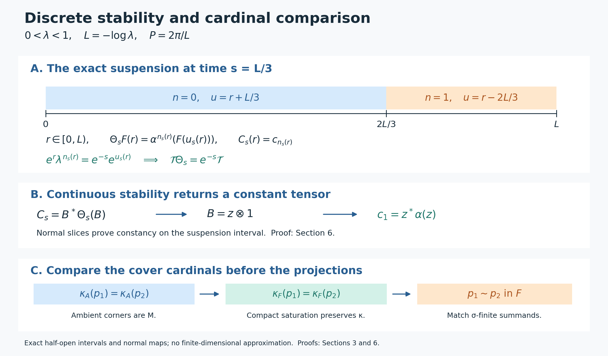

# Discrete decomposition and periodic weights

A type III factor with a discrete modular spectrum has a trace-scaling description by one automorphism of a type II factor. We construct that description for each specified infinite periodic weight, prove its converse and strict uniqueness, and keep the projection cardinalities that matter when the predual is not separable. A continuous suspension proves the discrete cocycle theorem used in the uniqueness argument.

*Original exposition, examples, figures, data and reproducible drawing code in this lesson are dedicated to CC0-1.0. Source publications retain their own terms; no font files are redistributed.*

## Hypotheses and conclusions

Fix \(0<\lambda<1\), and put
\[
 L=-\log\lambda>0,\qquad P=\frac{2\pi}{L}.
\]
For every type III factor \(M\) with \(S(M)=\{0\}\cup\lambda^{\mathbb Z}\), there is a faithful normal semifinite weight \(\phi\) with infinite mass and \(\sigma_P^\phi=\mathrm{id}\). For **every specified** such weight, its centralizer \(N=M_\phi\) is a type \(\mathrm{II}_\infty\) factor, and there is a unitary \(U\in M\) such that
\[
 \sigma_t^\phi(U)=\lambda^{it}U,\qquad
 \tau\circ\theta=\lambda\tau,\qquad
 M\cong N\rtimes_\theta\mathbb Z,
 \quad \tau=\phi|_N,\quad\theta=\operatorname{Ad}U|_N.
\]
The isomorphism and its inverse are normal, and all weight identities hold on the entire positive cone, including infinite values. Conversely every such trace-scaling system yields the stated type III factor. No separability, countable decomposability or faithful-state assumption is imposed on these conclusions.

Any two infinite generalized traces differ by inner transport and a unique scalar in \((\lambda,1]\). Their decompositions are strictly conjugate after an explicit inner adjustment, with that trace scalar retained. The modular and inner period groups are \(P\mathbb Z\); the full center-flow period group is \(L\mathbb Z\). The reciprocal periods are distinct parameters.

The discrete cocycle theorem in Section 6 applies to every von Neumann algebra with a faithful normal semifinite trace scaled by \(\lambda\), with arbitrary center and cardinality. When \(M\) has a faithful normal state, Section 8 also proves periodic-state existence, a degree-one isometry, persistence of every centralizer MASA, and the complete partial-normalizer criterion, including zero projections and both signs. No state is assumed for the other sections.

The earlier [inner-period argument](OA-FLOW-IP.md#oa-flow.ip.0), [bounded phase correction](OA-FLOW-PW.md#oa-flow.pw.1), [periodic Fourier analysis](OA-FLOW-PF.md#oa-flow.pf.1), and [normalized weight cocycles](OA-FLOW-BC.md#oa-flow.bc.4) supply the basic modular identities. The first three sections prove the corner and cardinal comparison statements needed for the unrestricted scope.

## 1. Arbitrary-cardinality corners and the positive spectral identity

**Homogeneous matrix coordinates.** Let \(B\) be a factor and \(0\ne e\in B\) properly infinite. Take a maximal orthogonal family \((p_i)\) with \(p_i\sim e\), initially containing \(e\). Its residual \(r=1-\sum_i p_i\) cannot contain another copy of \(e\). Factor comparison [PC2](OA-FLOW-PC.md#oa-flow.pc.2) therefore gives \(r\precsim e\). Halving of \(e\) gives \(e+r\precsim e\): place \(e\) and \(r\) in its two orthogonal copies. The reverse subequivalence is immediate. [PC3](OA-FLOW-PC.md#oa-flow.pc.3) gives \(e+r\sim e\). Replace the first member by \(e+r\). The resulting family fills \(1\).

Choose \(v_i^*v_i=e,\ v_iv_i^*=p_i\). The unitary
\[
 W:\bigoplus_{i\in I}eH\longrightarrow H,\qquad
 W(\xi_i)=\sum_i v_i\xi_i
 \tag{DDP1}
\]
is isometric by orthogonality and onto because \(\sum_i p_i=1\). Its inverse is \(\xi\mapsto(v_i^*\xi)_i\). The [TW bounded-array theorem](OA-FLOW-TW.md#tw-1) gives mutually inverse normal isomorphisms
\[
 eBe\bar\otimes B(\ell^2I)\longleftrightarrow B,\qquad
 [x_{ij}]\longmapsto W[x_{ij}]W^*,\qquad
 x\longmapsto[v_i^*xv_j].
 \tag{DDP2}
\]
Indeed finite corners of the first map lie in \(B\) and converge strongly-star; the second has all entries in \(eBe\). Normality of both maps follows by transforming the complete vector-series functionals through \(W\). This does not assert \(e\sim1\).

If \(B\) is type III, every nonzero \(e\) is properly infinite by [PC8](OA-FLOW-PC.md#oa-flow.pc.8). For any faithful n.s.f. \(\rho\) on \(eBe\), transport \(\rho\otimes\operatorname{Tr}_I\) through (DDP2). [TW5](OA-FLOW-TW.md#tw-5) identifies its full modular operator with
\[
 \bigoplus_{(i,j)\in I^2}\Delta_\rho,\qquad
 D=\left\{(\xi_{ij}):\xi_{ij}\in D(\Delta_\rho),\
                    \sum_{i,j}\|\Delta_\rho\xi_{ij}\|^2<\infty\right\}.
 \tag{DDP3}
\]
Its spectrum equals \(\operatorname{Sp}\Delta_\rho\). Off that spectrum the same bounded resolvent acts in every coordinate, with a uniform norm. Conversely one coordinate is a reducing copy of \(\Delta_\rho\), so invertibility of the sum implies invertibility there. Zero is retained. [CT1's whole graph transport](OA-FLOW-CT.md#oa-flow.ct.1) preserves this spectrum under (DDP2). Taking the intersection defining \(S(B)\), first against each transported weight and then against all \(\rho\), proves the precise inclusion
\[
 S(B)\subseteq S(eBe)\quad(0\ne e\in B,\ B\text{ a type III factor}).
 \tag{DDP4}
\]
Only this direction is needed. Neither equality of the two algebras nor equality of their cardinalities has been assumed.

Let \(\varphi\) be any faithful n.s.f. weight on such a \(B\). For each nonzero \(e\in B_\varphi\), [MG2](OA-FLOW-MG.md#oa-flow.mg.2) proves that \(\varphi_e\) is faithful n.s.f. with the restricted modular group. Thus (DDP4) and [MG1](OA-FLOW-MG.md#oa-flow.mg.1) give
\[
 \log S_+(B)\subseteq
 \bigcap_{0\ne e\in\operatorname{Proj}(B_\varphi)}
             \operatorname{Sp}((\sigma^\varphi)^e)
 =\Gamma(\sigma^\varphi).
\]
The opposite inclusion is already proved in [MG3](OA-FLOW-MG.md#oa-flow.mg.3) for arbitrary factors. Therefore
\[
 \log S_+(B)=\Gamma(\sigma^\varphi)
 \quad\text{for every type III factor, with no countability hypothesis}.
 \tag{DDP5}
\]

**Innerness extends from a full fixed corner.** Suppose \(\beta\in\operatorname{Aut}(B)\), \(\beta(e)=e\), and \(\beta(x)=uxu^*\) on \(eBe\), where \(u^*u=uu^*=e\). Use (DDP1), and form the strong-star orthogonal sum
\[
 b=\sum_i\beta(v_i)u v_i^*.
 \tag{DDP6}
\]
Its summands have initial projections \(p_i\) and final projections \(\beta(p_i)\), both filling \(1\). [PC1](OA-FLOW-PC.md#oa-flow.pc.1) gives \(b\in\mathcal U(B)\). For \(a\in eBe\),
\[
 b(v_iav_j^*)b^*
   =\beta(v_i)uau^*\beta(v_j^*)
   =\beta(v_iav_j^*).
\]
Finite matrix compressions and normality extend this to all of \(B\). Hence \(\beta=\operatorname{Ad}b\). Thus innerness on the fixed full properly infinite corner extends to the entire factor.

## 2. Existence and the given-periodic-weight centralizer

Assume now \(M\) is any type III factor with \(S(M)=\{0\}\cup\lambda^{\mathbb Z}\). [FR1](OA-FLOW-FR.md#oa-flow.fr.1) constructs a faithful n.s.f. weight without a state assumption. For any such weight \(\psi\), (DDP5) gives \(\Gamma(\sigma^\psi)=L\mathbb Z\). Apply the complete narrow-spectrum, absolutely summable filter, norm logarithm and bounded derivation proofs [IP0](OA-FLOW-IP.md#oa-flow.ip.0), [IP1](OA-FLOW-IP.md#oa-flow.ip.1), [IP2](OA-FLOW-IP.md#oa-flow.ip.2), [IP3](OA-FLOW-IP.md#oa-flow.ip.3), [IP4](OA-FLOW-IP.md#oa-flow.ip.4), [IP5](OA-FLOW-IP.md#oa-flow.ip.5). They produce a nonzero fixed corner on which \(\sigma_P^\psi\) is inner. Formula (DDP6) makes it inner on all of \(M\).

[PW1](OA-FLOW-PW.md#oa-flow.pw.1) proves that its implementing unitary \(b\) belongs to \(Z(M_\psi)\). [PW2](OA-FLOW-PW.md#oa-flow.pw.2) constructs a bounded phase \(0\le\Theta\le2\pi\) with \(e^{i\Theta}=b\). Set
\[
 k=e^{-\Theta/P},\qquad \lambda1\le k\le1,\qquad
 \eta(x)=\psi(k^{1/2}xk^{1/2}).
 \tag{DDP7}
\]
[PW3](OA-FLOW-PW.md#oa-flow.pw.3) proves \(\lambda\psi\le\eta\le\psi\) on all positive elements, identifies every finite domain, and gives
\(\sigma_t^\eta=\operatorname{Ad}(k^{it})\sigma_t^\psi\), so \(\sigma_P^\eta=\mathrm{id}\). If necessary, the arbitrary-algebra filling isomorphism [CA6](OA-FLOW-CA.md#oa-flow.ca.6)–[CA7](OA-FLOW-CA.md#oa-flow.ca.7) transports \(\eta\otimes\operatorname{Tr}_{\ell^2}\) back onto \(M\). Its mass is infinite and its period group is unchanged. This gives an infinite periodic weight on the original \(M\).

The following assertions concern **every given** faithful n.s.f. weight \(\phi\) satisfying \(\sigma_P^\phi=\mathrm{id}\), including one not produced by (DDP7). [PW4](OA-FLOW-PW.md#oa-flow.pw.4), [PW5](OA-FLOW-PW.md#oa-flow.pw.5) and [PW6](OA-FLOW-PW.md#oa-flow.pw.6) supplies
\[
 N=M_\phi,\qquad
 E(x)=P^{-1}\int_0^P\sigma_t^\phi(x)\,dt,\qquad
 \tau=\phi|_{N_+},\qquad \phi=\tau E,
 \tag{DDP8}
\]
with \(E\) faithful normal and \(\tau\) a faithful n.s.f. trace, all equalities on the whole cone.

The corner inclusion needed in the periodic Fourier argument is
\(S(M)\subseteq\operatorname{Sp}\Delta_{\phi_f}\) for a nonzero finite-\(\tau\) fixed projection \(f\). Formula (DDP4) supplies exactly this inclusion. For clarity, the remaining mechanism is as follows. The period confines the positive spectrum to \(\lambda^{\mathbb Z}\); each \(\lambda^n\) lies in that spectrum by (DDP4), so its isolated spectral projection cannot vanish. Finite GNS density in \(fMf\) supplies a nonzero Fourier coefficient of degree \(n\). Every nonzero \(q\in N\) contains such an \(f\), by the finite-trace compression and spectral-threshold proof [PF2](OA-FLOW-PF.md#oa-flow.pf.2). Consequently every nonzero fixed corner contains every degree.

For nonzero \(e_1,e_2\in N\), choose a nonzero degree-\(n\) coefficient \(y\in e_1Me_2\) by Fejér density and factoriality of \(M\). Its right support \(q\le e_2\) is fixed. A nonzero degree-\(-n\) element \(z\in qMq\) gives \(0\ne yz\in e_1Ne_2\): the range of \(z\) lies in \(qH\), on which \(y\) has zero kernel. This proves that \(N\) is a factor. A minimal projection \(e\in N\) has finite positive trace; a degree-one element in \(eMe\) would normalize to an eigenunitary \(v\), whose finite Tomita norm identity gives \(\tau(e)=\lambda\tau(e)\), a contradiction.

[PF5](OA-FLOW-PF.md#oa-flow.pf.5)'s arbitrary-factor trace criterion proves that \(N\) is II1 if \(\phi(1)<\infty\), and II∞ if \(\phi(1)=\infty\). [PF7](OA-FLOW-PF.md#oa-flow.pf.7)'s full resolvent argument and the degree-one coefficient give
\[
 \operatorname{Sp}\Delta_\phi=\{0\}\cup\lambda^{\mathbb Z},\qquad
 \{t:\sigma_t^\phi=\mathrm{id}\}=P\mathbb Z.
 \tag{DDP9}
\]
The trace value of the identity determines the type of the centralizer. Comparison of arbitrary infinite-trace projections will additionally require their cover cardinals in Section 3.

The inner-period invariant is exact as well. If \(\sigma_t^\phi=\operatorname{Ad}b\), modular invariance and [CZ0](OA-FLOW-CZ.md#oa-flow.cz.0) put \(b\) in \(N\); since this automorphism fixes \(N\) pointwise, \(b\in Z(N)=\mathbb C1\). Thus it is the identity and \(t\in P\mathbb Z\). Conversely every multiple of \(P\) is an inner period. [BC4](OA-FLOW-BC.md#oa-flow.bc.4) relates any other faithful n.s.f. modular group to this one by an inner cocycle at each time, so innerness at that time is unchanged. Hence \(T(M)=P\mathbb Z\), for every weight defining this invariant.

## 3. The balanced comparison without a countability shortcut

Call a projection sigma-finite when its corner has a faithful normal state; [PC7](OA-FLOW-PC.md#oa-flow.pc.7) proves equivalence with countable decomposability. For a nonzero projection \(p\), let \(\kappa_B(p)\) be the least cardinality of a family of sigma-finite subprojections whose join is \(p\). Such families exist by the vector-support construction in [FR1](OA-FLOW-FR.md#oa-flow.fr.1). A countable join of sigma-finite projections is sigma-finite: sum strictly positive multiples of faithful normal corner states, extended by compression; its support is the join. Therefore \(\kappa_B(p)\) is either \(1\) or an uncountable cardinal.

**Cardinal comparison in a factor.** If \(p,q\) are properly infinite projections in a factor \(B\) and
\[
 \kappa_B(p)=\kappa_B(q),
 \tag{DDP10}
\]
then \(p\sim q\). Here is a proof retaining the cardinal. Choose a nonzero sigma-finite subprojection \(a\le p\). Filling copies of \(p\), followed by the source-countable comparison [PC7](OA-FLOW-PC.md#oa-flow.projection.pc7), allow countably many orthogonal copies of \(a\) under \(p\). Their sum \(r\) is sigma-finite and infinite, by the shift of the copies; since its corner is a factor it is properly infinite. Apply (DDP1)–(DDP2) inside \(pBp\) with \(r\). This writes \(p\) as an orthogonal sum \(\sum_{i\in I}r_i\) of sigma-finite properly infinite projections.

The cardinal arithmetic used here is also explicit: for every infinite cardinal \(\kappa\), \(|\kappa\times\mathbb N|=\kappa\). For \(\kappa=\aleph_0\), enumerate pairs by increasing sum of their two finite indices. If there were a least larger counterexample \(\kappa\), order its pairs \((\beta,n)\) first by \(\max(\beta,n)\), then by the two coordinates. Every predecessor set has cardinal at most \(|\gamma|\aleph_0<\kappa\), where \(\gamma<\kappa\) bounds the first coordinate, using minimality (and the countable base case when \(\gamma\) is finite). The resulting well-order cannot have a point at position \(\kappa\); hence its order type is at most \(\kappa\). This supplies an injection into \(\kappa\); the reverse injection and [PC0](OA-FLOW-PC.md#oa-flow.projection.pc0)'s set-theoretic Cantor–Bernstein proof give equality, a contradiction.

A sigma-finite \(f\le p\) can have \(fr_i\ne0\) for only countably many \(i\): a faithful normal state \(\omega\) on \(fBf\) has
\(\sum_i\omega(fr_if)=\omega(f)=1\); its positive terms are countable, and zero terms force \(r_if=0\). Thus any sigma-finite cover of \(p\) must meet every \(r_i\), with each covering member meeting only countably many. If \(I\) is uncountable this proves \(\kappa_B(p)=|I|\). If \(I\) is countable, \(p\) is sigma-finite and \(\kappa_B(p)=1\). Do the same for \(q\). In the sigma-finite case [PC7](OA-FLOW-PC.md#oa-flow.projection.pc7) and [PC3](OA-FLOW-PC.md#oa-flow.projection.pc3) compare \(p,q\) directly. Otherwise the two index sets have the same cardinal, and every matched pair of summands is equivalent by [PC7](OA-FLOW-PC.md#oa-flow.projection.pc7), since both are sigma-finite, properly infinite and full in the factor. Their arbitrary orthogonal sum, using [PC1](OA-FLOW-PC.md#oa-flow.projection.pc1), implements \(p\sim q\).

**Compact expectations preserve the cover cardinal on fixed projections.** Let a point-strong-star continuous circle action \(\gamma\) act on \(A\), with its faithful normal average \(E:A\to F\). If \(e\in F\), then \(eAe\) is sigma-finite exactly when \(eFe\) is: restrict a faithful normal state in one direction, and compose with the faithful normal compressed expectation in the other.

For any sigma-finite \(q\in A\),
\[
 r=s(E(q))=\bigvee_{t\in[0,P)}\gamma_t(q)
           =\bigvee_{t\in D}\gamma_t(q),
 \tag{DDP11}
\]
where \(D\) is any countable dense subset of the circle. The first equality follows by testing a vector in the kernel of the positive average: a continuous nonnegative function with integral zero vanishes at every time. The second follows from strong continuity of the projection orbit. The countable-join argument makes \(r\) sigma-finite in \(A\), and hence in \(F\). It contains \(q\). If \(q\le p\) and \(p\) is fixed, then \(r\le p\). Enlarging each member of a sigma-finite \(A\)-cover of \(p\) in this way gives an \(F\)-cover of no larger cardinality. The reverse inequality is immediate from the state/expectation equivalence. Thus
\[
 \kappa_A(p)=\kappa_F(p)\qquad(p\in\operatorname{Proj}F,\ p\ne0).
 \tag{DDP12}
\]
The countable dense set concerns the compact parameter group, not the predual of \(A\).

Apply this to a periodic balanced weight on \(A=M_2(M)\). Its fixed algebra \(F\) is a semifinite factor by Section 2: finite matrix amplification preserves \(S(M)\), because [PC5](OA-FLOW-PC.md#oa-flow.projection.pc5) gives a halving into two copies of the unit and the explicit normal matrix isomorphism of [CT1](OA-FLOW-CT.md#oa-flow.ct.1) and [CT3](OA-FLOW-CT.md#oa-flow.ct.3). If both diagonal projections \(p_1,p_2\) have infinite weight, [PF5](OA-FLOW-PF.md#oa-flow.pf.5) makes them properly infinite in \(F\). Their ambient corners are both normally isomorphic to \(M\), so their cover cardinals in \(A\) agree. Equations (DDP10)–(DDP12) give
\[
 p_1\sim p_2\quad\text{in }F.
 \tag{DDP13}
\]
No subtraction of infinite trace values, common finite normalization, or uncountable version of the countable comparison theorem has been used.

## 4. The particular infinite periodic weight gives its own decomposition

Let \(\phi\) be the given infinite periodic weight of Section 2. On \(M_2(M)\), use
\(\Psi(X)=\phi(X_{11})+\lambda\phi(X_{22})\).
[BC3](OA-FLOW-BC.md#oa-flow.bc.3)–[BC4](OA-FLOW-BC.md#oa-flow.bc.4)'s full balanced modular formula gives
\[
 \sigma_t^\Psi(X)=
 \begin{pmatrix}
 \sigma_t^\phi(X_{11})&\lambda^{-it}\sigma_t^\phi(X_{12})\\
 \lambda^{it}\sigma_t^\phi(X_{21})&\sigma_t^\phi(X_{22})
 \end{pmatrix}.
 \tag{DDP14}
\]
It has period \(P\). Formula (DDP13) supplies a fixed \(v=u e_{21}\) with \(u\) unitary and \(\sigma_t^\phi(u)=\lambda^{-it}u\). Set \(U=u^*\). The fixed unitary \(v+v^*\), together with [CZ0's whole-cone invariance](OA-FLOW-CZ.md#oa-flow.cz.0), gives
\[
 \sigma_t^\phi(U)=\lambda^{it}U,\qquad
 \phi(UxU^*)=\lambda\phi(x)\quad(x\in M_+).
 \tag{DDP15}
\]
This whole-cone argument does not require \(U\) to have a finite GNS vector.

Put \(N=M_\phi\), \(\theta=\operatorname{Ad}U|_N\), \(\tau=\phi|_N\). Then \(\tau\theta=\lambda\tau\) on the entire cone. The degree-\(n\) space is \(NU^n=U^nN\), by multiplying an eigenoperator by \(U^{-n}\). [PF1](OA-FLOW-PF.md#oa-flow.pf.1)'s bounded strong-star Fejér sums give \(M=(N\cup\{U\})''\).

The full normal recognition is more than this generation statement. Define
\[
 W(\delta_n\otimes\Lambda_\tau(a))=\Lambda_\phi(U^na)
 \quad(a\in\mathfrak n_\tau).
 \tag{DDP16}
\]
Equation \(\phi=\tau E\) makes distinct degrees orthogonal and makes each diagonal inner product \(\tau(b^*a)\), so \(W\) is isometric. Choose finite-trace positive contractions \(c_i\uparrow1\) in \(N\). [CZ0](OA-FLOW-CZ.md#oa-flow.cz.0)'s exact right-multiplier formula gives \(\Lambda_\phi(xc_i)\to\Lambda_\phi(x)\) for \(x\in\mathfrak n_\phi\). At fixed \(i\), the bounded Fejér approximants \(T_m(x)\) satisfy
\(\Lambda_\phi(T_m(x)c_i)\to\Lambda_\phi(xc_i)\), since this is bounded strong convergence tested on \(\Lambda_\phi(c_i)\). Each approximant is a finite sum of vectors in (DDP16): \(U^{-n}P_n(x)c_i\in\mathfrak n_\tau\). The range of \(W\) is closed and contains the dense whole GNS range, so \(W\) is onto.

Its conjugation formulas are
\[
 (W^*\pi_\phi(d)W\xi)_n
       =\pi_\tau(\theta^{-n}(d))\xi_n,\qquad
 (W^*\pi_\phi(U)W\xi)_n=\xi_{n-1}.
 \tag{DDP17}
\]
They hold first on the displayed dense vectors, then everywhere by boundedness. Hence conjugation by \(W\) and the faithful normal GNS representation give
\[
 N\rtimes_\theta\mathbb Z\ \cong\ M,\qquad d\mapsto d,\quad s\mapsto U,
 \tag{DDP18}
\]
on the entire von Neumann algebras, with normal inverse, exactly as [GT4](OA-FLOW-GT.md#oa-flow.gt.4)–[GT5](OA-FLOW-GT.md#oa-flow.gt.5). The non-countable finite-trace approximants are a net; the Fourier index remains \(\mathbb Z\). This proves existence and recognition for the specified weight at arbitrary factor cardinality.

If a finite centralizer corner is normalized as \(\bar\phi=\phi(e)^{-1}\phi|_{eMe}\), its trace amplification transports as \(\phi(e)(\bar\phi\otimes\operatorname{Tr})\). The scalar \(\phi(e)\) cannot be silently removed. The balanced proof above requires no claim that independently chosen amplifications preserve the two weights.

## 5. The converse from an arbitrary trace-scaling II∞ system

Let \(N\) be any II∞ factor with faithful n.s.f. trace \(\tau\), and let \(\theta\in\operatorname{Aut}(N)\) satisfy \(\tau\theta=\lambda\tau\). Form the actual regular algebra \(M=N\rtimes_\theta\mathbb Z\) of [VD0](OA-FLOW-VD.md#oa-flow.vd.0), with implementing unitary \(U\) and compact dual action \(\gamma_z(U)=\bar zU\). Its faithful normal average \(E\) has range \(N\), by [VD0](OA-FLOW-VD.md#oa-flow.vd.0)'s diagonal/Fourier proof.

Every nonzero power \(\theta^n\) is outer. An inner automorphism preserves the entire trace, whereas \(\theta^n\) multiplies the finite nonzero value of a finite-trace projection by \(\lambda^n\ne1\). If \(x\in Z(M)\), its \(n\)-th Fourier coefficient is \(a_nU^n\), and commutation with \(d\in N\) gives \(a_n\theta^n(d)=da_n\). For a nonzero \(a_n\), polar decomposition makes \(a_n^*a_n\) commute with \(\theta^n(N)\) and \(a_na_n^*\) commute with \(N\). Both are nonzero scalar operators, so its polar part is a unitary implementing innerness of \(\theta^n\). Thus all nonzero-degree coefficients vanish; the zero coefficient is scalar. Fejér convergence gives \(x\in\mathbb C1\), proving factoriality.

The weight \(\Phi=\tau E\) is faithful n.s.f. by [EP6](OA-FLOW-EP.md#oa-flow.ep.6). It is the full discrete dual weight of [GDA8](OA-FLOW-GDA.md#gda-8): for counting Haar measure, [GDA6](OA-FLOW-GDA.md#gda-6)'s compact coefficient supported at \(0\) gives \(T(1)=1\), so its operator-valued weight is bounded normal; the Fourier coefficient formulas identify it with \(E\) on finite Laurent polynomials, then everywhere. [GDW7](OA-FLOW-GDW.md#gdw-7)/[GDA8](OA-FLOW-GDA.md#gda-8) therefore gives, with its normalized scalar cocycle,
\[
 \sigma_t^\Phi(d)=d,\qquad
 \sigma_t^\Phi(U)=U(D(\tau\theta):D\tau)_t
                =\lambda^{it}U .
 \tag{DDP19}
\]
All nonzero degrees exist, and compact Fourier density gives \(M_\Phi=N\) and
\(\operatorname{Sp}(\sigma^\Phi)=L\mathbb Z\). The last equality can also be tested directly with the Fourier projections: the period excludes every other frequency and \(U^n\) supplies every displayed one.

Since \(N\) is a factor, [GCC's fixed-factor theorem](OA-FLOW-GCC.md#gcc-intersection) gives \(\Gamma(\sigma^\Phi)=L\mathbb Z\). [MG3](OA-FLOW-MG.md#oa-flow.mg.3) makes this the same group for every faithful n.s.f. weight on \(M\), and [MG1](OA-FLOW-MG.md#oa-flow.mg.1) puts its exponential in every positive modular spectrum. The single weight \(\Phi\) bounds the intersection from above by the same lattice. Every modular spectrum also contains \(0\), as it contains \(\lambda^n\to0\). Thus
\[
 S(M)=\{0\}\cup\lambda^{\mathbb Z}.
 \tag{DDP20}
\]
Finally \(M\) is type III. A nonzero finite projection in this factor would supply a faithful n.s.f. trace on \(M\), by [L18 Section 6's complete full-corner trace construction](OA-FLOW-L18.md#l18-6). Its modular spectrum would be \(\{1\}\), contrary to (DDP20). Thus the converse holds for every factor of the stated scope.

### The complete core center and its least flow period

The decomposition also gives a direct proof of the introductory center-flow period. Let \(K=M\rtimes_{\sigma^\phi}\mathbb R\), with canonical translations \(u(t)\) and the negative dual convention of [CORE's setting](OA-FLOW-CORE.md#core-setting). Identify \(N\) with its canonical image. Since \(\sigma^\phi\) fixes \(N\), the actual regular representation on \(L^2(\mathbb R,H_\phi)\) makes
\[
 D=(N\cup u(\mathbb R))''=N\bar\otimes L(\mathbb R).
 \tag{DDP40}
\]
Indeed \(N\) acts constantly on the \(H_\phi\) factor and \(u(t)\) by translation on the other factor; the tensor representation is faithful and normal. Apply the scalar onto positive Fourier transform [FF2](OA-FLOW-FF.md#oa-flow.ff.3), tensored with the identity on \(H_\phi\). This tensor unitary is onto by the density of finite Hilbert tensors, without any separability condition on \(H_\phi\). It gives \(u(t)=e^{itQ_c}\) and \(L(\mathbb R)=L^\infty(Q_c)\). The latter equality follows by recovering the coordinate generator's resolvents and spectral projections from its unitary group, so all interval indicators, and hence all bounded measurable multipliers, belong to the generated algebra.

The canonical image of \(U\) normalizes \(D\), with
\[
 UdU^*=\theta(d)\quad(d\in N),\qquad
 Uu(t)U^*=e^{iLt}u(t).
 \tag{DDP41}
\]
The sign follows from \(u(t)Uu(t)^*=\lambda^{it}U=e^{-iLt}U\). The core is generated by \(D,U\). The circle action fixing \(D\) and multiplying \(U\) by \(\bar z\) is actual and normal: in the full GT GNS coordinates its diagonal implementation commutes with the modular GNS group and hence implements this action also in the regular core representation. Its average has range exactly \(D\): finite words reduce to Laurent polynomials over \(D\), their average is the degree-zero term, and normality extends the inclusion to the generated algebra. Conversely it fixes \(D\). Its Fejér sums converge boundedly strongly-star, and its degree-\(n\) space is \(DU^n\).

For \(x\in Z(K)\), write its degree-\(n\) coefficient as \(a_nU^n\), \(a_n\in D\). Commutation with \(N\) gives \(a_n\theta^n(d)=da_n\). Every normal slice on the \(L(\mathbb R)\) factor is an intertwiner in \(N\). For \(n\ne0\), the outer-power and polar argument of Section 5 makes every such slice zero; separating product functionals give \(a_n=0\). For \(n=0\), all slices commute with the factor \(N\), so \(a_0=1\otimes f(Q_c)\). Commutation with \(U\) is exactly \(f(q+L)=f(q)\) as a Lebesgue class. Conversely every such periodic multiplier commutes with all generators. Therefore
\[
 Z(K)=1\otimes L^\infty(\mathbb R/L\mathbb Z)
     =W^*(u(P)),\qquad
 \theta_s(u(P))=e^{-iPs}u(P).
 \tag{DDP42}
\]
Here the periodic-function identification is literal: the countably many integer-translation equalities give a representative determined on \([0,L)\), and \(q\mapsto e^{iPq}\) identifies this half-open interval with the circle as a measure-class space. Thus the single unitary \(u(P)\) generates the entire center, not a proper power subalgebra. Its displayed character gives precisely the kernel \(L\mathbb Z\) of the center action. This proves the least flow period \(L\) and the reciprocal relation with the inner/modular period \(P\), on the full arbitrary-factor scope.

## 6. Discrete cocycle stability by a continuous suspension

Let \(Q\) be any von Neumann algebra with a faithful n.s.f. trace \(T\), and let \(\alpha\) satisfy \(T\alpha=\lambda T\). A unitary \(\mathbb Z\)-cocycle means
\[
 c_{m+n}=c_m\alpha^m(c_n),\qquad c_0=1.
\]
We prove
\[
 c_n=z^*\alpha^n(z)\quad(n\in\mathbb Z)
 \tag{DDP21}
\]
for one unitary \(z\in Q\), without a factor or countability hypothesis.

Let \(I=[0,L)\), \(A=Q\bar\otimes L^\infty(I)\), and
\[
 n_s(r)=\left\lfloor\frac{r+s}{L}\right\rfloor,\qquad
 u_s(r)=r+s-Ln_s(r).
\]
For each fixed \(s\), only finitely many integers occur. Define the normal automorphism and the step-unitary cocycle by
\[
 (\Theta_sF)(r)=\alpha^{n_s(r)}(F(u_s(r))),\qquad
 C_s(r)=c_{n_s(r)}.
 \tag{DDP22}
\]
These expressions specify normal maps on the tensor algebra by restriction to the finitely many scalar intervals and translation; they do not presume pointwise operator fields for arbitrary Hilbert dimension. The identities
\[
 n_{s+t}(r)=n_s(r)+n_t(u_s(r)),\qquad
 u_{s+t}(r)=u_t(u_s(r))
\]
give the group law and \(C_{s+t}=C_s\Theta_s(C_t)\), including negative parameters.

For full continuity, represent \(Q\) on its trace GNS space, and let
\(V\Lambda_T(x)=\lambda^{-1/2}\Lambda_T(\alpha x)\).
It is an onto unitary implementing \(\alpha\), by the trace-scaling identity and its inverse. On \(L^2(I,H_T)\),
\[
 (R_s\xi)(r)=V^{n_s(r)}\xi(u_s(r))
 \tag{DDP23}
\]
is a unitary representation and implements \(\Theta_s\). At \(s=0\), compactly supported continuous Hilbert-valued functions away from the endpoint have norm-continuous translates; the wrap interval has length \(|s|\) and vanishing \(L^2\)-mass. These functions are dense, and the common unitary bound extends continuity to every vector. The group law gives continuity at all \(s\). The same shrinking-interval estimate gives \(C_s\to1\) strongly as \(s\to0\), since \(C_s=1\) off the wrap interval and its norm is one. The cocycle law gives strong continuity everywhere, and unitarity gives continuity of adjoints.

Let \(\omega(f)=\int_I e^r f(r)\,dr\), and define on the full positive cone
\[
 \mathcal T=T\circ(\operatorname{id}\bar\otimes\omega).
 \tag{DDP24}
\]
The bounded slice is a faithful normal \(Q\)-bimodular operator-valued weight, with bounded-value ideal all of \(A\); [EP6's full composition theorem](OA-FLOW-EP.md#oa-flow.ep.6) makes \(\mathcal T\) faithful n.s.f. It is a trace. Indeed [OT5's modular restriction](OA-FLOW-OT.md#oa-flow.ot.5) fixes \(Q\otimes1\), since \(T\) is tracial, and [NC4's full-graph central commutation](OA-FLOW-NC.md#oa-flow.nc.4) shows that the modular group fixes the center, in particular \(1\otimes L^\infty(I)\). These algebras generate \(A\), so the modular group is trivial; the [whole-cone trace criterion KT5](OA-FLOW-KT.md#oa-flow.kt.5) applies.

The trace scales with the exact real exponent:
\[
 \mathcal T\Theta_s=e^{-s}\mathcal T .
 \tag{DDP25}
\]
On a bounded positive step tensor, substitute \(u=r+s-nL\) separately on the finitely many intervals. The trace factor is
\[
 e^r\lambda^n=e^{u-s+nL}e^{-nL}=e^{-s}e^u.
\]
The transformed intervals partition \(I\), proving (DDP25) there. This extends to the entire cone as follows. Finite-\(T\) projections \(p\) increase as a net to \(1\); finite joins remain finite by the trace join inequality from polar comparison. On \(pAp\), both sides are bounded normal functionals: \(\Theta_s(p)\) is a finite step sum of \(\alpha^n(p)\) and has finite \(\mathcal T\)-value. Normality therefore extends equality from scalar step tensors to all of this corner. For \(X\ge0\), traciality gives
\(\mathcal T(pXp)=\mathcal T(X^{1/2}pX^{1/2})\uparrow\mathcal T(X)\).
Apply the same identity to \(\Theta_s(p)\uparrow1\) for the left side. This proves (DDP25), including infinity.

All hypotheses of the proved [CST theorem and its full implementation proof](OA-FLOW-CST.md#cst-5) are now met. Obtain \(B\in\mathcal U(A)\) with \(C_s=B^*\Theta_s(B)\).

There is no need to evaluate \(B\) at a chosen fiber. If \(0<s<L\), then \(C_s=1\) on \([0,L-s)\), and hence \(B(r+s)=B(r)\) there in the tensor-algebra sense. Slice by any \(\rho\in Q_*\). The bounded scalar function \(f_\rho=(\rho\otimes\mathrm{id})(B)\) has these local translation identities. For a smooth compactly supported \(g\) in \((0,L)\), change variables in the identity and divide by \(s\); uniform convergence of the difference quotient gives \(\int f_\rho g'=0\). A convolution with any smooth compact approximate identity therefore has derivative zero on every smaller interval, so is constant there; convergence in local \(L^1\) proves \(f_\rho\) is almost everywhere constant. Compatibility on overlapping smaller intervals gives one constant on \(I\).

Let \(z=(\operatorname{id}\otimes L^{-1}\int_I)(B)\). Every normal slice of \(B-z\otimes1\) is zero, so product normal vector functionals, which separate the spatial tensor algebra, give \(B=z\otimes1\). Unitarity implies \(z^*z=zz^*=1\). At \(s=L\), (DDP22) has \(C_L=c_1\otimes1\) and \(\Theta_L(z\otimes1)=\alpha(z)\otimes1\). Thus \(c_1=z^*\alpha(z)\). Positive iteration telescopes and
\(c_{-n}=\alpha^{-n}(c_n^*)\) gives (DDP21) for negative integers.

Consequently
\[
 \operatorname{Ad}(c_n)\alpha^n
 =\operatorname{Ad}(z^*)\,\alpha^n\,\operatorname{Ad}(z).
 \tag{DDP26}
\]
The complete set of implementers is
\[
 \{hz:h\in\mathcal U(Q^\alpha)\}.
 \tag{DDP27}
\]
Indeed any two solutions \(z,w\) satisfy
\(\alpha(wz^*)=wc_1(zc_1)^*=wz^*\); the converse follows by substitution. The zero algebra has its unique zero-algebra interpretation. This argument uses no measurable selection of implementers, no norm continuity of the cocycle, and no trace equality at infinity as a comparison substitute.

## 7. Generalized traces and strict uniqueness

On the arbitrary type IIIλ factor \(M\), call \(\phi\) a generalized trace here when it is faithful n.s.f., \(\phi(1)=\infty\), and \(\sigma_P^\phi=\mathrm{id}\). Let \(\phi,\psi\) be any two. The normalized cocycle \(v_t=(D\psi:D\phi)_t\), constructed by [BC4](OA-FLOW-BC.md#oa-flow.bc.4)–[BC5](OA-FLOW-BC.md#oa-flow.bc.5), has \(v_P\in Z(M)=\mathbb C1\), since both modular groups are the identity at \(P\). Choose the unique
\[
 a\in(\lambda,1]\quad\text{with}\quad v_P=a^{-iP},
 \qquad \phi_0=a^{-1}\phi.
 \tag{DDP28}
\]
The phase parametrization is bijective because \(\log a\in(-L,0]\) and \(PL=2\pi\). BC's scalar rule gives
\((D\psi:D\phi_0)_P=a^{iP}v_P=1\).
The balanced weight \(\rho=\phi_0\oplus\psi\) on \(M_2(M)\) therefore has period \(P\), including its off-diagonal corners.

Its fixed algebra is a semifinite factor by Section 2, and its two diagonal projections have infinite trace. Formula (DDP13) supplies a fixed upper-right \(V=u e_{12}\) with \(u\) unitary. Its self-adjoint unitary swap \(V+V^*\) preserves \(\rho\) on all positive matrices by [CZ0](OA-FLOW-CZ.md#oa-flow.cz.0). Applying this to \(\operatorname{diag}(0,x)\) gives
\[
 \phi_0(uxu^*)=\psi(x),\qquad
 \boxed{\phi\circ\operatorname{Ad}u=a\psi}.
 \tag{DDP29}
\]
All weights and equalities include infinite values.

For uniqueness of \(a\), the actual inner derivative [GDA8](OA-FLOW-GDA.md#gda-8) is
\[
 (D(\omega\circ\operatorname{Ad}q):D\omega)_t
      =q^*\sigma_t^\omega(q).
 \tag{DDP30}
\]
If \(\omega\operatorname{Ad}q=c\omega\), scalar normalization gives
\(\sigma_t^\omega(q)=c^{it}q\). Evaluating at \(P\) forces \(c\in\lambda^{\mathbb Z}\). If \(u,v\) give (DDP29) with \(a,b\), then
\(\psi\operatorname{Ad}(u^*v)=(b/a)\psi\); thus \(b/a\in\lambda^{\mathbb Z}\). The half-open interval in (DDP28) forces \(a=b\). Conversely (DDP15) realizes every scalar in \(\lambda^{\mathbb Z}\) by a power of \(U\). This is the precise scalar ambiguity.

For uniqueness of the decomposition, take any two trace-scaling II∞ decompositions of the same \(M\), with their dual generalized traces \(\phi_i\), coefficient algebras \(N_i\), implementing unitaries \(U_i\), and automorphisms \(\theta_i\). The converse proof supplies exactly these periodic weights, not arbitrary replacements. Choose \(w,a\) with \(\phi_1\operatorname{Ad}w=a\phi_2\). Modular covariance gives
\[
 J=\operatorname{Ad}w:N_2\longrightarrow N_1,\qquad
 \tau_1J=a\tau_2,\qquad J(U_2)=cU_1,\quad c\in\mathcal U(N_1).
\]
Consequently \(J\theta_2J^{-1}=\operatorname{Ad}c\,\theta_1\). Apply discrete stability in \(N_1\): \(c=z^*\theta_1(z)\). With \(J'=\operatorname{Ad}z\circ J\),
\[
 J'\theta_2(J')^{-1}=\theta_1,\qquad
 \tau_1J'=a\tau_2,\qquad J'(U_2)=U_1
 \tag{DDP31}
\]
where the last formula uses the corresponding inner map on the full \(M\):
\(z\,c\,U_1z^*=\theta_1(z)U_1z^*=U_1\).
This is strict conjugacy after the indicated inner adjustment, with the positive trace scalar retained. No splitting or choice-independent implementing unitary is asserted.

## 8. Periodic states, an isometry, MASAs and all partial normalizers

If the arbitrary type IIIλ factor has a faithful normal state, apply the now unrestricted inner-period construction and [PW3](OA-FLOW-PW.md#oa-flow.pw.3)'s finite normalization to that state. The result is a faithful normal state \(\phi\) with period \(P\); (DDP9) makes it the least positive period. Existence of a state is automatic for a separable predual by [DD1](OA-FLOW-DD.md#oa-flow.dd.1), but is not assumed for the preceding unrestricted theorems.

Fix **any** such periodic state and put \(F=M_\phi\), \(\tau=\phi|_F\). Section 2 proves \(F\) is a II1 factor and \(\tau(1)=1\). Write
\(X_n=\{x:\sigma_t^\phi(x)=\lambda^{int}x\}\).
For a polar partial isometry \(v\in X_n\), its supports lie in \(F\), and the complete finite-state Tomita identity gives
\[
 \tau(vv^*)=\lambda^n\tau(v^*v).
 \tag{DDP32}
\]
Indeed \(v\Omega_\phi\) is a \(\lambda^n\)-eigenvector of \(\Delta_\phi\), and
\(\|v^*\Omega_\phi\|^2=\|S(v\Omega_\phi)\|^2
=\|\Delta_\phi^{1/2}v\Omega_\phi\|^2\).
The eigenvector is in the square-root domain; no infinite-weight vector occurs.

The \(F\)-bimodule \(X_1\) is nonzero. For any nonzero \(e,f\in F\), one has \(fX_1e\ne0\). Otherwise \(fX_1FeF=0\); since the ultraweakly closed ideal generated by \(e\) in the factor \(F\) is \(F\), normal multiplication gives \(fX_1=0\). The same argument with the ideal generated by \(f\) gives \(X_1=0\), a contradiction.

Take a maximal family of degree-one polar partial isometries \(v_j\) with mutually orthogonal initial projections and mutually orthogonal final projections. The family is countable because the initial projections have strictly positive state values. Their strong-star sum \(s\) has supports \(p=s^*s,\ q=ss^*\), and (DDP32) gives \(\tau(q)=\lambda\tau(p)\le\lambda<1\). If \(p\ne1\), both \(1-p\) and \(1-q\) are nonzero, so the preceding bimodule fact supplies an additional nonzero polar partial isometry in \((1-q)X_1(1-p)\), contradicting maximality. Thus
\[
 s^*s=1,\qquad \sigma_t^\phi(s)=\lambda^{it}s,\qquad
 \tau(ss^*)=\lambda,\qquad \tau(s^ns^{*n})=\lambda^n.
 \tag{DDP33}
\]

**Relative commutant.** If \(x\in F'\cap M\), each Fourier coefficient \(x_n\) commutes with \(F\). The polar part of a nonzero \(x_n\) also commutes with \(F\); its support projections lie in \(Z(F)=\mathbb C1\), so it is unitary. Equation (DDP32) forces \(n=0\). The zero coefficient is scalar. Fejér convergence therefore proves
\[
 F'\cap M=\mathbb C1.
 \tag{DDP34}
\]
For every nonzero \(e\in F\), it follows that
\((eFe)'\cap eMe=\mathbb Ce\), with this explicit full-corner argument. Choose partial isometries \(w_i\in F\) whose initial projections lie under \(e\), whose final projections are orthogonal and fill \(1\), and with \(w_0=e\); the full-central-support polar-bridge construction in [L18 Section 6](OA-FLOW-L18.md#l18-6) supplies them. If \(a\in eMe\) commutes with \(eFe\), the bounded orthogonal sum \(b=\sum_i w_i a w_i^*\) has norm at most \(\|a\|\). Matrix coefficients give \(bf=fb\) for every \(f\in F\), because each \(w_i^*fw_j\in eFe\) commutes with \(a\). Thus \(b\in F'\cap M\). The \(e\)-compression is \(a\), so \(a\) is scalar on \(e\).

**MASAs.** Let \(A\) be any MASA of \(F\), and \(x\in A'\cap M\). Each Fourier coefficient \(x_n\) commutes with \(A\). Its polar part \(v\) also commutes with \(A\), and its support projections \(e=v^*v,\ f=vv^*\) belong to \(A'\cap F=A\). Commutation with \(e\) gives \(ev=ve=v\), hence \(f\le e\); commutation with \(f\) gives \(fv=vf=v\), hence \(e\le f\). Thus \(e=f\). If \(v\ne0\), (DDP32) forces \(n=0\). Therefore \(x=x_0\in A'\cap F=A\). This proves
\[
 A'\cap M=A.
 \tag{DDP35}
\]
No regularity or Cartan hypothesis on the MASA is present.

**Partial normalizers.** For arbitrary projections \(e,f\in F\), there is a partial isometry \(v\in M\) satisfying
\[
 v^*v=e,\quad vv^*=f,\quad v(eFe)v^*=fFf
 \tag{DDP36}
\]
if and only if
\[
 \tau(e)=\lambda^n\tau(f)\quad\text{for some }n\in\mathbb Z.
 \tag{DDP37}
\]
If either projection is zero, (DDP37) forces both to be zero by faithfulness; \(v=0\) proves the assertion in that case. Assume both are nonzero.

For necessity, fixedness of \(vxv^*\) for \(x\in eFe\) gives
\(v^*\sigma_t^\phi(v)\in(eFe)'\cap eMe=\mathbb Ce\).
Its scalar has modulus one. The group law and fixedness of \(e\) show it is a continuous character \(e^{irt}\), so
\(\sigma_t^\phi(v)=e^{irt}v\).
The modular period gives \(r\in L\mathbb Z\), equivalently \(v\in X_m\) for some integer \(m\). Equation (DDP32) gives \(\tau(f)=\lambda^m\tau(e)\), which is (DDP37) with \(n=-m\). This records the direction of the sign.

For sufficiency first let \(n\ge0\) in (DDP37). Put \(p_n=s^ns^{*n}\). The character of \(s^n\) gives
\[
 s^nFs^{*n}=p_nFp_n:
\]
the inclusion is immediate, and \(y\in p_nFp_n\) has fixed preimage \(s^{*n}ys^n\). Let \(q=s^nfs^{*n}\). Equation (DDP32), applied to \(s^nf\), gives
\(\tau(q)=\lambda^n\tau(f)=\tau(e)\).
Finite-trace factor comparison [PF6](OA-FLOW-PF.md#oa-flow.pf.6) supplies \(w\in F\) with \(w^*w=e,\ ww^*=q\). Then
\[
 v=s^{*n}w
\]
has \(v^*v=e,\ vv^*=f\), and conjugates \(eFe\) onto \(fFf\) by the displayed corner identity. If \(n<0\), apply the proved case with \(e,f\) interchanged and exponent \(-n\), then take the adjoint. This includes \(n=0\) and completes all normalizer conclusions.

## 9. Exact suspension and comparison

The diagram records the actual suspension, not a numerical model of a type III factor. Its coordinate is \(r\in[0,L)\), its wrap integer is \(n_s(r)\), and the weighting identity is exactly \(e^r\lambda^{n_s(r)}=e^{-s}e^{u_s(r)}\). The lower proof chain keeps the two cardinal-cover equalities before comparison. The proof locators are [Section 3](#dd-cardinality) and [Section 6](#dd-discrete-stability). Human-source context is Takesaki, *Theory of Operator Algebras II*, XII.2.1–3, printed 380–384; the new suspension reduction here uses the complete current [CST proof](OA-FLOW-CST.md#cst-1). The bands and cardinal comparison are proved in Sections 3 and 6. Original figure: CC0.

## Further reading

M. Takesaki, *Theory of Operator Algebras II*, Theorems XII.2.1–2.2, Definition XII.2.3 and Exercises XII.2.1–5, printed pp. 380–384, treat discrete decomposition, generalized traces and periodic-state centralizers. The complete proofs above retain arbitrary factor cardinality: Sections 1 and 3 justify the corner and projection comparisons, Section 4 gives the normal recognition for the specified weight, and Section 5 proves the converse and full core-center period. Section 6 proves discrete cocycle stability on arbitrary traced algebras through a continuous suspension; Sections 7–8 apply it to uniqueness and prove the state consequences.

The complementary earlier treatments are [discrete-decomposition existence](OA-FLOW-DD.md#oa-flow.dd.0), [recognition for a given periodic weight](OA-FLOW-GT.md#oa-flow.gt.4), and [continuous trace-scaling cocycle stability](OA-FLOW-CST.md#cst-5).
