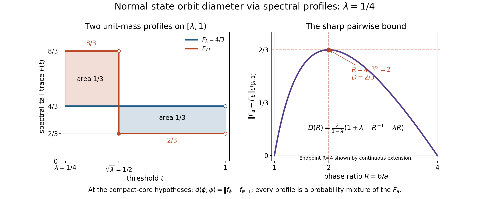
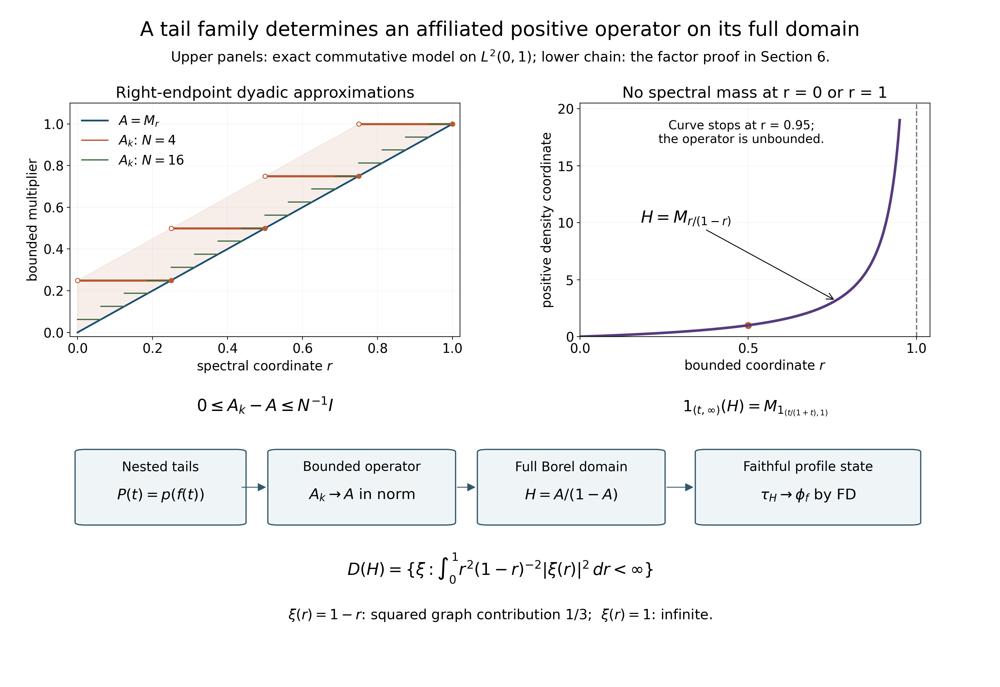

# Normal-state orbit diameter at a positive type III parameter

This is an original private exposition of the compact-core spectral method, followed by a sharp scalar argument using probability mixtures. The spectral method is reconstructed from the freely readable Haagerup–Størmer paper, §5; its final isometry theorem is **proved below**, not imported. No state-diameter theorem is a premise. The argument concerns the predual norm of finite normal states. It makes no assertion about an extended metric on infinite weights.

The positive-parameter theorem is proved at the actual earlier programme proofs linked below. The complete discrete-decomposition existence theorem supplies the periodic weight; no classification premise remains in Section 2. The spectral-family construction in Section 6 is written locally.

Any rights held in the original exposition, illustration and reproduction code supplied in this folder are dedicated under CC0-1.0. The cited sources retain their own terms. No claim of a new historical theorem is made.

## 1. Statement, norm and exact scope

Let $M$ be a nonzero factor with separable predual of type ${\rm III}_\lambda$, where $0<\lambda<1$. For a unitary $u$, write

$$
 \phi^u(x)=\phi(u^*xu),\qquad
 d(\phi,\psi)=\inf_{u\in\mathcal U(M)}\|\phi^u-\psi\|,
 \qquad \phi,\psi\in S_*(M).
 \tag{D1}
$$

Here $S_*(M)=\{\phi\in M_*^+:\phi(1)=1\}$, including nonfaithful states, and the norm is the supremum on the operator-norm unit ball of $M$. The desired assertion is

$$
 \sup_{\phi,\psi\in S_*(M)}d(\phi,\psi)
 =\frac{2(1-\sqrt\lambda)}{1+\sqrt\lambda}.
 \tag{D2}
$$

Our conjugation convention agrees with the opposite convention in an orbit infimum, since inversion permutes the unitary group. The factor is assumed to have separable predual throughout; no wider sigma-finite theorem is silently substituted.

The infimum in (D1) is unchanged upon replacing either state by an element of its norm orbit closure. Indeed, unitary conjugation is isometric, so

$$
 |d(\phi,\psi)-d(\phi',\psi')|
 \le \|\phi-\phi'\|+\|\psi-\psi'\|.
 \tag{D3}
$$

It is symmetric by inversion. Composing two unitaries proves the triangle inequality. Thus $d=0$ is an equivalence relation and $d$ defines a metric on norm orbit closures. We will use only these elementary facts, not a classification of those closures.

## 2. Precisely what the compact-core foundations supply

Put $L=-\log\lambda>0$ and $P=2\pi/L$. The complete [DD existence theorem, proved in DD1–8](OA-FLOW-DD.md#oa-flow.dd.1), constructs from precisely this nonzero separable-predual type ${\rm III}_\lambda$ hypothesis, without an assumed periodic weight, a type ${\rm II}_\infty$ factor $A$, an n.s.f. trace $\tau_A$, an automorphism $\alpha$ with $\tau_A\alpha=\lambda\tau_A$, and

$$
 M=A\rtimes_\alpha\mathbb Z,
 \qquad \sigma_t^\omega(a)=a,
 \qquad \sigma_t^\omega(U)=\lambda^{it}U,
 \tag{C1}
$$

where $\omega$ is the generalized trace and $U a U^*=\alpha(a)$. In particular $\sigma_P^\omega=\operatorname{id}$. Define the **compact** modular crossed product

$$
 B=M\rtimes_{\sigma^\omega}(\mathbb R/P\mathbb Z),
 \tag{C2}
$$

with named inclusions $\pi:M\to B$ and $\ell(t)$, $t\in\mathbb R/P\mathbb Z$. The full normal double-duality proof [VD0–6](OA-FLOW-VD.md#oa-flow.vd.0), including the onto Fourier shear, complete tensor commutant and conditional type theorem, gives $B\cong A\bar\otimes B(\ell^2\mathbb Z)$, hence $B$ is a type ${\rm II}_\infty$ factor.

Let $\beta$ be the dual generator with signs

$$
 \beta(\pi(x))=\pi(x),\qquad
 \beta(\ell(t))=e^{-iLt}\ell(t).
 \tag{C3}
$$

The complete Fourier construction in [CC0–2 and CC8](OA-FLOW-CC.md#oa-flow.cc.8) gives a nonsingular positive affiliated $H_0$ with $H_0^{it}=\ell(t)$. Equation (C3) gives $\beta(H_0)=\lambda H_0$. With counting measure on the dual integer group, the normal operator-valued weight is

$$
 E(y)=\sum_{n\in\mathbb Z}\beta^n(y),\qquad y\in B_+,
 \quad B^\beta=\pi(M).
 \tag{C4}
$$

The sum is the increasing extended-positive supremum over finite subsets. It is faithful, semifinite and $\pi(M)$-bimodular. The actual fixed algebra is proved in [CC3](OA-FLOW-CC.md#oa-flow.cc.3); [CC4–6](OA-FLOW-CC.md#oa-flow.cc.4) proves the entire sum, arbitrary-net normality, exact bounded-value finite ideal and its density. Its scalar composition with $\omega\pi^{-1}$ is the dual weight $\widetilde\omega$, proved faithful normal semifinite and dual-invariant in [CC7](OA-FLOW-CC.md#oa-flow.cc.7). The complete canonical GNS and modular proof [CD0–3](OA-FLOW-CD.md#oa-flow.cd.3) gives $\sigma_t^{\widetilde\omega}=\operatorname{Ad}(H_0^{it})$; consequently

$$
 \tau=\widetilde\omega(H_0^{-1}\,\cdot)
 \quad\hbox{is an n.s.f. trace on }B,
 \qquad \tau\beta=\lambda\tau.
 \tag{C5}
$$

Products in (C5) mean the positive closed-form sandwich and its normal extension. The scaling follows directly from dual invariance and $\beta^{-1}(H_0^{-1})=\lambda H_0^{-1}$. The full unbounded perturbation and trace conversion are proved in [CZ2–7](OA-FLOW-CZ.md#oa-flow.cz.2), with the normalized cocycle in [CZ6](OA-FLOW-CZ.md#oa-flow.cz.6) and exact automorphism scaling in [CZ7](OA-FLOW-CZ.md#oa-flow.cz.7). The complete given-period application is proved in [CD4](OA-FLOW-CD.md#oa-flow.cd.4), including clock centralizer affiliation, all infinite values, full finite domains and the exact scalar normalization.

For a bounded normal positive functional $\phi$, its dual $\widetilde\phi=\phi\pi^{-1}E$ is normal and semifinite: its finite ideal contains the dense bounded-value ideal of $E$. The complete tracial correspondence proved in [TD2–6](OA-FLOW-TD.md#oa-flow.td.2), including the nonfaithful semifinite case in [TD6](OA-FLOW-TD.md#oa-flow.td.6), gives a unique positive self-adjoint affiliated density $H_\phi$ such that

$$
 \widetilde\phi=\tau(H_\phi\,\cdot),\qquad
 \beta(H_\phi)=\lambda H_\phi,
 \qquad s(H_\phi)=\pi(s(\phi)).
 \tag{C6}
$$

Density order is proved in [TD5](OA-FLOW-TD.md#oa-flow.td.5); arbitrary sums and bounded sandwiches, with their complete finite and infinite domains, are proved in [TD7](OA-FLOW-TD.md#oa-flow.td.7). The finite cyclic pairings used below are proved by explicit cutoffs in [TD8](OA-FLOW-TD.md#oa-flow.td.8). The support of a normal positive functional, its compression identity and faithful supported restriction are proved in [NF1](OA-FLOW-NF.md#oa-flow.nf.1). The support identity then follows from bimodularity: the dual vanishes on $1-\pi(s\phi)$, while on the supported corner faithfulness of $\phi$ and $E$ makes it faithful. The scaling identity follows from (C5), dual invariance and uniqueness of density.

The complete **faithful** descent proof [FD0–8](OA-FLOW-FD.md#oa-flow.fd.0) shows that every faithful n.s.f. weight on $B$ invariant under $\beta$ is the dual of a unique faithful n.s.f. weight on $M$. It uses exactly the full counting operator-valued weight (C4) and trace scaling (C5), with all extended-positive, finite-ideal and GNS domains proved. We arrange faithful densities before applying it, so no nonfaithful descent theorem is needed.

The source ancestry for the compact spectral method is Haagerup–Størmer 1990, Section 5. The proof inputs here are the actual complete programme bodies: DD1–8, CC0–8, CD0–4, TD1–8 and FD0–6. References at the end credit the free primary works used in their development; they do not replace any of these proofs.

The [DD proof](OA-FLOW-DD.md#oa-flow.dd.5) supplies (C1), including the onto regular integer crossed product and full modular domains; [DD8](OA-FLOW-DD.md#oa-flow.dd.8) supplies the compact double dual through VD. CC proves the given-period counting weight and fixed algebra; CD proves its canonical GNS modular formula and exact trace normalization; TD proves the complete tracial correspondence; FD proves faithful invariant-weight descent directly. These use the same reciprocal period and negative dual convention as (C1)–(C5). The compact factor in (C2) is the one used throughout. No continuous-core center formula is needed.

The elementary inputs used in the metric and scalar proofs are [CF1](OA-FLOW-CF.md#oa-flow.cf.1) (maximality), [CF6–8](OA-FLOW-CF.md#oa-flow.cf.6) (norm series and bounded positive calculus), [SC1–5](OA-FLOW-SC.md#sc-01) (Borel measures and scalar convergence), [GNS2.1–2.2](OA-FLOW-GNS.md#gns-lemma-2-1) and [GNS4.1](OA-FLOW-GNS.md#gns-theorem-4-1) (positive-functional Cauchy–Schwarz and its norm), [CP4/6](OA-FLOW-CP.md#oa-flow.cp.4) (normal vector-series topology and the predual), [ST1](OA-FLOW-ST12.md#oa-flow.st.1) (the weak compact interval), [SF SB4/SF1–2](OA-FLOW-SF.md#oa-flow.sf.sb4) (full spectral domains and normal transport), and [PC1–3,5,7–8](OA-FLOW-PC.md#oa-flow.projection.pc1) (polar comparison, countability and type III unitary completion). Finite equal-trace projections are equivalent by [PF6](OA-FLOW-PF.md#oa-flow.pf.6). Each use below has the matching projection, trace, support or normality hypotheses.

### Scalar interchange of nonnegative integrals

We record the precise scalar interchange needed below. Let $X,Y$ be Borel subsets of the real line, with finite Borel measures $m,n$. If $h:X\times Y\to[0,\infty]$ is Borel, then both section integrals are measurable and

$$
 \int_X\!\left(\int_Y h(x,y)\,dn(y)\right)dm(x)
 =\int_Y\!\left(\int_X h(x,y)\,dm(x)\right)dn(y).
 \tag{SC1}
$$

The same statement holds for sigma-finite measures. If either iterated integral of $|h|$ is finite, it also holds for complex $h$, with the section integrals defined almost everywhere. We prove the statement from countable additivity, simple integration and monotone convergence; no product-measure existence theorem is needed.

First, a family $\mathcal D$ of subsets of a set $Z$ is called a lambda-system if it contains $Z$, is closed under complements in $Z$, and is closed under countable disjoint unions. Such a family is closed under $B\setminus A$ whenever $A\subset B$ and both belong to the family: use the complement of the disjoint union $A\cup(Z\setminus B)$.

Here is the elementary closure argument we will use. Suppose that a family $\mathcal P$ contains $Z$ and is closed under finite intersections, and let $\mathcal D$ be the smallest lambda-system containing $\mathcal P$, obtained by intersection of all such lambda-systems. For fixed $A\in\mathcal P$, the family

$$
 \{B\in\mathcal D:A\cap B\in\mathcal D\}
$$

is a lambda-system: the complement step uses $A\setminus(A\cap B)$ and the nested-difference property just proved. It contains $\mathcal P$, so it is all of $\mathcal D$. Now fix any $B\in\mathcal D$ and run the same argument on $\{A\in\mathcal D:A\cap B\in\mathcal D\}$; the first step shows it contains $\mathcal P$. Thus $\mathcal D$ is closed under intersections. Complements and intersections give finite unions and differences; disjointifying a countable union then proves closure under arbitrary countable unions. Hence $\mathcal D$ is a sigma-algebra, and equals the sigma-algebra generated by $\mathcal P$.

Apply this with $Z=X\times Y$ and the rectangles $A\times B$, where $A,B$ are Borel. These generate the Borel sigma-algebra of $X\times Y$: open sets are countable unions of intersections with open rectangles having rational endpoints. Every Borel set $E$ has Borel sections $E_x$ and $E^y$, since the sets with that property form a sigma-algebra containing the rectangles.

Let $\mathcal C$ be the Borel sets $E$ for which $x\mapsto n(E_x)$ and $y\mapsto m(E^y)$ are measurable and their integrals agree. A rectangle belongs to $\mathcal C$, with common integral $m(A)n(B)$. The whole product also does. Complements preserve $\mathcal C$, because the section measures are subtracted from the finite constants $n(Y)$ and $m(X)$, and both iterated integrals are subtracted from $m(X)n(Y)$. Countable disjoint unions preserve $\mathcal C$, by countable additivity on each section and monotone convergence for the partial sums. Therefore $\mathcal C$ is a lambda-system, and the preceding closure argument proves that it contains all Borel sets.

This proves (SC1) for indicators, and finite linear combinations prove it for nonnegative simple functions. Choose nonnegative simple $h_k\uparrow h$. Monotone convergence in the inner and outer integrals proves their measurability and (SC1) for $h$.

For sigma-finite $m,n$, choose disjoint Borel partitions $X=\bigsqcup_i X_i$, $Y=\bigsqcup_jY_j$ into finite-measure pieces. Apply the finite result on every $X_i\times Y_j$ and sum. Monotone convergence permits the sums through the integrals. The order of two nonnegative countable sums is immaterial, since both equal the supremum of the sums over finite subsets of pairs. This proves the sigma-finite version. For an absolutely integrable complex function, the section integrals of $|h|$ are finite almost everywhere: a nonnegative function with finite integral can be infinite only on a null set, since its integral dominates every positive constant times the measure of that set. Define exceptional section integrals to be zero. Finally apply the nonnegative equality to $|h|$, then to the positive and negative parts of the real and imaginary parts of an absolutely integrable complex $h$, to prove the last assertion. This also justifies the triangle inequality under all iterated scalar integrals below.

The earlier scalar foundations are [CF Section 1](OA-FLOW-CF.md#oa-flow.cf.1) and [SC-01–05](OA-FLOW-SC.md#sc-01): construction and normalization of Lebesgue measure, continuity of measures, simple integration and monotone/dominated convergence. These actual earlier proofs supply every scalar input of the additional interchange argument proved above.

## 3. Spectral tails reconstruct the state and its mass

For $a>0$, set

$$
 e_\phi(a)=1_{(a,\infty)}(H_\phi),
 \qquad f_\phi(a)=\tau(e_\phi(a)).
 \tag{S1}
$$

The tail function is decreasing and continuous from the right. We first prove that its values are finite and that

$$
 f_\phi(\lambda a)=\lambda^{-1}f_\phi(a),
 \qquad
 \phi(x)=\int_\lambda^1\tau(\pi(x)e_\phi(a))\,da
 \quad(x\in M).
 \tag{S2}
$$

For $a>0$, define $g_a(0)=0$ and $g_a(t)=t^{-1}1_{(a,\infty)}(t)$, $t>0$. Then

$$
 G_a(t)=\sum_{n\in\mathbb Z}g_a(\lambda^n t),
 \quad G_a(0)=0.
 \tag{S3}
$$

For $\lambda a<t\le a$, only $n\le-1$ contribute, so

$$
 G_a(t)=\frac{\lambda}{(1-\lambda)t}.
 \tag{S4}
$$

Reindexing gives $G_a(\lambda t)=G_a(t)$. Thus $0\le G_a\le ((1-\lambda)a)^{-1}$, and spectral calculus in (C4) gives

$$
 E(g_a(H_\phi))=G_a(H_\phi)\in\pi(M)_+.
 \tag{S5}
$$

Pairing with the dual weight and using $H_\phi g_a(H_\phi)=e_\phi(a)$, we obtain

$$
 f_\phi(a)=\phi\bigl(\pi^{-1}(G_a(H_\phi))\bigr)
 \le\frac{\phi(1)}{(1-\lambda)a}<\infty.
 \tag{S6}
$$

For the identity with $x$, normal operator-valued-weight bimodularity on its finite ideal and tracial cyclicity give

$$
 \tau(\pi(x)e_\phi(a))
 =\widetilde\phi(\pi(x)g_a(H_\phi))
 =\phi\bigl(x\pi^{-1}(G_a(H_\phi))\bigr).
 \tag{S7}
$$

All expressions in (S7) are defined: $g_a(H_\phi)$ is positive with bounded $E$-value and therefore belongs to the finite linear algebra $m_E$ of [CC6](OA-FLOW-CC.md#oa-flow.cc.6). That algebra is a $\pi(M)$-bimodule. Because $\phi$ is bounded, $N_E\subset N_{\widetilde\phi}$ and $m_E\subset m_{\widetilde\phi}$; hence $\pi(x)g_a(H_\phi)$ lies in both finite linear domains before either extension is used. Equation (S6) makes $e_\phi(a)$ trace-integrable, and $G_a(H_\phi)$ is bounded. Polarization of the positive sandwiches and the justified trace cutoffs in [TD8](OA-FLOW-TD.md#oa-flow.td.8) give (S7). No commutation of $x$ with $H_\phi$ is asserted.

Tonelli and the substitutions $b=\lambda^{-n}a$ give, for $t>0$,

$$
 \int_\lambda^1G_a(t)\,da
 =\frac1t\sum_{n\in\mathbb Z}\lambda^{-n}
   \int_\lambda^1 1_{a<\lambda^n t}\,da
 =\frac1t\int_0^\infty 1_{b<t}\,db=1.
 \tag{S8}
$$

The intervals $\lambda^{-n}[\lambda,1]$ tile $(0,\infty)$ up to endpoints. For $t=0$ the integral is zero. Normal spectral integration therefore gives $\int_\lambda^1G_a(H_\phi)\,da=s(H_\phi)$. Integrating (S7) proves the state reconstruction in (S2); absolute integrability follows from

$$
 |\tau(\pi(x)e_\phi(a))|\le\|x\|f_\phi(a).
$$

The scaling in (S2) is $\beta(e_\phi(a))=e_\phi(a/\lambda)$ followed by $\tau\beta=\lambda\tau$. In particular

$$
 \int_\lambda^1 f_\phi(a)\,da=\phi(1).
 \tag{S9}
$$

The same calculation applies to a normal semifinite weight whose tails on $[\lambda,1]$ are finite and integrable, and then proves its value at $1$ is that integral. This fact is used only to show the faithfully descended weight in §6 is a finite state.

## 4. A lower bound valid for every unitary

If positive affiliated operators $H\le K$ have finite trace tails, then

$$
 \tau(1_{(a,\infty)}(H))\le\tau(1_{(a,\infty)}(K)).
 \tag{S10}
$$

This is a rank comparison, not an assertion that their spectral projections are ordered. To prove it, suppose the first trace were larger. Cut its projection further at a finite upper spectral bound, obtaining $e=1_{(a,b]}(H)$ with $\tau(e)>\tau(q)$, where $q=1_{(a,\infty)}(K)$. The polar decomposition of $qe$ identifies its initial projection $e-e\wedge(1-q)$ with a subprojection of $q$. Therefore

$$
 \tau(e-e\wedge(1-q))\le\tau(q)<\tau(e).
$$

Thus $e\wedge(1-q)\ne0$. A nonzero vector in this intersection has finite $H$-energy strictly greater than $a\|\xi\|^2$, and $K$-energy at most $a\|\xi\|^2$, contrary to the form order. The upper cutoff and the low spectral subspace ensure membership in both form domains. This proves (S10).

We next prove the normal-functional decomposition needed for a common majorant. The earlier proofs are [CP-4–6](OA-FLOW-CP.md#oa-flow.cp.4) for predual duality and normal compressed functionals, [ST-1](OA-FLOW-ST12.md#oa-flow.st.1) for weak-star compactness, [SB-4–6](OA-FLOW-SF.md#oa-flow.sf.sb4) for bounded spectral calculus, [SF-2](OA-FLOW-SF.md#oa-flow.sf.sf2) for normal continuity on bounded strong limits, [CF-3](OA-FLOW-CF.md#oa-flow.cf.3) for differentiating bounded exponential series, and [GNS Lemmas 2.1–2.2 and Theorem 4.1](OA-FLOW-GNS.md#gns-lemma-2-1) for positive-functional Cauchy–Schwarz and its norm.

Let $\delta\in M_*$ be self-adjoint. The order interval $[0,1]$ is weak-star closed, since normal vector functionals define its positivity inequalities. It is therefore compact. Let $a\in[0,1]$ maximize $\delta(a)$, and write this maximum as $\alpha$. Put $p=1_{\{1\}}(a)$.

For $0<\varepsilon<1/2$, set $r_\varepsilon=1_{[\varepsilon,1-\varepsilon]}(a)$ and $b_\varepsilon=ar_\varepsilon$. Spectral calculus shows that $a\pm t b_\varepsilon\in[0,1]$ for $0<t\le\varepsilon/2$. Maximality forces $\delta(b_\varepsilon)=0$. As $\varepsilon\downarrow0$, $b_\varepsilon$ converges strongly to $a-p$. Normality therefore gives $\delta(p)=\delta(a)=\alpha$.

Put $q=1-p$. If $0\le b\le p$, then $p-b\in[0,1]$, so $\delta(b)\ge0$. If $0\le c\le q$, then $p+c\in[0,1]$, so $\delta(c)\le0$. We also need the mixed corners to vanish. For every bounded self-adjoint $h$, the projection

$$
 p_t=e^{ith}pe^{-ith}
$$

belongs to $[0,1]$, so the differentiable real function $\delta(p_t)$ has a maximum at zero. Its derivative gives $\delta(i[h,p])=0$. Given $z=pxq$, use $h=z+z^*$ and $h=i(z-z^*)$. The two resulting identities respectively force the imaginary and real parts of $\delta(z)$ to vanish. Hence $\delta(pxq)=\delta(qxp)=0$ for every $x$.

Define bounded normal positive functionals

$$
 \delta_+(x)=\delta(pxp),\qquad
 \delta_-(x)=-\delta(qxq).
$$

The previous paragraphs prove positivity and $\delta=\delta_+-\delta_-$. For a positive functional $\eta$, Cauchy–Schwarz gives $|\eta(x)|^2\le\eta(1)\eta(x^*x)\le\eta(1)^2\|x\|^2$, so $\|\eta\|=\eta(1)$. The triangle inequality consequently gives $\|\delta\|\le\delta_+(1)+\delta_-(1)$. Testing on the self-adjoint contraction $p-q$ gives the reverse inequality. Thus

$$
 \|\delta\|=\delta_+(1)+\delta_-(1).
$$

No polar-decomposition or Jordan theorem for normal functionals has been imported; the specific decomposition and norm identity have just been proved. Let $|\delta|=\delta_++\delta_-$. For $\delta=\phi-\psi$, put

$$
 \chi=\psi+\delta_+=\phi+\delta_-
 =\tfrac12(\phi+\psi+|\delta|).
 \tag{S11}
$$

Then $\chi\ge\phi,\psi$ and $2\chi(1)-\phi(1)-\psi(1)=\|\phi-\psi\|$. Density order and (S10) give $f_\chi\ge f_\phi,f_\psi$, whence

$$
 \int_\lambda^1|f_\phi-f_\psi|\,da
 \le\int_\lambda^1(2f_\chi-f_\phi-f_\psi)\,da
 =\|\phi-\psi\|.
 \tag{S12}
$$

This lower bound uses the explicitly proved decomposition above. The compactness and spectral/topological facts have the complete earlier proofs linked before the decomposition; the tracial density-order step has the complete earlier proof [TD5](OA-FLOW-TD.md#oa-flow.td.5), applied to the trace constructed under Section 2's proved compact-core construction.

Bimodularity and trace cyclicity show $H_{\phi^u}=\pi(u)H_\phi\pi(u)^*$, so $f_{\phi^u}=f_\phi$. Applying (S12) to every conjugate proves

$$
 d(\phi,\psi)\ge\int_\lambda^1|f_\phi(a)-f_\psi(a)|\,da.
 \tag{S13}
$$

## 5. Equal tails give zero orbit distance, including nonfaithful states

Assume $f_\phi=f_\psi$ for two states. Fix $m\ge1$, and put $r=\lambda^{1/m}$. Define finite-trace bands

$$
 a_n=1_{(r^{n+1},r^n]}(H_\phi),
 \quad b_n=1_{(r^{n+1},r^n]}(H_\psi),\qquad n\in\mathbb Z.
 \tag{S14}
$$

Their traces agree, since each is the difference of two tail traces. Equal finite-trace projections in a semifinite factor are equivalent. Choose $v_j^*v_j=a_j$, $v_jv_j^*=b_j$, $0\le j<m$, allowing $v_j=0$. Since $\beta(a_n)=a_{n-m}$, $\beta(b_n)=b_{n-m}$, use the consistent extension

$$
 v_{j-km}=\beta^k(v_j)\qquad(k\in\mathbb Z, 0\le j<m).
 \tag{S15}
$$

The sums of the separately orthogonal initial and final bands converge strongly to $s(H_\phi)$ and $s(H_\psi)$. Consequently $v=\sum_{n\in\mathbb Z}v_n$ converges strongly with its adjoint to a partial isometry. Reindexing gives $\beta(v)=v$, so $v=\pi(w)$ for a partial isometry $w\in M$, with $w^*w=s\phi$ and $ww^*=s\psi$.

On the band $b_n$, both $vH_\phi v^*$ and $H_\psi$ have spectrum in $(r^{n+1},r^n]$. Comparing each with the scalar endpoints on that band, then summing their nonnegative quadratic forms, yields

$$
 rH_\psi\le vH_\phi v^*\le r^{-1}H_\psi.
 \tag{S16}
$$

The zero support complements are included. The density $vH_\phi v^*$ is the dual density of $\phi^w(x)=\phi(w^*xw)$. We prove order reflection directly for this $E$, without importing a general operator-valued-weight surjectivity theorem. Fix a faithful normal state $\rho$. Its density is nonsingular. Formula (S4) and periodicity give

$$
 \frac{\lambda}{(1-\lambda)a}\,1
 \le G_a(H_\rho)\le\frac1{(1-\lambda)a}\,1.
$$

Thus $b=\pi^{-1}(G_a(H_\rho))$ is bounded and invertible. Put

$$
 y=\pi(b^{-1/2})g_a(H_\rho)\pi(b^{-1/2})\ge0.
$$

By (S5) and bimodularity, $E(y)=1$. For every $x\in M_+$, the bounded positive operator $y_x=\pi(x^{1/2})y\pi(x^{1/2})$ satisfies $E(y_x)=\pi(x)$. Test the inequality between dual weights on $y_x$. This reflects it to the coefficient functionals, including at zero supports. Thus (S16) implies

$$
 r\psi\le\phi^w\le r^{-1}\psi.
 \tag{S17}
$$

This argument never restricts the dual weights to $\pi(M)$, where their values can all be infinite. It constructs the required finite preimages instead.

Set $c=r^{-1}-1$. Since $1-r\le c$, (S17) gives $-c\psi\le\phi^w-\psi\le c\psi$. For any self-adjoint contraction $x=2a-1$, $0\le a\le1$,

$$
 |(\phi^w-\psi)(x)|
 \le c\psi(a)+c\psi(1-a)=c.
$$

The norm of a self-adjoint functional is its supremum on self-adjoint contractions: multiply any tested scalar value by a phase and take the self-adjoint real part of the tested operator. Hence

$$
 \|\phi^w-\psi\|\le r^{-1}-1.
 \tag{S18}
$$

We still need actual unitaries. Put $p=w^*w$, $q=ww^*$. In a countably decomposable type III factor, every nonzero projection is properly infinite and any two nonzero projections are equivalent. Choose nonzero projections $t_k\le p$ decreasing strongly to zero; for example use the tails of a countable orthogonal filling decomposition of $p$. Both

$$
 1-p+t_k,\qquad 1-q+wt_kw^*
$$

are nonzero. Choose $z_k$ with those initial and final projections, and set

$$
 u_k=w(p-t_k)+z_k.
 \tag{S19}
$$

Orthogonality gives $u_k^*u_k=u_ku_k^*=1$. On the support of $\phi$, $(u_k-w)p=(z_k-w)t_k$, so

$$
 \phi((u_k-w)^*(u_k-w))\le4\phi(t_k)\longrightarrow0.
$$

Expanding the difference and using Cauchy–Schwarz for $\phi$ proves

$$
 \|\phi^{u_k}-\phi^w\|\le4\sqrt{\phi(t_k)}\longrightarrow0.
 \tag{S20}
$$

Thus $d(\phi,\psi)\le r^{-1}-1$. Letting $m\to\infty$ proves $d(\phi,\psi)=0$. No faithfulness of either input state was used.

## 6. A filling equivariant flag and faithful realizations

Let $\rho$ be a faithful normal state on $M$. Here is the elementary separability step: choose a countable norm-dense sequence of normal states $\rho_n$ and put $\rho=\sum_{n=1}^{\infty}2^{-n}\rho_n$. The state space is nonempty and norm separable as a subset of the separable predual. If $x\in M_+$ is nonzero, a normal vector state detects $x$, and some norm approximation $\rho_n$ also has $\rho_n(x)>0$. Hence $\rho(x)>0$, proving faithfulness. This uses only the predual and normal vector-functional interface, rather than a classification theorem.

By (C6) and (S6), $H_\rho$ is nonsingular with finite tails. Choose $c>0$ with $e=1_{(c,\infty)}(H_\rho)\ne0$, and put $A_0=\tau(e)$. Then

$$
 \beta(e)=1_{(c/\lambda,\infty)}(H_\rho)\le e,
 \quad \tau(e-\beta(e))=(1-\lambda)A_0>0,
 \quad \bigvee_{n\in\mathbb Z}\beta^n(e)=1.
 \tag{F1}
$$

The last identity uses nonsingularity, since those thresholds tend to zero in one direction. This filling property avoids a nonfaithful descent theorem.

In the type II finite corner $fBf$, $f=e-\beta(e)$, construct a continuous nested flag $q(t)$, $0\le t\le1$, with $\tau(q(t))=(1-\lambda)A_0t$, $q(0)=0$, $q(1)=f$. We give the dimension step instead of importing it. Every nonzero finite projection in a type II factor splits into two nonzero projections. Repeatedly choosing the smaller-trace piece gives nonzero projections of arbitrarily small trace. Given $0<c<\tau(g)$, partially order the projections $h\le g$ with $\tau(h)\le c$ by inclusion. Every chain has its projection supremum in that set, by trace normality. A maximal member exists. If its trace were less than $c$, a sufficiently small nonzero piece of $g-h$ could be added, a contradiction. Thus a projection of trace exactly $c$ exists.

Repeatedly split every dyadic interval projection into two equal-trace pieces. At dyadic $t$, sum the pieces preceding $t$. At general $t$, take the strong supremum over dyadic $s<t$. Trace normality gives the asserted trace, nesting and continuity. In particular $\|q(t)-q(s)\|_1=(1-\lambda)A_0|t-s|$. Equal-trace finite projections, used in §5, are equivalent by the polar and central-support bridge proofs [PC-1–2](OA-FLOW-PC.md#oa-flow.projection.pc1): a maximal partial isometry leaves two residual projections; if both were nonzero factoriality supplies another bridge, while equality of their finite traces prevents precisely one residual projection from being nonzero.

On $[\lambda A_0,A_0]$, put

$$
 p(s)=\beta(e)+q\left(\frac{s-\lambda A_0}{(1-\lambda)A_0}\right).
 \tag{F2}
$$

Extend to $(0,\infty)$ by $p(s)=\beta^n(p(\lambda^{-n}s))$ when $\lambda^{n+1}A_0<s\le\lambda^nA_0$, and put $p(0)=0$. The endpoints in (F2) agree across neighboring intervals. We obtain

$$
 \tau(p(s))=s,\quad p(s)\le p(t)\ (s\le t),\quad
 \beta(p(s))=p(\lambda s),\quad
 \|p(s)-p(t)\|_1=|s-t|.
 \tag{F3}
$$

Moreover $p(s)\uparrow1$ as $s\to\infty$, by (F1), and $p(s)\downarrow0$ as $s\downarrow0$, by its trace. Trace of nested differences proves strong continuity at every finite $s$. Thus this flag fills $B$, rather than a proper supported corner.

Let $f:(0,\infty)\to[0,\infty)$ be decreasing, right-continuous, finite-valued, with

$$
 f(\lambda t)=\lambda^{-1}f(t),\qquad \int_\lambda^1f(t)\,dt=1.
 \tag{F4}
$$

It is strictly positive everywhere: a zero and monotonicity, transported by all powers of $\lambda$, would make it identically zero. Scaling gives $f(t)\to0$ at infinity and $f(t)\to\infty$ at zero. The decreasing strongly right-continuous family $p(f(t))$ therefore is the family of tails of a unique nonsingular positive self-adjoint affiliated operator $H_f$: define its spectral resolution by $1_{[0,t]}(H_f)=1-p(f(t))$. This tends to zero at zero and to one at infinity, so there is neither a kernel nor an infinite spectral part.

### The spectral operator is constructed on its full domain

Apply the following local construction to the decreasing tail family $P(t)=p(f(t))$. Its hypotheses have just been proved.

Put \(F(0)=0,F(1)=I\), and, for \(0<s<1\), put

\[
 F(s)=I-P\!\left(\frac{s}{1-s}\right).
 \tag{T1}
\]
These projections increase and commute. They are strongly continuous from the right on \([0,1)\); moreover \(F(s)\uparrow I\) as \(s\uparrow1\). For \(N=2^k\), the projections

\[
 E_{k,j}=F(j/N)-F((j-1)/N),\qquad
 A_k=\sum_{j=1}^{N}\frac{j}{N}E_{k,j}
 \quad(1\le j\le N)
 \tag{T2}
\]
are orthogonal, have sum \(I\), and give a positive contraction \(A_k\in B\). Every \(F(s)\) commutes with \(A_k\). A finer dyadic band lies in one coarse band, and its right endpoint differs from that coarse right endpoint by at most \(2^{-k}\). Orthogonality on the common refinement consequently proves

\[
 0\le A_k-A_l\le2^{-k}I\quad(l\ge k),\qquad
 A=\lim_k A_k\in B,\quad
 0\le A_k-A\le2^{-k}I.
 \tag{T3}
\]
Bounded-operator norm completeness is proved in the corresponding paragraph of [CF-8](OA-FLOW-CF.md#oa-flow.cf.8); the commutant characterization shows that its limit still belongs to \(B\).

We identify every spectral threshold of this bounded \(A\). For \(0<s<1\), a band meeting \(F(s)K\) has right endpoint at most \(s+2^{-k}\), so \(A|_{F(s)K}\le sI\) after taking the norm limit. A band meeting \((I-F(s+\epsilon))K\), where \(0<\epsilon<1-s\), has right endpoint greater than \(s+\epsilon\), so \(A\) on that subspace is at least \((s+\epsilon)I\). All these subspaces reduce \(A\). The bounded spectral integral now gives

\[
 F(s)\le1_{[0,s]}(A)\le F(s+\epsilon).
 \tag{T4}
\]
For clarity, the first inequality follows because a nonzero spectral band above \(s\) inside \(F(s)K\) would have a strictly larger quadratic value than \(s\|\xi\|^2\); take a band at distance at least \(1/n\) and then its countable union. For the second inequality, a vector in \(1_{[0,s]}(A)K\cap(I-F(s+\epsilon))K\) would have quadratic value both at most \(s\|\xi\|^2\) and at least \((s+\epsilon)\|\xi\|^2\). Commuting projections make a nonzero difference precisely such an intersection. Strong right continuity in (T4) proves

\[
 1_{[0,s]}(A)=F(s),\qquad
 1_{\{0\}}(A)=1_{\{1\}}(A)=0.
 \tag{T5}
\]
The endpoint equalities follow respectively by \(s\downarrow0\) and by the strong join as \(s\uparrow1\).

The finite Borel function \(r\mapsto r/(1-r)\) on \((0,1)\), assigned arbitrary finite values at the two null endpoint projections, therefore defines a nonsingular positive self-adjoint operator

\[
 H=\frac{A}{1-A},\qquad
 D(H)=\left\{\xi:\int_{(0,1)}\frac{r^2}{(1-r)^2}\,d\mu_\xi^A(r)<\infty\right\},
 \qquad 1_{(t,\infty)}(H)=P(t).
 \tag{T6}
\]
Its spectral projections belong to \(B\), so it is affiliated with \(B\). Its domain is dense by bounded spectral cutoffs, it has zero kernel, and there is no infinite-value projection. More generally SF gives the exact domains of \(H^z\) and \(\log H\) by integrating \((r/(1-r))^{2\operatorname{Re}z}\) and \(|\log(r/(1-r))|^2\), respectively. All graph assertions are full domains, not merely equalities on cutoffs.

Uniqueness also follows locally. If \(H'\) has these same tails, the bounded transform \(A'=H'/(1+H')\) has spectral thresholds \(F(s)\). Its dyadic right-endpoint sums are exactly (T2), with uniform spectral error at most \(2^{-k}\). Hence \(A'=A\), and the full Borel-domain formula recovers \(H'=H\). If a normal automorphism \(\beta\) satisfies \(\beta(P(t))=P(t/c)\), \(c>0\), [SF-1 normal transport](OA-FLOW-SF.md#oa-flow.sf1.normal-transport) and this uniqueness give \(\beta(H)=cH\), including equality of the transported complete operator domains.

Here $\beta(P(t))=p(\lambda f(t))=p(f(t/\lambda))$ by (F3)–(F4). The final covariance clause of the construction applies with $c=\lambda$. Thus equations (F3)–(F4) give

$$
 \beta(H_f)=\lambda H_f,\qquad
 \tau(H_f\,\cdot)\circ\beta=\tau(H_f\,\cdot).
 \tag{F5}
$$

This is a **faithful** normal semifinite weight. Faithful descent gives an n.s.f. weight $\phi_f$ on $M$ whose dual is $\tau(H_f\,\cdot)$. We first verify boundedness before applying the bounded-functional reconstruction. Fix $a>0$. The bounded positive function $g_a$ and its counting sum from §3 give

$$
 \phi_f\!\left(\pi^{-1}G_a(H_f)\right)
 =\widetilde\phi_f(g_a(H_f))
 =\tau\!\left(1_{(a,\infty)}(H_f)\right)
 =f(a)<\infty.
 \tag{F5a}
$$

The nonsingularity of $H_f$ and the formula (S4) and its multiplicative periodicity give

$$
 G_a(H_f)\ge\frac{\lambda}{(1-\lambda)a}\,1,
 \qquad
 \phi_f(1)\le\frac{(1-\lambda)a}{\lambda}\,f(a)<\infty.
 \tag{F5b}
$$

Thus $\phi_f$ is a bounded normal positive functional. Equations (S7)–(S9) now apply at their proved bounded-functional scope and show

$$
 \phi_f(1)=\int_\lambda^1\tau(p(f(a)))\,da=1.
 \tag{F6}
$$

Hence $\phi_f$ is a faithful normal state, and $f_{\phi_f}=f$. This constructs every admissible profile using only faithful descent. Every state, including a nonfaithful one, has the same profile as some faithful state and therefore lies in its norm orbit closure by §5.

For arbitrary states $\phi,\psi$, realize their two profiles on this **same** flag as $\phi',\psi'$. Formula (S2), (F3), and the trace pairing inequality yield

$$
 \|\phi'-\psi'\|
 \le\int_\lambda^1\|p(f_\phi(a))-p(f_\psi(a))\|_1\,da
 =\int_\lambda^1|f_\phi(a)-f_\psi(a)|\,da.
 \tag{F7}
$$

By §5, $d(\phi,\phi')=d(\psi,\psi')=0$. Apply (D3) and the triangle inequality, then (S13). We have proved, rather than assumed, the exact reduction

$$
 \boxed{d(\phi,\psi)=\int_\lambda^1|f_\phi(a)-f_\psi(a)|\,da.}
 \tag{F8}
$$

## 7. Every profile is a probability mixture of elementary steps

For $a\in[\lambda,1)$, define on all $t>0$

$$
 F_a(t)=\frac1a\sum_{n\in\mathbb Z}\lambda^{-n}1_{(0,\lambda^n a)}(t).
 \tag{M1}
$$

At each $t$, the contributing integers are bounded above and the terms tend geometrically to zero toward negative infinity. This defines a finite decreasing right-continuous function. Reindexing proves its scaling. On the fundamental interval,

$$
 F_a(t)=\frac{\lambda/(1-\lambda)+1_{t<a}}a,
 \qquad \lambda\le t<1.
 \tag{M2}
$$

Its integral is $(\lambda+a-\lambda)/a=1$. In particular $F_\lambda$ is the constant $1/(1-\lambda)$ on $[\lambda,1)$. All $F_a$ are realizable by faithful normal states through §6.

For a general profile $f$ satisfying (F4), we construct its measure explicitly. This uses Lebesgue measure on the positive real line and its elementary change of scale; no separate measure-existence theorem for distribution functions is needed. By §6, $f$ is strictly positive, finite, decreasing and right-continuous, with limits infinity at zero and zero at infinity. For $y>0$, put

$$
 Q(y)=\inf\{t>0:f(t)\le y\}.
 \tag{M3a}
$$

The two limits give $0<Q(y)<\infty$. For every $t,y>0$,

$$
 Q(y)>t\quad\Longleftrightarrow\quad y<f(t).
 \tag{M3b}
$$

If $f(t)\le y$, the point $t$ belongs to the set in (M3a), so $Q(y)\le t$. If $y<f(t)$, right continuity supplies $\varepsilon>0$ with $f(t+\varepsilon)>y$; monotonicity then excludes every point at most $t+\varepsilon$ from that set, proving $Q(y)>t$. Thus the preimage under $Q$ of every open right half-line is an interval, so $Q$ is Borel measurable.

For each Borel set $E\subset(0,\infty)$, define

$$
 \mu(E)=\big|\{y>0:Q(y)\in E\}\big|,
 \tag{M3c}
$$

where the bars denote Lebesgue measure. Preimages preserve disjoint unions, so countable additivity and $\mu(\varnothing)=0$ follow directly from those properties of Lebesgue measure. Equation (M3b) gives the exact tail formula $\mu((t,\infty))=f(t)$. Consequently $\mu$ is sigma-finite, and subtraction of two finite tails gives

$$
 \mu((s,t])=f(s)-f(t),\qquad 0<s<t.
 \tag{M3}
$$

The scaling in (F4), in both integer directions, also gives directly

$$
 Q(\lambda^{-n}y)=\lambda^n Q(y),\qquad
 Q^{-1}(\lambda^n E)=\lambda^{-n}Q^{-1}(E),\qquad
 \mu(\lambda^n E)=\lambda^{-n}\mu(E)
 \quad(n\in\mathbb Z).
 \tag{M3d}
$$

Indeed, substitute $t=\lambda^n s$ in the defining infimum, and then use the change of scale of Lebesgue measure. No uniqueness theorem for measures is being invoked. The restriction to $[\lambda,1)$ is finite because this set lies in $(\lambda/2,\infty)$. Continuity of a finite measure from above applied to (M3) shows $\mu(\{a\})=f(a^-)-f(a)$; thus a jump at $\lambda$ belongs to this fundamental set, while a jump at $1$ belongs to the adjacent set.

The disjoint sets $\lambda^n[\lambda,1)$, $n\in\mathbb Z$, cover $(0,\infty)$. Using (M3d) on each set, countable additivity and nonnegative integration therefore give

$$
\begin{aligned}
 f(t)
 &=\mu((t,\infty))\\
 &=\sum_{n\in\mathbb Z}\lambda^{-n}
       \int_{[\lambda,1)}1_{\{t<\lambda^n a\}}\,\mu(da)\\
 &=\int_{[\lambda,1)}F_a(t)\,a\mu(da).
\end{aligned}
 \tag{M4}
$$

The strict inequality in the integrand makes this an equality at every jump point as well. In particular (M2) gives, for $\lambda\le t<1$,

$$
 f(t)=\frac{\lambda}{1-\lambda}\mu([\lambda,1))+
       \mu((t,1)).
 \tag{M5}
$$

Tonelli's theorem, applied to the nonnegative Borel function $(t,a)\mapsto F_a(t)a$ on the finite fundamental measures, gives

$$
 1=\int_\lambda^1 f(t)\,dt
   =\int_{[\lambda,1)}\left(\int_\lambda^1 F_a(t)\,dt\right)a\mu(da)
   =\int_{[\lambda,1)}a\mu(da).
$$

Thus $\nu(da)=a\mu(da)$ is a probability measure and (M4) is the required probability mixture. The scalar inputs are supplied by [SC-01–05](OA-FLOW-SC.md#sc-01), [SC-08](OA-FLOW-SC.md#sc-08), and the full scalar interchange proof in Section 2 above: Lebesgue integration and scaling, countable additivity, continuity from above, monotone convergence and nonnegative interchange. The construction above supplies the distribution-function measure step itself. No assertion about extreme points of an infinite-dimensional compact convex set is needed.

If $f=\int F_a\nu(da)$ and $g=\int F_b\eta(db)$, both mixing measures are probabilities. Absolute integration and the triangle inequality give

$$
 \|f-g\|_{L^1[\lambda,1]}
 \le\int\!\int\|F_a-F_b\|_{L^1[\lambda,1]}\,\nu(da)\eta(db)
 \le\sup_{a,b\in[\lambda,1)}\|F_a-F_b\|_1.
 \tag{M6}
$$

## 8. The sharp maximum and an actual extremal pair

Suppose $\lambda\le a\le b<1$. Since $a\ge\lambda b$, (M2) shows $F_a-F_b\ge0$ on $[\lambda,a)$ and $[b,1)$, and $F_a-F_b\le0$ on $[a,b)$. Their masses agree, so integration over the negative part gives

$$
 \|F_a-F_b\|_1
 =\frac{2(b-a)(a-\lambda b)}{ab(1-\lambda)}.
 \tag{M7}
$$

Put $R=b/a$. Then $1\le R<\lambda^{-1}$, and

$$
 \|F_a-F_b\|_1
 =\frac2{1-\lambda}\left(1+\lambda-R^{-1}-\lambda R\right)
 \le\frac2{1-\lambda}(1+\lambda-2\sqrt\lambda)
 =\frac{2(1-\sqrt\lambda)}{1+\sqrt\lambda}.
 \tag{M8}
$$

The inequality is $(R^{-1/2}-\sqrt\lambda R^{1/2})^2\ge0$. Equality holds at $R=\lambda^{-1/2}$. Choose the permitted values $a=\lambda$, $b=\sqrt\lambda$; then (M7) attains (M8).

For the upper bound, (M6), (M8), and (F8) apply to **every** pair of normal states. For every $\varepsilon>0$ the defining infimum therefore supplies a unitary with norm distance less than the bound plus $\varepsilon$.

For the lower bound, §6 realizes $F_\lambda,F_{\sqrt\lambda}$ by faithful normal states $\phi_*,\psi_*$. Equation (S13) bounds the distance after **every** unitary below by (M8); (F8) gives equality for their orbit distance. Taking the supremum proves (D2) at the exact compact-core and foundational hypotheses in §2.

For $\lambda=1/4$, $F_\lambda=4/3$, while $F_{\sqrt\lambda}=8/3$ on $[1/4,1/2)$ and $2/3$ on $[1/2,1)$. The two difference areas are $1/3$ each, giving the sharp diameter $2/3$. The accompanying original figure shows this exact example and the whole ratio formula (M8); it is a profile diagram, not a drawing of a type III factor as a finite-dimensional matrix algebra.

The two shaded areas are each 1/3. Their sum is the distance 2/3. The second panel shows the maximum at phase ratio 2; the endpoint 4 is only a continuous scalar extension. Proof locators: F6, F8 and M4–M8. [Reproduce the original figure](../assets/positive-parameter-diameter/illustrate_profiles.py).

## 9. Exact parameter boundary and proof scope

The construction requires $0<\lambda<1$: the compact modular period, trace-scaling generator, tiling fundamental interval, and probability-mixture normalization all use that assumption. Letting the scalar answer tend to $2$ as $\lambda\downarrow0$ does **not** prove that any fixed type III₀ factor has diameter $2$. That boundary requires a different all-state invariant or a new construction in its generally nonperiodic flow. No such proof is supplied here.

The separately completed III₁ argument concerns the endpoint $\lambda=1$. It is not a premise for this positive-parameter theorem or its III₀ boundary.

The theorem proved here is exactly the $0<\lambda<1$, separable-predual factor, all-normal-state clause. Its local proof uses complete earlier DD, compact-core, density and descent bodies, together with the elementary local arguments above.

## Freely readable primary sources used to develop this draft

- [Haagerup–Størmer, Equivalence of normal states on von Neumann algebras and the flow of weights (1990), §5](https://www.isibang.ac.in/~soumyashant/misc/collected-works-of-haagerup/1990s/1990_Equivalence_of_normal_states_on_von_Neumann_algebras_and_the_flow_of_weights.pdf). This supplies the compact spectral method; §§3–8 above give the required proofs. Its state-diameter statements elsewhere in the paper are not premises.
- [Connes, Une classification des facteurs de type III (1973), Theorem 4.3.2(a) and Corollary 4.3.3, printed 220–222](https://numdam.org/article/ASENS_1973_4_6_2_133_0.pdf#page=89). This is historical free-source ancestry for DD; the complete earlier DD1–8 proof supplies the existence theorem actually used here. The converse classification is not used.
- [Takesaki, Duality for crossed products and the structure of von Neumann algebras of type III (1973), Theorem 4.5](https://projecteuclid.org/euclid.acta/1485889792).
- [Haagerup, On the dual weights for crossed products of von Neumann algebras I (1978), Theorem 3.2, Lemma 3.6 and Theorem 3.7](https://journals.msp.org/mscand/article/view/1879). The descent statement is faithful; §6 arranges faithful densities before applying it.
- [Haagerup, Operator valued weights in von Neumann algebras I (1979), Theorem 1.12 and Proposition 2.3](https://www.isibang.ac.in/~soumyashant/misc/collected-works-of-haagerup/1970s/1979_Operator_valued_weights_in_von_Neumann_algebras_I.pdf). These give the tracial-density and composition interfaces. Proposition 2.5(2) there is a related statement; our order-reflection step instead constructs bounded preimages explicitly.

### Why the nested tails really give an operator

The upper panels are an exact commutative explanatory model on \(K=L^2((0,1),dr)\), rather than a finite-dimensional approximation to the type III factor. Put \(A=M_r\) and \(F(s)=M_{1_{(0,s]}}\). The left panel shows the dyadic right-endpoint multiplier \(A_k\): on \(((j-1)/N,j/N]\), its value is \(j/N\). The displayed grids are exactly \(N=4\) and \(N=16\); the shaded band corresponds to the proved operator bound \(0\le A_k-A\le N^{-1}I\). At a dyadic endpoint the coarse step takes the value of the band ending there; open and filled circles mark the interval convention. Single endpoints have zero Lebesgue spectral projection in this model. This is the common-refinement mechanism in [(T2)–(T3)](OA-FLOW-DP.md#spectral-tail-construction).

The right panel shows the strictly increasing change of spectral coordinate \(h(r)=r/(1-r)\). The plotted curve ends at \(r=0.95\), where \(h(r)=19\); it does not cap the unbounded operator. Its tails are exactly \(P(t)=M_{1_{(t/(1+t),1)}}\), and \(H=M_h\) has full domain
\[
 D(H)=\left\{\xi\in L^2(0,1):
 \int_0^1\frac{r^2}{(1-r)^2}|\xi(r)|^2\,dr<\infty\right\}.
\]
There is no eigenvector at either excluded endpoint. The vector \(\xi(r)=1-r\) lies in this domain: its squared image norm is \(\int_0^1r^2dr=1/3\), by CF1's fundamental theorem and SC00's power derivative. The constant vector \(1\) lies in \(L^2(0,1)\) and does not belong to \(D(H)\); on \((1/2,1)\) its integrand is at least \(1/(4(1-r)^2)\), whose integrals over intervals approaching one diverge. Thus a dense spectral-cutoff domain must not be replaced by the whole Hilbert space. These are the precise full-domain conclusions of [(T5)–(T6)](OA-FLOW-DP.md#spectral-tail-construction).

The lower chain describes the actual factor argument. Its first object is the filling equivariant flag \(p(s)\) from (F1)–(F3), composed with an admissible profile \(f(t)\). The local dyadic construction produces \(H_f\) with exactly those tails and \(\beta(H_f)=\lambda H_f\). TD2/6 makes \(\tau_{H_f}\) faithful normal semifinite, and the complete FD theorem descends it to \(\phi_f\). Equations (F5a)–(F6) prove boundedness and mass one before any bounded-state reconstruction is invoked. The arrows assert those proved maps; the commutative upper model alone proves no descent or type statement.

Native image: \(3200\times2200\) pixels. Original illustration, exact [data](../assets/positive-parameter-diameter/figures/spectral-tail-construction-data.json), [editable SVG](../assets/positive-parameter-diameter/figures/spectral-tail-construction.svg) and [reproduction code](../assets/positive-parameter-diameter/render_tail_construction.py): CC0-1.0 to the extent of rights held. The complete local proof accompanies the illustration. The tail-family assertion goes back to [Haagerup–Størmer, Theorem 5.5(i)](https://www.isibang.ac.in/~soumyashant/misc/collected-works-of-haagerup/1990s/1990_Equivalence_of_normal_states_on_von_Neumann_algebras_and_the_flow_of_weights.pdf).
