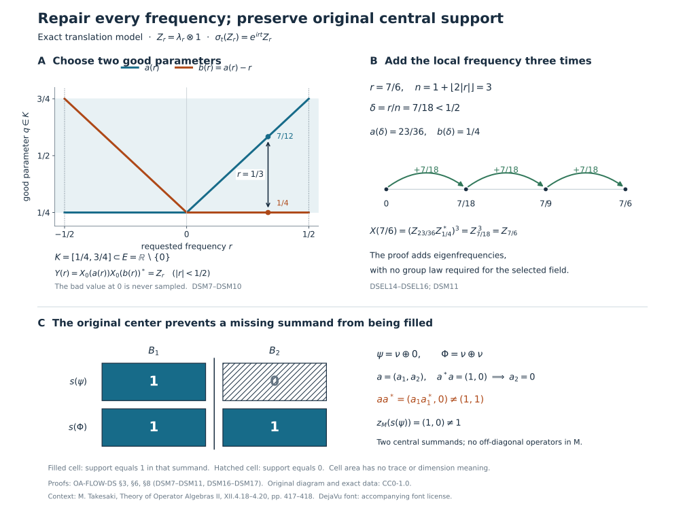

# Pointwise absorption and dominant weights

Suppose a weight can absorb every positive scalar by an inner change of coordinates. The implementing unitaries may have been chosen separately, with no dependence on the scalar. To compare two such weights, we first turn these unrelated choices into one measurable operator field. We then compare their trace amplifications and cancel the extra matrix factor using isometries in their centralizers.

For a weight supported on a proper projection, there is one further obstruction: the original central support. We identify it exactly, construct dominant weights, and give a direct-sum example where the obstruction occurs.

*Original exposition, examples, figures, data and reproducible drawing code in this lesson are dedicated to CC0-1.0. Source publications and font components retain their own terms.*

## Scope and the comparison mechanism

Throughout, \(M\ne0\) is a von Neumann algebra with separable predual and properly infinite identity. All weights are normal and semifinite, and equality of weights always means equality on the entire positive cone, including infinite values. A supported weight is faithful on its support corner; its centralizer is taken in that corner.

Separability is used to obtain a Polish unitary group and a Borel choice. Proper infiniteness of the weight centralizers is used later to cancel the amplification. Neither assumption is replaced by a factor hypothesis. The zero weight and zero algebra have their explicit conventions in the examples.

The earlier [comparison of dominant weights with supplied continuous eigenfields](OA-FLOW-DWC.md#dwc-2) remains available for arbitrary preduals. Here we prove the comparison from pointwise scalar equivalence under separable predual. The selected field need not be continuous or multiplicative.

Our measure-selection input is the proved [witness selection after completing the measure](../../OA-MOD/OA-MOD-SCF.html#choose-a-witness-after-completing-the-measure). Section 3 supplies its scalar tightness premise and then repairs its conull Borel representative at every real parameter. Sections 4–7 prove the full normal tensor and weight comparisons.

## 1. Supported equivalence and the theorem

For a normal semifinite weight \(\psi\), put \(p=s(\psi)\). The support theorem [NWR1](OA-FLOW-NWR.md#nwr-1) and its [semifinite-corner argument](OA-FLOW-NWR.md#nwr-4) give
\[
 \psi(x)=\psi(pxp)\quad(x\in M_+),\qquad
 \psi_p:=\psi|_{(pMp)_+}\text{ faithful normal semifinite}.
 \tag{DSEL1}
\]
Write \(M_\psi=(pMp)_{\psi_p}\), with identity \(p\). Infinite multiplicity means that this algebra is properly infinite. The zero weight will be treated separately.

For supported weights \(\psi,\eta\), with supports \(p,q\), define \(\psi\sim\eta\) when a partial isometry \(a\in M\) satisfies
\[
 a^*a=p,\qquad aa^*=q,\qquad
 \psi(x)=\eta(axa^*)\quad(x\in M_+).
 \tag{DSEL2}
\]
This agrees with [SCW's supported comparison convention](OA-FLOW-SCW.md#scw-4). Adjoint and composition of the implementing partial isometries prove symmetry and transitivity: for symmetry apply (DSEL1) and substitute \(a^*ya\); for transitivity multiply the two partial isometries in their support order. Equivalence preserves central support by [central support under equivalence](OA-FLOW-PC.md#oa-flow.pc.2). For faithful weights the partial isometry is a unitary.

A faithful weight \(\Phi\) is called dominant when \(M_\Phi\) is properly infinite and \(\Phi\sim c\Phi\) for every \(c>0\).

**Theorem.** Such a dominant weight exists on \(M\). Fix any one of them. If \(\psi\) has infinite multiplicity and
\[
 \psi\sim c\psi\quad(c>0),
 \tag{DSEL3}
\]
then
\[
 \boxed{\quad \psi\sim\Phi
       \quad\Longleftrightarrow\quad z_M(s(\psi))=1.\quad}
 \tag{DSEL4}
\]
In particular all faithful dominant weights are unitarily equivalent, with equality on the entire positive cone. For a specified stabilized trace-scaling crossed-product presentation, its dual trace weight is one possible \(\Phi\).

The proof below first handles faithful weights by measurable regularization, then reduces a full supported weight to that case. Finally it constructs a dominant weight directly on every properly infinite \(M\). No continuity hypothesis is added to (DSEL3).

## 2. The unitary group really is a Polish parameter space

We record the consequences of separable predual that the selection argument needs. Normal states have a countable norm-dense subset \((\rho_n)\): choose one point from each member of a countable metric basis that meets the set of normal states. Set
\(\rho=\sum_{n\ge1}2^{-n}\rho_n\) is a faithful normal state. A positive element annihilated by \(\rho\) is annihilated by every \(\rho_n\), hence by every normal state, and thus by every concrete vector state; it is zero.

Its [GNS representation](OA-FLOW-GNS.md#gns-theorem-5-1) \((\pi,H,\Omega)\) is faithful and normal. Faithfulness follows from
\(\|\pi(x)\Omega\|^2=\rho(x^*x)\). For normality, the coefficient functionals on dense GNS vectors are
\[
 x\longmapsto\langle\pi(x)\pi(a)\Omega,\pi(b)\Omega\rangle
 =\rho(b^*xa),
 \tag{DSEL5}
\]
which are normal. Approximation of both vectors and the bound for a vector functional put every coefficient in the norm-closed predual; summable vector series give normality on the whole ultraweak topology. These are the concrete predual properties proved in [CP4–6](OA-FLOW-CP.md#oa-flow.cp.4).

The Hilbert space \(H\) is separable. Indeed the unit ball of \(M=(M_*)^*\) is compact by [weak-star compactness](OA-FLOW-ST12.md#oa-flow.st.1), and its weak-star topology is metrizable: on that ball the evaluations at a countable norm-dense subset of \(M_*\) determine all evaluations by the uniform operator bound. A compact metric space has a countable dense subset \((x_n)\). The closed linear span of \(\pi(x_n)\Omega\) is all of \(H\): a vector orthogonal to it defines, by (DSEL5) and approximation, a normal functional vanishing on the dense subset of the unit ball, hence on \(M\). Cyclicity then makes the vector zero. The normal inverse and bounded strong-star topology are supplied by [normal isomorphisms and bounded strong-star convergence](OA-FLOW-ST12.md#oa-flow.st.2).

Identify \(M\) with this faithful normal image. Choose a dense sequence \((\xi_n)\) in the unit ball of \(H\). The unitary group \(\mathcal U(M)\) has the compatible metric
\[
 d(u,v)=\sum_{n\ge1}2^{-n}
 \left(\min(1,\|(u-v)\xi_n\|)
       +\min(1,\|(u^*-v^*)\xi_n\|)\right).
 \tag{DSEL6}
\]
A Cauchy sequence has strong limits \(u\) and \(v\) for its operators and adjoints, first on the dense sequence and then on all vectors by the common norm bound. Strong continuity of bounded products gives \(uv=vu=1\) and \(v=u^*\); strong closedness puts \(u\) in \(M\). Thus the metric is complete. The coordinate embedding into the countable product of copies of \(H\times H\) makes this topology second countable, hence separable. Multiplication and inversion are continuous by bounded strong-star multiplication. Therefore \(\mathcal U(M)\) is a Polish topological group.

For any normal automorphism \(\alpha\) of \(M\), the map \(u\mapsto\alpha(u)\) is continuous for (DSEL6), by ST2. In particular, this applies to every member of a modular group.

## 3. An everywhere Borel eigenunitary selector

**Selection lemma.** Let \(\alpha:\mathbb R\to\operatorname{Aut}(M)\) be a normal point-strong-star continuous action. Suppose that for every \(r\in\mathbb R\) there is a unitary \(u\in M\) with
\[
 \alpha_t(u)=e^{irt}u\quad(t\in\mathbb R).
 \tag{DSEL7}
\]
Then there is a Borel map \(X:\mathbb R\to\mathcal U(M)\) for the strong-star topology such that (DSEL7) holds with \(u=X(r)\) for **all** \(r,t\in\mathbb R\), and \(X(0)=1\).

First form the closed relation
\[
 \mathcal E=
 \bigcap_{t\in\mathbb Q}
 \{(r,u):\alpha_t(u)=e^{irt}u\}
 \subseteq\mathbb R\times\mathcal U(M).
 \tag{DSEL8}
\]
Each equality is closed by the continuity just proved. For a pair in this relation, continuity in \(t\) extends the equality from \(\mathbb Q\) to \(\mathbb R\). Thus its fibers are exactly the nonempty sets prescribed in (DSEL7). Each is a right coset of the closed group \(\mathcal U(M^\alpha)\): if \(u,v\) have frequency \(r\), then \(u^*v\) is fixed, and multiplying \(u\) by a fixed unitary gives another such \(v\).

We use only the completed-measure selection result actually proved in [OA-MOD's witness construction](../../OA-MOD/OA-MOD-SCF.html#choose-a-witness-after-completing-the-measure). It applies to the Borel relation (DSEL8), with Lebesgue measure on the standard sigma-finite base \(\mathbb R\), and gives a completed-measurable selector. Its proof codes a Borel relation by a closed relation with a Baire-space witness, proves that the projected hitting sets are measurable in the completed measure, and successively chooses the first shrinking closed cell with a nonempty fiber. Completeness gives a point in the closed fiber. This result alone makes no everywhere Borel-selector assertion.

The scalar tightness premise in that proof is available directly here. For a finite Borel measure on a Polish space with a complete metric, cover the space at level \(n\) by countably many balls of radius \(2^{-n}\), and retain finitely many capturing all but \(\varepsilon2^{-n}\) of the measure. The intersection of the resulting finite unions of closed balls is closed and totally bounded, hence compact by completeness, and its complement has measure at most \(\varepsilon\). Borel regularity follows by the usual finite-measure closed/open approximation argument: distance neighborhoods approximate closed sets from outside; complements and countable unions preserve the class of sets approximable by a closed subset and an open superset. Intersect the retained closed subset with a compact set from the preceding construction. Thus every Borel set has compact subsets of arbitrarily close measure. The same facts hold after completing the measure by removing Borel null supersets.

A completed-measurable map into a Polish space has a Borel version off a Borel null set. To verify this, approximate it by countably valued maps using the first element of a countable \(1/n\)-net within distance \(1/n\). Replace their countably many completed-measurable level sets by Borel versions, remove the countable union of null discrepancies, and take the pointwise Cauchy limit. The locus where the Borel approximants are Cauchy is Borel; completeness gives their limit there. Assign the identity outside that locus. Applied to our selector, this gives a Borel \(X_0:\mathbb R\to\mathcal U(M)\) such that
\[
 E=\{r:(r,X_0(r))\in\mathcal E\}
 \text{ is Borel and conull.}
 \tag{DSEL9}
\]

We now remove the exceptional parameters by an explicit argument. Choose a compact \(K\subset E\cap[0,1]\) of positive Lebesgue measure. Such a set exists by inner regularity. Put
\[
 h(r)=\int_{\mathbb R}1_K(q)1_K(q-r)\,dq.
 \tag{DSEL10}
\]
Then \(h(0)=|K|>0\), and
\[
 |h(r)-h(0)|
 \le\|1_K(\,\cdot-r)-1_K\|_1\longrightarrow0.
 \tag{DSEL11}
\]
The norm continuity is the exact translation statement in [L24, Lemma 3.1](OA-FLOW-L24.md#oa-flow.grp.translations). Consequently, for some \(\varepsilon>0\), every \(|r|<\varepsilon\) is a difference of two points of \(K\).

For \(r\in K-K\) define
\[
 a(r)=\min\{q\in K:q-r\in K\}.
 \tag{DSEL12}
\]
The set minimized is nonempty and compact. This is a Borel function: for every real \(b\), the set
\[
 \{r\in K-K:a(r)\le b\}
 =\{q-q':q\in K\cap(-\infty,b],\ q'\in K\}
 \tag{DSEL13}
\]
is compact. Thus no general coset-selection theorem is needed to select this pair. On \((-\varepsilon,\varepsilon)\), set
\[
 Y(r)=X_0(a(r))X_0(a(r)-r)^*.
 \tag{DSEL14}
\]
Both arguments belong to \(K\subset E\). Products and adjoints in the unitary group are continuous, so \(Y\) is Borel; and the two scalar frequencies subtract, giving
\[
 \alpha_t(Y(r))=e^{irt}Y(r)
 \quad(|r|<\varepsilon,\ t\in\mathbb R),\qquad Y(0)=1.
 \tag{DSEL15}
\]
Finally let
\[
 n(r)=1+\left\lfloor |r|/\varepsilon\right\rfloor,
 \qquad X(r)=Y(r/n(r))^{\,n(r)}.
 \tag{DSEL16}
\]
Here \(|r/n(r)|<\varepsilon\). On each Borel stratum where \(n(r)\) is constant, this is a Borel expression, so \(X\) is Borel on \(\mathbb R\). Applying \(\alpha_t\) to its power gives \(e^{irt}X(r)\), since the scalar phase commutes with every factor. Also \(X(0)=1\). This proves the lemma with no exceptional value of \(r\) or \(t\). It proves neither continuity of \(X\) nor a group law in \(r\), and neither is needed below.

## 4. The Borel field defines a normal tensor multiplier

Let \(X:\mathbb R\to\mathcal U(M)\) be Borel in (DSEL6). With \(H\) as above and \(L=L^2(\mathbb R,dq)\), define
\[
 (\mathfrak X\xi)(q)=X(q)\xi(q)
 \quad\bigl(\xi\in L^2(\mathbb R,H)\bigr).
 \tag{DSEL17}
\]
Each fixed-vector map \(q\mapsto X(q)\zeta\) is Borel into the separable Hilbert space \(H\), hence strongly measurable by countable simple approximation. Approximating a general measurable \(\xi\) by simple vector fields proves measurability of \(q\mapsto X(q)\xi(q)\). Pointwise norm preservation makes (DSEL17) an isometry, and the Borel adjoint field supplies its inverse. Thus \(\mathfrak X\) is a unitary on the full Hilbert space, using [L24's tensor/function identification](OA-FLOW-L24.md#oa-flow.grp.vectorintegration).

More precisely,
\[
 \mathfrak X\in M\bar\otimes L^\infty(\mathbb R)
 \subseteq M\bar\otimes B(L).
 \tag{DSEL18}
\]
Here is a proof of membership without appealing to an unspecified decomposition theorem. Choose a countable dense sequence \((v_j)\) in \(\mathcal U(M)\). For each \(n,q\), take the least \(j\) such that \(d(X(q),v_j)<1/n\), and call its value \(X_n(q)\). The level sets \(E_{nj}\) are Borel and partition \(\mathbb R\). Finite partial sums
\[
 \sum_{j\le m}v_j\otimes1_{E_{nj}}
 \tag{DSEL19}
\]
have norm at most one and converge strongly, together with their adjoints, to the multiplication operator of \(X_n\): the squared norm of a tail on a vector field is bounded by its squared integral on the remaining partition cells. Thus this operator belongs to the tensor algebra. Pointwise strong-star convergence \(X_n(q)\to X(q)\) and the bound two permit dominated convergence against \(\|\xi(q)\|^2\), for both operators and adjoints. Their multiplication operators converge strongly-star to \(\mathfrak X\), proving (DSEL18).

Normal transport also has its exact field meaning. For a normal automorphism \(\gamma\) of \(M\), the field \(\gamma(X(q))\) is Borel by ST2, and
\[
 (\gamma\bar\otimes\operatorname{id})(\mathfrak X)
 =M_{\gamma\circ X}.
 \tag{DSEL20}
\]
The normal amplification is the actual map constructed in [TW1](OA-FLOW-TW.md#tw-1). To check (DSEL20), choose a scalar orthonormal basis \((e_i)\) of \(L\). The \((i,j)\) matrix entry of \(\mathfrak X\) is the weak-star integral
\[
 b_{ij}=\int_{\mathbb R}
       e_j(q)\overline{e_i(q)}X(q)\,dq\in M.
 \tag{DSEL21}
\]
For every \(\omega\in M_*\), its pairing is the scalar integral of
\(e_j\overline{e_i}\,\omega(X(q))\). The integrand is measurable: a normal functional is continuous on the bounded strong-star unitary group, as follows from its vector series. Its absolute integral is at most
\(\|\omega\|\|e_j\|_2\|e_i\|_2\). Thus CP6's duality constructs the entry as an actual element of \(M\). Pairing \(\gamma(b_{ij})\) with \(\omega\) substitutes the normal functional \(\omega\circ\gamma\), proving (DSEL20) in every entry. TW1's bounded-array description makes the equality hold on the entire tensor algebra.

In particular, if (DSEL7) holds for the selected field, then for each real \(t\),
\[
 (\alpha_t\bar\otimes\operatorname{id})(\mathfrak X)
 =\mathfrak X(1\otimes V_t),
 \qquad (V_tf)(q)=e^{itq}f(q).
 \tag{DSEL22}
\]
The equality is first a pointwise identity on every vector field and then an equality of bounded operators. There is no common-null-set assertion over an uncountable family of separately chosen fields: the single selected \(X\) already satisfies every parameter identity.

## 5. Compare faithful weights under pointwise scalar absorption

Let \(\chi_1,\chi_2\) be faithful normal semifinite weights on \(M\), each with properly infinite centralizer, and assume \(\chi_j\sim c\chi_j\) for every \(c>0\). Faithfulness turns the equivalences into unitaries. Taking the desired scalar or its reciprocal gives, for every \(r\), some unitary \(u\) with
\[
 \chi_j\circ\operatorname{Ad}(u)=e^r\chi_j.
 \tag{DSEL23}
\]
The exact inner formula [GDA34](OA-FLOW-GDA.md#equation-gda34) and the scalar derivative formula [BC24](OA-FLOW-BC.md#bc-5) show that this equality is equivalent to
\[
 u^*\sigma_t^{\chi_j}(u)=e^{irt}1,
 \quad\text{or}\quad
 \sigma_t^{\chi_j}(u)=e^{irt}u.
 \tag{DSEL24}
\]
For the converse use [GDA7's fixed-reference injectivity](OA-FLOW-GDA.md#gda-7), so this is an equivalence of weights with their full scalar normalization. The selection lemma supplies Borel fields \(X_j(r)\) satisfying (DSEL24) for all \(r,t\).

Set
\[
 A=M\bar\otimes B(L),\qquad
 \Omega_j=\chi_j\bar\otimes\operatorname{Tr},\qquad
 k=1\otimes e^Q,
 \quad(Qf)(q)=qf(q),
 \qquad \eta_j=(\Omega_j)_k.
 \tag{DSEL25}
\]
The usual scalar trace is normalized to take value one on a rank-one projection. [TW2](OA-FLOW-TW.md#tw-2) constructs \(\Omega_j\) on the whole cone; [TW5](OA-FLOW-TW.md#tw-5) gives
\(\sigma_t^{\Omega_j}=\sigma_t^{\chi_j}\bar\otimes\operatorname{id}\). The positive nonsingular density \(k\) is affiliated with this centralizer. The full [CZ2 construction](OA-FLOW-CZ.md#cz-2) is
\[
 \eta_j(Y)=\sup_{\delta>0}
  \Omega_j(k_\delta^{1/2}Yk_\delta^{1/2}),
 \qquad k_\delta=k(1+\delta k)^{-1},
 \tag{DSEL26}
\]
with the increasing scalar supremum as \(\delta\downarrow0\), and [the derivative of a centralizer density](OA-FLOW-CZ.md#cz-6) gives
\((D\eta_j:D\Omega_j)_t=1\otimes V_t\). The weights \(\eta_j\) are faithful normal semifinite.

For the Borel multipliers \(\mathfrak X_j\) constructed above, (DSEL22) now reads
\[
 \mathfrak X_j^*\sigma_t^{\Omega_j}(\mathfrak X_j)
 =1\otimes V_t.
 \tag{DSEL27}
\]
The inner derivative formula and fixed-reference injectivity imply
\[
 \Omega_j\circ\operatorname{Ad}(\mathfrak X_j)=\eta_j
 \quad\text{on }A_+.
 \tag{DSEL28}
\]
This is the step for which mere unrelated pointwise choices would not suffice.

The unconditional regularized comparison in [regularized weight comparison](OA-FLOW-DWC.md#dwc-2) applies to the two faithful weights and gives
\[
 \eta_2=\eta_1\circ\operatorname{Ad}(v^*)
 \quad\text{for a unitary }v\in A.
 \tag{DSEL29}
\]
Its proof uses the strongly continuous relative modular cocycle
\(c_t=(D\chi_2:D\chi_1)_t\), rather than continuity of \(X_j\). Specifically [DWC1](OA-FLOW-DWC.md#dwc-1) constructs \(v\) with
\[
 c_t\otimes V_t
 =v(1\otimes V_t)
       (\sigma_t^{\chi_1}\bar\otimes\operatorname{id})(v^*);
 \tag{DSEL30}
\]
DWC2 then identifies the actual weights by the normalized derivative. Combining (DSEL28) and (DSEL29), in order, gives
\[
 U=\mathfrak X_1v^*\mathfrak X_2^*\in\mathcal U(A),
 \qquad \Omega_2=\Omega_1\circ\operatorname{Ad}(U).
 \tag{DSEL31}
\]

For completeness, the cancellation uses no remaining regularity of the selected fields. Choose, by [properly infinite filling families](OA-FLOW-PC.md#oa-flow.pc.5), filling isometries \(r_{jn}\in M_{\chi_j}\), with
\(r_{jn}^*r_{jm}=\delta_{nm}1\) and \(\sum_nr_{jn}r_{jn}^*=1\) strongly. In a countable orthonormal basis of \(L\), let
\[
 R_j=\sum_{n\ge1}r_{jn}\otimes e_{1n},\qquad
 e=1\otimes e_{11}.
 \tag{DSEL32}
\]
The row series and its adjoint converge strongly by orthogonal square-sum tails; hence \(R_j\in A_{\Omega_j}\), with \(R_j^*R_j=1\), \(R_jR_j^*=e\). The [whole-cone row identity in DWC3](OA-FLOW-DWC.md#dwc-3) gives
\[
 \Omega_j(R_jYR_j^*)=\Omega_j(Y),\qquad
 \Omega_j(R_j^*ZR_j)=\Omega_j(Z)\quad(Z\in(eAe)_+).
 \tag{DSEL33}
\]
To recall why infinity is included, centralizer ideal stability and cyclicity prove equality when either side is finite; applying the inverse corner map proves finiteness in the other direction. Thus one side cannot be finite when the other is infinite. No finite value of \(\Omega_j(e)\) is assumed.

Now \(a=R_1UR_2^*\) is a unitary of \(eAe\), and
\[
 \Omega_1(aZa^*)
 =\Omega_1(UR_2^*ZR_2U^*)
 =\Omega_2(R_2^*ZR_2)
 =\Omega_2(Z).
 \tag{DSEL34}
\]
Write \(a=w\otimes e_{11}\). The rank-one normalization
\(\Omega_j(x\otimes e_{11})=\chi_j(x)\) gives
\[
 \boxed{\ \chi_2(x)=\chi_1(wxw^*)\quad(x\in M_+),
          \qquad w\in\mathcal U(M).\ }
 \tag{DSEL35}
\]
This proves faithful dominant-weight uniqueness from the original pointwise scalar hypothesis.

## 6. Reduce exactly the full supported case

Let \(p=s(\psi)\), assume (DSEL3), and assume \(z_M(p)=1\). Infinite multiplicity supplies two isometries with initial projection \(p\) and orthogonal final projections below \(p\), inside \(M_\psi\). They are also elements of \(pMp\); hence \(p\) is properly infinite as a projection of \(M\).

The faithful normal state constructed in Section 2 makes \(1\) countably decomposable: an orthogonal family of nonzero projections has positive state values, and only finitely many can have value at least \(1/n\). [comparison from countably decomposable projections](OA-FLOW-PC.md#oa-flow.pc.7), with source \(1\) and target \(p\), therefore gives \(1\precsim p\). Inclusion gives \(p\precsim1\). [projection Cantor–Bernstein](OA-FLOW-PC.md#oa-flow.pc.3) yields a partial isometry \(s\in M\) with
\[
 s^*s=1,\qquad ss^*=p.
 \tag{DSEL36}
\]
The map \(F:M\to pMp\), \(F(x)=sxs^*\), is a normal isomorphism with normal inverse \(y\mapsto s^*ys\); its multiplication and inverse identities follow from the two displayed projections. Define
\[
 \chi(x)=\psi(sxs^*)\quad(x\in M_+).
 \tag{DSEL37}
\]
Normal isomorphism transport makes \(\chi\) faithful normal semifinite. Modular covariance [BC5](OA-FLOW-BC.md#bc-5) gives
\(M_\chi=s^*M_\psi s\), so it is properly infinite.

For each \(r\), (DSEL3) supplies a unitary \(b_r\) of the supported algebra \(pMp\), oriented so that
\(\psi_p\circ\operatorname{Ad}(b_r)=e^r\psi_p\). Then \(s^*b_rs\) is a unitary of \(M\), and direct substitution shows
\[
 \chi\circ\operatorname{Ad}(s^*b_rs)=e^r\chi.
 \tag{DSEL38}
\]
The faithful theorem compares \(\chi\) with a fixed dominant \(\Phi\), giving \(\chi=\Phi\circ\operatorname{Ad}(w)\) for some \(w\in\mathcal U(M)\). Put \(a=ws^*\). Then
\[
 a^*a=p,\qquad aa^*=1,\qquad
 \begin{aligned}
 \Phi(axa^*)&=\chi(s^*xs)\\
              &=\psi(pxp)=\psi(x)\quad(x\in M_+).
 \end{aligned}
 \tag{DSEL39}
\]
Thus \(\psi\sim\Phi\). Conversely, (DSEL2) and PC2 imply that equivalence to a faithful weight forces \(z_M(p)=z_M(1)=1\). This proves both directions of (DSEL4).

More generally, the same argument in \(zM\), where \(z=z_M(p)\), compares \(\psi\) with the restriction of \(\Phi\) to that central summand, extended by zero on \((1-z)M\). Indeed every modular group fixes the center by [NC4](OA-FLOW-NC.md#oa-flow.nc.4); [CZ5](OA-FLOW-CZ.md#cz-5) gives the faithful normal semifinite central restriction. Compressing the filling isometries of \(M_\Phi\) by \(z\) gives a filling family in its centralizer, and the scalar implementers commute with \(z\). Thus the obstruction is exactly central support, not faithfulness of the original supported weight.

## 7. Existence and the dual trace representative

The existence assertion can be proved directly, without presuming an unproved stabilized decomposition. Choose a faithful normal state \(\rho\) on \(M\). Let
\[
 K=L^2(\mathbb R,dq)\otimes\ell^2(\mathbb N),\qquad
 A=M\bar\otimes B(K),\qquad
 \Omega=\rho\bar\otimes\operatorname{Tr}_K,
 \qquad k=1\otimes e^Q\otimes1.
 \tag{DSEL40}
\]
The domain of \(e^Q\otimes1\) consists of fields \(\xi\) with
\(\int e^{2q}\|\xi(q)\|_{\ell^2}^2dq<\infty\). Compact coordinate truncation proves density; multiplication by the strictly positive function \(e^q\) gives a positive nonsingular selfadjoint operator. Its spectral projections belong to \(1\otimes L^\infty(\mathbb R)\otimes1\), which is fixed by \(\sigma^\Omega\). Define \(\eta=\Omega_k\) by the whole-cone cutoff formula (DSEL26). CZ2 makes it faithful normal semifinite, and [CZ5](OA-FLOW-CZ.md#cz-5) gives
\[
 \sigma_t^\eta
 =\sigma_t^\rho\bar\otimes
        \operatorname{Ad}(V_t\otimes1).
 \tag{DSEL41}
\]
The algebra \(A_\eta\) contains the unital subalgebra
\(1\otimes1\otimes B(\ell^2)\). Its even- and odd-coordinate isometries have orthogonal ranges and initial projection one; thus \(A_\eta\) is properly infinite.

For \((\lambda_r f)(q)=f(q-r)\), direct calculation gives
\[
 V_t\lambda_r V_t^*=e^{irt}\lambda_r.
 \tag{DSEL42}
\]
Hence \(Z_r=1\otimes\lambda_r\otimes1\) is a strongly continuous eigenunitary field for \(\eta\). By (DSEL24),
\(\eta\circ\operatorname{Ad}(Z_r)=e^r\eta\) on all of \(A_+\).

Proper infiniteness of \(M\) now moves this example back to \(M\). The space \(K\) has a countable orthonormal basis, and PC5 supplies filling isometries \((s_n)\) in \(M\). The row
\(R=\sum_ns_n\otimes e_{1n}\) satisfies \(R^*R=1_A\), \(RR^*=1\otimes e_{11}\), with strong-star convergence exactly as in (DSEL32). Thus
\[
 A\longrightarrow M,\qquad
 X\longmapsto F(X),\quad
 RXR^*=F(X)\otimes e_{11},
 \tag{DSEL43}
\]
is a normal isomorphism with normal inverse. No weight preservation by this row is required: define \(\Phi=\eta\circ F^{-1}\). Normal transport preserves faithfulness, normality and semifiniteness, carries \(A_\eta\) onto \(M_\Phi\), and carries the unitaries \(Z_r\) to scalar implementers of \(\Phi\). Therefore \(\Phi\) is dominant, proving existence.

If \(M=N\rtimes_\theta\mathbb R\) is a specified stabilized trace-scaling presentation with \(N\) properly infinite and \(\tau\theta_s=e^{-s}\tau\), the actual dual weight \(\widetilde\tau\) has centralizer \(N\) and satisfies
\[
 \sigma_t^{\widetilde\tau}(u_s)=e^{-ist}u_s
 \tag{DSEL44}
\]
by [DWC4](OA-FLOW-DWC.md#dwc-4) and its exact modular providers. Taking \(s=-r\) and applying (DSEL24) gives
\(\widetilde\tau\circ\operatorname{Ad}(u_{-r})=e^r\widetilde\tau\). It is dominant, so (DSEL35) identifies it with the weight constructed above and (DSEL39) identifies every full supported weight in the theorem with it. This proves the original dual-weight conclusion whenever that presentation is used, without changing its scalar sign.

## 8. Models and solved diagnostics

The following models show how the measurable eigenfield construction, proper infiniteness of the supported centralizer, and full central support in the original algebra enter [Sections 1–7](#ds-1). They also keep the scalar normalization visible on positive elements of infinite weight.

### The weighted translation model

Put \(H_0=L^2(\mathbb R,dq)\), \(H=H_0\otimes\ell^2(\mathbb N)\), and \(B=B(H)\), where \(\mathbb N=\{1,2,3,\ldots\}\) and \((\delta_n)_{n\ge1}\) is the multiplicity basis. On \(H\), let
\[
 (h\xi)(q)=e^q\xi(q),\qquad
 D(h)=\left\{\xi:\int_{\mathbb R}e^{2q}\|\xi(q)\|^2\,dq<\infty\right\}.
 \tag{DSM1}
\]
Multiplication by \(e^q\) is positive, selfadjoint and nonsingular. Truncating to bounded intervals in \(q\) proves density of its domain and convergence in its graph norm. Define, on the entire positive cone,
\[
 h_\delta=h(1+\delta h)^{-1},\qquad
 \nu(x)=\sup_{\delta>0}\operatorname{Tr}(h_\delta^{1/2}x h_\delta^{1/2})
 \quad(x\in B_+).
 \tag{DSM2}
\]
The supremum increases as \(\delta\downarrow0\). The [unbounded-density construction](OA-FLOW-CZ.md#cz-2) makes \(\nu\) faithful, normal and semifinite; its [full modular formula](OA-FLOW-CZ.md#cz-5) gives
\[
 \sigma_t^\nu=\operatorname{Ad}(V_t\otimes1),\qquad
 (V_tf)(q)=e^{itq}f(q),\qquad
 (\lambda_rf)(q)=f(q-r),\qquad Z_r=\lambda_r\otimes1.
 \tag{DSM3}
\]
This is the concrete instance of (DSEL40)–(DSEL42) in [Section 7](#ds-7). The centralizer contains \(1\otimes B(\ell^2)\). In that subalgebra the isometries
\(j_0\delta_n=\delta_{2n}\) and \(j_1\delta_n=\delta_{2n-1}\) have orthogonal ranges summing to one. Hence \(B_\nu\) is properly infinite. Diagnostic 1 proves scalar absorption directly from (DSM2), including infinite values, so \(\nu\) is dominant.

The figure shows actual parameter coordinates in the selector construction and the two original central summands in the support obstruction.

*Figure 1.* In the upper left, \(a(r)\) and \(a(r)-r\) lie in \(K=[1/4,3/4]\), and their signed difference is \(r\). The upper right uses \(r=7/6\), \(n=3\), and \(r/n=7/18\); the three arrows add exact frequencies. The lower panel records supports in \(B\oplus B\), not dimensions or finite traces. Diagnostic 2 proves the coordinate formulas, and Diagnostic 5 proves the central obstruction. The drawing is an original schematic of these exact objects. [Reproducible source](../assets/pointwise-dominant-weights/render.py), [exact data](../assets/pointwise-dominant-weights/data.json), [PNG](../assets/pointwise-dominant-weights/ds-models.png), [terms](../assets/pointwise-dominant-weights/TERMS.md) and [font license](../assets/pointwise-dominant-weights/FONT-LICENSE.txt) accompany the figure.

### Diagnostic 1. Determine the scalar, including infinite values

Compute \(\nu\circ\operatorname{Ad}(Z_r)\), check it on a rank-one projection, and reconcile its sign with the crossed-product generators in (DSEL44).

**Solution.** On the full domain, substitution gives
\[
 Z_r^*hZ_r=e^r h,\qquad
 Z_r^*h_\delta Z_r=e^r h_{\delta e^r},\qquad
 V_t\lambda_rV_t^*=e^{irt}\lambda_r.
 \tag{DSM4}
\]
For the first identity the domain condition becomes
\(\int e^{2q}\|\xi(q-r)\|^2dq=e^{2r}\int e^{2q}\|\xi(q)\|^2dq\), so it also identifies the domains. The bounded identity follows by spectral calculus. Unitary invariance of the positive trace and (DSM2) now give
\[
 \begin{aligned}
 \nu(Z_rxZ_r^*)
 &=\sup_{\delta>0}\operatorname{Tr}\!\left((Z_r^*h_\delta Z_r)^{1/2}
                 x(Z_r^*h_\delta Z_r)^{1/2}\right)\\
 &=e^r\sup_{\delta>0}\operatorname{Tr}
       (h_{\delta e^r}^{1/2}x h_{\delta e^r}^{1/2})
 =e^r\nu(x).
 \end{aligned}
 \tag{DSM5}
\]
The positive suprema and trace invariance apply even when their value is infinite; no subtraction of weights occurs.

For a unit vector \(\xi\in H\), let \(p_\xi\) be its rank-one projection. Taking the trace of the rank-one cutoff and using monotone convergence gives
\[
 \nu(p_\xi)=\int_{\mathbb R}e^q\|\xi(q)\|^2dq\in[0,\infty].
 \tag{DSM6}
\]
In particular \(\xi=1_{[0,1]}\otimes\delta_1\) has weight \(e-1\), and its translate has weight \(e^r(e-1)\). A unit vector proportional to \(1_{[0,\infty)}e^{-q/4}\otimes\delta_1\) has infinite weight before and after translation, exactly as (DSM5) states. Finally \(u_s\) in (DSEL44) has frequency \(-s\), so [Section 5's normalized inner derivative](#ds-5) gives \(\widetilde\tau\circ\operatorname{Ad}(u_s)=e^{-s}\widetilde\tau\). The implementer for the scalar \(e^r\) is \(u_{-r}\).

### Diagnostic 2. Repair a deliberately wrong Borel value

For the action in (DSM3), consider the Borel field
\[
 X_0(r)=
 \begin{cases}Z_r,&r\ne0,\\ Z_1,&r=0.\end{cases}
 \qquad E=\mathbb R\setminus\{0\},\qquad K=[1/4,3/4].
 \tag{DSM7}
\]
Carry out the complete repair in [Section 3](#ds-3), including a parameter outside \(K-K\).

**Solution.** The eigenidentity fails at \(r=0\), since \(Z_1\) has frequency one rather than zero. The good set is exactly \(E\). Elementary interval intersection gives
\[
 \int 1_K(q)1_K(q-r)\,dq=\max(0,1/2-|r|),\qquad
 K-K=[-1/2,1/2].
 \tag{DSM8}
\]
Thus \(\varepsilon=1/2\) works for the open interval used in (DSEL15). For every \(r\in K-K\), the first point of \(K\cap(K+r)\) is
\[
 a(r)=\max(1/4,1/4+r),\qquad b(r)=a(r)-r,
 \qquad a(r),b(r)\in K,\qquad a(r)-b(r)=r.
 \tag{DSM9}
\]
Both arguments are good, including at \(r=0\). Since \(Z_aZ_b^*=Z_{a-b}\),
\[
 \begin{gathered}
 Y(r)=X_0(a(r))X_0(b(r))^*=Z_r\quad(|r|<1/2),\\
 n(r)=1+\lfloor2|r|\rfloor,\qquad
 X(r)=Y(r/n(r))^{n(r)}=Z_r\quad(r\in\mathbb R).
 \end{gathered}
 \tag{DSM10}
\]
In particular \(Y(0)=Z_{1/4}Z_{1/4}^*=1\); the bad value \(X_0(0)\) is never used. At \(r=7/6\), the exact choices are
\[
 n=3,\qquad r/n=7/18,\qquad
 a(r/n)=23/36,\quad b(r/n)=1/4,\qquad
 (Z_{23/36}Z_{1/4}^*)^3=Z_{7/6}.
 \tag{DSM11}
\]
The extra one in \(n(r)\) ensures a strict inequality \(|r/n(r)|<1/2\), even when \(2|r|\) is an integer. Although the repaired field in this example is continuous and multiplicative, the abstract proof uses only Borel products, adjoints and powers: eigenfrequencies subtract in a product with an adjoint and add in a power. It neither assumes nor deduces those additional properties.

Assigning the identity to every bad value is not a general repair. For example, keep \(Z_r\) except at \(r=1\), and put \(X_0(1)=1\). This is another Borel field correct on a conull set, but its value at one still has frequency zero. A conull statement alone cannot be substituted at a specified parameter; the compact-set construction supplies that missing pointwise assertion.

### Diagnostic 3. An everywhere discontinuous eigenfield with no group law

Construct a normalized Borel eigenfield for \(\sigma^\nu\) that is discontinuous at every parameter and is not multiplicative.

**Solution.** On \(\ell^2\), choose the fixed unitary \(c\) given by \(c\delta_1=-\delta_1\), \(c\delta_n=\delta_n\) for \(n\ge2\). Let \(S=\mathbb Q\setminus\{0\}\) and set
\[
 W(r)=\lambda_r\otimes c^{1_S(r)}.
 \qquad W(0)=1,\qquad
 \sigma_t^\nu(W(r))=e^{irt}W(r)
 \quad(r,t\in\mathbb R).
 \tag{DSM12}
\]
The indicator of \(S\) is Borel, the translation field is strongly continuous, and multiplication on bounded sets is strong-star continuous. Hence \(W\) is Borel in the metric of [Section 2](#ds-2). Its second factor belongs to the centralizer, which proves the eigenidentity.

At any \(r_0\), approach through nonzero rationals and through irrationals. On a nonzero vector \(f\otimes\delta_1\), the two strong limits are \(-\lambda_{r_0}f\otimes\delta_1\) and \(\lambda_{r_0}f\otimes\delta_1\), respectively; they differ by norm \(2\|f\|\). Thus no point of continuity exists. Moreover
\[
 W(1/2)^2=\lambda_1\otimes1\ne\lambda_1\otimes c=W(1).
 \tag{DSM13}
\]
Nevertheless [Section 4](#ds-4) applies to this field, and the comparison proof requires nothing further of it.

### Diagnostic 4. The normal tensor operator can forget a null set

Describe the multiplication operators associated with \(Z\) and \(W\) on \(L^2(\mathbb R_r,H)\), verify their modular transport directly, and explain what their equality does not prove about the fields.

**Solution.** Writing vectors as \(\xi(r,q)\in\ell^2\), the first multiplier is the unitary shear
\[
 (\mathfrak Z\xi)(r,q)=\xi(r,q-r),\qquad
 (\mathfrak Z^*\xi)(r,q)=\xi(r,q+r).
 \tag{DSM14}
\]
Fubini and the measure-preserving substitution in \(q\) prove the two norm identities and inverse formulas. Section 4 gives \(\mathfrak Z\in B\bar\otimes L^\infty(\mathbb R_r)\) by its bounded simple-field approximations, so this is also a statement about the normal tensor algebra. The multiplier \(\mathfrak W\) has the additional factor \(c^{1_S(r)}\). Since \(S\) is null,
\[
 \mathfrak W=\mathfrak Z,\qquad
 (\sigma_t^\nu\bar\otimes\operatorname{id})(\mathfrak Z)
 =\mathfrak Z(1\otimes V_t^{(r)}),\qquad
 (V_t^{(r)}g)(r)=e^{itr}g(r).
 \tag{DSM15}
\]
For the second identity, conjugating (DSM14) by multiplication by \(e^{itq}\) contributes exactly \(e^{itq}e^{-it(q-r)}=e^{itr}\). It therefore holds on the entire Hilbert space. The same identity for \(\mathfrak W\) follows either from equality or from the everywhere eigenidentity (DSM12).

Equality of these normal multipliers cannot imply equality or continuity of their chosen pointwise representatives: \(W\) differs from \(Z\) at every nonzero rational and is everywhere discontinuous. Similarly (DSM7) defines the same multiplier but fails the eigenidentity at zero. Section 3 proves the everywhere assertion before Section 4 passes to operators; one cannot recover it from operator equality alone.

### Diagnostic 5. A missing original central summand is an obstruction

Let \(M=B\oplus B\), \(\psi=\nu\oplus0\), and \(\Phi=\nu\oplus\nu\). Verify all relevant hypotheses for \(\psi\), and decide whether \(\psi\sim\Phi\).

**Solution.** Both summands have separable predual and properly infinite identity, so \(M\) does too. The weight \(\psi\) is normal and semifinite: its finite ideal is the direct sum of the finite ideal of \(\nu\) and the entire second summand, hence is ultraweakly dense. Its support and original central support are
\[
 p=s(\psi)=1\oplus0,\qquad z_M(p)=p,\qquad
 M_\psi=B_\nu\oplus0.
 \tag{DSM16}
\]
The supported centralizer is properly infinite with identity \(p\). The unitaries \(Z_r\oplus0\) of \(pMp\) implement the scalar identity \(\psi_p\circ\operatorname{Ad}(Z_r\oplus0)=e^r\psi_p\). Equivalently, to realize the convention (DSEL2) for \(\psi\sim e^r\psi\), use \(Z_{-r}\oplus0\). Thus every positive scalar is absorbed in exactly the supported sense of [Section 1](#ds-1). The faithful weight \(\Phi\) is dominant by applying these same constructions on both summands.

If a partial isometry \(a=(a_1,a_2)\in M\) implemented \(\psi\sim\Phi\), it would satisfy
\[
 a^*a=(1,0),\qquad aa^*=(1,1).
 \tag{DSM17}
\]
The second component of the first equation forces \(a_2^*a_2=0\), hence \(a_2=0\); the second component of the second equation would then read \(0=1\). This is impossible. The obstruction concerns central support in the original algebra \(M\), even though the supported weight is faithful on its own corner. The central-summand conclusion of [Section 6](#ds-6) remains exact: the restriction of \(\Phi\) to \(pM\), extended by zero, is precisely \(\psi\).

### Diagnostic 6. A proper support can still be full

In the factor \(B\), let \(s=1\otimes j_0\), \(p=ss^*<1\), and define \(\omega(x)=\nu(s^*xs)\) for \(x\in B_+\). Determine its support, scalar implementers and equivalence to \(\nu\).

**Solution.** Compression is normal and positive. On \(pBp\), the map \(y\mapsto s^*ys\) is a normal isomorphism onto \(B\), so the restriction of \(\omega\) is faithful, normal and semifinite. Its extension by the support compression is semifinite on \(B\) as well: the positive selfadjoint density equal to \(shs^*\) on \(pH\) and zero on \((1-p)H\) has dense square-root domain \(D\). The same trace cutoffs as (DSM2) identify its density weight with \(\omega\). For \(v\in D\) and \(u\in H\), the rank-one operator \(|u\rangle\langle v|\) belongs to the finite left ideal, because its adjoint square is \(\|u\|^2|v\rangle\langle v|\) and has finite weight. Their span is strongly dense, proving semifiniteness. Thus the support is exactly \(p\). Since \(B\) is a factor and \(p\ne0\), its original central support is one. Normal modular transport gives
\[
 B_\omega=sB_\nu s^*,\qquad
 b_r=sZ_rs^*\in\mathcal U(pBp),\qquad
 \omega(b_rxb_r^*)=e^r\omega(x).
 \tag{DSM18}
\]
The first equality makes the supported centralizer properly infinite; the last follows by multiplying out \(s^*s=1\) and using (DSM5). Finally \(a=s^*\) satisfies
\[
 a^*a=p,\qquad aa^*=1,\qquad
 \nu(axa^*)=\nu(s^*xs)=\omega(x)\quad(x\in B_+).
 \tag{DSM19}
\]
Therefore \(\omega\sim\nu\), although \(\omega\) is not faithful on \(B\). This separates full central support from equality of support with one.

### Diagnostic 7. Scalar absorption does not imply infinite multiplicity

Remove the \(\ell^2\) factor from the model: let \(B_0=B(H_0)\) and \(\nu_0=\operatorname{Tr}_{e^Q}\). Prove that \(\nu_0\) absorbs every positive scalar but cannot be equivalent to a dominant weight on \(B_0\).

**Solution.** The cutoff proof of Diagnostic 1 works unchanged, so \(\nu_0\circ\operatorname{Ad}(\lambda_r)=e^r\nu_0\). Its modular group is \(\operatorname{Ad}(V_t)\). We claim
\[
 (B_0)_{\nu_0}=\{V_t:t\in\mathbb R\}'
              =L^\infty(\mathbb R)\quad\text{acting by multiplication}.
 \tag{DSM20}
\]
Here is a direct proof of the second equality. If \(T\) commutes with every \(V_t\), then for \(\xi,\eta\in H_0\) the \(L^1\) function
\(g=\xi\overline{T^*\eta}-(T\xi)\overline\eta\) has \(\int e^{itq}g(q)dq=0\) for all \(t\). The [proved scalar Fourier uniqueness theorem](OA-FLOW-FF.md#oa-flow.ff.3) gives \(g=0\) almost everywhere. Testing against any bounded measurable scalar function now proves that \(T\) commutes with every multiplication operator.

To identify this commutant without a multiplicity assumption, take the strictly positive vector \(\zeta(q)=e^{-|q|}\in H_0\), and put \(f(q)=(T\zeta)(q)/\zeta(q)\). Commutation with indicators gives
\[
 \int_A |f|^2|\zeta|^2\le\|T\|^2\int_A|\zeta|^2
 \quad\text{for every measurable }A.
 \tag{DSM21}
\]
Hence \(|f|\le\|T\|\) almost everywhere. For bounded \(b\), one has \(T(b\zeta)=fb\zeta\). Such vectors are dense, by truncating \(\xi/\zeta\) for any \(\xi\in H_0\), so \(T=M_f\). Conversely, multiplication operators commute with all \(V_t\), proving (DSM20).

This centralizer is abelian and cannot have properly infinite identity: in an abelian algebra \(v^*v=1\) implies \(vv^*=1\), so two isometries cannot have orthogonal ranges. The algebra \(B_0\) itself is properly infinite and has separable predual. [Section 7](#ds-7) supplies a faithful dominant weight \(\Phi_0\) on it; concretely one may transport \(\nu\) along a Hilbert-space unitary \(H_0\cong H_0\otimes\ell^2\). If \(\nu_0\sim\Phi_0\), faithfulness makes the implementer unitary, and modular covariance would identify their centralizers. One is abelian and the other properly infinite, a contradiction. Thus infinite multiplicity is a necessary hypothesis in the dominant-weight conclusion, not a consequence of pointwise scalar absorption.

### Diagnostic 8. Cancel an amplification whose corner has infinite weight

For the dominant model \(\nu\), set \(A=B\bar\otimes B(\ell^2)\), \(\Omega=\nu\bar\otimes\operatorname{Tr}\), and \(e=1\otimes e_{11}\). Construct a centralizer row and determine whether the cancellation argument requires \(\Omega(e)<\infty\).

**Solution.** For \(n,k\ge1\), define \(v_n\delta_k=\delta_{2^{n-1}(2k-1)}\) on the multiplicity space of \(H\). Every positive integer has a unique such expression, so
\(v_n^*v_m=\delta_{nm}1\) and \(\sum_n v_nv_n^*=1\) strongly. Put \(r_n=1_{H_0}\otimes v_n\in B_\nu\). With the matrix units in the additional amplification factor,
\[
 R=\sum_{n\ge1}r_n\otimes e_{1n}\in A_\Omega,\qquad
 R^*R=1,\qquad RR^*=e.
 \tag{DSM22}
\]
The two series converge strongly by the square-sum argument of (DSEL32). The weight identities of [Section 5](#ds-5), proved on the whole cone by [centralizer-row cancellation](OA-FLOW-DWC.md#dwc-3), give
\[
 \Omega(RYR^*)=\Omega(Y)\quad(Y\in A_+),\qquad
 \Omega(R^*ZR)=\Omega(Z)\quad(Z\in(eAe)_+).
 \tag{DSM23}
\]
They include the infinite values. Indeed, the rank-one projections onto \(1_{[0,1]}\otimes\delta_k\) are orthogonal and each has \(\nu\)-weight \(e-1\). Their finite sums are bounded by one, so \(\nu(1)\ge N(e-1)\) for every \(N\); hence \(\Omega(e)=\nu(1)=\infty\). Yet the row identities hold, and \(\Omega(x\otimes e_{11})=\nu(x)\) retains the exact normalization.

Isometries merely lying in \(B\) do not establish these weight identities. Already the ambient unitary \(Z_r\), for \(r\ne0\), changes the finite value of the rank-one projection in Diagnostic 1 by \(e^r\). The centralizer condition in the row construction is precisely what supplies weight preservation; ambient proper infiniteness alone supplies only an algebraic stabilization.

### The zero cases and the two comparison routes

On nonzero \(M\), the zero weight has support zero and is equivalent only to the zero weight: (DSEL2) forces \(a^*a=0\), hence \(a=0\) and \(aa^*=0\). Its supported centralizer is the zero algebra, excluded by the nonzero proper-infiniteness convention in infinite multiplicity. If \(M=0\), there is only the unique zero weight and its zero equivalence; no nonzero proper-infiniteness assertion is made.

Finally, the countability used in [Section 6](#ds-6) belongs to the separable-predual theorem proved here. It cannot be discarded merely because a projection has full central support. In \(B(\ell^2(I))\) with \(I\) uncountable, projection onto a countably infinite coordinate subset is properly infinite and has central support one, but is not equivalent to the identity: their Hilbert-space ranges have different cardinal dimensions. The earlier [DWC comparison](OA-FLOW-DWC.md#dwc-2) remains a separate proved route for faithful weights on arbitrary preduals when continuous eigenfields and properly infinite centralizers are supplied. The present result removes the continuous-field hypothesis under separable predual and pointwise scalar equivalence, with the exact supported qualification (DSEL4).

## Further reading

M. Takesaki, *Theory of Operator Algebras II*, Theorem XII.4.18, Lemma XII.4.19 and Definition XII.4.20, printed pp. 417–418, discuss scalar absorption, regularized comparison and dominant weights.

The earlier programme proofs used here are [dominant-weight comparison](OA-FLOW-DWC.md#dwc-2), [normal matrix amplification](OA-FLOW-TW.md#tw-1), [projection comparison](OA-FLOW-PC.md#oa-flow.pc.7), and [measurable witness selection](../../OA-MOD/OA-MOD-SCF.html#choose-a-witness-after-completing-the-measure).
