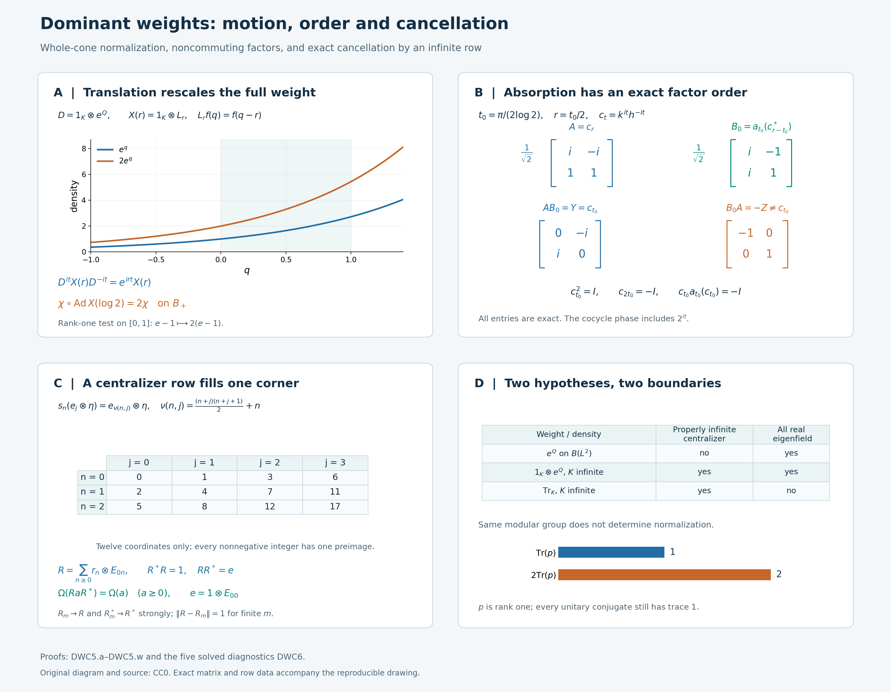

# Dominant weights and inner comparison

Two faithful weights can have the same modular automorphisms and still assign different values to positive elements. A comparison of weights must retain those values, including infinity. We construct the implementing unitary through a scalar regular representation and then remove that auxiliary Hilbert space by an explicit centralizer calculation.

The argument uses continuous families of modular eigenunitaries. Those families are already present for the dual trace weight of a trace-scaling crossed product and for each of its automorphic images. They let us compare these weights without a separability hypothesis or a selection of unitaries from pointwise existence statements.

*Original exposition, examples, figures, data and reproducible drawing code in this lesson are dedicated to CC0-1.0. Source publications and font components retain their own terms.*

## Weights, continuous eigenfields and exact comparison

Let \(B\ne0\) be a von Neumann algebra, and let \(\chi_1,\chi_2\) be faithful normal semifinite weights. Write
\[
 B_{\chi_j}=\{x\in B:\sigma_t^{\chi_j}(x)=x
                              \text{ for every }t\in\mathbb R\}.
 \tag{DWC0.a}
\]
For the main comparison theorem, assume that each centralizer is properly infinite. Here a unital algebra is **properly infinite** when its identity contains two orthogonal subprojections each equivalent to the identity; the projection arguments in [PC5](OA-FLOW-PC.md#pc-5) supply the countable isometry families used below.

Suppose also that we are given strongly continuous maps
\[
 \begin{gathered}
 X_j:\mathbb R\longrightarrow\mathcal U(B),\\
 \sigma_t^{\chi_j}(X_j(r))=e^{irt}X_j(r)
                       \qquad(r,t\in\mathbb R,\ j=1,2).
 \end{gathered}
 \tag{DWC0.b}
\]
No group law in \(r\) is required. Continuity means strong continuity in a faithful normal representation; for unitary fields it also gives strong continuity of the adjoints, and [ST2](OA-FLOW-ST12.md#oa-flow.st.2) makes the condition independent of the faithful normal representation. The theorem proved below is
\[
 \boxed{\quad
 \chi_2(x)=\chi_1(wxw^*)\quad(x\in B_+)
 \quad\text{for some }w\in\mathcal U(B).
 \quad}
 \tag{DWC0.c}
\]
There is no restriction on the center, the predual or the dimension of a faithful representation. Faithfulness, the properly infinite centralizers and the supplied continuous fields are actual hypotheses.

The intermediate results have their own wider scope. Section 1 treats an arbitrary continuous action and its unitary cocycles. The regularized-weight comparison in the first part of Section 2 applies to every pair of faithful normal semifinite weights, without the centralizer or eigenfield assumptions. Those assumptions enter only where the proof removes the regularization and the amplification.

The main application starts with a specified faithful normal semifinite trace \(\tau\) on \(N\ne0\) and a normal strongly continuous action \(\theta\) such that
\[
 \tau\circ\theta_s=e^{-s}\tau,\qquad
 P=N\rtimes_\theta\mathbb R,\qquad \Phi=\widetilde\tau .
 \tag{DWC0.d}
\]
If \(N\) is properly infinite, then every normal automorphism \(\alpha\) of \(P\) satisfies
\[
 \boxed{\quad \Phi\circ\alpha=\Phi\circ\operatorname{Ad}(w)
        \quad\text{for some }w\in\mathcal U(P).\quad}
 \tag{DWC0.e}
\]
Our convention is \(\operatorname{Ad}(w)(x)=wxw^*\). Section 4 also states the corresponding weight-preserving normalization with its composition order. [L18's central type analysis](OA-FLOW-L18.md#l18-8) proves the required proper infiniteness of \(N\) when \(P\) is type III, without assuming that it is a factor.

The earlier full [tensor trace construction](OA-FLOW-TW.md#tw-2), [tensor modular action](OA-FLOW-TW.md#tw-5) and [tensor cocycle normalization](OA-FLOW-TW.md#tw-6) are used only for tensoring with the usual operator trace. Centralizer densities are constructed by [CZ](OA-FLOW-CZ.md#cz-2); the exact weight comparisons use the [balanced cocycle rules](OA-FLOW-BC.md#bc-4), [fixed-reference injectivity](OA-FLOW-GDA.md#gda-7) and [inner transport formula](OA-FLOW-GDA.md#gda-8). All other inputs are linked at the point of use.

The zero algebra has the unique zero-algebra interpretation and is omitted from the nonzero proof. Assertions about positive weights always include extended values in \([0,\infty]\).

## 1. Regular cocycle absorption on the full tensor algebra

Let \(B\subseteq B(H)\) be a faithful normal representation, with \(H\) arbitrary, and put \(K=L^2(\mathbb R,dq)\). All tensor products of algebras below are spatial von Neumann tensor products. We use \(\operatorname{Ad}v(x)=vxv^*\).

We first explain the multiplication operators used in the proof. If \(a:\mathbb R\to\mathcal U(B)\) is strongly continuous, then
\[
 (M_a\xi)(r)=a(r)\xi(r)
 \quad\text{on }L^2(\mathbb R,H),\qquad
 M_a\in B\bar\otimes B(K).
 \tag{DWC1.a}
\]
For each fixed vector, its image under \(a\) has separable range: restrict to a compact interval, take the image of a countable dense subset, and then take the union over integer intervals. The orbit is therefore strongly measurable. Approximation of a Bochner measurable field by simple fields proves measurability of the displayed product. Its pointwise norm equals \(\|\xi(r)\|\). The adjoint field \(a(r)^*\) is strongly continuous, since
\(\|(a(r)^*-a(r_0)^*)\eta\|=\|(a(r_0)-a(r))a(r_0)^*\eta\|\).
It gives the inverse multiplication operator. Thus \(M_a\) is a unitary on the entire Hilbert space. It commutes with \(B'\otimes1\), so the full tensor commutant identity [TW1](OA-FLOW-TW.md#tw-1) puts it in the stated algebra.

This construction is compatible with every normal automorphism \(\gamma\) of \(B\):
\[
 (\gamma\bar\otimes\mathrm{id})(M_a)=M_{\gamma\circ a}.
 \tag{DWC1.b}
\]
Here normal isomorphisms preserve strong* convergence on bounded sets by [ST2](OA-FLOW-ST12.md#oa-flow.st.2), so the right side is defined. To check the formula on the full algebra, take any scalar orthonormal basis \((e_i)\) of \(K\). The \((i,j)\)-entry of \(M_a\) is the weak-star integral
\[
 \int_{\mathbb R}a(r)e_j(r)\overline{e_i(r)}\,dr.
 \tag{DWC1.c}
\]
The scalar coefficient is integrable by Cauchy–Schwarz. Predual evaluation defines a bounded functional on \(B_*\), hence an element of \(B\) by [CP6](OA-FLOW-CP.md#oa-flow.cp.6). Normality of \(\gamma\) passes it through this integral. Equality of all entries proves (DWC1.b), using the normal amplification and bounded-matrix description in TW1. In particular, the argument does not require a measurable decomposition of the arbitrary Hilbert space \(H\).

Let \(\alpha:\mathbb R\to\operatorname{Aut}(B)\) be a point-ultraweakly continuous action, and let \(c_t\) be a strongly continuous unitary \(\alpha\)-cocycle:
\[
 c_{s+t}=c_s\alpha_s(c_t).
 \tag{DWC1.d}
\]
On the scalar space write
\[
 (\lambda_t f)(r)=f(r-t),\qquad
 (Qf)(q)=qf(q),\qquad V_t=e^{itQ}.
\]
Set \(V=M_{r\mapsto c_r}\). Formula (DWC1.b) and the translation formula give
\[
 \begin{aligned}
 \bigl[V(\alpha_t\bar\otimes\operatorname{Ad}\lambda_t)(V^*)\bigr](r)
 &=c_r\alpha_t(c_{r-t}^*)\\
 &=c_t.
 \end{aligned}
 \tag{DWC1.e}
\]
The last equality is precisely \(c_r=c_t\alpha_t(c_{r-t})\). Thus (DWC1.e) is an identity of bounded operators on all of \(L^2(\mathbb R,H)\).

Use the unitary scalar Fourier transform from [FF2](OA-FLOW-FF.md#oa-flow.ff.3), with the sign and normalization
\[
 (\mathcal F_-f)(r)=(2\pi)^{-1/2}
                 \int_{\mathbb R}e^{-irq}f(q)\,dq,\qquad
 \mathcal F_-V_t\mathcal F_-^*=\lambda_t.
 \tag{DWC1.f}
\]
The second formula follows first for compactly supported integrable square-integrable functions by substituting in the integral, and then on \(K\) by density and boundedness. Its amplification by \(1_H\) is a unitary for arbitrary \(H\), as is seen on finite Hilbert tensors and their dense span. Define
\[
 v=(1\otimes\mathcal F_-^*)V(1\otimes\mathcal F_-)
       \in B\bar\otimes B(K).
\]
Conjugating (DWC1.e) by this scalar Fourier transform and multiplying on the right by \(1\otimes V_t\) proves the absorption identity
\[
 \boxed{\;
 c_t\otimes V_t
   =v(1\otimes V_t)(\alpha_t\bar\otimes\mathrm{id})(v^*).
 \;}
 \tag{DWC1.g}
\]
Every factor and its order will be used below.

## 2. Exact weight comparison after amplification

Let \(B\) be arbitrary and let \(\chi_1,\chi_2\) be faithful normal semifinite weights on \(B\). These are the only hypotheses for the first result of this section: the properly infinite centralizers and continuous eigenfields assumed in the main theorem are not assumed here. With \(K,Q\) as in Section 1, form the regularized weights
\(\eta_j=(\chi_j\bar\otimes\operatorname{Tr})_{1\otimes e^Q}\)
by the construction below. Then there is a unitary \(v\in B\bar\otimes B(K)\) such that
\[
 \boxed{\ \eta_2=\eta_1\circ\operatorname{Ad}v^*
       \quad\text{on }(B\bar\otimes B(K))_+.\ }
 \tag{DWC2.a}
\]
Thus the regularized weights of any two faithful normal semifinite weights are inner conjugate, with their complete normalizations retained.

To construct them, set
\[
 A=B\bar\otimes B(K),\qquad
 \Omega_j=\chi_j\bar\otimes\operatorname{Tr},
 \tag{DWC2.b}
\]
where \(\operatorname{Tr}\) is the usual trace on \(B(K)\), normalized to take value one on a rank-one projection. [TW2](OA-FLOW-TW.md#tw-2) constructs these faithful normal semifinite weights on the whole positive cone. [TW5](OA-FLOW-TW.md#tw-5) and [TW6](OA-FLOW-TW.md#tw-6) prove, with the balanced-weight normalization,
\[
 \sigma_t^{\Omega_j}=\sigma_t^{\chi_j}\bar\otimes\mathrm{id},
 \qquad
 [D\Omega_2:D\Omega_1]_t=c_t\otimes1,
 \qquad c_t=[D\chi_2:D\chi_1]_t.
 \tag{DWC2.c}
\]

The positive nonsingular operator \(k=1\otimes e^Q\) is affiliated with the centralizer of each \(\Omega_j\). Define the perturbed weights by the actual centralizer construction [CZ2](OA-FLOW-CZ.md#cz-2):
\[
 \eta_j=(\Omega_j)_k,\qquad
 \eta_j(Y)=\sup_{\varepsilon>0}
       \Omega_j(k_\varepsilon^{1/2}Yk_\varepsilon^{1/2}),
 \qquad k_\varepsilon=k(1+\varepsilon k)^{-1}.
 \tag{DWC2.d}
\]
The supremum increases as \(\varepsilon\) decreases to zero. This definition applies to every \(Y\in A_+\), with infinite values allowed. The operator \(k\) has no kernel and has dense domain. The full construction in [CZ5–6](OA-FLOW-CZ.md#cz-5) consequently makes \(\eta_j\) faithful normal semifinite and gives
\[
 [D\eta_j:D\Omega_j]_t=k^{it}=1\otimes V_t.
 \tag{DWC2.e}
\]
Only the already constructed tensor product with the usual trace has been used.

The exact chain rule [BC4](OA-FLOW-BC.md#bc-4) now yields
\[
 [D\eta_2:D\Omega_1]_t
   =(1\otimes V_t)(c_t\otimes1)=c_t\otimes V_t.
 \tag{DWC2.f}
\]
Apply Section 1 to \(\alpha=\sigma^{\chi_1}\) and its cocycle \(c\). The resulting unitary \(v\in A\) satisfies
\[
 [D\eta_2:D\Omega_1]_t
   =v(1\otimes V_t)\sigma_t^{\Omega_1}(v^*).
 \tag{DWC2.g}
\]

For clarity, the inner-change formula with an arbitrary reference weight is
\[
 [D(\eta\circ\operatorname{Ad}z):D\Omega]_t
   =z^*[D\eta:D\Omega]_t\,\sigma_t^\Omega(z)
 \quad(z\text{ unitary}).
 \tag{DWC2.h}
\]
Indeed [GDA8, equation GDA34](OA-FLOW-GDA.md#gda-8) gives the inner cocycle
\(z^*\sigma_t^\eta(z)\) relative to \(\eta\). Multiply it on the right by
\(d_t=[D\eta:D\Omega]_t\), using BC4's chain rule, and use
\(\sigma_t^\eta(z)=d_t\sigma_t^\Omega(z)d_t^*\).
Taking \(\eta=\eta_1\) and \(z=v^*\), equations (DWC2.e) and (DWC2.g) show equality of the two normalized cocycles relative to \(\Omega_1\). Fixed-reference injectivity in [GDA7](OA-FLOW-GDA.md#gda-7) proves
\[
 \eta_2=\eta_1\circ\operatorname{Ad}v^*
       \quad\text{on }A_+.
 \tag{DWC2.i}
\]
This proves the unconditional regularized comparison (DWC2.a), including the scalar normalization of each weight.

For the subsequent comparison of \(\Omega_1,\Omega_2\), now assume additionally that for each \(j=1,2\) there is a strongly continuous field \(X_j:\mathbb R\to\mathcal U(B)\) satisfying
\[
 \sigma_t^{\chi_j}(X_j(r))=e^{irt}X_j(r)
 \qquad(r,t\in\mathbb R).
\]
There is no group-law assumption on \(r\mapsto X_j(r)\), and proper infiniteness of the centralizers is still unnecessary in this section. Put \(\mathfrak X_j=M_{q\mapsto X_j(q)}\in A\). The normal field transport in Section 1 and this eigenfield identity give
\[
 \sigma_t^{\Omega_j}(\mathfrak X_j)
       =\mathfrak X_j(1\otimes V_t),\qquad
 \mathfrak X_j^*\sigma_t^{\Omega_j}(\mathfrak X_j)=1\otimes V_t.
 \tag{DWC2.j}
\]
The inner formula GDA34, (DWC2.e), and fixed-reference injectivity again imply
\[
 \Omega_j\circ\operatorname{Ad}\mathfrak X_j=\eta_j.
 \tag{DWC2.k}
\]
Combining this identity for \(j=1,2\) with (DWC2.i), in the stated order, gives a unitary
\[
 U=\mathfrak X_1v^*\mathfrak X_2^*,
 \qquad
 \boxed{\ \Omega_2=\Omega_1\circ\operatorname{Ad}U\text{ on }A_+.\ }
 \tag{DWC2.l}
\]
All equalities used to obtain (DWC2.l) are whole-cone equalities of constructed faithful normal semifinite weights. In particular,
\[
 \operatorname{Ad}U(\mathfrak n_{\Omega_2})
       =\mathfrak n_{\Omega_1},\qquad
 \operatorname{Ad}U(\mathfrak m_{\Omega_2})
       =\mathfrak m_{\Omega_1}.
 \tag{DWC2.m}
\]
The first follows by evaluating \((UxU^*)^*(UxU^*)\); the inverse follows by conjugating with \(U^*\). The second follows by taking spans of products \(y^*x\). This also transports both finite-star domains.

## 3. Cancellation by centralizer rows

We now assume that the continuous eigenfields introduced in Section 2 are given and that each centralizer \(B_{\chi_j}\) is properly infinite. We prove that there is a unitary \(w\in B\) such that
\[
 \boxed{\ \chi_2(x)=\chi_1(wxw^*)\quad(x\in B_+).\ }
 \tag{DWC3.a}
\]
The assertion for the zero algebra is the unique zero version. In the proof below \(B\ne0\); its representation, center and predual remain unrestricted.

The scalar Hilbert space \(K\) has a countably infinite orthonormal basis. Here is the countability argument needed for the rows. The scalar density proof in [FF1](OA-FLOW-FF.md#oa-flow.ff.2) gives density of compactly supported continuous functions in \(L^2(\mathbb R)\). Uniform continuity on a bounded interval approximates any such function in \(L^2\) by step functions with rational interval endpoints and rational complex values. There are countably many such step functions. Gram–Schmidt applied to an enumeration of them, omitting zero remainders, gives a complete orthonormal sequence. The sequence is infinite because the indicators of the disjoint unit intervals form an infinite orthonormal family. Fix a basis \((e_n)_{n\ge1}\), and write \(e_{mn}\) for its matrix units. No basis of \(H\) has been restricted.

The filling-family theorem [PC5](OA-FLOW-PC.md#oa-flow.pc.5) supplies isometries \(r_{jn}\in B_{\chi_j}\) such that
\[
 r_{jn}^*r_{jm}=\delta_{nm}1,\qquad
 \sum_{n\ge1}r_{jn}r_{jn}^*=1
       \quad\text{strongly}.
 \tag{DWC3.b}
\]
This is a filling family, including its strong-sum assertion. Define
\[
 R_j=\sum_{n\ge1}r_{jn}\otimes e_{1n},
 \qquad e=1\otimes e_{11}.
 \tag{DWC3.c}
\]
For a vector with coordinates \((\xi_n)\), the series
\(\sum_n r_{jn}\xi_n\) converges because its summands are orthogonal and
\(\sum_n\|\xi_n\|^2<\infty\). Thus the finite rows converge strongly and have norm at most one. Their adjoints converge strongly too: on the first coordinate the squared tail norm is
\(\sum_{n>m}\|r_{jn}^*\xi\|^2\), which decreases to zero by (DWC3.b), and the other coordinates are annihilated. The strong limit is in \(A\), and direct multiplication gives
\[
 R_j^*R_j=1,\qquad R_jR_j^*=e.
 \tag{DWC3.d}
\]
Each finite row is fixed by \(\sigma^{\Omega_j}\). The fixed algebra is strongly closed on bounded sets, or equivalently one can use normality and the strong* limit, so \(R_j\in A_{\Omega_j}\).

We record the full weight calculation for such a row. Let \(\Omega\) be faithful normal semifinite, \(R\in A_\Omega\), \(R^*R=1\), and \(RR^*=e\). Then
\[
 \Theta_R:A\longrightarrow eAe,\qquad
 \Theta_R(x)=RxR^*,\qquad
 \Theta_R^{-1}(y)=R^*yR
 \tag{DWC3.e}
\]
are mutually inverse normal \(*\)-isomorphisms. Multiplicativity follows from \(R^*R=1\); the identities on the corner follow from \(y=eye\). Compression by a fixed bounded operator is normal, as can be checked on each bounded increasing positive net or on normal vector functionals, so both maps are normal.

For \(x\in A_+\) with \(\Omega(x)<\infty\), left and right multiplication by \(R,R^*\) preserve \(\mathfrak m_\Omega\), by [CZ0](OA-FLOW-CZ.md#cz-0). Its finite linear extension is cyclic against a centralizer element. Consequently
\[
 \Omega(RxR^*)=\Omega_0(xR^*R)=\Omega(x)<\infty.
\]
Conversely, if \(y=RxR^*\) has finite weight, the same ideal stability puts \(R^*yR=x\) in \(\mathfrak m_\Omega\), and cyclicity gives
\(\Omega(x)=\Omega_0(yRR^*)=\Omega(y)\).
Thus finiteness holds in both directions, with equal values. If either value is infinite, the other cannot be finite by these two implications. We have proved
\[
 \Omega(RxR^*)=\Omega(x)\quad(x\in A_+),\qquad
 \Omega(R^*yR)=\Omega(y)\quad(y\in(eAe)_+).
 \tag{DWC3.f}
\]
In particular, writing \(\Omega^e=\Omega|_{(eAe)_+}\), the corner map and its inverse transport the complete finite ideals:
\[
 \Theta_R(\mathfrak n_\Omega)=\mathfrak n_{\Omega^e},
 \qquad
 \Theta_R(\mathfrak m_\Omega)=\mathfrak m_{\Omega^e}.
 \tag{DWC3.g}
\]
For the first identity apply (DWC3.f) to \(x^*x\) and use multiplicativity; applying the inverse gives the reverse inclusion. Taking adjoints and spans gives the finite-star and finite-algebra statements. This proof did not require \(\Omega(e)<\infty\).

Let \(U\) be the unitary from (DWC2.l), and put
\[
 a=R_1UR_2^*\in eAe.
\]
Equations (DWC3.d) show \(a^*a=aa^*=e\). For every \(y\in(eAe)_+\), the whole-cone row identities give
\[
 \begin{aligned}
 \Omega_1(aya^*)
 &=\Omega_1(UR_2^*yR_2U^*)\\
 &=\Omega_2(R_2^*yR_2)\\
 &=\Omega_2(y).
 \end{aligned}
 \tag{DWC3.h}
\]
All three expressions may be infinite; each equality has already been proved on its entire positive cone. Finally the normal rank-one corner identification
\(B\to eAe,\ x\mapsto x\otimes e_{11}\)
writes \(a=w\otimes e_{11}\) for a unique unitary \(w\in B\). The normalization in [TW2](OA-FLOW-TW.md#tw-2) is
\[
 \Omega_j(x\otimes e_{11})=\chi_j(x)
       \quad(x\in B_+).
 \tag{DWC3.i}
\]
Substituting \(y=x\otimes e_{11}\) in (DWC3.h) proves (DWC3.a). This completes the comparison theorem with its prescribed continuous eigenfields.

## 4. Dominant dual weights and normal automorphisms

Let \(N\ne0\) be a properly infinite von Neumann algebra with a faithful normal semifinite trace \(\tau\). Let \(\theta:\mathbb R\to\operatorname{Aut}(N)\) be point-ultraweakly continuous and satisfy
\[
 \tau\circ\theta_s=e^{-s}\tau
       \quad\text{on }N_+.
 \tag{DWC4.a}
\]
Use the crossed product \(P=N\rtimes_\theta\mathbb R\), with \(u_sxu_s^*=\theta_s(x)\). Fix Haar measure \(ds\) on the original group, \(dt/(2\pi)\) on its dual, and the negative dual action
\[
 \delta_t(x)=x\quad(x\in N),\qquad
 \delta_t(u_s)=e^{-ist}u_s.
 \tag{DWC4.b}
\]
Let \(\Phi=\widetilde\tau\) be the full dual weight. The precise modular and fixed-algebra calculation in [L18, Section 1](OA-FLOW-L18.md#l18-1) gives
\[
 \sigma_t^\Phi=\delta_t,\qquad P_\Phi=N.
 \tag{DWC4.c}
\]
In particular \(\Phi\) is faithful normal semifinite and its centralizer is properly infinite.

There is also a whole-cone scalar equivalence:
\[
 \Phi\circ\operatorname{Ad}u_s=e^{-s}\Phi.
 \tag{DWC4.d}
\]
To verify its normalization directly, let
\(T:P_+\to\widehat N_+\) be the dual-action average with measure \(dt/(2\pi)\), constructed on the whole cone in [DA](OA-FLOW-DA.md#da-positive). [GDA8](OA-FLOW-GDA.md#gda-8) identifies
\(\Phi=\widehat\tau\circ T\).
For \(Y\ge0\), the scalar phases in (DWC4.b) cancel in conjugation, so
\[
 \delta_t(u_sYu_s^*)=u_s\delta_t(Y)u_s^*.
\]
Integrating on bounded intervals, and then taking the increasing extended-positive supremum, gives
\[
 T(u_sYu_s^*)=\widehat{\theta_s}(T(Y)).
 \tag{DWC4.e}
\]
The extended-positive functorial calculus and increasing bounded spectral approximations in [EP4–6](OA-FLOW-EP.md#oa-flow.ep.4) extend (DWC4.a) to
\(\widehat\tau\circ\widehat{\theta_s}=e^{-s}\widehat\tau\), including the infinite part. Composing this equality with (DWC4.e) proves (DWC4.d).

Thus \(\Phi\) has the two usual dominance properties relevant here: a properly infinite centralizer and inner equivalence to every positive scalar multiple. The comparison below uses the explicit continuous eigenfields supplied by the crossed-product unitaries.

Let \(\alpha\) be any normal automorphism of \(P\), and set
\(\chi_1=\Phi\), \(\chi_2=\Phi\circ\alpha\).
Normal transport of modular groups, as in [BC5](OA-FLOW-BC.md#bc-5), gives
\[
 \sigma_t^{\chi_2}=\alpha^{-1}\circ\delta_t\circ\alpha,
 \qquad P_{\chi_2}=\alpha^{-1}(N).
 \tag{DWC4.f}
\]
Its centralizer is therefore properly infinite as well. The required strongly continuous fields are already present:
\[
 X_1(r)=u_{-r},\qquad X_2(r)=\alpha^{-1}(u_{-r}).
 \tag{DWC4.g}
\]
Strong continuity of \(X_2\) follows from normal-isomorphism transport on bounded sets [ST2](OA-FLOW-ST12.md#oa-flow.st.2). Equations (DWC4.b) and (DWC4.f) give exactly
\[
 \sigma_t^{\chi_j}(X_j(r))=e^{irt}X_j(r).
 \tag{DWC4.h}
\]
Section 3 applies and produces a unitary \(w\in P\) with
\[
 \boxed{\begin{gathered}
 \Phi\circ\alpha=\Phi\circ\operatorname{Ad}w
       \quad\text{on }P_+,\\
 \gamma=\alpha\circ\operatorname{Ad}w^*,\\
 \Phi\circ\gamma=\Phi.
 \end{gathered}}
 \tag{DWC4.i}
\]
The composition order in the definition of \(\gamma\) follows by composing the weight equality on the right with \(\operatorname{Ad}w^*\). It gives a normal weight-preserving automorphism in the same outer class as \(\alpha\). The normalized derivative is correspondingly
\[
 [D(\Phi\circ\alpha):D\Phi]_t=w^*\sigma_t^\Phi(w),
 \tag{DWC4.j}
\]
by GDA34.

Finally, suppose a trace-scaling decomposition \(P=N\rtimes_\theta\mathbb R\) has type III output, where type III means that there is no nonzero finite projection. The arbitrary-algebra reduction in [L18, Section 8](OA-FLOW-L18.md#l18-8) proves that its semifinite coefficient algebra \(N\) is of type \(\mathrm{II}_\infty\), including the absence of a nonzero finite central summand. [PC5](OA-FLOW-PC.md#oa-flow.pc.5) then gives proper infiniteness of \(N\). Hence (DWC4.i) applies to every normal automorphism of this \(P\), with no factor, state, countable-decomposability or separable-predual assumption.

## 5. Translation densities, matrix phases and centralizer rows

The two hypotheses in the comparison theorem have different roles. The real eigenunitaries allow a weight to absorb scalar spectral motion. Proper infiniteness of its centralizer allows the trace amplification to be removed. The following models compute both features on the full algebra.

**A density with arbitrary infinite Hilbert multiplicity.** Let \(K\) be any infinite-dimensional Hilbert space, let \(L=L^2(\mathbb R,dq)\), and put
\[
 \mathcal H=K\otimes L,\qquad B=B(\mathcal H),\qquad
 D=1_K\otimes e^Q,
 \tag{DWC5.a}
\]
where \(Q\) is scalar multiplication by \(q\). The spectral projections of \(D\) are tensor products of \(1_K\) with scalar multiplication projections. They define a positive injective self-adjoint operator. In the tensor identification with \(L^2(\mathbb R,K)\), its powers have the exact domains
\[
 \begin{aligned}
 (D^a\xi)(q)&=e^{aq}\xi(q),\\
 \mathcal D(D^a)&=
   \left\{\xi\in L^2(\mathbb R,K):
      \int_{\mathbb R}e^{2aq}\|\xi(q)\|^2\,dq<\infty\right\}
       \qquad(a\in\mathbb R).
 \end{aligned}
 \tag{DWC5.b}
\]
Indeed the scalar spectral measure of a vector assigns to a Borel set \(E\subset(0,\infty)\) the integral of \(\|\xi(q)\|^2\) over \(\{q:e^q\in E\}\). Integrating the squared multiplier against this measure gives (DWC5.b). The tensor identification is isometric on elementary tensors and onto by density of finite simple vector functions. It asserts no decomposition theorem for arbitrary operator-valued fields.

Use the usual faithful normal semifinite trace \(\operatorname{Tr}_{\mathcal H}\), with the arbitrary-basis construction and rank-one normalization in [TW1](OA-FLOW-TW.md#tw-1). Define the weight by the actual centralizer perturbation of that trace:
\[
 \begin{aligned}
 D_m&=D(1+D/m)^{-1},\\
 \chi(a)&=(\operatorname{Tr}_{\mathcal H})_D(a)
       =\sup_{m\ge1}
          \operatorname{Tr}_{\mathcal H}(D_m^{1/2}aD_m^{1/2})
             \qquad(a\in B_+).
 \end{aligned}
 \tag{DWC5.c}
\]
Each \(D_m\) is bounded. The supremum is the construction in [CZ1–2](OA-FLOW-CZ.md#cz-1); CZ2 proves faithfulness, normality and semifiniteness on all of \(B_+\). The modular group of the base trace is trivial by [TD1](OA-FLOW-TD.md#td-1), and [CZ5](OA-FLOW-CZ.md#cz-5) therefore gives
\[
 \sigma_t^\chi(a)=D^{it}aD^{-it}\qquad(a\in B).
 \tag{DWC5.d}
\]
This constructs the weight without a tensor-product theorem for two arbitrary weights.

For any \(\xi\in\mathcal H\), let \(\theta_{\xi,\xi}\eta=\langle\eta,\xi\rangle\xi\). The bounded trace in (DWC5.c) is \(\|D_m^{1/2}\xi\|^2\), by TW1's rank-one identity. Scalar monotone convergence proves the full formula
\[
 \chi(\theta_{\xi,\xi})
   =\int_{\mathbb R}e^q\|\xi(q)\|^2\,dq
   \in[0,\infty].
 \tag{DWC5.e}
\]
In particular its value is finite exactly when \(\xi\in\mathcal D(D^{1/2})\). This formula includes vectors outside that domain through the value infinity; it does not apply an undefined unbounded sandwich to them.

Let \(L_r f(q)=f(q-r)\) and \(X(r)=1_K\otimes L_r\). Scalar translation continuity in [FF1](OA-FLOW-FF.md#oa-flow.ff.2) extends to every tensor vector: first use a finite sum of elementary tensors and then the common unitary bound. Thus \(X(r)\) is a strongly continuous unitary group on all of \(\mathcal H\). Direct multiplication gives the required eigenfield and the precise scalar rescaling:
\[
 \begin{aligned}
 D^{it}X(r)D^{-it}&=e^{irt}X(r),\\
 X(r)^*DX(r)&=e^rD,\\
 \chi\circ\operatorname{Ad}X(r)&=e^r\chi
        \quad\hbox{on }B_+.
 \end{aligned}
 \tag{DWC5.f}
\]
The second equality is equality of spectral operators with transported domains: substitution \(q\mapsto q+r\) in (DWC5.b) gives both the action and the domain. For the last equality, usual-trace invariance under unitary conjugation and [CZ7's full-cone covariance](OA-FLOW-CZ.md#cz-7) give
\((\operatorname{Tr}_{\mathcal H})_D\circ\operatorname{Ad}X(r)
 =(\operatorname{Tr}_{\mathcal H})_{X(r)^*DX(r)}
 =e^r\chi\).
Thus for every \(c>0\), the unitary \(X(\log c)\) implements \(c\chi\) with the displayed orientation. For a unit \(\eta\in K\) and \(\xi(q)=1_{[0,1]}(q)\eta\), this equality has the finite nonzero test
\[
 \chi(\theta_{\xi,\xi})=e-1,\qquad
 (\chi\circ\operatorname{Ad}X(\log c))(\theta_{\xi,\xi})
       =c(e-1).
 \tag{DWC5.g}
\]

The centralizer is the whole tensor algebra
\[
 B_\chi
   =\{1_K\otimes e^{itQ}:t\in\mathbb R\}'
   =B(K)\,\overline\otimes\,L^\infty(\mathbb R_q).
 \tag{DWC5.h}
\]
The characters generate the scalar multiplication algebra by [ND's character-generation proof](OA-FLOW-ND.md#nd-weyl-proof). [ND's multiplication proof](OA-FLOW-ND.md#nd-multiplication) shows that this algebra is its own commutant. Apply [ND's arbitrary-Hilbert-space tensor commutant proof](OA-FLOW-ND.md#nd-tensor), with the factors interchanged, to obtain the last equality. In particular this is an identification of all bounded operators in the centralizer.

It is properly infinite for every infinite \(K\). To check the premise without a countable-basis assumption, choose a countably infinite orthonormal sequence in \(K\). The unilateral shift on its closed span, extended by the identity on the orthogonal complement, is an isometry whose range omits the first sequence vector. Thus \(1_{B(K)}\) is infinite. The center of \(B(K)\) is scalar, as follows by commuting with every rank-one matrix unit. It has no nonzero finite central summand, so [PC5](OA-FLOW-PC.md#pc-5) provides two orthogonal copies of its unit and, more generally, a countable filling family of isometries. Tensor these with \(1_L\). They lie in (DWC5.h) and establish proper infiniteness there.

For comparison, if \(K=\mathbb C\), the same construction on \(B(L)\) still has the exact continuous eigenfield \(L_r\), but its centralizer is just \(L^\infty(\mathbb R)\). Every isometry in an abelian algebra is unitary, since \(v^*v=vv^*\). Its unit is finite. This model therefore fails the properly infinite centralizer hypothesis, even though every positive scalar multiple of its weight is still obtained by translation. Scalar rescaling by itself does not supply the missing hypothesis.

**A finite-matrix cocycle whose phase and factor order both matter.** In \(M_2(\mathbb C)\), put
\[
 h=\begin{pmatrix}1&0\\0&4\end{pmatrix},\qquad
 R=\frac1{\sqrt2}\begin{pmatrix}1&-1\\1&1\end{pmatrix},
 \qquad k=2RhR^*=\begin{pmatrix}5&-3\\-3&5\end{pmatrix}.
 \tag{DWC5.i}
\]
Let \(\varphi_h(a)=\operatorname{Tr}(ha)\), \(\varphi_k(a)=\operatorname{Tr}(ka)\), and \(a_t=\operatorname{Ad}(h^{it})\). The weighted-trace GNS and balanced-matrix calculation in [BC6](OA-FLOW-BC.md#bc-6) gives, for these positive definite densities,
\[
 c_t=[D\varphi_k:D\varphi_h]_t
      =k^{it}h^{-it}
      =2^{it}Rh^{it}R^*h^{-it}.
 \tag{DWC5.j}
\]
All fields here are norm continuous. Direct cancellation in the indicated order gives
\[
 c_s a_s(c_t)
 =k^{is}h^{-is}h^{is}(k^{it}h^{-it})h^{-is}
 =k^{i(s+t)}h^{-i(s+t)}
 =c_{s+t}.
 \tag{DWC5.k}
\]
Neither \(h\) nor \(k\) commutes with the other. Write
\[
 t_0=\frac{\pi}{2\log2},\qquad
 Z=\begin{pmatrix}1&0\\0&-1\end{pmatrix},\qquad
 Y=\begin{pmatrix}0&-i\\i&0\end{pmatrix}.
 \tag{DWC5.l}
\]
Then \(h^{it_0}=Z\), \(2^{it_0}=i\), \(c_{t_0}=Y\), and \(c_{2t_0}=-1\). Thus \(c_{t_0}^2=1\ne c_{2t_0}\); the twisted product is \(Y(ZYZ)=-1\), as (DWC5.k) requires. Omitting \(2^{it}\) in (DWC5.j) would replace the actual numerator weight by the one with density \(RhR^*\). Indeed \(\varphi_k(1)=10\), whereas that other weight and \(\varphi_h\) both have value \(5\) on \(1\).

The regular absorption is an identity on the entire tensor algebra. On \(L^2(\mathbb R_r,\mathbb C^2)\), let \(\lambda_t\xi(r)=\xi(r-t)\) and \(V\xi(r)=c_r\xi(r)\). The continuous matrix field is unitary, and the field \(c_r^*\) is its inverse. Both define isometries on all \(L^2\), not just on compactly supported vectors. Its four scalar multiplication entries put \(V\) in \(M_2\overline\otimes B(L^2(\mathbb R))\). The cocycle law with \(r=t+(r-t)\) gives
\[
 \bigl[V(a_t\otimes\operatorname{Ad}\lambda_t)(V^*)\bigr](r)
      =c_r a_t(c_{r-t}^*)=c_t.
 \tag{DWC5.m}
\]
For an exact check of the order, set \(r=t_0/2\), \(t=t_0\). The two factors are
\[
 \begin{gathered}
 A=c_{t_0/2}=\frac1{\sqrt2}\begin{pmatrix}i&-i\\1&1\end{pmatrix},\\
 B_0=a_{t_0}(c_{-t_0/2}^*)
       =\frac1{\sqrt2}\begin{pmatrix}i&-1\\i&1\end{pmatrix},\\
 AB_0=Y,\qquad B_0A=-Z.
 \end{gathered}
 \tag{DWC5.n}
\]
The reversed factors do not give the cocycle at \(t_0\).

Let \(\mathcal F_-\) be the scalar negative Fourier unitary from [FF2](OA-FLOW-FF.md#oa-flow.ff.3), now mapping the \(q\)-coordinate to \(r\). Substitution gives
\(\mathcal F_-e^{itQ}\mathcal F_-^*=\lambda_t\).
Putting \(v=(1\otimes\mathcal F_-^*)V(1\otimes\mathcal F_-)\), multiply (DWC5.m) on the right by \(1\otimes\lambda_t\) and conjugate to obtain
\[
 c_t\otimes e^{itQ}
   =v(1\otimes e^{itQ})(a_t\otimes\operatorname{id})(v^*).
 \tag{DWC5.o}
\]
The factors \(v\), \(1\otimes e^{itQ}\), and the amplified image of \(v^*\) remain in this order. Their unitaries act on the whole Hilbert tensor product. This example illustrates the absorption in [Section 1](#dwc-1); its finite-dimensional coefficient centralizers do not satisfy the cancellation hypothesis in [Section 3](#dwc-3).

**Exact centralizer rows and their whole-cone cancellation.** Return to (DWC5.a). Choose the countable filling family \(s_n\in B(K)\) supplied above, and put \(r_n=s_n\otimes1_L\in B_\chi\). Thus
\[
 r_n^*r_m=\delta_{nm}1,\qquad
 \sum_{n\ge0}r_nr_n^*=1
 \quad\hbox{strongly}.
 \tag{DWC5.p}
\]
There is also an explicit version at every multiplicity \(K_0\ne0\). Take \(K=\ell^2(\mathbb N_0)\otimes K_0\) and define
\[
 \begin{aligned}
 \nu(n,j)&=\frac{(n+j)(n+j+1)}2+n,\\
 s_n(e_j\otimes\eta)&=e_{\nu(n,j)}\otimes\eta.
 \end{aligned}
 \tag{DWC5.q}
\]
The map \(\nu:\mathbb N_0^2\to\mathbb N_0\) is a bijection. Given \(m\), there is a unique integer \(d\ge0\) with \(d(d+1)/2\le m<(d+1)(d+2)/2\); then \(n=m-d(d+1)/2\) and \(j=d-n\) are its unique preimage. For fixed \(n\), (DWC5.q) preserves inner products on finite coordinate vectors, so it extends to an isometry on all of \(K\). Distinct ranges are orthogonal and their finite partial sums fill \(K\), since every basis coordinate occurs. Tensor density proves these assertions for arbitrary \(K_0\).

Let \(E=\ell^2(\mathbb N_0)\), write \(E_{ij}\) for its matrix units, and define
\[
 \begin{aligned}
 \mathcal A&=B\overline\otimes B(E),&
 \Omega&=\chi\otimes\operatorname{Tr}_E,&
 e&=1_B\otimes E_{00},\\
 R_m&=\sum_{0\le n<m}r_n\otimes E_{0n},&
 R&=\operatorname*{s^*\!-\!lim}_{m\to\infty}R_m.
 \end{aligned}
 \tag{DWC5.r}
\]
Here the tensor weight is precisely [TW2's whole-cone usual-trace construction](OA-FLOW-TW.md#tw-2). The claimed limit follows explicitly. On a vector \(\zeta=(\zeta_n)_{n\ge0}\in\bigoplus_n\mathcal H\), \(R_m\zeta\) has only its zeroth coordinate nonzero, equal to \(\sum_{n<m}r_n\zeta_n\). Orthogonality in (DWC5.p) makes these sums converge with squared norm \(\sum_n\|\zeta_n\|^2\). The adjoint limit sends \(\eta\) to \((r_n^*\eta_0)_n\); its square-summable tail tends to zero because the range projections in (DWC5.p) fill \(1\). Thus both operators converge strongly, with norms at most one. The full identities are
\[
 \begin{aligned}
 R_m^*R_m&=1_B\otimes\sum_{n<m}E_{nn},&
 R_mR_m^*&=\left(\sum_{n<m}r_nr_n^*\right)\otimes E_{00},\\
 R^*R&=1_{\mathcal A},&
 RR^*&=e.
 \end{aligned}
 \tag{DWC5.s}
\]
In particular \(R\) is an isometry of the full Hilbert space onto the corner space \(e(\mathcal H\otimes E)\). It is not a unitary of \(\mathcal A\). The limit lies in the full tensor von Neumann algebra. By [TW5's full modular formula](OA-FLOW-TW.md#tw-5), every finite row is fixed by \(\sigma^\Omega\); bounded strong convergence and normality give \(R\in\mathcal A_\Omega\).

The weight identity includes every infinite value:
\[
 \Omega(RaR^*)=\Omega(a)\qquad(a\in\mathcal A_+).
 \tag{DWC5.t}
\]
Here is the finite-domain argument in both directions. If \(\Omega(a)<\infty\), [CZ0](OA-FLOW-CZ.md#cz-0) makes left and right multiplication by \(R,R^*\) preserve \(\mathfrak m_\Omega\), and its finite cyclic identity gives
\(\Omega(RaR^*)=\Omega_0(aR^*R)=\Omega(a)\).
Conversely, if \(b=RaR^*\) has finite weight, the same domain stability gives \(a=R^*bR\in\mathfrak m_\Omega\). Since \(b=ebe\), cyclicity gives
\(\Omega(a)=\Omega_0(bRR^*)=\Omega(b)\).
Consequently an infinite value on either side cannot become finite on the other. This proves (DWC5.t) on the whole cone.

For the scalar rescaling \(\chi_c=c\chi\), put \(\Omega_c=\chi_c\otimes\operatorname{Tr}_E\) and \(U=X(\log c)\otimes1_E\). TW2's diagonal formula and (DWC5.f) give \(\Omega_c=\Omega\circ\operatorname{Ad}U\) on all positive elements. The same row \(R\) centralizes both weights. It commutes with \(U\), because its \(r_n\) act on the \(K\)-factor, while \(X\) acts on \(L\). Thus
\[
 RUR^*=X(\log c)\otimes E_{00},\qquad
 \Omega(a\otimes E_{00})=\chi(a).
 \tag{DWC5.u}
\]
The second identity is [TW3's rank-one normalization](OA-FLOW-TW.md#tw-3), including infinity. The corner removes the amplification with exactly the original factor \(c\), recovering \(\chi_c=\chi\circ\operatorname{Ad}X(\log c)\).

**A normalization obstruction with a properly infinite centralizer.** Let \(\rho=\operatorname{Tr}_{K}\) on any infinite-dimensional \(K\). Both \(\rho\) and \(2\rho\) have trivial modular group and centralizer \(B(K)\), which is properly infinite. They cannot be inner conjugate:
\[
 \rho(\operatorname{Ad}u(p))=1,\qquad (2\rho)(p)=2
 \tag{DWC5.v}
\]
for any unitary \(u\) and any rank-one projection \(p\). Unit conjugation preserves rank one, and TW1 fixes its usual trace at one. Equivalently the trace is invariant under every inner automorphism. The normalized derivative still detects the distinction:
\[
 [D(2\rho):D\rho]_t=2^{it}1,
 \tag{DWC5.w}
\]
by [BC5](OA-FLOW-BC.md#bc-5). These weights have no full real eigenunitary field. Triviality of the modular action would force \(X(r)=e^{irt}X(r)\) for all \(t\), impossible for a unitary when \(r\ne0\). Thus this example satisfies the centralizer hypothesis and fails the other one.

The density panel draws the exact functions \(e^q\) and \(2e^q\) on a finite coordinate window; (DWC5.c) and (DWC5.f) prove the weight identity on the whole positive cone. The matrix panel gives the exact products in (DWC5.n). The row panel displays only twelve values of the bijection (DWC5.q); its infinite row is justified by (DWC5.p)–(DWC5.t). The final panel distinguishes the centralizer and eigenfield hypotheses and records the rank-one obstruction (DWC5.v). The [drawing source](../assets/dominant-weight-comparison/render.py), [exact data](../assets/dominant-weight-comparison/data.json) and [SVG](../assets/dominant-weight-comparison/dwc-models.svg) make the figure reproducible. The original figure and source are CC0; the [DejaVu font terms](../assets/dominant-weight-comparison/FONT-LICENSE.txt) remain separate.

## 6. Five solved diagnostics

**Diagnostic A: the sign, the domain and the missing hypothesis.** For \(D=1_K\otimes e^Q\), compute the modular eigenvalue of \(X(r)=1_K\otimes L_r\), the unitary implementing \(c\chi\), and the domain tested by a finite rank-one weight. What changes when \(K=\mathbb C\)?

**Solution.** On each vector,
\[
 e^{itq}e^{-it(q-r)}=e^{irt};
 \qquad X(r)^*DX(r)=e^rD.
 \tag{DWC6.a}
\]
Thus \(c\chi=\chi\circ\operatorname{Ad}X(\log c)\); using \(-\log c\) would give \(c^{-1}\chi\). Equation (DWC5.e) shows that the rank-one value is finite exactly when
\(\int e^q\|\xi(q)\|^2\,dq<\infty\), which is the full domain of \(D^{1/2}\), not of \(D\). For example, with a unit \(\eta\in K\), the vector \(\xi(q)=e^{-3q/4}1_{[0,\infty)}(q)\eta\) belongs to \(L^2\) and to \(\mathcal D(D^{1/2})\), because the respective integrals are \(2/3\) and \(2\), but does not belong to \(\mathcal D(D)\), since \(\int_0^\infty e^{q/2}\,dq=\infty\). When \(K=\mathbb C\), all these formulas still hold. The exact centralizer is then the abelian multiplication algebra, whose isometries are unitaries, so proper infiniteness fails.

**Diagnostic B: can one reverse the two absorption factors?** Use the matrices \(A,B_0\) in (DWC5.n). Compute both orders, and explain why an ordinary representation law for \(c_t\) would also give the wrong answer.

**Solution.** Multiplication gives
\[
 AB_0=\begin{pmatrix}0&-i\\i&0\end{pmatrix}=Y,\qquad
 B_0A=\begin{pmatrix}-1&0\\0&1\end{pmatrix}=-Z.
 \tag{DWC6.b}
\]
The first equals \(c_{t_0}\), as required by \(c_r a_t(c_{r-t}^*)=c_t\); the second does not. Moreover \(c_{t_0}^2=Y^2=1\), while \(c_{2t_0}=-1\). The correct twisted law inserts \(a_{t_0}(Y)=ZYZ=-Y\), and \(Y(-Y)=-1\). The scalar factor \(2^{it}\) is also essential: deleting it changes the density from \(k\) to \(k/2\), changing the weight's value at \(1\) from \(10\) to \(5\). Neither reversing factors nor discarding a scalar phase is a harmless change of implementation.

**Diagnostic C: why is the limiting row indispensable?** Can a finite row \(R_m\) cancel the amplification on the whole Hilbert space? State the precise general corner formula when \(\Omega_2=\Omega_1\circ\operatorname{Ad}U\) and each centralizer supplies a full row \(R_j\) with \(R_j^*R_j=1\), \(R_jR_j^*=e\).

**Solution.** A vector concentrated in coordinate \(n\ge m\) is killed by \(R_m\), whereas \(R\) preserves its norm. In particular
\[
 R_m^*R_m=1\otimes\sum_{n<m}E_{nn}\ne1,\qquad
 \|R-R_m\|=1\quad(m<\infty).
 \tag{DWC6.c}
\]
The upper norm bound follows from the orthogonal tail formula for \(R-R_m\), and a unit vector in coordinate \(m\) gives equality. The row converges strongly and strongly in adjoint, not in operator norm.

For full rows, \(a=R_1UR_2^*\) is a unitary of \(e\mathcal Ae\), since direct multiplication gives \(a^*a=aa^*=e\). For \(y\in(e\mathcal Ae)_+\), the two-direction finite-domain argument proving (DWC5.t) applies separately to \(\Omega_j,R_j\), and yields
\[
 \begin{aligned}
 \Omega_1(aya^*)
   &=\Omega_1(UR_2^*yR_2U^*)\\
   &=\Omega_2(R_2^*yR_2)
    =\Omega_2(y).
 \end{aligned}
 \tag{DWC6.d}
\]
If \(\Omega_j=\chi_j\otimes\operatorname{Tr}_E\), write \(a=w\otimes E_{00}\) in the full rank-one corner. TW3 then gives \(\chi_2(x)=\chi_1(wxw^*)\) for every positive \(x\), including infinite values. Centralizer membership is essential: the flip unitary in \(M_2\) has initial projection \(1\) but sends \(E_{11}\) to \(E_{22}\), changing the weight with density \(\operatorname{diag}(1,4)\) from \(1\) to \(4\). Its isometry identity alone is insufficient.

**Diagnostic D: do equal modular groups determine the weight?** For \(\rho=\operatorname{Tr}_{K}\) on infinite-dimensional \(K\), compare \(\rho\) and \(2\rho\). Both take the value infinity at \(1\). Does that remove the normalization obstruction?

**Solution.** Both modular groups are the identity by the full trace GNS computation, so their equality provides no scalar information. Equality at \(1\) also provides none: both values are infinite. A rank-one projection \(p\) has \(\rho(p)=1\) and \((2\rho)(p)=2\), and any unitary conjugate of \(p\) still has rank one. Therefore no unitary \(w\) can satisfy \(2\rho=\rho\circ\operatorname{Ad}w\). The normalized derivative \(2^{it}1\) records precisely the missing scalar. This does not contradict the comparison theorem: trivial modular action cannot have a unitary eigenvector with frequency \(r\ne0\), since choosing \(t=\pi/r\) would force \(X(r)=-X(r)\).

**Diagnostic E: on which side should one normalize an automorphism?** Suppose \(\Phi\circ\alpha=\Phi\circ\operatorname{Ad}w\) on the whole positive cone. Which composition is guaranteed to preserve \(\Phi\)? Give an exact finite-matrix example showing that the order matters.

**Solution.** The composition justified by the stated equality is
\[
 \beta=\alpha\circ\operatorname{Ad}w^*,\qquad
 \Phi\circ\beta
 =\Phi\circ\operatorname{Ad}w\circ\operatorname{Ad}w^*
 =\Phi.
 \tag{DWC6.e}
\]
Equivalently \(\beta=\operatorname{Ad}(\alpha(w^*))\circ\alpha\). An inner adjustment on the other side must use this transported unitary.

For a counterexample to simply interchanging the factors, use \(\Phi(a)=\operatorname{Tr}(ha)\) with \(h,R,Z\) from (DWC5.i)–(DWC5.l), let \(\alpha=\operatorname{Ad}R\), and put \(w=ZR\). Since \(Z\) commutes with \(h\), its inner automorphism preserves \(\Phi\), so \(\Phi\circ\operatorname{Ad}w=\Phi\circ\alpha\). But
\[
 \begin{aligned}
 \alpha\circ\operatorname{Ad}w^*&=\operatorname{Ad}Z,\\
 \operatorname{Ad}w^*\circ\alpha
    &=\operatorname{Ad}(R^*ZR),\qquad
 R^*ZR=\begin{pmatrix}0&-1\\-1&0\end{pmatrix}.
 \end{aligned}
 \tag{DWC6.f}
\]
The first preserves \(\Phi\). The second sends \(E_{11}\) to \(E_{22}\), changing its weight from \(1\) to \(4\). This finite example tests only the normalization algebra, which applies whenever the displayed weight equality has been obtained; it is not an additional instance of the dominant-weight hypotheses.

## Further reading

M. Takesaki, *Theory of Operator Algebras II*, Chapter XII, Theorem 4.18(i)–(ii), printed p. 417, and Lemma 4.19, printed p. 418, treat scalar absorption and the comparison of dominant weights. Definition 4.20(ii), on p. 418, gives the dominant-weight terminology. The comparison theorem here starts from specified continuous eigenunitary fields, applies on arbitrary Hilbert multiplicity, and keeps the normalization on the whole positive cone explicit. It does not infer such fields from pointwise scalar equivalence.

The local construction also separates tensoring with the usual trace from perturbing by its unbounded centralizer density. [TW](OA-FLOW-TW.md#tw-2) proves the former, and [CZ](OA-FLOW-CZ.md#cz-2) proves the latter. The preceding lesson on [relative commutants and central cocycles](OA-FLOW-RCC.md#rcc-6) concerns automorphisms fixing the coefficient algebra; the present comparison applies to arbitrary normal automorphisms under (DWC0.d) and the stated proper-infiniteness hypothesis.
