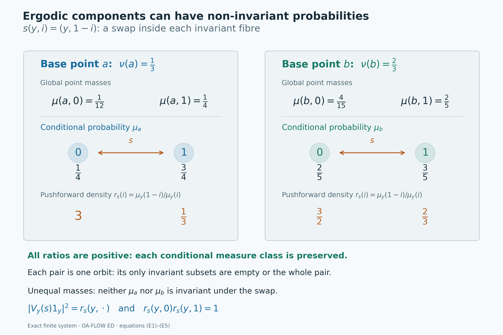

# Conditional measures as ergodic components

*Self-checked by the writing AI. Original lesson, figure and reproduction code: CC0-1.0; accompanying font terms retained.*

An invariant observable separates a measured system into pieces that the group cannot move between. Conditional measures describe the distribution inside those pieces. To call them ergodic components, we must prove that the original transformations preserve each conditional measure class and that no further measurable invariant set splits a component into two positive parts.

The [conditional-measure theorem](OA-FLOW-L75.md#oa-flow.kernel.probability) constructs the measures. The [central-ergodic decomposition theorem](OA-FLOW-L42.md#oa-flow.centerg.conclusion) supplies a complementary operator-algebra argument. Here we identify its Hilbert spaces and multiplication algebras with those of the actual conditional probabilities. A compact continuous model then turns countably many covariance identities into identities for the whole group.

## The measured-component theorem

Let \(G\) be a second-countable locally compact Hausdorff group. Let \((X,\mu)\) be a standard Borel probability space with a **strict jointly Borel action** \(T:G\times X\to X\):
\[
 T_e x=x,\qquad T_g(T_hx)=T_{gh}x
 \quad(g,h\in G,\ x\in X).
 \tag{T1}
\]
Assume that every \(T_g\) is nonsingular, meaning \((T_g)_*\mu\sim\mu\). Thus the action preserves the measure class, but it need not preserve \(\mu\) itself. On the represented multiplication algebra \(A=L^\infty(X,\mu)\), put
\[
 \alpha_g f=f\circ T_{g^{-1}},\qquad D=A^G.
 \tag{T2}
\]
All kernels in this lesson are defined on Borel sets. The completed measure spaces are used for equivalence classes of functions and operators.

**Ergodic-component theorem.** There are an invariant conull Borel set \(X_*\subseteq X\), a standard Borel probability space \((Y,\nu)\), a Borel map \(p:X_*\to Y\), and a Borel probability kernel \(y\mapsto\mu_y\) on \(X_*\), with the following properties.

The map is exactly invariant, \(p(T_gx)=p(x)\) for every \(g,x\), and \(\nu=p_*\mu\). Pullback identifies \(L^\infty(Y,\nu)\) with the whole algebra \(D\). Equivalently, it realizes the completed invariant sigma-algebra: the equivalence classes of Borel sets \(E\) such that \(\mu(T_gE\mathbin\triangle E)=0\) for every \(g\).

The kernel disintegrates the original probability:
\[
 \mu(E\cap p^{-1}B)=\int_B\mu_y(E)\,d\nu(y)
 \quad(E\in\mathcal B(X_*),\ B\in\mathcal B(Y)).
 \tag{T3}
\]
There is one conull Borel subset \(Y_*\subseteq Y\) such that, for every \(y\in Y_*\),
\[
 \begin{gathered}
 \mu_y(p^{-1}\{y\})=1,\qquad
 (T_g)_*\mu_y\sim\mu_y\quad\text{for every }g\in G,\\
 \mu_y(E)\in\{0,1\}\quad\text{whenever }E\in\mathcal B(X_*)
 \text{ and }\mu_y(T_gE\mathbin\triangle E)=0\text{ for every }g.
 \end{gathered}
 \tag{T4}
\]
Thus the conditional systems are nonsingular and ergodic. The fibre \(p^{-1}\{y\}\) is an invariant Borel space, and restricting \(\mu_y\) to it gives the same measured system. For the specified factor map, any two probability kernels satisfying (T3) agree as whole Borel measures on one common conull base, by the [kernel uniqueness theorem](OA-FLOW-L75.md#oa-flow.kernel.uniqueness).

The conclusion for every \(g\) in (T4) uses the same retained set \(Y_*\). It will be proved by continuous covariance, rather than inferred from a separate almost-everywhere assertion for each \(g\). No invariant probability, amenability, properness or compact stabilizer assumption is made. The [sigma-finite extension](#oa-flow.ergdec.sigmafinite) specifies the normalization needed when the starting measure is infinite.

## A continuous compact model containing the whole invariant factor

Let \(G\) be a second-countable locally compact Hausdorff group acting strictly, jointly Borel and nonsingularly on a standard Borel probability space \((X,\mu)\). Write \(gx\) for the action and put
\[
 A=L^\infty(X,\mu),\qquad
 \alpha_g f(x)=f(g^{-1}x),\qquad D=A^\alpha.
 \tag{F1}
\]
The algebra and its normal functionals use completed measure classes, while the point maps and probability kernels below use the underlying Borel spaces. A probability space is nonempty. The group acts by normal automorphisms because each point transformation is a nonsingular Borel bijection.

The measurable-action continuity proof applies to this action. In its pushforward convention, \(r_g=d(g_*\mu)/d\mu\), and
\[
 (U_g\xi)(x)=r_g(x)^{1/2}\xi(g^{-1}x)
 \tag{F2}
\]
gives a strongly continuous representation on the separable Hilbert space \(L^2(X,\mu)\). The derivative proof supplies a jointly Borel function whose slice is a density for every fixed parameter; its fixed-pair chain rule suffices for the operator representation law. The same result proves sigma-strong-star continuity of \(\alpha\).

The algebra \(D\) is a von Neumann subalgebra: it is the intersection of the ultraweakly closed fixed spaces of the normal automorphisms. It acts on a separable Hilbert space. The [compact metrizable operator-ball proof](../../OA-MOD/OA-MOD-DC.html#the-unit-operator-ball-is-compact-in-countable-weak-coordinates) therefore supplies a countable family of self-adjoint contractions \(d_n\) generating \(D\). For example, choose a WOT-dense family in its self-adjoint unit ball. Define
\[
 D_0=C^*(1,d_1,d_2,\ldots),\qquad D_0''=D.
 \tag{F3}
\]
The action fixes every element of \(D_0\), so all of its orbits are norm continuous.

The continuous-core construction, Lemma 3.1, gives a separable unital invariant C*-algebra \(B_0\subseteq A\), with norm-continuous orbits and \(B_0''=A\). Enlarge it by the invariant coordinates:
\[
 B=C^*(B_0,D_0).
 \tag{F4}
\]
This is still separable, unital and invariant, and it still generates \(A\). Finite sums and products of its generators have norm-continuous orbits, by the product estimate and the isometry of each \(\alpha_g\). Uniform approximation extends this property to all of \(B\).

Let
\[
 \Omega=\operatorname{Spec}(B),\qquad
 Y=\operatorname{Spec}(D_0),\qquad
 p_\Omega(\omega)=\omega|_{D_0}.
 \tag{F5}
\]
The [unital commutative Gelfand representation](OA-FLOW-CF.md#oa-flow.cf.6) makes both spaces compact Hausdorff and identifies \(B=C(\Omega)\), \(D_0=C(Y)\). Separability makes the spectra metrizable: values on a countable norm-dense subset determine each norm-one character, so the coordinate map embeds the compact spectrum into a countable product of compact metric disks; a continuous injection from a compact space into a Hausdorff space is a homeomorphism onto its image. The map \(p_\Omega\) is continuous because each coordinate evaluation on \(D_0\) is continuous. It is onto. Otherwise its compact image would be a proper closed subset of \(Y\); a nonzero continuous function vanishing on that image would have zero image in \(C(\Omega)\), contradicting the faithful inclusion \(D_0\subseteq B\).

The action on \(\Omega\) is
\[
 (T_g\omega)(b)=\omega(\alpha_{g^{-1}}b).
 \tag{F6}
\]
It is a genuine action by homeomorphisms. To check joint continuity, if \(g_i\to g\) and \(\omega_i\to\omega\), then for each \(b\in B\)
\[
 |(T_{g_i}\omega_i)(b)-(T_g\omega)(b)|
 \le\|\alpha_{g_i^{-1}}b-\alpha_{g^{-1}}b\|
    +|\omega_i(\alpha_{g^{-1}}b)-\omega(\alpha_{g^{-1}}b)|
 \longrightarrow0.
 \tag{F7}
\]
Since \(D_0\) is fixed pointwise, restriction in (F5) gives the exact point identity
\[
 p_\Omega(T_g\omega)=p_\Omega(\omega)
 \qquad(g\in G,\ \omega\in\Omega).
 \tag{F8}
\]

Use the **original probability state** \(\varphi(f)=\int_Xf\,d\mu\). Its restriction to \(B=C(\Omega)\) has a Radon probability representing measure \(m\) by the [Radon representation proof](OA-FLOW-HR.md#hr-02). It has full support: a nonempty open set supports a nonzero positive continuous function, whose integral is positive by faithfulness of \(\varphi\).

Here is the whole-algebra part of the compact-model theorem, with this specified state. The map
\[
 b\in B\subseteq L^2(X,\mu)\longmapsto\widehat b\in L^2(\Omega,m)
 \tag{F9}
\]
is an isometry, since the squared norms are the two values of \(\varphi(b^*b)\). Its domain span is dense. Indeed, a vector orthogonal to \(B1\) gives a normal vector functional vanishing on \(B\); since \(B''=A\), ultraweak density makes it vanish on \(A\), and \(A1\) is dense in \(L^2(X,\mu)\). Its target span is dense because continuous functions are dense in \(L^2\) of a finite Radon measure on a compact metric space. Thus (F9) extends to an onto unitary sending \(1\) to \(1\).

Conjugating multiplication by this unitary identifies \(A\) with the von Neumann algebra generated by \(C(\Omega)\), which is the whole multiplication algebra \(L^\infty(\Omega,m)\). For an open set \(O\), the continuous functions \(\min\{1,n\,d(\omega,\Omega\setminus O)\}\) increase to \(1_O\); the empty-complement case uses the constant one. Their multiplication operators converge strongly by dominated convergence. The sets whose indicator multiplications belong to the generated von Neumann algebra form a sigma-algebra, by complements, intersections and bounded increasing sums of disjoint projections, and therefore include every Borel set. Uniform simple approximation gives all bounded Borel multiplications, and completed versions give the same operators. We obtain a normal isomorphism
\[
 \pi:A\longrightarrow L^\infty(\Omega,m),\qquad
 \int_\Omega\pi(f)\,dm=\int_Xf\,d\mu.
 \tag{F10}
\]
Its inverse is normal as well, since it is the restriction of inverse unitary conjugation between the two whole multiplication algebras.

For each \(g\), the finite Radon measure \((T_g)_*m\) agrees on continuous functions with the transported normal state \(\varphi\circ\alpha_{g^{-1}}\). A normal positive functional \(\chi\) on the whole \(L^\infty(\Omega,m)\) has a finite measure \(E\mapsto\chi(1_E)\): normality applies to the bounded increasing partial sums of disjoint indicators and proves countable additivity. This measure is absolutely continuous with respect to \(m\), since an \(m\)-null indicator is the zero class. The [finite Radon–Nikodym proof](../../OA-MOD/OA-MOD-DC.html#a-finite-radon-nikodym-density-from-hilbert-representation) gives its \(L^1(m)\) density, and simple approximation represents \(\chi\) by that density. Faithfulness makes the density positive almost everywhere. Apply this to the transported state. Equality on continuous functions identifies the finite Radon measures, so \((T_g)_*m\sim m\). The defining action (F6) gives equivariance first on \(B\), and normality and ultraweak generation then give
\[
 \pi(\alpha_g f)=\pi(f)\circ T_{g^{-1}}
 \qquad(g\in G,\ f\in A)
 \tag{F11}
\]
as an equality of measured classes. This is the normal-state nonsingularity argument of the cited compact-model proof; no invariant state was assumed.

Set \(\nu=(p_\Omega)_*m\). Pullback defines a faithful unital normal map
\[
 J:L^\infty(Y,\nu)\longrightarrow L^\infty(\Omega,m),
 \qquad J(h)=h\circ p_\Omega,
 \qquad J(L^\infty(Y,\nu))=\pi(D).
 \tag{F12}
\]
We justify the normality and the last whole-algebra equality. For \(k\in L^1(m)_+\), the finite measure \((p_\Omega)_*(km)\) is absolutely continuous with respect to \(\nu\). The [finite Radon–Nikodym proof](../../OA-MOD/OA-MOD-DC.html#a-finite-radon-nikodym-density-from-hilbert-representation) gives its \(L^1(\nu)\) density. Extend by real and imaginary parts. Uniqueness of densities makes the resulting map \(J_*:L^1(m)\to L^1(\nu)\) linear, and testing functions of absolute value at most one gives \(\|J_*k\|_1\le\|k\|_1\). The identity
\(\int J(h)k\,dm=\int hJ_*k\,d\nu\)
shows that \(J\) is its adjoint and hence ultraweakly continuous. Its faithfulness follows directly from \(\nu=(p_\Omega)_*m\). The [faithful normal image theorem](OA-FLOW-ST12.md#oa-flow.st.2) makes its range a von Neumann algebra. That range contains \(J(C(Y))=\pi(D_0)\), so it contains \(\pi(D)\). Conversely every bounded Borel function on \(Y\) has uniformly bounded continuous \(L^2(\nu)\) approximants: use density of continuous functions and clip their real and imaginary parts to the bounds of the target. Their multiplications converge strongly, first on bounded vectors and then on all \(L^2\) vectors by truncation; the common bound also gives ultraweak convergence by summable vector-series tests. Normality of \(J\) therefore puts its entire range in the ultraweak closure of \(\pi(D_0)\), namely \(\pi(D)\). This proves (F12). Thus the continuous map \(p_\Omega\) represents the **whole** invariant sigma-algebra modulo null sets.

## Normal probability-algebra isomorphisms have Borel point realizations

We prove the ordinary spatial-isomorphism assertion needed before making the point map equivariant.

**Spatial lemma.** Let \((E,\lambda)\), \((F,\eta)\) be standard Borel probability spaces. Suppose
\[
 \Theta:L^\infty(E,\lambda)\longrightarrow L^\infty(F,\eta)
 \quad\text{is a normal unital star isomorphism, with normal inverse,}
 \qquad
 \int_F\Theta(f)\,d\eta=\int_Ef\,d\lambda.
 \tag{S1}
\]
There are Borel conull subsets \(E_0,F_0\) and inverse Borel maps \(r:E_0\to F_0\), \(q:F_0\to E_0\), preserving their probabilities, such that \(\Theta(f)=f\circ q\) as a class for every \(f\in L^\infty(E,\lambda)\).

**Proof.** Use the [standard-Borel coding in L75](OA-FLOW-L75.md#oa-flow.kernel.coding) to choose Borel isomorphisms
\[
 c:E\longrightarrow B\subseteq[0,1],\qquad
 d:F\longrightarrow C\subseteq[0,1],
 \tag{S2}
\]
where \(B,C\) are Borel. Choose a Borel representative \(a:F\to[0,1]\) of \(\Theta(c)\). Such a representative exists by the [Borel-version proof](OA-FLOW-L75.md#oa-flow.kernel.completion); clipping to \([0,1]\) preserves the class, since \(0\le\Theta(c)\le1\).

Normality gives the exact bounded Borel-calculus identity
\[
 \Theta(h\circ c)=[h\circ a]
 \qquad(h:[0,1]\to\mathbb C\text{ bounded Borel}).
 \tag{S3}
\]
Here is a direct verification. Polynomial identities and the [polynomial-density proof](OA-FLOW-CF.md#oa-flow.cf.5) prove the assertion for continuous \(h\), equivalently preservation of continuous functional calculus by a unital star isomorphism. For an open subset \(O\subseteq[0,1]\), continuous functions \(0\le h_n\uparrow1_O\), for instance truncated multiples of the distance to the complement, give (S3) for \(1_O\) by normality. The cases of empty complement and empty set use the constant functions. The sets whose indicators satisfy (S3) are closed under complements and finite intersections, by linearity and multiplicativity, and under countable disjoint unions, by normality applied to increasing partial sums. Disjointifying an arbitrary union makes them a sigma-algebra. They contain the open sets and hence every Borel set. Uniform finite-valued approximation of a bounded Borel function now proves (S3). All assertions are equalities of classes; no common null set for all Borel \(h\) was taken.

Since \(1_B(c)=1\), (S3) implies \(a\in B\) almost everywhere. Fix \(e_0\in E\), which exists because \(\lambda\) is a probability, and define the everywhere Borel map
\[
 q(u)=\begin{cases}c^{-1}(a(u)),&a(u)\in B,\\ e_0,&a(u)\notin B.\end{cases}
 \tag{S4}
\]
For bounded Borel \(f:E\to\mathbb C\), extend \(f\circ c^{-1}\) by zero from \(B\) to \([0,1]\). Equation (S3) yields
\[
 \Theta([f])=[f\circ q],\qquad q_*\eta=\lambda.
 \tag{S5}
\]
The second assertion follows by the state identity (S1) on indicators. It also ensures that pullback by \(q\) respects null classes. Completed bounded functions have Borel versions, so (S5) covers the whole algebra.

Apply the same construction to \(\Theta^{-1}\), using the code \(d\). It gives an everywhere Borel map \(r:E\to F\), with \(r_*\lambda=\eta\), realizing \(\Theta^{-1}\). Apply the two inverse algebra maps to the single coordinate \(c\), respectively \(d\). The pullback identities, which respect null classes, give
\[
 c(q(r(x)))=c(x)\quad\lambda\text{-a.e.},\qquad
 d(r(q(u)))=d(u)\quad\eta\text{-a.e.}
 \tag{S6}
\]
Injectivity of the codes makes these identities \(q(r(x))=x\) and \(r(q(u))=u\). Thus
\[
 E_0=\{x:q(r(x))=x\},\qquad
 F_0=\{u:r(q(u))=u\}
 \tag{S7}
\]
are Borel and conull. If \(x\in E_0\), then \(r(q(r(x)))=r(x)\), so \(r(x)\in F_0\); the reverse argument gives \(q(F_0)\subseteq E_0\). The restrictions are inverse bijections. They and their inverses are Borel, and their probability preservation was already proved. This proves the lemma.

Apply the lemma to \(\Theta=\pi\) in (F10). It supplies a Borel point isomorphism from a conull subset of \(X\) to a conull subset of \(\Omega\), preserving \(\mu\) and \(m\). Extend its map in the \(X\)-to-\(\Omega\) direction to an everywhere Borel map \(\psi:X\to\Omega\) by a fixed value. For every bounded Borel \(f\) on \(\Omega\),
\[
 \pi^{-1}([f])=[f\circ\psi],\qquad \psi_*\mu=m.
 \tag{S8}
\]
The extension changes nothing on the probability-one original domain.

## One point map intertwines every group element

We now apply the simultaneous point-realization mechanism of Theorem 4.4. Its ordinary spatial input has just been proved, its source action is the specified strict Borel nonsingular action, its target action is the jointly continuous compact action (F6), and (F11) intertwines their whole normal algebras. The following argument records the conull sets and the exact probability preservation.

Choose countably many continuous functions \(h_j:\Omega\to[0,1]\) separating its points. Testing (F11) against this family and using (S8) gives, for every fixed \(g\),
\[
 \psi(gx)=T_g\psi(x)\quad\text{for }\mu\text{-almost every }x.
 \tag{S9}
\]
Nonsingularity permits the change from \(g^{-1}x\) to \(x\) in these class identities. There are only countably many test functions for each fixed \(g\); its exceptional set may still depend on \(g\).

Choose a strictly positive Borel function \(k\) on \(G\) with \(\int_G k(t)\,dt=1\). Such a function exists because lcsc groups are sigma compact and Haar measure is sigma-finite; the [positive Haar-probability construction](../../OA-ERGODIC/reader/localizing-factor-actions-and-uniform-cocycles.html#1-repairing-an-equivariant-section) gives it explicitly. Put
\[
 R_x(t)=T_{t^{-1}}\psi(tx),\qquad
 b_j(x)=\int_G k(t)h_j(R_x(t))\,dt.
 \tag{S10}
\]
All maps are jointly Borel, and bounded parameter integration makes \(b_j\) Borel. The coordinate map \(H(\omega)=(h_j(\omega))_j\) is a homeomorphism of \(\Omega\) onto a compact subset of \([0,1]^{\mathbb N}\). Define
\[
 Z=\left\{x: b(x)\in H(\Omega),\quad
       \int_G k(t)|h_j(R_x(t))-b_j(x)|^2\,dt=0
       \text{ for every }j\right\}.
 \tag{S11}
\]
This set is Borel. For \(x\in Z\), the variance tests and countable point separation say that \(R_x(t)\) equals the single point \(\Phi(x)=H^{-1}(b(x))\) for Haar-almost every \(t\). Conversely an essentially constant \(R_x\) passes all these tests. Fubini applied to (S9) gives \(\mu(Z)=1\) and \(\Phi(x)=\psi(x)\) almost everywhere. The function \(\Phi:Z\to\Omega\) is Borel.

The exact actions, before any deletion of source points, give
\[
 R_{gx}(t)=T_g R_x(tg).
 \tag{S12}
\]
Right translation preserves the Haar null class, also for a nonunimodular group. Since \(T_g\) is a bijection, (S12) makes \(Z\) invariant and gives
\[
 \Phi(gx)=T_g\Phi(x)\qquad(g\in G,\ x\in Z).
 \tag{S13}
\]
The Haar probability \(k(t)dt\) need not be invariant; only its equivalence to Haar measure is used. These conclusions arise from essential constancy and the exact action laws, not from an uncountable intersection of fixed-parameter good sets.

To obtain injectivity on an invariant set, choose a Borel conull \(E\subseteq Z\) where \(\Phi=\psi\) and the original point map \(\psi\) is injective. Set
\[
 X_0=Z\cap\left\{x:\int_G k(t)1_E(tx)\,dt=1\right\}.
 \tag{S14}
\]
It is Borel and conull by Fubini and nonsingularity of each fixed transformation. It is invariant because the condition means \(tx\in E\) for Haar-almost every \(t\), and right translation preserves that null class. If \(x,x'\in X_0\) satisfy \(\Phi(x)=\Phi(x')\), choose a \(t\) for which both \(tx,tx'\in E\); the intersection of these two Haar-conull sets is nonempty. Equation (S13) yields
\(\psi(tx)=T_t\Phi(x)=T_t\Phi(x')=\psi(tx')\).
Injectivity on \(E\) gives \(tx=tx'\), hence \(x=x'\).

The [Borel image and inverse theorem used in L75](OA-FLOW-L75.md#oa-flow.kernel.coding) makes \(\Omega_0=\Phi(X_0)\) Borel and the inverse map Borel. Equation (S13) makes \(\Omega_0\) invariant. Define \(\phi=\Phi|_{X_0}\). Since it equals \(\psi\) almost everywhere and \(\mu(X_0)=1\), (S8) gives
\[
 \phi:X_0\longrightarrow\Omega_0
 \quad\text{a probability-preserving Borel isomorphism},\qquad
 \phi(gx)=T_g\phi(x)\quad(g\in G,\ x\in X_0),
 \qquad m(\Omega_0)=1.
 \tag{S15}
\]
In particular this is preservation of the actual probabilities, not only their measure classes.

Combining (F8), (F12) and (S15) gives the original-space factor
\[
 p_X=p_\Omega\circ\phi:X_0\to Y,\qquad
 p_X(gx)=p_X(x),\qquad (p_X)_*(\mu|_{X_0})=\nu,
 \qquad p_X^*L^\infty(Y,\nu)=D.
 \tag{F13}
\]
The last equality identifies algebras of completed classes after restriction to \(X_0\). Thus a completed invariant set has, modulo \(\mu\), a representative pulled back from a completed base set. It does not assert that every chosen point representative was already constant on fibres.

## An alternative: invariant coordinates directly on the original space

The factor map can also be built before passing to a compact model. Choose Borel versions \(\widetilde d_n:X\to[-1,1]\) of the self-adjoint generators in (F3), and put
\[
 q_0(x)=(\widetilde d_n(x))_{n\ge1}\in[-1,1]^{\mathbb N}.
 \tag{F14}
\]
For each fixed \(g\), the equalities \(\alpha_gd_n=d_n\) imply \(q_0(gx)=q_0(x)\) almost everywhere, by countably many coordinate tests and nonsingularity. Apply the [strict section theorem, Theorem 1.2](../../OA-ERGODIC/reader/localizing-factor-actions-and-uniform-cocycles.html#1-repairing-an-equivariant-section) to this standard Borel target with the trivial action. Its target bijections are identities and therefore satisfy their strict law everywhere. It gives an invariant conull Borel \(X'\) and a Borel \(q:X'\to[-1,1]^{\mathbb N}\), equal to \(q_0\) almost everywhere, with
\[
 q(gx)=q(x)\quad(g\in G,\ x\in X').
 \tag{F15}
\]
The proof uses the essential value of \(t\mapsto q_0(tx)\), detected by Borel scalar-code variance; thus its hypotheses do not presuppose continuous point coordinates.

Give the cube the pushforward probability \(\eta=q_*\mu\). Pullback is a faithful normal map by the same finite-density preadjoint argument as for (F12). Its image contains the coordinate classes \(d_n\), and so contains \(D\). Conversely cylinder polynomials, followed by bounded monotone approximation on the countably generated Borel sigma-algebra of the cube, put every bounded Borel pullback in \(D\). Completion changes no represented class. Hence
\[
 q^*L^\infty([-1,1]^{\mathbb N},\eta)=D.
 \tag{F16}
\]
No claim that the entire image \(q(X')\) is Borel is needed; L75's concentration theorem supplies a Borel conull base lying in that image when conditional probabilities are constructed. This gives an alternative exact invariant-factor construction. To prove nonsingularity of all conditional systems for every group element, the later covariance argument still uses the norm-continuous compact core and the whole conditional multiplication algebras. Strictness of the factor coordinates alone does not supply that conclusion.

## The conditional measures give the exact Hilbert field

Let \(\Omega\) and \(Y\) be compact metrizable spaces, let \(m\) be a Borel probability on \(\Omega\), and let \(p:\Omega\to Y\) be continuous. Write \(\nu=p_*m\). Suppose \(G\) acts continuously and nonsingularly on \((\Omega,m)\), fixes \(p\) pointwise in the sense that \(p(g\omega)=p(\omega)\), and the entire invariant multiplication algebra is

\[
 A=L^\infty(\Omega,m),\qquad
 D=A^G=\{h\circ p:h\in L^\infty(Y,\nu)\}.
 \tag{H1}
\]

We represent these algebras by multiplication on \(L^2(\Omega,m)\). The construction of the Hilbert and algebra fields below uses only the probability, the factor map and its conditional measures; the group action is used when these fields are made covariant.

The [probability-disintegration theorem](OA-FLOW-L75.md#oa-flow.kernel.probability) supplies a Borel probability kernel \(y\mapsto m_y\) on \(\Omega\). There is a single Borel conull set \(Y_0\subseteq Y\) such that

\[
 \begin{aligned}
 m_y(p^{-1}\{y\})&=1&&(y\in Y_0),\\
 m(B\cap p^{-1}E)&=\int_E m_y(B)\,d\nu(y)
     &&(B\in\mathcal B(\Omega),\ E\in\mathcal B(Y)).
 \end{aligned}
 \tag{H2}
\]

Each \(m_y\) is a probability even outside \(Y_0\); it is only the concentration assertion that requires this restriction. The [parameter-integration proof](OA-FLOW-L75.md#oa-flow.kernel.integration) and [concentration argument](OA-FLOW-L75.md#oa-flow.kernel.concentration) give

\[
 \int_\Omega F(p(\omega),\omega)\,dm(\omega)
 =\int_Y\int_\Omega F(y,\omega)\,dm_y(\omega)\,d\nu(y)
 \quad(F\geq0\text{ jointly Borel}).
 \tag{H3}
\]

Every inner integral is Borel as a function of its parameters, with the value \(+\infty\) allowed. The corresponding assertion for absolutely integrable complex functions follows by real and imaginary parts.

### A countable family that is total in every conditional space

Choose a countable unital \(\mathbb Q(i)\)-algebra \(\mathcal C\subseteq C(\Omega)\), closed under complex conjugation and uniformly dense in \(C(\Omega)\), and enumerate it as \((f_n)_{n\geq1}\), with \(f_1=1\).

Here is an explicit reason such a family exists. Fix a compatible metric on \(\Omega\) and a countable dense sequence of points. For each positive integer \(k\), choose finitely many of these points, denoted \(x_{k,j}\), whose balls of radius \(1/(2k)\) cover \(\Omega\). The functions

\[
 t_{k,j}(\omega)=\max\{0,1-kd(\omega,x_{k,j})\},\qquad
 \theta_{k,j}=\frac{t_{k,j}}{\sum_i t_{k,i}}
 \tag{H4}
\]

are continuous, and the denominator is everywhere positive. Their sum is one, and \(\theta_{k,j}\) vanishes unless \(d(\omega,x_{k,j})<1/k\). Rational complex combinations of the finite families \((\theta_{k,j})_j\), for all \(k\), are uniformly dense in \(C(\Omega)\): uniform continuity approximates a function by the combination with coefficients \(f(x_{k,j})\), and rational approximation of those finitely many coefficients gives the assertion. The unital rational algebra generated by these countably many real functions is the required \(\mathcal C\).

For every \(y\) set

\[
 H_y=L^2(\Omega,m_y),\qquad h_n(y)=[f_n]_{m_y}.
 \tag{H5}
\]

We take completed \(L^2\) spaces, identifying each class with any Borel version when integrating against a kernel. The spaces \(H_y\) are nonzero, because \(\|h_1(y)\|=1\).

The family \((h_n(y))\) is total for **every** \(y\). Indeed, a finite Borel measure on a compact metric space has closed-inner and open-outer approximation, as proved in the [finite metric-measure regularity argument](OA-FLOW-IS.md#is-2). For a Borel set \(B\) and \(\varepsilon>0\), take closed \(K\subseteq B\subseteq O\), with \(O\) open and \(m_y(O\setminus K)<\varepsilon\). A continuous \(u\) with \(0\leq u\leq1\), \(u=1\) on \(K\) and \(u=0\) outside \(O\), is obtained from

\[
 u(\omega)=
 \frac{d(\omega,\Omega\setminus O)}
      {d(\omega,\Omega\setminus O)+d(\omega,K)}.
 \tag{H6}
\]

When \(K=\varnothing\), use zero; when \(O=\Omega\) and \(K\ne\varnothing\), use one. In each case \(\|u-1_B\|_{L^2(m_y)}^2\leq m_y(O\setminus K)<\varepsilon\). Thus continuous functions approximate indicators, then simple functions, then all \(L^2\) functions by truncation. Sets and functions in the completion have Borel versions by [L75's completion proof](OA-FLOW-L75.md#oa-flow.kernel.completion), so the same density holds in the completed space. Uniform density of \(\mathcal C\) and the fact that \(m_y\) is a probability finish the totality assertion. Applying the same proof to \(m\) also shows that \(L^2(\Omega,m)\) is separable.

The Gram functions are Borel:

\[
 \langle h_n(y),h_j(y)\rangle
      =\int_\Omega f_n\overline{f_j}\,dm_y.
 \tag{H7}
\]

We use the convention that the inner product is linear in its first variable. The [DF-1 Gram construction](../../OA-MOD/OA-MOD-DF.html#countable-gram-data-determines-the-whole-measurable-structure) now gives the measurable Hilbert field with these **actual** spaces \(H_y\): a section \(\xi(y)\in H_y\) is measurable precisely when all functions \(\langle\xi(y),h_n(y)\rangle\) are measurable. One can equivalently start from the Gram matrices, quotient finite sequences by their zero norm and complete; totality identifies that completion isometrically with (H5). In particular, no uniform rank or nondegeneracy assumption on the Gram matrices is needed. The [compact-frame construction](../../OA-MOD/OA-MOD-DF.html#compact-orthonormal-frames-and-measurable-dimension) provides orthonormal frames on all finite- and infinite-dimensional strata. The [Hilbert-integral construction](../../OA-MOD/OA-MOD-DF.html#the-hilbert-direct-integral-localization-and-subsequences) therefore defines the whole space

\[
 \mathscr H=\int_Y^\oplus H_y\,d\nu(y).
 \tag{H8}
\]

Its sections can be measured for the Borel base or its completion; taking equivalence classes yields the same Hilbert space. To see the only possible issue, choose Borel versions of the countably many compact-frame coordinates of a completed measurable section. Off the union of their null carriers they are its original coordinates. Set all coordinates to zero where their squared sum is infinite. The frame expansion then gives a Borel section equal to the original one almost everywhere. DF-6 also proves separability of this integral over a standard finite base.

### Borel functions, conditional norms and equivalence classes

A useful form of measurability allows a function to depend on both variables. Let \(F:Y\times\Omega\to\mathbb C\) be jointly Borel, and put

\[
 c_F(y)=\int_\Omega|F(y,\omega)|^2\,dm_y(\omega),\qquad
 E_F=\{y:c_F(y)<\infty\}.
 \tag{H9}
\]

The function \(c_F\) and the set \(E_F\) are Borel. Define

\[
 \eta_F(y)=
 \begin{cases}
 [F(y,\cdot)]_{m_y},&y\in E_F,\\
 0,&y\notin E_F.
 \end{cases}
 \tag{H10}
\]

For \(y\in E_F\), Cauchy–Schwarz gives
\(\int|F(y,\omega)\overline{f_n(\omega)}|\,dm_y
\leq c_F(y)^{1/2}\|f_n\|_\infty\).
The pairings of (H10) with \(h_n\) are therefore Borel by the complex parameter-integration assertion of L75, with zero chosen outside \(E_F\). DF-1 proves that \(\eta_F\) is a measurable section. If \(c_F\) is finite almost everywhere, then \(\eta_F\in\mathscr H\) exactly when \(\int c_F\,d\nu<\infty\), and in that case its squared norm is this integral. The same proof gives jointly Borel pairings in any extra standard Borel parameter for a jointly Borel function of all the variables.

In particular, take a Borel representative \(f:\Omega\to\mathbb C\) of an element of \(L^2(\Omega,m)\). It can be made finite everywhere by changing it on a Borel \(m\)-null set. Equations (H3) and (H9) give

\[
 \int_Y\int_\Omega|f|^2\,dm_y\,d\nu
       =\int_\Omega|f|^2\,dm<\infty.
 \tag{H11}
\]

Thus \([f]_{m_y}\) is defined in \(H_y\) for almost every \(y\), and setting it to zero on the Borel exceptional set gives a measurable square-integrable section. If \(f\) and \(\widetilde f\) are two Borel versions of the same completed \(m\)-class, then their disagreement lies in a Borel \(m\)-null set \(N\). The mixture identity gives

\[
 \int_Y m_y(N)\,d\nu(y)=0.
 \tag{H12}
\]

Hence their conditional \(L^2\) classes agree for almost every \(y\). The exceptional set in this assertion may depend on the two specified representatives. No common set for all functions in all completed spaces is being asserted.

We have consequently defined a linear isometry

\[
 W:L^2(\Omega,m)\longrightarrow\mathscr H,
 \qquad (W[f]_m)(y)=[f]_{m_y}\text{ almost everywhere},
 \qquad \|W[f]_m\|=\|[f]_m\|.
 \tag{H13}
\]

Linearity holds in the spaces of equivalence classes: for any finite list of functions the finitely many conditional-integrability exceptions can be removed together. The norm identity is (H11), and the class is independent of the Borel version by (H12).

### Why this is the whole Hilbert integral

The map \(W\) is onto. For a bounded Borel \(h:Y\to\mathbb C\), concentration in (H2) gives

\[
 W\bigl([(h\circ p)f_n]_m\bigr)(y)=h(y)h_n(y)
 \quad(y\in Y_0).
 \tag{H14}
\]

All functions here are bounded, so there are no conditional-integrability exceptions. These localized fundamental sections have dense linear span in \(\mathscr H\). For a direct proof, suppose \(\eta\in\mathscr H\) is orthogonal to all of them. For every \(n\), the measurable scalar function
\(a_n(y)=\langle\eta(y),h_n(y)\rangle\) is integrable, since
\(|a_n(y)|\leq\|f_n\|_\infty\|\eta(y)\|\) and \(\nu(Y)=1\). Orthogonality says

\[
 \int_Y\overline{h(y)}a_n(y)\,d\nu(y)=0
 \quad\text{for every bounded Borel }h.
 \tag{H15}
\]

Choose a Borel version of \(a_n\) and let \(h=a_n/|a_n|\) where it is nonzero, with value zero elsewhere. Equation (H15) gives \(a_n=0\) almost everywhere. Take the countable union of these exceptional sets over \(n\). Totality of \((h_n(y))\) gives \(\eta(y)=0\) off that union, so \(\eta=0\). This proves the claimed density. The range of the isometry \(W\) is closed and contains that dense family by (H14); hence it is all of \(\mathscr H\).

The same concentration identity, first on the fundamental vectors and then by density, gives the precise diagonal correspondence

\[
 WM_{h\circ p}W^*=\int_Y^\oplus h(y)I_{H_y}\,d\nu(y),
 \qquad h\in L^\infty(Y,\nu).
 \tag{H16}
\]

Here and below \(M_b\) means multiplication by \(b\) on the indicated \(L^2\) space. Completed classes of \(h\) are handled by bounded Borel versions; the pushforward identity implies that changing such a version changes \(h\circ p\) only on an \(m\)-null set. Moreover
\(\|h\circ p\|_{L^\infty(m)}=\|h\|_{L^\infty(\nu)}\).
Thus (H16) is faithful, and (H1) identifies its entire scalar algebra with the specified \(D\).

## The whole multiplication algebra is the conditional algebra field

For every \(y\), let

\[
 A_y=\{M_b^{(y)}:b\in L^\infty(\Omega,m_y)\}
       \subseteq B(H_y).
 \tag{H17}
\]

We prove both the measurability of this field and the equality with the entire original algebra. A multiplication operator depends on a class modulo \(m_y\); we do not choose pointwise representatives of arbitrary elements of all the \(A_y\) at once.

### A probability multiplication algebra is maximal abelian

Let \(\rho\) be any Borel probability on \(\Omega\), with completion understood, and let \(\mathcal A_\rho\) be its multiplication algebra on \(L^2(\rho)\). For a bounded measurable \(b\), the multiplier norm is

\[
 \|M_b\|=\|b\|_{L^\infty(\rho)}.
 \tag{H18}
\]

The upper bound follows by integration. For the reverse, if \(0\leq c<\|b\|_\infty\), the set \(E=\{|b|>c\}\) has positive measure, and testing on \(1_E/\rho(E)^{1/2}\) gives \(\|M_b\|>c\). The zero case is immediate.

Suppose \(T\in B(L^2(\rho))\) commutes with every multiplier. Put \(b=T1\in L^2(\rho)\). For every bounded measurable \(f\),

\[
 Tf=T(M_f1)=M_f(T1)=fb,
 \qquad
 \|1_Eb\|_2\leq\|T\|\rho(E)^{1/2}
 \quad(E\text{ measurable}).
 \tag{H19}
\]

Use \(E=\{|b|>\|T\|+1/k\}\) for each positive integer \(k\). The inequality forces \(\rho(E)=0\), so \(|b|\leq\|T\|\) almost everywhere. Thus \(b\in L^\infty(\rho)\). Bounded functions are dense in \(L^2(\rho)\) by truncation, and (H19) implies \(T=M_b\) on all of \(L^2(\rho)\). Conversely the multipliers commute with one another. Hence

\[
 \mathcal A_\rho'=\mathcal A_\rho.
 \tag{H20}
\]

In particular it is a maximal abelian von Neumann algebra: a commutant is weak-operator closed, since each commutation equation is closed on matrix coefficients. This argument applies to \(\rho=m\) and separately to every \(\rho=m_y\).

The vector \(1\) is cyclic, because bounded functions are dense, and separating, because \(M_b1=b\). Its vector functional is the faithful normal probability state \(M_b\mapsto\int b\,d\rho\): positivity of a multiplier is exactly nonnegativity of its function, as testing indicators shows; faithfulness follows from the nonnegative integral test, and normality is the normality of a vector functional in the [concrete predual](OA-FLOW-CP.md#oa-flow.cp.6).

### Measurable multipliers and countable generators

For a bounded jointly Borel function \(F:Y\times\Omega\to\mathbb C\), define

\[
 T_F(y)=M_{F(y,\cdot)}^{(y)},\qquad
 T_F(y)h_n(y)=[F(y,\cdot)f_n]_{m_y}.
 \tag{H21}
\]

The sections on the right are measurable by (H9)–(H10). The [DF-5 operator-field criterion](../../OA-MOD/OA-MOD-DF.html#pointwise-bounded-operator-fields-adjoints-and-exact-norm-tests) therefore proves measurability of \(T_F\), and
\(\|T_F(y)\|\leq\sup|F|\).
This covers fixed bounded Borel multipliers by taking \(F(y,\omega)=b(\omega)\). It also covers extra Borel parameters, with jointly Borel matrix coefficients obtained by the same integral tests.

A more general version is available when \(F\) is not bounded on the product but \(F(y,\cdot)\) is essentially bounded for each retained \(y\). Its multiplier norm has the explicit measurable description

\[
 \|T_F(y)\|
 =\sup\bigl(\{r\in\mathbb Q_{\geq0}:
           m_y(\{|F(y,\cdot)|>r\})>0\}\cup\{0\}\bigr).
 \tag{H22}
\]

The right side is Borel by parameter integration. On its finite locus, (H10) still proves measurability of \(T_F(y)h_n(y)\). Set the field to zero on any discarded complement. It defines a bounded global decomposable operator exactly when its norm function is essentially bounded, by [DF-7](../../OA-MOD/OA-MOD-DF.html#integrating-operator-fields-norm-domains-and-adjoints). Pointwise finite fiber norms alone do not imply that global boundedness.

The countable fields \(M_{f_n}^{(y)}\) generate the entire \(A_y\) for every \(y\). Fix \(y\) and let \(N_y=\{M_{f_n}^{(y)}:n\geq1\}''\). Uniform density and (H18) place \(M_f^{(y)}\) in \(N_y\) for every \(f\in C(\Omega)\). If \(O\subseteq\Omega\) is open and \(O\ne\Omega\), the continuous functions
\(u_k(\omega)=\min\{1,kd(\omega,\Omega\setminus O)\}\) increase to \(1_O\). For \(O=\Omega\), use the constant one. Dominated convergence against \(|\xi|^2m_y\) shows that \(M_{u_k}^{(y)}\to M_{1_O}^{(y)}\) strongly on all \(H_y\), so the latter projection lies in \(N_y\).

The Borel sets \(B\) with \(M_{1_B}^{(y)}\in N_y\) form a sigma-algebra: complements and finite unions follow from the algebra operations on these commuting projections, and increasing finite unions converge strongly to a countable union, again by dominated convergence. This sigma-algebra contains all open sets, hence all Borel sets. Uniform simple-function approximation gives every bounded Borel multiplier. A completed essentially bounded class has a bounded Borel version by the completion argument already used above. Since \(A_y\) is a von Neumann algebra by (H20), the reverse inclusion is automatic. We have proved

\[
 A_y=\{M_{f_n}^{(y)}:n\geq1\}'',\qquad
 A_y'=A_y\quad(y\in Y).
 \tag{H23}
\]

In particular this is a measurable algebra field with explicit countable generators. Dividing each \(f_n\) by \(\max\{1,\|f_n\|_\infty\}\) gives measurable contraction generators, without changing the generated algebras. The same family generates the commutant fields because of (H23).

### Equality for all essentially bounded measurable fields

If \(b\) is bounded Borel on \(\Omega\), (H13) gives, on a dense set of bounded functions and hence on all of the global Hilbert space,

\[
 WM_bW^*=\int_Y^\oplus M_b^{(y)}\,d\nu(y).
 \tag{H24}
\]

Both sides are bounded operators: the right side is defined by (H21) and DF-7, and the equality on each input is just \([bf]_{m_y}=M_b^{(y)}[f]_{m_y}\). For a general \(b\in L^\infty(m)\), choose a Borel version and change it on a Borel \(m\)-null set so that it is bounded everywhere by its essential bound. Equation (H12) shows that two such choices give the same multiplier field almost everywhere. Thus (H24) holds for every element of \(A\).

Let \(\mathcal F\) denote the algebra of **all** essentially bounded measurable fields taking their values in \(A_y\):

\[
 \mathcal F=
 \left\{\int_Y^\oplus T_y\,d\nu(y):
        T_y\in A_y\text{ a.e.},\ T\text{ measurable},\
        \operatorname*{ess\,sup}_y\|T_y\|<\infty\right\}.
 \tag{H25}
\]

Products and adjoints are legitimate fields and integrate correctly by DF-5 and DF-7. Equation (H24) proves \(WAW^*\subseteq\mathcal F\).

Conversely, fix any field in (H25). It commutes fiberwise with \(M_b^{(y)}\) for every bounded Borel \(b\), because both operators belong to the abelian algebra \(A_y\) almost everywhere. Integrating the products, its global operator commutes with every \(WM_bW^*\). The global multiplication algebra is maximal abelian by (H20), and \(W\) is onto. Consequently this global operator belongs to \((WAW^*)'=WAW^*\). This proves

\[
 \boxed{\displaystyle
 WAW^*=\mathcal F=\int_Y^\oplus A_y\,d\nu(y),\qquad
 WDW^*=L^\infty(Y,\nu)I_{H_y}.}
 \tag{H26}
\]

The first equality concerns the entire algebra of bounded measurable operator fields. Its converse required no selection of measurable functions representing arbitrary fiber multipliers. After the equality has been proved, uniqueness of decomposable fields from [DF-8](../../OA-MOD/OA-MOD-DF.html#the-diagonal-commutant-is-exactly-the-decomposable-algebra) also says that, for each specified field \(T\) in (H25), there exists a bounded Borel \(b\) on \(\Omega\) with \(T_y=M_b^{(y)}\) almost everywhere: take the global multiplier furnished by (H20) and then use (H24). This is a consequence of the operator argument.

For an explicitly given bounded jointly Borel \(F\), there is an equally explicit global multiplier: set \(b(\omega)=F(p(\omega),\omega)\). Concentration in (H2) gives \(T_F(y)=M_b^{(y)}\) for every \(y\in Y_0\), so

\[
 \int_Y^\oplus M_{F(y,\cdot)}^{(y)}\,d\nu(y)
       =WM_{F(p(\cdot),\cdot)}W^*.
 \tag{H27}
\]

Finally the constant global vector disintegrates into the actual constant conditional vectors:

\[
 W1=(1_y)_y,\qquad \|1_y\|=1,\qquad
 \langle M_b1,1\rangle
      =\int_Y\langle M_b^{(y)}1_y,1_y\rangle\,d\nu(y).
 \tag{H28}
\]

Each conditional vector state is faithful and normal by (H19)–(H20). Thus the probability measure, the diagonal, the entire multiplication algebra and its faithful probability vectors are all realized on the specified conditional Hilbert field. This supplies exactly the Hilbert and whole-algebra hypotheses of [L42's representation recovery](OA-FLOW-L42.md#oa-flow.centerg.joint) and [fixed-centre argument](OA-FLOW-L42.md#oa-flow.centerg.fixed); covariance with the prescribed point transformations is established on this same field.

## A second identification through fibre states

The conditional Hilbert-space construction started with the measures from L75. There is a converse identification that starts with an abstract algebra decomposition and recovers those same conditional measures. We give its normalization and onto arguments explicitly.

Keep the compact model \((\Omega,m)\), the continuous invariant factor \(p:\Omega\to Y\), and \(\nu=p_*m\). Let \(A=L^\infty(\Omega,m)\) act on \(H=L^2(\Omega,m)\), with probability vector \(\mathbf1\). Apply [central decomposition over a specified algebra](../../OA-MOD/OA-MOD-DC.html#existence-over-any-specified-central-abelian-subalgebra) to \(D=p^*L^\infty(Y,\nu)\subseteq A\). It gives a whole algebra field
\[
 H=\int_Z^\oplus K_z\,d\lambda(z),\qquad
 A=\int_Z^\oplus A_z\,d\lambda(z),
 \qquad D=L^\infty(Z,\lambda)1_z.
 \tag{R1}
\]
Write \(\eta_z\) for a measurable representative of \(\mathbf1\), and \(h(z)=\|\eta_z\|^2\). The scalar identity \(\int h\,d\lambda=1\) makes \(h\) finite almost everywhere. It is positive almost everywhere as well. If it vanished on a positive-measure set \(E\), the nonzero diagonal projection \(1_E\) would annihilate \(\mathbf1\). Its vector functional on \(A\), integration against \(m\), is faithful, so this is impossible. Delete the null exceptional set.

Replace the base measure by \(h\,d\lambda\) and each vector field by \(h^{-1/2}\) times that field. This is an onto unitary between the two Hilbert integrals, since
\[
 \int_Z\|h^{-1/2}\xi_z\|^2h(z)\,d\lambda(z)
 =\int_Z\|\xi_z\|^2\,d\lambda(z),
 \tag{R2}
\]
and the inverse is multiplication by \(h^{1/2}\). Both maps have their full maximal \(L^2\) domains. They commute with all operator fields. The new probability vector has norm one in every retained fibre, and its state on the diagonal is exactly the new base probability. This is the square-root density change also proved in [change-of-base uniqueness](../../OA-MOD/OA-MOD-DC.html#change-of-base-and-the-square-root-density-in-general-uniqueness).

The two identifications of \(D\), on \((Z,h\lambda)\) and on \((Y,\nu)\), preserve its original vector state. The [spatial lemma](#oa-flow.ergdec.spatial) identifies these probability bases by a Borel isomorphism on conull subsets. Transport the measurable fields through that map. We can therefore use the actual \((Y,\nu)\) from \(p\) in (R1), with a measurable unit vector \(\eta_y\) representing \(\mathbf1\). This is an explicit identification of bases, not a silent reuse of a variable name.

Choose the countable generating fields in the central-decomposition proof from a countable unital rational-complex star algebra \(\mathcal C\subset C(\Omega)\), uniformly dense in \(C(\Omega)\). It generates the whole global multiplication algebra: continuous approximation to Borel indicators, proved in the [multiplication section](#oa-flow.ergdec.multiplication), gives the required strong closure. For the countable dense contraction family in central decomposition, use the radial truncations \(a/\max(1,|a|)\) of these continuous functions. Continuous functions bounded by one are strongly dense in the multiplication unit ball by bounded approximation to indicators and simple functions. Uniform density then makes these truncations strongly dense as well. Adjoin them to the countable rational-complex star algebra; the enlarged family remains countable and uniformly dense.

Localize the countably many rational linear, product, adjoint and identity equations of \(\mathcal C\), and its norm bounds \(\|a_y\|\leq\|a\|_\infty\). The bounds follow by applying the [exact decomposable norm formula](../../OA-MOD/OA-MOD-DF.html#integrating-operator-fields-norm-domains-and-adjoints) to each chosen global operator. Outside one null set this gives a unital contractive star representation of \(\mathcal C\) on \(K_y\), extending uniquely by uniform completion to
\[
 \pi_y:C(\Omega)\longrightarrow A_y,
 \qquad \pi_y(C(\Omega))''=A_y.
 \tag{R3}
\]
The equality is the fibre-generator assertion in the central-decomposition construction. Uniform approximation from the countable family makes \(\pi_y(f)\) a measurable operator field for every \(f\in C(\Omega)\). Its integral is the original multiplication by \(f\). The fibres are abelian, since the countable generating fields commute after localization.

Choose Borel versions of the countably many fundamental-section inner products, the coordinates of \(\eta_y\), and the matrix coefficients of the countable generating fields. The [completion and Borel-version argument](OA-FLOW-L75.md#oa-flow.kernel.completion) permits this on one Borel conull base. Remove one Borel null superset of the countably many failed relations and totality exceptions. All subsequent continuous moments are Borel there by uniform approximation from this countable family. Outside this base use a fixed point mass on \(\Omega\) when defining the probability kernel below.

The vectors \(\pi_y(a)\eta_y\), \(a\in\mathcal C\), are total in \(K_y\) almost everywhere. Indeed their global vectors are exactly \(a\in L^2(\Omega,m)\), whose span is dense. Form the measurable projection onto the closed span of the countable fibre vectors, using [measurable subfield projections](../../OA-MOD/OA-MOD-DF.html#subfields-projections-conjugates-and-direct-sums). A nonzero complementary field would, on one frame vector and a bounded finite-measure restriction, give a nonzero global vector orthogonal to every \(a\). This contradicts global density. Thus \(\eta_y\) is cyclic for \(A_y\). It is separating too: if \(b\eta_y=0\), abelianness gives \(b\pi_y(a)\eta_y=0\) on a total set, so \(b=0\). Its vector state is consequently faithful.

The positive functional
\[
 f\longmapsto\langle\pi_y(f)\eta_y,\eta_y\rangle
 \tag{R4}
\]
has value one at the unit. The [Radon representation theorem](OA-FLOW-HR.md#hr-02) therefore gives a probability \(m'_y\) on the compact metric space \(\Omega\). Every continuous moment \(\int f\,dm'_y\) is measurable in \(y\), by (R3)–(R4). This implies that \(m'_y\) is a Borel kernel. For an open set \(O\ne\Omega\), the continuous functions \(\min(1,n\,d(\cdot,\Omega\setminus O))\) increase to \(1_O\); for \(O=\Omega\) use the constant one. Hence \(y\mapsto m'_y(O)\) is measurable. The Borel sets having measurable kernel values form a lambda-system, by complements and countable disjoint unions. Open sets form a pi-system generating the Borel sigma-algebra, so the [pi–lambda proof](OA-FLOW-L75.md#oa-flow.kernel.integration) gives all Borel sets.

For a Borel \(B\subseteq Y\) and \(f\in C(\Omega)\), the diagonal identification and the original vector state give
\[
 \begin{aligned}
 \int_B\int_\Omega f\,dm'_y\,d\nu(y)
 &=\langle M_{1_B}\,M_f\mathbf1,\mathbf1\rangle_H\\
 &=\int_\Omega 1_B(p(\omega))f(\omega)\,dm(\omega).
 \end{aligned}
 \tag{R5}
\]
The mixture on the left is a finite Borel measure, by kernel integration. Finite Borel measures on this compact metric space are Radon, by the [finite metric regularity proof](OA-FLOW-IS.md#is-2). Uniqueness in the Radon representation theorem extends (R5) from continuous tests to all Borel indicators. It is exactly the localized disintegration identity for \(p\). L75's [whole-measure uniqueness](OA-FLOW-L75.md#oa-flow.kernel.uniqueness) now gives
\[
 m'_y=m_y\quad\text{as Borel probabilities on one conull base}.
 \tag{R6}
\]
In particular these measures have the same common-conull concentration on the actual fibres of \(p\).

There is also an explicit unitary identifying the Hilbert fibres. Define it initially by
\[
 J_y:L^2(\Omega,m_y)\longrightarrow K_y,
 \qquad [f]_{m_y}\longmapsto\pi_y(f)\eta_y
 \quad(f\in C(\Omega)).
 \tag{R7}
\]
Equations (R4)–(R6) identify its inner products, so it is well defined and isometric on a dense domain. Fibre cyclicity makes its range dense, hence its extension is onto. The countable continuous fundamental family on the left is sent to the measurable total family on the right. The [operator-field criterion](../../OA-MOD/OA-MOD-DF.html#pointwise-bounded-operator-fields-adjoints-and-exact-norm-tests) therefore makes \(J_y\) and its adjoint measurable. On continuous functions it intertwines multiplication and \(\pi_y\); taking their entire generated von Neumann algebras yields
\[
 J_y L^\infty(\Omega,m_y)J_y^*=A_y.
 \tag{R8}
\]
This proves the second identification in full. Starting with an abstract field gives the same conditional measures and whole multiplication algebras after its probability vector and actual base have been matched. The direct construction earlier reaches this conclusion without first choosing an abstract algebra field.

## Covariance on the actual conditional Hilbert spaces

We work first in the [compact continuous model](#oa-flow.ergdec.compact). Thus \(G\) acts continuously on a compact metric space \(\Omega\), with \(T_gT_h=T_{gh}\); the Borel probability \(m\) is nonsingular under every \(T_g\). The continuous map \(p:\Omega\to Y\) to a compact metric space is invariant at every point. Write \(\nu=p_*m\), and let \(m_y\) be its conditional probabilities. Restrict the base once to the Borel conull concentration set of [L75](OA-FLOW-L75.md#oa-flow.kernel.concentration), so that \(m_y(p^{-1}\{y\})=1\).

This compact-model argument works for a **separable locally compact Hausdorff group**, without a countable neighborhood basis. The theorem on the original strictly Borel point action uses the second-countable hypothesis specified there.

Put \(H_y=L^2(\Omega,m_y)\) and \(A_y=L^\infty(\Omega,m_y)\), represented by multiplication. The [conditional Hilbert-space construction](#oa-flow.ergdec.hilbert) gives a specified countable fundamental family and the onto unitary \(W\). The [whole multiplication-field identity](#oa-flow.ergdec.multiplication) gives
\[
 \begin{gathered}
 W:L^2(\Omega,m)\longrightarrow
       \mathscr H=\int_Y^\oplus H_y\,d\nu(y),\qquad
 Wf(y)=[f]_{m_y},\\
 \widetilde A=WL^\infty(\Omega,m)W^*
       =\int_Y^\oplus A_y\,d\nu(y),\\
 WL^\infty(\Omega,m)^G W^*
       =L^\infty(Y,\nu)1_y=:D.
 \end{gathered}
 \tag{Q1}
\]
The middle equality means every essentially bounded measurable multiplication-operator field, not just the fields coming from a displayed list of continuous functions. The last equality uses the whole invariant factor, which was included when constructing \(p\). The space \(\mathscr H\) is separable because \(W\) is onto and \(L^2(\Omega,m)\) is separable. Each \(H_y\) is separable and nonzero, since \(m_y\) is a probability.

The nonsingular Koopman construction and continuity proof, including its separable locally compact extension, supply the strongly continuous representation
\[
 (U_g\xi)(\omega)
    =r_g(\omega)^{1/2}\xi(T_{g^{-1}}\omega),
 \qquad
 r_g=\frac{d(T_g)_*m}{dm}.
 \tag{Q2}
\]
Here pushforward means \((T_g)_*m(E)=m(T_g^{-1}E)\). The derivative is positive and finite almost everywhere for each fixed \(g\). The joint derivative construction and vector integration prove strong continuity; no invariant probability state is assumed. The derivative's fixed-pair cocycle identity makes \(U_gU_h=U_{gh}\) an identity of Hilbert-space operators. These operators satisfy
\[
 U_gM_fU_g^*=M_{f\circ T_{g^{-1}}}
 \qquad(f\in L^\infty(\Omega,m)).
 \tag{Q3}
\]
For a bounded Borel \(a\) on \(Y\), strict invariance of \(p\) gives
\(a\circ p\circ T_{g^{-1}}=a\circ p\). Thus \(\widetilde U_g=WU_gW^*\) commutes with the diagonal \(D\).

All hypotheses of [L42's generic Hilbert-field recovery](OA-FLOW-L42.md#oa-flow.centerg.joint) now hold for this particular field: a standard probability base, a countably specified separable Hilbert field, a separable total Hilbert space, and a strongly continuous unitary representation commuting with the diagonal. Its [integrated-vector recovery](OA-FLOW-L42.md#oa-flow.centerg.recovery) provides one Borel conull base \(Y_0\) and genuine strongly continuous unitary representations \(V_y\) such that
\[
 \widetilde U_g=\int_Y^\oplus V_y(g)\,d\nu(y)
 \quad\text{for every fixed }g,\qquad
 V_y(g)V_y(h)=V_y(gh)
 \quad(y\in Y_0,\ g,h\in G).
 \tag{Q4}
\]
For each fixed \(g\), the field is measurable; its frame coefficients can in fact be taken jointly Borel in \((g,y)\). The integral identity is for every \(g\), not just Haar-almost every \(g\). This is precisely the distinction established by the recovery proof. We keep this specified conditional field throughout.

Choose a countable dense subgroup \(Q\subset G\), and enumerate the countable unital rational-complex star algebra \(\mathcal C\subset C(\Omega)\) used in constructing the conditional field. Its uniform closure is \(C(\Omega)\). For a bounded Borel \(f\), write \(M_f^{(y)}\) for multiplication on \(H_y\). This is a measurable field: its coefficients against continuous fundamental sections are conditional integrals, which are Borel by [L75's parameter integration theorem](OA-FLOW-L75.md#oa-flow.kernel.integration).

For each \(q\in Q\) and \(f\in\mathcal C\), (Q1), (Q3) and (Q4) are an equality of two decomposable operators. Their fibre fields are equal almost everywhere. Explicitly, the difference annihilates each localized frame section; its squared norm integrates to zero on every Borel base set, so its countably many frame columns vanish almost everywhere. This is the [field integration and uniqueness argument](../../OA-MOD/OA-MOD-DF.html#integrating-operator-fields-norm-domains-and-adjoints). Countably many \(q,f\) therefore give one Borel conull set \(Y_1\subseteq Y_0\) on which
\[
 V_y(q)M_f^{(y)}V_y(q)^*
       =M_{f\circ T_{q^{-1}}}^{(y)}
 \qquad(q\in Q,\ f\in\mathcal C).
 \tag{Q5}
\]
Uniform approximation extends this first to every \(f\in C(\Omega)\), for every \(q\in Q\), on the same set: both sides are contractions as maps from the uniform norm on functions to the operator norm, and composition by a homeomorphism preserves that norm.

The compact action supplies the additional continuity needed to reach all of \(G\). For every \(f\in C(\Omega)\),
\[
 \|f\circ T_{g^{-1}}-f\circ T_{g_0^{-1}}\|_\infty
       \longrightarrow0\qquad(g\longrightarrow g_0).
 \tag{Q6}
\]
Indeed the absolute difference is continuous on \(G\times\Omega\), and is zero on \(\{g_0\}\times\Omega\). For each point of that compact slice choose a product neighborhood where it is below a prescribed \(\varepsilon\). A finite cover of \(\Omega\), followed by intersection of the corresponding neighborhoods of \(g_0\), makes the bound uniform in \(\omega\).

Fix \(y\in Y_1\) and \(f\in C(\Omega)\). The left side of (Q5), with \(q\) replaced by \(g\), is strongly continuous in \(g\). This follows from strong continuity of \(V_y(g)\) and \(V_y(g)^*=V_y(g^{-1})\), and a bounded-operator product estimate on each vector. The right side is operator-norm continuous by (Q6). Therefore their equality locus is closed in \(G\): it is the intersection, over vectors \(\xi\in H_y\), of the zero sets of the norms of their differences applied to \(\xi\). It contains the dense subgroup \(Q\). Consequently
\[
 V_y(g)M_f^{(y)}V_y(g)^*
       =M_{f\circ T_{g^{-1}}}^{(y)}
 \qquad(y\in Y_1,\ g\in G,\ f\in C(\Omega)).
 \tag{Q7}
\]
This closed-set argument needs no sequence converging to \(g\) inside \(G\). More importantly, after selecting \(Y_1\), it is an argument on each retained fibre; it removes no further exceptional set for an uncountable collection of group elements.

Continuous multiplication functions generate the whole \(A_y\), as proved in the multiplication-field construction. Unitary conjugation carries the von Neumann algebra they generate to the algebra generated by their conjugates. Since \(f\mapsto f\circ T_{g^{-1}}\) maps \(C(\Omega)\) onto itself, (Q7) implies
\[
 V_y(g)A_yV_y(g)^*=A_y,\qquad
 \alpha_{g,y}:=\operatorname{Ad}V_y(g)|_{A_y}.
 \tag{Q8}
\]
Thus \(\alpha_{g,y}\) is a normal automorphism. Normality follows directly because unitary conjugation preserves ultraweak convergence, or from the vector-functional proof in [L42's covariance theorem](OA-FLOW-L42.md#oa-flow.centerg.covariance). At this stage (Q8) is an automorphism of the multiplication algebra obtained by conjugation. We have not yet defined composition on arbitrary \(m_y\)-equivalence classes using \(T_g\); conditional nonsingularity is proved next.

## The conditional probabilities are nonsingular for every group element

Fix any \(y\in Y_1\). Write \(1_y\) for the constant-one vector of \(H_y\). It has norm one, and
\[
 \varphi_y(M_f^{(y)})
      =\langle M_f^{(y)}1_y,1_y\rangle
      =\int_\Omega f\,dm_y
 \tag{Q9}
\]
is a faithful normal state on the whole \(A_y\). For a nonnegative \(f\), zero integral forces \(f=0\) almost everywhere, which proves faithfulness. Normality is the usual vector-state normality. We use inner products linear in their first entry.

For any \(g\in G\), the state \(\varphi_y\circ\alpha_{g^{-1},y}\) is faithful and normal because \(\alpha_{g^{-1},y}\) is an automorphism. Put \(\xi_{g,y}=V_y(g)1_y\). On continuous functions, (Q7) and the adjoint identity give
\[
 \begin{aligned}
 \int_\Omega f(T_g\omega)\,dm_y(\omega)
 &=\varphi_y\!\left(\alpha_{g^{-1},y}(M_f^{(y)})\right)\\
 &=\langle M_f^{(y)}\xi_{g,y},\xi_{g,y}\rangle\\
 &=\int_\Omega f\,|\xi_{g,y}|^2\,dm_y
 \qquad(f\in C(\Omega)).
 \end{aligned}
 \tag{Q10}
\]
The sign is fixed by the first line: pushforward by \(T_g\) tests \(f\circ T_g\), so the automorphism is \(\alpha_{g^{-1},y}\), and the vector in the last line is \(V_y(g)1_y\).

Both measures in (Q10) are finite Borel probabilities on the compact metric space \(\Omega\), hence Radon by [finite metric-measure regularity](OA-FLOW-IS.md#is-2). Their equality on continuous functions implies equality on all Borel sets. To see the uniqueness directly, for any nonempty closed \(K\subseteq\Omega\), the continuous functions
\(\max(1-n\,d(\omega,K),0)\) decrease to \(1_K\). Dominated convergence gives equality on \(K\); the empty set needs no approximation. Equality on every compact set and inner regularity give equality on every Borel set. We have proved
\[
 \boxed{\displaystyle
 (T_g)_*m_y=|V_y(g)1_y|^2\,m_y\sim m_y
 \qquad(y\in Y_1,\ g\in G).}
 \tag{Q11}
\]
Here is the equivalence assertion in full. Choose a Borel representative of \(\xi_{g,y}\), using [L75's Borel-version argument](OA-FLOW-L75.md#oa-flow.kernel.completion) if necessary. Its squared absolute value is finite almost everywhere and has integral one. If its zero set \(E\) had positive \(m_y\)-measure, the nonzero projection \(M_{1_E}^{(y)}\) would have value zero under the faithful state \(\varphi_y\circ\alpha_{g^{-1},y}\), by the middle line of (Q10), which is a vector-state identity for every element of \(A_y\). That is impossible. Thus
\[
 0<|V_y(g)1_y|^2<\infty
 \quad m_y\text{-almost everywhere},\qquad
 \int_\Omega |V_y(g)1_y|^2\,dm_y=1.
 \tag{Q12}
\]
This proves that the two measures in (Q11) have exactly the same null sets. The representative of this density may have a null exceptional set depending on \(g,y\). The assertion that the measures are equivalent holds for every \(g\) at each \(y\in Y_1\), which is the required all-group assertion.

We can now define point composition on the entire multiplication algebra:
\(\beta_{g,y}([f])=[f\circ T_{g^{-1}}]\). Equivalence in (Q11) proves that it is independent of the representative of \(f\), preserves the essential supremum norm, and has inverse \(\beta_{g^{-1},y}\). It is normal. For an explicit predual verification, let \(r_{g,y}=d(T_g)_*m_y/dm_y\). For \(h\in L^1(m_y)\) and bounded \(f\),
\[
 \begin{aligned}
 \int_\Omega f(T_{g^{-1}}\omega)h(\omega)\,dm_y(\omega)
 &=\int_\Omega f(z)h(T_gz)r_{g^{-1},y}(z)\,dm_y(z),\\
 \int_\Omega |h(T_gz)|r_{g^{-1},y}(z)\,dm_y(z)
 &=\int_\Omega |h|\,dm_y.
 \end{aligned}
 \tag{Q13}
\]
These follow from the defining pushforward identity for \(T_{g^{-1}}\), first for nonnegative functions and then for integrable complex functions. They give a bounded predual map, so \(\beta_{g,y}\) is ultraweakly continuous; its inverse is treated in the same way.

The normal maps \(\beta_{g,y}\) and \(\alpha_{g,y}\) agree on continuous multiplications by (Q7), and these are ultraweakly dense in \(A_y\). Hence
\[
 \alpha_{g,y}(M_f^{(y)})
      =M_{f\circ T_{g^{-1}}}^{(y)}
 \quad(f\in L^\infty(\Omega,m_y),\ y\in Y_1,\ g\in G).
 \tag{Q14}
\]
The point action is therefore the full recovered normal multiplication action. Nonsingularity was established before point composition on arbitrary equivalence classes was used.

## Scalar fixed algebras mean ergodic conditional measures

We now apply the [whole fixed-centre identity](OA-FLOW-L42.md#oa-flow.centerg.fixed) and [scalar detection](OA-FLOW-L42.md#oa-flow.centerg.scalar) to (Q1) and the representations (Q4). Their hypotheses hold on this specified field. The algebras \(A_y\) are abelian; (Q1) is the whole bounded-section identity; the diagonal is exactly the global fixed algebra; the fibre representations are continuous, normalize \(A_y\) by (Q8), and integrate to the given global representation for every \(g\). The multiplication-commutant proof above gives \(A_y'=A_y\) and \(\widetilde A'=\widetilde A\), so (Q1) is also the required whole commutant-field identity. The continuous contraction generators constructed there generate both the algebra and commutant fields.

For precision, put \(F_y=A_y\cap\{V_y(q):q\in Q\}'\). Commutation with \(Q\) is the same as commutation with all \(G\), by strong continuity. The compact-equation construction in the cited fixed-centre proof supplies a countable measurable WOT-dense family in each unit ball \((F_y)_1\). The whole-section identity shows that every bounded measurable section of \(F_y\) integrates into \(D\). Subtracting the first frame diagonal coefficient from each selector gives a bounded measurable fixed section with first diagonal coefficient zero. Its integral belongs to \(D\), whose fibre operators are scalar. Uniqueness of decomposable fields makes that section zero almost everywhere. The countable union of these null events excludes every nonscalar fibre: the scalar subspace is WOT closed and the selectors are WOT dense. This is the exact scalar-detection argument of L42, applied to the conditional multiplication field, and yields a further Borel conull subset \(Y_2\subseteq Y_1\) on which
\[
 A_y^{\alpha_y}=F_y=\mathbb C1_y
 \qquad(y\in Y_2).
 \tag{Q15}
\]
Thus a statement about the whole fixed centre has been applied after identifying the actual conditional Hilbert spaces and their full multiplication action.

Let \(\Omega_y=p^{-1}\{y\}\). It is an invariant closed Borel subset, and \(m_y(\Omega_y)=1\). Restriction identifies \(A_y\) with \(L^\infty(\Omega_y,m_y)\). If a Borel set \(E\subseteq\Omega_y\) is invariant modulo \(m_y\)-null sets under every group element, then
\[
 m_y(T_g^{-1}E\mathbin{\triangle}E)=0\ (g\in G)
 \quad\Longleftrightarrow\quad
 M_{1_E}^{(y)}\in A_y^{\alpha_y}.
 \tag{Q16}
\]
Indeed (Q14) turns the fixedness of this projection into equality of the two indicator classes. Using \(g^{-1}\) instead of \(g\) changes none of the all-group conditions. By (Q15) the projection is scalar; a scalar projection is either zero or one. Hence \(m_y(E)\) is either zero or one. This is ergodicity of the measured point action \(G\curvearrowright(\Omega_y,m_y)\), with invariance interpreted separately modulo null sets for each \(g\).

The equivalent function formulation can also be seen directly. If a bounded real Borel function \(f\) satisfies \(f\circ T_{g^{-1}}=f\) almost everywhere for every \(g\), each rational superlevel set \(\{f>r\}\) has the same invariance and therefore has probability zero or one. Put \(c=\inf\{r\in\mathbb Q:m_y(f>r)=0\}\). Boundedness makes this a finite real number. For every rational \(r<c\) the superlevel set has probability one; for every rational \(r>c\) it has probability zero, by monotonicity and the definition of the infimum. Countably many such rational tests imply \(f=c\) almost everywhere. Real and imaginary parts treat bounded complex functions. Conversely, applying the function assertion to indicators gives the set assertion. We have therefore proved the equivalence
\[
 \begin{gathered}
 \text{every all-group invariant Borel set is null or conull}\\
 \Longleftrightarrow\
 L^\infty(\Omega_y,m_y)^G=\mathbb C1
 \Longleftrightarrow\
 \text{every invariant finite complex measurable function
 is essentially constant}.
 \end{gathered}
 \tag{Q17}
\]
For the last assertion, apply the bounded real result to \(\arctan(\operatorname{Re}f)\) and \(\arctan(\operatorname{Im}f)\); their almost-everywhere constant values lie in the range of \(\arctan\), since the original functions are finite almost everywhere. Completed measurable sets and functions have Borel versions. Nonsingularity makes changes on null sets irrelevant to each invariance test, so the same equivalences hold in each completed fibre. This use of completion does not claim a Borel kernel on all subsets added by global completion.

All conclusions hold on the one Borel conull base \(Y_2\): concentration, genuine continuous representations, covariance on the whole multiplication algebra, nonsingularity for every \(g\), and measured ergodicity. The [strict point identification](#oa-flow.ergdec.spatial) and [kernel transport](#oa-flow.ergdec.transport) carry them to the original action. If another probability kernel disintegrates the same measure over that specified factor, [L75's whole-measure uniqueness](OA-FLOW-L75.md#oa-flow.kernel.uniqueness) identifies it with this kernel as a Borel measure on one common conull base. The conclusions then hold for that kernel as well.

## Transporting the conditional systems to the prescribed point action

Use the Borel probability disintegration \(y\mapsto m_y\) from the [conditional Hilbert-field construction](#oa-flow.ergdec.hilbert). The [conditional ergodicity proof](#oa-flow.ergdec.ergodic) gives a Borel conull set \(Y_{\mathrm{good}}\subseteq Y\) on which every \(m_y\) is concentrated on \(p_\Omega^{-1}\{y\}\), is quasi-invariant under every \(T_g\), and is ergodic for that entire action. The all-group assertions here refer to this common retained base. We show how they give the corresponding actual conditional probabilities on \(X\).

L75's [kernel integration and concentration theorem](OA-FLOW-L75.md#oa-flow.kernel.probability), applied to the Borel conull set \(\Omega_0\) from (S15), gives
\[
 \int_Y m_y(\Omega_0)\,d\nu(y)=m(\Omega_0)=1.
 \tag{F17}
\]
Since the integrand is Borel and lies in \([0,1]\), the set
\[
 Y_1=Y_{\mathrm{good}}\cap\{y:m_y(\Omega_0)=1\},\qquad
 \Omega_1=\Omega_0\cap p_\Omega^{-1}(Y_1),\qquad
 X_1=\phi^{-1}(\Omega_1)
 \tag{F18}
\]
is a Borel conull base together with invariant Borel conull point sets. Invariance of the last two sets follows from (F8) and (S15). For every \(y\in Y_1\), concentration and (F17)'s retained condition give \(m_y(\Omega_1)=1\). Restrict \(\nu\) to \(Y_1\), still a probability, and define
\[
 \mu_y=(\phi^{-1})_*(m_y|_{\Omega_1})\quad(y\in Y_1),\qquad
 p=p_X|_{X_1}.
 \tag{F19}
\]
These are probabilities on \(X_1\) and are concentrated on \(p^{-1}\{y\}\). For every Borel \(A\subseteq X_1\), its image \(\phi(A)\) is Borel, since \(\phi\) is a Borel isomorphism. Thus \(\mu_y(A)=m_y(\phi(A))\) is Borel in \(y\). For Borel \(D'\subseteq Y_1\), L75 and the probability-preserving map give the whole localized identity
\[
 \begin{aligned}
 \int_{D'}\mu_y(A)\,d\nu(y)
 &=\int_{D'}m_y(\phi(A))\,d\nu(y)\\
 &=m(\phi(A)\cap p_\Omega^{-1}(D'))\\
 &=\mu(A\cap p^{-1}(D')).
 \end{aligned}
 \tag{F20}
\]
It holds for all Borel \(A,D'\), and nonnegative simple approximation gives the corresponding integral identities for nonnegative Borel functions, including joint parameters by L75's [parameter-integration proof](OA-FLOW-L75.md#oa-flow.kernel.integration).

For any retained \(y\) and any \(g\), restriction to the invariant set \(\Omega_1\) preserves the equivalence \((T_g)_*m_y\sim m_y\). The exact equivariance of \(\phi\) therefore gives \(g_*\mu_y\sim\mu_y\). If a Borel subset of \(X_1\) is invariant modulo \(\mu_y\)-null sets under every \(g\), its Borel image is invariant modulo \(m_y\)-null sets under every \(T_g\); ergodicity of \(m_y\) makes its measure zero or one. Thus every retained conditional system is nonsingular and ergodic for the whole original group. The representation of the completed invariant algebra in (F13) survives these conull restrictions.

Finally, [whole-kernel uniqueness](OA-FLOW-L75.md#oa-flow.kernel.uniqueness) identifies any two such probability disintegrations over this specified map \(p\) and pushforward base on one common conull subset, as equal Borel measures. For a fixed completed set or function on \(X\), choose a Borel version and use the [completion argument](OA-FLOW-L75.md#oa-flow.kernel.completion). Its comparison set of base points may depend on that specified completed class. The kernel in (F19) remains a kernel on Borel sets, with Borel dependence on its base; no simultaneous definition on all subsets introduced by completion is required.

## Assembling the measured decomposition

The [compact invariant factor](#oa-flow.ergdec.compact) represents the original probability state and the whole invariant algebra \(D\). Apply L75 to its continuous factor map. The [conditional Hilbert-space construction](#oa-flow.ergdec.hilbert) identifies the resulting direct integral with the original \(L^2\), and the [multiplication-algebra proof](#oa-flow.ergdec.multiplication) identifies the entire algebra in those same fibres.

The [covariance argument](#oa-flow.ergdec.covariance) recovers continuous fibre representations and identifies their action on every continuous test function. The [conditional nonsingularity proof](#oa-flow.ergdec.quasi) then proves equivalence of the conditional measures under every group element on one retained base. It identifies the fibre automorphisms with the original point transformations on the whole multiplication algebras. The [fixed-algebra argument](#oa-flow.ergdec.ergodic) proves ergodicity of those actual measured systems.

Finally, [strict point transport](#oa-flow.ergdec.transport) transfers the kernels to an invariant conull Borel subset of the originally specified \(X\). This transfer preserves the original probability, all localized mixture identities, exact invariance of the factor map, and the simultaneous all-group conclusions. Intersecting the finitely many common conull base sets in these steps supplies \(Y_*\) in (T4). L75's whole-measure uniqueness applies to the resulting factor map and proves the uniqueness assertion after (T4). This proves the measured-component theorem with the stated quantifiers.

## Changing the coordinates on the invariant base

The theorem does not choose preferred names for the components. Here is the precise uniqueness under a change of those names. Suppose \(p_i:X_i\to Y_i\), \(i=1,2\), are two strictly invariant Borel factor maps supplied by the theorem, on invariant conull Borel subsets of the same \((X,\mu)\). Suppose both pullback algebras are the whole \(D\), and write \(\nu_i=(p_i)_*\mu\). First restrict to \(X_1\cap X_2\), extending Borel functions by zero where necessary. These changes have no effect on the represented algebras or probabilities.

Each pullback
\[
 j_i:L^\infty(Y_i,\nu_i)\longrightarrow D,
 \qquad j_i f=f\circ p_i
 \tag{B1}
\]
is a unital normal isomorphism. Injectivity and equality of essential suprema follow from the pushforward identity, and surjectivity is the whole-factor assertion. The map and its inverse preserve positivity, so they are order isomorphisms. An order isomorphism preserves least upper bounds of bounded increasing nets, by applying the inverse to any proposed upper bound; hence each map is normal. Hence \(\Theta=j_1^{-1}j_2\) is a normal isomorphism preserving probability integrals. By the [spatial isomorphism proof](#oa-flow.ergdec.spatial), there are conull Borel subsets \(Y_i'\subseteq Y_i\) and a measure-preserving Borel isomorphism \(\theta:Y_1'\to Y_2'\) satisfying
\[
 \Theta f=f\circ\theta.
 \tag{B2}
\]
Use a countable Borel family separating points of \(Y_2\). Equations (B1)–(B2) on its indicators, followed by one countable null-set deletion, give
\[
 p_2(x)=\theta(p_1(x))\quad\text{almost everywhere}.
 \tag{B3}
\]
The set where \(p_i(x)\in Y_i'\) and (B3) holds is Borel, invariant and conull: both factor maps are pointwise invariant, so every displayed condition is preserved by every group element. Call it \(X_0\).

For almost every base point, both original conditional kernels give full measure to \(X_0\), by integrating its null complement. Restrict those kernels to \(X_0\) on these conull base sets. For a Borel \(E\subseteq X_0\) and \(B\subseteq Y_1'\), measure preservation and (B3) give
\[
 \begin{aligned}
 \int_B\mu^{(2)}_{\theta(y)}(E)\,d\nu_1(y)
 &=\int_{\theta(B)}\mu^{(2)}_z(E)\,d\nu_2(z)\\
 &=\mu(E\cap p_2^{-1}(\theta(B)))\\
 &=\mu(E\cap p_1^{-1}(B)).
 \end{aligned}
 \tag{B4}
\]
The transported family is a Borel kernel because \(\theta\) is Borel. On discarded base sets choose any probability concentrated at one fixed point of the nonempty \(X_0\). Applying L75's [whole-kernel uniqueness](OA-FLOW-L75.md#oa-flow.kernel.uniqueness) on the standard Borel space \(X_0\) gives
\[
 \mu_y^{(1)}=\mu_{\theta(y)}^{(2)}
 \quad\text{as whole Borel measures on one conull subset of }Y_1'.
 \tag{B5}
\]
Thus changing a compact model or a generating family changes the base only by a measured Borel isomorphism, with the conditional probabilities corresponding as actual measures. This statement compares probability normalizations; the sigma-finite case retains the explicit density convention below.

## Recovering a sigma-finite measure and changing its normalization

Let now \(G\) be a second-countable locally compact Hausdorff group acting strictly, jointly Borel and nonsingularly on a standard Borel space \(X\) with a nonzero sigma-finite Borel measure \(\mu\). This is the original-space scope of the probability theorem. Choose a positive finite Borel function \(w\) with \(\int_Xw\,d\mu=1\). Such a choice is always available: for a Borel partition \(X=\coprod_{j\ge1}E_j\) with \(\mu(E_j)<\infty\), set
\[
 \widetilde w(x)=
    \sum_{j\ge1}\frac{2^{-j}}{1+\mu(E_j)}1_{E_j}(x),
 \qquad
 w=\frac{\widetilde w}{\int_X\widetilde w\,d\mu}.
 \tag{Q18}
\]
The denominator lies in \((0,1]\). Thus \(w\) is bounded, Borel and positive everywhere. The formulas below also apply to any other positive finite Borel \(w\) with integral one.

Put \(\rho=w\mu\). It is an equivalent probability, so the action is still nonsingular and its completed invariant algebra is unchanged. Apply the probability theorem to \(\rho\), including the strict transfer to the original point action. It gives an invariant conull Borel subset \(X_*\), a strictly invariant factor \(p:X_*\to Y\) realizing that whole invariant algebra, and conditional probabilities \(\kappa_y\) over
\[
 \nu_w=p_*(\rho|_{X_*}).
 \tag{Q19}
\]
On one Borel \(\nu_w\)-conull base, \(\kappa_y\) is concentrated on \(X_y=p^{-1}\{y\}\), is nonsingular under every group element, and is ergodic. We restrict all functions, including \(w\), to \(X_*\) from now on. Since its complement is \(\mu\)-null, recovering \(\mu|_{X_*}\) recovers the original measure by assigning zero mass to that complement.

Use the inverse-density construction of [L75](OA-FLOW-L75.md#oa-flow.kernel.sigmafinite):
\[
 \mu_y(A)=\int_{X_*}\frac{1_A(x)}{w(x)}\,d\kappa_y(x)
 \qquad(A\subseteq X_*\text{ Borel}).
 \tag{Q20}
\]
Monotone convergence makes this a countably additive measure, and kernel integration makes \(y\mapsto\mu_y(A)\) Borel, allowing \(+\infty\). Every \(\mu_y\) is sigma-finite, with an exhaustion independent of \(y\), and its normalization is exact:
\[
 X_n=\{x\in X_*:w(x)\ge1/n\}\uparrow X_*,
 \qquad \mu_y(X_n)\le n,\qquad
 \int_{X_*}w\,d\mu_y=1.
 \tag{Q21}
\]
The positive finite weight implies \(\mu_y\sim\kappa_y\). In particular the support, all-group nonsingularity and ergodicity survive this change of measure: the null sets are identical, so both the equivalence of a measure with its pushforward and every invariant-set test are unchanged.

The exact disintegration identity is
\[
 \int_Y\int_{X_*}F(y,x)\,d\mu_y(x)\,d\nu_w(y)
     =\int_{X_*}F(p(x),x)\,d\mu(x)
 \quad(F\ge0\text{ jointly Borel}).
 \tag{Q22}
\]
Indeed apply the probability kernel's parameter identity to \(F(y,x)/w(x)\); all terms are nonnegative, and cancellation against \(\rho=w\mu\) is legitimate even when the result is infinite. For \(F(y,x)=1_D(y)1_A(x)\), this says
\(\mu(A\cap p^{-1}D)=\int_D\mu_y(A)\,d\nu_w(y)\).
Absolutely integrable complex functions follow by their four nonnegative parts.

The change of density also has an explicit derivative formula. For a retained \(y\), choose any representative
\(r^\kappa_{g,y}=d(T_g)_*\kappa_y/d\kappa_y\). A pushforward test against nonnegative functions gives
\[
 \frac{d(T_g)_*\mu_y}{d\mu_y}(x)
     =\frac{w(x)}{w(T_{g^{-1}}x)}\,r^\kappa_{g,y}(x)
 \quad \mu_y\text{-almost everywhere}.
 \tag{Q23}
\]
To verify it, push forward \(w^{-1}\kappa_y\): its density with respect to \((T_g)_*\kappa_y\) is \(w(T_{g^{-1}}x)^{-1}\), and \(\kappa_y=w\mu_y\). Multiplying these two identities proves (Q23). Every factor is positive and finite almost everywhere. The formula is for each fixed \(g,y\); the all-group equivalence of measures was already proved without a simultaneous choice of pointwise derivatives.

The finite base depends on the normalization, with a precise compensation in the fibres. Let \(v>0\) be another finite Borel function with \(\int_Xv\,d\mu=1\), and keep the specified factor \(p\). Define
\[
 a(y)=\int_{X_*}v\,d\mu_y
      =\int_{X_*}\frac{v}{w}\,d\kappa_y.
 \tag{Q24}
\]
It is Borel and strictly positive because \(v/w>0\) everywhere and \(\kappa_y\) is a probability. Formula (Q22) gives \(\int a\,d\nu_w=1\), so \(a<\infty\) almost everywhere. On the common Borel conull set where \(0<a<\infty\), the exact change is
\[
 \begin{gathered}
 \nu_v=p_*(v\mu|_{X_*})=a\,\nu_w,\qquad
 \mu_y^{\,v}=a(y)^{-1}\mu_y,\\
 \kappa_y^{\,v}(A)
     =a(y)^{-1}\int_Av\,d\mu_y
     =\int_A\frac{v(x)}{a(y)w(x)}\,d\kappa_y(x).
 \end{gathered}
 \tag{Q25}
\]
The first identity follows by testing (Q22) with \(1_D(y)v(x)\). The second and third give \(\int v\,d\mu_y^{\,v}=1\) and \(\kappa_y^{\,v}(X_*)=1\). Cancellation of \(a(y)\) in the two integrals shows that \((\nu_v,\mu_y^{\,v})\) still disintegrates \(\mu\), and that \(\kappa_y^{\,v}\) disintegrates \(v\mu\). Their fibres have the same measure classes and hence the same nonsingularity and ergodicity properties. On the discarded Borel null set one may choose a fixed point mass for \(\kappa_y^{\,v}\) and its \(v\)-normalized multiple for \(\mu_y^{\,v}\), as in [L75's normalization proof](OA-FLOW-L75.md#oa-flow.kernel.normalization). That restores whole-base Borel kernels without affecting any assertion on the retained base.

More generally, for any finite positive Borel \(s:Y\to(0,\infty)\),
\[
 d\widehat\nu=s\,d\nu_w,\qquad
 \widehat\mu_y=s(y)^{-1}\mu_y,\qquad
 \int w\,d\widehat\mu_y=s(y)^{-1}.
 \tag{Q26}
\]
This gives the same localized mixture by cancellation. The base \(\widehat\nu\) is sigma-finite, since \(\widehat\nu(\{s\le n\})\le n\). Formula (Q26) records exactly the resulting change in the chosen \(w\)-normalization.

For completeness, that normalization also gives whole-kernel uniqueness and fixes the base. Suppose \(\tau_y\) is a Borel measure kernel over a sigma-finite base \(\lambda\), concentrated on the specified fibres almost everywhere, with mixture \(\mu|_{X_*}\), and \(\int w\,d\tau_y=1\) almost everywhere. Simple approximation extends its mixture identity to all nonnegative Borel integrands. Fibre support and normalization then give, for every Borel \(D\subseteq Y\),
\[
 \lambda(D)
   =\int_Y\int_{X_*}1_D(p(x))w(x)\,d\tau_y(x)\,d\lambda(y)
   =\int_{p^{-1}D}w\,d\mu
   =\nu_w(D).
 \tag{Q27}
\]
Moreover \(w\tau_y\) is a probability kernel on a Borel conull set, has mixture \(\rho\), and has the same fibre support. Define a point mass on the null complement if needed. [Whole probability-kernel uniqueness](OA-FLOW-L75.md#oa-flow.kernel.uniqueness) gives \(w\tau_y=\kappa_y\) as measures on all Borel sets on one common conull base. Integration of the positive Borel function \(1_A/w\) against these equal measures then yields
\[
 \tau_y(A)=\mu_y(A)
 \quad\text{for every Borel }A\subseteq X_*
 \quad\text{on one common conull base}.
 \tag{Q28}
\]
This includes infinite values. If the base is already \(\nu_w\) and the full localized disintegration identity is assumed, the normalization follows automatically: apply that identity to \(w\) over every \(p^{-1}D\) to obtain
\(\int_D\int w\,d\tau_y\,d\nu_w=\nu_w(D)\); the measurable tests where the inner function is above or below one force it to equal one almost everywhere.

The base in (Q19) is the pushforward of the chosen probability \(w\mu\). No sigma-finiteness of \(p_*\mu\) is asserted or required; it need not hold, as [L75's explicit infinite-fibre example](OA-FLOW-L75.md#oa-flow.kernel.example) shows. The change formulas keep the factor map fixed. An independently chosen description of the invariant factor must first be identified with this specified base before those formulas compare its kernels.

Finally, the kernels throughout are kernels on the underlying Borel sets. For any one completed set or function, Borel versions and the [L75 completion argument](OA-FLOW-L75.md#oa-flow.kernel.completion), applied to the equivalent probability \(w\mu\), give the corresponding almost-everywhere identities. The good set may depend on that completed object. In the zero-measure case there is no positive weight with integral one: use the zero base and zero kernel instead, with the component assertions vacuous.

## Two finite components with non-invariant probabilities

Let \(G=C_2=\{e,s\}\), let \(Y=\{a,b\}\), and let \(X=Y\times\{0,1\}\). Set
\[
 T_s(y,i)=(y,1-i),\qquad
 \nu(a)=\frac13,\quad\nu(b)=\frac23,
 \qquad
 \mu_a=\left(\frac14,\frac34\right),\quad
 \mu_b=\left(\frac25,\frac35\right).
 \tag{E1}
\]
The global probability is the mixture over \(p(y,i)=y\). In the displayed order \((a,0),(a,1),(b,0),(b,1)\), its masses are
\[
 \mu=\left(\frac1{12},\frac14,\frac4{15},\frac25\right).
 \tag{E2}
\]
They sum to one. Every point has positive measure, so the swap is nonsingular. A multiplication function is fixed precisely when its two values in each pair are equal. Consequently \(D\) consists of exactly the functions of \(p\), and is isomorphic to \(\mathbb C^2\). Directly summing over either pair proves (T3) for all subsets of these finite spaces.

The Radon–Nikodym densities of the pushed conditional probabilities are
\[
 r_s(a,0)=3,\quad r_s(a,1)=\frac13,
 \qquad r_s(b,0)=\frac32,\quad r_s(b,1)=\frac23.
 \tag{E3}
\]
Indeed \((T_s)_*\mu_y(\{i\})=\mu_y(\{1-i\})\), so the density at \(i\) is the ratio of that mass to \(\mu_y(\{i\})\). These strictly positive ratios prove equivalence of the measures. Neither conditional probability is invariant, because its two masses are unequal. Nevertheless each conditional system is ergodic: its only invariant subsets are the empty set and the whole two-point orbit, and there are no nonempty null subsets to change that condition.

On \(H_y=L^2(\{0,1\},\mu_y)\), the canonical nonsingular unitary is
\[
 (V_y(s)f)(i)=r_s(y,i)^{1/2}f(1-i).
 \tag{E4}
\]
The identity \(\mu_y(i)r_s(y,i)=\mu_y(1-i)\) proves norm preservation after summing over \(i\), and \(r_s(y,0)r_s(y,1)=1\) proves \(V_y(s)^2=1\). It conjugates multiplication by \(f\) to multiplication by \(f\circ T_s\). In particular
\[
 |V_y(s)1_y|^2=r_s(y,\cdot),
 \tag{E5}
\]
which checks the direction of the pushforward density in the general proof. The conditional direct-integral map is simply \(f\mapsto(f(a,\cdot),f(b,\cdot))\); its norm identity uses the base weights \(1/3,2/3\), and arbitrary pairs of fibre vectors show that it is onto.

*Figure ED.1. The exact finite system (E1)–(E5). The map \(p\) sends each swapped pair to one invariant base point. Each conditional probability has unequal masses, so the swap changes that probability, but all four density ratios are positive and each pair is a transitive orbit. Ergodicity here concerns invariant sets; invariance of the probability is a different assertion.*

## Counting measures recovered from a finite normalization

Consider the strict translation action of \(\mathbb Z\) on \((\mathbb R,dx)\), with \(T_kx=x+k\), and let \(p(x)=x-\lfloor x\rfloor\in[0,1)\). The [normalization example in L75](OA-FLOW-L75.md#oa-flow.kernel.example) uses
\[
 a_n=\frac{2^{-|n|}}3,\qquad
 w(y+n)=a_n\quad(0\le y<1,\ n\in\mathbb Z).
 \tag{E6}
\]
The series has total one: \(\sum_{n\in\mathbb Z}2^{-|n|}=1+2\sum_{n\ge1}2^{-n}=3\). Thus \(w\,dx\) is a probability equivalent to Lebesgue measure. Its base is ordinary Lebesgue probability \(dy\) on \([0,1)\), and its conditional probabilities are
\[
 \kappa_y=\sum_{n\in\mathbb Z}a_n\delta_{y+n}.
 \tag{E7}
\]
The equalities for all Borel sets, concentration and measurability are proved in the cited example by partitioning \(\mathbb R\) into its half-open unit intervals and using monotone convergence.

We check that \(p\) gives the whole invariant factor. Every bounded Lebesgue-measurable invariant class has a Borel representative \(f\) with \(f(x+k)=f(x)\) almost everywhere for each integer \(k\). Delete the union of these countably many exceptional sets and their integer translates. The complement is invariant and conull, and there \(f(y+n)=f(y)\). Its intersection with \([0,1)\) is conull in that interval. Extending \(f|_{[0,1)}\) arbitrarily on the discarded null set gives a bounded measurable \(h\) with \(f=h\circ p\) almost everywhere. Conversely every such pullback is fixed. Equivalent normalization by \(w\) changes none of these null classes.

Translation by one has conditional density
\[
 \frac{d(T_1)_*\kappa_y}{d\kappa_y}(y+n)
 =\frac{a_{n-1}}{a_n}
 =\begin{cases}\frac12,&n\le0,\\2,&n\ge1.\end{cases}
 \tag{E8}
\]
Every integer translation permutes the same countable support, with positive masses at every point, so it is nonsingular. Each fibre is a transitive \(\mathbb Z\)-orbit, so it is ergodic. Undoing the normalization gives
\[
 \mu_y=w^{-1}\kappa_y=\sum_{n\in\mathbb Z}\delta_{y+n},
 \qquad dx=\int_{[0,1)}\mu_y\,dy.
 \tag{E9}
\]
These conditional measures are counting measures, sigma-finite, invariant and ergodic. The original pushforward \(p_*dx\), however, is zero on Lebesgue-null Borel sets and infinite on every positive-Lebesgue-measure Borel set. It is not sigma-finite: a countable cover by sets of finite pushforward measure would cover \([0,1)\) by Lebesgue-null sets. This is why the finite base chosen by the normalization is retained in the sigma-finite theorem.

## Checks on the theorem's hypotheses and quantifiers

**Problem 1.** In the finite example, a density is computed at \((a,0)\). Should it equal \(3\) or \(1/3\), and why does the answer not use the base mass \(\nu(a)\)?

**Solution.** The pushforward puts the old mass of \((a,1)\) at \((a,0)\), so the conditional ratio is \((3/4)/(1/4)=3\). The global ratio is the same: both masses carry the common factor \(\nu(a)=1/3\), which cancels. The number \(1/3\) is the density at the other point. This checks that the vector in the density formula is \(V_y(s)1_y\) with the stated pushforward convention.

**Problem 2.** Why is a fixed-\(g\) application of conditional-measure uniqueness insufficient to prove the simultaneous assertion in (T4)? What extra argument supplies it?

**Solution.** Uniqueness at a fixed \(g\) may discard a base null set depending on \(g\). An uncountable union of such sets need not be null. Instead, localize the covariance identities for a countable dense subgroup and a countable continuous algebra on one common base. Strong continuity of the recovered fibre unitaries and norm continuity of the continuous-function orbits then extend those identities to every group element in each retained fibre. The faithful normal-state argument applies there for every \(g\) separately, with no further base deletion, and proves all the conditional measure-class equivalences on that same base.

**Problem 3.** Does ergodicity of a conditional system imply that its conditional probability is invariant? Does replacing a measure by an equivalent one change ergodicity?

**Solution.** The finite example has ergodic conditional systems but unequal masses on each swapped pair, so invariance fails. Equivalent measures have exactly the same null sets. Therefore the condition that a Borel set be invariant modulo null sets under every group element is unchanged, as is the assertion that it or its complement is null. Ergodicity and nonsingularity both depend on the measure class. A particular probability normalization can change its numerical densities without changing either property.

For the operator-algebraic formulation of decomposition over the fixed centre, see M. Takesaki, *Theory of Operator Algebras II*, §X.3, Corollary X.3.14 and Definition X.3.16, pp. 288–289. The proofs above connect that formulation to actual conditional measures using the earlier programme constructions. The [editable figure](../assets/conditional-ergodic-components/conditional-ergodic-components.svg), [exact fraction data](../assets/conditional-ergodic-components/exact-data.json) and [reproduction code](../assets/conditional-ergodic-components/render_components.py) accompany Figure ED.1.
